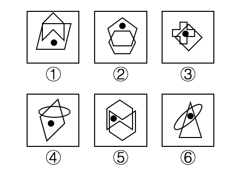
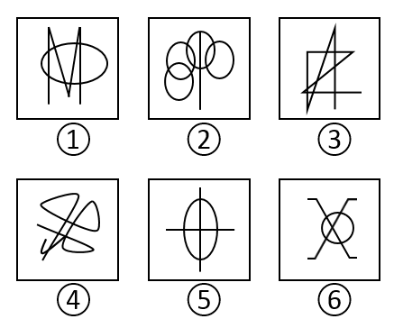
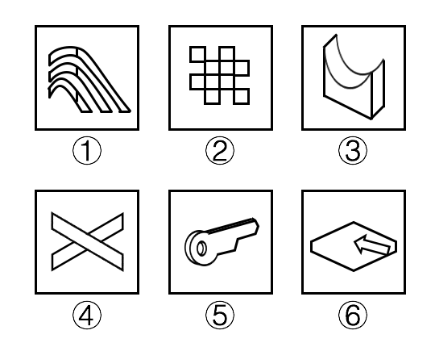
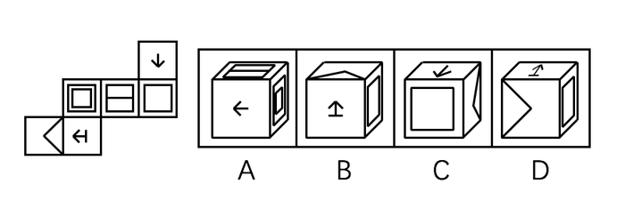
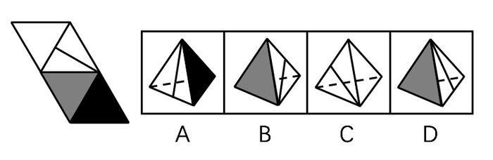
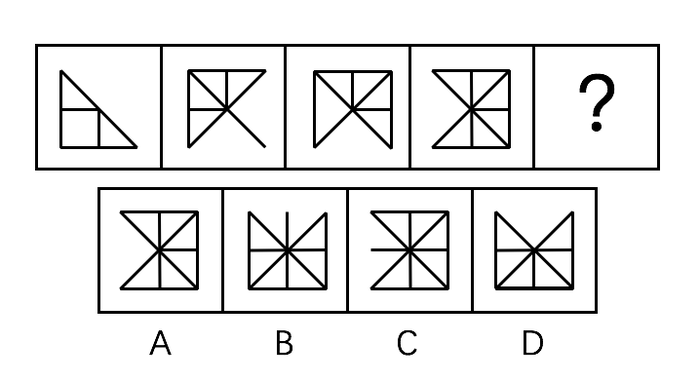

# 2018年浙江省公务员录用考试《行测》题（B类）（网友回忆版）

> 判断推理 · 40 题 · 浙江 2018

## 第 1 题　qid 2144516 · 图形推理

把下面的六个图形分为两类，使每一类图形都有各自的共同特征或规律，分类正确的一项是：

- **A**. ①④⑤，②③⑥
- **B**. ①④⑥，②③⑤
- **C**. ①②④，③⑤⑥　✅
- **D**. ①⑤⑥，②③④

**答案**：C

**官方解析**

本题为分组分类题目。题干每幅图形中均有黑点，考虑功能元素的标记作用。观察发现，图①②④中黑点的位置在两个图形相交的外部，图③⑤⑥中黑点的位置在两个图形相交的内部，因此图①②④为一组，图③⑤⑥为一组。
故正确答案为C。

---

## 第 2 题　qid 2144523 · 图形推理

把下面的六个图形分为两类，使每一类图形都有各自的共同特征或规律，分类正确的一项是：

- **A**. ①②③，④⑤⑥　✅
- **B**. ①③④，②⑤⑥
- **C**. ①②⑤，③④⑥
- **D**. ①④⑤，②③⑥

**答案**：A

**官方解析**

元素组成不同，且无属性规律，考虑数量规律。观察发现，图②是由很多相交圆组成，且图⑤和图⑥是明显的“田”字变形图，因此考虑笔画数。①②③均为一笔画图形，④⑤⑥均为两笔画图形。
故正确答案为A。

---

## 第 3 题　qid 2144525 · 图形推理

把下面的六个图形分为两类，使每一类图形都有各自的共同特征或规律，分类正确的一项是：

- **A**. ①③④，②⑤⑥
- **B**. ①⑤⑥，②③④
- **C**. ①④⑤，②③⑥
- **D**. ①③⑤，②④⑥　✅

**答案**：D

**官方解析**

元素组成不同，优先考虑属性规律。观察发现①③⑤图形中既包含直线又包含曲线，而②④⑥图形都是全直线图形，故图①③⑤为一组，图②④⑥为一组。
故正确答案为D。

---

## 第 4 题　qid 2144527 · 图形推理

左边给定的是纸盒外表面的展开图，右边哪一项能由它折叠而成？

- **A**. A　✅
- **B**. B
- **C**. C
- **D**. D

**答案**：A

**官方解析**

本题为空间重构题目。


A项：由面a、b、c组成，与题干一致，当选；

B项：由面d、e、f组成，题干面f中箭头右侧挨着面b，而该选项面f的箭头右侧挨着面d，与题干不一致，排除；

C项：由面a、d、e组成，题干面e的三角形右侧（图中标红线处）挨着面b，而该选项面e的三角形右侧（即蓝线处）挨着面a，与题干不一致，排除；


D项：由面d、e和f组成，题干中面f的箭头右侧挨着面b，而该选项面f的箭头右侧挨着面d，与题干不一致，排除。


故正确答案为A。


---

## 第 5 题　qid 2144543 · 图形推理

左边给定的是纸盒外表面的展开图，右边哪一项能由它折叠而成？

- **A**. A
- **B**. B　✅
- **C**. C
- **D**. D

**答案**：B

**官方解析**

本题为四面体的空间重构题目。四个选项均有含一条直线的面，且该面有唯一点（如下图中绿色点所示），故以这点为起点开始顺时针画边。如下图所示。



A项：边1对应的是黑色面，而题干边1对应的是灰色面，与题干不一致，排除；


B项：选项与题干一致，当选；


C项：边3对应的是白色面，而题干边2对应的是白色面，与题干不一致，排除；


D项：边3对应的是灰色面，而题干边1对应的是灰色面，与题干不一致，排除。


故正确答案为B。


---

## 第 6 题　qid 2144549 · 图形推理

请从所给的四个选项中，选择最合适的一个填入问号处，使之呈现一定的规律性。

- **A**. A
- **B**. B　✅
- **C**. C
- **D**. D

**答案**：B

**官方解析**

整体观察图形发现规律不明显，对比图一和图二发现，图1顺时针旋转且增加一条线变成图2，同理，题干图形均是后一幅图在前一幅图的基础上顺时针旋转且每次增加一条线，因此？处图形应在前一个图形基础上顺时针旋转且增加一条线，只有B项满足。

故正确答案为B。

---

## 第 7 题　qid 2144553 · 图形推理

下边四个图形中，只有一个是由上边的四个图形拼合而成的，请把它找出来。

- **A**. A
- **B**. B　✅
- **C**. C
- **D**. D

**答案**：B

**官方解析**

本题为平面拼合，可以采用平行等长的方法进行拼合，如下图所示：


故正确答案为B。

---

## 第 8 题　qid 2144555 · 图形推理

请从所给的四个选项中，选择最合适的一个填入问号处，使之呈现一定的规律性。

- **A**. A
- **B**. B
- **C**. C
- **D**. D　✅

**答案**：D

**官方解析**

元素组成相同，优先考虑位置规律。九宫格横着看没有明显规律，考虑竖着看。

第一列中，图1整体旋转得到图2，图2整体上下翻转得到图3；经验证，第三列满足此规律；第二列应用此规律，将图1整体旋转或图3整体进行上下翻转均可，只有D项满足。

故正确答案为D。

---

## 第 9 题　qid 2144528 · 图形推理

请从所给的四个选项中，选择最合适的一个填入问号处，使之呈现一定的规律性。

- **A**. A
- **B**. B
- **C**. C　✅
- **D**. D

**答案**：C

**官方解析**

元素组成不同，属性没有明显规律，考虑数量规律。题干每幅图均由直线和曲线组成，交点和面明显，观察九宫格每幅图交点数并没有规律，考虑面数量。第一行每幅图面数量分别为0、1、2个，第二行每幅图面数量分别为2、3、4个，均构成等差数列；第三行每幅图面数量分别为4、5个，问号处图形的面数量应为6个。A项5个，B项0个，C项6个，D项3个，只有C项符合。
故正确答案为C。

---

## 第 10 题　qid 2144539 · 图形推理

请从所给的四个选项中，选择最合适的一个填入问号处，使之呈现一定的规律性。

- **A**. A　✅
- **B**. B
- **C**. C
- **D**. D

**答案**：A

**官方解析**

元素组成不同，优先考虑属性规律。题干图形对称性明显，九宫格第一行图形对称轴都为0条、第二行图形对称轴都为1条、第三行前两幅图形对称轴都为2条，因此？处也应填入对称轴为2条的图形，只有A项符合。
故正确答案为A。

---

## 第 11 题　qid 2144583 · 定义判断

缔约过失责任是指在合同订立过程中，一方因违背其依据诚实信用原则所产生的义务，而致另一方的信赖利益受损，应承担损害赔偿责任；另一方因信赖合同的成立和有效，但由于合同不成立或无效而蒙受不利益，此种不利益即为信赖利益的损失。
根据上述定义，下列各项中甲方无需承担缔约过失责任的是：

- **A**. 甲乙双方磋商共同兴建制药厂，甲方以技术出资，并提出乙方需培训相关人员后，方能与乙方签约。乙方出资100万元培训了相关人员后，甲方发现乙方制药技术存在问题，中止了与乙方的合作　✅
- **B**. 甲方声称有一批优质紫檀木欲出售给乙方，乙方立即与丙方签订了一份紫檀木家具供货协议，并向丙方支付了保证金。结果乙方在与甲方签约前发现甲方欲出售的紫檀木是假冒的
- **C**. 甲方欲以50万元的价格将自己的房子卖给乙方，要求乙方在10天内以现金购买。乙方为筹集房款，将新买的汽车以极低的价格卖掉，第9天去购房时，甲方已将房子卖与丙方并已办理了过户手续
- **D**. 甲方为报复乙方，声称欲以高价购买乙方的一批水果。乙方本有意将水果卖给丙方，遂中止了与丙方的协商。结果甲方在签约前反悔，致使乙方的水果未能及时卖出而腐烂

**答案**：A

**官方解析**

第一步：找出定义关键词。
“合同订立过程中”、“一方因违背其依据诚实信用原则所产生的义务，而致另一方的信赖利益受损”、“另一方因信赖合同的成立和有效，但由于合同不成立或无效而蒙受不利益” 。
第二步：逐一分析选项。
A项：因为“甲方发现乙方制药技术存在问题”解除了合同，没有体现违背诚实信用原则，且也没有体现出“因信赖合同的成立和有效，但由于合同不成立或无效而蒙受不利益”，不符合定义，当选；
B项：“甲方欲出售的紫檀木是假冒的”，属于定义中的“一方因违背其依据诚实信用原则所产生的义务”，符合定义，排除；
C项：甲方欲以50万元将自己的房子卖给乙方，要求乙方在10天内现金购买，乙方信任了甲方的话，为了买房子，将新买的汽车以极低的价格卖掉，第9天去购房时，甲方已将房子卖与丙方，乙方产生的损失即是“另一方因信赖合同的成立和有效，但由于合同不成立或无效而蒙受不利益”，符合定义，排除；
D项：甲方为了报复乙方，声称欲以高价购买乙方的一批水果，结果甲方在签约前反悔，导致乙造成了损失，符合定义中的“一方因违背其依据诚实信用原则所产生的义务”，符合定义，排除。
本题为选非题，故正确答案为A。

---

## 第 12 题　qid 2144585 · 定义判断

当人们对一事物持某种态度时，不管该事物是有形的还是无形的，都被称为态度标的物。
根据上述定义，下列对态度标的物理解不正确的是：

- **A**. 小李对刚买的一件首饰不满意。小李的态度标的物是首饰
- **B**. 老刘说，这酒真不好喝。老刘的态度标的物是酒
- **C**. 小王对导游的服务不满。小王的态度标的物是导游　✅
- **D**. 老张厌恶儿子的“啃老”行为。老张的态度标的物是“啃老”行为

**答案**：C

**官方解析**

第一步：找出定义关键词。
“对一事物持某种态度时”、“不管该事物是有形的还是无形的” 。
第二步：逐一分析选项。
A项：小李对刚买的一件首饰持不满意的态度，所以小李的态度标的物是首饰，符合定义，排除；
B项：老刘感觉酒不好喝，对酒持不满意的态度，所以老刘的态度标的物是酒，符合定义，排除；
C项：小王对导游的服务持不满意的态度，小王的态度标的物是导游的服务，而不是导游，不符合定义，当选；
D项：老张厌恶儿子的“啃老”行为，对“啃老”行为持不满的态度，老张的态度标的物是“啃老”行为，符合定义，排除。
本题为选非题，故正确答案为C。

---

## 第 13 题　qid 2144588 · 定义判断

近因效应是指新出现的具有对立意义的刺激能够把人们心目中已有的印象反转为对立的印象。
根据上述定义，下列情形符合近因效应的是：

- **A**. 自从老王到养老院做志愿者后，同事们就对他刮目相看
- **B**. 小林的学习成绩不太好，但是羽毛球水平很高，同学们很羡慕他
- **C**. 一家口碑良好的企业偷税漏税的丑闻被曝光后，公众指责其为“无良企业”　✅
- **D**. 医疗事故发生后，医院诚恳地向患者家属道歉并减免了医药费，家属表示愿意谅解

**答案**：C

**官方解析**

第一步：找出定义关键词。
“新出现的具有对立意义的刺激”、“把人们心目中已有的印象反转为对立的印象”。
第二步：逐一分析选项。
A项：老王到养老院做志愿者后同事们对他刮目相看，没有出现具有对立意义的刺激，同事心目中的印象发生变化，而非反转为对立的印象，不符合定义，排除； 
B项：小林学习成绩不太好，但是羽毛球水平很高，没有出现新的刺激，同学们很羡慕小林，印象也没有发生变化，不符合定义，排除；
C项：企业偷税漏税的丑闻被曝光，属于新出现的具有对立意义的刺激，人们对企业的印象从“口碑良好”转变成“无良企业”，属于把人们心目中已有的印象反转为对立的印象，符合定义，当选；
D项：医疗事故发生后，家属谅解了医院，表明家属心目中对医院原有的印象没有反转为对立的印象，不符合定义，排除。
故正确答案为C。

---

## 第 14 题　qid 2144573 · 定义判断

胖尾效应是指统计学意义上的极端情况一反常态地经常出现的现象。
根据上述定义，下列现象属于胖尾效应的是：

- **A**. 幸福小区的福利彩票投注站接连5期都出了一等奖　✅
- **B**. 今年J省高考的文理科状元都是女生，大家不禁感慨现在男生真的考不过女生了
- **C**. 受厄尔尼诺现象影响，我国南方多地都出现了百年一遇的大暴雨
- **D**. 本届乒乓球比赛中，上届冠军老王发挥失常，居然首轮就被淘汰出局，让人大跌眼镜

**答案**：A

**官方解析**

第一步：找出定义关键词。
“统计学意义上的极端情况一反常态地经常出现的现象” 。
第二步：逐一分析选项。
A项：福利彩票中一等奖是低概率的随机事件，属于极端情况，幸福小区彩票投注站接连5期出了一等奖，属于统计学意义上的极端情况一反常态地经常出现的现象，符合定义，当选； 
B项：J省高考的文理科状元都是女生，不属于极端情况，不符合定义，排除；
C项：南方地区出现百年一遇的大暴雨，属于极端情况，但并没有一反常态地经常出现，不符合定义，排除；
D项：上届冠军老王发挥失常，不属于极端情况，不符合定义，排除。
故正确答案为A。

---

## 第 15 题　qid 2144575 · 定义判断

布雷斯悖论现象是指在一个交通网络上增加一条路段不仅没有减少交通延滞，反而使整个交通网络上所有出行者的出行时间都增加的现象。
根据上述定义，下列属于布雷斯悖论现象的是：

- **A**. H市在拆除了一条6车道高速路，修建成一个方圆8千米的公园后，很多道路专家惊讶地发现，城市环境改善了，交通状况也没有恶化
- **B**. 为缓解交通拥堵，G市将市内主干道相连的几条单行线改为双向通行，结果交通事故明显增多，堵车情况进一步恶化
- **C**. N市在城区主干道下方又修建了一条地下隧道，由于入口处和出口处交通汇集，隧道建成后交通反较之前更为拥堵　✅
- **D**. W市新建了两条贯通城市东-西、南-北的双向4车道柏油马路后，市内交通不再像以前那么拥堵了

**答案**：C

**官方解析**

第一步：找出定义关键词。
“一个交通网络上增加一条路段”、“没有减少交通延滞”、“整个交通网络上所有出行者的出行时间都增加”。
第二步：逐一分析选项。
A项：H市拆除了一条高速路，修建一座公园，没有增加一条路段，不符合定义，排除； 
B项：G市将市内主干道相连的几条单行线改为双向通行，没有增加一条路段，不符合定义，排除；
C项：N市修建了一条地下隧道，属于增加一条路段，隧道建成后交通反较之前更为拥堵，属于没有减少交通延滞，反而使所有出行者的出行时间都增加，符合定义，当选；
D项：W市新建了两条4车道柏油马路后，市内交通不再像以前那么拥堵了，减少了交通延滞，不符合定义，排除。
故正确答案为C。

---

## 第 16 题　qid 2144578 · 定义判断

过度合理化效应是指给人们报酬让他们做自己喜欢的事会让他们将其行为归因于报酬，这样就会削弱他们的自我知觉——因为兴趣而去做。
根据上述定义，下列情形属于过度合理化效应的是：

- **A**. 小李抢救落水儿童，被见义勇为基金会奖励1万元
- **B**. 某收视率低的电视节目以大奖吸引观众，冲着大奖而来的观众越来越多
- **C**. 随着公司效益的提高，员工因奖金没有相应提高而多有怨言
- **D**. 妈妈为鼓励爱画画的小明，画一幅画奖励他10元钱，小明画得更多却有些潦草了　✅

**答案**：D

**官方解析**

第一步：找出定义关键词。
“给报酬”、“做自己喜欢做的事”、“削弱自我知觉”。
第二步：逐一分析选项。
A项：小李抢救落水儿童后被奖励1万元，属于事后的奖励，而非事先给的报酬让他去做，不符合定义，排除； 
B项：该节目收视率低说明爱看的人少，观众是冲着大奖观看电视节目，而非自己原本喜欢看这个电视节目，不符合定义，排除；
C项：员工因奖金没有相应提高而多有怨言，不符合给报酬做自己喜欢的事情，不符合定义，排除；
D项：小明原本就爱画画，妈妈每幅画给小明10元作为报酬，但最后原本爱画画的小明画的更多却潦草了，说明之后小明画更多的画作是为了多拿钱，削弱了小明本身对画画的兴趣，符合定义，当选。
故正确答案为D。

---

## 第 17 题　qid 2144557 · 定义判断

防御中的攻势行动是指在有利的时机和态势下，防御部队采取的进攻性行动。
根据上述定义，下列军事行动不属于防御中的攻势行动的是：

- **A**. 对突入阵地之敌实施冲击，消灭突入之敌，改善或恢复防御态势
- **B**. 防御的军队对小股进攻之敌实施主动攻击，击退敌人的进攻
- **C**. 直接抗击敌人冲击的分队，对冲击受挫滞留于阵地前沿之敌实施主动攻击，以出击消灭敌人，稳定防御态势
- **D**. 被包围的部队组织精干小分队，跳出包围圈，插到敌人侧后袭扰敌人，钳制围攻之敌　✅

**答案**：D

**官方解析**

第一步：找出定义关键词。
“在有利的时机和态势下”、“防御部队”、“采取进攻性行动”。
第二步：逐一分析选项。
A项：对突入阵地之敌冲击，并且能够消灭敌人，是在有利的时机和态势下进攻，改善或恢复防御态势，也体现了是防御部队的进攻，符合定义，排除； 
B项：敌军是小股进攻，说明是在有利的时机和态势下，且防御军队进行了主动的进攻性行动，符合定义，排除；
C项：敌人已经遭受冲击受挫，属于有利的时机和态势，并且是为了稳定防御态势主动攻击，符合定义，排除；
D项：部队处于被包围的情况，不符合有利的时机和态势，同时，该部队组织及其组织的精干小分队是否为防御部队也不明确，不符合定义，当选。
本题为选非题，故正确答案为D。

---

## 第 18 题　qid 2144559 · 定义判断

鸟笼效应是一个心理学概念，它是指人们会在偶然获得一件原本不需要的物品的基础上，继续添加更多与之相关而自己不需要的东西。
根据上述定义，下列符合鸟笼效应的是：

- **A**. 雯雯在网上购物，为了参与“满减”活动比预期多买了好几件商品
- **B**. 刘阿姨去超市买菜，发现清洁用品正好在打折，忍不住买了一堆
- **C**. 丽丽买裙子送了条毛衣链，她觉得没有毛衣可以搭配，又买了件毛衣，但却从没穿过　✅
- **D**. 小玲的男朋友送了她一束花，她很开心，还专门去买了个漂亮的花瓶

**答案**：C

**官方解析**

第一步：找出定义关键词。
“偶然获得”、“不需要的物品”、“继续添加与之相关而不需要的东西”。
第二步：逐一分析选项。
A项：雯雯为了参与活动多买了好几件商品，不符合题干所说的偶然获得一个不需要的物品然后继续添置不需要的东西，不符合定义，排除； 
B项：刘阿姨发现清洁商品打折买了一堆，不符合题干所说的偶然获得一个不需要的物品然后继续添置不需要的东西，不符合定义，排除；
C项：丽丽买裙子送了条毛衣链，说明毛衣链是偶然所得，然后因为这个毛衣链丽丽又买了件毛衣却从没穿过，说明在偶然所得后又继续添置了不需要的东西，符合定义，当选；
D项：小玲的男朋友送了一束花，她很开心，并专门买了漂亮花瓶，说明花和花瓶并不是她不喜欢不需要的东西，不符合定义，排除。
故正确答案为C。

---

## 第 19 题　qid 2144562 · 定义判断

完全归纳推理又称完全归纳法，是以某类中每一对象(或子类)都具有或不具有某一属性为前提，推出该类对象全部具有或不具有该属性为结论的归纳推理。
根据上述定义，下列属于完全归纳推理的是：

- **A**. 美国居民的祖先都是从国外迁徙来的。早期的居民是美洲印第安人，他们是几千年前从亚洲迁徙来的。后来的居民是欧洲人，他们是在250年至350年前作为殖民地开拓者来到这里的　✅
- **B**. 在很早的时候，中国就发明了指南针、造纸术、活字印刷术和火药，所以，中国是世界文明发展最早的国家之一
- **C**. 凡有所学，皆成性格。读书使人充实，讨论使人机智，笔记使人准确，读史使人明智，读诗使人灵秀，数学使人周密，物理使人深刻，伦理使人庄重
- **D**. 世界各国人民历来就相互进行科技的引进和交流。西方国家引进了中国古代的“四大发明”；日本的明治维新，主要是引进了欧洲的技术；今天许多国家种植的玉米、马铃薯，都是美洲印第安人培育出来的

**答案**：A

**官方解析**

第一步：找出定义关键词。
“以某类中每一对象(或子类)都具有或不具有某一属性为前提”、“推出该类对象全部具有或不具有该属性为结论”。
第二步：逐一分析选项。
A项：全部情况的结论为美国居民的祖先都是从国外迁徙来的，其前提包括了美国早期的居民和后来的居民是从国外迁徙来的，早期居民和后来居民构成了美国居民中的所有子类，符合定义，当选； 
B项：前提是很早的时候中国就有了四大发明，结论是中国是世界文明发展最早的国家之一，而中国并不能构成世界所有国家的所有子类，其他国家的发明时间未知，不符合定义，排除；
C项：全部情况的结论为凡有所学，皆成性格，其前提包括了读书、讨论、笔记、读史等能够使人形成不同的性格，而读书、讨论、笔记、读史并不是凡有所学的全部对象，不符合定义，排除；
D项：全部情况的结论为世界各国人民互相引进，其前提包括了西方国家引进“四大发明”、日本明治维新引进欧洲技术、许多国家引进印第安人培育的玉米等例子，而后者并不是互相引进的全部对象，不符合定义，排除。
故正确答案为A。

---

## 第 20 题　qid 2144564 · 定义判断

体验式教学是指通过创造实际的情境和机会，呈现或再现、还原教学内容，使学生在亲历的过程中理解并建构知识、发展能力、产生情感、生成意义的教学观和教学形式。
根据上述定义，下列不属于体验式教学的是：

- **A**. 在详细讲解了相关的知识要领和操作程序后，教练坐到了副驾驶的位置，换小李坐上驾驶位，开车上路
- **B**. 教授《股票原理》课程的赵教授要求每位学生以3000元本金开设一个股票账户，学期结束时以交易的次数和账户余额评定成绩
- **C**. 某大学策划了“重走长征路，祖国在我心”爱国主义教育活动，分批组织学生重走当年红军长征时爬过的雪山、走过的草地
- **D**. 为了帮助学生摆脱“哑巴式英语”的困境，王老师用心搜集了大量原汁原味反映英国人日常生活交际的视频供学生观摩　✅

**答案**：D

**官方解析**

第一步：找出定义关键词。
“通过创造实际的情境和机会”、“呈现或再现、还原教学内容”、“使学生在亲历的过程中理解并建构知识、发展能力、产生情感、生成意义”。
第二步：逐一分析选项。
A项：让小李坐上驾驶位是创造实际的情境和机会的做法，可以使小李在亲历的过程中理解教练讲解的内容，符合定义，排除； 
B项：要求学生开设股票账户，让学生真实地进行交易是创造实际的情境和机会的做法，可以使学生在亲历的过程中对《股票原理》课程内容进行理解，符合定义，排除；
C项：组织学生重走当年红军长征的雪山和草地，通过创造实际的情境再现当年红军长征的艰辛，使学生产生爱国主义情怀，符合定义，排除；
D项：为学生提供反映英国人日常生活交际的视频观摩，而观看视频并没有创造实际的情境和机会让学生亲历，不符合定义，当选。
本题为选非题，故正确答案为D。

---

## 第 21 题　qid 2144565 · 类比推理

潮涨：潮落

- **A**. 出生：死亡
- **B**. 白天：黑夜
- **C**. 开灯：关灯
- **D**. 起飞：降落　✅

**答案**：D

**官方解析**

第一步：判断题干词语间的逻辑关系。
潮涨和潮落是海水的两种状态，涨潮时，海水上涨；退潮时，海水悄然退去。除此之外还有不涨不落的情况，因此题干词语是反对关系，且是一种升降周期变化。
第二步：判断选项词语间的逻辑关系。
A项：出生和死亡是人生开始和结束的两个状态，二者是反对关系，但并非一种周期变化，与题干逻辑关系不一致，排除；
B项：白天和黑夜是一天中的两个时间段，二者是矛盾关系，与题干逻辑关系不一致，排除；
C项：开灯和关灯是灯的不同状态，二者是矛盾关系，与题干逻辑关系不一致，排除；
D项：起飞和降落是飞机的两种状态，升空时，飞机起飞；落地时，飞机降落。除此之外还有停在机场待飞的情况，二者也是反对关系，且是一种升降周期变化，与题干逻辑关系一致，当选。
故正确答案为D。

---

## 第 22 题　qid 2144567 · 类比推理

旗开得胜：马到成功

- **A**. 拨乱反正：沉冤昭雪
- **B**. 牛高马大：虎穴得子
- **C**. 水到渠成：瓜熟蒂落　✅
- **D**. 缘木求鱼：鹰击长空

**答案**：C

**官方解析**

第一步：判断题干词语间的逻辑关系。
旗开得胜比喻事情刚一开始，就取得好成绩，马到成功形容事情顺利，刚开始就取得成功，二者是近义关系。
第二步：判断选项词语间的逻辑关系。
A项：拨乱反正是指消除混乱局面，恢复正常秩序，沉冤昭雪是指沉积很久的冤情得到洗刷，二者并非近义关系，与题干逻辑关系不一致，排除；
B项：牛高马大比喻人长得高大强壮，虎穴得子比喻诗文贴切中肯，且深得其要旨，二者并非近义关系，与题干逻辑关系不一致，排除；
C项：水到渠成比喻有条件之后，事情自然会成功，即功到自然成，瓜熟蒂落指时机一旦成熟，事情自然成功，二者是近义关系，与题干逻辑关系一致，当选；
D项：缘木求鱼比喻方向或办法不对头，不可能达到目的，鹰击长空比喻有雄心壮志的人在广阔的领域中施展自己的才能，二者并非近义关系，与题干逻辑关系不一致，排除。
故正确答案为C。

---

## 第 23 题　qid 2144568 · 类比推理

语言：思想

- **A**. 行为：品格　✅
- **B**. 头部：大脑
- **C**. 粉笔：黑板
- **D**. 纸张：知识

**答案**：A

**官方解析**

第一步：判断题干词语间的逻辑关系。
通过语言可以反映一个人的思想，二者是对应关系。
第二步：判断选项词语间的逻辑关系。
A项：通过行为可以反映一个人的品格，与题干逻辑关系一致，当选；
B项：大脑是头部的一部分，二者是组成关系，与题干逻辑关系不一致，排除；
C项：粉笔可以在黑板上写字，二者是配套使用的关系，与题干逻辑关系不一致，排除；
D项：知识可以印刷在纸张上进行传播，纸张可以作为知识的载体，但纸张不能直接反映知识，反映知识的应该是印在纸张上的文字，与题干逻辑关系不一致，排除。
故正确答案为A。

---

## 第 24 题　qid 2144569 · 类比推理

出口：进口：贸易顺差

- **A**. 征税：纳税：财政收入
- **B**. 买进：卖出：盈利
- **C**. 支出：收入：赤字　✅
- **D**. 还债：借债：债务

**答案**：C

**官方解析**

第一步：判断题干词语间的逻辑关系。
出口大于进口会产生贸易顺差。
第二步：判断选项词语间的逻辑关系。
A项：征税是国家征收税务，纳税是纳税人缴纳税务，只要国家征税了，纳税人纳税了就会产生财政收入，跟二者大小没有关系，与题干逻辑关系不一致，排除；
B项：卖出大于买进会产生盈利，而买进大于卖出产生的是亏损，买进与卖出的顺序与题干顺序相反，与题干逻辑关系不一致，排除；
C项：支出大于收入会产生赤字，与题干逻辑关系一致，当选；
D项：只要借债了就会产生债务关系，借债大于还债会说明还有债没还清，依然存在债务关系，但是还债与借债的顺序与题干顺序相反，与题干逻辑关系不一致，排除。
故正确答案为C。

---

## 第 25 题　qid 2144540 · 类比推理

陆军：空军：作战

- **A**. 播种机：收割机：农业
- **B**. 汽车：轮船：运输　✅
- **C**. 超市：商场：促销
- **D**. 法院：政府：司法

**答案**：B

**官方解析**

第一步：判断题干词语间的逻辑关系。
陆军和空军是两种不同的兵种，二者是并列关系，且陆军和空军都可以用来作战，二者与作战属于功能对应关系。
第二步：判断选项词语间的逻辑关系。
A项：播种机和收割机是两种不同的农作工具，二者是并列关系，但农业不是它们的功能，与题干逻辑关系不一致，排除；
B项：汽车和轮船是两种不同的交通工具，二者是并列关系，且汽车和轮船都可以用来运输，二者与运输属于功能对应关系，与题干逻辑关系一致，当选；
C项：超市和商场是两种不同的购物场所，二者是并列关系，但促销并不是超市和商场的功能，超市和商场是促销的场所，属于场所的对应关系，与题干逻辑关系不一致，排除；
D项：法院和政府是两个不同的单位，二者是并列关系，但司法不是它们的功能，与题干逻辑关系不一致，排除。
故正确答案为B。

---

## 第 26 题　qid 2144542 · 类比推理

大小：轻重：物体

- **A**. 快慢：缓急：时间
- **B**. 真伪：多少：数据　✅
- **C**. 古今：春秋：历史
- **D**. 是非：对错：答案

**答案**：B

**官方解析**

第一步：判断题干词语间的逻辑关系。
大小是指物体的尺寸不同，物体有大小之分，轻重是指物体重量的不同，物体有轻重之分，大小和轻重是用来描述物体的两个角度，二者与物体构成对应关系。
第二步：判断选项词语间的逻辑关系。
A项：快慢形容的是速度大小程度不同，缓急形容的是事情紧要程度不同，二者不是用来描述时间的，与时间不是对应关系，与题干逻辑关系不一致，排除；
B项：真伪即真实的和虚假的，数据有真伪之分，多少是指数量的大小，数据有多少之分，真伪和多少是描述数据的两个角度，二者与数据构成对应关系，与题干逻辑关系一致，当选；
C项：古今是指古代和现代，可以对应历史，但春秋指的是一年当中的两个季节，也可以指历史上的春秋时代，但不能说历史有春秋之分，春秋不能用来描述历史，与题干逻辑关系不一致，排除；
D项：答案有对错之分，但是非是指事情的对与错，无法用来描述答案，与答案不构成对应关系，与题干逻辑关系不一致，排除。
故正确答案为B。

---

## 第 27 题　qid 2144545 · 类比推理

正数：零：负数

- **A**. 中国：日本：美国
- **B**. 干部：群众：党员
- **C**. 熊市：股市：牛市
- **D**. 左边：中间：右边　✅

**答案**：D

**官方解析**

第一步：判断题干词语间的逻辑关系。
大于零的实数是正数，小于零的实数是负数，从正负角度，实数只分为正数、零、负数，没有其他分类，三者是并列关系。
第二步：判断选项词语间的逻辑关系。
A项：中国、日本、美国是三个国家，世界上除了此三个国家还有其他国家，与题干逻辑关系不一致，排除；
B项：干部、群众、党员都是身份，干部和党员之间是交叉关系，党员和群众之间是反对关系，与题干逻辑关系不一致，排除；
C项：股市包含熊市和牛市，与题干逻辑关系不一致，排除；
D项：从左右角度，方位只分为左边、中间、右边，没有其他分类，与题干逻辑关系一致，当选。
故正确答案为D。

---

## 第 28 题　qid 2144547 · 类比推理

基础设施：机场：公路

- **A**. 英特网：内网：外网
- **B**. 国家机关：行政机关：司法机关　✅
- **C**. 儿童片：动画片：卡通片
- **D**. 体育：武术：咏春拳

**答案**：B

**官方解析**

第一步：判断题干词语间的逻辑关系。
机场和公路都是基础设施，二者与基础设施是种属关系，且机场和公路是并列关系中的反对关系。
第二步：判断选项词语间的逻辑关系。
A项：内网和外网都是英特网，但内网和外网是并列关系中的矛盾关系，与题干逻辑关系不一致，排除；
B项：行政机关主要指各级人民政府及其职能部门，司法机关主要指各级人民法院和检察院，二者都是国家机关，与国家机关是种属关系，且行政机关和司法机关是并列关系中的反对关系，与题干逻辑关系一致，当选；
C项：儿童片与动画片是交叉关系，与题干逻辑关系不一致，排除；
D项：咏春拳是一种中国传统武术，二者是种属关系，与题干逻辑关系不一致，排除。
故正确答案为B。

---

## 第 29 题　qid 2144550 · 类比推理

大漠 对于（  ）相当于 草原 对于（  ）

- **A**. 黄沙：蒙古包
- **B**. 干旱：牧场
- **C**. 骆驼：羊　✅
- **D**. 绿洲：雪山

**答案**：C

**官方解析**

逐一代入选项。
A项：黄沙是大漠的组成部分，二者为组成关系，蒙古包建在草原上，二者为对应关系，前后逻辑关系不一致，排除；
B项：干旱是大漠的属性，二者为属性对应，牧场建在草原上，二者为地点对应关系，前后逻辑关系不一致，排除；
C项：骆驼在大漠里生活，二者为主体和地点的对应关系，羊在草原上生活，二者为主体和地点的对应关系，前后逻辑关系一致，当选；
D项：大漠中可能存在绿洲，二者为组成关系，雪山和草原是两种不同的自然景观，二者为并列关系，前后逻辑关系不一致，排除。
故正确答案为C。

---

## 第 30 题　qid 2144552 · 类比推理

（  ）对于 绿化 相当于（  ）对于 丰收

- **A**. 种树；施肥　✅
- **B**. 美化；稻谷
- **C**. 灌溉；收割
- **D**. 园林；乡村

**答案**：A

**官方解析**

逐一代入选项。
A项：种树是为了达到绿化的目的，二者为对应关系，施肥是为了达到丰收的目的，二者为对应关系，前后逻辑关系一致，当选；
B项：绿化是美化的一种，稻谷产量高对应丰收，二者是对应关系，前后逻辑关系不一致，排除；
C项：绿化的过程中是需要灌溉的，丰收之后才需要收割，前后逻辑关系不一致，排除；
D项：园林有植被绿化，二者为对应关系，乡村和丰收没有必然的逻辑关系，前后逻辑关系不一致，排除。
故正确答案为A。

---

## 第 31 题　qid 2144570 · 逻辑判断

某电视综艺节目播出后，节目导演声称该节目达到了当前同类节目的最高水准，因为该节目收视率比同类节目高。

以下哪项如果为真，最能削弱上述论证？

- **A**. 参与该节目的嘉宾对节目评价不一
- **B**. 观众本身就非常喜欢看电视综艺节目
- **C**. 该导演的微博有几十万条批评此节目的评论
- **D**. 节目的水准和收视率并无必然关联　✅

**答案**：D

**官方解析**

第一步：找出论点和论据。

论点：节目达到了当前同类节目的最高水准。

论据：该节目收视率比同类节目高。

第二步：逐一分析选项。

A项：嘉宾的评价与节目的水准无必然联系，无法削弱，排除；

B项：只是表明观众喜欢看电视综艺节目，但并未说明观众是否对于该节目的喜欢程度超过同类型的其他节目，而且观众是否喜欢这个节目和节目的水准无必然的联系，无法削弱，排除；

C项：微博评论与节目的水准无必然联系，无法削弱，排除； 

D项：表明节目的水准和收视率无必然关联，那就说明由论据推不出论点，削弱论证，当选。

故正确答案为D。

---

## 第 32 题　qid 2144572 · 逻辑判断

中国是世界上吸烟人数最多的国家，约的人口吸烟，此外，中国还有7.4亿非吸烟者遭受二手烟危害，控烟迫在眉睫。然而，一方面吸烟者个人在肉体和精神上对烟草存在依赖；另一方面国家税收也部分依赖于烟草产业。如果一下子消灭烟草，不仅吸烟者会有戒断症状，就连国家和各级地方的经济状况也都会出现“戒断症状”。所以，控烟在我国只能是一个渐进的过程。

以下哪项如果为真，不能支持上述论断？

- **A**. 
我国每年死于吸烟相关疾病的人数超过因艾滋病、结核、疟疾所导致的死亡人数之和
　✅
- **B**. 
对吸烟者如果没有慢慢引导和鼓励戒烟的过程，吸烟者戒烟后有极高概率再次吸烟

- **C**. 
从1982年到2012年，我国烟草行业利税占全国财政收入的比重为

- **D**. 
当前实行全面禁烟执行难度大、成本高，难以达到预期的政策效果

**答案**：A

**官方解析**

第一步：找出论点和论据。
论点：控烟在我国只能是一个渐进的过程。
论据：一方面吸烟者个人在肉体和精神上对烟草存在依赖；另一方面国家税收也部分依赖于烟草产业。如果一下子消灭烟草，不仅吸烟者会有戒断症状，就连国家和各级地方的经济状况也都会出现“戒断症状”。
第二步：逐一分析选项。
A项：死于吸烟相关疾病的人数多，只是在论述吸烟带来的危害，与论点论据无关，无法加强，当选；
B项：如果没有慢慢的引导，吸烟者戒烟后再次吸烟的概率很高，那就说明戒烟是需要慢慢引导的过程，进而说明控烟应该是一个渐进的过程，补充论据进行加强，排除；
C项：说明烟草税收占比大，即“国家税收也部分依赖于烟草产业”，重复论据进行加强，排除；
D项：全面禁烟难度大、成本高，难以达到效果，说明控烟只能是一个渐进的过程，补充论据进行加强，排除。
本题为选非题，故正确答案为A。

---

## 第 33 题　qid 2144571 · 逻辑判断

所有市民都迫切希望加强城市绿化，但是需要市民们为一个绿化方案付费时，总有一些人认为即使他们不出钱也能享受到绿化的好处，所以他们拒绝承担费用。
以下哪项如果为真，是上述论证所需的前提？

- **A**. 这些人喜欢占小便宜
- **B**. 这些人认为绿化应该由政府出资
- **C**. 为绿化方案出钱具有强制性
- **D**. 这些人认为总有人会付费　✅

**答案**：D

**官方解析**

第一步：找出论点和论据。
论点：他们拒绝承担费用。
论据：总有一些人认为即使他们不出钱也能享受到绿化的好处。
第二步：逐一分析选项。
A项：这些人喜欢占小便宜，因此拒绝承担绿化费用，补充论据加强，保留；
B项：这些人认为绿化应该由政府出资，因此拒绝承担绿化费用，补充论据加强，保留；
C项：为绿化方案出钱具有强制性，那这些人就无法拒绝承担费用，不能加强，排除； 
D项：这些人认为总有人会付费，因此拒绝承担绿化费用，补充论据加强，保留。
比较A、B、D项，D项为论点成立的必要条件，因为如果所有人都不付费，那这些人就不能拒绝承担费用了。而A、B项均不是论点成立的必要条件，即使这些人不喜欢占小便宜，也可以拒绝承担绿化费用；同理，即使绿化不由政府出资，由其他市民买单，这些人也能不出钱就享受绿化的好处。前提假设的题目正确选项只有两种，一个是搭桥，一个是必要条件。
故正确答案为D。

---

## 第 34 题　qid 2144602 · 逻辑判断

航天器经过大气层返回地球时，会与大气层摩擦导致温度急剧升高。为使航天器克服“热障”安全返回地球，国外某研究机构在回收微小卫星EGG上做了新的技术尝试。EGG在下降过程中张开由二氧化碳充气扩张而成的半球形隔热减速伞，之后其受到的大气阻力显著增加，开始缓慢进入大气层并顺利落向地球。
上述技术尝试基于的前提是：

- **A**. 航天器表层材料需具备耐受超高温的性能
- **B**. 研究航天器耐热材料的成本比减速伞成本要高
- **C**. 航天器落入大气层时过热是下降过程的常见难题
- **D**. 航天器以较慢速度进入地球可减少摩擦导致的发热　✅

**答案**：D

**官方解析**

第一步：找出论点和论据。
论点：减速伞技术可以克服航天器“热障”，使其安全返回地球。
论据：EGG在下降过程中张开由二氧化碳充气扩张而成的半球形隔热减速伞，之后其受到的大气阻力显著增加，开始缓慢进入大气层并顺利落向地球。
第二步：逐一分析选项。
A项：指出航天器表层材料需具备耐受超高温的性能，与题干中的技术尝试无关，属于无关项，排除；
B项：指出耐热材料与减速伞的成本差异，但论点讨论的是减速伞技术可以克服航天器“热障”问题，二者讨论的话题不一致，属于无关选项，排除；
C项：指出航天器过热是下降过程中的难题，但论点讨论的是减速伞技术可以克服航天器“热障”问题，二者讨论的话题不一致，属于无关选项，排除； 
D项：指出航天器以慢速进入地球会减少摩擦生热情况，而减速伞技术可以使航天器降低下降速度，也就是可以起到保护作用，即在慢速与减热之间进行搭桥，当选。
故正确答案为D。

---

## 第 35 题　qid 2144605 · 逻辑判断

有专家指出，判断名优白酒的真伪有简单的办法：价格低得离谱的名优白酒肯定都是假的，凡是打着某一名优白酒旗号在外公开销售的定制酒都是假的。而消费者如果从正规渠道购买，就能买到真的好酒，这些渠道一是正规超市或大卖场；二是名优白酒品牌授权的旗舰店；三是名优白酒企业的官网电商。
以下哪项如果为真，最能质疑专家的观点？

- **A**. 有些大卖场对进场商品的把关并不严格，销售假冒伪劣商品的情况时有发生　✅
- **B**. 现今网络诈骗案件屡屡发生，假冒名优白酒企业官网销售的白酒肯定是假的
- **C**. 某电视促销节目主持人声称，他们销售的名优白酒虽然只有市价的一半，但绝对不是假酒
- **D**. 某名优白酒企业生产的定制酒只用于企业内部接待，但它是真的

**答案**：A

**官方解析**

第一步：找出论点和论据。
论点：判断名优白酒的真伪有简单的办法：价格低得离谱的名优白酒肯定是假的，凡是打着某一名优白酒旗号在外公开销售的定制酒都是假的。在正规渠道购买的就能买到真的好酒。
论据：无。
第二步：逐一分析选项。
A项：指出有些大卖场对进场商品把关不严格，会出现假冒伪劣商品，那就是在正规渠道购买的名优白酒，也会出现假酒的情况，否定论点，当选；
B项：指出假冒名优白酒企业官网销售的白酒是假酒，但没办法证明专家说的三种判断白酒真假的方法是不对的，不能削弱，排除；
C项：某电视促销节目主持人声称，价格低于市价一半的名优白酒绝对不是假酒，只是主持人说是真酒，但是并不能保证这种酒的真假，属于不明确选项，排除； 
D项：指出某名优白酒企业生产的定制酒只用于企业内部接待，但它是真的，表明这种酒并没有在外公开销售，说明打着该企业旗号在外公开销售的定制酒都是假的，有加强的力度，排除。
故正确答案为A。

---

## 第 36 题　qid 2144608 · 逻辑判断

图灵测试是图灵于1950年提出的一个著名试验，用于测试某机器是否能表现出与人相同或无法区分的智能。一个人（代号C）使用测试对象都能理解的语言去询问两个他无法看见的对象任意一串问题，对象分别为机器（代号A）和正常思维的人（代号B）。如果经过若干询问以后，C不能分辨A与B的实质区别，则此机器A通过图灵测试。
以下哪项如果为真，不能质疑图灵测试的有效性？

- **A**. 两个人面对同一台机器，测试结果可能不同；即便是同一个人面对同一台机器，两次测试的结果也会不同
- **B**. 即便图灵测试告诉了我们结果，我们还是会用一套人类的标准判断一个机器是否具备智能　✅
- **C**. 通过测试的机器并不能感知或者掌握人类的隐藏情绪，比如反语、双关、讽刺和谎言
- **D**. 人类的智能要素可以分解为洞察力、逻辑推理能力等方面，而通过测试的机器只具备基于正确逻辑和策略做判断的能力

**答案**：B

**官方解析**

第一步：找出论点和论据。
论点：图灵测试能够测试某机器是否能表现出与人相同或无法区分的智能。
论据：如果经过若干询问以后，C不能分辨A与B的实质区别，则此机器A通过图灵测试。
第二步：逐一分析选项。
A项：说明对于机器的测试是不可信的，可以削弱，排除；
B项：该项说的是得到结果后，我们还是会用一套人类的标准去判断一个机器是否具备智能，那图灵测试的结果是否有效，不确定，所以该项不能削弱，当选；
C项：该项说明图灵测试不能感知或者掌握人类的隐藏情绪，说明结果可能不靠谱，可以削弱，排除； 
D项：该项说明人类智能要素由多方面能力组成，而图灵测试的机器只具备基于正确逻辑和策略做判断的能力，说明根据结果不能判断机器是否能表现出与人相同或无法区分的智能，可以削弱，排除。
本题为选非题，故正确答案为B。

---

## 第 37 题　qid 2144574 · 逻辑判断

数百年来，人类一直想要对深海生物有更深的认识。各地流传的神话故事中，几乎都会讲到深海巨怪。希腊、挪威等国的许多有关人类探索海域的神话中，随处可见海蛇、大乌贼、巨鲨的存在。由此可见，在深海中，确实有不为人知的海底巨型生物。
以下哪项如果为真，最能加强上述论证？

- **A**. 深海是传说中动物的最佳住所
- **B**. 神话有很多是虚构的，并不可信
- **C**. 深海相机确实拍摄到了生活在深海中的生物
- **D**. 不同地域神话中的相似内容往往是现实的真实反映　✅

**答案**：D

**官方解析**

第一步：找出论点和论据。
论点：在深海中，确实有不为人知的海底巨型生物。
论据：希腊、挪威等国的许多有关人类探索海域的神话中，随处可见海蛇、大乌贼、巨鲨的存在。
第二步：逐一分析选项。
A项：深海是传说中动物的最佳住所，“传说中”并不能说明在深海中是否真的有这些动物，不能加强，排除；
B项：神话有很多是虚构的，并不可信，说明不能由论据中的神话传说推出论点中的真实情况，可以削弱，无法加强，排除；
C项：深海相机确实拍摄到了生活在深海中的生物，这些生物是否是“不为人知的海底巨型生物”不确定，不能加强，排除； 
D项：不同地域神话中的相似内容往往是现实的真实反映，也就是说由希腊、挪威等国的神话中都有海蛇、大乌贼、巨鲨，可以推出现实深海中很可能有这些不为人知的海底巨型生物，将论点和论据进行了搭桥，可以加强，当选。
故正确答案为D。

---

## 第 38 题　qid 2144576 · 逻辑判断

由于近期世界范围内各种传染病疫情多发，我国必须在今后五年的时间里增加的财政投入用于疫苗研制和卫生防疫工作，否则就无法有效应对大面积疫情出现的情况。事实上，从目前我国医疗科研现状来看，如果能增加的财政投入，那么我国疫苗研制就能达到世界先进水平。

由此可以推出：

- **A**. 
未来五年内如果不能增加的财政投入用于疫苗研制和卫生防疫工作，我国就无法有效应对大面积疫情的出现
　✅
- **B**. 
未来五年内疫苗研制如果达到世界先进水平，我国就不会爆发大面积疫情

- **C**. 
如果世界各国不爆发传染病疫情，我国就不需要增加医疗投入以应对大面积疫情

- **D**. 
未来五年内如果增加的财政投入，可有效改善我国的医疗科研水平

**答案**：A

**官方解析**

第一步：翻译题干。

①有效应对大面积疫情出现的情况→今后五年的时间里增加的财政投入用于疫苗研制和卫生防疫工作

②增加的财政投入→我国疫苗研制就能达到世界先进水平

第二步：逐一分析选项。

A项翻译：- 未来五年内增加的财政投入用于疫苗研制和卫生防疫工作→ - 我国有效应对大面积疫情的出现，否定了翻译①的箭头后，推出否定翻译①的箭头前，可以推出，当选；

B项翻译：未来五年内疫苗研制达到世界先进水平 → - 我国爆发大面积疫情，题干说的是能不能有效应对大面积疫情出现的情况，没有涉及是否会爆发大面积疫情，无关项，排除；

C项翻译：-世界各国爆发传染病疫情 → - 我国需要增加医疗投入以应对大面积疫情，世界各国爆发传染病疫情与我国是否需要增加医疗投入以应对大面积疫情，是因果关系，不存在推出关系，排除； 

D项翻译：未来五年内增加的财政投入 → 可有效改善我国的医疗科研水平，题干没有涉及有效改善我国的医疗科研水平，无关项，排除。

故正确答案为A。

---

## 第 39 题　qid 2144577 · 逻辑判断

如果不学习电吉他，阿健就当不了乐队主唱；如果他想玩乐器，他会选择学习电吉他；如果他不玩乐器，他就当主唱。
由此可以推出，阿健将：

- **A**. 当主唱
- **B**. 学习电吉他　✅
- **C**. 不学习电吉他
- **D**. 不当主唱

**答案**：B

**官方解析**

第一步：翻译题干。

①电吉他主唱；

②乐器电吉他；

③乐器主唱。

将①逆否可得“主唱电吉他”，结合③可递推出：④乐器主唱电吉他。

第二步：根据题干条件进行推理。

结合②和④，根据二难推理“如果AB，AB，那么B一定为真”，可推出“电吉他”一定为真，即阿健一定学习电吉他，对应B项。

故正确答案为B。

---

## 第 40 题　qid 2144579 · 逻辑判断

某公司招聘时有张三、李四、王五、赵六、钱七5人入围。从学历看，有2人为硕士、3人为博士；从性别看，有3人为男性、2人为女性。已知，张三、王五性别相同，而赵六、钱七性别不同；李四与钱七的学历相同，但王五和赵六的学历不同。最后，只有一位女硕士应聘成功。
由此可以推出，应聘成功者为：

- **A**. 张三
- **B**. 李四
- **C**. 王五
- **D**. 赵六　✅

**答案**：D

**官方解析**

第一步：分析题干。
①2人硕士、3人博士
②3人男性、2人女性
③张三、王五性别相同，赵六、钱七性别不同
④李四、钱七学历相同，王五、赵六学历不同
⑤女硕士应聘成功
第二步：根据题干条件分析选项。
根据③，张三、王五性别相同，赵六、钱七性别不同，那么赵六和钱七中必定有一人与张三、王五性别相同，根据②可知，3人男性，那么张三和王五一定是男性，根据⑤，成功者为女性，那么张三王五一定不是成功者，排除A、C两项；
根据④，李四、钱七学历相同，王五、赵六学历不同，那么王五和赵六中必定有一人与李四、钱七学历相同，根据①可知，3人博士，那么李四和钱七一定是博士，根据⑤，成功者为硕士，那么李四和钱七一定不是成功者，排除B项。
故正确答案为D。

---
