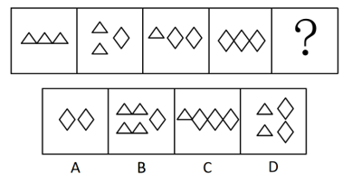
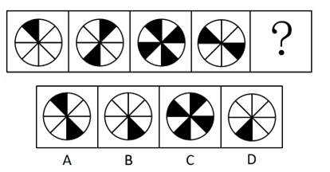
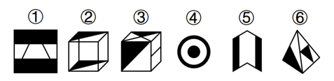

# 2018年湖北省选调生招录考试综合知识和行政职业能力测验试卷（网友回忆版）

> 判断推理 · 20 题 · 选调 2018

## 第 1 题　qid 2673979 · 图形推理

从选项中选择最合适的一个填入问号处，使之呈现出一定的规律性。

- **A**. A
- **B**. B
- **C**. C　✅
- **D**. D

**答案**：C

**官方解析**

元素组成不同，且无明显属性规律，优先考虑数量规律。观察发现，题干图形均由独立小图形组成，考虑元素的种类和数量，无明显规律或答案。再观察发现题干中只出现了2种小元素，考虑元素换算。题干中图2图1◇△，若1◇2△，那么图2与图1之间的差为1个△，此时将题干中菱形全部换算为三角形，那么三角形数量依次为3、4、5、6、？，故？处应有7个三角形。A项换算为4个三角形，排除；B项换算为6个三角形，排除；C项换算为7个三角形，当选；D项换算为6个三角形，排除。

故正确答案为C。

---

## 第 2 题　qid 2673987 · 图形推理

从选项中选择最合适的一个填入问号处，使之呈现出一定的规律性。

- **A**. A
- **B**. B　✅
- **C**. C
- **D**. D

**答案**：B

**官方解析**

元素组成不同，且无明显属性规律，优先考虑数量规律。观察发现，黑色图形数量依次为1、2、4、2、？，故？处黑色图形数量应为1，排除A、C两项；对比B、D两项，黑色图形位置不同，考虑位置规律，观察发现第一个图形的黑色图形顺时针平移一格得到第二个图形的黑色图形（其中1个），以此类推，该黑色图形每次顺时针平移一格，排除D项。
故正确答案为B。

---

## 第 3 题　qid 2673991 · 图形推理

把下面图形分为两类，使每一类都有共同特征或者规律，正确的选项是：

- **A**. ①②③，④⑤⑥
- **B**. ①⑤⑥，②③④
- **C**. ①④⑥，②③⑤
- **D**. ①④⑤，②③⑥　✅

**答案**：D

**官方解析**

本题为分组分类题目。元素组成不同，且无明显属性规律，优先考虑数量规律。观察发现，图形都有2个黑色区域，无法进行分组分类。再观察发现，图①④⑤图形整体为平面图形，且黑色区域均处于同一个平面内，图②③⑥图形整体为立体图形，且黑色区域均处于立体图形的两个平面内，即图①④⑤为一组，图②③⑥为一组。
故正确答案为D。

---

## 第 4 题　qid 2673994 · 定义判断

碳汇是指通过植树造林、种草、种植农作物、保护湿地等方式，利用植物光合作用吸收大气中的二氧化碳，并将其固定在植被和土壤中，从而降低温室气体浓度的活动或机制。主要包括森林碳汇、草地碳汇、耕地碳汇、湿地碳汇、海洋碳汇等。
根据上述定义，以下属于碳汇的是：

- **A**. 经半个世纪三代人努力，塞罕坝地区由荒原变林海、由沙漠变绿洲　✅
- **B**. 某少数民族自治州在退耕还草过程中，累计拨付种苗费2351万元
- **C**. 秸秆不及时处理会影响农田耕种，因此每年都有农民大规模焚烧秸秆
- **D**. 我国在南海试采用可燃冰获得成功，这为发展海洋经济奠定了坚实基础

**答案**：A

**官方解析**

第一步：找出定义关键词。
“植树造林、种草、种植农作物、保护湿地”、“降低温室气体浓度的活动或机制”、“主要包括森林碳汇、草地碳汇、耕地碳汇、湿地碳汇、海洋碳汇”。
第二步：逐一分析选项。
A项：塞罕坝地区由荒原变林海、由沙漠变绿洲是通过“植树造林”方式进行的，林海和绿洲已经存在，可以实现“降低温室气体浓度”的目的，属于森林碳汇，符合定义，当选；
B项：“退耕还草”指停止耕种，种树种草，但选项中只提到了这个过程中的花费，并没有体现最后结果，不如A项更明显符合定义，排除；
C项：“焚烧秸秆”不符合“植树造林、种草、种植农作物、保护湿地”，不符合定义，排除；
D项：“试采用可燃冰”不符合“植树造林、种草、种植农作物、保护湿地”，不符合定义，排除。
故正确答案为A。

---

## 第 5 题　qid 2673997 · 定义判断

淘宝村是指这样一类村子。电子商务年交易额达到1000万元人民币以上；活跃网店数量达到100个，或者占本村村民户数的以上。淘宝村在带动村民致富，促进农村经济设施建设，实现乡村振兴发展。

根据上述定义，下面哪个村是淘宝村？

- **A**. 张庄村300户人家有230户玩“淘宝”卖演出服，户均年销售额达20000元
- **B**. 东山村五分之一家庭电商生意火爆，仅该村首家电商年营业额就达七百万欧元　✅
- **C**. 李村有家网店，专营本地生产的户外用品如帐篷、睡袋等，年交易额达两千万
- **D**. 苗寨村通过网络推介吊龙舞、苗乡油茶等非遗项目，年创旅游收入千万以上

**答案**：B

**官方解析**

第一步：找出定义关键词。

“电子商务年交易额达到1000万元人民币以上”、“活跃网店数量达到100个，或者占本村村民户数的以上”。

第二步：逐一分析选项。

A项：户均年销售额达20000元，共230户，合计交易额为460万，不符合“电子商务年交易额达到1000万元人民币以上”，不符合定义，排除；

B项：首家电商年营业额达七百万欧元，换算成人民币约为5600万，符合“电子商务年交易额达到1000万元人民币以上”，东山村五分之一家庭电商生意火爆，符合“占本村村民户数的以上”，符合定义，当选；

C项：只是在说一家网店的情况，不符合“活跃网店数量达到100个，或者占本村村民户数的以上”，不符合定义，排除；

D项：收入千万的是旅游收入，不属于电子商务，不符合定义，排除。

故正确答案为B。

---

## 第 6 题　qid 2673999 · 定义判断

英法两国政府曾联合投资开发协和飞机。项目开展不久发现，继续投吧，费用剧增，且不知市场前景如何；停止投吧，以前的投入将付诸东流，结果两国不断追加投资填补漏洞，无法脱身。经济学上把这种现象称为“协和效应”，现在被用来泛指在某件事情上投入了金钱，时间或精力后，即使发现不宜继续，因各种原因还是继续投入、欲罢不能的现象。
根据上述定义，以下哪项不属于协和效应？

- **A**. 张某投资股市连年亏损，不愿就此罢手，因此连年追加投入
- **B**. 王某等了半个小时公交车，想不等，又怕车来了，只好等下去
- **C**. 李某连续两年报考热门专业研究生未录取，决定先工作再说　✅
- **D**. 罗某觉得电影不好看，为对得起买票钱，只好硬着头皮看下去

**答案**：C

**官方解析**

第一步：找出定义关键词。
“在某件事情上投入了金钱，时间或精力”、“发现不宜继续，因各种原因还是继续投入”。
第二步：逐一分析选项。
A项：股市亏损但还是连年追加投入，符合“在某件事情上投入了金钱，时间或精力”、“发现不宜继续，因各种原因还是继续投入”，符合定义，排除；
B项：等公交的时候不想等，但是怕车来了，只好继续等，符合“在某件事情上投入了金钱，时间或精力”、“发现不宜继续，因各种原因还是继续投入”，符合定义，排除；
C项：连续两年报考未录取，决定先找工作，放弃了之前的选择，不符合“发现不宜继续，因各种原因还是继续投入”，不符合定义，当选；
D项：罗某觉得电影不好看，但硬着头皮看下去，符合“在某件事情上投入了金钱，时间或精力”、“发现不宜继续，因各种原因还是继续投入”，符合定义，排除。
本题为选非题，故正确答案为C。

---

## 第 7 题　qid 2674001 · 定义判断

近年来，我国分享经济发展呈现出百花齐放、多种模式并存的局面，其中众筹分享是一种比较典型的分享经济模式，主要指利用互联网平台进行资金的大众筹集，目标不仅仅是为了筹集资金，也包含了分享投资所蕴含的风险或利润。目前，这种模式主要集中在电影视频、音乐出版、文化创意和房地产等开发项目上。
根据上述定义，以下哪项属于众筹分享？

- **A**. 刘某在QQ群请大家每天扫自己的支付宝红包二维码，赚了不少赏金
- **B**. 张某通过微信朋友圈在48小时内集资123万元，开了一个创意茶楼　✅
- **C**. 校园网为某重症同学发起医疗费募捐活动，全校师生共捐款10万元
- **D**. 王某现在居住的房屋有100平方米，这是单位15年前集资建的房子

**答案**：B

**官方解析**

第一步：找出定义关键词。
“利用互联网平台”、“筹集资金”、“分享投资所蕴含的风险或利润”。
第二步：逐一分析选项。
A项：刘某在QQ群邀请大家扫二维码、赚赏金，不符合“筹集资金”、“分享投资所蕴含的风险或利润”，不符合定义，排除；
B项：张某在朋友圈内集资123万元，开创意茶楼，符合“利用互联网平台”、“筹集资金”以及“分享投资所蕴含的风险或利润”，符合定义，当选；
C项：校园网发起医疗费募捐活动，是募捐帮助同学，不符合“分享投资所蕴含的风险或利润”，不符合定义，排除；
D项：王某现在住的房子是单位15年前集资建的，不符合“利用互联网平台”，不符合定义，排除。
故正确答案为B。

---

## 第 8 题　qid 2674003 · 定义判断

认养农业是指消费者预付生产费用，生产者为消费者提供绿色、有机食品，在生产者和消费者之间建立一种风险共担、收益共享的生产方式，实现农村与城市、土地与餐桌的直接对接。
根据上述定义，下列情形属于认养农业的是：

- **A**. 小徐周末到农户李某家采摘黄瓜后付费
- **B**. 小陈从网上预付费用，购买农户王某家的有机蔬菜
- **C**. 小罗预付费给农户周某下种草莓，种植成功后带走草莓　✅
- **D**. 小刘预付费给农户张某种苹果树，若种植失败小刘可以得到经济赔偿

**答案**：C

**官方解析**

第一步：找出定义关键词。
“消费者预付生产费用”、“生产者为消费者提供绿色、有机食品”、“风险共担、收益共享”。
第二步：逐一分析选项。
A项：黄瓜已经成熟，小徐是直接购买的，不符合“消费者预付生产费用”，不符合定义，排除；
B项：小陈在网上预付的是购买蔬菜的费用，而不是种植蔬菜的生产费用，不符合“消费者预付生产费用”，不符合定义，排除；
C项：小罗预付费种草莓，符合“消费者预付生产费用”，种植成功后带走草莓，符合“生产者为消费者提供绿色、有机食品”，也符合“建立一种风险共担、收益共享的生产方式”，符合定义，当选；
D项：种植失败小刘可以得到经济赔偿，说明没有共同承担风险，不符合“风险共担、收益共享”，不符合定义，排除。
故正确答案为C。

---

## 第 9 题　qid 2674005 · 类比推理

泥人：黏土：泥塑

- **A**. 牙雕：象牙：大象
- **B**. 笔墨：纸砚：书写
- **C**. 根艺：树根：雕刻　✅
- **D**. 房屋：破瓦：修造

**答案**：C

**官方解析**

第一步：判断题干词语间逻辑关系。
黏土是泥人的原材料，二者构成对应关系，泥人是泥塑的一种，二者构成包容关系中的种属关系。
第二步：判断选项词语间逻辑关系。
A项：牙雕是指在象牙上进行的一系列的雕刻，象牙是牙雕的原材料，二者构成对应关系，大象与象牙为组成关系，但与牙雕并非种属关系，与题干逻辑关系不一致，排除；
B项：笔墨与纸砚是并列关系，且书写需要笔墨、纸砚，书写与笔墨、纸砚均是对应关系，与题干逻辑关系不一致，排除；
C项：树根是根艺（一般指根雕艺术）的原材料，二者构成对应关系，根艺是雕刻的一种，二者构成种属关系，与题干逻辑关系一致，当选；
D项：破瓦可能是建造房屋的原材料，但修造与房屋构成动宾关系，与题干逻辑关系不一致，排除。
故正确答案为C。

---

## 第 10 题　qid 2674008 · 类比推理

革故鼎新：墨守成规

- **A**. 扑朔迷离：异曲同工
- **B**. 饮水思源：叶落归根
- **C**. 百花齐放：推陈出新
- **D**. 融会贯通：囫囵吞枣　✅

**答案**：D

**官方解析**

第一步：判断题干词语间逻辑关系。
革故鼎新是指去除旧的，建立新的，革除旧弊，创立新制。墨守成规是指思想保守，守着老规矩不肯改变。二者是反义关系。
第二步：判断选项词语间逻辑关系。
A项：扑朔迷离形容事情错综复杂，难以辨别清楚。异曲同工比喻话的说法不一而用意相同，或一件事情的做法不同而都巧妙地达到目的。二者无明显逻辑关系，与题干逻辑关系不一致，排除；
B项：饮水思源比喻不忘本。叶落归根多指作客他乡的人最终要回到本乡。二者是近义关系，与题干逻辑关系不一致，排除；
C项：百花齐放形容百花盛开，丰富多彩。推陈出新是指对旧的文化进行批判地继承，剔除其糟粕，吸取其精华，创造出新的文化。二者无明显逻辑关系，与题干逻辑关系不一致，排除；
D项：融会贯通是指把各方面的知识和道理融化汇合，得到全面透彻的理解。囫囵吞枣比喻对事物不加分析思考。二者是反义关系，与题干逻辑关系一致，当选。
故正确答案为D。

---

## 第 11 题　qid 2674473 · 类比推理

疏浚：畅通：河道

- **A**. 盛夏：炎热：消暑
- **B**. 清扫：洁净：马路　✅
- **C**. 口干：舌燥：饮料
- **D**. 云开：雨霁：彩虹

**答案**：B

**官方解析**

第一步：判断题干词语间逻辑关系。
疏浚的目的是为了让河道更畅通，疏浚和畅通为方式目的对应关系，其中疏浚是方式，畅通是目的。
第二步：判断选项词语间逻辑关系。
A项：盛夏是炎热的，炎热需要消暑，前者是属性的对应关系，后者是方式对应关系，与题干逻辑关系不一致，排除；
B项：清扫的目的是为了让马路更洁净，清扫和洁净为方式目的对应关系，其中清扫是方式，洁净是目的，与题干逻辑关系一致，当选；
C项：口干舌燥形容非常干渴，口干和舌燥是并列关系，与题干逻辑关系不一致，排除；
D项：云开雨霁是指云散开了、雨也停了，云开和雨霁是并列关系，与题干逻辑关系不一致，排除。
故正确答案为B。

---

## 第 12 题　qid 2674477 · 类比推理

深入：浅出

- **A**. 大同：小异　✅
- **B**. 瞻前：顾后
- **C**. 青山：绿水
- **D**. 内忧：外患

**答案**：A

**官方解析**

第一步：判断题干词语间逻辑关系。
深入浅出是指用浅显易懂的话把深刻的道理表达出来，其中“深”和“浅”、“出”和“入”是反义关系。
第二步：判断选项词语间逻辑关系。
A项：大同小异是指大体相同略有差异，其中“大”和“小”、“同”和“异”是反义关系，与题干逻辑关系一致，当选；
B项：瞻前顾后是指做事犹豫不决，其中“瞻”和“顾”都是指看的意思，二者为近义关系，与题干逻辑关系不一致，排除；
C项：“青”和“绿”、“山”和“水”是并列关系，与题干逻辑关系不一致，排除；
D项：“内”和“外”是反义关系，但“忧”和“患”不是反义关系，与题干逻辑关系不一致，排除。
故正确答案为A。

---

## 第 13 题　qid 2674482 · 类比推理

（    ） 对于 星系 相当于 （    ） 对于 山脉

- **A**. 星星：水流
- **B**. 银河：山川
- **C**. 星球：山峰　✅
- **D**. 光速：黄山

**答案**：C

**官方解析**

逐一代入选项。
A项：星星是指肉眼可见的宇宙中的天体，星系是指由无数恒星和星际物质组成的天体系统，包括恒星、气体、宇宙尘埃和暗物质等，所以星星是星系的必要组成部分，而山脉是指沿一定方向延伸、包括若干条山岭和山谷组成的山体，水流不是山脉的必要组成部分，前后逻辑关系不一致，排除；
B项：银河是由大量恒星构成的天体系统，它是银河系的一部分，而银河系是星系的一种，因此银河和星系没有必然的逻辑关系，山川是指山岳与河流，这里的山岳是指高耸入云而延绵不断的山岭，而不是山脉，前后逻辑关系不一致，排除；
C项：星球是星系的组成部分，山峰是山脉的组成部分，前后逻辑关系一致，当选；
D项：光速和星系之间没有必然的逻辑关系，黄山指的是黄山山脉，是山脉的一种，前后逻辑关系不一致，排除。
故正确答案为C。

---

## 第 14 题　qid 2674486 · 类比推理

工人：工作：工资

- **A**. 学生：学习：学识　✅
- **B**. 职员：职业：职称
- **C**. 保姆：保安：保护
- **D**. 师长：师资：师范

**答案**：A

**官方解析**

第一步：判断题干词语间逻辑关系。
工人是一种身份，工人通过工作获得工资，工作是获得工资的方式。
第二步：判断选项词语间逻辑关系。
A项：学生是一种身份，学生通过学习获得学识，学习是获得学识的方式，与题干逻辑关系一致，当选；
B项：职员通过职业不一定有职称，与题干逻辑关系不一致，排除；
C项：保姆和保安是并列关系，与题干逻辑关系不一致，排除；
D项：师长是对老师的尊称，师资是指能当教师的人才，师资不是方式，与题干逻辑关系不一致，排除。
故正确答案为A。

---

## 第 15 题　qid 2674490 · 逻辑判断

联合国气象组织发布报告说，受厄尔尼诺影响，2016年是有记录以来最热年份，2017年超过2015年成为最热的非厄尔尼诺年。长期气温趋势远比单个年份的气温排名重要，而长期趋势是上升的。虽然某些地区平均气温降低，但全球总体气温是快速上升的。报告据此得出结论，地球气温自2010年以来，呈现出加速上升的趋势。
以下哪项如果为真，最能支持上述结论？

- **A**. 2015年、2016年和2017年是有记录以来三个最热年份
- **B**. 2017年全球平均气温比工业革命前的水平高1.1摄氏度
- **C**. 有系统记录以来的五个最温暖年份都出现在2010年之后　✅
- **D**. 联合国气象组织的结论与其他五家主要国际气象机构一致

**答案**：C

**官方解析**

第一步：找出论点和论据。
论点：地球气温自2010年以来，呈现出加速上升的趋势。
论据：联合国气象组织发布报告说，受厄尔尼诺影响，2016年是有记录以来最热年份，2017年超过2015年成为最热的非厄尔尼诺年。长期气温趋势远比单个年份的气温排名重要，而长期趋势是上升的。虽然某些地区平均气温降低，但全球总体气温是快速上升的。
论点和论据讲的都是地球气温加速上升的事，因此话题一致，可以考虑补充论据进行加强。
第二步：逐一分析选项。
A项：2015年、2016年和2017年是有记录以来三个最热年份，可知15年、16年、17年这三年地球气温比起之前是上升的，说明自2010年以来存在气温不断上升的三年，补充论据可以加强，保留；
B项：2017年全球平均气温比工业革命前的水平高，只能说明17年的气温变高了，并不能说明自2010年以来地球气温是否是加速上升的趋势，无法加强，排除；
C项：五个最温暖年份都出现在2010年之后，说明自2010年以来存在气温不断上升的五年，可以说明，地球气温自2010年以后存在上升的趋势，补充论据可以加强，保留；
D项：与其他气象组织的结论一致，说明论据可靠，可以加强论据，但力度不及A、C两项，排除；
对比A、C两项，其中C项说的是5年情况，比A项的3年情况范围更广，加强力度更强，因此，优选C项。
故正确答案为C。

---

## 第 16 题　qid 2674495 · 逻辑判断

年初，A跨国公司宣布，到2030年回收再利用所有塑料包装。B跨国公司宣布，到2025年全部采用可再生和循环利用的包装材料。其他一些国际消费品巨头也纷纷作出类似承诺。媒体评论说，企业这样做并不完全是出于对环境的考虑，而是为了赢得年轻消费群体，是年轻一代的环保意识改变了企业态度。
以下哪项如果为真，最能支持媒体的意见？

- **A**. 
调查表明55岁以上人群中有表示，他们在意自己的生活习惯对环境造成的影响

- **B**. 
调查表明35岁以下年轻人中有表示，他们在意自己的生活习惯对环境造成的影响

- **C**. 
随着更有环保意识年轻一代成为消费主力军，企业开始更关注公众对环境污染的担忧
　✅
- **D**. 
联合国有关部门指出，各行业企业新近对循环利用的热情是“力争上游”不是“自甘落后”

**答案**：C

**官方解析**

第一步：找出论点和论据。
论点：企业这样做并不完全是出于对环境的考虑，而是为了赢得年轻消费群体，是年轻一代的环保意识改变了企业态度。
论据：无。
题干只有论点没有论据，考虑补充论据进行加强。
第二步：逐一分析选项。
A项：题干的主体是年轻消费群体，而选项是55岁以上人群，主体不一致，无法加强，排除；
B项：选项提到了年轻人在意自己的生活习惯对环境造成的影响，但未提及企业的做法，无法加强，排除；
C项：选项中提到企业开始更关注公众对环境污染的担忧，说明年轻一代的环保意识影响了企业的态度，补充论据，可以加强，当选；
D项：选项未提到年轻消费群体的环保意识，话题不一致，无法加强，排除。
故正确答案为C。

---

## 第 17 题　qid 2674497 · 逻辑判断

埃及新近发现了一座4400年前第五王朝时期某王室女性的墓葬。古墓内有保存完好的壁画，描绘了女主人观看狩猎和捕鱼场景。引人注意的是，壁画中有一只猴子在摘果子。考古人员还在属于第十二王朝的其他王室和贵族墓葬中发现过类似壁画场景，如猴子在乐队前面跳舞。这些说明在古代埃及，猴子是王公贵族特有的宠物。
以下哪项如果为真，最能削弱上述判断？

- **A**. 有些埃及古墓壁画中，除了有猴子还有其他动物
- **B**. 相比猴子，古埃及人更喜欢的宠物是狮子等猛兽
- **C**. 猴子只是埃及古墓壁画中烘托气氛的一个点缀物
- **D**. 古埃及社会，猴子普遍被人们作为宠爱动物饲养　✅

**答案**：D

**官方解析**

第一步：找出论点和论据。
论点：在古代埃及，猴子是王公贵族特有的宠物。
论据：在古墓壁画中的场景里发现了猴子。
论点说的是猴子是王公贵族特有的宠物，论据说的是某王室古墓壁画中的场景里发现了猴子，论点论据讨论话题一致，考虑削弱论点，即猴子不是王公贵族特有的宠物。
第二步：逐一分析选项。
A项：题干主体的是场景中的猴子，而选项是其他动物，主体不一致无法削弱，排除；
B项：选项讨论的是埃及人更喜欢的宠物是什么，与猴子是否是王公贵族特有的宠物无关，无法削弱，排除；
C项：选项提到猴子是壁画中的点缀物，但是否是王公贵族特有的宠物是不明确的，无法削弱，排除；
D项：选项提到猴子普遍被人们作为宠爱动物饲养，因此就不是王公贵族特有的宠物，直接否论点削弱，当选。
故正确答案为D。

---

## 第 18 题　qid 2674500 · 逻辑判断

大约5.4亿到53亿年前的寒武纪地层中，一下子出现了各种无脊椎多细胞动物化石，这被称为寒武纪大爆发。大爆发表明，尽管生命在40亿年前就在地球诞生，但多细胞动物直到寒武纪才出现，并迅速演化出各种门类。对导致寒武纪大爆发的原因，曾有一种假说认为，是因为当时大气中氧气浓度增加，可以支持更复杂、体型更大的动物。
以下哪项如果为真，最能质疑上述假说？

- **A**. 低氧对动物细胞没有问题，高氧环境才会对复杂的多细胞体系构成根本性威胁
- **B**. 有性生殖的出现提供了遗传变异性，增加了生物多样性，才造成寒武纪大爆发
- **C**. 海洋钙含量在寒武纪比之前至少高出3倍，在寒武纪大爆发中发挥了巨大作用
- **D**. 最新研究表明，地球在寒武纪之前就有了足够多的氧气，寒武纪时氧气没变化　✅

**答案**：D

**官方解析**

第一步:找出论点和论据。
论点：导致寒武纪大爆发的原因是因为当时大气中氧气浓度增加，可以支持更复杂、体型更大的动物。
论据：无。
本题只有论点，没有论据，所以优先考虑否论点；另外本题论点是因果关系的表述，所以属于因果论证，可以考虑选项是否有因果倒置或他因削弱。
第二步：逐一分析选项。
A项：论点说的是大气中氧气浓度增加，而选项说高氧环境，氧气浓度增加不代表就是高氧环境，与论点话题不一致，无法削弱，排除；
B项：论点说导致寒武纪大爆发的原因是因为当时大气中氧气浓度增加，可以支持更复杂、体型更大的动物，选项在没有否定题干论点的基础上提出了另一个可能导致寒武纪大爆发的原因，即有性生殖出现增加了生物多样性，是他因削弱，保留；
C项：论点讨论的是大气中氧含量的情况，选项讨论的是海洋钙含量，与论点话题不一致，并且发挥巨大作用无法说明其是否是寒武纪大爆发的原因，无法削弱，排除；
D项：论点说寒武纪大爆发的原因是当时大气中氧气浓度增加，而选项说寒武纪时氧气没变化，否定了论点，可以削弱，保留。
B项是他因削弱，D项是否定论点，否定论点削弱力度大于他因削弱，所以答案为D项。
故正确答案为D。

---

## 第 19 题　qid 2674508 · 逻辑判断

当前，各地正积极推进特色小镇建设。特色小镇的核心“内功”是特色产业。有些小镇为营造特色进入创建名单，大力宣传当地传统产业，如皮革、毛纺、茶叶、陶瓷等。有评论指出，实际上，一些传统产业如不进行升级改造，并嫁接互联网平台，很难焕发生机、持续增长。
从上述评论观点，可推出下面哪项结论？

- **A**. 特色小镇一定是一个有产业基础和发展潜力的平台
- **B**. 特色小镇必须具有可持续发展的特色产业
- **C**. 特色小镇应该发展软件、科技、环保等现代化特色产业
- **D**. 小镇传统产业并非都能焕发生机、持续增长、支撑特色小镇建设　✅

**答案**：D

**官方解析**

日常结论题，根据题干信息逐一分析选项。
A项：题干只是客观描述特色小镇宣传了哪些传统产业，并没有提出特色小镇是一个有产业基础和发展潜力的平台，无中生有，且“一定”表述过于绝对，排除；
B项：题干只是客观描述特色小镇宣传了哪些传统产业，并没有提出特色小镇必须具有可持续发展的特色产业，无中生有，且“必须”表述过于绝对，排除；
C项：题干指出一些传统产业如不进行升级改造，并嫁接互联网平台，很难焕发生机、持续增长，但并没有说明特色小镇是否将传统产业升级改造、升级改造哪些传统产业、升级改造为什么样的产业等，无法推出，排除；
D项：题干说有些小镇在大力宣传当地传统产业，有评论指出一些传统产业如不进行升级改造，并嫁接互联网平台，很难焕发生机、持续增长，说明小镇当前的传统产业并不是都能焕发生机、持续增长并且可以支撑特色小镇建设，可以推出，当选。
故正确答案为D。

---

## 第 20 题　qid 2674513 · 逻辑判断

某省响应建设“田园综合治理体”试点，统筹兼顾推进农业供给侧结构性改革，公布了2017年61家共享农庄的试点名单。共享农庄可以利用农村闲置资源，吸纳农村剩余劳动力，不但可以增加经营性收入，更能增加财产性收入，是解决农民持续稳定脱贫致富的有效途径，是农村经济发展的新机遇。
据此可推出：

- **A**. 建设共享农庄是解决农民脱贫致富的根本途径
- **B**. 只要建设“田园综合治理体”，就能实现脱贫致富
- **C**. 吸纳农村剩余劳动力是利用农村闲置资源的最有效途径
- **D**. 建设共享农庄，可以提升农民经营收入与财产性收入　✅

**答案**：D

**官方解析**

日常结论题，根据题干信息逐一分析选项。
A项：题干说共享农庄是解决农民持续稳定脱贫致富的有效途径，而非根本途径，偷换概念，排除；
B项：题干说共享农庄是解决农民持续稳定脱贫致富的有效途径，选项说只要建设“田园综合治理体”，就能实现脱贫致富，表述过于绝对，无法推出，排除；
C项：题干说共享农庄可以利用农村闲置资源，吸纳农村剩余劳动力，没有说吸纳农村剩余劳动力是利用农村闲置资源的最有效途径，无中生有，排除；
D项：题干说共享农庄不但可以增加经营性收入，更能增加财产性收入，可以推出，当选。
故正确答案为D。

---
