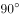
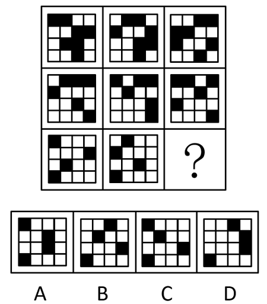
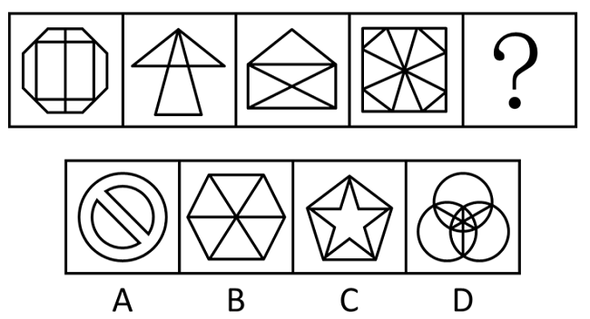
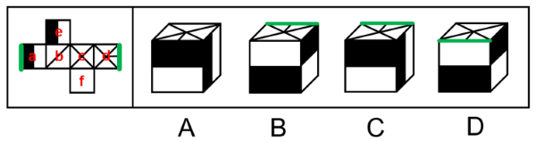
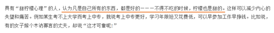

# 2018年福建省选调生考试《行政职业能力测验》

> 判断推理 · 30 题 · 福建 2018

## 第 1 题　qid 4714947 · 图形推理

从所给的四个选项中，选择最合适的一个填入问号处，使之呈现一定的规律性：

- **A**. A
- **B**. B
- **C**. C
- **D**. D　✅

**答案**：D

**官方解析**

观察发现，题干图形均为字母，且在字母表中的顺序存在规律。第一行中相邻字母在字母表中间隔0个字母，第二行中相邻字母在字母表中间隔1个字母，第三行中相邻字母在字母表中间隔2个字母，按此规律，第四行中相邻字母在字母表中应间隔3个字母，故？处应为T，只有D项符合。
故正确答案为D。

---

## 第 2 题　qid 4714960 · 图形推理

从所给的四个选项中，选择最合适的一个填入问号处，使之呈现一定的规律性：

- **A**. A　✅
- **B**. B
- **C**. C
- **D**. D

**答案**：A

**官方解析**

元素组成相同，优先考虑位置规律。观察发现，左上角的阴影三角形和矩形顺时针旋转得到右上角图形，右上角图形顺时针旋转得到右下角图形，因此？处图形应由右下角图形顺时针旋转得到，只有A项符合。

故正确答案为A。

---

## 第 3 题　qid 4714949 · 图形推理

从所给的四个选项中，选择最合适的一个填入问号处，使之呈现一定的规律性：

- **A**. A
- **B**. B　✅
- **C**. C
- **D**. D

**答案**：B

**官方解析**

元素组成相同，优先考虑位置规律。九宫格优先看横行，第一行图形中，上面三行的黑块依次向右平移一格（到头循环走），第四行黑块位置保持不变；经验证第二行图形满足此规律，第三行图形应用此规律，对应B项。
故正确答案为B。

---

## 第 4 题　qid 4714952 · 图形推理

从所给的四个选项中，选择最合适的一个填入问号处，使之呈现一定的规律性：

- **A**. A
- **B**. B
- **C**. C　✅
- **D**. D

**答案**：C

**官方解析**

元素组成不同，且无明显属性规律，优先考虑数量规律。观察发现图2为明显一笔画图形，图3包括“田”字变形图，考虑笔画数。题干图形均为一笔画图形，故？处也应为一笔画图形，只有C项符合。
故正确答案为C。

---

## 第 5 题　qid 4714994 · 图形推理

以下为立方体的外表面，下列哪个立方体可以由此折成（    ）。

- **A**. A　✅
- **B**. B
- **C**. C
- **D**. D

**答案**：A

**官方解析**

将题干展开图标上序号，如下图所示：

观察发现，四个选项均由面a、面d和面e组成，展开图中面d上最短的线段与面a中黑色长方形相交，而B项、C项和D项中面d上最短的线段均未与面a中黑色长方形相交，与题干展开图不一致，排除。A项与题干展开图一致，当选。

故正确答案为A。

---

## 第 6 题　qid 2187609 · 定义判断

甜柠檬效应就是个体在追求预期目标失败时，为了冲淡自己内心的不安，就百般提高现已实现的目标的价值，从而达到心理平衡的现象。
根据上述定义，下列属于“甜柠檬效应”的是：

- **A**. 小明本来想买一台笔记本电脑，结果却在导购员的劝说下购买了平板电脑，使用后他很满意，并一直向朋友推荐
- **B**. 这几周，小红为自己的销售业绩不断下滑而苦恼；但当她知道自己仍是公司的销售状元时，变得放心多了
- **C**. 小文的数学成绩又让他的辅导老师失望了，老师最后只能用“比起上一次，还是有进步”来安慰自己　✅
- **D**. 据教练估计，小张需要减肥到60千克才能达到他想要的健身效果，可是小张在减到63千克时就放弃了，因为他觉得自己足够健美了

**答案**：C

**官方解析**

第一步：找出定义关键词。

“个体追求预期目标失败”、“为了冲淡自己内心的不安”、“百般提高现已实现的目标的价值”、“达到心理平衡”。

第二步：逐一分析选项。

A项：小明本来想买电脑最后买了平板电脑，没有实现预期目标，但是使用后很满意，不符合“为了冲淡自己内心的不安”、“百般提高现已实现的目标的价值”，不符合定义，排除；

B项：小红为销售业绩下滑而苦恼符合“个人追求预期目标失败”，但小红为销售状元是客观事实，不符合“为了冲淡自己内心的不安”、“百般提高现已实现的目标的价值”，不符合定义，排除；

C项：小文数学成绩让辅导老师失望，老师对小文的成绩的心理预期没有达到，符合“个体追求预期目标失败”，老师最后只能安慰自己小文比上一次进步了，符合“百般提高现已实现的目标的价值”，符合定义，当选；

D项：减肥到60千克才能达到效果是教练提出的目标，小张在63千克时放弃了，是小张自己主动放弃了，并不符合追求个人目标失败，不符合定义，排除。

故正确答案为C。

---

## 第 7 题　qid 4715058 · 定义判断

边际效应是指经济上在最小成本的情况下达到最大经济利润，从而达到帕累托最优，指的是物品或劳务的最后一单位比起前一单位的效用。如果后一单位的效用比起前一单位的效用大则是边际效用递增，反之则为边际效用递减。感恩边际效应递减指第一次受到来自陌生人的帮助会心存感激，但是多次帮助之后感恩心理便会递减。递减到一定程度上，受助者几乎已经坦然地接受别人的馈赠，并认为这理所应当。
下列属于感恩边际效应递减的一项是：

- **A**. 一个馒头店主，看到很多环卫工人和流浪汉吃不上热乎饭，开办了“爱心馒头”，免费送热乎慢头，这些环卫工人和流浪汉表示非常感激
- **B**. 一个人吃第一碗面条特别香，第二碗面条很香，第三碗面条还可以，第四碗面条饱了，第五碗面条吃不下，看到第六碗面条产生一种厌倦的心理
- **C**. 一名患者5年前被查出癌症晚期，一直在一家医院治疗。医院考虑到患者家庭经济条件，5年来给患者垫付了10多万元医疗费，家属备受感动。后来患者不治身亡，其家属不仅不支付拖欠的医疗费用，还向医院索赔　✅
- **D**. 国产迈腾上市之前，大众汽车公司已经将进口迈腾引进中国，用进口车的售价先拉高消费者的心理接受度，随后再公布国产迈腾汽车的价格，达到对市场的刺激

**答案**：C

**官方解析**

第一步：找出定义关键词。
边际效应：“在最小成本的情况下达到最大经济利润”；
边际效用递增：“后一单位的效用比起前一单位的效用大”；
边际效用递减：“后一单位的效用比起前一单位的效用小”；
感恩边际效应递减：“第一次受到来自陌生人的帮助会心存感激”、“多次帮助之后感恩心理递减”、“坦然接受别人的馈赠，并认为理所应当”。
第二步：逐一分析选项。
A项：选项只表述了环卫工人和流浪汉表示感激，未体现多次帮助之后的想法，不符合“多次帮助之后感恩心理递减”、“坦然接受别人的馈赠，并认为理所应当”，不符合“感恩边际效应递减”的定义，排除；
B项：人吃面条的次数越多，越感到厌倦，不涉及陌生人的帮助，不符合“第一次受到来自陌生人的帮助会心存感激”，不符合“感恩边际效应递减”的定义，排除；
C项：医院5年来给患者垫付了10多万元医疗费，家属备受感动，符合“第一次受到来自陌生人的帮助会心存感激”，但长时间的资助使得家属认为是理所应当的，不仅不支付拖欠的医疗费用，还向医院索赔，符合“多次帮助之后感恩心理递减”、“坦然接受别人的馈赠，并认为理所应当”，符合“感恩边际效应递减”的定义，当选；
D项：用进口车的售价拉高消费者的心理接受度是一种营销手段，不涉及来自陌生人的帮助，不符合“第一次受到来自陌生人的帮助会心存感激”，不符合“感恩边际效应递减”的定义，排除。
故正确答案为C。

---

## 第 8 题　qid 4715037 · 定义判断

恶魔效应：在印象形成过程中对不好的一面加以夸大化的感觉和看法，是由于某一点或某些不好印象而扩大到全部印象的知觉现象；对一个人进行评价时，往往会因某一品质特征的强烈、清晰的不良感知和印象，而对这个人的其他品质、特性也会给予否定性、妖魔化的评价。
下列符合上述定义的一项是：

- **A**. 那些有名的歌星、影星拍的广告片很容易得到认同，而那些名不见经传的小人物不被信任
- **B**. 同事小张在一次工作汇报中为了突显自己的成绩故意夸大事实，自此以后小张被同事们一致认为他就是一个不诚实的人　✅
- **C**. 童童经常跟小朋友吹牛说：“我们家的房子有这么大，有十个房间，还有一个大大的车库，我爸爸有两辆车，一辆是奔驰一辆是宝马”
- **D**. 本月，中国2000所高校的毕业生人数达到创纪录的700万人，很多中国媒体把这个月称为史上最难就业季

**答案**：B

**官方解析**

第一步：找出定义关键词。
“在印象形成过程中”、“某一点或某些不好印象”、“扩大到全部印象”。
第二步：逐一分析选项。
A项：“有名”的歌星、影星拍的广告片很容易得到认同，“名不经传”的小人物不被信任，说明受众对广告的认同取决于代言人的有名程度，不涉及“扩大到全部印象”，不符合定义，排除；
B项：小张一次不诚实的行为，符合“某一点或某些不好印象”，同事因此认为他就是一个不诚实的人，符合“扩大到全部印象”，符合定义，当选；
C项：选项只描述了童童的行为，不涉及别人所产生的印象，不符合“在印象形成过程中”，也不符合“扩大到全部印象”，不符合定义，排除；
D项：媒体称这个月为史上最难就业季，是针对就业现象的描述，不涉及“某一点或某些不好印象”，也没有体现“扩大到全部印象”，不符合定义，排除。
故正确答案为B。

---

## 第 9 题　qid 4715042 · 定义判断

货币幻觉：是货币政策的通货膨胀效应，是指人们只注意货币工资的提高或降低，而意识不到货币的实际购买力是否发生了变化，因而只抵制货币工资下降的心理现象。
以下符合上述定义的一项是：

- **A**. 小李花40万元买了一套房子，后来把房子卖掉了，小李卖房子时，当时有25%的贬值率——商品和服务平均降低25%，小李卖得30.8万元，比买价低23%，小李认为自己的实际购买能力下降了
- **B**. 小李花40万元买了一套房子，后来把房子卖掉了，小李卖房子时，当时有25%的贬值率——商品和服务平均降低25%，小李卖得30.8万元，比买价低23%，小李认为自己的货币工资降低了　✅
- **C**. 小王花40万元买了一套房子，后来把房子卖掉了，小王卖房子时，物价上涨了25%，结果房子卖了49.2万元，比买房价高23%，小王认为自己的货币降低了
- **D**. 小王花40万元买了一套房子，后来把房子卖掉了，小王卖房子时，物价上涨了25%，结果房子卖了49.2万元，比买房价高23%，小王认为自己的实际购买能力降低了

**答案**：B

**官方解析**

第一步：找出定义关键词。
“只注意货币工资的提高或降低”、“意识不到货币的实际购买力是否发生了变化”、“只抵制货币工资下降”。
第二步：逐一分析选项。
A项：小李认为自己的实际购买能力下降了，意识到了货币的实际购买力发生了变化，不符合“意识不到货币的实际购买力是否发生了变化”，不符合定义，排除；
B项：房子的卖价比买价低了23%，其下降程度比不上25%的贬值率，因此虽然货币量少了，但实际上货币的购买力比以前更高，而小李只看到了自己货币工资降低了，没有看到现在30.8万元的购买力超过了以前40万元的购买力，符合“只注意货币工资的提高或降低”、“意识不到货币的实际购买力是否发生了变化”，符合定义，当选；
C项：房子的卖价比买价高了23%，其上升程度不如25%的物价上涨率，因此虽然货币量增加了，但实际上货币的购买力在降低，小王认为自己的货币降低了，说明小王意识到了货币的实际购买力发生了变化，不符合“只注意货币工资的提高或降低”、“意识不到货币的实际购买力是否发生了变化”，不符合定义，排除；
D项：小王认为自己的实际购买能力降低了，意识到了货币的实际购买力发生了变化，不符合“意识不到货币的实际购买力是否发生了变化”，不符合定义，排除。
故正确答案为B。

---

## 第 10 题　qid 4714945 · 定义判断

文化扩散：指思想观念、经验技艺和其他文化特质从一个社会传到另一个社会，从一地传到另一地的过程。文化扩散分为扩展扩散和迁移扩散：其中扩展扩散又可进一步分成传染扩散、等级扩散和刺激扩散。传染扩散如同疾病传播那样不分等级地将文化传播给每一个地区社会所有接触者；等级扩散是指一种文化现象在不同划分标准的空间等级中，由高至低或者由低至高的扩散过程；刺激扩散是指一种文化现象由一地传到他地后，保留了思想实质而摒弃了具体形式的扩散过程。 
下列属于传染扩散的一项是：

- **A**. 1848年欧洲殖民者在加州发现黄金后，众多白人向西迁移，进驻加州，随之将其宗教、生活方式等带到了加州
- **B**. 7世纪中期，日本天皇下令仿效中国唐朝教育制度，在中央设立太学，在地方设立国学
- **C**. 随着近代中国现代化转型期的到来，基督教传入国内，虽然形式各异但是传播福音的实质未曾发生改变
- **D**. 马克思主义在中国的传播　✅

**答案**：D

**官方解析**

第一步：找出定义关键词。
文化扩散：“思想观念、经验技艺和其他文化特质”、“从一个社会传到另一个社会”、“从一地传到另一地”；
传染扩散：“不分等级”、“将文化传播给每一个地区社会所有接触者”；
等级扩散：“在不同划分标准的空间等级中”、“由高至低或者由低至高的扩散过程”；
刺激扩散：“由一地传到他地后”、“保留了思想实质”、“摒弃了具体形式”。 
第二步：逐一分析选项。
A项：众多白人向西迁移，进驻加州，随之将其宗教、生活方式等带到了加州，只说明了白人将文化带到新的地方，并没有体现将文化传播给其他接触者，不符合“将文化传播给每一个地区社会所有接触者”，不符合“传染扩散”定义，排除；
B项：日本天皇下令，是由高到低的扩散过程，且在中央设立太学，在地方设立国学，体现了存在等级划分，符合“在不同划分标准的空间等级中”、“由高至低或者由低至高的扩散过程”，符合“等级扩散”定义，不符合“传染扩散”定义，排除；
C项：基督教传入国内，虽然形式各异但是传播福音的实质未曾发生改变，体现了没有具体形式，但思想实质不变，符合“由一地传到他地后”、“保留了思想实质”、“摒弃了具体形式”，符合“刺激扩散”定义，不符合“传染扩散”定义，排除；
D项：马克思主义在中国的传播是不分等级的，各个地区、各个阶层的人民均有受到马克思主义思想的影响，符合“不分等级”、“将文化传播给每一个地区社会所有接触者”，符合“传染扩散”定义，当选。
故正确答案为D。

---

## 第 11 题　qid 4714959 · 定义判断

间接融资是指资金盈余单位与资金短缺单位之间不发生直接关系，而是分别与金融机构发生一笔独立的交易，即资金盈余单位通过存款，或者购买银行、信托、保险等金融机构发行的有价证券，将其暂时闲置的资金先行提供给这些金融中介机构，然后再由这些金融机构以贷款、贴现等形式，或通过购买需要资金的单位发行的有价证券，把资金提供给这些单位使用，从而实现资金融通的过程。
根据上述定义，下列属于间接融资的是：

- **A**. 你向太平洋人寿保险公司支付人寿保险的保费，该公司向购房人发放抵押贷款　✅
- **B**. 你通过经纪人买入通用电气公司的债券
- **C**. 你购买了微软的股票
- **D**. 你将钱投入了集资公司，便于该公司缓解资金紧张的状况

**答案**：A

**官方解析**

第一步：找出定义关键词。
“通过存款，或者购买银行、信托、保险等金融机构发行的有价证券”、“暂时闲置的资金先行提供给这些金融中介机构”、“金融机构以贷款、贴现等形式，或通过购买需要资金的单位发行的有价证券，把资金提供给这些单位使用”。
第二步：逐一分析选项。
A项：你向保险公司支付保费，符合“通过存款，或者购买银行、信托、保险等金融机构发行的有价证券”、“暂时闲置的资金先行提供给这些金融中介机构”，该公司向购房人发放抵押贷款，符合“金融机构以贷款、贴现等形式，或通过购买需要资金的单位发行的有价证券，把资金提供给这些单位使用”，符合定义，当选；
B项：你通过经纪人买入债券，经纪人是通过介绍买卖双方交易，以获取佣金的中间人，不是金融中介机构，不符合“暂时闲置的资金先行提供给这些金融中介机构”，不符合定义，排除；
C项：你购买股票，是否存在金融中介机构未体现，且也不符合“金融机构以贷款、贴现等形式，或通过购买需要资金的单位发行的有价证券，把资金提供给这些单位使用”，不符合定义，排除；
D项：将钱投入集资公司，集资公司不是金融中介机构，该行为是与资金紧张单位之间发生了直接关系，不符合“暂时闲置的资金先行提供给这些金融中介机构”、“金融机构以贷款、贴现等形式，或通过购买需要资金的单位发行的有价证券，把资金提供给这些单位使用”，不符合定义，排除。
故正确答案为A。

---

## 第 12 题　qid 4715006 · 定义判断

本能是指一个生物体趋向于某一特定行为的内在倾向。其固定的行为模式非学习得来，也不是继承而来。固定行为模式的实例可从动物的行为观察得到。它们进行各种活动（有时非常复杂），不是基于此前的经验。
以下不属于本能的是：

- **A**. 藏羚羊之间为了求偶而进行的战斗
- **B**. 燕子的筑巢行为
- **C**. 把食物放在玻璃板的后面，狒狒只要看过人类取物一次就可以很快明白阻隔的存在和解决的办法　✅
- **D**. 出现火烧森林的时候，动物四下散开逃跑

**答案**：C

**官方解析**

第一步：找出定义关键词。
“趋向于某一特定行为的内在倾向”、“固定的行为模式非学习得来，也不是继承而来”、“进行各种活动不是基于此前的经验”。
第二步：逐一分析选项。
A项：藏羚羊之间为了求偶而进行的战斗，符合“趋向于某一特定行为的内在倾向”、“固定的行为模式非学习得来，也不是继承而来”、“进行各种活动不是基于此前的经验”，符合定义，排除；
B项：燕子的筑巢行为，符合“趋向于某一特定行为的内在倾向”、“固定的行为模式非学习得来，也不是继承而来”、“进行各种活动不是基于此前的经验”，符合定义，排除；
C项：狒狒学会如何把食物从玻璃板的后面取出，是通过观察人类的行为学习的，不符合“固定的行为模式非学习得来，也不是继承而来”，不符合定义，当选；
D项：动物在发生火灾时四下散开逃跑，符合“趋向于某一特定行为的内在倾向”、“固定的行为模式非学习得来，也不是继承而来”、“进行各种活动不是基于此前的经验”，符合定义，排除。
本题为选非题，故正确答案为C。

---

## 第 13 题　qid 4715016 · 类比推理

气质是表现在心理活动的强度、速度、灵活性与指向性等方面的一种稳定的心理特征，气质主要有四类：
①多血质：灵活性高，易于适应环境变化，善于交际，在工作、学习中精力充沛而且效率高；对什么都感兴趣，但情感兴趣易于变化；有些投机取巧，易骄傲，受不了一成不变的生活。
②黏液质：反应比较缓慢，坚持而稳健地辛勤工作；动作缓慢而沉着，能克制冲动，严格恪守既定的工作制度和生活秩序；情绪不易激动，也不易流露感情；自制力强，不爱显露自己的才能；固定性有余而灵活性不足。
③胆汁质：情绪易激动，反应迅速，行动敏捷，暴而有力；性急，有一种强烈而迅速燃烧的热情，不能自制；在克服困难上有坚忍不拔的劲头，但不善于考虑能否做到，工作有明显的周期性，能以大的热情投身于事业，但当精力消耗殆尽时，便失去信心，情绪顿时转为沮丧而一事无成。
④抑郁质：高度的情绪易感性，主观上把很弱的刺激当作强作用来感受，常为微不足道的原因而动感情，且有力持久；行动表现上迟缓，有些孤僻；遇到困难时优柔寡断，面临危险时极度恐惧。
以下对应的代表人物正确的是：

- **A**. 王熙凤属于多血质　✅
- **B**. 孙悟空属于黏液质
- **C**. 张飞属于抑郁质
- **D**. 韦小宝属于胆汁质

**答案**：A

**官方解析**

第一步：找出定义关键词。
①多血质：“灵活性高”、“善于交际”、“有些投机取巧，易骄傲”；
②黏液质：“反应比较缓慢，坚持而稳健地辛勤工作”、“情绪不易激动，也不易流露感情”、“自制力强，不爱显露自己的才能”；
③胆汁质：“情绪易激动，反应迅速，行动敏捷，暴而有力”、“性急”、“当精力消耗殆尽时，便失去信心，情绪顿时转为沮丧而一事无成”；
④抑郁质：“高度的情绪易感性，主观上把很弱的刺激当作强作用来感受，常为微不足道的原因而动感情”、“行动表现上迟缓，有些孤僻”、“遇到困难时优柔寡断，面临危险时极度恐惧”。
第二步：逐一分析选项。
A项：王熙凤爽利泼辣、八面玲珑、能言善辩，符合“灵活性高”、“善于交际”、“有些投机取巧，易骄傲”，符合多血质的定义，当选；
B项：孙悟空聪明活泼、嫉恶如仇、争强好胜、不够谦虚，不符合“反应比较缓慢，坚持而稳健地辛勤工作”、“情绪不易激动，也不易流露感情”、“自制力强，不爱显露自己的才能”，不符合黏液质的定义，排除；
C项：张飞粗狂、易怒、勇猛，不符合“高度的情绪易感性，主观上把很弱的刺激当作强作用来感受，常为微不足道的原因而动感情”、“行动表现上迟缓，有些孤僻”、“遇到困难时优柔寡断，面临危险时极度恐惧”，不符合抑郁质的定义，排除；
D项：韦小宝处事油滑、讲信义、执着，不符合“情绪易激动，反应迅速，行动敏捷，暴而有力”、“性急”、“当精力消耗殆尽时，便失去信心，情绪顿时转为沮丧而一事无成”，不符合胆汁质的定义，排除。
故正确答案为A。

---

## 第 14 题　qid 4714941 · 逻辑判断

对比是指故意把两个相反、相对的事物或同一事物相反、相对的两个方面放在一起，用比较的方法加以描述或说明以提示事物的本质，使好的显得更好，使坏的显得更坏，对比是表明对立现象的，两种对立的事物是平行的并列关系。
根据以上定义，下列哪项没有运用对比：

- **A**. 政之所兴，在顺民心；政之所废，在逆民心
- **B**. 亲贤臣，远小人，此先汉所以兴隆也；亲小人，远贤臣，此后汉所以倾颓也
- **C**. 有缺点的战士终究是战士，完美的苍蝇终究不过是苍蝇
- **D**. 海鸥在大海上飞窜，轰隆隆的雷声把海鸥吓坏了，企鹅胆怯地把肥胖的身躯躲藏在悬崖底······只有那高傲的海燕，勇敢地、自由自在地在泛起白沫的大海上飞翔　✅

**答案**：D

**官方解析**

第一步：找出定义关键词。
“两个相反、相对的事物”、“同一事物相反、相对的两个方面”、“用比较的方法”、“以提示事物的本质”、“使好的显得更好，使坏的显得更坏”。
第二步：逐一分析选项。
A项：选项将“政兴”和“政废”进行比较，从而得到“政权兴废的关键在于民心”，符合“同一事物相反、相对的两个方面”、“用比较的方法”、“以提示事物的本质”，符合定义，排除；
B项：选项将“先汉兴隆”和“后汉倾颓”进行比较，从而得到“国家兴衰的关键在于对贤臣和小人的态度”，符合“两个相反、相对的事物”、“用比较的方法”、“以提示事物的本质”，符合定义，排除；
C项：选项将“有缺点的战士”和“完美的苍蝇”进行比较，以此“颂扬战士，抨击苍蝇”，符合“两个相反、相对的事物”、“用比较的方法”、“使好的显得更好，使坏的显得更坏”，符合定义，排除；
D项：选项将“吓坏的海鸥”、“胆怯的企鹅”和“勇敢的海燕”三者进行比较，以衬托出海燕的勇敢，这三者并不是相对的，不符合“两个相反、相对的事物”、“同一事物相反、相对的两个方面”，不符合定义，当选。
本题为选非题，故正确答案为D。

---

## 第 15 题　qid 4714951 · 逻辑判断

泡菜效应是指同样的蔬菜在不同的水中浸泡一段时间后，将它们分开煮，其味道是不一样的，根据这个原理可知，人在不同的环境里，由于长期耳濡目染，其性格、气质、素质和思维的方式等方面都会有明显的差别。
根据以上定义，下列哪项不属于泡菜效应？

- **A**. 入芝兰之室，久而不闻其香；入鲍鱼之肆，久而不闻其臭
- **B**. 千磨万击还坚劲，任尔东西南北风　✅
- **C**. 孟母三迁
- **D**. 近朱者赤，近墨者黑

**答案**：B

**官方解析**

第一步：找出定义关键词。
“人在不同的环境里会有明显的差别”。
第二步：逐一分析选项。
A项：选项的含义是进入充满兰花香气的房间，久而久之就闻不到兰花的香味了，进入卖臭咸鱼的店铺，久而久之就闻不到咸鱼的臭味了，表明不同的环境可以使人发生不同的改变，符合“人在不同的环境里会有明显的差别”，符合定义，排除；
B项：选项的含义是竹子任凭风雨的打击磨砺，依然不改坚劲本色，其中既没有体现出不同的环境，也没有体现出明显的差别，不符合“人在不同的环境里会有明显的差别”，不符合定义，当选；
C项：孟母三迁讲的是孟子开始居住于墓地附近，常常玩办理丧事的游戏，而后孟母将家搬至集市旁，孟子便学起商人做生意的样子，最后孟母又将家搬至学校附近，孟子就学习了许多礼仪，符合“人在不同的环境里会有明显的差别”，符合定义，排除；
D项：选项的含义是靠近朱砂易染成红色，靠近墨汁就会变黑，比喻接近好人使人变好，接近坏人使人变坏，符合“人在不同的环境里会有明显的差别”，符合定义，排除。
本题为选非题，故正确答案为B。

---

## 第 16 题　qid 4714984 · 类比推理

出卷人：答卷人：阅卷人

- **A**. 报修人：修理人：核查人　✅
- **B**. 制作方：出品方：群众
- **C**. 老师：校长：教育局
- **D**. 守护者：窃贼：盗取

**答案**：A

**官方解析**

第一步：判断题干词语间逻辑关系。
先是出卷人出卷，然后答卷人答卷，再是阅卷人阅卷，三个主体承担的动作具有先后顺序。
第二步：判断选项词语间逻辑关系。
A项：先是报修人报修，然后修理人修理，再是核查人核查，三个主体承担的动作具有先后顺序，与题干逻辑关系一致，当选；
B项：制作方是整部影片的筹建负责人，负责剧组的日常生活与维持剧组的拍摄活动，以及成片之后的宣传与播放等一系列事务；出品方负责影片前期的市场调查，通过调查来决定是否值得出品该影片，如果合适，就找电影集团投资制片人及相关人员，开始选导演、剧本、演员、赞助商等，所以出品方承担的动作要先于制作方，与题干逻辑关系不一致，排除；
C项：老师、校长、教育局三个主体承担的动作不具有明显的先后顺序，与题干逻辑关系不一致，排除；
D项：盗取是动词，不是名词主体，与题干逻辑关系不一致，排除。
故正确答案为A。

---

## 第 17 题　qid 4714995 · 类比推理

福州：榕城

- **A**. 重庆：山城
- **B**. 济南：泉城　✅
- **C**. 江苏：水城
- **D**. 南京：江城

**答案**：B

**官方解析**

第一步：判断题干词语间逻辑关系。
福州的别称是榕城，二者为全同关系，且福州是福建省省会。
第二步：判断选项词语间逻辑关系。
A项：重庆的别称是山城，二者为全同关系，但重庆是直辖市，与题干逻辑关系不一致，排除；
B项：济南的别称是泉城，二者为全同关系，且济南是山东省省会，与题干逻辑关系一致，当选；
C项：江苏是省级行政区，别名是“苏”，而非水城，与题干逻辑关系不一致，排除；
D项：南京的别称是金陵、建康、石头城等，而非江城，与题干逻辑关系不一致，排除。
故正确答案为B。

---

## 第 18 题　qid 4714946 · 类比推理

月亮：婵娟：蟾宫

- **A**. 父亲：家严：令堂
- **B**. 荷花：菡萏：芙蕖　✅
- **C**. 冠军：折桂：鳌头
- **D**. 成年：弱冠：而立

**答案**：B

**官方解析**

第一步：判断题干词语间逻辑关系。
“月亮”又称“婵娟”“蟾宫”，三者是全同关系。
第二步：判断选项词语间逻辑关系。
A项：“家严”是指在别人面前对自己父亲的谦称，与“父亲”是全同关系，但“令堂”指对别人母亲的尊称，与前两个词不是全同关系，与题干逻辑关系不一致，排除；
B项：“荷花”又称“菡萏”“芙蕖”，三者是全同关系，与题干逻辑关系一致，当选；
C项：“折桂”在科举时代指考取进士，现多借指竞赛或考试获得第一名，与“冠军”不是全同关系，与题干逻辑关系不一致，排除；
D项：“成年”指到了成人的年龄，“弱冠”指20岁左右的男子，“而立”指年至三十，学有成就，后来用“而立”指人30岁，三者不是全同关系，与题干逻辑关系不一致，排除。
故正确答案为B。
注：“婵娟”和“蟾宫”均借指月亮，第一个词与后两个词构成比喻象征义，从这个角度来看无严谨的对应答案，故可以将题干看成全同关系，其中“婵娟”和“蟾宫”都是古代对于月亮的称呼。

---

## 第 19 题　qid 4714957 · 类比推理

凿壁：偷光

- **A**. 杀鸡：骇猴　✅
- **B**. 打草：惊蛇
- **C**. 水落：石出
- **D**. 落井：下石

**答案**：A

**官方解析**

第一步：判断题干词语间逻辑关系。
“凿壁偷光”出自西汉大文学家匡衡幼时凿穿墙壁引邻舍之烛光读书，终成一代文学家的故事，现用来形容家贫而读书刻苦的人。凿壁是方式，偷光是目的，二者是方式目的的对应关系。
第二步：判断选项词语间逻辑关系。
A项：“杀鸡骇猴”指杀鸡给猴子看，比喻用惩罚某个个体的办法来警告别的人。杀鸡是方式，骇猴是目的，二者是方式目的的对应关系，与题干逻辑关系一致，当选；
B项：“打草惊蛇”比喻行动不够机密、严谨，使对方有所警觉和准备。打草不是为了惊蛇，二者不是方式目的的对应关系，与题干逻辑干系不一致，排除；
C项：“水落石出”指水落下去，石头就露出来了，原用以描写枯水季节的自然景色，现比喻事情真相大白。水落是原因，石出是结果，二者是因果的对应关系，与题干逻辑关系不一致，排除；
D项：“落井下石”指看见有人要掉进陷阱里，不伸手救他，反而推他下去，又扔下石头，比喻乘人有危难时加以陷害。落井和下石是并列关系，与题干逻辑关系不一致，排除。
故正确答案为A。

---

## 第 20 题　qid 4714963 · 类比推理

微信：MSN

- **A**. 淘宝：易趣　✅
- **B**. 一号店：qq
- **C**. 京东：唯品会
- **D**. 饿了么：美团

**答案**：A

**官方解析**

第一步：判断题干词语间逻辑关系。
微信和MSN均为即时通讯软件，二者为并列关系，并且微信属于国内公司旗下的运营产品，MSN属于国外公司旗下的运营产品。
第二步：判断选项词语间逻辑关系。
A项：淘宝和易趣均为电商平台，二者为并列关系，并且淘宝属于国内公司旗下的运营平台，易趣属于国外公司旗下的运营平台，与题干逻辑关系一致，当选；
B项：一号店为电商平台，qq为即时通讯软件，二者涉及领域不同，与题干逻辑关系不一致，排除；
C项：京东和唯品会均为电商平台，二者为并列关系，但京东和唯品会均属于国内公司旗下的运营平台，与题干逻辑关系不一致，排除；
D项：饿了么和美团均为生活服务电子商务平台，二者为并列关系，但饿了么和美团均属于国内公司旗下的运营平台，与题干逻辑关系不一致，排除。
故正确答案为A。

---

## 第 21 题　qid 4714968 · 逻辑判断

一个慈善机构收到两份匿名捐款，经过询问四个人得到这样的结论。刘星说：“不是陆明捐的”，陈春说：“是陆明捐的”，王璐说：“是刘星捐的”，陆明说：“或者是刘星捐的，或者是王璐捐的”。其中只有两个人说真话，以下选项正确的是：

- **A**. 王璐捐了，刘星一定没捐　✅
- **B**. 刘星捐了，陆明一定也捐了
- **C**. 刘星捐了，王璐一定没捐
- **D**. 陆明捐了，王璐没有捐款

**答案**：A

**官方解析**

第一步：找出题干矛盾关系。

（1）刘星：陆明；

（2）陈春：陆明；

（3）王璐：刘星；

（4）陆明：刘星或王璐。

条件（1）“陆明”和条件（2）“陆明”是一组矛盾关系，二者必有一真必有一假。

第二步：看其余。

已知条件中两句真话、两句假话，除去条件（1）、条件（2）这一组矛盾关系中的一真一假，条件（3）“刘星”和条件（4）“刘星或王璐”中也必有一真必有一假。

可以通过假设法来确定：如果假设条件（3）“刘星”为真，则可以推出条件（4）“刘星或王璐”也为真，与上文推理的条件（3）和条件（4）中一真一假不符。因此条件（3）为假，条件（4）为真，故刘星一定没捐，代入条件（4），根据否一推一可知：王璐捐了，A项当选。

故正确答案为A。

---

## 第 22 题　qid 4715007 · 类比推理

张、王、李三位老师分别教数学、英语、阅读、劳技、语文、思品这六门课，每位老师教两门课。已知：1、阅读老师和数学老师住在一起；2、张老师是三位老师中最年轻的；3、数学老师经常和李老师在一起下象棋；4、英语老师比劳技老师年长，比王老师年轻；5、最年长的老师的家比其他两位老师家离学校远。
问：李老师教哪两门课？

- **A**. 数学、思品
- **B**. 语文、劳技
- **C**. 英语、阅读　✅
- **D**. 英语、劳技

**答案**：C

**官方解析**

第一步：分析题干条件。
1、张、王、李三位老师分别教数学、英语、阅读、劳技、语文、思品这六门课，每位老师教两门课；
2、阅读老师和数学老师住在一起；
3、张老师最年轻；
4、数学老师经常和李老师在一起下象棋，即李老师不是数学老师；
5、王老师的年龄＞英语老师的年龄＞劳技老师的年龄；
6、最年长的老师的家比其他两位老师家离学校远。
第二步：根据题干条件进行推理。
根据条件3、5、6可知，张老师是劳技老师，李老师是英语老师，且王老师是最年长的老师；再根据条件2、4可知，王老师不教阅读和数学，那么张老师是数学老师，李老师是阅读老师，故李老师教英语和阅读，只有C项符合。
故正确答案为C。

---

## 第 23 题　qid 9081 · 逻辑判断

H市的交通管理部门表示，和去年相比，今年我市市区的道路通行有明显改善。该部门负责人认为，这是由于我市聘用了大量的交通协管员。
以下哪项最不能削弱该负责人的结论：

- **A**. 今年初，H市专门召开会议对交通问题进行认真研究和整理
- **B**. 许多专家认为，聘用大量的交通协管员的成本巨大，得不偿失　✅
- **C**. 今年初，H市市区的道路新建扩建工程刚刚结束
- **D**. 今年H市对驶入市区的车辆进行了严格的限制，许多大货车、外地车在交通“高峰”时期不能进入市区

**答案**：B

**官方解析**

第一步：找到论点和论据。
论点：由于我市聘用了大量的交通协管员，今年我市市区的道路通行有明显改善。
论据：无。
本题只有论点，无论据，削弱优先考虑削弱论点，但论点为明显的因果关系，削弱还可以考虑因果倒置与他因削弱。
第二步：逐一分析选项。
A项：指出H市专门召开会议对交通问题进行认真研究和整理，提出了一个可能使市区的道路通行有明显改善的另外的原因，属于他因削弱，排除；
B项：选项中提到的成本与道路通行改善无关，属于无关选项，无法削弱，当选；
C项：指出H市市区的道路新建扩建工程刚刚结束，提出了一个可能使市区的道路通行有明显改善的另外的原因，属于他因削弱，排除；
D项：指出H市对驶入市区的车辆进行了严格的限制，提出了一个可能使市区的道路通行有明显改善的另外的原因，属于他因削弱，排除。
本题为选非题，故正确答案为B。

---

## 第 24 题　qid 4715073 · 类比推理

有四个外表看起来没有分别的小球，它们的重量可能各有不同。取一个天平将1、2放一组，3、4为另一组分别放在天平的两边，天平是基本平衡的。将2和4对调一下，1、4一边明显的要比2、3一边重很多。可奇怪的是我们将天平的一边放上1、3，而另一边刚放上2，还没有来得及放上4时天平就压向了2一边。
则四个球由重到轻的顺序是：

- **A**. 2、4、1、3
- **B**. 4、2、3、1
- **C**. 2、1、4、3
- **D**. 4、2、1、3　✅

**答案**：D

**官方解析**

第一步：分析题干条件。
①1＋2＝3＋4；
②1＋4＞2＋3；
③1＋3＜2。
第二步：根据题干条件进行推理。
将①②相加可得：1＋1＋2＋4＞2＋3＋3＋4，两边分别消去相同小球可得：1＋1＞3＋3，即1＞3。结合①可知，当1球比3球重量大时，为保持平衡，则2球需比4球重量小，即4＞2。结合③可知，2球的重量比1、3球都大，综上，四个球由重到轻的顺序为4、2、1、3。
故正确答案为D。

---

## 第 25 题　qid 4715011 · 逻辑判断

2018年刚开始，顶尖杂志《自然》一篇最新论文指出：剑桥大学科学家通过动物模型，发现酒精会显著提高患癌症的概率。
以下各项如果为真，最能加强上述观点的是：

- **A**. 大量数据早已证明长期酗酒的人，造血能力有明显缺陷
- **B**. 酒精进入体内后，由乙醇脱氢酶代谢为乙醛，乙醛能直接诱发造血干细胞中的基因突变，甚至可能直接癌变，导致各种血癌　✅
- **C**. 保健酒和啤酒在成分以及口感上有着巨大差别
- **D**. 研究表明不同种类酒混合喝的危害比大量饮单一种类酒的危害大

**答案**：B

**官方解析**

第一步：找出论点和论据。
论点：酒精会显著提高患癌症的概率。
论据：无。
本题只有论点，没有论据，加强优先考虑补充论据。
第二步：逐一分析选项。
A项：指出有数据证明长期酗酒的人，造血能力有明显缺陷，但造血能力有缺陷是否与癌症有关并不明确，为不明确项，无法加强，排除；
B项：指出酒精进入人体后导致各种癌症的原因及过程，解释了酒精是如何提高患癌概率的，补充论据，可以加强，当选；
C项：指出保健酒与啤酒在成分、口感上有差别，但二者是否有差别与酒精是否会提高患癌概率无关，为无关项，无法加强，排除；
D项：指出不同种类的酒混合喝危害更大，但饮酒方式与酒精是否会提高患癌概率无关，且危害大是否与癌症有关并不明确，为不明确项，无法加强，排除。
故正确答案为B。

---

## 第 26 题　qid 4715063 · 逻辑判断

研究者给24位60岁以上的健康男性注射生长激素（GH），每周三次，并用24位状况相似的人作为空白对照。半年之后，发现注射生长激素的人体内的类胰岛素生长因子（IGF-1）的含量上升到了青年人的水平，而且肌肉和皮肤厚度增加，脂肪下降。因此，研究人员认为通过促进激素产生或者直接补充激素能够延缓衰老而无明显的副作用。
以下各项如果为真，最能加强研究人员观点的是：

- **A**. 生长激素是人脑垂体分泌的一种激素，会刺激IGF-1的产生，而IGF-1能促进生长，延缓衰老　✅
- **B**. 注射GH会引起软组织水肿、关节痛以及糖尿病等风险疾病
- **C**. 儿童和青少年体内的GH和IGF-1的含量较高
- **D**. 补充GH所带来的肌肉增加和脂肪减少并没有改善身体机能

**答案**：A

**官方解析**

第一步：找出论点和论据。
论点：通过促进激素产生或者直接补充激素能够延缓衰老而无明显的副作用。
论据：给24位60岁以上的健康男性注射生长激素（GH），每周三次，并用24位状况相似的人作为空白对照。半年之后，发现注射生长激素的人体内的类胰岛素生长因子（IGF-1）的含量上升到了青年人的水平，而且肌肉和皮肤厚度增加，脂肪下降。
本题论点和论据都在讨论激素能够延缓衰老的情况，二者话题一致，加强优先考虑补充论据。
第二步：逐一分析选项。
A项：说明生长激素通过刺激IGF-1的产生来延缓衰老，解释了激素能够延缓衰老的原因，补充论据，可以加强，当选；
B项：说明注射生长激素会引起各种风险疾病，即注射激素有副作用，削弱论点，无法加强，排除；
C项：说明年轻人体内的生长激素含量较高，但身体中激素含量高低与激素能否延缓衰老无关，为无关项，无法加强，排除；
D项：说明补充生长激素后不会改善身体机能，无法延缓衰老，削弱论点，无法加强，排除。
故正确答案为A。

---

## 第 27 题　qid 4714987 · 类比推理

小张在整理自己的书柜发现：并非所有的书都是教科书，文史类图书都是小张在网上购买，有的青春文学类小说是他的好友送给他的，所有的书柜中的自然科技类图书都是他喜欢的，小张喜欢的图书都是通过在线下实体书店购买。
由此不能断定真假的是：

- **A**. 有些书是小张通过网络购买
- **B**. 小张不喜欢文史类图书
- **C**. 有些青春文学类小说是在网上购买　✅
- **D**. 书柜中有些自然科技类图书不是小张最喜欢的

**答案**：C

**官方解析**

第一步：翻译题干。

①有的书教科书；

②文史类图书网上购买；

③有的青春文学类小说好友赠送；

④自然科技类图书小张喜欢；

⑤小张喜欢线下实体书店购买；

将④和⑤串联后得到：⑥自然科技类图书小张喜欢线下实体书店购买。

第二步：逐一分析选项。

A项：翻译为“有些书网络购买”，题干中出现了文史类、青春文学类、自然科技类等图书，所以文史类图书是其中一部分。再结合条件②可知，文史类图书网上购买，因此可以推出：有些书网络购买，该项为真，排除；

B项：根据条件②可知，文史类图书网上购买，而网上购买是对条件⑤的否后，否后必否前，可得：线下实体书店购买小张喜欢，因此可以推出：小张不喜欢文史类图书，该项为真，排除；

C项：翻译为“有些青春文学类小说网上购买”，根据条件③可以推出“好友赠送”，但无法推出与“网上购买”的关系，因此无法判断真假，当选；

D项：翻译为“有些自然科技类图书小张喜欢”，与条件④矛盾，该项为假，排除。

本题为选非题，故正确答案为C。

---

## 第 28 题　qid 4715040 · 逻辑判断

最近有研究显示，强迫购物行为已经感染了发达国家近5%的成人群体，低收入的年轻女性受害尤深。而且这种疾病的发病率正在上升，最新的估测显示，约14%的人都有轻度强迫购物症。冲动性购物我们都很熟悉：超市结账时顺手再拿一条巧克力，或者在发薪的日子狠狠地买一大笔。但是和这些相比，强迫性购物行为还是很不一样的。大多数人购物都是因为物品的价值和效用。而购物强迫症患者购物是为了缓解压力、得到社会认可，并提升自我形象。这种购物举动是一种行为成瘾，它的特征是自我控制减弱、对外界的诱惑难以招架。对于患病者和他们的家人，这会造成严重的心理、社会和经济危害。
依据上文，可以推出下列哪项？

- **A**. 高收入的年轻女性不会感染强迫购物症
- **B**. 强迫性购物行为，所购物品往往不会有价值和效用
- **C**. 强迫性购物行为者与普通购物行为者购物目的不同　✅
- **D**. 强迫购物行为已经感染了发达国家近5%的低收入的年轻女性

**答案**：C

**官方解析**

A项：题干中指出低收入的年轻女性受强迫购物行为的影响颇深，但没有提及高收入的年轻女性是否会感染强迫购物症，无中生有，排除；
B项：题干中指出购物强迫症患者购物是为了缓解压力、得到社会认可，并提升自我形象，但是不代表其所购买的物品没有价值和效用，无法推出，排除；
C项：题干中指出大多数人购物是为了物品的价值和效用，但购物强迫症患者购物是为了缓解压力、得到社会认可，并提升自我形象，能够推出强迫性购物行为者与普通购物行为者购物目的不同，可以推出，当选；
D项：题干第一句指出强迫购物行为已经感染了发达国家近5％的成人群体，而不是5％的低收入的年轻女性，偷换概念，排除。
故正确答案为C。

---

## 第 29 题　qid 4715069 · 类比推理

在一个办公室里，小王和几个同事在探讨即将举办的演讲比赛。小王说：如果小刘能得奖，那么小李也可以得奖。小李说：如果小刘能得奖，那么我不能得奖。小明说：小刘得奖与我得奖是相容的命题。小春说：如果小明得奖，那么小军不能得奖。最终结果出来，发现他们四人说的都对。
请问以下选项一定正确的是：

- **A**. 小刘得奖了
- **B**. 小李一定得奖了
- **C**. 小明没有得奖
- **D**. 小军不能得奖　✅

**答案**：D

**官方解析**

第一步：翻译题干。

①小刘得奖小李得奖

②小刘得奖小李得奖

③小刘得奖 或 小明得奖

④小明得奖小军得奖

将①逆否可以推出：⑤小李得奖小刘得奖

将②逆否可以推出：⑥小李得奖小刘得奖

第二步：根据题干条件进行推理。

根据条件⑤和条件⑥可知，无论小李是否得奖，小刘一定没有得奖，再结合条件③，根据或关系否一推一可知，小明得奖了，小明得奖是对条件④的肯前，根据肯前必肯后可知，小军没有得奖，因此D项可以推出。

故正确答案为D。

---

## 第 30 题　qid 4715072 · 逻辑判断

地球有南北极磁场，很多人以为它们是固定不变的。其实，在地球演化史中，“磁极倒转”事件经常发生，即地磁的北极变成地磁的南极，而地磁的南极变成了地磁的北极。仅在近450万年里，就可以分出4个磁场极性不同的时期。有2次和现在基本一样的“正向期”，有2次和现在正好相反的“反向期”。地球磁极倒转造成的后果相当严重，最大的灾难莫过于强烈的太阳辐射。平时，这些宇宙射线在太空中就被地球磁场吞没了。然而地球两极倒转过程中一旦地球磁场消失，这些太阳粒子风将会袭击地球大气层，对地球气候和人类命运产生致命的影响。
从以上文段中可以推出以下哪项：

- **A**. 在更古老的年代中地球磁场同样发生过这种磁极变化　✅
- **B**. 地球马上将要面临下一次地磁倒转
- **C**. 如果发生地磁倒转，除了宇宙射线外，还可能有其它严重后果
- **D**. 火星之所以没有生命就是因为磁场消失，宇宙射线杀死了所有生命

**答案**：A

**官方解析**

日常结论题，根据题干信息逐一分析选项。
A项：题干中第二句话指出在地球演化史中，磁极倒转的事件经常发生，紧接着第三句话就说在近450万年里出现过磁极倒转的现象，题中第二句话和第三句话出现了地球演化史和近450万年这两个时间，且前面说在地球演化史中磁极倒转现象经常发生，所以可以推出除了近450万年这个时间，之前的时间也发生过这种磁极变化，可以推出，当选；
B项：题干仅指出在近450万年里发生过磁极倒转，但是没有提及地球是否即将面临下一次磁极倒转，无中生有，无法推出，排除；
C项：题干中后三句指出地球磁极倒转造成的后果相当严重，最大的灾难是强烈的太阳辐射，平时这些宇宙射线在正常磁场的情况下会被吞没，但是一旦磁极倒转，原本被吞没的宇宙射线则因为磁极倒转无法被吞没，所以这个时候太阳粒子风（即前面的宇宙射线）就会袭击大气层，对地球气候和人类命运有致命影响，所以能够推出地磁倒转对宇宙射线有严重的危害后果，但是无法推出还会有其他严重后果，无法推出，排除；
D项：题干仅指出地球的磁场消失可能会危及人类命运，但是没有提及火星，无中生有，无法推出，排除。
故正确答案为A。

---
