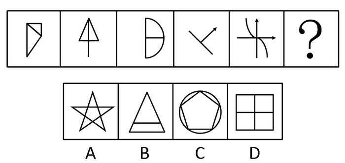
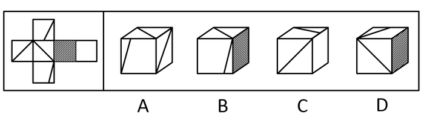
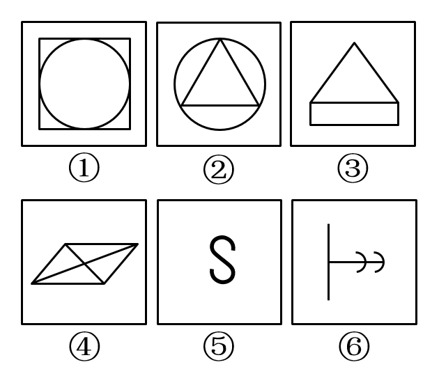
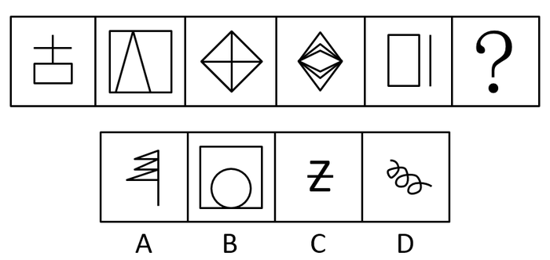
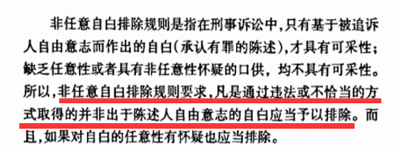

# 2018年辽宁省公务员录用考试《行测》题（网友回忆版）

> 判断推理 · 30 题 · 辽宁 2018

## 第 1 题　qid 2307699 · 图形推理

从所给的四个选项中，选择最合适的一个填入问号处，使之呈现一定的规律性：

- **A**. A
- **B**. B
- **C**. C　✅
- **D**. D

**答案**：C

**官方解析**

解析一：元素组成不同，且无明显属性规律，考虑数量规律。观察发现，题干图形封闭区域较多，考虑数面，面数量分别为2、1、4、2、3、？，无规律。继续观察发现，题干每幅图均存在外框，且外框边数分别为4、3、6、4、5、？，那么题干每幅图形的外框边数与面数量的差值均为2，只有C项符合。 
故正确答案为C。
解析二：元素组成不同，且无明显属性规律，优先考虑数量规律。观察题干图形发现封闭区域较多，优先数面。但题干图形面数量分别为2、1、4、2、3，无规律。再观察图形发现，题干有些图形有形状相同的面，故考虑数面的种类。图1（大小正方形各算一种）、3、5中均包含2种面，图2、4均包含1种面，因此问号处应选有1种面的图形。A、B项均有2种面，排除；C项没有面，排除；D项是1种面，当选。
故正确答案为D。
注：本题有两种思路，但第二种思路面的种类不太严谨，因此粉笔倾向于按照解析一将正确答案给到C。

---

## 第 2 题　qid 2307700 · 图形推理

从所给的四个选项中，选择最合适的一个填入问号处，使之呈现一定的规律性：

- **A**. A
- **B**. B
- **C**. C
- **D**. D　✅

**答案**：D

**官方解析**

元素组成不同，且无明显属性规律，优先考虑数量规律。观察发现，题干每幅图形都包含直角，因此问号处应选包含直角的图形，只有D项包含直角。
故正确答案为D。

---

## 第 3 题　qid 2307704 · 图形推理

从所给的四个选项中，选择最合适的一个填入问号处，使之呈现一定的规律性：

- **A**. A
- **B**. B
- **C**. C
- **D**. D　✅

**答案**：D

**官方解析**

元素组成相似，优先考虑样式规律。观察发现第二行图中黑块数量不同，考虑黑白运算。根据第一行的图形可得：黑+黑=黑，白+白=黑，黑+白=白，白+黑=白；第二行验证此规律成立；第三行运用规律可得？处应为D项。
故正确答案为D。

---

## 第 4 题　qid 2307708 · 图形推理

左边给定的是正方体的外表面展开图，右边哪一项能由它折叠而成？

- **A**. A
- **B**. B　✅
- **C**. C
- **D**. D

**答案**：B

**官方解析**

将原展开图标记序号如下图，逐一进行分析。

A项：选项由面a、c、d组成，展开图中面a、c、d的公共点（如图圆点）没有引出线条，选项中三个面的公共点（如图圆点）引出一条线，选项与题干不一致，排除；

B项：选项由面c、d、e组成，选项与题干一致，当选；

C项：右侧面为面f，面c与面f为相对面，因此前面为面a，选项由面a、b、f组成。展开图中面b中直角三角形的短边挨着面c，而选项中面b中直角三角形的短边挨着面f，选项与题干不一致，排除；

D项：右侧面为面e，面e与面a为相对面，因此前面为面c，选项由面b、c、e组成。展开图中面b的直角三角形的短边挨着面c，而选项中面b的直角三角形的短边没有挨着面c，选项与题干不一致，排除。

故正确答案为B。

---

## 第 5 题　qid 2307711 · 图形推理

把下面的六个图形分为两类，使每一类图形都有各自的共同特征或规律，分类正确的一项是：

- **A**. ①③⑥  ②④⑤
- **B**. ①②⑤  ③④⑥
- **C**. ①④⑤  ②③⑥　✅
- **D**. ①④⑥  ②③⑤

**答案**：C

**官方解析**

本题为分组分类题目。元素组成不同，优先考虑属性规律。观察发现，图⑤中的S为典型的中心对称特征图，考虑对称性。题干图①④⑤均为中心对称图形，图②③⑥均仅为轴对称图形，即①④⑤一组，②③⑥一组。
故正确答案为C。

---

## 第 6 题　qid 2307712 · 图形推理

从所给的四个选项中，选择最合适的一个填入问号处，使之呈现一定的规律性：

- **A**. A　✅
- **B**. B
- **C**. C
- **D**. D

**答案**：A

**官方解析**

元素组成不同，且无明显属性规律，优先考虑数量规律。观察发现，第三幅图形为“田”字变形图，考虑笔画数。题干图形的笔画数依次为2、1、2、1、2，因此问号处图形的笔画数应为1。四个选项的笔画数分别为1、1、2、1，排除C项；再观察题干图形发现均为直线图形，因此排除B、D两项。
故正确答案为A。

---

## 第 7 题　qid 2307713 · 定义判断

异株克生是指植物产生的次生代谢产物在植物生长过程中，通过信息抑制其他植物的生长、发育并加以排除的现象。
根据上述定义，下列不属于异株克生的是：

- **A**. 黑核桃的叶子含有胡桃醌，可抑制其他植物的生长
- **B**. 农民喷洒除草剂，结果把周围的稻苗也给杀死了　✅
- **C**. 苹果和梨能从果实、枝叶中游离出气态乙烯，造成周围植物枯萎、提早落叶
- **D**. 松树根分泌的一种激素可抑制桦树的生长

**答案**：B

**官方解析**

第一步：找出定义关键词。
“植物产生的次生代谢产物”、“通过信息抑制其他植物的生长、发育并加以排除”。
第二步：逐一分析选项。
A项：黑核桃叶子中的胡桃醌是植物产生的次生代谢产物，可抑制其他植物生长，符合定义，排除； 
B项：农民喷洒的除草剂，不是“植物产生的次生代谢产物”，不符合定义，当选；
C项：苹果和梨游离出的气态乙烯，是植物产生的次生代谢产物，造成周围植物枯萎，符合定义，排除；
D项：松树根分泌的激素是植物产生的次生代谢产物，可抑制桦树的生长，符合定义，排除。
本题为选非题，故正确答案为B。

---

## 第 8 题　qid 2307714 · 定义判断

根据行为人是否进行意思表示，可以将民法上的行为分为表意行为和非表意行为。表意行为，是指行为人通过意思表示进行的行为；非表意行为是指当事人无须意思表示而实施的行为，主要包括事实行为、违法行为。事实行为是指行为人主观上并没有产生民事法律关系的意思，而是依照法律的规定引起民事法律关系后果的行为。
根据上述定义，下列属于事实行为的是：

- **A**. 张三和李四签订房屋租赁合同
- **B**. 李大爷感觉自己时日无多，立下遗嘱
- **C**. 王教授撰写了一篇论文，获得该论文的著作权　✅
- **D**. 赵老板把自己的财产赠与伺候自己多年的保姆

**答案**：C

**官方解析**

第一步：找出定义关键词。
表意行为：“通过意思表示”；
非表意行为：“无须意思表示”；
事实行为：“主观上没有产生民事法律关系的意思”、“引起民事法律关系后果”。
第二步：逐一分析选项。
A项：张三和李四签订租赁合同，主观上有产生民事法律关系的意思，不符合“主观上没有产生民事法律关系的意思”，不符合定义，排除； 
B项：李大爷感觉自己时日无多，立下遗嘱，主观上有产生民事法律关系的意思，不符合“主观上没有产生民事法律关系的意思”，不符合定义，排除；
C项：王教授撰写论文，主观上没有产生民事法律关系的意思，而是依照法律的规定，获得该论文的著作权，引起了民事法律关系后果，符合定义，当选；
D项：赵老板把财产赠与保姆，主观上有产生民事法律关系的意思，不符合“主观上没有产生民事法律关系的意思”，不符合定义，排除。
故正确答案为C。

---

## 第 9 题　qid 2307716 · 定义判断

身体意象失调，又称负面身体自我，是个体对身体的消极认知、消极情感体验和相应的行为调控，它包含对体重、体形和食物等信息的刻板化、情绪化和过分强调的评价。
根据上述定义，下列不属于身体意象失调的是：

- **A**. 张贵每天出门前都在镜子前感叹半天为什么就不长肉呢
- **B**. 侯震觉得自己身材健壮，在健身房里特别爱展示自己的胸肌　✅
- **C**. 李静因为自己太胖，节食了一段时间之后被诊断出厌食症
- **D**. 赵敏整日担心自己身体发福会被丈夫抛弃

**答案**：B

**官方解析**

第一步：找出定义关键词。
“个体对身体的消极认知、情感体验、行为”、“对体重、体形和食物等信息的刻板化、情绪化、过分强调的评价”。
第二步：逐一分析选项。
A项：张贵感叹不长肉是对身体的消极体验，符合“个体对身体的消极认知、情感体验、行为”，符合定义，排除；
B项：侯震身材强壮、爱展示自己的胸肌，不符合“个体对身体的消极认知、情感体验、行为”，不符合定义，当选；
C项：李静因为太胖节食，节食是对身体的消极行为，符合“个体对身体的消极认知、情感体验、行为”，符合定义，排除；
D项：赵敏担心身体发福被丈夫抛弃，担心是一种负面情绪，符合“个体对身体的消极认知、情感体验、行为”，符合定义，排除。
本题为选非题，故正确答案为B。

---

## 第 10 题　qid 2307717 · 定义判断

鸟笼效应是指人们偶然获得一件原本不需要的物品之后，会在此基础上继续添加更多与之相关而自己不需要的东西。
根据上述定义，下列符合鸟笼效应的是：

- **A**. 李玟为了参加某电商平台满199减100的活动买了好些用不上的东西
- **B**. 张磊送了刘阿姨一条大鱼，为了收拾鱼，刘阿姨又买了一把刮鱼鳞的工具
- **C**. 单位开年会时，小丽抽中了一部手机，当天她就在网上选购了一款手机壳
- **D**. 邻居送了小咪一个鱼缸，为此她去买了几条鱼放进去，虽然她并不喜欢养鱼　✅

**答案**：D

**官方解析**

第一步：找出定义关键词。
“偶然获得不需要的物品”、“添加更多与之相关而不需要的东西”。
第二步：逐一分析选项。
A项：李玟参加满199减100的活动是主观意愿，不符合“偶然获得不需要的物品”，不符合定义，排除；
B项：刘阿姨收到了张磊送的鱼，没有提及鱼是否为刘阿姨不需要的物品，不符合“偶然获得不需要的物品”，不符合定义，排除；
C项：小丽在年会抽中一部手机，没有提及手机是否为小丽不需要的物品，不符合“偶然获得不需要的物品”，不符合定义，排除；
D项：小咪不喜欢养鱼，所以小咪收到邻居送的鱼缸，符合“偶然获得不需要的物品”，为了鱼缸购买鱼，符合“添加更多与之相关而不需要的东西”，符合定义，当选。
故正确答案为D。

---

## 第 11 题　qid 2307718 · 定义判断

非任意自白排除规则是指在刑事诉讼中，只有基于被追诉人自由意志而作出的自白（即承认有罪的供述），才具有证据能力；违背当事人意愿或违反法定程序而强制作出的供述不是自白，而是逼供。
根据上述定义，下列符合非任意自白排除规则的是：

- **A**. 犯罪嫌疑人史密斯始终不承认自己有罪，警察于是对其轮番讯问
- **B**. 警察以罗伯特家人的安全威胁其承认自己策划了恐怖袭击　✅
- **C**. 特梅尔在法庭上一直保持沉默，公诉方需要提供更多证据证明其有罪
- **D**. 某国检察机关与布朗达成协议，布朗承认指控换得减轻处罚

**答案**：B

**官方解析**

第一步：找出定义关键词。

大前提：“刑事诉讼”

第一种情况：“自由意志而作出的自白”、“接受此证据”。

第二种情况：“违背当事人意愿或违反法定程序而强制作出的供述”、“排除此证据”。

题干定义给了两种情况，选项满足其中一种情况，即符合定义。

第二步：逐一分析选项。

A项：“警察轮番讯问”可能会违背当事人的意愿，可能符合定义第二种情况，保留；

B项：“以家人的安全威胁其承认策划了恐怖袭击”一定是违反法定程序而强制作出的供述，一定符合第二种情况，保留；

C项：“在法庭上一直保持沉默”即根本没有开口，也就不存在是否是在自由意志下的供述，不符合定义两种情况，排除；

D项：“达成协议，承认指控换得减轻处罚”，但是并不明确达成协议的过程是威逼利诱还是平等协商，可能符合定义第一种情况，保留。

综上所述，B项是一定满足第二种情况，A项是可能满足第二种情况，D项是可能满足第一种情况，对比择优选择B项。

故正确答案为B。

注：本题是争议题，粉笔经过多次教研，并且查阅相关论文资料（如下图），发现“非任意自白排除规则”原文中强调的就是“非自白的供述”、“排除”，即本题的B项，争议在我们的备考阶段了解即可，可不作为重点学习题目。

---

## 第 12 题　qid 2307720 · 定义判断

初级群体指的是具有亲密的人际关系和浓厚的感情色彩的社会群体；次级群体指的是以达到实际的特殊目标为目的，通过明确的规章制度结成正规关系的社会群体。
根据上述定义，下列不涉及初级群体的是：

- **A**. 王丽颖今天过生日，公司的员工们给她买来了生日蛋糕　✅
- **B**. 张爷爷今年一百岁，为了给其祝寿晚辈们成立了一个组委会
- **C**. 李奶奶生病住院了，村里的邻居们都来医院看望她
- **D**. 赵小刚和自己的初中同学们天天在微信群里聊天

**答案**：A

**官方解析**

第一步：找出定义关键词。
初级群体：“具有亲密的人际关系和浓厚的感情色彩的社会群体”；
次级群体：“达到实际的特殊目标为目的”、“通过明确的规章制度结成正规关系的社会群体”。
第二步：逐一分析选项。
A项：公司的员工们给她（王丽颖）买来了生日蛋糕，“公司员工”是同事关系，属于次级群体，不符合定义，保留； 
B项：为了给张爷爷祝寿，晚辈们成立了组委会，“晚辈们”是张爷爷的亲人，符合“具有亲密的人际关系和浓厚的感情色彩的社会群体”，符合定义，排除； 
C项：李奶奶生病住院了，村里的邻居们都来医院看望她。“村里的邻居”是邻里关系，符合“具有亲密的人际关系和浓厚的感情色彩的社会群体”，符合定义，排除； 
D项：“赵小刚和自己的初中同学天天在微信群里聊天”，“初中同学”是同学关系，属于次级群体，不符合定义，保留。
对比A、D两项，公司的员工们给王丽颖过生日，说明此时王丽颖和公司的员工仍在同一家公司，为同事关系，但D项赵小刚和自己的初中同学们在微信群聊天，不明确此时赵小刚是否仍和初中同学在同一所学校，故A项更为明确是次级群体，一定不涉及初级群体，择优选择A项。
本题为选非题，故正确答案为A。

---

## 第 13 题　qid 2307722 · 定义判断

激情群体是指一种临时性的、高效率的，往往为某项富有挑战性的工作而临时组建的工作群体。
根据上述定义，下列属于激情群体的是：

- **A**. 某登山俱乐部组织会员进行登山训练
- **B**. 汶川地震后，某地成立一个慈善基金会，为帮助灾区发起募捐活动
- **C**. 为尽快完成进口生产线的调试工作，某汽车公司召集了公司内数名专家组成项目组　✅
- **D**. 数十名自行车爱好者组成骑车团队，相约在某个周末郊游

**答案**：C

**官方解析**

第一步：找出定义关键词。
“临时性、高效率性”、“为某项富有挑战性的工作而临时组建的工作群体”。
第二步：逐一分析选项。
A项：登山俱乐部是会员们基于爱好组建的俱乐部群体，不符合“为某项富有挑战性的工作而临时组建的工作群体”，不符合定义，排除；
B项：慈善基金会发起灾区募捐活动，虽然是临时组建的工作群体，但是为灾区募捐并不符合“某项富有挑战性的工作”，不符合定义，排除；
C项：召集数名专家组成项目组，符合“临时性、高效率性”，这些专家需要尽快完成进口生产线的调试工作，符合“为某项富有挑战性的工作而临时组建的工作群体”，符合定义，当选；
D项：自行车爱好者组成的骑车团队是基于爱好组建的群体，且郊游不符合“为某项富有挑战性的工作而临时组建的工作群体”，不符合定义，排除。
故正确答案为C。

---

## 第 14 题　qid 2307723 · 定义判断

注意分为内源性注意和外源性注意，内源性注意是指个体根据自己的目标或意图来分配注意、支配行为，是主动注意；外源性注意是指个体外部信息引起的个体注意，是被动注意。
根据上述定义，下列属于外源性注意的是：

- **A**. 为了让学生提高学习积极性，刘老师特别关注有关教学方法的书籍
- **B**. 王静为自驾游而看了大量的旅游攻略
- **C**. 刘玲因喜欢同事买的衣服去了解该服装品牌
- **D**. 这件衣服鲜艳的色彩一下吸引了陈晓的目光　✅

**答案**：D

**官方解析**

第一步：找出定义关键词。
内源性注意：“个体根据自己的目标或意图来分配注意、支配行为”、“主动注意”；
外源性注意：“个体外部信息引起的个体注意”、“被动注意”。
第二步：逐一分析选项。
A项：为了提高学生学习的积极性，刘老师主动关注有关教学方法的书籍，提高学生积极性是刘老师自己的目标，符合“个体根据自己的目标或意图来分配注意，支配行为” “主动注意”，属于内源性注意，排除；
B项：为自驾游而看了大量的旅游攻略，自驾游是王静自己的目标，符合“个体根据自己的目标或意图来分配注意，支配行为” “主动注意”，属于内源性注意，排除；
C项：刘玲因为喜欢主动去了解同事所买衣服的服装品牌，是其主动的注意，符合“个体根据自己的目标或意图来分配注意，支配行为”“主动注意”，属于内源性注意，排除；
D项：陈晓被衣服鲜艳的色彩所吸引，符合“个体外部信息引起的个体注意” “被动注意”，属于外源性注意，当选。
故正确答案为D。

---

## 第 15 题　qid 2307726 · 类比推理

争分夺秒：翻山越岭

- **A**. 深入浅出：前俯后仰
- **B**. 翻云覆雨：想方设法　✅
- **C**. 心服口服：甜言蜜语
- **D**. 以牙还牙：生气勃勃

**答案**：B

**官方解析**

第一步：判断题干词语间逻辑关系。
争分夺秒中，争分和夺秒都是动宾关系，“争”和“夺”是近义关系；翻山越岭中，翻山和越岭都是动宾关系，“翻”和“越”是近义关系。
第二步：判断选项词语间逻辑关系。
A项：深入和浅出均不是动宾关系，并且“深”和“浅”是反义关系，不是近义关系，与题干逻辑关系不一致，排除；
B项：翻云和覆雨都是动宾关系，“翻”和“覆”是近义关系；想方和设法都是动宾关系，“想”和“设”是近义关系，与题干逻辑关系一致，当选；
C项：心服和口服都是主谓关系，并且“心”和“口”是并列关系，不是近义关系，与题干逻辑关系不一致，排除；
D项：以牙和还牙都是动宾关系，但“以”和“还”不是近义关系，与题干逻辑关系不一致，排除。
故正确答案为B。

---

## 第 16 题　qid 2307732 · 类比推理

山东：河北

- **A**. 四川：重庆
- **B**. 辽宁：云南
- **C**. 天津：上海
- **D**. 山西：陕西　✅

**答案**：D

**官方解析**

第一步：判断题干词语间逻辑关系。
山东和河北都是省份，二者是并列关系，且山东和河北地理位置相邻。
第二步：判断选项词语间逻辑关系。
A项：四川是一个省份，重庆是一个直辖市，二者不是并列关系，与题干逻辑关系不一致，排除；
B项：辽宁和云南都是省份，二者是并列关系，但辽宁和云南地理位置不相邻，与题干逻辑关系不一致，排除；
C项：天津和上海都是直辖市，二者是并列关系，但天津和上海地理位置不相邻，与题干逻辑关系不一致，排除；
D项：山西和陕西都是省份，二者是并列关系，且山西和陕西地理位置相邻，与题干逻辑关系一致，当选。
故正确答案为D。

---

## 第 17 题　qid 2307736 · 类比推理

讷言敏行：《论语》

- **A**. 草木皆兵：《三国演义》
- **B**. 运筹帷幄：《左传》
- **C**. 食言而肥：《史记》
- **D**. 饮鸩止渴：《后汉书》　✅

**答案**：D

**官方解析**

第一步：判断题干词语间逻辑关系。
讷言敏行出自《论语》，二者是对应关系。
第二步：判断选项词语间逻辑关系。
A项：草木皆兵出自《晋书·苻坚载记》，不是《三国演义》，与题干逻辑关系不一致，排除；
B项：运筹帷幄出自《史记·高祖本纪》，不是《左传》，与题干逻辑关系不一致，排除；
C项：食言而肥出自《左传·哀公二十五年》，不是《史记》，与题干逻辑关系不一致，排除；
D项：饮鸩止渴出自《后汉书·霍谞传》，二者是对应关系，与题干逻辑关系一致，当选。
故正确答案为D。

---

## 第 18 题　qid 2307739 · 类比推理

小篆：隶书

- **A**. 评剧：二人转
- **B**. 拉丁文：英语　✅
- **C**. 诗歌：寓言
- **D**. 唐诗：汉乐府

**答案**：B

**官方解析**

第一步：判断题干词语间逻辑关系。
小篆和隶书都是一种字体，二者是并列关系，且隶书是由小篆简化发展而来的。
第二步：判断选项词语间逻辑关系。
A项：评剧是五大戏剧之一，二人转是中国东北地区民间戏曲，二者是并列关系，但二人转不是由评剧发展而来的，与题干逻辑关系不一致，排除；
B项：拉丁文和英语都是一种语言，二者是并列关系，且英语是由拉丁文发展而来的，与题干逻辑关系一致，当选；
C项：有的诗歌是寓言，有的诗歌不是寓言，有的寓言是诗歌，有的寓言不是诗歌，二者是交叉关系，与题干逻辑关系不一致，排除；
D项：汉乐府是专门管理乐舞教学的机构，唐诗是唐朝诗歌的通称，二者不是并列关系，与题干逻辑关系不一致，排除。
故正确答案为B。

---

## 第 19 题　qid 2307741 · 类比推理

表达：露骨：含蓄

- **A**. 意见：接纳：反对
- **B**. 道歉：虚伪：真诚　✅
- **C**. 成绩：及格：不及格
- **D**. 梦想：实现：追求

**答案**：B

**官方解析**

第一步：判断题干词语间逻辑关系。
表达可以是露骨的，也可以是含蓄的，后两词都可以用来形容表达，且露骨和含蓄为反义关系。
第二步：判断选项词语间逻辑关系。
A项：接纳意见，反对意见，后两词与意见为动宾关系，与题干逻辑关系不一致，排除；
B项：道歉可以是虚伪的，也可以是真诚的，后两词都可以用来形容道歉，且虚伪和真诚为反义关系，与题干逻辑关系一致，当选；
C项：及格和不及格不是用来形容成绩的，二者是成绩的一种描述角度，与题干逻辑关系不一致，排除；
D项：实现梦想，追求梦想，后两词与梦想为动宾关系，与题干逻辑关系不一致，排除。
故正确答案为B。

---

## 第 20 题　qid 2307746 · 类比推理

伛偻 对于（  ）相当于（  ）对于 国家

- **A**. 老翁：祖国
- **B**. 老朽：国度
- **C**. 老人：社稷　✅
- **D**. 黄发：家园

**答案**：C

**官方解析**

逐一代入选项。
A项：伛偻代指老人，老翁是老年男子，二者是种属关系，祖国是自己的国家，二者是对应关系，前后逻辑关系不一致，排除；
B项：伛偻代指老人，老朽是老年人的自称，二者无明显逻辑关系，国度指政治地理意义上的国家，二者为全同关系，前后逻辑关系不一致，排除；
C项：伛偻代指老人，社稷代指国家，且前者为后者的古称，前后逻辑关系一致，当选；
D项：伛偻和黄发都指老人，二者为全同关系，家园指家庭或家乡，家园与国家不是全同关系，前后逻辑关系不一致，排除。
故正确答案为C。

---

## 第 21 题　qid 2307747 · 类比推理

肖邦：柴可夫斯基

- **A**. 苏步青：刘微
- **B**. 齐白石：卢梭
- **C**. 霍金：哥德巴赫
- **D**. 柳公权：吴道子　✅

**答案**：D

**官方解析**

第一步：判断题干词语间逻辑关系。
肖邦是19世纪的作曲家，柴可夫斯基是19世纪的作曲家，二者均为艺术领域，且生活的年代一致。
第二步：判断选项词语间逻辑关系。
A项：苏步青是现代著名的数学家，但刘微并不是，魏晋时期有个数学家叫刘徽，与题干逻辑关系不一致，排除；
B项：齐白石是近现代中国绘画大师，卢梭是18世纪伟大的启蒙思想家，二者领域不同，生活年代也不一致，与题干逻辑关系不一致，排除；
C项：霍金是现代伟大的数学家、物理学家，哥德巴赫是17-18世纪著名的数学家，二者均为数学领域，但生活的年代不一致，与题干逻辑关系不一致，排除；
D项：柳公权是唐朝著名的书法家，吴道子是唐代著名的画家，均为艺术领域，且生活的年代一致，与题干逻辑关系一致，当选。
故正确答案为D。

---

## 第 22 题　qid 2307750 · 类比推理

（    ）对于 五音 相当于（    ）对于 七情

- **A**. 角律：情思
- **B**. 宫商：思悲　✅
- **C**. 五声：六欲
- **D**. 四书：六律

**答案**：B

**官方解析**

逐一代入选项。
A项：角律是五音的组成部分，二者是组成关系，情思指情谊、情感，不是七情的组成部分，前后逻辑关系不一致，排除；
B项：宫和商为并列关系，都是五音的组成部分，思和悲为并列关系，都是七情的组成部分，二者为组成关系，前后逻辑关系一致，当选；
C项：五声又称五音，二者为全同关系，六欲和七情为并列关系，前后逻辑关系不一致，排除；
D项：四书和五音没有明显的逻辑关系，六律和七情没有明显的逻辑关系，前后逻辑关系不一致，排除。
故正确答案为B。

---

## 第 23 题　qid 2307752 · 逻辑判断

某校招聘专任教师时有张强、李颖、王丹、赵雷、钱萍5名博士应聘。3人毕业于美国高校，2人毕业于英国高校；2人发表过SSCI论文，3人没有发表过SSCI论文。已知，张强和王丹毕业院校所在国家相同，而赵雷和钱萍毕业院校所在国家不同；李颖和钱萍发表论文的情况相同，但王丹和赵雷发表论文的情况不同。最终，英国高校培养的一位发表过SSCI论文的博士被录取。
由此可以推出：

- **A**. 张强没发过SSCI论文
- **B**. 李颖发表过SSCI论文
- **C**. 王丹毕业于英国院校
- **D**. 赵雷毕业于英国院校　✅

**答案**：D

**官方解析**

第一步：分析题干。
① 张强和王丹毕业院校所在国家相同；
② 赵雷和钱萍毕业院校所在国家不同；
③ 李颖和钱萍发表论文情况相同；
④ 王丹和赵雷发表论文情况不同。
第二步：进行推理。
根据条件②赵雷和钱萍毕业院校所在国家不同，可知两人中必有一个人与条件①中张强和王丹毕业院校相同，根据题干可知，3人毕业于美国高校，2人毕业于英国高校，因此张强和王丹肯定毕业于美国高校，排除C项；
根据条件④王丹和赵雷发表论文情况不同，可知两人中必有一个人与条件③中李颖和钱萍发表论文情况相同，根据题干可知，3人没有发表过SSCI论文，2人发表过SSCI论文，因此李颖和钱萍没有发表过SSCI论文，张强发表过SSCI论文，排除A项和B项。
故正确答案为D。

---

## 第 24 题　qid 2307755 · 逻辑判断

某专家指出因驾驶人视线偏离或分心产生的注意力不集中等分心驾驶行为是引发我国交通事故的常见且重要的原因。以下哪项如果为真，最能支持上述专家的观点？

- **A**. 开车时接电话，会使其反应时间延迟3倍
- **B**. 研究显示，欧盟国家67%的车祸是由分心驾驶导致的
- **C**. 开车时交谈发生车祸的概率是正常驾驶的19倍
- **D**. 有统计显示，在我国交通事故的致因中酒驾占1/3，分心驾驶占1/2　✅

**答案**：D

**官方解析**

第一步：找出论点和论据。
论点：因驾驶人视线偏离或分心产生的注意力不集中等分心驾驶行为是引发我国交通事故的常见且重要的原因。
论据：无。
第二步：逐一分析选项。
A项：强调开车时接电话会使反应时间延迟3倍，但是并没有提到反应时间延迟3倍就会引发交通事故，属于无关选项，排除；
B项：论述的是欧盟国家车祸的原因，与我国交通事故的原因无关，属于无关选项，排除；
C项：只是强调开车时交谈发生车祸的概率大，但并不能说明注意力不集中等分心驾驶是引发我国交通事故的重要原因，属于无关选项，排除； 
D项：通过统计数据直接指出，在我国交通事故的致因中分心驾驶占1/2，说明分心驾驶是引发我国交通事故的常见且重要的原因，当选。
故正确答案为D。

---

## 第 25 题　qid 2307757 · 逻辑判断

董事会：我们不应该再在甲项目上浪费资金了。实际上，此项目开始后，公司的市场占有率下降了。所以该项目是失败的。
董事会的论述是基于下列哪项假设？

- **A**. 在甲项目上的投入连续数年增加
- **B**. 公司市场占有率低于甲项目开始的时候
- **C**. 如果没有甲项目，公司的市场占有率不会比现在更低　✅
- **D**. 如果甲项目可以更有效地运作，公司的市场占有率会提高

**答案**：C

**官方解析**

第一步：找出论点和论据。
论点：我们不应该再在甲项目上浪费资金了。
论据：公司的市场占有率下降了，该项目是失败的。
第二步：逐一分析选项。
A项：甲项目的投入连续数年增加，只是甲项目资金的需求大，体现不出项目占有率或失败，不是论证成立的假设，排除；
B项：公司市场占有率低于甲项目开始的时候，但不能确定这就是甲项目所导致的，也有可能是其他项目所致，不是论证成立的假设，排除；
C项：如果没有甲项目，市场占有率不会这样低，可以推出是甲项目导致的市场占有率低，所以我们不应该再在甲项目上浪费资金了，是论证成立的假设，可以加强，当选；
D项：甲项目高效运作，公司的市场占有率就会提高，但不能说明甲项目现在的市场占有率是下降的，不是论证成立的假设，排除。
故正确答案为C。

---

## 第 26 题　qid 2307759 · 逻辑判断

罐子里有水果糖和奶糖两种，幼儿园老师把双手伸进罐子里，然后双手握拳各拿出一块糖。然后老师说了四句话：
①右手肯定不是水果糖。
②或者左手是水果糖，或者右手是水果糖。
③如果左手是水果糖，则右手就不是水果糖。
④左手、右手都是水果糖。
假设老师说的四句话中有三句是真的一句是假的，则下列选项正确的是：

- **A**. 左手水果糖，右手奶糖　✅
- **B**. 左手水果糖，右手水果糖
- **C**. 左手奶糖，右手奶糖
- **D**. 左手奶糖，右手水果糖

**答案**：A

**官方解析**

第一步：找矛盾。
题干中的四句话有三句是真一句是假，条件③如果左手是水果糖，则右手就不是水果糖，和条件④“左手、右手都是水果糖”是矛盾关系，必有一真必有一假，那么①②一定是真。
第二步：看其余。
根据①为真，右手不是水果糖，排除BD项；根据②为真，右手不是水果糖，“否一推一”可知左手是水果糖，只有A项符合。
故正确答案为A。

---

## 第 27 题　qid 2307761 · 逻辑判断

只有通过创造力测试的才能加入创新协会。所有加入创新协会的都会被授予创新人才称号。有的高校教师是创新协会会员。101中学的老师都没有通过创造力测试。
如果上述断定为真，可以推出下列哪项？
Ⅰ.有的高校教师被授予创新人才称号
Ⅱ.有的高校教师通过创造力测试
Ⅲ.101中学的教师中有人被授予创新人才称号

- **A**. 仅Ⅰ
- **B**. 仅Ⅱ和Ⅲ
- **C**. 仅Ⅰ和Ⅱ　✅
- **D**. 仅Ⅰ和Ⅲ

**答案**：C

**官方解析**

第一步：翻译题干。
①加入创新协会→通过创造力测试
②加入创新协会→被授予创新人才称号
③有的高校教师→创新协会会员
④101中学的老师→-通过创造力测试
第二步：逐一分析选项。
I项：根据条件②③，有的高校教师→创新协会会员→被授予创新人才称号，可以推出有的高校教师→被授予创新人才称号，可以推出；
II项：根据条件①③，有的高校教师→创新协会会员→通过创造力测试，可以推出有的高校教师→通过创造力测试，可以推出；
III项：将①逆否得到⑤：-通过创造力测试→-加入创新协会，根据条件④⑤，101中学的老师→-通过创造力测试→-加入创新协会，-加入创新协会是对②的否前，得不到确定性结论，无法推出。
因此，只有I和II可以推出。
故正确答案为C。

---

## 第 28 题　qid 2307764 · 逻辑判断

有人说：凡是考上大学的都是好好学习的学生，张三没有考上大学，所以，张三不是好好学习的学生。
以下哪一个推理明显说明上述论证不成立？

- **A**. 所有有成就者都要穿衣吃饭，我现在没有成就，所以，我不必穿衣吃饭　✅
- **B**. 商品都有使用价值，土地有使用价值，所以土地是商品
- **C**. 所有被评为优秀的公务员都有驻村工作经历，小张被评为优秀公务员，所以小张有驻村工作经历
- **D**. 偷窃是违法行为，违法行为就要被法律严惩，所以偷窃行为应该受到法律严惩

**答案**：A

**官方解析**

第一步：翻译题干。

题干的推理结构：ab，ca，所以cb。

想要说明题干论证不成立，需要选择一个与其具有相同逻辑错误的选项。

第二步：逐一分析选项。

A项：推理结构为：ab，ca，所以cb，与题干逻辑错误一致，可以说明论证不成立，当选；

B项：推理结构为：ab，cb，所以ca，与题干推理不同，无法说明论证不成立，排除；

C项：推理结构为：ab，ca，所以cb，与题干推理不同，无法说明论证不成立，排除；

D项：推理结构为：ab，bc，所以ac，与题干推理不同，无法说明论证不成立，排除。

故正确答案为A。

---

## 第 29 题　qid 2307766 · 逻辑判断

传统理论认为，人类祖先由于气候变化，树木减少，被迫离开树栖环境，选择在地面上直立行走。一项最新研究则认为，早期人类直立行走源自现今非洲东部和南部崎岖山脉地区，该地形是上新世时期火山喷发和构造板块移动形成的。人类的祖先被岩石地形和峡谷所吸引，这里可提供很好的庇护栖息地，同时有机会诱捕猎物；这种环境要求早期人类具备直立行走和攀登的能力，因此人类祖先最终逐渐进化为两足直立行走。
根据上文，可以推出的是：

- **A**. 树栖环境的破坏，迫使人们走进山地峡谷
- **B**. 人类祖先选择直立行走是为了更好适应地形环境　✅
- **C**. 地质条件的变化改变了人类早期祖先的行走方式
- **D**. 峡谷地区提供了更为丰富的食物资源

**答案**：B

**官方解析**

本题为日常结论题，根据题干信息逐一分析选项。
A项：根据第一句话可知，树栖环境的破坏，迫使人类祖先离开树栖环境，选择在地面上直立行走，并未涉及人们走进山地峡谷是由于树栖环境的破坏，无中生有，排除；
B项：根据最后一句话可知，人类祖先最终进化为两足直立行走，是因为岩石地形和峡谷地形要求早期人类具备直立行走和攀登的能力，所以人类祖先直立行走是为了适应岩石地形和峡谷地形，可以推出，当选；
C项：根据最后一句话可知，人类祖先直立行走是因为岩石地形和峡谷地形要求早期人类具备直立行走和攀登的能力，因此直立行走的原因是环境要求，而非地质条件的变化，无中生有，排除；
D项：题干指出岩石地形和峡谷地形可为人类祖先提供很好的庇护栖息地，同时有机会诱捕猎物，但是峡谷地形是否提供了更为丰富的食物资源，无从得知，无中生有，排除。
故正确答案为B。

---

## 第 30 题　qid 2307770 · 逻辑判断

一个充电宝品牌越大、容量越大，给手机充电次数越多。12,000毫安的某大品牌充电宝容量大于8000毫安的某小品牌充电宝容量。所以，12,000毫安某大品牌的充电宝比8000毫安某小品牌的充电宝给同一手机充电次数多。
下列与上述推理最为类似的是：

- **A**. 一个人越喜欢锻炼身体，他的身体越健康。小王比小张爱跑步，所以，小王身体比小张健康
- **B**. 钻石体积越大，它的总价越高。甲的钻石比乙的钻石体积大，因此，甲的钻石比乙的钻石贵
- **C**. 今年跳远冠军的成绩比前年跳远冠军的成绩好。张华是今年的跳远冠军，因此，他今年的跳远成绩比他前年的好
- **D**. 产品质量越高并且广告投入越多，产品需求就越大。甲公司产品质量和投入的广告费比乙公司的好且多，因此，甲公司产品的需求量比乙公司的需求量大　✅

**答案**：D

**官方解析**

第一步：分析题干推理形式。
充电宝品牌（A）越大且容量（B）越大→充电次数（C）越多；通过两个充电宝举例说明，充电宝品牌A1＞A2，且容量B1＞B2，所以充电次数C1&gt;C2。
第二步：逐一分析选项。
A项：越喜欢锻炼身体（A）→身体越健康（B）；小王比小张爱跑步，但锻炼身体的方式有多种，仅看跑步这一项，不能对比出谁更喜欢锻炼身体，与题干推理形式不同，排除；
B项：钻石体积（A）越大→它的总价（C）越高；通过两个钻石举例说明，钻石体积A1＞A2，所以，钻石价格C1＞C2，与题干推理形式不同，排除；
C项：今年跳远冠军的成绩→比前年跳远冠军的成绩好；该项始终讨论的是张华今年与前年的情况对比，但是张华是否是前年的跳远冠军不知道，与题干推理形式不同，排除；
D项：产品质量（A）越高且广告投入（B）越多→产品需求（C）越大；通过两个公司的产品举例说明，产品质量A1＞A2，且投入的广告费B1＞B2，所以需求量C1＞C2，与题干推理形式相同，当选。
故正确答案为D。

---
