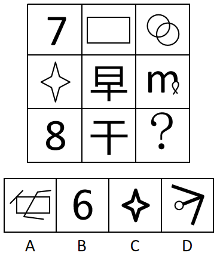
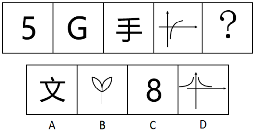
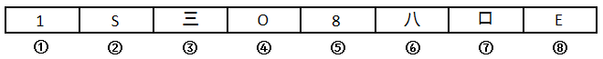
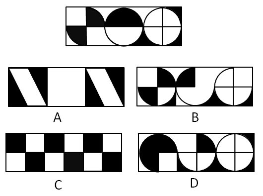
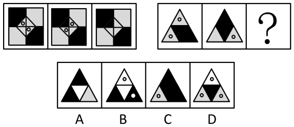
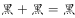
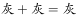
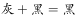
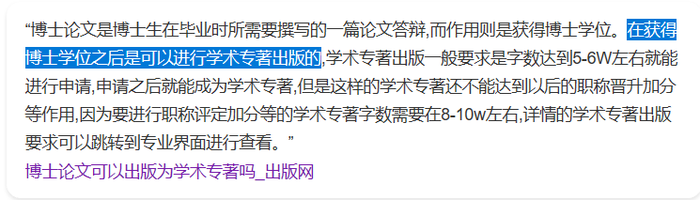

# 2018年重庆市公务员录用考试《行测》题（下半年）

> 判断推理 · 34 题 · 重庆 2018

## 第 1 题　qid 2402398 · 图形推理

从所给的四个选项中，选择最合适的一个填入问号处，使之呈现一定的规律性：

- **A**. A　✅
- **B**. B
- **C**. C
- **D**. D

**答案**：A

**官方解析**

图形元素组成不同，但无明显属性规律，优先考虑数量规律。观察发现题干图形封闭面明显，考虑数面，九宫格第一行的面数量依次为0、1、3，第二行的面数量依次为1、2、1，前两行的面数量加和均为4个，故第三行的三幅图面数量之和应为4个，第三行前两幅图面数量为2、0，则应选择一个面数量为2的选项，只有A项满足。
故正确答案为A。

---

## 第 2 题　qid 2402399 · 图形推理

从所给的四个选项中，选择最合适的一个填入问号处，使之呈现一定的规律性：

- **A**. A
- **B**. B　✅
- **C**. C
- **D**. D

**答案**：B

**官方解析**

图形元素组成不同，优先考虑属性规律，但无唯一答案，考虑数量规律。观察发现题干图形封闭面明显，考虑数面。题干每幅图形面数量依次为2、4、6，面数量呈递增规律且每次递增2，则？处应选择一个面数量为8的选项，只有B项满足。
故正确答案为B。

---

## 第 3 题　qid 2402401 · 图形推理

从所给的四个选项中，选择最合适的一个填入问号处，使之呈现一定的规律性：

- **A**. A
- **B**. B
- **C**. C
- **D**. D　✅

**答案**：D

**官方解析**

图形元素组成不同，优先考虑属性规律。观察发现题干图形均为开放图形，故？处选择一个开放图形的选项，只有D项满足。
故正确答案为D。

---

## 第 4 题　qid 2402402 · 图形推理

将下面八个图形元素分为两类，使每一类都有自己的特性和规律、则分类正确的是：

- **A**. ①②③⑦⑧，④⑤⑥
- **B**. ①③⑦⑧，②④⑤⑥　✅
- **C**. ①②⑦，③④⑤⑥⑧
- **D**. ①②⑧，③④⑤⑥⑦

**答案**：B

**官方解析**

图形元素组成不同，优先考虑属性规律。观察题干图形发现，图②④⑤⑥为全曲线图形，图①③⑦⑧为全直线图形，故①③⑦⑧分为一组，②④⑤⑥分为一组。
故正确答案为B。

---

## 第 5 题　qid 2402405 · 类比推理

下面四个选项中，与题干黑色区域面积相等的是：

- **A**. A　✅
- **B**. B
- **C**. C
- **D**. D

**答案**：A

**官方解析**

观察题干黑色区域发现黑色区域相加为一个正方形的面积，故应选择一个黑色区域面积相加为一个正方形的面积的选项，只有A项满足。
故正确答案为A。

---

## 第 6 题　qid 2402406 · 图形推理

从所给的四个选项中，选择最合适的一个填入问号处，使之呈现一定的规律性：

- **A**. A　✅
- **B**. B
- **C**. C
- **D**. D

**答案**：A

**官方解析**

九宫格优先横行看。观察发现，第一行中，图1和图2拼合得到图3；经验证，第二行也满足此规律；第三行应用此规律，图3是由三棱柱和三棱锥拼合而成，故问号处应选择一个三棱锥的图形，A项符合，当选；B、C两项是四棱锥，排除；D项三棱锥的高与图3不符，排除。

故正确答案为A。

如图所示：

 （第三行图1横躺过来，再将A项旋转在右侧进行拼合，即可得到图3）

---

## 第 7 题　qid 2402407 · 图形推理

从所给的四个选项中，选择最合适的一个填入问号处，使之呈现一定的规律性：

- **A**. A
- **B**. B　✅
- **C**. C
- **D**. D

**答案**：B

**官方解析**

元素组成不同，且无明显属性规律，考虑数量规律。题干图形均出现明显“白色窟窿”，优先考虑数面。第一组图的面数量均为5，第二组图的面数量依次为：4、4、？，故？处应该选择一个面数量为4的图形，排除D项。继续观察发现，第一组图内部的直线数均为3，第二组图内部的直线数依次为：4、4、？，故？处应该选择一个内部的直线数为4的图形，只有B项符合。
故正确答案为B。

---

## 第 8 题　qid 2402408 · 图形推理

从所给四个选项中，选择最合适的一个填入问号处，使之呈现一定的规律性：

- **A**. A
- **B**. B
- **C**. C　✅
- **D**. D

**答案**：C

**官方解析**

元素组成相似，优先考虑样式规律。外部轮廓相同，内部有黑有白，且黑白的个数不同，考虑黑白运算。第一组的运算公式为：、、；第二组应用规律，三角形左下角，排除A、B两项；三角形上方，排除D项。且观察小球的个数，第一组图小球之和为4，第二组图应用规律时，答案也对应C项。

故正确答案为C。

---

## 第 9 题　qid 2402409 · 定义判断

不道德行为是指打破了日常行为规范的行为。按照行为动机，可分为无意不道德行为和故意不道德行为，前者指在没有意识到行为的不道德属性时做出的不道德行为；后者指个体明知道行为违背了道德规范，但仍采取的不道德行为。
根据上述定义，下列属于故意不道德行为的是：

- **A**. 小刘收受男方彩礼后，男方悔婚，小刘根据当地风俗不退还男方彩礼
- **B**. 某企业为了增加品牌的热度，多次曝光企业的内幕，吸引了社会关注
- **C**. 某明星善于通过资助慈善事业获得免费的社会宣传效应
- **D**. 某公司明知合同条款对乙方不公平，仍假装承诺将履行合同　✅

**答案**：D

**官方解析**

第一步：找出定义关键词。
不道德行为：“打破了日常行为规范的行为”；
无意不道德行为：“没有意识到行为的不道德属性时做出的不道德行为”；
故意不道德行为：“明知道行为违背了道德规范，但仍采取的不道德行为”。
第二步：逐一分析选项。
A项：小刘根据当地风俗不退还男方彩礼，小刘并没有做出不道德行为，不符合定义，排除； 
B项：某企业为了增加品牌的热度，多次曝光自己的内幕，曝光自己的内幕不属于不道德行为，不符合定义，排除； 
C项：某明星善于通过资助慈善事业获得免费的社会宣传效应，明星资助慈善并非不道德行为，不符合定义，排除； 
D项：某公司明知合同条款对乙方不公平，仍假装承诺将履行合同，符合“明知道行为违背了道德规范，但仍采取的不道德行为”，符合定义，当选。
故正确答案为D。

---

## 第 10 题　qid 2402416 · 定义判断

信息文化是人们借助信息、信息资源、信息技术，从事信息活动所形成的文化形态，它是信息社会特有的文化形态，是信息社会中人们的生活样式。信息文化包括信息社会的物质文化、精神文化和制度文化。
根据上述定义，下列属于信息文化现象的是：

- **A**. 扶贫办将扶贫干部拉入“扶贫微信群”，通过微信布置工作任务　✅
- **B**. 莱布尼茨关于发明“人工语言”代替“自然语言”的思想，最终在20世纪中叶得以实现
- **C**. 二战时期，交战国均聘请数学家、逻辑学家破译敌对方的军事电报代码
- **D**. 人工智能与仿生学成为当今大学的热门专业，吸引了众多学生报考

**答案**：A

**官方解析**

第一步：找出定义关键词。
 “人们借助信息、信息资源、信息技术，从事信息活动”、“是信息社会特有的文化形态，是信息社会中人们的生活样式”。
第二步：逐一分析选项。
A项：扶贫办将扶贫干部拉入“扶贫微信群”，通过微信布置工作任务，符合“人们借助信息、信息资源、信息技术，从事信息活动”，也符合“是信息社会特有的文化形态，是信息社会中人们的生活样式”，符合定义，当选； 
B项：莱布尼茨实现用“人工语言”代替“自然语言”的思想，不明确发明“人工语言”时是否利用信息技术，不符合“人们借助信息、信息资源、信息技术，从事信息活动”，不符合定义，排除；
C项：二战时聘请数学家、逻辑学家破译敌对方的军事电报代码，不明确破译代码时是否利用信息技术，不符合“人们借助信息、信息资源、信息技术，从事信息活动”，不符合定义，排除；
D项：人工智能与仿生学吸引学生报考，不符合“人们借助信息、信息资源、信息技术，从事信息活动”，不符合定义，排除。
故正确答案为A。

---

## 第 11 题　qid 2402417 · 定义判断

罪恶关联是指通过指出某个被社会妖魔化的个人或群体也认同某观点，以此诋毁该观点。罪恶关联是一种非形式逻辑谬误，经常被有意或者无意地应用到论证场合。
根据上述定义，下列属于罪恶关联的是：

- **A**. 小明成绩很差，他这道题的解题思路肯定不正确
- **B**. 这企业的毛绒玩具可能是用“黑心棉”做的，买他们的产品就等于支持他们的违法行为，你最好不要买给孩子
- **C**. 这种人才测评方法是德国纳粹军人发明的，所以我们不应该用这种不人道的方法评价别人　✅
- **D**. 这演员演戏只会瞪眼耍帅对口型，现在居然被评为“年度最佳男主角”，这里面肯定有黑幕

**答案**：C

**官方解析**

第一步：找出定义关键词。
关键词：“指出某个被社会妖魔化的个人或群体也认同某观点”、“诋毁该观点”。
第二步：逐一分析选项。
A项：小明成绩很差，所以他这道题的解题思路肯定不正确，不符合“指出某个被社会妖魔化的个人或群体也认同某观点”，不符合定义，排除；
B项：买“黑心棉”做的毛绒玩具就等于支持他们的违法行为，不符合“指出某个被社会妖魔化的个人或群体也认同某观点”，不符合定义，排除；
C项：这种人才测评方法是德国纳粹军人发明的，符合“指出某个被社会妖魔化的个人或群体也认同某观点”，所以我们不应该用这种不人道的方法评价别人符合“诋毁该观点”，符合定义，当选；
D项：只会瞪眼耍帅对口型的演员居然被评为“年度最佳男主角”，不符合“指出某个被社会妖魔化的个人或群体也认同某观点”，不符合定义，排除。
故正确答案为C。

---

## 第 12 题　qid 2402418 · 定义判断

怀旧疗法是指通过回顾过去的事件、情感及想法，帮助老年痴呆患者增加幸福感、提高生活质量及对现有环境的舒适感知能力。
根据上述定义，下列选项中，最有可能使用了怀旧疗法的是：

- **A**. 张阿姨自从老伴儿去世后，情绪很低落，女儿将她送回老家疗养一段时间后，她心态变好了
- **B**. 文教授退休后身体状况时好时坏，但搬回大学后，马上就精神了
- **C**. 70岁的老张最近有些健忘，但他自己一拿起老照片就能讲起这些照片背后的故事
- **D**. 退休后的老张很孤独，一出门就找不到家，家人听取医生建议给他播放革命老歌舒缓情绪，一段时间后情况有所改善　✅

**答案**：D

**官方解析**

第一步：找出定义关键词。
关键词：“回顾过去的事件、情感及想法”、“帮助老年痴呆患者”、“增加幸福感、提高生活质量及对现有环境的舒适感知能力”。
第二步：逐一分析选项。
A项：张阿姨自从老伴儿去世后，情绪很低落，张阿姨并不是老年痴呆患者，不符合“帮助老年痴呆患者”，不符合定义，排除；
B项：文教授退休后身体状况时好时坏，并未提及文教授患有老年痴呆，不符合“帮助老年痴呆患者”，不符合定义，排除；
C项：老张最近有些健忘，但并未提及老张健忘就是老年痴呆，不符合“帮助老年痴呆患者”，不符合定义，排除；
D项：退休后的老张一出门就找不到家，可能是老年痴呆患者，听取医生建议给他播放革命老歌舒缓情绪，符合“通过回顾过去事件、情感及想法，增加幸福感、提高生活质量及对现有环境的舒适感知能力”，符合定义，当选。
故正确答案为D。

---

## 第 13 题　qid 2402420 · 定义判断

虚拟财产是一种能为人所支配的具有财产价值的权利，它是以电磁数据为形式存在于网络空间。虚拟财产具有虚拟性、价值性和可转让性特征。
根据上述定义，下列属于虚拟财产的是：

- **A**. 司机老王的上世纪八十年代经典歌曲的磁带
- **B**. 设计师用电脑软件创作的，保存在光盘中的设计作品
- **C**. 经扫描并存储在移动硬盘的电子版家庭旧照片
- **D**. 小明从爸爸那里获得的6位数QQ号　✅

**答案**：D

**官方解析**

第一步：找出定义关键词。
关键词：“能为人所支配的具有财产价值的权利”、“以电磁数据为形式存在于网络空间”、“具有虚拟性、价值性和可转让性”。
第二步：逐一分析选项。
A项：经典歌曲的磁带，不符合“具有虚拟性”，不符合定义，排除；
B项：保存在光盘中的设计作品，符合“能为人所支配的具有财产价值的权利”，但它并不是“以电磁数据为形式存在于网络空间”，不符合定义，排除；
C项：家庭旧照片，不符合“能为人所支配的具有财产价值的权利”，不符合定义，排除；
D项：6位数QQ号符合“能为人所支配的具有财产价值的权利”，同时也符合“以电磁数据为形式存在于网络空间”、“具有虚拟性、价值性和可转让性”，符合定义，当选。
故正确答案为D。

---

## 第 14 题　qid 2402421 · 定义判断

学术图书是指内容涉及某学科或某专业领域，具有一定创新性，对专业学习、研究具有价值的图书，通常在书中有文献注释或参考文献，书后有索引，学术专著是指对某一学科或领域或某一专题进行较为集中、系统、全面、深入论述，对特定问题有独到见解，且大多“自成体系”的单著或二三人合著的学术著作。
根据上述定义，下列属于学术专著的是：

- **A**. 某学术委员会编辑的学科词条工具书
- **B**. 某届学术会议的参会人员提交的学术论文
- **C**. 张教授作为学科带头人，总结多年教学经验，组织学科老师编写了全国第一本面向本专业研究生的高质量教材
- **D**. 小王的优秀博士生毕业论文　✅

**答案**：D

**官方解析**

第一步：找出定义关键词。

学术图书：“创新性”、“对专业学习、研究具有价值的图书”；

学术专著：“集中、系统、全面、深入论述”、“对特定问题有独到见解”。

第二步：逐一分析选项。

A项：学科词条工具书，只是对词进行解释的工具书，不符合“对特定问题有独到见解”，不符合定义，排除；

B项：参会人员提交的学术论文，不符合“集中、系统、全面、深入论述”，不符合定义，排除；

C项：张教授组织学科老师编写的的高质量教材，符合“对专业学习、研究具有价值的图书”，属于学术图书，而非学术专著，排除；

注：如下图所示，通过查询相关文献，C项的高质量教材不是学术专著。

D项：优秀博士生毕业论文，符合“集中、系统、全面、深入论述”、“对特定问题有独到见解”，符合定义，当选。

注：如下图所示，通过查询相关文献，D项的优秀博士生毕业论文是可以作为学术专著出版的。

故正确答案为D。

---

## 第 15 题　qid 2402423 · 定义判断

校园欺凌是指在幼儿园、中小学及其合理辐射区域内发生的教师或者学生针对学生的持续性的心理性或者物理性攻击行为，这些行为会使受害者感受到精神上的痛苦。
根据上述定义，下列不属于校园欺凌的是：

- **A**. 某高中体育委员经常假借“不认真锻炼”之名体罚同学
- **B**. 中学拉拉队成员小华每天都被队员们嘲笑“皮肤黑”“饭量大”
- **C**. 小学生小强与同桌因一时口角而打架，他担心第二天还会发生冲突，怎么也不愿意去学校　✅
- **D**. 半年以来，儿童小龙在放学的路上经常被几个高年级的学生拦着索要零花钱，他非常害怕，但又不敢告诉老师和家长

**答案**：C

**官方解析**

第一步：找出定义关键词。
“在幼儿园、中小学及其合理辐射区域内”、“教师或者学生针对学生的持续性的心理性或者物理性攻击行为”、“会使受害者感受到精神上的痛苦”。
第二步：逐一分析选项。
A项：“经常”符合“持续性的”，“体罚同学”符合“物理性攻击行为”、“会使受害者感受到精神上的痛苦”，符合定义，排除；
B项：“每天”符合“持续性的”，“嘲笑‘皮肤黑’‘饭量大’”符合“心理性攻击行为”、“会使受害者感受到精神上的痛苦”，符合定义，排除；
C项：“一时口角”说明不是经常性的，不符合“持续性的”，不符合定义，当选；
D项：“半年以来”符合“持续性的”，“拦着索要零花钱，他非常害怕”符合“心理性或者物理性攻击行为”、“会使受害者感受到精神上的痛苦”，符合定义，排除。
本题为选非题，故正确答案为C。

---

## 第 16 题　qid 2402424 · 类比推理

（    ）  对于  机械  相当于  粽子  对于  （    ）

- **A**. 金属 粽叶
- **B**. 铁 月饼
- **C**. 滑轮 食品　✅
- **D**. 电脑 端午

**答案**：C

**官方解析**

逐一代入选项。
A项：有的机械是金属制成的，金属是机械的或然原材料，二者是对应关系，粽叶是粽子的组成部分，前后逻辑关系不一致，排除；
B项：有的机械是铁制成的，铁是机械的或然原材料，二者是对应关系，粽子和月饼是并列关系，前后逻辑关系不一致，排除；
C项：滑轮是机械，二者是种属关系。粽子是食品，二者也是种属关系，前后逻辑关系一致，当选；
D项：电脑和机械无必然关系，端午有吃粽子的习俗，二者是对应关系，前后逻辑关系不一致，排除。
故正确答案为C。

---

## 第 17 题　qid 2402425 · 类比推理

（    ）  对于  阻塞  相当于  音乐  对于  （    ）

- **A**. 交通 激昂　✅
- **B**. 拥堵 舒缓
- **C**. 血管 娱乐
- **D**. 畅通 轻柔

**答案**：A

**官方解析**

逐一代入选项。
A项：阻塞的交通，激昂的音乐，后一个词都可以用来修饰前一个词，前后逻辑关系一致，当选；
B项：拥堵和阻塞是近义关系，舒缓的音乐，二者不是近义关系，前后逻辑关系不一致，排除；
C项：阻塞的血管，音乐是一种娱乐形式，前后逻辑关系不一致，排除；
D项：畅通和阻塞是反义关系，轻柔的音乐，前后逻辑关系不一致，排除。
故正确答案为A。

---

## 第 18 题　qid 2402426 · 类比推理

（    ）  对于  销售  相当于  稻谷  对于  （    ）

- **A**. 采购 小麦　✅
- **B**. 生产 大米
- **C**. 收益 粮食
- **D**. 企业 稻田

**答案**：A

**官方解析**

逐一代入选项。
A项：采购和销售是不同的营销环节，二者是并列关系，稻谷和小麦是不同的作物，二者是并列关系，前后逻辑关系一致，当选；
B项：生产和销售是不同的营销环节，二者是并列关系，稻谷去壳后就是大米，稻谷和大米是组成关系，前后逻辑关系不一致，排除；
C项：销售可能带来收益，二者是或然因果关系，稻谷是粮食，二者是种属关系，前后逻辑关系不一致，排除；
D项：销售是企业的行为，二者是行为的对应关系，稻谷种在稻田里，二者是地点的对应关系，前后逻辑关系不一致，排除。
故正确答案为A。

---

## 第 19 题　qid 2402427 · 类比推理

马：马车：交通

- **A**. 牛：犁：耕地　✅
- **B**. 鸽子：书信：通讯
- **C**. 蚕：蚕丝：衣服
- **D**. 茶叶：茶水：饮料

**答案**：A

**官方解析**

第一步：判断题干词语间逻辑关系。
“马”拉动“马车”，二者是动力来源的对应关系；“马车”是一种“交通”工具，二者是工具的对应关系。
第二步：判断选项词语间逻辑关系。
A项：“牛”拉动“犁”，二者是动力来源的对应关系；“犁”是一种“耕地”工具，二者是工具的对应关系，与题干逻辑关系一致，当选；
B项：“鸽子”是传递“书信”的工具，二者是工具的对应关系；“书信”是一种“通讯”方式，二者是种属关系，与题干逻辑关系不一致，排除；
C项：“蚕丝”是“蚕”的分泌物，二者是分泌物的对应关系；“蚕丝”是制作“衣服”的原材料，二者是原材料的对应关系，与题干逻辑关系不一致，排除；
D项：“茶叶”是制作“茶水”的原材料，二者是原材料的对应关系；“茶水”是一种“饮料”，二者是种属关系，与题干逻辑关系不一致，排除。
故正确答案为A。

---

## 第 20 题　qid 2402428 · 类比推理

咸：淡

- **A**. 香：臭　✅
- **B**. 痛：痒
- **C**. 麻：辣
- **D**. 肥：瘦

**答案**：A

**官方解析**

第一步：判断题干词语间逻辑关系。
咸与淡意思相反，二者是反义词，且均是一种感官感受。
第二步：判断选项词语间逻辑关系。
A项：香与臭意思相反，二者是反义词，且均是一种感官感受，与题干逻辑关系一致，当选；
B项：痛与痒均是一种感官感受，但二者不是反义词，与题干逻辑关系不一致，排除；
C项：麻与辣均是一种感官感受，但二者不是反义词，与题干逻辑关系不一致，排除；
D项：肥与瘦意思相反，二者是反义词，但不是感官感受，与题干逻辑关系不一致，排除。
故正确答案为A。

---

## 第 21 题　qid 2402429 · 类比推理

语言∶交流

- **A**. 微笑∶表达
- **B**. 歌唱∶开心
- **C**. 文字∶记录　✅
- **D**. 觅食∶充饥

**答案**：C

**官方解析**

第一步：判断题干词语间逻辑关系。
语言可以用来交流，交流是语言的功能，二者是功能对应关系。
第二步：判断选项词语间逻辑关系。
A项：表达不是微笑的功能（且表达什么没说清楚），与题干逻辑关系不一致，排除；
B项：歌唱可以使人开心，开心是歌唱的结果，二者是因果关系，与题干逻辑关系不一致，排除；
C项：文字可以用来记录，记录是文字的功能，二者是功能对应关系，与题干逻辑关系一致，当选；
D项：觅食的目的是充饥，二者是目的对应关系，与题干逻辑关系不一致，排除。
故正确答案为C。

---

## 第 22 题　qid 2402430 · 类比推理

犬∶导盲犬∶缉毒犬

- **A**. 猫∶杂交猫∶纯种猫
- **B**. 书∶漫画∶报纸
- **C**. 兔∶宠物兔∶肉兔　✅
- **D**. 菜∶蔬菜∶菌类

**答案**：C

**官方解析**

第一步：判断题干词语间逻辑关系。
导盲犬与缉毒犬是并列关系中的反对关系，二者都是犬，与第一个词均是种属关系。
第二步：判断选项词语间逻辑关系。
A项：杂交猫与纯种猫均是猫，但二者是并列关系中的矛盾关系，与题干逻辑关系不一致，排除；
B项：漫画是一种艺术形式，报纸是以刊载新闻和时事评论为主的定期向公众发行的印刷出版物或电子类出版物，二者无明显逻辑关系，与题干逻辑关系不一致，排除；
C项：宠物兔与肉兔是并列关系中的反对关系，二者均是兔，与第一个词均是种属关系，与题干逻辑关系一致，当选；
D项：有的蔬菜是菌类，有的蔬菜不是菌类，有的菌类是蔬菜，有的菌类不是蔬菜，二者是交叉关系，与题干逻辑关系不一致，排除。
故正确答案为C。

---

## 第 23 题　qid 2402431 · 类比推理

飞翔∶走路

- **A**. 相信∶偏信
- **B**. 阅读∶识字
- **C**. 默写∶背诵　✅
- **D**. 学习∶旁听

**答案**：C

**官方解析**

第一步：判断题干词语间逻辑关系。
飞翔与走路是不同的移动方式，二者是并列关系。
第二步：判断选项词语间逻辑关系。
A项：偏信也是一种相信，二者是种属关系，与题干逻辑关系不一致，排除；
B项：阅读必须要识字，识字是阅读的必要条件，与题干逻辑关系不一致，排除；
C项：默写与背诵是不同的学习方式，二者是并列关系，与题干逻辑关系一致，当选；
D项：旁听是为了学习，二者是方式目的的对应关系，与题干逻辑关系不一致，排除。
故正确答案为C。

---

## 第 24 题　qid 2402433 · 类比推理

天生丽质：倾国倾城

- **A**. 技惊四座：蟾宫折桂
- **B**. 标新立异：独树一帜　✅
- **C**. 杯弓蛇影：草木皆兵
- **D**. 绝无仅有：天下无双

**答案**：B

**官方解析**

第一步：判断题干词语间逻辑关系。
天生丽质形容天生的美丽资质；倾国倾城形容妇女容貌极美，二者为近义关系，且“倾国倾城”形容美丽的程度比“天生丽质”更深。
第二步：判断选项词语间逻辑关系。
A项：技惊四座形容一个人的技艺精湛高超，把全场人都震惊了。蟾宫折桂比喻考试高中，二者无明显逻辑关系，与题干逻辑关系不一致，排除；
B项：标新立异比喻独创新意，理论和别人不一样；独树一帜比喻与众不同，自成一家，二者为近义关系，且“独树一帜”形容与众不同的程度比“标新立异”更深，与题干逻辑关系一致，当选；
C项：杯弓蛇影比喻疑神疑鬼，妄自惊慌，草木皆兵形容人在惊慌时疑神疑鬼，二者为近义关系，但二者之间不存在程度比较，与题干逻辑关系不一致，排除；
D项：绝无仅有指只有一个，再没有别的，形容非常稀有，也用来形容人或物非常珍贵。天下无双指天下找不出第二个，形容出类拔萃，独一无二，二者为近义关系，但二者之间不存在程度比较，与题干逻辑关系不一致，排除。
故正确答案为B。

---

## 第 25 题　qid 2402434 · 逻辑判断

新世纪以来，中国社会的急速发展在创造经济高峰之时，也造成一批传统文化的丢失或者濒临消亡，为了保护传统文化，维护文化的多样性，非物质文化遗产保护理论应运而生，处境日益艰难的手工艺被拉入“非遗”的视野中作为非遗的重点保护对象，手工艺开始重现生机。“非遗”之所以对手工艺采取保护措施并非因为其实用性，而是其审美性及其所蕴含的文化内涵。
以下各项如果为真，最能质疑上述观点的是：

- **A**. 手工艺不仅价格低廉还饱含着创作者的个人生命气息
- **B**. 手工艺的实用价值被取代并非历史必然或不可逆转
- **C**. 培育后工业社会中手工艺的审美鉴赏人群是当务之急
- **D**. 我国当前手工艺的审美价值尚未得到深入有效的挖掘　✅

**答案**：D

**官方解析**

第一步：找出论点和论据。
论点：“非遗”之所以对手工艺采取保护措施并非因为其实用性，而是其审美性及其所蕴含的文化内涵。
论据：无。
本题只有论点，无明显论据。论点说的是因为手工艺具有审美性和蕴含文化内涵，并不是因为其实用性，所以“非遗”对手工艺采取保护措施。要想削弱，可以指出不是因为手工艺具有审美性和蕴含文化内涵而采取保护措施。
第二步：逐一分析选项。
A项：说的是手工艺包含创作者的个人生命气息，与题干论点说的为什么要保护手工艺没有任何关系，属于无关项，不能削弱，排除；
B项：手工艺的实用价值被取代，与为什么要保护手工艺没有关系，属于无关项，不能削弱，排除；
C项：培养手工艺的审美鉴赏人群与为什么要保护手工艺没有关系，属于无关项，不能削弱，排除；
D项：手工艺的审美价值并没有得到有效挖掘，说明不能仅仅因为手工艺具有审美价值而采取保护措施，直接否定了题干的论点，当选。
故正确答案为D。

---

## 第 26 题　qid 2402435 · 逻辑判断

高薪挖角是人才市场竞争的常见套路，公办教育领域受此浸染也非一日，比如高校人才“孔雀东南飞”现象，多年来屡屡引爆争议，针对高校人才竞争失序问题，教育部最近发出通知，表示不鼓励东部高校从中西部、东北引进人才。舆论场关于高校人才流动的争议，暴露出当下教育界一种不容忽视的倾向，即习惯用纯粹的市场思维看待教育问题，而这种价值坐标的错位必然导致种种乱象，并诱发思想上的混乱。
以下各项如果为真，最能支持上述观点的是：

- **A**. 一些高校为学科评估、争取博士点等不惜血本招揽人才
- **B**. 教育离不开市场，但是真正的教育并不是市场上的商品　✅
- **C**. 市场经济条件下，以市场思维衡量教育行为，有利有弊
- **D**. 一些学校违规补课的现象屡禁不止，甚至还受到部分家长的欢迎

**答案**：B

**官方解析**

第一步：找出论点和论据。
论点：习惯用纯粹的市场思维看待教育问题，而这种价值坐标的错位必然导致种种乱象，并诱发思想上的混乱。
论据：无
本题只有论点，无明显论据，前文的人才“孔雀东南飞”现象以及教育部发出通知都是背景内容。因此，想要加强，可优先考虑补充论据的方式。
第二步：逐一分析选项。
A项：一些高校为学科评估、争取博士点等不惜血本招揽人才，说明部分高校是以市场思维在招揽教育资源，不惜血本体现出了乱象，举例子，可以加强，保留；
B项：真正的教育并不是市场上的商品，也就是说解释了为什么不能用市场思维来看教育，当下市场和教育的思维确实错位，补充了题干的论据，可以加强，保留；
C项：以市场思维衡量教育行为，有利有弊，弊是什么不明确，也没有说市场和教育是否错位，不能加强，排除；
D项：违规补课受到家长的欢迎，与市场和教育是否错位无关，不能加强，排除。
比较A、B两项，A项是举例子补充论据加强，B项是解释补充论据加强，其中解释的力度强于举例子的力度，因此，本题正确答案为B项。
故正确答案为B。

---

## 第 27 题　qid 2402436 · 逻辑判断

听古典音乐有助于提高儿童智商，这一发现被形象地称作“莫扎特效应”。心理学家弗朗西斯·罗彻对36位大学生做了一个实验，他让其中18位学生在做一些空间推理题之前听10分钟莫扎特的D小调奏鸣曲。结果，在将一张纸叠几次剪开后会是什么形状的测试中，这18人有明显进步。
以下各项如果为真，最不能削弱上述观点的是：

- **A**. 听古典音乐的效果有1.5个智商点的提高，但仅限于折纸实验
- **B**. 听了莫扎特音乐的学生学习能力本身就比其他学生更强
- **C**. 听反向莫扎特音乐（把莫扎特音乐的音符以相反序列排列）对人有负效应，即其行为认知能力减退
- **D**. 演奏乐器时的触觉反应刺激了大脑中的皮层，使得人的脑功能达到最优化状态　✅

**答案**：D

**官方解析**

第一步：找出论点和论据。
论点：听古典音乐有助于提高儿童智商。
论据：他让其中18位学生在做一些空间推理题之前听10分钟莫扎特的D小调奏鸣曲。在将一张纸叠几次剪开后会是什么形状的测试中，这18人有明显进步。
题干通过一个实验得出结论，要想削弱，可以考虑从实验前初始条件是否一致、实验中有无其他因素影响，以及实验后的结果能否持续下去这三个角度进行削弱。
第二步：逐一分析选项。
A项：听古典音乐的效果仅限于折纸实验，说明实验的结果有局限性，削弱了题干的结论，排除；
B项：听莫扎特音乐的学生本身就比其他学生的学习能力强，说明实验前初始条件就不一致，能够削弱，排除；
C项：说明听反向莫扎特音乐无助于提高智商，反而会使得人的认知能力减退，反向莫扎特音乐是否属于古典音乐尚不确定，属于不明确选项，题目要求找的是“最不能削弱的选项”，保留；
D项：演奏乐器时的触觉反应与听莫扎特音乐是两个完全不同的事情，其次使得人的脑功能达到最优状态也不一定是对于智商的提高，属于无关项，不能削弱，保留。
比较C、D两项，C项中的反向莫扎特音乐有可能部分属于古典音乐，对智商有负面作用，可以削弱。D项并未提及听音乐这个主题，对智商的影响也不明确，优选D项。
本题为选非题，故正确答案为D。

---

## 第 28 题　qid 2402437 · 逻辑判断

美国医学专家研究发现，胰岛素既能控制血糖水平，又能调节大脑细胞功能，它可帮助脑细胞突触更好地连接沟通，形成更强的记忆。吃糖过量会导致大脑中胰岛素水平下降，记忆和学习等认知能力随之削弱。因此，专家提醒，总吃甜食会损害大脑记忆和学习能力。
以下各项如果为真，最能支持上述专家的研究结论的是：

- **A**. 研究表明，饥饿状态下吃糖是最能迅速恢复体力和脑力的，而且，吃甜食有助于改善心情
- **B**. 人脑完成认知和记忆等功能所消耗的最主要物质就是葡萄糖，人脑一天要消耗120克葡萄糖
- **C**. 糖分大大减少了大脑中“脑源性神经营养因子”（BDNF）的含量，导致记忆力容量缩小，学习能力被破坏　✅
- **D**. 大量吃糖会使体内环境转变成中性或者弱酸性，体内自由基过多，这样就会加速人脑的细胞老化，且易助长白发

**答案**：C

**官方解析**

第一步：找出论点和论据。
论点：总吃甜食会损害大脑记忆和学习能力。
论据：吃糖过量会导致大脑中胰岛素水平下降，记忆和学习等认知能力随之削弱。
题干论点和论据都在讨论吃糖和记忆、学习能力之间的关系，话题一致，可优先考虑补充论据的方式进行加强。
第二步：逐一分析选项。
A项：讨论的是饥饿状态下吃糖能够恢复体力和脑力，与论点所说的“大脑记忆和学习能力”不是同一个话题，属于无关选项，不能支持，排除；
B项：只是说人脑完成认知和记忆等功能会消耗葡萄糖，与吃甜食会不会损害记忆和学习能力没有任何关系，属于无关选项，不能支持，排除；
C项：指出糖会使得记忆力容量缩小、学习能力被破坏，解释了为什么吃糖能够损害大脑记忆和学习能力，属于补充论据的选项，能够支持，当选；
D项：讨论的是吃糖会加速人脑细胞老化和助长白发，与“损害记忆和学习能力”没有任何关系，属于无关选项，不能支持，排除。
故正确答案为C。

---

## 第 29 题　qid 2402438 · 逻辑判断

“逻辑是不可战胜的，因为反对逻辑也必须使用逻辑。”
若要使上面的陈述成立，还必须以以下哪一项为前提？

- **A**. 反对逻辑的人，不一定会使用逻辑
- **B**. 凡是使用逻辑的人，一定不会反对逻辑
- **C**. 除非反对逻辑也必须使用逻辑，否则逻辑是可以战胜的
- **D**. 如果反对逻辑也必须使用逻辑，那么逻辑是不可战胜的　✅

**答案**：D

**官方解析**

第一步：找出论点和论据。
论点：逻辑不可战胜。
论据：反对逻辑也必须使用逻辑。
第二步：逐一分析选项。
A项：指出反对逻辑的人不一定会使用逻辑，削弱论据，排除；
B项：指出使用逻辑的人不反对逻辑，与论点和论据无必然联系，无法加强，排除；
C项：选项可翻译为：逻辑不可战胜→反对逻辑也必须使用逻辑，建立了论点和论据之间的关系，但是论点推出论据，搭桥方向相反，不是论述成立的前提，排除；
D项：选项可翻译为：反对逻辑也必须使用逻辑→逻辑不可战胜，建立了论点和论据之间的关系，是论据推出论点，搭桥项，是论述成立的前提，当选。
故正确答案为D。

---

## 第 30 题　qid 2402439 · 逻辑判断

吸烟有害健康。香烟燃烧时能产生数千种化学物质，其中包括尼古丁、焦油等致癌物。为了缓解烟民们的烟瘾并兼顾他们的身体健康，人们研制了加长过滤嘴的所谓“安全香烟”。但有关医学专家认为，“安全香烟”并不安全。
下列各项如果为真，最能支持上述有关医学专家看法的是：

- **A**. 加长过滤嘴可以有效地降低香烟燃烧过程中产生的尼古丁含量
- **B**. 据统计，加长过滤并不能缓解大部分烟民的烟瘾
- **C**. 加长的过滤嘴会导致香烟燃烧不完全，使一氧化碳含量大幅升高　✅
- **D**. 烟瘾很大的烟民吸加长过滤嘴香烟时可能把烟雾吸入肺部深处

**答案**：C

**官方解析**

第一步：找出论点和论据。
论点：“安全香烟”并不安全。
论据：无 
本题只有论点没有论据，要想加强考虑补充论据。
第二步：逐一分析选项。
A项：加长过滤嘴可以降低产生尼古丁的含量，降低尼古丁的含量有益于烟民们的健康，说明“安全香烟”很安全，削弱了专家的看法，无法加强，排除；
B项：只讨论了“安全香烟”是否能够缓解烟民的烟瘾，没有讨论它是否安全，话题不一致，无法加强，排除；
C项：加长的过滤嘴会导致一氧化碳含量大幅升高，说明加长过滤嘴确实会对人体造成伤害，从而证明了“安全香烟”其实并不安全，补充了题干的论据，可以加强，保留；
D项：“安全香烟”可能把烟雾吸入肺部深处，说明它可能会损坏烟民们的健康，可以加强，保留。
对比C和D，C项“大幅升高”说明对人体的危害更大，而D项说的是“可能”，因此C的加强力度比D强。
故正确答案为C。

---

## 第 31 题　qid 2402440 · 逻辑判断

临床发现，父母双方都有高原反应的人比父母双方都没有高原反应的人，会有高原反应的概率要高4倍多，据此，有医生推测：高原反应很可能是先天性遗传。
下列各项如果为真，最能支持医生的推测的是：

- **A**. 父母双方都有高原反应的人，无论如何锻炼和预防，到高原地区后几乎都会出现高原反应　✅
- **B**. 据统计，父母亲中只有一人有高原反应的人出现高原反应的概率略高于父母双方都没有高原反应的人，远低于父母双方都有高原反应的人
- **C**. 父母双方都有高原反应的人，到高原适应一段时间后，高原反应减弱速度远低于父母双方都没有高原反应的人
- **D**. 父母双方都有高原反应的人，到高原地区即使没有高原反应，也依旧存在食欲减退、困倦疲怠等问题

**答案**：A

**官方解析**

第一步：找出论点和论据。

论点：高原反应很可能是先天性遗传。

论据：临床发现，父母双方都有高原反应的人比父母双方都没有高原反应的人，会有高原反应的概率要高4倍多。 

论点讨论的是高原反应很可能是先天性遗传，论据讨论的是父母双方都有高原反应的人会出现高原反应的概率更高。论点和论据都是说高原反应很可能是先天性遗传，话题一致，要想加强优先考虑补充论据。

第二步：逐一分析选项。

A项：讨论的是父母双方都有高原反应的人几乎都会出现高原反应，表明了高原反应很可能是先天性遗传，可以支持，保留；

B项：讨论的是父母双方都有高原反应、父母亲中只有一人有高原反应和父母双方没有高原反应的孩子出现高原反应的概率是由高到低的，肯定了论据的真实性，可以支持，保留；

C项：讨论的是父母双方都有高原反应的人和父母双方都没有高原反应的人，到高原适应一段时间后，高原反应减弱速度的快慢，与论点讨论的话题不一致，无法支持，排除；

D项：讨论的是父母双方都有高原反应的人到了高原地区之后出现的不良反应，与论点讨论的话题不一致，无法支持，排除。

比较A、B两项，A项表明父母双方都出现高原反应的孩子几乎都会出现高原反应，即高原反应很可能是先天性遗传，而B项只是说父母双方都出现高原反应的孩子出现高原反应的概率高，但是出现高原反应概率高，不一定说明高原反应是先天性遗传，所以A项的加强力度更强。

故正确答案为A。

---

## 第 32 题　qid 2402441 · 逻辑判断

喻洪，覃彬，曾智，一个是马拉松运动员，一个是跳水运动员，一个是举重运动员。跳水运动员比曾智年龄小，覃彬和跳水运动员不同龄，喻洪的年龄比举重运动员大。
根据上述已知条件，可以推出：

- **A**. 覃彬是马拉松运动员，曾智是跳水运动员，喻洪是举重运动员
- **B**. 覃彬是跳水运动员，曾智是举重运动员，喻洪是马拉松运动员
- **C**. 覃彬是举重运动员，曾智是马拉松运动员，喻洪是跳水运动员　✅
- **D**. 覃彬是跳水运动员，曾智是马拉松运动员，喻洪是举重运动员

**答案**：C

**官方解析**

第一步：分析题干。
（1）跳水运动员比曾智年龄小；
（2）覃彬和跳水运动员不同龄；
（3）喻洪的年龄比举重运动员大。
第二步：逐一分析选项。
由条件（1）可知曾智不是跳水运动员，排除A项；
由条件（2）可知覃彬不是跳水运动员，排除B、D项。
故正确答案为C 。

---

## 第 33 题　qid 2402442 · 逻辑判断

在各种食物中，含钙量占第一位的是芝麻酱，而人们熟知的牛奶仅是芝麻酱的十一分之一。某芝麻酱商家的促销广告宣称，芝麻酱的补钙效果比牛奶更好。
下列各项如果为真，最能反驳上述促销广告的是：

- **A**. “含钙量高”与“补钙效果好”是两个完全不同的概念　✅
- **B**. 牛奶含钙量并非最高，其所含的钙却是人体易于吸收的优质钙
- **C**. 芝麻酱等植物源氨基酸比例与人体差异大，其利用率远低于动物蛋白
- **D**. 许多植物性食物的含钙量都高于牛奶，但其中的草酸则会影响人体对钙的吸收

**答案**：A

**官方解析**

第一步：找出论点和论据。
论点：芝麻酱的补钙效果比牛奶更好。
论据：在各种食物中，含钙量占第一位的是芝麻酱，而人们熟知的牛奶的含钙量仅是芝麻酱的十一分之一。 
论点讨论的是芝麻酱和牛奶谁的补钙效果更好的问题，论据讨论的是芝麻酱比牛奶的含钙量高。论点讨论的是“补钙效果的问题”，论据讨论的是“含钙量高低的问题”，论点和论据话题不一致，削弱优先考虑拆桥。
第二步：逐一分析选项。
A项：切断论点“补钙效果好”和论据“含钙量高”之间的联系，拆桥项，当选；
B项：只表明牛奶含的钙易于人体吸收，但是没有说明芝麻酱含的钙是否易于被人体吸收的情况，无法削弱，排除；
C项：表明芝麻酱的利用率低于动物蛋白，但是没有说明芝麻酱和牛奶谁的补钙效果更好，无法削弱，排除；
D项：表明许多植物性食物的含钙量都高于牛奶，但是没有说明芝麻酱和牛奶谁的补钙效果更好，无法削弱，排除。
故正确答案为A。

---

## 第 34 题　qid 2402443 · 逻辑判断

如果甲和乙都没有考上研究生，那么丙就考上研究生。
要得出甲考上研究生的结论，还需基于以下哪一前提为真？

- **A**. 丙考上研究生
- **B**. 丙没有考上研究生
- **C**. 乙和丙都没有考上研究生　✅
- **D**. 乙和丙没有都考上研究生

**答案**：C

**官方解析**

第一步，翻译题干。

甲且乙没有考上研究生丙考上研究生。

第二步:逐一分析选项。

A项：丙考上研究生是题干的结论，仅根据丙考上研究生，无法反推出甲的情况，排除；

B项：如果丙没有考上研究生，可知甲或乙考上研究生。这是或然性的，也不能完全判断甲的情况，排除；

C项：如果丙没有考上研究生，可知甲或乙考上研究生。如果再补充乙没有考上研究生，可知甲必定考上研究生,当选；

D项：这里有两种情况，一是丙没上但乙考上，结合上述分析，甲可能考上也有可能没考上，无法判定甲考上与否；二是丙考上但乙没上，这样无法判断甲考上与否，排除。

故正确答案为C。

---
