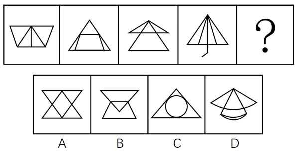
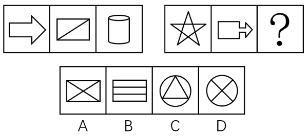
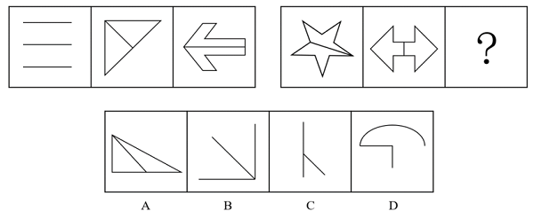
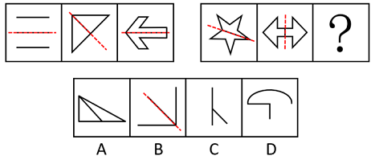
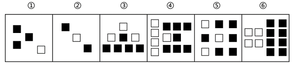

# 2018年重庆市选调优秀大学生到基层工作考试《行测》题

> 判断推理 · 30 题 · 选调 2018

## 第 1 题　qid 4695885 · 图形推理

依据图形规律，填入问号处最合适的一项是：

- **A**. A　✅
- **B**. B
- **C**. C
- **D**. D

**答案**：A

**官方解析**

元素组成相似，且相同线条重复出现，优先考虑样式规律中的加减同异。观察发现，第一组图形中的图1和图2去同存异之后得到图3，第二组图形应用此规律，图1和图2去同存异之后得到？处图形，只有A项符合。
故正确答案为A。

---

## 第 2 题　qid 4695900 · 图形推理

依据图形规律，填入问号处最合适的一项是：

- **A**. A
- **B**. B
- **C**. C　✅
- **D**. D

**答案**：C

**官方解析**

元素组成不同，观察发现，题干图形被分割、窟窿明显，优先考虑面数量。题干图形面数量均为4，故“？”处应该选择有4个面的图形，观察选项，只有C项符合。
故正确答案为C。

---

## 第 3 题　qid 4695910 · 图形推理

根据图形规律，填入问号处最合适的一项是：

- **A**. A
- **B**. B
- **C**. C　✅
- **D**. D

**答案**：C

**官方解析**

元素组成不同，且无明显属性规律，考虑数量规律。观察发现，第一组图形中图2和图3为“日”字变形图，第二组图形中图1为五角星，考虑笔画数。第一组图形均为一笔画，第二组图形中前两个图形也为一笔画，故？处图形也应该是一笔画，只有C项符合。
故正确答案为C。

---

## 第 4 题　qid 4695920 · 图形推理

根据图形规律，填入问号处最合适的一项是：

- **A**. A
- **B**. B　✅
- **C**. C
- **D**. D

**答案**：B

**官方解析**

元素组成不同，优先考虑属性规律。观察发现，第一组图形均为对称图形，且存在一条对称轴与图形中的一条线重合，经验证，第二组图形中图1、图2 也符合此规律，故“？”处应选择一个图形，其对称轴与图形中的一条线重合，只有B项符合。

故正确答案为B。

---

## 第 5 题　qid 4695924 · 图形推理

请把下面的六个图形分成两类，使每一类图形都有各自的共同特征或规律，分类正确的一项是：

- **A**. ①③④，②⑤⑥　✅
- **B**. ①③⑥，②④⑤
- **C**. ①④⑥，②③⑤
- **D**. ①②④，③⑤⑥

**答案**：A

**官方解析**

元素组成不同，且无明显属性规律，优先考虑数量规律。观察发现，题干图形均由白块和黑块两种元素构成，整体数元素个数无规律，考虑黑白分开数。从图①至图⑥，白块的数量分别为1、1、3、5、3、4，黑块的数量分别为3、2、5、7、6、8。观察发现，图①③④中黑块数量比白块数量多2，图②⑤⑥中黑块数量是白块数量的两倍。故图①③④为一组，图②⑤⑥为一组。
故正确答案为A。

---

## 第 6 题　qid 4695926 · 定义判断

信息茧房：是指在信息传播中，因公众自身的信息需求并非全方位的，公众只注意自己选择的东西和使自己愉悦的通讯领域，久而久之，会将自身桎梏于像蚕茧一般的“茧房”中。
根据以上定义，下列现象没有体现信息茧房的是（    ）。

- **A**. 在今日头条客户端，点击一条茶叶的消息之后就会不停收到各种关于茶的养生知识和广告推送
- **B**. 不少幼儿教育机构曝出的虐童事件引发了社会广泛关注　✅
- **C**. 通过RSS订阅自己喜欢的新闻栏目的内容
- **D**. 加入豆瓣的运动、摄影等兴趣小组

**答案**：B

**官方解析**

第一步：找出定义关键词。
“在信息传播中”、“因公众自身的信息需求并非全方位的”、“公众只注意自己选择的东西和使自己愉悦的通讯领域”、“将自身桎梏于像蚕茧一般的‘茧房’中”。
第二步：逐一分析选项。
A项：今日头条推送知识和广告，符合“在信息传播中”，点击一条茶叶消息后收到的也都是关于茶的消息，符合“因公众自身的信息需求并非全方位的”、“公众只注意自己选择的东西和使自己愉悦的通讯领域”、“将自身桎梏于像蚕茧一般的‘茧房’中”，符合定义，排除；
B项：幼儿教育机构曝出的虐童事件虽然引发了社会广泛关注，但公众关注该事件并不是因为自身的信息需求，虐童事件也不会使公众愉悦，不符合“因公众自身的信息需求并非全方位的”、“公众只注意自己选择的东西和使自己愉悦的通讯领域”，不符合定义，当选；
C项：订阅新闻栏目，符合“在信息传播中”，订阅自己喜欢的内容，符合“因公众自身的信息需求并非全方位的”、“公众只注意自己选择的东西和使自己愉悦的通讯领域”，符合定义，排除；
D项：豆瓣是信息传播的媒介，符合“在信息传播中”，加入自己感兴趣的小组，符合“因公众自身的信息需求并非全方位的”、“公众只注意自己选择的东西和使自己愉悦的通讯领域”，符合定义，排除。
本题为选非题，故正确答案为B。

---

## 第 7 题　qid 4695927 · 定义判断

贝勃定律：是指第一次大刺激能冲淡第二次的小刺激，人们一开始受到的刺激越强，对以后的刺激也就越迟钝。
根据上述定义，下列属于贝勃定律的是（    ）。

- **A**. 公司想赶走被视为眼中钉的人，先对这些人降薪，后将他们裁掉
- **B**. 公司想赶走被视为眼中钉的人，先对这些人无关的部门进行大规模的人事变动或裁员，然后在后续的裁员时再将矛头指向原定目标　✅
- **C**. 某公司的新产品进入市场后，市场反应良好，但是该公司经过调查认为市场趋于饱和遂决定减少该产品的产量
- **D**. 某公司的新产品进入市场后，由于市场反应良好所以扩大该产品的生产

**答案**：B

**官方解析**

第一步：找出定义关键词。
“第一次大刺激能冲淡第二次的小刺激”、“一开始受到的刺激越强，对以后的刺激也就越迟钝”。
第二步：逐一分析选项。
A项：公司想赶走被视为眼中钉的人，先对这些人降薪，后将他们裁掉，“降薪”相比于“被裁掉”，刺激是较弱的，不符合“第一次大刺激能冲淡第二次的小刺激”、“一开始受到的刺激越强，对以后的刺激也就越迟钝”，不符合定义，排除；
B项：公司想赶走被视为眼中钉的人，先对这些人无关的部门进行大规模的人事变动或裁员，然后在后续的裁员时再将矛头指向原定目标，“大规模的人事变动或裁员”相比于“在后续被裁掉的少数人”，前者是大刺激，后者是小刺激，符合“第一次大刺激能冲淡第二次的小刺激”，符合定义，当选；
C项：某公司的新产品进入市场后，市场反应良好，但是该公司经过调查认为市场趋于饱和，并没有体现出“市场反应良好”比“经过调查认为市场趋于饱和”的刺激更强，做出决定减少该产品产量的决策也说明对新的刺激并没有迟钝，不符合“一开始受到的刺激越强，对以后的刺激也就越迟钝”，不符合定义，排除；
D项：某公司的新产品进入市场后，由于市场反应良好所以扩大该产品的生产，只体现了受到“市场反应良好”这个刺激后做出了进一步的决策，不符合“一开始受到的刺激越强，对以后的刺激也就越迟钝”，不符合定义，排除。
故正确答案为B。

---

## 第 8 题　qid 4695929 · 定义判断

精准扶贫，是指针对不同贫困区域环境、不同贫困农户状况，运用科学有效的程序对扶贫对象实施精准识别、精准帮扶、精准管理的治贫方式。一般来说，精准扶贫主要是就贫困居民而言的，谁贫困就扶持谁。
根据上述定义，下列属于精准扶贫对象的是（    ）。

- **A**. 西部山区某村资源匮乏，各家各户的年轻人几乎都外出务工，只留下老人和小孩在家
- **B**. 小王文化水平不高，也没有太多技能，其所在工厂倒闭后就一直待业在家，靠领取失业金度日
- **C**. 贵州某村庄位于山谷之中，交通十分不便，除了种田之外，该村20余户村民几乎没有其他经济来源
- **D**. 张家沟的张大爷和老伴儿相依为命，去年老伴儿不慎摔倒致残，治病几乎花光了家里所有积蓄　✅

**答案**：D

**官方解析**

第一步：找出定义关键词。
“贫困居民”。
第二步：逐一分析选项。
A项：该项中的老人和小孩不明确是否为贫困居民，不符合定义，排除；
B项：该项中的小王能领失业金，说明小王不是贫困居民，不符合定义，排除；
C项：该项中的20余户村民靠种田为生，几乎没有其他经济来源不意味着是贫困居民，不符合定义，排除；
D项：该项中的张大爷的老伴儿摔倒致残，因治病几乎花光了家里所有积蓄，属于因病致贫的情况，张大爷和老伴儿属于贫困居民，符合定义，当选。
故正确答案为D。

---

## 第 9 题　qid 4695936 · 定义判断

元语言：是指描写和分析某种语言所使用的一种语言或符号集合。元语言与对象语言是相对的，任何语言，无论它是多么简单或多么复杂，当它作为被谈论的对象的时候，它就是对象语言；当它用来讨论一种语言的时候，它就是元语言。
根据上述定义，下列判断正确的是（    ）。

- **A**. 用汉语翻译一段英语时，英语是元语言
- **B**. 用英语翻译一段汉语时，英语是对象语言
- **C**. 描述某一对象所用的语言是对象语言
- **D**. 以上判断均不正确　✅

**答案**：D

**官方解析**

第一步：找出定义关键词。
元语言：“描写和分析某种语言所使用的一种语言或符号集合”、“用来讨论一种语言”；
对象语言：“作为被谈论的对象”。
第二步：逐一分析选项。
A项：该项中用汉语翻译一段英语，英语是被谈论的对象，符合“作为被谈论的对象”，符合对象语言的定义，不符合元语言的定义，排除；
B项：该项中用英语翻译一段汉语，英语是分析汉语时所用的语言，符合“描写和分析某种语言所使用的一种语言或符号集合”、“用来讨论一种语言”，符合元语言的定义，不符合对象语言的定义，排除；
C项：该项中描述某一对象所用的语言，符合“描写和分析某种语言所使用的一种语言或符号集合”、“用来讨论一种语言”，符合元语言的定义，不符合对象语言的定义，排除；
D项：A、B、C三项均错误，所以该项说法正确。
故正确答案为D。

---

## 第 10 题　qid 4695942 · 定义判断

价格歧视，通常指商品或服务的提供者在向消费者提供相同质量、相同成本的商品或服务时，在不同的消费者之间实行不同的销售价格或收费标准。
根据上述定义，下列选项中属于价格歧视的是（    ）。

- **A**. 某高校恒温游泳馆，为了吸引顾客，在冬季的时候执行优惠票价，比夏季票价便宜5元
- **B**. 某电影院在某城市新开了一家分店，为了吸引顾客，票价按另一门店的五折销售
- **C**. 某航空公司推出了会员卡服务，持有会员卡的顾客在购票时可以享受八折优惠　✅
- **D**. 某出版社再版了鲁迅文集《呐喊》，精装版定价60元，简装版定价40元

**答案**：C

**官方解析**

第一步：找出定义关键词。
“提供相同质量、相同成本的商品或服务时”、“在不同的消费者之间”、“实行不同的销售价格或收费标准”。
第二步：逐一分析选项。
A项：游泳馆冬季票价比夏季优惠，是将相同的服务按不同季节来区分收费标准，并非是按不同的消费者进行区分，不符合“在不同的消费者之间”，不符合定义，排除；
B项：电影院分店的票价按另一门店的五折销售，是将相同的服务按不同门店来区分收费标准，并非是按不同的消费者进行区分，不符合“在不同的消费者之间”，不符合定义，排除；
C项：持有会员卡的顾客在购票时可以享受八折优惠，是将消费者区分为“持有会员卡”与“不持有会员卡”两种，是将相同的服务按两种不同的消费者来区分收费标准，符合“提供相同质量、相同成本的商品或服务时”、“在不同的消费者之间”、“实行不同的销售价格或收费标准”，符合定义，当选；
D项：《呐喊》的精装版与简装版在质量与成本上不同，不符合“提供相同质量、相同成本的商品或服务时”，不符合定义，排除。
故正确答案为C。

---

## 第 11 题　qid 4695948 · 逻辑判断

如果俄罗斯参加该集团，那么美国和英国会抵制该集团；如果美国和英国有一国抵制该集团，那么该集团就不能继续存在。事实上是该集团还将继续存在。
如果上述断定为真，那么以下哪项一定为真？

- **A**. 美国参加了该集团
- **B**. 美国没有参加该集团
- **C**. 俄罗斯没有参加该集团　✅
- **D**. 美国和英国至少有一国没有参加该集团

**答案**：C

**官方解析**

第一步：翻译题干。

（1）俄罗斯参加该集团美国 且 英国抵制该集团；

（2）美国 或 英国抵制该集团该集团不能继续存在；

（3）该集团继续存在。

第二步：根据题干条件进行推理。

从确定信息进行推理，条件（3）是对条件（2）的“否后”，根据“否后必否前”和德摩根定律可得：美国 且 英国抵制该集团。在且关系中否定其中一项即可否定整个且关系，因此“美国 且 英国抵制该集团”是对条件（1）的“否后”，根据“否后必否前”可得“俄罗斯参加该集团”，对应C项。

故正确答案为C。

---

## 第 12 题　qid 4695959 · 逻辑判断

卫生部门统计，近年来癌症患者的数目不断增加，有人指出，这是因为空气污染导致的。
以下哪项如果为真，最不能削弱上述观点？

- **A**. 近年来，S市的空气污染明显加剧，但癌症患者的数目没有明显增加
- **B**. 近年来，T市的空气没有明显污染，但癌症患者的数目增加明显
- **C**. 近年来，Y市癌症患者增加了，虽然空气污染加剧了，但其水污染更严重
- **D**. 近年来，N市的空气质量得到了较大改善，其癌症患者的数目也逐年减少　✅

**答案**：D

**官方解析**

第一步：找出论点和论据。
论点：近年来癌症患者的数目不断增加是因为空气污染导致的。
论据：无。
本题只有论点，没有论据，削弱优先考虑削弱论点，且论点为因果关系，也可以考虑因果倒置（癌症患者的数目不断增加导致了空气污染）和他因削弱（其他原因导致癌症患者的数目不断增加）。
第二步：逐一分析选项。
A项：S市的空气污染加剧，但是癌症患者数目没有明显增加，说明空气污染和癌症患者数目增加之间没有明显的关系，削弱论点，可以削弱，排除；
B项：T市的空气没有明显污染，但是癌症患者数目却增加了，说明癌症患者数目增加与空气污染之间没有必然联系，削弱论点，可以削弱，排除；
C项：Y市的癌症患者数目增加了，但是其空气污染和水污染都存在，且水污染更严重，说明癌症患者数目增加也可能是水污染导致的，他因削弱，可以削弱，排除；
D项：N市的空气质量改善后其癌症患者数目也减少了，说明癌症患者数目增加和空气污染之间有关系，具有加强力度，无法削弱，当选。
本题为选非题，故正确答案为D。

---

## 第 13 题　qid 4695971 · 逻辑判断

“没有买卖就没有杀害”，这是贝克汉姆、姚明和威廉王子所作的公益广告。尽管市场上部分可以获得的象牙来自于非法捕杀的野象，但有的象牙的来源是合法的，如大象的自然死亡。所以当那些在批发市场上购买象牙的人只买合法象牙的时候，世界上所剩很少的野象群也就不会受到伤害了。
上述论断所依据的假设前提是：

- **A**. 通常象牙产品批发商没有意识到象牙供应减少的原因
- **B**. 今后对合法象牙的需要将持续增加
- **C**. 试图只买合法象牙的批发商能够准确区分合法象牙和非法象牙　✅
- **D**. 目前世界上，合法象牙的批发源较非法象牙少

**答案**：C

**官方解析**

第一步：找出论点和论据。
论点：当那些在批发市场上购买象牙的人只买合法象牙的时候，世界上所剩很少的野象群也就不会受到伤害了。
论据：尽管市场上部分可以获得的象牙来自于非法捕杀的野象，但有的象牙的来源是合法的，如大象的自然死亡。
本题论点讨论的是批发市场上只买合法象牙能使野生象群不受伤害，论据讨论的是市场上的象牙有非法象牙和合法象牙，二者话题一致，且提问为“假设前提”，加强可以考虑必要条件。
第二步：逐一分析选项。
A项：该项讨论的是象牙产品批发商意识不到象牙供应减少的原因，而论点讨论的是购买合法象牙能使野生象群不受伤害，话题不一致，无法加强，排除；
B项：该项指出今后对合法象牙的需求将持续增加，而合法象牙的需求增加不代表购买象牙的人只购买合法象牙，话题不一致，无法加强，排除；
C项：该项指出只买合法象牙的批发商能够准确区分合法象牙和非法象牙，如果只买合法象牙的批发商不能够准确区分合法象牙和非法象牙，就无法避免非法象牙的买卖，也就无法避免非法捕杀对野象群的伤害，该项为论点成立的必要条件，可以加强，当选；
D项：该项讨论的是合法象牙和非法象牙批发源的数量，而论点讨论的是购买合法象牙能使野生象群不受伤害，话题不一致，无法加强，排除。
故正确答案为C。

---

## 第 14 题　qid 828595 · 类比推理

近50年来，某市户籍人口的平均寿命提高了38岁，达到了82岁，居全国最高水平。与此同时，该市恶性肿瘤的总体发病率和死亡率也逐年上升，目前已相当于欧美等发达国家和地区的~，在世界范围内处于中等水平，在全国则处于较高水平。

由此可以推出：

- **A**. 目前该市对于恶性肿瘤的治疗水平是全国最高的
- **B**. 该市恶性肿瘤的总体发病率和死亡率其实比欧美等发达国家和地区低　✅
- **C**. 该市恶性肿瘤的总体发病率和死亡率虽逐年上升，但此类疾病并不是造成该市目前人口死亡的主要原因
- **D**. 如果50年前导致该市人口死亡的主要疾病发病率目前没有降低，那么对这些疾病的治疗水平在50年间一定有提高

**答案**：B

**官方解析**

日常结论题，根据题干信息逐一分析选项。

A项：题干第二句指出该市恶性肿瘤的总体发病率和死亡率在全国处于较高的水平，但没有提及该市对于恶性肿瘤的治疗水平是否为全国最高的，无法推出，排除；

B项：题干第二句指出该市恶性肿瘤的总体发病率和死亡率相当于欧美等发达国家和地区的~，说明该市恶性肿瘤的总体发病率和死亡率比欧美等发达国家和地区低，可以推出，当选；

C项：选项说恶性肿瘤并不是造成该市目前人口死亡的主要原因，这个“主要”是个程度性的敏感词，从文段中无法推知恶性肿瘤是否是造成该市人口死亡的主要原因，无法推出，排除；

D项：题干没有提及恶性肿瘤是否为导致该市人口死亡的主要疾病，且没有提及对疾病的治疗水平如何，无法推出，排除。

故正确答案为B。

---

## 第 15 题　qid 4696015 · 逻辑判断

很多人认为，从军是一项危险的事情。但某国军方统计数据显示，去年军人的死亡率是0.2%，而市民的死亡率为0.55%。所以，从军比不从军更安全。
以下哪项为真，最能质疑上述结论？

- **A**. 该国军方的统计数据不一定准确
- **B**. 现在是和平年代，军人的死亡率相对较低
- **C**. 近年来，环境污染和食品卫生问题导致市民死亡率较高
- **D**. 能从军的都是身体健康的青年，而市民中有很多身体虚弱的老人和病人，从而使得市民死亡率高于军人死亡率　✅

**答案**：D

**官方解析**

第一步：找出论点和论据。
论点：从军比不从军更安全。
论据：某国军方统计数据显示，去年军人的死亡率是0.2%，而市民的死亡率为0.55%。
本题论点讨论的是从军是否安全，论据讨论的是从军的死亡率比市民的死亡率低，安全一般用出事故的概率衡量而不是死亡率，论点和论据话题不一致，削弱优先考虑拆桥，即拆断死亡率低和从军安全之间的联系。
第二步：逐一分析选项。
A项：指出统计数据不一定准确，削弱论据，可以削弱，保留；
B项：指出现在军人的死亡率相对较低，和论据表述内容一致，无法削弱，排除；
C项：指出其他能够导致市民死亡率高的因素，但不确定这些因素是否会对军人有影响，无法得出从军和不从军谁更安全，无法削弱，排除；
D项：指出从军的都是身体健康的青年，市民中身体虚弱的老人和病人很多，一般身体健康的人群要比身体虚弱的老人和病人的死亡率低，即体质不同会导致死亡率不同，因此用死亡率的比较就无法得出从军与不从军谁更安全的论点，拆断了论点和论据的联系，属于拆桥项，可以削弱，保留。
对比A、D两项，拆桥的力度大于削弱论据，且A项中出现“不一定”的表述为可能性削弱，力度比较弱，因此D项力度更强，当选。
故正确答案为D。

---

## 第 16 题　qid 4696020 · 类比推理

四个商人在谈生意，他们分别是江苏人、云南人、北京人和上海人。他们做的生意分别是加工、批发、零售。其中:
①上海人单独做批发；
②北京人不做加工；
③江苏人和另外某省人同做一类生意；
④云南人不和江苏人做同一类生意；
⑤每个人只能做一种生意。
根据以上条件，推出江苏人所做的生意是：

- **A**. 加工
- **B**. 批发
- **C**. 零售　✅
- **D**. 和北京人不做同一类生意

**答案**：C

**官方解析**

第一步：分析题干条件。
①江苏人、云南人、北京人和上海人分别做加工、批发、零售；
②上海人单独做批发；
③北京人不做加工；
④江苏人和另外某省人做相同生意；
⑤云南人不和江苏人做相同生意；
⑥每个人只做一种生意。
第二步：根据题干条件进行推理。
“江苏人”出现次数最多，为最大信息，可作为突破口。根据条件①⑥可知，四个人做三种生意，每个人只做一种生意，那么只有两个人做相同生意，另两个人与其他人做的生意不同。结合条件②④⑤可知，江苏人和另外某省人做相同生意，且和云南人、上海人做的生意不同，因此江苏人和北京人做相同生意。根据条件②③可知，北京人不能做批发和加工，因此北京人只能做零售，因此江苏人也做零售。对应C项。
故正确答案为C。

---

## 第 17 题　qid 4696026 · 逻辑判断

加拿大的古动物学家戴尔·罗素认为，如果6500万年前没有陨石撞击地球，导致恐龙全部灭绝，伤齿龙就完全可能进化成为代替人类的一种动物——“恐人”，成为地球的主宰。这就是曾经风行一时的“恐人学说”。
以下哪项如果为真，最能支持上述专家结论?

- **A**. 研究证明，一些恐龙在陨石撞击地球后生存下来
- **B**. 伤齿龙是一种长相呆笨的恐龙
- **C**. 伤齿龙的大脑是恐龙中最大的，而且它的感觉器官非常发达，它被认为是最聪明的恐龙　✅
- **D**. 恐龙灭绝的原因是一个讨论至今仍未有定论的问题

**答案**：C

**官方解析**

第一步：找出论点和论据。
论点：如果6500万年前没有陨石撞击地球，导致恐龙全部灭绝，伤齿龙就完全可能进化成为代替人类的一种动物——“恐人”，成为地球的主宰。
论据：无。
本题只有论点，没有论据，加强优先考虑补充论据，即指出为什么伤齿龙就完全可能进化成为代替人类的一种动物。
第二步：逐一分析选项。
A项：该项只是说一些恐龙在陨石撞击地球后生存下来，但是没有提到伤齿龙的存活情况，也没有提到伤齿龙是否可能进化成为代替人类的一种动物，无法加强，排除；
B项：该项只是说伤齿龙的长相呆笨，但是没有提到伤齿龙是否可能进化成为代替人类的一种动物，无法加强，排除；
C项：该项说伤齿龙的大脑是恐龙中最大的，且被认为是最聪明的恐龙，指出了为什么伤齿龙完全可能进化成为代替人类的一种动物，属于补充论据，可以加强，当选；
D项：该项说恐龙灭绝的原因没有定论，不清楚是否陨石撞击地球导致恐龙灭绝，也没有提到伤齿龙是否可能进化成为代替人类的一种动物，无法加强，排除。
故正确答案为C。

---

## 第 18 题　qid 4696030 · 逻辑判断

一切有利于发展的方针政策都是符合人民根本利益的，反腐败斗争有利于发展，所以反腐败斗争是符合人民根本利益的。
以下哪一个论证与上述论证的推理最为类似?

- **A**. 凡是超越代理人权限所签订的都是无效合同，这份房地产开发合同是超越代理人权限签订的，所以它是无效的　✅
- **B**. 一切行动听指挥是一支队伍能够战无不胜的保证，所以一个地方要发展，必须提倡令行禁止，服从大局
- **C**. 如果某产品的供给超过了市场需求，就可能出现滞销。当前手机的供应量超过市场需求，因此，手机出现滞销现象
- **D**. 一切反动派都是纸老虎。所以有的纸老虎并不是反动派

**答案**：A

**官方解析**

第一步：分析题干推理形式。

题干翻译为：有利于发展的方针政策符合人民根本利益；

推理为：反腐败斗争有利于发展，所以，反腐败斗争符合人民根本利益。

所遵循的推理形式是“肯前推肯后”。

第二步：逐一分析选项。

A项：翻译为“超越代理人权限所签订的合同无效合同”，推理为：房地产开发合同是超越代理人权限签订的，所以它是无效的。推理遵循“肯前推肯后”的形式，与题干逻辑关系一致，当选；

B项：翻译为“一支队伍能够战无不胜一切行动听指挥”，推理为：地方要发展提倡令行禁止，服从大局。“地方要发展”并非“肯前”，与题干逻辑关系不一致，排除；

C项：翻译为“产品的供给超过了市场需求可能出现滞销”，推理为：手机的供应量超过市场需求，所以手机出现滞销现象。但手机出现滞销与手机可能出现滞销不同，并非“肯后”，与题干逻辑关系不一致，排除；

D项：翻译为“反动派纸老虎”，推理为：有的纸老虎反动派。并非“肯前推肯后”的形式，与题干逻辑关系不一致，排除。

故正确答案为A。

---

## 第 19 题　qid 4696037 · 逻辑判断

南方某市在提倡全民健身活动中，把爬山作为一种大家喜爱的健身活动广泛开展起来。一项调查表明，那些称自己每周固定去爬山1-2次的人近两年来由25%增加到32%，而对该市市民常去的几座主要的山进行实际的调查则显示，近两年来去该市几座主要的山爬山的市民人数却下降。
以下哪项如果为真，最有助于解释上述看来矛盾的断定?

- **A**. 调研时，没有考虑调研对象，即爬山的对象主要是青壮年
- **B**. 随着人们生活改善，大部分市民喜欢开车自驾去爬其他省、市的山　✅
- **C**. 该市在人们常去的几座山改善了相关设施，方便人们爬山
- **D**. 受调查的登山爱好者只占全市登山爱好者的10%

**答案**：B

**官方解析**

第一步：找出题干矛盾。
某市每周固定爬山1-2次的人近两年占比增加，但在该市几座主要的山爬山的市民人数却下降。
第二步：逐一分析选项。
A项：说明爬山的对象主要是青壮年，但即使调研对象选择得不科学，每周固定去爬山1-2次的人占比确实在增加，无法解释为什么去该市几座主要的山爬山的市民人数反而下降了，不能解释题干矛盾，排除；
B项：说明大部分市民喜欢去其他省、市爬山，所以即使每周固定去爬山1-2次的人占比增加，但去该市几座主要的山爬山的市民人数却下降了，可以解释题干矛盾，当选；
C项：说明本市的几座山相关设施完善，设施完善本可以吸引更多人，无法解释为什么去该市几座主要的山爬山的市民人数反而下降了，不能解释题干矛盾，排除；
D项：说明受调查的登山爱好者占全市登山爱好者的比例低，但即使调研对象选择得不科学，每周固定去爬山1-2次的人占比确实在增加，无法解释为什么去该市几座主要的山爬山的市民人数反而下降了，不能解释题干矛盾，排除。
故正确答案为B。

---

## 第 20 题　qid 4696047 · 逻辑判断

前不久，广药集团董事长宣布：喝王老吉凉茶可以延长寿命大约10%。据称，通过对576只大鼠样本为期两年的安全性实验，发现实验组给出喝王老吉凉茶的雌性大鼠的统计存活时间为708.2天，而对照组雌性大鼠统计存活时间为675.1天，实验组比对照组高出33.1天，显示王老吉凉茶具有延长动物寿命的作用。因此得出该结论。
以下哪项如果为真，最能够推翻上述结论?

- **A**. 动物实验中得出的结论不能直接推广到人身上　✅
- **B**. 实验中只用雌性大鼠，缺少雄性大鼠的数据支持
- **C**. 对照组的食谱中缺乏碳水化合物，而实验组摄取的王老吉含有大量糖
- **D**. 王老吉凉茶含糖量很高，长期饮用将会摄入大量糖分，不利于健康

**答案**：A

**官方解析**

第一步：找出论点和论据。
论点：喝王老吉凉茶可以延长寿命大约10％。
论据：通过对576只大鼠样本为期两年的安全性实验，发现实验组给出喝王老吉凉茶的雌性大鼠的统计存活时间为708.2天，而对照组雌性大鼠统计存活时间为675.1天，实验组比对照组高出33.1天，显示王老吉凉茶具有延长动物寿命的作用。
论点讨论喝王老吉凉茶可以延长寿命，论据讨论对大鼠的实验显示喝王老吉凉茶可延长动物寿命，二者主体不一致，削弱优先考虑拆桥。
第二步：逐一分析选项。
A项：动物实验的结论不能直接推广到人身上，说明大鼠喝王老吉凉茶能延长寿命不代表人类喝王老吉凉茶也能延长寿命，切断了论点和论据之间的关系，拆桥项，可以削弱，保留；
B项：实验缺少雄性大鼠的数据支持，说明实验数据有漏洞，削弱论据，可以削弱，保留；
C项：对照组的食谱缺乏碳水化合物，而实验组摄取的王老吉凉茶含有大量糖，糖属于碳水化合物，说明王老吉凉茶含有的碳水化合物可能是实验组老鼠寿命更长的原因，是对题干的加强，无法削弱，排除；
D项：长期饮用王老吉凉茶不利于健康，而论点讨论喝王老吉凉茶可延长寿命，不利于健康不代表无法延长寿命，无法削弱，排除。
比较A、B两项，A项拆桥的削弱力度大于B项削弱论据的削弱力度，因此优选A项。
故正确答案为A。

---

## 第 21 题　qid 4696054 · 类比推理

生产：利润

- **A**. 投入：效益　✅
- **B**. 经营：税收
- **C**. 资本：收益
- **D**. 本金：回报

**答案**：A

**官方解析**

第一步：判断题干词语间逻辑关系。
通过生产获得利润，二者为方式目的的对应关系。
第二步：判断选项词语间逻辑关系。
A项：通过投入获得效益，二者为方式目的的对应关系，与题干逻辑关系一致，当选；
B项：经营不是为了获得税收，二者并非方式目的的对应关系，与题干逻辑关系不一致，排除；
C项：通过投入资本获得收益，而非资本，与题干逻辑关系不一致，排除；
D项：通过投入本金获得回报，而非本金，与题干逻辑关系不一致，排除。
故正确答案为A。

---

## 第 22 题　qid 7291 · 类比推理

颓废：奋发

- **A**. 厌恨：发怒
- **B**. 爱戴：憎恨　✅
- **C**. 恋爱：分手
- **D**. 隐藏：发现

**答案**：B

**官方解析**

第一步：判断题干词语间逻辑关系。
题干两词为反义词。颓废和奋发是反义词。
第二步：判断选项词语间逻辑关系。
A项厌恨和发怒词意相近，不符合题干逻辑；
B项爱戴和憎恨是一对反义词；
C项恋爱和分手不是反义词关系，分手的反义词应是和好；
D项隐藏的反义词应该是暴露而不是发现。
故正确答案为B。

---

## 第 23 题　qid 4696061 · 类比推理

联合：合作

- **A**. 淡然：淡泊　✅
- **B**. 学习：努力
- **C**. 同事：朋友
- **D**. 满意：幸福

**答案**：A

**官方解析**

第一步：判断题干词语间逻辑关系。
联合指联系使不分散、结合；合作指互相配合做某事或共同完成某项任务，二者为近义关系。
第二步：判断选项词语间逻辑关系。
A项：淡然形容不经心，不在意；淡泊指不追求名利，不热衷，二者为近义关系，与题干逻辑关系一致，当选；
B项：努力地学习，二者为偏正结构，与题干逻辑关系不一致，排除；
C项：同事指在同一单位工作的人；朋友指彼此有交情的人，二者为交叉关系，与题干逻辑关系不一致，排除；
D项：满意指愿望得到满足，符合心意；幸福指生活、境遇称心如意，二者无明显逻辑关系，与题干逻辑关系不一致，排除。
故正确答案为A。

---

## 第 24 题　qid 4696073 · 类比推理

医生：病人

- **A**. 加油站：汽油
- **B**. 法官：原告
- **C**. 股民：企业
- **D**. 师傅：徒弟　✅

**答案**：D

**官方解析**

第一步：判断题干词语间逻辑关系。
医生治疗病人，二者构成主宾结构，且医生和病人是一一对应的关系。
第二步：判断选项词语间逻辑关系。
A项：加油站里有汽油，二者为地点与事物的对应关系，与题干逻辑关系不一致，排除；
B项：法官审问原告，二者构成主宾关系，但法官的对象除了原告，还有被告，且被告和原告地位平等，法官和原告不是一一对应的关系，与题干逻辑关系不一致，排除；
C项：股民指从事股票交易的个人投资者，可以买进或卖出企业发行的股票，二者为对应关系，与题干逻辑关系不一致，排除；
D项：师傅教徒弟，二者构成主宾关系，且师傅和徒弟是一一对应的关系，与题干逻辑关系一致，当选。
故正确答案为D。

---

## 第 25 题　qid 4696075 · 类比推理

伤心 对于 （    ） 相当于 悲痛 对于 （    ）

- **A**. 唏嘘不已：呼天抢地
- **B**. 椎心泣血：潸然泪下
- **C**. 唏嘘不已：破涕为笑
- **D**. 椎心泣血：呼天抢地　✅

**答案**：D

**官方解析**

逐一代入选项。
A项：唏嘘不已指伤心地哭泣，难以自止，与伤心为近义关系；呼天抢地指大声叫天，用头撞地，形容极度悲痛，与悲痛为近义关系，前后逻辑关系一致，保留；
B项：椎心泣血指捶打胸膛，哭得眼中出血，形容极度悲痛的样子，与伤心为近义关系；潸然泪下形容哀伤的样子，与悲痛为近义关系，前后逻辑关系一致，保留；
C项：唏嘘不已指伤心地哭泣，难以自止，与伤心为近义关系；破涕为笑指停止哭泣而笑了起来，形容转悲为喜，与悲痛为反义关系，前后逻辑关系不一致，排除；
D项：椎心泣血指捶打胸膛，哭得眼中出血，形容极度悲痛的样子，与伤心为近义关系；呼天抢地指大声叫天，用头撞地，形容极度悲痛，与悲痛为近义关系，前后逻辑关系一致，保留。
对比A、B、D三项，D项中椎心泣血形容极度伤心，呼天抢地形容极度悲痛，前后两组词语在程度上均有加深，而A项中的唏嘘不已仅指伤心，没有程度上的加深，B项中的潸然泪下在程度上比悲痛轻，故D项前后两组词语的逻辑关系更一致，当选。
故正确答案为D。

---

## 第 26 题　qid 4696080 · 类比推理

（    ） 对于 凤梨 相当于 服装 对于 （    ）

- **A**. 果树：毛衣
- **B**. 苹果：衣服
- **C**. 梨树：鞋帽
- **D**. 水果：T恤　✅

**答案**：D

**官方解析**

逐一代入选项。
A项：凤梨生长在地上，并非生长在果树上，二者无明显逻辑关系；毛衣是服装，二者是种属关系，前后逻辑关系不一致，排除；
B项：苹果与凤梨都是水果，二者是并列关系；服装是衣服鞋帽的总称，衣服是服装，二者是种属关系，但现在服装多指衣服，也可以看成是全同关系，此处不管是看成全同关系还是种属关系，前后逻辑关系均不一致，排除；
C项：凤梨生长在地上，并非生长在梨树上，二者无明显逻辑关系；鞋帽是服装，二者是种属关系，前后逻辑关系不一致，排除；
D项：凤梨是水果，二者是种属关系；T恤是服装，二者是种属关系，前后逻辑关系一致，当选。
故正确答案为D。

---

## 第 27 题　qid 4696084 · 类比推理

台风 对于 （    ） 相当于 飓风 对于 （    ）

- **A**. 大西洋：太平洋
- **B**. 印度洋：太平洋
- **C**. 大西洋：印度洋
- **D**. 太平洋：大西洋　✅

**答案**：D

**官方解析**

逐一代入选项。
A项：台风发生于南海与西北太平洋，与大西洋无明显逻辑关系，二者无明显逻辑关系；飓风发生于大西洋和东太平洋，二者为地点的对应关系，前后逻辑关系不一致，排除；
B项：台风发生于南海与西北太平洋，与印度洋无明显逻辑关系，二者无明显逻辑关系；飓风发生于大西洋和东太平洋，二者为地点的对应关系，前后逻辑关系不一致，排除；
C项：台风发生于南海与西北太平洋，与大西洋无明显逻辑关系，二者无明显逻辑关系；飓风发生于大西洋和东太平洋，与印度洋无明显逻辑关系，二者无明显逻辑关系，前后逻辑关系不一致，排除；
D项：台风发生于南海与西北太平洋，二者为地点的对应关系；飓风发生于大西洋和东太平洋，二者为地点的对应关系，前后逻辑关系一致，当选。
故正确答案为D。

---

## 第 28 题　qid 4696091 · 类比推理

处理器：硬盘：计算机

- **A**. 大海：湖泊：河流
- **B**. 话筒：听筒：电话　✅
- **C**. 单词：句子：文章
- **D**. 水分：光照：植物

**答案**：B

**官方解析**

第一步：判断题干词语间逻辑关系。
处理器一般指中央处理器（简称CPU），与硬盘均为计算机的组成部件，二者为并列关系，且二者与计算机均构成组成关系。
第二步：判断选项词语间逻辑关系。
A项：大海、湖泊与河流是三种不同的水体，三者为并列关系，与题干逻辑关系不一致，排除；
B项：话筒和听筒均为电话的的组成部件，二者为并列关系，且二者与电话均构成组成关系，与题干逻辑关系一致，当选；
C项：单词是句子的组成部分，句子是文章的组成部分，均构成组成关系，与题干逻辑关系不一致，排除；
D项：水分和光照是植物生长的必要条件，二者与植物均为必要条件的对应关系，与题干逻辑关系不一致，排除。
故正确答案为B。

---

## 第 29 题　qid 4696098 · 类比推理

人大代表：会议：提案

- **A**. 赛车手：场地：赛车　✅
- **B**. 歌手：演唱会：道具
- **C**. 员工：谈判：胜利
- **D**. 运动员：运动会：记录

**答案**：A

**官方解析**

第一步：判断题干词语间逻辑关系。
可以造句为：人大代表在会议上提案，且提案是人大代表的工作职责。
第二步：判断选项词语间逻辑关系。
A项：可以造句为：赛车手在场地上赛车，且赛车是赛车手的工作职责，与题干逻辑关系一致，当选；
B项：不能造句为：歌手在演唱会上道具，且道具不是歌手的工作职责，与题干逻辑关系不一致，排除；
C项：不能造句为：员工在谈判上胜利，与题干逻辑关系不一致，排除；
D项：不能造句为：运动员在运动会上记录，且记录为动词，不是运动员的工作职责，可造句为运动员在运动会上打破“纪录”，与题干逻辑关系不一致，排除。
故正确答案为A。

---

## 第 30 题　qid 4696101 · 类比推理

岩石：地壳：地理

- **A**. 热带：赤道：雨林
- **B**. 洛杉矶：好莱坞：电影
- **C**. 单词：句子：文章　✅
- **D**. 植物：光照：生物学

**答案**：C

**官方解析**

第一步：判断题干词语间逻辑关系。
地壳由岩石组成，二者为组成关系；地理是世界或某一地区的自然环境及社会要素的统称，地壳是地球固体地表构造的最外圈层，因此，地壳与地理也是组成关系。
第二步：判断选项词语间逻辑关系。
A项：热带地处赤道两侧，二者为对应关系，与题干逻辑关系不一致，排除；
B项：好莱坞位于洛杉矶，二者为地点对应关系，与题干逻辑关系不一致，排除；
C项：句子是由单词组成的，文章是由句子组成的，均为组成关系，与题干逻辑关系一致，当选； 
D项：植物的生长需要光照，二者为条件对应关系，与题干逻辑关系不一致，排除。
故正确答案为C。

---
