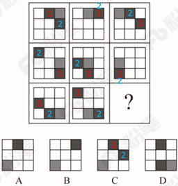
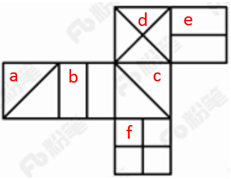

# 2018年黑龙江省公务员考试（乡镇）题（网友回忆版）

> 判断推理 · 35 题 · 黑龙江 2018

## 第 1 题　qid 2189463 · 图形推理

从所给的四个选项中，选出最合适的一个填入问号处，使之呈现一定的规律性：

- **A**. A　✅
- **B**. B
- **C**. C
- **D**. D

**答案**：A

**官方解析**

元素组成相似，优先考虑样式规律。第一组图中，图一和图二去同求异得到图三，第二组图也应该满足此规律，只有A项符合。
故正确答案为A。

---

## 第 2 题　qid 2188596 · 图形推理

从所给四个选项中，选出最合适的一个填入问号处，使之呈现一定规律性：

- **A**. A
- **B**. B　✅
- **C**. C
- **D**. D

**答案**：B

**官方解析**

元素组成不同，且无明显属性规律，优先考虑数量规律。观察题干发现，折线与直线相交，形成明显的“窟窿”，优先考虑数面。题干图形面数量依次为：1、2、3、4，故？处为5个面，C、D项为4个面，排除。对比A、B项，发现A项折线开口朝下，B项折线开口朝上，而题干图形折线开口朝向依次为：上、下、上、下，故？处开口朝上，B项当选。
故正确答案为B。

---

## 第 3 题　qid 2188604 · 图形推理

从所给四个选项中，选出最合适的一个填入问号处，使之呈现一定规律性：

- **A**. A
- **B**. B
- **C**. C　✅
- **D**. D

**答案**：C

**官方解析**

元素组成相同，优先考虑位置规律。九宫格优先横行看，第一行黑块1在最外圈沿着顺时针的方向移动，黑块2在最外圈沿着逆时针的方向移动，灰块依次从右向左平移一格。第二行验证发现符合此规律。则？处黑块1应出现在第一行第二列，黑块2应出现在第二行第三列，灰块应出现在第三行第一列，只有C项符合。

故正确答案为C。

---

## 第 4 题　qid 2187802 · 图形推理

从所给的四个选项中，选择最合适的一个填入问号处，使之呈现一定的规律性：

- **A**. A
- **B**. B　✅
- **C**. C
- **D**. D

**答案**：B

**官方解析**

元素组成不同，无明显属性规律，考虑数量规律。观察发现，题干图形均有面，考虑数面，数量依次为3、4、5、6、8，没有规律，再观察发现每个图形中均有形状相同的面，且数量依次为2、3、4、5、6，？，问号处图形应该含有7个形状相同的面。A项6个，B项7个，C项2个，D项没有形状相同的面，只有B项符合。
故正确答案为B。

---

## 第 5 题　qid 2188609 · 图形推理

左图给定的是正方体纸盒的外表面，下面哪一项能由它折叠而成？

- **A**. A
- **B**. B
- **C**. C　✅
- **D**. D

**答案**：C

**官方解析**

本题考查六面体的空间重构。将题干展开图中的面依次标号，如下图：

A项：选项中的三个面分别是面a、面b（或面e）、面c，面a和面c中间相隔一个面，二者是相对面，相对面不能同时出现，排除；

B项：选项中的三个面分别是面b、面e、面d，面b和面e是“Z”字形的两端，二者是相对面，相对面不能同时出现，排除；

C项：与题干展开图一致，当选；

D项：选项中三个面分别是面a（或面c）、面d、面f，面d和面f中间相隔一个面，二者是相对面，相对面不能同时出现，排除。

故正确答案为C。

---

## 第 6 题　qid 2188476 · 定义判断

前摄抑制是指先学习的材料对识记和回忆后学习的材料所产生的干扰作用；倒摄抑制是指后学习的材料对识记和回忆先学习的材料所产生的干扰作用。
根据上述定义，下列选项只包含倒摄抑制的是：

- **A**. 背课文时发现中间段落往往是最难记住的
- **B**. 一天中，人们一般在早晨和夜晚的记忆效果最佳
- **C**. 学习英文字母后，之前学的拼音字母会读错　✅
- **D**. 头部受伤后，回忆不起来之前发生的事情

**答案**：C

**官方解析**

第一步：找出定义关键词。
前摄抑制：“先学习的材料对识记和回忆后学习的材料所产生的干扰作用”；
倒摄抑制：“后学习的材料对识记和回忆先学习的材料所产生的干扰作用”。
第二步：逐一分析选项。
A项：背课文中间段落最难记住，说明前面段落和后面段落都对中间段落产生了影响，即“先学习的材料”和“后学习的材料”分别对“对回忆后学习的材料产生了干扰作用”和“对回忆先学习的材料产生了干扰作用”，因此选项中既包含了前摄抑制，又包含了倒摄抑制，排除；
B项：早晨和夜晚的记忆效果最佳，只是说记忆效果的好坏，并不涉及学习材料，不包含倒摄抑制，排除；
C项：之前的拼音字母会读错，说明后学的英文字母对先学的拼音字母产生了影响，即“后学习的材料对识记和回忆先学习的材料所产生的干扰作用”，选项中只包含倒摄抑制，当选；
D项：由于头部受伤而导致回忆不起来之前的事情，没有提到“先、后学习的材料对识记和回忆后、先学习的材料所产生的干扰作用”，因此选项中既没有包含前摄抑制，也没有包含倒摄抑制，排除。
故正确答案为C。

---

## 第 7 题　qid 2188615 · 定义判断

间接正犯又称为间接实行犯，是指利用他人为道具而实施犯罪的实行行为，利用者通过支配被利用者的工具行为实现自己的犯罪意图。利用者与被利用者不构成共同犯罪。它包括以下两种情况：一是利用无刑事责任能力人犯罪；二是利用他人过失或不知情的行为犯罪。
根据上述定义，下列甲的行为属于间接正犯的是：

- **A**. 甲挑唆乙和丙的关系，致使乙一怒之下将丙打成重伤。甲、乙、丙均为完全刑事责任能力人
- **B**. 甲教唆精神病人乙用刀砍伤与其素有仇怨的丙。甲、丙为完全刑事责任能力人，乙为无刑事责任能力人　✅
- **C**. 甲派员工乙殴打一直欠钱不还的丙，并允诺给其好处，乙随后将丙打伤。甲、乙、丙均为完全刑事责任能力人
- **D**. 甲让自己尚未成年的孩子乙诬告丙，未想到乙捏造的事实正是丙客观存在的事实。甲、丙为完全刑事责任能力人，乙为无刑事责任能力人

**答案**：B

**官方解析**

第一步：找出定义关键词。
“利用他人为道具而实施犯罪的实行行为”、“利用者与被利用者不构成共同犯罪”、“两种情况：一是利用无刑事责任能力人犯罪；二是利用他人过失或不知情的行为犯罪”。
第二步：逐一分析选项。
A项：甲挑唆乙和丙的关系，致使乙将丙打伤，但甲、乙、丙均是完全刑事责任能力人，且乙知情，不符合“两种情况：一是利用无刑事责任能力人犯罪；二是利用他人过失或不知情的行为犯罪”中的任何一种，不符合定义，排除；
B项：甲教唆乙将丙砍伤，符合“利用他人为道具而实施犯罪的实行行为”,被利用的乙是无刑事责任能力人，符合“利用无刑事责任能力人犯罪”的情况，符合定义，当选；
C项：甲派乙殴打丙，乙是被利用者，但甲、乙、丙均是完全刑事责任能力人，且乙知情，不符合“两种情况：一是利用无刑事责任能力人犯罪；二是利用他人过失或不知情的行为犯罪”中的任何一种，不符合定义，排除；
D项：甲让自己的孩子乙诬告丙，乙虽然是无刑事责任能力人，但乙捏造的事实正是丙客观存在的，并非诬告，因此不符合“利用无刑事责任能力人犯罪”，不符合定义，排除。
故正确答案为B。

---

## 第 8 题　qid 2188626 · 定义判断

趋同进化是遗传学中的一个概念，指的是不同的物种在进化过程中，由于适应相似的环境而呈现出表型上的相似性。而趋异进化则相反，它是指同一物种在进化过程中，由于适应不同的环境而呈现出表型差异的现象。
根据上述定义，下列属于趋异进化的是：

- **A**. 澳洲的袋食蚁兽与亚洲的穿山甲相比较，具有相似的生活方式和适于捕食白蚁的相似生理结构
- **B**. 鲸、海豚等和鱼类的亲缘关系很远，前者是哺乳类，后者是鱼类，但由于都在水域中生活，体形都很相似
- **C**. 欧亚大陆温带地区生活的鼹鼠、非洲南部的金毛鼹在分类上相距甚远，但它们的生存环境和生活方式相似，形态也相似
- **D**. 更新世时期，冰川将一群棕熊从主群中分了出来，在北极环境下发展成与环境颜色一致、善于捕猎的白色北极熊。北极熊食肉，而其他棕熊以植物为主要食物　✅

**答案**：D

**官方解析**

第一步：找出定义关键词。
趋同进化：“不同的物种在进化过程中”、“由于适应相似的环境而呈现出表型上的相似性”；
趋异进化：“同一物种在进化过程中”、“由于适应不同的环境而呈现出表型差异的现象”。
第二步：逐一分析选项。
A项：袋食蚁兽和穿山甲是不同的物种，符合“不同的物种在进化过程中”，具有相似的生活方式和适于捕食白蚁的相似生理结构，符合“由于适应相似的环境而呈现出表型上的相似性”，符合“趋同进化”定义，不符合“趋异进化”定义，排除；
B项：鲸、海豚等和鱼类亲缘关系很远，符合“不同的物种在进化过程中”，因为生活在水中而体形相似，符合“由于适应相似的环境而呈现出表型上的相似性”， 符合“趋同进化”定义，不符合“趋异进化”定义，排除；
C项：鼹鼠和金毛鼹分类相距甚远符合“不同的物种在进化过程中”，生存环境和生活方式相似，形态也相似符合“由于适应相似的环境而呈现出表型上的相似性”， 符合“趋同进化”定义，不符合“趋异进化”定义，排除；
D项：白色北极熊是从棕熊中分出来的，符合“同一物种在进化过程中”，北极熊在北极环境中发展成与环境颜色一致、善于捕猎的食肉白色北极熊，而其他棕熊以植物为主要食物，符合“由于适应不同的环境而呈现出表型差异的现象”，符合“趋异进化”定义，当选。
故正确答案为D。

---

## 第 9 题　qid 2195809 · 逻辑判断

自己人效应是指在人际交往中，如果双方关系良好，一方就更容易接受另一方的思想观念立场，甚至会对对方提出的难为情的要求也不太容易拒绝，这一现象被称为自己人效应。
以下哪项没体现该效应？

- **A**. 某将军和士兵同甘共苦，并且非常关心自己的士兵，士兵也觉得将军没有架子，乐于听从
- **B**. 王老师发现中学生小明早恋，他与小明进行了谈话，谈及自己在年轻时类似的经历，小明觉得亲切可信，于是乐于听从
- **C**. 小李是一名优秀的运动员，在一次比赛中，发挥失常很沮丧，队友纷纷对其进行劝慰，他表示自己不在意，其实他的内心一直很低落　✅
- **D**. 某作家在演讲时介绍了自己与听众相似的经历，使听众形成了“认同感”，演讲很受欢迎，他的观点很快被听众接受

**答案**：C

**官方解析**

第一步：找出定义关键词。
“人际交往中”、“双方关系良好”、“一方更容易接受另一方的思想观念立场”、“对对方提出的难为情的要求不太容易拒绝”。
第二步：逐一分析选项。
A项：将军与士兵同甘共苦，并且关心士兵，士兵也觉得将军没有架子，符合“人际交往中”、“双方关系良好”，士兵乐于听从将军的话，符合“一方更容易接受另一方的思想观念立场”，符合定义，排除； 
B项：老师和小明的交往中，小明觉得老师亲切可信，符合“人际交往中”、“双方关系良好”，小明乐于听从老师的话，符合“一方更容易接受另一方的思想观念立场”，符合定义，排除；
C项：小李和队友的交往中，队友纷纷对小李进行安慰，符合“人际交往中”、“双方关系良好”，但是他的内心还是很低落，说明没有真正接受其他队友的开导，不符合“一方更容易接受另一方的思想观念立场”，不符合定义，当选；
D项：作家和听众的交往中，使得听众形成了认同感，符合“人际交往中”、“双方关系良好”，听众很快的接受了作家的观点，符合“一方更容易接受另一方的思想观念立场”，符合定义，排除。
本题为选非题，故正确答案为C。

---

## 第 10 题　qid 2195815 · 逻辑判断

热胀冷缩物体在一般状态下，受热后会膨胀，在受冷情况下会缩小，大多物质都有这种特征。
以下哪项没有体现热胀冷缩？

- **A**. 在熔化的铅字合金中加入液态锑合金后将其模板在后期模板进行冷却和凝固，合金体积增加增大，使铅字的每个细小笔划都能清晰可见　✅
- **B**. 电工在夏天架电线时，不会把电线绷紧而使其有略微的下垂，防止冬天电线绷紧断裂
- **C**. 玻璃瓶罐头的盖子很难拧开，而热一下后就很容易了
- **D**. 温度计，随着温度的升高，读数升高

**答案**：A

**官方解析**

第一步：找出定义关键词。
“受热后会膨胀”、“受冷后会缩小”。
第二步：逐一分析选项。
A项：液态合金在后期模板进行冷却和凝固，然后体积增加增大，即在受冷的情况下体积增大，与“受热后会膨胀”矛盾，不符合定义，当选；
B项：夏天天气热，电线受热会膨胀，而到了冬天，气温降低，电线遇冷会缩小而变得紧绷，所以在夏天架电线时不会把电线绷紧而是让其略微下垂，这样可以在冬天电线冷缩的时候也不会因为紧绷而断裂，体现了“受冷后会收缩”，符合定义，排除；
C项：玻璃瓶罐头的盖子难拧开，热一下之后，盖子会膨胀，所以会很容易拧开，体现了“受热后会膨胀”，符合定义，排除；
D项：温度计下面是水银球，温度升高，水银受热后体积膨胀就会变大，所以水银柱就会升高，对应的读数也会升高，体现了“受热后会膨胀”，符合定义，排除。
本题为选非题，故正确答案为A。

---

## 第 11 题　qid 2188477 · 定义判断

不征税收入是指专门从事特定目的，从性质和根源上不属于营利性活动带来的经济利益，不负有纳税义务并且不作为应纳税所得额组成部分的收入，比如财政拨款、行政事业性收费等；免税收入是纳税人应税收入的重要组成部分，只是国家为了实现某些经济和社会目标，在特定时期或对特定项目取得的经济利益给予的税收优惠照顾，而在一定时期又有可能恢复征税的收入。
根据上述定义，下列说法错误的是：

- **A**. 为鼓励高新技术企业自主创新，政府规定，在近两年内对这类企业研发产品的销售收入暂不收税，因此企业在研发产品上的销售收入属于免税收入
- **B**. 某农产品企业获得了当地政府对农业加工产品的专项财政补贴，该补贴属于不征税收入
- **C**. 国家规定，企业技术转让所得年净收入在30万元以下的，暂免征收所得税，因此这部分所得属于免税收入
- **D**. 为鼓励纳税人积极购买国债，国家规定国债所得利息收入暂不计入应纳税所得额，不征收企业所得税，因此国债利息收入属于不征税收入　✅

**答案**：D

**官方解析**

第一步：找出定义关键词。
不征税收入：“专门从事特定目的”、“从性质和根源上不属于营利性活动带来的经济利益” 、“不负有纳税义务并且不作为应纳税所得额组成部分的收入”。
免税收入：“国家为了实现某些经济和社会目标”、“在特定时期或对特定项目取得的经济利益给予的税收优惠照顾”、“而在一定时期又有可能恢复征税的收入”。
第二步：逐一分析选项。
A项：为鼓励高新技术企业自主创新，符合“国家为了实现某些经济和社会目标”，在近两年内对这类企业研发产品的销售收入暂不收税，符合“在特定时期或对特定项目取得的经济利益给予的税收优惠照顾”，符合“免税收入”定义，排除； 
B项：某农产品企业，符合“专门从事特定目的”，获得了当地政府专项财政补贴，符合“从性质和根源上不属于营利性活动带来的经济利益”，符合“不征税收入”定义，排除；
C项：企业技术转让所得年净收入暂免征收所得税，符合“在特定时期或对特定项目取得的经济利益给予的税收优惠照顾”和“而在一定时期又有可能恢复征税的收入”，符合“免税收入”定义，排除；
D项：为鼓励纳税人积极购买国债，符合“国家为了实现某些经济和社会目标”，规定国债所得利息收入暂不计入应纳税所得额，符合“在特定时期或对特定项目取得的经济利益给予的税收优惠照顾”和“而在一定时期又有可能恢复征税的收入”，符合“免税收入”定义，不符合“不征税收入”定义，错误，当选。
本题为选非题，故正确答案为D。

---

## 第 12 题　qid 2188620 · 定义判断

信息腐败指的是手中掌握有公共权力的人，借用自身的权力获得某些特殊信息，然后由自己或其代理人利用这些垄断信息从事某些牟利活动的一种违法乱纪行为。
根据上述定义，下列涉及信息腐败的是：

- **A**. 市政府某局干部为了个人升迁，贿赂有关人员，多次修改个人档案信息
- **B**. 某法学院教授为了将其负责的研究生班办成品牌，私自使用秘密窃取的某资格考试试卷对该班学生进行辅导
- **C**. 省科技厅王处长离职后到某公司就职，他将自己研究的某项技术加以创新，为该公司开发出极具市场竞争力的新产品
- **D**. 副区长龙某将工程招标报名情况、投标企业业绩要求、中标方式等秘密信息泄露给某投标企业，并收受该企业50余万元　✅

**答案**：D

**官方解析**

第一步：找出定义关键词。
“手中掌握有公权力的人”、“借用自身权利获得某些特殊信息，从事某些牟利活动”。
第二步：逐一分析选项。
A项：市政府某局干部贿赂有关人员改档案信息，并没有获得特殊信息，不符合“借用自身权力获得某些特殊信息，从事某些牟利活动”，不符合定义，排除； 
B项：某法学院教授是用窃取的试卷辅导学生，不符合“借用自身权力获得某些特殊信息，从事某些牟利活动”，不符合定义，排除；
C项：省科技厅王处长离职后将自己的技术创新，并没有利用权力获得信息，不符合“借用自身权力获得某些特殊信息，从事某些牟利活动”，不符合定义，排除；
D项：副区长将工程投标秘密信息泄露给投标企业，并获得50万余元，符合“借用自身权力获得某些特殊信息，从事某些牟利活动”，符合定义，当选。
故正确答案为D。

---

## 第 13 题　qid 2187858 · 定义判断

刺激泛化是指条件作用的形成使有机体习得了对某一刺激做出特定反应的行为，因此也就可能对类似的刺激做出同样的行为反应。刺激分化是通过选择性强化和消退使有机体学会对条件刺激和与条件刺激相类似的刺激做出不同的行为反应。
根据上述定义，下列说法不正确的是：

- **A**. “一朝被蛇咬，十年怕井绳”属于刺激泛化
- **B**. “横看成岭侧成峰，远近高低各不同”属于刺激分化　✅
- **C**. 为突出品牌，厂家对包装进行独特设计，力图使顾客产生刺激分化
- **D**. 某品牌牙膏创成名牌后，生产商将其生产的化妆品也以同品牌命名，利用的是顾客的刺激泛化

**答案**：B

**官方解析**

第一步：找出定义关键词。
刺激泛化：“条件作用的形成使有机体习得了对某一刺激做出特定反应的行为”、“对类似的刺激做出同样的行为反应”
刺激分化：“通过选择性强化和消退”、“对相类似的刺激做出不同的行为反应”
第二步：逐一分析选项。
A项：被蛇咬后怕井绳是对类似的刺激做出同样的行为反应，符合“刺激泛化”定义，排除；
B项：“横看成岭侧成峰，远近高低各不同”是对同一事物从不同角度的观看所产生的视觉差异，不涉及刺激反应，不符合“刺激分化”定义，当选；
C项：厂家对包装进行独特设计的目的是为了和其他品牌进行区分，想让顾客看到该厂的产品后，做出和看到其他厂商相同产品时不同的反应，符合“通过选择性强化和消退”、“对相类似的刺激做出不同的行为反应”，符合“刺激分化”定义，排除；
D项：生产商将化妆品也以同品牌命名，想让顾客看到同品牌化妆品后也产生名牌的认知，符合“想让消费者对类似的刺激做出同样的行为反应”，符合“刺激泛化”定义，排除。
本题为选非题，故正确答案为B。

---

## 第 14 题　qid 2188601 · 定义判断

经济文盲指的是被很多经济学名词弄得满头大汗不知其意的人们，他们的典型特色是容易盲从，专家说啥信啥，缺乏独立思考，即使专家说错了他们也会继续相信。
根据上述定义，下列涉及经济文盲的是：

- **A**. 某“专家”在其出版的书中宣扬“绿豆治百病大法”，引发市场绿豆涨价
- **B**. 一天电视节目里某娱乐明星说低钠盐好处多，第二天一些超市的低钠盐被一抢而空
- **C**. 为了通过某资格考试，小王死记硬背了“边际效益”等很多经济学名词，但是他并没有发现复习资料中其实有很多错误
- **D**. 小王被《重金属攻略》一书中的“浮动盈亏”等概念弄糊涂了，但是看到书中宣传的重金属盈利前景，还是迅速参与了交易　✅

**答案**：D

**官方解析**

第一步：找出定义关键词。
“被经济学名词弄得满头大汗”、“容易盲从”、“专家说啥信啥”、“缺乏独立思考，盲目跟从”。
第二步：逐一分析选项。
A项：绿豆治百病大法是一种民间食疗方法，不是经济学名词，不符合定义，排除；
B项：低钠盐好处多是指低钠盐对人体的好处，不是经济学名词，不符合定义，排除；
C项：“边际效益”是经济学名词，小王是为了通过考试而死记硬背这些经济学名词，而不是盲目跟从专家说法，不符合定义，排除；
D项：《重金属攻略》一书中的“浮动盈亏”是经济学名词，小王被“浮动盈亏”等概念弄糊涂了，符合“被经济学名词弄得满头大汗”。看到书中宣传的重金属的盈利前景就马上参与交易，符合“缺乏独立思考，盲目跟从”，符合定义，当选。
故正确答案为D。

---

## 第 15 题　qid 2189472 · 定义判断

表见代理是指行为人虽无代理权，但由于被代理人的行为，造成了足以使善意第三人相信其有代理权的表象，而与善意第三人进行的，由被代理人承担法律后果的代理行为。
根据上述定义，下列案例中不存在表见代理的是：

- **A**. 汤某系某车队司机，多次代单位赊购汽油，月底由单位支付油费。后汤某调换到行政岗位，却仍以单位名义给自己的车加油，加油站并不知情，遂继续为汤某提供服务，结果在向汤某单位收取油费时被拒绝
- **B**. 某商场业务员郑某多次到甲公司采购空调设备，一次郑某去甲公司时见其生产的暖风机小巧实用，于是以商场名义购买了一批暖风机，商场知道后，认为郑某是自作主张，他们有权拒绝支付货款
- **C**. 陆某是某市一套房屋产权人，去年5月，陆某儿子拿着他的印章、身份证和房屋产权证原件委托房产中介出售房屋，中介联系促成徐某与陆某儿子签了房屋买卖合同并办理了过户手续，但当徐某要求入住时，陆某称他不知情，要求撤销买卖合同
- **D**. 张媛的弟弟张力在某基金会储蓄部当副主任，张媛口头委托张力代其在基金会先后办理了八笔存款，共计30万，张力每次存款时在存款人栏、经办人栏都填写张媛的名字，后又擅自以张媛名义从基金会取出了13万存款　✅

**答案**：D

**官方解析**

第一步：找出定义关键词。
“行为人无代理权”、“被代理人的行为，造成了足以使善意第三人相信其有代理权的表象” 、“由被代理人承担法律后果的代理行为”。
第二步：逐一分析选项。
A项：汤某调换到行政岗位之后，不能代表单位，符合“行为人无代理权”，加油站并不知情，符合“被代理人的行为，造成了足以使善意第三人相信其有代理权的表象”，符合定义，排除； 
B项：郑某只能代表商场采购空调，买暖风机不是商场的采购要求，不能代表商场，符合“行为人无代理权”，甲公司是“善意第三人”，符合定义，排除； 
C项：陆某儿子不是房屋产权人，不能代表陆某，符合“行为人无代理权”，徐某与陆某儿子签了合同，符合“被代理人的行为，造成了足以使善意第三人相信其有代理权的表象”，符合定义，排除； 
D项：张媛口头委托了张力，说明张力有代理权，不符合“行为人无代理权”，张力擅自取出存款，这个行为是个人行为，没有涉及到“善意第三人”，不符合定义，当选。
本题为选非题，故正确答案为D。

---

## 第 16 题　qid 2188607 · 类比推理

高血压：传染病

- **A**. 蝙蝠：哺乳动物
- **B**. 黄梅戏：京剧
- **C**. 鲫鱼：两栖动物　✅
- **D**. 计算机：电脑硬件

**答案**：C

**官方解析**

第一步：判断题干词语间逻辑关系。
高血压不是一种传染病，且高血压是一种疾病，传染病是一类疾病。
第二步：判断选项词语间逻辑关系。
A项：蝙蝠是一种哺乳动物，二者为种属关系，与题干逻辑关系不一致，排除；
B项：黄梅戏和京剧为并列关系，与题干逻辑关系不一致，排除；
C项：鲫鱼不是两栖动物，且鲫鱼是一种动物，两栖动物是一类动物，与题干逻辑关系一致，当选；
D项：电脑硬件是计算机的组成部分，二者为组成关系，与题干逻辑关系不一致，排除。
故正确答案为C。

---

## 第 17 题　qid 2188412 · 类比推理

西子湖：曹娥江

- **A**. 美人蕉：老婆饼
- **B**. 东坡肉：五柳鱼　✅
- **C**. 女儿红：祖母绿
- **D**. 狮子头：凤凰胆

**答案**：B

**官方解析**

第一步：判断题干词语间逻辑关系。
西子湖即杭州西湖，之所以叫西子湖，是得名于我国四大美女之一的西施。曹娥江，中国东海独流入海河流钱塘江的最大支流，因东汉少女曹娥入江救父而得名。二者都是水域，是并列关系。
第二步：判断选项词语间逻辑关系。
A项：美人蕉是一种植物，老婆饼是一种糕点，二者不是并列关系，与题干逻辑关系不一致，排除；
B项：“东坡肉”是眉山和江南地区的特色传统名菜，相传为北宋词人苏东坡所创制；“五柳鱼”是一道四川名菜，得名于“五柳先生”陶渊明，二者都是菜肴，是并列关系，且均得名于某一人物，与题干逻辑关系一致，当选；
C项：女儿红是糯米酒，祖母绿是绿宝石的一种，二者不是并列关系，与题干逻辑关系不一致，排除；
D项：狮子头是一道菜肴，凤凰胆是一种天然玉石珠，二者不是并列关系，与题干逻辑关系不一致，排除。
故正确答案为B。

---

## 第 18 题　qid 2187709 · 类比推理

风霜雨雪：雾里看花

- **A**. 春夏秋冬：踏雪寻梅
- **B**. 金木火土：水中望月　✅
- **C**. 桃李杏橘：青梅煮酒
- **D**. 梅兰竹菊：茜窗画眉

**答案**：B

**官方解析**

第一步：判断题干词语间逻辑关系。
风霜雨雪为四字并列的成语，雾里看花是场景和行为的对应关系，且雾与风霜雨雪是并列关系。
第二步：判断选项词语间逻辑关系。
A项：春夏秋冬为四字并列关系的成语，踏雪和寻梅是两个行为的并列关系，与题干逻辑关系不一致，排除；
B项：金木火土为四字并列的成语，水中望月是场景和行为的对应关系，且水与金木火土是并列关系，与题干逻辑关系一致，当选；
C项：桃李杏橘为四字并列的成语，但是青梅不是场景，与题干逻辑关系不一致，排除；
D项：梅兰竹菊为四字并列的成语，茜窗画眉是场景和行为的对应关系，但茜窗画眉中不包含与梅兰竹菊并列的字，与题干逻辑关系不一致，排除。
故正确答案为B。

---

## 第 19 题　qid 2188622 · 类比推理

常规问题：非常规问题：问题

- **A**. 期中考试：期末考试：考试
- **B**. 顶层设计：基层落实：管理
- **C**. 豪华装修：简单装修：装修
- **D**. 转基因油：非转基因油：油　✅

**答案**：D

**官方解析**

第一步：判断题干词语间逻辑关系。
常规问题与非常规问题都是问题的一种，前两词与第三词为种属关系，且前两词为并列关系中的矛盾关系。
第二步：判断选项词语间逻辑关系。
A项：期中考试与期末考试都是考试的一种，前两词与第三词为种属关系，但前两词为并列关系中的反对关系，考试除此之外还有周考和月考等，与题干逻辑关系不一致，排除； 
B项：顶层设计与基层落实都是管理的方式，前两词与第三词为种属关系，但前两词是并列关系中的反对关系，与题干逻辑关系不一致，排除；
C项：豪华装修与简单装修都是装修的一种，前两词与第三词为种属关系，但前两词是并列关系中的反对关系，除此之外还可以有中等装修等，与题干逻辑关系不一致，排除；
D项：转基因油与非转基因油都是油的一种，前两词与第三词为种属关系，且前两词为并列关系中的矛盾关系，与题干逻辑关系一致，当选。
故正确答案为D。

---

## 第 20 题　qid 2188619 · 类比推理

扣子：西装：裤子

- **A**. 鼠标：电脑：键盘
- **B**. 学生：青年：艺术家
- **C**. 窗帘：窗户：房子
- **D**. 方向盘：轿车：商务车　✅

**答案**：D

**官方解析**

第一步：判断题干词语间逻辑关系。
扣子是西装和裤子的一部分，第一个词和后两个词是组成关系；有的西装是裤子，有的西装不是裤子，后两者为交叉关系。
第二步：判断选项词语间逻辑关系。
A项：鼠标与电脑配套使用，二者为对应关系，与题干逻辑关系不一致，排除；
B项：有的学生是青年，有的学生不是青年，二者为交叉关系，与题干逻辑关系不一致，排除；
C项：窗帘挂在窗户上，二者为对应关系，与题干逻辑关系不一致，排除；
D项：方向盘是轿车和商务车的一部分，第一个词和后两个词是组成关系；有的轿车是商务车，有的轿车不是商务车，二者为交叉关系，与题干逻辑关系一致，当选。
故正确答案为D。

---

## 第 21 题　qid 2187714 · 类比推理

春秋：寒暑：一年

- **A**. 妇孺：老幼：生命
- **B**. 荏苒：蹉跎：岁月
- **C**. 东西：南北：方向　✅
- **D**. 冷热：干湿：温度

**答案**：C

**官方解析**

第一步：判断题干词语间逻辑关系。
春秋和寒暑都用来泛指一年，为比喻象征关系。
第二步：判断选项词语间逻辑关系。
A项：妇孺和老幼都有生命，为对应关系，与题干逻辑关系不一致，排除；
B项：荏苒指岁月易逝，蹉跎指岁月白白过去，与题干逻辑关系不一致，排除；
C项：东西和南北都可以用来泛指方向，与题干逻辑关系一致，当选；
D项：冷热用来形容温度的高低，干湿和温度无必然关系，与题干逻辑关系不一致，排除。
故正确答案为C。

---

## 第 22 题　qid 2187703 · 类比推理

团扇：羽毛扇：舞蹈扇

- **A**. 宣纸：餐巾纸：铜版纸
- **B**. 圈椅：实木椅：办公椅　✅
- **C**. 排球：羽毛球：乒乓球
- **D**. 墨镜：老花镜：显微镜

**答案**：B

**官方解析**

第一步：判断题干词语间逻辑关系。
团扇为圆形或近似圆形，团扇以其形状命名，羽毛扇以其原材料命名，舞蹈扇以其功能命名，三者为交叉关系。
第二步：判断选项词语间逻辑关系。
A项：宣纸产自古代宣州，以其产地命名，餐巾纸以其功能命名，铜版纸以用途命名，与题干逻辑关系不一致，排除；
B项：圈椅以其形状命名，实木椅以其原材料命名，办公椅以其功能命名，三者为交叉关系，与题干逻辑关系一致，当选；
C项：排球以队列的分布命名，羽毛球以其原材料命名，乒乓球以其声音命名，与题干逻辑关系不一致，排除；
D项：墨镜以其颜色命名，老花镜和显微镜都以其功能命名，与题干逻辑关系不一致，排除。
故正确答案为B。

---

## 第 23 题　qid 2188598 · 类比推理

石油 对于（  ）相当于 廉洁 对于 （  ）

- **A**. 煤炭  贪腐
- **B**. 能源  品德　✅
- **C**. 矿产  政府
- **D**. 原油  简朴

**答案**：B

**官方解析**

逐一代入选项。
A项：石油和煤炭是并列关系，廉洁和贪腐是反义关系，前后逻辑关系不一致，排除；
B项：石油是一种能源，廉洁是一种品德，二者均为种属关系，前后逻辑关系一致，当选；
C项：石油是一种矿产，廉洁是政府的属性，前后逻辑关系不一致，排除；
D项：未经加工处理的石油称为原油，廉洁和简朴无明显逻辑关系，前后逻辑关系不一致，排除。
故正确答案为B。

---

## 第 24 题　qid 2188602 · 类比推理

（  ）对于 风景 相当于 美丽 对于（  ）

- **A**. 秀丽  动人
- **B**. 画卷  人生
- **C**. 怡人  心灵　✅
- **D**. 如画  如花

**答案**：C

**官方解析**

第一步：逐一代入选项。
A项：秀丽的风景，二者为偏正结构，美丽和动人为近义关系，前后逻辑关系不一致，排除；
B项：画卷里可能有风景，二者为或然组成关系，美丽的人生，二者为偏正结构，前后逻辑关系不一致，排除；
C项：怡人的风景，美丽的心灵，二者均为偏正结构，前后逻辑关系一致，当选；
D项：风景如画，美丽如花，但后两词顺序与前两词相反，前后逻辑关系不一致，排除。
故正确答案为C。

---

## 第 25 题　qid 2188413 · 类比推理

纺车 之于 （    ） 相当于 （    ） 之于 联合收割机

- **A**. 手摇；蒸汽机
- **B**. 织布；传动带
- **C**. 3D织布机；曲辕犁　✅
- **D**. 自动打线车；发动机

**答案**：C

**官方解析**

逐一代入选项。
A项：手摇纺车，手摇与纺车构成偏正结构；蒸汽机和联合收割机是并列关系，前后逻辑关系不一致，排除；
B项：纺车是生产线或纱的设备，与织布无必然的逻辑关系；传动带是联合收割机的组成部分，二者是组成关系，前后逻辑关系不一致，排除；
C项：纺车是生产线或纱的设备，3D织布机是织布的设备，二者是并列关系，且纺车为古代发明，3D织布机为现代发明；曲辕犁和联合收割机都可以用于农田耕作，二者是并列关系，且曲辕犁为古代发明，联合收割机为现代发明，前后逻辑关系一致，当选；
D项：纺车是生产线或纱的设备，自动打线车是采用纺坠来捻丝的设备，二者是并列关系；发动机是联合收割机的一部分，二者是组成关系，前后逻辑关系不一致，排除。
故正确答案为C。

---

## 第 26 题　qid 2188603 · 逻辑判断

心理学家研究发现，一般情况下学生的注意力随着老师讲课时间的变化而变化。讲课开始时，学生的注意力逐步增强，中间有一段时间保持在较为理想的状态，随后学生的注意力开始分散。
以下哪项如果为真，最能削弱上述结论？

- **A**. 老师经过适当安排能够获得足够注意力　✅
- **B**. 总有个别学生能够全程保持注意力集中
- **C**. 兴趣是影响注意力能否集中的关键因素
- **D**. 人能完全集中注意力的时间只有七秒钟

**答案**：A

**官方解析**

第一步：找出论点和论据。
论点：一般情况下学生的注意力随着老师讲课时间的变化而变化。
论据：讲课开始时，学生的注意力逐步增强，中间有一段时间保持在较为理想的状态，随后学生的注意力开始分散。
第二步：逐一分析选项。
A项：老师能够获得足够注意力，说明学生的注意力不会随着老师讲课时间的变化而变化，否定了论点，当选；
B项：论点说的是一般情况，因此选项中个别学生的情况是无法削弱的，排除；
C项：论点说的是学生的注意力随着老师讲课时间的变化而变化，该项说的是兴趣是影响注意力能否集中的关键因素，兴趣是关键因素也不代表时间不会影响注意力，无法削弱，排除；
D项：论点说的是学生的注意力随着老师讲课时间的变化而变化，该项说的是人能完全集中注意力的时间短，不能说明注意力是否会随着时间变化而变化，无法削弱，排除。
故正确答案为A。

---

## 第 27 题　qid 2195817 · 逻辑判断

茶树性喜潮湿，需要多量而均匀的雨水，湿度太低或降雨量少于1500毫米都不适合茶树的生长。仙人球喜阳，只有足够的光照下，才能发育良好，否则，会使条形圆球儿长成桶形，强刺球儿的刺也会萎缩，整个球没有光泽，在某地的大部分地区茶树和仙人球至少有一种长得好。
如果上述判断为真，则下列哪一项为假？

- **A**. 此地大部分属于热带海洋性气候
- **B**. 此地大部分地区靠近赤道
- **C**. 此地的一半地区，常年缺水日照短　✅
- **D**. 该地所有的茶树无法存活

**答案**：C

**官方解析**

第一步：翻译题干。

①茶树好 潮湿 且 多量而均匀的雨水。

②仙人球好 足够光照。

已知：茶树和仙人球至少有一种长得好。

第二步：分析选项。

A项：此地属于热带海洋性气候，热带海洋性气候的特点是全年降水量皆多，“降水多”是对题干条件①的肯后，肯后推不出确定性结论，与题干没有冲突，不是一定为假，排除；

B项：靠近赤道一般降水量多且光照足，“降水量多”是对题干条件①的肯后，肯后推不出确定性结论，“光照足”是对题干条件②的肯后，肯后推不出确定性结论，与题干没有冲突，不是一定为假，排除；

C项：已知该地缺水日照短，“缺水”是对题干条件①的否后，否后必否前，即“茶树长得不好”，“日照短”是对题干条件②的否后，否后必否前，即“仙人球长得不好”，与题干“茶树和仙人球至少有一种长得好”矛盾，所以C项一定为假，当选；

D项：已知茶树无法存活，仙人球是否能存活不明确，与题干没有冲突，不是一定为假，排除。

故正确答案为C。

---

## 第 28 题　qid 2188608 · 逻辑判断

婴儿的幼年特征可以唤起成年人的慈爱和养育之心，许多动物的外形和行为具有人类婴儿的特征。因此，人们容易被这样的动物所吸引，将它们养成宠物。
以下哪项如果为真，最能支持上述结论？

- **A**. 很多空巢老人喜欢饲养宠物
- **B**. 体态庞大且凶猛的动物很少成为宠物　✅
- **C**. 有的家庭在生育儿女后就不会再养宠物
- **D**. 父母喜欢养宠物的，子女也喜欢养宠物

**答案**：B

**官方解析**

第一步：找出论点和论据。
论点：人们容易被这样的动物所吸引，将它们养成宠物。
论据：婴儿的幼年特征可以唤起成年人的慈爱和养育之心，许多动物的外形和行为具有人类婴儿的特征。
第二步：逐一分析选项。
A项：该项说的是很多空巢老人喜欢饲养宠物，但宠物的外形和行为是否具有人类婴儿特征不明确，无法加强，排除；
B项：该项说的是体态庞大且凶猛的动物很少成为宠物，说明人们更喜欢养体态较小且无害的动物，具有婴儿的特征，补充论据，当选；
C项：论点说的是人们容易被外形和行为具有人类婴儿特征的动物所吸引，将它们养成宠物，该项说的是有的家庭在生育儿女后就不会再养宠物，话题不一致，无法加强，排除；
D项：论点说的是人们容易被外形和行为具有人类婴儿特征的动物所吸引，将它们养成宠物，该项说的是父母喜欢养宠物的，子女也喜欢养宠物，话题不一致，无法加强，排除。
故正确答案为B。

---

## 第 29 题　qid 2195821 · 逻辑判断

一战后三十年，营养科学家普遍共识是缺失性营养不良，主要是由食品中蛋白质缺乏造成的。提高食品中蛋白质含量曾是联合国粮农机构的重要事务，但近年来，科学家研究认为：食品中的蛋白质缺乏是营养科学家的错误认识。
以下哪项如果为真，不能支持科学家观点？

- **A**. 有些贫困地区的营养不良是由食物缺乏而成的，而不是由食物中蛋白质含量
- **B**. 近年来，科学家培育蛋白质食物取得可喜成果，小麦蛋白质含量显著增加　✅
- **C**. 山药和木薯这样的低蛋白质农作物也能满足人类蛋白质的基本需求
- **D**. 世界科学家对人类蛋白质需求的研究过于依赖动物研究，而对动物研究会夸大人类对蛋白质的需求

**答案**：B

**官方解析**

第一步：找出论点和论据。
论点：食品中的蛋白质缺乏是营养科学家的错误认识。
论据：无。
第二步：逐一分析选项。
A项：该项说明有些贫困地区的营养不良不是由食物中蛋白质的含量造成的，说明营养学家的认识是错误的，可以加强，排除；
B项：该项说明“近年来”科学家培育蛋白质食物取得可喜成果，但论点讨论的是“一战后三十年”食品中蛋白质是否缺乏，话题不一致，无法加强，当选；
C项：该项说明山药和木薯这样的低蛋白质农作物也能满足人类蛋白质的基本需求，说明食品中的蛋白质并不缺乏，即营养学家的认识是错误的，可以加强，排除；
D项：该项说明人类蛋白质需求的研究过于依赖动物研究，而动物研究会夸大人类对蛋白质的需求，说明人类对蛋白质的需求并不像营养学家认为的那么多，食品中的蛋白质并不缺乏，即营养学家的认识是错误的，可以加强，排除。
本题为选非题，故正确答案为B。

---

## 第 30 题　qid 2188606 · 逻辑判断

在大量的信息中容易迷失是人性的弱点。那些不管是有用的还是没用的，全都想要收集到的完美主义者，是不能很好地分析信息的。克服这一点的关键就是，养成明确的“目标意识”，尽可能瞄准自己想要的信息收集。为了防止主观臆断和先入为主，必须把信息的收集和判断这两个工作分开，如果信息的数量庞大，就要进行两次乃至多次的检验。
由此可以推出：

- **A**. 不能很好地分析信息的人都是完美主义者
- **B**. 养成明确的“目标意识”，才不容易在大量的信息中迷失　✅
- **C**. 把信息的收集和判断这两个工作分开，就能够防止主观臆断
- **D**. 如果信息的数量不大，就不需要进行两次乃至多次的检验

**答案**：B

**官方解析**

第一步：翻译题干。

①全都想要收集到的完美主义者不能很好地分析信息；

②不容易在大量的信息中迷失养成明确的“目标意识”；

③防止主观臆断和先入为主把信息的收集和判断这两个工作分开；

④信息的数量庞大两次乃至多次的检验。

第二步：逐一分析选项。

A项：翻译为不能很好地分析信息的人完美主义者，是对①的肯后，但肯后无法得到确定结论，排除；

B项：翻译为不容易在大量的信息中迷失养成明确的“目标意识”，是对②的肯前，肯前必肯后，当选；

C项：翻译为把信息的收集和判断这两个工作分开能够防止主观臆断，是对③的肯后，但肯后无法得到确定结论，排除；

D项：翻译为信息的数量不大两次乃至多次的检验，是对④的否前，但否前无法得到确定结论，排除。

故正确答案为B。

---

## 第 31 题　qid 2188482 · 逻辑判断

母亲年龄是唐氏综合征筛查所考虑的风险因素之一。一般认为，母亲年龄越大，宝宝出现遗传异常的风险就越高。当卵子里有一条多余的21号染色体时，胎儿就会出现唐氏综合征。随着女性年龄的增长，出现此类异常的风险也随之升高。最近，一些专家开始对这种筛查方法提出质疑，认为遗传异常并不仅仅只是女方年龄的问题。
以下哪项如果为真，最能支持上述专家质疑？

- **A**. 精子的21号染色体也可能粘连多余的遗传物质，父亲的年龄越大，制造精子过程出错的概率就越高　✅
- **B**. 造成宝宝精神健康问题的重点似乎并不在于母亲的“绝对年龄”，而在于父亲与母亲的“相对年龄”
- **C**. 子宫基本不会随着年龄增长发生变化，只要激素水平充足，年老妇女的子宫也能够正常养育胎儿
- **D**. 现代人因为环境以及生活习惯影响，容易产生基因突变，即便是健康夫妇也有生育“唐氏儿”的风险

**答案**：A

**官方解析**

第一步：找出论点和论据。
论点：遗传异常并不仅仅只是女方年龄的问题。
论据：无。
第二步：逐一分析选项。
A项：精子的21号染色体也可能粘连多余的遗传物质，父亲的年龄越大，制造精子过程出错的概率就越高，说明胎儿出现唐氏综合征不只是母亲的年龄问题，还有父亲的年龄问题，补充论据，可以加强，当选；
B项：论点说的是遗传异常问题，该项说的是宝宝精神健康问题，话题不一致，无法加强，排除；
C项：题干论点说的是遗传异常是否与女性年龄有关，该项是在讨论年老妇女能否正常养育胎儿，遗传异常和正常养育胎儿不是一回事，话题不一致，无法加强，排除；
D项：环境以及生活习惯容易产生基因突变，使得健康夫妇也有生育“唐氏儿”的风险，并没有提到健康夫妇年龄的大小，不能确定女方年龄是否对遗传异常造成影响，无法加强，排除。
故正确答案为A。

---

## 第 32 题　qid 2188416 · 逻辑判断

我们身体的生物钟系统会受到许多因素的影响，其中之一就是光照。研究表明，光照可以有效地欺骗大脑进入“白昼模式”，哪怕当时人的眼睛是闭着的也没关系。研究人员发现可以用光照疗法来帮助我们调整时差，包括持续光照和不同间隔的闪光，而每10秒一次持续仅2毫秒的闪光最有效。研究还发现，在睡眠时经历过“闪光处理”的人出现困意的周期会延后两个小时。
以下哪项如果是真，最能支持上述观点？

- **A**. 每次闪光间隙的黑暗都有助于让眼睛重启，从而恢复眼睛对光照的敏感
- **B**. 大部分睡眠时经历“闪光处理”的人的睡眠质量都不会受到闪光的影响
- **C**. 去时区早两小时的城市，启程日日出前两小时经光照疗法的人无时差感　✅
- **D**. 依靠自身来调节时差耗时良久，大概平均每天只能倒过一个小时的时差

**答案**：C

**官方解析**

第一步：找出论点和论据。
论点：我们身体的生物钟系统会受到许多因素的影响，其中之一就是光照。 
论据：研究表明，光照可以有效地欺骗大脑进入“白昼模式”，哪怕当时人的眼睛是闭着的也没关系。研究人员发现可以用光照疗法来帮助我们调整时差，包括持续光照和不同间隔的闪光，而每10秒一次持续仅2毫秒的闪光最有效。研究还发现，在睡眠时经历过“闪光处理”的人出现困意的周期会延后两个小时。
第二步：逐一分析选项。
A项：论点讨论的是光照是否可以影响生物钟系统，该项讨论的是眼睛对光照是否敏感，话题不一致，无法加强，排除；
B项：论据讨论的是闪光处理是否可以延后人出现困意的周期，即让人睡得晚，该项讨论的是“闪光处理”是否会影响睡眠质量，即让人睡不好，话题不一致，无法加强，排除；
C项：该项举例说明去时区早两小时的城市，光照疗法确实可以帮助人调整时差，补充论据加强，当选；
D项：论点讨论的是光照是否可以影响生物钟系统，该项讨论的是自身调节时差需要大量时间，话题不一致，无关选项，无法加强，排除。
故正确答案为C。

---

## 第 33 题　qid 2188623 · 逻辑判断

一个人如果是智者，那么他一定是一位谦虚的人；而一个人只有认识到自己的不足，他才会谦虚。但是，如果一个人听不进别人的意见，那么他就不会认识到自己的不足。
由此可以推出：

- **A**. 一个人如果认识到自己的不足，他就是一位智者
- **B**. 一个人如果听不进别人的意见，他就不是一位智者　✅
- **C**. 一个人如果听得进别人的意见，他就会认识到自己的不足
- **D**. 一个人如果认识不到自己的不足，他一定听不进别人的意见

**答案**：B

**官方解析**

第一步：翻译题干。
①智者→谦虚
②谦虚→ 认识到自己的不足
③听不进别人的意见 →－认识到自己的不足
将①②以及③的逆否递推出：④智者→谦虚→ 认识到自己的不足→－ 听不进别人的意见
第二步：逐一分析选项。
A项：翻译为认识到自己的不足 →智者，是对④的肯后，但肯后得不到确定性的结论，排除；
B项：翻译为听不进别人的意见→－智者，是对④的否后，否后必否前，当选；
C项：翻译为听得进别人的意见→ 认识到自己的不足，是对③的否前，但否前得不到确定性的结论，排除；
D项：翻译为-认识到自己的不足 →听不进别人的意见，是对③的肯后，但肯后得不到确定性的结论，排除。
故正确答案为B。

---

## 第 34 题　qid 2188627 · 逻辑判断

高校食堂某窗口前有张明、李伟、王刚、赵曼、钱强5人在排队买菜。每人只买一份菜。已知：
(1)要买红烧肉的人排在张明后面；
(2)李伟紧排在要买芹菜炒香干的人前面；
(3)王刚虽然排在队伍的第2位，但他还不知道要买什么；
(4)赵曼一向吃素，今天她来得有点晚，排在了队伍的最后。
由此可以推出：

- **A**. 李伟排在队伍的正中间位置
- **B**. 钱强排在队伍的正中间位置
- **C**. 李伟不可能排在队伍的最前面　✅
- **D**. 张明不可能排在队伍的最前面

**答案**：C

**官方解析**

由条件（2）李伟紧排在要买芹菜炒香干的人前面，可知：紧排在李伟后面的人知道自己要买什么；结合条件（3）王刚虽然排在队伍的第2位，但他还不知道要买什么，可知：李伟不可能排在王刚的前面，即李伟不可能排在队伍的最前面，对应C项。
故正确答案为C。

---

## 第 35 题　qid 2195825 · 类比推理

某证券公司对该公司登记的各类股民的持股喜好进行统计调查，发现大部分五年以上的股龄的股民更注重公司业绩，都持有小盘绩优股，而所有的30-35岁青年股民都倾向于看中公司名气，都持有大盘蓝筹股，而且所有持有小盘绩优股的股民没持有大盘蓝筹股。
如果以上为真，那么下面哪项一定为真？
（1）有些30-35岁青年股民其股龄都在五年以上
（2）有些股龄五年以上的股民没持有大盘蓝筹股
（3）30-35岁青年股民没有持有小盘绩优股

- **A**. （1）（2）（3）
- **B**. 只有（1）（2）
- **C**. 只有（2）（3）　✅
- **D**. 只有（2）

**答案**：C

**官方解析**

第一步：翻译题干。 （1）有的五年以上的股民小盘绩优股； （2）30-35岁青年股民大盘蓝筹股； （3）小盘绩优股大盘蓝筹股

将（2）逆否后和（1）（3）串联，可以推出： （4）有的五年以上的股民小盘绩优股大盘蓝筹股30-35岁青年股民。 第二步：逐一分析选项。 （1）翻译为：有的30-35岁青年股民五年以上的股民，换位后可得：有的五年以上的股民30-35岁青年股民，根据题干（4）可知“有的五年以上的股民30-35岁青年股民”，而“有的A不是B”推不出“有的A是B”，排除； （2）翻译为：有的五年以上的股民大盘蓝筹股，是对（4）的肯前，肯前必肯后，可以推出； （3）翻译为：30-35岁青年股民小盘绩优股，是对（4）的否后，否后必否前，可以推出。 故正确答案为C。

---
