# 2018深圳市公务员录用考试《行测》题（网友回忆版）

> 判断推理 · 20 题 · 深圳市考 2018

## 第 1 题　qid 2166148 · 图形推理

从所给四个选项中，选择最合适的一个填入问号处，使之呈现一定的规律性：

- **A**. A　✅
- **B**. B
- **C**. C
- **D**. D

**答案**：A

**官方解析**

元素组成相同，考虑位置规律。第一行图，第一个图形顺时针旋转得到第二个图形，第二个图形顺时针旋转后再上下翻转得到第三个图形。第二行图按照此规律，将第二个图形先顺时针旋转后再上下翻转。

故正确答案为A。

---

## 第 2 题　qid 2166149 · 图形推理

从所给四个选项中，选择最合适的一个填入问号处，使之呈现一定的规律性：

- **A**. A　✅
- **B**. B
- **C**. C
- **D**. D

**答案**：A

**官方解析**

元素组成相似，考虑样式规律。题干中出现黑白块，考虑黑白运算。第一行图的规律为：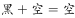，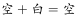，，，，，。第二行图按照此规律进行运算，只有A选项符合规律。

故正确答案为A。

---

## 第 3 题　qid 2166150 · 图形推理

从所给四个选项中，选择最合适的一个填入问号处，使之呈现一定的规律性：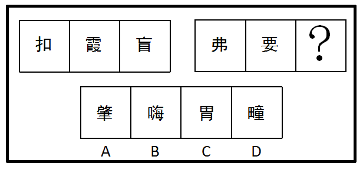

- **A**. A
- **B**. B
- **C**. C　✅
- **D**. D

**答案**：C

**官方解析**

元素组成不同，考虑属性与数量规律。属性无规律，图形均为汉字组成，面数量较多，考虑数面。第一组图中：面数量分别为1、2、3。第二组图中：面数量分别为4、5、?，?处应该为6，只有C选项面的个数是6。
故正确答案为C。

---

## 第 4 题　qid 2166151 · 图形推理

从所给四个选项中，选择最合适的一个填入问号处，使之呈现一定的规律性：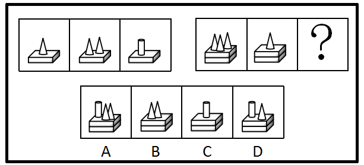

- **A**. A
- **B**. B
- **C**. C
- **D**. D　✅

**答案**：D

**官方解析**

元素组成相似，考虑样式规律。第一组图中每幅图均有一个长方体，长方体上分别有一个圆锥、两个圆锥、一个圆柱，把图形分成上下两个部分来看，上半部分的，下半部分长方体数量不变，所以规律是：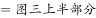，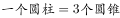，下半部分的长方体数量不变。第二组图按照此规律进行相加，？处上半部分为4个圆锥，而。

故正确答案为D。

---

## 第 5 题　qid 2166152 · 图形推理

从所给四个选项中，选择最合适的一个填入问号处，使之呈现一定的规律性：

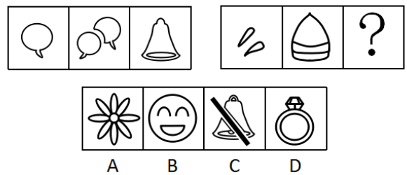

- **A**. A　✅
- **B**. B
- **C**. C
- **D**. D

**答案**：A

**官方解析**

元素组成不同，考虑属性规律。第一组图中每幅图均为曲线图，第二组图图一图二也为曲线图，所以？处应该为曲线图。
故正确答案为A。

---

## 第 6 题　qid 2166153 · 类比推理

（1）达到一定速度，向后拉驾驶杆
（2）收起起落架
（3）飞行员进行起飞检查
（4）请求飞行
（5）启动引擎开始滑行

- **A**. 4-3-2-5-1
- **B**. 3-4-1-2-5
- **C**. 3-4-5-1-2　✅
- **D**. 4-3-1-2-5

**答案**：C

**官方解析**

第一步：先确定逻辑关系最为明显的事件顺序。
观察题干，五个事件主要围绕“飞机起飞”的过程。逻辑关系的先后顺序比较明显的是事件（3）和事件（4），只有先“飞行员进行起飞检查”，才能“请求飞行”，因此事件（3）排在事件（4）前面，且事件（3）和事件（4）相邻，同时容易判断事件（3）应该排在最前面，排除A、D两项。
第二步：逐一对照选项并判断正确答案。
根据第一步得到的结果可以判断只有B、C两项符合，通过分析事件（1）、（2）、（5）可知，先“启动引擎开始滑行”，再“达到一定速度，向后拉驾驶杆”，最后“收起起落架”。排序为：（5）-（1）-（2），从而排除B项。
故正确答案为C。

---

## 第 7 题　qid 2166154 · 类比推理

（1）内阁制
（2）军机处
（3）中外朝制
（4）三省六部制
（5）三公九卿制

- **A**. （5）-（4）-（3）-（2）-（1）
- **B**. （5）-（3）-（4）-（1）-（2）　✅
- **C**. （4）-（3）-（5）-（2）-（1）
- **D**. （4）-（5）-（3）-（1）-（2）

**答案**：B

**官方解析**

第一步：先确定逻辑关系最为明显的事件顺序。
观察题干，五个事件主要围绕“国家管理制度发展”的过程。“内阁制”在明朝设立，“军机处”在清朝设立，“中外朝制”在汉朝设立，“三省六部制”在隋朝设立，“三公九卿制”在秦朝设立。根据历史朝代判断先后顺序应该是秦朝、汉朝、隋朝、明朝、清朝，即：（5）-（3）-（4）-（1）-（2）。
第二步：逐一对照选项并判断正确答案。
根据上述判断，只有B选项符合题意。
故正确答案为B。

---

## 第 8 题　qid 2166155 · 类比推理

（1）浮出水面
（2）呼救求援
（3）循序上升
（4）落入水中
（5）保持镇定

- **A**. 4-5-1-2-3
- **B**. 4-5-3-1-2　✅
- **C**. 4-2-5-3-1
- **D**. 4-3-1-5-2

**答案**：B

**官方解析**

第一步：先确定逻辑关系最为明显的事件顺序。
观察题干，五个事件主要围绕“落水到呼救”的过程。逻辑关系的先后顺序比较明显的是事件（4）和事件（5），只有先“落入水中”，然后尽快“保持镇定”，因此事件（4）排在事件（5）前面，且事件（5）和事件（4）相邻，同时容易判断事件（4）应该排在最前面，排除C、D两项。
第二步：逐一对照选项并判断正确答案。
根据第一步得到的结果可以判断只有A、B两项符合，通过分析事件（1）、（2）、（3）可知，先“循序上升”，再“浮出水面”后才能“呼救求援”。排序为：（3）-（1）-（2），从而排除A项。
故正确答案为B。

---

## 第 9 题　qid 2166156 · 类比推理

（1）猜灯谜
（2）插茱萸
（3）赛龙舟
（4）扫墓
（5）赏月

- **A**. 1-4-3-5-2　✅
- **B**. 4-3-2-5-1
- **C**. 1-4-3-2-5
- **D**. 4-2-3-5-1

**答案**：A

**官方解析**

第一步：先确定逻辑关系最为明显的逻辑顺序。
观察题干，五个事件均为“传统节日习俗”，可根据节日的时间先后进行排序。
（1）“猜灯谜”是元宵节的习俗，时间为农历正月十五，（2）“插茱萸”是重阳节的习俗，时间为农历九月初九，（3）“赛龙舟”是端午节的习俗，时间为农历五月初五，（4）“扫墓”是清明节的习俗，在每年的四月，（5）“赏月”是中秋节的习俗，时间为农历八月十五。故五个事件的顺序应为（1）—（4）—（3）—（5）—（2）。
第二步：逐一对照选项并判断正确答案。
根据第一步得到的结果可以判断只有A项符合。
故正确答案为A。

---

## 第 10 题　qid 2166157 · 类比推理

（1）第三方担保平台兴起
（2）交易双方互不信任
（3）居民资金托管到网络担保平台
（4）无现金社会渐成雏形
（5）移动支付技术发展

- **A**. （1）-（3）-（2）-（4）-（5）
- **B**. （1）-（3）-（5）-（4）-（2）
- **C**. （2）-（5）-（1）-（3）-（4）
- **D**. （2）-（1）-（5）-（3）-（4）　✅

**答案**：D

**官方解析**

第一步：先确定逻辑关系最为明显的事件顺序。
观察题干，五个事件主要围绕“移动交易担保平台”的发展过程。逻辑先后顺序比较明显的是事件（1）和事件（2），先有了“交易双方互不信任”才会导致“第三方担保平台兴起”。因此事件（2）排在事件（1）前面，排除A、B项。
第二步：逐一对照选项并判断正确答案。
根据第一步得到的结果可以判断只有C、D项符合，通过分析事件（3）和（5）得知，只有先“移动支付技术发展”，才会导致“居民资金托管到网络担保平台”。因此（3）和（5）相邻，且事件（5）排在事件（3）前面，排除C项。
故正确答案为D。

---

## 第 11 题　qid 2166158 · 类比推理

每个世纪都有哲学家和艺术家提出“美”和“丑”的定义，但是至今也没有一个完全一致的定义。假设定义“丑是美的反面”为真，那么（  ）。

- **A**. 任何事物都有美丑两面
- **B**. 没有美也就没有丑　✅
- **C**. 不美不丑是存在的
- **D**. 美和丑是无法辨别的

**答案**：B

**官方解析**

日常推理题，根据题干信息逐一分析选项。
A项：丑是美的反面可以理解成丑和美是矛盾关系，因此一个事物是不可能同时存在美丑两个状态，无法推出，排除；
B项：丑是美的反面，两者之间是对立存在的，即缺少任何一个，另一个都无法存在，因此可以推出没有美也就没有丑，当选；
C项：丑是美的反面可以理解成丑和美是矛盾关系，因此两者之间不存在其他的状态，不美不丑是不存在的，排除；
D项：题干中并没有提出如何辨别美丑的方法，无中生有，排除。
故正确答案为B。

---

## 第 12 题　qid 2166159 · 逻辑判断

某公司拟实现一项“office-home，but one day”计划，即全体员工都不需要到办公室工作，他们可以任意选择想要完成工作的地点，比如家里、游乐场······但是，每个月必须有一天同事们要齐聚办公室进行面对面的交流。
下列解释最能说明面对面交流存在的必要性的是（  ）。

- **A**. 面对面交流可以帮助员工评估工作进程
- **B**. 面对面交流可以获取到一些关键的非语言交流的信息　✅
- **C**. 如果不在办公室进行面对面交流，办公室就失去了存在的价值
- **D**. 长期独立办公，不与其他同事交流，会削弱员工的团队精神

**答案**：B

**官方解析**

第一步：找出论点和论据。
论点：每个月必须有一天同事们要齐聚办公室进行面对面的交流。
论据：无明显论据。
第二步：逐一分析选项。
A项：说明面对面交流可以帮助员工评估工作进程，提出了一个新的论据来支持论点，保留；
B项：说明面对面交流可以获取一些非语言交流的信息，提出了一个新的论据来支持论点，保留；
C项：不在办公室面对面交流就会失去办公室的作用，强调的是办公室存在的必要性，与面对面交流无关，排除；
D项：提出长期独立办公，不与同事交流会削弱员工的团队精神，但是交流并非特指面对面交流，因此属于无关选项，排除。
比较A、B两项，B项指出面对面交流可以获取关键的信息，加强的力度比A项大，故正确答案为B。

---

## 第 13 题　qid 2166160 · 逻辑判断

当人们将一般规则应用于它所不适用的特殊事例时，就会产生“偶性的谬误”。
下列各项中，没有产生“偶性的谬误”的是（  ）。

- **A**. 公民依法享有言论自由。所以老赵不该因为他上周发表颠覆政府的言论而被追诉
- **B**. 借用他人物品应及时归还。你昨天从老钱家借了菜刀，前面那闹事的醉汉就是老钱，既然遇到他了，你现在赶紧把菜刀还给他
- **C**. 生命在于运动。小孙正值长身体的时候，不能总是待在家里学习，该出去跑跑步锻炼锻炼　✅
- **D**. 你是在礼仪之乡长大的，深知诚实坦率是美德，现在就把你们公司的机密告诉我吧

**答案**：C

**官方解析**

第一步：找出定义关键词。
“一般规则”、“应用到不适用的特殊事例”
第二步：逐一分析选项。
A项：老赵发表的颠覆政府的言论不属于言论自由的范围，属于特殊事例，因此不适用“公民依法享有言论自由”的规则，能够产生“偶性的谬误”，符合定义，排除； 
B项：闹事醉汉老钱处于非正常状态，属于特殊事例，因此不适用“借用他人物品应及时归还”的规则，能够产生“偶性的谬误”，符合定义，排除；
C项：对于正值长身体的小孙来说，跑步不是特殊事例，因此“生命在于运动”的规则适用于小孙，不能够产生“偶性的谬误”，不符合定义，当选；
D项：泄漏公司机密是违法行为，属于特殊事例，因此不适用“诚实坦率是美德”的规则，能够产生“偶性的谬误”，符合定义，排除。
本题为选非题，故正确答案为C。

---

## 第 14 题　qid 2166161 · 逻辑判断

甲国国民S开了一家糖果店。某日，S决定将牛轧糖、奶糖单价分别提高2.9元和1.8元；当天，乙国空军一架F-222战机坠毁。一个月后，S又将奶糖单价翻番；当天14时，丙国一架客机起飞不久后遇难。两个月后，S就糖果价格问题发表声明，称价格未调整到位，并将牛轧糖单价提高1.2元；当日，丁国某航空公司的一架客机在该国西北部附近坠毁。可见，S以糖果价格为武器，专门打击境外航天器。
下列选项如果为真，最能支持上述结论的是（  ）。

- **A**. 飞机制造时，内部程序设定为主动接收S的糖果定价信息，遇到特定价格就坠毁　✅
- **B**. 坠毁的不仅有外国飞机，也有本国飞机；不仅有军用战机，也有民用客机
- **C**. S和某跨国恐怖组织关系密切，调整糖果价格前已得知恐怖袭击的详细计划
- **D**. S在销售给境外飞行员的糖果中植入炸弹，咬破后立即发生爆炸

**答案**：A

**官方解析**

第一步：找出论点和论据。
论点：S以糖果价格为武器，专门打击境外航天器。
论据：S决定将牛轧糖、奶糖单价分别提高2.9元和1.8元；当天，乙国空军一架F-222战机坠毁。一个月后，S又将奶糖单价翻番；当天14时，丙国一架客机起飞不久后遇难。两个月后，S将牛轧糖单价提高1.2元；当日，丁国某航空公司的一架客机在该国西北部附近坠毁。
论点和论据都在讨论“糖果价格改变”和“境外航天器坠毁”之间的关系，话题一致，加强优先考虑补充论据。
第二步：逐一分析选项。
A项：飞机内部程序能够接收S的糖果定价信息，遇到特定价格就坠毁，解释了为什么糖果价格改变，境外航天器就会坠毁，补充论据加强论点，当选；
B项：坠毁的也有本国飞机，说明不是专门打击境外航天器，削弱了论点，排除；
C项：S与恐怖组织关系密切且知道恐怖袭击出的详细计划，无法说明糖果价格和飞机坠毁之间的关系，不能支持论点，排除； 
D项：S销售的糖果中有炸弹与糖果的价格无关，因此不是将价格作为武器，削弱了论点，排除。
故正确答案为A。

---

## 第 15 题　qid 2166162 · 逻辑判断

过去五十年，某地人均生活水平都在贫困线以下，因此可以预计，接下来几年里，该地人均生活水平仍会很低。
下列选项如果为真，最能削弱上述结论的是（  ）。

- **A**. 国家近十年来一直对该地给予扶贫优惠政策，保障和改善百姓生活
- **B**. 该地的行政领导班子面临换届，大批富有成功脱贫经验的官员即将上任　✅
- **C**. 某地质专家推测该地地底藏有大量石油
- **D**. 据传闻，该地将要被规划为首都的卫星城市

**答案**：B

**官方解析**

第一步：找出论点和论据。
论点：接下来几年里，该地人均生活水平仍会很低。
论据：过去五十年，某地人均生活水平都在贫困线以下。
本题的论点是对未来的一种预测，并且是通过过去的情况来预测未来，这种预测未来的题目没办法通过直接否定论点（接下来几年里，该地人均生活水平不会很低）的方式来削弱，既然题干是通过过去证明未来，我们可以通过拆桥的方式来削弱，即：过去和未来不一样，过去不代表未来。
第二步：逐一分析选项。
A项：近十年来的国家都给予该地扶贫优惠政策，说的还是过去的情况，在过去十年给了扶贫优惠政策情况之下人均生活水平依然在贫困线以下，说明这个优惠政策目前为止是无效的，那到底未来会不会有效果，能不能实际起到改善人均生活水平的作用更是非常不确定的，无法削弱，排除；
B项：该地的行政领导班子面临换届，大批富有成功脱贫经验的官员即将上任，本选项特意强调了“领导班子面临换届”，“大批”、“富有成功脱贫经验”的官员即将上任，是通过举了领导班子换届的例子来证明未来有变化了，未来和过去不一样，过去不能代表未来了，间接拆了论点和论据之间的桥，可以削弱，当选；
C项：只是地质专家的推测，并不是事实，因此属于不确定选项，排除； 
D项：传闻的消息也是不确定的，因此属于不确定选项，排除。
故正确答案为B。

---

## 第 16 题　qid 2166163 · 类比推理

某班级有甲、乙、丙三位同学参加奥数竞赛，获一、二、三等奖的各有一人。班主任猜测：甲肯定是一等奖，乙肯定不是一等奖，丙肯定不是三等奖。事实上，班主任只猜中了一个。
据此，可推知获得二等奖的是（  ）。

- **A**. 甲同学
- **B**. 乙同学
- **C**. 丙同学　✅
- **D**. 无法判断

**答案**：C

**官方解析**

第一步，分析题干条件。
① 甲：一等奖；
② 乙：不是一等奖；
③ 丙：不是三等奖。
假设班主任猜中了条件①，则条件②和③都是错的，那么此时甲乙都获得了一等奖，与题干所给条件不符，假设错误；
假设班主任猜中了条件②，则甲不是一等奖，丙是三等奖，那么此时就没有人是一等奖，与题干所给条件不符，假设错误；
条件①和②都是错的，由于“班主任只猜中了一个”，所以条件③一定是对的，即丙不是三等奖。此时甲一定不是一等奖，乙是一等奖，那么甲是三等奖，丙是二等奖。
故正确答案为C。

---

## 第 17 题　qid 2166164 · 定义判断

“供给侧结构性改革”是指从供给侧入手，针对结构性问题而推进的改革。“供给侧”包含两个基本方面：一是生产要素投入，如劳动投入、资本投入、土地等资源投入、企业家才能投入、政府管理投入；二是全要素生产率提高，由制度变革、结构优化、要素升级决定。“结构性问题”主要包括产业结构问题、消费结构问题、区域结构问题、要素投入结构问题、排放结构问题、增长动力结构问题、收入分配结构问题等。
根据上文，下列不属于供给侧结构性改革范畴的是（  ）。

- **A**. 某平台把“碎片化”的闲置私家车统合，用于共享
- **B**. 某点心店通过升级面点技术把点心做得更精致、更好吃
- **C**. 某公司坚持自主创新，开发出自有专利的高科技智能终端产品
- **D**. 某酒厂斥巨资投放广告，拿下某热门综艺节目冠名权　✅

**答案**：D

**官方解析**

第一步：找到关键词
“一是生产要素投入，如劳动投入、资本投入、土地等资源投入、企业家才能投入、政府管理投入”、“二是全要素生产率提高，由制度变革、结构优化、要素升级决定”、“‘结构性问题’主要包括产业结构问题、消费结构问题、区域结构问题、要素投入结构问题、排放结构问题、增长动力结构问题、收入分配结构问题等”
第二步：逐一分析选项
A项：“某平台将闲置私家车统合，用于共享”是针对私家车存在碎片化闲置的结构性问题而进行的消费结构改革，属于供给侧结构性改革的范畴，符合定义，排除；
B项：点心店通过升级面点技术，使做出来的点心更精致、更好吃，是生产要素方面的投入，属于供给侧结构性改革的范畴，符合定义，排除；
C项：公司通过自主创新，开发出拥有自有专利的高科技智能终端产品，是在生产要素方面的投入，解决了公司的增长动力结构问题，属于供给侧结构性改革的范畴，符合定义，排除；
D项：“酒厂斥巨资投放广告，拿下某热门综艺节目冠名权”其目的是为了产品的宣传，并没有体现出酒厂在产品供给方面进行改革，不属于供给侧结构性改革的范畴，不符合定义，当选。
本题为选非题，故正确答案为D。

---

## 第 18 题　qid 2166165 · 类比推理

某动物园的动物情况如下：①如果马的数量增加或者狮子怀孕，那么大象死亡或者兔子的数量不增加；②如果牛得病或者狼的数量减少，那么兔子的数量增加并且马的数量增加；③如果大象死亡或者山羊的数量增加，那么牛没得病或者马的数量不增加。
根据上述条件，可以确定的是（  ）。

- **A**. 狼的数量减少
- **B**. 狮子怀孕
- **C**. 山羊的数量增加
- **D**. 牛没得病　✅

**答案**：D

**官方解析**

第一步：翻译题干。

① 马的数量增加 或者 狮子怀孕大象死亡 或者 兔子数量不增加

② 牛得病 或者 狼的数量减少兔子数量增加 且 马的数量增加

③ 大象死亡 或者 山羊的数量增加牛没得病 或者 马的数量不增加

由①可得出：④ 马的数量增加大象死亡 或者 兔子数量不增加；

根据否一推一可得出：⑤ 马的数量增加 且 兔子数量增加大象死亡 ；

由②可知：⑥ 牛得病 牛得病或者 狼的数量减少兔子数量增加 且 马的数量增加

综合⑤⑥可以得出：⑦ 牛得病大象死亡

综合③⑦可以得出：⑧ 牛得病牛没得病 或者 马的数量不增加

由⑥可知：⑨ 牛得病马的数量增加

综合⑧⑨可以得出：牛得病牛没得病 ，所以牛没得病一定成立。

故正确答案为D。

---

## 第 19 题　qid 2166166 · 类比推理

东山、西山、南山、北山四支足球队举行友谊赛，每两支队间均赛且只赛一场，最后按总进球数排列的名次为：东山&gt;西山&gt;南山&gt;北山。各场比赛中，东山队以4：1战胜了西山队，北山队战胜了南山队，另外四场是平局。
各球队中，失球数最少的是（  ）。

- **A**. 东山队
- **B**. 西山队
- **C**. 南山队
- **D**. 北山队　✅

**答案**：D

**官方解析**

分析题干条件。

①；

②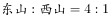；

③；

④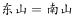；

⑤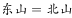；

⑥；

⑦。

假设：；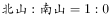；；；；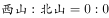，则各球队的进球数依次为：东山4、西山3、南山2、北山1，符合题干要求。此时各球队的失球数依次为：东山1、西山6、南山3、北山0。因此，失球数最少为北山队。

故正确答案为D。

---

## 第 20 题　qid 2166167 · 类比推理

甲、乙、丙三个贪官在狱中同住一室，谈及自己所犯的罪，个个都悔不当初。三人经过一番推心置腹，对各自所犯罪行都心知肚明。
甲说：“如果我贪污，那么乙也贪污；如果我走私，那么丙也走私。”
乙说：“如果我泄密，那么丙也泄密；如果我贪污，那么甲也贪污。”
丙说：“如果我泄密，那么甲也泄密；如果乙走私，那我可不走私。”
监狱长说：“贪污、泄密、走私三种罪行，每种都至少被其中一人所犯；有两人所犯罪行完全相同；有一人仅犯一种罪。”
如果上述言论均为真，下列选项肯定为假的是（  ）。

- **A**. 甲至少犯贪污罪
- **B**. 乙没有走私
- **C**. 丙没有泄密　✅
- **D**. 甲与丙罪行相同

**答案**：C

**官方解析**

第一步：翻译题干。

① 甲贪乙贪；甲走私丙走私

② 乙泄密丙泄密；乙贪污甲贪污

③ 丙泄密甲泄密；乙走私-丙走私

④ 每种罪行都至少被其中一人所犯，有两人所犯罪行完全相同。

将条件综合可得：

甲贪乙贪甲贪、甲走私丙走私-乙走私、乙泄密丙泄密甲泄密。

第二步：逐一分析选项。

A项：甲若不犯贪污罪，那么乙一定没贪污，可知丙贪污，又根据“甲走私丙走私-乙走私”，则甲乙、甲丙、乙丙不可能有两个人所犯罪行相同，不符合题干条件④，可知甲至少犯了贪污罪，排除；

B项：乙没有走私，由A选项可知甲、乙贪污，则当甲、丙犯了贪污、走私、泄密，乙仅犯了贪污罪时，可以满足题干条件，排除；

C项：由A选项可知甲、乙一定都犯了贪污罪，则甲乙、甲丙不可能犯罪完全相同。由选项C丙没有泄密，可知乙也没有泄密那甲一定犯了泄密罪，则乙丙既不可能犯同一罪行，也不可能只犯一个罪行，故该选项一定为假，当选；

D项：由“乙泄密丙泄密甲泄密”可知，甲丙所犯罪行可以相同，排除。

故正确答案C。

---
