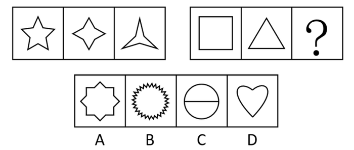
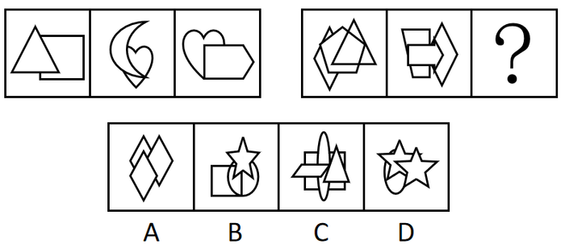
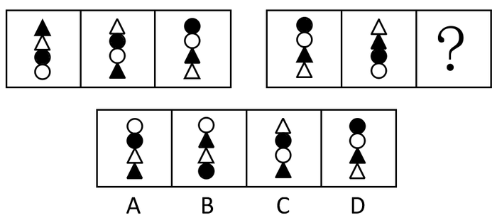

# 2019年1月天津市定向招录选调生考试综合能力测试试卷（精选）

> 判断推理 · 10 题 · 天津 2019

## 第 1 题　qid 2661759 · 图形推理

从所给的四个选项中，选择最合适的一个填入问号处，使之呈现一定的规律性。

 

- **A**. A
- **B**. B
- **C**. C　✅
- **D**. D

**答案**：C

**官方解析**

元素组成不同，优先考虑属性规律。图形整体比较规整，优先考虑对称性。第一组图，图形均为轴对称图形，且对称轴的数量依次为5、4、3，对称轴数量呈递减规律；第二组图，前两个图均为轴对称图形，且对称轴数量依次为4、3，故？处应填入有2条对称轴的图形，只有C项符合。
故正确答案为C。

---

## 第 2 题　qid 2661761 · 图形推理

从所给的四个选项中，选择最合适的一个填入问号处，使之呈现一定的规律性。

 

- **A**. A
- **B**. B　✅
- **C**. C
- **D**. D

**答案**：B

**官方解析**

元素组成不同，优先考虑属性规律。观察发现，第一组图中每幅图均为纯直线图形，第二组图中前两幅图既包含直线又包含曲线，故？处应填入既包含直线又包含曲线的图形，只有B项符合。
故正确答案为B。

---

## 第 3 题　qid 2661764 · 图形推理

从所给的四个选项中，选择最合适的一个填入问号处，使之呈现一定的规律性。

 

- **A**. A　✅
- **B**. B
- **C**. C
- **D**. D

**答案**：A

**官方解析**

元素组成不同，且无明显属性规律，优先考虑数量规律。题干每幅图都是由直线构成，存在直线相交且出现明显的直角，优先考虑数直角数。第一组图中，三个图形的直角数分别为4、6、8；第二组图中，前两个图形的直角数分别为0、2，故？处应选择一个直角数为4的图形。A、B、C、D四项图形中的直角数分别为4、6、0、6，只有A项符合。
故正确答案为A。

---

## 第 4 题　qid 4688446 · 图形推理

从所给的四个选项中，选择最合适的一个填入问号处，使之呈现一定的规律性：

- **A**. A
- **B**. B　✅
- **C**. C
- **D**. D

**答案**：B

**官方解析**

元素组成不同，无明显属性规律，考虑数量规律。观察发现，第一组图中，每幅图形均由2种不同的元素构成；第二组图中，前2幅图形均由3种不同的元素构成，故？处延续此规律，只有B项符合。
故正确答案为B。

---

## 第 5 题　qid 17499 · 图形推理

从所给四个选项中，选择最合适的一个填入问号处，使之呈现一定的规律性：

- **A**. A　✅
- **B**. B
- **C**. C
- **D**. D

**答案**：A

**官方解析**

元素组成相同，考查位置规律。
每组图形中黑白三角形和黑白圆圈 4个小元素在每个图形中的位置不重复。
故正确答案为A。

---

## 第 6 题　qid 30163 · 类比推理

作为意识的“本体”的人脑，必然是现实的人脑；现实的人脑总是长在现实的人身上的；而现实的人又总是处在一定的社会关系之中的。所以：

- **A**. 人脑是意识的真正本体
- **B**. 人本身是意识的真正本体
- **C**. 社会关系是意识的真正本体　✅
- **D**. 意识没有真正的本体

**答案**：C

**官方解析**

本题为日常结论题。题干信息指出，意识的“本体”是现实的人脑，现实的人脑离不开现实的人，现实的人依附于社会关系存在，即人脑、人都只是意识的中间载体，追到最终根源，社会关系才是意识的真正本体。
故正确答案为C。

---

## 第 7 题　qid 34075 · 逻辑判断

诚然，西方是人类很多文明成就的展示台，有一些价值观是人类壮举的注脚，如对科学实验的信仰，向假说挑战的意志。但对实践这些价值的迷信会导致一种特有的盲目；无法理解某些夹杂在其中的价值可能是有害的。但要看清这一点，人们必须站在西方之外，所谓“当局者迷，旁观者清”。
这说明：

- **A**. 西方的价值观已走到尽头
- **B**. 西方的价值观比其它文明的价值观优越
- **C**. 只有从非西方文明的价值及观点出发，才能真正认清西方价值观的问题之所在　✅
- **D**. 非西方价值观比西方价值观优越

**答案**：C

**官方解析**

第一步：抓住题干主要信息。
题干主要信息为要看清西方价值观的问题所在，人们必须站在西方之外，所谓“当局者迷，旁观者清”。
第二步：分析题干信息，并结合选项得出答案。
“已走到尽头”、孰劣孰优，均无法从题干推知，A、B、D均属于无关项；
C中的“非西方”为题干中“站在西方以外”的同意替换，推论正确。
故正确答案为C。

---

## 第 8 题　qid 2661772 · 逻辑判断

现代市场经济所倡导的是“管得最合适的政府是最好的政府”。改革开放的实践告诉人们，在我国社会主义市场经济中，完全依靠市场机制是不明智的选择，我们的起点不应当是古典市场经济，而应是现代市场经济。
因此：

- **A**. 政府干预与市场机制内在统一于现代市场经济之中　✅
- **B**. 以政府宏观调控为主，市场机制为辅
- **C**. 以市场机制为主，政府宏观调控为辅
- **D**. 发展市场经济必须不断削弱政府宏观调控

**答案**：A

**官方解析**

日常结论题，根据题干信息逐一分析选项。
A项：根据题干中“完全依靠市场机制是不明智的选择”可知政府干预也是有必要的，可以推出“政府干预与市场机制内在统一于现代市场经济之中”，当选；
B项：根据题干可知政府干预也是有必要的，但题干未指出政府宏观调控为主，无中生有，排除；
C项：题干未指出市场机制为主，无中生有，排除；
D项：根据题干可知政府干预也是有必要的，未提及是否需要削弱政府宏观调控，无中生有，排除。
故正确答案为A。

---

## 第 9 题　qid 2270808 · 逻辑判断

制度包括正式的法律原则和非正式的风俗习惯两方面。它是交易的结果，制度确立之后便形成相对稳定的利益格局，从而产生制度惯性。在这种惯性中，风俗习惯的变迁与法律规则的变迁都是比较缓慢的。所以（    ）。

- **A**. 制度的变迁是渐进的过程　✅
- **B**. 制度形成后便不会发生变化
- **C**. 制度变迁是自发式的
- **D**. 随着制度的完善，制度变迁会越来越慢，甚至“终结”

**答案**：A

**官方解析**

根据题干所给信息逐一分析选项。
A项：由“制度包含正式的法律规则和非正式的风俗习惯两个方面”和“风俗习惯的变迁与法律规则的变迁都比较缓慢”可以推出制度的变迁是渐进的过程，当选；
B项：由“风俗习惯的变迁与法律规则的变迁都比较缓慢”可以推出制度是会发生变化的，选项错误，排除；
C项：没有提到风俗习惯的变迁与法律规则的变迁的自发的问题，无中生有，无法推出，排除；
D项：由“风俗习惯的变迁与法律规则的变迁都比较缓慢”可以推出制度是会发生变化的，虽然缓慢，但会不会终结，没有提到，无中生有，排除。
故正确答案为A。

---

## 第 10 题　qid 2661774 · 类比推理

调查报告显示，某市近三年来的严重刑事犯罪案件都为已记录在案的350名惯犯所为。报告同时揭示，严重刑事犯罪案件的作案者半数以上是吸毒者。

如果上述断定都是真的，那么，下列哪项断定一定是真的？

- **A**. 350名惯犯中一定有吸毒者
- **B**. 350名惯犯中大多数是吸毒者
- **C**. 350名惯犯中可能没有吸毒者　✅
- **D**. 吸毒者大多数在350名惯犯中

**答案**：C

**官方解析**

题干第二句话“严重刑事犯罪案件的作案者半数以上是吸毒者”等价于“严重刑事犯罪案件的作案者以上是吸毒者”。

整理题干信息：

（1）“严重刑事犯罪案件中都为已记录在案的350名惯犯所为”；

（2）“严重刑事犯罪案件的作案者以上是吸毒者”。

严重刑事犯罪案件数量名

严重刑事犯罪案件作案者吸毒者

因为案件数量和作案者数量无法确定，因此无法推出确定的情况和人数是否为大多数，而当350名惯犯小于严重刑事犯罪案件作案者时，350名惯犯中可能没有吸毒者，只有C项符合。

故正确答案为C。

---
