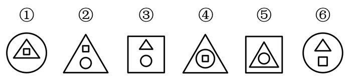
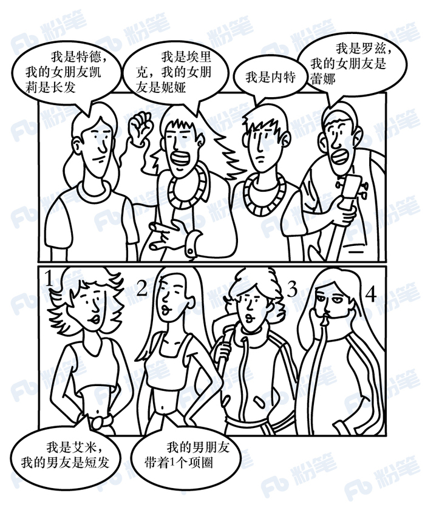
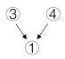

# 2019年420联考《行测》题（吉林乙级）（网友回忆版）

> 判断推理 · 30 题 · 吉林 2019

## 第 1 题　qid 2376453 · 图形推理

从所给四个选项中，选择最合适的一个填入问号处，使之呈现一定的规律性

- **A**. 金　✅
- **B**. 令
- **C**. 书
- **D**. 无

**答案**：A

**官方解析**

解析一：元素组成不同，且无明显属性规律，考虑数量规律。图形均为汉字，优先考虑笔画数。九宫格优先横行看，第一横行笔画数依次为2、4、6；第二横行笔画数依次为6、4、10，即前两行均满足前两幅笔画数相加等于第三幅，沿用此规律，第三行笔画数依次为4、？、12，因此问号处应选择8笔画的汉字。A项8笔画，B项5笔画，C项4笔画，D项4笔画。
故正确答案为A。
解析二：元素组成不同，且无明显属性规律，考虑数量规律。图形均为汉字，且“中”“回”存在明显的封闭面，考虑数面。九宫格优先横行看，第一横行面数量依次为0、2、2；第二横行面数量依次为0、0、0，即前两行图形均满足前两幅面数量相加等于第三幅，沿用此规律，第三行面数量依次为0、？、1，因此问号处应选择1个面的汉字。A、B、D项均为0个面，只有C项为1个面。
故正确答案为C。
粉笔说明：两种思路均可通过严谨的数量规律得到答案，且数笔画和数面均为常见考法，故两种答案粉笔都认可。

---

## 第 2 题　qid 2376455 · 图形推理

把下面六个图形分为两类，使每一类图形都有各自的共同特征或规律，分类正确的一组是

- **A**. ①②③，④⑤⑥
- **B**. ①③④，②⑤⑥
- **C**. ①④⑥，②③⑤
- **D**. ①④⑤，②③⑥　✅

**答案**：D

**官方解析**

本题为分组分类题目。每幅图均由3个小元素组成，考虑图形间关系。观察发现，图①④⑤均为3个图形层层包含，图②③⑥均为外框包含两个独立图形。即①④⑤一组，②③⑥一组。
故正确答案为D。

---

## 第 3 题　qid 2376458 · 图形推理

从所给四个选项中，选择最合适的一个填入问号处，使之呈现一定的规律性

- **A**. A
- **B**. B
- **C**. C
- **D**. D　✅

**答案**：D

**官方解析**

元素组成不同，且无明显属性规律，优先考虑数量规律。第一组图形出现阴影部分，并且每个图形的阴影部分面积都是整个图形的四分之一。第二组前两个图形当中阴影部分面积都是整个图形的四分之一，故“？”处应选择阴影面积是整个图形面积四分之一的图形，只有D项符合。
故正确答案为D。

---

## 第 4 题　qid 2376489 · 图形推理

从所给四个选项中，选择最合适的一个填入问号处，使之呈现一定的规律性

- **A**. A
- **B**. B　✅
- **C**. C
- **D**. D

**答案**：B

**官方解析**

元素组成不同，题干当中每个图形当中的三个图形都存在一条公共边，且公共边的方向分别为：右、左、右，故“？”处应选择有一条公共边在左侧的图形，只有B项符合。
故正确答案为B。

---

## 第 5 题　qid 2376503 · 图形推理

给定的图形是纸盒的外表面展开图，下列四个选项是由其折叠成的是

- **A**. A　✅
- **B**. B
- **C**. C
- **D**. D

**答案**：A

**官方解析**

A项：出现的三个面位置关系与题干展开图一致，当选；
B项：梯形面和三角形面是相对面，不能同时出现，选项与题干不一致，排除；
C项：梯形面和三角形面是相对面，不能同时出现，选项与题干不一致，排除；
D项：笑脸面和正方形面是相对面，不能同时出现，选项与题干不一致，排除。
故正确答案为A。

---

## 第 6 题　qid 2376642 · 定义判断

藏书，是指凭自己的爱好、评价和鉴赏力而有选择地收藏图书，不仅是为了自己参考、阅读或消遣，也是为了把某个领域的图书精心、完整地收藏起来。
根据上述定义，下列行为不属于藏书的是：

- **A**. 某围棋爱好者一见到吴清源的书就买下来并妥善保存
- **B**. 某古币收藏家一见到关于古代钱币的书就买下并保存
- **C**. 某商人批量买下市面上的某套书籍，待价格飙升售出　✅
- **D**. 某书法家不惜重金求购各种碑帖拓本，以备临摹鉴赏

**答案**：C

**官方解析**

第一步：找出定义关键词。
“凭借自己的爱好、评价和鉴赏力而有选择地收藏图书”、“不仅是为了自己参考、阅读或消遣”、“也是为了把某个领域的图书精心、完整地收藏起来”。
第二步：逐一分析选项。
A项：某围棋爱好者说明是“凭借自己的爱好”，见到吴清源的书就买下来并妥善保存，符合“凭借自己的爱好、评价和鉴赏力有选择地收藏”，符合定义，排除；
B项：某古币收藏家说明是“凭借自己的爱好”，见到关于古代钱币的书就买下来并保存，符合“凭借自己的爱好、评价和鉴赏力有选择地收藏”，符合定义，排除；
C项：某商人批量买下市面上的某套书籍，待价格飙升售出说明商人是为了盈利购买书籍，不符合“凭借自己的爱好、评价和鉴赏力有选择地收藏”，不符合定义，当选；
D项：某书法家不惜重金求购各种碑帖拓本，以备临摹欣赏，符合“凭借自己的爱好、评价和鉴赏力有选择地收藏”，符合定义，排除。
本题为选非题，故正确答案为C。

---

## 第 7 题　qid 2376687 · 定义判断

热岛效应是指城市由于人口集中，工业、交通、居民生活等产生大量的人为热量而使城市的气温高于郊区的现象。雨岛效应是指由于热岛效应，在城市上空产生一股上升气流，加上上空尘埃较多，使附近及下风向降水稍多的现象。温室效应是指由于人类活动排放大量温室气体而造成全球气候变暖的现象。
根据上述定义，下列说法错误的是：

- **A**. 热岛效应是引起雨岛效应的原因之一
- **B**. 热岛效应是引起温室效应的唯一原因　✅
- **C**. 热岛效应和温室效应影响的地域范围不同
- **D**. 三种效应都是人类活动对气候影响的结果

**答案**：B

**官方解析**

第一步：找出定义关键词。
热岛效应：“城市由于人口集中，工业、交通、居民生活等产生大量的人为热量而使城市的气温高于郊区”；
雨岛效应：“由于热岛效应，在城市上空产生一股上升气流，加上上空尘埃较多，附近及下风向降水稍多”；
温室效应：“由于人类活动排放大量温室气体而造成全球气候变暖”。
第二步：逐一分析选项。
A项：热岛效应是引起雨岛效应的原因之一，雨岛效应定义中明确说明是由于热岛效应产生，符合雨岛效应定义，说法正确，排除；
B项：涉及到热岛效应和温室效应两个定义间关系，温室效应产生原因为“人类活动排放大量温室气体”，而热岛效应是“城市中产生大量人为热量”，人类活动包含城市和非城市人群的活动，所以热岛效应不是引起温室效应的唯一原因，表述绝对不准确，当选；
C项：热岛效应影响的地域范围为“城市的气温高于郊区”，温室效应的影响范围为“全球气候变暖”，一个是城市，一个是全球，所以影响范围不同，说法正确，排除；
D项：根据定义三种效应产生的原因分别“由于人口集中，产生大量的人为热量”，“由于热岛效应”，“由于人类活动”，热岛效应就是人类活动影响，所以三种效应都是人类活动对气候影响的结果，说法正确，排除。
本题为选非题，故正确答案为B。

---

## 第 8 题　qid 2376692 · 类比推理

合作作品的版权由合作作者共同享有，通过协商一致来行使；不能协商一致，又无正当理由的，任何一方不得阻止他人行使除转让以外的其他权利，但是所得收益应当合理分配给所有合作作者。
现已知：甲、乙合作创作一部小说，甲独自将该小说以十万元价格许可给某影视公司拍摄电影；乙得知后表示反对，但无正当理由。
根据上述规定，下列说法正确的是

- **A**. 甲无权将该小说许可他人使用
- **B**. 甲独自签订的该许可合同无效
- **C**. 乙无权参与十万元报酬的分配
- **D**. 该小说的版权由甲乙共同享有　✅

**答案**：D

**官方解析**

第一步：找出定义关键词。
合作版权：“版权由合作者共同享有，协商一致行使”、“不能协商一致且无正当理由，不能阻止除转让外其它权利，收益合理分配给所有合作者”
已知：“甲乙合作创作，甲独自将小说许可给影视公司拍摄电影”“乙反对，且无正当理由”
第二步：逐一分析选项。
A项：甲无权将该小说许可他人使用，不符合“不能协商一致，又无正当理由的，任何一方不得阻止他人行使除转让以外的其他权利”，甲有权将该小说许可他人使用。不符合定义，排除；
B项：本小说是版权由两人共同所有，现乙反对且无正当理由，所以乙不能阻止，甲独自签订的许可合同有效。不符合定义，排除；
C项：乙无权参与十万元报酬的分配，不符合“不能协商一致且无正当理由，不能阻止除转让外其它权利，收益合理分配给所有合作者”，所以乙有权参与十万元报酬的分配。不符合定义，排除；
D项：该小说的版权由甲乙共同享有，符合“版权由合作者共同享有”。符合定义，当选。
故正确答案为D。

---

## 第 9 题　qid 2376699 · 定义判断

模棱两可，是指对两个相互矛盾的命题同时加以否定的一种逻辑错误。
根据上述定义，下列属于模棱两可的是：

- **A**. 董事长不是说经理要多听群众意见吗？我是群众，可经理总是不听我的意见
- **B**. 问：“你的丈夫犯了盗窃罪，你知道吗？”答：“还有人比他犯的罪更重呢！”
- **C**. 问：“今年你们厂的产值是多少？”答：“今年原材料涨价，不亏本就算好了。”
- **D**. 小张考试作弊，处分还是不处分？我都不赞成，关键是做好小张的思想工作　✅

**答案**：D

**官方解析**

第一步：找出定义关键词。
模棱两可：“两个互相矛盾的命题”、“同时否定”。
第二步：逐一分析选项。
A项：经理要多听群众意见与我是群众，可经理总是不听我的意见，不符合“对两个相互矛盾的命题同时加以否定”，不符合定义，排除；
B项：丈夫犯盗窃罪和别人犯罪更重，不符合“两个互相矛盾的命题”，不符合定义，排除；
C项：选项只有一个关于产值的问题，和一个回答，不符合“两个互相矛盾的命题”，不符合定义，排除；
D项：处分与不处分，符合“两个互相矛盾的命题”，且后续回答都不赞成符合“同时否定”这一说法，符合定义，当选。
故正确答案为D。

---

## 第 10 题　qid 2376703 · 定义判断

狭义的民间外交，特指那些不代表官方又具有一定官方背景的跨国民间往来活动。它既包括同他国政府高层的交往，又包括同他国各行各业的团体或个人建立联系，其活动内容涉及政治、经济、科学技术、文化体育等各个领域。
根据上述定义，下列属于狭义的民间外交的是：

- **A**. 甲国体操运动员赴乙国看望一位朋友
- **B**. 甲国总理出访乙国进行政治经济磋商
- **C**. 甲国政府为乙国总统的到访举行欢迎仪式
- **D**. 甲国政府要员回乙国的故乡参加祭祖仪式　✅

**答案**：D

**官方解析**

第一步：找出定义关键词。
“不代表官方又具有一定官方背景”、“跨国民间往来活动”、“同他国政府高层的交往”、“同他国各行各业的团体或个人建立联系”。
第二步：逐一分析选项。
A项：甲国体操运动员赴乙国看望朋友，不符合“不代表官方又具有一定官方背景的跨国民间往来活动”，不符合定义，排除；
B项：甲国总理出访乙国进行政治经济磋商，这是甲国总理代表甲国和乙国进行经济往来，不符合“不代表官方又具有一定官方背景的跨国民间往来活动”，不符合定义，排除；
C项：甲国政府为乙国总统到访举行欢迎仪式，这是一种官方的欢迎仪式，不符合“不代表官方又具有一定官方背景的跨国民间往来活动”，不符合定义，排除；
D项：甲国政府要员回乙国故乡参加祭祖仪式，祭祖仪式是民间活动，符合“不代表官方又具有一定官方背景的跨国民间往来活动”，符合定义，当选。
故正确答案为D。

---

## 第 11 题　qid 2376454 · 类比推理

光：亮

- **A**. 风：凉
- **B**. 花：香
- **C**. 地：平
- **D**. 火：热　✅

**答案**：D

**官方解析**

第一步：判断题干词语间逻辑关系。
光的属性是亮，二者为属性的对应关系，且为必然属性。
第二步：判断选项词语间逻辑关系。
A项：风的属性可以是凉，但为或然属性，与题干逻辑关系不一致，排除；
B项：花的属性可以是香，但为或然属性，与题干逻辑关系不一致，排除；
C项：地的属性可以是平，但为或然属性，与题干逻辑关系不一致，排除；
D项：火的属性是热，且为必然属性，与题干逻辑关系一致，当选。
故正确答案为D。

---

## 第 12 题　qid 2376457 · 类比推理

电影配音：外语配音

- **A**. 单向沟通：双向沟通
- **B**. 注射给药：口服给药
- **C**. 短期观察：重点观察　✅
- **D**. 长期记忆：短期记忆

**答案**：C

**官方解析**

第一步：判断题干词语间逻辑关系。
题干从不同的角度将配音进行分类，电影配音是从视频类型进行分类，外语配音是从语言类型角度进行分类，二者为交叉关系。
第二步：判断选项词语间逻辑关系。
A项：单向沟通和双向沟通均是沟通方式，二者为并列关系，与题干逻辑关系不一致，排除；
B项：注射给药和口服给药均是给药方式，二者为并列关系，与题干逻辑关系不一致，排除；
C项：短期观察是从观察的时间上进行分类，重点观察是从观察的程度上分类，二者为交叉关系，与题干逻辑关系一致，当选；
D项：长期记忆和短期记忆均从记忆的时间上进行分类，二者为并列关系，与题干逻辑关系不一致，排除。
故正确答案为C。

---

## 第 13 题　qid 2376460 · 类比推理

听：闻：聆

- **A**. 看：瞥：瞪
- **B**. 咬：嚼：咽
- **C**. 买：购：租
- **D**. 打：揍：殴　✅

**答案**：D

**官方解析**

第一步：判断题干词语间逻辑关系。
听、闻、聆指的都是用耳朵接收声音，三者是近义关系。
第二步：判断选项词语间逻辑关系。
A项：看、瞥、瞪都是用眼睛去接收事物，三者是近义关系，与题干逻辑关系一致，保留；
B项：咬指的是上下牙齿对着用力夹住或弄碎东西；嚼指的是用牙齿磨碎食物；咽指的是使嘴里的东西通过咽头到食管里去，咽与前两个词不是近义关系，与题干逻辑关系不一致，排除；
C项：买和购指的都是购买；租指的是租借，三者不是近义关系，与题干逻辑关系不一致，排除；
D项：打是指击打；揍指的是打人或打碎；殴指的是殴打，三者均可指击打，是近义关系，与题干逻辑关系一致，保留。
进一步区分，题干中可以组词为：聆听，D选项可以组词为：殴打，而A项不能组词，因此排除A项。
故正确答案为D。

---

## 第 14 题　qid 2376463 · 类比推理

英国文学：法国文学：古典文学

- **A**. 律诗：绝句：五言绝句
- **B**. 诗歌：古体诗：近体诗
- **C**. 曲艺：相声：单口相声
- **D**. 独奏曲：合奏曲：钢琴曲　✅

**答案**：D

**官方解析**

第一步：判断题干词语间逻辑关系。
英国文学和法国文学为并列关系，且二者与古典文学之间都属于交叉关系。
第二步：判断选项词语间逻辑关系。
A项：律诗和绝句都是近体诗，但是律诗一般每首八句，每句五个字的律诗叫五言律诗，简称五律，每句七个字的律诗叫七言律诗，简称七律，而绝句每首四句，每句五个字的叫五言绝句，简称五绝，每句七个字的叫七言绝句，简称七绝。因此，律诗和绝句为并列关系，五言绝句和绝句为包容关系中的种属关系，与题干逻辑关系不一致，排除；
B项：古体诗和近体诗是按音律将诗分类，为并列关系，且与诗歌都为包容关系中的种属关系，与题干逻辑关系不一致，排除；
C项：单口相声是相声的一种，为包容关系中的种属关系，相声是曲艺的一种，为包容关系中的种属关系，与题干逻辑关系不一致，排除；
D项：独奏曲和合奏曲为并列关系，且二者都与钢琴曲为交叉关系，与题干逻辑关系一致，当选。
故正确答案为D。

---

## 第 15 题　qid 2376462 · 类比推理

（  ）对于大漠沙如雪，燕山月似钩，相当于夸张对于（  ）

- **A**. 借代  烽火连三月，家书抵万金
- **B**. 拟人  危楼高百尺，手可摘星辰
- **C**. 比喻  白发三千丈，缘愁似个长　✅
- **D**. 反问  本是同根生，相煎何太急

**答案**：C

**官方解析**

将选项逐一代入，判断各选项前后部分的逻辑关系。
A项：“大漠沙如雪，燕山月似钩”是指在连绵的燕山山岭上，一弯明月当空，如弯钩一般；平沙万里，在月光下像是铺上一层白皑皑的霜雪，运用了比喻的修辞手法，不是借代，“烽火连三月，家书抵万金”是指连绵的战火已经持续了很长时间，家书难得，一封抵得上万两黄金，诗句运用了夸张的修辞手法，前后逻辑关系不一致，排除；
B项：“大漠沙如雪，燕山月似钩”运用了比喻的修辞手法，不是拟人，“危楼高百尺，手可摘星辰”是指山上寺院的高楼真高啊，好像有一百尺的样子，人在楼上好像一伸手就可以摘下天上的星星，诗句运用了夸张的修辞手法，前后逻辑关系不一致，排除；
C项：“大漠沙如雪，燕山月似钩”运用了比喻的修辞手法，“白发三千丈，缘愁似个长”是指白发长达三千丈，是因为愁才长得这样长，运用了夸张的修辞手法，前后逻辑关系一致，当选；
D项：“大漠沙如雪，燕山月似钩”运用了比喻的修辞手法，不是反问，“本是同根生，相煎何太急”用同根而生的萁和豆来比喻同父共母的兄弟，用萁煎其豆来比喻同胞骨肉的哥哥残害弟弟，运用了比喻的修辞手法，前后逻辑关系不一致，排除。
故正确答案为C。

---

## 第 16 题　qid 2376528 · 类比推理

①餐厅的客流量创历史新高
②开通外卖和网上团购业务
③入选当年大众点评必吃榜
④逐渐吸引更多的年轻顾客
⑤烤鸭老字号顾客群体断层

- **A**. ②④①③⑤
- **B**. ⑤②④③①　✅
- **C**. ②①④③⑤
- **D**. ⑤③②④①

**答案**：B

**官方解析**

第一步：先确定逻辑关系最为明显的逻辑顺序。
观察题干，五个事件主要围绕“烤鸭老字号顾客群体断层后如何解决销售困境”。逻辑关系的先后顺序比较明显的事件是事件⑤在最前面，排除A、C两项。
第二步：逐一对照选项并判断正确答案。
根据第一步的结果可以判断只有B、D两项符合，顾客群体断层后应先开通外卖和网上团购业务，所以接着是事件②，然后逐渐吸引更多的年轻顾客，是事件④，入选必吃榜后客流量创新高，故事件③在事件①前面，排除D项，B项当选。
故正确答案为B。

---

## 第 17 题　qid 2376529 · 类比推理

①沙发、仙鹤、球拍、鸡蛋、荷花
②编成生动有趣、夸张荒诞的故事
③死记硬背、枯燥乏味、心烦意乱
④记忆一些并没有逻辑关系的信息
⑤记忆倍加深刻，相对容易被记牢

- **A**. ①④⑤③②
- **B**. ①④②③⑤
- **C**. ④①②③⑤
- **D**. ④①③②⑤　✅

**答案**：D

**官方解析**

第一步：先确定逻辑关系最为明显的逻辑顺序。
观察题干，五个事件主要围绕“如何记忆一些没有逻辑关系的信息。”逻辑关系的先后顺序比较明显的事件是事件③和事件②，先说死记硬背的不好再给出解决办法，事件③应该在事件②前面，排除B、C两项。
第二步：逐一对照选项并判断正确答案。
根据第一步的结果可以判断只有A、D两项符合，给出解决办法编成故事后应该解决了问题，因此接着是事件⑤，事件⑤是尾句。最后事件①和事件④，应该是先提出问题再给例子，故事件④在事件①前面，排除A项。
故正确答案为D。

---

## 第 18 题　qid 2376534 · 类比推理

①幼年虎鲸被人类活捉
②数百万中小学生捐款
③回归海洋野生虎鲸群
④受到小朋友们的喜爱
⑤参与拍摄《虎鲸闯天关》

- **A**. ②①④③⑤
- **B**. ②⑤①④③
- **C**. ①③②④⑤
- **D**. ①⑤④②③　✅

**答案**：D

**官方解析**

第一步：先确定逻辑关系最为明显的逻辑顺序。
观察题干，五个事件主要围绕虎鲸被捉后最终放生的过程。逻辑关系的先后顺序比较明显的事件是事件①，要先有虎鲸被捉事件，才能有后续的开展，故事件①是首句，排除A、B两项。
第二步：逐一对照选项并判断正确答案。
根据第一步的结果可以判断只有C、D两项符合，虎鲸被捉后要知道为什么被捉，因此接着是事件⑤，拍摄完节目后，先受到小朋友们的喜欢再有小学生捐款，故事件④在事件②前面，最后放生虎鲸，故事件③是尾句，排除C项。
故正确答案为D。

---

## 第 19 题　qid 2376522 · 类比推理

①筹集资金，学习相关新技术
②大面积推广，技术创新成功
③通过大众传播，了解新信息
④小规模试用，取得显著成效
⑤产生浓厚兴趣，联系推广者

- **A**. ③①②④⑤
- **B**. ②③①⑤④
- **C**. ③⑤①④②　✅
- **D**. ②①③④⑤

**答案**：C

**官方解析**

第一步：先确定逻辑关系最为明显的逻辑顺序。
观察题干，五个事件主要围绕“技术推广”的过程。逻辑关系的先后顺序比较明显的是事件③和事件②，先通过大众传播，了解信息，才能大面积推广，创新成功，即③在②前面，故③为首句，排除B、D项。
第二步：逐一对照选项并判断正确答案。
根据第一步的结果可以判断只有A、C符合，先小规模试用，取得显著效果，再大面积推广，技术创新成功，因此④在②前面，排除A项。
故正确答案为C。

---

## 第 20 题　qid 2376523 · 类比推理

①听到了声音
②处理电信号
③声音源的振动
④产生电信号
⑤引起鼓膜振动

- **A**. ③④②⑤①
- **B**. ①④②⑤③
- **C**. ③⑤④②①　✅
- **D**. ①⑤④②③

**答案**：C

**官方解析**

第一步：先确定逻辑关系最为明显的逻辑顺序。
观察题干，五个事件主要围绕“声音的振动和传播”的过程。逻辑关系的先后顺序比较明显的是事件③和事件①，先声音源的振动再听到声音，即③在①前面，故③为首句，排除B、D项。
第二步：逐一对照选项并判断正确答案。
根据第一步的结果可以判断只有A、C符合，声音源的振动引起鼓膜的振动，因此事件③后面接着事件⑤，鼓膜振动产生电信号，再处理电信号，最后听到声音，排除A项。
故正确答案为C。

---

## 第 21 题　qid 2376638 · 类比推理

根据下图所给的条件，对4位男孩与4位女孩的关系判断正确的是：

- **A**. 女孩1是特德的女朋友
- **B**. 女孩2是内特的女朋友
- **C**. 女孩3是罗兹的女朋友　✅
- **D**. 女孩4是埃里克的女朋友

**答案**：C

**官方解析**

第一步，分析题干。
①男孩1：特德是长发，他的女朋友凯莉是长发
②男孩2：埃里克是长发，戴一个项圈，他的女朋友是妮娅
③男孩3：内特是短发，戴一个项圈
④男孩4：罗兹是短发，他的女朋友是蕾娜
⑤女孩1：艾米，男朋友是短发
⑥女孩2：长发，她的男朋友戴了一个项圈
⑦女孩3：短发
⑧女孩4：长发
第二步，根据题干条件分析选项。
根据①可知，特德的女朋友是长发，那么只能是女孩2或女孩4，排除A项；
根据⑤可知，女孩1艾米的男朋友是短发，那么只能是内特或罗兹，结合条件④可知，罗兹女朋友不是艾米，即女孩1艾米的男朋友是内特，排除B项；
根据⑥可知，女孩2的男朋友只能是埃里克或者内特，而内特女朋友已经确认是女孩1，那么女孩2的男朋友只能是埃里克，排除D项。
故正确答案为C。

---

## 第 22 题　qid 2376639 · 逻辑判断

一直以来，人们都认为工作与家庭的冲突主要困扰的是女性。但最近一项匿名问卷调查的结果显示，男性和女性在工作与家庭冲突的困扰方面，几乎不存在差异，这和大众的认知截然相反。
下列哪项如果为真，不能解释上述矛盾现象：

- **A**. 相对于女性，男性更希望展示强者面貌，更不愿公开谈论自己的困扰
- **B**. 相对于女性，男性更可能会在匿名的调查问卷中坦率描述自己的困扰
- **C**. 相对于男性来说，女性更愿意向他人倾诉自己的困扰，从而缓解压力
- **D**. 相对于没有孩子的女性，有孩子的女性家庭事务干扰工作的程度更高　✅

**答案**：D

**官方解析**

第一步，找出题干矛盾。
大众认知中都认为工作与家庭的冲突主要困扰的是女性，但匿名调查问卷结果显示男性与女性在工作与家庭冲突的困扰方面几乎不存在差异。
第二步，逐一分析选项。
A项：说明相对于女性，男性即使有困扰也不愿意公开谈论，导致在大众认知中会认为在工作与家庭的冲突中男性受到的困扰较少，可以解释题干矛盾，排除；
B项：说明在匿名调查问卷中，男性更有可能会坦率说出自己的困扰，所以问卷结果会显示出男性与女性在工作与家庭的冲突困扰方面的差异较小，可以解释题干矛盾，排除；
C项：说明女性会比男性更愿意向他人倾诉自己的困扰，导致在大众认知中会认为在工作与家庭的冲突中女性受到的困扰较多，可以解释题干矛盾，排除；
D项：对比的是有没有孩子的女性之间的家庭与工作的困扰程度，没有提到男性与女性之间的比较，无法解释题干矛盾，当选。
本题为选非题，故正确答案为D。

---

## 第 23 题　qid 2376684 · 类比推理

对夏天的虫子无法谈论冬天的冰，因为它根本活不到冬天，自然不知道冬天的冰是什么样的。同样的道理，大学生刚毕业，如果不锻炼两年，怎能做好销售工作呢？
下列选项与题干所犯的论证错误最相似的是：

- **A**. 对于是否批准这几家公司贷款的议题，我完全同意你的看法，但还有一点小异议
- **B**. 人脑用多了会受到损害。因为人脑是物质的，机器用久了会磨损，人脑也不例外　✅
- **C**. 小王的话是不会错的，因为他是听他爸爸说的，他爸爸是一位治学严谨、受人尊敬、造诣很深的数学家
- **D**. 人是能够认识世界的，因为人有认识世界的能力。而人之所以有认识世界的能力，就是因为人能认识世界

**答案**：B

**官方解析**

第一步：分析题干中的论证方式。
题干前半部分举了无法对夏天虫子谈论冬天的冰的例子，后半部分用这个例子和“大学生不锻炼就不能做好销售工作”进行类比，得到不锻炼不能做好销售工作的结论。
第二步：逐一分析选项。
A项：该项讨论的主体都是“是否批准这几家公司贷款的议题”，并没有拿两个不同的主体作类比，与题干所犯的论证错误不相似，排除；
B项：该项通过“机器会磨损”和“人脑”作类比，得到人脑用多了会受到损害的结论，与题干所犯的论证错误相似，当选；
C项：该项说小王爸爸是是一位治学严谨、受人尊敬、造诣很深的数学家，得到小王的话不会错的结论，并没有用两个事例进行类比，与题干所犯的论证错误不相似，排除；
D项：该项前半部分从人有认识世界的能力推出人能够认识世界，后半部分从人能认识世界推出人有认识世界的能力，并没有用两个事例进行类比，与题干所犯的论证错误不相似，排除。
故正确答案为B。

---

## 第 24 题　qid 2376686 · 逻辑判断

某居民小区盗窃案件频发，在小区居民的要求下，物业于去年年初为该小区安装了一种多功能防盗系统，结果该小区盗窃案件的发生率显著下降，这说明多功能防盗系统能够有效降低盗窃案件的发生率。
以下哪项如果为真，最能加强上述结论？

- **A**. 去年，没有安装这种盗窃系统的居民小区盗窃案件显著增加　✅
- **B**. 附近另一个居民小区也安装了这种防盗系统，但是效果不佳
- **C**. 从去年初开始，该城市加强了治安管理，盗窃案件大幅减少
- **D**. 物业采取其他防盗措施，对预防盗窃案件也起到一定的作用

**答案**：A

**官方解析**

第一步：找出论点和论据。
论点：多功能防盗系统能够有效降低盗窃案件的发生率。
论据：物业于去年年初为该小区安装了一种多功能防盗系统，结果该小区盗窃案件的发生率显著下降。
本题的论点和论据话题一致，都是在说安装多功能防盗系统可以降低盗窃案件的发生率，因此优先考虑通过补充论据的方式来说明安装多功能防盗系统对降低盗窃案件发生率确实是有效的。
第二步：逐一分析选项。
A项：没有安装多功能防盗系统的居民小区盗窃案件显著增加，从反面说明安装多功能防盗系统对减少盗窃案件的发生是有效的，该项通过反面举例的方式来加强论点，补充论据，当选。
B项：附近安装了多功能防盗系统的小区效果不好，说明该防盗系统对降低盗窃案件的发生率没有作用，无法加强，排除。
C项：指出城市加强治安管理使得盗窃案件减少，说明盗窃案件降低是其他原因造成的，属于他因削弱，不能支持，排除。
D项：物业采取其他防盗措施，对预防盗窃案件也起到一定的作用，说明案件发生率降低除了防盗系统之外还有其他的原因，属于他因削弱，无法加强，排除。
故正确答案为A。

---

## 第 25 题　qid 2376688 · 逻辑判断

近日，有研究人员研发出一种新型的可透视薄膜，它是通过微调热拉温度制造出的一种高强度聚乙烯薄膜，其强度是常规可透视薄膜的10倍。有人据此预测，在不久的将来，手机屏再也不怕摔了。
以下哪项如果为真，不能支持上述预测：

- **A**. 这种新型薄膜的最大拉伸强度，与太空级铝相当
- **B**. 这种新型薄膜特别轻，适用于各种小型电子产品
- **C**. 这种新型薄膜的透明度较差，不适用于手机屏幕　✅
- **D**. 这种新型薄膜价格便宜，适合大规模的商业制造

**答案**：C

**官方解析**

第一步：找出论点和论据。
论点：在不久的将来，手机屏再也不怕摔了。
论据：有研究人员研发出一种新型的可透视薄膜，它是通过微调热拉温度制造出的一种高强度聚乙烯薄膜，其强度是常规可透视薄膜的10倍。
本题为选非题，需找出三个能够加强的选项排除。论点说的是将来手机屏不怕摔了，论据说的是研究出了一种高强度聚乙烯薄透视膜，论点论据说的不是一回事，可以搭桥，比如说高强度就不怕摔，也可以通过补充论据加强，比如补充新型薄膜的其他优点等。
第二步：逐一分析选项。
A项：新型薄膜最大拉伸强度与太空级铝相当，具体说明了新型薄膜在拉伸强度上的优势，补充论据，可以加强，排除；
B项：新型薄膜特别轻，可以用于小型电子产品，因此新型薄膜适用于手机制造，是论点成立的必要条件，可以加强，排除；
C项：新型薄膜透明度较差，不适用于手机屏幕，那就说明由论据中的新型薄膜强度高，推不出论点中的手机屏幕不怕摔，可以削弱，不能加强，当选；
D项：新型薄膜价格便宜，适合大规模商业制造，说明新型薄膜在价格上有优势，用于商业制造的成本较低，是论点成立的必要条件，可以加强，排除。
本题为选非题，故正确答案为C。

---

## 第 26 题　qid 2376508 · 类比推理

友谊是获得人生幸福的重要途径。按照古罗马哲学家西塞罗的说法，“友谊只存在于好人之间，终生不渝的友谊是最难的事情”；另一位西班牙哲学家乔洛·商塔亚纳认为，“友谊几乎都是一颗心的一部分与另一颗心的一部分之结合，人们只能是局部的朋友”。
以上陈述如果为真，则下列一定为真的是

- **A**. 终生不渝的友谊是最为宝贵的财富
- **B**. 坏人与坏人之间一定不会存在友谊　✅
- **C**. 好人之间一定存在某种局部的友谊
- **D**. 友谊是获得人生幸福的最重要途径

**答案**：B

**官方解析**

日常结论题，根据题干信息逐一分析选项。
A项：终生不渝的友谊是最难的，不代表它就是最宝贵的财富，无中生有，排除；
B项：题干中说“友谊只存在于好人之间”，因此坏人之间不存在友谊，可以推出，当选；
C项：题干中说“友谊只存在于好人之间”，但没有说好人之间一定存在友谊，无法推出，排除；
D项：根据第一句可知，友谊是获得人生幸福的重要途径，但无法推出是最重要的途径，排除。
故正确答案为B。

---

## 第 27 题　qid 2376517 · 逻辑判断

有一论证（相关语句用序号表示）如下：

①在X医院接受治疗，比在Y医院更加经济实惠，②而且可以享受到更高质量的服务。③在X医院，病人住院的平均费用是Y医院的四分之三。④X医院病人的治愈率是Y医院的两倍左右。⑤X医院的医疗设备比Y医院更先进。⑥X医院的病人对服务很少有不满。

如果用“甲乙”表示甲支持（或证明）乙，则对上述论证基本结构的表示最为准确的是

- **A**. A
- **B**. B
- **C**. C　✅
- **D**. D

**答案**：C

**官方解析**

第一步：找出总结性的观点。

题干6个命题围绕两个话题展开，服务和费用，因此找出总结性的结论如下：

①在X医院接受治疗，比在Y医院更加经济实惠；

②而且可以享受到更高质量的服务；

第二步：分析论证关系。

通过分析题干发现，③“在X医院，病人住院的平均费用是Y医院的四分之三”和④“X医院病人的治愈率是Y医院的两倍左右”都是在解释论点①“在X医院接受治疗，比在Y医院更加经济实惠”，即因为价格低，并且治愈率高，所以X医院更加经济实惠，表示为

；

⑤“X医院的医疗设备比Y医院更先进”和⑥“X医院的病人对服务很少有不满”都是在解释论点②“可以享受到更高质量的服务”，即因为医疗设备更先进，并且病人对服务比较满意，所以X医院可以享受到更高质量的服务，表示为，对应选项C。

故正确答案为C。

---

## 第 28 题　qid 2376533 · 类比推理

在一次聚会上，甲喜欢吃川菜，乙喜欢吃的都是川菜，丙喜欢吃所有川菜。锅包肉不是川菜，但是麻婆豆腐是川菜。
根据上述条件推知，下列一定为真的是

- **A**. 甲喜欢吃麻婆豆腐
- **B**. 乙喜欢吃麻婆豆腐
- **C**. 乙不喜欢吃锅包肉　✅
- **D**. 丙不喜欢吃锅包肉

**答案**：C

**官方解析**

第一步：分析题干。
①甲喜欢吃川菜：即不确定他具体喜欢吃哪一道川菜；
②乙喜欢吃的都是川菜：即不确定他具体喜欢吃哪一道川菜，且其他菜种他一定不喜欢吃；
③丙喜欢吃所有川菜：即每一道川菜他都喜欢吃，其他菜种他也有可能喜欢吃。
第二步：逐一分析选项。
A项：麻婆豆腐是川菜，甲喜欢吃川菜，但是否一定喜欢吃麻婆豆腐这道川菜并不确定，排除；
B项：麻婆豆腐是川菜，乙喜欢吃的都是川菜，但是否一定喜欢吃麻婆豆腐这道川菜并不确定，排除；
C项：锅包肉不是川菜，乙喜欢吃的都是川菜，其他菜种他一定不喜欢吃，即乙一定不喜欢吃锅包肉，当选；
D项：锅包肉不是川菜，丙喜欢吃所有川菜，但其他菜种他也有可能喜欢吃，所以无法确定丙一定不喜欢锅包肉，排除。
故正确答案为C。

---

## 第 29 题　qid 2376540 · 逻辑判断

目前，广泛应用的机械超材料有着负热膨胀、低重量时的高强度和高刚度等卓越特性。但这种机械超材料一旦构建完成，其属性将无法更改或调整。近日，有研究人员开发出一种新型材料攻克了这一难题。可以肯定，在不久的将来，机器人、智能可穿戴装备等领域一定会旧貌换新颜。
以下哪项如果为真，最能支持上述结论

- **A**. 目前，已有科研团队与该成果的研究团队探讨这种新型材料的具体应用前景
- **B**. 从一种新材料的合成到该材料的具体实际应用，要克服多种难以预料的困难
- **C**. 这种新材料对磁场响应的稳定性及对磁场强度的要求还在反复地检验和测试
- **D**. 历史证明，每一次新技术和新材料的突破都会迅速引起相关应用领域的剧变　✅

**答案**：D

**官方解析**

第一步：找出论点和论据。
论点：在不久的将来，机器人、智能可穿戴装备等领域一定会旧貌换新颜。
论据：有研究人员开发出一种新型材料攻克了机械超材料构建完成后属性将无法更改或调整的难题。
本题中论点的话题是“机器人、智能穿戴装备等领域会改变”，论据的话题是“开发出新型材料”，论点和论据话题不一致，优先考虑搭桥项。
第二步：逐一分析选项。
A项：该项说明已有团队探讨这种新型材料的具体应用前景，但没有提及探讨之后的结果。因此这种新型材料是否会应用于机器人、智能可穿戴装备等领域并不明确，无法加强，排除；
B项：该项说明新材料从合成到应用有很多困难，但是“困难多”与这种新型材料是否可以应用在机器人、智能可穿戴装备等领域无关，无法加强，排除；
C项：这种新材料对磁场响应的稳定性及对磁场强度的要求还在反复地检验和测试，那么这种新型材料是否可以应用在机器人、智能可穿戴装备等领域还不明确，无法加强，排除；
D项：该项说明每次新材料的突破都会引起相关应用领域的剧变，建立了“机器人、智能穿戴装备等领域会改变”和“开发出新型材料”的联系，属于搭桥项，可以加强，当选。
故正确答案为D。

---

## 第 30 题　qid 2376542 · 逻辑判断

据报道，某贫困地区的248所中学通过直播与某一线城市的重点中学同步上课已经有16年之久。16年来，这248所中学里，有的学校出了省状元，有的本科升学率涨了十几倍。从数据上看，这种直播教学模式是非常成功的。然而，令人遗憾的是，这一成功模式并未在全国得到广泛推广。
以下哪项如果为真，不能解释这一令人遗憾的现象

- **A**. 不同中学学生知识基础不同，这种直播教学缺乏针对性
- **B**. 这一模式需要诸多部门的通力协作，面临的困难还很多
- **C**. 大部分贫困地区的中学，难以组建起高水平的师资队伍　✅
- **D**. 一些贫困地区观念落后保守，不愿意尝试和接纳新事物

**答案**：C

**官方解析**

第一步：找出题干矛盾。
题干中“某贫困地区中学通过直播与某一线城市的重点中学同步上课的教学模式非常成功”与“这一成功模式并未在全国得到广泛推广”是矛盾的。
第二步：逐一分析选项。
A项：因为不同中学基础知识不同，而这种直播教学缺乏针对性，也就是没办法针对全国各地不同基础的学生进行教学，因此能够很好地解释为什么没有在全国广泛推广该模式，排除；
B项：说明虽然这种直播模式成功，但是由于需要多部门合作，并且面临困难多，所以没有在全国推广该模式，能够解释题干矛盾，排除；
C项：这种教学模式中，直播上课的教师应是一线城市重点中学的教师，而不是贫困地区的教师，所以其得不到广泛推广与全国各地贫困地区的师资情况没有关系，该项不能解释题干矛盾，当选；
D项：因为很多贫困地区不愿意尝试和接纳新事物，所以这种成功的直播模式在贫困地区无法推广，即不能在全国范围推广该模式，可以解释题干矛盾，排除。
本题为选非题，故正确答案为C。

---
