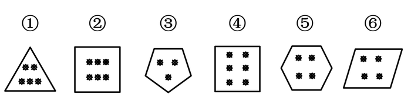
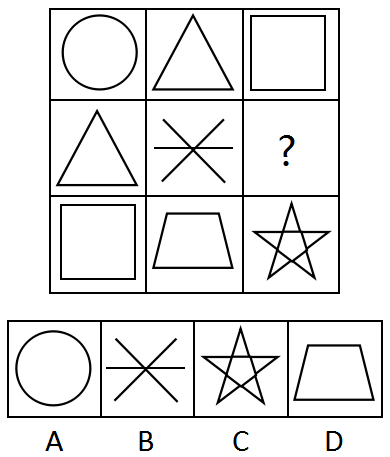
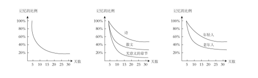
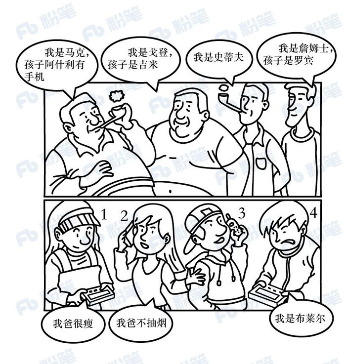

# 2019年420联考《行测》题（吉林甲级）（网友回忆版）

> 判断推理 · 30 题 · 吉林 2019

## 第 1 题　qid 2376764 · 图形推理

把下面六个图形分为两类，使每一类图形都有各自的共同特征或规律，分类正确的一组是：

- **A**. ①③⑥，②④⑤　✅
- **B**. ①②③，④⑤⑥
- **C**. ①②④，③⑤⑥
- **D**. ①④⑤，②③⑥

**答案**：A

**官方解析**

本题为分组分类，元素组成不同，但都出现黑点和多边形外框。观察发现，题干黑点数量依次为5、6、3、6、4、4，外框边数依次为3、4、5、4、6、4，图①③⑥内部点数量加外框边数量都等于8，图②④⑤内部点数量加外框边数量都等10。即①③⑥一组，②④⑤一组。
故正确答案为A。

---

## 第 2 题　qid 2376765 · 图形推理

从所给四个选项中，选择最合适的一个填入问号处，使之呈现一定的规律性

- **A**. A
- **B**. B
- **C**. C　✅
- **D**. D

**答案**：C

**官方解析**

元素组成相同，优先考虑位置规律。观察小黑点发现，规律为每次顺时针平移一格，故？处小黑点应出现在下方，排除A项、B项。再观察灰三角发现，规律为每次顺时针移动一步，故？处灰三角应出现在右边，排除D项。
故正确答案为C。

---

## 第 3 题　qid 2376453 · 图形推理

从所给四个选项中，选择最合适的一个填入问号处，使之呈现一定的规律性

- **A**. 金　✅
- **B**. 令
- **C**. 书
- **D**. 无

**答案**：A

**官方解析**

解析一：元素组成不同，且无明显属性规律，考虑数量规律。图形均为汉字，优先考虑笔画数。九宫格优先横行看，第一横行笔画数依次为2、4、6；第二横行笔画数依次为6、4、10，即前两行均满足前两幅笔画数相加等于第三幅，沿用此规律，第三行笔画数依次为4、？、12，因此问号处应选择8笔画的汉字。A项8笔画，B项5笔画，C项4笔画，D项4笔画。
故正确答案为A。
解析二：元素组成不同，且无明显属性规律，考虑数量规律。图形均为汉字，且“中”“回”存在明显的封闭面，考虑数面。九宫格优先横行看，第一横行面数量依次为0、2、2；第二横行面数量依次为0、0、0，即前两行图形均满足前两幅面数量相加等于第三幅，沿用此规律，第三行面数量依次为0、？、1，因此问号处应选择1个面的汉字。A、B、D项均为0个面，只有C项为1个面。
故正确答案为C。
粉笔说明：两种思路均可通过严谨的数量规律得到答案，且数笔画和数面均为常见考法，故两种答案粉笔都认可。

---

## 第 4 题　qid 2376768 · 图形推理

从所给四个选项中，选择最合适的一个填入问号处，使之呈现一定的规律性

- **A**. A
- **B**. B
- **C**. C
- **D**. D　✅

**答案**：D

**官方解析**

元素组成不同，相同的元素重复出现，优先考虑遍历。九宫格第一行的图形和第一列的图形完全相同，对比第二列的图形，“？”处应选择的图形为梯形，此时第二行和第二列的图形也完全相同，验证发现第三行和第三列也符合此规律。
故正确答案为D。

---

## 第 5 题　qid 2376763 · 图形推理

把下面的六个图形分为两类，使每一类图形都有各自的共同特征或规律，分类正确的一组是

- **A**. ①②③，④⑤⑥
- **B**. ②④⑤，①③⑥
- **C**. ①③⑤，②④⑥
- **D**. ②③⑥，①④⑤　✅

**答案**：D

**官方解析**

思路一：
本题为分组分类题目。元素组成不同，且图形很整齐，优先考虑对称性。观察发现图②③⑥都具有4条对称轴，而①④⑤都是轴对称图形且对称轴不是4。
故正确答案为D。
思路二：
本题为分组分类题目。元素组成不同，出现“田”字及“日”字变形，优先考虑笔画数。观察发现图①③⑤为多笔画图形，图②④⑥为一笔画图形，因此①③⑤一组，②④⑥一组。
故正确答案为C。
因为本题图形都很整齐，所以粉笔更倾向第一种思路，选D。
注：在考查分组分类题目中，吉林省比较喜欢考查一组有相同规律，一组无相同规律。

---

## 第 6 题　qid 2376778 · 定义判断

转品，是指在构句时改变一个字词原来惯用的词性的一种方法，它是实现词语艺术化的重要手段之一。
根据上述定义，下列选项中划横线的字词没有使用转品的是

- **A**. 
他穿的服饰很<u>中国</u>

- **B**. 
这里气候非常<u>夏天</u>

- **C**. 
从此，徐悲鸿真正做到了画马时胸有成<u>马</u>
　✅
- **D**. 
从此，这个人不<u>烟</u>不<u>酒</u>，甚至也不太<u>诗</u>了

**答案**：C

**官方解析**

第一步：找出定义关键词。
“构句时改变一个字词原来惯用的词性的一种方法”。
第二步：逐一分析选项。
A项：“中国”惯用的词性是名词，在选项中用来形容服饰很有中国风格，词性由名词转变为形容词，词性改变，符合“构句时改变一个字词原来惯用的词性的一种方法”，符合定义，排除； 
B项：“夏天”惯用的词性是名词，在选项中用来形容天气热，词性由名词转变为形容词，词性改变，符合“构句时改变一个字词原来惯用的词性的一种方法”，符合定义，排除；
C项：“马”惯用的词性是名词，在选项中依然指马这种生物，词性没有改变，不符合定义，当选；
D项：“烟”“酒”惯用的词性是名词，选项中的意思是抽烟喝酒，词性由名词转变为动词；“诗”惯用的词性是名词，在选项中形容生活不那么诗意，词性由名词转变为形容词，词性都发生了改变，符合“构句时改变一个字词原来惯用的词性的一种方法”，符合定义，排除。
本题为选非题，故正确答案为C。

---

## 第 7 题　qid 2376784 · 逻辑判断

遗忘曲线是由德国心理学家艾宾浩斯研究发现的，它描述了人类大脑对新事物的记忆的遗忘规律。这一规律的具体内容如下图所示：

根据上图，下列判断<b>错误</b>的是

- **A**. 遗忘的速度是不均匀的，是先快后慢
- **B**. 无意义材料比有意义材料遗忘速度快
- **C**. 不同年龄阶段的人遗忘速度不一样
- **D**. 诗歌材料比散文材料遗忘的速度要快　✅

**答案**：D

**官方解析**

第一步：找出定义关键词。
图一：随着天数的增加，记忆遗忘速度越来越慢；
图二：随着天数的增加，诗、散文、无意义章节的遗忘速度都越来越慢，与此同时这三者的遗忘速度快慢比较为，诗慢于散文慢于无意义章节；
图三：随着天数的增加，年轻人、老年人的遗忘速度都越来越慢，与此同时年轻人的遗忘速度慢于老年人。
第二步：逐一分析选项。
A项：由三幅图都能看出随着天数增加，曲线越来越平缓，遗忘速度越来越慢，判断正确，排除； 
B项：由图二可以得出“遗忘速度，诗慢于散文慢于无意义章节”，与无意义章节相比，诗和散文都属于有意义材料，即无意义材料比有意义材料遗忘速度快，判断正确，排除； 
C项：由图三可以得出“年轻人的遗忘速度慢于老年人”，也就是不同年龄阶段的人遗忘速度不一样，判断正确，排除；
D项：由图二可以得出“遗忘速度，诗慢于散文慢于无意义章节”，也就是诗歌材料比散文材料遗忘的速度要慢，并不是快，判断错误，当选。
本题为选非题，故正确答案为D。

---

## 第 8 题　qid 2376759 · 逻辑判断

“当一个胖子装忧郁的时候，别人还以为是肚子饿。”最能说明这一现象的概念是

- **A**. 社会焦点效应：一个人会高估周围人对自己外表和行为的关注度的一种倾向
- **B**. 自我透明度错觉：人们高估自己的个人心理状态被他人知晓程度的一种倾向　✅
- **C**. 旁观者效应：个体面对紧急事件时，他人在场会抑制其利他行为发生的现象
- **D**. 自证预言：若人们相信某件事情会发生，则这件事情最终真的会发生的现象

**答案**：B

**官方解析**

第一步：找出定义关键词。
“当一个胖子装忧郁的时候，别人还以为是肚子饿”。
第二步：逐一分析选项。
A项：胖子装忧郁，但是别人以为他是肚子饿，不符合社会焦点效应中的“一个人会高估周围人对自己外表和行为的关注度的一种倾向”，不符合定义，排除；
B项：胖子装忧郁，胖子以为大家会知晓他的忧郁，结果大家以为他是肚子饿，即胖子高估了自己，符合自我透明度错觉中的“人们高估自己的个人心理状态被他人知晓程度的一种倾向”，符合定义，当选；
C项：胖子装忧郁，但是别人以为他是肚子饿，没有提到紧急事件，不符合旁观者效应中的“个体面对紧急事件”，不符合定义，排除；
D项：胖子装忧郁，但是别人以为他是肚子饿，不符合自证预言中“若人们相信某件事情会发生，则这件事情最终真的会发生的现象”，不符合定义，排除；
故正确答案为B。

---

## 第 9 题　qid 2376762 · 定义判断

语义记忆是指人们对一般知识和规律的记忆，与特殊的地点、时间无关。情景记忆是指人们根据时空关系对某个事件的记忆，这种记忆与个人亲身经历分不开，并受一定时间和空间的限制。
根据上述定义，下列分别属于语义记忆和情景记忆的是

- **A**. 记得妈妈帮自己系鞋带的事和记得曾经在哪里买到了鞋
- **B**. 记住“心理学”的意思和记住“心理学”这个词怎么写
- **C**. 记住“文学艺术”的意思和记得昨晚年会上的舞蹈节目　✅
- **D**. 记得小时候住在哪儿和记得怎样使用自己办公室打印机

**答案**：C

**官方解析**

第一步：找出定义关键词。
语义记忆：“对一般知识和规律的记忆”、“与特殊的地点、时间无关”；
情景记忆：“根据时空关系对某个事件的记忆”、“与个人亲身经历分不开”、“受一定时间和空间的限制”。
第二步：逐一分析选项。
A项：记得妈妈帮自己系鞋带的事和记得曾经在哪里买到了鞋，符合“根据时空关系对某个事件的记忆”、“与个人亲身经历分不开”、“受一定时间和空间的限制”，均属于情景记忆，不符合题干要求，排除；
B项：记住“心理学”的意思和记住“心理学”这个词怎么写，符合“对一般知识和规律的记忆”、“与特殊的地点、时间无关”，均属于语义记忆，不符合题干要求，排除；
C项：记住“文学艺术”的意思，符合“人们对一般知识和规律的记忆”、“与特殊的地点、时间无关”，属于语义记忆；记得昨晚年会上的舞蹈节目，符合“根据时空关系对某个事件的记忆”、“与个人亲身经历分不开”、“受一定时间和空间的限制”，属于情景记忆，符合题干要求，当选；
D项：记得小时候住在哪儿，符合“根据时空关系对某个事件的记忆”、“与个人亲身经历分不开”、“受一定时间和空间的限制”，属于情景记忆；记得怎样使用自己办公室打印机，符合“对一般知识和规律的记忆”、“与特殊的地点、时间无关”，属于语义记忆，与题干要求顺序相反，排除。
故正确答案为C。

---

## 第 10 题　qid 2376770 · 定义判断

服装颜色搭配原则：暖色不宜与冷色搭配。暖色包括红、橙、黄、粉红。冷色包括青、蓝、紫、绿、灰。中间色包括黑、白、咖啡色。服装搭配体型协调原则：①体型较胖者不宜穿暖色或浅色的服装。②体型较瘦者不宜穿深色的服装。
下列搭配符合上述原则的是

- **A**. 较胖的甲，深红色上衣配浅橙色裤子
- **B**. 较瘦的乙，浅黄色上衣配浅灰色裤子
- **C**. 较胖的丙，深蓝色上衣配纯黑色裤子　✅
- **D**. 较瘦的丁，深黄色上衣配浅粉色裤子

**答案**：C

**官方解析**

第一步：找出定义关键词。
服装颜色搭配原则：“暖色不宜与冷色搭配”、“暖色包括红、橙、黄、粉红”、“冷色包括青、蓝、紫、绿、灰”、“中间色包括黑、白、咖啡色”；服装搭配体型协调原则：“体型较胖者不宜穿暖色或浅色的服装”、“体型较瘦者不宜穿深色的服装”。
第二步：逐一分析选项。
A项：较胖的甲，深红色上衣配浅橙色裤子，红色和橙色都是暖色，不符合“体型较胖者不宜穿暖色或浅色的服装”，不符合服装搭配体型协调原则，不符合定义，排除；
B项：较瘦的乙，浅黄色上衣配浅灰色裤子，浅黄色属于暖色，浅灰色属于冷色，不符合“暖色不宜与冷色搭配”，不符合服装颜色搭配原则，不符合定义，排除；
C项：较胖的丙，深蓝色上衣配纯黑色裤子，深蓝色属于深色服装，且蓝色是冷色，符合服装颜色搭配原则，也符合服装搭配体型协调原则，符合定义，当选；
D项：较瘦的丁，深黄色上衣配浅粉色裤子，深黄色上衣属于深色，不符合“体型较瘦者不宜穿深色的服装”，不符合服装搭配体型协调原则，不符合定义，排除。
故正确答案为C。

---

## 第 11 题　qid 2376857 · 类比推理

箴言：劝诫

- **A**. 名言：讽刺
- **B**. 宣言：委婉
- **C**. 直言：坦率　✅
- **D**. 失言：有意

**答案**：C

**官方解析**

第一步：判断题干词语间逻辑关系。
箴言指的是规谏劝诫的话，二者为对应关系。
第二步：判断选项词语间逻辑关系。
A项：名言一般指名人说的话，和讽刺之间没有明显逻辑关系，与题干逻辑关系不一致，排除；
B项：宣言指的是故意散布某种言论，和委婉没有明显逻辑关系，与题干逻辑关系不一致，排除；
C项：直言指的是诚挚地、坦率地说，二者为对应关系，与题干逻辑关系一致，当选；
D项：失言指的是无意中说出不该说的话，和有意没有明显逻辑关系，与题干逻辑关系不一致，排除。
故正确答案为C。

---

## 第 12 题　qid 2376858 · 类比推理

十全十美：完美无缺

- **A**. 七上八下：从容不迫
- **B**. 三心二意：一心一意
- **C**. 四分五裂：支离破碎　✅
- **D**. 千方百计：束手无策

**答案**：C

**官方解析**

第一步：判断题干词语间逻辑关系。
十全十美和完美无缺均指十分完美，毫无欠缺，二者为近义关系。
第二步：判断选项词语间逻辑关系。
A项：七上八下形容心里慌乱不安，无所适从的感觉；从容不迫指不慌不忙，从容镇定，二者为反义关系，与题干逻辑关系不一致，排除；
B项：三心二意形容意志不坚定，犹豫不决；一心一意形容做事专心一意，一门心思的只做一件事，二者为反义关系，与题干逻辑关系不一致，排除；
C项：四分五裂形容不完整，不集中，不团结，不统一；支离破碎形容事物零散破碎，不成整体，二者为近义关系，与题干逻辑关系一致，当选；
D项：千方百计是指想尽一切办法，用尽一切计谋；束手无策是指好像手被束缚住了，无法解脱，形容遇到的麻烦没有办法解决，一筹莫展的情况，二者为反义关系，与题干逻辑关系不一致，排除。
故正确答案为C。

---

## 第 13 题　qid 2376859 · 类比推理

移动：跑步

- **A**. 碰撞：疼痛
- **B**. 恐惧：哭泣
- **C**. 传播：创作
- **D**. 刺激：反应　✅

**答案**：D

**官方解析**

第一步：判断题干词语间逻辑关系。
跑步一定需要移动，因此移动是跑步的必要条件，二者属于对应关系。
第二步：判断选项词语间逻辑关系。
A项：疼痛不一定需要碰撞，因此碰撞不是疼痛的必要条件，与题干逻辑关系不一致，排除；
B项：哭泣不一定需要恐惧，因此恐惧不是哭泣的必要条件，与题干逻辑关系不一致，排除；
C项：创作不一定需要传播，因此传播不是创作的必要条件，与题干逻辑关系不一致，排除；
D项：反应一定需要刺激，因此刺激是反应的必要条件，与题干逻辑关系一致，当选。
故正确答案为D。

---

## 第 14 题　qid 2376776 · 类比推理

固有属性：偶有属性

- **A**. 机械记忆：长期记忆
- **B**. 寒性食物：热性食物
- **C**. 静态博弈：动态博弈　✅
- **D**. 名胜古迹：万里长城

**答案**：C

**官方解析**

第一步：判断题干词语间逻辑关系。
固有属性是指同一类中的所有对象都具有的属性，而偶有属性是一类中的某些对象所具有而不为该类对象都具有的属性，二者属于并列关系中的矛盾关系。
第二步：判断选项词语间逻辑关系。
A项：按照对于学习内容是否理解，将记忆分为机械记忆和意义记忆，而按照记忆时间的长短又将记忆分为长期记忆和短期记忆，二者属于交叉关系，与题干逻辑关系不一致，排除；
B项：中医中将食物分为四类，分别为寒、凉、温、热，因此寒性食物和热性食物为并列关系中的反对关系，与题干逻辑关系不一致，排除；
C项：静态博弈，指的是博弈参与者之间不存在策略选择的先后次序，比如摇骰子比大小，动态博弈，有先后顺序，比如象棋、围棋，二者属于并列关系中的矛盾关系，与题干逻辑关系一致，当选；
D项：万里长城是一种名胜古迹，二者属于包容关系中的种属关系，与题干逻辑关系不一致，排除。
故正确答案为C。

---

## 第 15 题　qid 2376806 · 类比推理

辞旧迎新：古往今来

- **A**. 改朝换代：大同小异
- **B**. 避实击虚：沉思默想
- **C**. 丰功伟绩：拆东补西
- **D**. 厚古薄今：避繁就简　✅

**答案**：D

**官方解析**

第一步：判断题干词语间逻辑关系。
辞旧迎新是指告别旧的一年，迎接新的一年的到来，即庆贺新年的意思。古往今来是指从古到今，泛指很长一段时间。二者语义没有关系，考虑成语拆分，辞和迎，旧和新都是相反的，古和今，往和来也都是相反的，题干两词结构对应。
第二步：判断选项词语间逻辑关系。
A项：改朝换代是指旧的朝代为新的朝代所代替。大同小异是指大体相同，略有差异。二者语义没有关系，考虑成语拆分，改和换，朝和代都不是相反的，与题干逻辑关系不一致，排除；
B项：避实击虚是指避开敌人的主力，找敌人的弱点进攻，又指谈问题回避要害。沉思默想是指形容深入地思考。二者语义没有关系，考虑成语拆分，避和击，实和虚都是相反的，沉和默，思和想都不是相反的，与题干逻辑关系不一致，排除；
C项：丰功伟绩是指伟大的功绩。拆东补西是指拆掉东边去补西边，比喻临时勉强应付。二者语义没有关系，考虑成语拆分，丰和伟，功和绩都不是相反的，与题干逻辑关系不一致，排除；
D项：厚古薄今是指推崇古代的，轻视现代的，多用于学术研究方面。避繁就简是指避开繁杂的，从事简单的。二者没有语义关系，考虑成语拆分，厚和薄，古和今都是相反的，避和就，繁和简也都是相反的，两词结构对应，与题干逻辑关系一致，当选。
故正确答案为D。

---

## 第 16 题　qid 2376807 · 类比推理

偷换概念：逻辑谬误

- **A**. 山谷风：海陆风
- **B**. 蔗糖溶解：物理变化　✅
- **C**. 三角形：四边形
- **D**. 调查方法：问卷调查

**答案**：B

**官方解析**

第一步：判断题干词语间逻辑关系。
本题考查种属关系，偷换概念是一种逻辑谬误，二者是包容关系。
第二步：判断选项词语间逻辑关系。
A项：山谷风是由于山谷与其附近空气之间的热力差异而引起的风，海陆风是因海洋和陆地受热不均匀而在海岸附近形成的一种有日变化的风，二者是并列关系，与题干逻辑关系不一致，排除；
B项：蔗糖溶解没有新物质产生，是物理变化的一种，二者是包容关系，与题干逻辑关系一致，当选；
C项：三角形和四边形是依据边数对多边形进行的分类，二者是并列关系，与题干逻辑关系不一致，排除；
D项：问卷调查是调查方法的一种，二者是包容关系，但两词顺序与题干相反，与题干逻辑关系不一致，排除。
故正确答案为B。

---

## 第 17 题　qid 2376780 · 类比推理

交通费：住宿费：误工费

- **A**. 剪纸：窗花：灯花
- **B**. 森林：树木：桦树
- **C**. 法国：英国：德国　✅
- **D**. 春装：秋装：男装

**答案**：C

**官方解析**

第一步：判断题干词语间逻辑关系。
交通费、住宿费、误工费都属于费用，三者为并列关系。
第二步：判断选项词语间逻辑关系。
A项：窗花属于剪纸的一种，是种属关系，与题干逻辑关系不一致，排除；
B项：森林和树木是组成关系，桦树和树木是种属关系，与题干逻辑关系不一致，排除；
C项：法国、英国、德国都属于国家，三者为并列关系，与题干逻辑关系一致，当选；
D项：春装和秋装都是服装，二者为并列关系，但男装和春装、男装和秋装互为交叉关系，与题干逻辑关系不一致，排除。
故正确答案为C。

---

## 第 18 题　qid 2376781 · 类比推理

和：与：且

- **A**. 是：非：否
- **B**. 好：佳：大
- **C**. 初：始：终
- **D**. 又：再：复　✅

**答案**：D

**官方解析**

第一步：判断题干词语间逻辑关系。
和、与、且都表示“同”的意思，三者为近义关系。
第二步：判断选项词语间逻辑关系。
A项：是和非为反义关系，与题干逻辑关系不一致，排除；
B项：好和佳为近义关系，但佳和大不是近义关系，与题干逻辑关系不一致，排除；
C项：初和始为近义关系，但始和终是反义关系，与题干逻辑关系不一致，排除；
D项：又、再、复都表示重复的意思，三者为近义关系，与题干逻辑关系一致，当选。
故正确答案为D。

---

## 第 19 题　qid 2376462 · 类比推理

（  ）对于大漠沙如雪，燕山月似钩，相当于夸张对于（  ）

- **A**. 借代  烽火连三月，家书抵万金
- **B**. 拟人  危楼高百尺，手可摘星辰
- **C**. 比喻  白发三千丈，缘愁似个长　✅
- **D**. 反问  本是同根生，相煎何太急

**答案**：C

**官方解析**

将选项逐一代入，判断各选项前后部分的逻辑关系。
A项：“大漠沙如雪，燕山月似钩”是指在连绵的燕山山岭上，一弯明月当空，如弯钩一般；平沙万里，在月光下像是铺上一层白皑皑的霜雪，运用了比喻的修辞手法，不是借代，“烽火连三月，家书抵万金”是指连绵的战火已经持续了很长时间，家书难得，一封抵得上万两黄金，诗句运用了夸张的修辞手法，前后逻辑关系不一致，排除；
B项：“大漠沙如雪，燕山月似钩”运用了比喻的修辞手法，不是拟人，“危楼高百尺，手可摘星辰”是指山上寺院的高楼真高啊，好像有一百尺的样子，人在楼上好像一伸手就可以摘下天上的星星，诗句运用了夸张的修辞手法，前后逻辑关系不一致，排除；
C项：“大漠沙如雪，燕山月似钩”运用了比喻的修辞手法，“白发三千丈，缘愁似个长”是指白发长达三千丈，是因为愁才长得这样长，运用了夸张的修辞手法，前后逻辑关系一致，当选；
D项：“大漠沙如雪，燕山月似钩”运用了比喻的修辞手法，不是反问，“本是同根生，相煎何太急”用同根而生的萁和豆来比喻同父共母的兄弟，用萁煎其豆来比喻同胞骨肉的哥哥残害弟弟，运用了比喻的修辞手法，前后逻辑关系不一致，排除。
故正确答案为C。

---

## 第 20 题　qid 2376782 · 类比推理

北风  对于（  ），相当于  民歌  对于（  ）

- **A**. 微风  合唱歌曲　✅
- **B**. 飓风  陕北民歌
- **C**. 南风  音乐体裁
- **D**. 风向  儿童歌曲

**答案**：A

**官方解析**

逐一代入选项。
A项：北风指从北方吹来的风，微风指微弱的风，前者是从风的方向描述，后者是从风的强劲程度描述，二者是交叉关系。民歌指的是具有某种民族风格的歌，合唱歌曲指多人演唱的歌曲，前者是从歌曲风格描述，后者是从演唱人数描述，二者也是交叉关系，前后逻辑关系一致，当选；
B项：北风指从北方吹来的风，飓风指大西洋和北太平洋地区强大而深厚的热带气旋，也泛指狂风和任何热带气旋以及风力达12级的任何大风，二者是交叉关系。陕北民歌是民歌的一种，二者是种属关系，前后逻辑关系不一致，排除；
C项：北风和南风是并列关系。民歌是一种音乐体裁，二者是种属关系，前后逻辑关系不一致，排除；
D项：北风指从北方吹来的风，北风是从风向来描述，和风向是对应关系。儿童歌曲是为儿童创作的歌曲，和民歌是交叉关系，前后逻辑关系不一致，排除。
故正确答案为A。

---

## 第 21 题　qid 2376785 · 类比推理

草木是无情的，人不是草木。所以，人不是无情的。
下列与题干所犯的逻辑错误相同的是

- **A**. 地球是个星球，地球上有人；月球是个星球，所以月球上也有人
- **B**. 所有的天鹅都是白色的，这只鸟是黑色的，所以这只鸟不是天鹅
- **C**. 鸟都是有羽毛的，拔光了羽毛的鸟是鸟，所以拔光了羽毛的鸟是有羽毛的
- **D**. 所有鄙视知识的人都是无知之辈，他从不鄙视知识，所以他不是无知之辈　✅

**答案**：D

**官方解析**

第一步，分析题干逻辑错误。

题干翻译为：“草木无情”，人不是草木，所以不是无情的，即“草木无情”，可知题干所犯逻辑错误为否前推否后。

第二步，逐一分析选项。

A项：地球是个星球，地球上有人；月球是个星球，所以月球上也有人，属于错误类比，没有涉及否前，与题干所犯逻辑错误不同，排除；

B项：翻译为“天鹅白色”，则“黑色（白色）天鹅”，属于否后推否前，与题干所犯逻辑错误不同，排除；

C项：翻译为“鸟有羽毛”，则“拔光了羽毛的鸟有羽毛”，属于肯前推肯后，与题干所犯逻辑错误不同，排除；

D项：翻译为“鄙视知识无知”，则“鄙视知识无知”，属于否前推否后，与题干所犯逻辑错误相同，当选。

故正确答案为D。

---

## 第 22 题　qid 2376533 · 类比推理

在一次聚会上，甲喜欢吃川菜，乙喜欢吃的都是川菜，丙喜欢吃所有川菜。锅包肉不是川菜，但是麻婆豆腐是川菜。
根据上述条件推知，下列一定为真的是

- **A**. 甲喜欢吃麻婆豆腐
- **B**. 乙喜欢吃麻婆豆腐
- **C**. 乙不喜欢吃锅包肉　✅
- **D**. 丙不喜欢吃锅包肉

**答案**：C

**官方解析**

第一步：分析题干。
①甲喜欢吃川菜：即不确定他具体喜欢吃哪一道川菜；
②乙喜欢吃的都是川菜：即不确定他具体喜欢吃哪一道川菜，且其他菜种他一定不喜欢吃；
③丙喜欢吃所有川菜：即每一道川菜他都喜欢吃，其他菜种他也有可能喜欢吃。
第二步：逐一分析选项。
A项：麻婆豆腐是川菜，甲喜欢吃川菜，但是否一定喜欢吃麻婆豆腐这道川菜并不确定，排除；
B项：麻婆豆腐是川菜，乙喜欢吃的都是川菜，但是否一定喜欢吃麻婆豆腐这道川菜并不确定，排除；
C项：锅包肉不是川菜，乙喜欢吃的都是川菜，其他菜种他一定不喜欢吃，即乙一定不喜欢吃锅包肉，当选；
D项：锅包肉不是川菜，丙喜欢吃所有川菜，但其他菜种他也有可能喜欢吃，所以无法确定丙一定不喜欢锅包肉，排除。
故正确答案为C。

---

## 第 23 题　qid 2376787 · 逻辑判断

2018年9-12月，某一线城市的房租租金暴涨，有人认为，房租上涨的根本原因是一些长租公寓运营商哄抢房源、恶性竞争。
下列哪项如果为真，最能反驳上述观点？

- **A**. 大多数一线城市的房价与房租一直存在着涨幅不平衡的问题
- **B**. 新落户政策导致的供需关系变化是此次房租暴涨的唯一原因　✅
- **C**. 少数短租公寓的运营商也存在着哄抬房租等恶性竞争的问题
- **D**. 2018年9-12月，该城市的一些出租大院和工业区公寓被拆

**答案**：B

**官方解析**

第一步：找出论点和论据。
论点：房租上涨的根本原因是一些长租公寓运营商哄抢房源、恶性竞争。
论据：没有明显的论据。
本题只有论点，没有论据，因此只能削弱论点，即表明房租上涨的根本原因不是长租公寓运营商哄抢房源、恶性竞争。
第二步：逐一分析选项。
A项：该项说大多数一线城市的房价与房租一直存在着涨幅不平衡的问题，但并未指出房租上涨的根本原因是什么，无法削弱，排除；
B项：该项指出房租上涨的原因是新落户政策导致供需关系变化，而不是论点中的长租公寓运营商哄抢房源、恶性竞争，直接否定论点，当选；
C项：该项说少数短租公寓的运营商也同样存在着哄抬房租等恶性竞争的问题，但并未指出房租上涨的根本原因是什么，无法削弱，排除；
D项：该项只是说该城市的一些出租大院和工业区公寓被拆，但是并未指出房租上涨的根本原因是什么，无法削弱，排除。
故正确答案为B。

---

## 第 24 题　qid 2376686 · 逻辑判断

某居民小区盗窃案件频发，在小区居民的要求下，物业于去年年初为该小区安装了一种多功能防盗系统，结果该小区盗窃案件的发生率显著下降，这说明多功能防盗系统能够有效降低盗窃案件的发生率。
以下哪项如果为真，最能加强上述结论？

- **A**. 去年，没有安装这种盗窃系统的居民小区盗窃案件显著增加　✅
- **B**. 附近另一个居民小区也安装了这种防盗系统，但是效果不佳
- **C**. 从去年初开始，该城市加强了治安管理，盗窃案件大幅减少
- **D**. 物业采取其他防盗措施，对预防盗窃案件也起到一定的作用

**答案**：A

**官方解析**

第一步：找出论点和论据。
论点：多功能防盗系统能够有效降低盗窃案件的发生率。
论据：物业于去年年初为该小区安装了一种多功能防盗系统，结果该小区盗窃案件的发生率显著下降。
本题的论点和论据话题一致，都是在说安装多功能防盗系统可以降低盗窃案件的发生率，因此优先考虑通过补充论据的方式来说明安装多功能防盗系统对降低盗窃案件发生率确实是有效的。
第二步：逐一分析选项。
A项：没有安装多功能防盗系统的居民小区盗窃案件显著增加，从反面说明安装多功能防盗系统对减少盗窃案件的发生是有效的，该项通过反面举例的方式来加强论点，补充论据，当选。
B项：附近安装了多功能防盗系统的小区效果不好，说明该防盗系统对降低盗窃案件的发生率没有作用，无法加强，排除。
C项：指出城市加强治安管理使得盗窃案件减少，说明盗窃案件降低是其他原因造成的，属于他因削弱，不能支持，排除。
D项：物业采取其他防盗措施，对预防盗窃案件也起到一定的作用，说明案件发生率降低除了防盗系统之外还有其他的原因，属于他因削弱，无法加强，排除。
故正确答案为A。

---

## 第 25 题　qid 2376788 · 逻辑判断

2018年7月，国家体育总局发布《关于举办2018年全国电子竞技公开赛的通知》，将一些知名网络游戏列为正式比赛项目，总决赛的冠亚军将获得国家集训资格。国家在号召学生抵制网瘾的同时，发布这一通知，这似乎自相矛盾。
下列哪项最能解释这一看起来矛盾的现象？

- **A**. 职业化电竞训练同娱乐化网游本质不同　✅
- **B**. 实战并不是提高网游水平的关键性因素
- **C**. 网游水平的提高离不开大量的实战训练
- **D**. 对于学生来说，学业远比网络游戏重要

**答案**：A

**官方解析**

第一步：找出题干矛盾。
国家在号召学生抵制网瘾的同时，将网络游戏列为正式比赛项目。
第二步：逐一分析选项。
A项：说明职业化电竞训练和为了娱乐打网游是有本质区别的，网瘾多是将网游当做一种娱乐，长期沉溺其中，所以国家将职业化电竞列为正式比赛项目，与抵制网瘾两者并不冲突，可以解释题干矛盾，当选；
B项：只能说明实战不是提高网游水平的关键，无法解释为何在抵制网瘾的同时，将网游列为正式比赛项目，不能解释题干矛盾，排除；
C项：只能说明网游水平的提高和实战训练有关，无法解释为何在抵制网瘾的同时，将网游列为正式比赛项目，不能解释题干矛盾，排除；
D项：该项说明学生更看重学业，无法解释为何在抵制网瘾的同时，将网游列为正式比赛项目，不能解释题干矛盾，排除。
故正确答案为A。

---

## 第 26 题　qid 2376792 · 类比推理

根据下图所给的条件，4个孩子与4位爸爸的对应关系正确的是

- **A**. 小孩1是史蒂夫的女儿
- **B**. 小孩2是詹姆士的女儿
- **C**. 小孩3是马克的儿子　✅
- **D**. 小孩4是戈登的儿子

**答案**：C

**官方解析**

第一步：分析题干。
题目中有四位父亲，从左至右第一位说：“我是马克，孩子阿什利有手机。”观察选项，小孩2和小孩3均有手机，但是小孩2说：“我爸不抽烟。”而题干第一位爸爸抽烟，故第一位父亲的孩子是小孩3；
第二位爸爸说孩子是吉米；第三位爸爸并未说孩子名字；第四位爸爸说孩子是罗宾。结合小孩4说：“我是布莱尔。”其名字在题干的四位父亲中并未提到，所以布莱尔的父亲是题干中唯一一位没提到孩子名字的父亲，即第三位父亲的孩子是小孩4；
又因为小孩1说：“我爸很瘦。”题干中只有第三和第四位父亲很瘦，但已经确定第三位父亲的孩子是小孩4，故第四位父亲的孩子是小孩1；剩下第二位父亲的孩子是小孩2。
第二步：逐一分析选项。
A项：通过分析可知，小孩1是第四位父亲的孩子，即是詹姆士的孩子，对应错误，排除；
B项：通过分析可知，小孩2是第二位父亲的孩子，即是戈登的孩子，对应错误，排除；
C项：通过分析可知，小孩3是第一位父亲的孩子，即是马克的孩子，对应正确，当选；
D项：通过分析可知，小孩4是第三位父亲的孩子，即是史蒂夫的孩子，对应错误，排除。
故正确答案为C。

---

## 第 27 题　qid 2376793 · 逻辑判断

一直以来，很多科学家认为全球海平面上升的主要原因是全球气候变暖，冰川和冰盖的融化加剧。近日，有研究人员通过统计数据发现，近百年来南极降雪量大幅增加，进而增加了南极等冰冻区域所“存储”的冻水量。据此，有专家乐观估计，全球海平面上升的趋势将被逆转。
以下哪项如果为真，最能削弱该专家的观点

- **A**. 据相关数据统计，南极降雪量在近几年有微弱减少的趋势
- **B**. 降雪带来的冰增量仅为冰川融化导致的冰损失的三分之一　✅
- **C**. 研究人员对影响全球气候变暖原因的分析可能有一些遗漏
- **D**. 据有关气象部门预计，今年的全球平均气温将略低于去年

**答案**：B

**官方解析**

第一步：找出论点和论据。
论点：全球海平面上升的趋势将被逆转。
论据：海平面上升的主要原因是全球变暖，冰川和冰盖融化加剧；近百年来南极降雪大幅增加，进而增加了南极等冰冻区域所“存储”的冻水量。
论点的话题是“全球海平面上升趋势将被逆转，即全球海平面下降”，论据的话题是“海平面上升的原因是全球气候变暖，而近百年南极的冻水量增加，所以全球海平面下降”，二者话题一致，优先考虑否论点。
第二步：逐一分析选项。
A项：该项的“近几年降雪量微弱减少”，是对论据中南极降雪量大幅增加的否定，属于否论据，可以削弱，保留；
B项：“降雪带来的冰增量仅为冰川融化导致的冰损失的三分之一”说明冰损失的总量还在上升，即全球海平面上升，属于否论点，可以削弱，保留；
C项：“全球变暖的原因分析有遗漏”这说明研究的分析不充分，但实际上海平面是否会上升是不明确的，不能削弱，排除；
D项：“今年的全球平均气温略低于去年”不能说明全球海平面变化的趋势，不能削弱，排除。
A项为否论据，B项为否论点，B项的削弱力度更强。
故正确答案为B。

---

## 第 28 题　qid 2376540 · 逻辑判断

目前，广泛应用的机械超材料有着负热膨胀、低重量时的高强度和高刚度等卓越特性。但这种机械超材料一旦构建完成，其属性将无法更改或调整。近日，有研究人员开发出一种新型材料攻克了这一难题。可以肯定，在不久的将来，机器人、智能可穿戴装备等领域一定会旧貌换新颜。
以下哪项如果为真，最能支持上述结论

- **A**. 目前，已有科研团队与该成果的研究团队探讨这种新型材料的具体应用前景
- **B**. 从一种新材料的合成到该材料的具体实际应用，要克服多种难以预料的困难
- **C**. 这种新材料对磁场响应的稳定性及对磁场强度的要求还在反复地检验和测试
- **D**. 历史证明，每一次新技术和新材料的突破都会迅速引起相关应用领域的剧变　✅

**答案**：D

**官方解析**

第一步：找出论点和论据。
论点：在不久的将来，机器人、智能可穿戴装备等领域一定会旧貌换新颜。
论据：有研究人员开发出一种新型材料攻克了机械超材料构建完成后属性将无法更改或调整的难题。
本题中论点的话题是“机器人、智能穿戴装备等领域会改变”，论据的话题是“开发出新型材料”，论点和论据话题不一致，优先考虑搭桥项。
第二步：逐一分析选项。
A项：该项说明已有团队探讨这种新型材料的具体应用前景，但没有提及探讨之后的结果。因此这种新型材料是否会应用于机器人、智能可穿戴装备等领域并不明确，无法加强，排除；
B项：该项说明新材料从合成到应用有很多困难，但是“困难多”与这种新型材料是否可以应用在机器人、智能可穿戴装备等领域无关，无法加强，排除；
C项：这种新材料对磁场响应的稳定性及对磁场强度的要求还在反复地检验和测试，那么这种新型材料是否可以应用在机器人、智能可穿戴装备等领域还不明确，无法加强，排除；
D项：该项说明每次新材料的突破都会引起相关应用领域的剧变，建立了“机器人、智能穿戴装备等领域会改变”和“开发出新型材料”的联系，属于搭桥项，可以加强，当选。
故正确答案为D。

---

## 第 29 题　qid 2376794 · 逻辑判断

近日，某国航空航天局最新的数据分析证实，“好奇”号火星探测器于2013年6月在火星上探测到的信号是甲烷信号。有人据此推断，这些甲烷可能是来源于生活在盖尔陨石坑内的生物体，这说明火星上一定存在生命。
以下哪项如果为真，最能质疑上述推断

- **A**. 甲烷一直被视为遥远的星球上存在着生命的标志
- **B**. 经证实，火星上探测到的甲烷信号是持续稳定的
- **C**. 地球上的甲烷由生物体产生后会迅速消失在大气中，这证明火星上的甲烷一定刚被释放不久
- **D**. 火星上发现的甲烷，可能是因为陨石冲击，导致封存地底的甲烷气体被不断地释放出来　✅

**答案**：D

**官方解析**

第一步：找出论点和论据。
论点：这些甲烷可能是来源于生活在盖尔陨石坑内的生物体，这说明火星上一定存在生命。
论据：近日，某国航空航天局最新的数据分析证实，“好奇”号火星探测器于2013年6月在火星上探测到的信号是甲烷信号。
第二步：逐一分析选项。
A项：甲烷是存在生命的标志，说明甲烷和生命有联系，可以加强，不能削弱，排除；
B项：甲烷信号稳定不能说明火星是否有生命，属于不明确选项，不能削弱，排除；
C项：表明火星上的甲烷一定刚被释放不久，但是没有提到生命，不能削弱，排除；
D项：说明火星上发现的甲烷可能是陨石冲击后从地底释放出来的，和生命无关，可以削弱，当选。
故正确答案为D。

---

## 第 30 题　qid 2376508 · 类比推理

友谊是获得人生幸福的重要途径。按照古罗马哲学家西塞罗的说法，“友谊只存在于好人之间，终生不渝的友谊是最难的事情”；另一位西班牙哲学家乔洛·商塔亚纳认为，“友谊几乎都是一颗心的一部分与另一颗心的一部分之结合，人们只能是局部的朋友”。
以上陈述如果为真，则下列一定为真的是

- **A**. 终生不渝的友谊是最为宝贵的财富
- **B**. 坏人与坏人之间一定不会存在友谊　✅
- **C**. 好人之间一定存在某种局部的友谊
- **D**. 友谊是获得人生幸福的最重要途径

**答案**：B

**官方解析**

日常结论题，根据题干信息逐一分析选项。
A项：终生不渝的友谊是最难的，不代表它就是最宝贵的财富，无中生有，排除；
B项：题干中说“友谊只存在于好人之间”，因此坏人之间不存在友谊，可以推出，当选；
C项：题干中说“友谊只存在于好人之间”，但没有说好人之间一定存在友谊，无法推出，排除；
D项：根据第一句可知，友谊是获得人生幸福的重要途径，但无法推出是最重要的途径，排除。
故正确答案为B。

---
