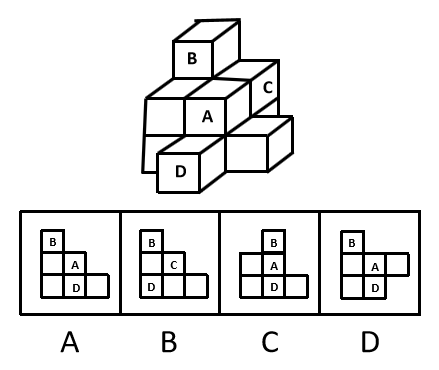
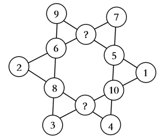
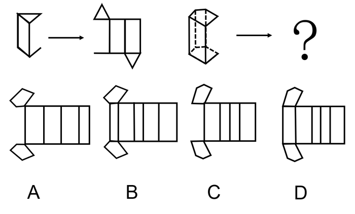
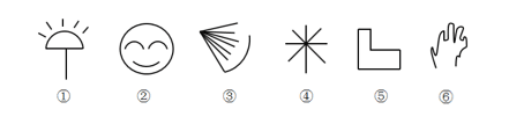
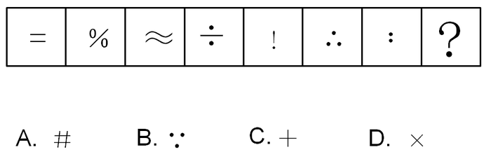
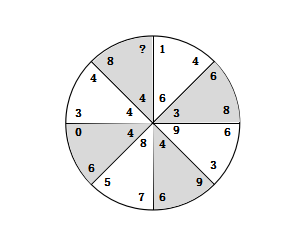
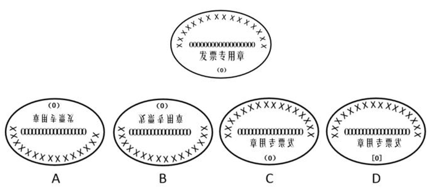

# 2019年420联考《行测》题（宁夏卷）（网友回忆版）

> 判断推理 · 40 题 · 宁夏 2019

## 第 1 题　qid 2377144 · 图形推理

下面四个选项中，是题干图形的正面平视图的是：

- **A**. A　✅
- **B**. B
- **C**. C
- **D**. D

**答案**：A

**官方解析**

本题考查三视图。题干图形的正面平视图应该是最左侧有三个正方形且最上边是字母B所在的面，中间是字母A和D所在的两个面，最右侧是一个空白面，对应A选项。
故正确答案为A。

---

## 第 2 题　qid 2377148 · 图形推理

请从所给四个选项中选择一个最合适的填入问号处，使之呈现一定的规律性。

- **A**. 7，10
- **B**. 13，6
- **C**. 11，12　✅
- **D**. 11，9

**答案**：C

**官方解析**

观察题干图形，发现每一条直线上都有四个数字，优先考虑数字的加减运算。进一步观察发现每条直线上的四个数字相加之和都是26，故“？”处的两个数字应该分别是11、12，对应C选项。
故正确答案为C。

---

## 第 3 题　qid 2377152 · 图形推理

请从所给四个选项中选择一个最合适的填入问号处，使之呈现一定的规律性。

- **A**. A
- **B**. B
- **C**. C　✅
- **D**. D

**答案**：C

**官方解析**

观察左边的两个图，发现立体图形的最右边的一条竖线缺失，展开图中对应也有一条竖线缺失，右边的立体图形最右边也缺失一条竖线，因此展开图中也应缺少一条竖线，所以排除BD选项。对比AC，A选项上面的五边形与最左侧长方形之间的相邻边长度不一致，说明不能折成题干的立体图形，排除A。

故正确答案为C。

---

## 第 4 题　qid 2377155 · 图形推理

请从所给四个选项中选择一个最合适的填入1和2处，使之呈现一定的规律性。

- **A**. A
- **B**. B
- **C**. C
- **D**. D　✅

**答案**：D

**官方解析**

观察图形特征，九宫格优先横着看，第一行图1和图2相加得到图3，第二行图1到图3图形没有改变，说明图2不能在图1的基础上增加新的线条，因此排除A项。第三行图1和图2相加得到的图形应该是长斜线两边各有两根短线，因此选D。
故正确答案为D。

---

## 第 5 题　qid 2377154 · 图形推理

根据下列图形规律将图形分组，分组正确的是：

- **A**. ②③⑤；①④⑥
- **B**. ①④⑤；②③⑥
- **C**. ①②④；③⑤⑥
- **D**. ①②⑤；③④⑥　✅

**答案**：D

**官方解析**

本题为分组分类题目。元素组成不同，无明显属性规律，考虑数量规律。观察发现，图中出现了很多空白区域，考虑数面。图①②⑤的面数量都是1，图③④⑥的面数量都是0，即①②⑤一组，③④⑥一组。
故正确答案为D。

---

## 第 6 题　qid 2377135 · 图形推理

请从所给四个选项中选择一个最合适的选项填入问号处，使之呈现一定的规律性。

- **A**. A　✅
- **B**. B
- **C**. C
- **D**. D

**答案**：A

**官方解析**

元素组成相同，优先考虑位置规律。九宫格优先横行看，图形都是分内外的，内外分开看，观察外框发现，外部线条沿外框每次逆时针平移一步，观察内部发现，内部线条沿外框4个顶点每次顺时针旋转一个点；第二行满足此规律，外部线条沿外框每次逆时针平移一步，内部线条沿外框5个顶点每次顺时针旋转一个点；因此？处，外部线条应逆时针平移一步，排除BC项，内部线条应沿外框6个顶点每次顺时针旋转一个点，旋转到左上方，排除D项。故正确答案为A。

---

## 第 7 题　qid 2377150 · 图形推理

请从所给四个选项中选择一个最合适的填入问号处，使之呈现一定的规律性：

- **A**. A
- **B**. B　✅
- **C**. C
- **D**. D

**答案**：B

**官方解析**

观察图形特征，元素组成不同，发现题干图形部分数分别为：2、3、2、3、2、3、2，因此？处应该是一个三部分的图形，A、C、D都是一部分图形，只有B项符合。
故正确答案为B。

---

## 第 8 题　qid 2377224 · 图形推理

从所给四个选项中，选择一个最合适的选项填入问号处，使之呈现一定规律。

- **A**. 1　✅
- **B**. 6
- **C**. 8
- **D**. 9

**答案**：A

**官方解析**

元素组成不同，属性无明显规律，优先考虑数量规律。题干数字均有封闭空间，考虑数面。且图形有黑白之分，考虑分开数。发现题干黑色图形数字内均共有三个面，白色图形数字内均共有两个面。因此“？”处选择一个数字使之相加共有三个面。只有A项符合。
故正确答案为A。

---

## 第 9 题　qid 2377138 · 图形推理

下列四个选项的图形，能由所给图形转动而成的是：

- **A**. A
- **B**. B
- **C**. C　✅
- **D**. D

**答案**：C

**官方解析**

题干要求选“转动”，可以包括旋转或者翻转（上下翻转或左右翻转，类似于“翻书页”）两种形式。
首先观察题干图形特征，包括汉字“发票专用章”、“（0）”、16个“X”，以及18个“0”，共四类元素。
观察选项：
A项：图形包含15个“X”，比原图少一个“X”,故不可能是题干图形旋转180度而来，排除；
B项：图形包含17个“0”，比原图少一个“0”,故不可能是题干图形上下翻转而来，排除；
C项：所有元素齐全，为题干图形左右翻转而来，当选；
D项：将原图中的“（0）”改成了“[0]”，故不可能通过原图转动得到，排除；
故正确答案为C。

---

## 第 10 题　qid 2377141 · 图形推理

请从所给四个选项中选择一个最合适的填入问号处，使之呈现一定的规律性。

- **A**. A
- **B**. B
- **C**. C
- **D**. D　✅

**答案**：D

**官方解析**

元素组成不同，优先考虑属性规律。观察发现题干都是轴对称图形并且都有一条竖直对称轴，只有D项符合。
故正确答案为D。

---

## 第 11 题　qid 2377164 · 定义判断

消费者善意是指消费者基于自身直接经历或者主观上的认知而产生的对某一国家的喜爱、共鸣乃至情感依恋，而这种情感会让消费者对有关该国产品的消费决策产生影响。
根据上述定义，下列属于消费者善意的是：

- **A**. 德国人以严谨著称，小马很认可这一点，所以买电器类的产品一定要选德国品牌　✅
- **B**. 老刘因为从小喜欢俄罗斯歌曲而喜欢上了俄罗斯，在选择旅游目的地时，毫不犹豫地选择了俄罗斯
- **C**. 在南美旅游时喝了当地的马黛茶后，小张再也喝不惯国内的马黛茶了
- **D**. 张教授早年留学美国，儿子受他的影响也选择了去美国留学

**答案**：A

**官方解析**

第一步：找出定义关键词。
“基于自身直接经历或者主观上的认知”、“产生的对某一国家的喜爱、共鸣乃至情感依恋”、“这种情感会让消费者对有关该国产品的消费决策产生影响”。
第二步：逐一分析选项。
A项：小马认可德国人的严谨态度，符合“基于自身主观认识产生对国家的喜爱”， 因为认可德国人的态度，所以购买电器类的产品一定要选德国品牌，符合“这种情感会让消费者对有关该国产品的消费决策产生影响”，符合定义，当选； 
B项：老刘因为从小喜欢俄罗斯歌曲而喜欢俄罗斯，符合“基于自身经历产生对某一国家喜爱”，选择俄罗斯作为旅游的目的地，但没有明显体现出老刘做出消费决策，不符合“对有关该国产品的消费决策产生影响”，不符合定义，排除； 
C项：小张只是喜欢喝南美的马黛茶，并没有体现出“产生的对某一国家的喜爱、共鸣乃至情感依恋”，并且也没有做出消费决策，不符合定义，排除；
D项：张教授的儿子是受张教授的影响，不符合“基于自身直接经历或者主观上的认知”，不符合定义，排除。
故正确答案为A。

---

## 第 12 题　qid 2377165 · 定义判断

元刻板印象是指个体关于外群体成员对其所属群体所持刻板印象的信念。
根据上述定义，下列属于元刻板印象的是：

- **A**. 二班的任课教师们一致认为贫困儿童小豪存在交流障碍
- **B**. 经济学家们认为高房价影响80后夫妻生二孩意愿
- **C**. 刘大夫认为如今的患者普遍不太信任医生　✅
- **D**. 南方人小刘认为北方人都比较耐冻

**答案**：C

**官方解析**

第一步：找出定义关键词。
“个体认为外群体成员对其所属群体存在刻板印象”。
第二步：逐一分析选项。
A项：任课教师认为贫困儿童小豪存在交流障碍，这是任课教师对小豪的印象，而不是任课教师认为小豪对教师群体存在刻板印象，不符合“个体认为外群体成员对其所属群体存在刻板印象”，不符合定义，排除；
B项：经济学家认为高房价影响80后夫妻生二孩意愿，这是经济学家对80后夫妻的印象，而不是经济学家认为80后夫妻对经济学家群体存在刻板印象，不符合“个体认为外群体成员对其所属群体存在刻板印象”，不符合定义，排除；
C项：刘大夫认为患者不信任医生群体，刘大夫属于医生群体，患者是“外群体成员”，患者普遍不太信任医生，符合“个体认为外群体成员对其所属群体存在刻板印象”，符合定义，当选；
D项：南方人小刘认为北方人耐冻，这是小刘对北方人的印象，而不是小刘认为北方人对南方人群体存在刻板印象，不符合“个体认为外群体成员对其所属群体存在刻板印象”，不符合定义，排除。
故正确答案为C。

---

## 第 13 题　qid 2377166 · 定义判断

顾客主动社会化是指顾客为了有效参与到服务过程而主动学习与其扮演角色相关的知识和信息的过程。
根据上述定义，下列属于顾客主动社会化的是：

- **A**. 退休的张阿姨每天晚上收看电视养生节目学习养生
- **B**. 公司员工小刘为了提高在某片区的销售业绩，自学当地方言
- **C**. 小明的妈妈为了帮助小明提高奥数成绩，自己也报了奥数培训班
- **D**. 小谢不认同医生关于自己患有抑郁症的诊断，为此上网搜了很多资料　✅

**答案**：D

**官方解析**

第一步：找出定义关键词。
“顾客”、“为了有效参与到服务过程”、“主动学习与其扮演角色相关的知识和信息”。 
第二步：逐一分析选项。
A项：退休的张阿姨收看电视养生节目，张阿姨不是“顾客”，不符合定义，排除； 
B项：小刘是公司员工，不是“顾客”，为提高销售业绩而学习方言，不符合“为了有效参与到服务过程”，不符合定义，排除； 
C项：小明的妈妈是奥数培训班的“顾客”， 但她报奥数班的目的是为了帮助小明提高奥数成绩，不符合“为了有效参与到服务过程”，不符合定义，排除；
D项：小谢是一名患者，所以他是医生的“顾客”，小谢在网上搜了很多的资料是为了确认医生对自己的诊断是否正确，符合“为了有效参与服务过程”，也符合“主动学习与其扮演角色相关的知识和信息”，符合定义，当选。
故正确答案为D。

---

## 第 14 题　qid 2377168 · 定义判断

公众科学是指在科学公开化与科学政策公开化的必要基础上，公众直接参与科学知识产出过程。公共科学是指普通公众参与科学相关的科技政策审议、科学问题讨论以及科学成果转化等。
根据上述定义，下列属于公众科学的是：

- **A**. 某医学伦理委员会就基因编辑的道德风险向当地的科技工作者征询意见
- **B**. 某手机公司的研发部门就是否取消物理按键公开征询广大消费者意见
- **C**. 明镜调查公司就5G商业前景在车站广场等公共场所发放调查问卷
- **D**. 某公司为缩短研发的抗癌新药上市周期而招募试用志愿者　✅

**答案**：D

**官方解析**

第一步：找出定义关键词。
公众科学：“科学公开化与科学政策公开化”、“直接参与科学知识产出过程”；
公共科学：“普通公众参与”、“科学相关的科技政策审议、科学问题讨论以及科学成果转化等”。
第二步：逐一分析选项。
A项：医学伦理委员会向当地的科技工作者征询意见，不符合“直接参与科学知识产出过程”，不符合定义，排除；
B项：公司的研发部门征询广大消费者意见，不符合“直接参与科学知识产出过程”，不符合定义，排除；
C项：明镜调查公司在车站广场发放调查问卷，不符合“直接参与科学知识产出过程”，不符合定义，排除；
D项：某公司为研发抗癌新药招募试用志愿者，符合“直接参与科学知识产出过程”，符合定义，当选。
故正确答案为D。

---

## 第 15 题　qid 2377145 · 定义判断

生态系统反服务是指随着受损的自然生态系统结构和功能在人类主动干预保护措施的实施下，逐步得到恢复的同时，生态系统对人类日常生活和生产活动产生的负面影响。
根据上述定义，下列最不可能属于生态系统反服务的是：

- **A**. 城市干道种植的大量法国梧桐，是诱发市民过敏性鼻炎的重要因素
- **B**. 某地动物保护工作开展以来，猕猴数量剧增，它们常骚扰当地居民
- **C**. 修建水坝改善当地的经济状况的同时，也使一部分历史遗迹遭到破坏　✅
- **D**. 因禁止使用除草剂，农民不得不投入更大的人力成本来拔掉杂草

**答案**：C

**官方解析**

第一步：找出定义关键词。
“随着受损的自然生态系统结构和功能在人类主动干预保护措施的实施下”、“生态系统对人类日常生活和生产活动产生的负面影响”。
第二步：逐一分析选项。
A项：城市干道种植大量法国梧桐，符合“随着受损的自然生态系统结构和功能在人类主动干预保护措施的实施下”，诱发市民过敏性鼻炎，符合“生态系统对人类日常生活和生产活动产生的负面影响”，符合定义，排除；
B项：某地动物保护工作的开展，符合“随着受损的自然生态系统结构和功能在人类主动干预保护措施的实施下”，猕猴数量剧增，经常骚扰当地居民，符合“生态系统对人类日常生活和生产活动产生的负面影响”，符合定义，排除；
C项：修建水坝改善当地的经济状况，不符合“随着受损的自然生态系统结构和功能在人类主动干预保护措施的实施下”，使历史遗迹遭到破坏，不符合“生态系统对人类日常生活和生产活动产生的负面影响”，不符合定义，当选；
D项：禁止使用除草剂，符合“随着受损的自然生态系统结构和功能在人类主动干预保护措施的实施下”，农民投入更大的人力成本，符合“生态系统对人类日常生活和生产活动产生的负面影响”符合定义，排除。
本题为选非题，故正确答案为C。

---

## 第 16 题　qid 2377147 · 定义判断

确认偏差是指人一旦产生某个信念，就会努力寻找与它相符的例子，并无视那些不符的。
根据上述定义，下列最可能属于确认偏差的是：

- **A**. 尽管别人告诉厨师小黄所有泡菜坛里的泡菜原料、泡制时间都一样，但厨师小黄仍认为用黄色泡菜坛里的泡菜烹饪鱼香肉丝会更可口
- **B**. 股票经理人告诉客户小明某股票会涨的同时又背着小明告诉其他客户该股票会跌，结果该股票大涨，因此小明对经理人十分信任
- **C**. 小刚认为终有一天会天降横财，便痴迷于彩票，尽管从未中奖，他还是整日游手好闲，甚至贷款买彩票
- **D**. 小东听到某个所谓的“预言家”断定自己会遭遇车祸后时常感到担忧，终于在某天与其他车辆发生擦挂，于是小东更相信那位“预言家”了　✅

**答案**：D

**官方解析**

第一步：找出定义关键词。
“产生某个信念”、“努力寻找与它相符的例子”、“无视那些不符的”。
第二步：逐一分析选项。
A项：小黄的信念是认为黄色泡菜坛里的泡菜做鱼香肉丝更好吃，但没有寻找与之相符的例子，也没有无视不符合的例子，不符合“努力寻找与它相符的例子”、“无视那些不符的”，不符合定义，排除；
B项：股票经理人告诉客户小明某股票会涨，股票果然大涨，因此小明对经理人十分信任，是先有相符的例子后，才信任经理人，而题干是先产生信念，再找相符的例子，不符合“人一旦产生某个信念，就会努力寻找与它相符的例子”，不符合定义，排除；
C项：小刚认为终有一天会天降横财，痴迷于彩票，只是盲目买彩票，无视不符合的情况，但没有努力寻找与信念相符的例子来印证自己的信念是正确的，不符合“努力寻找与它相符的例子”，不符合定义，排除；
D项：小东听到“预言家”断定自己会遭遇车祸后时常感到担忧，说明小东相信自己会出车祸的预言，符合“产生某个信念”，与其他车辆发生擦挂后更相信那位“预言家”，说明小东认为擦挂证明了自己确实会出车祸，认为预言成真，却无视其它安全驾驶的情况，符合“努力寻找与它相符的例子”、“无视那些不符的”，符合定义，当选。
故正确答案为D。

---

## 第 17 题　qid 2377151 · 逻辑判断

析字，即把一个字析为音、形、义三个方面，看别的字有一面同它相合相连，随即借事代替或推演上去。
据此，下列选项中不包含析字的是：

- **A**. 愁莫渡江，秋心拆两半，怕你上不了岸，一辈子摇晃
- **B**. 来到江南，我又想起了汝，水乡泽国的姑娘，水边的女子
- **C**. 那对恋人本已定下婚期，不料却遭遇车祸，让婚礼变成了葬礼　✅
- **D**. 今儿我送给这对新人些红枣、花生、桂圆和莲子，寓意当然是祝他们早生贵子

**答案**：C

**官方解析**

第一步：找出定义关键词。
“把一个字析为音、形、义三个方面”，“看别的字有一面同它相合相连，随即借事代替或推演上去”。
第二步：逐一分析选项。
A项：愁莫渡江，秋心拆两半，由“愁”字的形推演为“秋心”，符合“把一个字析为音、形、义三个方面”“看别的字有一面同它相合相连，随即借事代替或推演上去”，符合定义，排除；
B项：我又想起了汝，水乡泽国的姑娘，由“汝”字的形推演为“水乡泽国的姑娘”，符合“把一个字析为音、形、义三个方面”“看别的字有一面同它相合相连，随即借事代替或推演上去”，符合定义，排除；
C项：本已定下婚期，不料遭遇车祸，不符合“把一个字析为音、形、义三个方面”，不符合“看别的字有一面同它相合相连，随即借事代替或推演上去”，不符合定义，当选；
D项：红枣、桂圆、莲子，寓意祝他们早生贵子，由“红枣”的音代替“早”，由“桂圆”的音代替“贵”，由“莲子”的音代替“子”，连起来推演为“早生贵子”，符合“把一个字析为音、形、义三个方面”“看别的字有一面同它相合相连，随即借事代替或推演上去”，符合定义，排除。
本题为选非题，故正确答案为C。

---

## 第 18 题　qid 2377162 · 定义判断

框架效应是指对于相同的事实信息，采用不同的表达方式，会使人产生不同的判断决策。一般来讲，在损失和收益方面，人们更倾向关注损失。
根据上述定义，下列情形描述最不可能存在框架效应的是：

- **A**. 
小明每天能得到一个面包，当被问“你吃了半个面包了，还吃吗”时，他选择不吃；而要是问“还有半个面包，你吃吗”，他会选择吃完

- **B**. 
小红看到A理财产品能地让自己获利，而B产品能让自己有的机会获利时，毅然选择了投资B产品
　✅
- **C**. 
鉴于消费者对脂肪的抵触情绪，某牛奶公司把所产牛奶产品相关描述从“含脂量”变为“脱脂量”，为此该公司销售业绩迅速上涨

- **D**. 
“甲汽车客运站的客车发生车祸的概率仅为，而乙汽车客运站的客车平安送达率为”看到这，乘客小坤选择乘坐乙汽车客运站的车

**答案**：B

**官方解析**

第一步：找出定义关键词。

“对于相同的事实信息，采用不同的表达方式，会使人产生不同的判断决断”、“在损失和收益面前，人们更倾向于关注损失”。

第二步：逐一分析选项。

A项：问的都是关于小明吃不吃面包的事，并且小明做出不同决断，符合“对于相同的事实信息，采用不同的表达方式，会使人产生不同的判断决断”，当被问“你吃了半个面包了，还吃吗”时，他选择不吃，被问“还有半个面包，你吃吗”，他选择吃完，体现了小明怕受损失的心理，符合“在损失和收益面前，人们更倾向于关注损失”，符合定义，排除；

B项：此选项是小红关于理财产品的选择，A产品能获利，B产品有的机会获利，两个产品获利不同，不符合“对于相同的事实信息，采用不同的表达方式，会使人产生不同的判断决断”，不符合定义，当选；

C项：牛奶公司对于牛奶脂肪含量的不同表述，影响人们购买，符合“对于相同的事实信息，采用不同的表达方式，会使人产生不同的判断决断”，把“含脂量”改为“脱脂量”，销量上涨，抓住了人们怕摄入脂肪的心理，符合“在损失和收益面前，人们更倾向于关注损失”，符合定义，排除；

D项：甲乙两客车站对于车祸概率的不同表述，影响人们的选择，符合“对于相同的事实信息，采用不同的表达方式，会使人产生不同的判断决断”，甲发生车祸率为，乙平安送达率，人们更多选择乙，体现了人们怕生命财产遭受损失的心理，符合“在损失和收益面前，人们更倾向于关注损失”，符合定义，排除。

本题为选非题，故正确答案为B。

---

## 第 19 题　qid 2377156 · 定义判断

团队学习行为是团队成员为了满足团队和个人的发展需求，在分享各自经验的基础上，通过知识和信息交流等途径提出问题、寻求反馈、进行实验、反思结果，对失误或未预期结果进行讨论，促进团队与个人知识或技能水平不断提高，进而实现团队层面知识与技能的相对持久变化。
根据上述定义，下列属于团队学习行为的是：

- **A**. 某项目组为了在项目攻关阶段发挥团队的凝聚力和战斗力，每周末都举行野外拓展训练
- **B**. 小王为了今后的发展，在上班期间抽空和其他几位同事一起学习英语
- **C**. 为了获得奖学金，某宿舍全体女生约定大家相互监督，晚上一起去自习
- **D**. 销售部为提高部门整体业绩，推选优秀代表定期与大家分享销售经验　✅

**答案**：D

**官方解析**

第一步：找出定义关键词。
“为了满足团队和个人的发展需求”、“在分享各自经验的基础上，通过知识和信息交流等途径提出问题、寻求反馈、进行试验，反思结果”、“促进团队与个人知识或技能水平的不断提高，进而实现团队层面知识与技能的相对持久化”。
第二步：逐一分析选项。
A项：项目组进行野外拓展训练，不符合“在分享各自经验的基础上，通过知识和信息交流等途径提出问题、寻求反馈、进行试验，反思结果”，不符合定义，排除； 
B项：小王在上班期间和同事学英语，是为了个人能力的提升，不符合“促进团队与个人知识或技能水平的不断提高，进而实现团队层面知识与技能的相对持久化”，不符合定义，排除；
C项：宿舍全体女生为了获得奖学金互相监督自习，不符合“在分享各自经验的基础上，通过知识和信息交流等途径提出问题、寻求反馈、进行试验，反思结果”，不符合定义，排除；
D项：销售部定期分享销售经验，符合“在分享各自经验的基础上，通过知识和信息交流等途径提出问题、寻求反馈、进行试验，反思结果”、“促进团队与个人知识或技能水平的不断提高”，符合定义，当选。
故正确答案为D。

---

## 第 20 题　qid 2377160 · 定义判断

共享型领导指独立于组织正式的领导角色或层级结构，由组织内部成员主动参与的，一种自下而上的成员之间相互领导的非正式领导力团队过程模式。它不仅强调传统垂直领导行为或角色在成员之间的共享，如决策制定、共享结果、共担责任等，还强调成员之间的相互影响与相互协作，属于一种分布于成员之间的水平影响力。
根据上述定义，下列属于共享型领导的是：

- **A**. 某班级班主任在新学期发起由全班同学轮流做班长的活动
- **B**. 为了提高服务质量和办事效率，某部门将日常突发、应急事项从原来的几个科室流水处理，改由专人负责到底
- **C**. 在公司项目组项目设计过程中，小王主动承担技术攻关的任务
- **D**. 某研发部门为了提高研发效率、发挥员工的积极性而实行民主集中制，由员工共同行使权力，共同承担责任，共同分享利益　✅

**答案**：D

**官方解析**

第一步：找出定义关键词。
“独立于组织正式的领导角色或层级结构”、“由组织内部成员主动参与的”、“成员之间相互领导”、“非正式领导力团队过程模式”、“传统垂直领导行为或角色在成员之间共享”、“成员之间的相互影响与相互协作”。
第二步：逐一分析选项。
A项：班主任发起全班同学轮流做班长的活动，不符合“组织内部成员主动参与”，也未体现“成员之间的相互影响与相互协作”，不符合定义，排除； 
B项：某部门由专人负责应急事项，不符合“由组织内部成员主动参与的”，也不符合 “成员之间相互领导”，且没有体现成员之间领导行为共享，不符合定义，排除；
C项：小王主动承担技术攻关的任务，没有体现出来小王是领导，不符合“成员之间相互领导”，也未体现“角色在成员之间共享”，不符合定义，排除；
D项：研发部门发挥员工积极性，实行民主集中制，由员工共同行使权力，共同担责，共同分享利益，符合 “成员之间相互领导”、“非正式领导力团队过程模式”、“传统垂直领导行为或角色在成员之间共享”，符合定义，当选。
故正确答案为D。

---

## 第 21 题　qid 2377227 · 类比推理

野径云俱黑：江船火独明

- **A**. 要看银山拍天浪：开窗放入大江来
- **B**. 战士军前半死生：美人帐下犹歌舞　✅
- **C**. 兰陵美酒郁金香：玉碗盛来琥珀光
- **D**. 谁道阴山行路难：风毛雨血万人欢

**答案**：B

**官方解析**

第一步：判断题干词语间逻辑关系。
题干诗句出自唐代杜甫的《春夜喜雨》，意思是浓浓乌云，笼罩田野小路，唯有江边渔船上的一点渔火放射出一线光芒，显得格外明亮。两句诗对仗工整，野径对应江船，云俱黑对应火独明。
第二步：判断选项词语间逻辑关系。
A项：诗句出自宋代曾公亮的《宿甘露寺僧舍》，意思是我忍不住想去看那如山般高高涌过的波浪，一打开窗户，滚滚长江仿佛扑进了我的窗栏。两句诗不对仗，与题干逻辑关系不一致，排除； 
B项：诗句出自唐代高适的《燕歌行》，意思是战士拼斗军阵前半数死去半生还，美人却在营帐中还是歌来还是舞。两句诗对仗工整，战士对应美人，军前对应帐下，半死生对应犹歌舞，与题干逻辑关系一致，当选；
C项：诗句出自唐代李白的《客中行》，意思是兰陵美酒甘醇，就像郁金香芬芳四溢。兴来盛满玉碗，泛出琥珀光晶莹迷人。两句诗不对仗，与题干逻辑关系不一致，排除；
D项：诗句出自清代纳兰性德的《于中好·谁道阴山行路难》，意思是是谁说阴山之路无法行走呢？大规模狩猎时禽兽毛血纷飞万人庆祝。两句诗不对仗，与题干逻辑关系不一致，排除。
故正确答案为B。

---

## 第 22 题　qid 2377226 · 类比推理

崎岖对于（  ），相当于（  ）对于悲痛

- **A**. 平坦；心情
- **B**. 山路；沉痛
- **C**. 坦途；欢喜
- **D**. 坎坷；悲哀　✅

**答案**：D

**官方解析**

逐一代入选项。
A项：崎岖指山路不平，平坦指没有高低凹凸（多指地势），二者构成反义关系，悲痛是一种心情，二者构成种属关系，前后逻辑关系不一致，排除；
B项：崎岖可以用来形容山路，沉痛与悲痛都是形容一种难过的心情，二者属于近义关系，前后逻辑关系不一致，排除；
C项：崎岖指山路不平，为形容词，坦途指平坦的道路，为名词，二者不能构成反义关系，欢喜与悲痛构成反义关系，前后逻辑关系不一致，排除；
D项：崎岖指山路不平，坎坷指地面高低不平，二者构成近义关系，悲哀与悲痛构成近义关系，前后逻辑关系一致，当选。
故正确答案为D。

---

## 第 23 题　qid 2377157 · 类比推理

电影院：观众：观影

- **A**. 广播：听众：主播
- **B**. 医生：病人：问诊
- **C**. 演唱会：歌手：演唱
- **D**. 发布会：记者：提问　✅

**答案**：D

**官方解析**

第一步：判断题干词语间逻辑关系。
本题可以造句：观众在电影院观影，电影院是个场所，且观影是动宾关系。
第二步：判断选项词语间逻辑关系。
A项：不能说听众在广播主播，且广播不是一个场所，与题干逻辑关系不一致，排除；
B项：不能说病人在医生问诊，且医生不是一个场所，与题干逻辑关系不一致，排除；
C项：可以造句：歌手在演唱会演唱，演唱会是个场所，但演唱是个动词，与题干逻辑关系不一致，排除；
D项：可以造句：记者在发布会提问，发布会是个场所，且提问是动宾关系，与题干逻辑关系一致，当选。
故正确答案为D。

---

## 第 24 题　qid 2377153 · 类比推理

头发：颜色：长度

- **A**. 狗：品种：性格
- **B**. 蔬菜：价格：营养
- **C**. 衣服：款式：尺码　✅
- **D**. 人：长相：气质

**答案**：C

**官方解析**

第一步：判断题干词语间逻辑关系。
颜色和长度可以区分头发，且颜色和长度是头发的外在表现形式。
第二步：判断选项词语间逻辑关系。
A项：品种可以区分狗的种类，品种是狗的外在表现形式，但性格多用来表达人，且是一种内在表现形式，与题干逻辑关系不一致，排除；
B项：价格和营养可以区分蔬菜，价格是蔬菜的外在表现形式，但营养是蔬菜的内在表现形式，与题干逻辑关系不一致，排除；
C项：款式和尺码区分衣服，且款式和尺码是衣服的外在表现形式，与题干逻辑关系一致，当选；
D项：长相和气质可以区分人，长相是人的外在表现形式，但气质是人的内在表现形式，与题干逻辑关系不一致，排除。
故正确答案为C。

---

## 第 25 题　qid 2377167 · 类比推理

嘈杂：环境安静

- **A**. 疲劳：驾驶安全
- **B**. 粗心：头脑清醒　✅
- **C**. 迟缓：工作效率
- **D**. 温暖：抵御寒冬

**答案**：B

**官方解析**

第一步：判断题干词语间逻辑关系。
嘈杂是环境不安静的一种表现，二者为对应关系。
第二步：判断选项词语间逻辑关系。
A项：疲劳可能会影响驾驶安全，二者为因果关系，与题干逻辑关系不一致，排除；
B项：粗心指疏忽大意，是头脑不清醒的一种表现，二者为对应关系，与题干逻辑关系一致，当选；
C项：工作效率有高低之分，迟缓是工作效率低的一种表现，但不是工作效率的表现，二者无明显逻辑关系，与题干逻辑关系不一致，排除； 
D项：温暖和抵御寒冬之间没有明显逻辑关系，与题干逻辑关系不一致，排除。
故正确答案为B。

---

## 第 26 题　qid 2377149 · 类比推理

设计：修建：高楼

- **A**. 痛恨：打击：仇敌
- **B**. 热爱：学习：书本
- **C**. 体检：判断：病人
- **D**. 勘探：开采：石油　✅

**答案**：D

**官方解析**

第一步：判断题干词语间逻辑关系。
设计和修建是两个动作，分别可以和高楼构成动宾结构，且存在先后顺序,即先设计高楼，再修建高楼。
第二步：判断选项词语间逻辑关系。
A项：痛恨和打击是两个动作，分别可以和“仇敌”构成动宾结构，但是痛恨仇敌和打击仇敌没有一定的先后顺序，与题干逻辑关系不一致，排除；
B项：热爱和学习是两个动作，但是热爱书本和学习书本搭配不当，与题干逻辑关系不一致，排除；
C项：体检和判断是两个动作，但体检病人和判断病人搭配不当，与题干逻辑关系不一致，排除。
D项：勘探和开采是两个动作，分别可以和石油构成动宾结构，且存在先后顺序,即先勘探石油，再开采石油，与题干逻辑关系一致，当选；
故正确答案为D。

---

## 第 27 题　qid 2377172 · 类比推理

冰：水

- **A**. 木：炭　✅
- **B**. 桑田：沧海
- **C**. 犬：獒
- **D**. 火：灰

**答案**：A

**官方解析**

第一步：判断题干词语间逻辑关系。
冰融化变成水，二者属于不同形态的转化。
第二步：判断选项词语间逻辑关系。
A项：木经过燃烧变为炭，二者属于不同形态的转化，与题干逻辑关系一致，当选；
B项：沧海即大海，桑田即为农田，二者为并列关系，与题干逻辑关系不一致，排除；
C项：獒是犬的一种，二者属于包容关系中的种属关系，与题干逻辑关系不一致，排除；
D项：灰是火烧后的产物，不是火的转化，二者无必然联系，与题干逻辑关系不一致，排除。
故正确答案为A。

---

## 第 28 题　qid 2377161 · 类比推理

黄桃：水蜜桃：桃

- **A**. 红缨枪：冲锋枪：枪
- **B**. 地中海：大海：海
- **C**. 煎饼：烧饼：饼
- **D**. 雏菊：杭菊：菊　✅

**答案**：D

**官方解析**

第一步：判断题干词语间逻辑关系。
“黄桃”和“水蜜桃”都是“桃”的一种，二者属于并列关系中的反对关系，与“桃”都属于包容关系中的种属关系。
第二步：判断选项词语间逻辑关系。
A项：“红缨枪”属于古代的一种冷兵器，指在长柄的一端装有尖锐的金属枪头，枪头和柄相连的部分装饰着红缨；“冲锋枪”指单兵用的全自动枪，枪身较短，通常双手握持，用于近战和冲锋，二者均属于武器，为并列关系中的反对关系，与“枪”都属于包容关系中的种属关系，保留；
B项：“地中海”是“大海”的一种，二者属于包容关系中的种属关系，“大海”与“海”属于全同关系，与题干逻辑关系不一致，排除；
C项：“煎饼”指用高粱、小麦、小米或豆类等浸水磨成糊状，在鏊子上摊匀烙熟的薄饼；“烧饼”指烤熟的小的发面饼，二者属于并列关系中的反对关系，且与“饼”都属于包容关系中的种属关系，与题干逻辑关系一致，保留；
D项：“杭菊”是菊科，菊目的植物；“雏菊”是菊科雏菊属植物的一种，多年生草本植物，二者属于并列关系中的反对关系，且与“菊”都属于包容关系中的种属关系，与题干逻辑关系一致，保留。
比较A、C、D三项，题干均属于植物，且是天然产物，从二级辨析同一范畴的角度来看，只有D项符合。
故正确答案为D。

---

## 第 29 题　qid 2377163 · 类比推理

轮椅：汽车

- **A**. 公路：马路
- **B**. 火车：水车
- **C**. 缆车：索道
- **D**. 飞机：坦克　✅

**答案**：D

**官方解析**

第一步：判断题干词语间逻辑关系。
轮椅和汽车都是一种出行工具，二者属于并列关系中的反对关系。
第二步：判断选项词语间逻辑关系。
A项：公路是现代术语，是可以行驶汽车的公用之路、公众的交通工具行驶之路，汽车、单车、人力车、马等众多交通工具及行人都可以走，民间也称作马路，因此二者可理解为全同关系；马路是指供人或车马出行的宽阔平整的道路、公路，此时马路的范围明显大于公路，二者可因此理解为包容关系中的种属关系。目前未有十分明确的定义可以准确地判断二者之间的关系，但全同关系、种属关系均与题干逻辑关系不一致，排除；
B项：火车是一种交通工具，水车是一种灌溉工具，二者无必然联系，与题干逻辑关系不一致，排除；
C项：词典中关于缆车的解释是指索道上用来运输的设备，现在也认为缆车即索道，二者为全同关系，但两种理解方式均与题干逻辑关系不一致，排除；
D项：飞机和坦克都可以当成作战工具，二者属于并列关系中的反对关系，与题干逻辑关系一致，当选。
故正确答案为D。

---

## 第 30 题　qid 2377169 · 类比推理

助听器：眼镜

- **A**. 钢笔：日记
- **B**. 轮船：邮轮
- **C**. 房屋：别墅
- **D**. 冰箱：烤箱　✅

**答案**：D

**官方解析**

第一步：判断题干词语间逻辑关系。
助听器是辅助听力的工具，眼镜是矫正视力的工具，二者均为人体感官的辅助工具，是并列关系。
第二步：判断选项词语间逻辑关系。
A项：钢笔可以用来写日记，二者为工具的对应关系，与题干逻辑关系不一致，排除；
B项：邮轮是轮船的一种，二者为种属关系，与题干逻辑关系不一致，排除；
C项：别墅是房屋的一种，二者为种属关系，与题干逻辑关系不一致，排除； 
D项：冰箱是保持恒定低温的一种制冷设备，烤箱是一种密封的用来烤食物或烘干产品的电器，均为家用电器，二者为并列关系，与题干逻辑关系一致，当选。
故正确答案为D。

---

## 第 31 题　qid 2377174 · 逻辑判断

鲨鱼一般都是肉食性的，但一些科学家称，他们在某海域发现了一种以植物作为食物重要组成部分的窄头双髻鲨鱼。
以下各项如果为真，最能支持这些科学家们发现的是：

- **A**. 
研究人员分析其胃内食物发现，一些窄头双髻鲨鱼的食物组成中有一半是植物

- **B**. 
以海草占比的特制饲料人工喂养的窄头双髻鲨鱼，在为期3周实验时间内体重均有增长

- **C**. 
研究发现窄头双髻鲨鱼的肠道里存在一种能对植物进行高效分解的酶，该种酶在其他鲨鱼肠道里并不存在

- **D**. 
窄头双髻鲨鱼的血液中含有大量的非自身合成的某种营养物质，在自然界中，仅海草含有少量的该营养物质
　✅

**答案**：D

**官方解析**

第一步：找出论点和论据。
论点：窄头双髻鲨鱼以植物为其食物的重要组成部分。
论据：无。
本题只有论点，因此只能通过补充论据（如解释原因和举例子）的方式来加强。
第二步：逐一分析选项。
A项：一些窄头双髻鲨鱼胃内发现了植物，并且鲨鱼食物组成的一半是植物，说明鲨鱼以植物为食，通过举例子的方式加强，保留 ；
B项：用海草比例大的饲料喂养窄头双髻鲨鱼，鲨鱼体重增长，但这不代表这种鲨鱼就以植物为主要食物，无关项，不能加强，排除；
C项：该项说明窄头双髻鲨鱼体内有消化植物的酶，但是有酶不能说明窄头双髻鲨鱼会吃植物或者会用到这种酶，无关项，不能加强，排除； 
D项：这种鲨鱼体内有一种大量的、自己不能生产的营养物质，而自然界中只有海草中有少量的这种营养物质，说明窄头双髻鲨鱼体内的营养物质来自于大量的海草，这就说明海草是窄头双髻鲨鱼食物的重要组成部分，该项通过解释原因的方式加强，保留。
对比AD项，A是举例子，D是解释原因，D的加强力度强于A。
故正确答案为D。

---

## 第 32 题　qid 2377173 · 逻辑判断

法国某公园准备“聘请”一批乌鸦作为“保洁员”。但部分人也对这些“乌鸦保洁员”能否起到作用表示怀疑。
以下各项如果为真，最能支持这部分人的怀疑的是：

- **A**. “乌鸦保洁员”可能引起人们的好奇，导致公园游客剧增，从而产生更多的垃圾
- **B**. 经实验，受训的“乌鸦保洁员”每天只能拾捡极其有限的重量轻、体积小的垃圾，对公园的保洁作用几乎为零　✅
- **C**. 据调查统计，为了亲眼目睹“乌鸦保洁员”如何拾捡垃圾，大部分游客有故意乱扔大量垃圾的倾向
- **D**. 哪怕是经过训练的乌鸦，也依然保留着乱衔树枝、小石头的本能，而且饲养乌鸦本身也会产生垃圾

**答案**：B

**官方解析**

第一步：找出论点和论据。
论点：“乌鸦保洁员”不能起到保洁作用。
论据：无。
本题只有论点，因此只能通过补充论据（如解释原因和举例子）的方式来加强。
第二步：逐一分析选项。
A项： “乌鸦保洁员”会带来更多游客从而产生更多垃圾，但没有提及乌鸦对于这些垃圾有没有清洁能力，能不能起到保洁作用，属于不明确选项，无法加强，排除 ；
B项：该项直接说明“乌鸦保洁员”对公园的保洁作用几乎为零，并且说明了乌鸦只能拾捡有限的重量轻、体积小的垃圾，即解释了为什么乌鸦没有保洁作用，可以加强，当选；
C项：该项说明“乌鸦保洁员”会引起更多游客扔垃圾的现象，说明垃圾会变多。但没有说明乌鸦对于这些垃圾有没有清洁能力，能不能起到保洁作用，不明确选项，无法加强，排除； 
D项：该项说明经过训练的乌鸦会保留本能，而且会产生垃圾，但垃圾多不能说明乌鸦自身保洁能力的强弱，无法加强，排除。
故正确答案为B。

---

## 第 33 题　qid 2377171 · 逻辑判断

从理论上说，如果不考虑其他因素，“体型大”和“寿命长”是动物容易罹患癌症最合理的两个答案。因为“体型大”意味着组成身体的细胞数量更多，而“寿命长”意味着需要更多的新生细胞来更新换代；细胞越多，细胞分裂随机突变的概率就越高。
以下各项如果为真，最能质疑上述论证的是：

- **A**. 小白鼠等寿命短的小动物易患癌症
- **B**. 人类因吸烟而导致患癌症风险上升
- **C**. 寿命长、体型庞大的象罹患癌症的概率很低　✅
- **D**. 海牛与蹄兔是近亲，它们体型相差悬殊，却都不易罹患癌症

**答案**：C

**官方解析**

第一步：找出论点和论据。
论点：从理论上说，如果不考虑其他因素，“体型大”和“寿命长”是动物容易罹患癌症最合理的两个答案。
论据：“体型大”意味着组成身体的细胞数量更多，而“寿命长”意味着需要更多的新生细胞来更新换代；细胞越多，细胞分裂随机突变的几率就越高。
本题论点主要讨论是因为“体型大”和“寿命长”导致动物容易罹患癌症，论据也是围绕“体型大”和“寿命长”导致动物容易罹患癌症进行说明，论点和论据话题一致。要削弱即要么直接说明“体型大”和“寿命长”并不会或者不一定会导致癌症，要么举反例进行削弱。
第二步：逐一分析选项。
A项：小白鼠属于“体型小”且“寿命短”的动物，而题干讨论的是“体型大”和“寿命长”导致动物容易患癌症，主体不一致，无法削弱，排除；
B项：论点讨论“体型大”和“寿命长”导致动物容易患癌症，选项在讨论吸烟导致癌症风险上升，话题不一致，无法削弱，排除；
C项：“寿命长”且“体型大”的象罹患癌症的概率很低，即举反例进行削弱，可以削弱，保留；
D项：海牛与蹄兔是近亲，体型相差悬殊，却都不易罹患癌症，说明体型大小与癌症无关，可以削弱，保留。
比较C、D两项，C项为举反例削弱论点，说明“体型大”且“寿命长”不一定导致动物罹患癌症；D项虽然说明体型大小都与癌症无关，但寿命与癌症关系如何并不明确，因此C项力度强于D项。
故正确答案为C。

---

## 第 34 题　qid 2377175 · 逻辑判断

超级高铁与大众的出行密切相关，它最吸引人之处，就是其运行速度远超轮轨式高铁列车，时速可达600千米至1200千米，甚至有很多人断言能够达到4000千米以上。这类超级高铁有一个共同的特点，就是列车须在密闭的真空或者低气压管道中运行。具体而言就是通过抽取空气达到接近真空的低气压环境，采用气动悬浮或者磁悬浮驱动技术，让列车在全天候、无轮轨阻力、低空气阻力和低噪音模式下超高速运行。
以下各项如果为真，最能质疑超级高铁实现可能性的是：

- **A**. 超级高铁在某些线路中无法实现低气压管道的密封
- **B**. 在超级高铁运行的真空管道中设备维护将异常艰难和昂贵
- **C**. 在真空或低气压管道中超级高铁的某些必要设备将无法使用　✅
- **D**. 超级高铁一旦出现失控将对乘客的人身安全带来可怕的后果

**答案**：C

**官方解析**

第一步：找出论点和论据。
论点：超级高铁可能实现。
论据：通过抽取空气达到接近真空的低气压环境，采用气动悬浮或者磁悬浮驱动技术，让列车在全天候、无轮轨阻力、低空气阻力和低噪声模式下超高速运行。
本题的论点在讨论超级高铁可能实现，论据在讨论超级高铁实现的一系列原理，要削弱即要证明它不可能实现。
第二步：逐一分析选项。
A项：超级高铁共同特点就是须在密封的真空或低气压管道中运行，选项指出有些线路中无法实现密封，那么在这些线路超级高铁就无法运行，部分削弱，保留；
B项：设备维护异常艰难和昂贵，与超级高铁能否实现无关，话题不一致，无法削弱，排除；
C项：在真空或低气压管道中超级高铁的某些必要设备无法使用，必要设备无法使用，即无法实现超级高铁，直接削弱论点，保留；
D项：超级高铁一旦失控会带来可怕后果，与超级高铁能否实现无关，话题不一致，无法削弱，排除。
比较A、C两项，A项为部分削弱，C项从原理上削弱论点，C项力度更强。
故正确答案为C。

---

## 第 35 题　qid 2377158 · 逻辑判断

随着网络技术、数字技术的发展，人们的阅读方式、阅读途径更加多元化，并且不断深化与拓展，呈现出数字阅读的新态势。阅读本是一种极具个人风格的私事，但在社交媒体环境中，数字阅读成为了一件能够与他人共享、交流的事情；数字阅读的行为习惯，推广方式及平台等也都在发生变化。
以下各项如果为真，最能加强上述论证的是：

- **A**. 
有统计显示去年实体书店的销量下降了左右

- **B**. 
有数据显示去年电子书的购买率下降了左右

- **C**. 
社交媒体本身能为数字阅读找到更直接分享对象
　✅
- **D**. 
数字阅读的“智能”元素改变了传统阅读的本质

**答案**：C

**官方解析**

第一步：找出论点和论据。
论点：在社交媒体环境中，数字阅读成为了一件能够与他人共享、交流的事情；数字阅读的行为习惯，推广方式及平台等也都在发生变化。
论据：无。
本题只有一个论点，可以用补充论据的方式加强。
第二步：逐一分析选项。
A项：只说明去年实体书店的销量下降了，没有提及社交媒体对数字阅读的影响，无关项，排除；
B项：说明电子书购买率下降，反映出数字阅读量下降，而论点说的是社交媒体让数字阅读成为一件可以共享的事，没有说阅读量的问题，无关项，排除；
C项：社交媒体能为数字阅读找到更直接的分享对象，说明社交媒体可以让数字阅读成为一件能共享的事，补充论据加强，当选；
D项：说明数字阅读改变了传统阅读的本质，而论点说的是社交媒体让数字阅读成为一件可以共享的事，话题不一致，无法加强，排除。
故正确答案为C。

---

## 第 36 题　qid 2377146 · 逻辑判断

甲、乙、丙、丁每人只会编程、插花、绘画、书法四种技能中的两种，其中有一种技能只有一个人会，并且：
（1）乙不会插花；
（2）甲和丙会的技能不重复，乙和甲、丙各有一门相同的技能；
（3）甲会书法，丁不会书法，甲和丁有相同的技能；
（4）乙和丁中只有一人会插花；
（5）没有人同时会绘画和书法。
据此可知，下列推论错误的是：

- **A**. 甲会书法，也会编程
- **B**. 乙会绘画，也会编程
- **C**. 丙会绘画，也会插花
- **D**. 丁会绘画，也会编程　✅

**答案**：D

**官方解析**

根据条件（1）（4）可知，丁会插花；根据条件（3）可知，丁不会书法；
根据题干条件“每人只会四种技能中的两种”，可知在编程、绘画中，丁只能会一种，所以D项是错误的。
本题为选非题，故正确答案为D。

---

## 第 37 题　qid 2377142 · 逻辑判断

假设“如果张楠和林枫不是志愿者，那么杨梅是志愿者”是前提，“林枫是志愿者”为结论。
那么，下列各项中，是其必要前提的是：

- **A**. 张楠是志愿者
- **B**. 杨梅不是志愿者
- **C**. 杨梅和张楠都是志愿者
- **D**. 杨梅和张楠都不是志愿者　✅

**答案**：D

**官方解析**

第一步：找出论点和论据。

论点：林枫是志愿者。

论据：如果张楠和林枫不是志愿者，那么杨梅是志愿者。出现逻辑关联词，可以翻译为：张楠志愿者且林枫志愿者杨梅志愿者。

要想加强，力度最强的一定是搭桥，即在张楠不是志愿者、杨梅是志愿者和林枫是志愿者之间建立联系。

第二步：逐一分析选项。

A项： 张楠是志愿者，对于题干论据来说是否定了箭头前，但是否定箭头前得不到必然结论，无法加强，排除；

B项：杨梅不是志愿者，对于题干论据来说是否定了箭头后，否后必否前，可以得到张楠是志愿者或林枫是志愿者，但二者到底是谁不确定，无法加强，排除；

C项：杨梅是志愿者对于题干论据是肯定了箭头后，得不到必然结论，同时张楠是志愿者对于题干论据来说是否定了箭头前，也得不到必然结论，无法加强，排除；

D项：杨梅和张楠都不是志愿者，杨梅不是志愿者对于题干论据来说是否定箭头后，否后必否前，可以得到张楠是志愿者或林枫是志愿者，此时再结合张楠不是志愿者可以得到林枫是志愿者，在论点和论据之间建立联系，可以加强，当选。

故正确答案为D。

---

## 第 38 题　qid 2377139 · 逻辑判断

科学家做了一个为期8周的实验：三批实验鼠在白天灯光照射16小时后，再在黑夜里分别处于全黑、暗光和开灯状态8小时，每日如此。在实验期间，所有实验鼠的食物类别及食量都完全相同。结论发现，夜间处于暗光环境、开灯环境的老鼠都出现体重增加的现象。据此，研究人员得出结论：西方人的普遍肥胖与晚上灯火通明的街景和电脑、电视机的光密切相关。
以下各项如果为真，最能质疑上述结论的是：

- **A**. 黑夜处于暗光、开灯环境的实验鼠和黑夜处于黑暗环境的实验鼠不一样，前者在夜间进食；而夜晚鼠类新陈代谢率低，能量消耗少，容易增重
- **B**. 实验时间仅8周，对幼鼠来说太过于短暂，应延长实验时间
- **C**. 西方人并不是普遍肥胖，中等及以上收入的人群非常重视体重问题，时常进行健身等身材管理
- **D**. 据统计，在晚上街景灯火通明的西方城市中，那些经常接受电脑、电视机光照射的人大部分并不肥胖　✅

**答案**：D

**官方解析**

第一步：找出论点和论据。
论点：西方人的普遍肥胖与晚上灯火通明的街景和电脑、电视机的光密切相关。
论据：三批实验鼠在白天灯光照射16小时后，再在黑夜里分别处于全黑、暗光和开灯状态8小时，每日如此。在实验期间，所有实验鼠的食物类别及食量都完全相同。结果发现，夜间处于暗光环境、开灯环境的老鼠都出现体重增加的现象。
本题论据是用三组老鼠进行试验，通过该实验结果推出论点的结论：西方人的肥胖也与光线有关。论点和论据主体不一致，可以考虑拆桥，即说明老鼠和人不一样，老鼠的实验结论不能代表人类，但是并没有这样的选项。还可以考虑削弱论据，即表明论据的实验不科学不合理。
第二步：逐一分析选项。
A项：该项说黑夜处于暗光、开灯环境的实验鼠和处于黑暗环境的实验鼠夜间进食情况不一样，前者在夜间进食，而夜间是否进食又影响了体重，说明论据中实验不科学，会影响实验结果，可以削弱论据，保留；
B项：该项指出论据中实验时间不够长，可能会影响到实验结果，但该选项说的是“幼鼠”，而题干中的“实验鼠”是否都是“幼鼠”并不明确，无法削弱，排除；
C项：该项说西方人中某些人会进行身材管理，但是并未说明肥胖是否与光线有关，无法削弱，排除；
D项：该项举了晚上街景灯火通明的西方城市中有些人并不肥胖的例子来说明灯光不会导致肥胖，举例削弱论点，保留。
对比A、D两项，A选项削弱论据，D选项削弱论点力度更强，对比择优选择D项。
故正确答案为D。

---

## 第 39 题　qid 2377140 · 逻辑判断

有人认为，创造力和精神疾病是密不可分的。其理由是：尽管高智商是天才不可或缺的要素，但是仅当高智商与认知抑制解除相结合的情况下才能得到创造性的天才。
以下各项如果为真，最能质疑上述观点的是：

- **A**. 事实上，大部分杰出人物并没有表现出任何精神疾病症状
- **B**. 长期封闭式治疗精神疾病反而可能降低患者的认知能力和创造力
- **C**. 人生中的某些事件（如破产、失恋等）也能够提高人的创造潜能
- **D**. 大部分拥有高智商的精神疾病患者并没有表现出自己是创造性的天才　✅

**答案**：D

**官方解析**

论点：创造力和精神疾病是密不可分的。
论据：仅当高智商与认知抑制解除相结合的情况下才能得到创造性的天才。
本题论点和论据都是在讨论创造力和精神病之间的关系，讨论话题一致，要想削弱，可考虑否定论点，即创造力和精神疾病之间没有必然的联系。
第二步，逐一分析选项。
A项：说明大部分杰出人物没有表现出精神疾病症状，但不确定杰出人物是否为论点讨论的创造性天才，属于不明确选项，无法削弱，排除；
B项：该项说的是治疗精神疾病会带来的结果，题干讨论的是创造力和精神疾病之间的关系，话题不一致，无法削弱，排除；
C项：该项说的是某些事件可以提高创造力，题干讨论的是创造力和精神疾病之间的关系，话题不一致，无法削弱，排除；
D项：强调大部分高智商精神病患者并没有创造力，那么创造力和精神疾病之间就没有必然的联系，举例削弱论点，可以削弱，当选。
故正确答案为D。

---

## 第 40 题　qid 2377143 · 类比推理

某班分小组进行了摘草莓趣味比赛，甲、乙、丙3人分属3个小组。3人摘得的草莓数量情况如下：甲和属于第3小组的那位摘得的数量不一样，丙比属于第1小组的那位摘得少，3人中第3小组的那位比乙摘得多。据此，将3人按摘得的草莓数量从多到少排列，正确的是：

- **A**. 甲、乙、丙
- **B**. 甲、丙、乙　✅
- **C**. 乙、甲、丙
- **D**. 丙、甲、乙

**答案**：B

**官方解析**

此题为组合排列题型，从最大信息入手。题干中“第3组”出现次数最多。结合“甲和属于第3小组的那位摘的数量不一样”和“3人中第三小组那位比乙摘的多”可知：甲不在第3组，乙也不在第3组，所以只能丙在第3组，且丙大于乙；再结合“丙比属于第1小组的那位摘的少”可知，甲在第1组，且丙小于甲，因此草莓数量从多到少应是甲丙乙。

故正确答案为B。

---
