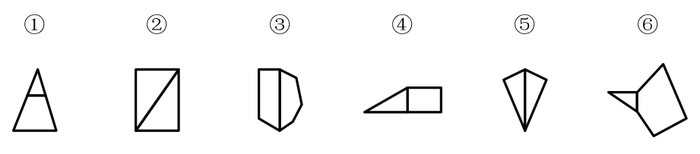
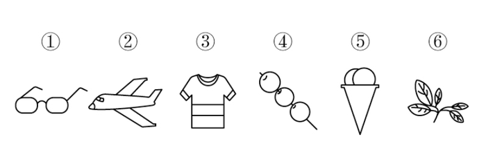
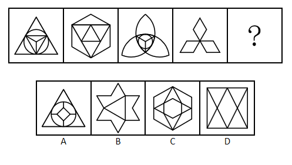
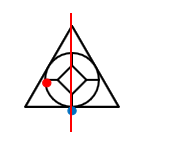
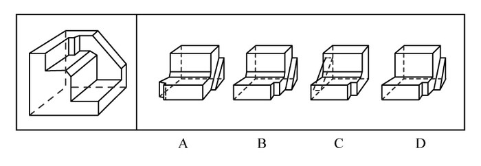
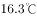
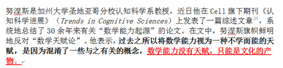
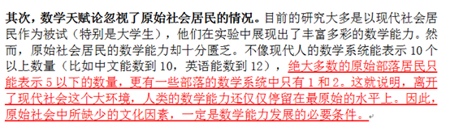
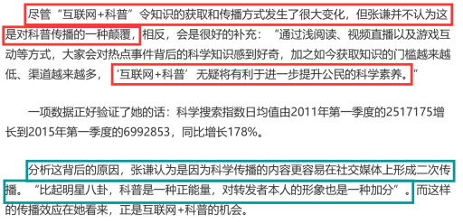

# 2019年420联考《行测》题（陕西卷）（网友回忆版）

> 判断推理 · 35 题 · 陕西 2019

## 第 1 题　qid 2376521 · 图形推理

把下面的图形分为两类，使每一类图形都有各自的共同特征或规律，分类正确的一项是：

- **A**. ①④⑥，②③⑤　✅
- **B**. ①②③，④⑤⑥
- **C**. ①③⑥，②④⑤
- **D**. ①③④，②⑤⑥

**答案**：A

**官方解析**

本题为分组分类题目，图形均为明显两个图形相交，考虑图形间关系。观察发现，图①④⑥的公共边为短边，图②③⑤的公共边为长边，故①④⑥一组，②③⑤一组。
故正确答案为A。

---

## 第 2 题　qid 2376760 · 图形推理

把下面的图形分为两类，使每一类图形都有各自的共同特征或规律，分类正确的一项是：

- **A**. ①③⑥，②④⑤
- **B**. ①③⑤，②④⑥
- **C**. ①④⑥，②③⑤　✅
- **D**. ①②④，③⑤⑥

**答案**：C

**官方解析**

元素组成不同，优先考虑属性规律。对称、曲直均无明显规律，考虑开闭性。图①④⑥均为半开半封闭图形；图②③⑤均为全封闭图形。因此①④⑥一组，②③⑤一组。
故正确答案为C。

---

## 第 3 题　qid 2376468 · 图形推理

从所给四个选项中，选择最合适的一个填入问号处，使之呈现一定的规律性：

- **A**. A
- **B**. B
- **C**. C　✅
- **D**. D

**答案**：C

**官方解析**

元素组成不同，且无明显属性规律，考虑数量规律。图四、图五封闭面明显，考虑面数量。面数量依次为2、3、4、5、6，则问号处图形面数量为7，只有C符合要求。
故正确答案为C。

---

## 第 4 题　qid 2376756 · 图形推理

从所给的四个选项中，选择最合适的一个填入问号处，使之呈现一定的规律性：

- **A**. A
- **B**. B　✅
- **C**. C
- **D**. D

**答案**：B

**官方解析**

解析1：元素组成不相同，不相似，优先考虑属性规律。题干均为轴对称图形，且对称轴数量均为3条。A项1条；B项3条；C项2条；D项2条。

故正确答案为B。

注：如上图所示，A项中蓝点处于圆与三角形的切点处，而红点并非处于圆与三角形的切点处，故此图只有1条对称轴，而不是3条。

解析2：元素组成不相同，不相似，优先考虑属性规律。题干有曲线有直线，考虑曲直性，图一为有曲有直图形，图二为全直线图形，图三为有曲有直图形，图四为全直线图形，因此“？”处选择一个有曲有直图形。A项有曲有直，B、C、D三项均为纯直线图形。

故正确答案为A。

解析3：元素组成不相同，不相似，考虑属性和数量规律。题干出现切圆，考虑笔画数，题干图形笔画数依次为2121？，故？处应为2笔画图形，只有D项为2笔画。

故正确答案为D。

本题有多种规律，但从图形特征和命题思路分析，考虑到题干几个图均是等边三角形的变形图，而等边三角形以及其变形图在近几年的考试中多用于考查对称性，故粉笔倾向对称性这一考点。

故正确答案为B。

---

## 第 5 题　qid 2376754 · 图形推理

正方体切掉一块后剩余部分如下图左侧所示，右侧哪一项是其切去部分的形状？

- **A**. A
- **B**. B　✅
- **C**. C
- **D**. D

**答案**：B

**官方解析**

此题为立体图形拼合问题，解题原则为凹凸一致。根据题目要求，可知正确选项和左侧图形拼合后应为正方体。观察题干左侧图形，发现外侧斜坡和其内侧上方凸出的小矩形在同一侧，而A、C两项外侧斜坡和凹进去的小矩形不在同一侧，排除；比较B、D两项，仅在中间位置不同，题干左侧图形中间位置存在斜坡，根据凹凸一致的原则，选项也应存在斜坡，只有B项符合。
故正确答案为B。

---

## 第 6 题　qid 2376560 · 定义判断

似动是指在一定的时间和空间条件下，人们在静止的物体间看到了运动，或者在没有连续位移的地方，看到了连续位移。
根据上述定义，下列选项不属于似动现象的是：

- **A**. 两岸青山相对出
- **B**. 坐地日行八万里　✅
- **C**. 郡邑浮前浦，波澜动远空
- **D**. 明月却多情，随人处处行

**答案**：B

**官方解析**

第一步：找出定义关键词。
“在一定的时间和空间条件下”、“人们在静止的物体间看到了运动”、“或者在没有连续位移的地方，看到了连续位移”。
第二步：逐一分析选项。
A项：“两岸青山相对出”意思是两岸的青山相继出迎，一座座扑进眼帘。青山本是静止的物体，但是作者却看到了它的运动，符合“人们在静止的物体间看到了运动”，符合定义，排除；
B项：“坐地日行八万里”意思是人们住在地球上，因地球自转，于不知不觉中，一日已行了八万里路。依据科学理论，当我们处于赤道附近的时候，即使每天原地不动，也会运动八万华里，即人没有动，而且也看不见运动。所以不符合“在静止的物体间看到了运动”、“或在没有连续位移的地方，看到了连续位移”，不符合定义，当选；
C项：“郡邑浮前浦，波澜动远空”意思是远处的城郭好像在水面上飘动，波翻浪涌，辽远的天空也仿佛为之摇荡。但是事实上，城郭本身不会运动，天空也不会飘荡，符合“人们在静止的物体间看到了运动”，符合定义，排除；
D项：“明月却多情，随人处处行”意思是明月却是那么多情，不管人走到哪里，它都陪伴着你同行。但是我们用肉眼是看不到明月本身在运动的，所以符合“人们在静止的物体间看到了运动”，符合定义，排除。
本题为选非题，故正确答案为B。

---

## 第 7 题　qid 2376584 · 定义判断

投射性认同指一个人诱导他人以一种限定的方式来作出反应的行为模式。体现在人际关系中，往往是甲方把内心中“好”或“坏”的客体投射到乙方身上，认为乙方“好”或“坏”，而乙方又接受了这一投射幻想，于是就以甲方所设想的方式来对待甲方。然后甲方又进一步验证了自己的假设，认为乙方就是他所认为的那样的人。
根据上述定义，下列选项属于投射性认同的是：

- **A**. 寒门亦可出贵子
- **B**. 严师方能出高徒
- **C**. 虎父果然无犬子　✅
- **D**. 慈母自古多败儿

**答案**：C

**官方解析**

第一步：找出定义关键词。
“甲方把内心中‘好’或‘坏’的客体投射到乙方身上”、“乙方接受这一幻想”、“甲方验证了假设”。
第二步：逐一分析选项。
A项：寒门也可以出贵子，是指出生微贱的年轻人在自身努力和外界条件支持下也可以获得成就，认为寒门可以出贵子，符合“甲方把内心中‘好’或‘坏’的客体投射到乙方身上”，但最终出身寒门的年轻人是否成为了贵子并没有得到验证，不符合“乙方接受这一幻想”、“甲方验证了假设”，不符合定义，排除；
B项：严师方能出高徒，是指严格的师傅或老师能教出本领高超的好徒弟或好学生，认为严师才能出高徒，符合“甲方把内心中‘好’或‘坏’的客体投射到乙方身上”，但该项没有涉及严师的徒弟最后到底是否成为了高徒的验证，不符合“乙方接受这一幻想”、“甲方验证了假设”，不符合定义，排除；
C项：虎父果然无犬子，是指出色的父亲果然不会生出一般的孩子，认为虎父无犬子，符合“甲方把内心中‘好’或‘坏’的客体投射到乙方身上”，且该项中的“果然”体现了虎父的孩子确实不是犬子，体现了进一步验证了自己的假设，符合“乙方接受这一幻想”、“甲方验证了假设”，符合定义，当选；
D项：慈母自古多败儿，是指宠溺孩子的母亲，教出的孩子多是很自私很任性，认为慈母多败儿，符合“甲方把内心中‘好’或‘坏’的客体投射到乙方身上”，但该项没有涉及慈母的儿子最后到底是否是自私任性的人的验证，不符合“乙方接受这一幻想”、“甲方验证了假设”，不符合定义，排除。
故正确答案为C。

---

## 第 8 题　qid 2376577 · 定义判断

关怀强迫症即一个人特别需要别人依赖自己，总是爱向别人提供别人不需要的关怀。并且，这种人还强迫别人接受自己的关怀，从而使别人不能独立。当别人依赖自己的时候，他就会感到满足，感到自己有价值。这种症状会压抑人的神经，并同时给身边的亲朋好友甚至一般的同事带来诸多不便。
根据上述定义，下列属于关怀强迫症的是：

- **A**. 张某说：“我一天没见到儿子就会发疯”
- **B**. 李某连哄带骗让感冒的女儿吃下感冒药
- **C**. 刘某从小学到大学期间都住自己家里
- **D**. 王某在女儿就读的大学附近租房陪读　✅

**答案**：D

**官方解析**

第一步：找出定义关键词。
“需要别人依赖自己”、“提供别人不需要的关怀”、“强迫别人接受”、“使别人不能独立”。
第二步：逐一分析选项。
A项：张某一天没见到儿子就会发疯，说明是张某依赖儿子，而并非是儿子依赖自己，不符合“需要别人依赖自己”，不符合定义，排除；
B项：李某连哄带骗让感冒的女儿吃下感冒药，没有体现“需要别人依赖自己”，且感冒的女儿需要被人关怀照顾，不符合“提供别人不需要的关怀”，不符合定义，排除；
C项：刘某上学期间住在家里，没有体现到强迫别人，不符合“强迫别人接受”，不符合定义，排除；
D项：王某在女儿就读的大学附近租房陪读，女儿已经读大学了，说明她已经能够独立地生活和学习，符合 “提供别人不需要的关怀”、“强迫别人接受”、“使别人不能独立”，符合定义，当选。
故正确答案为D。

---

## 第 9 题　qid 2376786 · 定义判断

投资市场相反理论是指投资市场本身并不创造新的价值，没有增值，甚至可以说是减值。如果一个投资者在投资行动时同多数投资者相同，那么他一定不是获利最大的，因为不可能多数人获利；要获得最大的利益，一定要同多数人的行动不一致。
根据上述定义，下列选项不符合投资市场相反理论的是：

- **A**. “已经跌这么多了，该到底了”　✅
- **B**. “在市场投资者爆满的时候，我们再离场”
- **C**. “只要你和多数投资者的意见相左，致富机会永远存在”
- **D**. “人弃我取，别人恐惧我贪婪”

**答案**：A

**官方解析**

第一步：找出定义关键词。
“投资市场本身并不创造新的价值，没有增值，甚至可以说是减值”、“要获得最大的利益，一定要同多数人的行动不一致”。
第二步：逐一分析选项。
A项：该项只说了投资产品价值的变化，并没有提及投资者人数是多还是少，以及投资者的策略是否相同，不符合定义，选非题，当选；
B项：该项提到在投资者非常多的时候我们再离场，表明我们与大多数投资者的策略是不相同的，符合 “要获得最大的利益，一定要同多数人的行动不一致”，符合定义，选非题，排除；
C项：该项说明投资者在投资时，选择和多数投资者不同的意见就可以成功，这符合“要获得最大的利益，一定要同多数人的行动不一致”，符合定义，选非题，排除；
D项：该项表明“我”和大多数投资者的投资策略是不同的，大家害怕投资失败选择放弃的时候，而“我”为了追求利润会选择购买，符合“要获得最大的利益，一定要同多数人的行动不一致”，符合定义，选非题，排除。
本题为选非题，故正确答案为A。

---

## 第 10 题　qid 2376581 · 定义判断

时间感知扭曲是指对时间不正确的知觉。在生活中，受各种因素影响，人们对时间的感知往往会不符合实际，有时候觉得时间过长，有时候觉得时间太短。许多原因都可以造成时间感知扭曲，现实中一场糟糕的表演会让人如坐针毡、觉得终场遥遥无期，与此相反的是，人们对于美好愉快的时光总嫌太短。
根据上述定义，下列选项不符合时间感知扭曲的是：

- **A**. 一日不见，如三月兮
- **B**. 欢愉嫌夜短，寂寞恨更长
- **C**. 孤馆度日如年，风露渐变
- **D**. 入春才七日，离家已二年　✅

**答案**：D

**官方解析**

第一步：找出定义关键词。
“对时间不正确的知觉”。
第二步：逐一分析选项。
A项：“一日不见，如三月兮”指的是一天没见，就觉得过去了三个月，符合“对时间不正确的知觉”，符合定义，排除；
B项：“欢愉嫌夜短，寂寞恨更长”指的是欢乐时嫌夜里时间短促，寂寞时怨恨夜晚时间漫长，符合“对时间不正确的知觉”，符合定义，排除；
C项：“孤馆度日如年，风露渐变”指的是在驿馆里形单影只，度日如年，秋风和露水都开始变得寒冷，过一天就好像过了一年一样，符合“对时间不正确的知觉”，符合定义，排除；
D项：“入春才七日，离家已二年”指的是入春已经过了七天了，但离开家已经两年了，这是对于时间的客观陈述，不符合“对时间不正确的知觉”，不符合定义，当选。
本题为选非题，故正确答案为D。

---

## 第 11 题　qid 2376571 · 定义判断

意志的活动过程会体现以下两大定律。其中，意志强度边际效应定律是指意志的强度随着自身行为的活动规模的增长而下降；意志强度时间衰减定律是指意志的强度随着自身行为的持续时间的增长而呈现负指数下降。
根据上述定义，下列选项最能体现意志强度时间衰减定律的是：

- **A**. 锲而舍之，朽木不折
- **B**. 为山九仞，功亏一篑
- **C**. 穷且益坚，不坠青云之志
- **D**. 一鼓作气，再而衰，三而竭　✅

**答案**：D

**官方解析**

第一步：找出定义关键词。
意志强度边际效应定律：“意志强度”、“随自身行为的活动规模增长而下降”；
意志强度时间衰减定律：“意志强度”、“随自身行为的持续时间增长而呈现负指数下降”。
第二步：逐一分析选项。
A项：“锲而舍之，朽木不折”意思是说如果不坚持做一件事，就算是腐朽的木头也无法折断，说明人们不坚持做一件事的后果，不符合“随自身行为的持续时间增长”，不符合定义，排除；
B项：“为山九仞，功亏一篑”意思是说堆九仞高的山，只缺一筐土导致不能完成，是用来比喻做事情只差最后一点没能完成，说明没有一直坚持下去，不符合“随自身行为的持续时间增长”，不符合定义，排除；
C项：“穷且益坚，不坠青云之志”意思是说一个人处境越是艰难，就越是坚忍不拔，越是不丢失高远之志，没有体现与时间增长的关系，不符合“随着自身行为的持续时间的增长而呈现负指数下降”，不符合定义，排除；
D项：“一鼓作气，再而衰，三而竭”意思是说，第一次击鼓士气会大大的增加，第二次击鼓士气就会减弱了，第三次击鼓就没有士气了，说明士气随着时间的增加而减弱，符合“随时间增长而呈现负指数下降”，符合定义，当选。
故正确答案为D。

---

## 第 12 题　qid 2376585 · 定义判断

元素指自然界中一百多种基本的金属和非金属物质，它们由一种原子组成，其原子中的每一个核子具有同样数量的质子，用一般的化学方法不能使之分解，并且能构成一切物质。原子是化学反应不可再分的基本微粒，原子在化学反应中不可分割，但在物理状态中可以分割，由原子核和绕核运动的电子组成。分子由原子构成，是构成物质的一种基本粒子的名称，是单独存在、保持化学性质最小的粒子。
根据上述定义，下列选项正确的是：

- **A**. 原子是构成物质的最小粒子
- **B**. 空气由各种细小的原子构成
- **C**. 具有不同数量质子的原子不是同一类元素　✅
- **D**. 一氧化碳分子（CO）由一个氧元素和一个碳元素构成

**答案**：C

**官方解析**

第一步：找出定义关键词。
“元素是指自然界中一百多种基本的金属和非金属物质”、“元素由一种原子组成，其原子中的每一个核子具有相同数量的质子”、“原子用一般的化学方法不能使之分解，并且能构成一切物质”、“原子是化学反应不可再分的基本微粒，原子在化学反应中不可分割，但在物理状态中可以分割，由原子核和绕核运动的电子组成”、“分子由原子构成，是构成物质的一种基本粒子的名称，是单独存在、保持化学性质最小的粒子”。
第二步：逐一分析选项。
A项：原子是构成物质的最小粒子，不符合“在物理状态中可以分割”，不符合定义，排除；
B项：空气是一种混合物，不可能是由细小的原子构成，不符合定义，排除；
C项：具有不同数量质子的原子不是同一类元素，符合“元素由一种原子组成，其原子中的每一个核子具有相同数量的质子”，符合定义，当选；
D项：选项不符合“分子由原子构成，是构成物质的一种基本粒子的名称，是单独存在、保持化学性质最小的粒子”，一氧化碳分子（CO）应该是由一个氧原子和一个碳原子构成，不符合定义，排除。
故正确答案为C。

---

## 第 13 题　qid 2376789 · 定义判断

类脑计算技术总体分为三个层次：结构层次模仿脑、器件层次逼近脑、智能层次超越脑。其中，结构层次模仿脑是指将大脑作为一个物质和生理对象进行解析，获得基本单元(各类神经元和神经突触等)的功能及其连接关系（网络结构）；器件层次逼近脑是指研制能够模拟神经元和神经突触功能的器件，从而在有限的物理空间和功耗条件下构造出人脑规模的神经网络系统；智能层次超越脑是指通过对类脑计算机进行信息刺激、训练和学习，使其产生与人脑类似的智能。
根据上述定义，下列属于智能层次超越脑的是：

- **A**. 调整神经网络的突触连接关系及连接频率和强度　✅
- **B**. 绘制精确的人类大脑动态图谱以解析探测大脑
- **C**. 开发功能、密度与人类大脑皮层相当的电子装备
- **D**. 捕捉细微的单个神经元放电的非线性动力学过程

**答案**：A

**官方解析**

第一步：找出定义关键词。
结构层次模仿脑：“将大脑作为物质和生理对象进行解析”、“获得基本单元的功能及其连接关系”；
器件层次逼近脑：“研制能够模拟神经元和神经突触功能的器件”、“构造出人脑规模的神经网络系统”；
智能层次超越脑：“对类脑计算机进行信息刺激、训练和学习”、“产生与人脑类似的智能”。
第二步：逐一分析选项。
A项：调整神经网络的突触连接关系及连接频率和强度，符合“对类脑计算机进行信息刺激、训练和学习” ，符合“智能层次超越脑”定义，当选；
B项：绘制精确的人类大脑动态图谱，符合“将大脑作为物质和生理对象进行解析”，符合“结构层次模仿脑”定义，不符合“智能层次超越脑”定义，排除；
C项：开发功能、密度与人类大脑皮层相当的电子装备，符合“研制能够模拟神经元和神经突触功能的器件”，符合“器件层次逼近脑”定义，不符合“智能层次超越脑”定义，排除；
D项：捕捉细微的单个神经元放电的非线性动力学过程，符合“获得基本单元的功能及其连接关系”，符合“结构层次模仿脑”定义，不符合“智能层次超越脑”定义，排除。
故正确答案为A。
注：本题目来自于《类脑计算机的现在与未来》，各选项对应于该文章中的句子如下所示：
A项：所谓“智能层次超越脑”，属于类脑计算机应用软件层次的问题，是指通过对类脑计算机进行信息刺激、训练和学习，使其产生与人脑类似的智能甚至涌现出自主意识，实现智能培育和进化。刺激源可以是虚拟环境，也可以是来自现实环境的各种信息（例如互联网大数据）和信号（例如遍布全球的摄像头和各种物联网传感器），还可以是机器人“身体”在自然环境中探索和互动。在这个过程中，类脑计算机能够调整神经网络的突触连接关系及连接强度，实现学习、记忆、识别、会话、推理以及更高级的智能；
B项：所谓“结构层次模仿脑”，是将大脑作为一个物质和生理对象进行解析，获得基本单元（各类神经元和神经突触等）的功能及其连接关系（网络结构）；
C项：所谓“器件层次逼近人脑”，是指研制能够模拟神经元和神经突触功能的微纳光电器件，从而在有限的物理空间和功耗条件下构造出人脑规模的神经网络系统。这方面的代表性项目是美国国防部先进研究项目局（DARPA）2008年启动的“神经形态自适应可塑性可扩展电子系统”（即突触），其目标是研制出器件功能、规模与密度均与人类大脑皮层相当的电子装置；
D项：所谓“结构层次模仿脑”，是将大脑作为一个物质和生理对象进行解析，获得基本单元（各类神经元和神经突触等）的功能及其连接关系（网络结构）。这一阶段，主要通过神经科学实验采用先进的分析探测技术完成。1952年，英国科学家霍奇金和赫胥黎提出了以两人命名的HH方程，精确刻画了单个神经元放电的非线性动力学过程，这是神经元信息处理的标准数学模型。

---

## 第 14 题　qid 2376565 · 定义判断

消费滞后是指个人消费滞后于国家经济发展和个人家庭收入所应达到的平均消费水平。消费超前是指当下的收入水平不足以购买现在所需的产品或服务，以贷款、分期付款、预支等形式进行消费。
根据上述定义，下列属于消费超前的是：

- **A**. 职员小王以信用卡支付的形式在网上订购了火车票
- **B**. 大学生小李通过某借贷平台购买了某知名品牌电脑　✅
- **C**. 退休工人老张名下有商品房和汽车，但坚持只用老式的直板手机
- **D**. 青年教师小刘有十万元定期存款未到期，向同事借了八万元买车

**答案**：B

**官方解析**

第一步：找出定义关键词。
消费滞后：“指个人消费滞后于国家经济发展和个人家庭收入所应达到的平均消费水平”；
消费超前：“指当下的收入水平不足以购买现在所需的产品或服务”、“以贷款、分期付款、预支等形式进行消费”。
第二步：逐一分析选项。
A项：小王为职员说明小王已经工作，购买火车票应该是消费水平范围内，不符合“当下的收入水平不足以购买现在所需的产品或服务”，不符合定义，排除；
B项：小李是一名大学生，尚未参加工作，购买电脑符合“当下的收入水平不足以购买现在所需的产品或服务”，且通过“某借贷平台购买”属于“贷款”的支付方式，符合定义，当选；
C项：老张有房有车，却使用老式的直板手机，符合“个人消费滞后于国家经济发展和个人家庭收入所应达到的平均消费水平”，属于消费滞后，不属于消费超前，不符合定义，排除；
D项：小刘有十万元的存款，而车只有八万元，也就是当下的收入足以购买现在所需的产品，不符合“当下的收入水平不足以购买现在所需的产品或服务”，且向同事借钱不符合“以贷款、分期付款、预支等形式进行消费”，不符合定义，排除。
故正确答案为B。

---

## 第 15 题　qid 2376587 · 定义判断

水文节律指湖泊水情周期性、有节律的变化。广义水文节律包括昼夜、月运、季节和年际节律。正常情况下，由于流域气候和下垫面等因素较稳定，湖泊多年平均水位趋于稳定数值即湖泊正常年平均水位。所以湖泊年际节律以干扰因素驱动的突变性和适应干扰后的阶段稳定性为特点，无渐变趋向；而昼夜节律对生态系统影响微弱。因此，狭义水文节律特指月运节律与季节节律。
根据上述定义，下列涉及狭义水文节律的是：

- **A**. 
鄱阳湖受降雨持续减少和来水减少双重影响，水面面积持续萎缩

- **B**. 
洪泽湖历史年均水温，最高水温在9月，最低水温在1月
　✅
- **C**. 
洞庭湖去年年降水量1560毫米，其中4~6月降水约占全年一半

- **D**. 
巢湖流域年平均气温稳定在之间，有200天以上无霜期

**答案**：B

**官方解析**

第一步：找出定义关键词。
水文节律：“湖泊水情周期性、有节律的变化”；
广义水文节律：“昼夜、月运、季节和年际节律”；
狭义水文节律：“月运节律和季节节律”。
（注：水情是指江河湖泊的状况、特征及地理意义，如流量、水位、流速、水温与冰情等）
本题要选的是符合狭义水文节律的选项。
第二步：逐一分析选项。
A项：鄱阳湖水面面积持续萎缩，说明是一直在减小，不存在周期性的变化，不符合定义，排除；
B项：洪泽湖历史年均最高水温在9月，最低水温在1月，月份和季节不同水温也不同，而且是统计了历史上多年的水温，符合“湖泊水情周期性、有节律的变化”，符合“季节节律”，符合狭义水文节律，符合定义，当选（水情指江河湖泊的状况、特征及地理意义，如流量、水位、流速、水温与冰情等，水温是水文测验的基本项目之一）；
C项：只是给出洞庭湖去年一年的降水量，没有体现“周期性、有节律的变化”，不符合定义，排除；
D项：巢湖流域平均气温在15-16摄氏度之间，有200天以上无霜期，是湖泊流经区域的气温变化，而不是湖泊水情的变化，不符合定义，排除。
故正确答案为B。

---

## 第 16 题　qid 2377331 · 类比推理

玻璃幕墙：光源：光污染
正确的一项是（  ）。

- **A**. 汽车尾气：凝结核：酸雨　✅
- **B**. 海上风暴：气压：海啸
- **C**. 火山喷发：板块：地震
- **D**. 空气消毒：紫外线：臭氧

**答案**：A

**官方解析**

第一步：判断题干词语间逻辑关系。
阳光照射强烈时，城市里建筑物的玻璃幕墙等装饰反射光源，明晃白亮、眩眼夺目，形成白亮污染，为光污染的一种，即玻璃幕墙通过对光源的反射，从而形成光污染，即前两者共同作用形成第三个词。三者是原因结果的对应关系。玻璃幕墙是人为的环境污染。
第二步：判断选项词语间逻辑关系。
A项：汽车尾气形成凝结核，凝结核是一种悬浮颗粒，这种颗粒是由空气中的各种尘埃颗粒或各种离子结合而成。凝结核聚在一起形成酸雨。即汽车尾气通过形成凝结核，再与汽车尾气中的酸根离子共同形成酸雨。三者是原因结果的对应关系，汽车尾气是人为的环境污染，与题干逻辑关系一致，当选；
B项：海上风暴是指由于强烈的大气扰动（强风和气压骤变）引起的海面异常升高现象，海啸就是由海底地震、火山爆发、海底滑坡或气象变化产生的破坏性海浪，二者都是在海上发生的特殊天气，海上风暴可能导致海啸，但是气压骤变导致海上风暴，而不是气压本身导致海上风暴，与题干逻辑关系不一致，排除；
C项：板块运动（而非板块）可以导致火山喷发或地震，前两个词为因果关系，与题干逻辑关系不一致，排除；
D项：紫外线可以给空气消毒，臭氧也可以给空气消毒，与题干逻辑关系不一致，排除。
故正确答案为A。

---

## 第 17 题　qid 2377332 · 类比推理

闹钟：发条：计时
正确的一项是（  ）。

- **A**. 微生物：细菌：分解
- **B**. 工具：钳子：修理
- **C**. 空调：压缩机：制冷　✅
- **D**. 土豆：碳水化合物：营养

**答案**：C

**官方解析**

第一步：判断题干词语间逻辑关系。
发条是闹钟的组成部分，闹钟有计时的功能。前两词是组成关系，后两词是功能对应。
第二步：判断选项词语间逻辑关系。
A项：细菌是微生物的一种，二者是种属关系，与题干逻辑关系不一致，排除；
B项：钳子是工具的一种，二者是种属关系，与题干逻辑关系不一致，排除；
C项：压缩机是空调的组成部分，二者是组成关系，空调有制冷的功能，二者是功能对应，与题干逻辑关系一致，当选；
D项：碳水化合物是土豆的组成成分，营养不是土豆的功能，与题干逻辑关系不一致，排除。
故正确答案为C。

---

## 第 18 题　qid 2376575 · 类比推理

老字号：新品牌：传承

- **A**. 老传统：新花样：质疑
- **B**. 老配方：新工艺：创新　✅
- **C**. 老问题：新思考：评价
- **D**. 老物件：新东西：区分

**答案**：B

**官方解析**

第一步：判断题干词语间逻辑关系。
老字号经过传承可以变为新品牌。
第二步：判断选项词语间逻辑关系。
A项：老传统被质疑不能变为新花样，与题干逻辑关系不一致，排除；
B项：老配方经过创新可以变为新工艺，与题干逻辑关系一致，当选；
C项：老问题被评价不能变为新思考，与题干逻辑关系不一致，排除；
D项：老物件被区分不能变为新东西，与题干逻辑关系不一致，排除。
注：此题有同学可能会纠结D项，认为老字号与新品牌都是品牌，老物件与新东西都是物品。但D项前两个词与区分无关。从题干三个词的关系看体现了新老物体之间的变化，而B项也是体现了新老事物之间的变化，因此粉笔更倾向于B项。
故正确答案为B。

---

## 第 19 题　qid 2376558 · 类比推理

效率：公平：市场经济

- **A**. 科学：理性：政治哲学
- **B**. 革命：改良：社会制度
- **C**. 民主：集中：组织原则　✅
- **D**. 美丑：善恶：审美范畴

**答案**：C

**官方解析**

第一步：判断题干词语间逻辑关系。
市场经济需要兼顾效率与公平。
第二步：判断选项词语间逻辑关系。
A项：政治哲学不需要兼顾科学与理性，且科学是理性的，与题干逻辑关系不一致，排除； 
B项：社会制度不需要兼顾革命与改良，与题干逻辑关系不一致，排除；
C项：组织原则需要兼顾民主与集中，与题干逻辑关系一致，当选；
D项：审美范畴不需要兼顾美丑与善恶，且善恶不属于审美的范畴，与题干逻辑关系不一致，排除。
故正确答案为C。

---

## 第 20 题　qid 2376570 · 类比推理

瓮牖绳枢：粗茶淡饭：清寒

- **A**. 叠床架屋：衣锦食肉：奢华
- **B**. 箪食瓢饮：曲肱饮水：简朴　✅
- **C**. 轻车熟路：霜行草宿：轻松
- **D**. 金盆洗手：金屋藏娇：阔绰

**答案**：B

**官方解析**

第一步：判断题干词语间逻辑关系。
瓮牖绳枢指以破瓮作窗户，以草绳系户枢，比喻贫穷人家；粗茶淡饭形容饮食简单，生活简朴，二者都可以用来形容清寒。
第二步：判断选项词语间逻辑关系。
A项：叠床架屋比喻办事重复，自找麻烦；衣锦食肉形容生活富足，第一词与奢华无关，与题干逻辑关系不一致，排除；
B项：箪食瓢饮形容读书人安于贫穷的清高生活；曲肱饮水形容清心寡欲、安贫乐道的生活，二者都可以用来形容简朴，与题干逻辑关系一致，当选；
C项：轻车熟路比喻事情又熟悉又容易；霜行草宿指在霜露中行走，草野中息宿，形容奔波劳苦，第二词与轻松无关，与题干逻辑关系不一致，排除；
D项：金盆洗手指放弃以前长期从事的行业或某件事；金屋藏娇指十分宠爱妻子，也指男人纳妾或在外包养女人，二者均与阔绰无关，与题干逻辑关系不一致，排除。
故正确答案为B。

---

## 第 21 题　qid 2377333 · 类比推理

出其不意：正中下怀：攻其不备
正确的一项是（  ）。

- **A**. 初生牛犊：胆小如鼠：胆小怕事
- **B**. 处心积虑：想方设法：费尽心机
- **C**. 闲言碎语：弦外之音：流言蜚语
- **D**. 声色俱厉：和颜悦色：正言厉色　✅

**答案**：D

**官方解析**

第一步：判断题干词语间逻辑关系。
出其不意指出乎对方意料之外，突然行动；正中下怀指正好符合自己的心愿；攻其不备指趁敌人没有防备的时候进攻。第一个词与第二个词为反义关系，第一个词与第三个词为近义关系，第二个词与第三个词为反义关系。
第二步：判断选项词语间逻辑关系。
A项：初生牛犊指刚生下来的小牛，一般比作年轻人；胆小如鼠与胆小怕事都是指胆子非常小，二者为近义关系，与题干逻辑关系不一致，排除；
B项：处心积虑指长期谋划要干某件事；想方设法与费尽心机都是指用尽办法，二者为近义关系，与题干逻辑关系不一致，排除；
C项：闲言碎语与流言蜚语都是指在人背后说长道短，搬弄是非，二者为近义关系，但弦外之音比喻言外之意，即在话里间接透露而没有明说的意思，与其他两个词之间无明显语义关系，与题干逻辑关系不一致，排除；
D项：声色俱厉与正言厉色都是形容说话时声音和脸色都很严厉，二者为近义关系，和颜悦色形容和蔼喜悦的脸色，与其他两个词为反义关系，与题干逻辑关系一致，当选。
故正确答案为D。

---

## 第 22 题　qid 2376603 · 类比推理

（    ） 对于 聚集之处 相当于 捷径 对于 （    ）

- **A**. 荟萃；取巧之思
- **B**. 渊薮；速成之法　✅
- **C**. 辐辏；入门之路
- **D**. 囹圄；提升之梯

**答案**：B

**官方解析**

逐一代入选项。
A项：荟萃比喻优秀的人物或精美的东西会集、聚集，可以形容聚集之处，捷径比喻能较快地达到目的的巧妙手段或办法，与取巧之思无关，前后逻辑关系不一致，排除；
B项：渊薮比喻某种人或事、物聚集的地方，可以比喻聚集之处；捷径指近便的小路，形容便捷的方法，可以比喻速成之法，前后逻辑关系一致，当选；
C项：辐辏形容人或物聚集像车辐集中于车毂一样，可以形容聚集之处，入门之路与捷径无关，前后逻辑关系不一致，排除；
D项：囹圄原指监牢，后引申为束缚、困难，与聚集之处无关，捷径与提升之梯无关，前后逻辑关系不一致，排除。
故正确答案为B。

---

## 第 23 题　qid 2377320 · 类比推理

惊涛骇浪  对于 （  ） 相当于 （  ）对于  真诚
正确的一项是（  ）。

- **A**. 险恶  精诚团结　✅
- **B**. 波涛  齐心协力
- **C**. 危险  离心离德
- **D**. 环境  热肠古道

**答案**：A

**官方解析**

逐一代入选项。
A项：惊涛骇浪一般用来比喻险恶的环境或尖锐激烈的斗争，可以用惊涛骇浪来象征险恶；精诚团结是指真诚，一心一意，团结一致，可以用精诚团结来象征真诚，前后逻辑关系一致，当选；
B项：惊涛骇浪指的是汹涌吓人的浪涛，二者是对应关系；齐心协力指的是认识一致，共同努力，与真诚没有明显逻辑关系，前后逻辑关系不一致，排除；
C项：惊涛骇浪一般用来比喻险恶的环境或尖锐激烈的斗争，可以用惊涛骇浪形容危险；离心离德的意思是思想不统一，信念也不一致，与真诚没有明显逻辑关系，前后逻辑关系不一致，排除；
D项：惊涛骇浪一般用来比喻险恶的环境，二者是对应关系；热肠古道是指待人真诚、热情，二者是近义关系，前后逻辑关系不一致，排除。
故正确答案为A。

---

## 第 24 题　qid 2377322 · 类比推理

飞沙走石  对于（  ）相当于 火上浇油  对于（  ）

- **A**. 刀耕火种 铁杵磨针　✅
- **B**. 沙里淘金 百炼成钢
- **C**. 山崩地裂 水滴石穿
- **D**. 蜡炬成灰 千里冰封

**答案**：A

**官方解析**

逐一代入选项。
A项：飞沙走石是指沙土飞扬石块滚动，形容风势狂暴，刀耕火种是古时一种耕种方法，把地上的草烧成灰做肥料，就地挖坑下种。成语之间没有语义关系，考虑成语结构，飞沙、走石是两种现象，刀耕、火种是两种方式，二者结构相似；火上浇油比喻使人更加愤怒或使情况更加严重，铁杵磨针比喻只要有决心，肯下工夫，多么难的事情也能做成功，成语之间没有语义关系，考虑成语结构，火上浇油是在火上浇油，铁杵磨针是把铁杵磨成针，二者结构相似，前后逻辑关系一致，当选；
B项：飞沙走石是指沙土飞扬石块滚动，形容风势狂暴，沙里淘金是指从沙里淘出黄金。比喻好东西不易得。成语之间没有语义关系，考虑成语结构，飞沙、走石是两种现象，沙里淘金是在沙里淘金，二者结构不一致；火上浇油比喻使人更加愤怒或使情况更加严重，百炼成钢比喻经过长期锻炼，变得非常坚强，成语之间没有语义关系，考虑成语结构，火上浇油是在火上浇油，百炼成钢是百万次炼成钢，二者结构不一致，前后逻辑关系不一致，排除；
C项：飞沙走石是指沙土飞扬石块滚动，形容风势狂暴，山崩地裂指山岳倒塌，大地裂开形容响声巨大或变化剧烈。成语之间没有语义关系，考虑成语结构，飞沙、走石是两种现象，山崩、地裂也是两种现象，二者结构相似；火上浇油比喻使人更加愤怒或使情况更加严重，水滴石穿是指水不停地滴，石头也能被滴穿，比喻只要有恒心，不断努力，事情就一定能成功。成语之间没有语义关系，考虑成语结构，火上浇油是在火上浇油，水滴石穿是水滴导致石穿，二者结构不一致，前后逻辑关系不一致，排除；
D项：飞沙走石是指沙土飞扬石块滚动，形容风势狂暴，蜡炬成灰比喻自己为不能相聚而痛苦,无尽无休,仿佛蜡泪直到蜡烛烧成了灰，但蜡炬成灰不是成语，与题干逻辑关系不一致，排除。
故正确答案为A。
注：此题有同学会纠结B项，认为飞沙走石与沙里淘金中均有“沙”，火上浇油中有“火”，而百炼成钢的过程中需要“火”，认为前后逻辑关系一致。但是前后的逻辑关系是有一定区别的，倘若要考查“火”这个逻辑关系，所选的成语中应当出现“火”字，如火中取栗，这样的对应更符合出题人的思维，故粉笔倾向A选项。

---

## 第 25 题　qid 2376820 · 类比推理

巾帼 之于 （    ） 相当于 （    ） 之于 监狱

- **A**. 须眉；囚犯
- **B**. 英雄；犯罪
- **C**. 女子；铁窗　✅
- **D**. 头饰；惩罚

**答案**：C

**官方解析**

逐一代入选项。
A项：巾帼原指古代妇女的头巾和发饰，也借指妇女、女子，须眉指代男子，巾帼和须眉是并列关系；囚犯关押于监狱之中，二者是人物和场所的对应关系。前后逻辑关系不一致，排除；
B项：巾帼和英雄是交叉关系；犯罪之后可能会囚禁在监狱里，犯罪和监狱是对应关系。前后逻辑关系不一致，排除；
C项：巾帼原指古代妇女的头巾和发饰，也借指妇女、女子；铁窗是装上铁栅的窗户，比喻象征监狱。前后逻辑关系一致，当选；
D项：巾帼原指古代妇女的头巾和发饰，与头饰属于种属关系；惩罚与监狱无明显逻辑关系。前后逻辑关系不一致，排除。
故正确答案为C。

---

## 第 26 题　qid 2377324 · 逻辑判断

快速、持续、无法预测的竞争环境要求企业规模小，结构简化，同时要有足够的技术储备和抵抗资金风险的能力。目前解决这一矛盾的途径通常是建立全球范围内的“基于双赢原则”的虚拟企业。虚拟企业是企业间的一种动态联盟，参加虚拟企业的各成员企业有一定的自主权。当出现了市场机会，各加盟企业就组织在一起，共同开发并生产销售新产品，一旦发现该产品无利可图，便自动解散。因此，虚拟企业被认为是21世纪最有竞争力的企业运行模式。
以下各项如果为真，能够支持上述观点的有（  ）

- **A**. 当今社会发达的现代信息技术和通讯手段为各企业间的沟通提供了便利
- **B**. 企业想在当前的竞争环境中生存发展扩大优势，需要一种新的运行模式
- **C**. 虚拟企业中的任一加盟企业生产上出现问题都会中断整个生产链的运行
- **D**. 虚拟企业可迅速集中最强设计加工与销售力量，实现对市场的快速反应　✅

**答案**：D

**官方解析**

第一步：找出论点和论据。
论点：虚拟企业被认为是21世纪最有竞争力的企业运行模式。
论据：当出现了市场机会，各加盟企业就组织在一起，共同开发并生产销售新产品，一旦发现该产品无利可图，便自动解散。
论点论据都在说虚拟企业的优势，话题一致，优先考虑补充论据，补充能够证明虚拟企业是最有竞争力的企业运营模式的理由进行加强。
第二步：逐一分析选项。
A项：现代发达的信息技术为各企业之间的沟通提供便利，但是与虚拟企业无关，提供便利也不代表就有竞争力，话题不一致，无法加强，排除；
B项：企业想在竞争环境中生存发展扩大优势，需要新的运行模式，但新的运行模式是否指的是虚拟企业不清楚，无法加强，排除；
C项：虚拟企业中的任一加盟企业生产出现问题都会中断整个生产链的运行，说的是虚拟企业的缺点，而且这个缺点可以中断整个生产链，可见这种模式难以成为有竞争力的企业模式，可以削弱，排除；
D项：虚拟企业能够快速集中最强的力量做出最快的反应，说明虚拟企业的优势，并且力量最强，速度最快，也可说明虚拟企业是最有竞争力的运营模式，补充论据，可以加强，当选。
故正确答案为D。

---

## 第 27 题　qid 2377325 · 逻辑判断

研究发现，20到39岁的群体更热衷于使用智能手机中的运动类应用。最主要的原因在于该群体大部分都已经参加工作，且亚健康在该群体中较普遍，所以越来越多的白领和年轻人更注重身体健康；同时，年轻人肥胖率占比较高，而年轻人对美的追求远远超过中老年人，所以他们更在乎运动；此外，该年龄段的用户群体也更熟悉智能手机的操作。
以下各项如果为真，能够削弱上述调研发现的有（  ）。

- **A**. 许多年轻人沉迷于智能手机中的游戏　✅
- **B**. 许多年轻人长期加班，玩手机时间较少
- **C**. 年轻人不坚持运动易引发亚健康问题
- **D**. 当代年轻人营养过于丰富，体型偏胖

**答案**：A

**官方解析**

第一步：找出论点和论据。
论点：20到39岁的群体更热衷于使用智能手机中的运动类应用。
论据：最主要的原因在于该群体大部分都已经参加工作，且亚健康在该群体中较普遍，所以越来越多的白领和年轻人更注重身体健康；同时，年轻人肥胖率占比较高。而年轻人对美的追求远远超过老年人，所以他们更在乎运动；此外，该年龄段的用户群体也更熟悉智能手机的操作。
本题的论点是年轻人更喜欢用智能手机中的运动类应用，其中的“更”表明了比较关系，因此削弱论点时要么削弱论点中的中心话题（年轻人不喜欢用手机中的运动类应用），要么直接削弱论点中比较关系（年轻人更喜欢用的不是智能手机中的运动类应用）。
第二步：逐一分析选项。
A项：论点说的是年轻人更喜欢用智能手机运动类应用，而该项说的是有很多年轻人沉迷的是智能手机中的游戏，削弱了论点中所说的运动类应用更受欢迎，削弱论点，当选；
B项：许多年轻人长期加班，玩手机时间较少，玩手机时间少与论点讨论的年轻人是否更喜欢用智能手机的运动类应用无关，话题不一致，无法削弱，排除；
C项：本项说的是不坚持运动的影响是导致亚健康，论据中第一句说的是年轻人大部分因工作处于亚健康状态，本项支持了该论据，无法削弱，排除；
D项：论据第二句是通过说明年轻人肥胖率占比高，年轻人更追求美来解释论点原因，本项说现在年轻人确实体型肥胖，加强了该论据，无法削弱，排除。
故正确答案为A。

---

## 第 28 题　qid 2377335 · 逻辑判断

近年来，意大利面被冠上导致肥胖的坏名声，因此很多人在面对这种地中海饮食时，都抱有一种又恨又爱的纠结心情。然而，意大利地中海神经病学研究所通过对2.3万人的研究发现，意大利面不像很多人想象的那样会导致体重增加。而且，意大利面非但不会导致肥胖，还可以起到相反的效果——降低体脂率。研究结果显示，如果人们能够适量摄入，并保证饮食多样性，意大利面对人们的身体健康大有裨益。
以下各项如果为真，能够支持上述结论的有（  ）。

- **A**. 面条中所含碳水化合物是导致肥胖的重要因素
- **B**. 没有研究显示意大利面会导致人群肥胖率上升
- **C**. 地中海饮食采用的橄榄油对身体健康大有益处
- **D**. 酌量食用意大利面能够维持人们理想的体脂率　✅

**答案**：D

**官方解析**

第一步：找出论点和论据。
论点：如果人们能够适量摄入，并保证饮食多样性，意大利面对人们的身体健康大有裨益。
论据：意大利地中海神经病学研究所通过对2.3万人的研究发现，意大利面不像很多人想象的那样会导致体重增加。而且，意大利面非但不会导致肥胖，还可以起到相反的效果——降低体脂率。
本题论点论据讨论的都是意大利面和身体健康的关系，讨论话题一致，优先考虑补充论据，补充能够证明意大利面饮食多样，适量摄入，可以对身体健康有好处的理由。
第二步：逐一分析选项。
A项：虽然面条中碳水化合物是导致肥胖的重要因素，但是如果适量摄入意大利面，并保证饮食多样性，是否对人们身体健康有好处不确定，无法加强，排除；
B项：没有研究显示意大利面会导致人群肥胖率上升，不代表意大利面就不会导致肥胖，如果适量摄入，并保证饮食多样性，是否对身体健康有好处不确定，话题不一致，无法加强，排除；
C项：选项说的是地中海饮食对健康有好处，论点说的是意大利面和健康之间的关系，话题不一致，无法加强，排除；
D项：酌量食用意大利面可以维持理想的体脂率，而体脂率理想代表着身体健康，说明适量摄入意大利面，确实对人身体健康有好处，可以加强，当选。
故正确答案为D。

---

## 第 29 题　qid 2377366 · 逻辑判断

多数家长的投入对子女学业投入具有显著的正向预测作用。家长投入程度随着子女学段升高而降低，同时多数家长注重在家辅导的投入，对子女参与社区及学校活动的投入较欠缺，而家长自主支持或控制的教养风格在家长投入与子女学业投入的关系中起调节作用，且部分通过子女学业心理需要的满足这一中介变量产生作用。
由此可以推出（ ）。

- **A**. 家长的投入、教养风格必然会对子女的学业投入产生影响　✅
- **B**. 子女学段的升高意味着多数家长对子女教育投入的减少　✅
- **C**. 子女学业心理需要的满足是影响其学业投入的直接因素
- **D**. 家中学习环境的创设、形成和学校、社区间的联系呈反比关系

**答案**：AB

**官方解析**

日常结论题，根据题干信息逐一分析选项。
A项：题干指出“多数家长的投入对子女学业投入具有显著的正向预测作用”和“家长自主支持或控制的教养风格在家长投入与子女学业投入的关系中起调节作用”，说明家长的投入、教养风格均会对子女学业的投入产生影响，虽然“必然”这一表述过于绝对，但产生的影响可大可小，哪怕是微乎其微的影响，也可以说“必然有影响”，因此该项是可以推出的，当选；
B项：题干指出“家长投入程度随着子女学段升高而降低”，所以子女学段的升高意味着多数家长投入的减少，可以推出，当选；
C项：题干只是说“子女学业心理需要的满足是中介变量”，无法推出其是直接因素，无中生有，排除；
D项：题干指出“多数家长注重在家辅导的投入，对子女参与社区及学校活动的投入较欠缺”，这是单纯对两种投入的多少情况进行描述，并未体现两种投入之间存在反比关系，过度脑补，无法推出，排除。
故正确答案为A、B。

---

## 第 30 题　qid 2377338 · 逻辑判断

长久以来，心理学家都支持“数学天赋论”：数学能力是人类自打娘胎里出来就有的能力，就连动物也有这种能力。他们认为存在一种天生的数学内核，通过自我慢慢发展，这种数学内核最后会“长”成我们所熟悉的一切数学能力。最近有反对者提出了不同的看法：数学能力没有天赋，只能是文化的产物。
以下各项如果为真，能够支持反对者的看法的有（  ）。

- **A**. 10~12个月的婴儿已经知道3个黑点和4个黑点是不一样的
- **B**. 数学是大脑的产物，而大脑的生长模式早已由基因“预设”
- **C**. 经过人为训练的大猩猩、海豚和大象等动物能处理数学问题
- **D**. 绝大多数的原始部落的居民只能表示5以下甚至更少的数量　✅

**答案**：D

**官方解析**

第一步：找出论点和论据。

论点：数学能力没有天赋，只能是文化的产物。

论据：无。

本题只有论点，没有论据，所以优先考虑补充论据的方式来加强。

第二步：逐一分析选项。

A项：说明婴儿可以区分数量不同的黑点，举例说明数学能力是有天赋的，否定论点，无法加强，排除；

B项：说明数学是大脑的产物，大脑已被基因预设，也就是说数学是有天赋的，否定论点，无法加强，排除；

C项：指出部分动物经过人为训练能处理数学问题，但是人为训练并非文化产物，训练动物一般利用的是动物的天性即条件反射，无法加强，排除； 

D项：说明绝大多数的原始部落的居民只能表示5以下甚至更少的数量，通过举例子的方式说明数学能力确实是文化的产物，补充论据，可以加强，当选。

故正确答案为D。

注：本题通过查询原文，如下图所示，心理学家支持观点“数学天赋论”，后面列举了一些事例，此题中C项正是心理学家支持自己的例子。接着另一位教授表示反对，并指出反对的例证。

本题原文链接：https://www.guokr.com/article/442285/?page=2   数学能力是人类固有的天赋？有人不这么看

---

## 第 31 题　qid 2377318 · 逻辑判断

下列动物如果都只能归属一种门类，并且满足以下条件：
（1）如果动物B不是鸟，那么动物A是哺乳动物；
（2）或者动物C是哺乳动物，或者动物A是哺乳动物；
（3）如果动物B不是鸟，那么动物D不是鱼；
（4）或者动物D是鱼，或者动物E不是昆虫；
（5）如果动物E不是昆虫，那么动物B不是鸟；
以下各项如果为真，不能得出“动物A是哺乳动物”这一结论的有（  ）。

- **A**. 动物B不是鸟
- **B**. 动物C是哺乳动物　✅
- **C**. 动物D不是鱼
- **D**. 动物E是昆虫　✅

**答案**：BD

**官方解析**

第一步：翻译题干。

① B鸟A哺乳；

② C哺乳或A哺乳；

③ B鸟D鱼；

④ D鱼或E昆虫；

⑤ E昆虫B鸟。

第二步：逐一分析选项。

A项：B鸟，是对①的肯前，肯前必肯后，可以推出A是哺乳动物，排除；

B项：C哺乳，结合“题干下列动物如果都只能归属一种门类”，可以推出A一定不是哺乳动物，即“不能得出“动物A是哺乳动物”这一结论，当选；

C项：D鱼，是对④否定其中一项，否一推一，推出E昆虫，是对⑤的肯前，肯前必肯后，可以B鸟，是对①的肯前，可以推出A是哺乳动物，排除；

D项：E昆虫，是对④否定其中一项，否一推一，推出D鱼，是对③的否后，否后必否前，推出B是鸟，是对①的否前，无必然结论，不能推出A一定是哺乳动物，当选。

故正确答案为B、D。

---

## 第 32 题　qid 2377319 · 逻辑判断

如今，基于互联网的新型科普方式层出不穷。浅阅读，视频直播以及游戏互动等方式，使得如今获取科学知识的渠道越来越多，门槛也越来越低，研究者认为，尽管“互联网+科普”令科学知识的获取和传播方式发生了很大变化，但这不是对科普传播的一种颠覆，而是显示了公民科学素养的提升。
以下各项如果为真，能够质疑研究者观点的有（  ）。

- **A**. 在许多科学热点事件的传播过程中，公众往往曲解合理的科学解释　✅
- **B**. 新闻应用，微博等资讯类媒体是用户了解科学热点事件的主要渠道
- **C**. 比起明星八卦，在社交媒体转发科普内容更能为转发者本人形象加分
- **D**. 数据表明，用户普遍乐于通过图文资讯这样轻松愉悦的形式获取知识

**答案**：A

**官方解析**

第一步：找出论点和论据。

论点：“互联网+科普”不是对科普传播的一种颠覆，而是显示了公民科学素养的提升。

论据：无。

本题无论据，只能通过直接否论点进行削弱。可以说①“互联网+科普”是对科普传播的一种颠覆，或者②“互联网+科普”没有让公民科学素养的提升。

第二步：逐一分析选项。

A项：该项说的是公众曲解了合理的科学解释，说明“互联网+科普”没有让公民科学素养的提升，直接否定题干论点，当选；

B项：该项说的是用户获取知识的主要渠道是哪些，而论点说的是互联网传播知识是否会让公民科学素养的提升，与论点话题不一致，无法削弱，排除；

C项：该项说的是转发科普内容会使转发者形象加分，解释了为什么公民会通过转发科普内容显示自己的科学素养，不能削弱，排除；

D项：该项说的是用户喜欢用图文资讯的方式获取知识，而论点说的是互联网传播知识是否会让公民科学素养提升，话题不一致，无法削弱，排除。

故正确答案为A。

注：本题通过查询原文，如下图所示，张谦先生提出了观点“互联网+科普”不是对科普传播的一种颠覆，而是显示了公民科学素养的提升。后面的便开始分析提出这个观点的原因，所以在此题中C项是加强项，而非削弱项。

---

## 第 33 题　qid 2377340 · 逻辑判断

数学和语文两科考试结束后，三位老师讨论起学生的表现。A老师说：“小李取得了数学第一名。”B老师说：“小王取得了语文第一名。”C老师说：“小李没有取得数学第一名。”已知三位老师中只有一位老师说了真话，且小李、小王都只取得了一门课的第一名。
据此，可以推出（  ）。

- **A**. 小李取得数学第一名
- **B**. 小李取得语文第一名　✅
- **C**. 小王取得数学第一名　✅
- **D**. 小王取得语文第一名

**答案**：BC

**官方解析**

第一步：找出题干矛盾命题。
A老师说：“小李取得数学第一名”和C老师说：“小李没有取得数学第一名”是矛盾关系，必有一真，必有一假。已知只有一句是真话，说明真话一定在A老师和C老师中，所以B老师说的是假的。
第二步：看其余。
已知B老师说的是假的，可知：小王没有取得语文第一名，又因为题干只涉及数学、语文两科考试，且小李和小王都只取得了一门课的第一名，故小王是数学的第一名，小李是语文的第一名，B、C项可以推出。
故正确答案为BC。

---

## 第 34 题　qid 2377321 · 逻辑判断

有研究声称：癌细胞怕热，高体温可以抗癌。人体最容易罹患癌症的器官包括肺、胃、大肠、乳腺等都是体温较低的部位，心脏之类的“高温器官”不容易得癌症。因此，可以用运动、喝热水、泡澡等方法提高体温来抗癌。
以下各项如果为真，能够反驳上述论断的有（    ）。

- **A**. 受呼吸、饮食等影响，人的口腔温度一般比直肠温度低，而世界范围内直肠癌的发生率要高于口腔癌　✅
- **B**. 人的体温存在精准的调控机制，基本保持平稳状态，体内各个脏器之间并没有什么明显的温度差异　✅
- **C**. 热疗或许可以帮助放疗或一些化疗发挥更好的作用，但证明其可靠性的研究数据依然不足
- **D**. 心脏很少发生恶性肿瘤，是因为这里的心肌细胞不再进行分裂增殖，而与温度高低无关　✅

**答案**：ABD

**官方解析**

第一步：找出论点和论据。
论点：可以用运动、喝热水、泡澡等方法提高体温来抗癌。
论据：癌细胞怕热，高体温可以抗癌。人体最容易罹患癌症的器官包括肺、胃、大肠、乳腺等都是体温较低的部位，心脏之类的“高温器官”不容易得癌症。
本题的论点指出提高体温抗癌的方法，论据中也是在说“高温器官”不容易得癌症。所以论点、论据讨论话题一致，要想削弱，要么否定论点（提高体温不能抗癌），要么否定论据（心脏之类的“高温器官”不容易得癌症的原因不是因为温度高）。
第二步：逐一分析选项。
A项：人的口腔温度一般比直肠温度低，而世界范围内直肠癌的发生率要高于口腔癌，说明直肠温度高，直肠癌发生率高，提高体温并不能抗癌，举反例削弱题干论点，当选；
B项：选项指出体内各个脏器之间并没有明显温度差异，那么肺、胃、大肠、乳腺等就不是体温“较低”的部位，也就没有“高温器官”之说，可以削弱题干论据，当选；
C项：热疗或许可以发挥更好的作用，但证明其可靠性的研究数据依然不足，因此不确定是否提高温度真的有利于抗癌，属于不明确选项，排除；
D项：指出心脏很少发生恶性肿瘤，是因为心肌细胞不再分裂增殖，而与温度高低无关，可以削弱题干论据，当选。
故正确答案为ABD。

---

## 第 35 题　qid 2377342 · 逻辑判断

某国际古生物学研究团队最新报告称，在2.8亿年前生活在南非的正南龟是现代乌龟的祖先，它们是在二叠纪至三叠纪大规模物种灭绝事件中幸存下来的。当时，为了躲避严酷的自然环境，它们努力向地下挖洞，同时为保证前肢的挖掘动作足够有力，身体需要一个稳定的支撑，从而导致了肋骨不断加宽。由此可知，乌龟有壳是适应环境的表现，只不过不是为了保护，而是为了向地下挖洞。
以下各项如果为真，能够作为上述结论成立的前提的有（  ）。

- **A**. 只有挖洞才能从大规模物种灭绝事件中幸存
- **B**. 现代乌龟继承了正南龟善于挖洞的某些习性
- **C**. 正南龟前肢足够有力因而并不需要龟壳保护
- **D**. 龟壳是由乌龟的肋骨逐渐加宽后进化而来的　✅

**答案**：D

**官方解析**

第一步：找出论点和论据。
论点：乌龟有壳是适应环境的表现，只不过不是为了保护，而是为了向地下挖洞。
论据：为了躲避严酷的自然环境，它们努力向地下挖洞，同时为保证前肢的挖掘动作足够有力，身体需要一个稳定的支撑，从而导致了肋骨不断加宽。
问前提，优先考虑搭桥。论点讨论的是乌龟有壳是为了向地下挖洞，论据讨论的是为了适应环境，导致了乌龟的肋骨不断加宽，论点论据讨论的不是一回事，在论点论据之间进行搭桥，可以说明肋骨加宽和有壳之间的关系。
第二步：逐一分析选项。
A项：讨论的是如何在大规模物种灭绝事件中幸存，没有说明龟壳与肋骨加宽之间的关系，无法加强，排除；
B项：讨论的是现代乌龟所继承的习性，没有说明龟壳与肋骨加宽之间的关系，无法加强，排除；
C项：只解释了正南龟的龟壳不是起到保护的作用，但没有说明龟壳与挖洞之间的关系，没有搭桥，排除；
D项：说明龟壳是由肋骨加宽后进化而来的，在论点论据之间搭桥，当选。
故正确答案为D。

---
