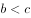

# 2019年420联考《行测》题（黑龙江县乡卷）（网友回忆版）

> 判断推理 · 35 题 · 黑龙江 2019

## 第 1 题　qid 2376548 · 图形推理

把下面的图形分为两类，使每一类图形都有各自的共同特征或规律，分类正确的一项是：

- **A**. ①③⑤，②④⑥
- **B**. ①④⑥，②③⑤　✅
- **C**. ①④⑤，②③⑥
- **D**. ①②⑥，③④⑤

**答案**：B

**官方解析**

解析一：
本题为分组分类题目。题干均是里面有两条直线的立体图形，可以考虑两条直线之间的关系。观察发现，图①④⑥中两条直线不相交，图②③⑤中两条直线相交，故①④⑥一组，②③⑤一组，只有B项符合。
故正确答案为B。
解析二：
本题为分组分类题目。题干均是里面有两条直线的立体图形，可以考虑两条直线之间的关系。观察发现，图①③⑤中两条直线不垂直，图②④⑥中两条直线垂直，故①③⑤一组，②④⑥一组，只有A项符合。
故正确答案为A。
粉笔说明：方法一的分类更直观，而方法二的知识点在以前有所考查，故本题属于命题不严谨。

---

## 第 2 题　qid 2376760 · 图形推理

把下面的图形分为两类，使每一类图形都有各自的共同特征或规律，分类正确的一项是：

- **A**. ①③⑥，②④⑤
- **B**. ①③⑤，②④⑥
- **C**. ①④⑥，②③⑤　✅
- **D**. ①②④，③⑤⑥

**答案**：C

**官方解析**

元素组成不同，优先考虑属性规律。对称、曲直均无明显规律，考虑开闭性。图①④⑥均为半开半封闭图形；图②③⑤均为全封闭图形。因此①④⑥一组，②③⑤一组。
故正确答案为C。

---

## 第 3 题　qid 2377236 · 图形推理

下面四个选项分别为立体图形的俯视图和左视图，均正确的是：

- **A**. A
- **B**. B
- **C**. C
- **D**. D　✅

**答案**：D

**官方解析**

本题考查三视图。

根据每个选项第一个俯视图可以得知，题干中两个立体图形应该是相邻的。

既然是相邻的，那么点a应该在边1上，而A选项和B选项的点a没有在边1上，排除。（如图1所示）

既然是相邻的，那么点b应该在边2的延长线上，因此从上往下观察该图形，点b与点b′应该是重合的。而C选项的点b与点b′并没有重合，排除。（如图2所示）

故正确答案为D。

---

## 第 4 题　qid 2376811 · 图形推理

从所给的四个选项中，选择最合适的一个填入问号处，使之呈现一定的规律性：

- **A**. A
- **B**. B
- **C**. C
- **D**. D　✅

**答案**：D

**官方解析**

解析一：元素组成不同，属性无明显规律，考虑数量规律。题干均为立体图形，且封闭区域较多，可数立体图形的外表面的面数量，即立体图形的外表面是由几个面构成的，观察发现分别由2、3、4、5、6个面构成，因此“？”处应该选择一个外表面为7的立体图形。A选项8个面，B选项6个面，C选项3个面，D选项7个面。D项当选。
故正确答案为D。
解析二：元素组成不同，属性无明显规律，考虑数量规律。观察发现题干立体图形均有下底面，图一和图二下底面形状相同，图三和图四下底面形状相同，因此“？”处应该选择一个与图五下底面形状相同的图形。B项当选。
故正确答案为B。
因为解析一中数立体图形的外表面的面数量呈现严谨的等差规律，故粉笔对于此题更倾向根据外表面的面数量，选择 D项。

---

## 第 5 题　qid 2376553 · 图形推理

从所给四个选项中，选择最合适的一个填入问号处，使之呈现一定的规律性：

- **A**. A
- **B**. B
- **C**. C　✅
- **D**. D

**答案**：C

**官方解析**

元素组成相同，优先考虑位置规律。整体观察发现，小三角、小圆圈均在移动，可以分开看，先看小三角，小三角的移动规律为每次顺时针平移两格，只有C项符合要求。再通过小圆圈位置验证，小圆圈的移动规律为每次逆时针平移三格， C项当选。
故正确答案为C。

---

## 第 6 题　qid 2376560 · 定义判断

似动是指在一定的时间和空间条件下，人们在静止的物体间看到了运动，或者在没有连续位移的地方，看到了连续位移。
根据上述定义，下列选项不属于似动现象的是：

- **A**. 两岸青山相对出
- **B**. 坐地日行八万里　✅
- **C**. 郡邑浮前浦，波澜动远空
- **D**. 明月却多情，随人处处行

**答案**：B

**官方解析**

第一步：找出定义关键词。
“在一定的时间和空间条件下”、“人们在静止的物体间看到了运动”、“或者在没有连续位移的地方，看到了连续位移”。
第二步：逐一分析选项。
A项：“两岸青山相对出”意思是两岸的青山相继出迎，一座座扑进眼帘。青山本是静止的物体，但是作者却看到了它的运动，符合“人们在静止的物体间看到了运动”，符合定义，排除；
B项：“坐地日行八万里”意思是人们住在地球上，因地球自转，于不知不觉中，一日已行了八万里路。依据科学理论，当我们处于赤道附近的时候，即使每天原地不动，也会运动八万华里，即人没有动，而且也看不见运动。所以不符合“在静止的物体间看到了运动”、“或在没有连续位移的地方，看到了连续位移”，不符合定义，当选；
C项：“郡邑浮前浦，波澜动远空”意思是远处的城郭好像在水面上飘动，波翻浪涌，辽远的天空也仿佛为之摇荡。但是事实上，城郭本身不会运动，天空也不会飘荡，符合“人们在静止的物体间看到了运动”，符合定义，排除；
D项：“明月却多情，随人处处行”意思是明月却是那么多情，不管人走到哪里，它都陪伴着你同行。但是我们用肉眼是看不到明月本身在运动的，所以符合“人们在静止的物体间看到了运动”，符合定义，排除。
本题为选非题，故正确答案为B。

---

## 第 7 题　qid 2377228 · 定义判断

演绎推理是指结论已经蕴含在前提中；前提为真，结论也必然为真的推理。归纳推理是指结论并不完全蕴含在前提中；前提为真，结论不必然为真的推理。
根据上述定义，下列属于归纳推理的是：

- **A**. 
如果并且，那么

- **B**. 
所有天鹅都是白的，因此在南极发现的天鹅也是白的

- **C**. 
样品的合格率是，因此这批产品的合格率也是
　✅
- **D**. 
甲生于1980年，而乙生于1981年，因此甲和乙不是同一个人

**答案**：C

**官方解析**

第一步：找出定义关键词。

演绎推理：“结论已经蕴含在前提中”、“前提为真，结论也必然为真”；

归纳推理：“结论并不完全蕴含在前提中”、“前提为真，结论不必然为真”。

第二步：逐一分析选项。

A项：该项中“如果”所在句子为前提，,，蕴含着这一结论，符合“结论已经蕴含在前提中”，属于演绎推理，不属于归纳推理，排除；

B项：该项“所有天鹅都是白的”为前提，强调的是所有天鹅，所以无论在哪发现的天鹅都是白的，符合“前提为真，结论也必然为真”，属于演绎推理，不属于归纳推理，排除；

C项：该项“样品的合格率是”为前提，强调的是全部的产品中的一部分，一部分产品的合格率为，并不能说明所有产品的合格率是，符合“前提为真，结论不必然为真”，符合归纳推理，当选；

D项：该项中“甲生于1980年，而乙生于1981年”为前提，出生年份不一样，那说明一定不是同一个人，符合“前提为真，结论也必然为真”,属于演绎推理，不属于归纳推理，不符合定义，排除。

故正确答案为C。

---

## 第 8 题　qid 2377316 · 定义判断

设p、q是任意命题。p因果蕴涵q指的是：如果p是真的，那么因为p是真的，q也是真的。p反事实蕴涵q指的是：如果p与事实相反，p是真的，那么q也是真的。p严格蕴涵q指的是：必然地，如果p是真的，那么q也是真的。
根据上述定义，下列不属于上述三种蕴涵关系的是：

- **A**. 
如果，那么 
　✅
- **B**. 
如果 且，那么

- **C**. 
如果甲从台阶上摔断了腿，那么当时他会感觉疼痛

- **D**. 
如果大气层本就不存在，那么地球上将不会有生命

**答案**：A

**官方解析**

第一步：找出定义关键词。

p因果蕴涵q：“如果p是真的，那么因为p是真的，q也是真的”；

p反事实蕴涵q：“如果p与事实相反，p是真的，那么q也是真的”；

p严格蕴涵q：“如果p是真的，那么q也是真的”。

第二步：逐一分析选项。

A项：“”是真的，但是“”是假的，不符合以上任何一种定义，不符合定义，当选；

B项：如果“且”为真，那么可以推出“”必然为真，符合“如果p是真的，那么q也是真的”，符合“p严格蕴涵q”，符合定义，排除；

C项：因为甲从台阶上摔断了腿，所以他当时会感觉到疼痛，符合“因为p是真的，q也是真的”，符合“p因果蕴涵q”，符合定义，排除；

D项：大气层本就不存在是“与事实相反的”，如果大气层本就不存在是真的，那么可以推出地球上将不会有生命也是真的，符合“如果p与事实相反，p是真的，那么q也是真的”，符合“p反事实蕴涵q”，符合定义，排除。

本题为选非题，故正确答案为A。

---

## 第 9 题　qid 2376577 · 定义判断

关怀强迫症即一个人特别需要别人依赖自己，总是爱向别人提供别人不需要的关怀。并且，这种人还强迫别人接受自己的关怀，从而使别人不能独立。当别人依赖自己的时候，他就会感到满足，感到自己有价值。这种症状会压抑人的神经，并同时给身边的亲朋好友甚至一般的同事带来诸多不便。
根据上述定义，下列属于关怀强迫症的是：

- **A**. 张某说：“我一天没见到儿子就会发疯”
- **B**. 李某连哄带骗让感冒的女儿吃下感冒药
- **C**. 刘某从小学到大学期间都住自己家里
- **D**. 王某在女儿就读的大学附近租房陪读　✅

**答案**：D

**官方解析**

第一步：找出定义关键词。
“需要别人依赖自己”、“提供别人不需要的关怀”、“强迫别人接受”、“使别人不能独立”。
第二步：逐一分析选项。
A项：张某一天没见到儿子就会发疯，说明是张某依赖儿子，而并非是儿子依赖自己，不符合“需要别人依赖自己”，不符合定义，排除；
B项：李某连哄带骗让感冒的女儿吃下感冒药，没有体现“需要别人依赖自己”，且感冒的女儿需要被人关怀照顾，不符合“提供别人不需要的关怀”，不符合定义，排除；
C项：刘某上学期间住在家里，没有体现到强迫别人，不符合“强迫别人接受”，不符合定义，排除；
D项：王某在女儿就读的大学附近租房陪读，女儿已经读大学了，说明她已经能够独立地生活和学习，符合 “提供别人不需要的关怀”、“强迫别人接受”、“使别人不能独立”，符合定义，当选。
故正确答案为D。

---

## 第 10 题　qid 2377233 · 定义判断

连续对比是指人眼在不同时间段内所观察与感受到的色彩对比视错现象。连续对比又分正残像和负残像两类。正残像是指在停止物体的视觉刺激后，视觉仍然暂时保留原有物色映像的视觉状态。负残像是指在停止物体的视觉刺激后，视觉依旧暂时保留与原有物色成补色（如红与绿、蓝与橙、黄与紫等互为补色）映像的视觉状态。
根据上述定义，下列属于负残像的是：

- **A**. 将静态画面按每秒24帧连续放映，就会在眼前形成动态画面
- **B**. 凝视红色物体之后，即使将物体移开，眼前还是会感到有红色浮现
- **C**. 久视红色后，将视觉迅速移向白色时，看到的并非白色而是绿色　✅
- **D**. 红色与黄色搭配，眼睛时而把红色感觉为带紫的颜色，时而又把黄色视为带绿的颜色

**答案**：C

**官方解析**

第一步：找出定义关键词。
正残像：“指在停止物体的视觉刺激后，视觉仍然暂时保留原有物色映像的视觉状态”；
负残像：“指在停止物体的视觉刺激后，视觉依旧暂时保留与原有物色成补色（如红与绿、蓝与橙、黄与紫等互为补色）映像的视觉状态”。
第二步：逐一分析选项。
A项：将静态画面连续放映就会形成动态画面，说的是画面的静态与动态，而非颜色，不符合“负残像”定义，排除；
B项：凝视红色物体之后，即使将物体移开，还是会感到红色浮现，符合“指在停止物体的视觉刺激后，视觉仍然暂时保留原有物色映像的视觉状态”，符合“正残像”定义，不符合“负残像”定义，排除；
C项：久视红色后，将视觉迅速移到白色时，看到的不是白色而是绿色，红色与绿色互为补色，符合“指在停止物体的视觉刺激后，视觉依旧暂时保留与原有物色成补色映像的视觉状态”，符合“负残像”定义，当选；
D项：红色与黄色搭配，眼睛时而把红色感觉为带紫的颜色，时而又把黄色视为带绿的颜色，没有明确体现是否“停止物体的视觉刺激”，不符合“负残像”定义，排除。
故正确答案为C。

---

## 第 11 题　qid 2376566 · 定义判断

虚拟现实技术是指一种可以创建和体验虚拟世界的仿真系统，它利用计算机生成可交互的三维环境，向使用者提供视觉、听觉、触觉等感官的模拟，从而让人有身临其境之感，这是一种360度视角的沉浸式体验。
根据上述定义，下列选项属于虚拟现实技术运用的是：

- **A**. 张三通过电脑与远在巴黎的父亲视频聊天，亲眼见到了埃菲尔铁塔
- **B**. 李四用手机微信与妻子视频聊天，亲耳听到了儿子背诵古诗的声音
- **C**. 刘五戴上特制头盔网购书桌，能够全方位地体验书桌摆进书房的效果　✅
- **D**. 王二用平板电脑看同学在西藏旅游的视频，感觉自己也到了布达拉宫

**答案**：C

**官方解析**

第一步：找出定义关键词。
“指一种可以创建和体验虚拟世界的仿真系统”、“它利用计算机生成可交互的三维环境，向使用者提供视觉、听觉、触觉等感官的模拟”、“从而让人有身临其境之感，是一种360度视角的沉浸式体验。”
第二步：逐一分析选项。
A项：张三通过电脑与远在巴黎的父亲视频聊天，亲眼见到了埃菲尔铁塔，看到的埃菲尔铁塔是现实世界的景物，并不是虚拟的，不符合“是一种可以创建和体验虚拟世界的仿真系统”，也不符合“向使用者提供视觉、听觉、触觉等感官的模拟”，不符合定义，排除；
B项：李四用微信与妻子视频聊天，亲耳听到了儿子背诵古诗的是声音，儿子背诵古诗的声音也是现实世界的声音，并不是虚拟的，不符合“是一种可以创建和体验虚拟世界的仿真系统”，也不符合“向使用者提供视觉、听觉、触觉等感官的模拟”，不符合定义，排除；
C项：刘五戴上特制头盔，能够全方位地体验书桌摆进书房的效果，符合“向使用者提供视觉、听觉、触觉等感官的模拟”、“是一种360度视角的沉浸式体验”，符合定义，当选；
D项：王二用平板电脑看同学在西藏旅游的视频，感觉自己也到了布达拉宫，王二观看视频的过程，不符合“创建和体验虚拟世界的仿真系统”，不符合定义，排除。
故正确答案为C。

---

## 第 12 题　qid 2377217 · 定义判断

主语是执行句子的行为或动作的主体，谓语是对主语动作或状态的陈述或说明，宾语则是指一个动作（动词）的接受者。当句子中的谓语部分包含两个动词（有的后一个是形容词），且对应两个不同的主语，即前一个谓语的宾语同时又作为后一个谓语的主语，等于一个动宾结构和主谓结构连环在一起，并且其中没有语音停顿，符合这样格式的句子叫兼语句。
根据上述定义，下列不属于兼语句的是：

- **A**. 风吹雪花飘
- **B**. 上级派工作组检查工作
- **C**. 公使阳处父追之
- **D**. 人不能两次踏进同一条河流　✅

**答案**：D

**官方解析**

第一步：找出定义关键词。 
主语：“执行句子的行为或动作的主体”；
谓语：“对主语动作或状态的陈述或说明”；
宾语：“一个动作（动词）的接受者”；
兼语句：“前一个谓语的宾语同时又作为后一个谓语的主语”、“一个动宾结构和主谓结构连环在一起，并且其中没有语音停顿”。
第二步：逐一分析选项。
A项：风吹雪花飘，风吹雪花，风是主语，吹是谓语，雪花是宾语，为主谓宾结构，雪花飘，雪花是主语，飘是谓语，为主谓结构，符合“前一个谓语的宾语同时又作为后一个谓语的主语”，也符合“一个动宾结构和主谓结构连环在一起，并且其中没有语音停顿”，符合定义，排除；
B项：上级是主语，派是谓语，工作组是宾语，为主谓宾结构，检查是谓语，工作是宾语，且工作组是检查的主语，符合“前一个谓语的宾语同时又作为后一个谓语的主语”，也符合“一个动宾结构和主谓结构连环在一起，并且其中没有语音停顿”，符合定义，排除；
C项：公使阳处父追之，公是主语，使是谓语，阳处父是宾语，为主谓宾结构，追是谓语，之是宾语，且阳处父是追的主语，符合“前一个谓语的宾语同时又作为后一个谓语的主语”，也符合“一个动宾结构和主谓结构连环在一起，并且其中没有语音停顿”，符合定义，排除；
D项：人不能两次踏进同一条河流，整体为主谓宾结构，不符合“前一个谓语的宾语同时又作为后一个谓语的主语”，不符合定义，当选。
本题为选非题，故正确答案为D。

---

## 第 13 题　qid 2376587 · 定义判断

水文节律指湖泊水情周期性、有节律的变化。广义水文节律包括昼夜、月运、季节和年际节律。正常情况下，由于流域气候和下垫面等因素较稳定，湖泊多年平均水位趋于稳定数值即湖泊正常年平均水位。所以湖泊年际节律以干扰因素驱动的突变性和适应干扰后的阶段稳定性为特点，无渐变趋向；而昼夜节律对生态系统影响微弱。因此，狭义水文节律特指月运节律与季节节律。
根据上述定义，下列涉及狭义水文节律的是：

- **A**. 
鄱阳湖受降雨持续减少和来水减少双重影响，水面面积持续萎缩

- **B**. 
洪泽湖历史年均水温，最高水温在9月，最低水温在1月
　✅
- **C**. 
洞庭湖去年年降水量1560毫米，其中4~6月降水约占全年一半

- **D**. 
巢湖流域年平均气温稳定在之间，有200天以上无霜期

**答案**：B

**官方解析**

第一步：找出定义关键词。
水文节律：“湖泊水情周期性、有节律的变化”；
广义水文节律：“昼夜、月运、季节和年际节律”；
狭义水文节律：“月运节律和季节节律”。
（注：水情是指江河湖泊的状况、特征及地理意义，如流量、水位、流速、水温与冰情等）
本题要选的是符合狭义水文节律的选项。
第二步：逐一分析选项。
A项：鄱阳湖水面面积持续萎缩，说明是一直在减小，不存在周期性的变化，不符合定义，排除；
B项：洪泽湖历史年均最高水温在9月，最低水温在1月，月份和季节不同水温也不同，而且是统计了历史上多年的水温，符合“湖泊水情周期性、有节律的变化”，符合“季节节律”，符合狭义水文节律，符合定义，当选（水情指江河湖泊的状况、特征及地理意义，如流量、水位、流速、水温与冰情等，水温是水文测验的基本项目之一）；
C项：只是给出洞庭湖去年一年的降水量，没有体现“周期性、有节律的变化”，不符合定义，排除；
D项：巢湖流域平均气温在15-16摄氏度之间，有200天以上无霜期，是湖泊流经区域的气温变化，而不是湖泊水情的变化，不符合定义，排除。
故正确答案为B。

---

## 第 14 题　qid 2377219 · 定义判断

数字家庭是指以计算机技术和网络技术为基础，各种电器通过不同的互连方式进行通信及数据交换，实现电器间的互联互通，使人们可以更加方便快捷地获取信息，从而极大提高人类居住的舒适性和娱乐性。
根据上述定义，下列不涉及数字家庭的是：

- **A**. 小王通过网络控制家里的打印机，实现远程打印
- **B**. 小李通过蓝牙将投影仪与笔记本电脑连接，在家里播放电影
- **C**. 小刘使用电饭煲预约定时功能，让电饭煲在预定时间自动开始工作　✅
- **D**. 小张在单位上班时，通过手机控制家里的电视，录制正在直播的体育节目

**答案**：C

**官方解析**

第一步：找出定义关键词。
“以计算机技术和网络技术为基础”、“各种电器通过不同的互连方式进行通信及数据交换，实现互联互通”、“提高人类居住的舒适性和娱乐性”。
第二步：逐一分析选项。
A项：通过网络控制家里的打印机，符合“以计算机技术和网络技术为基础”、“各种电器通过不同的互连方式进行通信及数据交换，实现互联互通”，实现远程打印，符合“提高人类居住的舒适性和娱乐性”，符合定义，排除；
B项：通过蓝牙将投影仪与笔记本电脑连接，符合“以计算机技术和网络技术为基础”、“各种电器通过不同的互连方式进行通信及数据交换，实现互联互通”，在家里播放电影，符合“提高人类居住的舒适性和娱乐性”，符合定义，排除；
C项：使用电饭煲预约定时功能，没有运用计算机和网络技术，不符合“以计算机技术和网络技术为基础”，也没有和其他电器连接，不符合“各种电器通过不同的互连方式进行通信及数据交换，实现互联互通”，不符合定义，当选；
D项：通过手机控制家里的电视，符合“以计算机技术和网络技术为基础”、“各种电器通过不同的互连方式进行通信及数据交换，实现互联互通”，录制正在直播的体育节目，符合“提高人类居住的舒适性和娱乐性”，符合定义，排除。
本题为选非题，故正确答案为C。

---

## 第 15 题　qid 2376789 · 定义判断

类脑计算技术总体分为三个层次：结构层次模仿脑、器件层次逼近脑、智能层次超越脑。其中，结构层次模仿脑是指将大脑作为一个物质和生理对象进行解析，获得基本单元(各类神经元和神经突触等)的功能及其连接关系（网络结构）；器件层次逼近脑是指研制能够模拟神经元和神经突触功能的器件，从而在有限的物理空间和功耗条件下构造出人脑规模的神经网络系统；智能层次超越脑是指通过对类脑计算机进行信息刺激、训练和学习，使其产生与人脑类似的智能。
根据上述定义，下列属于智能层次超越脑的是：

- **A**. 调整神经网络的突触连接关系及连接频率和强度　✅
- **B**. 绘制精确的人类大脑动态图谱以解析探测大脑
- **C**. 开发功能、密度与人类大脑皮层相当的电子装备
- **D**. 捕捉细微的单个神经元放电的非线性动力学过程

**答案**：A

**官方解析**

第一步：找出定义关键词。
结构层次模仿脑：“将大脑作为物质和生理对象进行解析”、“获得基本单元的功能及其连接关系”；
器件层次逼近脑：“研制能够模拟神经元和神经突触功能的器件”、“构造出人脑规模的神经网络系统”；
智能层次超越脑：“对类脑计算机进行信息刺激、训练和学习”、“产生与人脑类似的智能”。
第二步：逐一分析选项。
A项：调整神经网络的突触连接关系及连接频率和强度，符合“对类脑计算机进行信息刺激、训练和学习” ，符合“智能层次超越脑”定义，当选；
B项：绘制精确的人类大脑动态图谱，符合“将大脑作为物质和生理对象进行解析”，符合“结构层次模仿脑”定义，不符合“智能层次超越脑”定义，排除；
C项：开发功能、密度与人类大脑皮层相当的电子装备，符合“研制能够模拟神经元和神经突触功能的器件”，符合“器件层次逼近脑”定义，不符合“智能层次超越脑”定义，排除；
D项：捕捉细微的单个神经元放电的非线性动力学过程，符合“获得基本单元的功能及其连接关系”，符合“结构层次模仿脑”定义，不符合“智能层次超越脑”定义，排除。
故正确答案为A。
注：本题目来自于《类脑计算机的现在与未来》，各选项对应于该文章中的句子如下所示：
A项：所谓“智能层次超越脑”，属于类脑计算机应用软件层次的问题，是指通过对类脑计算机进行信息刺激、训练和学习，使其产生与人脑类似的智能甚至涌现出自主意识，实现智能培育和进化。刺激源可以是虚拟环境，也可以是来自现实环境的各种信息（例如互联网大数据）和信号（例如遍布全球的摄像头和各种物联网传感器），还可以是机器人“身体”在自然环境中探索和互动。在这个过程中，类脑计算机能够调整神经网络的突触连接关系及连接强度，实现学习、记忆、识别、会话、推理以及更高级的智能；
B项：所谓“结构层次模仿脑”，是将大脑作为一个物质和生理对象进行解析，获得基本单元（各类神经元和神经突触等）的功能及其连接关系（网络结构）；
C项：所谓“器件层次逼近人脑”，是指研制能够模拟神经元和神经突触功能的微纳光电器件，从而在有限的物理空间和功耗条件下构造出人脑规模的神经网络系统。这方面的代表性项目是美国国防部先进研究项目局（DARPA）2008年启动的“神经形态自适应可塑性可扩展电子系统”（即突触），其目标是研制出器件功能、规模与密度均与人类大脑皮层相当的电子装置；
D项：所谓“结构层次模仿脑”，是将大脑作为一个物质和生理对象进行解析，获得基本单元（各类神经元和神经突触等）的功能及其连接关系（网络结构）。这一阶段，主要通过神经科学实验采用先进的分析探测技术完成。1952年，英国科学家霍奇金和赫胥黎提出了以两人命名的HH方程，精确刻画了单个神经元放电的非线性动力学过程，这是神经元信息处理的标准数学模型。

---

## 第 16 题　qid 2377262 · 类比推理

烤箱：烘烤

- **A**. 卷尺：测量　✅
- **B**. 皮鞋：防水
- **C**. 铜镜：折射
- **D**. 软件：导航

**答案**：A

**官方解析**

第一步：判断题干词语间逻辑关系。
烤箱主要功能是用来烘烤，二者是功能的对应关系。
第二步：判断选项词语间逻辑关系。
A项：卷尺主要功能是用来测量，二者是功能的对应关系，与题干逻辑关系一致，当选；
B项：皮鞋主要功能不是用来防水，与题干逻辑关系不一致，排除；
C项：铜镜主要功能不是用来折射，与题干逻辑关系不一致，排除；
D项：不是所有软件都可以用来导航，与题干逻辑关系不一致，排除。
故正确答案为A。

---

## 第 17 题　qid 2376531 · 类比推理

拥挤：水泄不通

- **A**. 清晰：洞见肺腑
- **B**. 严重：触目惊心
- **C**. 费力：举重若轻
- **D**. 伤心：肝肠寸断　✅

**答案**：D

**官方解析**

第一步：判断题干词语间逻辑关系。
水泄不通形容拥挤或包围的非常严密，与拥挤是近义关系。
第二步：判断选项词语间逻辑关系。
A项：洞见肺腑是指很清楚地看见人的内心，形容襟怀坦白，待人诚恳。与清晰不是近义关系，与题干逻辑关系不一致，排除；
B项：触目惊心是指看见某种严重情况而内心震惊，形容事态严重，引起轰动，该词强调的是震惊，与严重不是近义关系，与题干逻辑关系不一致，排除；
C项：举重若轻是比喻能力强，能够轻松地胜任繁重的工作或处理困难的问题。与费力不是近义关系，与题干逻辑关系不一致，排除；
D项：肝肠寸断是比喻伤心到极点，与伤心是近义关系，与题干逻辑关系一致，当选。
故正确答案为D。

---

## 第 18 题　qid 2377222 · 类比推理

广场：广场舞

- **A**. 校园：教学楼
- **B**. 厂房：流水线
- **C**. 电视：演唱会
- **D**. 公路：马拉松　✅

**答案**：D

**官方解析**

第一步：判断题干词语间逻辑关系。
在广场上跳广场舞，广场舞是一种运动形式，广场是一个地点。
第二步：判断选项词语间逻辑关系。
A项：教学楼是校园的组成部分，二者为组成关系。与题干逻辑关系不一致，排除；
B项：流水线是厂房的一种工作模式。与题干逻辑关系不一致，排除；
C项：在电视上看演唱会，但电视不是地点。与题干逻辑关系不一致，排除；
D项：在公路上跑马拉松，马拉松是一种运动形式，公路是一个地点。与题干逻辑关系一致，当选。
故正确答案为D。

---

## 第 19 题　qid 2376569 · 类比推理

成长：衰亡

- **A**. 坚定：彷徨　✅
- **B**. 美好：苦难
- **C**. 深刻：纯真
- **D**. 复杂：单纯

**答案**：A

**官方解析**

第一步：判断题干词语间逻辑关系。
成长和衰亡是反义关系，并且成长是积极的，衰亡是消极的。
第二步：判断选项词语间逻辑关系。
A项：坚定和彷徨是反义关系，并且坚定是积极的，彷徨是消极的，与题干逻辑关系一致，当选；
B项：美好的反义词应该是丑陋，而苦难不一定是丑陋的，很多磨难是对人的一种历练，是对人生有益的，因此美好和苦难不是反义关系，与题干逻辑关系不一致，排除；
C项：深刻和纯真不是反义关系，与题干逻辑关系不一致，排除；
D项：复杂和单纯是反义关系，但是复杂和单纯没有积极和消极之分，与题干逻辑关系不一致，排除。
故正确答案为A。

---

## 第 20 题　qid 2377274 · 类比推理

局域网：计算机：文件共享

- **A**. 空间站：航天员：科学实验
- **B**. 图书馆：阅览室：文献检索
- **C**. 纺织厂：纺织设备：原料加工　✅
- **D**. 电视台：网络媒体：节目制作

**答案**：C

**官方解析**

第一步：判断题干词语间逻辑关系。
在局域网内，利用计算机进行文件共享，计算机是进行文件共享的工具。
第二步：判断选项词语间逻辑关系。
A项：航天员在空间站进行科学实验，航天员是进行科学实验的主体而非工具，与题干逻辑关系不一致，排除；
B项：在阅览室进行文献检索，阅览室是文献检索的场所而非工具，与题干逻辑关系不一致，排除；
C项：在纺织厂内，利用纺织设备进行原料加工，纺织设备是进行原料加工的工具，与题干逻辑关系一致，当选；
D项：网络媒体不能用来节目制作，与题干逻辑关系不一致，排除。
故正确答案为C。

---

## 第 21 题　qid 2376558 · 类比推理

效率：公平：市场经济

- **A**. 科学：理性：政治哲学
- **B**. 革命：改良：社会制度
- **C**. 民主：集中：组织原则　✅
- **D**. 美丑：善恶：审美范畴

**答案**：C

**官方解析**

第一步：判断题干词语间逻辑关系。
市场经济需要兼顾效率与公平。
第二步：判断选项词语间逻辑关系。
A项：政治哲学不需要兼顾科学与理性，且科学是理性的，与题干逻辑关系不一致，排除； 
B项：社会制度不需要兼顾革命与改良，与题干逻辑关系不一致，排除；
C项：组织原则需要兼顾民主与集中，与题干逻辑关系一致，当选；
D项：审美范畴不需要兼顾美丑与善恶，且善恶不属于审美的范畴，与题干逻辑关系不一致，排除。
故正确答案为C。

---

## 第 22 题　qid 2377220 · 类比推理

教授：副教授：讲师

- **A**. 开除：记过：警告　✅
- **B**. 刑法：民法：道德
- **C**. 商务手机：智能手机：4G手机
- **D**. 发动机：内燃机：电动机

**答案**：A

**官方解析**

第一步：判断题干词语间逻辑关系。
教授、副教授和讲师都是对老师的评级，三者是并列关系。并且教授比副教授的级别高，副教授比讲师的级别高。
第二步：判断选项词语间逻辑关系。
A项：开除、记过和警告都是处罚方式，三者是并列关系。并且开除比记过的程度重，记过比警告的程度重，与题干逻辑关系一致，当选；
B项：刑法和民法都是法律，二者为并列关系，但二者和道德不是并列关系，与题干逻辑关系不一致，排除；
C项：商务手机、智能手机和4G手机，三者是交叉关系，与题干逻辑关系不一致，排除；
D项：发动机是一种能够把其它形式的能转化为机械能的机器，包括内燃机（汽油发动机等）、外燃机（斯特林发动机、蒸汽机等）、电动机等。因此内燃机和电动机都是发动机的一种，第一个词与后面的两个词均为种属关系，与题干逻辑关系不一致，排除。
故正确答案为A。

---

## 第 23 题　qid 2376570 · 类比推理

瓮牖绳枢：粗茶淡饭：清寒

- **A**. 叠床架屋：衣锦食肉：奢华
- **B**. 箪食瓢饮：曲肱饮水：简朴　✅
- **C**. 轻车熟路：霜行草宿：轻松
- **D**. 金盆洗手：金屋藏娇：阔绰

**答案**：B

**官方解析**

第一步：判断题干词语间逻辑关系。
瓮牖绳枢指以破瓮作窗户，以草绳系户枢，比喻贫穷人家；粗茶淡饭形容饮食简单，生活简朴，二者都可以用来形容清寒。
第二步：判断选项词语间逻辑关系。
A项：叠床架屋比喻办事重复，自找麻烦；衣锦食肉形容生活富足，第一词与奢华无关，与题干逻辑关系不一致，排除；
B项：箪食瓢饮形容读书人安于贫穷的清高生活；曲肱饮水形容清心寡欲、安贫乐道的生活，二者都可以用来形容简朴，与题干逻辑关系一致，当选；
C项：轻车熟路比喻事情又熟悉又容易；霜行草宿指在霜露中行走，草野中息宿，形容奔波劳苦，第二词与轻松无关，与题干逻辑关系不一致，排除；
D项：金盆洗手指放弃以前长期从事的行业或某件事；金屋藏娇指十分宠爱妻子，也指男人纳妾或在外包养女人，二者均与阔绰无关，与题干逻辑关系不一致，排除。
故正确答案为B。

---

## 第 24 题　qid 2376603 · 类比推理

（    ） 对于 聚集之处 相当于 捷径 对于 （    ）

- **A**. 荟萃；取巧之思
- **B**. 渊薮；速成之法　✅
- **C**. 辐辏；入门之路
- **D**. 囹圄；提升之梯

**答案**：B

**官方解析**

逐一代入选项。
A项：荟萃比喻优秀的人物或精美的东西会集、聚集，可以形容聚集之处，捷径比喻能较快地达到目的的巧妙手段或办法，与取巧之思无关，前后逻辑关系不一致，排除；
B项：渊薮比喻某种人或事、物聚集的地方，可以比喻聚集之处；捷径指近便的小路，形容便捷的方法，可以比喻速成之法，前后逻辑关系一致，当选；
C项：辐辏形容人或物聚集像车辐集中于车毂一样，可以形容聚集之处，入门之路与捷径无关，前后逻辑关系不一致，排除；
D项：囹圄原指监牢，后引申为束缚、困难，与聚集之处无关，捷径与提升之梯无关，前后逻辑关系不一致，排除。
故正确答案为B。

---

## 第 25 题　qid 2377243 · 类比推理

肥皂  对于（  ）相当于  煤炭  对于（  ）

- **A**. 衣服；锅炉
- **B**. 水；火
- **C**. 污渍；能源
- **D**. 洗涤液；天然气　✅

**答案**：D

**官方解析**

逐一代入选项。
A项：肥皂是清洗衣服用到的工具，煤炭在锅炉中燃烧，前后逻辑关系不一致，排除；
B项：肥皂发挥作用需要用到水，煤炭经过燃烧产生火，煤炭只要达到一定燃点就能燃烧，不一定需要火，前后逻辑关系不一致，排除；
C项：肥皂的作用是去除污渍，二者属于物品和功能的对应关系，煤炭是能源的一种，二者属于种属关系，前后逻辑关系不一致，排除；
D项：肥皂和洗涤液是不同的清洁用品，二者属于并列关系，煤炭是古代植物埋藏在地下经历了复杂的生物化学和物理化学变化逐渐形成的固体可燃性矿物，天然气是指天然蕴藏于地层中的烃类和非烃类气体的混合物，二者分别是不同的能源，属于并列关系，前后逻辑关系一致，当选。
故正确答案为D。

---

## 第 26 题　qid 2377237 · 逻辑判断

一对中子星碰撞后抛出的碎片不仅合成了金、银等稳定元素，还合成了大量放射性元素，它们会衰变、裂变，释放出大量能量，将碎片自身加热，使其发光，最亮时虽然没有超新星那么亮，却可以达到新星亮度的一千倍左右，因此被称为千新星。2017年8月，天文学家首次观测到双中子星并合前后发出的引力波，并在大约10小时后发现了中子星碎片形成的千新星现象，从而彻底证实了中子星并合可以合成大量重元素这个猜想。
由此可以推出:

- **A**. 超新星比新星更亮　✅
- **B**. 引力波可以释放大量能量
- **C**. 千新星中含有大量的金、银元素
- **D**. 宇宙中的重元素都是由中子星碰撞后产生的

**答案**：A

**官方解析**

日常结论题，根据题干信息逐一分析选项。
A项：根据题干“最亮时虽然没有超新星那么亮，却可以达到新星亮度的一千倍左右，因此被称为千新星”可知，超新星比新星更亮，可以推出，当选；
B项：题干只是说明“双中子星并合前后发出的引力波”，并未提起引力波是否可以释放大量能量，无中生有，无法推出，排除；
C项：题干只是说明“一对中子星碰撞后抛出的碎片不仅合成了金、银等稳定元素，还合成了大量放射性元素，它们会衰变、裂变，释放出大量能量”，而不是千新星中含有大量的金、银元素，无中生有，无法推出，排除； 
D项：题干并未提及重元素的来源都是中子星并合，无中生有，无法推出，排除。
故正确答案为A。

---

## 第 27 题　qid 2376564 · 逻辑判断

快速、持续、无法预测的竞争环境要求企业规模小，结构简化，同时要有足够的技术储备和抵抗资金风险的能力。目前解决这一矛盾的途径通常是建立全球范围内的“基于双赢原则”的虚拟企业。虚拟企业是企业间的一种动态联盟，参加虚拟企业的各成员企业有一定的自主权。当出现了市场机会，各加盟企业就组织在一起，共同开发并生产销售新产品，一旦发现该产品无利可图，便自动解散。因此，虚拟企业被认为是21世纪最有竞争力的企业运行模式。
以下哪项如果为真，最能支持上述观点？

- **A**. 当今社会发达的现代信息技术和通讯手段为各企业间的沟通提供了便利
- **B**. 企业想在当前的竞争环境中生存发展扩大优势，需要一种新的运行模式
- **C**. 虚拟企业中的任一加盟企业生产上出现问题都会中断整个生产链的运行
- **D**. 虚拟企业可迅速集中最强设计加工与销售力量，实现对市场的快速反应　✅

**答案**：D

**官方解析**

第一步：找出论点和论据。
论点：虚拟企业被认为是21世纪最有竞争力的企业运行模式。
论据：当出现了市场机会，各加盟企业就组织在一起，共同开发并生产销售新产品，一旦发现该产品无利可图，便自动解散。
论点论据都在说虚拟企业的优势，话题一致，优先考虑补充论据，补充能够证明虚拟企业是最有竞争力的企业运营模式的理由进行加强。
第二步：逐一分析选项。
A项：现代发达的信息技术为各企业之间的沟通提供便利，但是提供便利不代表就有竞争力，话题不一致，无法加强，排除；
B项：企业想在竞争环境中生存发展扩大优势，需要新的运行模式，但新的运行模式是否指的是虚拟企业不清楚，无法加强，排除；
C项：虚拟企业中的任一加盟企业生产出现问题都会中断整个生产链的运行，说的是虚拟企业的缺点，但有缺点不代表没有竞争力，虚拟企业是否是最有竞争力的企业运行模式未知，话题不一致，无法加强，排除；
D项：虚拟企业能够快速集中最强的力量做出最快的反应，说明虚拟企业的优势，并且力量最强，速度最快，也可说明虚拟企业是最有竞争力的运营模式，补充论据，可以加强，当选。
故正确答案为D。

---

## 第 28 题　qid 2377244 · 逻辑判断

近日，某研究小组利用蓝色发光二极管（LED）成功研发出节能效果出众的半导体材料，制造出了约1毫米见方的一小块半导体，它能够稳定传输家电使用过程中所需的10安培电流。如果用在空调等电器上的话，可以节省近的耗电量。研究小组认为，利用这种新型半导体材料生产的家用电器，将比传统家用电器更具有市场竞争力。

以下哪项如果为真，最能支持上述结论？

- **A**. 这种新型半导体材料在未来也可应用于生产电动汽车
- **B**. 目前市场上销售的声称节能型的家用电器质量参差不齐
- **C**. 全球著名的几大家电企业已与该研究小组展开该研究成果的商业转化合作
- **D**. 利用这种新材料生产的家用电器的成本有望在未来达到与传统家用电器相近的程度　✅

**答案**：D

**官方解析**

第一步:找出论点和论据。
论点：利用这种新型半导体材料生产的家用电器，将比传统家用电器更具有市场竞争力。
论据：某研究小组利用蓝色发光二极管（LED）成功研发出节能效果出众的半导体材料，制造出了约1毫米见方的一小块半导体，它能够稳定传输家电使用过程中所需的10安培电流。如果用在空调等电器上的话，可以节省近10%的耗电量。
题干论据讨论的是新型材料可以更节能，论点讨论的是采用新型材料的家电相比传统家电更具有市场竞争力，其中节能确实是加强竞争力的一个重要层面。因此可以考虑在节能与竞争力之间搭桥，或者补充一个其他具有提升竞争力的条件来加强。
第二步:逐一分析选项。
A项:论点说的是这种新型半导体材料生产的家电非常有市场竞争力，甚至将超越传统家用电器，但该项说这种新型半导体材料将用在生产电动汽车上，只是在说这种新型半导体材料应用的领域更广，与论点话题不一致，无法加强，排除；
B项:论点的主体是新型半导体材料的家电，该项的主体是市场销售声称节能型的家电，但实际是否为节能型家电不明确，并且该项中的声称节能型的家电是否用到了论点中说的新型半导体材料不明确，与论点主体不一致，无关项，无法加强，排除；
C项:著名企业与研究小组展开研究成果的商业转化合作，只能说明可以进行生产，但是比传统家用电器更具有市场竞争力不明确，不明确选项，无法加强，排除；
D项:新材料生产的电器的成本与传统家电相近，说明在成本相近的条件下，新材料生产的家电更省电，因此会更有竞争力，补充论据加强题干观点，当选。
故正确答案为D。

---

## 第 29 题　qid 2376761 · 逻辑判断

下列动物如果都只能归属一种门类，并且满足以下条件：
（1）如果动物B不是鸟，那么动物A是哺乳动物
（2）或者动物C是哺乳动物，或者动物A是哺乳动物
（3）如果动物B不是鸟，那么动物D不是鱼
（4）或者动物D是鱼，或者动物E不是昆虫
（5）如果动物E不是昆虫，那么动物B不是鸟
以下哪项如果为真，可以得出“动物C是哺乳动物”的结论？

- **A**. 动物D不是鱼
- **B**. 动物E是昆虫　✅
- **C**. 动物B不是鸟
- **D**. 动物A是哺乳动物

**答案**：B

**官方解析**

题干条件只有（2）与动物C有关，（2）条件为：动物C是哺乳动物或动物A是哺乳动物；
根据否一推一，想要得出“动物C是哺乳动物”的结论，必须得到动物A不是哺乳动物；
则根据（1），如果动物B不是鸟，得到动物A是哺乳动物，则无法推出“动物C是哺乳动物”的结论，因此须满足动物B是鸟；
根据（5），如果动物E不是昆虫，则动物B不是鸟，无法推出结论，因此必须满足E是昆虫。
故正确答案为B。

---

## 第 30 题　qid 2377317 · 逻辑判断

研究人员为了考察聆听莫扎特音乐和空间推理能力之间的关系，进行了实验。第一组被试者聆听莫扎特音乐，第二组被试者聆听其他类型的音乐，第三组被试者没有聆听任何音乐。一段时间后，给每位被试者发放三套空间推理能力测试题。结果显示：第一组的平均分明显高于后两组。研究人员据此认为，聆听莫扎特音乐能够提高人们的空间推理能力。
以下哪项如果为真，最能削弱上述结论？

- **A**. 第一组被试者中男性比例较高，而男性的空间推理能力普遍高于女性　✅
- **B**. 上述测试题中只涉及空间推理能力，并不能全面反映被试者的智力水平
- **C**. 第一组被试者原本就是喜欢莫扎特音乐的爱好者
- **D**. 莫扎特的音乐比其他类型的音乐更容易使被试者获得愉悦感

**答案**：A

**官方解析**

第一步：找出论点和论据。
论点：聆听莫扎特音乐能够提高人们的空间推理能力。
论据：第一组聆听莫扎特音乐，第二组聆听其他音乐，第三组没有聆听任何音乐。第一组的平均分明显高于后两组。
论据为对比试验，要想削弱，优先考虑实验前对比对象情况不一致。
第二步：逐一分析选项。
A项：该项说第一组男性比例高且男性空间推理能力强，属于实验前对比对象情况不一致，可以削弱，当选；
B项：论点研究的是聆听莫扎特音乐与空间推理能力的关系，而该项说的是智力水平，无关项，排除；
C项：该项只是说第一组人是莫扎特音乐爱好者，未提及推理能力，无关项，排除； 
D项：该项说的是音乐与愉悦感的关系，未提及空间推理能力，无关项，排除。
故正确答案为A。

---

## 第 31 题　qid 2376568 · 逻辑判断

在抗生素大规模医用之前，耐药效果对细菌几乎没有意义，突变自身的有害效果更加重要。正常使用抗生素能杀死几乎所有的目标细菌，个别漏网之鱼通常也会被人体免疫系统消灭殆尽。其中一些细菌个体虽然已经带有耐药性的萌芽，但这些萌芽不足以抵御正常剂量抗生素，也会随着个体死去而消失。
由此可以推出：

- **A**. 基因突变是耐药细菌泛滥成灾的根本原因
- **B**. 细菌通过基因突变，来削弱抗生素的作用效果
- **C**. 致病菌产生耐药性之后，抗生素将无法攻击病菌
- **D**. 如果没有抗生素滥用，耐药性不会快速蔓延开来　✅

**答案**：D

**官方解析**

日常结论题，根据题干信息逐一分析选项。
A项：题干中没有涉及到耐药细菌泛滥成灾的根本原因，无中生有，排除；
B项：题干只说到“细菌突变自身的有害效果”，没有明确说明是否是基因突变，无中生有，排除；
C项：题干中指出有耐药性的细菌个体不足以抵御正常剂量抗生素，说明抗生素还是会去攻击病菌，并不是选项中表述的无法攻击病菌，排除；
D项：根据第一句可知，抗生素大规模使用之前，耐药性对细菌几乎没有意义，说明如果没有抗生素滥用，耐药性就不会快速蔓延，当选。
故正确答案为D。

---

## 第 32 题　qid 2377238 · 逻辑判断

糖生物电池作为一种燃料电池，可以将糖的化学能量转化为电流。一般来说，糖生物电池可以实现的能量转换，其能量存储密度大约是，相比之下，锂离子电池的能量存储密度为。这意味着糖生物电池比同等重量的现有锂离子电池持续使用至少多10倍的时间。因此，不少研究者认为糖生物电池将有效替代传统锂电池。

以下哪项如果为真，能够支持上述结论?

- **A**. 糖生物电池是微生物燃料电池，不可能在高温下工作，因此对生产环境有着比传统电池更严格的要求
- **B**. 糖生物电池转化电能效率高，但可重复性较低，而传统锂电池可反复充放电，因此能够使用较长的时间
- **C**. 糖生物电池依赖于人体酶进行化学反应产生电流，而传统锂电池利用重金属作为催化剂，因此前者更加低碳环保　✅
- **D**. 目前，糖生物电池仅应用在人造器官的供电装置中，而锂电池不但可用于人造器官供电，也广泛应用于各类电子设备供电

**答案**：C

**官方解析**

第一步：找出论点和论据。
论点：糖生物电池将有效替代传统锂电池。
论据：糖生物电池比同等重量的现有锂离子电池持续使用至少多10倍的时间。
论据通过指出糖生物电池比现有锂离子电池持续时间久，从而得出糖生物电池将取而代之，论据论点话题一致，所以优先考虑补充论据加强。
第二步：逐一分析选项。
A项：说明糖生物电池不能在高温下工作，对生产环境要求更严格，说明糖生物电池有局限性，无法有效替代传统锂电池，有一定的削弱力度，无法加强，排除；
B项：说明糖生物电池的可重复性不如传统电池，所以糖生物电池无法有效替代传统锂电池，否定了论点，无法加强，排除；
C项：说明糖生物电池比传统锂电池更加低碳环保，更加有优势，所以糖生物电池将有效替代传统锂电池，补充论据加强，当选； 
D项：说明糖生物电池的可应用领域不如传统锂电池广泛，所以糖生物电池无法有效替代传统锂电池，否定了论点，无法加强，排除。
故正确答案为C。

---

## 第 33 题　qid 2376555 · 逻辑判断

自制力不仅关乎自我控制，还包括排除不相关刺激的干扰和坚持完成相关任务（即使是自己不喜欢的任务）的能力。自制力是稳定不变的，还是会被消耗的，学界各派的看法不一。心理学家把实验对象分为两组，让他们同场解决难题。一组解题时只能吃萝卜，另一组还可以吃饼干。结果只吃萝卜的这组坚持时间更短，因为他们在抵制饼干的诱惑的同时，消耗了自制力。他们由此得出结论：人们的自制力是有限的，过度使用会导致自制力下降。
上述结论的成立需要补充以下哪项作为前提？

- **A**. 实验对象对解决难题的兴趣不完全相同
- **B**. 饼干和萝卜对实验对象的诱惑力不相同　✅
- **C**. 饼干和萝卜补充人体能量的效果不相同
- **D**. 两组实验对象抗干扰的能力不完全相同

**答案**：B

**官方解析**

第一步：找出论点和论据。
论点：人们的自制力是有限的，过度使用会导致自制力下降。
论据：心理学家把实验对象分为两组，让他们同场解决难题。一组解题时只能吃萝卜，另一组还可以吃饼干。结果只吃萝卜的这组坚持时间更短，因为他们在抵制饼干诱惑的同时，消耗了自制力。
论据和论点话题一致，且问题为“前提”，优先考虑必要条件。
第二步：逐一分析选项。
A项：实验对象对于解决问题的兴趣不同，说明实验起点不一致，并不知道过度使用自制力是否会消耗自制力，无法加强，排除；
B项：饼干和萝卜对人们的诱惑力不同，如果相同的话，那么就无法通过对比饼干和萝卜得到抵制饼干的诱惑会消耗自制力，是论证成立的前提，当选；
C项：饼干和萝卜对人体的能量补充的效果，与题干论点无关，为无关选项，无法加强，排除； 
D项：实验对象抗干扰能力不同，说明实验起点不一致，并不知道过度使用自制力是否会消耗自制力，无法加强，排除。
故正确答案为B。

---

## 第 34 题　qid 2376790 · 逻辑判断

某国际古生物学研究团队最新报告称，在2.8亿年前生活在南非的正南龟是现代乌龟的祖先，它们是在二叠纪至三叠纪大规模物种灭绝事件中幸存下来的。当时，为了躲避严酷的自然环境，它们努力向地下挖洞，同时为保证前肢的挖掘动作足够有力，身体需要一个稳定的支撑，从而导致了肋骨不断加宽。由此可知，乌龟有壳是适应环境的表现，只不过不是为了保护，而是为了向地下挖洞。
上述结论的成立需要补充以下哪项作为前提？

- **A**. 只有挖洞才能从大规模物种灭绝事件中幸存
- **B**. 现代乌龟继承了正南龟善于挖洞的某些习性
- **C**. 正南龟前肢足够有力因而并不需要龟壳保护
- **D**. 龟壳是由乌龟的肋骨逐渐加宽后进化而来的　✅

**答案**：D

**官方解析**

第一步：找出论点和论据。
论点：乌龟有壳是适应环境的表现，只不过不是为了保护，而是为了向地下挖洞。
论据：为了躲避严酷的自然环境，它们努力向地下挖洞，同时为保证前肢的挖掘动作足够有力，身体需要一个稳定的支撑，从而导致了肋骨不断加宽。
问前提，优先考虑搭桥。论点讨论的是乌龟有壳是为了向地下挖洞，论据讨论的是为了适应环境，导致了乌龟的肋骨不断加宽，论点论据讨论的不是一回事，在论点论据之间进行搭桥，可以说明肋骨加宽和有壳之间的关系。
第二步：逐一分析选项。
A项：讨论的是如何在大规模物种灭绝事件中幸存，没有说明龟壳与肋骨加宽之间的关系，无法加强，排除；
B项：讨论的是现代乌龟所继承的习性，没有说明龟壳与肋骨加宽之间的关系，无法加强，排除；
C项：只解释了正南龟的龟壳不是起到保护的作用，但没有说明龟壳与肋骨加宽之间的关系，没有搭桥，排除；
D项：说明龟壳是由肋骨加宽后进化而来的，在论点论据之间搭桥，当选。
故正确答案为D。

---

## 第 35 题　qid 2377241 · 逻辑判断

从老百姓反映的情况来看，我国各区域的民生服务水平有了很大提高。在民生服务中，树立了尊重人、理解人、关心人、依靠人的治理理念，将“为民作主”转变为“由民作主”；同时形成了普惠民生的治理格局，让民生工作惠及到千家万户。可见，我国的区域治理能力和成效大幅度提高。
上述论证成立需要补充以下哪项作为前提？

- **A**. 精准服务是提升民生服务水平的切入点
- **B**. 民生服务水平是衡量我国区域治理能力和成效的重要指标　✅
- **C**. 区域治理能力和成效的提升是国家治理体系和治理能力现代化的重要内容
- **D**. “由民作主”机制的形成标志着政府从注重“管理能力”向注重“治理能力”转变

**答案**：B

**官方解析**

第一步：找出论点和论据。
论点：我国的区域治理能力和成效大幅度提高。
论据：从老百姓反映的情况来看，我国各区域的民生服务水平有了很大提高。在民生服务中，树立了尊重人、理解人、关心人、依靠人的治理理念，将“为民作主”转变为“由民作主”；同时形成了普惠民生的治理格局，让民生工作惠及到千家万户。
本题提问为“前提”，论点讨论的是区域治理能力和成效，而论据讨论的是各区域的民生服务水平提高，所以论点论据话题不一致，要想加强，优先考虑搭桥，即在区域治理能力和成效与民生服务水平之间建立联系。
第二步：逐一分析选项。
A项：论点说的是区域治理能力和成效大幅度提高，该项说的是精准服务是提升民生服务水平的切入点，话题不一致，无法加强，排除；
B项：民生服务水平是衡量我国区域治理能力和成效的重要指标，说明民生水平提高，我国的区域治理能力和成效也会提高，在论点和论据之间建立联系，属于搭桥项，当选；
C项：强调区域治理能力和成效的提升是国家治理体系和治理能力现代化的重要内容，并没有提及论点中区域治理能力和成效是否提高，话题不一致，无法加强，排除；
D项：强调“由民作主”机制的形成标志着政府从注重“管理能力”向注重“治理能力”转变，没有提及论点中的区域治理能力和成效，属于无关选项，排除。
故正确答案为B。

---
