# 2019年上海市公务员录用考试《行测》题（B类）（网友回忆版）

> 判断推理 · 35 题 · 上海 2019

## 第 1 题　qid 2295442 · 逻辑判断

一名摄影师要从侧面拍摄一辆以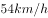行驶的汽车，成像不模糊的前提是底片上汽车的像移动的尺寸不大于0.1mm，已知底片上汽车长为2cm，实际汽车车身长3m，那么曝光时间至多为<u>        </u>秒。

- **A**. 

　✅
- **B**. 

- **C**. 

- **D**. 

**答案**：A

**官方解析**

汽车速度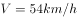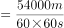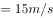。汽车的实际长度与成像之间的比例；则底片上汽车的像移动的尺寸不大于0.1mm，所对应的距离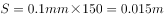。

故曝光的时间=。

故正确答案为A。

---

## 第 2 题　qid 2295446 · 逻辑判断

民用客机机舱的紧急出口气囊是一条连接地面的斜面，为安全考虑设计者要计算乘客着地时的速度和动能。乘客的质量各有不同，假设所有乘客与气囊的动摩擦因数相同，那么下面说法正确的是              。

- **A**. 质量越大下滑速度越大，动能也越大
- **B**. 质量越大下滑速度越大，但动能不一定大
- **C**. 下滑速度、动能与质量大小无关，速度和动能都一样大
- **D**. 下滑速度与质量大小无关所以一样大，但质量大的人动能较大　✅

**答案**：D

**官方解析**

做受力分析，气囊上的人受到竖直向下的重力，将重力沿着斜面方向和垂直于斜面方向分解，沿着斜面方向的分力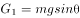，垂直于斜面方向的分力，因此给斜面的压力为，所以斜面能提供的动摩擦力为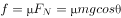。下滑时，斜面方向甲受到沿斜面向下的和沿斜面方向向上的，斜面方向合力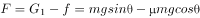，所以加速度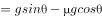。

由于所有乘客与气囊的动摩擦因数相同，所以加速度与质量无关，所有乘客下滑加速度相同，下滑速度相同。由此排除A、B两项。

由于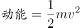，所以质量大的人动能较大。

故正确答案为D。

---

## 第 3 题　qid 2295480 · 逻辑判断

如图所示为铁路的输电线悬挂在钢缆上的方式。钢缆的A端固定在电杆上，B端通过滑轮组连接在电杆C上。配重D是n个混凝土圆盘，每个盘的质量是m。根据以上信息判断下列说法正确的是<u>          </u>。

- **A**. 
B处使用滑轮组是为了保证输电线的高度变化时钢缆始终保持张紧状态
　✅
- **B**. 
B处使用滑轮组是为了省力

- **C**. 
不考虑钢缆和滑轮质量，钢缆在B端受的拉力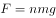

- **D**. 
不考虑钢缆和滑轮质量，钢缆在B端受的拉力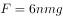

**答案**：A

**官方解析**

因每个混凝土圆盘的质量为，则配重D的重力。结合题干图形可知，滑轮B为动滑轮，与之相连的绳子段数是3。作用在钢缆自由端的拉力为配重D的重力。根据滑轮组省力公式可得，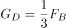。故作用在B端钢缆的拉力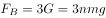。由此排除C、D两项。在B处使用滑轮组可以保证输电线在高度变化时，钢缆始终受到拉伸的作用力，故而保持张紧状态，A项满足。

故正确答案为A。

---

## 第 4 题　qid 2295488 · 类比推理

在某种核反应堆中，是靠熔化的钠来传递核燃烧产生的热量的。抽动液态钠的“泵”的传动部分不允许和钠接触，因此常使用一种称为“电磁泵”的机械。如图所示为这种泵的结构，N、S为磁铁的两极，C为在磁场中的耐热导管，熔融的钠从其中流过，v为钠的流动方向，要使钠液加速，加在导管中钠液的电流方向应为<u>           </u>。

- **A**. 由上流向下
- **B**. 由下流向上　✅
- **C**. 逆着v的方向
- **D**. 顺着v的方向

**答案**：B

**官方解析**

结合题干图形，钠的流动方向向内，要使钠液加速，需安培力向内，磁场方向由N至S向右。根据左手定则，电流方向应由下向上，B项满足。
故正确答案为B。

---

## 第 5 题　qid 2295491 · 逻辑判断

物理学家做了一个有趣的实验：在双缝干涉实验中，在光屏处放上照相底片，若减弱光流的强度，使光子只能一个一个地通过狭缝。实验表明，如果曝光时间不太长，底片上只能出现一些不规则的点；如果曝光时间足够长，底片上就会出现规则的干涉条纹。对这个实验结果的认识不正确的是           。

- **A**. 单个光子的运动没有确定的轨道
- **B**. 只有大量光子的行为才表现出波动性　✅
- **C**. 干涉条纹中明亮的部分是光子到达机会较多的地方
- **D**. 曝光时间不长时，光的能量小，底片上的条纹看不清楚，故出现不规则的点

**答案**：B

**官方解析**

光波是概率波，光子在空间传播时，没有经典意义的轨道，无法预测它在空间的确定位置，但光子在空间各点出现的概率，可以用波动规律来描述。单个光子的落点无法预测，所以曝光时间不太长，底片上只能出现一些不规则的点，但是到达亮条纹区域的概率会大于到达暗条纹区域的概率。如果曝光时间足够长，底片上就会出现规则的干涉条纹。
A项：单个光子在空间中的位置是不确定的，而且光子在空间运动轨迹也是不确定的，正确；
B项：波动性是光子固有的性质，与光子数量无关，错误；
C项：光子到达亮条纹的概率会大于到达暗条纹的概率，因而曝光时间足够长，光子到达的多的区域表现为亮条纹，而光子到达的少的区域表现为暗条纹，正确；
D项：曝光时间不太长时，底片上出现的光点密集度太低，明暗区分不明显，故出现不规则的点，正确。
本题为选非题，故正确答案为B。

---

## 第 6 题　qid 2295495 · 逻辑判断

如图所示，把碗放在大锅内的水中蒸食物，假设碗中的汤和水的沸点一样都是100℃，且碗中的汤吸收的热量全部来自于周围的水，则下列关于水和汤沸腾的说法正确的是<u>          </u>。

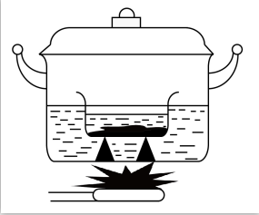

- **A**. 水和汤同时沸腾
- **B**. 水会沸腾，汤不会沸腾　✅
- **C**. 水先沸腾，汤后沸腾
- **D**. 汤先沸腾，水后沸腾

**答案**：B

**官方解析**

液体沸腾需要达到沸点且继续吸热。开始汤和水都会吸热升温，但当水达到沸点100℃时，继续吸热，沸腾起来，但温度不再升高；此时碗中的汤也会达到沸点100℃，但由于碗中的汤与大锅中水的温度相同，不能继续吸热，因而碗中的汤不会沸腾。
故正确答案为B。

---

## 第 7 题　qid 2295497 · 类比推理

某同学将轻质不可伸长的晾衣绳两端分别固定在竖直杆M、N上的a、b两点，将衣架挂在绳上晾晒衣物，衣架挂钩可视为光滑。晾晒一件短袖T恤时，衣架静止于如图位置。当晾晒一件厚滑雪衫时，该同学担心晾衣绳可能会断，为防止绳断，他应该      。

- **A**. 将绳的右端固定点b略向上移
- **B**. 将绳的右端固定点b略向下移
- **C**. 换一根略短的晾衣绳
- **D**. 换一根略长的晾衣绳　✅

**答案**：D

**官方解析**

如图所示，左右两个绳子关于竖直方向是对称的，与竖直方向夹角是相等的。设绳子的总长度为，两杆之间的距离为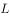，则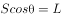。当绳子右端上移或者下移时，与均不变，则角度不变，左右两个绳子的合力与衣服的重力等大反向，因角度不变，所以绳子的拉力不变，A项与B项错误；

当换一根略短的晾衣绳，减小，因不变，则角度变小，左右两个绳子拉力的合力与衣服的重力等大反向，，，则绳子的拉力增大，绳子更容易断，C项错误；

当换一根略长的晾衣绳，变大，因不变，则角度变大，则绳子的拉力减小，可防止绳断，D项正确。

故正确答案为D。

---

## 第 8 题　qid 2295506 · 类比推理

考古学中用同位素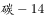测年法测量古生物的年代，每隔一定的时间质量减少为原来的一半。如果以表示的质量，表示时间，的初始质量为，那么的质量随时间的变化规律是下面的<u>      </u>图。

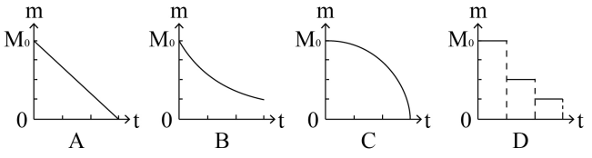

- **A**. A
- **B**. B　✅
- **C**. C
- **D**. D

**答案**：B

**官方解析**

若每隔时间衰减为原来的一半，则衰减规律满足 。随着的增长，越来越小，且变化越来越慢，结合选项，B项较为符合。

故正确答案为B。

---

## 第 9 题　qid 2295510 · 逻辑判断

已知电磁波遇到平滑的金属表面会像光遇到平面镜一样发生反射，反射过程中也遵循光的反射定律。如图所示，三块相互垂直的正方形薄金属平板可以组成最基本的角反射器。下面关于角反射器的特点和用途，说法不符合实际的是<u>                </u>。

- **A**. 角反射器会把电磁波沿着入射方向平行的直线反射回去
- **B**. 角反射器可用来精确地测距
- **C**. 角反射器会把电磁波沿各个不同方向反射回去　✅
- **D**. 救生艇悬挂角反射器是为让雷达能够尽快发现救生艇

**答案**：C

**官方解析**

由于角反射器的特点，无论电磁波从哪个角度射向角反射器，反射波最终都会沿与入射方向平行的直线返回，并不会沿各个不同方向反射回去。角反射器主要应用在测距、警示、军事、船舶遇险救生等领域。
本题为选非题，故正确答案为C。

---

## 第 10 题　qid 2295512 · 类比推理

半潜船是专门从事运输大型海上石油钻井平台、大型舰船、潜艇等超长超重而又无法分割吊运的超大型设备的船舶。其工作流程分列如下：①将货物移到装货甲板上；②开启压载水舱的通海阀门，注入适量水；③启动大型空压机往压载水舱注入适量空气；④船舶实现上浮；⑤将货物运走。则下面排序正确的是      。

- **A**. ①②③④⑤
- **B**. ②①③④⑤　✅
- **C**. ②④①③⑤
- **D**. ③①②④⑤

**答案**：B

**官方解析**

半潜船也称半潜式母船，它通过本身压载水的调整，把装货甲板潜入水中，以便将所要承运的货物浮入半潜船的装货甲板上，将货物运到指定位置。因此工作流程如下：需要先开启压载水舱的阀门，注入海水使装货甲板潜入水中。随后将货物拖拽到已经潜入水下的装货甲板上方。然后将压载水舱注入空气，半潜船身压载水舱的压载水排出船体，使船体上浮，最后将货物运走。
故正确答案为B。

---

## 第 11 题　qid 2295514 · 逻辑判断

如图是常见的剪式千斤顶，当摇动把手时，螺纹轴就能迫使千斤顶的两臂靠拢，从而将物体顶起。若千斤顶两臂间的初始夹角为，物体重量保持不变，则下列关于两臂受到的压力大小说法正确的是<u>      </u>。

- **A**. 
两臂受到的压力随夹角的减小而减小，且一定小于物体的重力
　✅
- **B**. 
两臂受到的压力随夹角的减小先减小后增大，且在时压力最小

- **C**. 
两臂受到的压力随夹角的减小而增大，但不可能大于物体的重力

- **D**. 
两臂受到的压力随夹角的减小先增大后减小，最大值不会超过物体的重力

**答案**：A

**官方解析**

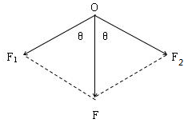

物体压在千斤顶上，物体对千斤顶的压力F大小与物体重力大小相等。将物体对千斤顶的压力F分解沿两臂的两个分力、。受力分析如图所示，根据对称性可知，两臂受到的压力大小相等，即。由得：。当夹角为时，。分析可知，不变，当逐渐减小时，逐渐增大，逐渐减小；当减少到时最小为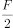。因此随着夹角减少，两臂受到的压力也减少，且一定小于物体的重力，A项正确。

故正确答案为A。

---

## 第 12 题　qid 2295516 · 图形推理

下列选项中，符合所给图形的变化规律的是<u>      </u>。

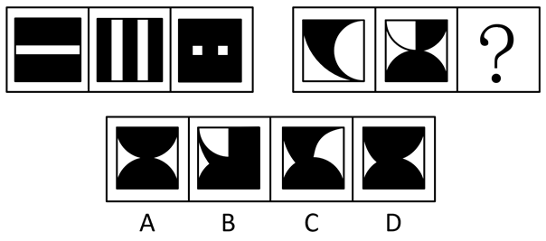

- **A**. A
- **B**. B
- **C**. C
- **D**. D　✅

**答案**：D

**官方解析**

元素组成相似，优先考虑样式规律。图形轮廓相同，里面颜色不同，考虑黑白运算，观察第一组图形，可知：，，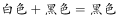，，故第一组图的规律为前两图形只有白色部分相加在图3是白色，而其他颜色相加在图3中是黑色，第二组图形应用规律，图1和图2相同位置的白色部分在“？”处保持白色，其他地方均变为黑色，只有D项符合。

故正确答案为D。

---

## 第 13 题　qid 2295519 · 图形推理

把下列图形分成两类，分类正确的是<u>      </u>。

- **A**. ①②④；③⑤⑥
- **B**. ①③⑤；②④⑥
- **C**. ①②⑥；③④⑤　✅
- **D**. ①②③；④⑤⑥

**答案**：C

**官方解析**

本题为分组分类题目。观察题干图形，每根线段的两端均连接了小元素，观察发现，图①②⑥中线段的两端连接了不同的小元素，图③④⑤中线段的两端连接的是相同的小元素。故①②⑥一组，③④⑤一组。
故正确答案为C。

---

## 第 14 题　qid 2295520 · 图形推理

下列选项中，符合所给图形的变化规律的是<u>      </u>。

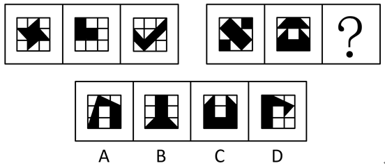

- **A**. A
- **B**. B
- **C**. C　✅
- **D**. D

**答案**：C

**官方解析**

观察题干图形，每幅图形均为九宫格，且存在黑色区域。观察发现，第一组图中，每幅图形中的黑色区域均占3个格子；第二组图中，前两幅图黑色区域均占6个格子，故？处图形黑色区域应占6个格子，只有C项符合。
故正确答案为C。

---

## 第 15 题　qid 2295523 · 图形推理

下列选项中，符合所给图形的变化规律的是<u>      </u>。

- **A**. A
- **B**. B
- **C**. C　✅
- **D**. D

**答案**：C

**官方解析**

元素组成相似，优先考虑样式规律。九宫格优先横向看，发现第一行图形中第二个图形由第一个图形左右翻转后，叠加到第一个图形左边所得，第三个图形由第一个图形旋转180°后，叠加到第一个图形右边所得。验证第二行图形，符合此规律。因此，第三行图形应用此规律，？处的图形应由第一个图形旋转180°后，叠加到第一个图形右边，只有C项满足要求。
故正确答案为C。

---

## 第 16 题　qid 2295525 · 图形推理

下列选项中，符合所给图形的变化规律的是<u>      </u>。

- **A**. A
- **B**. B
- **C**. C
- **D**. D　✅

**答案**：D

**官方解析**

每一幅图形均由直线、黑圆和白圆组成，考虑三种元素之间的关系，在第一组图形中每一条线上均有2个黑圆，一个白圆，且两个黑圆之间均有一个白圆，第二组应符合此规律，前两幅图形中均有两个黑圆与一个白圆连接，且两个黑圆中间没有白圆间隔，观察选项只有D项符合要求。
故正确答案为D。

---

## 第 17 题　qid 2295528 · 图形推理

下列选项中，符合所给图形的变化规律的是<u>      </u>。

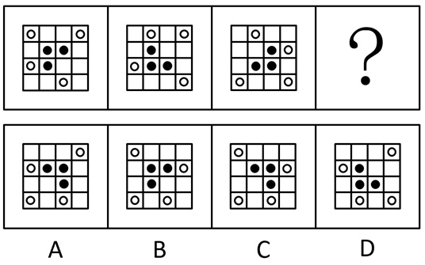

- **A**. A
- **B**. B
- **C**. C　✅
- **D**. D

**答案**：C

**官方解析**

元素组成相同，优先考虑位置规律。观察发现黑圆均在内圈移动，白圆均在外圈移动，考虑内外圈分开看，首先观察内圈，发现黑圆每次逆时针移动1格，因此？处图形中内圈左下角应为空白格，排除B、D选项。继续观察外圈，发现白圆每次顺时针移动3格，因此？处外圈左上角应有一个白圆，排除A选项。
故正确答案为C。

---

## 第 18 题　qid 2295531 · 图形推理

下列选项中，与所给图形规律相同的是<u>      </u>。

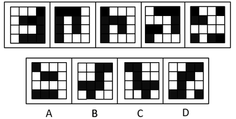

- **A**. A　✅
- **B**. B
- **C**. C
- **D**. D

**答案**：A

**官方解析**

黑块数量不一致，元素组成相似，优先考虑样式规律，但黑白运算无规律。继续观察发现，题干中白色方块全部都连在一起，即白色方块均为一部分。A项白色方块为一部分，B项为三部分，C项为三部分，D项为两部分，只有A项符合。
故正确答案为A。

---

## 第 19 题　qid 2295533 · 图形推理

下列选项中，符合所给图形的变化规律的是<u>      </u>。

- **A**. A
- **B**. B
- **C**. C
- **D**. D　✅

**答案**：D

**官方解析**

元素组成相似，优先考虑样式规律。观察发现，每个图形均可分为上、中、下三部分。第一横行中，上面部分出现左边三角形、右边三角形、大三角形，中间部分出现朝左半圆、朝右半圆、整圆，下面部分出现空白圆、内含一条竖线、两条竖线的圆；经验证，第二横行满足此规律；故第三横行应用此规律，？处应上面部分应为大三角形、中间部分为朝右半圆、下面部分为一条竖线的圆，只有D项符合。
故正确答案为D。

---

## 第 20 题　qid 2295535 · 图形推理

下列选项中，符合所给图形的变化规律的是<u>      </u>。

- **A**. A
- **B**. B
- **C**. C　✅
- **D**. D

**答案**：C

**官方解析**

解法一：元素组成不同，优先考虑属性规律。图形整体比较规整，优先考虑对称性。观察可知，题干图形对称轴的数量依次为4、3、2、？、0，故问号处应填入有1条对称轴的轴对称图形，只有C项符合。
故正确答案为C。
解法二：观察发现题干图形出现了单一曲线和圆，考虑数曲线。题干曲线数量分别是1、3、5、？、1。故根据数字对称的规律，问号处应选择有3条曲线的图形，只有B项符合。
故正确答案为B。
注：本题有两种解法，出题不严谨，但粉笔倾向于解法一。因为数字对称的规律近几年公考题目中几乎没有出现，说明不是命题人想考查的方向，而对称轴的数量却呈现了依次递减的规律，这比数字对称的规律更加严谨、更加符合最新的出题趋势。

---

## 第 21 题　qid 2295543 · 图形推理

下列选项中，能组合成一个立方体方块的是<u>      </u>。

- **A**. 1、2、3
- **B**. 2、3、4
- **C**. 1、3、4　✅
- **D**. 2、3、5

**答案**：C

**官方解析**

题干要求组成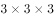立方体方块，故小方块总数应该是27块。图1是9块，图2是7块，图3是12块，图4是6块，图5是8块，排除A、B两项；剩余C、D两项，都有图3，立方体每层有9块，图3已满足一层是9块，另一层有3块，故另外两图应满足某一层相加有6块。图2和图5均无法满足某一层相加有6块，而图1上层与图4下层相加为6块，即图1、3、4可组合成立方体方块（如下图所示）。

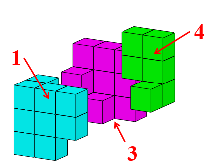

故正确答案为C。

---

## 第 22 题　qid 2295570 · 图形推理

右边选项中，不能由展开图折叠而成的是<u>      </u>。

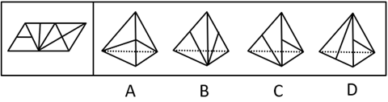

- **A**. A
- **B**. B
- **C**. C
- **D**. D　✅

**答案**：D

**官方解析**

将题干展开图标号如下图：

A项：由面c和面d组成，选项与题干一致，排除；

B项：由面b和面c组成，选项与题干一致，排除；

C项：由面b和面d组成，选项与题干一致，排除；

D项：如上图，题干中面b和面c中竖线交于黄色公共点，选项和题干不一致，故该项不是面b和面c；题干中面c和面d中竖线交于绿色公共点，选项和题干不一致，故该项不是面c和面d；所以该项只能是面b和面d。由于四面体中，构成直线的是同一条边，所以题干中标蓝色的为同一条边。又因为题干面b中竖线交于蓝色公共边，而选项中右侧面有竖线交于公共边，所以选项右侧面为面b，而左侧面为面d。

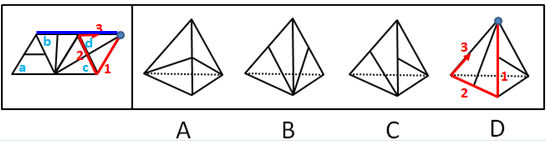

对面d进行画边，如上图所示，题干中边3对应的是面b，选项中边1对应的是面b，选项与题干不一致，当选。

本题为选非题，故正确答案为D。

---

## 第 23 题　qid 2295572 · 图形推理

下列选项中，符合所给图形的变化规律的是<u>      </u>。

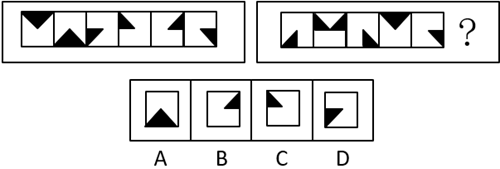

- **A**. A
- **B**. B
- **C**. C
- **D**. D　✅

**答案**：D

**官方解析**

观察发现，第一组图中，将所有位置的小黑三角形拼在一起，可以得到一个完整的黑色正方形；第二组图应用规律，故？处应左下角区域有一个小黑三角形，只有D项符合。
故正确答案为D。

---

## 第 24 题　qid 2295274 · 逻辑判断

小王和小李现在是经济系二年级的学生。在根据一年级的课程总成绩来评定奖学金时，已知他们两人的经济学原理成绩相同，而英语、高等数学等其他六门课的成绩则互有高低。最终小王获得了奖学金。
下列      项如果为真，能够判断出小王的总成绩比小李的要高。

- **A**. 小王的最高分比小李的最高分要高
- **B**. 小王的最低分是高等数学，而小李的最低分是英语
- **C**. 小王的最低分比小李的平均成绩要高　✅
- **D**. 小王的最低分比小李的最低分要高出许多

**答案**：C

**官方解析**

第一步：找出论点和论据。
论点：小王的总成绩比小李的要高。
论据：根据一年级的课程总成绩来评定奖学金时，已知他们两人的经济学原理成绩相同，而英语、高等数学等其他六门课的成绩则互有高低。
第二步：逐一分析选项。
A项：该项只是对最高分进行了比较，而最高分不能决定六门课总成绩，排除；
B项：该项只是对最低分进行了说明，而最低分不能决定六门课总成绩，排除；
C项：小王的最低分比小李的平均分高，那么小王的平均分一定比小李的高，即小王的总成绩更高，可以得出结论，当选；
D项：该项只是对最低分进行了比较，而最低分不能决定六门课总成绩，排除。
故正确答案为C。

---

## 第 25 题　qid 2295276 · 逻辑判断

对所有的静脉血标本进行检测，没有发现阳性HIV抗体。
如果上述断定为假，则下列      项一定为真。

- **A**. 要发现阳性HIV抗体，必须对所有静脉血标本进行检测
- **B**. 对所有静脉血标本进行检测，未必能发现阳性HIV抗体
- **C**. 部分静脉血标本尚未进行检测，或者已经发现了阳性HIV抗体　✅
- **D**. 部分静脉血标本尚未进行检测，但是已经发现了阳性HIV抗体

**答案**：C

**官方解析**

第一步：分析题干条件。

对所有静脉血标本检测 且 发现现阳性HIV抗体。

已知题干为假，那么其矛盾命题：（对所有静脉血标本检测 且 发现了阳性HIV抗体）一定为真，即：有的静脉血标本没有检测 或 发现了阳性HIV抗体。

第二步：逐一分析选项。

A项：翻译为发现阳性HIV抗体所有静脉血标本检测，是对题干矛盾命题“或”关系的肯定，无法得出确定性结论，排除；

B项：翻译为对所有静脉血标本检测未必发现阳性HIV抗体，是对题干矛盾命题“或”关系的否定，根据“否一推一”可知，一定发现了阳性HIV抗体，与题干不一致，排除；

C项：翻译为有的静脉血标本没有检测 或 发现了阳性HIV抗体，与题干的矛盾命题一致，一定为真，当选；

D项：翻译为有的静脉血标本没有检测 且 发现了阳性HIV抗体，题干矛盾命题为“或”关系而不是“且”关系，排除。

故正确答案为C。

---

## 第 26 题　qid 2295277 · 逻辑判断

研究人员通过对某国500名儿童进行跟踪研究发现，人类大脑成长最快的时期是在出生后三个月内，大脑的尺寸可以达到成人的一半以上。
下列      项的答案最能评价上述结论的正确性。

- **A**. 500名儿童中有没有人的大脑是在出生三个月后才快速生长的？
- **B**. 有没有对其他国家的儿童进行跟踪研究？　✅
- **C**. 儿童的大脑功能和成人是不是一样？
- **D**. 男童和女童的大脑成长速度是否一样？

**答案**：B

**官方解析**

第一步：找出论点和论据。
论点：人类大脑成长最快的时期是在出生后三个月内，大脑的尺寸可以达到成人的一半以上。
论据：研究人员对某国500名儿童进行跟踪研究。
第二步：逐一分析选项。
A项：如果仅有个别儿童的大脑是在出生三个月后才快速生长的，不会对实验的结论造成影响，因此不能评价上述结论的正确性，排除；
B项：该项说明仅对一个国家儿童进行了研究不具有代表性，也应对其他国家儿童进行研究才能确保结论的正确性，因此可以对题干的结论做出评价，当选；  
C项：该项讨论的是儿童和成人的大脑功能，与题干讨论的大脑成长速度无关，是无关项，因此不能评价上述结论的正确性，排除；
D项：该项讨论的是男童和女童的大脑成长速度是否一样，与题干讨论的人类大脑成长最快的时期无关，是无关项，因此不能评价上述结论的正确性，排除。
故正确答案为B。

---

## 第 27 题　qid 2295280 · 逻辑判断

当今社会，二维码支付方式在餐饮门店、超市、便利店等线下小额支付场景中得到了广泛的应用。但在条码生成机制和传输过程中仍存在风险隐患，也引发了不少涉及支付安全风险的案件。
下列      项能够对题干中的结论起到解释的作用。

- **A**. 静态条码容易被篡改或变造，容易携带木马或病毒　✅
- **B**. 线下扫码支付为用户带来了便捷的消费体验
- **C**. 商家利用线下扫码支付可以帮助自身提高经营收益
- **D**. 采用先进的令牌技术进行变异处理后，可以保护真实卡号信息

**答案**：A

**官方解析**

第一步：找出题干结论。
 “在条码生成机制和传输过程中仍存在风险隐患，引发了不少涉及支付安全风险的案件。”
第二步：逐一分析选项。
A项：该项解释了二维码支付隐患是由于静态条码容易被篡改或变造，容易携带木马或病毒，可以解释题干结论，当选；
B项：该项讨论的是线下扫码支付为用户带来了便捷的消费体验，题干讨论的是二维码支付会带来安全隐患，讨论话题不一致，不能解释题干结论，排除；
C项：该项讨论的是商家利用线下扫码支付可以帮助自身提高经营收益，题干讨论的是二维码支付会带来安全隐患，讨论话题不一致，不能解释题干结论，排除；
D项：该项讨论的是提高移动支付安全性的方法，不能解释为什么存在风险隐患，不能解释题干结论，排除。
故正确答案为A。

---

## 第 28 题　qid 2295282 · 逻辑判断

爱因斯坦对人类最大的贡献就是相对论的提出，它是人类研究宇宙强有力的工具。爱因斯坦通过相对论进行过宇宙质量的计算，结果发现宇宙的质量总和竟然为零。爱因斯坦认为，宇宙在大爆炸后产生的物质有正反两种形式，反物质和正物质完全相反，而且正、反物质质量相等。但科学家在宇宙中只发现了很小量的反物质，那大部分的反物质去哪里了？如果它们不存在于宇宙中，爱因斯坦通过相对论的计算也不会发现宇宙质量总和为零。但是宇宙的质量为零，这说明反物质应该还是存在于宇宙当中。
下列      项是以上论述所假设的前提。

- **A**. 只存在一个宇宙
- **B**. 爱因斯坦通过相对论的计算是正确的　✅
- **C**. 人类如果不能利用反物质的巨大能量，就不能进行星际探索
- **D**. 科学家在实验室中发现了反物质，而且现在也可以在实验室制造一部分反物质

**答案**：B

**官方解析**

第一步：找出论点和论据。
论点：大部分的反物质应该还是存在于宇宙当中。
论据：爱因斯坦通过相对论进行过宇宙质量的计算，结果发现宇宙的质量总和竟然为零。爱因斯坦认为，宇宙在大爆炸后产生的物质有正反两种形式，反物质和正物质完全相反，而且正、反物质质量相等。但科学家在宇宙中只发现了很小量的反物质。
第二步：逐一分析选项。
A项：该项说的是宇宙的数量，与论点说的大部分的反物质是否存在于宇宙中无关，是无关项，排除；
B项：只有爱因斯坦相对论的计算是正确的，才能通过宇宙的质量总和为零，得知反物质应大量存在，是结论成立的必要条件，当选；
C项：该项说的是反物质能力的作用与应用，与论点说的大部分的反物质是否存在于宇宙中无关，是无关项，排除；
D项：科学家可以在实验室发现、制造出反物质，说明反物质是存在的，但无法证明宇宙中是否存在大部分的反物质，无法加强，排除。
故正确答案为B。

---

## 第 29 题　qid 2295284 · 逻辑判断

人们向火星发射了诸多探测器，以期探寻火星是否存在生命。在探测区域发现火星表面是含大量硫酸盐的酸性土壤，这预示着火星上存在火山活动。另外探测数据表明火星土样还显示出高氯酸盐的迹象，高氯酸盐是一种可担当火星微生物的能量源的化合物；同时在火星表面还发现一个奇怪迹象——还原铁，该迹象表明火星表面曾存在生命。
下列      项如果为真，最能质疑以上论述。

- **A**. 在地球上，还原铁一般是通过微生物形成的
- **B**. 火山爆发喷发出硫，硫燃烧生成二氧化硫，二氧化硫遇水形成亚硫酸，亚硫酸氧化成硫酸，硫酸和金属反应，生成硫酸盐
- **C**. 探索发现，在火星表面不存在液态水
- **D**. 行星上的铁和撞击它的彗星所携带的有机碳发生化学反应可产生还原铁　✅

**答案**：D

**官方解析**

第一步：找出论点和论据。
论点：火星表面曾存在生命。
论据：探测器发现火星表面是含大量硫酸盐的酸性土壤，火星土样还显示出高氯酸盐的迹象，而高氯酸盐是一种可担当火星微生物的能量源的化合物，同时在火星表面还发现了还原铁。
论点讨论的是“火星”和“生命”的关系，论据讨论的是“火星”和“硫酸盐”、“高氯酸盐”、“还原铁”的关系，论点论据话题不一致，削弱优先考虑拆桥，即拆断“硫酸盐”、“高氯酸盐”、“还原铁”和“生命”之间的联系。
第二步：逐一分析选项。
A项：选项指出地球上的还原铁和生命有关系，而题干是通过还原铁证明火星上有生命，无法削弱，排除；
B项：火山爆发喷发出硫，通过一系列反应生成硫酸盐，说明硫酸盐确实与火山活动之间有联系，是加强项，无法削弱，排除；
C项：火星表面不存在液态水，题干未提及液态水，是无关项，无法削弱，排除；
D项：行星上的铁和撞击它的彗星所携带的有机碳发生化学反应可产生还原铁，说明还原铁的出现与存在生命之间不一定存在必然联系，是拆桥项，可以削弱，当选。
故正确答案为D。

---

## 第 30 题　qid 2295285 · 逻辑判断

工厂对技术工人的学历情况进行了调查，发现过去五年间新进厂的技术工人学历层次有大幅度提高。因此，工厂技术工人的素质整体有较大提升。
如果上述情况属实，下列      项无法对结论起到支持。

- **A**. 过去五年间的新进厂的技术工人现在仍在工厂上班
- **B**. 素质高的技术工人生产的产品较少出现不合格的情况　✅
- **C**. 学历越高的人，素质也越高
- **D**. 学历高的人会带动其他同事提高素质

**答案**：B

**官方解析**

第一步：找出论点和论据。
论点：工厂技术工人的素质整体有较大提升。
论据：过去五年间新进厂的技术工人学历层次有大幅度提高。
本题的论点是说工厂技术工人的素质有提高，而论据说的是近5年间新进厂技术工人的学历有提高，论点关键词是“技术工人的素质”，论据关键词是“技术工人的学历”，论点与论据话题不一致，因此这道题既可以考查加强论点与论据之间的关系，又可以考查补充新的论据。
第二步：逐一分析选项。
A项：题干论据表明过去五年新进厂的技术工人学历有大幅提高，而选项又补充了现在这些新技术工人仍然在工厂上班，这就补充了新论据，说明现在工厂技术工人的学历仍然是高的，可以加强论据，排除；
B项：技术工人素质高使得产品较少出现不合格的情况，与题干论点现有工人素质是否提升无关，属于无关选项，无法加强，当选；
C项：选项将论据中的“技术工人的学历高”与论点中的“技术工人的素质高”建立联系，属于搭桥，可以加强，排除； 
D项：选项可以说明随着近5年间学历高的技术工人来到工厂，他们会带动身边其他同事整体素质会提升，进而使得整个工厂技术工人的素质提高，在论据与论点之间建立联系，属于搭桥，可以加强，排除。
本题为选非题，故正确答案为B。

---

## 第 31 题　qid 2295290 · 逻辑判断

研究人员研究了来自110万人的DNA，得出了一个评分系统。利用该系统可以通过检测某人的DNA来大致预测某人的受教育程度。结果发现，那些基因得分最低的人只有的机会从大学毕业；相比之下，那些基因得分在前五分之一的人，有的机会从大学毕业。这是有史以来最大规模的人类认知遗传学研究。有些人据此以为，人类的基因与学历之间有极大联系。

下列<u>      </u>项如果为真，最能质疑这些人的观点。

- **A**. 
在110万被研究者中，抽样显示，只有不到的人是大学毕业的

- **B**. 
在大学毕业的被研究者中，其父母之一是大学毕业的超过

- **C**. 
在110万被研究者中，有超过的人是大学毕业的
　✅
- **D**. 
基因得分最居中的人，也有的机会从大学毕业

**答案**：C

**官方解析**

第一步：找出论点和论据。

论点：人类的基因与学历之间有极大联系。

论据：基因得分最低的人只有的机会从大学毕业；基因得分在前五分之一的人，有的机会从大学毕业。

第二步：逐一分析选项。

A项：110万被研究者中只有不到的人是大学毕业的，此时前五分之一确实高于平均水平，得分最低的确实低于平均水平，补充论据支持题干论点，可以加强，排除；

B项：被研究者们的父母与该研究无关，属于无关选项，不能削弱，排除；

C项：110万被研究者中有超过的人是大学毕业的，说明所选的研究样本中，绝大部分人都有高学历，否定了题干论点基因得分在前五分之一的人，有的机会从大学毕业，削弱了题干观点，可以削弱，当选；

D项：基因得分最居中的人也有的机会从大学毕业的，此时前五分之一确实高于居中水平，得分最低的确实低于居中水平，说明基因与学历有关系，补充论据支持题干论点，可以加强，排除。

故正确答案为C。

---

## 第 32 题　qid 2295291 · 类比推理

某科技企业新选举出7名工会委员，有1位是沈阳人，2位是北方人，1位是广州人，2位是体育爱好者，3位是党委委员。
假如上述介绍涉及了该企业工会的所有委员，那么下列关于该企业工会委员的判断都与题干不矛盾，除了      项。

- **A**. 2位体育爱好者都是党委委员　✅
- **B**. 党委委员不都是南方人
- **C**. 体育爱好者都是南方人
- **D**. 沈阳人是体育爱好者

**答案**：A

**官方解析**

第一步：分析题干。
共有7名工会委员，有1位是沈阳人，2位是北方人，1位是广州人，2位是体育爱好者，3位是党委委员，且上述介绍涉及了该企业工会的所有委员。其中，沈阳人属于北方人二者为种属关系，“故2位是北方人，1位是广州人，2位是体育爱好者，3位是党委委员”包含了该企业工会的所有委员，以此条件验证各个选项。
第二步：根据题干条件分析选项。
A项：如果2位体育爱好者都是党委委员，二者为种属关系，则“2位是北方人，1位是广州人，3位是党委委员”包含了该企业工会的所有委员，但此时委员人数最多为6人，与题干矛盾，当选；
B项：如果党委委员不都是南方人，说明3位党委委员中至少有1人不是南方人，则“2位是北方人，1位是广州人，2位是体育爱好者，2位是党委委员或1位是党委委员者”包含了该企业工会的所有委员，最多可以是7人，与题干没有矛盾，排除；
C项：如果体育爱好者都是南方人，则“2位是北方人，1位是广州人，2位是体育爱好者，3位是党委委员”包含了该企业工会的所有委员，最多可以是8人，与题干没有矛盾，排除；
D项：如果沈阳人是体育爱好者，则“2位是北方人，1位是广州人，2位是体育爱好者，3位是党委委员”包含了该企业工会的所有委员，其中沈阳人即是北方人又是体育爱好者，最多可以是7人，与题干没有矛盾，排除。
本题为选非题，故正确答案为A。

---

## 第 33 题　qid 2295293 · 类比推理

在某次国际会议上，每国有1-2名代表参会，参会代表没有多重国籍的人。其中，甲、乙、丙和丁四人分别来自英国、德国和美国3个国家。已知：
（1）甲、乙至少有1人来自英国；
（2）乙、丙至少有1人来自德国。
如果甲、丙、丁至少有2人来自英美两国，则下列      项是不可能的。

- **A**. 甲来自德国　✅
- **B**. 乙来自德国
- **C**. 丙来自英国
- **D**. 丁来自英国

**答案**：A

**官方解析**

第一步：分析题干。
根据题干信息已知，甲、乙、丙和丁四人分别来自英国、德国和美国3个国家，且没有多重国籍。
①甲、乙至少有1人来自英国；
②乙、丙至少有1人来自德国。
③甲、丙、丁至少有2人来自英美两国。
第二步：逐一分析选项。 
A项：假如甲来自德国，根据①②那么乙来自英国，丙来自德国。那么题干甲、丙、丁至少有2人来自英美两国不成立，所以甲不可能来自德国，当选；
B项：假如乙来自德国，根据①那么甲来自英国，丙丁的国籍不确定，题干甲、丙、丁至少有2人来自英美两国可能成立，排除；
C项：假设丙来自英国，根据①②那么乙来自德国，甲来自英国。丁来自美国，题干甲、丙、丁至少有2人来自英美两国可能成立，排除；
D项：假设丁来自英国，根据③可知甲、丙至少一人来自美国，与条件①②不矛盾，排除。
本题为选非题，故正确答案为A。

---

## 第 34 题　qid 2295297 · 类比推理

G镇A小区内老王家出现了不少飞蛾，除非小区里业主家出现了飞蛾，否则小区不能向居委会申请除蛾的药剂。G镇B小区可以向居委会申请除蛾的药剂。
如果上述断定为真，则下列      项不能断定真假。
ⅠA小区有的业主家中没有发现飞蛾。
ⅡA小区可以申请除蛾的药剂。
ⅢB小区的业主家均出现了飞蛾。

- **A**. 只有Ⅰ
- **B**. 只有Ⅱ
- **C**. 只有Ⅰ和Ⅲ
- **D**. Ⅰ、Ⅱ和Ⅲ　✅

**答案**：D

**官方解析**

第一步：分析题干。

①G镇A小区内老王家出现了不少飞蛾；

②小区能向居委会申请除蛾的药剂小区里业主家出现了飞蛾；

③G镇B小区可以向居委会申请除蛾的药剂；

第二步：逐一分析选项。

Ⅰ：已知A小区内老王家出现了不少飞蛾，只能说明A小区有的业主家中发现飞蛾，不能推出ⅠA小区有的业主家中没有发现飞蛾，即Ⅰ项无法判断真假；

Ⅱ：已知A小区内老王家出现了不少飞蛾，为②的肯后不能推出确定性结论，即Ⅱ项无法判断真假；

Ⅲ：G镇B小区可以向居委会申请除蛾的药剂，根据②可以推出B小区里业主家出现了飞蛾。但不能推出B小区的业务家均出现了飞蛾，即Ⅲ项无法判断真假。

综上所述Ⅰ、Ⅱ、Ⅲ均无法判断真假。

本题为选非题，故正确答案为D。

---

## 第 35 题　qid 2295298 · 类比推理

青少年高校科学营旨在充分利用重点大学的科技教育资源，激发青少年对科学的兴趣，培养青少年的科学精神、创新意识和实践能力。班主任鼓励甲、乙、丙、丁四位同学报名参加暑假举行的科学营。几天后班主任向这四位同学询问录取的情况，他们的回答如下：
甲：乙被科学营录取了。
乙：丙被科学营录取了。
丙：甲或者乙被科学营录取了。
丁：乙或丙被科学营录取了。
经过班主任调查，发现只有一位同学的回答与事实相符。
根据以上陈述，下列      项为假。

- **A**. 丙说的是真话
- **B**. 乙没有被科学营录取
- **C**. 被科学营录取的不是甲　✅
- **D**. 丁说的是假话

**答案**：C

**官方解析**

本题为真假推理题。
第一步：分析题干。
甲：乙被录取。
乙：丙被录取。
丙：甲或乙被录取。
丁：乙或丙被录取。
四人的陈述没有明显的矛盾关系。分析发现，若甲陈述为真，则丙和丁都为真；若乙陈述为真，则丁也为真。但四人中只有一人回答与事实相符，则甲和乙陈述为假，即乙和丙都没有被录取。乙且丙均没有被录取，故丁陈述也为假，因有一人陈述为真，故陈述为真者是丙，即甲或乙被录取，而乙没有被录取，则可知甲一定被录取。
第二步：逐一分析选项。
A项：根据分析可知，丙陈述为真，选项正确，排除；
B项：根据分析可知，乙没有被录取，选项正确，排除；
C项：根据分析可知，甲一定被录取，选项错误，当选；
D项：根据分析可知，丁陈述为假，选项正确，排除。
本题为选非题，故正确答案为C。

---
