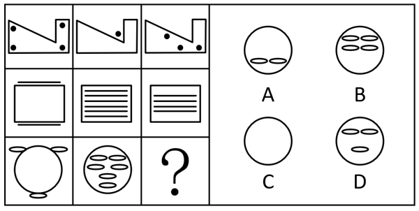
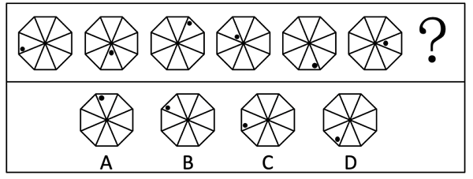
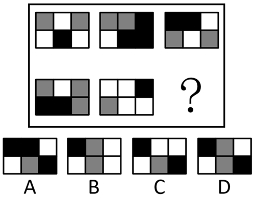
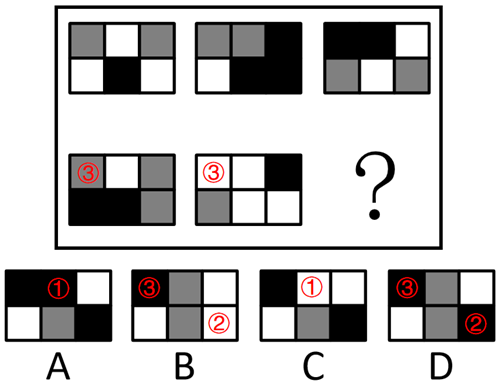

# 2019年上海市行政执法类考试《行测》试题（网友回忆版）

> 判断推理 · 24 题 · 上海 2019

## 第 1 题　qid 5665406 · 定义判断

无罪推定，是指任何人在未经依法判决有罪之前，应视其无罪。此外无罪推定还包括：被告人不负有证明自己无罪的义务，被告人提供证明有利于自己的证据的行为是行使辩护权的行为，不能因为被告人没有或不能证明自己无罪而认定被告人有罪。
根据上述定义，下列不涉及无罪推定的是        。

- **A**. 某犯罪嫌疑人无法提供不在场证明，因此司法机关采取了“疑罪从轻”的做法　✅
- **B**. 只有被告人供述，没有其他证据的，不能认定被告人有罪和处以刑罚
- **C**. 错放一千个坏人，也不能冤枉一个好人
- **D**. 未经人民法院判决，对任何人都不得确定有罪

**答案**：A

**官方解析**

第一步：找出定义关键词。
“任何人在未经依法判决有罪之前，应视其无罪”、“不能因为被告人没有或不能证明自己无罪而认定被告人有罪”。
第二步：逐一分析选项。
A项：犯罪嫌疑人无法提供不在场证明，司法机关采取了“疑罪从轻”的做法，其中“疑罪从轻”是指当证据不足以证明被告人构成犯罪时，给被告人定一个轻罪或者从轻处罚，即司法机关认为犯罪嫌疑人无法证明自己无罪从而给其定一个轻罪或者从轻处罚，不符合“不能因为被告人没有或不能证明自己无罪而认定被告人有罪”，不符合定义，当选；
B项：只有被告人供述，没有其他证据的，不能认定被告人有罪和处以刑罚，符合“任何人在未经依法判决有罪之前，应视其无罪”，符合定义，排除；
C项：错放一千个坏人，也不能冤枉一个好人，说明在不能判定是否有罪的情况下，应该认定被告人“无罪”，符合“任何人在未经依法判决有罪之前，应视其无罪”，符合定义，排除；
D项：未经人民法院判决，对任何人都不得确定有罪，符合“任何人在未经依法判决有罪之前，应视其无罪”，符合定义，排除。
本题为选非题，故正确答案为A。

---

## 第 2 题　qid 5665408 · 定义判断

德尔菲法即釆用匿名发表意见的方式，团队成员之间不发生横向联系，只通过反复地填写问卷。调查人员集结问卷填写人的共识及搜集各方意见。使预测意见趋于集中，最后做出预测结论。
根据上述定义，下列属于德尔菲法的是        。

- **A**. 公司中层管理人员在决定某重要事务前开了个碰头会
- **B**. 团队成员就产品命名开展了一次头脑风暴
- **C**. 政府就某一项目的立项召开了专家论证会
- **D**. 调查人员通过电子邮件与不同的专家单独联系，反复征询后汇总专家意见　✅

**答案**：D

**官方解析**

第一步：找出定义关键词。
“团队成员之间不发生横向联系，只通过反复地填写问卷”、“调查人员集结问卷填写人的共识及搜集各方意见”。
第二步：逐一分析选项。
A项：公司中层管理人员在决定某重要事务前开了个碰头会，说明在碰头会中公司中层管理人员彼此之间会发生横向联系，不符合“团队成员之间不发生横向联系，只通过反复地填写问卷”，不符合定义，排除；
B项：团队成员就产品命名开展了一次头脑风暴，说明团队成员之间会发生横向联系，不符合“团队成员之间不发生横向联系，只通过反复地填写问卷”，不符合定义，排除；
C项：政府就某一项目的立项召开了专家论证会，说明专家之间在论证会上会发生横向联系，不符合“团队成员之间不发生横向联系，只通过反复地填写问卷”，不符合定义，排除；
D项：调查人员通过电子邮件与不同的专家单独联系，符合“团队成员之间不发生横向联系，只通过反复地填写问卷”，反复征询后汇总专家意见，符合“调查人员集结问卷填写人的共识及搜集各方意见”，符合定义，当选。
故正确答案为D。

---

## 第 3 题　qid 5665409 · 定义判断

转移性支出是指政府无偿向居民和企业、事业以及其他单位供给财政资金。
根据上述定义，下列不属于转移性支出的是        。

- **A**. 国防费　✅
- **B**. 上市公司财政补贴
- **C**. 养老保险
- **D**. 下岗职工生活补贴

**答案**：A

**官方解析**

第一步：找出定义关键词。 
“政府无偿向居民和企业、事业以及其他单位供给财政资金”。
第二步：逐一分析选项。
A项：国防费是国家用于国防建设和战争的专项经费，属于政府用于购买为执行财政职能所需要的商品和劳务的购买性支出，不符合“政府无偿向居民和企业、事业以及其他单位供给财政资金”，不符合定义，当选； 
B项：上市公司属于“企业”，财政补贴属于“政府无偿向企业供给财政资金”，符合定义，排除；
C项：养老保险是国家以社会保险为手段来保障老年人的基本生活需求，为其提供稳定可靠的生活来源，符合“政府无偿向居民供给财政资金”，符合定义，排除；
D项：下岗职工属于“居民”，生活补贴属于“政府无偿向居民供给财政资金”，符合定义，排除。
本题为选非题，故正确答案为A。

---

## 第 4 题　qid 5665411 · 定义判断

互补产品是指选择的产品不是与现有经营产品形成竞争，而是存在着某种消费依存关系。
根据上述定义，下列不属于互补产品的是        。

- **A**. 微软公司将OFFICE系列、IE浏览器挂在WINDOWS操作系统上捆绑销售
- **B**. 吉列公司将剃须刀以接近成本价的价格出售，但替换刀片的价格较高
- **C**. 可乐的包装最开始是玻璃瓶，后来被铝罐代替，后来又出现塑料包装　✅
- **D**. 国际汽柴油价格不断下跌，汽车销量却在不断提升

**答案**：C

**官方解析**

第一步：找出定义关键词。
“不是与现有经营产品形成竞争，而是存在着某种消费依存关系”。
第二步：逐一分析选项。
A项：该项中OFFICE系列、IE浏览器与WINDOWS操作系统没有竞争关系，并且是依附于操作系统进行售卖，符合“不是与现有经营产品形成竞争，而是存在着某种消费依存关系”，符合定义，排除；
B项：该项中替换刀片与现有的产品剃须刀没有竞争关系，反而要依附于剃须刀进行售卖，符合“不是与现有经营产品形成竞争，而是存在着某种消费依存关系”，符合定义，排除；
C项：该项中可乐的包装不断更新，包装是可乐的一部分，不是两个产品，不符合“不是与现有经营产品形成竞争，而是存在着某种消费依存关系”，不符合定义，当选；
D项：该项中汽车和柴油之间没有竞争关系，汽车是依靠柴油来启动的，符合“不是与现有经营产品形成竞争，而是存在着某种消费依存关系”，符合定义，排除。
本题为选非题，故正确答案为C。

---

## 第 5 题　qid 5665414 · 定义判断

单质视野是指集中了大量同样成分的视觉环境。
根据上述定义，下列不属于单质视野的是        。

- **A**. 小强到郊外度假，欣赏到小桥、流水和湿地　✅
- **B**. 建筑工人老王用格式一样的地砖铺设人行道
- **C**. 建筑设计师小东在大厦的墙面上设计了全部相同的窗户
- **D**. 某乡镇进行户外广告整治，将所有商店门面牌改为同样花色的某品牌白酒广告

**答案**：A

**官方解析**

第一步：找出定义关键词。
“集中了大量同样成分的视觉环境”。
第二步：逐一分析选项。
A项：小桥、流水和湿地是不同的景色，不符合“集中了大量同样成分的视觉环境”，不符合定义，当选；
B项：格式一样的地砖属于同样的成分，符合“集中了大量同样成分的视觉环境”，符合定义，排除；
C项：全部相同的窗户属于同样的成分，符合“集中了大量同样成分的视觉环境”，符合定义，排除；
D项：同样花色的广告属于同样的成分，符合“集中了大量同样成分的视觉环境”，符合定义，排除。
本题为选非题，故正确答案为A。

---

## 第 6 题　qid 19889494 · 图形推理

从所给的四个选项中，选择最合适的一个填入问号处，使之呈现一定的规律性：

- **A**. A
- **B**. B
- **C**. C
- **D**. D　✅

**答案**：D

**官方解析**

元素组成不同，且无明显属性规律，考虑数量规律。题干图形每行都存在相同外框，且框的内外都存在数量不等的相同小元素，观察发现，相同小元素的数量存在规律，即每行中内部小元素的数量差=外部小元素的数量，第一行中，图1和图3内部黑点的数量差（4-3）=图2外部黑点的数量；第二行中，图2和图3内部横线的数量差（6-4）=图1外部横线的数量；为满足此规律，第三行“？”处图形内部小椭圆的数量应为3，只有D项满足。
故正确答案为D。

---

## 第 7 题　qid 5665416 · 图形推理

从所给的四个选项中，选择最合适的一个填入问号处，使之呈现一定的规律性：

- **A**. A
- **B**. B　✅
- **C**. C
- **D**. D

**答案**：B

**官方解析**

图形元素组成相同，优先考虑位置规律。观察发现，题干图形中的小黑点逆时针依次平移2格、3格、2格、3格、2格，故从图六到？处图形小黑点应继续逆时针平移3格；同时，小黑点在格子内的位置（以箭头方向为三角形的正上方）依次为右下角、上方、右下角、上方、右下角、上方，故？处图形的小黑点应在格子内的右下角，只有B项符合。

故正确答案为B。

---

## 第 8 题　qid 19889501 · 图形推理

从所给的四个选项中，选择最合适的一个填入问号处，使之呈现一定的规律性：

- **A**. A
- **B**. B
- **C**. C
- **D**. D　✅

**答案**：D

**官方解析**

元素组成相似，优先考虑样式规律。题干图形轮廓和分割区域相同，且有三种颜色（单独看数量不存在规律），考虑黑白运算。根据第一组图形发现运算规则：灰+灰=黑，白+灰=黑，灰+黑=白，白+白=灰，黑+黑=白，白+黑=灰。第二组图形应用上述规律（如下图所示），根据“白+白=灰”得出①应为灰色，排除A、C两项；比较B、D两项发现，仅②颜色不同，该位置运算为“灰+白”，第一组无此运算规律，但第二组③的运算为“灰+白”，且B、D两项此处均为黑色，故运算规则为“灰+白=黑”，②应为黑色，只有D项满足。

故正确答案为D。

---

## 第 9 题　qid 19889502 · 图形推理

从所给的四个选项中，选择最合适的一个填入问号处，使之呈现一定的规律性：

- **A**. A
- **B**. B　✅
- **C**. C
- **D**. D

**答案**：B

**官方解析**

元素组成相似，且图形轮廓和分割区域相同，但颜色不同，优先考虑黑白运算。根据第一组图形可得到运算规律：黑+黑=白，白+黑=黑，白+白=白，黑+白=黑，第二组前两个图形按照此规律运算得到B项。
故正确答案为B。

---

## 第 10 题　qid 19889508 · 图形推理

从所给的四个选项中，选择最合适的一个填入问号处，使之呈现一定的规律性：

- **A**. A
- **B**. B　✅
- **C**. C
- **D**. D

**答案**：B

**官方解析**

元素组成相同，优先考虑位置规律。观察发现，三角形沿外圈每次逆时针平移3步，圆形沿外圈每次顺时针平移1步，黑点沿外圈每次顺时针平移2步，只有B项满足全部规律。
故正确答案为B。

---

## 第 11 题　qid 19889509 · 图形推理

从所给的四个选项中，选择最合适的一个填入问号处，使之呈现一定的规律性：

- **A**. A
- **B**. B　✅
- **C**. C
- **D**. D

**答案**：B

**官方解析**

元素组成相同，优先考虑位置规律。九宫格优先横向看，第一行图1左右翻转得到图2，图2上下翻转得到图3，经验证第二行三个图形满足此规律，第三行应用规律，图2上下翻转得到B项。
故正确答案为B。

---

## 第 12 题　qid 19889499 · 图形推理

从所给的四个选项中，选择最合适的一个填入问号处，使之呈现一定的规律性：

- **A**. A
- **B**. B
- **C**. C　✅
- **D**. D

**答案**：C

**官方解析**

元素组成相似，优先考虑样式规律。九宫格横向看无规律，考虑纵向看。观察发现，第一列图1与图2叠加后得到图3，经验证第二列三个图形满足此规律，第三列应用规律，前两个图形叠加得到C项。
故正确答案为C。

---

## 第 13 题　qid 5665415 · 图形推理

符合所给图形规律的是<u>        </u>。

- **A**. A
- **B**. B
- **C**. C　✅
- **D**. D

**答案**：C

**官方解析**

解法一：元素组成基本相同，优先考虑位置规律。观察发现，题干每幅图形都可以看成由两列长方形组成，图1为两列长方形相交于边，左边长方形列向右平移，右边长方形列向左平移，左右两列长方形重合后变为图2，继续平移，左右两列长方形位置互换后相交于边变为图3，再继续平移，左右两列长方形分开后相离变为图4，具体规律如下图所示，只有C项符合。

解法二：题干每幅图形均由多个封闭面组成，优先考虑数面，面数量没有规律，考虑面的细化。观察发现，题干图形所有面的形状都相同，且均为横向的长方形，只有C项符合。

故正确答案为C。

---

## 第 14 题　qid 5665417 · 图形推理

符合所给图形规律的是<u>        </u>。

- **A**. A
- **B**. B　✅
- **C**. C
- **D**. D

**答案**：B

**官方解析**

元素组成相似，且相同元素重复出现，优先考虑样式规律中的遍历。九宫格优先看横行，观察发现，第一行图形中，图1的外部图形出现在图3内部，图2的内部图形出现在图3外部；经验证，第二行符合此规律；第三行应用此规律，只有B项符合。
故正确答案为B。

---

## 第 15 题　qid 5665419 · 逻辑判断

经过调查核实，公租房受理中心确定了如下事实：
（1）如果张三和李四都申请了公租房，则陈六没有申请；
（2）陈六申请了公租房，而且王五的陈述合乎事实；
（3）王五的陈述：张三没有申请公租房。
由上述事实可以推出下列        项。

- **A**. 李四和陈六都申请了公租房
- **B**. 李四没有申请公租房，张三申请了
- **C**. 陈六和王五都申请了公租房　✅
- **D**. 李四申请了公租房，张三没有申请

**答案**：C

**官方解析**

第一步：翻译题干。

（1）张三申请公租房 且 李四申请公租房陈六申请公租房；

（2）陈六申请公租房 且 王五的陈述合乎事实；

（3）王五的陈述：张三申请公租房。

第二步：根据题干条件进行推理。

根据条件（2）（3）可得“陈六申请公租房”“张三申请公租房”，排除B项；“陈六申请公租房”是对条件（1）的否后，否后必否前，可得“张三申请公租房” 或 “李四申请公租房”，已知“张三申请公租房”为真，则“李四申请公租房”可能为真，也可能为假，若A项为真，则D项也为真，反之亦成立，因此排除A、D两项。

故正确答案为C。

注：该题不太常规，需结合选项用排除法才可解题，掌握相关的翻译规则即可。

---

## 第 16 题　qid 5665420 · 逻辑判断

王薇、赵菲、王瑶3个人是好朋友。王薇的姐妹都不是教师，而赵菲获得硕士学位的好朋友都当了教师。
根据以上信息，可以得出下列        项。

- **A**. 王薇、王瑶不是姐妹
- **B**. 王薇没有获得硕士学位
- **C**. 王薇获得了硕士学位，而王瑶没有获得硕士学位
- **D**. 若王瑶和王薇是姐妹，则王瑶没有获得硕士学位　✅

**答案**：D

**官方解析**

第一步：翻译题干。

（1）王薇、赵菲、王瑶是好朋友；

（2）王薇的姐妹不是教师；

（3）赵菲的好朋友 且 获得硕士学位是教师。

第二步：逐一分析选项。

A项：王薇、王瑶不是姐妹。题干并未提及王瑶和教师之间的关系，因此无法根据条件（2）得到该项，无法推出，排除；

B项：王薇没有获得硕士学位。题干并未提及王薇和教师之间的关系，因此无法根据条件（3）得到该项，无法推出，排除；

C项：王薇获得了硕士学位，而王瑶没有获得硕士学位。题干并未提及王薇、王瑶和教师之间的关系，因此无法根据条件（3）得到该项，无法推出，排除；

D项：若王瑶和王薇是姐妹，根据条件（2）可得王瑶不是教师，是对条件（3）的否后，否后必否前，可得“王瑶是赵菲的好朋友” 或 “王瑶获得硕士学位”，根据条件（1），否一推一，可得“王瑶获得硕士学位”，可以推出，当选。

故正确答案为D。

---

## 第 17 题　qid 5665421 · 逻辑判断

乳糖是一种二糖，其分子由葡萄糖和半乳糖组成，在体内不能直接被吸收，需要在乳糖酶的作用下分解才能被吸收。因此，幼猫在摄入乳糖后，未被消化的乳糖直接进入大肠，刺激大肠蠕动加快，会导致腹鸣、腹泻等乳糖不耐症。
要使上述结论能够成立，需要下列        项作为前提。

- **A**. 幼猫体内通常都缺乏乳糖酶　✅
- **B**. 幼猫的身体结构与成年猫没什么不同
- **C**. 乳糖不耐症通常都出现在人类身上
- **D**. 乳糖对幼猫的成长发育来说十分重要

**答案**：A

**官方解析**

第一步：找出论点和论据。
论点：幼猫在摄入乳糖后，未被消化的乳糖直接进入大肠，刺激大肠蠕动加快，会导致腹鸣、腹泻等乳糖不耐症。
论据：乳糖在体内不能直接被吸收，需要在乳糖酶的作用下分解才能被吸收。
本题论点讨论的是幼猫摄入乳糖后会导致腹鸣、腹泻等乳糖不耐症，即幼猫无法分解、吸收乳糖，论据讨论的是乳糖需要在乳糖酶的作用下才能被分解、吸收，论点和论据话题不一致，加强优先考虑搭桥，在“幼猫”与“乳糖酶”之间建立联系即可。
第二步：逐一分析选项。
A项：指出幼猫体内往往缺乏乳糖酶，而乳糖酶是分解、吸收乳糖的关键，在“幼猫”与“乳糖酶”之间建立了联系，为搭桥项，可以加强，当选；
B项：指出幼猫与成年猫的身体结构相同，讨论的是幼猫的身体结构，而论点讨论的是幼猫能否分解、吸收乳糖，二者讨论的话题不一致，为无关项，无法加强，排除；
C项：指出乳糖不耐症通常都出现在人类身上，讨论的主体是人类，而题干讨论的主体是幼猫，二者讨论的主体不一致，为无关项，无法加强，排除；
D项：指出乳糖对幼猫的成长发育来说十分重要，讨论的是乳糖对幼猫的重要性，而论点讨论的是幼猫能否分解、吸收乳糖，二者讨论的话题不一致，为无关项，无法加强，排除。
故正确答案为A。

---

## 第 18 题　qid 5665423 · 逻辑判断

一项针对25-32岁的10万年轻人生活状况的调查发现，61%的年轻人有休息日熬夜的习惯，并且这部分人在熬夜之后的第二天上午几乎都在睡懒觉。统计还发现，在休息日熬夜的这部分年轻人中，有32%的年轻人拥有自己的住房。研究人员为此建议，为早日拥有自己的安乐窝，年轻人应该尽早改变休息日熬夜的习惯。
下列        如果为真，最能质疑研究人员的观点。

- **A**. 休息日熬夜的年轻人大部分是在打游戏，沉溺游戏使他们工作缺乏热情
- **B**. 在休息日喜欢集体聚会的年轻人拥有自己住房的比例还不到20%
- **C**. 25-32岁的年轻人薪酬普遍较低，他们中能够拥有自己住房的不足三分之一　✅
- **D**. 有些年轻人虽然拥有住房，但是高额的还贷压力使得他们根本没有时间睡懒觉

**答案**：C

**官方解析**

第一步：找出论点和论据。
论点：为早日拥有自己的安乐窝，年轻人应该尽早改变休息日熬夜的习惯。
论据：一项针对25-32岁的10万年轻人生活状况的调查发现，61%的年轻人有休息日熬夜的习惯，并且这部分人在熬夜之后的第二天上午几乎都在睡懒觉。统计还发现，在休息日熬夜的这部分年轻人中，有32%的年轻人拥有自己的住房。
本题论点论据话题一致，均在讨论休息日熬夜的年轻人与是否拥有住房之间的关系，削弱优先考虑削弱论点。
第二步：逐一分析选项。
A项：该项说的是休息日熬夜的年轻人大部分都因沉溺游戏而工作缺乏热情，而论点讨论的是休息日熬夜的年轻人是否拥有自己的住房，二者讨论的话题不一致，无法削弱，排除；
B项：该项说的是在休息日喜欢集体聚会的年轻人大多数没有自己的住房，讨论的主体是休息日喜欢集体聚会的年轻人，而论点讨论的主体是休息日喜欢熬夜的年轻人，二者讨论的主体不一致，无法削弱，排除；
C项：该项指出25-32岁的年轻人多数没有自己住房的原因，除了“喜欢休息日熬夜”外，还存在“薪酬普遍较低”这个原因，可能是因为收入偏低导致的没有自己的住房，他因削弱，可以削弱，当选；
D项：该项说的是有些拥有住房的年轻人因房贷压力而没有时间睡懒觉，讨论的是有房的年轻人是否喜欢睡懒觉，而论点讨论的是休息日熬夜的年轻人是否拥有自己的住房，二者讨论的话题不一致，无法削弱，排除。
故正确答案为C。

---

## 第 19 题　qid 5665426 · 逻辑判断

目前医学研究已取得了很大的进展，我们对于人体的功能也比以往有了更多的了解，然而观察人体内部仍然存在挑战。我们通过扫描、着色和显微镜等方式观察人体，但是这些方法只能够为我们提供有限的信息，而且也会给细胞带来损害或者改变，让研究人员和医生无法获得原始信息。
下列        项如果属实，最能加强题干中的结论。

- **A**. 人类是无法了解自己的身体内部发生的状况的
- **B**. 射线断层扫描技术会损伤人体内的健康细胞　✅
- **C**. 与早期医学相比，现代医学对人体内部的了解已有了很大的提高
- **D**. 只要使用正确的方法，着色剂对人体细胞不会产生任何影响或改变

**答案**：B

**官方解析**

第一步：找出论点和论据。
论点：观察人体内部仍然存在挑战。
论据：我们通过扫描、着色和显微镜等方式观察人体，但是这些方法只能够为我们提供有限的信息，而且也会给细胞带来损害或者改变，让研究人员和医生无法获得原始信息。
本题论点和论据讨论的都是观察人体内部仍然存在挑战，二者话题一致，加强优先考虑补充论据。
第二步：逐一分析选项。
A项：该项指出人类无法了解自己的身体内部发生的状况，但不明确借用现代医学方式是否可以观察人体内部，也不明确观察人体内部是否存在挑战，不明确项，无法加强，排除；
B项：该项指出射线断层扫描技术会损伤人体内的健康细胞，说明观察人体内部的方式确实会损害细胞，仍存在挑战，补充论据，可以加强，当选；
C项：该项指出现代医学比早期医学对人体内部的了解已有了很大提高，但不明确是否仍存在挑战，不明确项，无法加强，排除；
D项：该项指出正确使用着色剂不会对人体细胞产生任何影响或改变，削弱了论据，无法加强，排除。
故正确答案为B。

---

## 第 20 题　qid 5665435 · 逻辑判断

有研究称，暴露在高强度手机类辐射条件下，雄性老鼠在心脏附近出现肿瘤，因此，手机辐射可能导致人类患上癌症。
下列        项如果为真，不能削弱上述结论。

- **A**. 人类使用手机受到的辐射时间远低于实验中老鼠受到的辐射时间
- **B**. 手机辐射与对人体构成伤害的x光等电离射线不同，属于非电离辐射　✅
- **C**. 人类使用手机受到的辐射强度低于对老鼠实验时采用的手机辐射强度
- **D**. 暴露在高强度手机类辐射下的雌性老鼠和幼鼠没有出现肿瘤

**答案**：B

**官方解析**

第一步：找出论点和论据。
论点：手机辐射可能导致人类患上癌症。
论据：暴露在高强度手机类辐射条件下，雄性老鼠在心脏附近出现肿瘤。
本题论点说的是手机辐射可能导致人类患上癌症，论据说的是高强度手机类辐射导致雄性老鼠出现肿瘤。本题为选非题，排除削弱项即可。
第二步：逐一分析选项。
A项：该项指出人类使用手机受到的辐射时间远低于实验中老鼠受到的辐射时间，说明不能根据论据中实验老鼠的情况来推论论点中人类的情况，可以削弱，排除；
B项：该项指出手机辐射与对人体构成伤害的x光等电离射线不同，属于非电离辐射，但不明确非电离辐射是否会导致人类患上癌症，不明确项，无法削弱，当选；
C项：该项指出人类使用手机受到的辐射强度低于对老鼠实验时采用的手机辐射强度，说明不能根据论据中实验老鼠的情况来推论论点中人类的情况，可以削弱，排除；
D项：该项指出暴露在高强度手机类辐射下的雌性老鼠和幼鼠没有出现肿瘤，补充了反面论据，说明实验不全面，可以削弱，排除。
本题为选非题，故正确答案为B。

---

## 第 21 题　qid 5665439 · 类比推理

在某次国际会议上，每国有1-2名代表参会，参会代表没有多重国籍的人。其中，甲、乙、丙和丁4人分别来自英国、德国和美国3个国家。
已知：（1）甲、乙至少有1人来自英国；（2）乙、丙至少有1人来自德国。
如果甲、丙、丁至少有2人来自美国，则可以得出下列        项。

- **A**. 甲来自英国
- **B**. 乙来自英国
- **C**. 丙来自美国
- **D**. 丁来自美国　✅

**答案**：D

**官方解析**

第一步：分析题干条件。
（1）甲 或 乙来自英国；
（2）乙 或 丙来自德国；
（3）甲、丙、丁至少有2人来自美国。
第二步：根据题干条件进行推理。
题干条件均为不确定信息，考虑采用假设法。
根据题干条件每国有1-2名代表参会，参会代表没有多重国籍的人和条件（3）可知，乙不来自美国，则乙来自英国或德国，有如下两种假设：
假设一：乙来自英国，根据条件（2）可知，丙来自德国，结合条件（3）可知，甲和丁都来自美国；
假设一：乙来自德国，根据条件（1）可知，甲来自英国，结合条件（3）可知，丙和丁都来自美国。
综合上述两种情况，可以推出丁一定来自美国，对应D项。
故正确答案为D。

---

## 第 22 题　qid 5665442 · 逻辑判断

这两年某电梯生产企业积极引入机器人技术，并升级生产工艺，使得电梯生产的效率大大提高。也就是说：工人人数减少，但是电梯生产数量增加。
下列        项为真，一定能支持以上结论。
I和2016年相比，2018年该电梯企业的年利润增加了1.5倍，工人增加了15%
II和2016年相比，2018年该电梯企业的年产量增加了1.5倍，工人增加了120人
III和2016年相比，2018年该电梯企业的年产量增加了1.5倍，工人增加了15%

- **A**. 只有I
- **B**. 只有I、III
- **C**. 只有III　✅
- **D**. 只有II、III

**答案**：C

**官方解析**

第一步：找出论点和论据。
论点：工人人数减少，但是电梯生产数量增加。
论据：这两年某电梯生产企业积极引入机器人技术，并升级生产工艺，使得电梯生产的效率大大提高。
本题论点论据讨论的均是机器代替人工，从而使电梯生产数量增加，话题一致，加强优先考虑补充论据，即解释工人减少但电梯生产数量增加的原因或者举例加强。
第二步：逐一分析题干条件。
I：说明该电梯企业的年利润增加1.5倍，但不明确该利润是否是电梯生产数量增加带来的，不明确项，无法加强，排除；
II：说明该电梯的年产量增加了1.5倍，即增加了150％，而工人增加了120人，不明确原有工人有多少人，不知道工人的增加比例，无法判断是否由更少的人创造更大的产值，不明确项，无法加强，排除；
III：说明该电梯的年产量增加了1.5倍，即增加了150％，而工人增加了15％，工人的增加比例远小于电梯年产量的增加比例，即用更少的人创造了更大的价值，补充论据，当选。
综上，只有III可以加强。
故正确答案为C。

---

## 第 23 题　qid 5665444 · 类比推理

办公室拟将甲、乙、丙、丁4项工作分配给张、黄、李、赵四人去完成。每项工作只能由一人完成，每人也只能完成其中的一项工作。
已知：（1）如果张或者李完成甲工作，那么赵完成乙或者丁工作；（2）如果黄完成甲或者丙工作，那么李完成丁工作。
如果赵完成丙工作，那么可以得出下列        项。

- **A**. 李完成乙工作
- **B**. 李完成甲工作
- **C**. 张完成丁工作
- **D**. 张完成乙工作　✅

**答案**：D

**官方解析**

第一步：分析题干条件。

（1）张 或 李完成甲工作赵完成乙 或 丁工作；

（2）黄完成甲 或 丙工作李完成丁工作；

（3）赵完成丙工作；

（4）每项工作只能由一人完成，每人也只能完成其中的一项工作。

第二步：根据题干条件进行推理。

根据条件（3）、（4）可知，赵完成丙工作，说明赵既不完成乙工作，也不完成丁工作，即是对条件（1）的否后，根据“否后必否前”可知，张 且 李都不完成甲工作，又因为赵完成丙工作，所以黄完成甲工作；黄完成甲工作是对条件（2）的肯前，根据“肯前必肯后”可知，李完成丁工作，再结合条件（4）可知，张完成乙工作。

故正确答案为D。

---

## 第 24 题　qid 5665446 · 类比推理

为了确保安全生产，某公司实行了夜间生产值班制度。在一次检查中，检查人员发现小赵、小钱、小孙、小李四人中有一人在值班时提前离岗。第二天，公司领导询问究竟是谁提前离岗时，这四人分别作了如下陈述：
小赵：提前离岗的是小孙。
小钱：我家当晚有事，虽然家人打电话叫我早点回去，但是我并没有提前离岗。
小孙：我没有提前离岗，我是最后一个离开值班室的。
小李：我不清楚什么时间离开值班室算提前离岗，如果小钱没有提前离岗的话，那就是我提前离岗了。
如果他们四人中只有一个人说了谎，则下列        项为真。

- **A**. 小赵提前离岗
- **B**. 小钱提前离岗
- **C**. 小孙提前离岗
- **D**. 小李提前离岗　✅

**答案**：D

**官方解析**

第一步：找关系。

（1）小赵：小孙；

（2）小钱：小钱；

（3）小孙：小孙；

（4）小李：小钱小李。

根据题干条件可知，条件（1）和（3）互为矛盾命题，必有一真一假。

第二步：看其余。

因为四人中只有一个人说了谎，故条件（2）（4）一定为真。条件（2）为真，所以小钱没有提前离岗，条件（4）为真，根据“肯前必肯后”可知，提前离岗的人是小李。

故正确答案为D。

---
