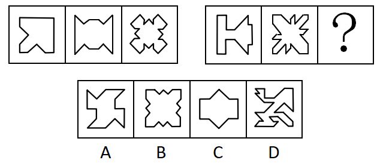
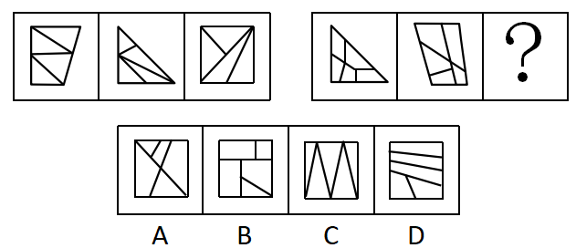
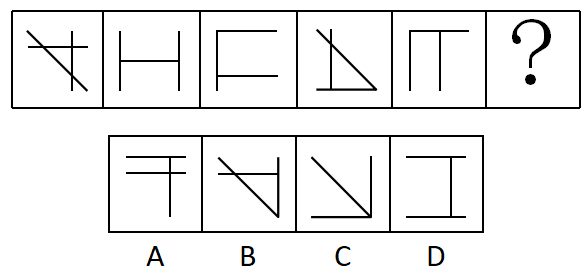
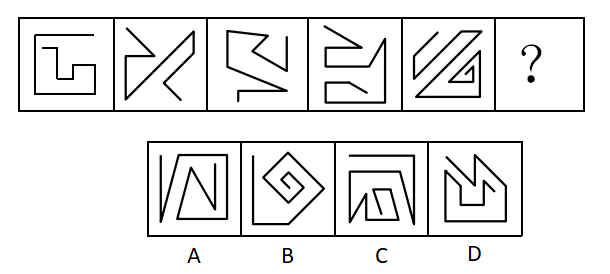
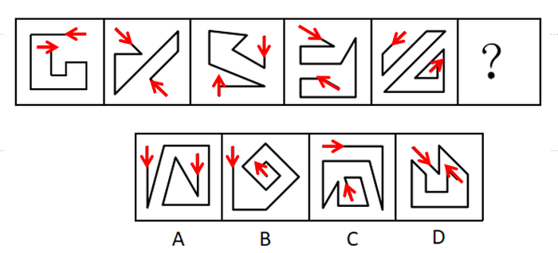
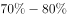

# 2019年北京市公务员录用考试《行测》题（网友回忆版）

> 判断推理 · 30 题 · 北京 2019

## 第 1 题　qid 2274540 · 图形推理

此题包含两套图形和可供选择的4个图形。这两套图形具有某种相似性，也存在某种差异。要求你从四个选项中选择最适合取代问号的一个。正确的答案应不仅使两套图形表现出最大的相似性，而且使第二套图形也表现出自己的特征。

- **A**. A
- **B**. B　✅
- **C**. C
- **D**. D

**答案**：B

**官方解析**

元素组成不同，优先考虑属性规律。第一组图中均为轴对称图形，对称轴的数量分别为1、2、4；第二组图前两个图也均为轴对称图形，对称轴的数量分别为1、2，因此？处应选4条对称轴的图形。A项为中心对称图形无对称轴，排除；B项4条对称轴，当选；C项2条对称轴，排除；D项不是对称图形，排除。
故正确答案为B。

---

## 第 2 题　qid 2274542 · 图形推理

此题包含两套图形和可供选择的4个图形。这两套图形具有某种相似性，也存在某种差异。要求你从四个选项中选择最适合取代问号的一个。正确的答案应不仅使两套图形表现出最大的相似性，而且使第二套图形也表现出自己的特征。

- **A**. A
- **B**. B
- **C**. C
- **D**. D　✅

**答案**：D

**官方解析**

元素组成不同，无明显属性规律，考虑数量规律。观察发现，题干图形被分割成多个封闭区域，考虑面数量。第一组图形中的面数量都是4，且都是三角形的面；第二组图形中面数量都是5，且都是四边形的面，因此？处应选5个四边形面的图形。A项3个四边形的面，2个三角形的面，排除；B项4个四边形的面，1个三角形的面，排除；C项5个三角形的面，排除；D项5个四边形的面，当选。
故正确答案为D。

---

## 第 3 题　qid 2274546 · 图形推理

请从四个选项中选出最恰当的一项填在问号处，使图形呈现一定的规律性：

- **A**. A　✅
- **B**. B
- **C**. C
- **D**. D

**答案**：A

**官方解析**

元素组成不同，无明显属性规律，考虑数量规律。观察可知，图1、图2、图3、图5均出现端点，考虑笔画数，题干每个图形都有2个奇点，都是一笔画图形，则？处应选一笔画图形。A项有2个奇点，一笔画，当选；B项有4个奇点，两笔画，排除；C项有6个奇点，三笔画，排除；D项有4个奇点，两笔画，排除。
故正确答案为A。

---

## 第 4 题　qid 2274549 · 图形推理

请从四个选项中选出最恰当的一项填在问号处，使图形呈现一定的规律性： 

- **A**. A　✅
- **B**. B
- **C**. C
- **D**. D

**答案**：A

**官方解析**

元素组成不同，无明显属性规律，考虑数量规律，题干都有3条直线，但选项也都有3条直线，选不出唯一答案，并且没有其他数量规律。继续观察发现，题干和选项均有3条直线，并且其中均至少有1条横线和1条竖线，考虑位置规律。如下图所示，图1的横线（a）依次向下移动1格，则？处应该移动到竖线的位置2，排除C、D项。图1的竖线（b）依次向右移动1格，则？处应该移动到横线的位置4，只有A项符合。

故正确答案为A。

---

## 第 5 题　qid 2274550 · 图形推理

请从四个选项中选出最恰当的一项填在问号处，使图形呈现一定的规律性：

- **A**. A
- **B**. B
- **C**. C
- **D**. D　✅

**答案**：D

**官方解析**

元素组成不同，属性无规律，考虑数量规律。图形均由直线组成，但直线数量没有规律。继续观察图形发现，图形中的起始线和结束线为平行关系，且两条线的走向是相反的（如下图所示），B、C两项的起始线和结束线不平行，排除；A项起始线和结束线的走向一致，排除；D项起始线和结束线的走向相反，当选。

故正确答案为D。

---

## 第 6 题　qid 2274554 · 逻辑判断

在所有小说中，与《傲慢与偏见》比起来，小波更爱读《教父》，而他最爱读的小说是《福尔摩斯探案全集》，最不爱读的是《罪与罚》。与《傲慢与偏见》相比，小波更不爱读《飘》。
以下除哪项外，均可由上述陈述推出？

- **A**. 比起《堂吉诃德》，小波更爱读《福尔摩斯探案全集》
- **B**. 比起《飘》，小波更不爱读《罪与罚》
- **C**. 比起《飘》，小波更爱读《教父》
- **D**. 比起《傲慢与偏见》，小波更爱读《茶花女》　✅

**答案**：D

**官方解析**

第一步：分析题干条件。
根据题干将小波读的书按照从爱读到不爱读的顺序排列如下：
①《教父》＞《傲慢与偏见》
②最爱读《福尔摩斯探案全集》，最不爱读《罪与罚》
③《傲慢与偏见》＞《飘》。
将①、②与③合并为④：《福尔摩斯探案全集》＞《教父》＞《傲慢与偏见》＞《飘》＞《罪与罚》
第二步：逐一分析选项。
A项：选项中《福尔摩斯探案全集》＞《堂吉诃德》，由条件②可知，《福尔摩斯探案全集》是小波最爱读的小说，可以推出，排除；
B项：选项中《飘》＞《罪与罚》，由条件②可知，《罪与罚》是小波最不爱读的小说，可以推出，排除；
C项：选项中《教父》＞《飘》，与条件④一致，可以推出，排除；
D项：选项中《茶花女》＞《傲慢与偏见》，题干没有提及《茶花女》，根据题干已知条件，推不出该选项成立，无法推出，当选。
本题为选非题，故正确答案为D。

---

## 第 7 题　qid 2274555 · 逻辑判断

有研究人员指出：“有些职业，比如像写作、音乐创作、设计、策划、广告文案等，其从业人员的创意灵感往往出现在深夜。”
以下哪项如果为真，不能对该研究人员的观点提供支持？

- **A**. 
历史上那些最具创意头脑的人，有很多是“夜猫子”。比如，席勒、福楼拜、普鲁斯特等人几乎一辈子都在深夜工作

- **B**. 
夜深人静时，忙碌紧张了一天的人们放松下来，大脑更能天马行空地发挥想象力，于是创意喷涌而出

- **C**. 
有研究者记录了150多位大作家和大艺术家的生活作息，其中按正常时间作息的占了大多数，只有26位是“夜猫子”
　✅
- **D**. 
音乐家对灵感的依赖非常强烈，一项针对美国音乐行业从业者的调查显示，“夜猫子”的比例达到以上

**答案**：C

**官方解析**

第一步：找出论点和论据。

论点：有些职业，比如像写作、音乐创作、设计、策划、广告文案等，其从业人员的创意灵感往往出现在深夜。

论据：无。

第二步：逐一分析选项。

A项：历史上那些最具创意头脑的人，很多都是夜猫子，在深夜工作，通过“最具创意头脑的人”举例支持了“创意灵感往往出现在深夜”，补充论据，可以加强，排除；

B项：夜深人静时，忙碌紧张的人们能够放松下来，大脑更能天马行空的发挥想象力，创意喷涌而出，解释了创意灵感往往出现在深夜的原因，补充论据，可以加强，排除；

C项：150多位大作家和大艺术家的生活作息中，正常作息的占了大多数，只有26位是“夜猫子”，可见创意灵感并非往往出现在深夜，无法加强，当选； 

D项：音乐行业从业者夜猫子的比例达到以上，通过举例支持了“创意灵感往往出现在深夜”，补充论据，可以加强，排除。

本题为选非题，故正确答案为C。

---

## 第 8 题　qid 2274560 · 逻辑判断

青海湖的湟鱼是一种珍稀鱼类，但自上世纪50年代，人们开始大量捕捞湟鱼，导致湟鱼资源量由最初的32万吨，按平均每年0.4万吨的速度减少，至2013年，湟鱼资源量仅为6.8万吨。某专家认为，照此速度，青海湖的湟鱼再过十几年就会灭绝。
以下哪项如果为真，最能反驳该专家的观点？

- **A**. 《中国物种红色名录》已将湟鱼列为濒危物种，并采取多项措施进行了有效保护　✅
- **B**. 虽然一次性盗捕湟鱼50公斤以上就会构成犯罪，但盗捕者仍在增加
- **C**. 一条两斤左右的湟鱼能卖到上百元，这使很多捕鱼者把捕鱼目标瞄向湟鱼
- **D**. 刚刚过去的一年，青海湖的湟鱼减少量为0.3万吨

**答案**：A

**官方解析**

第一步：找出论点和论据。
论点：按平均每年0.4万吨的速度减少，青海湖的湟鱼再过十几年就会灭绝。
论据：自上世纪50年代，人们开始大量捕捞湟鱼，导致湟鱼资源量由最初的32万吨，按平均每年0.4万吨的速度减少，至2013年，湟鱼资源量仅为6.8万吨。
第二步：逐一分析选项。
A项：既然已经对湟鱼这种濒危物种采取了有效保护，那么湟鱼就不会灭绝，削弱了论点，可以削弱，当选；
B项：指出盗捕者仍在增加，说明更多的人参与盗捕，补充了论据，无法削弱，排除；
C项：指出很多捕鱼者把目标瞄向湟鱼，解释了湟鱼减少的原因，补充了论据，不能削弱，排除； 
D项：只论述了刚刚过去的一年湟鱼减少量比预计少，但无法证明之后湟鱼是否会灭绝，不明确选项，不能削弱，排除。
故正确答案为A。

---

## 第 9 题　qid 2274562 · 逻辑判断

蝙蝠体内携带大量的病毒，会给人类和其他动物造成致命危险，但蝙蝠自身仿佛不受这些病毒的影响，为什么呢？科学家认为这或许与蝙蝠是唯一一种能够飞行的哺乳动物有关。蝙蝠在上亿年适应飞行的进化过程中，它们的很多系统发生了变化，包括防御和免疫系统。一般来说，人类和其他动物机体的免疫反应有助于身体抵御病毒，但对某种病毒的过度免疫反应又有可能引发严重疾病，而蝙蝠的免疫系统恰恰能在与病毒共生的过程中达到一种平衡。
以下推论中，正确的一项是

- **A**. 蝙蝠是一种最为古老的哺乳动物的物种，迄今有上亿年的进化历史
- **B**. 蝙蝠机体的免疫系统会抵御病毒侵袭，又不会引发过度强烈的免疫反应　✅
- **C**. 蝙蝠作为一种古老的生物，已经进化出可以防御各种病毒的超级基因
- **D**. 蝙蝠可以飞行是其能大规模广泛传播致命病毒的最重要的原因

**答案**：B

**官方解析**

日常结论题，根据题干信息逐一分析选项。
A项：根据题干第三句话可知，蝙蝠存在了上亿年，但题干没有说蝙蝠是最为古老的哺乳动物的物种，无中生有，无法推出，排除；
B项：根据最后一句话可知，人类和其他动物机体对某种病毒的过度免疫反应有可能引发严重疾病，但蝙蝠的免疫系统能在与病毒共生的过程中达到一种平衡，也就说明蝙蝠的免疫系统既能抵御病毒，又不会引发过度强烈的免疫反应，可以推出，当选；
C项：题干中并没有提到蝙蝠已经进化出可以防御各种病毒的超级基因，无中生有，无法推出，排除；
D项：题干只提到蝙蝠体内携带大量的病毒，会给人类和其他动物造成致命危险，但没有提到蝙蝠传播病毒的最重要的方式原因，无中生有，无法推出，排除。
故正确答案为B。

---

## 第 10 题　qid 2274565 · 逻辑判断

开车是一项有风险的交通行为，驾驶员行车时的心理、生理和行为特性对驾驶安全影响很大，往往决定着潜在事故是否可能发生。研究认为，女驾驶员对复杂交通环境的辨别能力低，且在应激环境下反应不如男性积极，对突发事件不能应付。此外，男女驾驶员还有显著的身体条件方面的差异，视野、体力、空间能力等方面，男女间的平均差距都相当明显。由此，有人提出，相比男司机，女司机确实更有“马路杀手”的一面，即更容易造成严重的交通事故。
以下各项如果为真，哪项不能驳斥上述观点？

- **A**. 女司机造成重大事故的几率远低于男司机，女司机肇事事故中死亡人数约为男司机的1/50
- **B**. 相比男司机，女司机拥有更为良好的驾驶习惯，也更加注重不要超速，有利于行车安全
- **C**. 领取驾驶证的女司机数量虽多，但真正开车的人并不多，以北京为例，男女司机的比例为7：3　✅
- **D**. 平均来说，同样里程的驾驶，男司机负全责的交通事故的发生率要远高于女司机

**答案**：C

**官方解析**

第一步：找出论点和论据。
论点：相比男司机，女司机更容易造成严重的交通事故。
论据：女驾驶员对复杂交通环境的辨别能力低，且在应激环境下反应不如男性积极，对突发事件不能应付。此外，男女驾驶员还有显著的身体条件方面的差异，视野、体力、空间能力等方面，男女间的平均差距都相当明显。
本题为削弱选非题，排除可以削弱的选项，选择剩下的选项即可。
第二步：逐一分析选项。
A项：说明女司机造成重大事故的几率和肇事事故死亡人数远低于男司机，则不容易造成严重的交通事故，可以削弱，排除；
B项：说明女司机有更好的驾驶习惯，有利于行车安全，则不容易造成严重的交通事故，可以削弱，排除；
C项：题干讨论女司机更易造成严重的交通事故，该项讨论开车的女司机数量少，话题不一致，不能削弱，当选；
D项：说明男司机负全责的交通事故发生率更高，则男司机更易造成交通事故，可以削弱，排除。
本题为选非题，故正确答案为C。

---

## 第 11 题　qid 2274568 · 逻辑判断

75年前一头驯鹿因感染炭疽死亡后尸体保存在北极圈附近的冻土中，不久前附近的一名男童因感染炭疽死亡。有科学家推测，全球变暖使得北极圈的“永久冻土”开始融化，炭疽杆菌因此卷土重来。同时，一些“古老病毒”比如天花和黑死病的病原体也可能埋藏在这些永久冻土中。科学家正为此极度担忧。
以下陈述如果为真，哪项最有助于为科学家解忧？

- **A**. 永久冻土是细菌长期保持活力的最理想场所，时间也许可以长达一百万年
- **B**. 人类与细菌和病毒一直并存，如黑死病和天花，人类已进化出对抗它们的基因　✅
- **C**. 全球变暖让北半球国家变得更温暖，诸如疟疾等热带疾病开始发生于北半球
- **D**. 如果病原体长时间没有接触到人类，那么我们的免疫系统对它不会有所防备

**答案**：B

**官方解析**

第一步：找出论点和论据。
论点：全球变暖使得北极圈的“永久冻土”开始融化，炭疽杆菌因此卷土重来。同时，一些“古老病毒”比如天花和黑死病的病原体也可能埋藏在这些永久冻土中。
论据：75年前一头驯鹿因感染炭疽死亡后尸体保存在北极圈附近的冻土中，不久前附近的一名男童因感染炭疽死亡。
第二步：逐一分析选项。
A项：题干讨论的是埋藏在冻土中的病菌是否会卷土重来，该项讨论的是细菌保持活力的时长，话题不一致，无关选项，排除；
B项：说明人类有了对抗黑死病和天花的基因，即使病毒卷土重来，也不需要担忧，削弱了题干论点，当选；
C项：题干讨论的是埋藏在冻土中的病菌是否会卷土重来，该项讨论的是北半球开始发生热带疾病，话题不一致，无关选项，排除；
D项：说明人类的免疫系统对长时间没有接触到的病原体不会有所防备，即这些病毒卷土重来可能会对人类造成伤害，具有一定的加强作用，不能削弱，排除。
故正确答案为B。

---

## 第 12 题　qid 2274570 · 逻辑判断

马兰：因为赵老师的课讲得特别好，学生都很喜欢他，所以他有资格参加学校十佳教师评选。
李溪：因为赵老师曾上课迟到造成教学事故，他不是合格的教师。所以，他没有资格参加学校十佳教师评选。
李溪的论证使用了以下哪项作为前提？
Ⅰ.有些课讲得好的老师发生过教学事故
Ⅱ.凡有过教学事故的教师都不是合格教师
Ⅲ.只有合格教师才有参评学校十佳教师的资格

- **A**. 仅Ⅰ
- **B**. 仅Ⅱ
- **C**. 仅Ⅲ
- **D**. Ⅱ和Ⅲ　✅

**答案**：D

**官方解析**

第一步：找出论点和论据。
论点：赵老师没有资格参加学校十佳教师评选。
论据：因为赵老师曾上课迟到造成教学事故，他不是合格的教师。
第二步：逐一分析选项。
I：在李溪的论证中并没有提到课讲得好这一话题，因此不是李溪论证成立的前提，无关选项，错误；
II：指出有教学事故的老师都不是合格教师，是论据成立的前提，即也是李溪论证成立的前提，正确；
III：说明不合格的老师就没有资格参加学校十佳教师的评选，建立了题干论点和论据之间的联系，是李溪论证成立的前提，正确。
故正确答案为D。

---

## 第 13 题　qid 2274572 · 逻辑判断

蛋黄含有较多的胆固醇，有的人害怕胆固醇高，不敢吃蛋黄。近期一篇涉及50万中国人、随访时长近9年的研究报告提出，每天吃鸡蛋的人比起那些基本不吃鸡蛋的人，心血管事件风险降低，心血管事件死亡风险降低，尤其是出血性中风风险降低了，相应的死亡风险则降低了。考虑到脑中风是我国居民第一大死因，研究者提出，每天吃一个鸡蛋有利于心血管健康。

以下各项如果为真，哪项最能支持研究者的观点？

- **A**. 
来自日本的一项涉及4万人的追踪研究中，每天吃鸡蛋的人比起不吃鸡蛋的人，全因死亡率低了

- **B**. 
鸡蛋的营养十分丰富，钙、磷、铁、维生素A、维生素B的含量都比较高

- **C**. 
食物摄入胆固醇并不等于血胆固醇水平，且鸡蛋中含有的卵磷脂能有效阻止胆固醇和脂肪在血管壁上的沉积
　✅
- **D**. 
每天吃鸡蛋的人，教育水平和家庭收入都更高，饮食更加健康，生活更自律，更有可能补充维生素

**答案**：C

**官方解析**

第一步：找出论点和论据。

论点：每天吃一个鸡蛋有利于心血管健康。

论据：每天吃鸡蛋的人比起那些基本不吃鸡蛋的人，心血管事件风险降低，心血管事件死亡风险降低，尤其是出血性中风风险降低了，相应的死亡风险则降低了。

论点和论据均在讨论“每天吃鸡蛋有利于心血管健康”，话题一致，加强优先考虑补充论据，即解释原因和举例加强。

第二步：逐一分析选项。

A项：在日本的研究中说明，吃鸡蛋可以有效降低全因死亡率，但无法确定是否降低了心血管事件的死亡率，不能加强，排除；

B项：指出鸡蛋中营养丰富，但未提及是否有利于心血管健康，属于无关项，不能加强，排除；

C项：指出鸡蛋中含有的卵磷脂能有效阻止胆固醇和脂肪在血管壁上沉积，解释了为什么吃鸡蛋有利于心血管健康，解释原因，可以加强，当选；

D项：说明每天吃鸡蛋的人教育水平和家庭收入更高，饮食更健康，生活更自律，更有可能补充维生素，即可能存在其他原因导致心血管事件死亡率降低，属于他因削弱，不能加强，排除。

故正确答案为C。

---

## 第 14 题　qid 2274573 · 逻辑判断

某次足球比赛前，甲、乙、丙、丁四位运动员猜测他们的上场情况。
甲：我们四人都不会上场；
乙：我们中有人会上场；
丙：乙和丁至少有一人上场；
丁：我会上场。
四人中有两人猜测为真两人猜测为假，则以下哪项断定成立？

- **A**. 猜测为真的是乙和丙　✅
- **B**. 猜测为真的是甲和丁
- **C**. 猜测为真的是甲和丙
- **D**. 猜测为真的是乙和丁

**答案**：A

**官方解析**

本题属于真假推理题。
第一步：找出题干矛盾命题。
甲：我们四人都不会上场；
乙：我们中有人会上场；
丙：乙或丁；
丁：丁。
甲说“我们四人都不会上场”和乙说“我们中有人会上场”是矛盾关系，则必有一真必有一假。已知四人中有两人猜测为真两人猜测为假，说明丙和丁的猜测也必然是一真一假。
第二步：看其余。
假设丁的猜测为真，则丁会上场，而“丁”为“乙或丁”的其中一项，此时丙的猜测也一定为真，那么丙、丁的猜测均为真，与题干要求的一真一假矛盾，故丁的猜测一定为假，即丁不会上场，则丙的猜测为真，说明乙或丁会上场，既然丁不会上场，那么上场的为乙，也就是说四个人中有人会上场，则乙的猜测为真，甲的猜测为假，即猜测为真的是乙和丙。
故正确答案为A。

---

## 第 15 题　qid 2274576 · 逻辑判断

秋冬时节感冒多发，预防感冒的小技巧很受关注。网上一直流传：放置一颗洋葱在房间里，可以预防感冒，因为洋葱挥发出的含硫化合物有抑菌抗癌的作用，可净化室内空气。因此，在室内放几个切去两端的洋葱，就可以有效预防感冒。
以下各项如果为真，哪项最能驳斥以上观点？

- **A**. 
洋葱所含硫化物对肠道的细菌有一定抑制作用，但需要每天口服一定的量

- **B**. 
人类所患感冒中的感冒是由病毒引起的，洋葱对病毒是没有抑制作用的
　✅
- **C**. 
实验证明，室内放置洋葱1小时后，室内细菌总数没有显著减少

- **D**. 
现有研究尚未发现食物可以有效吸附病菌和病毒

**答案**：B

**官方解析**

第一步：找出论点和论据。

论点：在室内放几个切去两端的洋葱，就可以有效预防感冒。

论据：洋葱挥发出的含硫化合物有抑菌抗癌的作用，可净化室内空气。

论据论据均在讨论“洋葱可以预防感冒”，话题一致，削弱优先考虑削弱论点。

第二步：逐一分析选项。   

A项：论点说的是洋葱可以有效预防感冒，该项说的是洋葱可以抑制肠道的细菌，抑制肠道的细菌与能否预防感冒无关，话题不一致，无法削弱，排除；

B项：论点说的是洋葱可以有效预防感冒，该项说的是的感冒是由病毒引起的，洋葱对病毒没有抑制作用，说明洋葱无法预防感冒，直接削弱了题干论点，当选；

C项：该项说的是室内细菌总数没有显著减少，即细菌总数减少的不明显，但细菌数量还是有减少的，具有一定的加强作用，无法削弱，排除；

D项：该项说的是现有研究尚未发现食物可以有效吸附病菌和病毒，但事实上食物到底能否有效吸附病菌并未说明，属于不明确项，排除。

故正确答案为B。

---

## 第 16 题　qid 2274491 · 逻辑判断

近视的原因是什么？某国的研究者跟踪了500多名8-9岁视力正常的儿童，五年后发现，唯一和患近视相关的环境因素是儿童在户外的时间。而且，孩子的近视确实和在户外的时长有关，无论孩子们在户外是在锻炼、野餐，还是只是在海滩上读书。由此研究者认为，导致近视更重要的原因可能是眼睛是否处在明亮光线下，光照可以保护眼睛。
以下各项如果为真，哪项最能支持以上观点？

- **A**. 
那些在户外待得更久的孩子并没有减少看书本、看屏幕或进行近距离学习的时间，有些孩子在户外看书和电子屏的时间非常长
　✅
- **B**. 
与在一般室内光照环境下生长的鸡相比，处于与户外光照相当的高光照水平下的鸡，实验诱发的近视发生减缓约，恒河猴中也发现了类似效应

- **C**. 
视网膜按照昼夜节律产生多巴胺，使得眼球可以从夜间视觉切换到白昼视觉。白天室内昏暗的光照下，视网膜的周期会被扰乱，影响到眼球发育

- **D**. 
某学校要求孩子们每天共80分钟的课间时间全到户外去，不许留在室内。一年后，的孩子被诊断为近视，而附近一所学校同龄孩子的近视率是

**答案**：A

**官方解析**

第一步：找出论点和论据。

论点：导致近视更重要的原因可能是眼睛是否处在明亮光线下，光照可以保护眼睛。

论据：某国的研究者跟踪了500多名8-9岁视力正常的儿童，五年后发现，唯一和患近视相关的环境因素是儿童在户外的时间。而且，孩子的近视确实和在户外的时长有关，无论孩子们在户外是在锻炼、野餐，还是只是在海滩上读书。

第二步：逐一分析选项。

A项：该项强调待在户外的孩子看书和看电子屏的时间比较长，排除了其他干扰因素的影响，为论点成立的必要条件，保留；

B项：高光照水平下的鸡和恒河猴的近视发生率减缓了，这两类动物的例子说明光照确实可以保护这两类动物的眼睛，但整个题干讨论的都是人的近视，动物的结论可能适用于人类，类比加强，但加强力度比较弱，保留；

C项：该项讨论的是白天视网膜对眼球的影响，但是该影响是否能导致近视不明确，属于不明确项，无法加强，排除； 

D项：指出某学校每天去户外80分钟的孩子一年之后被诊断为近视，而附近的学校同龄孩子近视率是，但是附近的学校孩子是否每天去户外活动不明确，为不明确项，无法加强，排除。

比较A、B两项，A项补充必要条件的力度大于B项的类比加强，所以排除B项。

故正确答案为A。

---

## 第 17 题　qid 2274492 · 类比推理

若在一墓穴中发掘出墓主的印章和墓志铭，就能确定该墓穴是墓主的真墓。在西高穴大墓中，没有发掘出曹操的印章和墓志铭。故西高穴大墓不是真的曹操墓。
以下哪项的论证方式与题干最为类似？

- **A**. 若在墓穴中发现刻有“魏武王”之类字样的随葬品，就能说明那个墓穴是曹操的。在西高穴大墓中发现了刻有“魏武王常用格虎大戟”的石碑等随葬品。故该墓是曹操墓
- **B**. 十八岁的人还没有面对过社会上的问题，而任何没有面对过这些问题的人不能够进行投票。所以，十八岁的人不能够进行投票
- **C**. 只有持有深水合格证，才能进入深水池。高亮没有深水合格证，所以，他不能进入深水池
- **D**. 如果我有翅膀，我就能飞翔。我没有翅膀，所以，我不能飞翔　✅

**答案**：D

**官方解析**

第一步：分析题干。

题干翻译为：“发掘出墓主的印章和墓志铭是墓主的真墓”，则“曹操的印章和墓志铭真的曹操墓”，可知题干的论证方式为否前推出否后。

第二步：逐一分析选项。

A项翻译为：“发现刻有‘魏武王’之类字样的随葬品墓穴是曹操的”，则“发现了刻有‘魏武王常用格虎大戟’的石碑等随葬品是曹操墓”，该项的论证方式为肯前推出肯后，与题干论证方式不一致，排除；

B项翻译为：“十八岁的人没有面对过社会上的问题，没有面对过这些问题的人不能够进行投票”，则“十八岁的人不能够进行投票”，与题干论证方式不一致，排除；

C项翻译为：“进入深水池持有深水合格证”，则“持有深水合格证进入深水池”，该项的论证方式为否后推出否前，与题干论证方式不一致，排除； 

D项翻译为：“有翅膀能飞翔”，则“翅膀飞翔”，该项的论证方式为否前推出否后，与题干论证方式一致，当选。

故正确答案为D。

---

## 第 18 题　qid 2274493 · 图形推理

宣称植物有意识、有感情的人，通常会引用美国人巴克斯特的实验。巴克斯特将一台测谎仪连在一盆植物的叶子上。这台测谎仪的设计原理是人在撒谎时，由于紧张，皮肤会出汗，导致皮肤电阻降低，通过测定皮肤电阻的变化可辨别人的情绪，进而判断人是否在撒谎。巴克斯特报告说，实验中当主试想到“我要烧掉那片叶子”时，测谎仪反应剧烈，指针猛然摆到了仪表的顶端并显示出连续的激烈波动，测谎仪绘制出类似于人在极度恐惧时会出现的图形。巴克斯特由此宣称：植物是有感情的。
以下哪项如果为真，最能驳斥以上观点？

- **A**. 即使是巴克斯特也不能稳定地重复该实验，而巴克斯特对实验成功与失败的解释难以令人信服
- **B**. 具有中枢神经系统的生物才有意识、有感情，植物没有任何神经系统　✅
- **C**. 巴克斯特所记录的测谎器曲线，可能是其他因素引起的，包括静电作用、房间里的机械振动、湿度的变化等
- **D**. 巴克斯特的实验设计不够科学，没有对照组，也不符合客观、双盲等科学实验的必要条件

**答案**：B

**官方解析**

第一步：找出论点和论据。
论点：植物是有感情的。
论据：巴克斯特报告说，实验中当主试想到“我要烧掉那片叶子”时，测谎仪反应剧烈，指针猛然摆到了仪表的顶端并显示出连续的激烈波动，测谎仪绘制出类似于人在极度恐惧时会出现的图形。
第二步：逐一分析选项。
A项：该项指出巴克斯特不能稳定地重复该实验，并且对实验的解释难以令人信服，说明该项实验做的不科学，否定论据，可以削弱，保留；
B项：该项指出具有中枢神经系统的生物才有意识，有感情，而植物没有任何神经系统，说明植物不具有意识，不具有感情，否定论点，可以削弱，保留；
C项：该项说的是测谎仪曲线可能是由其他的因素引起的，说明该项实验存在其他因素影响实验结果，导致实验数据记录可能不准确，否定论据，可以削弱，保留； 
D项：该项说的是巴克斯特的实验设计不够科学，不符合科学实验的必要条件，说明该项实验做的不科学，否定论据，可以削弱，保留。
比较A、B、C、D四个选项，因为削弱论点的力度大于削弱论据，所以B项削弱力度最强，排除A、C、D三项。
故正确答案为B。

---

## 第 19 题　qid 2274496 · 逻辑判断

细胞因为发生了基因突变，出现不受控制地增殖分化，最终发展成为恶性肿瘤。在癌细胞表面存在着许多由突变基因编码的异常蛋白，按理说，这些异常蛋白应该被机体免疫系统及时识别，并引发免疫反应将癌细胞一举清除。然而，由于肿瘤细胞发展迅速、极善伪装，而且不断突变，面对凶猛机智的肿瘤细胞，原本强大的免疫细胞也显得有些“力不从心”，甚至还会对一些肿瘤细胞“视而不见”。在肿瘤微环境中形成的免疫抑制，更是让免疫系统陷入“瘫痪”。
根据上述信息，下列研究除哪项外，可能有助于研发有效的抗肿瘤药物？

- **A**. 研究人员对每位患者的肿瘤细胞和健康细胞的DNA进行测序，以鉴定出肿瘤特异性突变，并确定相关的异常蛋白
- **B**. 科学家利用免疫疗法，试图改造对肿瘤细胞“不上心”的免疫T细胞，使其重返战场
- **C**. 科学家将恶性肿瘤患者和健康人的生活方式、个性特征进行对照研究，找出诱发肿瘤发病的风险因素　✅
- **D**. 科学家利用小鼠进行试验，将提取的肿瘤异常蛋白作为疫苗注射入小鼠体内，激发并增强其免疫反应

**答案**：C

**官方解析**

第一步：找出论点和论据。
论点：进行相关研究从而有助于研发有效的抗肿瘤药物。
论据：由于肿瘤细胞发展迅速、极善伪装，而且不断突变，面对凶猛机智的肿瘤细胞，原本强大的免疫细胞也显得有些“力不从心”，甚至还会对一些肿瘤细胞“视而不见”。在肿瘤微环境中形成的免疫抑制，更是让免疫系统陷入“瘫痪”。
第二步：逐一分析选项。
A项：该项说的是研究人员通过对每一位患者的肿瘤细胞和健康细胞的DNA测序，来鉴定出肿瘤特异突变并确定相关的异常蛋白，这种做法能够确定出异常蛋白，对研发有效的抗肿瘤药物是有帮助的，可以加强，排除；
B项：该项说的是科学家利用免疫疗法去改造对肿瘤细胞“不上心”的免疫T细胞，这种做法能够让T细胞重新发挥作用，识别肿瘤细胞，所以该项研究有助于研发抗肿瘤药物，可以加强，排除；
C项：该项说的将恶性肿瘤患者和健康人进行对照，找出发病的原因，而论点探讨的是怎么做能够帮助研发出抗肿瘤的药物，二者话题不一致，不能加强，当选；
D项：该项说的是科学家通过小鼠做实验，注射提取的肿瘤异常蛋白，激发并增强其免疫反应，这种做法是通过实验的形式来研究如何激发并增强免疫反应，故该项研究有助于研发有效的抗肿瘤药物，可以加强，排除。
本题为选非题，故正确答案为C。

---

## 第 20 题　qid 2274500 · 逻辑判断

某学院今年继续执行出国资助计划，拟从刘老师、张老师、王老师、马老师、牛老师、周老师6位教师中选派几位出国访学。由于受到资助经费、学院学科发展需要、课程安排、各人访学地和访学时间等诸多因素限制，选拔时要符合如下条件：
（1）刘老师是学院的后备学科带头人，此次必须得派出去。
（2）如果选刘老师，那么周老师也要选，但不能选张老师。
（3）只有牛老师选不上，王老师和马老师中才至少有1人能选上。
（4）如果不选王老师，那么也不选周老师。
若以上陈述为真，下面哪项一定为真?

- **A**. 牛老师没选上，周老师选上了　✅
- **B**. 刘老师选上了，马老师没选上
- **C**. 王老师和马老师都选上了
- **D**. 王老师和牛老师都没选上

**答案**：A

**官方解析**

第一步：分析题干。

（1）一定刘；

（2）刘周且张；

（3）王或马牛；

（4）王周。

第二步：根据题干条件分析选项。

由（1）（2）可知，刘老师一定入选，周老师也一定入选，张老师没有入选；再根据（4）可知，王老师一定入选；再根据（3）可知，牛老师一定没入选。

即：刘老师、周老师、王老师一定入选，张老师、牛老师一定没入选，马老师未知。

故正确答案为A。

---

## 第 21 题　qid 2274502 · 定义判断

绿色消费，也称可持续消费，是指一种以适度节制消费，避免或减少对环境的破坏，崇尚自然和保护生态等为特征的新型消费行为和过程。
根据上述定义，以下不属于绿色消费的是：

- **A**. 尽量购买简装物品，减少包装浪费
- **B**. 抵制一次性筷子，保护木材资源
- **C**. 吃原生态珍稀野味，减少加工成本　✅
- **D**. 购买低耗能的电器，减少用电开支

**答案**：C

**官方解析**

第一步：找出定义关键词。
“一种以适度节制消费，避免或减少对环境的破坏”、“崇尚自然和保护生态等为特征的新型消费行为和过程”。
第二步：逐一分析选项。
A项：购买简装物品，减少包装浪费，符合“避免或减少对环境的破坏”，符合定义，排除；
B项：抵制一次性筷子，保护木材资源，符合“避免或减少对环境的破坏”，符合定义，排除；
C项：吃原生态珍稀野味，不符合“崇尚自然和保护生态”，不符合定义，当选；
D项：购买低耗能的电器，减少用电开支，可以降低对资源的消耗，符合“避免或减少对环境的破坏”，符合定义，排除。
本题为选非题，故正确答案为C。

---

## 第 22 题　qid 2274504 · 定义判断

求医行为，是指人们在感到躯体不适或产生病感时寻求医疗帮助的行为。根据求医的决定是由谁做出的，可以分为主动求医、被动求医和强制求医。主动求医是指当个体产生不适感或病感时，自觉做出决定。被动求医指的是由病人的家属或他人做出求医的决定，病人配合就医。强制求医是指本人不愿求医，但因疾病对本人或社会人群健康构成危害而强行要求其就医。
根据上述定义，以下属于被动求医的是：

- **A**. 老张的体检报告显示他有轻度脂肪肝，建议可进一步检查和治疗，老张拿到报告后很紧张，赶紧到医院去挂号
- **B**. 小张牙疼好几天了，一直没有去医院治疗，直到牙疼引发面部肿胀，连张口吃饭都困难了，才不得不去牙科诊治
- **C**. 刘阿姨最近无缘由地开始说自己没有用了，干脆死了更好，她不愿去医院看病，她的丈夫和儿女苦劝无果，只好硬带她去医院就诊
- **D**. 中学生小梅放学回家，跟妈妈说今天拉肚子，上了五次厕所，除此之外没有别的不舒服，用不用去医院？妈妈决定带她去医院挂号　✅

**答案**：D

**官方解析**

第一步：找出定义关键词。
主动求医：“当个体产生不适感或病感时，自觉做出决定”。
被动求医：“由病人的家属或他人做出求医的决定，病人配合就医”。
强制求医：“本人不愿求医，但因疾病对本人或社会人群健康构成危害而强行要求其就医”。
第二步：逐一分析选项。
A项：老张在体检报告中发现自己患有轻度脂肪肝后，赶紧到医院去挂号，说明老张是自己主动做出的就医决定，符合“主动求医”定义，不符合“被动求医”定义，排除；
B项：小张由于牙疼导致面部肿胀无法正常进食，最后去牙科诊治，说明小张是自己做出的就医决定，符合“主动求医”定义，不符合“被动求医”定义，排除；
C项：刘阿姨的丈夫和女儿苦劝刘阿姨无果后，硬带着她去医院就诊，说明刘阿姨本人是不愿就医的，是家属强行要求她就医，符合“强制求医”定义，不符合“被动求医”定义，排除；
D项：中学生小梅在告诉妈妈自己拉肚子后，妈妈决定带她去医院，说明小梅就医的决定是由她的家属做出的，符合“被动求医”定义，当选。
故正确答案为D。

---

## 第 23 题　qid 2274505 · 定义判断

同侪，指与自己在年龄、地位、兴趣等方面相近的平辈。同侪压力，指的是同侪取得的成就所带给自己的心理压力。
根据上述定义，以下事例中属于同侪压力的是：

- **A**. 小明在考试时看到前面的一位同学夹带小抄，想报告给老师又担心被这个同学报复，只好装作没看见
- **B**. 张远有几个大学同学跟他在同一家医院工作，他们都晋升了副高职称，可自己还是主治医师，很是焦急　✅
- **C**. 息影多年的影视明星吴某，看到影视圈里新秀云集，不免慨叹当年自己叱咤影坛的日子已一去不复返
- **D**. 王力二十年前移民他国，现在看到国内经济形势一片大好，当年的不少熟人都已飞黄腾达，羡慕不已

**答案**：B

**官方解析**

第一步：找出定义关键词。
同侪：“年龄、地位、兴趣等方面相近”、“平辈”；
同侪压力：“同侪取得的成就”、“带给自己的心理压力”。
第二步：逐一分析选项。
A项：小明的同学，符合“同侪”定义，但是同学夹带小抄的行为，不符合“同侪取得的成就”，不符合“同侪压力”定义，排除；
B项：张远的大学同学，符合“同侪”定义，看到他们晋升副高职称，符合“同侪取得的成就”，自己很焦急符合“带给自己的心理压力”，符合“同侪压力”定义，当选；
C项：息影多年的吴某和影视圈新秀在年龄、地位上不相同，不符合“同侪”定义，所以更不符合“同侪压力”定义，排除；
D项：王力的熟人不确定是否与王力是“平辈”，而且王力羡慕不已，没有体现是否“带给自己心理压力”，没有B项明确，排除。
故正确答案为B。

---

## 第 24 题　qid 2274506 · 定义判断

狭义的同行评议，指作者投稿以后，由刊物主编或纳稿编辑邀请具有专业知识或造诣的学者，评议论文的学术和文字质量，提出意见和作出判定，主编按评议的结果决定是否适合在本刊发表。
根据上述定义，以下属于狭义的同行评议的是：

- **A**. 张教授在学术杂志上发表了一篇研究论文，不久后很多同领域的学者发来意见，对该研究的质量提出质疑
- **B**. 研究生小李提交毕业论文后，学术委员会邀请国内相关专业的教授对该论文的学术水平进行评估
- **C**. 李医生提出一个新的手术思路，某期刊编辑将他的投稿论文发给多位外科专家，专家们认为很有创新性　✅
- **D**. 张先生将自我保健心得撰文投稿到某心理健康杂志，编辑认为该文不属于心理领域，不宜在本刊发表

**答案**：C

**官方解析**

第一步：找出定义关键词。
“作者投稿后”、“由刊物主编或纳稿编辑”、“邀请具有专业知识或造诣的学者评议论文的学术和文字质量，提出意见和作出判定”、“主编按评议的结果决定是否适合在本刊发表”。
第二步：逐一分析选项。
A项：张教授在学术杂志上发表了一篇论文，说明文章已经在杂志上发表，不符合“作者投稿后”，不符合定义，排除；
B项：研究生小李提交毕业论文，不符合“作者投稿”，学术委员会不是“刊物主编或纳稿编辑”，不符合定义，排除；
C项：李医生将投稿论文发给某期刊，符合“作者投稿后”，某期刊编辑将他的投稿论文发给多位外科专家，符合“邀请具有专业知识或造诣的学者”，专家们认为很有创新性，符合“评议论文的学术和文字质量，提出意见和作出判定”，符合定义，当选；
D项：张先生投稿，符合“作者投稿后”，但是是编辑认为该文不属于心理领域不宜发表，并没有体现出“编辑邀请具有专业知识或造诣的学者评议论文的学术和文字质量，提出意见和作出判定”，不符合定义，排除。
故正确答案为C。

---

## 第 25 题　qid 2274507 · 定义判断

侵犯行为简称侵犯，有时也可以称之为攻击行为，它是指个体违反了社会主流规范的、有动机的、伤害他人的行为。
根据上述定义，以下属于侵犯行为的是：

- **A**. 加州某大学一名博士生闯入办公室，用枪击伤自己的导师　✅
- **B**. 某中学语文教师批评没有按时完成暑假作业的学生
- **C**. 在一场冰球比赛中，甲方队员在抢球过程中不小心撞伤乙方队员
- **D**. 在经过李某同意的情况下，王某将李某病中照片发到微信朋友圈

**答案**：A

**官方解析**

第一步：找出定义关键词。
“违反社会主流规范”、“有动机”、“伤害他人”。
第二步：逐一分析选项。
A项：博士生闯入办公室，用枪击伤自己的导师，符合“违反社会主流规范”、“伤害他人”，符合定义，当选；
B项：中学语文教师批评没有按时完成暑假作业的学生，不符合“违反社会主流规范”，不符合“有动机、伤害他人”，不符合定义，排除；
C项：甲方队员在抢球过程中是不小心撞上乙方队员，不符合“有动机的伤害他人”，不符合定义，排除；
D项：王某在经过李某同意的情况下，将李某病中照片发到微信朋友圈，不符合“违反社会主流规范”，不符合“有动机、伤害他人”，不符合定义，排除。
故正确答案为A。

---

## 第 26 题　qid 2274509 · 定义判断

职业锚指当一个人不得不做出选择时，无论如何都不会放弃的职业中的那种至关重要的东西或价值观。技术职能型职业锚是指个体的整个职业发展，都围绕着他所擅长的一套特别的技术能力或特定的职业工作而发展。
根据上述定义，以下哪项符合技术职能型职业锚？

- **A**. 小李获得计算机专业硕士学位后就职于一家游戏软件公司，做了一名软件工程师，因经常加班身体透支严重，索性辞职开了一家花店
- **B**. 王大夫是一名神经外科专家，因其专业技能精湛，在业内享有较高声誉，被推选为院长，全职负责全院的行政管理工作
- **C**. 小丽是一名专职演员，在多部电影中都有不错表现，但随着年龄增长遭遇事业瓶颈，遂决定息影，赴国外学习工商管理
- **D**. 小张在厨师学校毕业之后，先是受雇于一家小型餐厅，开始时不受重用，后来潜心钻研新菜品大获赞誉，被猎头挖至五星级酒店，担任餐厅主厨　✅

**答案**：D

**官方解析**

第一步：找出定义关键词。
职业锚：“无论如何都不会放弃的职业中的东西或价值观”；
技术智能型职业锚：“围绕所擅长的一套特别的技术能力或特定的职业工作发展”。
第二步：逐一分析选项。
A项：小李是计算机专业硕士，做软件工程师后，因加班体力透支辞职后开了花店，放弃了软件行业，不是围绕他所擅长的计算机专业能力而发展，不符合“技术职能型职业锚”定义，排除；
B项：王大夫的神经外科专业技能精湛，后来全职负责全院的行政管理工作，不是围绕他所擅长的神经外科发展，不符合“技术职能型职业锚”定义，排除；
C项：小丽是专职演员，但随着年龄增长遭遇瓶颈，赴国外学习工商管理，放弃了演艺事业，不是围绕她所擅长的表演而发展，不符合“技术职能型职业锚”定义，排除；
D项：小张毕业于厨师学校，开始时不受重用，后来潜心学习新菜品被挖至五星级酒店担任主厨，一直围绕着厨师行业发展，符合关键词“围绕所擅长的职业工作发展”，符合“技术职能型职业锚”定义，当选。
故正确答案为D。

---

## 第 27 题　qid 2274511 · 定义判断

木桶原理，是指一个由若干木板构成的木桶，其容量取决于最短的那块木板。反木桶原理是指木桶最长的一根木板决定了其特色与优势。与木桶原理求稳固的思想不同，反木桶原理提倡特色突显。
根据上述定义，以下属于反木桶原理的是：

- **A**. 大学一年级的时候，小菲就明确提出要报考研究生。在她的带动下，同宿舍其他女生都对自己有了明确的目标要求，大学毕业时，六个女生都保研成功
- **B**. 在同事眼中，小微很普通，既没有突出业绩，也不曾主持大型项目，但老板对她赏识有加，因为小微总是能够在团队成员出现工作纰漏时及时发现问题、解决问题，避免了很多严重后果　✅
- **C**. 小勤创办了一家壁纸企业，他在提高产品设计水平和科技含量的同时，加强品牌宣传和推广，最终打造出一线品牌
- **D**. 小王村是一个偏远的山村，山清水秀，吸引了开发商来此投资，建立了设施完善的度假村，但游客数量一直不够理想

**答案**：B

**官方解析**

第一步：找出定义关键词。
木桶原理：“木桶的容量取决于最短的那块木板”；
反木桶原理：“木桶最长的一根木板决定了其特色与优势”、“提倡特色凸显”。
第二步：逐一分析选项。
A项：小菲明确要报考研究生，且在她的带动下同宿舍六个女生保研成功，并没有体现小菲有哪些特色和优势，不符合“反木桶原理”定义，排除； 
B项：小微在同事眼中很普通，但老板对她赏识有加，因为她总能及时发现问题、解决问题，体现了小微的特色和优势，即能够在关键时刻发现问题并解决问题，符合“木桶最长的一根木板决定了其特色与优势”和“提倡特色凸显”，符合“反木桶原理”定义，当选；
C项：小勤创办壁纸企业，加强品牌推广最终打造一线品牌，并没有体现小勤或他打造的品牌有哪些特色和优势，不符合“反木桶原理”定义，排除；
D项：小王村山清水秀吸引开发商来此投资，但游客数量一直不够理想，并没有体现小王村有哪些特色和优势，不符合“反木桶原理”定义，排除。
故正确答案为B。

---

## 第 28 题　qid 2274513 · 定义判断

纯粹接触效应也被称之为只看效应，是指个体接触一个刺激的次数越频繁，对该刺激就越喜欢的现象。纯粹接触效应是影响个体和社会偏好的一种非常简单但却是非常重要的方式。
根据上述定义，以下符合纯粹接触效应的是：

- **A**. 小秦喜欢穿颜色鲜艳的衣服，张教授上课时常能注意到她。硕士研究生面试时，在条件类似的几个学生中，张教授最终选择了小秦　✅
- **B**. 小柯想给妈妈买一份营养品，面对琳琅满目的营养品，他选择了在电视上看到的那个以品质安全著称的品牌
- **C**. 小芳经人介绍认识了高大帅气的小李，一见钟情，随着两人交往逐渐深入，小芳对小李越来越喜欢
- **D**. 小霞看到自己喜欢的明星穿着某品牌的衣服，作为“铁杆粉丝”，她对这个品牌也越来越喜欢

**答案**：A

**官方解析**

第一步：找出定义关键词。
 “个体接触一个刺激的次数越频繁，对该刺激就越喜欢的现象”。 
第二步：逐一分析选项。
A项：小秦喜欢穿颜色鲜艳的衣服，张教授上课时常能够注意到她，体现了张教授经常接触衣服颜色的刺激；硕士研究生面试时，在条件类似的几个学生中，张教授最终选择了小秦，体现了接触刺激越频繁也就越喜欢，符合“个体接触一个刺激的次数越频繁，对该刺激就越喜欢的现象”，符合定义，当选； 
B项：小柯选择了在电视上看到的那个以品质安全著称的品牌，小柯选择该品牌是由于其广告语，没有体现小柯多次接受刺激，不符合“个体接触一个刺激的次数越频繁，对该刺激就越喜欢的现象”，不符合定义，排除；
C项：小芳对小李越来越喜欢的原因是两人交往逐渐深入，而不是接触刺激的次数频繁，不符合“个体接触一个刺激的次数越频繁，对该刺激就越喜欢的现象”，不符合定义，排除；
D项：小霞喜欢某品牌衣服的原因是看到自己喜欢的明星穿着某品牌的衣服，而不是接触刺激的次数频繁，不符合“个体接触一个刺激的次数越频繁，对该刺激就越喜欢的现象”，不符合定义，排除。
故正确答案为A。

---

## 第 29 题　qid 2274515 · 定义判断

非职务发明是指发明人利用自己的时间、资金、设备等物质条件或技术条件完成的发明创造。非职务发明的专利申请权归发明人或设计人。
根据上述定义，以下属于非职务发明的是：

- **A**. 时装设计师海燕在读到“道由白云尽，春与青溪长”时受到启发，设计了清溪系列的春装，该春装成为公司的明星产品
- **B**. 老张是一名植物学家，农科院退休之后，归隐田间，摸索出大棚种植灵芝的先进技术　✅
- **C**. 建筑师小王是一名考古发烧友，假日里相约好友考古时，竟无意间发现明代古城墙遗址
- **D**. 化学家马克对研究野生菌类充满兴趣，闲暇之余在深山发现了名贵菌株，并将其命名为马克菇

**答案**：B

**官方解析**

第一步：找出定义关键词。
“发明人利用自己的时间、资金、设备等物质条件或技术条件完成的发明创造”、“专利申请权归发明人或设计人”。
第二步：逐一分析选项。
A项：“该春装成为公司的明星产品”说明时装设计师海燕是为公司服务，设计产品是海燕的工作，所以海燕不是利用“自己的时间、资金、设备等物质条件或技术完成的设计”，不符合定义，排除；
B项：“农科院退休后”说明老张是利用自己的时间、资金、设备等物质条件或技术条件，“摸索出大棚种植灵芝的先进技术”是发明创造，符合定义，当选；
C项：“明代古城墙遗址”不是小王的发明创造，只是他与好友一起发现的，不符合定义，排除；
D项：“马克在深山发现了名贵菌株”，名贵菌株是自然界本就存在的，并不是马克发明创造的，不符合定义，排除。
故正确答案为B。

---

## 第 30 题　qid 2274517 · 定义判断

在群体中，“搭便车”指的是个体在没有做任何事情的情况下，还从群体其他成员那里获益的现象。吸管效应指的是当个体发现群体有些成员享受“搭便车”的时候，个体就会减少努力的现象，即个体宁愿降低努力程度，同时承受回报降低的后果，也不愿意成为“吸管”被别人“搭便车”。
根据上述定义，以下属于吸管效应的是：

- **A**. 小张爱干净，经常主动打扫宿舍卫生。不久后，他发现其他室友都不再打扫宿舍卫生。此后，即使觉得宿舍卫生状况令他不舒服，他也不再打扫了　✅
- **B**. 小刘所在公司以团队方式完成任务，完成任务后全体团队成员都会受到同等的奖励。小刘觉得即使再努力也不会得到更多奖励，所以工作不那么努力
- **C**. 团队比赛规则规定，团体最后一名的成绩就是团体的成绩，小方发现自己所在团队中有一名成员完成任务很慢，觉得自己的团队肯定赢不了，于是不再全力以赴
- **D**. 小江是学生会宣传部成员，学生会组织全校学术论坛时，宣传部负责海报和画册设计，小江并不积极，他知道最后这些成果都会署名“学生会”，没有个人署名

**答案**：A

**官方解析**

第一步：找出定义关键词。
搭便车：“个体没有做任何事情的情况下，还从群体其他成员那里获益的现象”；
吸管效应：“发现有成员搭便车，便减少努力的现象”、“个体宁愿降低努力程度，同时承受回报降低的后果，也不愿意成为‘吸管’被别人‘搭便车’”。
第二步：逐一分析选项。
A项：“小张经常主动打扫宿舍卫生，其他室友都不打扫”说明其他室友没有做任何事情，还从小张那里享受干净卫生的好处，其他室友是在“搭便车”；“即使觉得宿舍卫生状况令他不舒服，他也不再打扫了”说明小张发现其他室友在“搭便车”，宁愿降低努力程度也不愿意成为“吸管”被别人“搭便车”，符合“吸管效应”定义，当选；
B项：“小刘觉得即使再努力也不会得到更多奖励，所以工作不那么努力”说明小刘降低了努力程度，但是选项中并未体现团队里存在个体没有做任何事情的情况，未体现“搭便车”的个体，不符合“吸管效应”定义，排除；
C项：“有一名成员完成任务很慢”是因为该成员能力有限，并不是没有做任何事情的个体，所以该成员不是在“搭便车”，所以小方“不再全力以赴”并不是因为发现群体有些成员享受“搭便车”，不符合“吸管效应”定义，排除；
D项：“小江并不积极”是因为海报和画册上都会署名“学生会”，不会出现个人署名，并不是因为发现群体有些成员享受“搭便车”，不符合“吸管效应”定义，排除。
故正确答案为A。

---
