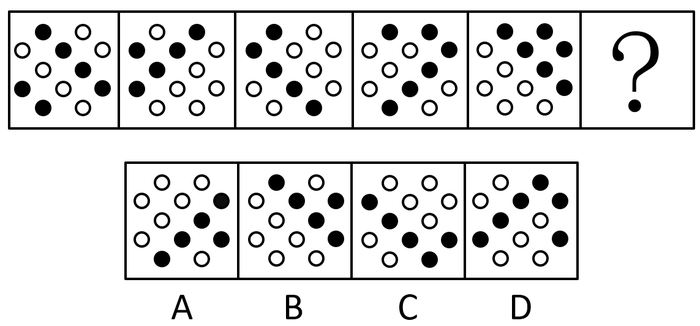
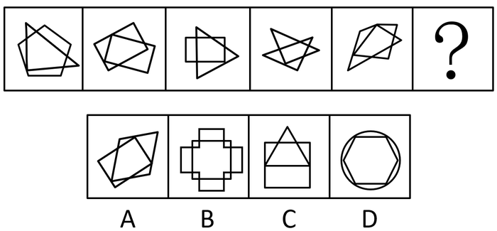
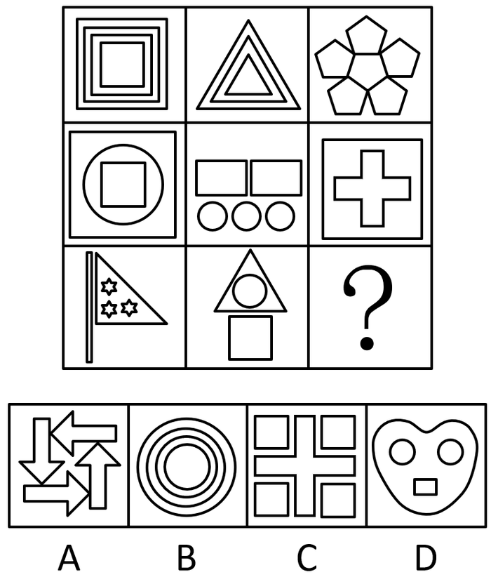
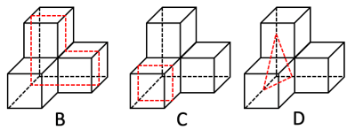
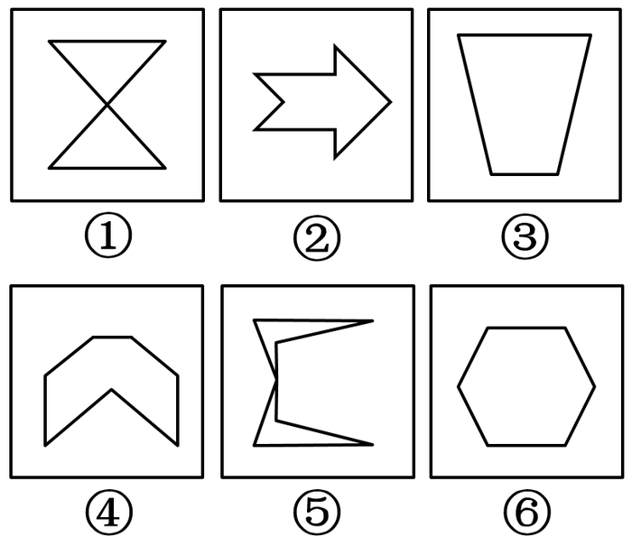
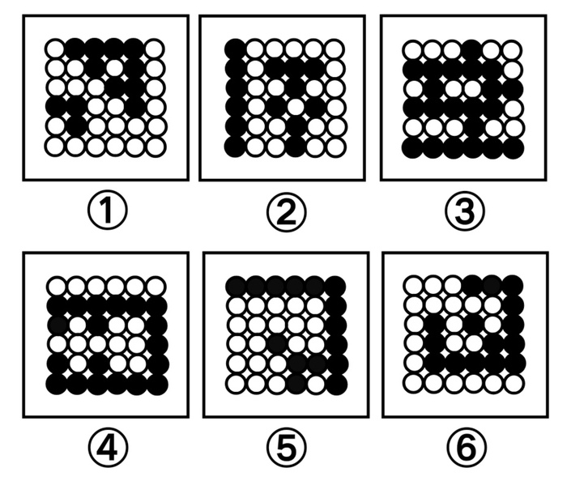
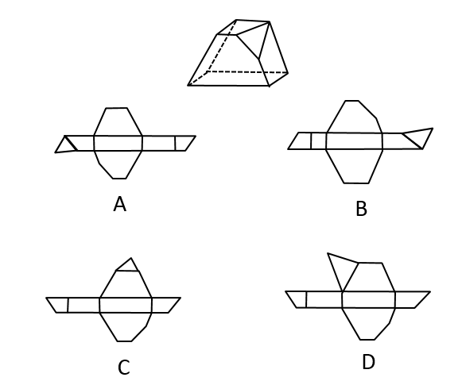
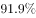

# 2019年四川省公务员录用考试《行测》题（下半年）（网友回忆版）

> 判断推理 · 30 题 · 四川 2019

## 第 1 题　qid 2444696 · 图形推理

从所给四个选项中，选择最合适的一个填入问号处，使之呈现一定规律性：

- **A**. A
- **B**. B
- **C**. C
- **D**. D　✅

**答案**：D

**官方解析**

元素组成基本相同，优先考虑位置规律，如下图所示，四个黑点连成的直线依次逆时针旋转，且内部两个黑点在内圈依次逆时针平移一格，两个黑点连成的直线在外圈依次顺时针平移一格，只有D项符合。

故正确答案为D。

---

## 第 2 题　qid 2444702 · 图形推理

从所给四个选项中，选择最合适的一个填入问号处，使之呈现一定规律性：

- **A**. A
- **B**. B　✅
- **C**. C
- **D**. D

**答案**：B

**官方解析**

元素组成不同，且无明显属性规律，考虑数量规律。观察发现，题干均为多边形，优先考虑数线，但无规律。此外图形线条交叉明显，考虑数交点。题干图形点数量分别为3、4、5、6、7，故？处应该选择一个交点数为8的图形，只有B项符合。
故正确答案为B。

---

## 第 3 题　qid 2444709 · 图形推理

从所给四个选项中，选择最合适的一个填入问号处，使之呈现一定规律性：

- **A**. A　✅
- **B**. B
- **C**. C
- **D**. D

**答案**：A

**官方解析**

元素组成不同，且每幅图均为两个封闭图形相交，考虑图形间关系。观察发现，题干图形均是相交于面，考虑相交面的形状。题干所有图形相交面的形状均为五边形，故？处也应选择一个相交面的形状是五边形的图形，只有A项符合。
故正确答案为A。

---

## 第 4 题　qid 2444712 · 图形推理

从所给四个选项中，选择最合适的一个填入问号处，使之呈现一定规律性：

- **A**. A
- **B**. B
- **C**. C
- **D**. D　✅

**答案**：D

**官方解析**

元素组成不同，且无明显属性规律，考虑数量规律。观察发现，题干出现多个小元素，优先考虑元素的种类和个数。题干元素的个数无明显规律，考虑元素的种类。第一行均为1种元素，第二行均为2种元素，第三行前两幅图均为3种元素，故？处也应选择一个有3种小元素的，只有D项符合。
故正确答案为D。

---

## 第 5 题　qid 2444719 · 图形推理

下边给定的是正方体的外表面展开图，下面哪一项不能由它折叠而成？

- **A**. A
- **B**. B
- **C**. C　✅
- **D**. D

**答案**：C

**官方解析**

将原展开图标上序号如下图，逐一选项进行分析。

A项：因为面c和面e是相对面，所以选项出现的是面c、面f和面b，选项与展开图一致，排除；

B项：因为面e和面c是相对面，所以选项出现的是面e、面b和面f，选项与展开图一致，排除；

C项：因为面d和面b是相对面，所以选项出现的是面d、面a和面e，如上图所示，在展开图中只有面d中的小黑三角脚踩斜线面e，面a中的小黑三角脚踩的是斜线面b，而选项中面a和面d中的小黑三角都脚踩斜线面e，选项与展开图不一致，当选；

D项：因为面f和面a是相对面，所以选项出现的是面f、面c和面d，选项与展开图一致，排除。

本题为选非题，故正确答案为C。

---

## 第 6 题　qid 2444725 · 图形推理

左图给定的是由4个相同正方体组合成的立体图形，将其从任一面剖开，下面哪一项不可能是该立体图形的截面？

- **A**. A　✅
- **B**. B
- **C**. C
- **D**. D

**答案**：A

**官方解析**

本题考查截面图，如下图所示，B、C、D三项均可截出，只有A项无法截出。

 

本题为选非题，故正确答案为A。

---

## 第 7 题　qid 2444739 · 图形推理

把下面的六个图形分为两类，使每一类图形都有各自的共同特征或规律，分类正确的一项是：

- **A**. ①③④，②⑤⑥
- **B**. ①③⑤，②④⑥
- **C**. ①②⑥，③④⑤
- **D**. ①⑤⑥，②③④　✅

**答案**：D

**官方解析**

本题为分组分类题目。元素组成不同，且无明显属性规律，考虑数量规律。题干图形均出现明显端点，考虑笔画数，图①⑤⑥的奇点数都是4，为2笔画图形；图②③④的奇点数都是2，为1笔画图形，即①⑤⑥一组，②③④一组。
故正确答案为D。

---

## 第 8 题　qid 2444746 · 图形推理

把下面的六个图形分为两类，使每一类图形都有各自的共同特征或规律，分类正确的一项是：

- **A**. ①②③，④⑤⑥
- **B**. ①③⑤，②④⑥　✅
- **C**. ①⑤⑥，②③④
- **D**. ①④⑥，②③⑤

**答案**：B

**官方解析**

本题为分组分类题目。元素组成不同，且无明显属性规律，考虑数量规律。题干图形均由直线构成，考虑数直线，但整体数直线没有规律，考虑线的细化考法，即线的方向，图①③⑤有1组平行线，图②④⑥有3组平行线，即①③⑤一组，②④⑥一组。
故正确答案为B。

---

## 第 9 题　qid 2444750 · 图形推理

把下面的六个图形分为两类，使每一类图形都有各自的共同特征或规律，分类正确的一项是：

- **A**. ①③④，②⑤⑥
- **B**. ①③⑤，②④⑥
- **C**. ①②⑥，③④⑤
- **D**. ①④⑥，②③⑤　✅

**答案**：D

**官方解析**

本题为分组分类题目。元素组成不同，优先考虑属性规律。观察发现，图①④⑥黑球区域为轴对称图形，图②③⑤白球区域为轴对称图形，即①④⑥一组，②③⑤一组。

故正确答案为D。

---

## 第 10 题　qid 2444753 · 图形推理

下图是立体图形，下列哪个选项可以折叠成该立体图形？

- **A**. A　✅
- **B**. B
- **C**. C
- **D**. D

**答案**：A

**官方解析**

本题考查空间重构，可通过对比选项，结合排除法确定答案。为了方便理解，作图如下：

题干中的红边，在B项中对应标红的两条边，但二者长度不相等，排除B项；题干中的绿色梯形和黄色三角形没有公共边，而C、D两项中二者均存在公共边（绿线），排除。

故正确答案为A。

---

## 第 11 题　qid 2444758 · 定义判断

防御机制是心灵对内外压力和情绪冲突做出无意识和自动化反应的方式。它们限制了一个人对焦虑、抑郁或嫉妒等负面情绪的觉察，以解决内在的情绪冲突。替代是一种防御机制，是个体把无法对某人或物发泄的精力转移到另一个人或物上的过程。
根据上述定义，下列属于替代的是：

- **A**. 王先生早上没时间吃饭，于是中午把早午饭一起吃了
- **B**. 小张在单位受了老板的气，回家后把怒气转嫁到了孩子身上　✅
- **C**. 小冰想吃冰激凌，但妈妈不让吃凉的，小冰只好买了很多糖果
- **D**. 小周很喜欢一位男同事，却经常跟别的同事讨论该男同事的缺点

**答案**：B

**官方解析**

第一步：找出定义关键词。
“个体”、“把无法对某人或物发泄的精力转移到另一个人或物上的过程”。
第二步：逐一分析选项。
A项：王先生中午把早午饭一起吃了，没有涉及到发泄，不符合“把无法对某人或物发泄的精力转移到另一个人或物上的过程”，不符合定义，排除； 
B项：小张在单位受了老板的气，回家后把怒气转嫁到了孩子身上，符合“个体”、“把无法对某人或物发泄的精力转移到另一个人或物上的过程”，符合定义，当选；
C项：小冰没法吃冰激凌，只好买了很多糖果，没有涉及到发泄，不符合“把无法对某人或物发泄的精力转移到另一个人或物上的过程”，不符合定义，排除；
D项：小周经常跟别的同事讨论自己喜欢的男同事的缺点，没有涉及发泄，不符合“把无法对某人或物发泄的精力转移到另一个人或物上的过程”，不符合定义，排除。
故正确答案为B。

---

## 第 12 题　qid 2444761 · 定义判断

环境教育是以人类与环境的关系为核心，以解决环境问题和实现可持续发展为目的，以提高人们的环境意识和有效参与能力、普及环境保护知识与技能、培养环境保护人才为任务，以教育为手段而展开的一种社会实践活动。
根据上述定义，下列教学内容最符合环境教育的是：

- **A**. 倡导遵守保护环境的行为规范　✅
- **B**. 讲授与环境有关的自然科学知识
- **C**. 讲授改造自然环境的理论与方法
- **D**. 提倡从环境中获取满足人类需求的资源

**答案**：A

**官方解析**

第一步：找出定义关键词。
“以人类与环境的关系为核心”、“以解决环境问题和实现可持续发展为目的”。 
第二步：逐一分析选项。
A项：倡导遵守保护环境的行为规范，最终的目的是为了保护环境，符合“以人类与环境的关系为核心”、“以解决环境问题和实现可持续发展为目的”，符合定义，当选； 
B项：讲授与环境有关的自然科学知识，不符合“以人类与环境的关系为核心”，不符合定义，排除；
C项：讲授改造自然环境的理论与方法，不符合“以解决环境问题和实现可持续发展为目的”，不符合定义，排除；
D项：提倡从环境中获取满足人类需求的资源，没有体现是否要保护环境，是否应可持续获取，不符合“以解决环境问题和实现可持续发展为目的”，不符合定义，排除。
故正确答案为A。

---

## 第 13 题　qid 2444774 · 定义判断

幸存者偏差谬误是统计学中的一种谬误，它是指我们忽略了那些已经不可能向我们显示的数据，而仅仅根据能够向我们展现出的数据，从而得出某种错误结论的谬误。
根据上述定义，下列不属于幸存者偏差谬误的是：

- **A**. 记者在高铁上调查乘客买票的情况后认为，买到车票非常容易
- **B**. 小张看到大多数人给予某部电影好评，因此决定去看这部电影　✅
- **C**. 许多商业传奇的缔造者都是辍学后创业的，小李读了他们的传记，决定退学创业
- **D**. 老王在朋友圈询问哪种钙片补钙效果好，老刘推荐了A钙片，于是他决定服用该种钙片

**答案**：B

**官方解析**

第一步：找出定义关键词。
“忽略了那些已经不可能向我们显示的数据”、“仅仅根据能够向我们展现出的数据，从而得出某种错误结论”。
第二步：逐一分析选项。
A项：记者在高铁上调查乘客的买票情况，高铁上的乘客都是有票的，符合“忽略了那些已经不可能向我们显示的数据”、“仅仅根据能够向我们展现出的数据，从而得出某种错误结论”，符合定义，排除； 
B项：小张看到大多数人给予某部电影好评决定去看，就是根据大数据整体评估后做出的决定，不符合“忽略了那些已经不可能向我们显示的数据”、“仅仅根据能够向我们展现出的数据，从而得出某种错误结论”，不符合定义，当选；
C项：小李读了辍学者创业成功的传记后决定退学创业，这本书本来就只记录那些成功的案例，没有讲述失败者的，符合“忽略了那些已经不可能向我们显示的数据”、“仅仅根据能够向我们展现出的数据，从而得出某种错误结论”，符合定义，排除；
D项：老王问的是哪种好，只看了老刘说A好，看不到那些说A不好的，符合“忽略了那些已经不可能向我们显示的数据”、“仅仅根据能够向我们展现出的数据，从而得出某种错误结论”，符合定义，排除。
本题为选非题，故正确答案为B。

---

## 第 14 题　qid 2444776 · 定义判断

顺从是指在他人的直接请求下按照他人要求做的倾向，即接受他人请求，使他人请求得到满足的行为。它是一种人与人之间发生相互影响的基本方式。
根据上述定义，下列属于顺从的是：

- **A**. 非典爆发期间，人们争相购买板蓝根
- **B**. 小军从军期间按照组织的安排去了西藏工作
- **C**. 女友说想吃火锅，晓强带她去了最近的一家火锅店　✅
- **D**. 为了让妈妈安心上班，小菁主动提出要照顾生病的奶奶

**答案**：C

**官方解析**

第一步：找出定义关键词。
“接受他人请求”。
第二步：逐一分析选项。
A项：非典爆发期间，人们争相购买板蓝根，不符合“接受他人请求”，不符合定义，排除； 
B项：小军从军期间按照组织的安排去了西藏工作，这是组织的命令，不符合“接受他人请求”，不符合定义，排除；
C项：女友说想吃火锅，晓强带她去了火锅店，符合“接受他人请求”，符合定义，当选；
D项：小菁主动提出照顾生病的奶奶，不符合“接受他人请求”，不符合定义，排除。
故正确答案为C。

---

## 第 15 题　qid 2444777 · 定义判断

知觉的选择性是指人在知觉过程中把知觉对象从背景中区分出来加以优先清晰地反映的特性。其中被清晰知觉到的客体叫对象，未被清晰知觉到的客体叫背景。
根据上述定义，下列体现知觉的选择性的是：

- **A**. 人们经常把画得不完整的三角形看成是完整的三角形
- **B**. 在山下看，觉得城市很大；爬上山顶之后再看，觉得城市很小
- **C**. 外国留学生经常把“拆除”写成“折陈”，把“银行”看成“很行”
- **D**. 樵夫和猎人看同一张森林照片，樵夫看到很多树木，猎人则看到林间的猎物　✅

**答案**：D

**官方解析**

第一步：找出定义关键词。
“在知觉过程中”、 “把知觉对象从背景中区分出来加以优先清晰地反映”。
第二步：逐一分析选项。
A项：把画得不完整的三角形看成完整的三角形，未体现“把知觉对象从背景中区分出来加以优先清晰地反映”，不符合定义，排除；
B项：在山下看时城市很大，在山顶看时城市很小是由于观察距离的影响，而不是“把知觉对象从背景中区分出来加以优先清晰地反映”，不符合定义，排除；
C项：把拆除写成折陈，把银行看成很行是由于看错了字，而不是“把知觉对象从背景中区分出来加以优先清晰地反映”，不符合定义，排除；
D项：樵夫看的是很多树木，猎人看的是林间猎物是由于两个人的关注点不同，所以将自己优先关注到的事物提取出来，符合“把知觉对象从背景中区分出来加以优先清晰地反映”，符合定义，当选；
故正确答案为D。

---

## 第 16 题　qid 2444735 · 类比推理

云梯：攻城

- **A**. 水稻：栽培
- **B**. 商品：生产
- **C**. 油灯：照明　✅
- **D**. 驿站：传信

**答案**：C

**官方解析**

第一步：判断题干词语间逻辑关系。
云梯可以用来攻城，二者是功能对应。
第二步：判断选项词语间逻辑关系。
A项：栽培水稻，二者是动宾短语，与题干逻辑关系不一致，排除；
B项：生产商品，二者是动宾短语，与题干逻辑关系不一致，排除；
C项：油灯可以用来照明，二者是功能对应，与题干逻辑关系一致，当选；
D项：驿站是古代供传递军事情报的官员途中食宿、换马的场所，所以功能不是传信，与题干逻辑关系不一致，排除。
故正确答案为C。

---

## 第 17 题　qid 2444738 · 类比推理

飞行员：飞机

- **A**. 教师：教室　✅
- **B**. 海军：大海
- **C**. 妻子：家庭
- **D**. 皇帝：皇宫

**答案**：A

**官方解析**

第一步：判断题干词语间逻辑关系。
飞机是飞行员工作的场所，二者是工作场所的对应。
第二步：判断选项词语间逻辑关系。
A项：教室是教师工作的场所，二者是工作场所的对应，与题干逻辑关系一致，当选；
B项：海军在大海里作战，二者是工作场所的对应，但是大海包含的范围太广，而题干是一个具体的工作场所，与题干逻辑关系不一致，排除；
C项：妻子在家庭里生活，二者是生活地点的对应，与题干逻辑关系不一致，排除；
D项：皇帝住在皇宫里，二者是生活地点的对应，与题干逻辑关系不一致，排除。
故正确答案为A。

---

## 第 18 题　qid 2444741 · 类比推理

红颜：娥眉：女性

- **A**. 襁褓：垂髫：幼儿
- **B**. 花甲：耄耋：老人　✅
- **C**. 四海：八荒：天下
- **D**. 婵娟：玉盘：月亮

**答案**：B

**官方解析**

第一步：判断题干词语间逻辑关系。
红颜和娥眉都可以指代女性，前两个词与第三个词构成比喻象征义。
第二步：判断选项词语间逻辑关系。
A项：襁褓可以借指未满周岁的婴儿，垂髫可以借指儿童，两者均不指幼儿，与题干逻辑关系不一致，排除；
B项：花甲和耄耋均借指老人，前两个词与第三个词构成比喻象征义，与题干逻辑关系一致，保留；
C项：四海和八荒均可以借指天下，前两个词与第三个词构成比喻象征义，与题干逻辑关系一致，保留；
D项：婵娟和玉盘均借指月亮，前两个词与第三个词构成比喻象征义，与题干逻辑关系一致，保留；
对比B项、C项和D项，题干和B项均说的是人，所以B项和题干逻辑关系更为一致。
故正确答案为B。

---

## 第 19 题　qid 2444744 · 类比推理

页面设置：页边距：文字方向

- **A**. 插入图片：公式：页码
- **B**. 字体设置：宋体：黑体
- **C**. 邮件发送：附件：正文　✅
- **D**. 保存文档：硬盘：手机

**答案**：C

**官方解析**

第一步：判断题干词语间逻辑关系。
页边距、文字方向是页面设置所包括的两个具体内容，后两者为并列关系，与页面设置为包容关系。
第二步：判断选项词语间逻辑关系。
A项：插入图片与公式、页码无明显关系，公式、页码也可以是插入的内容，二者为并列关系，与题干逻辑关系不一致，排除；
B项：宋体与黑体是字体设置时可以选择的两种字体，后二者为并列关系，但与字体设置为对应关系，并非包容关系，与题干逻辑关系不一致，排除；
C项：附件与正文是邮件发送所包括的两个具体内容，后两者为并列关系，与邮件发送为包容关系，与题干逻辑关系一致，当选；
D项：硬盘与手机（闪存）是保存文档的两个设备，后两者为并列关系，与保存文档为对应关系，并非包容关系，与题干逻辑关系不一致，排除。
故正确答案为C。

---

## 第 20 题　qid 2444745 · 类比推理

（  ）对于 大厦 相当于 琵琶 对于（  ）

- **A**. 城堡；电吉他　✅
- **B**. 高楼；舞台
- **C**. 工人；制琴师
- **D**. 房间；琴弦

**答案**：A

**官方解析**

逐一代入选项。
A项：城堡与大厦是两种建筑，二者为并列关系中的反对关系，且城堡出现在大厦之前，城堡是古代建筑，大厦是现代建筑；琵琶与电吉他是两种乐器，二者为并列关系中的反对关系，且琵琶出现在电吉他之前，琵琶是古代乐器，电吉他是现代乐器，前后逻辑关系一致，当选；
B项：大厦是一种高楼，二者为包容关系中的种属关系；在舞台上弹奏琵琶，二者为地点对应关系，前后逻辑关系不一致，排除；
C项：工人建造大厦，制琴师制造琵琶，均为制作者与成品的对应关系，但词语顺序不同，前后逻辑关系不一致，排除；
D项：房间是大厦的组成部分，琴弦是琵琶的组成部分，二者均为包容关系中的组成关系，但词语顺序不同，前后逻辑关系不一致，排除。
故正确答案为A。

---

## 第 21 题　qid 2444748 · 逻辑判断

某单位办公室共有12名工作人员。其中，有3名干部是博士，但并非所有的博士都是管理学专业毕业的，而所有女性工作人员都是管理学专业毕业的。由此可以推出：

- **A**. 有些女性不是干部
- **B**. 有些博士不是女性　✅
- **C**. 有些女性不是博士
- **D**. 有些干部不是管理学专业毕业的

**答案**：B

**官方解析**

第一步：翻译题干。

①有的干部博士；

②有的博士管理学专业毕业；

③女性管理学专业毕业；

将③逆否和②可以递推出：④有的博士管理学专业毕业女性。

第二步：逐一分析选项。

A项：翻译为有的女性干部，根据③，可以推出有的女性是管理学专业毕业，但①②中包含“有的”，无法进行逆否，因此，该项无法推出，排除；

B项：翻译为有的博士女性，根据④可以推出，当选；

C项：翻译为有的女性博士，根据④可以推出“有的博士女性”，利用置换只能推出“有的女性博士”，推不出“有的女性博士”，排除；

D项：翻译为有的干部管理学专业毕业，①②中包含“有的”，不满足递推规则，无法推出，排除。

故正确答案为B。

---

## 第 22 题　qid 2444751 · 逻辑判断

胎儿大脑发育需要一种重要的营养物质脂肪酸即二十二碳六烯酸（DHA)。有人建议，孕妇在孕期服用富含DHA的鱼油补充剂有利于胎儿的大脑发育。临床试验中，两组孕妇每日服用含有800毫克DHA的补充剂或安慰剂。两组孩子在18个月大时，其平均的认知、语言及运动评分之间没有差别。此后，研究人员对这些孩子在4岁时的表现进行了跟踪评估，大多数（)家庭参与了该研究。研究人员发现，对认知、从事复杂思维处理、语言及执行功能（如记忆、推理、解决问题）的检测结果在两组间没有显著差异。研究者认为，母亲妊娠期补充DHA不能使孩子更聪明。

以下哪项如果为真，最能驳斥研究者观点？

- **A**. 胎儿的DHA来自母亲的饮食，但母亲需要摄入的DHA的确切数量目前难以确定
- **B**. DHA补充剂可能降低早产的风险，也可能降低那些有家族过敏史的孩子患过敏的风险
- **C**. 7岁才是能够预测智力的最早年龄，4岁时各种因素对发育的影响尚未充分表现，不能可靠评估　✅
- **D**. 研究证明，孩子出生后补充DHA有益于认知能力发展，该国婴儿出生后常规服用富含DHA的补充剂

**答案**：C

**官方解析**

第一步：找出论点和论据。

论点：母亲妊娠期补充DHA不能使孩子更聪明。

论据：临床试验中，两组孕妇每日服用含有800毫克DHA的补充剂或安慰剂。两组孩子在18个月大时，其平均的认知、语言及运动评分之间没有差别。此后，研究人员对这些孩子在4岁时的表现进行了跟踪评估，大多数（）家庭参与了该研究。研究人员发现，对认知、从事复杂思维处理、语言及执行功能（如记忆、推理、解决问题）的检测结果在两组间没有显著差异。

本题通过对比试验的结果，两组孩子在18个月大以及4岁时，平均的认知、语言、运动评分以及认知、从事复杂思维处理、语言及执行功能（如记忆、推理、解决问题）的检测结果没有明显差异，作为论据得出论点母亲妊娠期补充DHA不能使孩子更聪明，两者话题不一致，削弱优先考虑拆桥，即证明18个月大以及4岁这些能力不能代表孩子是否聪明。

第二步：逐一分析选项。

A项：指出母亲需要摄入的DHA数量难以确定，没有涉及摄入DHA后对胎儿的影响，无法削弱，排除；

B项：指出DHA补充剂可能可以降低早产以及有家族过敏史的孩子患过敏的风险，没有涉及对孩子智力的影响，属于无关项，排除；

C项：指出7岁是预测智力的最早年龄，论据中对4岁孩子各种能力的评估无法证明孩子是否聪明，削弱了论据与论点之间的关系，拆桥，削弱论证，当选；

D项：说的是孩子出生后补充DHA有益于认知能力发展，而论点说的是母亲妊娠期补充DHA不能使孩子更聪明，二者话题不一致，属于无关项，排除。

故正确答案为C。

---

## 第 23 题　qid 2444754 · 图形推理

考古学家通过对消失已久的鹦鹉嘴龙进行体色重建，发现其腹部颜色为浅色而背部颜色较深。这是一种保护色，作用是通过在身体上形成阴影，让动物自身在其他动物眼中失去立体效果，因此也被称为反荫蔽体色，这在现代动物中也较为常见。据此分析，考古学家推测鹦鹉嘴龙最有可能居住在森林里。
要得到上述结论，最需要补充的前提条件是：

- **A**. 生活在森林中的动物其体色模式大多为反荫蔽体色　✅
- **B**. 恐龙包含许多种类，其中大部分都生活在森林和草原中
- **C**. 在一发现恐龙化石的地区，考古推测该区域曾有大片的森林
- **D**. 鹦鹉嘴龙是一种小型恐龙，这种体色对于逃避天敌有天然的伪装作用

**答案**：A

**官方解析**

第一步：找出论点和论据。
论点：鹦鹉嘴龙最有可能居住在森林里。
论据：考古学家通过对消失已久的鹦鹉嘴龙进行体色重建，发现其腹部颜色为浅色而背部颜色较深。这是一种保护色，作用是通过在身体上形成阴影，让动物自身在其他动物眼中失去立体效果，因此也被称为反荫蔽体色，这在现代动物中也较为常见。
论点讨论的是鹦鹉嘴龙生活在森林里，论据讨论的是鹦鹉嘴龙有反荫蔽体色，论点和论据话题不一致，要想加强，优先考虑搭桥，即建立森林和反荫蔽体色之间的关系。
第二步：逐一分析选项。
A项：该项指出生活在森林中的动物其体色模式大多为反荫蔽体色，那么鹦鹉嘴龙有反荫蔽体色，就很有可能生活在森林里，建立了论点和论据之间的联系，为搭桥项，当选；
B项：该项指出恐龙大多数生活在森林和草原中，无法得知鹦鹉嘴龙是生活在森林还是草原，无法加强，排除；
C项：该项指出考古推测发现的恐龙区域曾有大片森林，与鹦鹉嘴龙是否生活在森林无关，无法加强，排除； 
D项：该项强调鹦鹉嘴龙体色的作用，与鹦鹉嘴龙是否生活在森林无关，无法加强，排除。 
故正确答案为A。

---

## 第 24 题　qid 2444755 · 逻辑判断

某研究小组在1984年挑选了10万名身体健康的志愿者，在2010年的反馈调查中，超过2.6万名志愿者已经离世。研究小组发现，经常食用诸如麦片、糙米、玉米和藜麦等粗粮的志愿者生病和死亡比例比不食用者低，尤其是患血管疾病的比例更低。研究人员认为，食用粗粮有助于身体健康。
以下哪项如果为真，不能支持研究人员的结论？

- **A**. 粗粮是运动员和减肥人士的最佳早餐
- **B**. 粗粮是世界上很多国家老百姓的主食　✅
- **C**. 在很多医学典籍里，有食用粗粮治病的记载
- **D**. 经常食用粗粮有助于降低罹患肥胖症的风险

**答案**：B

**官方解析**

第一步：找出论点和论据。
论点：食用粗粮有助于健康。
论据：经常食用诸如麦片、糙米、玉米和藜麦等粗粮的志愿者生病和死亡比例比不食用者低，尤其是患血管疾病的比例更低。
论点和论据讨论的均是粗粮有助于身体健康，话题一致，要想加强，可以考虑补充论据，即说明粗粮对身体健康有益的原因，或者举例说明粗粮有助于身体健康。
第二步：逐一分析选项。
A项：该项指出粗粮是运动员和减肥人士的最佳早餐，运动员和减肥人士相对来说吃的比较健康，举例说明粗粮有助于身体健康，可以加强，排除；
B项：该项指出粗粮是世界上很多国家老百姓的主食，与粗粮是否有助于身体健康无关，无法加强，当选；
C项：该项指出医学典籍中有食用粗粮治病的记载，举例说明粗粮有助于身体健康，可以加强，排除； 
D项：该项强调经常食用粗粮有助于降低罹患肥胖病的风险，说明粗粮确实对人体健康有益，可以加强，排除。 
本题为选非题，故正确答案为B。

---

## 第 25 题　qid 2444757 · 类比推理

老鼠在猫的左边，狗在老鼠右边，老鼠正上方有只黄鹂，狗的正上方有只喜鹊，下列位置关系正确的是：

- **A**. 狗的左边是猫
- **B**. 狗的右边是猫
- **C**. 黄鹂的右边是喜鹊　✅
- **D**. 黄鹂的左边是喜鹊

**答案**：C

**官方解析**

第一步：分析题干条件。

根据题干条件，老鼠提及的最多，从最大信息入手，老鼠在猫的左边，那么猫就在老鼠的右边，根据第二个条件，狗也在老鼠的右边，那么猫和狗的位置有以下两种情况，如下图所示。

情况一：

情况二：

第二步：逐一分析选项。

A项：如上图所示，情况一中，狗的右边是猫，该项错误，排除；

B项：如上图所示，情况二中，狗的左边是猫，该项错误，排除；

C项：如上图所示，两种情况均满足黄鹂的右边是喜鹊，该项正确，当选；

D项：如上图所示，两种情况均满足黄鹂的右边是喜鹊，该项错误，排除。 

故正确答案为C。

---

## 第 26 题　qid 2444760 · 逻辑判断

3月20日，某网约车公司对北京三环内非京牌车辆停止派单，9天后，该公司又在客户端上给司机发出了一则通知，宣布从4月1日起将在全北京范围内停止向非京牌车辆派单。这说明从4月1日起，北京市民将再次面临“叫车难”的问题。
以下哪项最能削弱上述预测？

- **A**. 停止向非京牌车辆派单能在一定程度上缓解交通拥堵
- **B**. 在北京运营的网约车中，外地牌照车辆大约占一半以上
- **C**. 该网约车公司表示，将会采取多种措施提升北京市民叫车的效率　✅
- **D**. 很多“京人京牌”并且符合细则规定的网约车司机对未来充满了期待

**答案**：C

**官方解析**

第一步：找出论点和论据。
论点：从4月1日起，北京市民将再次面临“叫车难”的问题。
论据：3月20日，某网约车公司对北京三环内非京牌车辆停止派单，9天后，该公司又在客户端上给司机发出了一则通知，宣布从4月1日起将在全北京范围内停止向非京牌车辆派单。
论点和论据讨论的都是网约车公司停止向非京牌车辆派单导致市民“叫车难”的问题，话题一致，要想削弱，可以直接否定论点，即网约车公司停止向非京牌车辆派单不会导致市民“叫车难”的问题。
第二步：逐一分析选项。
A项：该项指出停止向非京牌车辆派单能在一定程度上缓解交通拥堵，与是否会造成居民“叫车难”的问题无关，无法削弱，排除；
B项：该项指出在北京运营的网约车中，外地牌照车辆大约占一半以上，那么该公司停止向非京牌车辆派单，可能一定程度上会造成市民“叫车难”的问题，具有一定的加强作用，无法削弱，排除；
C项：该项指出该网约车公司将会采取多种措施提升北京市民叫车的效率，那么停止向非京牌车辆派单就不会造成市民“叫车难”的问题，直接否定论点，可以削弱，当选； 
D项：该项指出很多“京人京牌”并且符合细则规定的网约车司机对未来充满了期待，与市民是否会面临“叫车难”的问题无关，无法削弱，排除。 
故正确答案为C。

---

## 第 27 题　qid 2444762 · 逻辑判断

有一种观点认为，人体缺水是导致感冒的原因。反对者则认为，并非是缺水，受凉才是导致感冒的根本原因。
以下哪项如果为真，最能削弱反对者的观点？

- **A**. 人体缺水之后，更容易受凉　✅
- **B**. 感冒往往伴随着发烧，而发烧通常会导致缺水、怕冷
- **C**. 即使没有受凉，人体缺水之后也会出现很多类似感冒的症状
- **D**. 受凉之后，更容易导致人体缺水、抵抗力下降，从而引发感冒

**答案**：A

**官方解析**

第一步：找出论点和论据。
论点：并非是缺水，受凉才是导致感冒的根本原因。
论据：无。
本题只有论点，考虑削弱论点，即是缺水导致感冒而不是受凉。
第二步：逐一分析选项。
A项：论点说的是导致感冒的根本原因是受凉不是缺水，该项说的是缺水导致受凉进而导致感冒，因此导致感冒的根本原因还是缺水，直接削弱论点，当选；
B项：说的是发烧导致缺水、怕冷，而发烧是伴随着感冒产生的，并不能说发烧就是感冒，所以感冒与缺水之间的关系不明确，无法削弱，排除；
C项：缺水之后会出现类似感冒的症状，类似感冒的症状与感冒并没有必然的关系，无关项，无法削弱，排除；
D项：受凉之后，导致缺水、感冒，说明是受凉是感冒的根本原因，加强项，无法削弱，排除。
故正确答案为A。

---

## 第 28 题　qid 2444765 · 逻辑判断

如果专利技术的宣传推广有足够的资金支持，那么专利技术的拥有者将更加关注其专利技术的宣传推广工作。专利技术宣传推广得越充分，其转化为专利产品、创造价值的可能性也就越大，整个社会的创新能力也将得到进一步提高。因此，如果国家增加专利技术宣传推广的补贴，那么将有力增强整个社会的创新能力。
以下哪项如果为真，最能支持上述论述？

- **A**. 有些专利技术转换为产品后所带来的收益尚不足以支付其宣传推广费用
- **B**. 专利技术拥有者越关注宣传推广，其专利技术的宣传推广就可以做得越充分　✅
- **C**. 如果国家不增加专利技术宣传推广的补贴，那么将不能增强整个社会的创新能力
- **D**. 如果专利技术拥有者不关注宣传推广工作，那么其专利技术就很难转化为专利产品

**答案**：B

**官方解析**

第一步：找出论点和论据。
论点：如果国家增加专利技术宣传推广的补贴，那么将有力增强整个社会的创新能力。
论据：如果专利技术的宣传推广有足够的资金支持，那么专利技术的拥有者将更加关注其专利技术的宣传推广工作。专利技术宣传推广得越充分，其转化为专利产品、创造价值的可能性也就越大，整个社会的创新能力也将得到进一步提高。
论点和论据中均出现了“如果…那么”此类逻辑关联词，可优先把它们翻译出来，帮助解题。论据“宣传推广足够资金→关注宣传推广；宣传推广充分→创新能力提高”，论点“宣传推广足够资金→创新能力提高”，论据的结构是“1→2；3→4”，要得到论点“1→4”，只需补充“2→3”即可，即建立“关注宣传推广”和“宣传推广充分”之间的关系。
第二步：逐一分析选项。
A项：论点讨论的是如果国家增加专利技术宣传推广的补贴，能不能增强创新能力，选项说有些专利技术转换为产品后所带来的收益不足以支付宣传推广费用，不能加强，排除；
B项：关注宣传推广→宣传推广充分，建立了“关注宣传推广”和“宣传推广充分”之间的关系，补充论据，可以加强，当选；
C项：论点是“宣传推广足够资金→创新能力提高”，选项是“—宣传推广足够资金→—创新能力提高”，论点讨论的是满足了“宣传推广足够资金”这个条件，创新能力能不能提高，选项说的是没满足“宣传推广足够资金”这个条件，创新能力怎么样，无关项，排除；
D项：—关注宣传推广→专利技术就很难转化为专利产品，未涉及“关注宣传推广”和“宣传推广充分”之间的关系，无关项，排除。
故正确答案为B。
注：这道题有很多小伙伴错选了C，觉得C是“无因无果”，所以能加强，但是要注意了，题干的论点不是因果关系，而是条件关系，所以当论点和论据涉及条件关系的时候，优先把它翻译出来，建立关系即可；当论点和论据涉及因果关系的时候，再考虑“无因无果”这种加强方式。

---

## 第 29 题　qid 2444767 · 逻辑判断

甲、乙、丙都准备开始锻炼身体，他们可以选择徒步、跳绳和打乒乓球三种方式。已知：
（1）甲不喜欢徒步，如果有乙结伴，他就选择打乒乓球；
（2）乙不在意方式，如果跳绳比徒步效果好，他就选择跳绳；
（3）丙不在意距离，除非预报室外有雾霾，否则选择徒步；
（4）乙、丙两家是邻居，如果休息时间一致，他们将结伴徒步。
如果要满足上述要求，则下列说法正确的是：

- **A**. 如果甲和丙跳绳，则室外有雾霾
- **B**. 如果三人都徒步，则徒步要比跳绳效果好
- **C**. 如果三人都不徒步，则乙和丙的休息时间一定不一致　✅
- **D**. 如果乙没有选择徒步和跳绳，则他肯定选择和甲一起打乒乓球

**答案**：C

**官方解析**

第一步：分析题干信息。

（1）甲不喜欢徒步，甲乙结伴甲乒乓球；

（2）乙三种方式都可，跳绳比徒步效果好→乙跳绳；

（3）丙不在意距离，丙徒步室外有雾霾；

（4）乙、丙休息时间一致乙、丙结伴徒步。

第二步：逐一分析选项。

A项：甲丙选择跳绳，题干中并未提到关于甲丙跳绳的信息，无法推出，排除； 

B项：三人都徒步，说明甲乙丙均徒步，但题干未提到一人只能参加一项运动，因此乙有没有跳绳，跳绳和徒步谁的效果好，均无法推出，排除；

C项：三人都不徒步，说明乙丙没有结伴徒步，乙丙没有结伴徒步是对（4）的否后，否后必否前，可知乙、丙休息时间不一致，能够推出，当选；

D项：乙没有选择徒步和跳绳，那么乙选择乒乓球，但是否和甲结伴推不出来，无法推出，排除。

故正确答案为C。

---

## 第 30 题　qid 2444770 · 逻辑判断

一项研究认为，发达国家近20年来治疗甲状腺肿瘤的病例增多主要是因为过度诊疗。研究人员认为，随着新型成像技术的出现，越来越微小的甲状腺肿瘤被检测出来。大部分过度治疗的方式是完全切除甲状腺，它通常还和其他一些有害处理手段相结合，比如完全切除脖子上的淋巴结或者实施放射疗法。而实际上这些肿瘤大部分是微型乳头状瘤，只需要密切监视，不必立即采取干预性治疗手段。
以下哪项如果为真，最能支持上述结论？

- **A**. 过度使用放射疗法会损害人体的免疫系统
- **B**. 在发达国家，乳腺肿瘤也存在过度治疗的问题
- **C**. 完全切除甲状腺并非是治疗所有甲状腺疾病的最佳方式
- **D**. 在不存在过度诊疗的国家，甲状腺肿瘤的发病率及病死率并没有明显增高　✅

**答案**：D

**官方解析**

第一步：找出论点和论据。
论点：发达国家近20年来治疗甲状腺肿瘤的病例增多主要是因为过度诊疗。
论据：随着新型成像技术的出现，越来越微小的甲状腺肿瘤被检测出来。大部分过度治疗的方式是完全切除甲状腺，它通常还和其他一些有害处理手段相结合，比如完全切除脖子上的淋巴结成者实施放射疗法。而实际上这些肿瘤大部分是微型乳头状瘤，只需要密切监视，不必立即采取干预性治疗手段。
本题论点讨论发达国家近20年来治疗甲状腺肿瘤的病例增多主要是因为过度诊疗。论据讨论为什么过度治疗导致甲状腺肿瘤的病例增多，话题一致，考虑补充论据进行加强。
第二步：逐一分析选项。
A项：过度使用放射疗法会损害人体的免疫系统，题干的治疗方式中并未提到过度使用放射疗法，因此甲状腺肿瘤过度诊疗是否会影响人体的免疫系统未知，无关项，排除；
B项：乳腺肿瘤也存在过度治疗的问题，与甲状腺肿瘤的治疗方式无关，无关项，排除；
C项：说的是完全切除甲状腺并非是治疗所有甲状腺疾病的最佳方式，与论点讨论的是甲状腺肿瘤病例增多的原因无关，属于无关项，排除；
D项：在不存在过度诊疗的国家，甲状腺肿瘤的发病率及病死率并没有明显增高，说明甲状腺肿瘤的发病率增多是因为过度诊疗，因此大部分肿瘤不需要过度诊疗，补充论据，当选。
故正确答案为D。

---
