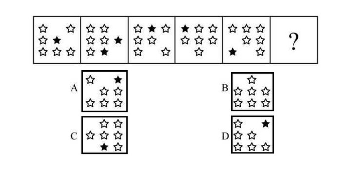
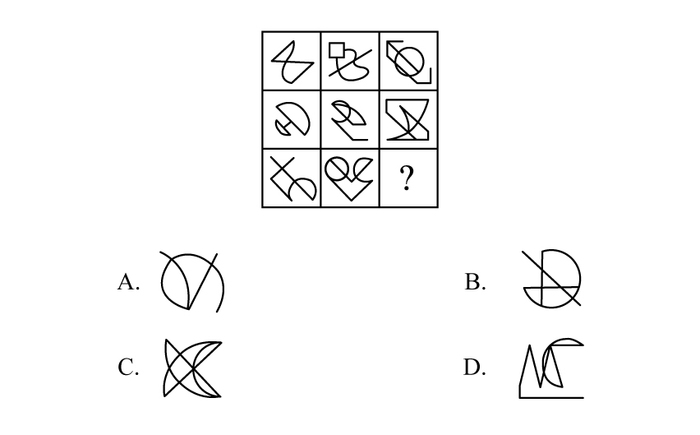
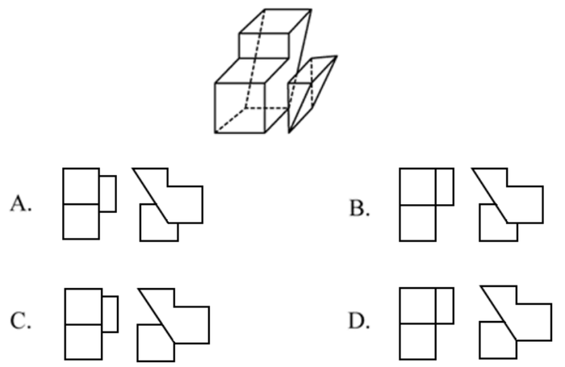
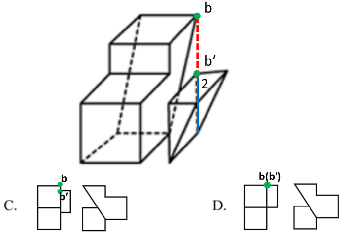
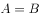
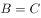
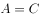
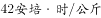

# 2019年四川省选调优秀大学毕业生到基层工作《行测》试题（网友回忆版）

> 判断推理 · 30 题 · 选调 2019

## 第 1 题　qid 2377218 · 图形推理

从所给的选项中，选择最合适的一个填入问号处，使之呈现一定的规律性：

- **A**. A
- **B**. B
- **C**. C
- **D**. D　✅

**答案**：D

**官方解析**

元素组成相同，所有图形均由7个小黑点和6条线段组成，优先考虑位置规律。通过相邻比较发现，相邻两幅图之间只有两条线段位置发生变化，其余线段位置均没变，？处也应满足此规律，只有D项符合。 
故正确答案为D。

---

## 第 2 题　qid 2377223 · 图形推理

从所给的选项中，选择最合适的一个填入问号处，使之呈现一定的规律性：

- **A**. A
- **B**. B
- **C**. C　✅
- **D**. D

**答案**：C

**官方解析**

观察题干发现，题干图形都有两个空白格并且位置不相同，两个空白格均顺时针移动一格，C选项当选。
故本题答案为C。
注：题干图形均有黑色五角星和白色五角星，可以排除B选项，但是对于选出正确答案没有大的作用，明显黑色五角星是用来迷惑学生的。

---

## 第 3 题　qid 2377230 · 图形推理

从所给的选项中，选择最合适的一个填入问号处，使之呈现一定的规律性：

- **A**. A
- **B**. B
- **C**. C
- **D**. D　✅

**答案**：D

**官方解析**

观察图形发现，分为内外两部分，整体看无规律，可以考虑内外分开看。图形外框均为圆，且内部有一条与之相交在一起的直线，圆+直线可以整体观察，单独看，该图形每次顺时针旋转，因此？处的直线应该在左下角，排除B、C两项。继续观察图形，发现内部图形均有1条对称轴，考虑对称轴的方向。内部图形的对称轴方向为竖、横、竖、横、竖、？，？处应该选有一条横轴对称轴的图形，排除A项。

故正确答案为D。

---

## 第 4 题　qid 2377235 · 图形推理

从所给的选项中，选择最合适的一个填入问号处，使之呈现一定的规律性：

- **A**. A
- **B**. B
- **C**. C
- **D**. D　✅

**答案**：D

**官方解析**

解析一：元素组成不同，且无明显属性规律，考虑数量规律。九宫格优先横行看，观察发现题干图形出现若干空白区域，考虑面数量。第一行中面数量分别为2、3、4，第二行分别为2、3、4，第三行分别为2、4，单独看没有规律，但是每一行面数量和均为9，故“？”处应选择有3个面的图形，只有D项符合。
解析二：元素组成不同，且无明显属性规律，考虑数量规律。九宫格优先横行看，观察发现题干图形有曲有直，优先考虑曲直交点，但并无明显规律，再次观察发现，题干图形出现多组平行线，考虑数平行线数量。第一行中平行线的数量分别为一组、两组、三组，经验证第二行符合此规律。故第三行的“？”处应选择有三组平行线的图形。只有D项符合。
故正确答案为D。

---

## 第 5 题　qid 2377236 · 图形推理

下面四个选项分别为立体图形的俯视图和左视图，均正确的是：

- **A**. A
- **B**. B
- **C**. C
- **D**. D　✅

**答案**：D

**官方解析**

本题考查三视图。

根据每个选项第一个俯视图可以得知，题干中两个立体图形应该是相邻的。

既然是相邻的，那么点a应该在边1上，而A选项和B选项的点a没有在边1上，排除。（如图1所示）

既然是相邻的，那么点b应该在边2的延长线上，因此从上往下观察该图形，点b与点b′应该是重合的。而C选项的点b与点b′并没有重合，排除。（如图2所示）

故正确答案为D。

---

## 第 6 题　qid 2377225 · 定义判断

稻草人谬误，是在辩论或讨论中，有意或无意地曲解对方的论点，针对曲解后的论点(替身稻草人)进行攻击，然后宣称已推翻对方论点的一种错误的论证方式。
根据上述定义，下列属于稻草人谬误的是：

- **A**. 
甲：“我认为人都是自私的。” 

乙：“我不认为所有的人都是自私的，但我也不认为所有的人都不是自私的。”

- **B**. 
甲：“我认为小孩不应该在大街上乱跑。” 

乙：“把小孩关在家里，他们呼吸不到新鲜空气，岂不是更加愚蠢吗?”
　✅
- **C**. 
甲：“为什么我最近脸上总是长痘痘?”  乙：“因为你上火了。” 

甲：“你怎么知道我上火?”  乙：“因为你脸上总长痘痘。”

- **D**. 
甲：“学习语言多听是最重要的，只要每天都听，过几个月自然就能听明白了。” 

乙：“可是我天天在家听英语，已经听了好几年了，现在还是听不懂。”

**答案**：B

**官方解析**

第一步：找出定义关键词。

“在辩论或讨论中”、“有意或无意地曲解对方的论点”、“针对曲解后的论点(替身稻草人)进行攻击”、“宣称已推翻对方论点的一种错误的论证方式”。
第二步：逐一分析选项。
A项：该项甲说“人都是自私的”，强调的是所有人都是自私的，乙的回应也在强调“所有人”和“自私”的关系，所以不存在乙曲解甲的意思，不符合“有意或无意地曲解对方的论点”，不符合定义，排除；
B项：该项甲说“小孩不应该在大街上乱跑”，但是乙把“小孩不应该在大街上乱跑”曲解为“把小孩关在家里”，并且针对把小孩关在家里进行攻击，认为关在家里会导致“他们呼吸不到新鲜空气，更加愚蠢”，从而推翻甲的观点，符合定义，当选；
C项：该项甲都是在提问问题，而乙则是针对甲所问问题进行回应，告诉他原因，所以不存在曲解甲观点的事情，不符合定义，排除；
D项：该项甲阐述了多听对学习语言的好处，而乙则是阐述了多听对学习没有帮助，两者讨论的话题都是“多听”与“学习语言”之间的关系，不存在曲解的问题，不符合定义，排除；
故正确答案为B。

---

## 第 7 题　qid 2377228 · 定义判断

演绎推理是指结论已经蕴含在前提中；前提为真，结论也必然为真的推理。归纳推理是指结论并不完全蕴含在前提中；前提为真，结论不必然为真的推理。
根据上述定义，下列属于归纳推理的是：

- **A**. 
如果并且，那么

- **B**. 
所有天鹅都是白的，因此在南极发现的天鹅也是白的

- **C**. 
样品的合格率是，因此这批产品的合格率也是
　✅
- **D**. 
甲生于1980年，而乙生于1981年，因此甲和乙不是同一个人

**答案**：C

**官方解析**

第一步：找出定义关键词。

演绎推理：“结论已经蕴含在前提中”、“前提为真，结论也必然为真”；

归纳推理：“结论并不完全蕴含在前提中”、“前提为真，结论不必然为真”。

第二步：逐一分析选项。

A项：该项中“如果”所在句子为前提，,，蕴含着这一结论，符合“结论已经蕴含在前提中”，属于演绎推理，不属于归纳推理，排除；

B项：该项“所有天鹅都是白的”为前提，强调的是所有天鹅，所以无论在哪发现的天鹅都是白的，符合“前提为真，结论也必然为真”，属于演绎推理，不属于归纳推理，排除；

C项：该项“样品的合格率是”为前提，强调的是全部的产品中的一部分，一部分产品的合格率为，并不能说明所有产品的合格率是，符合“前提为真，结论不必然为真”，符合归纳推理，当选；

D项：该项中“甲生于1980年，而乙生于1981年”为前提，出生年份不一样，那说明一定不是同一个人，符合“前提为真，结论也必然为真”,属于演绎推理，不属于归纳推理，不符合定义，排除。

故正确答案为C。

---

## 第 8 题　qid 2377229 · 定义判断

细分市场是指根据地理因素、人口因素、心理因素和行为因素等划分某一产品的市场之后形成的市场。细分市场定价是指针对同一商品或者服务，在不同的细分市场上定以不同的价格。
根据上述定义，下列属于细分市场定价的是：

- **A**. 母亲节当天康乃馨的售价比其他花高
- **B**. 在中国理发的收费比在美国理发的收费低很多
- **C**. 同样一种水果，在拉萨的售价比在武汉的售价贵得多　✅
- **D**. 同样的物品，从北京寄到天津的收费比从北京寄到广州低

**答案**：C

**官方解析**

第一步：找出定义关键词。
细分市场：“根据地理因素、人口因素、心理因素和行为因素等划分某一产品的市场之后形成的市场”；
细分市场定价：“同一商品或者服务”、“在不同的细分市场上定以不同的价格”。
第二步：逐一分析选项。
A项：母亲节当天康乃馨的售价比其他花高，康乃馨和其他花不是同一产品，不符合“同一商品或者服务”，不符合细分市场定价，排除；
B项：在中国理发的收费比在美国理发的收费低很多，理发服务形式有很多种，此处不明确两种理发是否符合“同一商品或者服务”，不符合“细分市场定价”定义，排除；
C项：同样一种水果，符合“同一商品或者服务”，在拉萨的售价比在武汉的售价贵得多，拉萨和武汉是不同地理因素划分形成的细分市场，符合 “在不同的细分市场上定以不同的价格”，符合“细分市场定价”定义，当选；
D项：同样的物品，从北京寄到天津的收费比从北京寄到广州低，两次的邮寄地点不同，而邮寄费用受到邮寄的距离影响，不符合“同一种产品或服务”，不符合“细分市场定价”定义，排除。
故正确答案为C。

---

## 第 9 题　qid 2377231 · 逻辑判断

交互抑制法主要是诱导患者缓慢地暴露出导致神经症焦虑、恐惧的情境，并通过心理的放松状态来对抗这种焦虑情绪，从而达到消除焦虑或恐惧的目的。满灌疗法是鼓励患者直接接触引致恐怖、焦虑的情景，坚持到紧张感觉消失的一种快速行为治疗法。
下列对患乘车恐惧症的患者的治疗过程，使用了满灌疗法的是：

- **A**. 先试着让患者看汽车图片，进而坐上停止的汽车，然后坐上缓慢行驶的汽车，最后坐上快速行驶的汽车
- **B**. 让患者关注使自己焦虑、恐惧的思维活动，每当这些想法出现时，要求患者大声命令自己“停止”，从而使这些想法消失
- **C**. 将患者安置在汽车后座，驱车行驶数小时，使患者焦虑、恐惧的情绪逐渐减弱，直到患者完全习惯了乘车，不再感到恐惧　✅
- **D**. 让患者想象自己正坐在一辆汽车的后座，想象产生较轻焦虑的情境，适应后再想象产生较高焦虑的情境，直到患者在最恐惧情境中能保持放松状态

**答案**：C

**官方解析**

第一步：找出定义关键词。
交互抑制法：“诱导患者缓慢地暴露出导致神经症焦虑、恐惧的情境”、“通过心理的放松状态来对抗这种焦虑情绪”、“达到消除焦虑或恐惧的目的”；
满灌疗法：“鼓励患者直接接触引致恐怖、焦虑的情景”、“坚持到紧张感觉消失”、“快速行为治疗法”。
第二步：逐一分析选项。
A项：先试着让患者看汽车图片，不符合“鼓励患者直接接触引致恐怖、焦虑的情景”，先看汽车图片，进而坐上停止的汽车，然后坐上缓慢行驶的汽车，最后坐上快速行驶的汽车，该过程较为缓慢，不符合“快速行为治疗法”，不符合“满灌疗法”定义，也不符合“交互抑制法”定义，排除；
B项：让患者关注使自己焦虑、恐惧的思维活动，符合“诱导患者缓慢地暴露出导致神经症焦虑、恐惧的情境”，每当这些想法出现时，要求患者大声命令自己“停止”，从而使这些想法消失，符合“通过心理的放松状态来对抗这种焦虑情绪”，“达到消除焦虑或恐惧的目的”，符合“交互抑制法”定义，不符合“满灌疗法”定义，排除；
C项：将患者安置在汽车后座，符合“鼓励患者直接接触引致恐怖、焦虑的情景”。驱车行驶数小时，使患者焦虑、恐惧的情绪逐渐减弱，直到患者完全习惯了乘车，不再感到恐惧，符合 “坚持到紧张感觉消失”，符合“满灌疗法”定义，当选；
D项：让患者想象自己正坐在一辆汽车的后座，想象产生较轻焦虑的情境，符合“诱导患者缓慢地暴露出导致神经症焦虑、恐惧的情境”， 适应后再想象产生较高焦虑的情境，直到患者在最恐惧情境中能保持放松状态，符合“通过心理的放松状态来对抗这种焦虑情绪”，“达到消除焦虑或恐惧的目的”，符合“交互抑制法”定义，不符合“满灌疗法”定义，排除。
故正确答案为C。

---

## 第 10 题　qid 2377233 · 定义判断

连续对比是指人眼在不同时间段内所观察与感受到的色彩对比视错现象。连续对比又分正残像和负残像两类。正残像是指在停止物体的视觉刺激后，视觉仍然暂时保留原有物色映像的视觉状态。负残像是指在停止物体的视觉刺激后，视觉依旧暂时保留与原有物色成补色（如红与绿、蓝与橙、黄与紫等互为补色）映像的视觉状态。
根据上述定义，下列属于负残像的是：

- **A**. 将静态画面按每秒24帧连续放映，就会在眼前形成动态画面
- **B**. 凝视红色物体之后，即使将物体移开，眼前还是会感到有红色浮现
- **C**. 久视红色后，将视觉迅速移向白色时，看到的并非白色而是绿色　✅
- **D**. 红色与黄色搭配，眼睛时而把红色感觉为带紫的颜色，时而又把黄色视为带绿的颜色

**答案**：C

**官方解析**

第一步：找出定义关键词。
正残像：“指在停止物体的视觉刺激后，视觉仍然暂时保留原有物色映像的视觉状态”；
负残像：“指在停止物体的视觉刺激后，视觉依旧暂时保留与原有物色成补色（如红与绿、蓝与橙、黄与紫等互为补色）映像的视觉状态”。
第二步：逐一分析选项。
A项：将静态画面连续放映就会形成动态画面，说的是画面的静态与动态，而非颜色，不符合“负残像”定义，排除；
B项：凝视红色物体之后，即使将物体移开，还是会感到红色浮现，符合“指在停止物体的视觉刺激后，视觉仍然暂时保留原有物色映像的视觉状态”，符合“正残像”定义，不符合“负残像”定义，排除；
C项：久视红色后，将视觉迅速移到白色时，看到的不是白色而是绿色，红色与绿色互为补色，符合“指在停止物体的视觉刺激后，视觉依旧暂时保留与原有物色成补色映像的视觉状态”，符合“负残像”定义，当选；
D项：红色与黄色搭配，眼睛时而把红色感觉为带紫的颜色，时而又把黄色视为带绿的颜色，没有明确体现是否“停止物体的视觉刺激”，不符合“负残像”定义，排除。
故正确答案为C。

---

## 第 11 题　qid 2377216 · 定义判断

动机是人们行动的原因，它能唤起行动，使活动指向一定的目标。根据动机的来源可分为内在动机和外在动机，内在动机是指行为的目的是为了体验相应活动中带来的喜悦和满足；外在动机是指行为的目的是为了获得相应活动所带来的其他外在结果或者避免惩罚。
根据上述定义，下列行为中最可能体现内在动机的是：

- **A**. 为了保持身体健康，小赵坚持锻炼身体
- **B**. 张老师非常热爱他的职业，很享受教书育人的过程　✅
- **C**. 小芳参加游泳比赛获得了第一名，她为自己感到骄傲
- **D**. 为了不让父母失望，小明非常努力地学习，争取考上理想的学校

**答案**：B

**官方解析**

第一步：找出定义关键词。
内在动机：“行为的目的是为了体验相应活动中带来的喜悦和满足”；
外在动机：“行为的目的是为了获得相应活动所带来的其他外在结果或者避免惩罚”。
第二步：逐一分析选项。
A项：小赵坚持锻炼身体的目的是为了保持身体健康，不符合“行为的目的是为了体验相应活动中带来的喜悦和满足”，不符合定义，排除；
B项：张老师非常热爱他的职业是因为他很享受教书育人的过程，符合“行为的目的是为了体验相应活动中带来的喜悦和满足”，符合定义，当选；
C项：小芳为自己感到骄傲的原因是她在游泳比赛中获得了第一名，她是为行为的结果而自豪，不符合“行为的目的是为了体验相应活动中带来的喜悦和满足”，不符合定义，排除；
D项：小明非常努力地学习，争取考上理想的学校是为了不让父母失望，不符合“行为的目的是为了体验相应活动中带来的喜悦和满足”，不符合定义，排除。
故正确答案为B。

---

## 第 12 题　qid 2377217 · 定义判断

主语是执行句子的行为或动作的主体，谓语是对主语动作或状态的陈述或说明，宾语则是指一个动作（动词）的接受者。当句子中的谓语部分包含两个动词（有的后一个是形容词），且对应两个不同的主语，即前一个谓语的宾语同时又作为后一个谓语的主语，等于一个动宾结构和主谓结构连环在一起，并且其中没有语音停顿，符合这样格式的句子叫兼语句。
根据上述定义，下列不属于兼语句的是：

- **A**. 风吹雪花飘
- **B**. 上级派工作组检查工作
- **C**. 公使阳处父追之
- **D**. 人不能两次踏进同一条河流　✅

**答案**：D

**官方解析**

第一步：找出定义关键词。 
主语：“执行句子的行为或动作的主体”；
谓语：“对主语动作或状态的陈述或说明”；
宾语：“一个动作（动词）的接受者”；
兼语句：“前一个谓语的宾语同时又作为后一个谓语的主语”、“一个动宾结构和主谓结构连环在一起，并且其中没有语音停顿”。
第二步：逐一分析选项。
A项：风吹雪花飘，风吹雪花，风是主语，吹是谓语，雪花是宾语，为主谓宾结构，雪花飘，雪花是主语，飘是谓语，为主谓结构，符合“前一个谓语的宾语同时又作为后一个谓语的主语”，也符合“一个动宾结构和主谓结构连环在一起，并且其中没有语音停顿”，符合定义，排除；
B项：上级是主语，派是谓语，工作组是宾语，为主谓宾结构，检查是谓语，工作是宾语，且工作组是检查的主语，符合“前一个谓语的宾语同时又作为后一个谓语的主语”，也符合“一个动宾结构和主谓结构连环在一起，并且其中没有语音停顿”，符合定义，排除；
C项：公使阳处父追之，公是主语，使是谓语，阳处父是宾语，为主谓宾结构，追是谓语，之是宾语，且阳处父是追的主语，符合“前一个谓语的宾语同时又作为后一个谓语的主语”，也符合“一个动宾结构和主谓结构连环在一起，并且其中没有语音停顿”，符合定义，排除；
D项：人不能两次踏进同一条河流，整体为主谓宾结构，不符合“前一个谓语的宾语同时又作为后一个谓语的主语”，不符合定义，当选。
本题为选非题，故正确答案为D。

---

## 第 13 题　qid 2377219 · 定义判断

数字家庭是指以计算机技术和网络技术为基础，各种电器通过不同的互连方式进行通信及数据交换，实现电器间的互联互通，使人们可以更加方便快捷地获取信息，从而极大提高人类居住的舒适性和娱乐性。
根据上述定义，下列不涉及数字家庭的是：

- **A**. 小王通过网络控制家里的打印机，实现远程打印
- **B**. 小李通过蓝牙将投影仪与笔记本电脑连接，在家里播放电影
- **C**. 小刘使用电饭煲预约定时功能，让电饭煲在预定时间自动开始工作　✅
- **D**. 小张在单位上班时，通过手机控制家里的电视，录制正在直播的体育节目

**答案**：C

**官方解析**

第一步：找出定义关键词。
“以计算机技术和网络技术为基础”、“各种电器通过不同的互连方式进行通信及数据交换，实现互联互通”、“提高人类居住的舒适性和娱乐性”。
第二步：逐一分析选项。
A项：通过网络控制家里的打印机，符合“以计算机技术和网络技术为基础”、“各种电器通过不同的互连方式进行通信及数据交换，实现互联互通”，实现远程打印，符合“提高人类居住的舒适性和娱乐性”，符合定义，排除；
B项：通过蓝牙将投影仪与笔记本电脑连接，符合“以计算机技术和网络技术为基础”、“各种电器通过不同的互连方式进行通信及数据交换，实现互联互通”，在家里播放电影，符合“提高人类居住的舒适性和娱乐性”，符合定义，排除；
C项：使用电饭煲预约定时功能，没有运用计算机和网络技术，不符合“以计算机技术和网络技术为基础”，也没有和其他电器连接，不符合“各种电器通过不同的互连方式进行通信及数据交换，实现互联互通”，不符合定义，当选；
D项：通过手机控制家里的电视，符合“以计算机技术和网络技术为基础”、“各种电器通过不同的互连方式进行通信及数据交换，实现互联互通”，录制正在直播的体育节目，符合“提高人类居住的舒适性和娱乐性”，符合定义，排除。
本题为选非题，故正确答案为C。

---

## 第 14 题　qid 2377221 · 类比推理

雪：霜

- **A**. 荷花：莲花
- **B**. 国花：牡丹
- **C**. 雨滴：露珠　✅
- **D**. 白鹤：仙鹤

**答案**：C

**官方解析**

第一步：判断题干词语间逻辑关系。
雪是降落到地面的雪花形态的固体水，霜是接近地面的水汽遇冷在地面或物体上凝结成的固体水。二者都是水的固态形式，但形成过程不同，二者为并列关系。
第二步：判断选项词语间逻辑关系。
A项：荷花又称为莲花，二者是全同关系，与题干逻辑关系不一致，排除；
B项：国花是作为国家文化形象的花卉，而牡丹是一种花，二者不是并列关系，与题干逻辑关系不一致，排除；
C项：雨滴是云里的小水滴增大到不能浮悬在空中时，就下降形成的，露珠是空气中水汽凝结在地物上的液态水，二者都是水的液体形式，但形成过程不同，与题干逻辑关系一致，当选；
D项：白鹤与仙鹤都是鹤，二者是并列关系，但并无形成过程的不同，与题干逻辑关系不一致，排除。
故正确答案为C。

---

## 第 15 题　qid 2377222 · 类比推理

广场：广场舞

- **A**. 校园：教学楼
- **B**. 厂房：流水线
- **C**. 电视：演唱会
- **D**. 公路：马拉松　✅

**答案**：D

**官方解析**

第一步：判断题干词语间逻辑关系。
在广场上跳广场舞，广场舞是一种运动形式，广场是一个地点。
第二步：判断选项词语间逻辑关系。
A项：教学楼是校园的组成部分，二者为组成关系。与题干逻辑关系不一致，排除；
B项：流水线是厂房的一种工作模式。与题干逻辑关系不一致，排除；
C项：在电视上看演唱会，但电视不是地点。与题干逻辑关系不一致，排除；
D项：在公路上跑马拉松，马拉松是一种运动形式，公路是一个地点。与题干逻辑关系一致，当选。
故正确答案为D。

---

## 第 16 题　qid 2377246 · 类比推理

影视作品：电视剧

- **A**. 苹果：芒果
- **B**. 教师：职工
- **C**. 权力：金钱
- **D**. 树木：白杨　✅

**答案**：D

**官方解析**

第一步：判断题干词语间逻辑关系。
电视剧是影视作品，二者为种属关系。
第二步：判断选项词语间逻辑关系。
A项：苹果和芒果都是水果，二者为并列关系，与题干逻辑关系不一致，排除；
B项：教师是职工，二者为种属关系，但两词顺序与题干相反，与题干逻辑关系不一致，排除；
C项：权力和金钱没有明显逻辑关系，与题干逻辑关系不一致，排除；
D项：白杨是树木，二者为种属关系，与题干逻辑关系一致，当选。
故正确答案为D。

---

## 第 17 题　qid 2377262 · 类比推理

烤箱：烘烤

- **A**. 卷尺：测量　✅
- **B**. 皮鞋：防水
- **C**. 铜镜：折射
- **D**. 软件：导航

**答案**：A

**官方解析**

第一步：判断题干词语间逻辑关系。
烤箱主要功能是用来烘烤，二者是功能的对应关系。
第二步：判断选项词语间逻辑关系。
A项：卷尺主要功能是用来测量，二者是功能的对应关系，与题干逻辑关系一致，当选；
B项：皮鞋主要功能不是用来防水，与题干逻辑关系不一致，排除；
C项：铜镜主要功能不是用来折射，与题干逻辑关系不一致，排除；
D项：不是所有软件都可以用来导航，与题干逻辑关系不一致，排除。
故正确答案为A。

---

## 第 18 题　qid 2377293 · 类比推理

投资：风险：收益

- **A**. 考试：作弊：晋升
- **B**. 学习：疲劳：知识
- **C**. 决策：错误：正确
- **D**. 预警：误判：减灾　✅

**答案**：D

**官方解析**

第一步：判断题干词语间逻辑关系。
投资会有风险，投资的目的是为了获得收益。
第二步：判断选项词语间逻辑关系。
A项：作弊是考试中可能出现的违纪行为，与题干逻辑关系不一致，排除；
B项：学习时可能会疲劳，学习的目的是增长知识，与题干逻辑关系一致，保留；
C项：错误与正确是决策的两种结果，与题干逻辑关系不一致，排除；
D项：预警时可能会有误判，预警的目的是为了减灾，与题干逻辑关系一致，保留。
对比BD两项，B项学习知识，也可看做动宾结构，而题干投资和收益仅为对应关系，故D项和题干更为一致。
故正确答案为D。

---

## 第 19 题　qid 2377274 · 类比推理

局域网：计算机：文件共享

- **A**. 空间站：航天员：科学实验
- **B**. 图书馆：阅览室：文献检索
- **C**. 纺织厂：纺织设备：原料加工　✅
- **D**. 电视台：网络媒体：节目制作

**答案**：C

**官方解析**

第一步：判断题干词语间逻辑关系。
在局域网内，利用计算机进行文件共享，计算机是进行文件共享的工具。
第二步：判断选项词语间逻辑关系。
A项：航天员在空间站进行科学实验，航天员是进行科学实验的主体而非工具，与题干逻辑关系不一致，排除；
B项：在阅览室进行文献检索，阅览室是文献检索的场所而非工具，与题干逻辑关系不一致，排除；
C项：在纺织厂内，利用纺织设备进行原料加工，纺织设备是进行原料加工的工具，与题干逻辑关系一致，当选；
D项：网络媒体不能用来节目制作，与题干逻辑关系不一致，排除。
故正确答案为C。

---

## 第 20 题　qid 2377281 · 类比推理

线性振动：非线性振动：振动

- **A**. 花瓣：花蕊：牵牛花
- **B**. 食肉动物：食草动物：动物
- **C**. 投资者：经营者：市场主体
- **D**. 主要矛盾：次要矛盾：矛盾　✅

**答案**：D

**官方解析**

第一步：判断题干词语间逻辑关系。
线性振动与非线性振动是并列关系中的矛盾关系，二者都是振动的一种，与第三个词是包容关系。
第二步：判断选项词语间逻辑关系。
A项：花瓣和花蕊是牵牛花的组成部分，且花瓣与花蕊不是矛盾关系，与题干逻辑关系不一致，排除；
B项：食肉动物和食草动物不是矛盾关系，有的动物既吃肉也吃草，与题干逻辑关系不一致，排除；
C项：投资者和经营者不是矛盾关系，与题干逻辑关系不一致，排除；
D项：主要矛盾和次要矛盾是矛盾关系，二者均是矛盾的一种，与题干逻辑关系一致，当选。
故正确答案为D。

---

## 第 21 题　qid 2377220 · 类比推理

教授：副教授：讲师

- **A**. 开除：记过：警告　✅
- **B**. 刑法：民法：道德
- **C**. 商务手机：智能手机：4G手机
- **D**. 发动机：内燃机：电动机

**答案**：A

**官方解析**

第一步：判断题干词语间逻辑关系。
教授、副教授和讲师都是对老师的评级，三者是并列关系。并且教授比副教授的级别高，副教授比讲师的级别高。
第二步：判断选项词语间逻辑关系。
A项：开除、记过和警告都是处罚方式，三者是并列关系。并且开除比记过的程度重，记过比警告的程度重，与题干逻辑关系一致，当选；
B项：刑法和民法都是法律，二者为并列关系，但二者和道德不是并列关系，与题干逻辑关系不一致，排除；
C项：商务手机、智能手机和4G手机，三者是交叉关系，与题干逻辑关系不一致，排除；
D项：发动机是一种能够把其它形式的能转化为机械能的机器，包括内燃机（汽油发动机等）、外燃机（斯特林发动机、蒸汽机等）、电动机等。因此内燃机和电动机都是发动机的一种，第一个词与后面的两个词均为种属关系，与题干逻辑关系不一致，排除。
故正确答案为A。

---

## 第 22 题　qid 2377242 · 类比推理

荷花  对于（  ）相当于（  ）对于  地瓜

- **A**. 荷叶；红薯
- **B**. 池塘；土地
- **C**. 莲藕；中药
- **D**. 芙蕖；甘薯　✅

**答案**：D

**官方解析**

逐一代入选项。
A项：荷花，又名莲花、芙蕖、水芙蓉等。荷叶是荷花的组成部分，二者是组成关系；红薯又名地瓜，二者是全同关系。前后逻辑关系不一致，排除；
B项：池塘是荷花的生长环境，二者是地点的对应关系；土地是地瓜的生长环境，二者是地点的对应关系。但前后两组词顺序相反，排除；
C项：莲藕是荷花的组成部分，二者是组成关系；地瓜是中药的一种，二者是种属关系。前后逻辑关系不一致，排除；
D项：荷花与芙蕖是全同关系；甘薯即地瓜，二者是全同关系。前后逻辑关系一致，当选。
故正确答案为D。

---

## 第 23 题　qid 2377243 · 类比推理

肥皂  对于（  ）相当于  煤炭  对于（  ）

- **A**. 衣服；锅炉
- **B**. 水；火
- **C**. 污渍；能源
- **D**. 洗涤液；天然气　✅

**答案**：D

**官方解析**

逐一代入选项。
A项：肥皂是清洗衣服用到的工具，煤炭在锅炉中燃烧，前后逻辑关系不一致，排除；
B项：肥皂发挥作用需要用到水，煤炭经过燃烧产生火，煤炭只要达到一定燃点就能燃烧，不一定需要火，前后逻辑关系不一致，排除；
C项：肥皂的作用是去除污渍，二者属于物品和功能的对应关系，煤炭是能源的一种，二者属于种属关系，前后逻辑关系不一致，排除；
D项：肥皂和洗涤液是不同的清洁用品，二者属于并列关系，煤炭是古代植物埋藏在地下经历了复杂的生物化学和物理化学变化逐渐形成的固体可燃性矿物，天然气是指天然蕴藏于地层中的烃类和非烃类气体的混合物，二者分别是不同的能源，属于并列关系，前后逻辑关系一致，当选。
故正确答案为D。

---

## 第 24 题　qid 2377244 · 逻辑判断

近日，某研究小组利用蓝色发光二极管（LED）成功研发出节能效果出众的半导体材料，制造出了约1毫米见方的一小块半导体，它能够稳定传输家电使用过程中所需的10安培电流。如果用在空调等电器上的话，可以节省近的耗电量。研究小组认为，利用这种新型半导体材料生产的家用电器，将比传统家用电器更具有市场竞争力。

以下哪项如果为真，最能支持上述结论？

- **A**. 这种新型半导体材料在未来也可应用于生产电动汽车
- **B**. 目前市场上销售的声称节能型的家用电器质量参差不齐
- **C**. 全球著名的几大家电企业已与该研究小组展开该研究成果的商业转化合作
- **D**. 利用这种新材料生产的家用电器的成本有望在未来达到与传统家用电器相近的程度　✅

**答案**：D

**官方解析**

第一步:找出论点和论据。
论点：利用这种新型半导体材料生产的家用电器，将比传统家用电器更具有市场竞争力。
论据：某研究小组利用蓝色发光二极管（LED）成功研发出节能效果出众的半导体材料，制造出了约1毫米见方的一小块半导体，它能够稳定传输家电使用过程中所需的10安培电流。如果用在空调等电器上的话，可以节省近10%的耗电量。
题干论据讨论的是新型材料可以更节能，论点讨论的是采用新型材料的家电相比传统家电更具有市场竞争力，其中节能确实是加强竞争力的一个重要层面。因此可以考虑在节能与竞争力之间搭桥，或者补充一个其他具有提升竞争力的条件来加强。
第二步:逐一分析选项。
A项:论点说的是这种新型半导体材料生产的家电非常有市场竞争力，甚至将超越传统家用电器，但该项说这种新型半导体材料将用在生产电动汽车上，只是在说这种新型半导体材料应用的领域更广，与论点话题不一致，无法加强，排除；
B项:论点的主体是新型半导体材料的家电，该项的主体是市场销售声称节能型的家电，但实际是否为节能型家电不明确，并且该项中的声称节能型的家电是否用到了论点中说的新型半导体材料不明确，与论点主体不一致，无关项，无法加强，排除；
C项:著名企业与研究小组展开研究成果的商业转化合作，只能说明可以进行生产，但是比传统家用电器更具有市场竞争力不明确，不明确选项，无法加强，排除；
D项:新材料生产的电器的成本与传统家电相近，说明在成本相近的条件下，新材料生产的家电更省电，因此会更有竞争力，补充论据加强题干观点，当选。
故正确答案为D。

---

## 第 25 题　qid 2377245 · 逻辑判断

为什么有人乐于参加社交活动、结交朋友，有人却对此避之不及？有研究人员提出，与其他人相比，CD38基因表达量较高、CD157基因序列存在特定变异的人更乐于社交，所以这两种基因影响了人的社交能力。但是，有反对者提出，人的社交能力是由位于人类4号染色体长臂1区的催产素决定的，不论男性还是女性的大脑都能合成这种激素，它对人的社交能力有着重要影响。
以下哪项如果为真，最能削弱反对者的观点?

- **A**. CD38和CD157基因控制着催产素的分泌　✅
- **B**. 催产素的分泌影响着人的共情能力、信任和慷慨程度等
- **C**. 上述两种基因中哪一种对人的社交能力影响更大还不确定
- **D**. 基因表达是否能影响行为，在很大程度取决于人们所处的社会环境

**答案**：A

**官方解析**

第一步：找出论点和论据。
论点：人的社交能力是由位于人类4号染色体长臂1区的催产素决定的，不论男性还是女性的大脑都能合成这种激素，它对人的社交能力有着重要影响。
本题无明显论据。
本题只有论点没有论据，削弱优先考虑削弱论点，即削弱反对者的观点。
A项：该项说的是CD38和CD157决定着催产素的分泌，论点说影响人的社交能力的是催产素的分泌，而不是CD38和CD157，因此CD38和CD157对人的社交能力起根本作用，削弱反对者观点即削弱论点，当选；
B项：论点讨论的是影响人的社交能力的是催产素的分泌，而不是CD38和CD157，而本项说的是催产素分泌对除了人的社交能力以外的其他影响，与论点话题不一致，无法削弱，排除；
C项：该项说的是不确定哪种基因对于人的社交能力影响更大，而论点说的是催产素决定了人的社交能力，二者话题不一致，排除；
D项：该项讨论的是基因表达是否可以影响行为很大程度取决于社会环境，与论点话题不一致，无法削弱，排除。
故正确答案为A。

---

## 第 26 题　qid 2377237 · 逻辑判断

一对中子星碰撞后抛出的碎片不仅合成了金、银等稳定元素，还合成了大量放射性元素，它们会衰变、裂变，释放出大量能量，将碎片自身加热，使其发光，最亮时虽然没有超新星那么亮，却可以达到新星亮度的一千倍左右，因此被称为千新星。2017年8月，天文学家首次观测到双中子星并合前后发出的引力波，并在大约10小时后发现了中子星碎片形成的千新星现象，从而彻底证实了中子星并合可以合成大量重元素这个猜想。
由此可以推出:

- **A**. 超新星比新星更亮　✅
- **B**. 引力波可以释放大量能量
- **C**. 千新星中含有大量的金、银元素
- **D**. 宇宙中的重元素都是由中子星碰撞后产生的

**答案**：A

**官方解析**

日常结论题，根据题干信息逐一分析选项。
A项：根据题干“最亮时虽然没有超新星那么亮，却可以达到新星亮度的一千倍左右，因此被称为千新星”可知，超新星比新星更亮，可以推出，当选；
B项：题干只是说明“双中子星并合前后发出的引力波”，并未提起引力波是否可以释放大量能量，无中生有，无法推出，排除；
C项：题干只是说明“一对中子星碰撞后抛出的碎片不仅合成了金、银等稳定元素，还合成了大量放射性元素，它们会衰变、裂变，释放出大量能量”，而不是千新星中含有大量的金、银元素，无中生有，无法推出，排除； 
D项：题干并未提及重元素的来源都是中子星并合，无中生有，无法推出，排除。
故正确答案为A。

---

## 第 27 题　qid 2377238 · 逻辑判断

糖生物电池作为一种燃料电池，可以将糖的化学能量转化为电流。一般来说，糖生物电池可以实现的能量转换，其能量存储密度大约是，相比之下，锂离子电池的能量存储密度为。这意味着糖生物电池比同等重量的现有锂离子电池持续使用至少多10倍的时间。因此，不少研究者认为糖生物电池将有效替代传统锂电池。

以下哪项如果为真，能够支持上述结论?

- **A**. 糖生物电池是微生物燃料电池，不可能在高温下工作，因此对生产环境有着比传统电池更严格的要求
- **B**. 糖生物电池转化电能效率高，但可重复性较低，而传统锂电池可反复充放电，因此能够使用较长的时间
- **C**. 糖生物电池依赖于人体酶进行化学反应产生电流，而传统锂电池利用重金属作为催化剂，因此前者更加低碳环保　✅
- **D**. 目前，糖生物电池仅应用在人造器官的供电装置中，而锂电池不但可用于人造器官供电，也广泛应用于各类电子设备供电

**答案**：C

**官方解析**

第一步：找出论点和论据。
论点：糖生物电池将有效替代传统锂电池。
论据：糖生物电池比同等重量的现有锂离子电池持续使用至少多10倍的时间。
论据通过指出糖生物电池比现有锂离子电池持续时间久，从而得出糖生物电池将取而代之，论据论点话题一致，所以优先考虑补充论据加强。
第二步：逐一分析选项。
A项：说明糖生物电池不能在高温下工作，对生产环境要求更严格，说明糖生物电池有局限性，无法有效替代传统锂电池，有一定的削弱力度，无法加强，排除；
B项：说明糖生物电池的可重复性不如传统电池，所以糖生物电池无法有效替代传统锂电池，否定了论点，无法加强，排除；
C项：说明糖生物电池比传统锂电池更加低碳环保，更加有优势，所以糖生物电池将有效替代传统锂电池，补充论据加强，当选； 
D项：说明糖生物电池的可应用领域不如传统锂电池广泛，所以糖生物电池无法有效替代传统锂电池，否定了论点，无法加强，排除。
故正确答案为C。

---

## 第 28 题　qid 2377239 · 逻辑判断

某研究团队招募了53名年龄在45岁到64岁之间的健康志愿者，参与一项为期两年的锻炼计划。结果发现，志愿者心脏健康指标特别是左心室功能有相应改善。这是由于左心室能将富含氧气的血液泵入大动脉，供应全身器官。缺乏运动和器官老化会使左心室肌肉收缩乏力。该研究团队认为，适当锻炼有助于逆转心肌老化带来的危害并降低心脏病发作风险。
以下哪项如果为真，最能支持上述结论？

- **A**. 越年轻开始锻炼，越能降低心脏病发作的风险
- **B**. 适当运动有助于提高氧气吸入量，增强代谢能力
- **C**. 有心脏病史的人经过适当锻炼后心脏功能得到明显改善　✅
- **D**. 出现左心室肌肉硬化的中老年人中大多数日常锻炼量不足

**答案**：C

**官方解析**

第一步：找出论点和论据。
论点：适当锻炼有助于逆转心肌老化带来的危害并降低心脏病发作风险。
论据：健康志愿者参与了一项为期两年的锻炼计划，发现志愿者心脏健康指标特别是左心室功能有相应改善。这是由于左心室能将富含氧气的血液泵入大动脉，供应全身器官。缺乏运动和器官老化会使左心室肌肉收缩乏力。
题干论点论据都是说适当锻炼对于心脏有好处，讨论话题一致，因此考虑补充论据，通过解释原因或者举例子的方式加强。
第二步：逐一分析选项。
A项：论点讨论的是适当锻炼和心脏病之间的关系，该选项说的是锻炼开始的年龄和心脏病之间的关系，话题不一致，无法加强，排除；
B项：论点讨论的是适当锻炼和心脏病之间的关系，该选项说的是适当运动和代谢能力的关系，话题不一致，无法加强，排除；
C项：有心脏病史的人锻炼后心脏功能得到改善，举例子说明锻炼确实有助于逆转心肌老化带来的危害并降低心脏病发作风险，可以加强，当选；
D项：出现左心室肌肉硬化的中老年人中大多数日常锻炼量不足，该项说明的是心脏病和缺乏锻炼有关系，但是不明确适当锻炼能否有助于逆转心肌老化带来的危害并降低心脏病发作风险，话题不一致，无法加强，排除。 
故正确答案为C。

---

## 第 29 题　qid 2377240 · 逻辑判断

有人认为，一个人的年龄越大，体内积累的自由基会越多，氧化造成的伤害就越多，最后就会衰老死亡。葡萄籽提取物中含有的原花青素能有效清除体内自由基，保护人体细胞组织免受自由基的氧化损伤。因此，多吃葡萄籽提取物可以抗氧化防衰老。
以下哪项如果为真，最能削弱上述论证？

- **A**. 葡萄籽提取物中含有的多酚类物质易对肝脏造成损害
- **B**. 各种蔬菜水果等日常食物中，含有的抗氧化物质也比较多
- **C**. 年轻人、中年人和老年人体内的自由基浓度没有什么区别　✅
- **D**. 体内的歧化酶会结合一部分自由基，减轻其氧化造成的伤害

**答案**：C

**官方解析**

第一步：找出论点和论据。
论点：多吃葡萄籽提取物可以抗氧化防衰老。
论据：个人的年龄越大，体内积累的自由基会越多，氧化造成的伤害就越多，最后就会衰老死亡。葡萄籽提取物中含有的原花青素能有效清除体内自由基，保护人体细胞组织免受自由基的氧化损伤。
题干论点论据讨论的都是吃葡萄籽提取物可以抗氧化防衰老，话题一致，优先考虑削弱论点，其次考虑削弱论据。
第二步：逐一分析选项。
A项：葡萄籽提取物会对肝脏造成损害，只能说明有副作用，但是葡萄籽提取物到底能否抗氧化防衰老没有说明，无关项，排除；
B项：很多日常食物中，也有抗氧化物质，那吃葡萄籽提取物究竟能否抗氧化没有说明，无关项，排除；
C项：各类人体内自由基浓度没有区别，说明自由基多少与衰老没关系，削弱了论据，当选；
D项：歧化酶可以减轻氧化造成的伤害，与论点讨论的葡萄籽提取物能抗氧化防衰老无关，排除。
故正确答案为C。

---

## 第 30 题　qid 2377241 · 逻辑判断

从老百姓反映的情况来看，我国各区域的民生服务水平有了很大提高。在民生服务中，树立了尊重人、理解人、关心人、依靠人的治理理念，将“为民作主”转变为“由民作主”；同时形成了普惠民生的治理格局，让民生工作惠及到千家万户。可见，我国的区域治理能力和成效大幅度提高。
上述论证成立需要补充以下哪项作为前提？

- **A**. 精准服务是提升民生服务水平的切入点
- **B**. 民生服务水平是衡量我国区域治理能力和成效的重要指标　✅
- **C**. 区域治理能力和成效的提升是国家治理体系和治理能力现代化的重要内容
- **D**. “由民作主”机制的形成标志着政府从注重“管理能力”向注重“治理能力”转变

**答案**：B

**官方解析**

第一步：找出论点和论据。
论点：我国的区域治理能力和成效大幅度提高。
论据：从老百姓反映的情况来看，我国各区域的民生服务水平有了很大提高。在民生服务中，树立了尊重人、理解人、关心人、依靠人的治理理念，将“为民作主”转变为“由民作主”；同时形成了普惠民生的治理格局，让民生工作惠及到千家万户。
本题提问为“前提”，论点讨论的是区域治理能力和成效，而论据讨论的是各区域的民生服务水平提高，所以论点论据话题不一致，要想加强，优先考虑搭桥，即在区域治理能力和成效与民生服务水平之间建立联系。
第二步：逐一分析选项。
A项：论点说的是区域治理能力和成效大幅度提高，该项说的是精准服务是提升民生服务水平的切入点，话题不一致，无法加强，排除；
B项：民生服务水平是衡量我国区域治理能力和成效的重要指标，说明民生水平提高，我国的区域治理能力和成效也会提高，在论点和论据之间建立联系，属于搭桥项，当选；
C项：强调区域治理能力和成效的提升是国家治理体系和治理能力现代化的重要内容，并没有提及论点中区域治理能力和成效是否提高，话题不一致，无法加强，排除；
D项：强调“由民作主”机制的形成标志着政府从注重“管理能力”向注重“治理能力”转变，没有提及论点中的区域治理能力和成效，属于无关选项，排除。
故正确答案为B。

---
