# 2019年国家公务员录用考试《行测》题（地市级网友回忆版）

> 判断推理 · 40 题 · 国考 2019

## 材料 1

某次历史、地理知识竞赛规定，每个参赛队必须由3名选手组成。参赛队每场回答7道题，其中3道地理题、4道历史题。同类题目均不连续出现，并依次编号。比赛时按顺序答题，每道题只能由一名选手当场作答。 

“镇美”队在某场比赛中派出了陈佳、赵义、王冰三名选手参赛。赛前约定：

（1）赵义只回答历史题；

（2）王冰只回答其中1题；

（3）赵义、陈佳答题总数均不少于2题；

（4）每个选手连续回答不能超过2题。

### 第 1 题　qid 2264342 · 类比推理

“镇美”队每个选手完成自己最少的答题任务之后，剩下的题目依次是：

- **A**. 地理题、历史题　✅
- **B**. 历史题、地理题
- **C**. 地理题、历史题、地理题
- **D**. 历史题、地理题、历史题

**答案**：A

**官方解析**

第一步：分析题干。
（1）每场回答7道题目，3道地理题，4道历史题；
（2）同类题目不连续出现；
（3）比赛时按顺序答题，每道题只能由一名选手当场作答；
（4）赵义只回答历史题；
（5）王冰只回答其中1题；
（6）赵义、陈佳答题数均大于等于2道题；
（7）每个选手连续回答不能超过2道题。
 第二步：根据题干条件分析选项。
由条件（1）和（2）可知第1、3、5、7题题目类型相同，第2、4、6题题目类型相同，故答题顺序应为：历史、地理、历史、地理、历史、地理、历史。再根据条件（5）（6）可知王冰、赵义、陈佳三人最少的答题量为5道题，结合提问可知，每个选手完成自己最少的答题量之后，还剩下2道题，剩下的题目为地理、历史，对应A项。
故正确答案为A。

---

### 第 2 题　qid 2264344 · 类比推理

如果在该场比赛中，陈佳和赵义均答对了一半的题目，则该场比赛“镇美”队答对的总题数最少为：

- **A**. 1题
- **B**. 2题
- **C**. 3题　✅
- **D**. 4题

**答案**：C

**官方解析**

第一步：分析题干。
（1）每场回答7道题目，3道地理题，4道历史题；
（2）同类题目不连续出现；
（3）比赛时按顺序答题，每道题只能由一名选手当场作答；
（4）赵义只回答历史题；
（5）王冰只回答其中1题；
（6）赵义、陈佳答题数均大于等于2道题；
（7）每个选手连续回答不能超过2道题；
（8）陈佳和赵义均答对了一半的题目。
第二步：根据题干条件分析选项。
根据条件（5）王冰只回答其中1题，可知陈佳和赵义一共答了6题，结合条件（8）可知，陈佳和赵义均答对了一半的题目，所以陈佳和赵义最少答对的题目数量为3道题，结合提问可知，要求答对的总数最少，那么王冰回答错误即满足要求，所以答对的总题数最少为3道。
故正确答案为C。

---

### 第 3 题　qid 2264346 · 类比推理

如果有两名选手答题总数相同，则可以得出：

- **A**. 赵义回答了所有历史题
- **B**. 陈佳回答的都是地理题
- **C**. 陈佳和王冰每人各答了一道历史题
- **D**. 陈佳、王冰中的一人回答了一道历史题　✅

**答案**：D

**官方解析**

第一步：分析题干。
（1）每场回答7道题目，3道地理题，4道历史题；
（2）同类题目不连续出现；
（3）比赛时按顺序答题，每道题只能由一名选手当场作答；
（4）赵义只回答历史题；
（5）王冰只回答其中1题；
（6）赵义、陈佳答题数均大于等于2道题；
（7）每个选手连续回答不能超过2道题；
（8）两名选手答题总数相同。
第二步：根据题干条件分析选项。
根据条件（8）可知，有两名选手答题总数相同，结合条件（1）（5）（6）可知，一共7道题目，王冰只回答1道题，则赵义和陈佳的答题量总数为6道题，由于赵义和陈佳的答题数均大于等于2道题，故只能是陈佳、赵义答题数相同，且各回答3道题。根据条件（4）可知，赵义回答的3道题均为历史题，结合（1）知一共有4道历史题，所以还剩余1道历史题，则此题只能是陈佳、王冰中的一人回答。
故正确答案为D。

---

### 第 4 题　qid 2264349 · 逻辑判断

如果在该场比赛中，所有的历史题都答对了，而所有的地理题都答错了，假定每题1分，则以下哪项中选手的得分情况是不可能的？

- **A**. 陈佳＝1；赵义＝2；王冰＝1
- **B**. 陈佳＝2；赵义＝1；王冰＝1　✅
- **C**. 陈佳＝1；赵义＝3；王冰＝0
- **D**. 陈佳＝2；赵义＝2；王冰＝0

**答案**：B

**官方解析**

第一步：分析题干。
（1）每场回答7道题目，3道地理题，4道历史题；
（2）同类题目不连续出现；
（3）比赛时按顺序答题，每道题只能由一名选手当场作答；
（4）赵义只回答历史题；
（5）王冰只回答其中1题；
（6）赵义、陈佳答题数均大于等于2道题；
（7）每个选手连续回答不能超过2道题。
 第二步：根据题干条件分析选项。
根据提问可知，所有的历史题都答对了，所以可以优先从历史题入手进行推理，根据（4）（6）可知，赵义回答的历史题大于等于2道，又因为所有历史题都答对了，所以赵义的得分一定大于等于2，不可能是1。
本题为选非题，故正确答案为B。

---

### 第 5 题　qid 2264353 · 逻辑判断

补充以下哪项，可以确定该场比赛中3名选手各自的答题编号？

- **A**. 赵义回答的是第1、第7题　✅
- **B**. 陈佳答了4道题
- **C**. 赵义回答的是第3、第5题
- **D**. 陈佳回答的是第2、第4和第6题

**答案**：A

**官方解析**

第一步：分析题干。
（1）每场回答7道题目，3道地理题，4道历史题；
（2）同类题目不连续出现；
（3）比赛时按顺序答题，每道题只能由一名选手当场作答；
（4）赵义只回答历史题；
（5）王冰只回答其中1题；
（6）赵义、陈佳答题数均大于等于2道题；
（7）每个选手连续回答不能超过2道题。
第二步：根据题干条件分析选项。
结合提问可知，需补充一项后可确定3名选手各自的答题编号，因此考虑代入排除法。
代入A项，赵义回答的是第1、第7题，则剩余的2、3、4、5、6只能是陈佳和王冰所答，结合条件（5）可知，王冰只回答一道题，剩下的4道题目是陈佳回答的，又因为条件（7）可知陈佳的4道题不可能出现连续超过2道的情况，因此陈佳回答的只能是2、3、5、6题，此时王冰只能回答第4题，其余题目均为陈佳所答。所以补充A项之后，就能够确定3名选手的回答编号，赵义回答编号为1、7，王冰回答的编号为4，陈佳的编号为2、3、5、6。
故正确答案为A。

---

### 第 6 题　qid 2264337 · 图形推理

从所给的四个选项中，选择最合适的一个填入问号处，使之呈现一定的规律性：

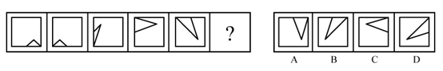

- **A**. A
- **B**. B　✅
- **C**. C
- **D**. D

**答案**：B

**官方解析**

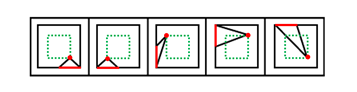

元素组成基本相同，优先考虑位置规律。观察发现，三角形与正方形的公共边每次沿正方形的外框顺时针平移半条边，则？处图形中公共边应位于正方形上边框的右侧，排除C项和D项。继续观察发现，三角形在正方形内部的顶点也每次顺时针平移一个位置（如图），故？处应选择一个三角形顶点位于正方形内部左下角位置的图形，只有B项符合。 故正确答案为B。

---

### 第 7 题　qid 2264340 · 图形推理

从所给的四个选项中，选择最合适的一个填入问号处，使之呈现一定的规律性：

- **A**. A
- **B**. B　✅
- **C**. C
- **D**. D

**答案**：B

**官方解析**

元素组成不同，优先考虑属性规律。观察发现，题干图形均为轴对称图形，并且对称轴方向每次顺时针旋转，排除A项和C项。进一步观察发现，题干中图1、图3和图5的对称轴都与图形中的一条线重合，而图2和图4的对称轴没有与图形中的一条线重合，故“？”处应选择一个图形的对称轴不与图形中某一条线重合的，只有B项符合。

故正确答案为B。

---

### 第 8 题　qid 2264343 · 图形推理

从所给的四个选项中，选择最合适的一个填入问号处，使之呈现一定的规律性：

- **A**. A
- **B**. B
- **C**. C
- **D**. D　✅

**答案**：D

**官方解析**

元素组成相似，且相同线条重复出现，优先考虑样式规律中的加减同异。九宫格优先看横行，第一行中，图1和图2求异后再顺时针或者逆时针旋转得到图3；经验证，第二行也满足此规律；第三行应用此规律，故“？”处应选择一个图1和图2先求异再顺时针或者逆时针旋转得到的图形。观察选项发现，逆时针旋转无答案，只有顺时针旋转得到D选项。

故正确答案为D。

---

### 第 9 题　qid 2264347 · 图形推理

从所给的四个选项中，选择最合适的一个填入问号处，使之呈现一定的规律性：

- **A**. A　✅
- **B**. B
- **C**. C
- **D**. D

**答案**：A

**官方解析**

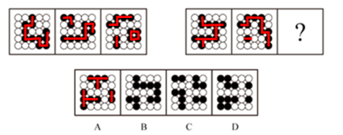

元素组成相同，但无位置规律。继续观察发现，题干图形的黑圆有明显连在一起的，考虑数部分数。第一组图黑圆连起来看，部分数分别为1、2、3；第二组图应用此规律，黑圆连起来看部分数依次为1、2、？，故？处应该选择一个黑圆为3部分的图形。A、B、C、D的黑圆连起来的部分数分别为3、2、4、4，只有A选项符合。

故正确答案为A。

---

### 第 10 题　qid 2264351 · 图形推理

左边给定的是正方体的外表面展开图，下面哪一项能由它折叠而成？

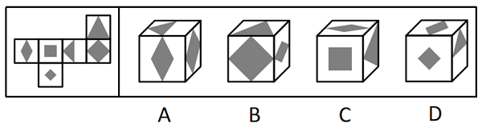

- **A**. A
- **B**. B
- **C**. C　✅
- **D**. D

**答案**：C

**官方解析**

将展开图的面均标上序号，如下图。

逐一分析选项：  A项：选项出现了面e、面g和面h，而题干中面e和面g为相对面，不能同时出现，选项与题干不一致，排除；  B项：选项出现了面e、面h和面i，面e和面h的公共边挨着面e的黑色部分，而题干中这两个面的公共边（如图）没有挨着面e的黑色部分，选项与题干不一致，排除；  C项：选项出现了面e、面f和面i，与题干一致，当选；  D项：选项出现了面e、面g和面k，而题干中面e和面g为相对面，不能同时出现，选项与题干不一致，排除。  故正确答案为C。

---

### 第 11 题　qid 2264356 · 图形推理

左图为6个相同小正方体组合成的多面体，将其从任一面剖开，以下哪一项<b>不可能</b>是该多面体的截面？

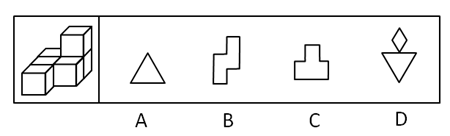

- **A**. A
- **B**. B
- **C**. C
- **D**. D　✅

**答案**：D

**官方解析**

本题考查截面图，逐一分析选项。

如下图所示，A、B、C项均可截出，该立体图形无法同时截出D项的菱形和三角形。

A项：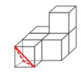

B项：

C项：

D项：无法切出，当选。

本题为选非题，故正确答案为D。

---

### 第 12 题　qid 2264364 · 图形推理

下图为同样大小的正方体堆叠而成的多面体正视图和后视图。该多面体可拆分为①、②、③和④共4个多面体的组合，问下列哪一项能填入问号处？

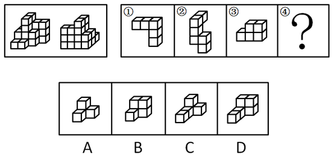

- **A**. A
- **B**. B
- **C**. C
- **D**. D　✅

**答案**：D

**官方解析**

本题考查立体拼合。由题干给出的多面体的正视图和后视图，可知，图形可分为前中后3排，最前面一排，根据正视图可知共有2个小立方体，中间一排，根据正视图和后视图可知共有8个小立方体，最后一排，根据后视图可知共有12个小立方体，故该多面体共有2+8+12=22个小立方体。观察题干图形发现，①有5个小立方体，②有6个小立方体，③有5个小立方体，所以若要将①、②、③、④组合在一起拼成题干多面体，则④应该有6个小立方体。

A项有4个小立方体，B项有5个小立方体，C项有5个小立方体，D项有6个小立方体。

故正确答案为D。

---

### 第 13 题　qid 2264369 · 图形推理

把下面的六个图形分为两类，使每一类图形都有各自的共同特征或规律，分类正确的一项是：

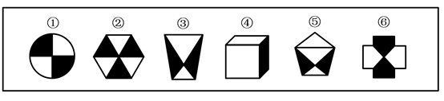

- **A**. ①②③，④⑤⑥
- **B**. ①②⑥，③④⑤　✅
- **C**. ①④⑥，②③⑤
- **D**. ①③④，②⑤⑥

**答案**：B

**官方解析**

解析一：本题为分组分类题目。每幅图中都由黑白两部分组成，观察发现图①②⑥中白色部分和黑色部分的面积都是相同的，而图③④⑤中白色部分的面积都大于黑色部分的面积，故图①②⑥为一组，图③④⑤为一组。
故正确答案为B。
解析二：本题为分组分类题目。每幅图中都由黑白两部分组成，观察发现图①②⑥中白色部分和黑色部分面的形状都是相同的，而图③④⑤中白色部分面的形状和黑色部分不相同，故图①②⑥为一组，图③④⑤为一组。
故正确答案为B。

---

### 第 14 题　qid 2264371 · 图形推理

把下面的六个图形分为两类，使每一类图形都有各自的共同特征或规律，分类正确的一项是：

- **A**. ①④⑤，②③⑥　✅
- **B**. ①②⑤，③④⑥
- **C**. ①④⑥，②③⑤
- **D**. ①③④，②⑤⑥

**答案**：A

**官方解析**

解析一：

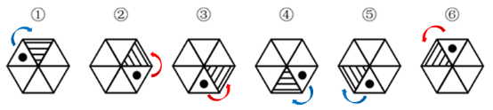 

本题为分组分类题目。观察发现元素组成相同，优先考虑位置规律。观察小黑点和阴影三角形的位置关系，可从小黑点向三角形方向就近画时针，发现图①④⑤为顺时针，②③⑥为逆时针。即图①④⑤为同一个图形进行旋转得到，图②③⑥为同一个图形进行旋转得到。故①④⑤为一组，②③⑥为一组。

故正确答案为A。

解析二：

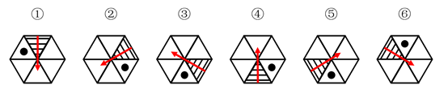

本题为分组分类题目。观察发现题干每幅图形均有小黑点，考虑功能元素。观察小黑点和阴影三角形的位置关系，由于三角形具有指向性，可从阴影三角形的底边向中心画出一个箭头，以箭头指向的方向为上，观察发现图①④⑤小黑点都在阴影三角形的右侧，②③⑥小黑点都在阴影三角形的左侧。故①④⑤为一组，②③⑥为一组。

故正确答案为A。

---

### 第 15 题　qid 2264372 · 图形推理

把下面的六个图形分为两类，使每一类图形都有各自的共同特征或规律，分类正确的一项是：

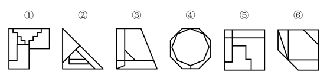

- **A**. ①③④，②⑤⑥
- **B**. ①②⑥，③④⑤
- **C**. ①③⑤，②④⑥　✅
- **D**. ①④⑥，②③⑤

**答案**：C

**官方解析**

本题为分组分类题目。观察图形发现，多边形内部被线条分割，优先考虑数面的数量，但题干图形的面数量都是5，无法分组。继续观察发现，图①③⑤中存在明显最小的面，且最小的面的形状均与图形外轮廓形状相同，图②④⑥中存在明显最大的面，且最大的面的形状均与图形外轮廓形状相同，故①③⑤一组，②④⑥一组。
故正确答案为C。

---

### 第 16 题　qid 2264339 · 定义判断

定律假说是对一类事物或现象的性质或发生原因作出推测性解释，得出一个可能具有普遍性意义的规律性命题，从而试图建立、发展或补充科学理论。
根据上述定义，下列属于定律假说的是：

- **A**. 老师向学生们解释潮汐现象产生的原因是海水在引力作用下出现的周期性运动
- **B**. 某单位仓库被盗，由于未发现破坏性进入的痕迹，侦查人员认为内部人员作案的可能性极大
- **C**. 牛顿根据苹果掉落现象发现了万有引力定律　✅
- **D**. 有研究人员指出，由基因导致的疾病可能都是由于基因突变引起的

**答案**：C

**官方解析**

第一步：找出定义关键词。

“对一类事物或现象的性质或发生原因做出推测性解释”、“得出一个可能具有普遍性意义的规律性命题”、“从而试图建立、发展或补充科学理论”。

第二步：逐一分析选项。

A项：老师向学生解释潮汐产生的原因，是对该现象产生原因的直接解释，而非推测性解释，不符合“对一类现象的发生原因作出推测性解释”，不符合定义，排除； 

B项：某仓库被盗，侦查人员认为是内部作案，某仓库的情况是个例，不符合“对一类事物或现象的发生原因作出推测性解释”，也没体现“得出一个可能具有普遍意义的规律性命题”，不符合定义，排除；

C项：牛顿根据苹果掉落现象发现了万有引力定律，根据苹果掉落现象符合“对一类事物或现象的性质或发生原因做出推测性解释”，发现万有引力定律符合“得出一个可能具有普遍意义的规律性命题”、“从而试图建立、发展或补充科学理论”，符合定义，当选；

D项：由基因导致的疾病“可能”都是由于基因突变引起的，是对此类疾病发生原因的推测性解释，但是没体现“得出一个可能具有普遍意义的规律性命题”、“从而试图建立、发展或补充科学理论”，不符合定义，排除。

故正确答案为C。

【备注】经粉笔教研，并通过查原文，C项牛顿依据苹果掉落现象提出引力假说属于理论假说，且在自然科学领域，理论假说都属于定律假说，故C项属于定律假说；而D项，研究基因导致的疾病的病因，其目的是为了帮助医生今后在治疗此类疾病时能对症下药，避免工作的盲目性，所以应属于作业假说，而非定律假说。

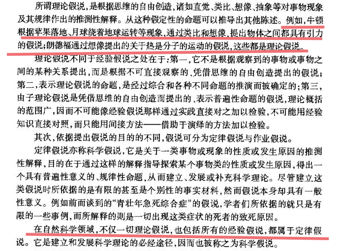

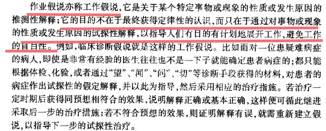

原文链接： http://www.cssn.cn/zt/zt_zh/kuaxuekezhuanti/flljx/jsyzcjs/jsff/201609/t20160920_3207766_2.shtml 

---

### 第 17 题　qid 2264341 · 定义判断

严格指示词是指一个语言表达式所具有的如下性质：它所指示的对象不会随着该表达式被使用的具体情境而发生改变。这些情境通常包括表达式的使用主体、表达式被使用的时间、地点、世界状态等等。
根据上述定义，下列属于严格指示词的是：

- **A**. 现任联合国秘书长
- **B**. 世界上身高最高的人
- **C**. 最小的素数　✅
- **D**. 经常坐在教室第一排正中间的同学

**答案**：C

**官方解析**

第一步：找出定义关键词。
“它所指示的对象不会随着该表达式被使用的具体情境而发生改变”、“这些情境通常包括表达式的使用主体、表达式被使用的时间、地点、世界状态等等”
第二步：逐一分析选项。
A项：联合国秘书长的任期为5年，现任联合国秘书长所指示的对象会随着使用时间的改变而发生改变，不符合“所指示的对象不会随着该表达式被使用的具体情境而发生改变”，不符合定义，排除； 
B项：世界上身高最高的人，身高会随着时间的变化发生变化，世界上身高最高的人所指示的对象也会随着时间发生改变，不符合“所指示的对象不会随着表达式被使用的具体情境而发生改变”，不符合定义，排除；
C项：素数是指大于1的自然数中，只能被1和它本身整除的数。最小的素数是2，是唯一确定的结论，不会随着具体情境的改变而发生变化，符合定义，当选；
D项：经常坐在教室第一排正中间的同学，不同教室坐在第一排正中间的同学是不同的，它所指示的对象会随着地点的改变而改变，不符合“所指示的对象不会随着该表达式被使用的具体情境而发生改变”，不符合定义，排除。
故正确答案为C。

---

### 第 18 题　qid 2264345 · 定义判断

同病异治是指中医对相同疾病采取不同的治法，达到治病求本的治疗效果；异病同治是指不同的疾病在发展过程中出现性质相同的症状，因而可以采用同样的中医治疗方法。
根据上述定义，下列属于异病同治的是：

- **A**. 久痢脱肛和胃下垂，均为中气下陷之证，可用升提中气之法治疗　✅
- **B**. 外感风热，内有蕴热的表里俱实之证，宜解表和攻里之药同时并用
- **C**. 麻疹初期疹未出透，治疗宜宣肺透疹；中期肺热明显，治疗宜清热解毒
- **D**. 风热感冒宜用辛凉解表法治疗，风寒感冒宜用辛温解表法治疗

**答案**：A

**官方解析**

第一步：找出定义关键词。
同病异治：“中医对相同疾病采取不同的治法”、 “达到治病求本的治疗效果”。
异病同治：“不同的疾病”、“出现性质相同的症状”、“采用相同的中医治疗方法”。
第二步：逐一分析选项。
A项：久痢脱肛和胃下垂，符合“不同的疾病”，均为中气下陷之证，符合“出现性质相同的症状”，可用升提中气之法治疗，符合“采用相同的中医治疗方法”，符合“异病同治”定义，当选； 
B项：外感风热，内有蕴热，是一种疾病的内部及外表的两方面表现，解表和攻里之药同时并用，是指治病时需内外兼治，是一种疾病采取一种治疗方法，不符合任何一个定义，排除；
C项：麻疹初期和中期的治疗方法不同，符合“中医对相同疾病采取不同的治法”，符合“同病异治”定义，不符合“异病同治”定义，排除；
D项：风热感冒宜用辛凉解表法治疗，风寒感冒宜用辛温解表法治疗，是不同的疾病采用不同的中医治疗方法，不符合任何一个定义，排除。
故正确答案为A。

---

### 第 19 题　qid 2264348 · 逻辑判断

物候现象是生物随着气候一年四季的周期性变化而发生的相应季节性变化的现象。影响物候现象的因素主要包括海拔的差异、经度的差异、纬度的差异和时间的差异。
下列诗句反映的物候现象受到海拔差异影响的是：

- **A**. 日出江花红胜火，春来江水绿如蓝
- **B**. 竹外桃花三两枝，春江水暖鸭先知
- **C**. 人间四月芳菲尽，山寺桃花始盛开　✅
- **D**. 羌笛何须怨杨柳，春风不度玉门关

**答案**：C

**官方解析**

第一步：找出定义关键词。
“生物随着气候一年四季的周期性变化而发生的相应季节性变化”、“海拔差异影响”。
第二步：逐一分析选项。
A项：“日出江花红胜火，春来江水绿如蓝”意思是清晨日出的时候，江边盛开的花朵，简直比火还要红艳；当春天来到时，江里的水，青绿得就像是蓝色的一样。不涉及“海拔差异对物候现象的影响”，不符合定义，排除； 
B项：“竹外桃花三两枝，春江水暖鸭先知”意思是竹林外两三枝桃花初放，鸭子在水中游戏，它们最先察觉了初春江水的回暖。不涉及“海拔差异对物候现象的影响”，不符合定义，排除；
C项：“人间四月芳菲尽，山寺桃花始盛开”意思是在人间四月里百花凋零已尽，高山古寺中的桃花才刚刚盛开，是由于高山的海拔较高，温度较低才导致这一现象，符合“海拔差异对物候现象的影响”，符合定义，当选；
D项：“羌笛何须怨杨柳，春风不度玉门关”意思是何必用羌笛吹起那哀怨的杨柳曲去埋怨春光迟迟不来呢，玉门关一带春风是吹不到的啊，玉门关位于甘肃省境内，这里属于非季风区，不受夏季季风的影响才导致这一现象，不符合“海拔差异对物候现象的影响”，不符合定义，排除。
故正确答案为C。

---

### 第 20 题　qid 2264352 · 定义判断

公平世界谬误是指人们倾向于认为我们生活的世界是公平的，一个人获得成就，是因为他肯定做对了什么，所以这份成就是他应得的；一个人遭遇不幸，他自己也有责任，甚至是咎由自取。
根据上述定义，下列没有反映公平世界谬误的是：

- **A**. 一分耕耘，一分收获
- **B**. 谋事在人，成事在天　✅
- **C**. 可怜之人必有可恨之处
- **D**. 天网恢恢，疏而不漏

**答案**：B

**官方解析**

第一步：找出定义关键词。
“一个人获得成就，是因为他肯定做对了什么，所以这份成就是他应得的”、“一个人遭遇不幸，他自己也有责任，甚至是咎由自取”。
第二步：逐一分析选项。
A项：“一分耕耘，一分收获”，意思是付出一份劳力就得一分收益。符合“一个人获得成就，是因为他肯定做对了什么，所以这份成就是他应得的”，符合定义，排除； 
B项：“谋事在人，成事在天”，意思是自己已经尽力而为，至于能否达到目的，那就要看时运如何了。能否达到目的看的是时运而不是自己，不符合“一个人获得成就，是因为他肯定做对了什么，所以这份成就是他应得的”，也不符合“一个人遭遇不幸，他自己也有责任，甚至是咎由自取”，不符合定义，当选；
C项：“可怜之人必有可恨之处”，意思是一个貌似可怜之人现实的不如意，一定是由于之前的过错或咎由自取造成的。符合“一个人遭遇不幸，他自己也有责任，甚至是咎由自取”，符合定义，排除；
D项：“天网恢恢，疏而不漏”，意思是天道公平，作恶就要受到惩罚，它看起来似乎很不周密，但最终不会放过一个坏人。符合“一个人遭遇不幸，他自己也有责任，甚至是咎由自取”， 符合定义，排除。
本题为选非题，故正确答案为B。

---

### 第 21 题　qid 2264355 · 定义判断

按照先后顺序排列的两个数字或者字母称为序对，如2a、e3、dm等等，序对中的第一个数字或者字母称为前项，第二个称为后项。函项指的是由若干序对构成的一个有限序列，其中每个序对的前项都是字母，后项都是数字，并且对于任一序对，如果前项相同，则后项必定相同。
根据上述定义，下列哪项属于函项？

- **A**. p3、c4、d6、p6、m8
- **B**. b3、5a、8n、p1、66
- **C**. f4、h4、gm、y2、x2
- **D**. a3、b5、d6、p1、e3　✅

**答案**：D

**官方解析**

第一步：找出定义关键词。
序对：“按照先后顺序排列的两个数字或者字母称为序对”、“序对中的第一个数字或者字母称为前项，第二个称为后项”。
函项：“由若干序对构成的有限序列”、“每个序对的前项都是字母，后项都是数字” 、“对于任一序对，如果前项相同，则后项必定相同”。
第二步：逐一分析选项。
A项：p3和p6这两个序对，前项相同但是后项不同。不符合“对于任一序对，如果前项相同，则后项必定相同”，不符合定义，排除； 
B项：5a、8n和66这三个序对，前项是数字。不符合“每个序对的前项都是字母，后项都是数字”，不符合定义，排除；
C项：gm这个序对，后项是字母。不符合“每个序对的前项都是字母，后项都是数字”，不符合定义，排除；
D项：a3、b5、d6、p1、e3，每个序对都是前项是字母，后项是数字。符合“每个序对的前项都是字母，后项都是数字”，符合定义，当选。
故正确答案为D。

---

### 第 22 题　qid 2264358 · 定义判断

诉前财产保全是指利害关系人因情况紧急，若不立即申请财产保全将会使其合法权益受到难以弥补的损害，起诉前向人民法院申请，由人民法院采取的一种财产保全措施。
根据上述定义，下列不属于诉前财产保全的是：

- **A**. 工厂甲向信用社乙贷款500万元，甲无法按期归还。乙随即起诉，审理期间得知甲已将设备转卖，遂请求法院查封甲正在出售的大楼　✅
- **B**. 甲与乙签订购销合同，甲给乙200万元预付款后，发现乙有欺诈行为，无力履行合同，遂请求人民法院冻结200万元预付款
- **C**. 银行甲与公司乙签订协议，甲向乙提供5000万元贷款，分3期还清，第一笔到期时乙无力归还，甲向法院申请查封乙的财产
- **D**. 甲欠乙10万元，乙多次找甲还钱未果，得知甲有一辆轿车，乙向法院申请将甲的轿车予以查封，再将甲告上法庭

**答案**：A

**官方解析**

第一步：找出定义关键词。
“因情况紧急，若不立即申请财产保全将会使其合法权益受到难以弥补的损害”、“起诉前向人民法院申请，由人民法院采取的一种财产保全措施”。
第二步：逐一分析选项。
A项：乙是在起诉审理期间要求法院查封甲正在出售的大楼，不符合在“起诉前向人民法院申请，由人民法院采取的一种财产保全措施”，不符合定义，当选；
B项：甲在给乙预付款之后，发现乙有欺诈行为，无力履行合同，此时甲如果不及时申请财产保全，有可能无法追回这一预付款，所以符合“因情况紧急，若不立即申请财产保全将会使其合法权益受到难以弥补的损害”，而后甲请求法院冻结这一预付款，符合“起诉前向人民法院申请，由人民法院采取的一种财产保全措施”，符合定义，排除；
C项：甲与乙签订贷款协议，乙在第一笔到期时无力还款，此时甲如果不及时申请财产保全，有可能无法收回这笔贷款，所以符合“因情况紧急，若不立即申请财产保全将会使其合法权益受到难以弥补的损害”，甲请求法院查封乙的财产，符合“起诉前向人民法院申请，由人民法院采取的一种财产保全措施”，符合定义，排除；
D项：乙多次找甲还钱未果，此时乙如果不及时申请财产保全，有可能无法追回这一欠款，所以符合“因情况紧急，若不立即申请财产保全将会使其合法权益受到难以弥补的损害”，乙向法院申请把甲的轿车予以查封，然后再把甲告上法庭，符合“起诉前向人民法院申请，由人民法院采取的一种财产保全措施”，符合定义，排除。
本题为选非题，故正确答案为A。

---

### 第 23 题　qid 2264360 · 定义判断

员工帮助计划是由企业为员工设置的一套长期的、系统的福利项目，通过专业人员对员工及其直系亲属提供专业指导和咨询，旨在帮助解决员工及其家庭成员的各种心理和行为问题，提高员工在企业中的工作绩效。
根据上述定义，下列属于员工帮助计划的是：

- **A**. 项目经理小祁的父亲最近去世了，小祁很悲痛，工作效率受到很大影响，总经理特批了一笔慰问款
- **B**. 司机小方驾车外出工作期间交通肇事致人死亡，公司聘请律师为小方做从轻处罚的辩护，最终小方获刑三年
- **C**. 会计师老王的儿子没有考上大学，老王夫妇很烦恼，互相指责。在公司心理专员的指导下，老王改善了与妻子的沟通方式，情绪逐渐好转　✅
- **D**. 职员小欣情绪低落，有自杀的念头，经医院诊断为重度抑郁症，需住院治疗。公司启动援助机制，为小欣支付了住院费用

**答案**：C

**官方解析**

第一步：找出定义关键词。
“由企业为员工设置的一套长期的、系统的福利项目”、“通过专业人员对员工及其直系亲属提供专业指导和咨询”、“旨在帮助解决员工及其家庭成员的各种心理和行为问题，提高员工在企业中的工作绩效”。
第二步：逐一分析选项。
A项：总经理特批的慰问款是专门针对小祁父亲去世这件事所一次性发放的，不符合“由企业为员工设置的一套长期的、系统的福利项目”，而且总经理特批发钱这一慰问方式也不符合“通过专业人员对员工及其直系亲属提供专业指导和咨询”，不符合定义，排除；
B项：公司聘请律师为小方做从轻处罚的辩护，不符合“旨在帮助解决员工及其家庭成员的各种心理和行为问题”，不符合定义，排除；
C项：公司设有心理专员这一岗位，说明这是“由企业为员工设置的一套长期的、系统的福利项目”，公司心理专员给予老王夫妇以指导，符合“通过专业人员对员工及其直系亲属提供专业指导和咨询”，最终老王改善了与妻子的沟通方式，情绪逐渐好转，也符合“旨在帮助解决员工及其家庭成员的各种心理和行为问题，提高员工在企业中的工作绩效”，符合定义，当选；
D项：公司启动援助机制，为患有重度抑郁症的职员小欣支付住院费用，只是在用钱来帮助小欣，并没有“通过专业人员对员工及其直系亲属提供专业指导和咨询”，不符合定义，排除。
故正确答案为C。

---

### 第 24 题　qid 2264363 · 定义判断

沟通网络是信息沟通的结构形式。常见的沟通网络有四种形式：在轮式网络中，一个下级同时与多个主管联系，但主管之间没有沟通的情形。在Y式网络中，第二级有两个上级与之联系，第三级与一个或更多下级发生联系。在环式网络中，每个成员仅与相邻者联系，而不能与更远的成员进行沟通。在全通道式网络中，所有成员间充分进行沟通，所有成员的地位是平等的，无核心人物。

根据上述定义，下列图形反映了轮式网络特点的是：

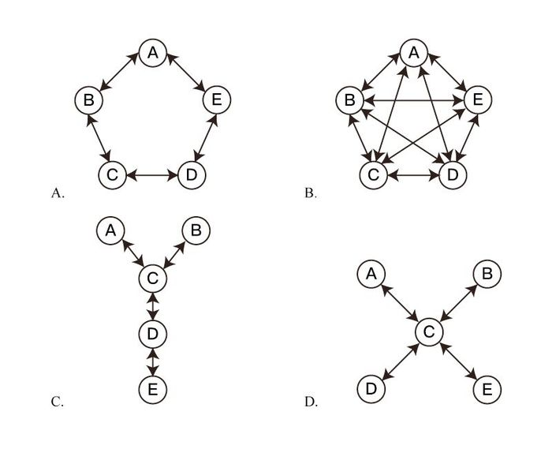

- **A**. A
- **B**. B
- **C**. C
- **D**. D　✅

**答案**：D

**官方解析**

第一步：找出定义关键词。
轮式网络：“一个下级同时与多个主管联系”、“主管之间没有沟通的情形”；
Y式网络：“第二级有两个上级与之联系”、“第三级与一个或更多下级发生联系”；
环式网络：“每个成员仅与相邻者联系”、“不能与更远的成员进行沟通”；
全通道式网络：“所有成员间充分进行沟通”、“所有成员的地位是平等的，无核心人物”。
第二步：逐一分析选项。
A项：每个字符只与其相邻的两个字符间有联系，与其他不相邻的没有联系，符合“每个成员仅与相邻者联系”、“不能与更远的成员进行沟通”，符合“环式网络”定义，不符合“轮式网络”定义，排除；
B项：每个字符与其他所有字符都有联系，而且无核心字符，符合“所有成员间充分进行沟通”、“所有成员的地位是平等的，无核心人物”，符合“全通道式网络”定义，不符合“轮式网络”定义，排除；
C项：字符C分别与两个上级字符A、B以及一个下级字符D有联系，符合“第二级有两个上级与之联系”、“第三级与一个或更多下级发生联系”，符合“Y式网络”定义，不符合“轮式网络”定义，排除；
D项：字符C作为下属时，分别与多个主管字符A、B、D、E有联系，但是主管字符A、B、D、E之间没有联系，符合“一个下级同时与多个主管联系”、“主管之间没有沟通的情形”，符合“轮式网络”定义，当选。
故正确答案为D。

---

### 第 25 题　qid 2264367 · 定义判断

变文和连文是古汉语中常用的修辞方法。变文是指为了避重而在相临近的句子中采用同义词来表达相同的意义。连文是指本来要表达甲，而连带说到乙，使两个相关联的词连在一起，但突出表达其中一个词的意义。
根据上述定义，下列使用了连文这一修辞方法的是：

- **A**. 《史记·淮阴侯列传》：“置之死地而后生，置之亡地而后存。”
- **B**. 《易经·系辞上传》：“鼓之以雷霆，润之以风雨。”　✅
- **C**. 诸葛亮《出师表》：“受任于败军之际，奉命于危难之间。”
- **D**. 贾谊《过秦论》：“南取汉中，西举巴蜀，东割膏腴之地，北收要害之郡。”

**答案**：B

**官方解析**

第一步：找出定义关键词。
变文：“为了避重而在相临近的句子中采用同义词来表达相同的意义”；
连文：“本来要表达甲，而连带说到乙，使两个相关联的词连在一起”、“突出表达其中一个词的意义”。
第二步：逐一分析选项。
A项：“置之死地而后生，置之亡地而后存”意思是，军队士兵在可能战死的境地，会奋勇前进，杀敌取胜，在可能灭亡的境地，会战胜生存下来，不符合“本来要表达甲，而连带说到乙，使两个相关联的词连在一起”、“突出表达其中一个词的意义”，不符合“连文”定义，排除；
B项：“鼓之以雷霆，润之以风雨”意思是，用雷霆来鼓荡它，用风雨来滋润它，其中润是用来描述雨的特点，但在表达雨的同时谈到了相关联的风，其中突出表达的是雨水的滋润，符合“本来要表达甲，而连带说到乙，使两个相关联的词连在一起”、“突出表达其中一个词的意义”，符合“连文”定义，当选；
C项：“受任于败军之际，奉命于危难之间”意思是，在兵败的时候接受任务，在危机患难之间奉行使命，只表达了一个意思，没有侧重要突出的，不符合“本来要表达甲，而连带说到乙，使两个相关联的词连在一起”、“突出表达其中一个词的意义”，不符合“连文”定义，排除；
D项：“南取汉中，西举巴蜀，东割膏腴之地，北收要害之郡”意思是，向南夺取汉中，向西攻取巴、蜀，向东割取肥沃的地区，向北占领非常重要的地区，指要攻占东南西北四方的领土，不符合“本来要表达甲，而连带说到乙，使两个相关联的词连在一起”、“突出表达其中一个词的意义”，不符合“连文”定义，排除。
故正确答案为B。

---

### 第 26 题　qid 2264335 · 类比推理

分母：除数

- **A**. 内角：外角
- **B**. 加减法：乘除法
- **C**. 横坐标：纵坐标
- **D**. 百分比：百分率　✅

**答案**：D

**官方解析**

第一步：判断题干词语间逻辑关系。
分母是分数式中写在横线下面的数、字母或代数式，除数是在除法算式中，除号后面的数。分母也叫除数，二者是全同关系。
第二步：判断选项词语间逻辑关系。
A项：内角指的是多边形相邻的两边组成的角，外角指的是多边形中一条边与另一条边的延长线组成的角，二者不是全同关系，与题干逻辑关系不一致，排除；
B项：加减法和乘除法，分别是不同的运算法则，二者是并列关系，不是全同关系，与题干逻辑关系不一致，排除；
C项：横坐标也叫X坐标，纵坐标也叫Y坐标，二者构成笛卡尔坐标系（直角坐标系）以表示函数的图像，二者不是全同关系，与题干逻辑关系不一致，排除；
D项：百分数也叫做百分率或百分比，是一种表达比例、比率或分数数值的方法，二者是全同关系，与题干逻辑关系一致，当选。
故正确答案为D。

---

### 第 27 题　qid 2264350 · 类比推理

直线交叉：直线不平行

- **A**. 

　✅
- **B**. 
100：沸腾

- **C**. 
：臭氧

- **D**. 
：圆面积

**答案**：A

**官方解析**

第一步：判断题干词语间逻辑关系。 两条直线只要交叉，则一定不平行，前者是后者的充分条件。

注：直线间除了在同一平面内存在交叉和平行关系，还可以在不同平面内存在不交叉、不平行的关系，所以题干二者不是全同关系。

第二步：判断选项词语间逻辑关系。 A项： 只要x大于1，则x的平方一定大于1，前者是后者的充分条件，与题干逻辑关系一致，当选； B项：液体并非只要达到100，一定会沸腾，不同液体的沸点并不一定相同，前者不是后者的充分条件，与题干逻辑关系不一致，排除； C项：臭氧是地球大气中的一种微量气体，含有3个氧原子，是臭氧的化学式表示，二者是全同关系，与题干逻辑关系不一致，排除； D项：圆面积公式等于半径平方与圆周率的乘积，用字母可以表示为：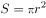，前者不是后者的充分条件，与题干逻辑关系不一致，排除。 故正确答案为A。 

---

### 第 28 题　qid 2264354 · 类比推理

刻舟：求剑

- **A**. 里应：外合
- **B**. 掩耳：盗铃　✅
- **C**. 打草：惊蛇
- **D**. 指桑：骂槐

**答案**：B

**官方解析**

第一步：判断题干词语间逻辑关系。
刻舟求剑是指办事刻板，没用发展的眼光看问题，其中刻舟是求剑的方式，求剑是刻舟的目的。
第二步：判断选项词语间逻辑关系。
A项：里应是指里面接应，外合是指外面攻打，里应和外合是并列关系，与题干逻辑关系不一致，排除；
B项：掩耳盗铃是指把耳朵捂住偷铃铛，以为自己听不见别人也会听不见，比喻自欺欺人。其中掩耳是盗铃的方式，盗铃是掩耳的目的，与题干逻辑关系一致，保留；
C项：打草惊蛇是指做事不周密，行动不谨慎，不慎惊动了对方，“打草”的本意不是“惊蛇”，与题干逻辑关系不一致，排除；（打草惊蛇还有一种解释为，打草是为了惊蛇，如果按这个意思理解可以做保留）
D项：指桑骂槐是比喻表面上骂这个人，实际上是骂那个人，指桑是骂槐的方式，骂槐是目的，与题干逻辑关系一致，保留。
比较B、C、D，题干刻舟求剑是说方法错误，达不到求剑的目的。而打草惊蛇与指桑骂槐都能达到目的，掩耳盗铃也是强调方法错误达不到目的，因此B选项与题干更一致。
故正确答案为B。

---

### 第 29 题　qid 2264357 · 类比推理

马蹄莲：蟹爪兰

- **A**. 牵牛花：美人蕉
- **B**. 卷心菜：夜来香
- **C**. 灯笼椒：金针菇　✅
- **D**. 佛手柑：含羞草

**答案**：C

**官方解析**

第一步：判断题干词语间逻辑关系。
马蹄莲的形状像马蹄，蟹爪兰的形状像蟹爪，二者是根据外形来命名的两种植物。
第二步：判断选项词语间逻辑关系。
A项：牵牛花因其形似喇叭，所以也叫喇叭花，所以喇叭花是以植物外形来命名的，而牵牛花是它的别称，并不是以植物外形来命名的；美人蕉因其花开的美艳而得名，并不是以植物外形来命名的，与题干逻辑关系不一致，排除；
B项：卷心菜是以植物外形来命名的，但夜来香因夜晚有特殊的芳香而命名，不是以植物外形来命名的，与题干逻辑关系不一致，排除；
C项：灯笼椒的形状像灯笼，金针菇的形状像针一样，二者是以外形来命名的两种蔬菜，与题干逻辑关系一致，当选；
D项：佛手柑是以植物外形来命名的，但含羞草是因为它的叶子一经触碰就自动卷起来，像害羞一样，并不是以植物外形来命名的，与题干逻辑关系不一致，排除。
故正确答案为C。

---

### 第 30 题　qid 2264359 · 类比推理

金库：现钞：保管

- **A**. 网球场：球迷：观看
- **B**. 电缆车：景区：观光
- **C**. 录音棚：专辑：播放
- **D**. 美术馆：字画：陈列　✅

**答案**：D

**官方解析**

第一步：判断题干词语间逻辑关系。
金库是用来保管现钞的地点，三者为对应关系。
第二步：判断选项词语间逻辑关系。
A项：网球场是用来观看球赛的地点，不是观看球迷的地点，与题干逻辑关系不一致，排除；
B项：电缆车是用来观光景区的交通工具，不是地点，与题干逻辑关系不一致，排除；
C项：录音棚是用来录制专辑的地点，不是播放专辑的地点，与题干逻辑关系不一致，排除；
D项：美术馆是用来陈列字画的地点，三者为对应关系，与题干逻辑关系一致，当选。
故正确答案为D。

---

### 第 31 题　qid 2264361 · 类比推理

山洪：村民：士兵

- **A**. 狂风：雷电：灯塔
- **B**. 事故：伤员：医生　✅
- **C**. 海啸：船舶：渔民
- **D**. 婚礼：新人：主持

**答案**：B

**官方解析**

第一步：判断题干词语间逻辑关系。
山洪是灾难事件，村民是山洪的受害者，士兵是村民的救助者，村民和士兵是被救助与救助的关系。
第二步：判断选项词语间逻辑关系。
A项：狂风和雷电是两种不同的天气现象，是并列关系，灯塔是用以指引船只方向的建筑物，与狂风和雷电无必然联系，与题干逻辑关系不一致，排除；
B项：事故是灾难事件，伤员是事故的受害者，医生是伤员的救助者，伤员和医生是被救助与救助的关系，与题干逻辑关系一致，当选；
C项：海啸是灾难事件，船舶是渔民的工具，二者不是被救助与救助的关系，与题干逻辑关系不一致，排除；
D项：婚礼不是灾难事件，新人与主持不是被救助与救助的关系，与题干逻辑关系不一致，排除。
故正确答案为B。

---

### 第 32 题　qid 2264362 · 类比推理

病毒：传染病：流行性

- **A**. 毒驾：车祸：危害性　✅
- **B**. 市场：交易：自发性
- **C**. 噪声：听力损伤：普遍性
- **D**. 甜食：肥胖症：突发性

**答案**：A

**官方解析**

第一步：判断题干词语间逻辑关系。
病毒可能会导致传染病，二者为因果的对应关系，且传染病一定具有流行性，二者为必然属性的对应关系。
注：传染病一定是“可以流行”的，只不过“可以流行”并不意味着传染病一定会“流行开来”。因此，传染病一定具备“流行性”的属性，只是不一定会造成“流行开来”这样的结果而已，所以二者是必然属性对应关系。
第二步：判断选项词语间逻辑关系。
A项：毒驾可能会导致车祸，二者为因果的对应关系，且车祸一定具有危害性，二者为必然属性的对应关系，与题干逻辑关系一致，当选；
B项：市场不会导致交易，二者不是因果的对应关系，与题干逻辑关系不一致，排除；
C项：噪声可能会导致听力损伤，二者为因果的对应关系，但普遍性不是听力损伤的必然属性，与题干逻辑关系不一致，排除；
D项：甜食可能会导致肥胖症，二者为因果的对应关系，但突发性不是肥胖症的属性，与题干逻辑关系不一致，排除。
故正确答案为A。

---

### 第 33 题　qid 2264365 · 类比推理

微量元素：稀有金属：铜

- **A**. 木本植物：草本植物：松树
- **B**. 海洋动物：哺乳动物：北极熊
- **C**. 内陆湖：淡水湖：青海湖　✅
- **D**. 节肢动物：两栖动物：鳄鱼

**答案**：C

**官方解析**

第一步：判断题干词语间逻辑关系。

微量元素是指人体中含量小于的元素，稀有金属是指在自然界中含量较少或分布稀散的金属，故二者为交叉关系；铜是微量元素，二者为种属关系，且铜不是稀有金属。

第二步：判断选项词语间逻辑关系。

A项：木本植物和草本植物都是植物的一种，二者为并列关系，与题干逻辑关系不一致，排除；

B项：海洋动物和哺乳动物为交叉关系，但北极熊是哺乳动物，不是海洋动物，与题干逻辑关系不一致，排除；

C项：内陆湖和淡水湖为交叉关系，青海湖是内陆湖，二者为种属关系，且青海湖不属于淡水湖，与题干逻辑关系一致，当选；

D项：节肢动物属于无脊椎动物，两栖动物属于脊椎动物，二者不是交叉关系，且鳄鱼不属于节肢动物，与题干逻辑关系不一致，排除。

故正确答案为C。

---

### 第 34 题　qid 2264366 · 类比推理

莲蓬 对于（  ）相当于（  ）对于 葛根

- **A**. 荷叶；葛藤　✅
- **B**. 荷花；葛粉
- **C**. 喜爱；纠缠
- **D**. 荷塘；山岗

**答案**：A

**官方解析**

逐一代入选项。
A项：莲蓬与荷叶都是荷花的组成部分，葛藤与葛根都是野葛的组成部分，二者均为并列关系，前后逻辑关系一致，当选；
B项：莲蓬是荷花的组成部分，二者为组成关系；葛根是葛粉的原材料，二者为原材料的对应关系，前后逻辑关系不一致，排除；
C项：喜爱莲蓬，二者为动宾关系；纠缠和葛根不是动宾关系，且前后顺序相反，前后逻辑关系不一致，排除；
D项：荷塘里有莲蓬，山岗里有葛根，二者均为地点的对应关系，但前后顺序相反，前后逻辑关系不一致，排除。
故正确答案为A。

---

### 第 35 题　qid 2264368 · 类比推理

立案 对于（  ）相当于（  ）对于 判决

- **A**. 起诉；服刑
- **B**. 审理；质证　✅
- **C**. 犯罪；调解
- **D**. 罚款；执行

**答案**：B

**官方解析**

A项：在刑事诉讼中可以先“立案”后“起诉”，在民事诉讼中可以先“起诉”后“立案”，二者没有必然的时间先后顺序，而服刑在判决之后，前后逻辑关系不一致，排除；
B项：先立案后审理，先质证后判决，二者均为先后顺序的对应关系，前后逻辑关系一致，当选；
C项：先犯罪后立案，二者为先后顺序的对应关系；调解和判决没有必然联系，前后逻辑关系不一致，排除；
D项：立案与罚款没有必然联系；先判决后执行，二者为先后顺序的对应关系，前后逻辑关系不一致，排除。
故正确答案为B。

---

### 第 36 题　qid 2264332 · 逻辑判断

一般来说，塑料极难被分解，即使是较小的碎片也很难被生态系统降解，因此它造成的环境破坏十分严重。近期科学家发现，一种被称为蜡虫的昆虫能够降解聚乙烯，而且速度极快。如果使用生物技术复制蜡虫降解聚乙烯，将能够帮助我们有效清理垃圾填埋厂和海洋中累积的塑料垃圾。
以下哪项如果为真，不能支持上述结论？

- **A**. 世界各地的塑料垃圾的主要成分是聚乙烯
- **B**. 蜡虫的确能够破坏聚乙烯塑料的高分子链
- **C**. 聚乙烯被蜡虫降解后的物质对环境的影响尚不明确　✅
- **D**. 现有科技手段能够将蜡虫降解聚乙烯的酶纯化出来

**答案**：C

**官方解析**

第一步：找出论点和论据。
论点： 如果使用生物技术复制蜡虫降解聚乙烯，将能够帮助我们有效清理垃圾填埋厂和海洋中累积的塑料垃圾。
论据： 近期科学家发现，一种被称为蜡虫的昆虫能够降解聚乙烯，而且速度极快。
第二步：逐一分析选项。
A项：题干说蜡虫能够分解聚乙烯，这样就能解决世界上的塑料垃圾，该项说明世界各地的塑料垃圾的主要成分是聚乙烯，是论点成立的必要条件，可以加强，排除；
B项：该项说明昆虫能够破坏聚乙烯的高分子链，说明昆虫确实能够破解聚乙烯，从而帮助我们清理塑料垃圾，属于补充论据，可以加强，排除；
C项：该项说明聚乙烯被蜡虫分解后的物质对环境的影响尚不明确，即能不能解决塑料垃圾不清楚，属于不明确选项，无法加强，当选；
D项： 现有科技手段能够将蜡虫降解聚乙烯的酶纯化出来，说明我们能够通过生物技术复制蜡虫降解聚乙烯，是论点成立的必要条件，可以加强，排除。
本题为选非题，故正确答案为C。

---

### 第 37 题　qid 2264333 · 逻辑判断

所有的幼儿园都面临同一个问题：就是对于那些在幼儿园放学之后不能及时来接孩子的家长，幼儿园老师除了等待别无他法，因此许多幼儿园都向晚接孩子的家长收取费用。然而，有调查显示，收取费用后晚接孩子的家长数量并未因此减少，反而增加了。
以下哪项如果为真，最能解释上述调查结果？

- **A**. 收费标准太低，对原本经常晚来接孩子的家长没有太大的约束力
- **B**. 有个别家长对收费行为不满，有时会故意以晚接孩子的行为来抗议
- **C**. 有些家长因工作忙碌，常常不能及时来接孩子
- **D**. 收费后，更多的家长认为即使晚来接孩子也不必愧疚，只要付费即可　✅

**答案**：D

**官方解析**

第一步：找出题干矛盾。
通过收取费用的方式让家长早接孩子，但是收费后晚接孩子的家长数量不减反增。
第二步：逐一分析选项。
A项：收费低对原本晚接孩子的家长无影响，可以解释为什么人数没有减少，但是无法解释为什么人数增加，不能解释题干矛盾，排除；
B项：该项说的是个别家长抗议收费而晚来接孩子，但是无法解释清楚为什么晚接孩子的家长数增加了，不能解释题干矛盾，排除；
C项：该项解释了家长晚来接孩子的原因，与题干幼儿园收费无关，不能解释题干矛盾，排除；
D项：该项说明幼儿园对晚接孩子进行收费后，将这种行为合理化，更多的家长心安理得的晚来接孩子，可以解释为什么晚接孩子的人不减反增，当选。
故正确答案为D。

---

### 第 38 题　qid 2264334 · 逻辑判断

应激本身没有致痛能力，但是流行病学调查发现，长期应激与疼痛慢性化的发生正相关，即长期处于巨大压力下的人群，其疼痛症状更易迁延，进而发展为慢性疼痛。
以下哪项如果为真，最能支持上述调查结果？

- **A**. 
具有焦虑倾向的人，其应激水平往往较高，疼痛慢性化的发生率也会更高

- **B**. 
长期应激可影响神经内分泌系统，使人的疼痛抑制系统的功能被削弱
　✅
- **C**. 
吸烟使人体神经内分泌系统发生紊乱，对疼痛感知的影响与应激相似

- **D**. 
如果能有效缓解应激，保持心态平和，疼痛慢性化的发生率将会降低

**答案**：B

**官方解析**

第一步：找出论点和论据。
论点：长期处于巨大压力下的人群，其疼痛症状更易迁延，进而发展为慢性疼痛。
论据：无。
本题只有论点没有论据，加强优先考虑补充论据，即解释原因或举例加强。
第二步：逐一分析选项。
A项：该项指出，具有焦虑倾向的人，其应激水平高，疼痛慢性化发生率也会高，举例子补充论据，可以加强，保留；
B项：长期应激会影响神经内分泌系统，进而削弱疼痛抑制系统，所以发展为慢性疼痛，解释原因补充论据，可以加强，保留；
C项：该项说吸烟对疼痛感知的影响和应激相似，不能说明应激与疼痛慢性化的关系，无法加强，排除；
D项：该项指出如果缓解应激后，疼痛慢性化的发生率会下降，举反面例子补充论据，可以加强，保留。
对比A、B、D三项，B项解释原因力度大于A、D两项的举例子。
故正确答案为B。

---

### 第 39 题　qid 2264336 · 逻辑判断

自从前年甲航运公司实行了经理任期目标责任制之后，公司的经济效益也随之逐年上升。可见，只有实行经理任期目标责任制，才能使甲公司经济效益稳步增长。
以下哪项如果为真，最能削弱上述论证？

- **A**. 近两年国家经济发展速度较快，航运行业的整体形势大好
- **B**. 没实行任期目标责任制的乙航运公司，近两年的经济效益也稳步增长
- **C**. 前年甲公司开始实行职工薪酬管理制度改革，极大地调动了公司员工的积极性
- **D**. 如果甲航运公司没有实行任期目标责任制，近两年的经济效益会增长得更快　✅

**答案**：D

**官方解析**

第一步：找出论点和论据。
论点：只有实行经理任期目标责任制，才能使甲公司经济效益稳步增长。
论据：甲航运公司实行了经理任期目标责任制之后，公司的经济效益也随之逐年上升。
论点和论据均在讨论“实行经理任期目标责任制”和“经济效益增长”的关系，话题一致，削弱优先考虑削弱论点。
第二步：逐一分析选项。
A项：该项指出可能是因为整个航运行业整体形势好，使得甲公司经济效益增长，是他因削弱，可以削弱，保留；
B项：该项讨论的是“乙航运公司”，与题干讨论的甲航运公司无关，无关选项，无法削弱，排除；
C项：该项指出前年甲公司也实行了职工薪酬管理制度改革，调动了公司员工积极性，可能是因为员工积极性高了，使得甲公司经济效益增长，是他因削弱，可以削弱，保留；
D项：如果甲航运公司没有实行任期目标责任制，近两年的经济效益会增长得更快，说明实行经理任期目标责任制反而限制了甲公司经济效益稳步增长，直接削弱论点，保留。
对比A、C、D三项，D项削弱论点力度最强，大于A、C两项的他因削弱。
故正确答案为D。

---

### 第 40 题　qid 2264338 · 逻辑判断

所有的地震都是以P波开始的，这些P波移动快速，使地面发生上下震动，造成的破坏较小。下一个是S波，它的移动很慢，使地面前后、左右晃动，破坏性极大。早期预警系统通过测量P波沿地面移动的情况，来预测S波所造成的影响，然后发出警报。然而，从事此类系统工作的科学家们发现，事实上人们并没有多少时间为大地震做好准备。
要得到上述结论，需要补充的最重要前提是：

- **A**. 地球上每年大约发生500多万次地震，绝大多数的地震人们根本感觉不到
- **B**. 根据历年大地震的记载，强震大多在夜里瞬间发生，无法在短时间内组织有效的防御行动
- **C**. 地震越大，P波与S波之间的间隔越短，留给人们预警的时间不多　✅
- **D**. 发生较大地震时，人们先感到上下颠簸，而后才有很强的水平晃动，这种晃动是由S波造成的

**答案**：C

**官方解析**

第一步：找出论点和论据。
论点：事实上人们并没有多少时间为大地震做好准备。
论据：无。
第二步：逐一分析选项。
A项：论点说的是没有时间为大地震做好准备，该项说的是地震发生的次数和人们的感觉，话题不一致，无法加强，排除； 
B项：根据历年大地震的记载，强地震大多在夜里瞬间发生，无法在短时间内有效防御，这是在列举历年地震的情况，举例加强，但不是论点成立最重要的前提，排除； 
C项：地震越大，P波与S波之间的间隔越短，指出留给人们预警的时间就越短，说明人们并没有多少时间为大地震做好准备，是论点成立最重要的前提，当选；
D项：论点说的是没有多少时间为大地震做好准备，该项说的是人们先感到上下颠簸，而后才有很强的水平晃动，是由S波造成的，指出S波对人们造成的影响，未提及是否有时间为大地震做好准备，无关项，无法加强，排除。
故正确答案为C。

---
