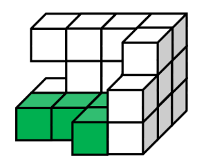
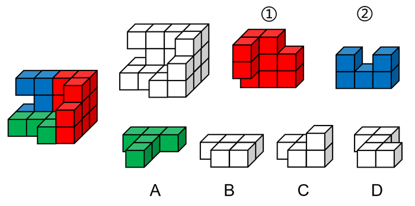
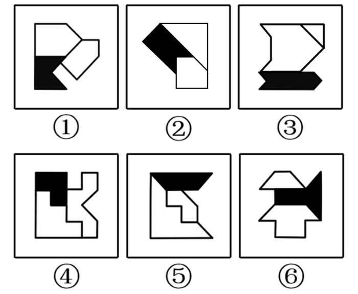
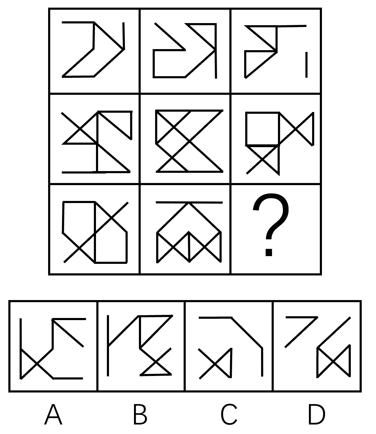
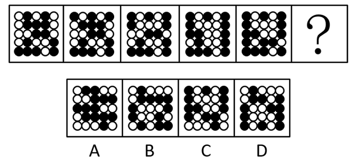
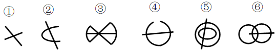
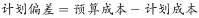
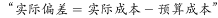

# 2019年山东省选调应届优秀高校毕业生到基层工作考试《行测》试卷（网友回忆版）

> 判断推理 · 40 题 · 选调 2019

## 第 1 题　qid 2376909 · 图形推理

下图所示的多面体为20个一样的小正方体组合而成，问①、②和以下哪个多面体可以组合成该多面体？

- **A**. A　✅
- **B**. B
- **C**. C
- **D**. D

**答案**：A

**官方解析**

观察图①，右上角缺少了一块正方体，且左边突出来两个正方体，故可确定图①在多面体中的位置如下图所示：

观察图②，上面一排正方体中间少了一块正方体,故可确定图②在多面体中的位置如下图所示：

因此,需要补充的图形如下图所示：

故正确答案为A。

---

## 第 2 题　qid 2376913 · 图形推理

把下面的六个图形分为两类，使每一类图形都有各自的共同特征或规律，分类正确的一项是：

- **A**. ①②③，④⑤⑥
- **B**. ①④⑤，②③⑥
- **C**. ①②⑤，③④⑥　✅
- **D**. ①④⑥，②③⑤

**答案**：C

**官方解析**

元素组成不同，且无明显属性规律，考虑数量规律。整体数线无规律，故考虑线的细化考法。观察发现图①②⑤末端两条线相互垂直，图③④⑥末端两条线相互平行，可由此分为两组即①②⑤一组，③④⑥一组。
故正确答案为C。

---

## 第 3 题　qid 2376915 · 图形推理

把下面的六个图形分为两类，使每一类图形都有各自的共同特征或规律，分类正确的一项是：

- **A**. ①③④，②⑤⑥　✅
- **B**. ①③⑤，②④⑥
- **C**. ①②⑥，③④⑤
- **D**. ①④⑥，②③⑤

**答案**：A

**官方解析**

元素组成不同，优先考虑属性规律。本题每个图形整体上来看虽然都不对称，但是每幅图中的三个小图形均为对称图形，因此，可以分别画出每幅图形中三个小图形的对称轴，发现图①③④黑块的对称轴和一个空白图形对称轴平行，和另一个空白图形对称轴交叉；图②⑤⑥黑块的对称轴和两个空白图形的对称轴都交叉，因此，①③④一组，②⑤⑥一组。
故正确答案为A。

---

## 第 4 题　qid 2376917 · 图形推理

左图是给定纸盒的外表面，以下哪一项能由它折叠而成？

- **A**. A
- **B**. B　✅
- **C**. C
- **D**. D

**答案**：B

**官方解析**

将原展开图标上序号如下图，逐一进行分析。

A项：右边的面是面e，面e与面k是相对面不能同时出现，所以上边的面是面g，面g与面i是相对面不能同时出现，所以前边的面是面h。A项由面e、面g、面h组成，面g与面h有公共边，如上图所示，展开图中公共边挨着面g三角形的长直角边，A选项挨着面g三角形的短直角边，选项和题干不一致，排除；

B项：由面e、面f、面i组成，选项和题干一致，当选；

C项：由面f、面g、面k组成，面f中三角形的底边挨着面g中的小方块，选项中面f中三角形的底边挨着面g（或面k）中的三角形的长直角边，题干和选项不一致，排除；

D项：上边的面是面e，面e与面k是相对面不能同时出现，所以前边的面是面g，面g与面i是相对面不能同时出现，所以右边的面是面h。D项由面e、面g、面h组成，面g与面h有公共边，如上图所示，展开图中公共边挨着面g三角形的长直角边，D选项挨着面g三角形的一个顶点，选项和题干不一致，排除。

故正确答案为B。

---

## 第 5 题　qid 2376918 · 图形推理

从所给的四个选项中，选择最合适的一个填入问号处，使之呈现一定的规律性：

- **A**. A
- **B**. B　✅
- **C**. C
- **D**. D

**答案**：B

**官方解析**

元素组成相似，相同线条重复出现，优先考虑加减同异。第一行图1和图2相同线条去掉，不同线条保留，求异得到图3，第二行验证此规律成立，第三行应用此规律，只有B项成立。
故正确答案为B。

---

## 第 6 题　qid 2376932 · 图形推理

从所给的四个选项中，选择最合适的一个填入问号处，使之呈现一定的规律性：

- **A**. A
- **B**. B
- **C**. C　✅
- **D**. D

**答案**：C

**官方解析**

观察题干图形，整体无规律，通过相邻比较发现，图1和图2只有第一行黑球位置不同（第一行黑白球颜色互换），其他四行黑球位置相同；图2和图3只有第二行黑球位置不同（第二行黑白球颜色互换），其他四行黑球位置相同；图3和图4只有第三行黑球位置不同（第三行黑白球颜色互换），其他四行黑球位置相同；图4和图5只有第四行黑球位置不同（第四行黑白球颜色互换），其他四行黑球位置相同，以此类推，？处应该选择一个和图5只有第五行黑球位置不同（第五行黑白球颜色互换），其他四行黑球位置相同的图，只有C项符合。
故正确答案为C。

---

## 第 7 题　qid 2376937 · 图形推理

从所给的四个选项中，选择最合适的一个填入问号处，使之呈现一定的规律性：

- **A**. A
- **B**. B
- **C**. C　✅
- **D**. D

**答案**：C

**官方解析**

图形元素组成相同，优先考虑位置规律。观察发现，题干后面一幅图均是在前一幅图的基础上变化了1根短线得到，如下图所示（实线代表后一幅图在前一幅图基础上增加的线，虚线代表后一幅图在前一幅图的基础上消失的线）。符合此规律的只有C选项。

故正确答案为C。

---

## 第 8 题　qid 2376933 · 图形推理

从所给的四个选项中，选择最合适的一个填入问号处，使之呈现一定的规律性：

- **A**. A
- **B**. B
- **C**. C
- **D**. D　✅

**答案**：D

**官方解析**

图形元素组成不同，优先考虑属性规律。观察题干图形发现出现了等腰三角形、箭头等特征图，优先考虑对称性。题干第一行图形的对称轴数量依次为1、1、2，即前两幅图对称轴的数量之和等于第三幅图对称轴的数量。第二行验证此规律，对称轴数量依次为1、2、3，验证后该规律成立。第三行应用此规律，对称轴数量依次是2、3、？，则“？”处应选择对称轴数量为5的选项，符合该规律的只有D选项。
故正确答案为D。

---

## 第 9 题　qid 2376943 · 图形推理

把下面的六个图形分为两类，使每一类图形都有各自的共同特征或规律，分类正确的一项是：

- **A**. ①③④，②⑤⑥
- **B**. ①②④，③⑤⑥　✅
- **C**. ①④⑤，②③⑥
- **D**. ①③⑤，②④⑥

**答案**：B

**官方解析**

本题为分组分类题目。元素组成不同，观察发现，图形相切明显，图①②④中两个图形之间只有一个切点，图③⑤⑥中两个图形之间存在两个切点，故图①②④一组，图③⑤⑥一组。
故正确答案为B。

---

## 第 10 题　qid 2376945 · 图形推理

把下面的六个图形分为两类，使每一类图形都有各自的共同特征或规律，分类正确的一项是：

- **A**. ①②③，④⑤⑥
- **B**. ①②④，③⑤⑥　✅
- **C**. ①③⑤，②④⑥
- **D**. ①③⑥，②④⑤

**答案**：B

**官方解析**

本题为分组分类题目。元素组成不同，无明显属性规律，考虑数量规律。观察发现，图形中有大量的端点出现，优先考虑笔画数，图①②④的奇点数为4个，是两笔画图形，图③⑤⑥的奇点数为2个，是一笔画图形，即图①②④一组，图③⑤⑥一组。
故正确答案为B。

---

## 第 11 题　qid 2376919 · 定义判断

强化是指通过改变环境的刺激因素来增强、减弱或消除某种行为的过程和方法。其中直接强化是指个人因直接表现出应当受到强化的行为而受到强化的过程。替代性强化是指个人因观察到他人的行为而受到强化的过程。自我强化是指个人的行为达到自己设定的标准时，以自己能支配的报酬来强化自己的过程。
根据上述定义，下列属于替代性强化的是：

- **A**. 人云亦云
- **B**. 杀一儆百　✅
- **C**. 论功行赏
- **D**. 小惩大诫

**答案**：B

**官方解析**

第一步：找出定义关键词。
强化：“改变环境的刺激因素”、“增强、减弱或消除某种行为”；
直接强化：“个人因直接表现出应当受到强化的行为而受到强化”；
替代性强化：“个人因观察到他人的行为而受到强化”；
自我强化：“个人的行为达到自己设定的标准时”、“以自己能支配的报酬来强化自己”。
第二步：逐一分析选项。
A项：“人云亦云”是指人家怎么说，自己也跟着怎么说，没有涉及行为上的强化，不符合“个人因观察到他人的行为而受到强化”，不符合“替代性强化”的定义，排除；
B项：“杀一儆百”是指处死一个人，借以警戒许多人，被警戒的人行为受到强化是由于观察其他人得到的，符合“个人因观察到他人的行为而受到强化”，符合“替代性强化”的定义，当选；
C项：“论功行赏”是指按功劳的大小给予奖赏，即根据个人贡献的大小进行嘉奖，被嘉奖的人行为受到强化是由于直接奖赏得到的，符合“个人因直接表现出应当受到强化的行为而受到强化”，符合“直接强化”的定义，不符合“替代性强化”的定义，排除；
D项：“小惩大诫”是指有小过失就惩戒，使受到教训而不致犯大错误，没有涉及对于他人行为的观察，不符合“个人因观察到他人的行为而受到强化”，不符合“替代性强化”的定义，排除。
故正确答案为B。

---

## 第 12 题　qid 2376929 · 定义判断

在项目成本控制中，成本控制的偏差分为实际偏差、计划偏差和目标偏差三种，它们的计算公式如下：

项目成本控制的目的是尽量减少目标偏差。

根据上述定义，下列说法错误的是：

- **A**. 实际成本越大则目标偏差越大　✅
- **B**. 目标偏差等于实际偏差与计划偏差之和
- **C**. 当目标偏差为负数时，对项目是有利的
- **D**. 目标偏差与预算成本无关

**答案**：A

**官方解析**

第一步：找出定义关键词。

、、、“项目成本控制的目的是尽量减少目标偏差”。

第二步：逐一分析选项。

A项：，实际成本大，但是计划成本是大是小未知，所以目标偏差最终是大是小不确定，因此“实际成本越大则目标偏差越大”说法错误，当选；

B项：，说法正确，排除；

C项：目标偏差为负数，则说明实际成本低，计划成本高，实际成本低则项目花费低，对项目而言是有利的，说法正确，排除；

D项：，与预算成本无关，所以目标偏差与预算成本无关，说法正确，排除。

故正确答案为A。

---

## 第 13 题　qid 2376931 · 定义判断

两种事物在性质、大小、外观等方面存在相反的特点，人们在认知到一种事物时会从反面想到另一种事物，这种联想称为对比联想。
根据上述定义，下列诗句中使用了对比联想的是：

- **A**. 
刘禹锡《乌衣巷》：“旧时王谢堂前燕，飞入寻常百姓家。”
　✅
- **B**. 
苏轼《念奴娇赤壁怀古》：“大江东去，浪淘尽，千古风流人物。故垒西边，人道是，三国周郎赤壁。”

- **C**. 
李煜《虞美人春花秋月何时了》：“雕栏玉砌应犹在，只是朱颜改。问君能有几多愁？恰似一江春水向东流。”

- **D**. 
《诗经关雎》：“关关雎鸠，在河之洲，窈窕淑女，君子好逑。”

**答案**：A

**官方解析**

第一步：找出定义关键词。
“在性质、大小、外观等方面存在相反的特点”、“从反面想到另一种事物”。
第二步：逐一分析选项。
A项：旧时王谢堂前燕，飞入寻常百姓家，意思是当年栖息在豪门檐下的燕子，如今已飞进寻常百姓家里，寻常百姓家和王谢宅院的外观是相反的，符合“在性质、大小、外观等方面存在相反的特点”，看到燕子栖息地点是寻常百姓家，从而联想到乌衣巷昔日的繁荣，符合“从反面想到另一种事物”,符合定义，当选；
B项：大江东去，浪淘尽，千古风流人物，故垒西边，人道是，三国周郎赤壁，意思是大江浩浩荡荡向东流去，滔滔巨浪淘尽千古英雄人物，那旧营垒的西边，人们说那就是三国周瑜鏖战的赤壁，该句诗词表达的是作者看到滚滚的长江联想到了才华出众的人物会随着时间的流逝而消失，没有体现 “从反面想到另一种事物”，不符合定义，排除；
C项：雕栏玉砌应犹在，只是朱颜改，问君能有几多愁？恰似一江春水向东流，意思是精雕细刻的栏杆、玉石砌成的台阶应该还在，只是所怀念的人已衰老。要问我心中有多少哀愁，就像这不尽的滔滔春水滚滚东流，雕栏玉砌的美景和宫女的容颜，不符合“在性质、大小、外观等方面存在相反的特点”，用满江的春水来比喻满腹的愁恨，不符合“在性质、大小、外观等方面存在相反的特点”，不符合定义，排除；
D项：关关雎鸠，在河之洲，窈窕淑女，君子好逑，意思是关关鸣叫的水鸟, 栖居在河中沙洲，善良美丽的姑娘是好男儿的配偶，该诗词采用了起兴的手法，是以雎鸠的鸣叫，引出作者对淑女的追求，不符合“从反面想到另一种事物”，不符合定义，排除。
故正确答案为A。

---

## 第 14 题　qid 2376935 · 定义判断

遗产是指被继承人死亡时遗留的个人所有财产和法律规定可以继承的其他财产权益，根据我国继承法的有关规定，遗产必须符合三个特征：必须是公民死亡时遗留的财产；必须是公民个人的所有财产；必须是合法财产。
根据上述定义，下列说法正确的是：

- **A**. 李某经法院宣告失踪一年后仍毫无音信，其个人财产可以视为遗产
- **B**. 张某去世后，其夫妻二人的共同财产并非都是张某的遗产　✅
- **C**. 赵某病危时对家人说钱某欠自己的万余元赌债可以作为自己的遗产
- **D**. 王某因工伤死亡，其死亡补助金可以作为遗产进行分配

**答案**：B

**官方解析**

第一步：找出定义关键词。
“公民死亡时遗留的财产”、“公民个人所有的财产”、“合法财产”。
第二步：逐一分析选项。
A项：李某经法院宣告失踪一年后仍毫无音信，但李某是否死亡并不明确，不符合“公民死亡时遗留的财产”，该项说法不正确，排除；
B项：张某去世后，符合“公民死亡”，夫妻二人的共同财产，不符合“公民个人所有的财产”，所以该财产不是张某的遗产，该项说法正确，当选；
C项：赵某病危时，不符合“公民死亡”，且赌债不符合“合法财产”，该项说法不正确，排除；
D项：王某因工伤亡，死亡补助金是死亡之后所得到的赔偿，不符合“公民死亡时遗留的财产”，不符合定义，排除。
故正确答案为B。

---

## 第 15 题　qid 2376938 · 定义判断

旁观者效应又称责任分散效应，是指在紧急事件中由于有他人在场而产生的对救助行为的抑制作用。
根据上述定义，下列情形符合旁观者效应的是：

- **A**. 公路上发生货车侧翻，大家纷纷帮助货车司机小杨保护货物防止哄抢
- **B**. 路上偶遇行人跌倒，小李见周围无人见证怕承担责任不敢帮助
- **C**. 超市附近突发火灾，小张催促其妻报警，其妻回答别人肯定已经报警了　✅
- **D**. 海边有人落水，救生员小王边跑边喊，提醒围观群众不要随意下水施救

**答案**：C

**官方解析**

第一步：找出定义关键词。
“是指在紧急事件中由于有他人在场而产生的对救助行为的抑制作用”。
第二步：逐一分析选项。
A项：大家纷纷帮助货车司机小杨保护货物，体现出了对小杨的救助行为，不符合“对救助行为的抑制作用”，不符合定义，排除；
B项：小李见周围无人见证怕承担责任不敢帮助，意思是周围没有他人在场，不符合“有他人在场”，不符合定义，排除；
C项：发生火灾，小张催促其妻报警，其妻回答别人肯定已经报警了，所以自己不打算有救助的行为，符合“有他人在场而产生的对救助行为的抑制作用”，符合定义，当选；
D项：有人落水，救生员小王提醒群众不要随意下水施救，不施救的原因是担心其他群众的安危，不符合“由于有他人在场而产生的对救助行为的抑制作用”，不符合定义，排除。
故正确答案为C。

---

## 第 16 题　qid 2376905 · 定义判断

贝勃定律是指当有人经历强烈的刺激后，再施予的刺激对他（她）来说变得微不足道，就心理感受来说，第一次大刺激能使第二次小刺激的影响淡化。
根据上述定义，下列哪一诗句的描述不符合贝勃定律的内涵？

- **A**. 曾经沧海难为水
- **B**. 五岳归来不看山
- **C**. 人间别久不成悲
- **D**. 铁马冰河入梦来　✅

**答案**：D

**官方解析**

第一步：找出定义关键词。
“当有人经历强烈的刺激后”、“第一次大刺激能使第二次小刺激的影响淡化”。
第二步：逐一分析选项。
A项：“曾经沧海难为水”的意思是在看过汹涌的大海后，其他地方的水就不值一提了，符合“第一次大刺激能使第二次小刺激的影响淡化”，符合定义，排除；
B项：“五岳归来不看山”的意思是从五岳回来之后，不用再去看其他的山了，符合“第一次大刺激能使第二次小刺激的影响淡化”，符合定义，排除；
C项：“人间别久不成悲”意思是由于分别的太久，相思和悲痛已经使自己变得有些麻木，就意识不到内心深处的悲哀了，符合“第一次大刺激能使第二次小刺激的影响淡化”，符合定义，排除；
D．“铁马冰河入梦来”意思是迷迷糊糊地梦见，自己骑着披着铁甲的战马跨过冰封的河，这只是对一个梦里场景的描述，不符合“第一次大刺激能使第二次小刺激的影响淡化”，不符合定义，当选。
故正确答案为D。

---

## 第 17 题　qid 2376910 · 定义判断

工作通讯是一种直接反映和指导实际工作的通讯，既可以通过新闻事实的报道分析当前工作中的经验和问题，提出带有规律性的东西去推动工作；也可以针对某些尚处在萌芽状态的倾向和现象进行实录或剖析，从而引起人们的关注和思考。
根据上述定义，下列哪篇新闻报道最不可能是工作通讯？

- **A**. 《工作组碰“软钉子”》
- **B**. 《警惕微信群的套路》
- **C**. 《微软启示录》
- **D**. 《风雨沧桑话神州》　✅

**答案**：D

**官方解析**

第一步：找出定义关键词。
“直接反映和指导实际工作的通讯”，“既可以通过新闻事实的报道分析当前工作中的经验和问题，提出带有规律性的东西去推动工作”，“也可以针对某些尚处在萌芽状态的倾向和现象进行实录或剖析，从而引起人们的关注和思考”
第二步：逐一分析选项。
A项：《工作组碰“软钉子”》应当写的是工作组在工作中遇到的问题以及采取的对策，符合“直接反映和指导实际工作的通讯”，符合定义，排除；
B项：《警惕微信群的套路》应当写的是微信群中可能存在的不良信息传播和诈骗的手段，以及相应的鉴别、应对方法，符合“针对某些尚处在萌芽状态的倾向和现象进行实录或剖析，从而引起人们的关注和思考”，符合定义，排除；
C项：《微软启示录》应当写的是微软这一企业在经营过程中的经验和教训，符合“既可以通过新闻事实的报道分析当前工作中的经验和问题，提出带有规律性的东西去推动工作”，符合定义，排除；
D项：《风雨沧桑话神州》应当写的是中国历经坎坷后所取得的重大成就，中国这一范围过大，不符合“直接反映和指导实际工作的通讯”，不符合定义，当选。
本题为选非题，故正确答案为D。

---

## 第 18 题　qid 2376916 · 定义判断

晕轮效应又称光环效应，是指当认知者对认知对象的某种特征形成好的或者坏的印象后，掩盖了其他品质或特点，或者倾向于据此推论其他方面的特征。
根据上述定义，下列不属于晕轮效应的是：

- **A**. 情人眼里出西施
- **B**. 天下乌鸦一般黑　✅
- **C**. 嘴上无毛办事不牢
- **D**. 一俊遮百丑

**答案**：B

**官方解析**

第一步：找出定义关键词。
“认知者对认知对象的某种特征形成好的或者坏的印象后”、“掩盖了其他品质或特点，或者倾向于据此推论其他方面的特征”
第二步：逐一分析选项。
A项：情人眼里出西施指的是在情人的眼里，不论对方如何，都觉得对方是非常美丽的。情人符合“认知者对认知对象的某种特征形成好的或者坏的印象后”，眼里出西施符合“掩盖了其他品质或特点，或者倾向于据此推论其他方面的特征”，符合定义，排除；
B项：天下乌鸦一般黑用来比喻不管哪个地方的坏人都是一样的坏，不符合“认知者对认知对象的某种特征形成好的或者坏的印象后”、“掩盖了其他品质或特点，或者倾向于据此推论其他方面的特征”，不符合定义，当选；
C项：嘴上无毛办事不牢指的是年纪小的人办事不牢靠，嘴上无毛符合“认知者对认知对象的某种特征形成好的或者坏的印象后”；办事不牢符合“掩盖了其他品质或特点，或者倾向于据此推论其他方面的特征”，符合定义，排除；
D项：一俊遮百丑用来比喻一件好的事情掩盖了许多的丑陋的事，一件好的事情符合“认知者对认知对象的某种特征形成好的或者坏的印象后”，掩盖了许多丑陋的事符合“掩盖了其他品质或特点，或者倾向于据此推论其他方面的特征”，符合定义，排除。
故正确答案为B。

---

## 第 19 题　qid 2376924 · 定义判断

母语迁移是在第二语言的习得过程中，学习者的第一语言即母语的使用习惯会直接影响第二语言的习得，并对其起到积极促进或者消极干扰的作用。
根据上述定义，下列属于母语迁移的是：

- **A**. 日韩两国的文字中含有大量汉字，历史上的中国文化是其发展的渊源
- **B**. 甲五岁随父母移居国外，长大后已经完全不会使用母语表达
- **C**. 英国人乙学习中文时在量词的掌握上感到特别困难　✅
- **D**. 丙在双语环境中成长，在生活和学习中均能用两种语言熟练表达

**答案**：C

**官方解析**

第一步：找出定义关键词。
“在第二语言的习得过程中”、“第一语言即母语的使用习惯会直接影响第二语言的习得”、“母语起到积极促进或消极干扰的作用”。
第二步：逐一分析选项。
A项：日韩两国的文字中含有大量汉字，历史上的中国文化是其发展的渊源，没有学习第二语言，不符合“在第二语言的习得过程中”，也不符合“第一语言即母语的使用习惯会直接影响第二语言的习得”和“母语起到积极促进或消极干扰的作用”，不符合定义，排除；
B项：甲五岁移居国外，长大后完全不会使用母语表达，母语对他毫无影响，不符合“第一语言即母语的使用习惯会直接影响第二语言的习得”，也不符合“母语起到积极促进或消极干扰的作用”，不符合定义，排除；
C项：英国人乙学习中文时在量词的掌握上感到特别困难，中文是乙的第二语言，符合“在第二语言的习得过程中”；中文中有量词而英语里是没有的，导致英国人乙对量词掌握很困难，符合“第一语言即母语的使用习惯会直接影响第二语言的习得”和“母语起到积极促进或消极干扰的作用”，符合定义，当选；
D项：丙在双语环境中成长，不符合“在第二语言的习得过程中”，在学习和生活中能用两种语言熟练表达，不符合“第一语言即母语的使用习惯会直接影响第二语言的习得”，也不符合“母语起到积极促进或消极干扰的作用”，不符合定义，排除。
故正确答案为C。

---

## 第 20 题　qid 2376927 · 定义判断

角色失败是指角色承担者被证明已经不可能再继续承担或者履行该角色的权利和义务，不得不中途退出，放弃原来角色。从角色失败的结果上看，通常有两种，一种是角色承担者不得不半途退出角色，另一种是虽然还处于某种角色的位置上，但其表现已被实践证明是失败的。
根据上述定义，下列不属于角色失败的是：

- **A**. 夫妻离婚
- **B**. 朋友绝交
- **C**. 职员借调　✅
- **D**. 官员撤职

**答案**：C

**官方解析**

第一步：找出定义关键词。
“角色承担者不得不半途退出角色”、“虽然还处于某种角色的位置上，但其表现已经被实践证明是失败的”。
第二步：逐一分析选项。
A项：夫妻离婚，丈夫不再是丈夫，妻子不再是妻子，符合“角色承担者不得不半途退出角色”，符合定义，排除；
B项：朋友绝交，朋友关系的解除，符合“角色承担者不得不半途退出角色”，符合定义，排除；
C项：职员借调，人员借调是指一个单位借用别的单位的工作人员而不改变其隶属关系的情况，多见于国家机关、事业单位或社会团体为解决编制不足，从下属单位或其他单位借用人员，或者存在于企业间的经营指导、技术指导交流以及企业集团内人员交流，不符合“角色承担者不得不半途退出角色”，也不符合“虽然还处于某种角色的位置上，但其表现已经被实践证明是失败的”，不符合定义，当选；
D项：官员撤职，即这个官员不再在原来的岗位上，符合“角色承担者不得不半途退出角色”，符合定义，排除。
本题为选非题，故正确答案为C。

---

## 第 21 题　qid 2376922 · 类比推理

感冒药：中药：西药

- **A**. 果汁：冷饮：热饮　✅
- **B**. 标枪：田赛：径赛
- **C**. 城墙：古建筑：西方建筑
- **D**. 学士：硕士：博士

**答案**：A

**官方解析**

第一步：判断题干词语间逻辑关系。
中药和西药是并列关系，感冒药分别与中药、西药是交叉关系。
第二步：判断选项词语间逻辑关系。
A项：冷饮和热饮是并列关系，果汁分别与冷饮、热饮是交叉关系，与题干逻辑关系一致，当选；
B项：标枪是田赛中的一个项目，二者是种属关系，与题干逻辑关系不一致，排除；
C项：古建筑和西方建筑是交叉关系，与题干逻辑关系不一致，排除；
D项：学士、硕士和博士都是学位，三者是并列关系，与题干逻辑关系不一致，排除。
故正确答案为A。

---

## 第 22 题　qid 2376925 · 类比推理

动脉血管：静脉血管：毛细血管

- **A**. 散文：诗歌：小说
- **B**. 历史片：战争片：科幻片
- **C**. 休眠火山：死火山：活火山　✅
- **D**. 晴天：雨天：雪天

**答案**：C

**官方解析**

第一步：判断题干词语间逻辑关系。
动脉血管、静脉血管和毛细血管都是血管，三者之间为并列关系，并且血管中只有这三类。
第二步：判断选项词语间逻辑关系。
A项：散文、诗歌和小说都是文学载体，三者之间为并列关系，但是文学载体不仅有散文、诗歌、小说，还有剧本、寓言等形式，与题干逻辑关系不一致，排除；
B项：历史片、战争片以及科幻片是三种电影题材，三者之间为并列关系，但是电影题材除了这三种还有喜剧片、惊悚片等，与题干逻辑关系不一致，排除；
C项：休眠火山、死火山、活火山都是火山，三者之间为并列关系，并且火山只有这三类，与题干逻辑关系一致，当选；
D项：晴天、雨天、雪天是三种天气，三者之间为并列关系，但是天气不仅有这三种，还有霜降、冰雹等，与题干逻辑关系不一致，排除。
故正确答案为C。

---

## 第 23 题　qid 2376926 · 类比推理

国有企业：化工企业：大型企业

- **A**. 草本植物：观叶植物：室内植物　✅
- **B**. 钝角三角形：等边三角形：等腰三角形
- **C**. 内脏：肝脏：消化系统
- **D**. 音乐：舞蹈：戏剧

**答案**：A

**官方解析**

第一步：判断题干词语间逻辑关系。
国有企业是根据企业的属性是私有还是国有对企业进行的分类；化工企业是根据企业的活动内容对企业进行的分类；大型企业是根据企业规模的大小对企业进行的分类；这三个词两两之间都是交叉关系。
第二步：判断选项词语间逻辑关系。
A项：草本植物是根据植物木质部的特点对植物进行的分类；观叶植物是根据植物叶片的观赏价值对植物进行的分类；室内植物是根据植物对室内环境调节作用进行的分类；这三个词两两之间都是交叉关系。与题干逻辑关系一致，当选；
B项：等边三角形是一种特殊的等腰三角形，二者是种属关系，与题干逻辑关系不一致，排除；
C项：肝脏是内脏，二者为种属关系，与题干逻辑关系不一致，排除；
D项：音乐和舞蹈是并列关系，舞蹈是戏剧中会用到的一种表现手段，与题干逻辑关系不一致，排除。
故正确答案为A。

---

## 第 24 题　qid 2376928 · 类比推理

高兴 对于（        ）相当于（        ）对于 巧夺天工

- **A**. 得意；匠心独运
- **B**. 谈笑风生；鬼斧神工
- **C**. 悲哀；照猫画虎
- **D**. 心花怒放；精巧　✅

**答案**：D

**官方解析**

逐一代入选项。
A项：得意指满意，感到满足时的高兴心情。匠心独运是指独具创新地运用精巧的心思，形容文学艺术等方面构思巧妙。巧夺天工专指精巧的人工胜过天然，形容技艺极其精巧。得意和高兴是近义关系，匠心独运和巧夺天工无关，前后逻辑关系不一致，排除；
B项：谈笑风生形容谈话时有说有笑，兴致很高，并且很有风趣，与高兴无关，鬼斧神工形容建筑、雕塑等艺术技巧高超，像是鬼神制作出来的，与巧夺天工是近义词，前后逻辑关系不一致，排除；
C项：悲哀指伤心、难过。照猫画虎比喻照着样子模仿，只是依样画葫芦，实际上并不理解。高兴和悲哀是反义关系，照猫画虎和巧夺天工无关，前后逻辑关系不一致，排除；
D项：心花怒放形容内心高兴极了，精巧指精细巧妙，巧夺天工专指精巧的人工胜过天然，形容技艺极其精巧。心花怒放和高兴是近义关系，精巧和巧夺天工是近义关系，前后逻辑关系一致，当选。
故正确答案为D。

---

## 第 25 题　qid 2376930 · 类比推理

开机：关机

- **A**. 上车：下车　✅
- **B**. 发烧：吃药
- **C**. 地震：逃生
- **D**. 入学：考试

**答案**：A

**官方解析**

第一步：判断题干词语间逻辑关系。
开机和关机是并列关系，且是一组相反的动作。
第二步：判断选项词语间逻辑关系。
A项：上车和下车是并列关系，且是一组相反的动作，与题干逻辑关系一致，当选； 
B项：发烧与吃药不是相反的动作，与题干逻辑关系不一致，排除；
C项：地震与逃生不是相反的动作，与题干逻辑关系不一致，排除；
D项：入学与考试不是相反的动作，与题干逻辑关系不一致，排除。
故正确答案为A。

---

## 第 26 题　qid 2376904 · 类比推理

（   ）对于 花蕊 相当于 叶脉 对于 （   ）

- **A**. 蜂蜜；二氧化碳
- **B**. 花瓣；叶肉　✅
- **C**. 花朵；叶片
- **D**. 花蜜；水分

**答案**：B

**官方解析**

逐一代入选项。
A项：蜂蜜是蜜蜂从开花植物的花蕊中采得的花蜜，在蜂巢中经过充分酿造而形成的物质。叶脉与二氧化碳没有明显逻辑关系，前后逻辑关系不一致，排除；
B项：花蕊与花瓣都是花的组成部分，二者是并列关系，叶脉与叶肉都是叶的组成部分，二者是并列关系，前后逻辑关系一致，当选；
C项：花蕊是花朵的组成部分，二者是组成关系，叶脉是叶片的组成部分，二者是组成关系，但两词顺序相反，前后逻辑关系不一致，排除；
D项：花蜜是由位于花内或花外组织中的蜜腺分泌出来的，有的蜜腺在花蕊上，因此有的花蕊可以分泌花蜜，二者为分泌物的对应关系；叶脉可以输送水分和养料，二者为载体的对应关系，前后逻辑关系不一致，排除。
故正确答案为B。

---

## 第 27 题　qid 2376906 · 类比推理

电缆损坏：供电中断：电车停运

- **A**. 高台起跳：身体翻转：跃入水中
- **B**. 利好消息：股价上涨：公司上市
- **C**. 超速驾驶：发生车祸：吊销驾照　✅
- **D**. 提出问题：分析问题：解决问题

**答案**：C

**官方解析**

第一步：判断题干词语间逻辑关系。
电缆损坏会导致供电中断，供电中断会导致电车停运，三者属于因果关系，且都体现了消极结果。
第二步：判断选项词语间逻辑关系。
A项：高台起跳、身体翻转与跃入水中是不同的行为状态，存在时间的先后顺序，不属于因果关系，与题干逻辑关系不一致，排除；
B项：利好消息可能会带来股价上涨，二者为或然因果关系，公司上市与股价上涨是不同的行为状态，存在时间的先后顺序，不属于因果关系，与题干逻辑关系不一致，排除；
C项：超速驾驶会导致发生车祸，发生车祸会导致吊销驾照，三者属于因果关系，且都体现了消极结果，与题干逻辑关系一致，当选；
D项：提出问题、分析问题与解决问题是不同的行为状态，存在时间的先后顺序，不属于因果关系，与题干逻辑关系不一致，排除。
故正确答案为C。

---

## 第 28 题　qid 2376908 · 类比推理

如芒在背：不安

- **A**. 目无全牛：自大
- **B**. 前车之鉴：教训　✅
- **C**. 墨守成规：守法
- **D**. 萍水相逢：巧合

**答案**：B

**官方解析**

第一步：判断题干词语间逻辑关系。
如芒在背是指好像有芒刺扎在背上一样，形容坐立不安，与不安构成近义关系。
第二步：判断选项词语间逻辑关系。
A项：目无全牛是指眼中没有完整的牛，只有牛的筋骨结构，形容人的技艺高超，已经到达非常纯熟的地步，与自大无关，与题干逻辑关系不一致，排除；
B项：前车之鉴指前面翻车的教训，比喻把前人或以前的失败作为借鉴，与教训构成近义关系，与题干逻辑关系一致，当选；
C项：墨守成规是指守着老规矩不肯改变，与守法无关，与题干逻辑关系不一致，排除；
D项：萍水相逢比喻素不相识之人偶然相遇，强调的是相遇，与巧合不构成近义关系，与题干逻辑关系不一致，排除。
故正确答案为B。

---

## 第 29 题　qid 2376911 · 类比推理

衰败：方兴未艾

- **A**. 讨好：曲意逢迎
- **B**. 抄袭：拾人牙慧
- **C**. 战争：马放南山　✅
- **D**. 后悔：抱恨终天

**答案**：C

**官方解析**

第一步：判断题干词语间逻辑关系。
方兴未艾形容新生事物正在蓬勃发展，与衰败构成反义关系。
第二步：判断选项词语间逻辑关系。
A项：曲意逢迎是指违背自己的本心去迎合别人的意思；讨好是指迎合别人，取得别人的欢心或称赞；二者行为的本质均是讨好他人，所以二者为近义关系，与题干逻辑不一致，排除；
B项：拾人牙慧比喻窃取别人的语言和文字，与抄袭构成近义关系，与题干逻辑关系不一致，排除；
C项：马放南山比喻天下太平，不再用兵，与战争构成反义关系，与题干逻辑关系一致，当选；
D项：抱恨终天指因做错某事而后悔一辈子，与后悔构成近义关系，与题干逻辑关系不一致，排除。
故正确答案为C。

---

## 第 30 题　qid 2376914 · 类比推理

轿车：代步

- **A**. 温室：蔬菜
- **B**. 沙漏：计时　✅
- **C**. 健身：竞技
- **D**. 中药：食疗

**答案**：B

**官方解析**

第一步：判断题干词语间逻辑关系。
轿车可以用来代步，二者体现了事物与功能的对应关系。
第二步：判断选项词语间逻辑关系。
A项：温室，又称暖房，指供冬季培育喜温植物的房间，蔬菜可以种植在温室里，二者体现了事物与场所的对应关系，与题干逻辑关系不一致，排除；
B项：沙漏也叫做沙钟，是一种测量时间的装置，其功能就是计时，二者体现了事物与功能对应关系，与题干逻辑关系一致，当选；
C项：健身是一种体育项目，竞技指比赛技艺，多指体育、网络游戏比赛等，二者之间无明显逻辑关系，与题干逻辑关系不一致，排除；
D项：中药是指以中国传统医药理论指导采集、炮制、制剂，说明作用机理，指导临床应用的药物，食疗又称食治，是在中医理论指导下利用食物的特性来调节机体功能，使其获得健康或愈疾防病的一种方法，二者之间无明显逻辑关系，与题干逻辑关系不一致，排除。
故正确答案为B。

---

## 第 31 题　qid 2376934 · 逻辑判断

近年来科技的迅猛发展为科幻小说创作提供了启发，也为科幻小说创作提供了丰富的素材。科幻小说的主题即是围绕着科技幻想、揭示科技发展带来的社会问题及其给人类带来的启示而展开的。因此科幻小说的蓬勃发展是科技发展的结果。
以下哪项如果为真，最能削弱上述结论？

- **A**. 伴随着西方工业革命产生的科幻小说经历了初创、成熟和鼎盛三个历史时期
- **B**. 科技发展拓展了科幻小说的想象空间，科幻小说为科技发展提供了人文视角
- **C**. 科技只是科幻小说中的背景元素，科幻小说本质上还是要讲述一个完整的故事
- **D**. 科幻小说展现了人类的愿望，最终推动科技发展将那些梦想变为现实　✅

**答案**：D

**官方解析**

第一步：找出论点和论据。
论点：科幻小说的蓬勃发展是科技发展的结果（即科技发展导致科幻小说的蓬勃发展）。
论据：近年来科技的迅猛发展为科幻小说创作提供了启发，也为科幻小说创作提供了丰富的素材。科幻小说的主题即是围绕着科技幻想，揭示科技发展带来的社会问题及其给人类带来的启示而展开的。
本题论点和论据讨论的是同一话题，都是围绕科技发展如何导致科幻小说发展展开的。因此在解题过程中我们主要围绕论点来进行削弱。而本题论点中存在因果关系，可以首先考虑因果倒置和他因削弱的方式来削弱。
第二步：逐一分析选项。
A项：论点说的是科技发展促进了科幻小说的蓬勃发展，该项说的是随着西方工业革命的发展，科幻小说也经历了三个发展时期，体现了工业革命发展推动了科幻小说的发展，有加强作用，无法削弱，排除；
B项：论点讨论的是科技发展促进了科幻小说的蓬勃发展，该项说的是科技发展为科幻小说拓展了想象空间，促进科幻小说发展，同时科幻小说也促进了科技发展，二者相互促进，对论点有一定的加强作用，无法削弱，排除；
C项：该项说科技是科幻小说的背景元素，科幻小说的内容是个完整的故事，科幻小说的内容是什么，是否与科技发展有关都不清楚，不明确选项，排除；
D项：该项指出是科幻小说推动了科技发展，也就是说科幻小说蓬勃发展是原因，科技发展是结果，属于对题干论点的因果倒置，当选。
故正确答案为D。

---

## 第 32 题　qid 2376936 · 逻辑判断

所有学术水平突出的教授都深受学生爱戴，而所有学术水平突出的教授都注重培养学生的专业基础知识，因此，有些深受学生爱戴的教授不主张只关注学术前沿问题。
上述论证的成立需补充的前提是：

- **A**. 只关注学术前沿问题的教授不受学生爱戴
- **B**. 学术水平突出的教授不主张只关注学术前沿问题　✅
- **C**. 注重培养学生专业基础知识的教授都深受学生爱戴
- **D**. 部分注重培养学生专业基础知识的教授不主张只关注学术前沿问题

**答案**：B

**官方解析**

此论证题中论点论据有一些表示范围的词，因此可以借助翻译的形式表示为：

论点：有的深受学生爱戴的教授不主张只关注学术问题（有的AB）。

论据：学术水平突出的教授深受学生爱戴，根据换位规则，所有A都是B，可以换位为有的B是A，即可以等价于：有的深受学生爱戴学术水平突出（有的AC）。

由有的AC，想要推出有的AB，只需要进行搭桥，搭上CB即可，即所有学术水平突出的教授都不主张只关注学术前沿问题。

A项：只关注学术前沿问题的教授不受学生爱戴，进行逆否可得受学生爱戴的教授不只关注学术问题，A项成立可以推出论点成立，可以看成补充论据加强论点，但本题提问方式为“补充前提”，A项不是论点成立的前提，排除；

B项：学术水平突出的教授不主张只关注学术前沿问题，为在论点和论据之间搭桥，与预设一致，是论点成立的前提，当选；

C项：注重培养学生专业基础知识的教授都深受学生爱戴，无法搭桥，不能加强，排除；

D项：部分注重培养学生专业基础知识的教授不主张只关注学术前沿问题，无法搭桥，不能加强，排除。

故正确答案为B。

---

## 第 33 题　qid 2376939 · 逻辑判断

有研究人员声称找到了一种全新的控制糖尿病人血糖浓度的方法，这种新疗法的关键就是咖啡因。他们对患有糖尿病的小鼠进行了试验，当小鼠摄入咖啡因的时候，对于血糖浓度的控制能力比没有摄入咖啡因的小鼠好。研究人员据此认为，以往通过注射胰岛素控制糖尿病人血糖浓度的方法在未来也可以被摄入咖啡因替代。
以下哪项如果为真，最能支持上述结论？

- **A**. 上述研究成果被发表在全球顶尖的医学期刊上
- **B**. 每天注射胰岛素对于糖尿病患者来说比较麻烦
- **C**. 研究证明咖啡因可以降低直肠癌和黑色素瘤的发病风险
- **D**. 小鼠和人类体内的肾细胞吸收咖啡因会促进胰岛素的产生　✅

**答案**：D

**官方解析**

第一步：找出论点和论据。
论点：以往通过注射胰岛素控制糖尿病人血糖浓度的方法在未来也可以被摄入咖啡因替代。
论据：当小鼠摄入咖啡因的时候，对于血糖浓度的控制能力比没有摄入咖啡因的小鼠好。
通过对小鼠做实验，得到相关的应用于人的结论，加强方式既可以说明小鼠能够代表人类，又可以补充论据。
第二步：逐一分析选项。
A项：说明成果被发表在医学期刊上，而论点讨论的是注射咖啡因是否可以控制糖尿病人血糖浓度，话题不一致，无关选项，无法加强，排除；
B项：说明注射胰岛素对于患者来说很麻烦，而论点讨论的是注射咖啡因是否可以控制糖尿病人血糖浓度，话题不一致，无关选项，无法加强，排除；
C项：说明降低直肠癌和黑色素的发病风险，而论点讨论的是注射咖啡因是否可以控制糖尿病人血糖浓度，话题不一致，无法加强，排除；
D项：说明吸收咖啡因促进胰岛素的产生，解释了原因，从而说明的确可以用咖啡因来代替胰岛素，可以加强，当选。
故正确答案为D。

---

## 第 34 题　qid 2376940 · 逻辑判断

只有确立竞争政策的基础性地位，才能推动供给侧结构性改革。在这种新形势下，必须加强顶层设计，才能确立竞争政策的基础性地位，加强顶层设计必须围绕创造公平竞争的制度环境展开，确立竞争政策的基础性地位也是实现创新驱动的必然要求。
由此可以推出：

- **A**. 不加强顶层设计就不能推动供给侧结构性改革　✅
- **B**. 推动供给侧结构性改革才能实现创新驱动
- **C**. 围绕创造公平竞争的制度环境展开是加强顶层设计的充分条件
- **D**. 只有推动供给侧结构性改革才能加强顶层设计

**答案**：A

**官方解析**

第一步：翻译题干。

 推动供给侧结构性改革确立竞争政策的基础性地位；

 确立竞争性政策的基础性地位加强顶层设计；

 加强顶层设计围绕创造公平竞争的制度环境；

 实现创新驱动确立竞争政策的基础性地位。

将串联得：推动供给侧结构性改革确立竞争政策的基础性地位加强顶层设计围绕创造公平竞争的制度环境。

第二步：逐一分析选项。

A项：翻译为推动供给侧结构性改革加强顶层设计，是对的肯前，肯前必肯后，可以推出，当选；

B项：翻译为实现创新驱动推动供给侧结构性改革，根据题干，没有在二者之间建立联系，无法推出，排除；

C项：翻译为围绕创造公平竞争的制度环境加强顶层设计，是对的肯后，肯后得不到确定性结论，无法推出，排除；

D项：翻译为加强顶层设计推动供给侧结构性改革，是对的肯后，肯后得不到确定性结论，无法推出，排除。

故正确答案为A。

---

## 第 35 题　qid 2376941 · 逻辑判断

甲、乙、丙、丁、戊、己、庚七人表演配乐诗朗诵，为确保表演效果，需要安排朗诵顺序。已知：（1）甲要么第一个朗诵，要么最后一个朗诵；（2）乙和丙之间有三人；（3）丁和戊之间有三人，且丁先朗诵；（4）丁在乙之前朗诵。
根据上述条件，以下哪项可能为真？

- **A**. 丙第二个朗诵　✅
- **B**. 乙第四个朗诵
- **C**. 庚第二个朗诵
- **D**. 丁第四个朗诵

**答案**：A

**官方解析**

第一步：分析题干。

①要么甲第一个，要么甲最后一个；

②乙 丙（丙 乙）；

③丁 戊；

④丁先于乙。

根据条件②和③可知，每个条件各占5个位置，并且根据条件①甲要么在第1个，要么在第7个可知，除了甲以外一共有6个连着的位置可供其余人选择；丁和戊的前后顺序确定，结合条件④丁先于乙，所以对于这6个连着的位置可能出现的情况有三种：第一种是“丁乙戊丙”；第二种是“丁丙戊乙”；第三种是“丙丁乙戊”，甲可能在这6个位置之前也可能在之后。

第二步：逐一分析选项。

A项：当第二种情况出现且甲在最后一个时，位置为：丁丙戊乙甲，或者当第三种情况出现且甲在第一个时，位置为甲丙丁乙戊，此时丙可以在第二个位置朗诵，可能为真，当选；

B项：题干三种情况中，乙都不可能在第四个位置出现，因此该项不可能为真，排除；

C项：庚只能出现在“ ”中，而题干三种情况中，“  ”前至少存在两个人，因此庚不可能在第二个位置，该项不可能为真，排除；

D项：题干三种情况中，丁只能出现在第一个、第二个或第三个位置，因此丁在第四个朗诵不可能为真，排除。

故正确答案为A。

---

## 第 36 题　qid 2376907 · 逻辑判断

研究证明，用传统方法熬制的骨头汤中，游离钙含量很低，每100毫升骨头汤中钙含量只有2毫克左右，因此传统的“喝骨头汤补钙”的观念是错误的。
以下哪项如果为真，最能支持上述结论？

- **A**. 只有游离的钙离子才能被人体消化吸收　✅
- **B**. 骨头汤中含有较多脂肪，常喝骨头汤可能引发高脂血症
- **C**. 骨头汤中含有胶原蛋白，能增强人体造血机能
- **D**. 中国居民的钙摄入量普遍不足，而食补最为方便

**答案**：A

**官方解析**

第一步：找出论点和论据。
论点：传统的“喝骨头汤补钙”的观念是错误的。
论据：研究证明，用传统方法熬制的骨头汤中，游离钙含量很低，每100毫升骨头汤中钙含量只有2毫克左右。
论点说的是喝骨头汤不能补钙，论据说的是骨头汤中游离钙含量低，话题不一致，可以优先考虑搭桥，即选择能在游离钙含量低和补钙之间建立联系的选项。
第二步：逐一分析选项。
A项：只有游离的钙离子才能被人体吸收，在游离的钙离子和吸收补钙之间建立联系，说明游离的钙离子含量低，几乎起不到补钙的作用，搭桥项，可以加强，当选；
B项：论点说的是喝骨头汤补钙的观念是否正确，该项说的是喝骨头汤可能引发高脂血症，话题不一致，无法加强，排除；
C项：论点说的是喝骨头汤补钙的观念是否正确，该项说的是骨头汤能增强人体造血机能，话题不一致，无法加强，排除；
D项：选项只是说通过食补进行补钙方便，但是食补中是否包括喝骨头汤未知，到底喝骨头汤补钙的观念是否正确并不清楚，无法加强，排除。
故正确答案为A。

---

## 第 37 题　qid 2376912 · 逻辑判断

在考古学研究中判断人类遗骸的性别对于了解古代社会结构具有重要意义。科学家发现牙釉质中含有釉原蛋白，编码这种蛋白的基因恰好位于性染色体——X染色体和Y染色体上，研究者认为，用牙齿判定遗骸性别的方法可用于考古研究。
以下哪项如果为真，最能支持上述论证？

- **A**. 牙齿是古人类遗骸中最容易找到并且保存最完好的部分　✅
- **B**. 儿童遗骸的骨骼没有明显的性别差异
- **C**. 人类遗骸的性别比例与当时人类社会的性别比例大致相同
- **D**. 测量某些骨骼特征如骨盆的结构通常可以直接判定性别

**答案**：A

**官方解析**

第一步：找出论点和论据。
论点：用牙齿判定遗骸性别的方法可用于考古研究。
论据：科学家发现牙釉质中含有釉原蛋白，编码这种蛋白的基因恰好位于性染色体——X染色体和Y染色体上。
问最能支持上述论证，优先考虑搭桥，其次考虑必要条件。论点讨论的是用牙齿判断遗骸的性别，论据讨论的是牙齿相关的基因在性染色体上，论点论据说的是一回事，所以考虑必要条件。
第二步：逐一分析选项。
A项：牙齿是古人类遗骸中最容易找到并且最完整的部分，是科学家对可以通过牙齿判定遗骸性别的必要条件，可以加强，当选；
B项：论点讨论的是牙齿，B项说的是儿童骨骼，牙齿不是骨骼，为无关选项，排除；
C项：遗骸的性别比例与当时人类社会的性别比例大致相同，不是牙齿是判定遗骸性别的方法的必要条件，排除；
D项：论点说的是通过牙齿判断性别，而该项说的是通过骨盆的结构来判定性别，话题不一致，排除。
故正确答案为A。

---

## 第 38 题　qid 2376923 · 逻辑判断

化学名称为聚四氟乙烯，商用名称为特氟龙的物质被广泛用于电饭煲内胆。有研究证明，超过260度高温作用下该物质会变为毒性物质，因此有人认为电饭煲会做出“毒米饭”。
以下哪项如果为真，最能质疑上述观点？

- **A**. 特氟龙作为涂层特别容易剥落混到食物中
- **B**. 特氟龙内胆的电饭煲工作温度最高为119度　✅
- **C**. 特氟龙在高温条件下产生的毒性足以致癌
- **D**. 特氟龙材料还被应用到医疗、冶金等领域中

**答案**：B

**官方解析**

第一步：找出论点和论据。
论点：电饭煲会做出“毒米饭”。
论据：有研究证明，超过260度高温作用下该物质会变为毒性物质。
题干论点论据讨论的都是电饭锅会释放有毒的物质，用电饭锅做饭不好，话题一致，考虑削弱论点，说明电饭煲不会做出“毒米饭”即可。
第二步：逐一分析选项。
A项：特氟龙容易混到食物中，但电饭锅到底会不会做出“毒米饭”没有说明，无法削弱，排除；
B项：电饭煲工作温度最高是119度，没有到达260度，所以不会生成有毒物质，即电饭煲不会做出毒米饭，直接削弱论点，当选；
C项：特氟龙在高温状态下产生的毒性足以致癌，可以加强，不能削弱，排除；
D项：特氟龙材料能够应用的领域，与电饭煲会不会做出“毒米饭”无关，不能削弱，排除。
故正确答案为B。

---

## 第 39 题　qid 2376920 · 逻辑判断

工业废气排放是温室气体增加的重要原因，但还有大量温室气体来自水下。湖泊、池塘和河流等水体的底部沉积物会产生甲烷，甲烷主要以气泡的形式冒出水面，进入大气。研究发现，富含营养的水体沉积物会释放更多甲烷。因此有专家建议，为降低水体温室气体排放，应限制化肥的滥用。
要使上述论证成立，必须补充以下哪一前提？

- **A**. 水体沉积物排出的甲烷量比工业废气还多
- **B**. 甲烷是温室气体的最主要成分
- **C**. 化肥极易通过水体给环境造成污染
- **D**. 滥用化肥很容易给水体沉积物带来过多营养　✅

**答案**：D

**官方解析**

第一步：找出论点和论据。
论点：为降低水体温室气体排放，应限制化肥的滥用。
论据：富含营养的水体沉积物会释放更多甲烷。
本题提问为“前提”，论点讨论的是化肥的滥用，而论据讨论的是富含营养的水体沉积物，所以论点论据话题不一致，要想加强，优先考虑搭桥，在滥用化肥和水体沉积物之间建立关系，即滥用化肥会给水体沉积物带来更多的营养。
第二步：逐一分析选项。
A项：论点说的是为降低水体温室气体排放，应限制化肥的滥用，该项说的是水体沉积物排放出的甲烷量，话题不一致，无法加强，排除；
B项：论点说的是为降低水体温室气体排放，应限制化肥的滥用，该项说的是甲烷是温室气体的最主要成分，话题不一致，无法加强，排除；
C项：强调化肥极易通过水体给环境造成污染，但是没有涉及限制化肥滥用是否能够降低温室气体排放，属于无关项，无法加强，排除； 
D项：滥用化肥很容易给水体沉积物带来过多营养，营养多了会释放更多的甲烷，那么说明想要降低温室气体的排放，就应该限制化肥的滥用，在论点和论据之间建立了联系，属于搭桥项，可以加强，当选。
故正确答案为D。

---

## 第 40 题　qid 2376921 · 类比推理

有教师、公务员、银行职员三人，其中甲不是银行职员，乙不是教师，丙不是公务员。教师比乙年龄大，丙在三人中年龄最小。
根据上述条件，下列说法错误的是：

- **A**. 甲是教师
- **B**. 乙是公务员
- **C**. 甲不是公务员
- **D**. 丙不是银行职员　✅

**答案**：D

**官方解析**

第一步：分析题干。

（1）甲不是银行职员

（2）乙不是教师

（3）丙不是公务员

（4）教师的年龄 乙的年龄

（5）丙年龄最小

第二步：根据题干条件分析选项。

根据条件（4）和（5）可知年龄的排序：，说明甲是教师。根据条件（3）可知，丙不是教师，也不是公务员，说明丙是银行职员，则乙是公务员。因此甲是教师，乙是公务员，丙是银行职员。

本题为选非题，故正确答案为D。

---
