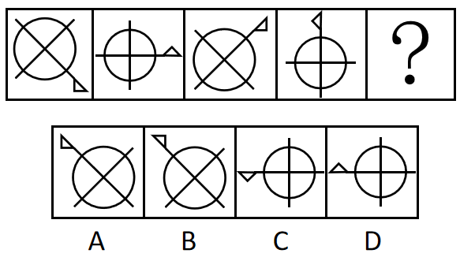
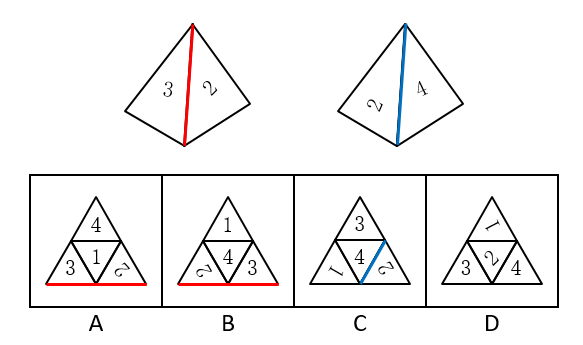
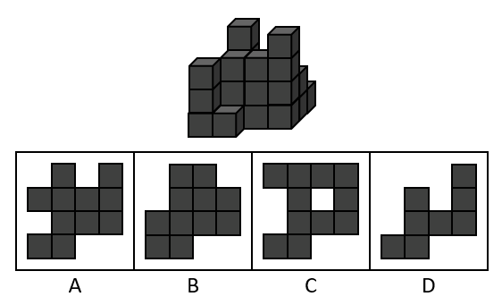
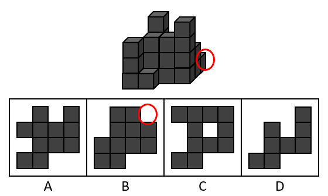

# 2019年广东省公务员录用考试《行测》题（乡镇卷）（网友回忆版）

> 判断推理 · 20 题 · 广东 2019

## 第 1 题　qid 2374814 · 图形推理

下列选项中最符合所给图形规律的是（    ）。

- **A**. A
- **B**. B　✅
- **C**. C
- **D**. D

**答案**：B

**官方解析**

元素组成不同，且无明显属性规律，考虑数量规律。观察图形发现，图2到图4图形均被分割为多个封闭空间，考虑面数量。题干图形的面数量分别为：1、2、3、4、？，则？处应为5个面的图形。A项11个面，排除；B项5个面，当选；C项6个面，排除；D项6个面，排除。
故正确答案为B。

---

## 第 2 题　qid 2374816 · 图形推理

下列选项中最符合所给图形规律的是（    ）。

- **A**. A
- **B**. B　✅
- **C**. C
- **D**. D

**答案**：B

**官方解析**

元素组成相同，优先考虑位置规律。观察题干图形，图一图三元素相同，图二图四元素相同，考虑图形间的位置规律。从图一到图三，图形逆时针旋转了，从图二到图四，图形逆时针旋转了，所以图五应该是图三逆时针旋转所得，只有B项符合。

故正确答案为B。

---

## 第 3 题　qid 2374819 · 图形推理

下列选项中最符合所给图形规律的是（    ）。

- **A**. A
- **B**. B
- **C**. C　✅
- **D**. D

**答案**：C

**官方解析**

解析一：元素组成相似，优先考虑样式规律。观察发现，第一组图中，图1和图2的阴影部分叠加，得到图3。第二组图遵循此规律，？处应该由图1和图2的阴影部分叠加而得，只有C项符合。

故正确答案为C。

解析二：元素组成相似，优先考虑样式规律。观察发现，题干图形由黑块和白块组成，且黑块数量不同，考虑黑白运算。根据第一组图可知，，，。将规律应用到第二组图，则？处上下的扇形应为，左右两侧扇形为和，只有C项符合。

故正确答案为C。

---

## 第 4 题　qid 2374822 · 图形推理

如图所示，这三个小图形可以组成的图形是（    ）。

- **A**. A
- **B**. B
- **C**. C
- **D**. D　✅

**答案**：D

**官方解析**

本题考查平面拼合，可采用平行且等长相消的方式解题。消去平行且等长的线段后进行组合即可得到轮廓图，即为D项。平行且等长相消的方式如下图所示：

故正确答案为D。

---

## 第 5 题　qid 2374746 · 图形推理

如图所示，四个相同的等腰直角三角形，不可能组成的图形是（    ）。

- **A**. 长方形
- **B**. 三角形
- **C**. 直角梯形　✅
- **D**. 平行四边形

**答案**：C

**官方解析**

本题考查图形拼合。通过将题干中四个相同的等腰直角三角形进行任意拼合，组成选项图形。

A项：可以组成，如图所示。

B项：可以组成，如图所示。

C项：不可以组成。

D项：可以组成，如图所示。

本题为选非题，故正确答案为C。

---

## 第 6 题　qid 2374827 · 图形推理

如图所示是从两个不同角度观察到的同一个正四面体的外表面，将该四面体展开，可能得到的图形是（    ）。

- **A**. A
- **B**. B
- **C**. C
- **D**. D　✅

**答案**：D

**官方解析**

本题为空间重构类，逐一分析选项：

A项：题干中数字3的背部紧邻公共边（如上图红线所示），而选项中数字3的底部紧邻公共边，选项与题干不一致，排除； 

B项：题干中数字3的背部紧邻公共边（如上图红线所示），而选项中数字3的底部紧邻公共边，选项与题干不一致，排除；

C项：题干中数字2的底部紧邻公共边（如上图蓝线所示），而选项中数字2的背部紧邻公共边，选项与题干不一致，排除；

D项：选项与题干一致，当选。

故正确答案为D。

---

## 第 7 题　qid 2374750 · 图形推理

下列选项，与所给立体图形不同的是（    ）。

- **A**. A
- **B**. B　✅
- **C**. C
- **D**. D

**答案**：B

**官方解析**

本题考查立体图形在空间中的旋转。

A项：题干图形逆时针旋转即可得到，与题干立体图形相同，排除；

B项：如上图所示，当题干图形旋转到直角处位置朝外的时候，多出来的小方块应该在下方，与题干立体图形不同，当选；

C项：题干图形逆时针旋转即可得到，与题干立体图形相同，排除；

D项：题干图形水平向后旋转，再顺时针旋转即可得到，与题干立体图形相同，排除。

本题为选非题，故正确答案为B。

---

## 第 8 题　qid 2374752 · 图形推理

下列选项中，不可能是所给立方体展开图的是（    ）。

- **A**. A　✅
- **B**. B
- **C**. C
- **D**. D

**答案**：A

**官方解析**

本题为空间重构题。

在立体图形中，三条虚线面两两相邻，没有构成相对面。而A项中，存在一组虚线面是相对面（如下图所示），不可能同时出现在立体图形中。

本题为选非题，故正确答案为A。

---

## 第 9 题　qid 2374748 · 图形推理

一个正方形旋转后，其旋转轨迹不可能形成的图形是（    ）。

- **A**. A
- **B**. B
- **C**. C　✅
- **D**. D

**答案**：C

**官方解析**

逐一分析选项。

A项：沿正方形的对角线旋转可得到选项（如上图），排除；

B项：沿正方形的轴对称线旋转可得到选项（如上图），排除；

C项：选项无法由正方形旋转而成，当选；

D项：沿正方形的某一边旋转可得到选项（如上图），排除。

本题为选非题，故正确答案为C。

---

## 第 10 题　qid 2374815 · 类比推理

如图所示，所给物体的俯视图不可能是（    ）。

- **A**. A
- **B**. B　✅
- **C**. C
- **D**. D

**答案**：B

**官方解析**

给定物体可看作由从前往后4排小正方体组成，且右上角最后一排从侧面看到已有小正方体存在，所以在俯视图上，右上角不可能缺了一个小正方形，如下图所示。

本题为选非题，故正确答案为B。

---

## 第 11 题　qid 2374818 · 类比推理

民风：淳朴

- **A**. 阳光：灿烂　✅
- **B**. 书本：文化
- **C**. 树木：开花
- **D**. 喜悦：笑容

**答案**：A

**官方解析**

第一步：判断题干词语间逻辑关系。
“淳朴”的“民风”，“淳朴”用来形容“民风”，且“淳朴”是形容词，二者之间是偏正关系。
第二步：判断选项词语间逻辑关系。
A项：“灿烂”的“阳光”，“灿烂”用来形容“阳光”，且“灿烂”是形容词，二者之间是偏正关系，与题干逻辑关系一致，当选；
B项：通过“书本”可以获得“文化”，二者属于对应关系，与题干逻辑关系不一致，排除；
C项：“开花”是“树木”的一种或然形式，且“开花”是动宾短语，与题干逻辑关系不一致，排除；
D项：“喜悦”时会露出“笑容”，二者属于对应关系，与题干逻辑关系不一致，排除。
故正确答案为A。

---

## 第 12 题　qid 2374820 · 类比推理

纺织：布匹

- **A**. 矿石：金属
- **B**. 努力：收获
- **C**. 工作：奉献
- **D**. 耕种：粮食　✅

**答案**：D

**官方解析**

第一步：判断题干词语间逻辑关系。
“纺织”是动作，“布匹”是成品，通过“纺织”得到“布匹”，二者是动作和成品的对应关系，且“布匹”是实物。
第二步：判断选项词语间逻辑关系。
A项：“矿石”是指可从中提取有用组分或其本身具有某种可被利用的性能的矿物集合体，可分为金属矿物、非金属矿物。“矿石”和“金属”二者是交叉关系，与题干逻辑关系不一致，排除；
B项：通过“努力”获得“收获”，但“收获”是抽象名词，与题干逻辑关系不一致，排除；
C项：“工作”中需要“奉献”精神，二者不是动作和成品的对应关系，与题干逻辑关系不一致，排除；
D项：“耕种”是动作，“粮食”是成品，通过“耕种”得到“粮食”，二者是动作和成品的对应关系，且“粮食”是实物，与题干逻辑关系一致，当选。
故正确答案为D。

---

## 第 13 题　qid 2374824 · 类比推理

水稻：植物

- **A**. 木耳：银耳
- **B**. 香蕉：水果　✅
- **C**. 动物：田鼠
- **D**. 米饭：面条

**答案**：B

**官方解析**

第一步，判断题干词语间逻辑关系。
题干中“水稻”是一种“植物”，二者是种属关系。
第二步，判断选项词语间逻辑关系。
A项：“木耳”和“银耳”都是一种真菌，二者是并列关系，与题干逻辑关系不一致，排除；
B项：“香蕉”是一种“水果”，二者是种属关系，与题干逻辑关系一致，当选；
C项：“田鼠”是一种“动物”，但是顺序反了，与题干逻辑关系不一致，排除；
D项：“米饭”和“面条”是两种不同的食物，二者是并列关系，与题干逻辑关系不一致，排除。
故正确答案为B。

---

## 第 14 题　qid 2374829 · 类比推理

丰富：贫乏

- **A**. 体贴：粗犷
- **B**. 精致：丑恶
- **C**. 拘束：随意　✅
- **D**. 振奋：高兴

**答案**：C

**官方解析**

第一步，判断题干词语间逻辑关系。
“丰富”指种类多或数量大，“贫乏”指缺少，二者为反义关系。
第二步，判断选项词语间逻辑关系。
A项：“体贴”指细心忖度别人的心情和处境，给予关切、照顾，“粗犷”指粗鲁豪放，二者无语义关系，与题干逻辑关系不一致，排除；
B项：“精致”指精巧细致，“丑恶”指丑陋恶劣，二者无语义关系，与题干逻辑关系不一致，排除；
C项：“拘束”指过分约束，“随意”指任凭自己的意思，不约束，二者为反义关系，与题干逻辑关系一致，当选；
D项：“振奋”指精神振作奋发，“高兴”指心情好，二者无语义关系，与题干逻辑关系不一致，排除。
故正确答案为C。

---

## 第 15 题　qid 2374832 · 类比推理

贫困：扶贫：脱贫

- **A**. 垃圾：清扫：整洁
- **B**. 拥堵：交警：畅通
- **C**. 噪音：抑制：平静
- **D**. 羸弱：锻炼：健壮　✅

**答案**：D

**官方解析**

第一步：判断题干词语间逻辑关系。
“贫困”需要“扶贫”，达到“脱贫”的目的，题干为状态、方式、目的的对应关系。
第二步：判断选项词语间逻辑关系。
A项：“垃圾”是名词，不是一种状态，题干逻辑关系不一致，排除；
B项：“拥堵”需要的是“疏通”，“交警”不是方式，与题干逻辑关系不一致，排除；
C项：“噪音”需要“抑制”，但目的应该是“安静”，不是“平静”，与题干逻辑关系不一致，排除；
D项：“羸弱”是一种状态，“羸弱”需要通过“锻炼”变“健壮”，与题干逻辑关系一致，当选。
故正确答案为D。

---

## 第 16 题　qid 2374736 · 逻辑判断

一座城市要想发展好会展产业，就需要“筑巢引凤”——先具备软硬件基础，再吸引会展活动。拥有完备的会展设施和理想的交通条件，只是说明一座城市具备了发展会展产业的硬件基础，要想吸引足够数量的高质量会展活动，还需要提高公共服务水平、构建良好的营商环境，从而加强软实力的建设。
如果上述表述为真，则以下情况中不可能发生的是（    ）。

- **A**. 甲市具备了发展会展产业的硬件基础，却发展不好会展产业
- **B**. 乙市大力提升公共服务水平，吸引了足够数量的高质量会展活动
- **C**. 丙市的会展产业非常发达，但市政设施老化的问题日渐突出
- **D**. 丁市会展设施完备、交通条件理想，但未具备发展会展产业的硬件基础　✅

**答案**：D

**官方解析**

日常结论题，根据题干信息逐一分析选项。
A项：据题干第一句话可知，发展会展产业需要软硬件基础，而甲市只具备硬件基础，软件基础不明确，所以是有可能发展不好会展产业的，排除；
B项：据题干第二句话可知，要想吸引足够数量的高质量会展活动，需要提高公共服务水平、构建良好的营商环境，乙市已经提高公共服务水平了，构建良好的营商环境不明确，所以有可能可以吸引足够数量的高质量会展活动，排除；
C项：据题干第一句话可知，要想发展好会展产业，就需要具备软硬件基础，丙市会展产业非常发达，说明具备软硬件基础，但市政设施如何题干没有提及，即不明确，是有可能发生的，排除；
D项：据题干第二句话可知，拥有完备的会展设施和理想的交通条件，就说明这座城市具备了发展会展产业的硬件基础，丁市会展设施完备、交通条件理想，是具备了发展会展产业的硬件基础的，因此不可能发生，当选。
本题为选非题，故正确答案为D。

---

## 第 17 题　qid 2374753 · 逻辑判断

G市经济发达、教育资源丰富，许多在G市就读的大学生毕业后都选择留在G市工作生活。但在今年，G市周边的几个城市都出台了一系列针对大学生落户的优惠政策，许多G市大学生因此选择将户口迁往周边城市。由此可以预测，今年留在G市的大学生将会更容易找到工作。
以下最能反驳上述论证的是（    ）。

- **A**. G市周边的几个城市中，大学生同样不容易找到心仪的工作
- **B**. 与去年相比，今年G市的几个大型工厂招收工人数量有所减少
- **C**. 绝大多数将户口迁往周边城市的G市大学生仍然选择在G市工作　✅
- **D**. 有调查指出，过去几年在G市的大学生并没有面临很大的就业压力

**答案**：C

**官方解析**

第一步：找出论点和论据。
论点：今年留在G市大学生将会更容易找到工作。
论据：在今年，G市周边的几个城市都出台了一系列针对大学生落户的优惠政策，许多G市大学生因此选择将户口迁往周边城市。
本题的论点讨论的是找工作的难易程度，而论据讨论的是出台政策使得大学生迁户口，两者讨论的话题不一致，优先考虑通过拆桥削弱，说明大学生迁户口与找工作的难易程度没关系。
第二步：逐一分析选项。
A项：题干讨论的是G市的就业情况，而该选项讨论的是其他周边几个城市，话题不一致，无法削弱，排除；
B项：与去年相比，今年G市的几个大型工厂招收工人数量有所减少，但大学生原本会不会去这几个大型工厂当工人并不明确，无法削弱，排除；
C项：绝大多数将户口迁往周边城市的G市大学生仍然选择留在G市工作，说明即使大学生将户口迁离G市，但是绝大多数人都选择在G市工作，找工作的人并不会减少，说明论据的迁户口和论点的找工作容易度没有关系，拆断了论点和论据的联系，可以削弱，当选；
D项：过去几年在G市的大学生没有面临很大的就业压力，该选项讨论的是过去几年的事情，而题干论点讨论的是今年的就业会不会更容易，话题不一致，无法削弱，排除。
故正确答案为C。

---

## 第 18 题　qid 2374741 · 逻辑判断

在发达国家的产业结构中，服务业占了很高的比重。根据他们的经验，提高服务业占比就可以促进就业。但是，服务业具有较高的进入壁垒，这也是我国服务业发展相对滞后的一个重要原因。因此，我国可以通过打破服务业的行业壁垒进一步促进就业。
以下最可能是上述论证潜在假设的是（    ）。

- **A**. 服务业促进就业的规律适用于我国　✅
- **B**. 我国创造就业的能力弱于发达国家
- **C**. 发达国家的服务业也存在行业壁垒
- **D**. 其他行业对促进就业没有显著作用

**答案**：A

**官方解析**

第一步：找出论点和论据。
论点：我国可以通过打破服务业的行业壁垒进一步促进就业。
论据：在发达国家的产业结构中，服务业占了很高的比重。根据他们的经验，提高服务业占比就可以促进就业。但是，服务业具有较高的进入壁垒，这也是我国服务业发展相对滞后的一个重要原因。
本题的问法为“假设”，论点是我国可以打破服务业壁垒来促进就业，论据是提高服务业占比就可以促进就业，而服务业壁垒影响到服务业发展。二者话题一致，考虑必要条件，即服务业促进就业是可行的。
第二步：逐一分析选项。
A项：说明在我国服务业是可以促进就业的，那么打破服务业壁垒促进服务业发展就可以进一步促进就业，是论证成立的假设，当选；
B项：论点说的是服务业和就业之间的关系，该项说的是创造就业能力和发达国家之间的对比，话题不一致，不是论证成立的假设，排除；
C项：论点说的是我国服务业和就业之间的关系，该项说的是发达国家的服务业存在行业壁垒，话题不一致，不是论证成立的假设，排除；
D项：论点说的是服务业和就业之间的关系，该项说的是其他行业和促进就业之间的关系，主体不一致，不是论证成立的假设，排除。
故正确答案为A。

---

## 第 19 题　qid 2374757 · 定义判断

近年来随着大型野生动物园的兴起，有人提出，传统城市动物园已经没有存在的必要性。但传统城市动物园具有票价低、交通便利等优点，中小学组织参观十分方便，因而具有很强的教育功能，所以传统城市动物园不可或缺。
以下不属于上述论证缺陷的是（    ）。

- **A**. 忽视了野生动物园和传统城市动物园具有并存的可能性　✅
- **B**. 默认了具有很强教育功能的传统城市动物园就应该保留
- **C**. 忽视了票价低、交通便利不等同于方便中小学组织参观
- **D**. 默认了方便中小学组织参观的动物园都具有很强的教育功能

**答案**：A

**官方解析**

第一步：找出论点和论据。
论点：传统城市动物园不可或缺。
论据：传统城市动物园具有票价低、交通便利等优点，中小学组织参观十分方便，因而具有很强的教育功能。
本题的问法较为新颖，其实论证缺陷就是题干中的漏洞，而该题问的是“不属于上述论证缺陷的是”，即排除能够指出题干中存在漏洞的选项即可。
第二步：逐一分析选项。
A项：该项讨论的是“野生动物园和传统城市动物园能否并存”，而论点讨论的是“传统城市动物园是否不可或缺”，话题不一致，无法指出论证缺陷，当选；
B项：默认了论据“教育功能”与论点“传统城市动物园不可或缺”之间的关系，指出论点论据具有联系，通过搭桥指出论证缺陷，排除；
C项：忽视了“票价低、交通便利不等同于方便中小学组织参观”，也就是票价低、交通便利不一定方便参观，并非不可或缺，拆断论点论据联系，通过拆桥指出论证缺陷，排除；
D项：默认了“方便中小学组织参观的动物园都具有很强的教育功能”，指出论点论据具有联系，通过搭桥指出论证缺陷，排除。
本题为选非题，故正确答案为A。

---

## 第 20 题　qid 2374745 · 逻辑判断

历史经验告诉我们，世界经济危机往往伴随着巨大的世界变革：1857年世界经济危机后的电气革命，推动人类社会从蒸汽时代进入电气时代；1929年世界经济危机引发了第二次世界大战，客观上推动了科学技术的发展。由此可知，是经济危机造成了巨大的世界变革。
以下和该论证过程的逻辑最为类似的是（    ）。

- **A**. 不正确的坐姿会加重颈部负担，因而是腰酸背痛的主要诱因
- **B**. 海底地震是海啸的主要成因，因为海啸发生前往往能观测到海底地震　✅
- **C**. 宇航员的预期寿命明显高于一般人，因此太空旅行中的辐射暴露并不会危害人体
- **D**. 许多体弱多病的人都不喜欢吃蔬菜，所以想保持身体健康就必须从蔬菜中摄入足量的膳食纤维

**答案**：B

**官方解析**

第一步：分析题干逻辑关系。
题干是在说发生世界经济危机之后，会发生巨大的世界变革，得出的结论是经济危机造成了巨大的世界变革。
即A、B先后发生，则先发生的A为因，后发生的B为果(认为先后顺序代表因果关系)。
第二步：逐一分析选项。
A项：指出不正确的坐姿加重颈部负担，而结论是腰酸背痛的主要诱因，出现了不正确坐姿、加重颈部负担和腰酸背痛3件事，与题干中逻辑关系不一致，排除；
B项：先观测到海底地震，再发生海啸，得出结论海底地震是海啸的主要成因，符合A、B先后发生，则先发生的A为因，后发生的B为果，与题干中逻辑关系一致，当选；
C项：宇航员的预期寿命明显高于一般人，因此太空旅行中的辐射暴露并不会伤害人体，完全没有指明具有先后发生的两件事，与题干中逻辑关系不一致，排除；
D项：许多体弱多病的人都不喜欢吃蔬菜，看不出体弱多病和不喜欢吃蔬菜的先后顺序，与题干中逻辑关系不一致，排除。
故正确答案为B。

---
