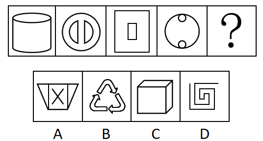
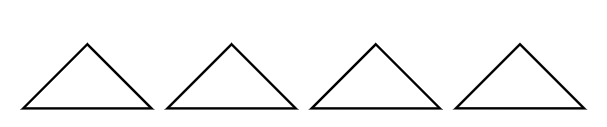
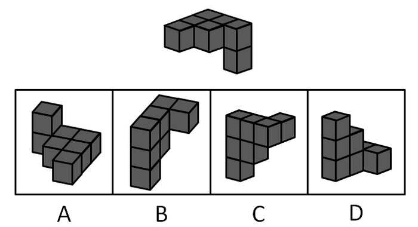
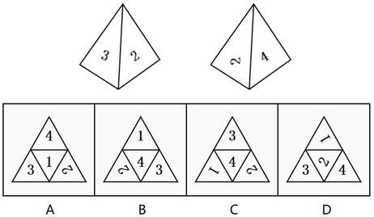
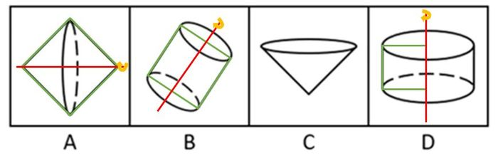
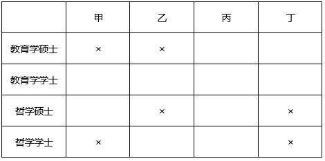
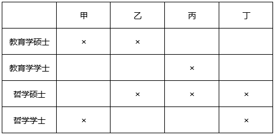

# 2019年广东省公务员录用考试《行测》题（县级卷）（网友回忆版）

> 判断推理 · 30 题 · 广东 2019

## 第 1 题　qid 2374742 · 图形推理

下列选项中最符合所给图形规律的是（    ）。

- **A**. A
- **B**. B　✅
- **C**. C
- **D**. D

**答案**：B

**官方解析**

元素组成相同，优先考虑位置规律。观察图形发现，图1到图2第四行的小黑块向左平移一格，图2到图3第三行的小黑块向左平移一格，图3到图4第二行的小黑块向左平移一格，因此，图4到？，应为第一行的小黑块向左平移一格，只有B项符合。
故正确答案为B。

---

## 第 2 题　qid 2374743 · 图形推理

下列选项中最符合所给图形规律的是（    ）。

- **A**. A
- **B**. B
- **C**. C
- **D**. D　✅

**答案**：D

**官方解析**

元素组成不同，且无明显属性规律，考虑数量规律。观察图形发现，题干外圈均为圆，内圈出现多条直线，考虑数线。题干图形内部的直线数量为：1、2、3、4、？，因此？处图形内部应有5条直线。只有D项符合。
故正确答案为D。

---

## 第 3 题　qid 2374744 · 图形推理

下列选项中最符合所给图形规律的是（    ）。

- **A**. A　✅
- **B**. B
- **C**. C
- **D**. D

**答案**：A

**官方解析**

元素组成不同，优先考虑属性规律。观察题干图形，每幅图均是轴对称图形，且都能够竖轴对称，所以？处图形也应该是竖轴对称图形，只有A项符合。
故正确答案为A。

---

## 第 4 题　qid 2374746 · 图形推理

如图所示，四个相同的等腰直角三角形，不可能组成的图形是（    ）。

- **A**. 长方形
- **B**. 三角形
- **C**. 直角梯形　✅
- **D**. 平行四边形

**答案**：C

**官方解析**

本题考查图形拼合。通过将题干中四个相同的等腰直角三角形进行任意拼合，组成选项图形。

A项：可以组成，如图所示。

B项：可以组成，如图所示。

C项：不可以组成。

D项：可以组成，如图所示。

本题为选非题，故正确答案为C。

---

## 第 5 题　qid 2374749 · 图形推理

如图所示，下列物体均由纯黑色和纯白色的小立方体组成。则物体①与物体②中，（    ）由5块物体③堆积而成。

- **A**. 只有物体①可能
- **B**. 只有物体②可能
- **C**. 物体①与②均可能　✅
- **D**. 物体①与②均不可能

**答案**：C

**官方解析**

题干的物体③由1个黑块和1个白块组成。

分析物体①，前侧的6个小方块，可以由3个物体③组成，即左侧为横着的2个物体③，右侧为1个竖着的物体③；后侧可以看到左上角1个白块和右下角1个白块，则可能是1个竖着的物体③和1个横着的物体③，所以物体①可以由物体③堆积而成，如下图所示。

分析物体②，最上面是1个横着放的物体③，中层是2个黑块朝外的物体③，最下层是1个黑块朝外和1个黑块朝内的物体③，所以物体②可以由物体③堆积而成。

即物体①和②均有可能。

故正确答案为C。

---

## 第 6 题　qid 2374750 · 图形推理

下列选项，与所给立体图形不同的是（    ）。

- **A**. A
- **B**. B　✅
- **C**. C
- **D**. D

**答案**：B

**官方解析**

本题考查立体图形在空间中的旋转。

A项：题干图形逆时针旋转即可得到，与题干立体图形相同，排除；

B项：如上图所示，当题干图形旋转到直角处位置朝外的时候，多出来的小方块应该在下方，与题干立体图形不同，当选；

C项：题干图形逆时针旋转即可得到，与题干立体图形相同，排除；

D项：题干图形水平向后旋转，再顺时针旋转即可得到，与题干立体图形相同，排除。

本题为选非题，故正确答案为B。

---

## 第 7 题　qid 2374747 · 图形推理

如图所示是从两个不同角度观察到的同一个正四面体的外表面，将该四面体展开，可能得到的图形是（    ）。

- **A**. A
- **B**. B
- **C**. C
- **D**. D　✅

**答案**：D

**官方解析**

本题为空间重构类，逐一分析选项。

A项：题干中数字3的背部紧邻公共边（如上图红线所示），而选项中数字3的底部紧邻公共边，选项与题干不一致，排除； 

B项：题干中数字3的背部紧邻公共边（如上图红线所示），而选项中数字3的底部紧邻公共边，选项与题干不一致，排除；

C项：题干中数字2的底部紧邻公共边（如上图蓝线所示），而选项中数字2的上部紧邻公共边，选项与题干不一致，排除；

D项：选项与题干一致，当选。

故正确答案为D。

---

## 第 8 题　qid 2374748 · 图形推理

一个正方形旋转后，其旋转轨迹不可能形成的图形是（    ）。

- **A**. A
- **B**. B
- **C**. C　✅
- **D**. D

**答案**：C

**官方解析**

逐一分析选项。

A项：沿正方形的对角线旋转可得到选项（如上图），排除；

B项：沿正方形的轴对称线旋转可得到选项（如上图），排除；

C项：选项无法由正方形旋转而成，当选；

D项：沿正方形的某一边旋转可得到选项（如上图），排除。

本题为选非题，故正确答案为C。

---

## 第 9 题　qid 2374751 · 图形推理

将一个空心圆柱体斜切，得到下图所示物体。不可能是这一物体截面的是（    ）。

- **A**. A
- **B**. B　✅
- **C**. C
- **D**. D

**答案**：B

**官方解析**

本题考查截面图，逐一分析选项。

如下图所示，A、C、D项均可截出。

由于是空心圆柱，要截成三个矩形组成的面，必须经过中间的空心，截完之后中间不可能出现横实线（如下图所示），所以B项不能截成。

本题为选非题，故正确答案为B。

---

## 第 10 题　qid 2374752 · 图形推理

下列选项中，不可能是所给立方体展开图的是（    ）。

- **A**. A　✅
- **B**. B
- **C**. C
- **D**. D

**答案**：A

**官方解析**

本题为空间重构题。

在立体图形中，三条虚线面两两相邻，没有构成相对面。而A项中，存在一组虚线面是相对面（如下图所示），不可能同时出现在立体图形中。

本题为选非题，故正确答案为A。

---

## 第 11 题　qid 2374719 · 类比推理

电脑：主板（    ）

- **A**. 台历：挂历
- **B**. 水果：苹果
- **C**. 胶片：相机
- **D**. 房屋：地基　✅

**答案**：D

**官方解析**

第一步：判断题干词语间逻辑关系。
主板是电脑的组成部分，二者是包容关系中的组成关系。
第二步：判断选项词语间逻辑关系。
A项：台历和挂历都可以用来查询公历、农历、节日、节气等信息，二者是并列关系，与题干逻辑关系不一致，排除；
B项：苹果是水果的一种，二者是种属关系，与题干逻辑关系不一致，排除；
C项：对于传统相机而言，胶片需要与相机一起使用才能照相，二者是配套使用的关系，与题干逻辑关系不一致，排除；
D项：地基指承受上部结构荷载影响的土体，对保证建筑物的坚固耐久具有非常重要的作用，是房屋的组成部分，二者是包容关系中的组成关系，与题干逻辑关系一致，当选。
故正确答案为D。

---

## 第 12 题　qid 2374720 · 类比推理

打扫：整洁（    ）

- **A**. 复习：考试
- **B**. 降价：实惠　✅
- **C**. 绿化：环保
- **D**. 实践：真理

**答案**：B

**官方解析**

第一步：判断题干词语间逻辑关系。
因为打扫，所以（房间）整洁，二者是因果对应关系。
第二步：判断选项词语间逻辑关系。
A项：先复习，后考试，二者是时间先后顺序对应关系，与题干逻辑关系不一致，排除；
B项：因为降价，所以（商品）实惠，二者是因果对应关系，与题干逻辑关系一致，当选；
C项：绿化是一种环保，二者是种属关系，与题干逻辑关系不一致，排除；
D项：实践是检验真理的唯一标准，也可以说实践是为了检验真理，二者是对应关系，与题干逻辑关系不一致，排除。
故正确答案为B。
注：本题在广东的考情中优先看成因果对应关系，整洁是对状态的表述，也是一种结果。如果理解成方式目的的对应关系，目的应该是变得整洁，据此没有唯一答案。

---

## 第 13 题　qid 2374725 · 类比推理

丰富：贫乏（    ）

- **A**. 体贴：粗犷
- **B**. 精美：丑恶
- **C**. 拘束：随意　✅
- **D**. 振奋：冷静

**答案**：C

**官方解析**

第一步：判断题干词语间逻辑关系。
丰富意思是种类多，数量大，充裕，涉及面广，贫乏意思是缺少、不充裕、不丰富，二者是反义关系。
第二步：判断选项词语间逻辑关系。
A项：体贴指细心体会、关怀、体谅，能够设身处地为他人着想，使对方感到舒适满意。粗犷有两层意思，一种指粗鲁强横，一种指粗率豪放。二者不是反义关系，与题干逻辑关系不一致，排除；
B项：精美形容精致而美好，也有特别用心的意思。丑恶指丑秽邪恶。二者不是反义关系，与题干逻辑关系不一致，排除；
C项：拘束，指感到约束，不自在，由于拘谨而显得不自然，随意指任凭自己的意愿，随心所欲的，二者是反义关系，与题干逻辑关系一致，当选；
D项：振奋，是指振作精神，奋发努力。冷静指人少而静，不热闹或是人沉着而不感情用事。二者不是反义关系，与题干逻辑关系不一致，排除。
故正确答案为C。

---

## 第 14 题　qid 2374728 · 类比推理

投递：收件（    ）

- **A**. 逛街：娱乐
- **B**. 购买：赠送
- **C**. 借阅：整理
- **D**. 授课：学习　✅

**答案**：D

**官方解析**

第一步：判断题干词语间逻辑关系。
邮递员投递，收件人收件，这两个动作发出的主体不一致，且投递和收件是两个相对动作。
第二步：判断选项词语间逻辑关系。
A项：逛街是娱乐的一种方式，二者是种属关系，与题干逻辑关系不一致，排除；
B项：购买与赠送可以是同一主体，且二者不是两个相对动作，与题干逻辑关系不一致，排除；
C项：借阅和整理可以是同一主体，且二者不是两个相对动作，与题干逻辑关系不一致，排除；
D项：老师授课，学生学习，授课与学习不是同一主体，且授课和学习也是两个相对动作，与题干逻辑关系一致，当选。
故正确答案为D。

---

## 第 15 题　qid 2374730 · 类比推理

画作：风景（    ）

- **A**. 著作：英雄　✅
- **B**. 歌剧：电影
- **C**. 抒发：情感
- **D**. 蓝图：设计

**答案**：A

**官方解析**

第一步：判断题干词语间逻辑关系。
画作描绘的对象是风景，二者是对应关系，且画作与风景均为名词。
第二步：判断选项词语间逻辑关系。
A项：著作描写的对象是英雄，二者是对应关系，且著作与英雄均为名词，与题干逻辑关系一致，当选；
B项：歌剧和电影是两种不同的艺术形式，二者是并列关系，与题干逻辑关系不一致，排除；
C项：抒发情感构成动宾短语，且抒发为动词，与题干逻辑关系不一致，排除；
D项：设计蓝图构成动宾短语，且设计为动词，与题干逻辑关系不一致，排除。
故正确答案为A。

---

## 第 16 题　qid 2374736 · 逻辑判断

一座城市要想发展好会展产业，就需要“筑巢引凤”——先具备软硬件基础，再吸引会展活动。拥有完备的会展设施和理想的交通条件，只是说明一座城市具备了发展会展产业的硬件基础，要想吸引足够数量的高质量会展活动，还需要提高公共服务水平、构建良好的营商环境，从而加强软实力的建设。
如果上述表述为真，则以下情况中不可能发生的是（    ）。

- **A**. 甲市具备了发展会展产业的硬件基础，却发展不好会展产业
- **B**. 乙市大力提升公共服务水平，吸引了足够数量的高质量会展活动
- **C**. 丙市的会展产业非常发达，但市政设施老化的问题日渐突出
- **D**. 丁市会展设施完备、交通条件理想，但未具备发展会展产业的硬件基础　✅

**答案**：D

**官方解析**

日常结论题，根据题干信息逐一分析选项。
A项：据题干第一句话可知，发展会展产业需要软硬件基础，而甲市只具备硬件基础，软件基础不明确，所以是有可能发展不好会展产业的，排除；
B项：据题干第二句话可知，要想吸引足够数量的高质量会展活动，需要提高公共服务水平、构建良好的营商环境，乙市已经提高公共服务水平了，构建良好的营商环境不明确，所以有可能可以吸引足够数量的高质量会展活动，排除；
C项：据题干第一句话可知，要想发展好会展产业，就需要具备软硬件基础，丙市会展产业非常发达，说明具备软硬件基础，但市政设施如何题干没有提及，即不明确，是有可能发生的，排除；
D项：据题干第二句话可知，拥有完备的会展设施和理想的交通条件，就说明这座城市具备了发展会展产业的硬件基础，丁市会展设施完备、交通条件理想，是具备了发展会展产业的硬件基础的，因此不可能发生，当选。
本题为选非题，故正确答案为D。

---

## 第 17 题　qid 2374738 · 逻辑判断

芯片产业是全球分工合作的产业，其分布的领域非常广，不同领域面对的问题和挑战也大不相同，没有一个国家能够拥有完完整整的自主可控芯片产业链。但一国想要获得芯片产业的话语权，至少应该掌握产业链条上某些环节的关键技术，这样才能避免受制于人。
根据上述表述，下列判断一定正确的是（    ）。

- **A**. 一个国家只要有了芯片产业话语权，该国就可能拥有完整的芯片产业链
- **B**. 一个国家如果没有芯片产业的关键技术，则该国的芯片产业将受制于人　✅
- **C**. 一个国家的芯片产业要想不受制于人，就必须拥有完整的芯片产业链
- **D**. 一个国家如果掌握了芯片产业的关键技术，那么该国一定具有芯片产业的话语权

**答案**：B

**官方解析**

第一步：翻译题干。

①话语权关键技术

②避免受制于人关键技术

第二步：逐一分析选项。

A项：话语权与产业链的关系题干中未提及，无法推出，排除；

B项：翻译为关键技术受制于人，是对②的否后，否后必否前，可以推出，当选；

C项：受制于人与产业链的关系题干中未提及，无法推出，排除；

D项：翻译为关键技术话语权，是对①的肯后，但肯后得不到确定性的结论，排除。

故正确答案为B。

---

## 第 18 题　qid 2374741 · 逻辑判断

在发达国家的产业结构中，服务业占了很高的比重。根据他们的经验，提高服务业占比就可以促进就业。但是，服务业具有较高的进入壁垒，这也是我国服务业发展相对滞后的一个重要原因。因此，我国可以通过打破服务业的行业壁垒进一步促进就业。
以下最可能是上述论证潜在假设的是（    ）。

- **A**. 服务业促进就业的规律适用于我国　✅
- **B**. 我国创造就业的能力弱于发达国家
- **C**. 发达国家的服务业也存在行业壁垒
- **D**. 其他行业对促进就业没有显著作用

**答案**：A

**官方解析**

第一步：找出论点和论据。
论点：我国可以通过打破服务业的行业壁垒进一步促进就业。
论据：在发达国家的产业结构中，服务业占了很高的比重。根据他们的经验，提高服务业占比就可以促进就业。但是，服务业具有较高的进入壁垒，这也是我国服务业发展相对滞后的一个重要原因。
本题的问法为“假设”，论点是我国可以打破服务业壁垒来促进就业，论据是提高服务业占比就可以促进就业，而服务业壁垒影响到服务业发展。二者话题一致，考虑必要条件，即服务业促进就业是可行的。
第二步：逐一分析选项。
A项：说明在我国服务业是可以促进就业的，那么打破服务业壁垒促进服务业发展就可以进一步促进就业，是论证成立的假设，当选；
B项：论点说的是服务业和就业之间的关系，该项说的是创造就业能力和发达国家之间的对比，话题不一致，不是论证成立的假设，排除；
C项：论点说的是我国服务业和就业之间的关系，该项说的是发达国家的服务业存在行业壁垒，话题不一致，不是论证成立的假设，排除；
D项：论点说的是服务业和就业之间的关系，该项说的是其他行业和促进就业之间的关系，主体不一致，不是论证成立的假设，排除。
故正确答案为A。

---

## 第 19 题　qid 2374717 · 类比推理

某办公室有教育学硕士、教育学学士、哲学硕士、哲学学士各一人。四人中，甲不是教育学硕士也不是哲学学士；甲和丙学习的是同一门学科；乙只获得了学士学位；丁不学哲学。
如果上述表述为真，则以下说法正确的是（    ）。

- **A**. 甲是教育学学士
- **B**. 乙是哲学学士
- **C**. 丙是哲学学士　✅
- **D**. 丁是教育学学士

**答案**：C

**官方解析**

本题信息较多，考虑列表法。根据题干可知，甲不是教育学硕士也不是哲学学士，乙只获得了学士学位，丁不学哲学，可得表格信息如下所示。

再根据甲与丙是同一门学科，如果丙是教育学学士，那么甲必须是教育学硕士，与题干条件“甲不是教育学硕士”矛盾，由此可知丙一定不能为教育学学士，同理，丙也不能为哲学硕士。

由以上表格可知，甲只能为哲学硕士，那么丙为哲学学士，则丁为教育学硕士，乙为教育学学士，如下表所示。

故正确答案为C。

---

## 第 20 题　qid 2374745 · 逻辑判断

历史经验告诉我们，世界经济危机往往伴随着巨大的世界变革：1857年世界经济危机后的电气革命，推动人类社会从蒸汽时代进入电气时代；1929年世界经济危机引发了第二次世界大战，客观上推动了科学技术的发展。由此可知，是经济危机造成了巨大的世界变革。
以下和该论证过程的逻辑最为类似的是（    ）。

- **A**. 不正确的坐姿会加重颈部负担，因而是腰酸背痛的主要诱因
- **B**. 海底地震是海啸的主要成因，因为海啸发生前往往能观测到海底地震　✅
- **C**. 宇航员的预期寿命明显高于一般人，因此太空旅行中的辐射暴露并不会危害人体
- **D**. 许多体弱多病的人都不喜欢吃蔬菜，所以想保持身体健康就必须从蔬菜中摄入足量的膳食纤维

**答案**：B

**官方解析**

第一步：分析题干逻辑关系。
题干是在说发生世界经济危机之后，会发生巨大的世界变革，得出的结论是经济危机造成了巨大的世界变革。
即A、B先后发生，则先发生的A为因，后发生的B为果(认为先后顺序代表因果关系)。
第二步：逐一分析选项。
A项：指出不正确的坐姿加重颈部负担，而结论是腰酸背痛的主要诱因，出现了不正确坐姿、加重颈部负担和腰酸背痛3件事，与题干中逻辑关系不一致，排除；
B项：先观测到海底地震，再发生海啸，得出结论海底地震是海啸的主要成因，符合A、B先后发生，则先发生的A为因，后发生的B为果，与题干中逻辑关系一致，当选；
C项：宇航员的预期寿命明显高于一般人，因此太空旅行中的辐射暴露并不会伤害人体，完全没有指明具有先后发生的两件事，与题干中逻辑关系不一致，排除；
D项：许多体弱多病的人都不喜欢吃蔬菜，看不出体弱多病和不喜欢吃蔬菜的先后顺序，与题干中逻辑关系不一致，排除。
故正确答案为B。

---

## 第 21 题　qid 2374753 · 逻辑判断

G市经济发达、教育资源丰富，许多在G市就读的大学生毕业后都选择留在G市工作生活。但在今年，G市周边的几个城市都出台了一系列针对大学生落户的优惠政策，许多G市大学生因此选择将户口迁往周边城市。由此可以预测，今年留在G市的大学生将会更容易找到工作。
以下最能反驳上述论证的是（    ）。

- **A**. G市周边的几个城市中，大学生同样不容易找到心仪的工作
- **B**. 与去年相比，今年G市的几个大型工厂招收工人数量有所减少
- **C**. 绝大多数将户口迁往周边城市的G市大学生仍然选择在G市工作　✅
- **D**. 有调查指出，过去几年在G市的大学生并没有面临很大的就业压力

**答案**：C

**官方解析**

第一步：找出论点和论据。
论点：今年留在G市大学生将会更容易找到工作。
论据：在今年，G市周边的几个城市都出台了一系列针对大学生落户的优惠政策，许多G市大学生因此选择将户口迁往周边城市。
本题的论点讨论的是找工作的难易程度，而论据讨论的是出台政策使得大学生迁户口，两者讨论的话题不一致，优先考虑通过拆桥削弱，说明大学生迁户口与找工作的难易程度没关系。
第二步：逐一分析选项。
A项：题干讨论的是G市的就业情况，而该选项讨论的是其他周边几个城市，话题不一致，无法削弱，排除；
B项：与去年相比，今年G市的几个大型工厂招收工人数量有所减少，但大学生原本会不会去这几个大型工厂当工人并不明确，无法削弱，排除；
C项：绝大多数将户口迁往周边城市的G市大学生仍然选择留在G市工作，说明即使大学生将户口迁离G市，但是绝大多数人都选择在G市工作，找工作的人并不会减少，说明论据的迁户口和论点的找工作容易度没有关系，拆断了论点和论据的联系，可以削弱，当选；
D项：过去几年在G市的大学生没有面临很大的就业压力，该选项讨论的是过去几年的事情，而题干论点讨论的是今年的就业会不会更容易，话题不一致，无法削弱，排除。
故正确答案为C。

---

## 第 22 题　qid 2374754 · 逻辑判断

有研究表明，向他人倾诉自己的烦恼是缓解压力的有效方式，但是在现实生活中，有四成以上的人不会向他人倾诉自己的烦恼，而这一部分人常感觉自己的工作与生活压力更大。因此，一个人越经常向他人倾诉自己的烦恼，在工作与生活中感受到的压力越小。
以下选项最能指出上述论证缺陷的是（    ）。

- **A**. 默认了对于个体而言，缓解压力的行为是必要的
- **B**. 忽视了每个人对压力的承受能力具有显著差异
- **C**. 默认了提高行为的频率有助于加强行为的效果　✅
- **D**. 忽视了向他人倾诉烦恼可能会造成隐私泄露等问题

**答案**：C

**官方解析**

第一步：找出论点和论据。
论点：一个人越经常向他人倾诉自己的烦恼，在工作与生活中感到的压力就越小。
论据：在现实生活中，有四成以上的人不会向他人倾诉自己的烦恼，而这一部分人常感觉自己的工作与生活压力更大。
本题的论据是对一个现象的总结，这个现象是不会向他人倾诉烦恼的人常感觉自己的工作与生活压力更大，而该题干的论点是越经常向他人倾诉自己的烦恼，在工作与生活中感到的压力就越小，论点论据话题不一致，中间差了一步论据与论点的联系，找出说明联系的选项就能指出论证缺陷。
第二步：逐一分析选项。
A项：缓解压力的行为是否必要，与该题目的论点论据均无关系，题干讨论的是倾诉与压力的关系，而与缓解压力是否必要无关，话题不一致，无法指出论证缺陷，排除；
B项：忽视了每个人对压力的承受能力具有显著差异，但倾诉烦恼对压力感受的影响并未说明，话题不一致，无法指出论证缺陷，排除；
C项：论据中只说明了不倾诉的压力大，倾诉的压力感受更小，但并未涉及论点讨论的越倾诉之后的结果，没有说明提高频率的结果，即默认了C选项所说的提高频率有助于加强行为的效果，可以指出论证缺陷，当选；
D项：“倾诉烦恼可能造成隐私泄露”与该题目的论点论据均无关系，题干讨论的是倾诉与压力的关系，而与隐私泄露无关，话题不一致，无法指出论证缺陷，排除。
故正确答案为C。

---

## 第 23 题　qid 2374755 · 逻辑判断

近几年，“痕迹管理”在基层工作中被广泛应用。其优势在于通过保留下来的文字、图片等工作资料，有效还原服务群众的工作情况，供日后查证。某地基层单位为了强化“痕迹管理”，极大增加了工作资料在考核分值中的比重。显然，这样的做法会使当地基层干部将大量精力耗费在保留工作痕迹上。
以下最可能是上述论证潜在假设的是（    ）。

- **A**. 基层干部对于考核分值十分重视　✅
- **B**. 有些基层干部对群众缺少服务意识
- **C**. “痕迹管理”要求保留所有工作痕迹
- **D**. 绝大多数基层干部缺少“留痕”条件

**答案**：A

**官方解析**

第一步：找出论点和论据。
论点：这样的做法（增加工作资料在考核分值中的比重）会使当地基层干部将大量精力耗费在保留工作痕迹上。
论据：无。
提问为“假设”，且不存在论据，优先考虑必要条件。
第二步：逐一分析选项。
A项：指出基层干部对于考核分值十分重视，如果基层干部对于考核分值不重视，那么增加工作资料在考核分值中的比重并不会使得基层干部耗费大量精力来保留工作痕迹，因此是论点成立的必要条件，当选；
B项：基层干部对群众缺少服务意识和论点中基层干部将大量精力耗费在保留工作痕迹上无关，属于无关项，并不是论点成立的必要条件，排除；
C项：保留所有工作痕迹是在说“痕迹管理”的要求，说明这一做法的复杂性，但无法说明基层干部是否会将大量精力耗费在保留工作痕迹上，并不是论点成立的必要条件，排除；
D项：绝大多数基层干部缺少“留痕”条件，那么可能不会耗费精力在保留工作痕迹上，有一定的削弱力度，并不是论点成立的必要条件，排除。
故正确答案为A。

---

## 第 24 题　qid 2374756 · 逻辑判断

某研究机构对3个品牌的老年代步车进行安全性碰撞实验。实验表明，这3个品牌的代步车都无法在发生交通事故时保护驾驶人。该机构因此认为：老年代步车十分危险，政府应该禁止代步车上路，引导老年人驾驶普通汽车。
以下选项最无法支持上述论断的是（    ）。

- **A**. 代步车的价格一般低于普通汽车　✅
- **B**. 这3个品牌的代步车市场占有率极高
- **C**. 使用代步车的老人普遍拥有汽车驾驶资格
- **D**. 安全性是决定代步车能否上路行驶的首要因素

**答案**：A

**官方解析**

第一步：找出论点和论据。
论点：老年代步车十分危险，政府应该禁止代步车上路，引导老年人驾驶普通汽车。
论据：某研究机构对3个品牌的老年代步车进行安全性碰撞实验。实验表明，这3个品牌的代步车都无法在发生交通事故时保护驾驶人。
本题论据为一个对3个品牌的老年代步车的实验结果，论点是老年代步车十分危险以及政府应该如何去做，论据论点话题不一致，那么加强方式可以用搭桥，另外，也可以围绕论点中“引导老年人驾驶普通汽车”这个话题进行补充论据加强，还可以对于题干实验的有效性进行说明。
第二步：逐一分析选项。
A项：代步车的价格在论据论点均未提及，属于无关选项，无法加强，当选；
B项：说明实验中选取的品牌具有代表性，可以得到论点中老年代步车十分危险的普遍性结论，搭桥进行加强，可以加强，排除；
C项：若使用代步车的老人普遍没有汽车驾驶资格，说明这些老年人无法驾驶汽车，也就不能得出政府应该引导老年人驾驶普通汽车，为使论点成立的必要条件，可以加强，排除； 
D项：指出安全性和代步车能否上路行驶之间有必然联系，即可以得到代步车安全性不好，应该禁止上路行驶，在论点和论据之间搭桥，可以加强，排除。
本题为选非题，故正确答案为A。

---

## 第 25 题　qid 2374757 · 定义判断

近年来随着大型野生动物园的兴起，有人提出，传统城市动物园已经没有存在的必要性。但传统城市动物园具有票价低、交通便利等优点，中小学组织参观十分方便，因而具有很强的教育功能，所以传统城市动物园不可或缺。
以下不属于上述论证缺陷的是（    ）。

- **A**. 忽视了野生动物园和传统城市动物园具有并存的可能性　✅
- **B**. 默认了具有很强教育功能的传统城市动物园就应该保留
- **C**. 忽视了票价低、交通便利不等同于方便中小学组织参观
- **D**. 默认了方便中小学组织参观的动物园都具有很强的教育功能

**答案**：A

**官方解析**

第一步：找出论点和论据。
论点：传统城市动物园不可或缺。
论据：传统城市动物园具有票价低、交通便利等优点，中小学组织参观十分方便，因而具有很强的教育功能。
本题的问法较为新颖，其实论证缺陷就是题干中的漏洞，而该题问的是“不属于上述论证缺陷的是”，即排除能够指出题干中存在漏洞的选项即可。
第二步：逐一分析选项。
A项：该项讨论的是“野生动物园和传统城市动物园能否并存”，而论点讨论的是“传统城市动物园是否不可或缺”，话题不一致，无法指出论证缺陷，当选；
B项：默认了论据“教育功能”与论点“传统城市动物园不可或缺”之间的关系，指出论点论据具有联系，通过搭桥指出论证缺陷，排除；
C项：忽视了“票价低、交通便利不等同于方便中小学组织参观”，也就是票价低、交通便利不一定方便参观，并非不可或缺，拆断论点论据联系，通过拆桥指出论证缺陷，排除；
D项：默认了“方便中小学组织参观的动物园都具有很强的教育功能”，指出论点论据具有联系，通过搭桥指出论证缺陷，排除。
本题为选非题，故正确答案为A。

---

## 第 26 题　qid 2374758 · 逻辑判断

研究表明，糖尿病是一种由多病因引起的以慢性高血糖为特征的代谢性疾病，是多种因素共同作用的结果，有家族聚集现象。家族史是提示可能患糖尿病风险的重要依据，因此，了解家族史，有助于更好地预防糖尿病。
要得出上述结论，必须补充的前提是（    ）。

- **A**. 家族聚集现象体现在家族史中
- **B**. 了解患糖尿病风险有助于预防糖尿病　✅
- **C**. 绝大多数人有途径了解自己的家族史
- **D**. 不健康的生活方式也是影响糖尿病发病的因素

**答案**：B

**官方解析**

第一步：找出论点和论据。
论点：了解家族史，有助于更好地预防糖尿病。
论据：家族史是提示可能患糖尿病风险的重要依据。
提问为“前提”优先考虑搭桥，其次必要条件，题干论点为了解家族史可以预防糖尿病，论据为家族史可能为患糖尿病风险的重要依据，论点论据不同的部分为“预防糖尿病”和“患糖尿病风险”，可以在二者之间搭桥，搭桥方向应该为论据“患糖尿病风险”搭向论点“预防糖尿病”，那么选项当中得体现二者之间的关系。
第二步：逐一分析选项。
A项：该项指出家族聚集现象体现在家族史中，但是了解家族史之后是否能更好的预防糖尿病，不得而知，无法加强，排除；
B项：指出了解糖尿病风险有助于预防糖尿病，即在论点和论据之间搭桥，加强论证，当选；
C项：论点讨论的是了解家族史可以预防糖尿病，该项讨论的是人们有途径了解到家族史，但是未提到了解之后能否预防糖尿病，无法加强，排除；
D项：该项讨论的是还存在其他的因素影响糖尿病发病，但是了解家族史能否预防糖尿病不得而知，无关选项，无法加强，排除。
故正确答案为B。

---

## 第 27 题　qid 2374759 · 逻辑判断

过分密集的城市布局不仅容易使城市产生热岛效应，也不符合生态美学的要求。因此，城市建设应该尽可能拉开布局，合理地间隔各城市组团，使城市看起来舒缓有序，不拥挤、不杂乱。
以下和该论述过程的逻辑最为类似的是（    ）。

- **A**. 只有有趣的故事和通俗的理论相结合，才能吸引人，让人真正理解其中的内涵，爱上科学。所以，从日常生活中的小事入手，科普也可以很有趣
- **B**. 中小学课业负担太重，是影响中小学生快乐健康成长的大问题。所以，要将课业减负进行到底，扫除线上培训等减负盲区　✅
- **C**. 天文学的起源与文明的起源大致处于同一时期。因此，追寻天文学的起源也就意味着我们可以在某种程度上把握文明诞生和发展的脉络
- **D**. 律师队伍事关群众对法治的需求，也与一个地方的竞争力直接相关。所以，完善的法律服务是营商环境的重要内容，也是衡量城市吸引力的重要标尺

**答案**：B

**官方解析**

第一步：分析题干逻辑关系。
题干逻辑：给出一个负面的现象，说明负面现象会产生的影响，由此得出应该改变负面现象的结论。
第二步：逐一分析选项的逻辑。
A项：“只有有趣的故事和通俗的理论相结合，才能吸引人”，并没有提到负面现象及其影响，与题干逻辑不同，排除；
B项：“中小学课业负担太重”为负面现象，“影响中小学生快乐健康成长”为该负面现象的影响，所以“要将课业减负进行到底，扫除线上培训等减负盲区”为应该改变此负面现象，与题干逻辑相同，当选；
C项：“天文学的起源与文明的起源大致处于同一时期”，并没有提到负面现象及其影响，与题干逻辑不同，排除；
D项：“律师队伍事关群众对法治的需求，也与一个地方的竞争力直接相”，并没有提到负面现象及其影响，与题干逻辑不同，排除。
故正确答案为B。

---

## 第 28 题　qid 2374760 · 逻辑判断

某地区自上世纪70年代开始，引入栽种欧美黑杨，用于造纸。这些欧美黑杨适应当地气候环境，生长速度快，种植面积迅速扩大。然而近年来，当地生态环境问题日趋严重。因此有人认为，可以通过砍掉这些欧美黑杨来修复该地区生态环境。
以下选项最能指出上述论述缺陷的是（    ）。

- **A**. 假设了有其他的作物可以替代欧美黑杨的经济价值
- **B**. 忽视了该地区引入栽种的其他外来植物也会影响生态环境
- **C**. 假设了该地区引入的欧美黑杨栽种面积远超当地树种面积
- **D**. 默认了欧美黑杨种植面积扩大和生态环境问题间存在因果关系　✅

**答案**：D

**官方解析**

第一步：找出论点和论据。
论点：通过砍掉这些欧美黑杨来修复该地区生态环境。
论据：欧美黑杨适应当地气候环境，生长速度快，种植面积迅速扩大。然而近年来，当地生态环境问题日趋严重。
本题论点说的是希望通过“砍掉欧美黑杨”达到“恢复生态环境”的目的，论据说的是“欧美黑杨”适应力强、生长速度快、种植面积扩大，同时当地“生态环境问题严重”，要想指出题干的论证缺陷，可以说欧美黑杨与环境的破坏存在因果关系，也可以说除了欧美黑杨，还有其他原因导致生态环境被破坏。
第二步：逐一分析选项。
A项：该项说的是其他的作物可以替代欧美黑杨的经济价值，经济价值与题干讨论内容无关，无法指出论证缺陷，排除；
B项：该项说的是引入栽种的其他外来植物也会影响生态环境，他因削弱，虽然也指出了一种论证缺陷，但是力度最弱，排除；
C项：该项说的是引入的欧美黑杨栽种面积远超当地树种面积，面积大于当地树种面积，不能说明对环境问题的影响，无法指出论证缺陷，排除；
D项：该项说的是默认了欧美黑杨种植面积扩大和生态环境问题间存在因果关系，指出了欧美黑杨种植面积扩大与生态环境问题之间的关系，能够指出论证缺陷，力度比他因削弱要强，当选。
故正确答案为D。

---

## 第 29 题　qid 2374761 · 逻辑判断

随着生活节奏的加快，很多人都会用时间管理软件来规划自己的时间，以提升工作效率。这一做法是可行的。因为大脑的“提醒功能”不够准确，很少能在正确的时间做出正确的提醒，而外部提醒可以让人更好地掌握时间。
以下选项中最能削弱上述论断的是（    ）。

- **A**. 时间管理软件会让人压力增大，影响工作效率　✅
- **B**. 时间管理软件质量参差不齐，人们难以辨别优劣
- **C**. 时间管理软件会使人们的生活节奏进一步加快
- **D**. 时间管理软件难以适用所有工作、生活事项

**答案**：A

**官方解析**

第一步：找出论点和论据。
论点：很多人用时间管理软件来规划自己的时间，以提升工作效率，是可行的。
论据：大脑“提醒时间”不够准确，很少能正确的时间做出正确的提醒，外部提醒可以更好的掌握时间。
本题的论点是在陈述人们使用时间管理软件可以提升工作效率，论据是在陈述时间管理软件提高工作效率的原因。论点和论据话题一致，优先考虑削弱论点，就直接反着说，使用时间管理软件不能提高工作效率。
第二步：逐一分析选项。
A项：时间管理软件会让人压力增大，影响工作效率，说明时间管理软件并不能提高人的工作效率，削弱论点，当选；
B项：时间管理软件质量参差不齐，难以辨别优劣，说明人们不能辨别时间管理软件的质量，没有提及是否影响工作效率的提高，论点论据话题不一致，无法削弱，排除；
C项：时间管理软件使生活节奏加快，没有提及是否影响工作效率的提高，论点论据话题不一致，无法削弱，排除；
D项：时间管理软件难以适用所有工作、生活事项，说的是时间管理软件的适用范围，没有提及是否影响工作效率的提高，论点论据话题不一致，无法削弱，排除。
故正确答案为A。

---

## 第 30 题　qid 2374762 · 逻辑判断

文学作品的电子书会给作品带来很高的关注度，这种关注度能够拉动纸质书的销售。因此，所有想要提高纸质版文学作品销售量的出版社都会为文学作品发行电子书。
以下和该论证过程的逻辑最为类似的是（    ）。

- **A**. 家庭教育可以培养孩子的见识、性格、技能，从而确保孩子的天赋得到发展。所以，家长对家庭教育的重视，是确保孩子天赋得到发展的充分条件
- **B**. 是否掌握作品命脉是作家是否拥有自己语言体系的判断标准。这是因为，一个作家拥有了自己的语言体系，就掌握了作品的命脉，就能成为优秀的作家
- **C**. 家风与民风交相辉映，民风与国风休戚相关。在现代社会，好的家风必然能影响好的社会风气的形成。唯有良好的家风能孕育一个文明向上的社会
- **D**. 要传承好传统文化，就必须构建传统文化传承体系。因为一旦构建好这一体系，就可以系统性地取其精华、去其糟粕，从而确保传统文化的传承发展　✅

**答案**：D

**官方解析**

第一步：翻译题干。

文学作品电子书高关注度拉动纸质书销售，因此，拉动纸质书销售发行文学作品电子书（即，因此）。

第二步：逐一分析选项。

A项：翻译为家庭教育孩子的见识、性格、技能天赋发展，因此，家庭教育天赋发展，（即，因此），与题干逻辑关系不一致，排除；

B项：翻译为作家拥有语言体系掌握作品命脉，作家拥有语言体系优秀作家（即，），所以，作家拥有语言体系掌握作品命脉，（即，，因此），与题干逻辑关系不一致，排除；

C项：翻译为好的家风好的社会风气形成，文明向上的社会好的家风（即，），与题干逻辑关系不一致，排除；

D项：翻译为构建传承体系取精华去糟粕传承传统文化，传承传统文化构建传承体系（即，），与题干逻辑关系一致，当选。

故正确答案为D。

---
