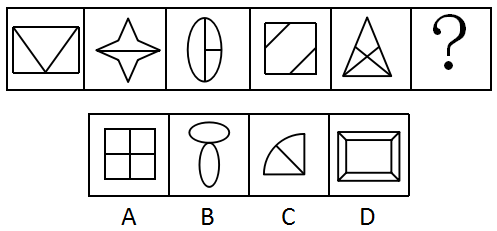
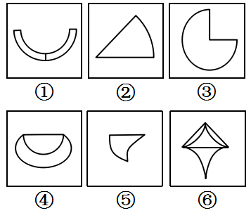
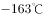

# 2019年新疆生产建设兵团面向社会招录公务员考试《行测》题（网友回忆版）

> 判断推理 · 34 题 · 新疆 2019

## 第 1 题　qid 2434274 · 图形推理

从所给的四个选项中，选择最恰当的一个填入问号处，使之呈现一定的规律性（    ）。

- **A**. A
- **B**. B　✅
- **C**. C
- **D**. D

**答案**：B

**官方解析**

图形元素组成不同，且无明显属性规律，优先考虑数量规律。观察发现第二个图形为“日”字的变形图，第四个图形为“圆相交”图，第一个和第三个图形为明显的一笔画图形，考虑图形的笔画数。题干图形均为一笔画图形，A项为两笔画图形，B项为一笔画图形，C项为两笔画图形，D项为三笔画图形。
故正确答案为B。

---

## 第 2 题　qid 2434278 · 图形推理

从所给的四个选项中，选择最恰当的一个填入问号处，使之呈现一定的规律性（    ）。

- **A**. A
- **B**. B
- **C**. C
- **D**. D　✅

**答案**：D

**官方解析**

元素组成不同，优先考虑属性规律。观察发现，题干图形均为轴对称图形，并且对称轴的数量依次为1、2、1、2、1，则问号处对称轴的数量应为2。A项对称轴数量为4；B项对称轴数量为1；C项对称轴数量为1；D项对称轴数量为2。
故正确答案为D。

---

## 第 3 题　qid 2434282 · 图形推理

从所给的四个选项中，选择最恰当的一个填入问号处，使之呈现一定的规律性（    ）。

- **A**. A　✅
- **B**. B
- **C**. C
- **D**. D

**答案**：A

**官方解析**

元素组成不同，题干图形中出现黑白块，且黑块数量不同，优先考虑黑白运算。观察发现，题干图形黑白运算的公式为：，，，。九宫格每一横行中，图一与图二进行黑白运算后，逆时针旋转90度得到图三。只有A项符合。

故正确答案为A。

---

## 第 4 题　qid 2434290 · 图形推理

把下面的六个图形分为两类，使每类都有各自的共同特征或规律，分类正确的一项是（    ）。

- **A**. ①②③，④⑤⑥　✅
- **B**. ①③④，②⑤⑥
- **C**. ①②④，③⑤⑥
- **D**. ①④⑥，②③⑤

**答案**：A

**官方解析**

本题为分组分类题目。元素组成不同，无明显属性规律，考虑数量规律。观察发现，题干每个图形均有曲有直，分别数出直线数和曲线数发现，直线数依次为3、2、2、1、1、3，曲线数依次为2、1、1、2、2、4，分开看均无法分为两组，考虑二者做运算。图①②③为一组，，图④⑤⑥为一组，，只有A项符合。

故正确答案为A。

---

## 第 5 题　qid 2434292 · 定义判断

生物资产是指有生命的动物和植物。而消耗性生物资产是指为了出售而已经持有的或将来收获为农产品的生物资产。
根据上述定义，下列属于消耗性生物资产的是（    ）。

- **A**. 防风固沙林
- **B**. 大棚里的蔬菜　✅
- **C**. 客厅鱼缸里的金鱼
- **D**. 超市里的牛肉

**答案**：B

**官方解析**

第一步：找出定义关键词。
生物资产：“有生命的动物和植物”；
消耗性生物资产：“为了出售”、“已经持有的或将来收获为农产品的生物资产”。
第二步：逐一分析选项。
A项：防风固沙林是为了防风和固沙，不符合“为了出售”，不符合定义，排除；
B项：大棚里的蔬菜，是有生命的植物，属于生物资产，同时也符合“为了出售而已经持有的或将来收获为农产品”，符合定义，当选；
C项：客厅鱼缸里的金鱼主要是为了观赏，不符合“为了出售”，不符合定义，排除；
D项：超市里的牛肉已经不具有生命，不符合“有生命的动物和植物”，不属于生物资产，也不属于消耗性生物资产，不符合定义，排除。
故正确答案为B。

---

## 第 6 题　qid 2434295 · 定义判断

能力动机是指争取在某些方面有所专长，使得个体能完成高质量工作的驱动力。具有能力动机的员工以发展和运用他们解决问题的能力为荣耀，在工作中面临困难时努力创新。
根据上述定义，下列员工的行为出于能力动机的是（    ）。

- **A**. 甲家庭困难，每个月都超额完成销售任务，获得较多销售提成
- **B**. 乙得到同事称赞后，工作很积极，每天都提前到办公室打水扫地
- **C**. 丙不服输，通过长期攻关解决了车间操作中的技术难题　✅
- **D**. 丁业务能力很强，但因待遇问题工作积极性不高，时常抱怨

**答案**：C

**官方解析**

第一步：找出定义关键词。
“在某些方面有所专长”、“使个体能完成高质量的工作的驱动力”。
第二步：逐一分析选项。
A项：甲超额完成任务的驱动力是家庭困难，并不是“在某些方面有所专长”，不符合定义，排除；
B项：乙工作积极，每天都提前到办公室打水扫地的驱动力是同事们的称赞，并不是“在某些方面有所专长”，不符合定义，排除；
C项：丙通过长期攻关解决了技术难题，符合“在某些方面有所专长”、“使个体能完成高质量的工作的驱动力”，符合定义，当选；
D项：丁业务能力很强，符合“在某些方面有所专长”，但工作积极性不好，时常抱怨，不符合“使个体能完成高质量的工作的驱动力”，不符合定义，排除。
故正确答案为C。

---

## 第 7 题　qid 2434299 · 定义判断

“一面提示”是传播学中的一类概念，指的是对某些存在对立因素的问题进行说服或宣传时，仅向说服的对象提示自己一方的观点或于己有利的判断材料，这种传播方式的优势在于能够对己方观点做集中阐述，论旨明快，简洁易懂，但同时可能会给人一种“咄咄逼人”的印象，使说服对象产生心理抵抗。根据上述定义，下列反映了“一面提示”现象的是（    ）。

- **A**. 小李将不同理财产品的风险和收益都告诉了王先生，并根据其财务情况推荐了几款合适的套餐
- **B**. 小王的导师觉得小王适合学术研究，建议其硕士毕业后继续读博，但若小王想先工作，也会尊重他的选择
- **C**. 小乔第一次登台演讲，为鼓励自己，他不断地告诉自己上台演讲并不难，自己准备得已经很好了，不用担心
- **D**. 小林在推销公司的外语课程时，列举了课程设置与师资配备的巨大优势，并将此与其他公司进行比较　✅

**答案**：D

**官方解析**

第一步：找出定义关键词。
“对某些存在对立因素的问题进行说服或宣传”、“仅向说服的对象提示自己一方的观点或于己有利的判断材料”、“能够对己方观点做集中阐述”、“可能会给人一种‘咄咄逼人’的印象，使说服对象产生心理抵抗”。
第二步：逐一分析选项。
A项：小李不仅将不同理财产品的收益告诉了王先生，也将风险告诉了王先生，不符合“仅向说服的对象提示自己一方的观点或于己有利的判断材料”，不符合定义，排除；
B项：小王的导师是觉得小王适合学术研究才建议其继续读博的，而且小王若想先工作，也会尊重其选择，不符合“仅向说服的对象提示自己一方的观点或于己有利的判断材料”，也不符合“可能会给人一种‘咄咄逼人’的印象，使说服对象产生心理抵抗”，不符合定义，排除；
C项：小乔自己鼓励自己，让自己不要担心演讲，不符合“对某些存在对立因素的问题进行说服或宣传”，不符合定义，排除；
D项：小林做推销时列举了自己公司的课程设置与师资配备的巨大优势，并在这方面与其他公司进行比较，证明小林只提到了自己公司的优势，符合“仅向说服的对象提示自己一方的观点或于己有利的判断材料”，符合定义，当选。
故正确答案为D。

---

## 第 8 题　qid 2434302 · 定义判断

二次售卖理论指的是媒介单位先将媒介产品卖给终端消费者（读者、听众、观众），然后，再将消费者的时间（或注意力）卖给广告商或广告主的过程。简言之，第一次售卖，媒介向受众提供信息，满足受众对信息的需求，消除受信者的随机不确定性，这里售卖的是信息，信息是商品。第二次售卖，将受众的注意力售卖给广告商，受众的注意力是商品。
根据上述定义，下列哪项没有反映二次售卖理论？（    ）

- **A**. 某儿童乐园不仅在全球开设游乐场，经营游乐项目，还售卖自己品牌下的各类衍生品　✅
- **B**. 电视购物播出，企业收到客户订单后会分析客户喜好，并间隔一段时间打电话回访，为客户推介同类产品
- **C**. 某报社先将报纸卖给读者，发行量增大后，再将针对读者的数据分析信息卖给广告商，广告商进行广告的特定投放
- **D**. 某电影上映后票房极佳，在了解观众群体后，其续集上映时植入了针对性的广告，使广告品牌获得了观众的关注

**答案**：A

**官方解析**

第一步：找出定义关键词。
“媒介单位”、“先将产品（信息）卖给终端消费者（读者、听众、观众）”、“再将消费者的时间（或注意力）卖给广告商或广告主”。
第二步：逐一分析选项。
A项：儿童乐园售卖的是游乐项目以及自己品牌的各类衍生品，并没有售卖“受众的注意力”，不符合“再将消费者的时间（或注意力）卖给广告商或广告主”，不符合定义，当选；
B项：电视购物播出，客户下订单，符合“先将产品(信息)卖给终端消费者（读者、听众、观众）”，收到订单后分析客户喜好，并为客户推介同类产品，即将客户的注意力再次卖给做同类产品的广告商，符合“再将消费者的时间（或注意力）卖给广告商或广告主”，符合定义，排除；
C项：报社先将报纸卖给读者，符合“先将产品（信息）卖给终端消费者（读者、听众、观众）”，再将针对读者的数据分析信息卖给广告商，符合“再将消费者的时间（或注意力）卖给广告商或广告主”，符合定义，排除；
D项：电影上映后票房极佳，说明观众看了电影，符合“先将产品（信息）卖给终端消费者（读者、听众、观众）”，了解观众群体后，在其续集上映时植入了针对性的广告，符合“再将消费者的时间（或注意力）卖给广告商或广告主”，符合定义，排除。
本题为选非题，故正确答案为A。

---

## 第 9 题　qid 2434303 · 定义判断

植物的器官可分为营养器官及生殖器官。营养器官通常指植物的根、茎、叶等器官，而生殖器官则为花、果实、种子等。植物的营养生殖是指由植物的营养器官产生出新个体的生殖方式。
根据上述定义，下列不属于营养生殖的是（    ）。

- **A**. 扦插红薯藤种植红薯
- **B**. 在海棠树上嫁接苹果枝
- **C**. 将落花生带壳种到地里　✅
- **D**. 将木兰树的枝条压到土里生根

**答案**：C

**官方解析**

第一步：找出定义关键词。
营养器官：“植物的根、茎、叶等器官”；
生殖器官：“花、果实、种子等”；
植物的营养生殖：“由植物的营养器官产生出新个体的生殖方式”。
第二步：逐一分析选项。
A项：红薯藤是红薯的茎，是植物的营养器官，扦插红薯藤种植红薯，符合“由植物的营养器官产生出新个体”，符合定义，排除；
B项：苹果枝是苹果树的茎，是植物的营养器官，在海棠树上嫁接苹果枝，符合“由植物的营养器官产生出新个体”，符合定义，排除；
C项：带壳的落花生是花生的果实，是植物的生殖器官，并不是植物的营养器官，不符合“由植物的营养器官产生出新个体”，不符合定义，当选；
D项：木兰树的枝条是茎，是植物的营养器官，将木兰树的枝条压到土里生根，符合“由植物的营养器官产生出新个体”，符合定义，排除。
本题为选非题，故正确答案为C。

---

## 第 10 题　qid 2434204 · 定义判断

抗原伪装是指寄生虫体表结合有宿主的抗原，或者被宿主的抗原包被，故而妨碍了宿主免疫系统对其的识别，其中宿主指的是为寄生生物包括寄生虫、病毒等提供生存环境的生物，抗原指的是能引起抗体生成、可诱发免疫反应的物质。
根据上述定义，下列反映了抗原伪装的是（    ）。

- **A**. 感染枯氏锥虫的小鼠血清中会产生抑制抗体反应的物质，因此小鼠很少出现免疫反应
- **B**. 血吸虫卵中的毛蚴分泌可溶性虫卵抗原，被人体免疫细胞吞噬后，形成虫卵肉芽肿
- **C**. A型流感病毒的表面抗原进入人体后会不断变异，从而有效躲避了免疫系统的识别
- **D**. 曼氏血吸虫肺期童虫表面结合了人体的血型抗原和主要组织相容性复合物抗原，因此这种童虫很难被发现　✅

**答案**：D

**官方解析**

第一步：找出定义关键词。
抗原伪装：“寄生虫体表结合有宿主的抗原，或者被宿主的抗原包被”、“妨碍了宿主免疫系统对其的识别”；
宿主：“为寄生生物包括寄生虫、病毒等提供生存环境的生物”；
抗原：“能引起抗体生成、可诱发免疫反应的物质”。
第二步：逐一分析选项。
A项：感染枯氏锥虫的小鼠血清中产生抑制抗体反应的物质，不符合“寄生虫体表结合有宿主的抗原，或者被宿主的抗原包被”，不符合定义，排除； 
B项：血吸虫卵中的毛蚴分泌抗原，被人体免疫细胞吞噬，不符合“寄生虫体表结合有宿主的抗原，或者被宿主的抗原包被”，不符合定义，排除；
C项：A型流感病毒的表面抗原进入人体不断变异，不符合“寄生虫体表结合有宿主的抗原，或者被宿主的抗原包被”，不符合定义，排除；
D项：曼氏血吸虫肺期童虫表面结合人体抗原，符合“寄生虫体表结合有宿主的抗原，或者被宿主的抗原包被”，童虫很难被发现，符合“妨碍了宿主免疫系统对其的识别”，符合定义，当选。
故正确答案为D。

---

## 第 11 题　qid 2434206 · 定义判断

虚假陈述是证券发行市场、交易市场（包括购并市场）及相关领域的有关主体或行为人所披露的与证券发行、交易及相关活动有关的信息存在重大性的虚假、误导、遗漏或不适当披露，致使投资者在不了解事实真相的情况下参与证券投资或交易活动。
根据上述定义，下列没有反映虚假陈述的是（    ）。

- **A**. 上市公司甲通过承诺“可全额退款”的营销方式，以“打新股”“理财”等不实名义进行营销，吸纳散户入股
- **B**. 上市公司乙在公司证券首次公开发行时，使用伪造的财务报表对外公开公司财务状况和经营情况
- **C**. 上市公司丙在上市公告书中将公司资产价值虚增1000万元，使公司股价在短短一年内涨幅高达13倍
- **D**. 上市公司丁在股票上市前，公司经营业绩出现较大幅度下滑，在和证监会书面说明后，暂缓上市　✅

**答案**：D

**官方解析**

第一步：找出定义关键词。
“证券发行市场、交易市场（包括购并市场）及相关领域的有关主体或行为人”、“所披露的与证券发行、交易及相关活动有关的信息存在重大性的虚假、误导、遗漏或不适当披露”、“致使投资者在不了解事实真相的情况下参与证券投资或交易活动”。
第二步：逐一分析选项。
A项：上市公司甲以“打新股”“理财”等不实名义进行营销，符合“所披露的与证券发行、交易及相关活动有关的信息存在重大性的虚假、误导、遗漏或不适当披露”，吸纳散户入股，符合“致使投资者在不了解事实真相的情况下参与证券投资或交易活动”，符合定义，排除； 
B项：上市公司乙使用伪造的财务报表对外公开公司财务状况和经营情况，符合“所披露的与证券发行、交易及相关活动有关的信息存在重大性的虚假、误导、遗漏或不适当披露”，符合定义，排除；
C项：上市公司丙在上市公告书中将公司资产价值虚增1000 万元，符合“所披露的与证券发行、交易及相关活动有关的信息存在重大性的虚假、误导、遗漏或不适当披露”，符合定义，排除；
D项：上市公司丁在股票上市前，经营业绩出现较大幅度下滑，在和证监会书面说明后，暂缓上市，公司并没有上市，发行证券，不存在“证券发行市场、交易市场（包括购并市场）及相关领域的有关主体或行为人”，不符合定义，当选。
故正确答案为D。

---

## 第 12 题　qid 2434208 · 定义判断

社群经济是指互联网时代，一群有共同兴趣、认知、价值观的用户抱成团，发生群蜂效应，在一起互动、交流、协作、感染，对产品品牌本身产生反哺的价值关系，这是一种建立在产品与粉丝群体之间的情感信任和价值反哺，共同作用形成的自运转、自循环的范围经济系统。
根据上述定义，下列不属于社群经济的是（    ）。

- **A**. 某艺术团定期举办粉丝节，吸引大批粉丝到场参加活动
- **B**. 某品牌手机拥有大批忠实消费者，他们把自己定义为热爱生活的“极客”
- **C**. 王某认为某品牌洗发水能有效治疗脱发，于是将其推荐给亲戚朋友　✅
- **D**. 张某开办线上绘画课程，并建立绘画群邀请会员加入交流绘画技巧

**答案**：C

**官方解析**

第一步：找出定义关键词。
“互联网时代”、“一群有共同兴趣、认知、价值观的用户”、“抱成团，发生群蜂效应，在一起互动、交流、协作、感染，对产品品牌本身产生反哺”。
第二步：逐一分析选项。
A项：某艺术团定期举办粉丝节，吸引大批粉丝到场参加活动，符合“一群有共同兴趣、认知、价值观的用户”、也符合“抱成团，发生群蜂效应，在一起互动、交流、协作、感染，对产品品牌本身产生反哺”，符合定义，排除； 
B项：某品牌手机拥有大批忠实消费者，把自己定义为热爱生活的“极客”，符合“一群有共同兴趣、认知、价值观的用户”、也符合“抱成团，发生群蜂效应，在一起互动、交流、协作、感染，对产品品牌本身产生反哺”，符合定义，排除；
C项：王某认为某品牌洗发水有效，只有王某一人，不符合“一群有共同兴趣、认知、价值观的用户”，不符合定义，当选；
D项：张某开办线上绘画课程，并建立绘画群邀请会员加入交流绘画技巧，符合“一群有共同兴趣、认知、价值观的用户”、也符合“抱成团，发生群蜂效应，在一起互动、交流、协作、感染，对产品品牌本身产生反哺”，符合定义，排除。
故正确答案为C。

---

## 第 13 题　qid 2434209 · 定义判断

非公允关联交易是指公司的关联方利用对公司的控制与影响，通过关联交易将公司的利益转移至关联方自己手中或将关联方的利益灌输至公司之中的交易行为，该行为违背了市场公平交易和诚实信用原则。
根据上述定义，下列没有反映非公允关联交易的是（    ）。

- **A**. 上市公司甲利用融资套现，募集资金后又通过内部交易将资金转移至有项目合作的乙公司
- **B**. 某上市公司控股股东通过向公司高价出售原材料等方式将公司资产转移至自己亲属开办的公司
- **C**. 甲、乙是联营企业，甲从事设备维修服务，乙的所有设备均由甲负责维修，乙每年支付设备维修费20万元　✅
- **D**. 甲、乙企业同属一个集团，甲是高税率企业，其通过交易将自身利润转移至低税率企业乙，确保集团整体税赋最低

**答案**：C

**官方解析**

第一步：找出定义关键词。
“公司的关联方利用对公司的控制与影响，通过关联交易将公司的利益转移至关联方自己手中或将关联方的利益灌输至公司之中的交易行为”、“该行为违背了市场公平交易和诚实信用原则”。
第二步：逐一分析选项。
A项：上市公司甲利用融资套现，募集资金后又通过内部交易将资金转移至有项目合作的乙公司，符合“公司的关联方利用对公司的控制与影响，通过关联交易将公司的利益转移至关联方自己手中或将关联方的利益灌输至公司之中的交易行为”，符合定义，排除； 
B项：某上市公司控股股东通过向公司高价出售原材料，将公司资产转移至自己亲属开办的公司，符合“公司的关联方利用对公司的控制与影响，通过关联交易将公司的利益转移至关联方自己手中或将关联方的利益灌输至公司之中的交易行为”，符合定义，排除；
C项：甲、乙是联营企业，甲维修乙的所有设备，乙每年支付设备维修费20万元，属于合理的公平交易，不符合“公司的关联方利用对公司的控制与影响，通过关联交易将公司的利益转移至关联方自己手中或将关联方的利益灌输至公司之中的交易行为”，也不符合“该行为违背了市场公平交易和诚实信用原则”，不符合定义，当选；
D项：甲、乙企业同属一个集团，甲通过交易将自身利润转移至低税率企业乙，符合“公司的关联方利用对公司的控制与影响，通过关联交易将公司的利益转移至关联方自己手中或将关联方的利益灌输至公司之中的交易行为”，也符合“该行为违背了市场公平交易和诚实信用原则”，符合定义，排除。
故正确答案为C。

---

## 第 14 题　qid 2434212 · 定义判断

物质通过进出细胞膜来实现物质交换的方式称为物质跨膜运输，其包括主动运输和被动运输。主动运输是物质在载体的协助下逆着膜两侧的浓度梯度扩散；被动运输是顺着膜两侧浓度梯度扩散，包括自由扩散和协助扩散两类，前者是指物质根据细胞膜两侧的浓度差以及扩散物质的性质、通过简单的扩散作用进入细胞，后者指物质借助载体来实现扩散。
根据上述定义，下列说法错误的是（    ）。

- **A**. 当体内红细胞血氧饱和度较低时，吸氧后，氧气会进入红细胞，这属于自由扩散
- **B**. 细胞内钾离子浓度低，在载体蛋白协助下，钾离子被转运出细胞外，这是主动运输
- **C**. 吃完饭后，人体血液中的葡萄糖显著升高，该葡萄糖通过运输蛋白进入小肠上皮细胞，这是主动运输　✅
- **D**. 氨基酸借助细胞膜上的膜蛋白，从高浓度一侧扩散进入低浓度的细胞内，这属于协助扩散

**答案**：C

**官方解析**

第一步：找出定义关键词。
主动运输：“物质在载体的协助下”、“逆着膜两侧的浓度梯度扩散”；
被动运输：“顺着膜两侧浓度梯度扩散”；
自由扩散：“物质根据细胞膜两侧的浓度差以及扩散物质的性质、通过简单的扩散作用进入细胞”；
协助扩散：“物质借助载体来实现扩散”。
第二步：逐一分析选项。
A项：氧气会进入血氧饱和度较低的红细胞，氧气由高浓度扩散到低浓度，符合“顺着膜两侧浓度梯度扩散”，且不需要载体，符合自由扩散定义，排除；
B项：钾离子由浓度低的细胞内被转运出细胞外，钾离子由低浓度扩散到高浓度，符合“逆着膜两侧的浓度梯度扩散”，且在载体蛋白协助下，符合“物质在载体的协助下”，符合主动运输定义，排除；
C项：吃饭后，葡萄糖浓度显著升高后进入小肠，是从高浓度到低浓度的运输，符合“顺着膜两侧浓度梯度扩散”，葡萄糖需要通过运输蛋白进入小肠上皮细胞，符合“物质借助载体来实现扩散”，符合被动运输的协助扩散定义，不是主动运输，当选；
D项：氨基酸从高浓度一侧扩散进入低浓度的细胞内，符合“顺着膜两侧浓度梯度扩散”，借助细胞膜上的膜蛋白符合“物质借助载体来实现扩散”，符合协助扩散，排除。
本题为选非题，故正确答案为C。

---

## 第 15 题　qid 2434213 · 类比推理

发酵：美酒

- **A**. 生锈：潮湿
- **B**. 山青：水秀
- **C**. 欠债：贫穷
- **D**. 提炼：汽油　✅

**答案**：D

**官方解析**

第一步：判断题干词语间逻辑关系。
通过发酵得到美酒，二者是工艺和成品的对应关系。
第二步：判断选项词语间逻辑关系。
A项：因为潮湿，所以生锈，二者是因果关系，与题干逻辑关系不一致，排除；
B项：山青和水秀是并列关系，与题干逻辑关系不一致，排除；
C项：因为欠债，所以贫穷，二者是因果关系，与题干逻辑关系不一致，排除；
D项：通过提炼得到汽油，二者是工艺和成品的对应关系，与题干逻辑关系一致，当选。
故正确答案为D。

---

## 第 16 题　qid 2434214 · 类比推理

实体经济：虚拟经济

- **A**. 电子货币：金属货币
- **B**. 知识产权：工业产权
- **C**. 企业管理：行政管理
- **D**. 自然资源：社会资源　✅

**答案**：D

**官方解析**

第一步：判断题干词语间逻辑关系。
虚拟经济是相对于实体经济而言的，二者是并列关系中的矛盾关系。
第二步：判断选项词语间逻辑关系。
A项：除电子货币、金属货币外，还有纸币等货币形式，二者是并列关系中的反对关系，与题干逻辑关系不一致，排除；
B项：知识产权包括工业产权和著作权，二者是包容关系中的种属关系，与题干逻辑关系不一致，排除；
C项：除企业管理、行政管理外，还有社会管理、情报管理等类别，二者是并列关系中的反对关系，与题干逻辑关系不一致，排除；
D项：资源分为自然资源和社会资源两大类，二者是并列关系中的矛盾关系，与题干逻辑关系一致，当选。
故正确答案为D。

---

## 第 17 题　qid 2434215 · 类比推理

危在旦夕：间不容发

- **A**. 江河日下：一日千里
- **B**. 冷嘲热讽：指桑骂槐
- **C**. 孤注一掷：铤而走险　✅
- **D**. 行云流水：妙笔生花

**答案**：C

**官方解析**

第一步：判断题干词语间逻辑关系。
危在旦夕指危险就在眼前，间不容发形容与灾难相距极近，情势极其危急，二者是近义关系。
第二步：判断选项词语间逻辑关系。
A项：江河日下比喻情况一天天地坏下去，一日千里比喻事物的进展快与科学技术的发展快，二者不是近义关系，与题干逻辑关系不一致，排除；
B项：冷嘲热讽是指用尖酸刻薄的语言进行讥笑及讽刺，指桑骂槐比喻明指此而暗骂彼，二者不是近义关系，与题干逻辑关系不一致，排除；
C项：孤注一掷比喻在危急时用尽所有力量作最后一次冒险，铤而走险是指无路可走时采取冒险行为，二者是近义关系，与题干逻辑关系一致，当选；
D项：行云流水形容文章自然不受约束，就像漂浮着的云和流动着的水一样，妙笔生花比喻笔法高超的人写出动人的文章，二者不是近义关系，与题干逻辑关系不一致，排除。
故正确答案为C。

---

## 第 18 题　qid 2434217 · 类比推理

镰刀：稻田

- **A**. 试管：医院
- **B**. 钢笔：办公大楼
- **C**. 导弹：军队
- **D**. 塔吊：建筑工地　✅

**答案**：D

**官方解析**

第一步：判断题干词语间逻辑关系。
镰刀是稻田里常见的一种收割工具，二者是常见工具和地点的对应关系。
第二步：判断选项词语间逻辑关系。
A项：试管是化学实验室常用的仪器，而非医院里常见的工具，与题干逻辑关系不一致，排除；
B项：在办公大楼里书写时不一定使用钢笔，也可能是签字笔等，二者不是常见工具和地点的对应关系，与题干逻辑关系不一致，排除；
C项：导弹是军队可能使用的一种武器，二者不是常见工具和地点的对应关系，与题干逻辑关系不一致，排除；
D项：塔吊是建筑工地上常用的一种起重设备，二者是常见工具和地点的对应关系，与题干逻辑关系一致，当选。
故正确答案为D。

---

## 第 19 题　qid 2434218 · 类比推理

常见病：糖尿病：慢性病

- **A**. 飞行器：火箭：滑翔机
- **B**. 地球：金星：银河系
- **C**. 科幻片：影视作品：历史剧
- **D**. 氧化物：二氧化硫：污染物　✅

**答案**：D

**官方解析**

第一步：判断题干词语间逻辑关系。
糖尿病是一种常见病，也是一种慢性病，第二个词和一、三两词均为包容关系中的种属关系。
第二步：判断选项词语间逻辑关系。
A项：火箭和滑翔机均为飞行器，但与题干词语的顺序不同，与题干逻辑关系不一致，排除；
B项：地球和金星均为银河系的组成部分，三者是包容关系中的组成关系，与题干逻辑关系不一致，排除；
C项：科幻片和历史剧均为影视作品，但与题干词语的顺序不同，与题干逻辑关系不一致，排除；
D项：二氧化硫是一种氧化物，也是一种污染物，第二个词和一、三两词均为包容关系中的种属关系，与题干逻辑关系一致，当选。
故正确答案为D。

---

## 第 20 题　qid 2434220 · 类比推理

芦荟：耐旱：胡杨树

- **A**. 钝化液：防锈：机油泵
- **B**. 抗生素：消炎：感冒药
- **C**. 保温壶：保暖：羽绒服　✅
- **D**. 北极光：放电：流星雨

**答案**：C

**官方解析**

第一步：判断题干词语间逻辑关系。
芦荟和胡杨树均是耐旱的植物，具有耐旱的属性，二者是并列关系，且与第二词都构成对应关系。
第二步：判断选项词语间逻辑关系。
A项：钝化液有防锈的功能，但机油泵是将机油提高到一定压力后，强制地压送到发动机各零件的运动表面上，与防锈无关，与题干逻辑关系不一致，排除；
B项：抗生素和感冒药是交叉关系，并非并列关系，与题干逻辑关系不一致，排除；
C项：保温壶和羽绒服为并列关系，且均有保暖的属性，与题干逻辑关系一致，当选；
D项：北极光的本质是放电过程，但流星雨是流星体与地球大气层相摩擦的结果，与题干逻辑关系不一致，排除。
故正确答案为C。

---

## 第 21 题　qid 2434222 · 类比推理

皮肤：器官：调节体温

- **A**. 税票：凭证：分配收入
- **B**. 酒店：场所：接待宾客　✅
- **C**. 引擎：汽车：提供动力
- **D**. 手术：医院：治疗疾病

**答案**：B

**官方解析**

第一步：判断题干词语间逻辑关系。
皮肤是一种器官，二者为种属关系，皮肤可以调节体温，二者是功能对应关系。
第二步：判断选项词语间逻辑关系。
A项：税票是一种凭证，但税票的功能不是分配收入（税收的功能才是分配收入），与题干逻辑关系不一致，排除；
B项：酒店是一种场所，二者是种属关系，酒店可以用来接待宾客，二者是功能对应关系，与题干逻辑关系一致，当选；
C项：引擎是汽车的组成部分，二者是组成关系，与题干逻辑关系不一致，排除；
D项：在医院做手术，二者是场所对应关系，与题干逻辑关系不一致，排除。
故正确答案为B。

---

## 第 22 题　qid 2434223 · 类比推理

龋齿：口腔：疾病

- **A**. 视觉：眼睛：感觉　✅
- **B**. 子弹：手枪：武器
- **C**. 温室效应：大气层：地球
- **D**. 光合作用：叶绿体：植物

**答案**：A

**官方解析**

第一步：判断题干词语间逻辑关系。
龋齿发生在口腔内，二者是对应关系，龋齿是一种疾病，二者是种属关系。
第二步：判断选项词语间逻辑关系。
A项：视觉发生在眼睛内，二者是对应关系，视觉是一种感觉，二者是种属关系，与题干逻辑关系一致，当选；
B项：子弹和手枪是配套的对应关系，手枪是一种武器，与题干逻辑关系不一致，排除；
C项：温室效应发生在大气层内，二者是对应关系，但温室效应不是地球的一种，二者不是种属关系，与题干逻辑关系不一致，排除；
D项：光合作用发生在叶绿体内，二者是对应关系，但光合作用不是植物的一种，二者不是种属关系，与题干逻辑关系不一致，排除。
故正确答案为A。

---

## 第 23 题　qid 2434224 · 类比推理

生产要素：土地：资本

- **A**. 自然现象：彩虹：沙漠
- **B**. 社会福利：社保：工资　✅
- **C**. 油料作物：花生：水稻
- **D**. 市场调查：产品：客户

**答案**：B

**官方解析**

第一步：判断题干词语间逻辑关系。
土地和资本都是生产要素的一种，是种属关系，土地和资本是并列关系。
第二步：判断选项词语间逻辑关系。
A项：彩虹是自然现象，沙漠是地貌，不是自然现象，与题干逻辑关系不一致，排除；
B项：社保是一种社会福利，二者是种属关系，工资里包含的一些补贴是国家政策下的补贴，也算是一种社会福利，二者是种属关系，并且社保与工资都属于工作中享受的待遇，并列关系，和题干逻辑关系一致，保留；
C项：花生是一种油料作物，二者是种属关系，但水稻是粮食作物，并非油料作物，与题干逻辑关系不一致，排除；
D项：产品和客户均为市场调查的对象，三者是对应关系，与题干逻辑关系不一致，排除。
故正确答案为B。

---

## 第 24 题　qid 2434227 · 类比推理

ABO血型 对于（    ）相当于（    ）对于 原子核

- **A**. 输血  中子
- **B**. 抗原  物质
- **C**. 化验  实验
- **D**. 红细胞  同位素　✅

**答案**：D

**官方解析**

逐一代入选项。
A项：输血前需要确认ABO血型，二者是对应关系，中子是原子核的组成部分，二者是组成关系，前后逻辑关系不一致，排除；
B项：ABO血型是根据红细胞表面有无特异性抗原（凝集原）A和B来划分的血液类型，二者是对应关系；原子核是物质的组成部分（物质由原子组成，原子核为原子的核心部分），二者是组成关系，前后逻辑关系不一致，排除；
C项：通过化验可以确认ABO血型，利用原子核可以进行实验，前后逻辑关系不一致，排除；
D项：通过化验红细胞可以确认ABO血型，通过分析原子核可以确认是否为同位素，同位素是原子核内具有相同质子数，不同中子数的原子。二者均为对应关系，前后逻辑关系一致，当选。
故正确答案为D。

---

## 第 25 题　qid 2434229 · 逻辑判断

日常生活中，很多人认为在使用完天然气时应首先关闭燃气，然后再关火。但一些专家指出，燃气灶虽然可以通过按钮调节火焰大小，但燃气管道上面的阀门是控制天然气的，如果没有关火就先关闭阀门，火苗就会钻进管道里面，容易引发安全事故。因此，正确使用天然气的方法应该先关火再关气。
以下哪项如果为真，最能支持专家的结论？（    ）

- **A**. 先关火后关气，燃气管道里有残余天然气，会造成浪费，还会挥发到空气中
- **B**. 只要燃气灶按钮的密封性没有损坏，其关闭后就不会出现燃气泄漏的危险　✅
- **C**. 减少天然气使用安全事故的发生，最好的办法就是尽量减少使用天然气
- **D**. 实践证明，使用天然气的安全事故主要是由通风不当造成的一氧化碳中毒

**答案**：B

**官方解析**

第一步：找出论点和论据。
论点：正确使用天然气的方法应该先关火再关气。
论据：燃气灶虽然可以通过按钮调节火焰大小，但燃气管道上面的阀门是控制天然气的，如果没有关火就先关闭阀门，火苗就会钻进管道里面，容易引发安全事故。
论点和论据话题一致，优先考虑补充论据的方式加强。
第二步：逐一分析选项。
A项：说明先关火再关气会造成浪费和空气污染，说明先关火再关气是不合适的，否定论点，无法加强，排除；
B项：说明只要燃气灶按钮的密封性没有损坏，关闭后就不会出现燃气泄漏的危险，即不用担心天然气的泄露问题，可以先关火后关气，补充论据，可以加强，当选；
C项：说明减少事故发生的最好办法是减少使用天然气，与论点讨论的正确使用天然气的方法无关，话题不一致，无法加强，排除； 
D项：说明造成天然气安全事故的原因主要是通风不当，与论点讨论的正确使用天然气的方法无关，话题不一致，无法加强，排除。
故正确答案为B。

---

## 第 26 题　qid 2434230 · 逻辑判断

埃博拉病毒仅存在于长臂猿的体内，这种病毒对长臂猿无害但对人类却是无药可医。虽然长臂猿不会咬人，但是埃博拉病毒可以通过蚊子传播，蚊子咬了长臂猿再去叮咬人类，人类就会被传染。因此，如果蚊子灭绝，人类就不会感染埃博拉病毒。
以下哪项如果为真，最能质疑上述结论？（    ）

- **A**. 叮咬长臂猿的蚊子和叮咬人类的蚊子不是同一品种
- **B**. 蚊子是繁殖能力和适应能力都非常强的动物，很难被灭绝
- **C**. 长臂猿只生活在赤道附近的热带雨林中，只有极少数的人能接触到
- **D**. 一些人会将长臂猿的皮毛加工成皮毛制品，这些加工后的皮毛制品也能传播该病毒　✅

**答案**：D

**官方解析**

第一步：找出论点和论据。
论点：如果蚊子灭绝，人类就不会感染埃博拉病毒。
论据：虽然长臂猿不会咬人，但是埃博拉病毒可以通过蚊子传播，蚊子咬了长臂猿再去叮咬人类，人类就会被传染。
论点和论据话题一致，优先考虑否定论点的方式削弱。
第二步：逐一分析选项。
A项：说明叮咬长臂猿的蚊子和叮咬人类的蚊子不是同一品种，也就是蚊子咬了长臂猿以后不会再去叮咬人类，削弱论据，保留；
B项：说明蚊子很难灭绝，但是论点讨论的是蚊子灭绝以后人类还会不会感染埃博拉病毒，话题不一致，无法削弱，排除；
C项：说明长臂猿只生活在热带雨林中，极少数的人能接触到，与论点讨论的蚊子灭绝后人类是否还会感染埃博拉病毒无关，话题不一致，无法削弱，排除；
D项：说明长臂猿的皮毛制品也能传染埃博拉病毒，即就算蚊子灭绝，人类还是有被传染埃博拉的可能性，否定论点，保留。
比较A、D两项，否论点的力度强于否定论据，故排除A项。
故正确答案为D。

---

## 第 27 题　qid 2434234 · 逻辑判断

距今3.5亿年前，地球进入了泥盆纪中晚期，古生物学家发现了许多那一时期的植物体化石，由于绝大多数化石只保存了植物体的一部分。因此，他们通常利用植物茎的直径来确定植物体高度。测定的结果表明：有大量的乔本植物其高度至少达到5米，因此他们推测当时可能出现了森林。
要得到上述结论，需要补充的重要前提是（    ）。

- **A**. 在一些特定的植物中，植物茎的直径与植物本身的高度存在相关性
- **B**. 只有高大乔木（高度超过4米）才具备构成森林的基本条件　✅
- **C**. 泥盆纪中晚期，大气中二氧化碳相对浓度的变化几乎呈直线下降
- **D**. 这些化石都是生长中的植物被原位保存下来的，能揭示出植物的分布特征

**答案**：B

**官方解析**

第一步：找出论点和论据。
论点：当时可能出现了森林。
论据：他们通常利用植物茎的直径来确定植物体高度。测定的结果表明：有大量的乔本植物其高度至少达到5米。
论据讨论的是乔木植物的高度，论点讨论的是森林，二者话题不一致，优先考虑搭桥的方式加强。
第二步：逐一分析选项。
A项：说明一些特定植物中植物茎的直径与植物高度存在关系，这些特定植物是不是乔木植物不确定，直径与高度的关系与森林也没有直接关联，不是论证成立的前提，排除；
B项：说明只有高度超过4米的乔木才能够成为森林，在论据和论点之间搭桥，是论证成立的前提，当选；
C项：说明大气中二氧化碳相对浓度的变化，与论点讨论的是否出现了森林无关，不是论证成立的前提，排除；
D项：说明这些化石能揭示出植物的分布特征，与论点讨论的是否出现了森林无关，不是论证成立的前提，排除。
故正确答案为B。

---

## 第 28 题　qid 2434237 · 逻辑判断

近年来，算法通常与大数据结合，通过打分、排序、评级的方式在用户、环境和推荐对象之间建立联系，进行自动化推荐。全球互联网平台纷纷开发智能推荐系统，大多数都是根据用户使用痕迹进行关联推荐。算法越智能，越能使用户被“安排”进所谓“信息茧房”，即陷入为其量身定制的信息之中。久而久之，用户处于信息“自我禁锢”困境，从而失去了解更大范围事物的机会。因此，有专家担忧地指出，算法应用容易导致人们视野日趋偏狭，思想日趋封闭、僵化甚至极化。
以下哪项如果为真，最能直接支持专家的观点？（    ）

- **A**. 电子商务中的商品推荐、社交网络中“你可能认识的好友”等都属于算法具体应用
- **B**. 算法的设计、数据使用等是开发者的主观选择，其主观偏见有可能被嵌入算法系统　✅
- **C**. 大数据背景下，算法技术门槛高，很多时候出现问题难以追责，造成伤害无从补偿
- **D**. 犯罪风险评估算法通过对居民个人数据资料分析，可以用来预测公民的“犯罪指数”

**答案**：B

**官方解析**

第一步：找出论点和论据。
论点：算法应用容易导致人们视野日趋偏狭，思想日趋封闭、僵化甚至极化。
论据：算法越智能，越能使用户被“安排”进所谓“信息茧房”，即陷入为其量身定制的信息之中。久而久之，用户处于信息“自我禁锢”困境，从而失去了解更大范围事物的机会。
论点和论据话题一致，优先考虑补充论据的方式加强。
第二步：逐一分析选项。
A项：选项说的是哪些属于算法具体应用，但没有涉及算法应用的危害，会不会让人们思想封闭，无法加强，排除；
B项：算法的设计等是开发者的主观选择，开发者的主观偏见可能被嵌入算法系统，在解释为什么算法应用容易导致人们思想封闭，补充论据加强，当选；
C项：说明算法技术出了问题难以追责，造成伤害无从补偿，与论点讨论的算法应用会让人们思想封闭无关，无法加强，排除；
D项：说明犯罪风险评估算法可以用来预测公民的“犯罪指数”，论点讨论的算法应用会让人们思想封闭无关，无法加强，排除。
故正确答案为B。

---

## 第 29 题　qid 2434239 · 逻辑判断

当我们在陌生的地方入睡时，往往会度过一个不安的夜晚，起床后也会感到昏沉乏力，这种现象被称为首夜效应。脑部扫描显示：在第一夜，受试者的一侧半脑会像平常一样安然入睡，但另一个半脑却保持较为活跃的状态，有时半球状态还会出现切换，因此研究人员认为：处在新环境时，我们的大脑会在第一个晚上开启监控模式，有一侧大脑半球保持警觉状态，因此人们常常感觉没有睡好。
以下哪项如果为真，最能削弱上述推论？（    ）

- **A**. 
在家中入睡时，人们的大脑也会出现一侧脑半球无活动、一侧脑半球较活跃的情况
　✅
- **B**. 
旅行时如果人们携带自己的枕头或者住宿环境与自己房间类似，就不会出现首夜现象

- **C**. 
深度睡眠时，人的大脑频率处于波，而外宿的首夜，波出现的时间并未明显减少

- **D**. 
两侧脑半球中左半脑更容易察觉声音，入睡后听到响动时，左半球就会出现脑电活动

**答案**：A

**官方解析**

第一步：找出论点和论据。
论点：处在新环境时，我们的大脑会在第一个晚上开启监控模式，有一侧大脑半球保持警觉状态，因此人们常常感觉没有睡好。
论据：脑部扫描显示：在第一夜，受试者的一侧半脑会像平常一样安然入睡，但另一个半脑却保持较为活跃的状态，有时半球状态还会出现切换。
论点和论据话题一致，优先考虑否定论点的方式削弱。
第二步：逐一分析选项。
A项：说明在家入睡时，人们的大脑也会出现一侧脑半球无活动、一侧脑半球较活跃的情况，即人们没有睡好不是因为处在新环境中大脑的这个变化，否定论点，当选；
B项：说明如果人们携带自己的枕头或者住宿环境与自己房间类似，就不会出现首夜现象，体现出的确因为处在新环境导致的睡不好，加强选项，无法削弱，排除；
C项：说明深度睡眠时和外宿的首夜，人的大脑频率波出现的时间并未明显减少，与论点讨论的导致了人们感觉没有睡好的原因无关，无法削弱，排除；
D项：说明两侧脑半球中左半脑更容易察觉声音，但没有说明是否会影响人们的睡眠质量，属于不明确选项，无法削弱，排除。
故正确答案为A。

---

## 第 30 题　qid 2434244 · 逻辑判断

用植物油（主要成分：不饱和脂肪酸）代替动物油（饱和脂肪酸）可以改善心脏健康的说法可追溯到20世纪60年代——那时的研究发现，这种饮食转换可以降低血液胆固醇水平，因此可以降低心脏病发病率，有研究者曾经在文章中建议：如果人们采用植物油烹制的饮食可能更有利于心脏的健康。
以下哪项如果为真，最能削弱上述结论？（    ）

- **A**. 
在长期食用植物油的人群中，男性患心脏病的风险比女性低左右

- **B**. 
植物油包含很多种类，不是每个种类都能明显降低冠心病发生的风险

- **C**. 
血清中低密度胆固醇高，高密度胆固醇低时，心血管疾病发生的几率才会增加
　✅
- **D**. 
配合健康的饮食习惯，基于饱和脂肪酸的饮食也可有效降低心脏病的死亡风险 

**答案**：C

**官方解析**

第一步：找出论点和论据。

论点：如果人们采用植物油烹制的饮食可能更有利于心脏的健康。

论据：用植物油代替动物油可以降低血液胆固醇水平，因此可以降低心脏病发病率。

本题的论点与论据都在说明植物油（不饱和脂肪酸）与心脏健康之间的关系，话题一致，要想削弱首先考虑否定论点，即植物油烹制的饮食不会更有利于心脏的健康。

第二步：逐一分析选项。

A项：说明男性患心脏病的风险比女性低左右，但论点讨论的是植物油是否更有利于心脏健康，与男女无关，话题不一致，无法削弱，排除；

B项：说明植物油种类繁多，有的种类的植物油不能降低冠心病，但无法证明所有植物油都不能降低冠心病，不能削弱，排除；

C项：说明胆固醇分为高、低两种，且低密度胆固醇高、高密度胆固醇低时，才能增加心血管疾病发生几率，即心血管疾病受两种不同胆固醇水平的影响，因此单纯降低血液中的胆固醇水平，无法降低心脏病发病率，可以削弱，当选；

D项：基于饱和脂肪酸的饮食可降低心脏病的死亡风险，但没有提及不饱和脂肪酸（植物油），话题不一致，无法削弱，排除。

故正确答案为C。

---

## 第 31 题　qid 2434245 · 逻辑判断

在空调病日益频发的今天，不少人开始重新关注电风扇。由于风扇吹来的微风让人感到轻松自如，虽然不能冷却空气，但这种微风能促进皮肤热量对流和汗液蒸发，让身体保持凉爽。因此，在许多研究中，人们都认为风扇在炎炎夏日中能起到降温效果，对人体有益无害。
以下哪项如果为真，能够质疑上述观点？（    ）

- **A**. 在不同的研究中，人们对风扇降温作用的认识并不一致
- **B**. 人们进行剧烈运动后，相比空调冷气对机体的刺激，通过风扇进行降温更有益处
- **C**. 如果温度极高，风扇向身体各部位吹热风会促进对流热量的增加，更容易导致中暑　✅
- **D**. 天气潮热时，风扇的降温效果就会显著降低，尽管空气仍在流动，但它已经充满了水分，使得汗水更难蒸发

**答案**：C

**官方解析**

第一步：找出论点和论据。
论点：在许多研究中，人们都认为风扇在炎炎夏日中能起到降温作用，对身体有益无害。
论据：风扇吹来的微风让人感到轻松自如，虽然不能冷却空气，但这种微风能促进皮肤热量对流和汗液蒸发，让身体保持凉爽。
本题的论点与论据都在说风扇可以起到降温作用，对人体有好处，话题一致，要想削弱首先考虑否定论点，即风扇在炎炎夏日中不能起到降温作用，或对身体有害。
第二步：逐一分析选项。
A项：论点说风扇可以起到降温的效果，即可以降低温度，而选项说对降温作用的认识不一致，认识与效果话题不一致，无法削弱，排除；
B项：剧烈运动后通过风扇降温比空调降温更有益处，说明风扇确实可以降温，有加强作用，无法削弱，排除；
C项：如果温度极高，风扇向身体各部位吹热风会促进对流热量的增加，会导致中暑，说明吹风扇对人体有害，削弱论点，保留；
D项：天气潮热时风扇降温效果降低，使汗水更难蒸发，而论据说风扇的微风可以促进汗液蒸发，削弱论据，保留。
对比C、D两项，C项削弱论点，D项削弱论据，削弱论点力度大于削弱论据。
故正确答案为C。

---

## 第 32 题　qid 2434248 · 逻辑判断

研究者对欧洲地理位置临近的4处巨石遗址进行挖掘，发现24名被埋葬者的所处年代都可以追溯到公元前4500年至公元前3000年之间。其中9名男性中（他们跨越了12代人），至少有6人拥有相同的基因变异。这表明他们来自同一个父系祖先，都是近亲。这些研究者由此推论：在这些墓地遗址中埋葬的人，当时可能处在一个父系社会中。
要得到上述结论，需要补充的重要前提是（    ）。

- **A**. 从墓葬品来看，当时的生产力水平有较大提高，生产工具进步很大
- **B**. 整个人类历史上，父系制始终是主流和常态，母系制只是特殊条件下的例外
- **C**. 在这4处遗址外，其他临近的遗址中，被埋葬者之间也有明显的亲缘关系
- **D**. 这些男性被埋葬在这些具有纪念意义的遗址里可能是拥有较高社会地位的标志　✅

**答案**：D

**官方解析**

第一步：找出论点和论据。
论点：在这些墓地遗址中埋葬的人，当时可能处在一个父系社会中。
论据：欧洲地理位置临近的4处巨石遗址中发现被埋葬的人来自同一个父系祖先，都是近亲。
本题论据说4处巨石遗址中发现被埋葬的人来自同一个父系祖先，论点说被埋葬的人，当时可能处在一个父系社会中，由父系祖先相同，推出当时是父系社会，话题不一致，要想加强首先考虑搭桥，即父系祖先相同就代表是父系社会；再者，由4处巨石遗址推出父系社会，话题也不一致，要想加强首先考虑搭桥，即这4处巨石遗址的发现可以代表当时是父系社会。
第二步：逐一分析选项。
A项：当时的生产力水平有较大提高，生产工具进步很大这与论点所讨论的当时是否为父系社会无关，无法加强，排除；
B项：只能说明在整个人类历史上父系社会是主流，多数时候都是父系社会，但这些被埋葬的人当时所处时代是否为父系社会不知道，无法加强，排除；
C项：其他临近的遗址中也有明显的亲缘关系，这与论点所讨论的4处巨石遗址无关，主体不一致，排除；
D项：说明这些男性被埋葬的4处巨石遗址有纪念意义，而这些遗址是拥有较高社会地位的标志，在4处巨石遗址与这些男性有较高社会地位（父系社会）之间建立联系，可以加强，当选。
故正确答案为D。

---

## 第 33 题　qid 2434252 · 逻辑判断

水星两极地区有一些陨石坑，研究发现这些坑内堆积的主要物质是水冰（由水或融水在低温下固结而成的冰），这些水冰能在陨石坑中持续存在，是因为它们被遮挡，避免了被阳光分解。而月球和水星拥有类似的环境，月球也有大量类似水星的阴影陨石坑。因此，研究人员推测月球相似的区域也有水冰存在的可能性。
以下哪项如果为真，不能支持上述推测？（    ）

- **A**. 
探测器在月球表面光谱中发现了水元素的谱线，说明月球表面存在水分子

- **B**. 
月球极地气温低至，永远不会被阳光照射，这种环境利于水冰长期保存

- **C**. 
从阴影陨石坑的直径和深度来看，月球上有一些与水星类似，另一些则不太相似
　✅
- **D**. 
月球不断吸收来自太阳的带电粒子，其与月球大气的氧原子发生反应，极可能产生水

**答案**：C

**官方解析**

第一步：找出论点和论据。

论点：月球相似的区域也有水冰存在的可能性。

论据：水星两极地区有一些陨石坑，坑内堆积的主要物质是水冰，且水冰在陨石坑中持续存在，而月球也有大量类似水星的阴影陨石坑。

第二步：逐一分析选项。

A项：探测器在月球表面发现了水元素的谱线，说明月球表面存在水分子，而有水分子，当其冷却凝固后就可能存在水冰，可以加强，排除；

B项：月球极地气温低至，有利于水冰长期保存，说明月球有水冰存在的可能，可以加强，排除；

C项：说明从陨石坑的直径和深度来看，月球有一些与水星相似，另一些不相似，但并没有提到水冰，到底月球中是否存在水冰不知道，不能加强，当选；

D项：月球吸收了太阳的带电粒子，与月球大气的氧原子发生反应，可能产生水，有了水就可能存在水冰，可以加强，排除。

本题为选非题，故正确答案为C。

---

## 第 34 题　qid 2434254 · 逻辑判断

全球范围内的森林是一个巨大的碳汇，它们通过光合作用和林木生产所吸收的碳多于其通过呼吸和腐烂所释放的碳。与此同时，在森林环境中，树木生长相对较快，蒸发掉大量会形成云的水分，从而使气候冷却。这就意味着森林具有降温作用，还吸收了更多的导致全球变暖的二氧化碳，所以说森林是显而易见的气候“冷却器”。
以下哪项如果为真，没有质疑上述观点？（    ）

- **A**. 近十几年，一些地区不断增加林木植被，扩大森林覆盖率，但当地气候变暖并未改善
- **B**. 高纬度的北方森林会产生萜烯，萜烯形成气溶胶后会阻挡阳光、形成云粒　✅
- **C**. 在山区或干燥地区，森林会降低地球的表面反射率，让地球反射回太空的入射光减少
- **D**. 树木释放的有机化合物中，包含一种名为异戊二烯的化合物，它能够与空气中的氮氧化物发生反应，形成强大的升温作用

**答案**：B

**官方解析**

第一步：找出论点和论据。
论点：森林是显而易见的气候“冷却器”。
论据：森林可以蒸发掉大量会形成云的水分，从而使气候冷却，同时还吸收了更多的导致全球变暖的二氧化碳。
本题论点与论据都在说森林可以使气候冷却，可以降温，话题一致，首先考虑削弱论点。
第二步：逐一分析选项。
A项：一些地区扩大了森林覆盖率，但气候变暖并未改善，说明森林没有降温的作用，可以削弱，排除；
B项：高纬度的北方森林会产生萜烯，萜烯形成气溶胶后会阻挡阳光，而阳光进不来，所以能够起到冷却的作用，可以加强，不能削弱，当选；
C项：在山区或干燥地区森林使地球反射回太空的入射光减少，反射回太空的光减少，说明留在地球的入射光增加，则会使地球升温，可以削弱，排除；
D项：树木释放的有机化合物会与空气中的氮氧化物发生反应，有升温作用，说明森林可以升温，可以削弱，排除。
本题为选非题，故正确答案为B。

---
