# 2019年江苏省公务员录用考试《行测》题（A类）（网友回忆版）

> 判断推理 · 50 题 · 江苏 2019

## 材料 1

某市江海区决定对东风路、西河路、南塘路、北海路等4条辖区内道路进行市容出新。为了解群众意见，制定符合民意的出新方案，区政府相关部门的甲、乙、丙、丁4位同志两人一组结伴展开调研。已知，每人各选两条道路，每条道路恰有两人选择：在每条道路的调研中，乙与丙始终没有在一组。另外，还知道：

（1）如果甲选东风路，则丁也选东风路；

（2）如果丙选南塘路，则丁也选南塘路；

（3）甲没有选南塘路。

### 第 1 题　qid 2367868 · 逻辑判断

根据上述信息，可以得出以下哪项？

- **A**. 甲选西河路和北海路　✅
- **B**. 乙选西河路和南塘路
- **C**. 丙选东风路和西河路
- **D**. 丁选东风路和北海路

**答案**：A

**官方解析**

整理题干信息。

① 每人各选两条道路，每条道路恰有两人选择，乙与丙始终没有在一组；

② 甲东风丁东风； 

③ 丙南塘丁南塘；

④甲南塘。

题干信息不确定，可用假设法。

根据①可知，乙或丙肯定有人会跟甲一组，有两种情况：

（1）假如，乙和甲一组，根据条件②可知，如果甲东风，那么乙和丁也得东风，与题干每条道路恰有两人选择矛盾，所以，甲不选东风，根据条件④可知，甲不选南塘，所以甲只能选西河和北海；

（2）假如，丙和甲一组，根据条件②可知，如果甲东风，那么丙和丁也得东风，与题干每条道路恰有两人选择矛盾，所以，甲不选东风，根据条件④可知，甲不选南塘，所以甲只能选西河和北海。

无论哪种情况，最后甲只能选西河和北海。

故正确答案为A。

---

### 第 2 题　qid 2367870 · 逻辑判断

如果乙不选东风路，则可以得出以下哪项？

- **A**. 甲或者选东风路或者选南塘路
- **B**. 乙或者选西河路或者选南塘路　✅
- **C**. 丙或者选南塘路或者选北海路
- **D**. 丁或者选西河路或者选北海路

**答案**：B

**官方解析**

第一步：整理题干信息。

① 每人各选两条道路，每条道路恰有两人选择，乙与丙始终没有在一组；

② 甲东风丁东风； 

③ 丙南塘丁南塘；

④ 甲南塘；

⑤ 乙东风。

根据99题结论可知，条件⑥甲选西河路和北海路，不选东风路和南塘路，又条件①乙与丙始终没有在一组，对于东风路和南塘路，甲不选，乙和丙也不能同时选，则丁必然要选东风路和南塘路，又根据条件⑤ 乙东风，可填写表格如下：

第二步：逐一分析选项。

A项：根据分析可知甲选西河路和北海路，不可能选东风路或者选南塘路，不能推出，排除；

B项：根据分析可知乙有三种情况，可以选西河路和北海路/西河路和南塘路/南塘路和北海路，对于三种情况，选项说法选西河路或者选南塘路均成立，可以推出，当选；

C项：根据分析可知丙有三种情况，可以选东风路和西河路/东风路和南塘路/东风路和北海路，对于三种情况，选项说法选南塘路或者选北海路不一定成立，不能推出，排除；

D项：根据分析可知丁选东风路和南塘路，不可能选西河路或者选北海路，不能推出，排除。

故正确答案为B。

---

### 第 3 题　qid 2367849 · 类比推理

贫困：脱贫：共同富裕

- **A**. 协商：参与：社会治理
- **B**. 输液：治疗：身体康复
- **C**. 干旱：施肥：粮食丰收
- **D**. 污染：治污：绿水青山　✅

**答案**：D

**官方解析**

第一步：判断题干词语间逻辑关系。
贫困是脱贫的必要条件，共同富裕是脱贫的目的。
第二步：判断选项词语间逻辑关系。
A项：协商不是参与的必要条件，社会治理不是参与的目的，与题干逻辑关系不一致，排除；
B项：输液不是治疗的必要条件，身体健康是治疗的目的，前两个词与题干逻辑关系不一致，排除；
C项：干旱是一种气候现象，干旱不是施肥的必要条件，粮食丰收是施肥的目的，前两个词与题干逻辑关系不一致，排除；
D项：污染是治污的必要条件，绿水青山是治污的目的，与题干逻辑关系一致，当选。
故正确答案为D。

---

### 第 4 题　qid 2367927 · 类比推理

男博士：女教授：教授

- **A**. 政治家：文学家：作家
- **B**. 无理数：正整数：正数　✅
- **C**. 电动车：电冰箱：电器
- **D**. 公路桥：铁路桥：桥梁

**答案**：B

**官方解析**

第一步：判断题干词语间逻辑关系。
有的男博士是教授，有的男博士不是教授，并且有的教授是男博士，有的教授不是男博士，二者为交叉关系。女教授是教授，二者为种属关系。
第二步：判断选项词语间逻辑关系。
A项：政治家和作家是交叉关系，与作家相比，文学家一般范围更大，故文学家不是作家的一种，与题干逻辑关系不一致，排除；
B项：无理数是指无限不循环小数，包括正无理数和负无理数，正数是大于零的数，有的无理数是正数，有的无理数不是正数，并且有的正数是无理数，有的正数不是无理数，二者为交叉关系，正整数是正数，二者为种属关系，与题干逻辑关系一致，当选；
C项：电动车与电器不是交叉关系，电冰箱是电器，二者为种属关系，第一个词和第三个词与题干逻辑关系不一致，排除；
D项：公路桥是桥梁，二者为种属关系，铁路桥是桥梁，二者为种属关系，第一个词与第三个词与题干逻辑关系不一致，排除。
故正确答案为B。

---

### 第 5 题　qid 2367853 · 类比推理

眼睛：眼镜：隐形眼镜

- **A**. 脚踝：护膝：运动护膝
- **B**. 耳机：耳朵：蓝牙耳机
- **C**. 手掌：手套：纯棉手套　✅
- **D**. 假牙：牙套：烤瓷牙套

**答案**：C

**官方解析**

第一步：判断题干词语间逻辑关系。
眼镜是矫正视力和保护眼睛的，两者是对应关系，隐形眼镜是眼镜的一种，两者是种属关系。
第二步：判断选项词语间逻辑关系。
A项：护膝是保护膝盖的，不是保护脚踝的，运动护膝是护膝的一种，前两者与题干逻辑关系不一致，排除； 
B项：耳朵不是用来保护耳机的，蓝牙耳机也不是耳朵的一种，与题干逻辑关系不一致，排除；
C项：手套是保护手掌的，纯棉手套是手套的一种，与题干逻辑关系一致，当选；
D项：牙套是矫正牙齿的，不是矫正假牙的，烤瓷牙套是牙套的一种，前两词与题干逻辑关系不一致，排除。
故正确答案为C。

---

### 第 6 题　qid 2367928 · 类比推理

牛奶：奶牛：牛圈

- **A**. 鸡肉：肉鸡：鸡场
- **B**. 虫害：害虫：农田
- **C**. 蛇毒：毒蛇：蛇穴　✅
- **D**. 蜜蜂：蜂蜜：蜂巢

**答案**：C

**官方解析**

第一步：判断题干词语间逻辑关系。
牛奶是奶牛的身体分泌物，二者为对应关系，牛圈是奶牛的生活场所，二者为对应关系。
第二步：判断选项词语间逻辑关系。
A项：鸡肉是肉鸡的身体部分，而不是身体分泌物，鸡场是肉鸡的生活场所，二者为对应关系，前两词与题干逻辑关系不一致，排除；
B项：害虫导致虫害，二者为因果对应关系，农田是害虫的生活场所，二者为对应关系，前两词与题干逻辑关系不一致，排除；
C项：蛇毒是毒蛇的身体分泌物，二者为对应关系，蛇穴是毒蛇的生活场所，二者为对应关系，与题干逻辑关系一致，当选；
D项：蜂蜜是蜜蜂的产出物，但两词顺序与题干相反，与题干逻辑关系不一致，排除。
故正确答案为C。

---

### 第 7 题　qid 2367929 · 类比推理

记录：记录本

- **A**. 咨询：咨询室
- **B**. 复印：复印件
- **C**. 驾驶：驾驶证
- **D**. 存储：存储盘　✅

**答案**：D

**官方解析**

第一步：判断题干词语间逻辑关系。
记录本的功能是记录，二者为功能对应关系，且记录本是所记录内容的载体。
第二步：判断选项词语间逻辑关系。
A项：咨询室的功能是咨询，但是咨询室是场所，与题干逻辑关系不一致，排除；
B项：复印完成后得到复印件，复印件的功能不是复印，与题干逻辑关系不一致，排除；
C项：驾驶证的功能不是驾驶，是用来证明有驾驶资格的证件，与题干逻辑关系不一致，排除；
D项：存储盘的功能是存储，二者为功能对应关系，且存储盘是所存储内容的载体，与题干逻辑关系一致，当选。
故正确答案为D。

---

### 第 8 题　qid 2367930 · 类比推理

头：包工头

- **A**. 眉：柳叶眉
- **B**. 肚：将军肚
- **C**. 腰：小蛮腰
- **D**. 手：操盘手　✅

**答案**：D

**官方解析**

第一步：判断题干词语间逻辑关系。
包工头的“头”指的是首领，是“头”的延伸含义。
第二步：判断选项词语间逻辑关系。
A项：柳叶眉的“眉”指的眉毛，是“眉”的本意，与题干逻辑关系不一致，排除；
B项：将军肚的“肚”指的是肚，是“肚”的本意，与题干逻辑关系不一致，排除；
C项：小蛮腰的“腰”指的是腰，是“腰”的本意，与题干逻辑关系不一致，排除；
D项：操盘手的“手”指的是做某种事情或擅长某种技能的人，是“手”的延伸含义，与题干逻辑关系一致，当选；
故正确答案为D。

---

### 第 9 题　qid 2367931 · 类比推理

茶壶 之于 （    ） 相当于 （    ） 之于 桃花

- **A**. 茶艺——桃红
- **B**. 茶叶——桃仁
- **C**. 壶嘴——桃树　✅
- **D**. 茶馆——桃园

**答案**：C

**官方解析**

逐一代入选项。
A项：茶壶是展示茶艺的工具，二者是工具对应关系，桃花是桃红色的，二者是属性对应关系，前后逻辑关系不一致，排除；
B项：茶壶是用来冲泡茶叶的，二者是工具对应关系，桃仁和桃花是并列关系，前后逻辑关系不一致，排除；
C项：壶嘴是茶壶的组成部分，桃花是桃树的组成部分，都是组成关系，前后逻辑关系一致，当选；
D项：茶馆是使用茶壶的地方，桃园是桃花盛开的地方，但两词的顺序相反，前后逻辑关系不一致，排除；
故正确答案为C。

---

### 第 10 题　qid 2367778 · 类比推理

燃气 之于（    ）相当于（    ）之于 语言

- **A**. 管道——信息　✅
- **B**. 火源——表演
- **C**. 灶具——文字
- **D**. 沼气——交际

**答案**：A

**官方解析**

逐一代入选项。
A项：管道输送燃气，二者为对应关系；语言传递信息，二者为对应关系，前后逻辑关系一致，当选；
B项：燃气是可燃物，火源是指能点燃可燃物的能量来源，二者为能量来源的对应关系；用语言表演，二者为方式的对应关系，前后逻辑关系不一致，排除；
C项：灶具使用燃气作为燃料，二者为对应关系；语言和文字为并列关系，前后逻辑关系不一致，排除；
D项：沼气是燃气的一种，二者为种属关系；用语言交际，二者为工具对应关系，前后逻辑关系不一致，排除。
故正确答案为A。

---

### 第 11 题　qid 2367932 · 类比推理

日曰曰日戊戍戍戊白

- **A**. 己巳巳己愕谔愕谔鄂
- **B**. 甲由由甲申喂喂伸神
- **C**. 嚄噢噢嚄哑咔咔哑娅　✅
- **D**. 嗒呾怛嗒嚓察察嚓檫

**答案**：C

**官方解析**

第一步：分析题干汉字间关系。
从相同汉字的位置入手：位置1、4的汉字相同；位置2、3的汉字相同，位置5、8的汉字相同，位置6、7的汉字相同。
第二步：判断选项符号间关系。
A项：位置5、8汉字不相同，与题干不一致，排除；
B项：位置5、8汉字不相同，与题干不一致，排除；
C项：位置1、4的汉字相同；位置2、3的汉字相同，位置5、8的汉字相同，位置6、7的汉字相同，与题干一致，当选；
D项：位置2、3汉字不相同，与题干不一致，排除。
故正确答案为C。

---

### 第 12 题　qid 2367933 · 逻辑判断

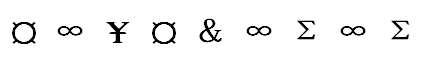

- **A**. 

- **B**. 
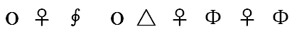
　✅
- **C**. 

- **D**. 

**答案**：B

**官方解析**

第一步：分析题干符号间关系。
从相同符号的位置入手：位置1、4的符号相同；位置2、6、8符号相同；位置7、9符号相同。
第二步：判断选项符号关系。
A项：相同位置与题干一致，但位置3、5符号相同，而题干3、5符号不相同，与题干逻辑关系不一致，排除；
B项：位置1、4的符号相同；位置2、6、8符号相同；位置7、9符号相同，与题干逻辑关系一致，当选；
C项：位置5、7、9符号相同，而题干5、7符号不相同，与题干逻辑关系不一致，排除；
D项：位置7、9符号不相同，与题干逻辑关系不一致，排除。
故正确答案为B。

---

### 第 13 题　qid 2367934 · 图形推理

从四个图中选出唯一的一项，填入问号处，使其呈现一定的规律性:

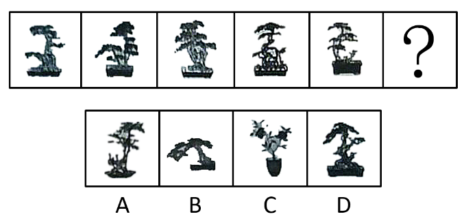

- **A**. A
- **B**. B
- **C**. C
- **D**. D　✅

**答案**：D

**官方解析**

本题考查图形的实际意义，寻找最大共同点。观察发现，题干图片均为盆景，盆栽整体直立在盆中，且装盆栽的盆的形状是长方形。四个选项中，A项中装盆栽的盆的形状是圆形，B项盆栽不是直立在盆中，C项不是盆栽，只有D项符合题干规律。
故正确答案为D。

---

### 第 14 题　qid 2367935 · 图形推理

从四个图中选出唯一的一项，填入问号处，使其呈现一定的规律性:

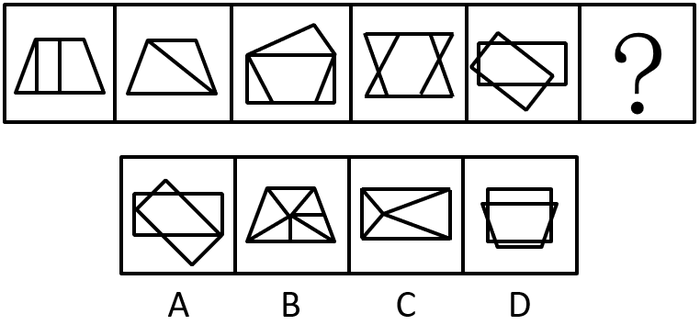

- **A**. A
- **B**. B　✅
- **C**. C
- **D**. D

**答案**：B

**官方解析**

元素组成不同，且无明显属性规律，优先考虑数量规律。观察发现，题干图形封闭面明显，优先考虑数面，但整体数面无规律。再观察发现题干图形的三角形面较多，三角形面数量依次是：1、2、3、4、5、？，问号处应填写一个三角形面数量为6的图形，只有B项符合。
故正确答案为B。

---

### 第 15 题　qid 2367936 · 图形推理

从四个图中选出唯一的一项，填入问号处，使其呈现一定的规律性:

- **A**. A
- **B**. B
- **C**. C
- **D**. D　✅

**答案**：D

**官方解析**

元素组成不同，优先考虑属性规律。观察发现，题干中所有图形都比较规整，均为轴对称图形，且对称轴依次逆时针旋转，如下图：

依此规律，只有D项符合。

故正确答案为D。

---

### 第 16 题　qid 2367937 · 图形推理

从四个图中选出唯一的一项，填入问号处，使其呈现一定的规律性:

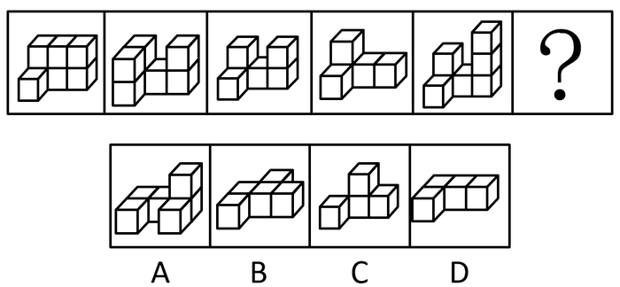

- **A**. A
- **B**. B
- **C**. C
- **D**. D　✅

**答案**：D

**官方解析**

本题考查三视图。观察图形发现，题干的每一个立体图形的俯视图均为“L”形，符合此规律的只有D项。
故正确答案为D。

---

### 第 17 题　qid 2367938 · 图形推理

选项四个图形中，只有一个是由题干的四个图形拼合（只能通过上、下、左、右平移）而成的，请把它找出来。

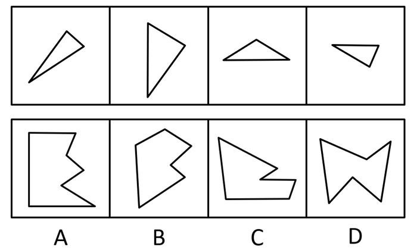

- **A**. A　✅
- **B**. B
- **C**. C
- **D**. D

**答案**：A

**官方解析**

本题考查平面拼合，可采用平行且等长相消的方式解题。消去平行且等长的线段后进行组合可得到轮廓图，即为A项。平行且等长相消的方式如下图所示：

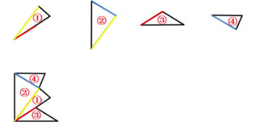

故正确答案为A。

---

### 第 18 题　qid 2367939 · 图形推理

选项四个图形中，只有一个是由题干的四个图形拼合（只能通过上、下、左、右平移）而成的，请把它找出来。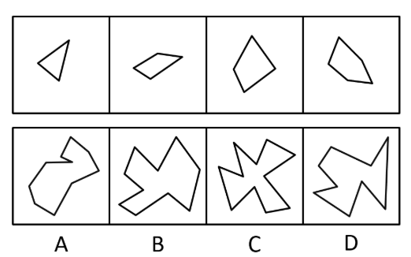 

- **A**. A
- **B**. B　✅
- **C**. C
- **D**. D

**答案**：B

**官方解析**

本题考查平面拼合，可采用平行且等长相消的方式解题。消去平行且等长的线段后进行组合可得到轮廓图，即为B项。平行且等长相消的方式如下图所示：

故正确答案为B。

---

### 第 19 题　qid 2367940 · 图形推理

选项四个图形中，只有一个是由题干的四个图形拼合（只能通过上、下、左、右平移）而成的，请把它找出来。

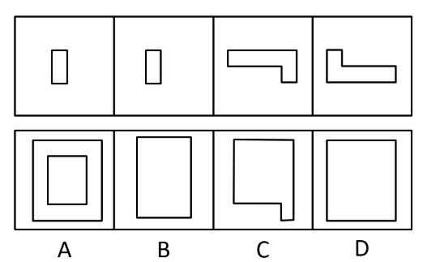

- **A**. A　✅
- **B**. B
- **C**. C
- **D**. D

**答案**：A

**官方解析**

本题考查平面拼合，可采用平行且等长相消的方式解题。消去平行且等长的线段后进行组合可得到轮廓图，即为A项。平行且等长相消的方式如下图所示：

故正确答案为A。

---

### 第 20 题　qid 2367941 · 图形推理

选项四个图形中，只有一个是由题干的四个图形拼合（只能通过上、下、左、右平移）而成的，请把它找出来。

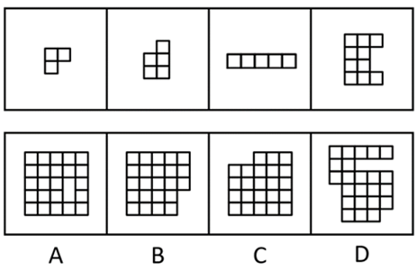

- **A**. A
- **B**. B
- **C**. C
- **D**. D　✅

**答案**：D

**官方解析**

本题考查平面拼合，从方块最多的图形入手，贴边代入选项。题干的4个图形中，图④的方块最多，将它贴边代入各个选项中，只有D项能够把所有图形都代入进去，拼合方式如下图所示：

故正确答案为D。

---

### 第 21 题　qid 2367942 · 图形推理

左边给定的是纸盒外表面的展开图，右边哪一项能由它折叠而成？请把它找出来。

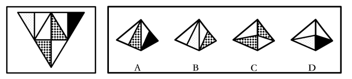

- **A**. A　✅
- **B**. B
- **C**. C
- **D**. D

**答案**：A

**官方解析**

将题干展开图中的面依次标注为面a、b、c、d，如下图：

A项：与题干一致，当选；

B项：题干中，面a的阴影三角形和面d的阴影三角形挨着，面a的白色三角形与面b的白色三角形挨着，而选项中面a的阴影三角形与右侧面的白色三角形挨着，因此右侧面既不是面d也不是面b，选项与题干不一致，排除；

C项：题干中面b和面d都以阴影和白三角形组成顶点为起点，在面中顺时针画边，无论是哪个面第1条边均为阴影三角形的斜边，而选项中以此顶点顺时针画边，无论是哪个面第1条边均为白色三角形的斜边，选项与题干不一致，排除；

D项：题干中，面a以阴影和白三角形组成顶点为起点顺时针画边，第1条边为阴影三角形的斜边，而选项中以此顶点顺时针画边，第1条边为白色三角形的斜边，选项与题干不一致，排除。

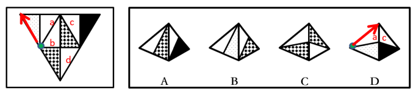

故正确答案为A。

---

### 第 22 题　qid 2367943 · 图形推理

左边给定的是纸盒外表面的展开图，右边哪一项能由它折叠而成？请把它找出来。

- **A**. A
- **B**. B　✅
- **C**. C
- **D**. D

**答案**：B

**官方解析**

将题干展开图中的面依次标注为面a、b、c、d，如下图：

A项：选项由面b和面d构成，题干展开图中面b和面d的箭头指向的边是两个面的公共边，选项中箭头指向的边不是两个面的公共边，选项与题干不一致，排除；

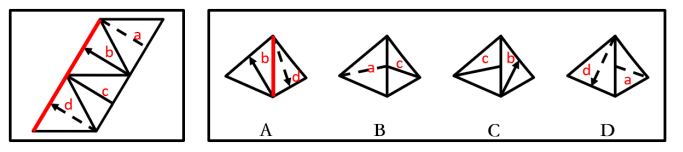

B项：选项由面a和面c构成，与题干一致，当选；

C项：选项由面b和面c构成，题干展开图中面b和面c的公共边与面c内的直线相交于面c的一个顶点，选项中面b和面c的公共边与面c内的直线相交于公共边的中点，选项与题干不一致，排除；

D项：选项由面a和面d构成，题干展开图中面a和面d的公共边与面a内的虚线相交于面a的一个顶点，选项中面a和面d的公共边与面a内的虚线相交于公共边的中点，选项与题干不一致，排除。

故正确答案为B。

---

### 第 23 题　qid 2367944 · 图形推理

左边给定的是纸盒外表面的展开图，右边哪一项能由它折叠而成？请把它找出来。

- **A**. A
- **B**. B
- **C**. C
- **D**. D　✅

**答案**：D

**官方解析**

将题干展开图中的面依次标号，如下图：

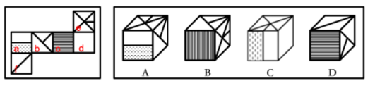

A项：选项由面a、b、e构成，以面e中与小短线有交点的那条边为起点在面e中顺时针画边，题干中第2边对着面d，选项中第2边对着面b，选项与题干不一致，排除；

B项：选项由面b、c、e构成，题干中面b和面c的公共边是小直角三角形的斜边，选项中的公共边是大直角三角形的直角边，选项与题干不一致，排除；

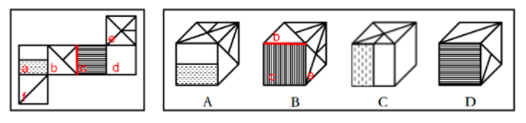

C项：选项由面a、d、e构成，题干中面a和面d的公共边是面a中纯白矩形的短边，而选项中面a和面d的公共边是纯白矩形的长边，选项与题干不一致，排除；

D项：选项与题干一致，当选。

故正确答案为D。

---

### 第 24 题　qid 2367945 · 图形推理

左边给定的是纸盒外表面的展开图，右边哪一项能由它折叠而成？请把它找出来。

- **A**. A
- **B**. B
- **C**. C
- **D**. D　✅

**答案**：D

**官方解析**

将题干展开图中的面依次标号，如下图：

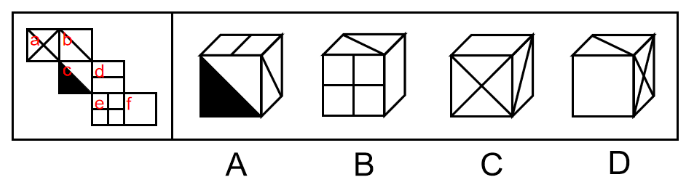

A项：选项由面b、c、d构成，以面c白色直角为起点在面c中顺时针画边，题干中第4条边对着面b，选项中第4条边对着面d，选项与题干不一致，排除；

B项：选项由面b、e、f构成，题干中面b和面e是相对面，不能同时出现，选项与题干不一致，排除；

C项：选项由面a、b、f构成，以面a和面b的对角线的交点为起点在面a内顺时针画边，题干中顺时针第1条边对着面b，选项中顺时针第4条边对着面b，选项与题干不一致，排除；

D项：选项与题干一致，当选。

故正确答案为D。

---

### 第 25 题　qid 2367815 · 图形推理

从所给的四个选项中，选择最合适的一个填入问号处，使之呈现一定的规律性。

- **A**. A　✅
- **B**. B
- **C**. C
- **D**. D

**答案**：A

**官方解析**

元素组成不同，优先考虑属性规律。九宫格优先按横行看，第一行图形均由直线构成，第二行图形均由曲线构成，第三行图形均由直线和曲线构成，因此“？”处图形应由直线和曲线构成，只有A项符合。
故正确答案为A。

---

### 第 26 题　qid 2367946 · 图形推理

从所给的四个选项中，选择最合适的一个填入问号处，使之呈现一定的规律性：

- **A**. A
- **B**. B　✅
- **C**. C
- **D**. D

**答案**：B

**官方解析**

本题考查图形的实际意义，寻找最大共同点。观察发现，题干所有图形都是一根枝干上长满了相同的叶子或花，九宫格优先按横行来看，第一行，花枝朝向依次为左、右、左；第二行，花枝朝向依次是右、左、右，规律均为左右交替出现，第三行前两个图花枝朝向为左、右，因此“？”处花枝朝向应为左，C、D两项花枝朝向不是左（注：C项可能存在争议，有部分同学觉得是朝上，无论是朝右还是朝上，均不是朝左），均排除；A项花枝最上面是3朵花，下面是3片叶子，一根枝干上元素不相同，只有B项满足题干图形特征。
故正确答案为B。

---

### 第 27 题　qid 2367947 · 图形推理

左图为给定的立体，从任意角度剖开，右边哪一项不可能是它的截面图？

- **A**. A　✅
- **B**. B
- **C**. C
- **D**. D

**答案**：A

**官方解析**

本题考查截面图，逐一分析选项。

如下图所示，B、C、D项均可截出，A项无法截出，因为长方形空心部分上面不应有实线，实际截面图应为凹字型。

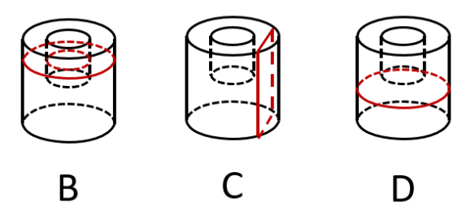

故正确答案为A。

---

### 第 28 题　qid 2367948 · 逻辑判断

信仰、信念、信心，任何时候都至关重要。小到一个人、一个集体，大到一个政党、一个民族、一个国家。只要有信仰、信念、信心，就会愈挫愈奋、愈战愈勇，否则就会不战自败、不打自垮。
根据以上陈述，可以得出以下哪项？

- **A**. 没有信仰、信念、信心，我们就会不战自败、不打自垮　✅
- **B**. 没有信仰、信念、信心，我们就不会愈挫愈奋，愈战愈勇
- **C**. 如果不战自败、不打自垮，就说明我们没有信仰、信念、信心
- **D**. 如果愈挫愈奋、愈战愈勇，我们就不会不战自败、不打自垮

**答案**：A

**官方解析**

第一步：翻译题干。

①信仰、信念、信心愈挫愈奋、愈战愈勇；

②（不战自败、不打自垮）信仰、信念、信心。

将①②串联后可递推出：③（不战自败、不打自垮）信仰、信念、信心愈挫愈奋、愈战愈勇。

第二步：逐一分析选项。

A项：翻译为（信仰、信念、信心）不战自败、不打自垮，属于②的逆否等价，可以推出，当选；

B项：翻译为（信仰、信念、信心）（愈挫愈奋、愈战愈勇），是对条件①箭头前内容的否定，否前得不到确定性的结论，无法推出，排除；

C项：翻译为不战自败、不打自垮（信仰、信念、信心），是对条件②箭头前内容的否定，否前得不到确定性的结论，无法推出，排除；

D项：翻译为愈挫愈奋、愈战愈勇（不战自败、不打自垮），是对条件③箭头后内容的肯定，肯后得不到确定性的结论，无法推出，排除。

故正确答案为A。

---

### 第 29 题　qid 2367860 · 逻辑判断

智能手机流行的时代，我们每天发送信息，也收到信息。人际之间的电子信息交往已成为当今时代一种独特的交往方式。在面对重要的人或关系时，很多人往往发出信息后就期待被秒回，如果没有被秒回，他们就产生一种怀疑感或被弃感，从而陷入深深的烦恼和焦虑之中。
以下哪项最可能是他们陷入深深烦恼和焦虑所需的假设？

- **A**. 当前技术已能实现智能手机的即时通信，方便快捷，且基本免费　✅
- **B**. 有些聊天软件能在发送者手机中反馈信息接收者是否阅读了信息
- **C**. 有些人工作很忙，总习惯在忙完一天工作后才统一处理相关信息
- **D**. 有些人一天收到的信息太多，容易遗漏某人期待秒回的重要信息

**答案**：A

**官方解析**

第一步：找出论点和论据。

论点：在面对重要的人或关系时，很多人往往发出信息后就期待被秒回，如果没有被秒回，他们就产生一种怀疑感或被遗弃感，从而陷入深深的烦恼和焦虑之中。

论据：无。

本题无论据，只能通过补充论据进行加强。提问方式是假设类，优先考虑补充必要条件，即没有这个选项，论点则无法成立。

第二步：逐一分析选项。

A项：如果智能手机不能即时通信，那么发出的信息就无法被即时接收，发出者就不会期待秒回，因此A项是信息能够被秒回的必要条件，当选；

B项：有些聊天软件能在发送者手机中反馈信息接收者是否阅读了信息，可以解释部分发出者为什么没有被秒回就会产生怀疑感或被弃感，但是力度较弱，且不是论点成立的必要条件，排除；

C项：接收者什么时候阅读信息与发出者没被秒回就会产生烦恼和焦虑无关，排除； 

D项：接收者是否遗漏了重要信息与发出者没被秒回就会产生烦恼和焦虑无关，排除。

故正确答案为A。

附：通过查证原文，本题答案为A项。

---

### 第 30 题　qid 2367949 · 逻辑判断

某地开展企业结对扶贫创新活动，倡导企业家与贫困家庭互选，要求每户贫困家庭只能选1位企业家，而每位企业家只能在选他的贫困家庭中选择1-2户开展帮扶活动。现有企业家甲、乙、丙3人面对张、王、李、赵4户贫困家庭，已知：
（1）张、王2户至少有1户选择甲；
（2）王、李、赵3户中至少有2户选择乙；
（3）张、李2户中至少有1户选择丙。
事后得知，互选顺利完成，每户贫困家庭均按自己心愿选到了企业家，而每位企业家也按要求选到了贫困家庭。
根据以上信息，可以得出以下哪项？

- **A**. 企业家甲选到了张户
- **B**. 企业家乙选到了赵户　✅
- **C**. 企业家丙选到了李户
- **D**. 企业家甲选到了王户

**答案**：B

**官方解析**

分析题干。
（1）张或王选甲
（2）王、李、赵中至少2户选乙
（3）张或李选丙
由题干“每户贫困家庭只能选1位企业家，每位企业家只能在选他的贫困家庭中选择1-2户开展帮扶活动”可知：甲互选的帮扶家庭数为1，乙互选的帮扶家庭数为2，丙互选的帮扶家庭数为1；再根据条件（1）可知，张或王选甲，说明李和赵不选甲；由条件（2）可知，张不选乙，由条件（3）可知，王和赵不选丙，此时赵即不选甲也不选丙，又已知“每户贫困家庭均按自己心愿选到了企业家”，因此，赵只能选企业家乙，即企业家乙选到了赵户。
故正确答案为B。

---

### 第 31 题　qid 2367950 · 逻辑判断

当今社会，不少老人为了帮助子女照顾下一代而漂泊异乡成为“老漂族”。在最近一项城市调查中，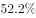的受访青年坦言，自己的父母就是老漂族，自己与爱人事业刚刚起步，工作压力较大，根本没有时间照顾孩子和做家务。有专家据此断言，我国城市中的老漂族群体还会进一步扩大。

以下哪项如果为真，最能支持上述专家的观点？

- **A**. 老人在城市养老可拥有比乡村更好的医疗条件
- **B**. 有些老人故土难离事务缠身更愿意生活在家乡
- **C**. 国家二孩政策的实施将会促使更多的孩子出生　✅
- **D**. 二孩政策实施后城市的二孩出生率要低于农村

**答案**：C

**官方解析**

第一步：找出论点和论据。

论点：我国城市中的老漂族群体还会进一步扩大。

论据：的受访青年坦言，自己的父母就是老漂族，自己与爱人事业刚刚起步，工作压力较大，根本没有时间照顾孩子和做家务。

题干论点探讨的是老漂族群体会进一步扩大，可以通过补充论据说明老漂族群体在增加或照顾孩子和做家务的人员短缺等进行加强。

第二步：逐一分析选项。

A项：说的是城市养老医疗条件比乡村更好，与论点说的老漂族群体会进一步扩大无关，话题不一致，无法加强，排除；

B项：说的是老人更愿意生活在家乡，老人的意愿与论点说的老漂族群体会进一步扩大无关，无法加强，排除；

C项：国家二孩政策会促使更多的孩子出生，补充论据说明需要照顾孩子的情况会更多，对老漂族群体扩大进行了加强，可以支持，当选；

D项：二孩出生率农村更高，农村的照顾孩子的需求会更多些，老漂族应该会减少而不是扩大，无法加强，排除。

故正确答案为C。

---

### 第 32 题　qid 2367861 · 逻辑判断

某区对所辖钟山、长江、梅园、星海4个街道进行抽样调查，并按照人均收入为其排序。有人根据以往经验对4个街道的人均收入排序作出如下预测：
（1）如果钟山街道排第三，那么梅园街道排第一；
（2）如果长江街道既不排第一也不排第二，那么钟山街道排第三；
（3）钟山街道排序与梅园街道相邻，但与长江街道不相邻。
事后得知，上述预测符合调查结果。
根据以上信息，可以得出以下哪项？

- **A**. 钟山街道不排第一就排第四　✅
- **B**. 长江街道不排第二就排第三
- **C**. 梅园街道不排第二就排第四
- **D**. 星海街道不排第一就排第三

**答案**：A

**官方解析**

第一步：分析题干条件。

① 钟山第三梅园第一；

② 长江第一 且 第二钟山第三；

③ 钟山与梅园相邻，与长江不相邻。

第二步：根据题干条件进行推理。

钟山出现次数最多，为最大信息，可作为突破口。根据③可知：钟山与梅园相邻，结合①可知：钟山第三梅园第一，故钟山不能排名第三。钟山第三是对②的否后，否后必否前，故长江排名第一或者第二。

如果长江排第一，根据③可知钟山只能排第四，故梅园排第三，星海排第二，排除B、C、D项，只有A项成立；

如果长江排第二，根据③可知钟山只能排第四，故梅园排第三，星海排第一，A项依然成立。

故正确答案为A。

---

### 第 33 题　qid 2367951 · 逻辑判断

人饿了会吃东西，一旦摄入碳水化合物、脂肪、蛋白质等能量营养素，就能消除饥饿感，这种缺乏能量营养素的饥饿是显性饥饿；然而，人体健康还需铁、锌等16种矿物元素及维生素A、维生素E等13种维生素，如果缺乏这些微量营养素，则会造成隐性饥饿。显然，显性饥饿只要“吃饱”就能解决，而隐性饥饿只有“吃好”才能应对。
根据以上陈述，可以得出以下哪项？

- **A**. 既要“吃饱”又要“吃好”，如此就能保证人体的健康
- **B**. 消除显性饥饿对人更重要，只有“吃饱”才能“吃好”
- **C**. 隐性饥饿并不同于显性饥饿，“吃不好”不等于“吃不饱”　✅
- **D**. 隐性饥饿对人体健康的危害比显性饥饿更大、更隐蔽

**答案**：C

**官方解析**

日常结论题，根据题干信息逐一分析选项。
A项：根据题干可知，“吃饱”可以解决显性饥饿，“吃好”可以解决隐性饥饿，但题干未提及二者同时成立是否就能保证人体健康，无法推出，排除；
B项：题干中并未比较消除显性饥饿与消除隐性饥饿哪个更重要，无法推出，排除；
C项：根据题干最后一句话可知，显性饥饿只要“吃饱”就能解决，而隐性饥饿只有“吃好”才能应对，说明这两种饥饿是不同的，其解决方式也并不相同，可以推出，当选；
D项：题干中并未比较显性饥饿与隐性饥饿哪个对人体的健康危害更大，无法推出，排除。
故正确答案为C。

---

### 第 34 题　qid 2367863 · 逻辑判断

某县新一届党政领导班子刚组建完成，一心想为群众做一些实事。面对有限的财力，新一届领导班子明确表示，今年只能完成两件大事。对于众多排进公共政策议程的大事，他们认为：如果建一条乡村公路，则不能建污水处理厂；如果建污水处理厂，则要建排污管道；如果建排污管道，则不能建垃圾处理厂。
按照这届领导班子的想法，以下哪项不可能是他们今年同时要建设的？

- **A**. 乡村公路、排污管道
- **B**. 乡村公路、垃圾处理厂
- **C**. 污水处理厂、排污管道
- **D**. 污水处理厂、垃圾处理厂　✅

**答案**：D

**官方解析**

第一步：翻译题干。

①  建公路建污水处理厂；

②  建污水处理厂建排污管道；

③  建排污管道建垃圾处理厂；

将③和②可以递推出：④ 建污水处理厂建排污管道建垃圾处理厂；

⑤  只能完成两件大事。

第二步：逐一分析选项。

A项：若建公路和排污管道，根据①得到不建污水处理厂，根据③得到不建垃圾处理厂，此时完成两件大事，与题干已知条件不矛盾，可以推出，排除；

B项：若建公路和垃圾处理厂，根据①得到不建污水处理厂，根据④得到不建排污管道以及不建污水处理厂，此时完成两件大事，与题干已知条件不矛盾，可以推出，排除；

C项：若建污水处理厂和排污管道，根据①的否后必否前，得到不建公路，根据④得到不建垃圾处理厂，此时完成两件大事，与题干已知条件不矛盾，可以推出，排除；

D项：根据④可知，建污水处理厂建垃圾处理厂，故不可能同时建污水处理厂和垃圾处理厂，不能推出，当选。

本题为选非题，故正确答案为D。

---

### 第 35 题　qid 2367896 · 逻辑判断

科幻小说《三体》中提出的“黑暗森林理论”告诉我们，人类千万不能向宇宙透露我们地球的位置，否则就会被外星文明毁灭。但是，早在《三体》出版之前的1974年，人类就向距离地球超过2.2万光年的武仙座星团发送了一段无线电信号，以光速主动向宇宙宣告了自身的存在。这个编号为M13的武仙座星团拥有数十万颗恒星。科学家认为，恒星周围一般会伴有行星，但恒星上不可能存在生命体，行星上却可能有。深信黑暗森林理论的人不禁为人类这一鲁莽举动感到担心，认为人类的美好期望有可能会迎来残酷的现实。
以下哪项如果为真，最能说明这种担心是不必要的？

- **A**. 迄今为止人类并没有发现任何外星生命存在的迹象
- **B**. 类地行星也并不罕见，平均每5颗恒星就拥有1颗
- **C**. 恒星密集分布的武仙座星团内不存在任何行星系统　✅
- **D**. 即使武仙座星团文明收到信号也要在2.2万年以后

**答案**：C

**官方解析**

第一步：找出论点和论据。
论点：人类的美好期望有可能会迎来残酷的现实。
论据：科幻小说《三体》中提出的“黑暗森林理论”告诉我们，人类千万不能向宇宙透露我们地球的位置，否则就会被外星文明毁灭。但是，早在《三体》出版之前的1974年，人类就向距离地球超过2.2万光年的武仙座星团发送了一段无线电信号，以光速主动向宇宙宣告了自身的存在。这个编号为M13的武仙座星团拥有数十万颗恒星。科学家认为，恒星周围一般会伴有行星，但恒星上不可能存在生命体，行星上却可能有。
文段较长而且问法比较特殊，问“说明这种担心是不必要的”可以理解成是削弱题，论点是担心人类未来，论据是这种担心产生的依据，论点是对未来的预测，可优先考虑削弱论据。
第二步：逐一分析选项。
A项：指出迄今为止还没有发现任何外星生命存在的迹象，但是没有发现不代表以后不存在，属于不明确选项，无法削弱，排除；
B项：指出类地行星不罕见，而行星上可能存在生命体，意味着存在其他生命体的可能性增加，人类会因此而担心，具有加强作用，排除；
C项：指出武仙座星团不存在任何行星系统，也就是说不会存在生命体，就不会给人类带来危害，削弱论据，可以削弱，当选； 
D项：指出武仙星团接收到信号的时间会在2.2万年以后，之后是否会给地球上的人类带来危害，不得而知，属于不明确选项，无法削弱，排除。
故正确答案为C。

---

### 第 36 题　qid 2367802 · 定义判断

公众充权：指在公共政策的制定、执行、评估、监督过程中，公众积极参与，充分表达自己的利益主张，以推动公共政策过程的民主化与科学化。
下列属于公众充权的是

- **A**. 清明节到来前夕，一些社会人士在市文明办支持下创建了文明祭扫网站，号召民众祭扫时不放鞭炮，不烧纸钱，改用虚拟鲜花、电子蜡烛等绿色环保的方式
- **B**. 快递小哥小李当选市人大代表后，在广泛走访充分调研的基础上，提交了一份关于如何保障快递员权益、促进快递行业健康发展的议案
- **C**. 某市将要召开天然气价格调整听证会，有关部门要求辖区各街道、居委会搞好宣传动员工作，按照下达名额推举市民代表，确保公开公平公正
- **D**. 在某县未来五年发展规划制定过程中，县委、县政府通过召开居民座谈会、专家听证会等形式，征求到了许多宝贵的意见　✅

**答案**：D

**官方解析**

第一步：找出定义关键词。
“在公共政策的制定、执行、评估、监督过程中”、“公众积极参与，充分表达自己的利益主张”、“推动公共政策过程的民主化与科学化”。
第二步：逐一分析选项。
A项：创建文明祭扫网站，号召改用绿色环保的方式，不符合“在公共政策的制定、执行、评估、监督过程中”，不符合定义，排除；
B项：提交议案，不符合“在公共政策的制定、执行、评估、监督过程中”，不符合定义，排除；
C项：召开天然气价格调整听证会可以理解为“在公共政策的制定、执行、评估、监督过程中”，但按照下达名额推举市民代表，不符合“公众积极参与，充分表达自己的利益主张”，不符合定义，排除；
D项：在某县未来五年发展规划制定过程中，符合“在公共政策的制定、执行、评估、监督过程中”，通过召开居民座谈会、专家听证会等形式，征求到了许多宝贵的意见，符合“公众积极参与，充分表达自己的利益主张”，符合定义，当选。
故正确答案为D。

---

### 第 37 题　qid 2367810 · 定义判断

信息扶贫：指政府或社会群体借助信息技术手段来解决因信息闭塞而导致的经济、文化上的贫困问题。
下列属于信息扶贫的是

- **A**. 某物流公司联手互联网巨头在边远山区定向从贫困户中招聘一批快递员，经过专业培训之后上岗，帮他们走上了脱贫致富的道路
- **B**. 某手机生产厂家面向农村市场，推出了一款低成本、易操作、大屏幕、待机时间长的时尚智能手机，村民们纷纷换掉了原来的旧手机
- **C**. 省城某重点中学建立网络课堂，向某贫困县的中学进行远程同步直播，使两地师生共享优质教学资源。几年来，该县考上重点大学的人数明显增多　✅
- **D**. 毕业返乡的小周带着几个同学开了家网店，在网上销售自家种植的红枣，销量逐步上升，日子越来越红火

**答案**：C

**官方解析**

第一步：找出定义关键词。
“政府或社会群体借助信息技术手段”、“解决因信息闭塞而导致的经济、文化上的贫困问题”。
第二步：逐一分析选项。
A项：招聘快递员，经过专业培训之后上岗，未体现“借助信息技术手段”，不符合定义，排除；
B项：某手机生产厂家面向农村市场推出时尚智能手机，未体现“解决贫困问题”，也未体现“借助信息技术手段”，不符合定义，排除；
C项：建立网络课堂，进行远程同步直播，符合“借助信息技术手段”，共享优质教学资源，该县考上重点大学的人数明显增多，符合“解决因信息闭塞而导致的文化上的贫困问题”，符合定义，当选；
D项：开网店可以理解为“信息技术手段”，但未体现“解决因信息闭塞而导致的经济、文化上的贫困问题”，不符合定义，排除。
故正确答案为C。

---

### 第 38 题　qid 2367963 · 定义判断

“一门式”政务服务：指为了方便群众，将原本需要跑多个政府部门才能办成的事项集中到一个服务中心或简化到一个窗口办结的服务行为。
下列属于“一门式”政务服务的是：

- **A**. 某市建立了一个社会综合治理云平台，将多种渠道发现的社会问题按照标准化流程推送到相应的职能部门，明确责任人并限时解决，避免了部门之间推诿扯皮的情况
- **B**. 某市新近成立了一个残疾人服务站，以前残疾人申请生活补贴需要携带申请表到各级残联审批盖章，现在只需到服务站提出申请，各级审批部门就会即时看到并办妥　✅
- **C**. 市医院为了解决患者就医难的问题，在一楼大厅开设了便民门诊，挑选了一批医术精湛的医生坐诊，患者可以一站式完成挂号、收诊、缴费、取药的全部流程
- **D**. 某市非本地户籍的适龄儿童入学过去需要监护人现场提交户口、住房、工作证明等材料，现在只要通过教育部门专设的网上报名登记系统，就可一键提交全部材料

**答案**：B

**官方解析**

第一步：找出定义关键词。
“为了方便群众”、“将原本需要跑多个政府部门才能办成的事项集中到一个服务中心或简化到一个窗口办结”。
第二步：逐一分析选项。
A项：将多种渠道发现的社会问题按照标准化流程推送到相应的职能部门，未体现“集中到一个服务中心或简化到一个窗口办结”，且未体现“群众原本需要跑多个政府部门才能办成事项”，不符合定义，排除；
B项：以前残疾人申请生活补贴需要携带申请表到各级残联审批盖章，体现了“原本需要跑多个政府部门”，现在只需到服务站提出申请，各级审批部门就会即时看到并办妥，体现了“集中到一个服务中心或简化到一个窗口办结”，且体现了“方便群众”，符合定义，当选；
C项：市医院不属于政府部门，并且市医院为了解决患者就医难的问题，未体现“原本需要跑多个政府部门”，也不属于“政务服务”，不符合定义，排除；
D项：过去需要监护人现场材料，未体现“原本需要跑多个政府部门”，“通过教育部门专设的网报名登记系统一键提交全部材料”是线上报名，未体现“集中到一个服务中心或简化到一个窗口办结”，不符合定义，排除。
故正确答案为B。

---

### 第 39 题　qid 2367816 · 定义判断

社会性处罚：指存在失信行为的人员所受到的与自身失信行为没有直接关联的来自其他部门的限制和处罚。
下列属于社会性处罚的是

- **A**. 以“站不起来”为理由强占他人座位的高铁“霸座男”，当场受到了乘警的严肃批评，下车后被移送公安机关接受治安处罚。这一事件曝光后，当事人的恶劣行为又遭到了全国网民的一致谴责
- **B**. 由于数据造假，某教授在国际期刊上发表的论文被撤稿。在网民的谴责声中，该教授又被撤销了基于该论文所获得的绩效奖励、省部级科研项目、荣誉称号、社会兼职
- **C**. 春节前夕，恶意拖欠农民工工资的部分包工头，被有关部门和各种媒体曝光，引起社会各界密切关注。根据银行、保险、铁路等部门的规定，这些违规者申请信用卡、购买保险以及动车和高铁票时都将受到限制　✅
- **D**. 长江沿岸的一家化工企业，多次不顾禁令向长江偷偷排污，最近被省有关部门通报批评，吊销了企业生产执照，它的上级主管部门及主要负责人也都受到了严厉的处罚

**答案**：C

**官方解析**

第一步：找出定义关键词。
“存在失信行为的人员”、“所受到的与自身失信行为没有直接关联的来自其他部门的限制和处罚”。
第二步：逐一分析选项。
A项：以“站不起来”为理由强占他人座位的高铁“霸座男”，符合“存在失信行为的人员”，当场受到了乘警的严肃批评，被移送公安机关接受治安处罚，这是与自身失信行为有直接关联的限制和处罚，不符合“所受到的与自身失信行为没有直接关联的来自其他部门的限制和处罚”，不符合定义，排除；
B项：某教授数据造假，符合“存在失信行为的人员”，论文被撤稿，撤销了基于该论文所获得的绩效奖励、省部级科研项目、荣誉称号、社会兼职，均是与自身失信行为有直接关联的处罚，不符合“所受到的与自身失信行为没有直接关联的来自其他部门的限制和处罚”，不符合定义，排除；
C项：恶意拖欠农民工工资的包工头，符合“存在失信行为的人员”，申请信用卡、购买保险以及动车和高铁票时都将受到限制，符合“所受到的与自身失信行为没有直接关联的来自其他部门的限制和处罚”，符合定义，当选；
D项：长江沿岸的一家化工企业，多次不顾禁令向长江偷偷排污，不符合“存在失信行为的人员”，不符合定义，排除。
故正确答案为C。

---

### 第 40 题　qid 2367834 · 定义判断

友善采购：指因自然灾害或其他无法抗拒的因素而造成产品大量积压时，购买方按照不低于甚至略高于批发价或市场价的方式购买这些产品，以帮助生产者渡过难关的行为。
下列属于友善采购的是：

- **A**. 近期原材料价格上涨，各种电子器件供应紧张，某企业主动加价，从长期供货商那里购入了大批急需的电子器件，保证了企业生产的正常进行
- **B**. 因连日暴雨引发山洪，造成当地瓜农数十亩即将上市的西瓜被淹，对口帮扶城市得知消息后，以市场价收购了该地瓜农的全部西瓜　✅
- **C**. 南方某地水果大获丰收，造成大量积压滞销，采购商得知东北销路很好，从忧心忡忡的果农那里大量购进，转销东北，获利颇丰
- **D**. 某少数民族的传统手工艺虽然已成功申遗，其产品却始终打不开销路，经过民俗专家在媒体上的大力推介，终于走出了大山，市场反响很好

**答案**：B

**官方解析**

第一步：找出定义关键词。
“因自然灾害或其他无法抗拒的因素而造成产品大量积压”、“购买方按照不低于甚至略高于批发价或市场价的方式购买这些产品”、“以帮助生产者渡过难关”。
第二步：逐一分析选项。
A项：该选项中的企业是为了保障生产的正常运行而主动提出加价，没有体现出生产者因自然灾害或其他无法抗拒的因素而造成产品大量积压，也不符合“以帮助生产者渡过难关”，不符合定义，排除；
B项：连日暴雨引发山洪，符合“因自然灾害或其他无法抗拒的因素”，数十亩，符合“造成产品大量积压”，对口帮扶城市以市场价收购了瓜农的全部西瓜，符合“购买方按照不低于甚至略高于批发价或市场价的方式购买这些产品”和“以帮助生产者渡过难关”，符合定义，当选；
C项：南方某地水果大丰收，造成大量积压，“大丰收”不符合“因自然灾害或其他无法抗拒的因素”，且该选项也没有体现出“购买方按照不低于甚至略高于批发价或市场价的方式购买这些产品”，不符合定义，排除；
D项：某少数民族的传统手工艺产品打不开销路，没有体现出“因自然灾害或其他无法抗拒的因素而造成产品大量积压”，不符合定义，排除。
故正确答案为B。

---

### 第 41 题　qid 2367821 · 定义判断

情感性劳动：指服务业员工在与顾客面对面交往时，将个人情感融入工作过程，对顾客、企业以及服务人员自己产生积极影响的行为。
下列属于情感性劳动的是：

- **A**. 某航空公司空姐站在登机口两旁欢迎乘客，时不时还会微笑着摸摸小孩的头　✅
- **B**. 小刘总是面带微笑、语气亲切热情地接打电话，连续多年被评为最美接线员
- **C**. 某酒店智能客服“小青”善解人意，语音甜美，入住的客人都喜欢和她互动
- **D**. 小秦在信访局工作多年，每次接待来访者，都非常耐心，细致了解具体情况

**答案**：A

**官方解析**

第一步：找出定义关键词。
“服务业员工”、“顾客”、“面对面”、“个人感情”、“对顾客、企业及自己产生积极影响”。
第二步：逐一分析选项。
A项：空姐属于“服务业员工”，站在登机口欢迎属于“面对面”，微笑摸摸小孩的头符合“个人感情”，符合定义，当选；
B项：接打电话不符合“面对面”，不符合定义，排除；
C项：小青是智能客服，不符合“个人情感”，不符合定义，排除；
D项：小秦耐心、细致了解只体现工作负责，未体现“个人感情”，不符合定义，排除。
故正确答案为A。

---

### 第 42 题　qid 2367818 · 定义判断

隐形植入：指通过周边信息、符号体系等不易察觉的形式，使受众在不知不觉中受到影响的宣传策略。
下列属于隐形植入的是：

- **A**. 在某电视剧中，所有角色均使用同一品牌的手机，并使用这个品牌的经典铃声　✅
- **B**. 城运会到来之前，商家把印有城运会会徽的各类文化创意产品陆续摆上了柜台
- **C**. 在某市博物馆馆标设计征集中，8号方案以浓郁的地域文化元素受到了评委的关注
- **D**. 结婚纪念日快到了，为了提醒粗心又忙碌的丈夫，小李偷偷把他的手机屏保换成了婚纱照

**答案**：A

**官方解析**

第一步：找出定义关键词。
“不易察觉的形式”、“不知不觉受到影响”、“宣传策略”。
第二步：逐一分析选项。
A项：在电视剧中使用同一品牌手机，用该品牌经典铃声符合“不易察觉的形式”，“不知不觉受到影响”，也是“宣传策略”，符合定义，当选；
B项：印有城运会会徽，不符合“不易察觉的形式”，不符合定义，排除；
C项：馆标设计受到评委关注，不属于“宣传策略”，不符合定义，排除；
D项：小李提醒丈夫结婚纪念日，把丈夫手机屏保换成婚纱照，符合“不易察觉的形式”，但不属于“宣传策略”，不符合定义，排除。
故正确答案为A。

---

### 第 43 题　qid 2367964 · 定义判断

逆城镇化：指由于工作、生活、环境等原因，城市居民主动从城区流向郊区或农村生活的现象。
下列属于逆城镇化的是：

- **A**. 市民李先生在市中心工作生活多年，去年跳槽到郊区一家企业，并在单位附近买了一套房，感觉工作生活十分方便　✅
- **B**. 随着业务量扩大，某物流企业的库房不能满足业务需要，在城里另租场地成本太高，公司在租金较低的农村租用了一处大型库房
- **C**. 近年来，因为城里交通拥堵，压力太大，不少城市白领纷纷到周边乡村度假，享受田园生活的乐趣
- **D**. 由于编制体制调整，林女士的丈夫从大城市换防到千里之外的戈壁滩，为了支持丈夫工作，林女士打算带着儿子到新的驻地附近安家

**答案**：A

**官方解析**

第一步：找出定义关键词。
“由于工作、生活、环境等原因”、“城市居民”、“主动”、“从城区流向郊区或农村生活”。
第二步：逐一分析选项。
A项：市民李先生符合“城市居民”，跳槽到郊区一家企业并在单位附近买房符合“由于工作、生活、环境等原因”、“从城区流向郊区或农村生活”，跳槽是一种个人选择，符合“主动”，符合定义，当选；
B项：某物流企业因业务需要在租金较低的农村租用了一处大型库房是商业行为，不属于生活，不符合“城市居民”，“主动从城区流向郊区或农村生活”，不符合定义，排除；
C项：到周边乡村度假，享受生活乐趣不是去乡村生活，不符合“主动从城区流向郊区或农村生活”，不符合定义，排除；
D项：从大城市换防到千里之外的戈壁滩，林女士打算带着儿子到新的驻地附近安家，符合“由于工作、生活、环境等原因”、“从城区流向郊区或农村生活”，但丈夫是由于编制调整去到戈壁滩，不符合“主动”，不符合定义，排除。
故正确答案为A。

---

### 第 44 题　qid 2367965 · 定义判断

剧场效应：指由于个体成员追求自身利益最大化，引发其他成员效仿而导致集体秩序失衡，整体利益受损的现象。
下列属于剧场效应的是：

- **A**. 小明参加了一个高价辅导班，小芳的家长知道后，给她报了一个更贵的，他们觉得如果不上，小芳的成绩就可能比不上小明了
- **B**. 电商平台在小长假推出了五花八门的促销方式，其中的个别商家玩起了先提价、后打折的把戏，严重影响了平台的整体信誉
- **C**. 近年来汽车销售大战愈演愈烈，几大厂商最初是在电视台、报纸打广告，后来演变成高价请明星代言，成本投入越来越高，利润却越来越低　✅
- **D**. 考虑到仙霞路上有大型活动，小王选择了平时不大走的春光路上班，没想到由于大家不约而同地走这条路，导致春光路严重堵塞，仙霞路反而畅通无阻

**答案**：C

**官方解析**

第一步：找出定义关键词。
“由于个体成员追求自身利益最大化，引发其他成员效仿”、“导致集体秩序失衡，整体利益受损的现象”。
第二步：逐一分析选项。
A项：小明参加高价辅导班，小芳的家长给小芳报了一个更贵的，没有体现“导致集体秩序失衡，整体利益受损的现象”，不符合定义，排除；
B项：电商平台推出促销方式，个别商家先提价、后打折，未体现出引起其他成员的效仿；结果是严重影响了平台的整体信誉，虽然最终结果是负面的，但是“信誉受损”不等同于“集体秩序失衡，整体利益受损”，不符合定义，排除；
C项：汽车销售大战越演越烈，几大厂家从最初的打广告，演变成高价请明星代言，虽未体现出引起其他成员效仿，但是恶化演变的最终结果是“利润却越来越低”，体现出“导致集体秩序失衡，整体利益受损”，符合定义，当选；
D项：仙霞路上有大型活动，每个人都选择了一条自认为畅通的道路，结果仙霞路反而畅通无阻，每个人不约而同的走这条路，不符合“引发其他成员效仿”，不符合定义，排除。
故正确答案为C。

---

### 第 45 题　qid 2367838 · 定义判断

差异化竞争：指同一行业的多家企业在短期的激烈竞争中，采用灵活多变的个性化手段，树立良好企业形象，赢得市场的经营方式。
下列属于差异化竞争的是：

- **A**. 春节期间，几大网络短视频平台纷纷推出抢红包活动，你发五亿，他发八亿，竞争到了白热化的程度
- **B**. 在其他房地产开发商纷纷降价促销的状况下，某楼盘提升楼盘品质，引进名校资源，销量遥遥领先于同期其他楼盘　✅
- **C**. 每到逢年过节的时候，市区的几家大型电器商场都会推出赠送小家电、延长保修期等优惠活动，市民们往往等到这时集中采购
- **D**. 在实体书店普遍不景气的大环境下，位于繁华街区的某书店一直保持自身的市场定位，致力于销售高品位的专业图书，成为了当地的文化地标

**答案**：B

**官方解析**

第一步：找出定义关键词。
“同一行业企业”、“短期竞争”、“个性化手段”、“赢得市场”。
第二步：逐一分析选项。
A项：春节期间短视频平台符合“同一行业企业”、“短期竞争”，但是纷纷推出抢红包活动没有体现“个性化手段”，不符合定义，排除；
B项：房地产开发商符合“同一行业企业”，其他房地产开发商降价促销，某楼盘提升楼盘品质，引进名校资源销量高于其他楼盘，符合“个性化手段”、“赢得市场”，符合定义，当选；
C项：几家大型电器商场符合“同一行业企业”，过年期间符合“短期竞争”，赠送小家电、延长保修期等优惠活动没有体现出“个性化手段”，不符合定义，排除；
D项：某书店定位销售高品位的专业图书符合“个性化手段”，实体书店普遍不景气的大环境说明是长期状态且没有体现竞争，不符合“短期竞争”，不符合定义，排除。
故正确答案为B。

---

### 第 46 题　qid 2367823 · 定义判断

大数据“杀熟”：指商家在提供相同的商品或服务时，根据大数据的甄别结果，对有多次消费记录或消费能力较高的客户，以偏高标准收费的销售策略。
下列属于大数据“杀熟”的是：

- **A**. 小李负责单位的接待工作，经常要预约商务车接送。后来只要他打车，网约平台就直接推送高价的商务车，无奈之下小李只好注册一个新号供自己日常出行
- **B**. 经常在网上预订酒店的老张在预订某酒店的单人间时，价格一直为380元。他的侄子暑假来看望他，也在网上预定了该酒店同样的房间，价格却便宜四分之一　✅
- **C**. 位于市中心金融服务区的某超市由于环境优越，客户购买力强，某品牌饮料在这里售价高达15元，而这种饮料在居民小区便利店只需要10元
- **D**. 某购物网站推出新用户推广活动，每位新注册用户都可免费获赠抵用券，算下来买同样的商品新会员比老会员还要便宜好多，这让老会员们郁闷不已

**答案**：B

**官方解析**

第一步：找出定义关键词。
“相同的产品或服务”、“大数据甄别结果”、“多次消费记录或消费能力较高的顾客”、“偏高标准收费”。
第二步：逐一分析选项。
A项：小李经常预约商务车，符合“多次消费记录或消费能力较高的顾客”，但单位的接送服务和日常的出行服务不属于“相同的产品或服务”，也未体现对相同的产品有偏高的收费，不符合“偏高标准收费”，不符合定义，排除；
B项：老张经常在网上预订酒店符合“多次消费记录或消费能力较高的顾客”，在网上预订符合“大数据”，侄子预订该酒店同样的房间符合“相同的产品或服务”，老张380元，侄子价格便宜了四分之一符合“偏高标准收费”，符合定义，当选；
C项：金融服务区同品牌饮料比居民小区便利店高，符合“相同的产品或服务”、“偏高标准收费”，但不符合“大数据甄别结果”，不符合定义，排除；
D项：新用户买同样商品比老用户便宜符合“相同的产品或服务”，但不属于针对“多次消费记录或消费能力较高的顾客”，是因为为了推广而赠送抵用券所以便宜，不符合定义，排除。
故正确答案为B。

---

### 第 47 题　qid 2367826 · 定义判断

语码转换：指说话人在同一对话过程中使用多种语言或方言进行交流的现象。
下列不属于语码转换的是：

- **A**. 约翰先生在中国生活多年，与单位同事交谈时总是坚持用汉语，有时实在不知道怎样准确表达自己的意思，也会夹杂三两个英语单词
- **B**. 马经理接待来访客户，用普通话向他们介绍了自己公司的情况。得知客户中有两位陕西老乡后，当即操起陕西话与他们攀谈了几句
- **C**. 在一次国际学术会议上，陈教授用英语作报告时带了一股浓浓的四川口音，参加会议的大多数外国学者几乎都没有听懂他的发言　✅
- **D**. 来到留学生宿舍后，班主任方老师询问了他们的日常生活情况，当他发现一个学生流露出不解的神情时，立刻又用英语解释了一番

**答案**：C

**官方解析**

第一步：找出定义关键词。
“同一对话过程”、“多种语言或方言”。
第二步：逐一分析选项。
A项：约翰和同事交谈坚持用汉语，夹杂两三个英语单词，符合“同一对话过程”，英语和汉语两种语言符合“多种语言或方言”，符合定义，排除；
B项：马经理接待客户符合“同一对话过程”，普通话、陕西话符合“多种语言或方言”，符合定义，排除；
C项：陈教授作报告符合“同一对话过程”，四川口音的英语只有英语一种语言，不符合“多种语言或方言”，不符合定义，当选；
D项：方老师询问学生日常生活符合“同一对话过程”、用英语解释表明之前说的不是英语，符合“多种语言或方言”，符合定义，排除。
本题为选非题，故正确答案为C。

---

### 第 48 题　qid 2367806 · 定义判断

危机公关：指政府部门、社会团体或企业面对可能造成严重后果的突发事件时，有组织、有计划地采取各种应对措施，避免损害或者降低损害程度，以期获得公众谅解的管理活动。
下列不属于危机公关的是：

- **A**. 某公司生产的多批次药品标注虚假生产日期的消息曝光后，公司领导立即在报纸、电视台向全国公众道歉，宣布召回这些批次的产品，承诺通过合适渠道赔偿受害者，迅速查清并如实公布事件真相，请社会各界人士监督
- **B**. 某地曝出高考答题卡被掉包的传闻后，当地政府部门迅速成立联合调查组，网上公布高考命题、监考、阅卷等环节的操作规范，并及时发布调查进展情况，公众情绪逐渐平复，最终查明这一传闻完全是谣言
- **C**. “某品牌火腿肠使用过期猪肉”的消息在网络上蔓延，公司迅速查实后道歉、召回、赔偿，并制定了详细整改措施，承诺绝不会再出现此类事件，媒体和消费者慢慢平静下来
- **D**. 某商场管理层吸取毗邻商场因电路老化引起火灾、损失惨重的教训，定期组织专业人员加强对线路安全的检查，及时更换老旧电线，并且张贴《规范用电须知》提醒商家，商家都非常配合，防火意识显著增强　✅

**答案**：D

**官方解析**

第一步：找出定义关键词。
“政府部门、社会团体或企业面对可能造成严重后果的突发事件时”、“有组织、有计划地采取各种应对措施，避免损害或者降低损害程度”、“以期获得公众谅解”。
第二步：逐一分析选项。
A项：某公司生产的多批次药品标注虚假生产日期的消息曝光后，符合“企业面对可能造成严重后果的突发事件时”，立即在报纸、电视台道歉，宣布召回产品，承诺赔偿受害者等，符合“有组织、有计划地采取各种应对措施，避免损害或者降低损害程度，以期获得公众谅解”，符合定义，排除；
B项：某地曝出高考答题卡被掉包的传闻后，符合“面对可能造成严重后果的突发事件时”，迅速成立联合调查组，网上公布操作规范，及时发布调查进展情况，查明这一传闻是谣言，符合“有组织、有计划地采取各种应对措施，避免损害或者降低损害程度，以期获得公众谅解”，符合定义，排除；
C项：“某品牌火腿肠使用过期猪肉”的消息在网络上蔓延，符合“面对可能造成严重后果的突发事件时”，迅速查实后道歉、召回、赔偿，并制定整改措施，符合“有组织、有计划地采取各种应对措施，避免损害或者降低损害程度，以期获得公众谅解”，符合定义，排除；
D项：某商场管理层吸取毗邻商场因电路老化引起火灾、损失惨重的教训，未体现“面对可能造成严重后果的突发事件时”，不符合定义，当选。
本题为选非题，故正确答案为D。

---

### 第 49 题　qid 2367839 · 定义判断

互联网公益：指民间团体或企业通过网络平台，发动社会公众参与的具有门槛低、透明度高、互动性强等特点的公益活动。
下列属于互联网公益的是：

- **A**. 某公司每年拨出专款开展公益活动，在官网上征集白内障患者并向符合特定条件的患者提供全部医疗费用
- **B**. 得知老张遭遇车祸，他的老同学通过班级群、朋友圈很快募集了三万多元捐款全部转交到他家
- **C**. 某爱心服务站每年开学前在自己的主页上公布来自各界的网络捐款账目，并邀请部分捐款人一起把善款送到山区小学　✅
- **D**. 某村委会通过网络平台发起“一帮一”捐资助学活动，帮助本村特困家庭的大学生解决了学费问题

**答案**：C

**官方解析**

第一步：找出定义关键词。
“民间团体或企业”、“通过网络平台”、“公众参与”、“门槛低、透明度高、互动性强公益活动”。
第二步：逐一分析选项。
A项：某公司符合“民间团体或企业”，在官网符合“通过网络平台”，并向符合特定条件的患者提供全部医疗费用，不符合“门槛低、透明度高、互动性强公益活动”，不符合定义，排除；
B项：通过班级群、朋友圈募集捐款符合“通过网络平台”，但其同学是发起人不符合“民间团体或企业”，不符合定义，排除；
C项：爱心服务站符合“民间团体或企业”，网络捐款账目符合“通过网络平台”，邀请部分捐款人一起把善款送到山区小学说明活动互动性强，符合定义，当选；
D项：通过网络平台捐资助学符合“通过网络平台”，但村委会不符合“民间团体或企业”，不符合定义，排除。
故正确答案为C。

---

### 第 50 题　qid 2367845 · 逻辑判断

N后置编码：指按照下列规则对一个符号串进行处理得到一个新符号串，N表示一个数字。

（1）确认初始符号串中每个符号的顺序位置；

（2）将初始符号串的第一个符号跳过其后面的一个符号放置，得到一个新符号串；

（3）在新符号串中，将初始符号串的第二个符号跳过其后面的两个符号放置，······，依此类推，直到将初始符号串的第N个符号跳过其后面N个符号放置（数到最后一个符号再接着从头数起）。

初始符号串的“4后置编码”是：

- **A**. 

　✅
- **B**. 

- **C**. 

- **D**. 

**答案**：A

**官方解析**

4后置编码

（1）初始符号为1号位车、2号位马、3号位象、4号位士、5号位炮、6号位兵，即 ；

（2）将初始符号中第一号位“车”跳过其后面的的一个符号放置，放在“马”后，得到新符号串1号位马、2号位车、3号位象、4号位士、5号位炮、6号位兵，即  ；

（3）将初始符号中第二号位“马”，在得到的新符号串（2）中跳过其后面的两个符号放置，得到1号位车、2号位象、3号位马、4号位士、5号位炮、6号位兵，即   ；

（4）将初始符号中第三号位“象”，在得到的新符号串（3）中跳过其后面的三个符号放置，得到1号位车、2号位马、3号位士、4号位炮、5号位象、6号位兵，即   ；

（5）将初始符号中第四号位“士”，在得到的新符号串（4）中跳过其后面的四个符号放置，题干提示数到最后一个符号再接着从头数起，得到1号位车、2号位士、3号位马、4号位炮、5号位象、6号位兵，即 。

故正确答案为A。

---
