# 2019年江苏省公务员录用考试《行测》题（B类）（网友回忆版）

> 判断推理 · 50 题 · 江苏 2019

## 材料 1

某市江海区决定对东风路、西河路、南塘路、北海路等4条辖区内道路进行市容出新。为了解群众意见，制定符合民意的出新方案，区政府相关部门的甲、乙、丙、丁4位同志两人一组结伴展开调研。已知，每人各选两条道路，每条道路恰有两人选择：在每条道路的调研中，乙与丙始终没有在一组。另外，还知道：

（1）如果甲选东风路，则丁也选东风路；

（2）如果丙选南塘路，则丁也选南塘路；

（3）甲没有选南塘路。

### 第 1 题　qid 2367868 · 逻辑判断

根据上述信息，可以得出以下哪项？

- **A**. 甲选西河路和北海路　✅
- **B**. 乙选西河路和南塘路
- **C**. 丙选东风路和西河路
- **D**. 丁选东风路和北海路

**答案**：A

**官方解析**

整理题干信息。

① 每人各选两条道路，每条道路恰有两人选择，乙与丙始终没有在一组；

② 甲东风丁东风； 

③ 丙南塘丁南塘；

④甲南塘。

题干信息不确定，可用假设法。

根据①可知，乙或丙肯定有人会跟甲一组，有两种情况：

（1）假如，乙和甲一组，根据条件②可知，如果甲东风，那么乙和丁也得东风，与题干每条道路恰有两人选择矛盾，所以，甲不选东风，根据条件④可知，甲不选南塘，所以甲只能选西河和北海；

（2）假如，丙和甲一组，根据条件②可知，如果甲东风，那么丙和丁也得东风，与题干每条道路恰有两人选择矛盾，所以，甲不选东风，根据条件④可知，甲不选南塘，所以甲只能选西河和北海。

无论哪种情况，最后甲只能选西河和北海。

故正确答案为A。

---

### 第 2 题　qid 2367870 · 逻辑判断

如果乙不选东风路，则可以得出以下哪项？

- **A**. 甲或者选东风路或者选南塘路
- **B**. 乙或者选西河路或者选南塘路　✅
- **C**. 丙或者选南塘路或者选北海路
- **D**. 丁或者选西河路或者选北海路

**答案**：B

**官方解析**

第一步：整理题干信息。

① 每人各选两条道路，每条道路恰有两人选择，乙与丙始终没有在一组；

② 甲东风丁东风； 

③ 丙南塘丁南塘；

④ 甲南塘；

⑤ 乙东风。

根据99题结论可知，条件⑥甲选西河路和北海路，不选东风路和南塘路，又条件①乙与丙始终没有在一组，对于东风路和南塘路，甲不选，乙和丙也不能同时选，则丁必然要选东风路和南塘路，又根据条件⑤ 乙东风，可填写表格如下：

第二步：逐一分析选项。

A项：根据分析可知甲选西河路和北海路，不可能选东风路或者选南塘路，不能推出，排除；

B项：根据分析可知乙有三种情况，可以选西河路和北海路/西河路和南塘路/南塘路和北海路，对于三种情况，选项说法选西河路或者选南塘路均成立，可以推出，当选；

C项：根据分析可知丙有三种情况，可以选东风路和西河路/东风路和南塘路/东风路和北海路，对于三种情况，选项说法选南塘路或者选北海路不一定成立，不能推出，排除；

D项：根据分析可知丁选东风路和南塘路，不可能选西河路或者选北海路，不能推出，排除。

故正确答案为B。

---

### 第 3 题　qid 2367849 · 类比推理

贫困：脱贫：共同富裕

- **A**. 协商：参与：社会治理
- **B**. 输液：治疗：身体康复
- **C**. 干旱：施肥：粮食丰收
- **D**. 污染：治污：绿水青山　✅

**答案**：D

**官方解析**

第一步：判断题干词语间逻辑关系。
贫困是脱贫的必要条件，共同富裕是脱贫的目的。
第二步：判断选项词语间逻辑关系。
A项：协商不是参与的必要条件，社会治理不是参与的目的，与题干逻辑关系不一致，排除；
B项：输液不是治疗的必要条件，身体健康是治疗的目的，前两个词与题干逻辑关系不一致，排除；
C项：干旱是一种气候现象，干旱不是施肥的必要条件，粮食丰收是施肥的目的，前两个词与题干逻辑关系不一致，排除；
D项：污染是治污的必要条件，绿水青山是治污的目的，与题干逻辑关系一致，当选。
故正确答案为D。

---

### 第 4 题　qid 2367850 · 类比推理

花丛：蜜蜂：采蜜

- **A**. 餐厅：厨师：炒菜　✅
- **B**. 农田：农民：收割
- **C**. 宇宙：恒星：运行
- **D**. 树林：柳树：发芽

**答案**：A

**官方解析**

第一步：判断题干词语间逻辑关系。
蜜蜂在花丛采蜜。采蜜是蜜蜂的工作，花丛是蜜蜂工作的地点，三者是对应关系。
第二步：判断选项词语间逻辑关系。
A项：厨师在餐厅炒菜，炒菜是厨师的工作，餐厅是厨师工作的地点，三者是对应关系，与题干逻辑关系一致，保留；
B项：农民在农田收割，收割是农民的工作，农田是农民工作的地点，三者是对应关系，与题干逻辑关系一致，保留；
C项：恒星在宇宙运行，运行不是恒星的工作，与题干逻辑关系不一致，排除；
D项：柳树在树林发芽，发芽不是柳树的工作，与题干逻辑关系不一致，排除。
比对A、B，题干中的采蜜是个动宾词组，选项A中的炒菜是动宾词组，而选项B中的收割是个动词，因此，A的逻辑关系与题干更为接近。
故正确答案为A。

---

### 第 5 题　qid 2367851 · 类比推理

路霸：打击：黑恶势力

- **A**. 功课：复习：基础课程
- **B**. 友谊：维护：世界和平
- **C**. 诚信：讲究：社会和谐
- **D**. 铅笔：购买：学习用品　✅

**答案**：D

**官方解析**

第一步：判断题干词语间逻辑关系。
打击路霸，二者是动宾关系，路霸是黑恶势力的一种，二者是种属关系。
第二步：判断选项词语间逻辑关系。
A项：复习功课，二者是动宾关系，基础课程是功课的一种，与题干顺序相反，与题干逻辑关系不一致，排除；
B项：维护友谊，二者是动宾关系，但友谊不是世界和平的一种，与题干逻辑关系不一致，排除；
C项：讲究诚信，二者是动宾关系，但诚信不是社会和谐的一种，与题干逻辑关系不一致，排除；
D项：购买铅笔，二者是动宾关系，铅笔是学习用品的一种，与题干逻辑关系一致，当选。
故正确答案为D。

---

### 第 6 题　qid 2367852 · 类比推理

理智：情感：悲伤

- **A**. 冷漠：热情：热点
- **B**. 科学：艺术：雕塑　✅
- **C**. 蓝天：白云：云霞
- **D**. 陆地：河流：黄河

**答案**：B

**官方解析**

第一步：判断题干词语间逻辑关系。
理智和情感是并列关系。悲伤是情感的一种，二者是种属关系。
第二步：判断选项词语间逻辑关系。
A项：冷漠和热情是反义关系，热点和热情不是种属关系，与题干逻辑关系不一致，排除；
B项：科学和艺术是并列关系。雕塑是艺术的一种，与题干逻辑关系一致，保留；
C项：蓝天和白云是并列关系，云霞是彩云，与白云是并列关系 ，与题干逻辑关系不一致，排除；
D项：陆地和河流是并列关系，黄河是河流的一种，与题干逻辑关系一致，保留；
比较B、D项，从种属关系细化的角度看，D项中黄河是一个特指，而题干悲伤不是特指，B项的雕塑也不是特指，因此B项相比D项与题干更一致。
故正确答案为B。

---

### 第 7 题　qid 2367853 · 类比推理

眼睛：眼镜：隐形眼镜

- **A**. 脚踝：护膝：运动护膝
- **B**. 耳机：耳朵：蓝牙耳机
- **C**. 手掌：手套：纯棉手套　✅
- **D**. 假牙：牙套：烤瓷牙套

**答案**：C

**官方解析**

第一步：判断题干词语间逻辑关系。
眼镜是矫正视力和保护眼睛的，两者是对应关系，隐形眼镜是眼镜的一种，两者是种属关系。
第二步：判断选项词语间逻辑关系。
A项：护膝是保护膝盖的，不是保护脚踝的，运动护膝是护膝的一种，前两者与题干逻辑关系不一致，排除； 
B项：耳朵不是用来保护耳机的，蓝牙耳机也不是耳朵的一种，与题干逻辑关系不一致，排除；
C项：手套是保护手掌的，纯棉手套是手套的一种，与题干逻辑关系一致，当选；
D项：牙套是矫正牙齿的，不是矫正假牙的，烤瓷牙套是牙套的一种，前两词与题干逻辑关系不一致，排除。
故正确答案为C。

---

### 第 8 题　qid 2367824 · 类比推理

高原：藏羚羊

- **A**. 中国：金丝猴
- **B**. 战场：指战员
- **C**. 海洋：大白鲨　✅
- **D**. 大学：研究员

**答案**：C

**官方解析**

第一步：判断题干词语间逻辑关系。
藏羚羊在高原生活，二者为生存环境与物种的对应关系。
第二步：判断选项词语间逻辑关系。
A项：金丝猴在中国生活，但中国是一个国家，范围太广，不是具体的生存环境对应，与题干逻辑关系不一致，排除；
B项：指战员是指挥员和战斗员的统称，战场不是指战员的生存环境，与题干逻辑关系不一致，排除；
C项：大白鲨在海洋生活，二者是生存环境与物种的对应关系，与题干逻辑关系一致，当选；
D项：大学是研究员的工作地点，二者是工作地点的对应关系，不是生存环境，与题干逻辑关系不一致，排除。
故正确答案为C。

---

### 第 9 题　qid 2367776 · 类比推理

楷体 之于（    ）相当于（    ）之于 水果

- **A**. 字体——苹果　✅
- **B**. 字号——果汁
- **C**. 隶书——食物
- **D**. 书法——鸭梨

**答案**：A

**官方解析**

逐一代入选项。
A项：楷体是字体的一种；苹果是水果的一种，前后均为种属关系，前后逻辑关系一致，当选；
B项：楷体是字体的一种，字号是指字体的大小，二者没有必然的逻辑关系；水果是果汁的原材料，二者为对应关系，前后逻辑关系不一致，排除；
C项：楷体和隶书均是字体，二者为并列关系；水果是食物的一种，二者为种属关系，前后逻辑关系不一致，排除；
D项：书法是艺术作品，楷体是字体，书法可以用到不同的字体，二者是对应关系；鸭梨是水果的一种，二者为种属关系，前后逻辑关系不一致，排除。
故正确答案为A。

---

### 第 10 题　qid 2367778 · 类比推理

燃气 之于（    ）相当于（    ）之于 语言

- **A**. 管道——信息　✅
- **B**. 火源——表演
- **C**. 灶具——文字
- **D**. 沼气——交际

**答案**：A

**官方解析**

逐一代入选项。
A项：管道输送燃气，二者为对应关系；语言传递信息，二者为对应关系，前后逻辑关系一致，当选；
B项：燃气是可燃物，火源是指能点燃可燃物的能量来源，二者为能量来源的对应关系；用语言表演，二者为方式的对应关系，前后逻辑关系不一致，排除；
C项：灶具使用燃气作为燃料，二者为对应关系；语言和文字为并列关系，前后逻辑关系不一致，排除；
D项：沼气是燃气的一种，二者为种属关系；用语言交际，二者为工具对应关系，前后逻辑关系不一致，排除。
故正确答案为A。

---

### 第 11 题　qid 2367779 · 类比推理

呜呜呃喔呃喔呕呕欧

- **A**. 汪汪阿吱阿吱嘻嘻喜　✅
- **B**. 嘎嘎喂唯喂唯硙恺铠
- **C**. 哑哑硙哦嚄哦哇哇娃
- **D**. 咔咔啦骂啦骂哒达啦

**答案**：A

**官方解析**

第一步：分析题干符号间关系。
从相同符号的位置入手：位置1、2的符号相同；位置3、5的符号相同；位置4、6的符号相同；位置7、8的符号相同。
第二步：判断选项符号间关系。
A项：位置1、2的符号相同；位置3、5的符号相同；位置4、6的符号相同；位置7、8的符号相同，与题干一致，当选；
B项：位置7、8的符号不相同，与题干不一致，排除；
C项：位置3、5的符号不相同，与题干不一致，排除；
D项：位置7、8的符号不相同，与题干不一致，排除。
故正确答案为A。

---

### 第 12 题　qid 2367789 · 逻辑判断

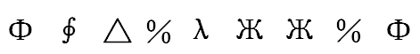

- **A**. 

- **B**. 

- **C**. 

　✅
- **D**. 

**答案**：C

**官方解析**

第一步：分析题干符号间关系。
从相同符号的位置入手：位置4、8的符号相同；位置6、7的符号相同。
第二步：判断选项符号间关系。
A项：相同位置与题干一致，但位置3、5的符号相同，与题干不一致，排除；
B项：相同位置与题干一致，但位置2、6、7的符号相同，与题干不一致，排除；
C项：位置4、8的符号相同，位置6、7的符号相同，与题干一致，当选；
D项：位置6、7的符号不相同，与题干不一致，排除。
故正确答案为C。

---

### 第 13 题　qid 2367791 · 图形推理

从四个图中选出唯一的一项，填入问号处，使其呈现一定的规律性:

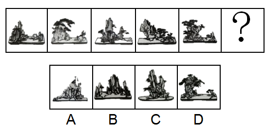 

- **A**. A
- **B**. B
- **C**. C
- **D**. D　✅

**答案**：D

**官方解析**

本题考查图形的实际意义，寻找最大共同点。观察发现，题干每一幅图形，左边的部分均高于右边的部分，只有D项符合。
故正确答案为D。

---

### 第 14 题　qid 2367794 · 图形推理

从四个图中选出唯一的一项，填入问号处，使其呈现一定的规律性:

- **A**. A
- **B**. B
- **C**. C　✅
- **D**. D

**答案**：C

**官方解析**

元素组成不同，且无明显属性规律，优先考虑数量规律。观察发现，题干图形中的线条较多，并且均为横线和竖线，考虑数横线和竖线。横线数依次为：1、4、2、3、2，竖线数依次为1、4、2、3、2，即横线和竖线的数量相等，排除D项；再观察图形，发现题干图形都是有1个面，排除A、B项，符合此规律的只有C项。
故正确答案为C。

---

### 第 15 题　qid 2367799 · 图形推理

从四个图中选出唯一的一项，填入问号处，使其呈现一定的规律性:

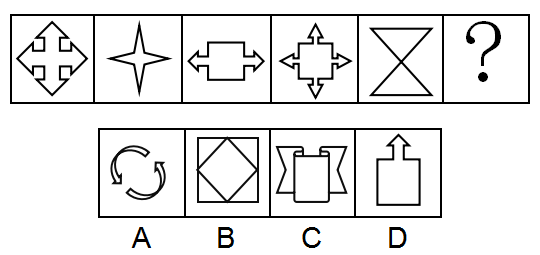 

- **A**. A
- **B**. B　✅
- **C**. C
- **D**. D

**答案**：B

**官方解析**

元素组成不同，优先考虑属性规律。观察发现，题干出现了箭头、等腰三角形等特征图，考虑对称性。观察发现，题干每幅图形既是轴对称又是中心对称图形。四个选项中，A项仅为中心对称图形，C、D项仅为轴对称图形，只有B项既是轴对称图形又是中心对称图形。
故正确答案为B。

---

### 第 16 题　qid 2367801 · 图形推理

从四个图中选出唯一的一项，填入问号处，使其呈现一定的规律性:

- **A**. A
- **B**. B
- **C**. C　✅
- **D**. D

**答案**：C

**官方解析**

题干给出的图形均为四个正方体构成的立体图形，且每幅图的四个正方体均为同样的排列形式，即题干每幅图的立体图形都相同，只是每幅图立体图形的位置发生了旋转。据此规律，只有C项跟题干立体图形是同样的排列形式。
故正确答案为C。

---

### 第 17 题　qid 2367804 · 图形推理

选项四个图形中，只有一个是由题干的四个图形拼合（只能通过上、下、左、右）而成的，请把它找出来。

- **A**. A
- **B**. B　✅
- **C**. C
- **D**. D

**答案**：B

**官方解析**

本题考查平面拼合，可采用平行且等长相消的方式解题。消去平行且等长的线段后进行组合即可得到轮廓图，即为B项。平行且等长相消的方式如下图所示：  故正确答案为B。

---

### 第 18 题　qid 2367807 · 图形推理

选项四个图形中，只有一个是由题干的四个图形拼合（只能通过上、下、左、右）而成的，请把它找出来。

 

- **A**. A
- **B**. B　✅
- **C**. C
- **D**. D

**答案**：B

**官方解析**

本题考查平面拼合，可采用平行且等长相消的方式解题。消去平行且等长的线段后进行组合即可得到轮廓图，即为B项。平行且等长相消的方式如下图所示： 故正确答案为B。

---

### 第 19 题　qid 2367808 · 图形推理

选项四个图形中，只有一个是由题干的四个图形拼合（只能通过上、下、左、右平移）而成的，请把它找出来。

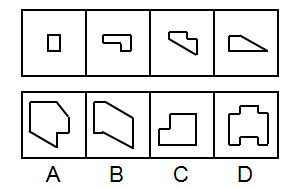

- **A**. A
- **B**. B
- **C**. C
- **D**. D　✅

**答案**：D

**官方解析**

本题考查平面拼合，可采用平行且等长相消的方式解题。消去平行且等长的线段后进行组合即可得到轮廓图，即为D项。平行且等长相消的方式如下图所示：

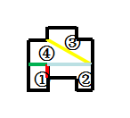

故正确答案为D。

---

### 第 20 题　qid 2367811 · 图形推理

选项四个图形中，只有一个是由题干的四个图形拼合（只能通过上、下、左、右）而成的，请把它找出来。

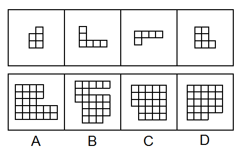

- **A**. A
- **B**. B　✅
- **C**. C
- **D**. D

**答案**：B

**官方解析**

本题考查俄罗斯方块平面拼合。从方块最多的图形入手，贴边代入选项。在题干的4个图形中，图④的方块最多，将它贴边代入各个选项中，只有B项能够把所有图形都代入进去，拼合方式如下图所示。

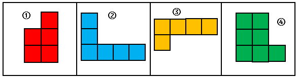

故正确答案为B。

---

### 第 21 题　qid 2367812 · 图形推理

左边给定的是纸盒外表面的展开图，右边哪一项能由它折叠而成？请把它找出来。

- **A**. A
- **B**. B　✅
- **C**. C
- **D**. D

**答案**：B

**官方解析**

将题干展开图中的面依次标注为面a、b、c、d，如下图所示：

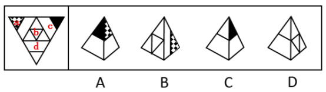

A项：该项由面a和面c构成，选项面c的右侧是面a，而在展开图中面c的右侧是面d，选项与题干展开图不一致，排除；

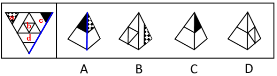

B项：由面a和面b构成，与题干展开图一致，当选；

C项：该项由面c和面d构成，选项面c的左侧是面d，而展开图中面c的左侧是面a，选项与题干展开图不一致，排除；

D项：该项由面b和面d构成，选项面d中的短线与面b中的三角形有交点，而展开图中无交点，选项与题干展开图不一致，排除。

故正确答案为B。

---

### 第 22 题　qid 2367814 · 图形推理

左边给定的是纸盒外表面的展开图，右边哪一项能由它折叠而成？请把它找出来。

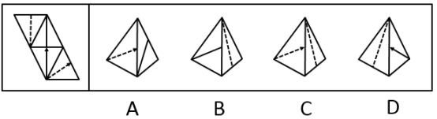

- **A**. A　✅
- **B**. B
- **C**. C
- **D**. D

**答案**：A

**官方解析**

将题干展开图中的面依次标注为面a、b、c、d，如下图所示：

A项：与题干一致，当选；

B项：该项由面a和面b组成，在展开图中面b中的直线不垂直于面a和面b的公共边，而选项面b中的直线垂直于面a和面b的公共边，选项与题干不一致，排除；

C项：该项由面a和面d组成，在展开图中面d中的箭头指向的是面b，而选项中面d的箭头指向的是面a，选项与题干不一致，排除；

D项：该项由面a和面c组成，在展开图中面c中的箭头指向面b，而选项中面c中的箭头指向的是面a，选项与题干不一致，排除。

故正确答案为A。

---

### 第 23 题　qid 2367795 · 图形推理

左边给定的是纸盒外表面的展开图，右边哪一项能由它折叠而成？请把它找出来。

- **A**. A
- **B**. B　✅
- **C**. C
- **D**. D

**答案**：B

**官方解析**

将原展开图标上序号，逐一分析。

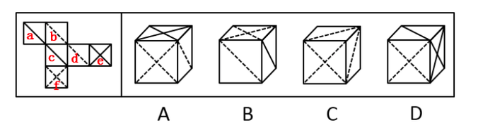

A项：该项必然存在面e和面f，由于面f和面b是相对面，故右侧面只能是面d，以面d和面e的公共边为唯一边，对面d进行顺时针画边，如下图所示，选项中边4对应的是面f，而在展开图中边4对应的是面b，故选项与题干不一致，排除；

B项：与题干一致，当选；

C项：该项由面f、面b、面d组成，面f和面b是相对面，在选项中不可能同时存在，排除；

D项：该项必然存在面e和面f，由于面e和面c是相对面，故顶面只能是面a，以面a和面f的公共边为唯一边（如下图所示），对面f进行顺时针画边，选项中边2对应的是面e，而展开图中边2对应的是面c，故选项与展开图不一致，排除。

故正确答案为B。

---

### 第 24 题　qid 2367800 · 图形推理

左边给定的是纸盒外表面的展开图，右边哪一项能由它折叠而成？请把它找出来。

- **A**. A
- **B**. B　✅
- **C**. C
- **D**. D

**答案**：B

**官方解析**

将原展开图标上序号，逐一分析。

A项：该项出现面a、面e和面c，在展开图中面a和面c的公共边与面a的黑色直角边重合（如下图），而选项中面a和面c的公共边不与面a的黑色直角边重合，选项与题干不一致，排除；

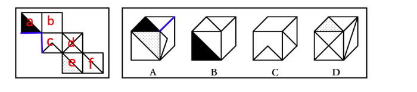

B项：与题干一致，当选；

C项：该项由面c、面b和面f组成，在展开图中面c和面f是相对面，不能同时出现，选项与题干不一致，排除；

D项：该项出现面e、面d、面f，选项中面e与面d公共边与面e中阴影三角形的直角边重合（如下图），而展开图中没有重合，选项与题干不一致，排除。

故正确答案为B。

---

### 第 25 题　qid 2367815 · 图形推理

从所给的四个选项中，选择最合适的一个填入问号处，使之呈现一定的规律性。

- **A**. A　✅
- **B**. B
- **C**. C
- **D**. D

**答案**：A

**官方解析**

元素组成不同，优先考虑属性规律。九宫格优先按横行看，第一行图形均由直线构成，第二行图形均由曲线构成，第三行图形均由直线和曲线构成，因此“？”处图形应由直线和曲线构成，只有A项符合。
故正确答案为A。

---

### 第 26 题　qid 2367819 · 图形推理

从所给的四个选项中，选择最合适的一个填入问号处，使之呈现一定的规律性。

- **A**. A
- **B**. B
- **C**. C
- **D**. D　✅

**答案**：D

**官方解析**

本题考查图形的实际意义，寻找最大共同点。观察发现，题干所有图形都是枝干弯曲的一枝花，九宫格优先按横行来看，从第一行到二行，花枝朝向依次为右、左、右，左、右、左，规律为左右交替出现，第三行前两个图花枝朝向为右、左，因此“？”处花枝朝向应为右，A、C项花枝朝向为左，B项花枝干是直的，只有D项满足题干图形特征。
故正确答案为D。

---

### 第 27 题　qid 2367822 · 图形推理

左图为给定的立体，从任意角度剖开，右边哪一项不可能是它的截面图？

- **A**. A
- **B**. B
- **C**. C
- **D**. D　✅

**答案**：D

**官方解析**

本题考查截面图，逐一分析选项。

如下图所示，A、B、C三项均可截出，D项无法截出，因为竖着切中间的空的，所以D项左右两侧中间是看不到竖线的。

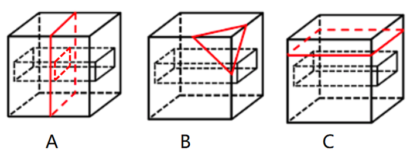

本题为选非题，故正确答案为D。

---

### 第 28 题　qid 2367831 · 逻辑判断

没有人民支持和参与，任何改革都不可能取得成功。只有充分尊重人民意愿，形成广泛共识，人民才会积极支持改革、踊跃投身改革。要坚持人民主体地位，发挥群众首创精神，紧紧依靠人民推动改革开放。
根据以上陈述，可以得出以下哪项？

- **A**. 只有人民支持和参与，改革才可能取得成功　✅
- **B**. 只有坚持人民主体地位，才能发挥群众首创精神
- **C**. 如果人民踊跃投身改革，则说明形成了广泛共识
- **D**. 如果没有充分尊重人民意愿，人民就不会积极支持改革

**答案**：A

**官方解析**

第一步：翻译题干。

① 改革取得成功人民支持和参与；

② 人民积极支持改革且踊跃投身改革充分尊重人民意愿且形成广泛共识。

第二步：逐一分析选项。

A项：翻译为改革可能取得成功人民支持和参与，肯前必肯后，根据条件①可以推出，当选；

B项：题干中人民主体地位和群众首创精神，无明显推出关系，无法翻译，排除；

C项：翻译为人民踊跃投身改革形成广泛共识，只肯定了条件②前件中的一个条件，无法推出后件，排除；

D项：翻译为没有充分尊重人民意愿不会积极支持改革，可逆否等价为：积极支持改革充分尊重人民意愿，只肯定了条件②前件中的一个条件，无法推出后件，排除。

故正确答案为A。

---

### 第 29 题　qid 2367843 · 逻辑判断

食品安全已成为现代社会关注的热点问题。今年针对某市的一项社会调查显示，的受访者在吃的方面有安全感，的受访者没有安全感，而去年相应的调查数据分别是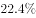和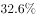。调查人员由此断言，今年该市公众对食品的安全感有所提高，食品安全的总体状况好于上年。

以下哪项如果为真，最能质疑上述调查结论？

- **A**. 今年有些受访者没有表达自己对食品安全的态度
- **B**. 今年该市政府加大了对食品安全工作的管理力度
- **C**. 该市媒体今年报道了多起假奶粉等食品安全事件
- **D**. 今年的社会调查中增加了不少餐饮经营者的样本　✅

**答案**：D

**官方解析**

第一步:找出论点和论据。

论点:今年该市公众对食品的安全感有所提高，食品安全的总体状况好于去年。

论据:今年的受访者在吃的方面有安全感，的受访者没有安全感，而去年相应的调查数据分别是和。

本题通过对今年和去年受访者对食品有无安全感的数据对比，得出今年该市公众对食品的安全感有所提高，食品安全的总体状况好于上年。论据是一组对比实验，可以通过指出两组对比对象情况不一致进行削弱，即说明今年和去年的受访者存在不同。

第二步:逐一分析选项。

A项：有些受访者没有表达自己的态度，并不能质疑论据中表达态度的受访者数据的真实性，无法削弱，排除；

B项：该市政府加大了食品安全的管理力度，解释了今年食品安全度上升的原因，属加强项，无法削弱，排除；

C项：今年该市媒体报道了多起假奶粉事件，与今年食品安全的总体状况无关，无关项，排除；

D项：今年受访样本中增加了不少餐饮经营者，而餐饮经营者会更加偏向于认定食品是安全的，那么由此得出的数据高于去年显然不能得出食品安全的总体状况，属于拆桥，可以削弱，当选。

故正确答案为D。

---

### 第 30 题　qid 2367858 · 逻辑判断

并不是所有的老年人都适合参与投资活动，绝大多数的投资品种都要求投资人具有丰富的专业知识，但多数老年人在这方面有所欠缺，以至于只能听任一些骗子的忽悠。相比股市、基金等证券类投资，老年人投资艺术品更容易上当。如果没有足够的鉴别能力，他们就会受骗，被骗了心里还想着遇到了“捡漏”的美事。
根据以上陈述，可以得出以下哪项？

- **A**. 有些老年人专业知识丰富，适合参与投资活动
- **B**. 有些老年人没有足够的鉴别能力，但也会遇到“捡漏”的美事
- **C**. 有些老年人如果不想上当受骗，就要有足够的鉴别能力　✅
- **D**. 老年人不适合参与投资活动，无论是股市、基金还是艺术品投资

**答案**：C

**官方解析**

日常结论题，根据题干信息逐一分析选项。

A项：根据题干第一句话可知，有的老年人不适合参与投资活动，投资需要有丰富的专业知识，多数老年人缺少丰富的专业知识，因此无法推出有些专业知识丰富的老年人适合参与投资活动，排除；

B项：题干中最后一句只是强调被骗了心里还想着“捡漏”的美事，没有提及是否会遇到“捡漏”的美事，无中生有，排除；

C项：翻译为有些老年人受骗有足够的鉴别能力，题干中最后一句话可以翻译为：足够的鉴别能力受骗，可逆否等价为：受骗有足够的鉴别能力，“所有可以推出有的”，故根据题干可以推出，当选；

D项：根据题干第一句话可知，有的老年人不适合参与投资活动，而D选项的说法过于绝对，排除。

故正确答案为C。

---

### 第 31 题　qid 2367860 · 逻辑判断

智能手机流行的时代，我们每天发送信息，也收到信息。人际之间的电子信息交往已成为当今时代一种独特的交往方式。在面对重要的人或关系时，很多人往往发出信息后就期待被秒回，如果没有被秒回，他们就产生一种怀疑感或被弃感，从而陷入深深的烦恼和焦虑之中。
以下哪项最可能是他们陷入深深烦恼和焦虑所需的假设？

- **A**. 当前技术已能实现智能手机的即时通信，方便快捷，且基本免费　✅
- **B**. 有些聊天软件能在发送者手机中反馈信息接收者是否阅读了信息
- **C**. 有些人工作很忙，总习惯在忙完一天工作后才统一处理相关信息
- **D**. 有些人一天收到的信息太多，容易遗漏某人期待秒回的重要信息

**答案**：A

**官方解析**

第一步：找出论点和论据。

论点：在面对重要的人或关系时，很多人往往发出信息后就期待被秒回，如果没有被秒回，他们就产生一种怀疑感或被遗弃感，从而陷入深深的烦恼和焦虑之中。

论据：无。

本题无论据，只能通过补充论据进行加强。提问方式是假设类，优先考虑补充必要条件，即没有这个选项，论点则无法成立。

第二步：逐一分析选项。

A项：如果智能手机不能即时通信，那么发出的信息就无法被即时接收，发出者就不会期待秒回，因此A项是信息能够被秒回的必要条件，当选；

B项：有些聊天软件能在发送者手机中反馈信息接收者是否阅读了信息，可以解释部分发出者为什么没有被秒回就会产生怀疑感或被弃感，但是力度较弱，且不是论点成立的必要条件，排除；

C项：接收者什么时候阅读信息与发出者没被秒回就会产生烦恼和焦虑无关，排除； 

D项：接收者是否遗漏了重要信息与发出者没被秒回就会产生烦恼和焦虑无关，排除。

故正确答案为A。

附：通过查证原文，本题答案为A项。

---

### 第 32 题　qid 2367861 · 逻辑判断

某区对所辖钟山、长江、梅园、星海4个街道进行抽样调查，并按照人均收入为其排序。有人根据以往经验对4个街道的人均收入排序作出如下预测：
（1）如果钟山街道排第三，那么梅园街道排第一；
（2）如果长江街道既不排第一也不排第二，那么钟山街道排第三；
（3）钟山街道排序与梅园街道相邻，但与长江街道不相邻。
事后得知，上述预测符合调查结果。
根据以上信息，可以得出以下哪项？

- **A**. 钟山街道不排第一就排第四　✅
- **B**. 长江街道不排第二就排第三
- **C**. 梅园街道不排第二就排第四
- **D**. 星海街道不排第一就排第三

**答案**：A

**官方解析**

第一步：分析题干条件。

① 钟山第三梅园第一；

② 长江第一 且 第二钟山第三；

③ 钟山与梅园相邻，与长江不相邻。

第二步：根据题干条件进行推理。

钟山出现次数最多，为最大信息，可作为突破口。根据③可知：钟山与梅园相邻，结合①可知：钟山第三梅园第一，故钟山不能排名第三。钟山第三是对②的否后，否后必否前，故长江排名第一或者第二。

如果长江排第一，根据③可知钟山只能排第四，故梅园排第三，星海排第二，排除B、C、D项，只有A项成立；

如果长江排第二，根据③可知钟山只能排第四，故梅园排第三，星海排第一，A项依然成立。

故正确答案为A。

---

### 第 33 题　qid 2368009 · 逻辑判断

我国家长们对儿童阅读越来越重视，大多数家长希望孩子多读书读好书。2018年，某市的家庭有父母陪孩子读书的习惯，亲子阅读的图书量比2017年提高了1.8个百分点，时长也比去年有所增加。但是，2018年该市的儿童人均图书阅读量仅为4.72本，比2017年还下降了0.6个百分点。

以下哪项如果为真，最能解释上述现象？

- **A**. 近年来孩子课业负担较重，对课外阅读很多人是“心有余而时不足”
- **B**. 在亲子阅读中很多孩子习惯“听书”，这种情况2018年未计算在内　✅
- **C**. 大多数80后、90后家长都受过高等教育，比较看重亲子阅读的意义
- **D**. 孩子在手机、电脑上的电子阅读一直未纳入儿童图书阅读的考虑范围

**答案**：B

**官方解析**

第一步：找出题干矛盾。
2018年，某市亲子阅读的图书量比2017年提高了1.8个百分点，时长也比去年有所增加。但2018年该市的儿童人均图书阅读量比2017年还下降了0.6个百分点。
第二步：逐一分析选项。
A项：孩子课业负担较重，对课外阅读很多人是“心有余而时不足”，提及了儿童阅读量不高，但是并没有涉及亲子阅读的影响，不能解释题干矛盾，排除；
B项：在亲子阅读中很多孩子习惯“听书”，这种情况未计算在图书阅读量内，既提及了亲子阅读，又涉及了读书量计算的方式，能够解释为什么2018年亲子阅读量增加而儿童阅读量并没有增加的情况，可以解释题干矛盾，当选；
C项：大多数80后、90后家长比较看重亲子阅读的意义，提及了亲子阅读的图书量可能更多，但并没有涉及儿童的人均读书量为何下降，不能解释题干矛盾，排除；
D项：孩子在手机、电脑上的电子阅读一直未纳入儿童图书阅读的考虑范围，没有涉及亲子阅读的影响，而且选项说的是一直，也就是说2017年和2018年均未考虑在内，不能解释题干矛盾，排除。
故正确答案为B。

---

### 第 34 题　qid 2367863 · 逻辑判断

某县新一届党政领导班子刚组建完成，一心想为群众做一些实事。面对有限的财力，新一届领导班子明确表示，今年只能完成两件大事。对于众多排进公共政策议程的大事，他们认为：如果建一条乡村公路，则不能建污水处理厂；如果建污水处理厂，则要建排污管道；如果建排污管道，则不能建垃圾处理厂。
按照这届领导班子的想法，以下哪项不可能是他们今年同时要建设的？

- **A**. 乡村公路、排污管道
- **B**. 乡村公路、垃圾处理厂
- **C**. 污水处理厂、排污管道
- **D**. 污水处理厂、垃圾处理厂　✅

**答案**：D

**官方解析**

第一步：翻译题干。

①  建公路建污水处理厂；

②  建污水处理厂建排污管道；

③  建排污管道建垃圾处理厂；

将③和②可以递推出：④ 建污水处理厂建排污管道建垃圾处理厂；

⑤  只能完成两件大事。

第二步：逐一分析选项。

A项：若建公路和排污管道，根据①得到不建污水处理厂，根据③得到不建垃圾处理厂，此时完成两件大事，与题干已知条件不矛盾，可以推出，排除；

B项：若建公路和垃圾处理厂，根据①得到不建污水处理厂，根据④得到不建排污管道以及不建污水处理厂，此时完成两件大事，与题干已知条件不矛盾，可以推出，排除；

C项：若建污水处理厂和排污管道，根据①的否后必否前，得到不建公路，根据④得到不建垃圾处理厂，此时完成两件大事，与题干已知条件不矛盾，可以推出，排除；

D项：根据④可知，建污水处理厂建垃圾处理厂，故不可能同时建污水处理厂和垃圾处理厂，不能推出，当选。

本题为选非题，故正确答案为D。

---

### 第 35 题　qid 2367896 · 逻辑判断

科幻小说《三体》中提出的“黑暗森林理论”告诉我们，人类千万不能向宇宙透露我们地球的位置，否则就会被外星文明毁灭。但是，早在《三体》出版之前的1974年，人类就向距离地球超过2.2万光年的武仙座星团发送了一段无线电信号，以光速主动向宇宙宣告了自身的存在。这个编号为M13的武仙座星团拥有数十万颗恒星。科学家认为，恒星周围一般会伴有行星，但恒星上不可能存在生命体，行星上却可能有。深信黑暗森林理论的人不禁为人类这一鲁莽举动感到担心，认为人类的美好期望有可能会迎来残酷的现实。
以下哪项如果为真，最能说明这种担心是不必要的？

- **A**. 迄今为止人类并没有发现任何外星生命存在的迹象
- **B**. 类地行星也并不罕见，平均每5颗恒星就拥有1颗
- **C**. 恒星密集分布的武仙座星团内不存在任何行星系统　✅
- **D**. 即使武仙座星团文明收到信号也要在2.2万年以后

**答案**：C

**官方解析**

第一步：找出论点和论据。
论点：人类的美好期望有可能会迎来残酷的现实。
论据：科幻小说《三体》中提出的“黑暗森林理论”告诉我们，人类千万不能向宇宙透露我们地球的位置，否则就会被外星文明毁灭。但是，早在《三体》出版之前的1974年，人类就向距离地球超过2.2万光年的武仙座星团发送了一段无线电信号，以光速主动向宇宙宣告了自身的存在。这个编号为M13的武仙座星团拥有数十万颗恒星。科学家认为，恒星周围一般会伴有行星，但恒星上不可能存在生命体，行星上却可能有。
文段较长而且问法比较特殊，问“说明这种担心是不必要的”可以理解成是削弱题，论点是担心人类未来，论据是这种担心产生的依据，论点是对未来的预测，可优先考虑削弱论据。
第二步：逐一分析选项。
A项：指出迄今为止还没有发现任何外星生命存在的迹象，但是没有发现不代表以后不存在，属于不明确选项，无法削弱，排除；
B项：指出类地行星不罕见，而行星上可能存在生命体，意味着存在其他生命体的可能性增加，人类会因此而担心，具有加强作用，排除；
C项：指出武仙座星团不存在任何行星系统，也就是说不会存在生命体，就不会给人类带来危害，削弱论据，可以削弱，当选； 
D项：指出武仙星团接收到信号的时间会在2.2万年以后，之后是否会给地球上的人类带来危害，不得而知，属于不明确选项，无法削弱，排除。
故正确答案为C。

---

### 第 36 题　qid 2367802 · 定义判断

公众充权：指在公共政策的制定、执行、评估、监督过程中，公众积极参与，充分表达自己的利益主张，以推动公共政策过程的民主化与科学化。
下列属于公众充权的是

- **A**. 清明节到来前夕，一些社会人士在市文明办支持下创建了文明祭扫网站，号召民众祭扫时不放鞭炮，不烧纸钱，改用虚拟鲜花、电子蜡烛等绿色环保的方式
- **B**. 快递小哥小李当选市人大代表后，在广泛走访充分调研的基础上，提交了一份关于如何保障快递员权益、促进快递行业健康发展的议案
- **C**. 某市将要召开天然气价格调整听证会，有关部门要求辖区各街道、居委会搞好宣传动员工作，按照下达名额推举市民代表，确保公开公平公正
- **D**. 在某县未来五年发展规划制定过程中，县委、县政府通过召开居民座谈会、专家听证会等形式，征求到了许多宝贵的意见　✅

**答案**：D

**官方解析**

第一步：找出定义关键词。
“在公共政策的制定、执行、评估、监督过程中”、“公众积极参与，充分表达自己的利益主张”、“推动公共政策过程的民主化与科学化”。
第二步：逐一分析选项。
A项：创建文明祭扫网站，号召改用绿色环保的方式，不符合“在公共政策的制定、执行、评估、监督过程中”，不符合定义，排除；
B项：提交议案，不符合“在公共政策的制定、执行、评估、监督过程中”，不符合定义，排除；
C项：召开天然气价格调整听证会可以理解为“在公共政策的制定、执行、评估、监督过程中”，但按照下达名额推举市民代表，不符合“公众积极参与，充分表达自己的利益主张”，不符合定义，排除；
D项：在某县未来五年发展规划制定过程中，符合“在公共政策的制定、执行、评估、监督过程中”，通过召开居民座谈会、专家听证会等形式，征求到了许多宝贵的意见，符合“公众积极参与，充分表达自己的利益主张”，符合定义，当选。
故正确答案为D。

---

### 第 37 题　qid 2367806 · 定义判断

危机公关：指政府部门、社会团体或企业面对可能造成严重后果的突发事件时，有组织、有计划地采取各种应对措施，避免损害或者降低损害程度，以期获得公众谅解的管理活动。
下列不属于危机公关的是：

- **A**. 某公司生产的多批次药品标注虚假生产日期的消息曝光后，公司领导立即在报纸、电视台向全国公众道歉，宣布召回这些批次的产品，承诺通过合适渠道赔偿受害者，迅速查清并如实公布事件真相，请社会各界人士监督
- **B**. 某地曝出高考答题卡被掉包的传闻后，当地政府部门迅速成立联合调查组，网上公布高考命题、监考、阅卷等环节的操作规范，并及时发布调查进展情况，公众情绪逐渐平复，最终查明这一传闻完全是谣言
- **C**. “某品牌火腿肠使用过期猪肉”的消息在网络上蔓延，公司迅速查实后道歉、召回、赔偿，并制定了详细整改措施，承诺绝不会再出现此类事件，媒体和消费者慢慢平静下来
- **D**. 某商场管理层吸取毗邻商场因电路老化引起火灾、损失惨重的教训，定期组织专业人员加强对线路安全的检查，及时更换老旧电线，并且张贴《规范用电须知》提醒商家，商家都非常配合，防火意识显著增强　✅

**答案**：D

**官方解析**

第一步：找出定义关键词。
“政府部门、社会团体或企业面对可能造成严重后果的突发事件时”、“有组织、有计划地采取各种应对措施，避免损害或者降低损害程度”、“以期获得公众谅解”。
第二步：逐一分析选项。
A项：某公司生产的多批次药品标注虚假生产日期的消息曝光后，符合“企业面对可能造成严重后果的突发事件时”，立即在报纸、电视台道歉，宣布召回产品，承诺赔偿受害者等，符合“有组织、有计划地采取各种应对措施，避免损害或者降低损害程度，以期获得公众谅解”，符合定义，排除；
B项：某地曝出高考答题卡被掉包的传闻后，符合“面对可能造成严重后果的突发事件时”，迅速成立联合调查组，网上公布操作规范，及时发布调查进展情况，查明这一传闻是谣言，符合“有组织、有计划地采取各种应对措施，避免损害或者降低损害程度，以期获得公众谅解”，符合定义，排除；
C项：“某品牌火腿肠使用过期猪肉”的消息在网络上蔓延，符合“面对可能造成严重后果的突发事件时”，迅速查实后道歉、召回、赔偿，并制定整改措施，符合“有组织、有计划地采取各种应对措施，避免损害或者降低损害程度，以期获得公众谅解”，符合定义，排除；
D项：某商场管理层吸取毗邻商场因电路老化引起火灾、损失惨重的教训，未体现“面对可能造成严重后果的突发事件时”，不符合定义，当选。
本题为选非题，故正确答案为D。

---

### 第 38 题　qid 2367810 · 定义判断

信息扶贫：指政府或社会群体借助信息技术手段来解决因信息闭塞而导致的经济、文化上的贫困问题。
下列属于信息扶贫的是

- **A**. 某物流公司联手互联网巨头在边远山区定向从贫困户中招聘一批快递员，经过专业培训之后上岗，帮他们走上了脱贫致富的道路
- **B**. 某手机生产厂家面向农村市场，推出了一款低成本、易操作、大屏幕、待机时间长的时尚智能手机，村民们纷纷换掉了原来的旧手机
- **C**. 省城某重点中学建立网络课堂，向某贫困县的中学进行远程同步直播，使两地师生共享优质教学资源。几年来，该县考上重点大学的人数明显增多　✅
- **D**. 毕业返乡的小周带着几个同学开了家网店，在网上销售自家种植的红枣，销量逐步上升，日子越来越红火

**答案**：C

**官方解析**

第一步：找出定义关键词。
“政府或社会群体借助信息技术手段”、“解决因信息闭塞而导致的经济、文化上的贫困问题”。
第二步：逐一分析选项。
A项：招聘快递员，经过专业培训之后上岗，未体现“借助信息技术手段”，不符合定义，排除；
B项：某手机生产厂家面向农村市场推出时尚智能手机，未体现“解决贫困问题”，也未体现“借助信息技术手段”，不符合定义，排除；
C项：建立网络课堂，进行远程同步直播，符合“借助信息技术手段”，共享优质教学资源，该县考上重点大学的人数明显增多，符合“解决因信息闭塞而导致的文化上的贫困问题”，符合定义，当选；
D项：开网店可以理解为“信息技术手段”，但未体现“解决因信息闭塞而导致的经济、文化上的贫困问题”，不符合定义，排除。
故正确答案为C。

---

### 第 39 题　qid 2367816 · 定义判断

社会性处罚：指存在失信行为的人员所受到的与自身失信行为没有直接关联的来自其他部门的限制和处罚。
下列属于社会性处罚的是

- **A**. 以“站不起来”为理由强占他人座位的高铁“霸座男”，当场受到了乘警的严肃批评，下车后被移送公安机关接受治安处罚。这一事件曝光后，当事人的恶劣行为又遭到了全国网民的一致谴责
- **B**. 由于数据造假，某教授在国际期刊上发表的论文被撤稿。在网民的谴责声中，该教授又被撤销了基于该论文所获得的绩效奖励、省部级科研项目、荣誉称号、社会兼职
- **C**. 春节前夕，恶意拖欠农民工工资的部分包工头，被有关部门和各种媒体曝光，引起社会各界密切关注。根据银行、保险、铁路等部门的规定，这些违规者申请信用卡、购买保险以及动车和高铁票时都将受到限制　✅
- **D**. 长江沿岸的一家化工企业，多次不顾禁令向长江偷偷排污，最近被省有关部门通报批评，吊销了企业生产执照，它的上级主管部门及主要负责人也都受到了严厉的处罚

**答案**：C

**官方解析**

第一步：找出定义关键词。
“存在失信行为的人员”、“所受到的与自身失信行为没有直接关联的来自其他部门的限制和处罚”。
第二步：逐一分析选项。
A项：以“站不起来”为理由强占他人座位的高铁“霸座男”，符合“存在失信行为的人员”，当场受到了乘警的严肃批评，被移送公安机关接受治安处罚，这是与自身失信行为有直接关联的限制和处罚，不符合“所受到的与自身失信行为没有直接关联的来自其他部门的限制和处罚”，不符合定义，排除；
B项：某教授数据造假，符合“存在失信行为的人员”，论文被撤稿，撤销了基于该论文所获得的绩效奖励、省部级科研项目、荣誉称号、社会兼职，均是与自身失信行为有直接关联的处罚，不符合“所受到的与自身失信行为没有直接关联的来自其他部门的限制和处罚”，不符合定义，排除；
C项：恶意拖欠农民工工资的包工头，符合“存在失信行为的人员”，申请信用卡、购买保险以及动车和高铁票时都将受到限制，符合“所受到的与自身失信行为没有直接关联的来自其他部门的限制和处罚”，符合定义，当选；
D项：长江沿岸的一家化工企业，多次不顾禁令向长江偷偷排污，不符合“存在失信行为的人员”，不符合定义，排除。
故正确答案为C。

---

### 第 40 题　qid 2367818 · 定义判断

隐形植入：指通过周边信息、符号体系等不易察觉的形式，使受众在不知不觉中受到影响的宣传策略。
下列属于隐形植入的是：

- **A**. 在某电视剧中，所有角色均使用同一品牌的手机，并使用这个品牌的经典铃声　✅
- **B**. 城运会到来之前，商家把印有城运会会徽的各类文化创意产品陆续摆上了柜台
- **C**. 在某市博物馆馆标设计征集中，8号方案以浓郁的地域文化元素受到了评委的关注
- **D**. 结婚纪念日快到了，为了提醒粗心又忙碌的丈夫，小李偷偷把他的手机屏保换成了婚纱照

**答案**：A

**官方解析**

第一步：找出定义关键词。
“不易察觉的形式”、“不知不觉受到影响”、“宣传策略”。
第二步：逐一分析选项。
A项：在电视剧中使用同一品牌手机，用该品牌经典铃声符合“不易察觉的形式”，“不知不觉受到影响”，也是“宣传策略”，符合定义，当选；
B项：印有城运会会徽，不符合“不易察觉的形式”，不符合定义，排除；
C项：馆标设计受到评委关注，不属于“宣传策略”，不符合定义，排除；
D项：小李提醒丈夫结婚纪念日，把丈夫手机屏保换成婚纱照，符合“不易察觉的形式”，但不属于“宣传策略”，不符合定义，排除。
故正确答案为A。

---

### 第 41 题　qid 2367821 · 定义判断

情感性劳动：指服务业员工在与顾客面对面交往时，将个人情感融入工作过程，对顾客、企业以及服务人员自己产生积极影响的行为。
下列属于情感性劳动的是：

- **A**. 某航空公司空姐站在登机口两旁欢迎乘客，时不时还会微笑着摸摸小孩的头　✅
- **B**. 小刘总是面带微笑、语气亲切热情地接打电话，连续多年被评为最美接线员
- **C**. 某酒店智能客服“小青”善解人意，语音甜美，入住的客人都喜欢和她互动
- **D**. 小秦在信访局工作多年，每次接待来访者，都非常耐心，细致了解具体情况

**答案**：A

**官方解析**

第一步：找出定义关键词。
“服务业员工”、“顾客”、“面对面”、“个人感情”、“对顾客、企业及自己产生积极影响”。
第二步：逐一分析选项。
A项：空姐属于“服务业员工”，站在登机口欢迎属于“面对面”，微笑摸摸小孩的头符合“个人感情”，符合定义，当选；
B项：接打电话不符合“面对面”，不符合定义，排除；
C项：小青是智能客服，不符合“个人情感”，不符合定义，排除；
D项：小秦耐心、细致了解只体现工作负责，未体现“个人感情”，不符合定义，排除。
故正确答案为A。

---

### 第 42 题　qid 2367823 · 定义判断

大数据“杀熟”：指商家在提供相同的商品或服务时，根据大数据的甄别结果，对有多次消费记录或消费能力较高的客户，以偏高标准收费的销售策略。
下列属于大数据“杀熟”的是：

- **A**. 小李负责单位的接待工作，经常要预约商务车接送。后来只要他打车，网约平台就直接推送高价的商务车，无奈之下小李只好注册一个新号供自己日常出行
- **B**. 经常在网上预订酒店的老张在预订某酒店的单人间时，价格一直为380元。他的侄子暑假来看望他，也在网上预定了该酒店同样的房间，价格却便宜四分之一　✅
- **C**. 位于市中心金融服务区的某超市由于环境优越，客户购买力强，某品牌饮料在这里售价高达15元，而这种饮料在居民小区便利店只需要10元
- **D**. 某购物网站推出新用户推广活动，每位新注册用户都可免费获赠抵用券，算下来买同样的商品新会员比老会员还要便宜好多，这让老会员们郁闷不已

**答案**：B

**官方解析**

第一步：找出定义关键词。
“相同的产品或服务”、“大数据甄别结果”、“多次消费记录或消费能力较高的顾客”、“偏高标准收费”。
第二步：逐一分析选项。
A项：小李经常预约商务车，符合“多次消费记录或消费能力较高的顾客”，但单位的接送服务和日常的出行服务不属于“相同的产品或服务”，也未体现对相同的产品有偏高的收费，不符合“偏高标准收费”，不符合定义，排除；
B项：老张经常在网上预订酒店符合“多次消费记录或消费能力较高的顾客”，在网上预订符合“大数据”，侄子预订该酒店同样的房间符合“相同的产品或服务”，老张380元，侄子价格便宜了四分之一符合“偏高标准收费”，符合定义，当选；
C项：金融服务区同品牌饮料比居民小区便利店高，符合“相同的产品或服务”、“偏高标准收费”，但不符合“大数据甄别结果”，不符合定义，排除；
D项：新用户买同样商品比老用户便宜符合“相同的产品或服务”，但不属于针对“多次消费记录或消费能力较高的顾客”，是因为为了推广而赠送抵用券所以便宜，不符合定义，排除。
故正确答案为B。

---

### 第 43 题　qid 2367826 · 定义判断

语码转换：指说话人在同一对话过程中使用多种语言或方言进行交流的现象。
下列不属于语码转换的是：

- **A**. 约翰先生在中国生活多年，与单位同事交谈时总是坚持用汉语，有时实在不知道怎样准确表达自己的意思，也会夹杂三两个英语单词
- **B**. 马经理接待来访客户，用普通话向他们介绍了自己公司的情况。得知客户中有两位陕西老乡后，当即操起陕西话与他们攀谈了几句
- **C**. 在一次国际学术会议上，陈教授用英语作报告时带了一股浓浓的四川口音，参加会议的大多数外国学者几乎都没有听懂他的发言　✅
- **D**. 来到留学生宿舍后，班主任方老师询问了他们的日常生活情况，当他发现一个学生流露出不解的神情时，立刻又用英语解释了一番

**答案**：C

**官方解析**

第一步：找出定义关键词。
“同一对话过程”、“多种语言或方言”。
第二步：逐一分析选项。
A项：约翰和同事交谈坚持用汉语，夹杂两三个英语单词，符合“同一对话过程”，英语和汉语两种语言符合“多种语言或方言”，符合定义，排除；
B项：马经理接待客户符合“同一对话过程”，普通话、陕西话符合“多种语言或方言”，符合定义，排除；
C项：陈教授作报告符合“同一对话过程”，四川口音的英语只有英语一种语言，不符合“多种语言或方言”，不符合定义，当选；
D项：方老师询问学生日常生活符合“同一对话过程”、用英语解释表明之前说的不是英语，符合“多种语言或方言”，符合定义，排除。
本题为选非题，故正确答案为C。

---

### 第 44 题　qid 2367829 · 定义判断

信息焦虑：指人们在过量信息包围下因为难以获取、处理、利用所需信息而产生的厌倦、烦躁、紧张等负面情绪。
下列属于信息焦虑的是

- **A**. 小敏热衷于娱乐八卦，她时刻关注微博更新，看到手机上的未读信息就忍不住想去点击，每天用于浏览信息的时间远远超过她自己的工作时间
- **B**. 在开发商那里登记过购房意向后，闵先生每天都会接到几十个乃至上百个电话和信息，卖房的、装修的、投资的、理财的、贷款的，让他不胜其烦
- **C**. 小谢沉迷于网络游戏，一玩就是一通宵，白天上课总是想着游戏，久而久之产生了严重的厌学情绪，精神状态萎靡不振，身体素质越来越差
- **D**. 小李在外文数据库查资料，每输入一个关键词就跳出几十篇相关论文，因英语欠佳，没法筛选，完全不知道哪些才是自己真正要用的，感觉精神马上就要崩溃了　✅

**答案**：D

**官方解析**

第一步：找出定义关键词。
“人们在过量信息包围下因为难以获取、处理、利用所需信息”、“而产生的厌倦、烦躁、紧张等负面情绪”。
第二步：逐一分析选项。
A项：每天用于浏览信息的时间远远超过她自己的工作时间，该选项没有体现出厌倦、烦躁、紧张等负面情绪，不符合定义，排除； 
B项：在开发商登记过购房意向后，接到几十个乃至上百个电话和信息，而这些信息大部分都是闵先生所不需要的，体现不出闵先生“难以获取、处理、利用所需信息”，不符合定义，排除；
C项：小谢沉迷于游戏，白天上课也总想着游戏，该选项没有体现出“过量的信息”，不符合定义，排除；
D项：小李查询资料，每输入一个关键词就跳出几十篇相关论文，因英语欠佳，没法筛选，不知道哪个是自己要用的，符合“人们在过量信息包围下因为难以获取、处理、利用所需信息”，感觉精神马上就要崩溃了，符合“产生的厌倦、烦躁、紧张等负面情绪”，符合定义，当选。
故正确答案为D。

---

### 第 45 题　qid 2367833 · 定义判断

不见面审批：指有关部门通过网络渠道接受、审核各种申请材料，并将批复结果及时通知申请人的公务处理方式。
下列不属于不见面审批的是

- **A**. 家住农村的小李在朋友指点下，按照当地社保网站的各项提示填好了个人的信息材料，当天就在村委会拿到了自己的社保证明
- **B**. 小赵向市长信箱发送电子邮件，举报一家企业向河中偷排污水的情况，涉事企业被环保部门责令停产整改，小赵收到了关于处罚结果的邮件回复　✅
- **C**. 小王打算开一家餐饮店，在市工商局网站上提交了全部材料，没想到的是，一周之内就拿到了营业执照
- **D**. 小丁根据工作人员提示，在网上录完了办理房产证的申请材料，第二天登录网站发现，他的材料不完整，需要补充材料重新提交

**答案**：B

**官方解析**

第一步：找出定义关键词。
“有关部门通过网络渠道接受、审核各种申请材料”、“并将批复结果及时通知申请人的公务处理方式”。
第二步：逐一分析选项。
A项：小李在朋友的指点下，按照当地社保网站的各项提示填好了个人信息材料，符合“有关部门通过网络渠道接受、审核各种申请材料”，当天就在村委会拿到了自己的社保证明，符合“并将批复结果及时通知申请人的公务处理方式”，符合定义，排除； 
B项：小赵的举报行为不符合行政申请，小赵收到关于处罚结果的回复也不是“批复结果”，不符合“将批复结果及时通知申请人的公务处理方式”，不符合定义，当选；
C项：小王在市工商局网站上提交了全部材料，符合“有关部门通过网络渠道接受、审核各种申请材料”，一周之内拿到了营业执照，符合“将批复结果及时通知申请人的公务处理方式”，符合定义，排除；
D项：小丁根据工作人员提示，在网上录完了办理房产证的申请材料，符合“有关部门通过网络渠道接受、审核各种申请材料”，第二天登录网站发现需要补充材料重新提交，符合“将批复结果及时通知申请人的公务处理方式”，符合定义，排除。
本题为选非题，故正确答案为B。

---

### 第 46 题　qid 2367834 · 定义判断

友善采购：指因自然灾害或其他无法抗拒的因素而造成产品大量积压时，购买方按照不低于甚至略高于批发价或市场价的方式购买这些产品，以帮助生产者渡过难关的行为。
下列属于友善采购的是：

- **A**. 近期原材料价格上涨，各种电子器件供应紧张，某企业主动加价，从长期供货商那里购入了大批急需的电子器件，保证了企业生产的正常进行
- **B**. 因连日暴雨引发山洪，造成当地瓜农数十亩即将上市的西瓜被淹，对口帮扶城市得知消息后，以市场价收购了该地瓜农的全部西瓜　✅
- **C**. 南方某地水果大获丰收，造成大量积压滞销，采购商得知东北销路很好，从忧心忡忡的果农那里大量购进，转销东北，获利颇丰
- **D**. 某少数民族的传统手工艺虽然已成功申遗，其产品却始终打不开销路，经过民俗专家在媒体上的大力推介，终于走出了大山，市场反响很好

**答案**：B

**官方解析**

第一步：找出定义关键词。
“因自然灾害或其他无法抗拒的因素而造成产品大量积压”、“购买方按照不低于甚至略高于批发价或市场价的方式购买这些产品”、“以帮助生产者渡过难关”。
第二步：逐一分析选项。
A项：该选项中的企业是为了保障生产的正常运行而主动提出加价，没有体现出生产者因自然灾害或其他无法抗拒的因素而造成产品大量积压，也不符合“以帮助生产者渡过难关”，不符合定义，排除；
B项：连日暴雨引发山洪，符合“因自然灾害或其他无法抗拒的因素”，数十亩，符合“造成产品大量积压”，对口帮扶城市以市场价收购了瓜农的全部西瓜，符合“购买方按照不低于甚至略高于批发价或市场价的方式购买这些产品”和“以帮助生产者渡过难关”，符合定义，当选；
C项：南方某地水果大丰收，造成大量积压，“大丰收”不符合“因自然灾害或其他无法抗拒的因素”，且该选项也没有体现出“购买方按照不低于甚至略高于批发价或市场价的方式购买这些产品”，不符合定义，排除；
D项：某少数民族的传统手工艺产品打不开销路，没有体现出“因自然灾害或其他无法抗拒的因素而造成产品大量积压”，不符合定义，排除。
故正确答案为B。

---

### 第 47 题　qid 2367837 · 定义判断

粉丝滤镜效应：指年轻人看待自己崇拜的对象时，自动过滤其缺点、过度放大其优点的心理现象。
下列属于粉丝滤镜效应的是

- **A**. 小李爱看战争剧，不管什么影片只要里面有枪有炮有军队，就会想方设法找过来从头到尾看一遍
- **B**. 五岁的小刚很喜欢自己的父亲，在他眼里，父亲就是一个无所不能、顶天立地的超人
- **C**. 某著名艺人在国外吸毒被捕的消息传开后，粉丝们在微博上为他找出了五花八门的理由开脱　✅
- **D**. 某老师在“百家讲坛”举办过多次讲座，他的课堂总是座无虚席，挤满了从各个学院跑来蹭课的学生

**答案**：C

**官方解析**

第一步：找出定义关键词。
“年轻人看待自己崇拜的对象时”、“自动过滤其缺点、过度放大其优点的心理现象”。
第二步：逐一分析选项。
A项：小李爱看战争剧，喜欢找有关于枪、炮、军队的影片来看，该行为未体现出小李的崇拜对象，且没有体现出“自动过滤其缺点、过度放大其优点的心理现象”，不符合定义，排除； 
B项：五岁的小刚，这个年龄属于“幼儿期”，而不属于“年轻人”，不符合“年轻人看待自己崇拜的对象时”，不符合定义，排除；
C项：某著名艺人在国外吸毒被捕，粉丝们为他找出了五花八门的理由开脱，由“粉丝们”可知为其开脱的都是崇拜该明星的人，粉丝们为他找出了五花八门的理由开脱，符合“自动过滤其缺点、过度放大其优点的心理现象”，符合定义，当选；
D项：某老师的课堂座无虚席，挤满了从各个学院跑来蹭课的学生，该选项没有体现“自动过滤其缺点、过度放大其优点的心理现象”，不符合定义，排除。
故正确答案为C。

---

### 第 48 题　qid 2367838 · 定义判断

差异化竞争：指同一行业的多家企业在短期的激烈竞争中，采用灵活多变的个性化手段，树立良好企业形象，赢得市场的经营方式。
下列属于差异化竞争的是：

- **A**. 春节期间，几大网络短视频平台纷纷推出抢红包活动，你发五亿，他发八亿，竞争到了白热化的程度
- **B**. 在其他房地产开发商纷纷降价促销的状况下，某楼盘提升楼盘品质，引进名校资源，销量遥遥领先于同期其他楼盘　✅
- **C**. 每到逢年过节的时候，市区的几家大型电器商场都会推出赠送小家电、延长保修期等优惠活动，市民们往往等到这时集中采购
- **D**. 在实体书店普遍不景气的大环境下，位于繁华街区的某书店一直保持自身的市场定位，致力于销售高品位的专业图书，成为了当地的文化地标

**答案**：B

**官方解析**

第一步：找出定义关键词。
“同一行业企业”、“短期竞争”、“个性化手段”、“赢得市场”。
第二步：逐一分析选项。
A项：春节期间短视频平台符合“同一行业企业”、“短期竞争”，但是纷纷推出抢红包活动没有体现“个性化手段”，不符合定义，排除；
B项：房地产开发商符合“同一行业企业”，其他房地产开发商降价促销，某楼盘提升楼盘品质，引进名校资源销量高于其他楼盘，符合“个性化手段”、“赢得市场”，符合定义，当选；
C项：几家大型电器商场符合“同一行业企业”，过年期间符合“短期竞争”，赠送小家电、延长保修期等优惠活动没有体现出“个性化手段”，不符合定义，排除；
D项：某书店定位销售高品位的专业图书符合“个性化手段”，实体书店普遍不景气的大环境说明是长期状态且没有体现竞争，不符合“短期竞争”，不符合定义，排除。
故正确答案为B。

---

### 第 49 题　qid 2367839 · 定义判断

互联网公益：指民间团体或企业通过网络平台，发动社会公众参与的具有门槛低、透明度高、互动性强等特点的公益活动。
下列属于互联网公益的是：

- **A**. 某公司每年拨出专款开展公益活动，在官网上征集白内障患者并向符合特定条件的患者提供全部医疗费用
- **B**. 得知老张遭遇车祸，他的老同学通过班级群、朋友圈很快募集了三万多元捐款全部转交到他家
- **C**. 某爱心服务站每年开学前在自己的主页上公布来自各界的网络捐款账目，并邀请部分捐款人一起把善款送到山区小学　✅
- **D**. 某村委会通过网络平台发起“一帮一”捐资助学活动，帮助本村特困家庭的大学生解决了学费问题

**答案**：C

**官方解析**

第一步：找出定义关键词。
“民间团体或企业”、“通过网络平台”、“公众参与”、“门槛低、透明度高、互动性强公益活动”。
第二步：逐一分析选项。
A项：某公司符合“民间团体或企业”，在官网符合“通过网络平台”，并向符合特定条件的患者提供全部医疗费用，不符合“门槛低、透明度高、互动性强公益活动”，不符合定义，排除；
B项：通过班级群、朋友圈募集捐款符合“通过网络平台”，但其同学是发起人不符合“民间团体或企业”，不符合定义，排除；
C项：爱心服务站符合“民间团体或企业”，网络捐款账目符合“通过网络平台”，邀请部分捐款人一起把善款送到山区小学说明活动互动性强，符合定义，当选；
D项：通过网络平台捐资助学符合“通过网络平台”，但村委会不符合“民间团体或企业”，不符合定义，排除。
故正确答案为C。

---

### 第 50 题　qid 2367845 · 逻辑判断

N后置编码：指按照下列规则对一个符号串进行处理得到一个新符号串，N表示一个数字。

（1）确认初始符号串中每个符号的顺序位置；

（2）将初始符号串的第一个符号跳过其后面的一个符号放置，得到一个新符号串；

（3）在新符号串中，将初始符号串的第二个符号跳过其后面的两个符号放置，······，依此类推，直到将初始符号串的第N个符号跳过其后面N个符号放置（数到最后一个符号再接着从头数起）。

初始符号串的“4后置编码”是：

- **A**. 

　✅
- **B**. 

- **C**. 
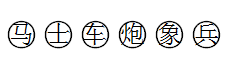

- **D**. 

**答案**：A

**官方解析**

4后置编码

（1）初始符号为1号位车、2号位马、3号位象、4号位士、5号位炮、6号位兵，即 ；

（2）将初始符号中第一号位“车”跳过其后面的的一个符号放置，放在“马”后，得到新符号串1号位马、2号位车、3号位象、4号位士、5号位炮、6号位兵，即  ；

（3）将初始符号中第二号位“马”，在得到的新符号串（2）中跳过其后面的两个符号放置，得到1号位车、2号位象、3号位马、4号位士、5号位炮、6号位兵，即   ；

（4）将初始符号中第三号位“象”，在得到的新符号串（3）中跳过其后面的三个符号放置，得到1号位车、2号位马、3号位士、4号位炮、5号位象、6号位兵，即   ；

（5）将初始符号中第四号位“士”，在得到的新符号串（4）中跳过其后面的四个符号放置，题干提示数到最后一个符号再接着从头数起，得到1号位车、2号位士、3号位马、4号位炮、5号位象、6号位兵，即 。

故正确答案为A。

---
