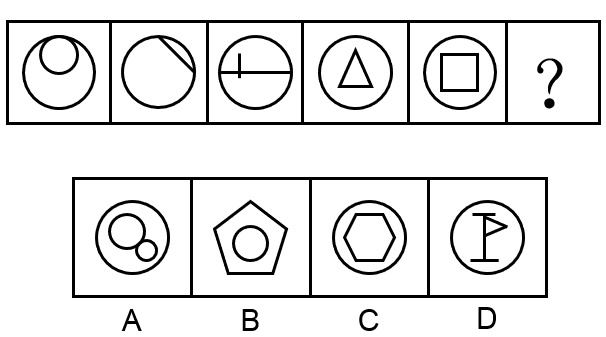
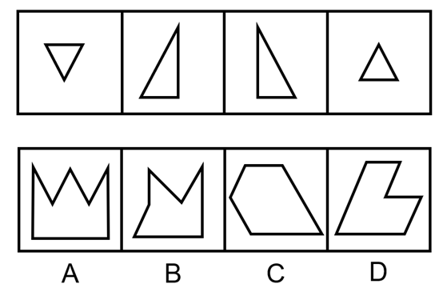
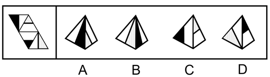
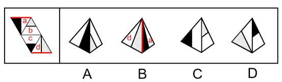
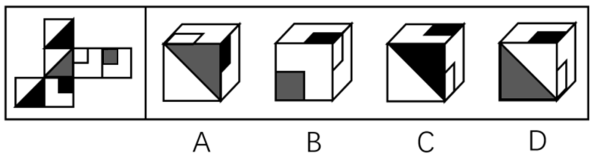
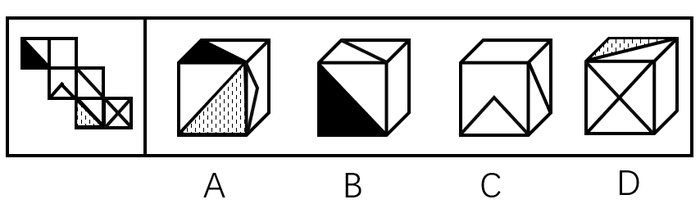
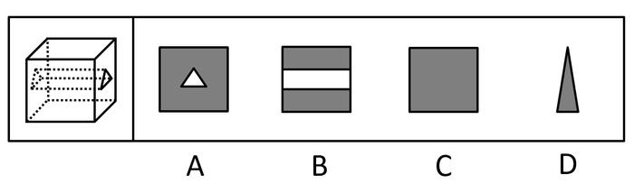

# 2019年江苏省公务员录用考试《行测》题（C类）（网友回忆版）

> 判断推理 · 45 题 · 江苏 2019

## 材料 1

某市江海区决定对东风路、西河路、南塘路、北海路等4条辖区内道路进行市容出新。为了解群众意见，制定符合民意的出新方案，区政府相关部门的甲、乙、丙、丁4位同志两人一组结伴展开调研。已知，每人各选两条道路，每条道路恰有两人选择：在每条道路的调研中，乙与丙始终没有在一组。另外，还知道：

（1）如果甲选东风路，则丁也选东风路；

（2）如果丙选南塘路，则丁也选南塘路；

（3）甲没有选南塘路。

### 第 1 题　qid 2367868 · 逻辑判断

根据上述信息，可以得出以下哪项？

- **A**. 甲选西河路和北海路　✅
- **B**. 乙选西河路和南塘路
- **C**. 丙选东风路和西河路
- **D**. 丁选东风路和北海路

**答案**：A

**官方解析**

整理题干信息。

① 每人各选两条道路，每条道路恰有两人选择，乙与丙始终没有在一组；

② 甲东风丁东风； 

③ 丙南塘丁南塘；

④甲南塘。

题干信息不确定，可用假设法。

根据①可知，乙或丙肯定有人会跟甲一组，有两种情况：

（1）假如，乙和甲一组，根据条件②可知，如果甲东风，那么乙和丁也得东风，与题干每条道路恰有两人选择矛盾，所以，甲不选东风，根据条件④可知，甲不选南塘，所以甲只能选西河和北海；

（2）假如，丙和甲一组，根据条件②可知，如果甲东风，那么丙和丁也得东风，与题干每条道路恰有两人选择矛盾，所以，甲不选东风，根据条件④可知，甲不选南塘，所以甲只能选西河和北海。

无论哪种情况，最后甲只能选西河和北海。

故正确答案为A。

---

### 第 2 题　qid 2367870 · 逻辑判断

如果乙不选东风路，则可以得出以下哪项？

- **A**. 甲或者选东风路或者选南塘路
- **B**. 乙或者选西河路或者选南塘路　✅
- **C**. 丙或者选南塘路或者选北海路
- **D**. 丁或者选西河路或者选北海路

**答案**：B

**官方解析**

第一步：整理题干信息。

① 每人各选两条道路，每条道路恰有两人选择，乙与丙始终没有在一组；

② 甲东风丁东风； 

③ 丙南塘丁南塘；

④ 甲南塘；

⑤ 乙东风。

根据99题结论可知，条件⑥甲选西河路和北海路，不选东风路和南塘路，又条件①乙与丙始终没有在一组，对于东风路和南塘路，甲不选，乙和丙也不能同时选，则丁必然要选东风路和南塘路，又根据条件⑤ 乙东风，可填写表格如下：

第二步：逐一分析选项。

A项：根据分析可知甲选西河路和北海路，不可能选东风路或者选南塘路，不能推出，排除；

B项：根据分析可知乙有三种情况，可以选西河路和北海路/西河路和南塘路/南塘路和北海路，对于三种情况，选项说法选西河路或者选南塘路均成立，可以推出，当选；

C项：根据分析可知丙有三种情况，可以选东风路和西河路/东风路和南塘路/东风路和北海路，对于三种情况，选项说法选南塘路或者选北海路不一定成立，不能推出，排除；

D项：根据分析可知丁选东风路和南塘路，不可能选西河路或者选北海路，不能推出，排除。

故正确答案为B。

---

### 第 3 题　qid 2367928 · 类比推理

牛奶：奶牛：牛圈

- **A**. 鸡肉：肉鸡：鸡场
- **B**. 虫害：害虫：农田
- **C**. 蛇毒：毒蛇：蛇穴　✅
- **D**. 蜜蜂：蜂蜜：蜂巢

**答案**：C

**官方解析**

第一步：判断题干词语间逻辑关系。
牛奶是奶牛的身体分泌物，二者为对应关系，牛圈是奶牛的生活场所，二者为对应关系。
第二步：判断选项词语间逻辑关系。
A项：鸡肉是肉鸡的身体部分，而不是身体分泌物，鸡场是肉鸡的生活场所，二者为对应关系，前两词与题干逻辑关系不一致，排除；
B项：害虫导致虫害，二者为因果对应关系，农田是害虫的生活场所，二者为对应关系，前两词与题干逻辑关系不一致，排除；
C项：蛇毒是毒蛇的身体分泌物，二者为对应关系，蛇穴是毒蛇的生活场所，二者为对应关系，与题干逻辑关系一致，当选；
D项：蜂蜜是蜜蜂的产出物，但两词顺序与题干相反，与题干逻辑关系不一致，排除。
故正确答案为C。

---

### 第 4 题　qid 2368008 · 类比推理

眼睛：眼镜：隐形眼镜

- **A**. 手掌：手套：纯棉手套　✅
- **B**. 耳机：耳朵：蓝牙耳机
- **C**. 脚踝：护膝：运动护膝
- **D**. 牙套：牙齿：烤瓷牙齿

**答案**：A

**官方解析**

第一步：判断题干词语间逻辑关系。
眼镜是矫正视力和保护眼睛的，二者是对应关系，隐形眼镜是眼镜的一种，二者是种属关系。
第二步：判断选项词语间逻辑关系。
A项：手套是保护手掌的，纯棉手套是手套的一种，与题干逻辑关系一致，当选；
B项：耳朵不是用来保护耳机的，蓝牙耳机也不是耳朵的一种，与题干逻辑关系不一致，排除；
C项：护膝是保护膝盖的，不是保护脚踝的，运动护膝是护膝的一种，前两者与题干逻辑关系不一致，排除； 
D项：牙套是矫正或者保护牙齿的，但顺序与题干相反，烤瓷牙齿是牙齿的一种，前两词与题干逻辑关系不一致，排除；
故正确答案为A。

---

### 第 5 题　qid 2367851 · 类比推理

路霸：打击：黑恶势力

- **A**. 功课：复习：基础课程
- **B**. 友谊：维护：世界和平
- **C**. 诚信：讲究：社会和谐
- **D**. 铅笔：购买：学习用品　✅

**答案**：D

**官方解析**

第一步：判断题干词语间逻辑关系。
打击路霸，二者是动宾关系，路霸是黑恶势力的一种，二者是种属关系。
第二步：判断选项词语间逻辑关系。
A项：复习功课，二者是动宾关系，基础课程是功课的一种，与题干顺序相反，与题干逻辑关系不一致，排除；
B项：维护友谊，二者是动宾关系，但友谊不是世界和平的一种，与题干逻辑关系不一致，排除；
C项：讲究诚信，二者是动宾关系，但诚信不是社会和谐的一种，与题干逻辑关系不一致，排除；
D项：购买铅笔，二者是动宾关系，铅笔是学习用品的一种，与题干逻辑关系一致，当选。
故正确答案为D。

---

### 第 6 题　qid 2367929 · 类比推理

记录：记录本

- **A**. 咨询：咨询室
- **B**. 复印：复印件
- **C**. 驾驶：驾驶证
- **D**. 存储：存储盘　✅

**答案**：D

**官方解析**

第一步：判断题干词语间逻辑关系。
记录本的功能是记录，二者为功能对应关系，且记录本是所记录内容的载体。
第二步：判断选项词语间逻辑关系。
A项：咨询室的功能是咨询，但是咨询室是场所，与题干逻辑关系不一致，排除；
B项：复印完成后得到复印件，复印件的功能不是复印，与题干逻辑关系不一致，排除；
C项：驾驶证的功能不是驾驶，是用来证明有驾驶资格的证件，与题干逻辑关系不一致，排除；
D项：存储盘的功能是存储，二者为功能对应关系，且存储盘是所存储内容的载体，与题干逻辑关系一致，当选。
故正确答案为D。

---

### 第 7 题　qid 2367979 · 类比推理

猪肉：猪肉松

- **A**. 红木：红木床　✅
- **B**. 东坡：东坡肉
- **C**. 太师：太师椅
- **D**. 女儿：女儿红

**答案**：A

**官方解析**

第一步：判断题干词语间逻辑关系。
猪肉是制作猪肉松的原材料，二者是对应关系。
第二步：判断选项词语间逻辑关系。
A项：红木是制作红木床的原材料，二者是对应关系，与题干逻辑关系一致，当选；
B项：东坡不是制作东坡肉的原材料，与题干逻辑关系不一致，排除；
C项：太师不是制作太师椅的原材料，与题干逻辑关系不一致，排除；
D项：女儿不是制作女儿红的原材料，与题干逻辑关系不一致，排除。
故正确答案为A。

---

### 第 8 题　qid 2367824 · 类比推理

高原：藏羚羊

- **A**. 中国：金丝猴
- **B**. 战场：指战员
- **C**. 海洋：大白鲨　✅
- **D**. 大学：研究员

**答案**：C

**官方解析**

第一步：判断题干词语间逻辑关系。
藏羚羊在高原生活，二者为生存环境与物种的对应关系。
第二步：判断选项词语间逻辑关系。
A项：金丝猴在中国生活，但中国是一个国家，范围太广，不是具体的生存环境对应，与题干逻辑关系不一致，排除；
B项：指战员是指挥员和战斗员的统称，战场不是指战员的生存环境，与题干逻辑关系不一致，排除；
C项：大白鲨在海洋生活，二者是生存环境与物种的对应关系，与题干逻辑关系一致，当选；
D项：大学是研究员的工作地点，二者是工作地点的对应关系，不是生存环境，与题干逻辑关系不一致，排除。
故正确答案为C。

---

### 第 9 题　qid 2367931 · 类比推理

茶壶 之于 （    ） 相当于 （    ） 之于 桃花

- **A**. 茶艺——桃红
- **B**. 茶叶——桃仁
- **C**. 壶嘴——桃树　✅
- **D**. 茶馆——桃园

**答案**：C

**官方解析**

逐一代入选项。
A项：茶壶是展示茶艺的工具，二者是工具对应关系，桃花是桃红色的，二者是属性对应关系，前后逻辑关系不一致，排除；
B项：茶壶是用来冲泡茶叶的，二者是工具对应关系，桃仁和桃花是并列关系，前后逻辑关系不一致，排除；
C项：壶嘴是茶壶的组成部分，桃花是桃树的组成部分，都是组成关系，前后逻辑关系一致，当选；
D项：茶馆是使用茶壶的地方，桃园是桃花盛开的地方，但两词的顺序相反，前后逻辑关系不一致，排除；
故正确答案为C。

---

### 第 10 题　qid 2367982 · 类比推理

诊断 之于 （    ） 相当于 知错 之于（    ）

- **A**. 仪器——表扬
- **B**. 手术——改错　✅
- **C**. 病人——浪子
- **D**. 医生——学生

**答案**：B

**官方解析**

逐一代入选项。
A项：仪器是诊断的辅助工具，二者为对应关系，知错和表扬没有必然的逻辑关系，前后逻辑关系不一致，排除；
B项：先诊断后手术，二者为先后顺序对应关系，先知错后改错，二者为先后顺序对应关系，前后逻辑关系一致，当选；
C项：诊断病人，二者为动宾关系，浪子知错，二者为主谓宾关系，前后逻辑关系不一致，排除；
D项：医生诊断，二者为主谓结构，学生知错，二者为主谓宾结构，前后逻辑关系不一致，排除。
故正确答案为B。

---

### 第 11 题　qid 2367932 · 类比推理

日曰曰日戊戍戍戊白

- **A**. 己巳巳己愕谔愕谔鄂
- **B**. 甲由由甲申喂喂伸神
- **C**. 嚄噢噢嚄哑咔咔哑娅　✅
- **D**. 嗒呾怛嗒嚓察察嚓檫

**答案**：C

**官方解析**

第一步：分析题干汉字间关系。
从相同汉字的位置入手：位置1、4的汉字相同；位置2、3的汉字相同，位置5、8的汉字相同，位置6、7的汉字相同。
第二步：判断选项符号间关系。
A项：位置5、8汉字不相同，与题干不一致，排除；
B项：位置5、8汉字不相同，与题干不一致，排除；
C项：位置1、4的汉字相同；位置2、3的汉字相同，位置5、8的汉字相同，位置6、7的汉字相同，与题干一致，当选；
D项：位置2、3汉字不相同，与题干不一致，排除。
故正确答案为C。

---

### 第 12 题　qid 2367933 · 逻辑判断

- **A**. 

- **B**. 

　✅
- **C**. 

- **D**. 

**答案**：B

**官方解析**

第一步：分析题干符号间关系。
从相同符号的位置入手：位置1、4的符号相同；位置2、6、8符号相同；位置7、9符号相同。
第二步：判断选项符号关系。
A项：相同位置与题干一致，但位置3、5符号相同，而题干3、5符号不相同，与题干逻辑关系不一致，排除；
B项：位置1、4的符号相同；位置2、6、8符号相同；位置7、9符号相同，与题干逻辑关系一致，当选；
C项：位置5、7、9符号相同，而题干5、7符号不相同，与题干逻辑关系不一致，排除；
D项：位置7、9符号不相同，与题干逻辑关系不一致，排除。
故正确答案为B。

---

### 第 13 题　qid 2367934 · 图形推理

从四个图中选出唯一的一项，填入问号处，使其呈现一定的规律性:

- **A**. A
- **B**. B
- **C**. C
- **D**. D　✅

**答案**：D

**官方解析**

本题考查图形的实际意义，寻找最大共同点。观察发现，题干图片均为盆景，盆栽整体直立在盆中，且装盆栽的盆的形状是长方形。四个选项中，A项中装盆栽的盆的形状是圆形，B项盆栽不是直立在盆中，C项不是盆栽，只有D项符合题干规律。
故正确答案为D。

---

### 第 14 题　qid 2367983 · 图形推理

从四个图中选出唯一的一项，填入问号处，使其呈现一定的规律性:

- **A**. A
- **B**. B
- **C**. C
- **D**. D　✅

**答案**：D

**官方解析**

元素组成不相同，且属性无规律，考虑数量规律，观察题干图形发现，图4和图5中出现多边形，优先考虑数直线，题干五幅图形的直线数为0、1、2、3、4、？，故问号处选择一个有5条直线的图形，排除A项和C项，再次观察发现，题干中每幅图形外框均为圆形，排除B项。
故正确答案为D。

---

### 第 15 题　qid 2367799 · 图形推理

从四个图中选出唯一的一项，填入问号处，使其呈现一定的规律性:

 

- **A**. A
- **B**. B　✅
- **C**. C
- **D**. D

**答案**：B

**官方解析**

元素组成不同，优先考虑属性规律。观察发现，题干出现了箭头、等腰三角形等特征图，考虑对称性。观察发现，题干每幅图形既是轴对称又是中心对称图形。四个选项中，A项仅为中心对称图形，C、D项仅为轴对称图形，只有B项既是轴对称图形又是中心对称图形。
故正确答案为B。

---

### 第 16 题　qid 2367801 · 图形推理

从四个图中选出唯一的一项，填入问号处，使其呈现一定的规律性:

- **A**. A
- **B**. B
- **C**. C　✅
- **D**. D

**答案**：C

**官方解析**

题干给出的图形均为四个正方体构成的立体图形，且每幅图的四个正方体均为同样的排列形式，即题干每幅图的立体图形都相同，只是每幅图立体图形的位置发生了旋转。据此规律，只有C项跟题干立体图形是同样的排列形式。
故正确答案为C。

---

### 第 17 题　qid 2367984 · 图形推理

选项四个图形中，只有一个是由题干的四个图形拼合（只能通过上、下、左、右平移）而成的，请把它找出来。

- **A**. A　✅
- **B**. B
- **C**. C
- **D**. D

**答案**：A

**官方解析**

本题考查平面拼合，可采用平行且等长相消的方式解题。消去平行且等长的线段后进行组合即可得到轮廓图，即为A项。平行且等长相消的方式如下图所示：

故正确答案为A。

---

### 第 18 题　qid 2367986 · 图形推理

选项四个图形中，只有一个是由题干的四个图形拼合（只能通过上、下、左、右平移）而成的，请把它找出来。

- **A**. A
- **B**. B
- **C**. C
- **D**. D　✅

**答案**：D

**官方解析**

本题考查平面拼合，可采用平行且等长相消的方式解题。消去平行且等长的线段后进行组合即可得到轮廓图，即为D项。平行且等长相消的方式如下图所示：

故正确答案为D。

---

### 第 19 题　qid 2367808 · 图形推理

选项四个图形中，只有一个是由题干的四个图形拼合（只能通过上、下、左、右平移）而成的，请把它找出来。

- **A**. A
- **B**. B
- **C**. C
- **D**. D　✅

**答案**：D

**官方解析**

本题考查平面拼合，可采用平行且等长相消的方式解题。消去平行且等长的线段后进行组合即可得到轮廓图，即为D项。平行且等长相消的方式如下图所示：

故正确答案为D。

---

### 第 20 题　qid 2367811 · 图形推理

选项四个图形中，只有一个是由题干的四个图形拼合（只能通过上、下、左、右）而成的，请把它找出来。

- **A**. A
- **B**. B　✅
- **C**. C
- **D**. D

**答案**：B

**官方解析**

本题考查俄罗斯方块平面拼合。从方块最多的图形入手，贴边代入选项。在题干的4个图形中，图④的方块最多，将它贴边代入各个选项中，只有B项能够把所有图形都代入进去，拼合方式如下图所示。

故正确答案为B。

---

### 第 21 题　qid 2367987 · 图形推理

左边给定的是纸盒外表面的展开图，右边哪一项能由它折叠而成？请把它找出来。

- **A**. A
- **B**. B
- **C**. C　✅
- **D**. D

**答案**：C

**官方解析**

将题干展开图中的面依次标注为面a、b、c、d，如下图：

A项：以面d黑尖为起点顺时针画边，题干中第1条边对着的是面a，选项中第1条边对着的不是面a，选项与题干不一致，排除；

B项：选项由面a、面d构成，以面d黑尖为起点顺时针画边，题干中第1条边对着的是面a，选项中第3条边对着的是面a，选项与题干不一致，排除；

C项：与题干一致，当选；

D项：选项由面b、面c构成，题干中面b、面c内的线段交点在公共边上，选项中面b、面c内的线段交点不在公共边上，选项与题干不一致，排除。

故正确答案为C。

---

### 第 22 题　qid 2367988 · 图形推理

左边给定的是纸盒外表面的展开图，右边哪一项能由它折叠而成？请把它找出来。

- **A**. A
- **B**. B
- **C**. C
- **D**. D　✅

**答案**：D

**官方解析**

将题干展开图中的面依次标注为面a、b、c、d，如下图：

A项：选项由面a、面b构成，题干中面a和面b的公共边是白色直角三角形的斜边，选项中面a和面b的公共边是黑色直角三角形的斜边，选项与题干不一致，排除；

B项：选项由面a、面d构成，题干中面a和面d的公共边是黑色直角三角形短直角边，而选项中，面a和面d的公共边是黑色直角三角形的斜边，选项与题干不一致，排除；

C项：选项由b、面c构成，题干中面b和面c的公共边是面b中白色梯形的下底边，而选项中面b和面c的公共边不是面b中白色梯形的下底边，选项与题干不一致，排除；

D项：与题干一致，当选。

故正确答案为D。

---

### 第 23 题　qid 2367989 · 图形推理

左边给定的是纸盒外表面的展开图，右边哪一项能由它折叠而成？请把它找出来。

- **A**. A　✅
- **B**. B
- **C**. C
- **D**. D

**答案**：A

**官方解析**

本题考查六面体的空间重构。将展开图中的各面进行标号，如图1所示：

A项：与题干展开图一致，当选；

B项：展开图中，面c中白正方形的红点与面f中黑正方形的黄点不重合（如图2所示），而选项中二者是重合的，选项与题干不一致，排除；

C项：展开图中，面a和面f是相对面，面c和面e是相对面，这两对相对面均不能同时在立体图中出现，但选项的黑三角形面不管是面a还是面e，选项中均有相对面，选项与题干不一致，排除；

D项：展开图中，面b中灰色三角形的直角边挨着f面中的黑正方形，而选项中二者无此关系，选项与题干不一致，排除。

故正确答案为A。

---

### 第 24 题　qid 2367990 · 图形推理

左边给定的是纸盒外表面的展开图，右边哪一项能由它折叠而成？请把它找出来。

- **A**. A
- **B**. B
- **C**. C　✅
- **D**. D

**答案**：C

**官方解析**

本题考查六面体的空间重构。将平面图中的各面进行标号，如图1所示：

A项：展开图中，面a黑色三角形的黑色直角边挨着面c，而选项中面a黑色三角形的黑色直角边没有挨着面c，选项与题干不一致，排除；

B项：展开图中，面a和面d是相对面，相对面不能同时出现，但选项中两个面是相邻面，选项与题干不一致，排除；

C项：与题干展开图一致，当选；

D项：展开图中，面b和面e是相对面，相对面不能同时出现，而选项中二个面是相邻面，选项与题干不一致，排除。

故正确答案为C。

---

### 第 25 题　qid 2367991 · 图形推理

从所给的四个选项中，选择最合适的一个填入问号处，使之呈现一定的规律性。

- **A**. A　✅
- **B**. B
- **C**. C
- **D**. D

**答案**：A

**官方解析**

本题考查三视图，九宫格优先按横行找规律。观察发现，第一行立体图形的左视图均相同（呈“L”形），第二行立体图形的左视图均相同（呈“L”形），第三行前两幅立体图形的左视图均相同（呈“L”形），只有A项符合这一规律（C项立体图形的左视图也是L形，但方向与题干不同）。
故正确答案为A。

---

### 第 26 题　qid 2367946 · 图形推理

从所给的四个选项中，选择最合适的一个填入问号处，使之呈现一定的规律性：

- **A**. A
- **B**. B　✅
- **C**. C
- **D**. D

**答案**：B

**官方解析**

本题考查图形的实际意义，寻找最大共同点。观察发现，题干所有图形都是一根枝干上长满了相同的叶子或花，九宫格优先按横行来看，第一行，花枝朝向依次为左、右、左；第二行，花枝朝向依次是右、左、右，规律均为左右交替出现，第三行前两个图花枝朝向为左、右，因此“？”处花枝朝向应为左，C、D两项花枝朝向不是左（注：C项可能存在争议，有部分同学觉得是朝上，无论是朝右还是朝上，均不是朝左），均排除；A项花枝最上面是3朵花，下面是3片叶子，一根枝干上元素不相同，只有B项满足题干图形特征。
故正确答案为B。

---

### 第 27 题　qid 2367993 · 图形推理

左图为给定的立体，从任意角度剖开，右边哪一项不可能是它的截面图？

 

- **A**. A
- **B**. B　✅
- **C**. C
- **D**. D

**答案**：B

**官方解析**

本题考查截面图。逐一分析选项。如下图所示，A、C、D项均可截出，如下图所示。B项无法截出，因为三棱柱是空心部分，B项中间矩形的两侧不应该有线。

本题为选非题，故正确答案为B。

---

### 第 28 题　qid 2367996 · 逻辑判断

马克思是顶天立地的伟人，也是有血有肉的常人。他热爱生活，真诚朴实，重情重义。马克思、恩格斯的革命友谊长达40年。正如列宁所说：“古老传说中有各种非常动人的友谊故事”，但马克思、恩格斯的友谊“超过了古人关于人类友谊的一切最动人的传说”。
根据以上陈述，可以得出以下哪项？

- **A**. 有的顶天立地的伟人热爱生活、重情重义　✅
- **B**. 古代各种非常动人的友谊一般都不超过40年
- **C**. 恩格斯同样热爱生活，真诚朴实，重情重义
- **D**. 列宁也是顶天立地的伟人和有血有肉的常人

**答案**：A

**官方解析**

日常结论题，根据题干信息逐一分析选项。
A项：根据题干第一句和第二句可知，马克思是一个顶天立地的伟人，他热爱生活、重情重义，可以得到有的顶天立地的伟人热爱生活、重情重义，可以推出，当选；
B项：题干中只是说明马克思和恩格斯的友谊长达40年，没有提及古代所有非常动人的友谊持续的时间情况，无中生有，排除；
C项：题干中没有提及恩格斯是否热爱生活，真诚朴实，重情重义，无中生有，排除；
D项：题干中没有提及列宁是什么样的人，无中生有，排除。
故正确答案为A。

---

### 第 29 题　qid 2367951 · 逻辑判断

人饿了会吃东西，一旦摄入碳水化合物、脂肪、蛋白质等能量营养素，就能消除饥饿感，这种缺乏能量营养素的饥饿是显性饥饿；然而，人体健康还需铁、锌等16种矿物元素及维生素A、维生素E等13种维生素，如果缺乏这些微量营养素，则会造成隐性饥饿。显然，显性饥饿只要“吃饱”就能解决，而隐性饥饿只有“吃好”才能应对。
根据以上陈述，可以得出以下哪项？

- **A**. 既要“吃饱”又要“吃好”，如此就能保证人体的健康
- **B**. 消除显性饥饿对人更重要，只有“吃饱”才能“吃好”
- **C**. 隐性饥饿并不同于显性饥饿，“吃不好”不等于“吃不饱”　✅
- **D**. 隐性饥饿对人体健康的危害比显性饥饿更大、更隐蔽

**答案**：C

**官方解析**

日常结论题，根据题干信息逐一分析选项。
A项：根据题干可知，“吃饱”可以解决显性饥饿，“吃好”可以解决隐性饥饿，但题干未提及二者同时成立是否就能保证人体健康，无法推出，排除；
B项：题干中并未比较消除显性饥饿与消除隐性饥饿哪个更重要，无法推出，排除；
C项：根据题干最后一句话可知，显性饥饿只要“吃饱”就能解决，而隐性饥饿只有“吃好”才能应对，说明这两种饥饿是不同的，其解决方式也并不相同，可以推出，当选；
D项：题干中并未比较显性饥饿与隐性饥饿哪个对人体的健康危害更大，无法推出，排除。
故正确答案为C。

---

### 第 30 题　qid 2367861 · 逻辑判断

某区对所辖钟山、长江、梅园、星海4个街道进行抽样调查，并按照人均收入为其排序。有人根据以往经验对4个街道的人均收入排序作出如下预测：
（1）如果钟山街道排第三，那么梅园街道排第一；
（2）如果长江街道既不排第一也不排第二，那么钟山街道排第三；
（3）钟山街道排序与梅园街道相邻，但与长江街道不相邻。
事后得知，上述预测符合调查结果。
根据以上信息，可以得出以下哪项？

- **A**. 钟山街道不排第一就排第四　✅
- **B**. 长江街道不排第二就排第三
- **C**. 梅园街道不排第二就排第四
- **D**. 星海街道不排第一就排第三

**答案**：A

**官方解析**

第一步：分析题干条件。

① 钟山第三梅园第一；

② 长江第一 且 第二钟山第三；

③ 钟山与梅园相邻，与长江不相邻。

第二步：根据题干条件进行推理。

钟山出现次数最多，为最大信息，可作为突破口。根据③可知：钟山与梅园相邻，结合①可知：钟山第三梅园第一，故钟山不能排名第三。钟山第三是对②的否后，否后必否前，故长江排名第一或者第二。

如果长江排第一，根据③可知钟山只能排第四，故梅园排第三，星海排第二，排除B、C、D项，只有A项成立；

如果长江排第二，根据③可知钟山只能排第四，故梅园排第三，星海排第一，A项依然成立。

故正确答案为A。

---

### 第 31 题　qid 2367950 · 逻辑判断

当今社会，不少老人为了帮助子女照顾下一代而漂泊异乡成为“老漂族”。在最近一项城市调查中，的受访青年坦言，自己的父母就是老漂族，自己与爱人事业刚刚起步，工作压力较大，根本没有时间照顾孩子和做家务。有专家据此断言，我国城市中的老漂族群体还会进一步扩大。

以下哪项如果为真，最能支持上述专家的观点？

- **A**. 老人在城市养老可拥有比乡村更好的医疗条件
- **B**. 有些老人故土难离事务缠身更愿意生活在家乡
- **C**. 国家二孩政策的实施将会促使更多的孩子出生　✅
- **D**. 二孩政策实施后城市的二孩出生率要低于农村

**答案**：C

**官方解析**

第一步：找出论点和论据。

论点：我国城市中的老漂族群体还会进一步扩大。

论据：的受访青年坦言，自己的父母就是老漂族，自己与爱人事业刚刚起步，工作压力较大，根本没有时间照顾孩子和做家务。

题干论点探讨的是老漂族群体会进一步扩大，可以通过补充论据说明老漂族群体在增加或照顾孩子和做家务的人员短缺等进行加强。

第二步：逐一分析选项。

A项：说的是城市养老医疗条件比乡村更好，与论点说的老漂族群体会进一步扩大无关，话题不一致，无法加强，排除；

B项：说的是老人更愿意生活在家乡，老人的意愿与论点说的老漂族群体会进一步扩大无关，无法加强，排除；

C项：国家二孩政策会促使更多的孩子出生，补充论据说明需要照顾孩子的情况会更多，对老漂族群体扩大进行了加强，可以支持，当选；

D项：二孩出生率农村更高，农村的照顾孩子的需求会更多些，老漂族应该会减少而不是扩大，无法加强，排除。

故正确答案为C。

---

### 第 32 题　qid 2367999 · 逻辑判断

某机关举行职工秋季田径运动会。已知：所有报名参加短跑比赛的职工都报名参加铅球比赛，所有报名参加跳远比赛的职工都没有报名参加铅球比赛，报名参加跳高比赛的职工也都报名参加了跳远比赛，而没有报名参加跳高比赛的职工也都没有报名参加长跑比赛。
根据以上陈述，可以得出以下哪项？

- **A**. 有的报名参加铅球比赛的职工没有报名参加短跑比赛
- **B**. 有的报名参加跳高比赛的职工没有报名参加长跑比赛
- **C**. 所有报名参加跳远比赛的职工都报名参加长跑比赛
- **D**. 所有报名参加短跑比赛的职工都没有报名参加长跑比赛　✅

**答案**：D

**官方解析**

第一步：翻译题干。
（1）短跑→铅球；
（2）跳远→-铅球；
（3）跳高→跳远；
（4）-跳高→-长跑。
将条件进行串联，可得短跑→铅球→-跳远→-跳高→-长跑。
第二步：逐一分析选项。
A项翻译：有的铅球→-短跑，由条件（1）只能得到“有的铅球→短跑”，根据“有的①是②”不能推出“有的①不是②”，无法推出，排除；
B项翻译：有的跳高→-长跑，由条件（4）只能得到“有的跳高→长跑”，根据“有的①是②”不能推出“有的①不是②”，无法推出，排除；
C项翻译：跳远→长跑，由题干可知-跳远→-跳高→-长跑，跳远是否定条件的前件，得不到确定性的结论，无法推出，排除；
D项翻译：短跑→-长跑，根据上述分析串联，可以得到短跑→铅球→-跳远→-跳高→-长跑，可以推出，当选。
故正确答案为D。

---

### 第 33 题　qid 2368009 · 逻辑判断

我国家长们对儿童阅读越来越重视，大多数家长希望孩子多读书读好书。2018年，某市的家庭有父母陪孩子读书的习惯，亲子阅读的图书量比2017年提高了1.8个百分点，时长也比去年有所增加。但是，2018年该市的儿童人均图书阅读量仅为4.72本，比2017年还下降了0.6个百分点。

以下哪项如果为真，最能解释上述现象？

- **A**. 近年来孩子课业负担较重，对课外阅读很多人是“心有余而时不足”
- **B**. 在亲子阅读中很多孩子习惯“听书”，这种情况2018年未计算在内　✅
- **C**. 大多数80后、90后家长都受过高等教育，比较看重亲子阅读的意义
- **D**. 孩子在手机、电脑上的电子阅读一直未纳入儿童图书阅读的考虑范围

**答案**：B

**官方解析**

第一步：找出题干矛盾。
2018年，某市亲子阅读的图书量比2017年提高了1.8个百分点，时长也比去年有所增加。但2018年该市的儿童人均图书阅读量比2017年还下降了0.6个百分点。
第二步：逐一分析选项。
A项：孩子课业负担较重，对课外阅读很多人是“心有余而时不足”，提及了儿童阅读量不高，但是并没有涉及亲子阅读的影响，不能解释题干矛盾，排除；
B项：在亲子阅读中很多孩子习惯“听书”，这种情况未计算在图书阅读量内，既提及了亲子阅读，又涉及了读书量计算的方式，能够解释为什么2018年亲子阅读量增加而儿童阅读量并没有增加的情况，可以解释题干矛盾，当选；
C项：大多数80后、90后家长比较看重亲子阅读的意义，提及了亲子阅读的图书量可能更多，但并没有涉及儿童的人均读书量为何下降，不能解释题干矛盾，排除；
D项：孩子在手机、电脑上的电子阅读一直未纳入儿童图书阅读的考虑范围，没有涉及亲子阅读的影响，而且选项说的是一直，也就是说2017年和2018年均未考虑在内，不能解释题干矛盾，排除。
故正确答案为B。

---

### 第 34 题　qid 2367949 · 逻辑判断

某地开展企业结对扶贫创新活动，倡导企业家与贫困家庭互选，要求每户贫困家庭只能选1位企业家，而每位企业家只能在选他的贫困家庭中选择1-2户开展帮扶活动。现有企业家甲、乙、丙3人面对张、王、李、赵4户贫困家庭，已知：
（1）张、王2户至少有1户选择甲；
（2）王、李、赵3户中至少有2户选择乙；
（3）张、李2户中至少有1户选择丙。
事后得知，互选顺利完成，每户贫困家庭均按自己心愿选到了企业家，而每位企业家也按要求选到了贫困家庭。
根据以上信息，可以得出以下哪项？

- **A**. 企业家甲选到了张户
- **B**. 企业家乙选到了赵户　✅
- **C**. 企业家丙选到了李户
- **D**. 企业家甲选到了王户

**答案**：B

**官方解析**

分析题干。
（1）张或王选甲
（2）王、李、赵中至少2户选乙
（3）张或李选丙
由题干“每户贫困家庭只能选1位企业家，每位企业家只能在选他的贫困家庭中选择1-2户开展帮扶活动”可知：甲互选的帮扶家庭数为1，乙互选的帮扶家庭数为2，丙互选的帮扶家庭数为1；再根据条件（1）可知，张或王选甲，说明李和赵不选甲；由条件（2）可知，张不选乙，由条件（3）可知，王和赵不选丙，此时赵即不选甲也不选丙，又已知“每户贫困家庭均按自己心愿选到了企业家”，因此，赵只能选企业家乙，即企业家乙选到了赵户。
故正确答案为B。

---

### 第 35 题　qid 2367860 · 逻辑判断

智能手机流行的时代，我们每天发送信息，也收到信息。人际之间的电子信息交往已成为当今时代一种独特的交往方式。在面对重要的人或关系时，很多人往往发出信息后就期待被秒回，如果没有被秒回，他们就产生一种怀疑感或被弃感，从而陷入深深的烦恼和焦虑之中。
以下哪项最可能是他们陷入深深烦恼和焦虑所需的假设？

- **A**. 当前技术已能实现智能手机的即时通信，方便快捷，且基本免费　✅
- **B**. 有些聊天软件能在发送者手机中反馈信息接收者是否阅读了信息
- **C**. 有些人工作很忙，总习惯在忙完一天工作后才统一处理相关信息
- **D**. 有些人一天收到的信息太多，容易遗漏某人期待秒回的重要信息

**答案**：A

**官方解析**

第一步：找出论点和论据。

论点：在面对重要的人或关系时，很多人往往发出信息后就期待被秒回，如果没有被秒回，他们就产生一种怀疑感或被遗弃感，从而陷入深深的烦恼和焦虑之中。

论据：无。

本题无论据，只能通过补充论据进行加强。提问方式是假设类，优先考虑补充必要条件，即没有这个选项，论点则无法成立。

第二步：逐一分析选项。

A项：如果智能手机不能即时通信，那么发出的信息就无法被即时接收，发出者就不会期待秒回，因此A项是信息能够被秒回的必要条件，当选；

B项：有些聊天软件能在发送者手机中反馈信息接收者是否阅读了信息，可以解释部分发出者为什么没有被秒回就会产生怀疑感或被弃感，但是力度较弱，且不是论点成立的必要条件，排除；

C项：接收者什么时候阅读信息与发出者没被秒回就会产生烦恼和焦虑无关，排除； 

D项：接收者是否遗漏了重要信息与发出者没被秒回就会产生烦恼和焦虑无关，排除。

故正确答案为A。

附：通过查证原文，本题答案为A项。

---

### 第 36 题　qid 2367802 · 定义判断

公众充权：指在公共政策的制定、执行、评估、监督过程中，公众积极参与，充分表达自己的利益主张，以推动公共政策过程的民主化与科学化。
下列属于公众充权的是

- **A**. 清明节到来前夕，一些社会人士在市文明办支持下创建了文明祭扫网站，号召民众祭扫时不放鞭炮，不烧纸钱，改用虚拟鲜花、电子蜡烛等绿色环保的方式
- **B**. 快递小哥小李当选市人大代表后，在广泛走访充分调研的基础上，提交了一份关于如何保障快递员权益、促进快递行业健康发展的议案
- **C**. 某市将要召开天然气价格调整听证会，有关部门要求辖区各街道、居委会搞好宣传动员工作，按照下达名额推举市民代表，确保公开公平公正
- **D**. 在某县未来五年发展规划制定过程中，县委、县政府通过召开居民座谈会、专家听证会等形式，征求到了许多宝贵的意见　✅

**答案**：D

**官方解析**

第一步：找出定义关键词。
“在公共政策的制定、执行、评估、监督过程中”、“公众积极参与，充分表达自己的利益主张”、“推动公共政策过程的民主化与科学化”。
第二步：逐一分析选项。
A项：创建文明祭扫网站，号召改用绿色环保的方式，不符合“在公共政策的制定、执行、评估、监督过程中”，不符合定义，排除；
B项：提交议案，不符合“在公共政策的制定、执行、评估、监督过程中”，不符合定义，排除；
C项：召开天然气价格调整听证会可以理解为“在公共政策的制定、执行、评估、监督过程中”，但按照下达名额推举市民代表，不符合“公众积极参与，充分表达自己的利益主张”，不符合定义，排除；
D项：在某县未来五年发展规划制定过程中，符合“在公共政策的制定、执行、评估、监督过程中”，通过召开居民座谈会、专家听证会等形式，征求到了许多宝贵的意见，符合“公众积极参与，充分表达自己的利益主张”，符合定义，当选。
故正确答案为D。

---

### 第 37 题　qid 2367816 · 定义判断

社会性处罚：指存在失信行为的人员所受到的与自身失信行为没有直接关联的来自其他部门的限制和处罚。
下列属于社会性处罚的是

- **A**. 以“站不起来”为理由强占他人座位的高铁“霸座男”，当场受到了乘警的严肃批评，下车后被移送公安机关接受治安处罚。这一事件曝光后，当事人的恶劣行为又遭到了全国网民的一致谴责
- **B**. 由于数据造假，某教授在国际期刊上发表的论文被撤稿。在网民的谴责声中，该教授又被撤销了基于该论文所获得的绩效奖励、省部级科研项目、荣誉称号、社会兼职
- **C**. 春节前夕，恶意拖欠农民工工资的部分包工头，被有关部门和各种媒体曝光，引起社会各界密切关注。根据银行、保险、铁路等部门的规定，这些违规者申请信用卡、购买保险以及动车和高铁票时都将受到限制　✅
- **D**. 长江沿岸的一家化工企业，多次不顾禁令向长江偷偷排污，最近被省有关部门通报批评，吊销了企业生产执照，它的上级主管部门及主要负责人也都受到了严厉的处罚

**答案**：C

**官方解析**

第一步：找出定义关键词。
“存在失信行为的人员”、“所受到的与自身失信行为没有直接关联的来自其他部门的限制和处罚”。
第二步：逐一分析选项。
A项：以“站不起来”为理由强占他人座位的高铁“霸座男”，符合“存在失信行为的人员”，当场受到了乘警的严肃批评，被移送公安机关接受治安处罚，这是与自身失信行为有直接关联的限制和处罚，不符合“所受到的与自身失信行为没有直接关联的来自其他部门的限制和处罚”，不符合定义，排除；
B项：某教授数据造假，符合“存在失信行为的人员”，论文被撤稿，撤销了基于该论文所获得的绩效奖励、省部级科研项目、荣誉称号、社会兼职，均是与自身失信行为有直接关联的处罚，不符合“所受到的与自身失信行为没有直接关联的来自其他部门的限制和处罚”，不符合定义，排除；
C项：恶意拖欠农民工工资的包工头，符合“存在失信行为的人员”，申请信用卡、购买保险以及动车和高铁票时都将受到限制，符合“所受到的与自身失信行为没有直接关联的来自其他部门的限制和处罚”，符合定义，当选；
D项：长江沿岸的一家化工企业，多次不顾禁令向长江偷偷排污，不符合“存在失信行为的人员”，不符合定义，排除。
故正确答案为C。

---

### 第 38 题　qid 2367829 · 定义判断

信息焦虑：指人们在过量信息包围下因为难以获取、处理、利用所需信息而产生的厌倦、烦躁、紧张等负面情绪。
下列属于信息焦虑的是

- **A**. 小敏热衷于娱乐八卦，她时刻关注微博更新，看到手机上的未读信息就忍不住想去点击，每天用于浏览信息的时间远远超过她自己的工作时间
- **B**. 在开发商那里登记过购房意向后，闵先生每天都会接到几十个乃至上百个电话和信息，卖房的、装修的、投资的、理财的、贷款的，让他不胜其烦
- **C**. 小谢沉迷于网络游戏，一玩就是一通宵，白天上课总是想着游戏，久而久之产生了严重的厌学情绪，精神状态萎靡不振，身体素质越来越差
- **D**. 小李在外文数据库查资料，每输入一个关键词就跳出几十篇相关论文，因英语欠佳，没法筛选，完全不知道哪些才是自己真正要用的，感觉精神马上就要崩溃了　✅

**答案**：D

**官方解析**

第一步：找出定义关键词。
“人们在过量信息包围下因为难以获取、处理、利用所需信息”、“而产生的厌倦、烦躁、紧张等负面情绪”。
第二步：逐一分析选项。
A项：每天用于浏览信息的时间远远超过她自己的工作时间，该选项没有体现出厌倦、烦躁、紧张等负面情绪，不符合定义，排除； 
B项：在开发商登记过购房意向后，接到几十个乃至上百个电话和信息，而这些信息大部分都是闵先生所不需要的，体现不出闵先生“难以获取、处理、利用所需信息”，不符合定义，排除；
C项：小谢沉迷于游戏，白天上课也总想着游戏，该选项没有体现出“过量的信息”，不符合定义，排除；
D项：小李查询资料，每输入一个关键词就跳出几十篇相关论文，因英语欠佳，没法筛选，不知道哪个是自己要用的，符合“人们在过量信息包围下因为难以获取、处理、利用所需信息”，感觉精神马上就要崩溃了，符合“产生的厌倦、烦躁、紧张等负面情绪”，符合定义，当选。
故正确答案为D。

---

### 第 39 题　qid 2367839 · 定义判断

互联网公益：指民间团体或企业通过网络平台，发动社会公众参与的具有门槛低、透明度高、互动性强等特点的公益活动。
下列属于互联网公益的是：

- **A**. 某公司每年拨出专款开展公益活动，在官网上征集白内障患者并向符合特定条件的患者提供全部医疗费用
- **B**. 得知老张遭遇车祸，他的老同学通过班级群、朋友圈很快募集了三万多元捐款全部转交到他家
- **C**. 某爱心服务站每年开学前在自己的主页上公布来自各界的网络捐款账目，并邀请部分捐款人一起把善款送到山区小学　✅
- **D**. 某村委会通过网络平台发起“一帮一”捐资助学活动，帮助本村特困家庭的大学生解决了学费问题

**答案**：C

**官方解析**

第一步：找出定义关键词。
“民间团体或企业”、“通过网络平台”、“公众参与”、“门槛低、透明度高、互动性强公益活动”。
第二步：逐一分析选项。
A项：某公司符合“民间团体或企业”，在官网符合“通过网络平台”，并向符合特定条件的患者提供全部医疗费用，不符合“门槛低、透明度高、互动性强公益活动”，不符合定义，排除；
B项：通过班级群、朋友圈募集捐款符合“通过网络平台”，但其同学是发起人不符合“民间团体或企业”，不符合定义，排除；
C项：爱心服务站符合“民间团体或企业”，网络捐款账目符合“通过网络平台”，邀请部分捐款人一起把善款送到山区小学说明活动互动性强，符合定义，当选；
D项：通过网络平台捐资助学符合“通过网络平台”，但村委会不符合“民间团体或企业”，不符合定义，排除。
故正确答案为C。

---

### 第 40 题　qid 2367821 · 定义判断

情感性劳动：指服务业员工在与顾客面对面交往时，将个人情感融入工作过程，对顾客、企业以及服务人员自己产生积极影响的行为。
下列属于情感性劳动的是：

- **A**. 某航空公司空姐站在登机口两旁欢迎乘客，时不时还会微笑着摸摸小孩的头　✅
- **B**. 小刘总是面带微笑、语气亲切热情地接打电话，连续多年被评为最美接线员
- **C**. 某酒店智能客服“小青”善解人意，语音甜美，入住的客人都喜欢和她互动
- **D**. 小秦在信访局工作多年，每次接待来访者，都非常耐心，细致了解具体情况

**答案**：A

**官方解析**

第一步：找出定义关键词。
“服务业员工”、“顾客”、“面对面”、“个人感情”、“对顾客、企业及自己产生积极影响”。
第二步：逐一分析选项。
A项：空姐属于“服务业员工”，站在登机口欢迎属于“面对面”，微笑摸摸小孩的头符合“个人感情”，符合定义，当选；
B项：接打电话不符合“面对面”，不符合定义，排除；
C项：小青是智能客服，不符合“个人情感”，不符合定义，排除；
D项：小秦耐心、细致了解只体现工作负责，未体现“个人感情”，不符合定义，排除。
故正确答案为A。

---

### 第 41 题　qid 2368002 · 定义判断

气候移民：指因为气候或自然环境的恶化，人们在原居住地无法继续生存而大规模迁移的现象。
下列属于气候移民的是：

- **A**. 为了恢复草原生态，保护天然牧场，原来散居的牧民搬迁到了统一规划建成的定居点
- **B**. 每到冬天，为了躲避严寒，一批又一批东北老人成群结队地跑到气候温暖的海南过冬
- **C**. 非洲一些地方长期干旱，农作物常年歉收。当地居民陆陆续续离开家园，四处寻找新的居住地
- **D**. 随着全球气候变暖，海平面逐渐上升，不少岛屿被海水淹没，岛上居民被迫搬迁异地　✅

**答案**：D

**官方解析**

第一步：找出定义关键词。
“因为气候或自然环境恶化”、“原居住地无法生存”、“大规模迁移”。
第二步：逐一分析选项。
A项：散居牧民搬迁到统一定居点是为了恢复草原生态，不符合“因为原居住地无法生存”，不符合定义，排除；
B项：东北老人为了躲避严寒到海南过冬，是从严寒地区转移到温暖地区度过一段时间，不符合“原居住地无法生存”，不符合定义，排除；
C项：干旱是气候现象，歉收是指农作物产量低于一般水平，没有提及“原居住地无法生存”，且“陆陆续续”不符合“大规模”，不符合定义，排除；
D项：气候变暖符合“气候或自然环境恶化”，岛屿被淹没符合“原居住地无法生存”，岛上居民搬迁符合“大规模迁移”，符合定义，当选。
故正确答案为D。

---

### 第 42 题　qid 2367818 · 定义判断

隐形植入：指通过周边信息、符号体系等不易察觉的形式，使受众在不知不觉中受到影响的宣传策略。
下列属于隐形植入的是：

- **A**. 在某电视剧中，所有角色均使用同一品牌的手机，并使用这个品牌的经典铃声　✅
- **B**. 城运会到来之前，商家把印有城运会会徽的各类文化创意产品陆续摆上了柜台
- **C**. 在某市博物馆馆标设计征集中，8号方案以浓郁的地域文化元素受到了评委的关注
- **D**. 结婚纪念日快到了，为了提醒粗心又忙碌的丈夫，小李偷偷把他的手机屏保换成了婚纱照

**答案**：A

**官方解析**

第一步：找出定义关键词。
“不易察觉的形式”、“不知不觉受到影响”、“宣传策略”。
第二步：逐一分析选项。
A项：在电视剧中使用同一品牌手机，用该品牌经典铃声符合“不易察觉的形式”，“不知不觉受到影响”，也是“宣传策略”，符合定义，当选；
B项：印有城运会会徽，不符合“不易察觉的形式”，不符合定义，排除；
C项：馆标设计受到评委关注，不属于“宣传策略”，不符合定义，排除；
D项：小李提醒丈夫结婚纪念日，把丈夫手机屏保换成婚纱照，符合“不易察觉的形式”，但不属于“宣传策略”，不符合定义，排除。
故正确答案为A。

---

### 第 43 题　qid 2367826 · 定义判断

语码转换：指说话人在同一对话过程中使用多种语言或方言进行交流的现象。
下列不属于语码转换的是：

- **A**. 约翰先生在中国生活多年，与单位同事交谈时总是坚持用汉语，有时实在不知道怎样准确表达自己的意思，也会夹杂三两个英语单词
- **B**. 马经理接待来访客户，用普通话向他们介绍了自己公司的情况。得知客户中有两位陕西老乡后，当即操起陕西话与他们攀谈了几句
- **C**. 在一次国际学术会议上，陈教授用英语作报告时带了一股浓浓的四川口音，参加会议的大多数外国学者几乎都没有听懂他的发言　✅
- **D**. 来到留学生宿舍后，班主任方老师询问了他们的日常生活情况，当他发现一个学生流露出不解的神情时，立刻又用英语解释了一番

**答案**：C

**官方解析**

第一步：找出定义关键词。
“同一对话过程”、“多种语言或方言”。
第二步：逐一分析选项。
A项：约翰和同事交谈坚持用汉语，夹杂两三个英语单词，符合“同一对话过程”，英语和汉语两种语言符合“多种语言或方言”，符合定义，排除；
B项：马经理接待客户符合“同一对话过程”，普通话、陕西话符合“多种语言或方言”，符合定义，排除；
C项：陈教授作报告符合“同一对话过程”，四川口音的英语只有英语一种语言，不符合“多种语言或方言”，不符合定义，当选；
D项：方老师询问学生日常生活符合“同一对话过程”、用英语解释表明之前说的不是英语，符合“多种语言或方言”，符合定义，排除。
本题为选非题，故正确答案为C。

---

### 第 44 题　qid 2367992 · 定义判断

口碑营销：指运用有效手段，让消费者在亲朋好友之间对企业的产品、服务或整体形象进行介绍、推荐的营销方式。
下列属于口碑营销的是：

- **A**. 小张是个美妆达人，家里堆满了各色各样的化妆品，还经常在自己的微信朋友圈晒照片，为亲戚朋友推荐自己喜爱的化妆品
- **B**. 为了把某小镇打造成旅游名镇，市旅游局请文化传播公司精心策划了一则创意广告，引发了公众的广泛关注，默默无闻的小镇变得名闻遐迩
- **C**. 李阿姨购买了一款理疗仪后，每天在朋友圈图文并茂地发布自己的使用过程，赢得了几千条点赞后，在理疗仪公司换回了一个保健枕　✅
- **D**. 某商场半月以前就在电视台发布节日促销信息，还雇了许多退休的大爷大妈到各个小区发放促销小广告，节日当天又让员工及家属在商场门口排起了百米长队

**答案**：C

**官方解析**

第一步：找出定义关键词。
“运用有效手段”、“让消费者在亲朋好友之间对企业的产品、服务或整体形象进行介绍、推荐”。
第二步：逐一分析选项。
A项：为亲戚朋友推荐自己喜爱的化妆品，未体现“对企业的产品、服务或整体形象进行介绍、推荐”，不涉及“营销”，不符合定义，排除；
B项：把某小镇打造成旅游名镇，精心策划创意广告，引发公众广泛关注，未体现“让消费者在亲朋好友之间对企业的产品、服务或整体形象进行介绍、推荐”，不符合定义，排除；
C项：每天在朋友圈图文并茂地发布自己的使用过程，符合“让消费者在亲朋好友之间对企业的产品、服务或整体形象进行介绍、推荐”，赢得了几千条点赞后，在理疗仪公司换回了一个保健枕，符合“运用有效手段”，符合定义，当选；
D项：在电视台发布节日促销信息，雇退休的大爷大妈发放促销小广告，未体现“让消费者在亲朋好友之间对企业的产品、服务或整体形象进行介绍、推荐”，不符合定义，排除。
故正确答案为C。

---

### 第 45 题　qid 2367963 · 定义判断

“一门式”政务服务：指为了方便群众，将原本需要跑多个政府部门才能办成的事项集中到一个服务中心或简化到一个窗口办结的服务行为。
下列属于“一门式”政务服务的是：

- **A**. 某市建立了一个社会综合治理云平台，将多种渠道发现的社会问题按照标准化流程推送到相应的职能部门，明确责任人并限时解决，避免了部门之间推诿扯皮的情况
- **B**. 某市新近成立了一个残疾人服务站，以前残疾人申请生活补贴需要携带申请表到各级残联审批盖章，现在只需到服务站提出申请，各级审批部门就会即时看到并办妥　✅
- **C**. 市医院为了解决患者就医难的问题，在一楼大厅开设了便民门诊，挑选了一批医术精湛的医生坐诊，患者可以一站式完成挂号、收诊、缴费、取药的全部流程
- **D**. 某市非本地户籍的适龄儿童入学过去需要监护人现场提交户口、住房、工作证明等材料，现在只要通过教育部门专设的网上报名登记系统，就可一键提交全部材料

**答案**：B

**官方解析**

第一步：找出定义关键词。
“为了方便群众”、“将原本需要跑多个政府部门才能办成的事项集中到一个服务中心或简化到一个窗口办结”。
第二步：逐一分析选项。
A项：将多种渠道发现的社会问题按照标准化流程推送到相应的职能部门，未体现“集中到一个服务中心或简化到一个窗口办结”，且未体现“群众原本需要跑多个政府部门才能办成事项”，不符合定义，排除；
B项：以前残疾人申请生活补贴需要携带申请表到各级残联审批盖章，体现了“原本需要跑多个政府部门”，现在只需到服务站提出申请，各级审批部门就会即时看到并办妥，体现了“集中到一个服务中心或简化到一个窗口办结”，且体现了“方便群众”，符合定义，当选；
C项：市医院不属于政府部门，并且市医院为了解决患者就医难的问题，未体现“原本需要跑多个政府部门”，也不属于“政务服务”，不符合定义，排除；
D项：过去需要监护人现场材料，未体现“原本需要跑多个政府部门”，“通过教育部门专设的网报名登记系统一键提交全部材料”是线上报名，未体现“集中到一个服务中心或简化到一个窗口办结”，不符合定义，排除。
故正确答案为B。

---
