# 2019年江西省法检统一考录公务员笔试《行测》题（网友回忆版）

> 判断推理 · 35 题 · 江西 2019

## 第 1 题　qid 2444013 · 图形推理

以下哪两个图形调换位置之后，使所有的图形能呈现出一定的规律性：

- **A**. ③和④
- **B**. ②和③　✅
- **C**. ③和⑤
- **D**. ②和⑤

**答案**：B

**官方解析**

元素组成不同，属性无明显规律，考虑数量规律。题干图形多边形被分割、窟窿较多，优先考虑面数量，各图面数量依次是3、4、3、4、5、6，无规律；题干图形特征还呈现出线条交叉明显，可以考虑点数量，各图点数量依次是5、6、6、7、7、7，单独看无规律，可考虑面和点数量相加做运算，“面+点”依次是8、10、9、11、12、13，所以只要图2和图3互换位置后，这道题就呈现“面+点”数量为8、9、10、11、12、13的规律，对应B项。
故正确答案为B。

---

## 第 2 题　qid 2444017 · 图形推理

从下列所给的四个选项中，选择最合适的一个填入问号处，使之呈现一定的规律性：

- **A**. A
- **B**. B
- **C**. C
- **D**. D　✅

**答案**：D

**官方解析**

元素组成相似，每幅图轮廓和分隔区域相似，有黑有白，优先考虑黑白运算。九宫格优先横着看，第一行，白+空=空+白=黑、空+空=空、黑+空=白、黑+黑=白、白+白=黑、白+黑=空；第二行，空+白=黑、黑+空=空+黑=白、黑+黑=白、白+白=黑、空+空=空，验证无误；第三行运用此规律，左下角和右下角都是“空+黑=白”，只有D项符合。
故正确答案为D。

---

## 第 3 题　qid 2444032 · 图形推理

从下列所给的四个选项中，选择最合适的一个填入问号处，使之呈现一定的规律性：

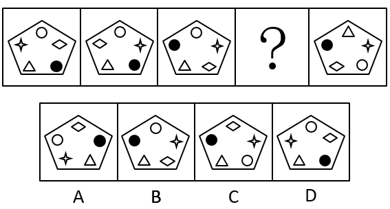

- **A**. A
- **B**. B
- **C**. C　✅
- **D**. D

**答案**：C

**官方解析**

元素组成相同，优先考虑位置规律，通过相邻比较发现，图1和图2中的小元素，只有四角星和菱形互换了位置，其他3个小元素位置没变；图2和图3只有黑圆和菱形互换了位置，其他3个小元素位置没变，因此本题的规律为相邻两幅图之间有且只有两个小元素互换了位置，A项5个小元素位置都变了，B项完全没变，C项只有白圆和菱形互换了位置，D项3个小元素变了位置，只有C项符合规律，且经过验证，C项与题干图5只有三角形和菱形互换了位置，满足规律，C项当选。
故正确答案为C。

---

## 第 4 题　qid 2444033 · 图形推理

从下列所给的四个选项中，选择最合适的一个填入问号内，使之呈现一定的规律性：

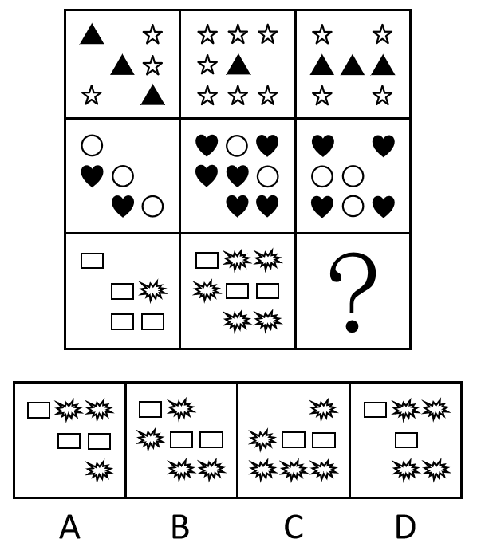

- **A**. A
- **B**. B
- **C**. C
- **D**. D　✅

**答案**：D

**官方解析**

元素组成不同，且无明显属性规律，考虑数量规律。观察发现，题干出现多个小元素，优先考虑元素的种类和个数。九宫格优先横着看，第一行中，五角星的个数分别为3、7、4，即3+4=7，满足五角星个数图1+图3=图2；第二行中，心形的个数别为2、6、4，即2+4=6；依据此规律，第三行中爆炸形的个数应满足图1+图3=图2（矩形数量无法满足此规律），即1+？=5，故？处应有4个爆炸形，排除A、C两项；再观察其他元素，发现第一行三角形的总数量为7，第二行圆形的总数量为8，依照此规律，第三行矩形的总数量应为9，故？处应有2个矩形，排除B项。
故正确答案为D。
注：本题第一行三角形总数为7，第二行圆形总数为8，从而得出第三行中矩形总数应为9。此规律不够严谨，一般情况2个数字不优先考虑存在等差规律，但本题B、D两项最明显的差别就是矩形数量，且考查元素的图形特征较为明显，在没有其他更优规律的情况下，只能接受每行元素之和存在的等差规律，其他题目尽量不考虑此种规律。

---

## 第 5 题　qid 2444034 · 图形推理

从下列所给的四个选项中，选择最合适的一个填入问号处，使之呈现一定的规律性：

- **A**. A
- **B**. B
- **C**. C
- **D**. D　✅

**答案**：D

**官方解析**

思路一：元素组成不同，属性无明显规律，考虑数量规律。题干图形特征呈现出线条交叉明显，可以考虑点数量，第一组图点数量依次是9、7、5，第二组图点数量依次是7、？、3，应选择交点数为5的图形，只有D项符合。
故正确答案为D。
思路二：元素组成不同，属性无明显规律，考虑数量规律。题干图形分割明显，出现大量窟窿，考虑面数量，第一组图面数量为：8、4、3，无规律。继续观察，题干出现多边形，考虑线数量，第一组图线数量为：10、6、5，发现规律为：图形的线数量减去面数量等于2；第二组图应用此规律，面数量依次是6、？、1，线数量依次是8、？、3，故？处应选择线数量减去面数量等于2的图形，只有D项符合。
故正确答案为D。

---

## 第 6 题　qid 2444035 · 定义判断

保险利益原则是指投保人应当对保险标的具有法律上承认的利益，否则会导致保险合同无效。根据上述定义，下列选项不符合保险利益原则的是:

- **A**. 公民杨某为一株座落在他家屋后的国家一级保护植物购买一份财产险　✅
- **B**. 合伙人张某为另一合伙人龚某购买一份人寿险
- **C**. 甲公司为其经营管理的一颗巨型钟乳石购买一份财产险
- **D**. 雇主李某为其员工赵某购买一份意外伤害险

**答案**：A

**官方解析**

第一步：找出定义关键词。
投保人应当对保险标的具有法律上承认的利益、否则会导致保险合同无效。
第二步：逐一分析选项。
A项：一株座落在他家屋后的国家一级保护植物不属于杨某的所属物品，杨某投保后不具有“对保险标的具有法律上承认的利益”，不符合定义，当选；
B项：合伙人张某为另一合伙人龚某购买一份人寿险符合“投保人应当对保险标的具有法律上承认的利益”，符合定义，排除；
C项：甲公司为其经营管理的一颗巨型钟乳石购买一份财产险符合“投保人应当对保险标的具有法律上承认的利益”，符合定义，排除；
D项：雇主李某为其员工赵某购买一份意外伤害险符合“投保人应当对保险标的具有法律上承认的利益”，符合定义，排除。
本题为选非题，故正确答案为A。

---

## 第 7 题　qid 2444036 · 定义判断

资产是指由企业过去的交易或者事项形成的，为企业拥有或控制的，预期会给企业带来经济利益的资源。
根据上述定义，下列属于资产的是：

- **A**. 已经霉烂变质的产品（无使用价值）
- **B**. 企业的职工
- **C**. 存放在受托加工企业的加工物资　✅
- **D**. 企业急需拟购买的材料

**答案**：C

**官方解析**

第一步：找出定义关键词。
“由企业过去的交易或者事项形成的”、“为企业拥有或控制的”、“预期会给企业带来经济利益的资源”。
第二步：逐一分析选项。
A项：已经霉烂变质的产品（无使用价值）不符合“预期会给企业带来经济利益的资源”，不符合定义，排除；
B项：企业的职工是自愿与企业签订劳动合同的人，其人身不被企业拥有，自由不被企业控制，不符合“为企业拥有或控制的”，不符合定义，排除；
C项：存放在受托加工企业的加工物资依然是该企业所有，只是暂时存放在别处，符合“为企业拥有或控制的”，符合定义，当选；
D项：企业急需拟购买的材料不符合“由企业过去的交易或者事项形成的” ，不符合定义，排除。
故正确答案为C。

---

## 第 8 题　qid 2444037 · 定义判断

流动负债是指企业在未来的一年内要求偿还的现实义务。
根据上述定义，下列不应归类为流动负债的是

- **A**. 企业计划下个月向建设银行借入6个月期的贷款500万元　✅
- **B**. 企业未支付的职工工资
- **C**. 企业未上交的各种税收
- **D**. 企业五年半前借入的一笔6年期贷款1000万元

**答案**：A

**官方解析**

第一步：找出定义关键词。
“企业在未来的一年内要求偿还的现实义务”。
第二步：逐一分析选项。
A项：企业计划下个月向建设银行借入6个月期的贷款500万元，只是计划，是还没有发生的事项，不符合 “企业在未来的一年内要求偿还的现实义务”，不符合定义，当选；
B项：企业未支付的职工工资，是企业应尽的义务，符合“企业在未来的一年内要求偿还的现实义务”，符合定义，排除；
C项：企业未上交的各种税收，税收是国家强制性缴纳的，一般不会等一年再缴纳，符合“企业在未来的一年内要求偿还的现实义务”，排除；
D项：企业五年半前借入的一笔6年期贷款1000万元，贷款期限还剩半年，符合“企业在未来的一年内要求偿还的现实义务”，排除。
本题为选非题，故正确答案为A。

---

## 第 9 题　qid 2444038 · 定义判断

行政决策，是指行政机关和行政领导者在处理政务时，从公共利益和公平公正原则出发，依照法律和有关规定所做出的决定性的行政行为。
根据上述定义，下列选项中不属于行政决策的是：

- **A**. 某市政府为倡导垃圾分类，制定了《垃圾分类实施管理办法》
- **B**. 某省政府为建设高速公路占用农民土地，制定了《土地征收补偿标准》
- **C**. 某省消费者协会为规范顾客自带酒水、餐饮企业收取开瓶费等问题，制定了《餐饮业经营行为规范》　✅
- **D**. 中国政府为继续保持稳定的汇率政策，防止亚洲国家陷入新一轮金融动荡，公开作出人民币不贬值的承诺

**答案**：C

**官方解析**

第一步：找出定义关键词。
“行政机关和行政领导者”、“处理政务时”、“从公共利益和公平公正原则出发”、“依照法律和有关规定”、“所做出的决定性的行政行为”。
第二步：逐一分析选项。
A项：某市政府为倡导垃圾分类，制定了《垃圾分类实施管理办法》符合“行政机关和行政领导者”、“处理政务时”、“从公共利益和公平公正原则出发”、“依照法律和有关规定”、“所做出的决定性的行政行为”，符合定义，排除；
B项：某省政府为建设高速公路占用农民土地，制定了《土地征收补偿标准》符合“行政机关和行政领导者”、“处理政务时”、“从公共利益和公平公正原则出发”、“依照法律和有关规定”、“所做出的决定性的行政行为”，符合定义，排除；
C项：某省消费者协会不符合“行政机关和行政领导者”，不符合定义，当选；
D项：中国政府为继续保持稳定的汇率政策，防止亚洲国家陷入新一轮金融动荡，公开作出人民币不贬值的承诺符合“行政机关和行政领导者”、“处理政务时”、“从公共利益和公平公正原则出发”、“依照法律和有关规定”、“所做出的决定性的行政行为”，符合定义，排除。
本题为选非题，故正确答案为C。

---

## 第 10 题　qid 2444039 · 定义判断

行政强制，是指行政机关为了预防或制止正在发生或可能发生的违法行为、危险状态以及不利后果，或者为了保全证据、确保案件查处工作的顺利进行而对相对人的人身、财产采取强制性措施的一种具体行政行为。
根据上述定义，下列哪项不属于行政强制措施行为：

- **A**. 公安机关对甲某涉案的财物予以收缴的行为
- **B**. 海关对有走私嫌疑的乙某经关长批准扣留24小时的行为
- **C**. 药品监管部门对丙某携带的有证据证明可能危及人体健康的药品进行查封的行为
- **D**. 刑警大队对在公共场所有抢劫嫌疑的丁某监视居住的行为　✅

**答案**：D

**官方解析**

第一步：找出定义关键词。
“行政机关”、“为了预防或制止正在发生或可能发生的违法行为、危险状态以及不利后果”、“或者为了保全证据、确保案件查处工作的顺利进行”、“对相对人的人身、财产采取强制性措施的一种具体行政行为”。
第二步：逐一分析选项。
A项：公安机关对甲某涉案的财物予以收缴的行为，符合“行政机关”、“为了预防或制止正在发生或可能发生的违法行为、危险状态以及不利后果”、“或者为了保全证据、确保案件查处工作的顺利进行”、“对相对人的人身、财产采取强制性措施的一种具体行政行为”，符合定义，排除；
B项：海关对有走私嫌疑的乙某经关长批准扣留24小时的行为，符合“行政机关”、“为了预防或制止正在发生或可能发生的违法行为、危险状态以及不利后果”、“或者为了保全证据、确保案件查处工作的顺利进行”、“对相对人的人身、财产采取强制性措施的一种具体行政行为”，符合定义，排除；
C项：药品监管部门对丙某携带的有证据证明可能危及人体健康的药品进行查封的行为，符合“行政机关”、“为了预防或制止正在发生或可能发生的违法行为、危险状态以及不利后果”、“或者为了保全证据、确保案件查处工作的顺利进行”、“对相对人的人身、财产采取强制性措施的一种具体行政行为”，符合定义，排除；
D项：刑警大队对在公共场所有抢劫嫌疑的丁某监视居住的行为，行政机关只监视丁某居住，并没有采取人身、财产强制性措施，不符合“对相对人的人身、财产采取强制性措施的一种具体行政行为”，不符合定义，当选。
本题为选非题，故正确答案为D。

---

## 第 11 题　qid 2444040 · 定义判断

生物武器是以生物战剂杀伤有生力量和破坏植物生长的各种武器、器材的总称。生物战剂包括立克次体、病毒、毒素、衣原体、真菌等。生物战剂是军事行动中用以杀死人、牲畜和破坏农作物的致命微生物、毒素和其他生物活性物质的统称。生物战剂是构成生物武器杀伤威力的决定因素。致病微生物一旦进入机体（人、牲畜等）便能大量繁殖，导致破坏机体功能、发病甚至死亡。它还能大面积毁坏植物和农作物等。
根据上述定义，以下说法错误的是：

- **A**. 生物武器致命性、传染性极强
- **B**. 为了国家安全，可以进行必要的小范围的生物武器研究　✅
- **C**. 生物武器可以使人畜感染得病，并能危及生命，但不会破坏无生命物体
- **D**. 生物武器是利用致病菌、病毒或毒剂等形成杀伤力

**答案**：B

**官方解析**

第一步：找出定义关键词。
生物武器：“以生物战剂杀伤有生力量和破坏植物生长的各种武器、器材”；
生物战剂：“是军事行动中用以杀死人、牲畜和破坏农作物的致命微生物、毒素和其他生物活性物”、“致病微生物一旦进入机体（人、牲畜等）便能大量繁殖，导致破坏机体功能、发病甚至死亡”、“它还能大面积毁坏植物和农作物等”。
第二步：逐一分析选项。
A项：生物武器致命性、传染性极强，符合“致病微生物一旦进入机体（人、牲畜等）便能大量繁殖，导致破坏机体功能、发病甚至死亡”，说法正确，排除；
B项：为了国家安全，可以进行必要的小范围的生物武器研究，题干中并未提及国家安全，说法错误，当选；
C项：生物武器可以使人畜感染得病，并能危及生命，符合“致病微生物一旦进入机体（人、牲畜等）便能大量繁殖，导致破坏机体功能、发病甚至死亡”且微生物只能作用于生命体，所以也不会破坏无生命物体，说法正确，排除；
D项：生物武器是利用致病菌、病毒或毒剂等形成杀伤力，符合“以生物战剂杀伤有生力量和破坏植物生长的各种武器、器材”, 说法正确，排除。
本题为选非题，故正确答案为B。

---

## 第 12 题　qid 2444041 · 定义判断

生态工程是指人类应用生态学和系统学等学科的基本原理和方法，通过系统设计、调控和技术组装，对已被破坏的生态环境进行修复、重建，对造成环境污染和破坏的传统生产方式进行改善，并提高生态系统的生产力，从而促进人类社会和自然环境的和谐发展。
根据上述定义，以下说法错误的是：

- **A**. 生态工程的目的是遵循自然界物质循环的规律，充分发挥资源的生产潜力，防止环境污染，达到经济效益和生态效益的同步发展
- **B**. 建设生态工程的原因是传统经济模式正在毁坏水、大气、土壤和生物资源，消耗地球赠给我们的自然资本
- **C**. 生态工程是一类少消耗、多效益、可持续的工程体系
- **D**. 生态工程的内容可包括沼气工程、桑基鱼塘、退耕还林还草、长江两岸加固河堤等　✅

**答案**：D

**官方解析**

第一步：找出定义关键词。
 “应用生态学和系统学等学科的基本原理和方法”、“对已被破坏的生态环境进行修复、重建，对造成环境污染和破坏的传统生产方式进行改善”、“提高生态系统的生产力”、“促进人类社会和自然环境的和谐发展”。
第二步：逐一分析选项。
A项：充分发挥资源的生产潜力，防止环境污染，符合“提高生态系统的生产力”，达到经济效益和生态效益的同步发展，符合“促进人类社会和自然环境的和谐发展”，说法正确，排除；
B项：生态工程的目的是 “对已被破坏的生态环境进行修复、重建，对造成环境污染和破坏的传统生产方式进行改善”，说明传统生产方式确实会破坏环境，说法正确，排除；
C项：生态工程的目的是“提高生态系统的生产力，从而促进人类社会和自然环境的和谐发展”，说明其本身对环境有益、效率更高，所以“少消耗、多效益、可持续”的说法正确，排除；
D项：“沼气工程、桑基鱼塘、退耕还林还草”均属于生态工程的内容,但是“长江两岸加固河堤” 只是一项水利工程，不属于生态工程，说法错误，当选。
本题为选非题，故正确答案为D。

---

## 第 13 题　qid 2444042 · 定义判断

简单随机抽样也称纯随机抽样，是指直接从总体的所有单位中按照随机原则抽取样本单位的方式。对于总体中每一个单位，被抽取的机会都是相等的，理论上讲，这种抽样方法是最符合随机原则的。
根据上述定义，下列属于简单随机抽样的是：

- **A**. 从全校300个班级中随机抽取30个班级，抽中的班级所有学生入选样本
- **B**. 在学生食堂门口随机拦截300名学生入选样本
- **C**. 从全校所有学生中按照学生学号随机抽取300名学生入选样本　✅
- **D**. 从全校300个班级中随机抽取30个班级，在抽中的班级再按照随机原则每班级抽取10人入选样本

**答案**：C

**官方解析**

第一步：找出定义关键词。
 “直接从总体的所有单位中按照随机原则抽取样本单位的方式”、“总体中每一个单位，被抽取的机会都是相等的”。
第二步：逐一分析选项。
A项：从全校300个班级中随机抽取30个班级，是以班级这个整体为单位进行抽样，这种把总体分成一个个群，然后以群为单位进行抽样的方式，叫做枯群随机抽样，不符合定义，排除；
B项：在学生食堂门口随机拦截300名学生入选样本，食堂门口只是学校的一个地点，不符合“直接从总体的所有单位中按照随机原则抽取样本单位”，不符合定义，排除；
C项：从全校所有学生中按照学生学号随机抽取300名学生入选样本，符合“直接从总体的所有单位中按照随机原则抽取样本单位”，符合定义，当选；
D项：从全校300个班级中随机抽取30个班级，在抽中的班级再按照随机原则每班级抽取10人入选样本，所以抽取的30个班级学生和未抽取班级学生最终被抽中的概率不同，不符合“总体中每一个单位，被抽取的机会都是相等的”，不符合定义，排除。
故正确答案为C。

---

## 第 14 题　qid 2444043 · 定义判断

常住单位是指在本国经济领土上具有经济利益中心的单位。“经济领土”并不等于通常所说的地理或政治领土，前者在后者的基础上，还要加上一些本国在国外的“领土飞地”，其中主要包括驻外的使领馆、新闻或移民机构、科学考察站等，同时需要减去国外在本国类似的“领土飞地”。任何单位要成为某国的一个常住单位，它还必须在该国的经济领土上具有经济利益中心。一经济单位满足以下三个条件则称该经济单位在本国具有经济利益中心：一是在一国的经济领土范围内具有一定的场所（住房、厂房或其他建筑物）；二是从事一定规模的经济活动（如生产、消费）；三是超过一定时期（一般以一年为标准）。一国经济领土上存在着各种形式的常住单位，包括个人或住户，也包括企业、政府行政及事业单位等法律或社会实体。
根据上述定义，下列属于我国常住单位的是：

- **A**. 一个外国企业在上海建立且从事生产经营活动一年以上的独资子公司　✅
- **B**. 华为技术有限公司2016年在法国成立的研发中心
- **C**. 美国驻我国大使馆
- **D**. 为期两周的到我国旅游的日本游客

**答案**：A

**官方解析**

第一步：找出定义关键词。
  常住单位：“在本国经济领土上具有经济利益中心的单位”；
经济领土：“除了通常所说的地理或政治领土，加上一些本国在国外的‘领土飞地’，其中主要包括驻外的使领馆、新闻或移民机构、科学考察站等，同时需要减去国外在本国类似的领土飞地”；
经济利益中心：“一是在一国的经济领土范围内具有一定的场所（住房、厂房或其他建筑物）”、“二是从事一定规模的经济活动（如生产、消费）”、“三是超过一定时期（一般以一年为标准）”。
第二步：逐一分析选项。
A项：一个外国企业在上海建立且从事生产经营活动一年以上的独资子公司，满足经济利益的三个要求，且上海属于我国的地理领土，符合“在本国经济领土上具有经济利益中心的单位”，符合定义，当选；
B项：华为技术有限公司2016年在法国成立的研发中心，法国不属于我国的地理领土，不符合“在本国经济领土上具有经济利益中心的单位”，不符合定义，排除；
C项：美国驻我国大使馆，属于美国的经济领土，不符合“在本国经济领土上具有经济利益中心的单位”，不符合定义，排除；
D项：为期两周的到我国旅游的日本游客，不符合经济利益的第一和第三个要求，不符合定义，排除。
故正确答案为A。

---

## 第 15 题　qid 2444044 · 定义判断

宏观调控是指国家从经济运行的全局出发，依法运用各种宏观经济手段，对国民经济总体的供求关系进行调节和控制。
根据上述定义，以下不属于宏观调控特征的是：

- **A**. 宏观调控行为具有国家主体性
- **B**. 宏观调控行为具有方式的直接性　✅
- **C**. 宏观调控行为具有目的的宏观性
- **D**. 宏观调控行为具有依据的法定性

**答案**：B

**官方解析**

第一步：找出定义关键词。
 “国家从经济运行的全局出发”、“依法运用各种宏观经济手段”、“对国民经济总体的供求关系进行调节和控制”。
第二步：逐一分析选项。
A项：宏观调控行为具有国家主体性，符合“国家从经济运行的全局出发”符合定义，排除；
B项：宏观调控行为具有方式的直接性，不符合“依法运用各种宏观经济手段”、“对国民经济总体的供求关系进行调节和控制”，不符合定义，当选；
C项：宏观调控行为具有目的的宏观性，符合“对国民经济总体的供求关系进行调节和控制”，符合定义，排除；
D项：宏观调控行为具有依据的法定性，符合“依法运用各种宏观经济手段”，符合定义，排除。
本题为选非题，故正确答案为B。

---

## 第 16 题　qid 2444045 · 类比推理

手机：微信：支付

- **A**. 汽车：驾驶：导航
- **B**. 高铁：运输：快捷
- **C**. 电脑：上网：看电影　✅
- **D**. 卫星：定位：方便

**答案**：C

**官方解析**

第一步：判断题干词语间逻辑关系。
手机可以通过微信来实现支付的功能。手机是工具，微信是条件，支付是功能，三者是对应关系。
第二步：判断选项词语间逻辑关系。
A项：驾驶汽车的时候可以通过导航来进行辅助，与题干逻辑关系不一致，排除；
B项：运输是高铁的功能，快捷是高铁运输的属性或特点，与题干逻辑关系不一致，排除；
C项：电脑可以通过上网来实现看电影的功能。电脑是工具，上网是条件，看电影是功能，三者是对应关系，与题干关系一致，当选；
D项：通过卫星来进行定位，方便是卫星定位的属性，与题干逻辑关系不一致，排除。
故正确答案为C。

---

## 第 17 题　qid 2444046 · 类比推理

海啸：地震

- **A**. 医生：病人
- **B**. 天平：砝码
- **C**. 经济危机：滞涨　✅
- **D**. 警察：骚乱

**答案**：C

**官方解析**

第一步：判断题干词语间逻辑关系。
地震可能引发海啸，二者是或然因果关系。
第二步：判断选项词语间逻辑关系。
A项：医生医治病人，二者并非为或然因果关系，与题干逻辑关系不一致，排除；
B项：砝码是天平测量质量的工具，二者之间是配套使用的关系，与题干逻辑关系不一致，排除；
C项：滞涨（经济停滞，失业及通货膨胀同时持续高涨的经济现象）可能会带来经济危机，与题干逻辑关系一致，当选；
D项：警察可以制止骚乱，与题干逻辑关系不一致，排除；
故正确答案为C。

---

## 第 18 题　qid 2444047 · 类比推理

服装：女装：连衣裙

- **A**. 书籍：中文：外文
- **B**. 药品：中药：三七　✅
- **C**. 文学：小说：戏剧
- **D**. 粮食：黄豆：豆腐

**答案**：B

**官方解析**

第一步：判断题干词语间逻辑关系。
连衣裙是一种女装，女装是一种服装，三者之间是种属关系。
第二步：判断选项词语间逻辑关系。
A项：外文和中文是矛盾关系，与题干逻辑关系不一致，排除；
B项：三七是一种中药，中药是一种药品，三者之间是种属关系，与题干逻辑关系一致，当选；
C项：戏剧可以根据小说改编，二者不是种属关系，与题干逻辑关系不一致，排除；
D项：黄豆是制作豆腐的原材料，二者不是种属关系，与题干逻辑关系不一致，排除。
故正确答案为B。

---

## 第 19 题　qid 2444048 · 类比推理

竞争：激烈

- **A**. 学习：刻苦　✅
- **B**. 努力：奋斗
- **C**. 明确：态度
- **D**. 形势：艰苦

**答案**：A

**官方解析**

第一步：判断题干词语间逻辑关系。
激烈可以形容竞争，竞争是动词。
第二步：判断选项词语间逻辑关系。
A项：刻苦可以形容学习，学习是动词，与题干逻辑关系一致，当选；
B项：努力可以用来形容奋斗，但方向反了，与题干逻辑关系不一致，排除；
C项：明确可以用来形容态度，态度是名词，而且方向也反了，与题干逻辑关系不一致，排除；
D项：艰苦可以形容形势，但形势是名词，与题干逻辑关系不一致，排除；
故正确答案为A。

---

## 第 20 题　qid 2444049 · 类比推理

卧薪尝胆：勾践

- **A**. 破釜沉舟：刘邦
- **B**. 入木三分：王羲之　✅
- **C**. 三顾茅庐：孙权
- **D**. 韦编三绝：吕不韦

**答案**：B

**官方解析**

第一步：判断题干词语间逻辑关系。
卧薪尝胆描述的是越王勾践忍辱负重，发愤图强，最终苦尽甘来。
第二步：判断选项词语间逻辑关系。
A项：破釜沉舟描述的是项羽把饭锅打破，把渡船凿沉不留退路，下决心不顾一切地干到底，而非刘邦，与题干逻辑关系不一致，排除；
B项：入木三分描述的是王羲之在木板上写字，木工刻时，发现字迹透入木板三分(1厘米)深，与题干逻辑关系一致，当选；
C项：三顾茅庐描述的是刘备为请诸葛亮出山而三次拜访诸葛亮，描述的不是孙权，与题干逻辑关系不一致，排除；
D项：韦编三绝描述的是孔子勤读《易经》，致使编联竹简的皮绳多次脱断，描述的不是吕不韦，与题干逻辑关系不一致，排除；
故正确答案为B。

---

## 第 21 题　qid 2444050 · 类比推理

讨论对于      相当于工作对于

- **A**. 过程  气氛
- **B**. 热烈  忙碌　✅
- **C**. 集体  认真
- **D**. 会议  结果

**答案**：B

**官方解析**

逐一代入选项。
A项：讨论的过程，二者可以构成偏正关系，工作与气氛无法搭配，前后逻辑关系不一致，排除；
B项：热烈地讨论，忙碌地工作，前后都构成修饰关系偏正结构，前后逻辑关系一致，当选；
C项：集体讨论，二者构成主谓关系，认真工作，二者构成偏正结构，前后逻辑关系不一致，排除；
D项：讨论是会议中的一个流程，二者为对应关系，工作的结果，二者为偏正结构，前后逻辑关系不一致，排除。
故正确答案为B。

---

## 第 22 题　qid 2444051 · 类比推理

对于粮食相当于煤炭对于

- **A**. 小麦  能源　✅
- **B**. 玉米  天然气
- **C**. 浪费  燃烧
- **D**. 生产  运输

**答案**：A

**官方解析**

逐一代入选项。
A项：小麦是粮食的一种，二者为种属关系，煤炭是能源的一种，二者为种属关系，前后逻辑关系一致，当选；
B项：玉米是粮食的一种，二者为种属关系，煤炭和天然气都是能源，二者为并列关系，前后逻辑关系不一致，排除；
C项：浪费粮食，二者为动宾关系，燃烧煤炭，二者为动宾关系，但是前后顺序相反，前后逻辑关系不一致，排除；
D项：生产粮食，二者为动宾关系，运输煤炭，二者为动宾关系，但是前后顺序相反，前后逻辑关系不一致，排除。
故正确答案为A。

---

## 第 23 题　qid 2444052 · 类比推理

湘江：沅江：资江

- **A**. 庐山：三清山：井冈山　✅
- **B**. 岳阳楼：黄鹤楼：鹳雀楼
- **C**. 龙门石窟：云冈石窟：莫高窟
- **D**. 少林寺：白马寺：灵隐寺

**答案**：A

**官方解析**

第一步：判断题干词语间逻辑关系。
湘江、沅江、资江都是处于湖南省境内，三者为并列关系。
第二步：判断选项词语间逻辑关系。
A项：庐山、三清山、井冈山都处于江西省境内，三者为并列关系，与题干逻辑关系一致，当选；
B项：岳阳楼位于湖南省，黄鹤楼位于湖北省，鹳雀楼位于山西省，三者不在同一省份，与题干逻辑关系不一致，排除；
C项：龙门石窟位于河南省，云冈石窟位于山西省，莫高窟位于甘肃省，三者不在同一省份，与题干逻辑关系不一致，排除；
D项：少林寺和白马寺位于河南省，灵隐寺位于浙江省，三者不在同一省份，与题干逻辑关系不一致，排除。
故正确答案为A。

---

## 第 24 题　qid 2444053 · 类比推理

乱闯红灯：交通违章：行政罚款

- **A**. 打架斗殴：扰乱秩序：毁坏公物
- **B**. 经济过热：通货膨胀：货币贬值
- **C**. 市场经济：市场失灵：国家干预
- **D**. 行政垄断：地方保护：法律规制　✅

**答案**：D

**官方解析**

第一步：判断题干词语间逻辑关系。
乱闯红灯是交通违章，二者构成种属关系，交通违章要受到行政罚款，二者为对应关系。
第二步：判断选项词语间逻辑关系。
A项：打架斗殴会扰乱秩序，二者为因果对应，与题干逻辑关系不一致，排除；
B项：经济过热可能造成通货膨胀，通货膨胀可能造成货币贬值，三者构成因果对应，与题干逻辑关系不一致，排除；
C项：市场经济与市场失灵不构成种属关系，与题干逻辑关系不一致，排除；
D项：行政垄断是地方保护的一种，会受到法律规制，与题干逻辑关系一致，当选。
故正确答案为D。

---

## 第 25 题　qid 2444054 · 类比推理

风力：微风：强风：大风：飓风

- **A**. 年龄：垂髫：不惑：耄耋：期颐　✅
- **B**. 季节：春：夏：秋：冬
- **C**. 气象预警：黄色：蓝色：橙色：红色
- **D**. 京剧：生：旦：净：丑

**答案**：A

**官方解析**

第一步：判断题干词语间逻辑关系。
微风：强风：大风：飓风都是风力的级别，而且由弱到强。
第二步：判断选项词语间逻辑关系。
A项：后四词都是形容年龄，而且年龄越来越大，与题干逻辑关系一致，当选；
B项：后四词都是季节，但是四季不存在由弱变强，与题干逻辑关系不一致，排除；
C项：后四词都是气象预警颜色，但是黄色比蓝色要更强，顺序反了，与题干逻辑关系不一致，排除；
D项：生、旦、净、丑都是京剧中的角色，但是四者不存在程度变化，与题干逻辑关系不一致，排除。
故正确答案为A。

---

## 第 26 题　qid 2444055 · 逻辑判断

马化腾、李彦宏、马云三位企业家对房价和物价做了如下预测：
马化腾：只有房价不上涨，物价才不上涨。
李彦宏：房价和物价至少有一个不上涨。
马云：房价上涨当且仅当物价上涨。
若三人的预测都为真，以下哪项符合他们的预测？

- **A**. 只有房价上涨，物价才不上涨
- **B**. 房价不上涨，物价上涨
- **C**. 房价和物价均上涨
- **D**. 房价和物价均不上涨　✅

**答案**：D

**官方解析**

马化腾：- 物价上涨 → - 房价上涨
李彦宏：- 房价上涨 或 - 物价上涨 
马云：物价上涨 → 房价上涨；房价上涨 → 物价上涨
根据马云的话为真可知，要么房价和物价都上涨，要么房价和物价都不上涨，如果都上涨的话，李彦宏的话为假，所以只能都不上涨。
故正确答案为D。

---

## 第 27 题　qid 2444056 · 逻辑判断

有以下几个条件成立：
（1）如果小王是教师，那么小张不是医生。
（2）或者小李是教师，或者小王是教师。
（3）如果小张不是医生，那么小赵不是运动员。
（4）或者小赵是运动员，或者小周是经理。
以下哪项如果为真，可得出“小李是教师”的结论？

- **A**. 小周不是经理　✅
- **B**. 小王是教师
- **C**. 小赵不是运动员
- **D**. 小张不是医生

**答案**：A

**官方解析**

（1）小王是教师  小张是医生

（2）小李是教师 或 小王是教师

（3）小张是医生 小赵是运动员

（4）小赵是运动员 或 小周是经理

要想得到小李是教师，根据（2）可知小王不是教师，根据（1）可知小张是医生，根据（3）可知小赵是运动员，根据（4）可知小周不是经理。

故正确答案为A。

---

## 第 28 题　qid 2444057 · 逻辑判断

有影迷喜欢姜文导演的所有影片。
如果上述断定为真，则以下哪项不可能为真？

- **A**. 姜文导演的所有影片都有影迷喜欢
- **B**. 有影迷不喜欢姜文导演的所有影片
- **C**. 所有影迷都不喜欢姜文导演的某部影片　✅
- **D**. 有影迷不喜欢姜文导演的某部影片

**答案**：C

**官方解析**

逐一分析选项。
A项：有影迷喜欢姜文导演的所有影片，说明至少有一个人喜欢姜文导演的所有影片，那么姜文导演的所有影片都有影迷喜欢，该项一定为真，排除；
B项：有影迷喜欢姜文导演的所有影片，则可能推出有影迷不喜欢姜文导演的所有影片，该项可能为真，排除；
C项：有影迷喜欢姜文导演的所有影片，说明至少有一个人喜欢姜文导演的所有影片，也就是说肯定有人喜欢姜文导演的某部影片，该项一定为假，不可能为真，当选；
D项：有影迷喜欢姜文导演的所有影片，那么可能推出有影迷不喜欢姜文导演的某部影片，该项可能为真，排除。
本题为选非题，故正确答案为C。

---

## 第 29 题　qid 2444058 · 逻辑判断

法律格言说“紧急时无法律”。由此可以推知：

- **A**. 在紧急状态下是不存在法律的
- **B**. 人们在紧急状态下采取紧急避险行为可以不受法律处罚　✅
- **C**. 有法律，就不会有紧急状态
- **D**. 任何时候，法律都以紧急状态作为产生和发展的根本条件

**答案**：B

**官方解析**

逐一分析选项。
A项：题干的意思是紧急时可以不遵守法律，而不是不存在法律，该项无法推出，排除；
B项：题干的意思是紧急时可以不遵守法律，也就是说紧急状态下采取紧急避险行为可以不受法律处罚，该项可以推出，当选；
C项：题干说的是遵守法律的事，而不是有没有法律，该项无法推出，排除；
D项：题干没有说法律产生的根本条件，该项无法推出，排除。
故正确答案为B。

---

## 第 30 题　qid 2444059 · 逻辑判断

在一次国际会议上，来自英、法、中、德四国的甲、乙、丙、丁四位学者恰好相聚在一组讨论。他们每人除了会说自己本国语言外，还会说其他三国语言中的一种，有一种语言三个人都会说。这四位学者交谈的有关情况如下：
（1）乙不会说英语，当甲与丙交谈时，他却能替他们作翻译；
（2）甲是中国人，丁不会说汉语，但他俩却能毫无困难地交谈；
（3）乙、丙、丁三人找不到一种共同的语言进行交谈；
（4）在四人中，没有一人既能用汉语交谈，又能用法语交谈。
据此，可以推出三个人都会说的那种语言是：

- **A**. 汉语
- **B**. 德语　✅
- **C**. 英语
- **D**. 法语

**答案**：B

**官方解析**

因为有一种语言三个人都会说，所以这三个人是能交流的，根据（3）乙、丙、丁三人找不到一种共同的语言进行交谈，说明有两个会说该种语言，一个不会说，而另一个会说的应该是甲，根据（1）可知甲和丙不能交流，所以会说该种语言的不能有丙，则应该是甲乙丁三人。根据（1）乙不会说英语，排除C；根据（2）丁不会说汉语，排除A；根据（4）没有一个人既能用汉语交谈，又能用法语交谈，说明甲不会说法语，排除D。
故正确答案为B。

---

## 第 31 题　qid 2444060 · 逻辑判断

某专家说：如果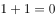，则时间是静止的。

以下哪项和专家所说的同真？

- **A**. 
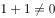或者时间是运动的

- **B**. 
如果时间是静止的，则

- **C**. 
或者时间是运动的

- **D**. 
如果时间是运动的，则
　✅

**答案**：D

**官方解析**

第一步：翻译题干。

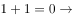时间是静止的

第二步：逐一分析选项。

A项：翻译为或者时间是运动的，根据否一推一可知，时间是运动的，属于对题干的肯前推否后，该项无法推出，排除；

B项：翻译为 时间是静止的，是对题干的肯后，肯后得不出必然结论，该项不能推出，排除；

C项：翻译为 或时间是运动的，根据否一推一可知，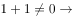时间是运动的，是对题干的否前，否前得不出必然性结论，该项无法推出，排除；

D项：翻译为 时间是运动的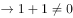，是对题干的否后，否后必否前，可以推出，当选。

故正确答案为D。

---

## 第 32 题　qid 2444061 · 类比推理

科学不是宗教，宗教都主张信仰，所以主张信仰都不科学。
下列选项与题干的逻辑结构相符的是：

- **A**. 广东人不是北京人，北京人都说普通话，所以说普通话的都不是广东人　✅
- **B**. 犯罪行为都是违法行为，违法行为都应受到社会的谴责，所以应受到社会谴责的行为都是犯罪行为
- **C**. 不渴望成功的人都成不了领导，小王渴望成功，所以小王能成为领导
- **D**. 商品都有使用价值，空气有使用价值，所以空气也是商品

**答案**：A

**官方解析**

第一步：翻译题干。

科学（a）→宗教（-b），宗教（b）→主张信仰（c），主张信仰（c）→科学（-a）。

第二步：逐一分析选项。

A项：翻译为:，，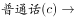，与题干逻辑关系一致，当选；

B项：翻译为:犯罪行为(a)→违法行为(b)，违法行为(b)→受到谴责(c)，受到谴责(c)→犯罪行为(a)，与题干逻辑关系不一致，排除；

C项：翻译为：领导(a)→渴望成功(b)，小王(c)→渴望成功(b)，小王(c)→领导(a)，与题干逻辑关系不一致，排除；

D项：翻译为：商品(a)→使用价值(b)，空气(c)→使用价值(b)，空气(c)→商品(a)，与题干逻辑关系不一致，排除。

故正确答案为A。

---

## 第 33 题　qid 2444062 · 类比推理

张三家丢了一头牛，四位乡邻受到怀疑，经过一番讯问，四人的回答如下：
李甲说：“这事一定是赵丙干的，他一向手脚不干净。”孙乙说：“我没有偷牛。”赵丙说：“我也没有偷牛。”王丁说：“我认为李甲说得对。”后来经过查找，终于找到了盗贼，原来这四位乡邻中只有一个人说了真话，其余三个人都说了假话。请问，谁偷了张三家的牛呢？

- **A**. 李甲
- **B**. 孙乙　✅
- **C**. 赵丙
- **D**. 王丁

**答案**：B

**官方解析**

第一步：找关系。
李甲：赵丙
孙乙：-孙乙
赵丙：-赵丙
王丁：赵丙
根据题干可知，李甲、王丁说的与赵丙矛盾，又因为题干已知只有一人说真话，可知说真话的一定是赵丙。其余三人说假话。
第二步：找关系。
根据孙乙说的是假话，可知是孙乙偷了牛。
故正确答案为B。

---

## 第 34 题　qid 2444063 · 类比推理

某高校举办了一场省级选拔竞赛，有甲、乙、丙、丁四支代表队进入决赛，每支代表队有两名参赛选手，第一名到第八名分别获得10、8、6、5、4、3、2、1分，队伍总分最高者将获得冠军，最后冠军代表学校参赛。比赛的排名情况如下：（1）甲队选手排名是一奇一偶但不相连，乙队选手的排名都是奇数，丙队两名选手的排名相连，丁队选手的排名都是偶数；（2）第一名是甲队选手，第八名是丁队选手：（3）丙队两名选手在乙队两名选手之间，同时也在丁队两名选手之间；（4）各队总分各不相同。
根据以上条件，可以判断各队总分由高到低的排序为：

- **A**. 
甲丙乙丁

- **B**. 
丁甲乙丙

- **C**. 
甲丁乙丙
　✅
- **D**. 
甲乙丁丙

**答案**：C

**官方解析**

根据题干条件，可列表为

因丙队两名选手排名相连，乙队选手排名均为奇数，且丙队两名选手在乙队两名选手之间，故乙队两名选手的排名不能为3、5或5、7，只能为3、7；

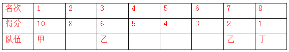

丙队两名选手同时也在丁队两名选手之间，丁队选手排名都是偶数，其中一个为第8名，另一个不能为第6名（若为第6名，则丙队两名选手不能在丁队之间）即丁队可能在2，也可能在4。

假设丁队在4，根据丙队两名选手同时也在丁队两名选手之间，丙队排名相连，可知丙队在5、6，如下表所示：

此时甲只能在2，与题干条件（1）甲队选手排名是一奇一偶但不相连矛盾，因此丁队在2。如下表所示：

此时丙队排名若为4、5，则甲为6；

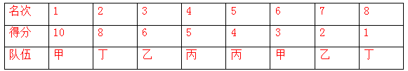

此时得分：甲：13，乙：8，丙：9，丁：9，与丙队得分=丁队得分，与题干（4）各队总分各不相同矛盾，因此排名为：丙队排名5、6，则甲队排名第4。

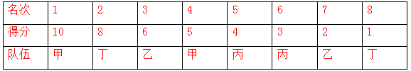

此时甲队得分15分，乙队得分8分，丙队得分7分，丁队得分9分，其排名为：甲＞丁＞乙＞丙。

故正确答案为C。

---

## 第 35 题　qid 2444064 · 逻辑判断

某个饭店里，一桌人边用餐边谈生意。其中，1人是哈尔滨人，2人是北方人，1人是广东人，2个人只做电子设备生意，3个人只做服装生意。假设以上的介绍涉及这餐桌上所有人，那么，这一餐桌上最少可能是几个人？最多可能是几个人？

- **A**. 最少可能是3个人，最多可能是8个人
- **B**. 最少可能是5个人，最多可能是8个人　✅
- **C**. 最少可能是5个人，最多可能是9个人
- **D**. 最少可能是3个人，最多可能是9个人

**答案**：B

**官方解析**

根据题干可知，2人是北方人，其中一人是哈尔滨人，另外还有一人是广东人，由此可知地域上一共涉及3个人。又已知2个人只做电子设备生意，3个人只做服装生意，可知做生意的一共涉及5个人。因为以上介绍涉及桌上所有人，所以如果做生意的5人包含地域上的3人，则最少的人数是5人。最多的人数为：2个北方人+1个广东人+做生意的5人=8人
故正确答案为B。

---
