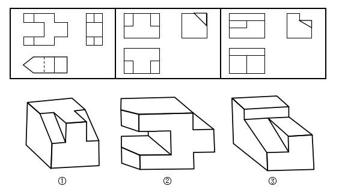

# 2019年河北省公务员录用考试《行测》题（县级+乡镇）（网友回忆版）

> 判断推理 · 35 题 · 河北 2019

## 第 1 题　qid 2387991 · 类比推理

下面三个三视图依次与三个几何体相对应，三个几何体的正确对应顺序是：

- **A**. ②①③　✅
- **B**. ②③①
- **C**. ①③②
- **D**. ③①②

**答案**：A

**官方解析**

本题考查三视图；上边的三视图分别是三个图形的主视图、俯视图和左视图。只有几何图①的视图能看到一个“凸”字形面和左右两个小矩形，所以图①对应的是第二个三视图，排除B、C；几何图②立体图上下长得一样，所以他的正视图也应该是上下长得一样，对应的应该是三视图的第一个，排除D；验证A选项，几何图③俯视图应该有一个长矩形和两个竖着的矩形，刚好对应三视图的第三个，验证没问题，A当选。
故正确答案为A。

---

## 第 2 题　qid 2387992 · 图形推理

从所给的四个选项中，选择最合适的一个填入问号处，使之符合已呈现的规律性：

- **A**. A
- **B**. B
- **C**. C
- **D**. D　✅

**答案**：D

**官方解析**

元素组成不同，优先考虑属性规律，观察发现题干出现全直线，全曲线图形，优先考虑曲直性。第一行图中图1为全曲图形，图2全直图形，图3有曲有直；第二行图中图1为全曲图形，图2全直图形，图3有曲有直；第三行图中图1为全曲图形，图2全直图形，故“？”处应该是有曲有直，排除A选项；
再观察图形发现出现明显窟窿以及图形被分割，考虑面数量；第一行图中面数量都是2，第二行图中面数量都是3，第三行图中面数量都是4，所以“？”处面数量应该是4，只有D选项符合。
故正确答案为D。

---

## 第 3 题　qid 2387993 · 图形推理

把下面的图形分为两类，使每一类图形都有各自的共同规律或特征，分类正确的一项是：

- **A**. ①②④，③⑤⑥
- **B**. ①④⑤，②③⑥
- **C**. ①③④，②⑤⑥　✅
- **D**. ①②⑥，③④⑤

**答案**：C

**官方解析**

元素组成不同，且无明显属性规律，优先考虑数量规律。图形均由直线组成，但直线数量没有规律。继续观察图形发现，图1、图3和图4的起始线和结束线为平行关系，图2、图5和图6的起始线和结束线为垂直关系。因此①③④一组，②⑤⑥一组。
故正确答案为C。

---

## 第 4 题　qid 2387994 · 图形推理

从所给的四个选项中，选择最合适的一个填入问号处，使之符合已呈现的规律性：

- **A**. A　✅
- **B**. B
- **C**. C
- **D**. D

**答案**：A

**官方解析**

元素组成不同，且无明显属性规律，优先考虑数量规律。选项A、B、C中线线交叉明显，故优先考虑数交点。
观察发现题干中图形交点的数量分别为1、2、3、4，呈递增规律，故？处图形应有5个交点，四个选项交点的数量分别为5、4、7、6。
故正确答案为A。

---

## 第 5 题　qid 2387995 · 图形推理

从所给的四个选项中，选择最合适的一个填入问号处，使之符合已呈现的规律性：

- **A**. 柏　✅
- **B**. 说
- **C**. 星
- **D**. 昄

**答案**：A

**官方解析**

解析一：图形都由汉字组成，且观察发现每行汉字都有相同部分，考虑样式遍历。第一行汉字都有“横”，第二行汉字都有“点”，第三行汉字都有“冂”，但是发现无答案。继续观察，可以在第三行汉字中找共同部分，发现都有“竖”，且需要竖线的长度相等（巾字中间的一竖和同左边的一竖长度相等），因此问号处应填入有相同长度的竖线，答案选A。
故正确答案为A。
解析二：观察图形特征，元素组成不同，且属性无明显规律，考虑数量规律。题干图形有明显窟窿，优先考虑面数量。观察发现，第一行面数量之和为2，第二行面数量之和为3，故第三行面数量之和应为4，所以“？”处应当找一个面数量为3的图形。A项2个面，B项1个面，C项2个面，D项3个面。
故正确答案为D。
注：本题为争议题，两个解析都有不严谨的地方，但是经过粉笔教研，倾向于解析一。因为从图形特征上来说，如第二行汉字都有点，其他行都没有，第三行都有“冂”，其他行都没有，更像是命题人想在汉字有相同部分这里设置考点。对于解析二，有两处不好的地方，一是九宫格每行数字运算出来是等差数列，不严谨，更多考查恒定。二是从近年汉字考面的题目来看，汉字考面一般规律会比较明显和严谨，而本题不明显。因此综合来看，答案都不是很好，对比择优，粉笔倾向选A。

---

## 第 6 题　qid 2387997 · 定义判断

对比效应是指评价一个人或一件事时，受最近接触的其他人或事的影响，导致对这个人或这件事的评价发生偏差，作出不客观的评价。
根据上述定义，下列属于对比效应的是：

- **A**. 受父亲的影响，小潘也认为家庭中就应该“男主外，女主内”
- **B**. 小张和小李同时任科长，小张认为自己靠的是能力，而小李靠的是人际关系
- **C**. 选购化妆品时，小丽因为售货员的形象一般就认为该品牌的化妆品较差，放弃购买
- **D**. 演讲比赛时，小王和小吴先后出场，如果小王表现优秀，裁判给小吴的分数会偏低　✅

**答案**：D

**官方解析**

第一步：找出定义关键词。
“评价一个人或一件事时”、“受最近接触的其他人或事的影响”、“对这个人或这件事的评价发生偏差”、“做出不客观的评价”。
第二步：逐一分析选项。
A项：受父亲的影响，小潘认为家庭中应该“男主外，女主内”，不符合“受最近接触的其他人或事的影响”，也不符合“对这个人或这件事的评价发生偏差”，不符合定义，排除； 
B项：小张和小李同时任科长，小张认为自己靠的是能力，而小李靠的是人际关系，不符合“受最近接触的其他人或事的影响”，也不符合“对这个人或这件事的评价发生偏差”，不符合定义，排除；
C项：选购化妆品不符合“评价一个人或一件事”，不符合定义，排除；
D项：演讲比赛时，裁判评价小王和小吴的表现，符合“评价一个人或一件事”， 小王和小吴先后出场，如果小王表现优秀，裁判给小吴的分数会偏低符合“受最近接触的其他人或事的影响”、“对这个人或这件事的评价发生偏差”、“做出不客观的评价”，符合定义，当选。
故正确答案为D。

---

## 第 7 题　qid 2387998 · 定义判断

网络暴力是一种危害严重、影响恶劣的暴力形式，它是在网络上发表具有伤害性、侮辱性和煽动性的言语、图片、视频的行为。
根据上述定义，下列不属于网络暴力的是：

- **A**. 某影视网站发布大量充满暴力和血腥场景的视频　✅
- **B**. 小刘给身材消瘦的同学小马起绰号“竹竿”，并在班级微信群里用“竹竿”称呼小马
- **C**. 小王追求某女生被拒，便用该女生头像P裸体图片发在微信朋友圈，被同学们转发
- **D**. 小柯因乱丢垃圾与宾馆服务员发生口角的视频被发到网上，网友对小柯进行“人肉搜索”，并将其个人隐私公布于网络

**答案**：A

**官方解析**

第一步：找出定义关键词。
“一种危害严重、影响恶劣的暴力形式”、“在网络上发表具有伤害性、侮辱性和煽动性的言语、图片、视频的行为”。
第二步：逐一分析选项。
A项：影视网站发布大量充满暴力和血腥场景的视频，此类视频可能是影视创作中的画面，也可能是真实存在的犯罪行为，但选项未对此进行明确说明，因此不确定是否符合“在网络上发表具有伤害性、侮辱性和煽动性的言语、图片、视频的行为”，不符合定义，当选； 
B项：小刘给小马起绰号为“竹竿”，这一称呼带有侮辱性、伤害性，并在班级群内称呼小马为“竹竿”，这一做法带有煽动性，符合“在网络上发表具有伤害性、侮辱性和煽动性的言语、图片、视频的行为”，符合定义，排除；
C项：小王用该女生头像P裸体图片发在微信朋友圈，符合“在网络上发表具有伤害性、侮辱性和煽动性的言语、图片、视频的行为”，符合定义，排除；
D项：发生口角的视频被发到网上，网友对小柯进行“人肉搜索”，并将个人隐私公布于网络，符合“在网络上发表具有伤害性、侮辱性和煽动性的言语、图片、视频的行为”，符合定义，排除。
本题为选非题，故正确答案为A。

---

## 第 8 题　qid 2387999 · 定义判断

让渡资产使用权是指资产的所有者将资产的使用权暂时转移给他人，以取得相关收益，但不转移资产所有权的行为。
根据上述定义，下列不属于让渡资产使用权的是：

- **A**. 
某家政公司以每月每平米30元的价格承包某写字楼的保洁
　✅
- **B**. 
某城市商业银行向某公司以的年利率发放2亿元的贷款

- **C**. 
某高校将闲置的办公楼以每年50万元的价格出租给某职业技能培训学校

- **D**. 
某企业以每年五千万的价格利用自主研发的操作系统负责某市的智慧城市建设

**答案**：A

**官方解析**

第一步：找出定义关键词。

“资产的所有者将资产的使用权暂时转移给他人”、“以取得相关收益，但不转移资产所有权的行为”。

第二步：逐一分析选项。

A项：家政公司承包某写字楼的保洁工作，是通过劳务来获得收入，不符合“资产的所有者将资产的使用权暂时转移给他人”，“以取得相关收益，但不转移资产所有权的行为”，不符合定义，当选；

B项：商业银行向某企业发放2亿元贷款，符合“资产的所有者将资产的使用权暂时转移给他人”，收取的年利率，符合“以取得相关收益，但不转移资产所有权的行为”，符合定义，排除；

C项：高校将闲置的办公楼出租给某职业技能学校，符合“资产的所有者将资产的使用权暂时转移给他人”， 每年收取50万的租金，符合“以取得相关收益，但不转移资产所有权的行为”，符合定义，排除；

D项：企业利用自主研发的操作系统负责智慧城市建设，符合“资产的所有者将资产的使用权暂时转移给他人”，每年五千万的价格，符合“以取得相关收益，但不转移资产所有权的行为”，符合定义，排除。

本题为选非题，故正确答案为A。

---

## 第 9 题　qid 2388001 · 定义判断

口红效应是指在经济危机时消费者更愿意购买相对廉价的非必需品。经济不景气时，口红的销量反而会直线上升，这是因为在不景气的情况下，人们仍然会有强烈的消费欲望，而口红作为一种“廉价的非必需之物”，可以对消费者起到一定的“安慰”作用。
根据上述定义，下列符合口红效应的是：

- **A**. 张三现在收入很高，但生活简朴的他还是喜欢购买100元左右的衣服
- **B**. 李四近半年基本没有收入，但他用父母的积蓄购买了一辆35万元的轿车
- **C**. 王五还房贷压力很大，单位食堂饭菜价格较高，他经常到路边摊吃10元的盒饭
- **D**. 赵六最近业绩不好，收入较低，为释放压力，每周六晚上都喝50元1瓶的白酒半斤　✅

**答案**：D

**官方解析**

第一步：找出定义关键词。
“在经济危机时”、“消费者更愿意购买相对廉价的非必需品”。
第二步：逐一分析选项。
A项：张三现在收入很高，不符合“在经济危机时”，不符合定义，排除；
B项：李四近半年基本没有收入，符合“在经济危机时”，他用父母的积蓄购买35万元的轿车，不符合“消费者更愿意购买相对廉价的非必需品”，不符合定义，排除；
C项：王五还房贷压力很大，符合“在经济危机时”，他经常到路边摊吃10元的盒饭是在购买必需品，不符合“消费者更愿意购买相对廉价的非必需品”，不符合定义，排除；
D项：赵六最近业绩不好，收入较低，符合“在经济危机时”，他每周六晚上都喝50元1瓶的白酒半斤，符合“消费者更愿意购买相对廉价的非必需品”，符合定义，当选。
故正确答案为D。

---

## 第 10 题　qid 2388002 · 定义判断

“鱼缸法则”是指成长需要自由的空间，要使人成长的更快，就一定要给他活动的自由，而不是将他拘泥在一个小小的鱼缸中。
根据上述定义，下列符合“鱼缸法则”的是：

- **A**. 为吸引优秀人才，河北省持续实施“英才入冀”计划
- **B**. 国际贸易专业的小邓为拓展知识面，经常旁听汉语言文学的课程
- **C**. 某市委组织部选派一批85后优秀年轻干部担任常务副县长，让他们勇挑重担　✅
- **D**. 小欧本可以留在上海，但父母以需要陪伴为名，让小欧回到县城工作

**答案**：C

**官方解析**

第一步：找出定义关键词。
“成长需要自由的空间”、“使人成长的更快”、“要给他活动的自由”、“不是将他拘泥在一个小小的鱼缸中”。 
第二步：逐一分析选项。
A项：为吸引优秀人才，河北省持续实施“英才入冀”计划，“英才入冀”计划目的是吸引人才，不符合“成长需要自由的空间”、“使人成长的更快”、“要给他活动的自由”，不符合定义，排除； 
B项：小邓为拓展知识面，经常旁听汉语言文学的课程，只说明小邓热爱学习，并没有体现谁给小邓提供更多自由，不符合定义，排除；
C项：某市委组织部选派一批85后优秀年轻干部担任常务副县长，让他们勇挑重担，是给这些年轻的干部更多的工作空间，符合定义，当选；
D项：小欧本可以留在上海，但父母以需要陪伴为名，让小欧回到县城工作，是限制了他的自由，不符合 “要给他活动的自由”，不符合定义，排除。
故正确答案为C。

---

## 第 11 题　qid 2388003 · 定义判断

动物权利论认为动物与人类有平等的权利地位，两者有相同的心理特质——需求、记忆、智力等等。因此，所有动物都与人类一样享有平等的权利，这些权利是不应该被人类剥夺的。
根据上述定义，下列符合动物权利论的是：

- **A**. 老夏经常购买鸡胗喂养小区里的流浪猫
- **B**. 李大娘从来不给自家圈养的猪喂剩饭剩菜
- **C**. 老周认为把鸡关在笼子里大面积集中饲养是不人道的行为　✅
- **D**. 老赵认为杀牛之前应先用高压电将牛瞬间电死，以减轻牛的痛苦

**答案**：C

**官方解析**

第一步：找出定义关键词。
“所有动物都与人类一样享有平等的权利”、“这些权利是不应该被人类剥夺的”。
第二步：逐一分析选项。
A项：老夏经常购买鸡胗喂养小区里的流浪猫，购买鸡胗有虐杀鸡的行为，不符合“所有动物都与人类一样享有平等的权利”，不符合定义，排除； 
B项：李大娘从来不给自家圈养的猪喂剩饭剩菜，并没有体现“所有动物都与人类一样享有平等的权利”，不符合定义，排除；
C项：老周认为把鸡关在笼子里大面积集中饲养是不人道的行为，体现了“所有动物都与人类一样享有平等的权利”，符合定义，当选；
D项：老赵认为杀牛之前应先用高压电将牛瞬间电死，以减轻牛的痛苦，不符合“所有动物都与人类一样享有平等的权利”，不符合定义，排除。
故正确答案为C。

---

## 第 12 题　qid 2388004 · 定义判断

正态分布需求曲线，中间突起的部分是“头”，两边相对平缓的部分叫“尾”，集中在“头”部的是大多数需求，分布在“尾”部的是个性化、小量的需求。长尾效应是指将所有分布在“尾”部的市场累加起来就会形成一个比“头”部市场还大的市场，强调“个性化”和“小利润大市场”，即只赚每个人很少的钱，但要赚很多人的钱。
根据上述定义，下列属于长尾效应的是：

- **A**. 很多人不会挑选礼物，小任创办了一个挑选礼物的网站，根据不同客户的要求挑选相应的礼物，每单收取5元服务费。半年后，每月收益超十万元　✅
- **B**. 年轻人网购潮愈演愈烈，老赵的服装店生意日渐萧条，转行经营生鲜产品超市。半年后，每月利润超过原来服装店
- **C**. 小高2010年开了一家网店，主要销售运动鞋，2017年开始帮朋友销售山区物美价廉的土特产，2018年土特产的销售额超过运动鞋
- **D**. 小翟经营一家美术培训学校，生源充足，半年前应广大家长的要求，新增少儿英语培训，目前英语培训收入超过了美术

**答案**：A

**官方解析**

第一步：找出定义关键词。
“将所有分布在‘尾’部的市场累加起来就会形成一个比‘头’部市场还大的市场，强调‘个性化’和‘小利润大市场’”、“只赚每个人很少的钱，但要赚很多人的钱”。
第二步：逐一分析选项。
A项：小任根据用户需求挑选礼物，每单收取5元服务费。半年后，每月收益超十万元，符合“只赚每个人很少的钱，但要赚很多人的钱”，符合定义，当选；
B项：老赵的服装店生意萧条，转行经营生鲜，每月利润超过原来服装店，不符合“只赚每个人很少的钱，但要赚很多人的钱”，不符合定义，排除；
C项：小高销售运动鞋，帮朋友销售土特产，土特产的销售额超过运动鞋，不符合“只赚每个人很少的钱，但要赚很多人的钱”，不符合定义，排除；
D项：小翟应广大家长的要求，新增少儿英语培训，目前英语培训收入超过了美术，不符合“只赚每个人很少的钱，但要赚很多人的钱”，不符合定义，排除。
故正确答案为A。

---

## 第 13 题　qid 2388010 · 定义判断

角色紧张是指某人因为接受外界提出的不同要求而产生的冲突，导致自己承受巨大的心理压力。
根据上述定义，下列属于角色紧张的是：

- **A**. 五年级学生小芳期末考试成绩很差，她的父母相互指责对方没有尽职尽责，吵得不可开交。第二天冷静下来后，小芳的父母都觉得孩子成绩不好，责任主要在自己
- **B**. 某研究所崔研究员获得了一项汽车核心技术专利，某知名汽车厂商欲高薪聘请，而研究所领导许诺为他建设国家级重点实验室，让他陷入深深的纠结之中　✅
- **C**. 老颜老来得子，对孩子百依百顺，结果孩子长大后骄横跋扈，一事无成，这让老颜懊悔不已
- **D**. 老梁得知监察机关正在对自己所犯错误进行调查，到监察机关投案自首，主动交代所犯错误后，感觉压在胸口的石头终于消失了

**答案**：B

**官方解析**

第一步：找出定义关键词。
“接受外界提出的不同要求而产生的冲突，导致自己承受巨大的心理压力”。
第二步：逐一分析选项。
A项：小芳成绩差，父母相互指责吵架，第二天又觉得责任在自己，不符合“接受外界提出的不同要求而产生的冲突，导致自己承受巨大的心理压力”，不符合定义，排除； 
B项：崔研究员获得专利，某知名汽车厂商的高薪聘请和研究所领导许诺的国家级重点实验室，符合“接受外界提出的不同要求而产生的冲突”、让他陷入深深的纠结之中，符合“自己承受巨大的心理压力”，符合定义，当选； 
C项：老颜老来得子，对孩子百依百顺，孩子长大后骄横跋扈，令老颜懊悔不已，不符合“接受外界提出的不同要求而产生的冲突，导致自己承受巨大的心理压力”，不符合定义，排除；
D项：老梁到监察机关投案自首，主动交代所犯错误后，感觉压在胸口的石头终于消失了，不符合“接受外界提出的不同要求而产生的冲突，导致自己承受巨大的心理压力”，不符合定义，排除。
故正确答案为B。

---

## 第 14 题　qid 2388017 · 定义判断

健康传播是一种将医学研究成果转化为大众的健康知识，并通过大众生活态度和行为方式的改变来降低患病率和死亡率，有效提高一个社区或国家生活质量和健康水准的行为。
根据上述定义，下列不属于健康传播的是：

- **A**. 某高中举办预防春季传染病讲座
- **B**. 某小区进行小儿手足口病防治宣传
- **C**. 某省级电视台播出预防白内障的药品广告
- **D**. 某医院举办心脑血管疾病治疗技术学术会议　✅

**答案**：D

**官方解析**

第一步：找出定义关键词。
“将医学研究成果转化为大众的健康知识”、“通过大众生活态度和行为方式的改变来降低患病率和死亡率”。
第二步：逐一分析选项。
A项：某高中举办预防春季传染病讲座符合“将医学研究成果转化为大众的健康知识”、“通过大众生活态度和行为方式的改变来降低患病率和死亡率”，符合定义，排除； 
B项：某小区进行小儿手足口病防治宣传符合“将医学研究成果转化为大众的健康知识”、“通过大众生活态度和行为方式的改变来降低患病率和死亡率”，符合定义，排除；
C项：某省级电视台播出预防白内障的药品广告符合“将医学研究成果转化为大众的健康知识”、“通过大众生活态度和行为方式的改变来降低患病率和死亡率”，符合定义，排除；
D项：某医院举办治疗技术学术会议不符合“将医学研究成果转化为大众的健康知识”，不符合定义，当选。
本题为选非题，故正确答案为D。

---

## 第 15 题　qid 2388024 · 定义判断

“饥饿营销”是指商品提供者有意调低产量，以期达到调控供求关系、制造供不应求“假象”、维持商品较高售价和利润率的目的。饥饿营销比较适合一些单价较高、不容易形成单个商品重复购买的行业。
根据上述定义，下列属于饥饿营销的是：

- **A**. 某矿泉水公司宣称，由于产品供不应求，每瓶售价从2元提高到3元
- **B**. 某户外用品公司向灾区捐赠了十万顶帐篷，提高了该公司的声誉，帐篷销量大增，供不应求
- **C**. 某厂家推出新款汽车，售价高达百万元，消费者疯狂抢购，但厂家宣称由于配件所限无法扩大生产规模，只能限量销售　✅
- **D**. 近期某品牌进口轮胎滞销，经销商主动减少进口量，调高售价，销售额未出现明显下滑

**答案**：C

**官方解析**

第一步：找出定义关键词。
“商品提供者有意调低产量”、“制造供不应求“假象””、“维持商品较高售价和利润率”、“单价较高、不容易形成单个商品重复购买的行业”。
第二步：逐一分析选项。
A项：矿泉水公司将每瓶矿泉水售价从2元提高到3元，不符合“单价较高、不容易形成单个商品重复购买的行业”，不符合定义，排除； 
B项：某户外用品公司帐篷销量大增，供不应求是因为捐赠善举，不符合“有意调低产量”、“单价较高、不容易形成单个商品重复购买的行业”，不符合定义，排除；
C项：厂家新款汽车的售价高达百万元符合“单价较高、不容易形成单个商品重复购买的行业”，符合定义，当选；
D项：某品牌进口轮胎滞销，不符合“商品提供者有意调低产量”、“制造供不应求“假象””“单价较高、不容易形成单个商品重复购买的行业”，不符合定义，排除。
故正确答案为C。

---

## 第 16 题　qid 2388035 · 类比推理

网上购物：现金

- **A**. 高速铁路：钢铁
- **B**. 网络歌曲：光盘　✅
- **C**. 电子政务：公文
- **D**. 电脑游戏：软件

**答案**：B

**官方解析**

第一步：判断题干词语间逻辑关系。
网上购物不需要现金，网上购物是将现金电子化，即二者是前者可以将后者电子化的对应关系。
第二步：判断选项词语间逻辑关系。
A项：钢铁是高速铁路修建的原材料，与题干逻辑关系不一致，排除；
B项：网络歌曲不需要光盘，网络歌曲是将光盘里面的歌曲电子化，二者是前者可以将后者电子化的对应关系，与题干逻辑关系一致，当选；
C项：电子政务是指国家机关在政务活动中应用电子技术办公的模式，而公文也可以通过电子版本的形式呈现，电子政务可以用到公文写作上，与题干逻辑关系不一致，排除；
D项：软件是电脑游戏的载体，与题干逻辑关系不一致，排除。
故正确答案为B。

---

## 第 17 题　qid 2388041 · 类比推理

打印机：扫描仪：外部设备

- **A**. 鲸鱼：鲨鱼：鱼类
- **B**. 火车：动车：列车
- **C**. 阴天：下雨：天气
- **D**. 茄子：茼蒿：蔬菜　✅

**答案**：D

**官方解析**

第一步：判断题干词语间逻辑关系。
打印机和扫描仪分别是两种办公设备，二者为并列关系；打印机和扫描仪都是一种外部设备，是包容关系中的种属关系。
第二步：判断选项词语间逻辑关系。
A项：鲸鱼和鲨鱼为两种不同的生物，二者为并列关系；鲸鱼是一种哺乳类动物，不属于鱼类，与题干逻辑关系不一致，排除；
B项：动车是一种火车，二者为包容关系中的种属关系，与题干逻辑关系不一致，排除；
C项：阴天的时候可以下雨，也可以不下雨；下雨的时候可以是阴天，也可以是晴天，二者是交叉关系，与题干逻辑关系不一致，排除；
D项：茄子和茼蒿为两种不同的蔬菜，二者为并列关系；茄子和茼蒿均为蔬菜，是包容关系中的种属关系，与题干逻辑关系一致，当选。
故正确答案为D。

---

## 第 18 题　qid 2388043 · 类比推理

法律法规：起草：颁布

- **A**. 新闻稿件：采访：选题
- **B**. 购销合同：签订：履行　✅
- **C**. 自由恋爱：结婚：生子
- **D**. 学历学位：硕士：博士

**答案**：B

**官方解析**

第一步：判断题干词语间逻辑关系。
法律法规的出台需要先起草后颁布，且后两词存在时间先后顺序的对应关系。
第二步：判断选项词语间逻辑关系。
A项：新闻稿件的制作需要先选题后采访，后两词时间顺序反了，与题干逻辑关系不一致，排除；
B项：购销合同的实现需要先签订后履行，且后两词存在时间先后顺序的对应关系，与题干逻辑关系一致，当选；
C项：自由恋爱是指未婚的男女双方当事人不受他人干涉指使和威胁等，从相见到相识，并产生好感，发展到恋爱关系，而自由恋爱的实现与结婚、生子无必然关系，与题干逻辑关系不一致，排除；
D项：学历学位包括硕士、博士，后两词与第一词构成种属关系，与题干逻辑关系不一致，排除。
故正确答案为B。

---

## 第 19 题　qid 2388046 · 类比推理

猎豹：猫科：动物

- **A**. 西裤：裤子：服装　✅
- **B**. 细菌：病毒：微生物
- **C**. 玛瑙：石头：宝石
- **D**. 助教：讲师：副教授

**答案**：A

**官方解析**

第一步：判断题干词语间逻辑关系。
猫科一般指猫科动物，而猎豹是猫科动物的一种，猎豹是动物的一种，且猫科动物是动物的一种，三词之间两两构成种属关系。
第二步：判断选项词语间逻辑关系。
A项：西裤是裤子的一种，西裤是服装的一种，且裤子是服装的一种，三词之间两两构成种属关系，与题干逻辑关系一致，当选；
B项：细菌是由细胞构成的，病毒是由DNA或RNA的一个分子构成的，细菌和病毒是两种不同的有机体，属于不同的微生物，前两词构成并列关系，与第三词构成种属关系，与题干逻辑关系不一致，排除；
C项：玛瑙是石头的一种，玛瑙是宝石的一种，均构成种属关系，但宝石是石头的一种，与题干顺序相反，与题干逻辑关系不一致，排除；
D项：助教、讲师、副教授分别是大学教师的不同职称，三词之间构成并列关系，与题干逻辑关系不一致 ，排除。
故正确答案为A。

---

## 第 20 题　qid 2388049 · 类比推理

发动机：汽车

- **A**. 墨汁：毛笔
- **B**. 月光：天空
- **C**. 帆船：大海
- **D**. 翅膀：蝴蝶　✅

**答案**：D

**官方解析**

第一步：判断题干词语间逻辑关系。
发动机是汽车的组成部分，二者为组成关系。
第二步：判断选项词语间逻辑关系。
A项：墨汁不是毛笔的组成部分，与题干逻辑关系不一致，排除；
B项：月光不是天空的组成部分，与题干逻辑关系不一致，排除；
C项：帆船不是大海的组成部分，与题干逻辑关系不一致，排除；
D项：翅膀是蝴蝶的组成部分，二者为组成关系，与题干逻辑关系一致，当选。
故正确答案为D。

---

## 第 21 题　qid 2388051 · 类比推理

语言：交流

- **A**. 颜料：绘画　✅
- **B**. 衣服：装饰
- **C**. 电视：电影
- **D**. 玫瑰：爱情

**答案**：A

**官方解析**

第一步：判断题干词语间逻辑关系。
语言的功能主要是用来交流的，二者是功能的对应关系。
第二步：判断选项词语间逻辑关系。
A项：颜料的功能主要是用来绘画的，与题干逻辑关系一致，当选；
B项：衣服的功能主要是蔽体、遮羞，次要功能才是装饰，与题干逻辑关系不一致，排除；
C项：电视不是用来电影的，而是看电影，与题干逻辑关系不一致，排除；
D项：玫瑰象征爱情，二者是象征关系，与题干逻辑关系不一致，排除。
故正确答案为A。

---

## 第 22 题　qid 2388053 · 类比推理

如履薄冰：谨慎

- **A**. 集腋成裘：节俭
- **B**. 卧薪尝胆：坚持
- **C**. 一尘不染：干净　✅
- **D**. 经天纬地：高度

**答案**：C

**官方解析**

第一步：判断题干词语间逻辑关系。
如履薄冰是指像走在薄冰上一样，和谨慎是近义关系。
第二步：判断选项词语间逻辑关系。
A项：集腋成裘指狐狸腋下的皮毛虽小，但聚集起来就能制成皮衣，比喻积少成多，和节俭无关，与题干逻辑关系不一致，排除；
B项：卧薪尝胆比喻刻苦自励、发愤图强，和坚持无关，与题干逻辑关系不一致，排除；
C项：一尘不染形容环境非常清洁或物体非常干净，和干净是近义关系，与题干逻辑关系一致，当选；
D项：经天纬地形容有治理天下才能的经世之才，和高度无关，与题干逻辑关系不一致，排除。
故正确答案为C。

---

## 第 23 题　qid 2388055 · 类比推理

鸡蛋：蛋糕

- **A**. 铅芯：铅笔
- **B**. 水泥：水泥路
- **C**. 鞋子：鞋带
- **D**. 榆钱：榆钱饼　✅

**答案**：D

**官方解析**

第一步：判断题干词语间逻辑关系。
鸡蛋是蛋糕的原材料，且蛋糕属于食物范畴。
第二步：判断选项词语间逻辑关系。
A项：铅笔包含铅芯，二者是组成关系，与题干逻辑关系不一致，排除；
B项：水泥是水泥路的原材料，但水泥路不是食物范畴，与题干逻辑关系不一致，排除；
C项：鞋子可能包含鞋带，二者是组成关系，与题干逻辑关系不一致，排除；
D项：榆钱是榆钱饼的原材料，且榆钱饼属于食物范畴， 与题干逻辑关系一致，当选。
故正确答案为D。

---

## 第 24 题　qid 2387996 · 类比推理

（    ）对于 小说 相当于（    ）对于 软件

- **A**. 诗歌  硬件
- **B**. 作家  工程师　✅
- **C**. 创作  应用
- **D**. 素材  计算机

**答案**：B

**官方解析**

逐一代入选项。
A项：诗歌和小说都是一种文学体裁，为并列关系中的反对关系，软件和硬件为并列关系中的矛盾关系，前后逻辑关系不一致，排除；
B项：作家创作小说，工程师编写软件，均为对应关系，前后逻辑关系一致，当选；
C项：创作小说为动宾关系，应用软件可以理解为动宾关系，也可以理解为我们日常手机中使用的软件，应用软件是和系统软件相对应的，是用户可以使用的各种程序设计语言，以及用各种程序设计语言编制的应用程序的集合，此种理解下前后逻辑关系不一致，排除；
D项：写小说需要素材，使用计算机需要软件，均为对应关系，但是词语顺序错误，排除。
故正确答案为B。

---

## 第 25 题　qid 2388000 · 类比推理

清洁工 对于（    ）相当于 医生 对于（    ）

- **A**. 马路  医院
- **B**. 清扫车  手术台
- **C**. 保洁  治病　✅
- **D**. 工作服  听诊器

**答案**：C

**官方解析**

逐一代入选项。
A项：清洁工清扫马路，马路是清洁工清洁的对象，也可以说清洁工可能在马路上工作，为工作场所的对应关系，但医生的工作地点是医院，不能看成工作的对象是医院，前后逻辑关系不一致，排除；
B项：清扫车是清洁工工作使用的一个工具，为人物与工具的对应关系，手术台是医生工作的一个地点，为人物与地点的对应关系，前后逻辑关系不一致，排除；
C项：清洁工的职责是保洁，医生的职责是治病，二者均为功能对应，前后逻辑关系一致，当选；
D项：清洁工工作时穿清洁服，为人物与服装的对应关系，医生工作时使用听诊器，为人物与工具的对应关系，前后逻辑关系不一致，排除。
故正确答案为C。

---

## 第 26 题　qid 2388005 · 逻辑判断

对某市第二中学初中部学生的调查发现，拥有数学学习机人数最多的班也是数学成绩最好的班。因此，利用数学学习机可以提高数学成绩。
以下哪项如果为真，最能加强上述结论？

- **A**. 拥有数学学习机的学生学习数学的积极性和主动性明显提高
- **B**. 拥有数学学习机人数最多的班也是最会利用数学学习机的班
- **C**. 随着数学学习机性能的不断改善，对提高学生数学成绩的作用越来越明显
- **D**. 拥有数学学习机人数最多的班里的同学，更多地利用数学学习机学习数学　✅

**答案**：D

**官方解析**

第一步：找出论点和论据。
论点：利用数学学习机可以提高数学成绩。
论据：拥有数学学习机人数最多的班也是数学成绩最好的班。
本题论点在说利用数学学习机可以提高数学成绩，论据在说拥有数学学习机人数多的班数学成绩好，“拥有”和“使用”不是同一件事，话题不完全一致，若要加强优先考虑搭桥，即拥有的人会使用。
第二步：逐一分析选项。 
A项：论点说的是利用数学学习机可以提高数学成绩，该项说的是拥有数学学习机的学生学习数学的积极性和主动性明显提高，数学成绩是否提高不知道，属于不明确项，无法加强，排除；
B项：论点说的是利用数学学习机可以提高数学成绩，该项说的是拥有数学学习机人数最多的班也是最会利用数学学习机的班，在“拥有”数学学习机与“利用”数学学习机之间建立联系，搭桥项，保留；
C项：该项说的是数学学习机性能的改善，对提高学生数学成绩的作用越来越明显，是补充论据，有一定的加强作用，保留；
D项：该项在“拥有”数学学习机和“利用”数学学习机之间建立关系，即在论点和论据之间进行搭桥，保留。
比较C、D两项，C项是补充论据支持，D项是搭桥，因此D项的加强力度优于C项。
比较B、D两项，B项说的是“班”，而D项说的是“同学”，论点中利用数学学习机来提高数学成绩的是使用数学学习机的人，D项比B项搭桥更有针对性，且B项“最会使用”指会用，而D项“更多地利用”指常用，二者比较，后者更可能是提高成绩的关键，因此D项优于B项。
故正确答案为D。

---

## 第 27 题　qid 2388006 · 逻辑判断

某村庄南北两块小麦地里，南面的地施用了生物复合肥，北面的地则没有。收割完小麦测算后发现，南面的地亩产450公斤，北面的地亩产200公斤。由此可见，施用生物复合肥是南北两块地小麦亩产差异较大的原因。
以下哪项如果为真，最能削弱上述结论？

- **A**. 南北两块小麦地均由老杨管理
- **B**. 南北两块小麦地的土壤质量不同　✅
- **C**. 村南小麦地里施用的生物复合肥已过保质期
- **D**. 村西的小麦地里也施用了该生物复合肥，亩产只有230公斤

**答案**：B

**官方解析**

第一步：找出论点和论据。
论点：施用生物复合肥是南北两块小麦地亩产差异较大的原因。
论据：某村庄南北两块小麦地里，南面的地施用了生物复合肥，北面的地则没有。收割完小麦测算后发现，南面的地亩产450公斤，北面的地亩产200公斤。
本题论点论据话题一致，考虑削弱论点，论点包含因果关系，除了直接削弱论点还有可能考查他因削弱。
第二步：逐一分析选项。
A项：该项说的是南北两块小麦地均由老杨管理，属于在对比试验中控制变量，具有加强作用，无法削弱，排除；
B项：该项说的是南北两块小麦地的土壤质量不同，提出另外一个因素即土壤质量不同，可能是这个因素导致南北两块小麦地亩产差异较大，属于他因削弱，当选；
C项：该项说的是村南小麦地里施用的生物复合肥已过保质期，但是过期不代表一定没有效果，过期后能不能提高产量造成较大差异不知道，属于不明确选项，无法削弱，排除； 
D项：该项说的是村西的小麦地里也施用了该生物复合肥，亩产只有230公斤，题干论点探讨的是南北两块地的亩产差异，话题不一致，无法削弱，排除。
故正确答案为B。

---

## 第 28 题　qid 2388007 · 逻辑判断

只要抢救及时并且方法得当，这头大象就不会死亡，但目前这头大象死亡了。
根据以上论述，下列哪项一定为真？

- **A**. 对这头大象的抢救不及时，但方法得当
- **B**. 对这头大象的抢救很及时，但方法不得当
- **C**. 如果对这头大象的抢救是及时的，那么大象死亡的原因肯定是方法不得当　✅
- **D**. 如果这头大象的死因是抢救不及时，那么方法不得当就不会是大象的死因

**答案**：C

**官方解析**

第一步：翻译题干。

（1）抢救及时且方法得当  大象死亡；

（2）大象死了。

条件（2）是对条件（1）的否后，根据逆否等价可得（抢救及时且方法得当），即抢救及时或方法得当。

第二步：逐一分析选项。

A项：翻译为抢救及时且方法得当，为或关系的三种情况之一，并非一定为真，无法推出，排除；

B项：翻译为抢救及时且方法得当，为或关系的三种情况之一，并非一定为真，无法推出，排除；

C项：翻译为抢救及时方法得当，根据或关系的否一推一，可以推出，当选；

D项：翻译为抢救及时方法得当，是对或关系其中一项的肯定，并非一定为真，无法推出，排除。

故正确答案为C。

---

## 第 29 题　qid 2388008 · 逻辑判断

今年4月18日，某城市日报刊发消息称，目前大部分西红柿使用催熟剂，而过量使用催熟剂会给人体带来较大危害。该消息刊发后，对该城市消费者产生的影响极其有限，几乎没有消费者想改变购买西红柿的习惯。但到了五月中旬，该城市生鲜食品超市的西红柿销量大幅度下降了。
以下哪项如果为真，能最好地解释上述现象？

- **A**. 4月25日，该城市的电视台也播出了这则消息
- **B**. 5月份时，很多消费者选择在家门口的菜摊上购买西红柿
- **C**. 5月份时，大部分生鲜食品超市为树立自身良好形象，不再销售西红柿　✅
- **D**. 该城市周边的菜农们认为这条消息会使西红柿的销量大幅度萎缩，主动降低了产量

**答案**：C

**官方解析**

第一步：找出题干矛盾。
该消息刊发后，几乎没有消费者想改变购买西红柿的习惯。但到了五月中旬，该城市生鲜食品超市的西红柿销量大幅度下降了。
第二步：逐一分析选项。
A项：该项只是介绍了另外的一种宣传方式，且时间在5月之前，无法解释为何“五月中旬，该城市生鲜食品超市的西红柿销量大幅度下降了”，不能解释题干矛盾，排除；
B项：该项表明消费者可以在家门口购买西红柿，可以解释“五月中旬，该城市生鲜食品超市的西红柿销量大幅度下降了”，但是无法解释“该消息刊发后，几乎没有消费者想改变购买西红柿的习惯”，不能解释题干矛盾，排除；
C项：该项表明在5月份里，超市主动不再销售西红柿，可以解释为何消费者消费习惯几乎不变，但是“五月中旬，该城市生鲜食品超市的西红柿销量大幅度下降了”，可以解释题干矛盾，当选；
D项：该项只是说明菜农们降低产量，无法解释为何“五月中旬，该城市生鲜食品超市的西红柿销量大幅度下降了”，不能解释题干矛盾，排除。
故正确答案为C。

---

## 第 30 题　qid 2388009 · 逻辑判断

今年“五一”期间，某品牌服装店进行促销活动，根据顾客身份证上的出生年份打折，如1986年出生的，打86折，1999年及以后出生的统一打99折。该活动由于宣传到位，备货充足，顾客盈门，“五一”假期销售额同比增长。该服装店老板认为此次促销活动非常成功。

以下哪项如果为真，最能反驳该服装店老板的结论？

- **A**. 
1986年到1996年出生的顾客占比超过

- **B**. 
今年“五一”假期全国服装销售额同比增长

- **C**. 
今年“五一”假期比去年多一天，消费者有更多的购物时间

- **D**. 
另一个街区该品牌服装店没有促销活动，“五一”假期销售额也增长了
　✅

**答案**：D

**官方解析**

第一步：找出论点和论据。

论点：此次促销活动非常成功。

论据：该活动由于宣传到位，备货充足，顾客盈门，“五一”假期销售额同比增长。

本题的论点是此次促销活动很成功，论据是“五一”销售额同比增长了，论点论据话题不一致，可以进行拆桥，拆开二者的关系，说明销售额的增长不代表促销活动是成功的。 

第二步：逐一分析选项。

A项：只说明1986-1996这十年出生的顾客所占的比重大，但是和促销活动是否成功没有关系，无法削弱，排除；

B项：今年“五一”假期全国服装销售额同比增长，说的是全国的服装销售状况，而题干讨论的是某家服装店的销售情况，话题不一致，而且也不明确全国高增长服装店有没有做活动，是否成功，无法削弱，排除；

C项：今年五一期间消费者的购物时间比去年多一天，虽然购物时间延长可能会带来销售额的增长，但是增长多少并没有说明，所以不明确此次活动是否成功，无法削弱，排除；

D项：另一个街区该品牌店没有促销活动，但“五一”假期销售额也增长了，说明是否举办促销活动可能对销售额的增长没有影响，因此，销售额增长不代表促销活动是成功有效的，拆开论点论据之间的关系，可以削弱，当选。

故正确答案为D。

---

## 第 31 题　qid 2388020 · 逻辑判断

甲、乙、丙、丁四人的生活水平一共有三种：富裕、小康、贫困。甲和丁的生活水平一样，乙和丙的生活水平不是小康。
根据以上条件，以下哪项不可能为真？

- **A**. 甲是富裕　✅
- **B**. 乙是贫困
- **C**. 乙是富裕
- **D**. 丁是小康

**答案**：A

**官方解析**

第一步：分析题干。
（1）甲、乙、丙、丁四人生活水平一共有三种：富裕、小康、贫困
（2）甲和丁的生活水平一样
（3）乙和丙的生活水平不是小康
第二步：根据题干条件分析选项。
根据（3）可知小康水平只能是甲或丁，根据（2）可知二者生活水平一样，所以二者都是小康水平，因此A项甲是富裕不可能为真。
本题为选非题，故正确答案为A。

---

## 第 32 题　qid 2388023 · 逻辑判断

近三年来，某市文化产业的年利润基本稳定在两亿元左右。据估算，扣除物价上涨因素，未来几年利润总额不会随着新的文化产业场所的出现而扩大。因此，随着电影院数量的增多，KTV的收入会随之减少。
以下哪项如果为真，能对上述论证提出最大质疑？

- **A**. 电影院数量虽然逐渐增长，但其数量仍少于KTV
- **B**. 由于电影院的增多，人们花在电影院和KTV以外文化场所的消费明显减少　✅
- **C**. 大部分KTV为适应新形势，重新进行装潢，树立新形象并提高服务质量
- **D**. 电影院的人均消费高于KTV，而且大部分人认为电影院的环境不太好，缺乏吸引力

**答案**：B

**官方解析**

第一步：找出论点和论据。

论点：随着电影院数量的增多，KTV的收入会随之减少。

论据：据估算，扣除物价上涨因素，未来几年利润总额不会随着新的文化产业场所的出现而扩大。

本题论点论据说的都是文化产业场所的数量和收入的问题，话题一致，因此可优先考虑否定论点，即说明即使电影院数量增多，KTV收入也不会减少。

第二步：逐一分析选项。

A项：该项说的是电影院数量比KTV数量少，论点讨论的是随着电影院数量增多，KTV的收入是否会减少，场所数量和收入之间无必然联系，话题不一致，无法削弱，排除；

B项：论点为电影院数量的增多会导致KTV的收入随之减少，因为利润总额基本不变，要削弱这个论证，只要指出虽然总利润基本不变，KTV收入并不会少即可，该项说明人们用于文化场所的消费明显减少，所以KTV的收入不会减少，可以削弱，当选；

C项：该项说的是KTV树立新形象且提高服务质量，论点讨论的是KTV的收入，服务提高不代表收入一定提高，话题不一致，无法削弱，排除；

D项：该项明确说明大部分人认为电影院环境不太好，缺乏吸引力，因此就不喜欢去，但KTV的收入增多还是减少不确定，无法削弱，排除。

故正确答案为B。

备注：经过粉笔教研发现，本题的出题思路来源于MBA和GCT考试中，如下图所示，MBA和GCT考试题答案给到的是D项，这里应该是一样的答案设置，也就是上题的B项， 2019年河北这道题确实模仿得不够严谨，不严谨的题在我们的备考阶段不作为考试重点，我们简单了解思路即可。

---

## 第 33 题　qid 2388029 · 逻辑判断

如果狗患有行为焦虑症，则狗血液里镁离子的含量要高于正常狗。通过口服一种名叫因菲他命的药物，可以有效清除狗血液里的镁离子。因此，口服因菲他命可以用来治疗狗的行为焦虑症。
上述论证基于以下哪项假设？

- **A**. 正常狗的血液里没有镁离子
- **B**. 口服因菲他命对狗不会产生任何副作用
- **C**. 患行为焦虑症不同阶段的狗需要口服不同剂量的因菲他命
- **D**. 行为焦虑症不会使患病狗的血液里产生比正常狗更多的镁离子　✅

**答案**：D

**官方解析**

第一步：找出论点和论据。
论点：口服因菲他命可以用来治疗狗的行为焦虑症。
论据：如果狗患有行为焦虑症，则狗血液里镁离子的含量要高于正常狗。通过口服一种名叫因菲他命的药物，可以有效清除狗血液里的镁离子。
论点讨论的是口服因菲他命可治疗狗的行为焦虑症，论据说的是口服因菲他命可清除狗血液里的镁离子，而镁离子与焦虑症有关，所以话题一致，结合提问“假设”，考虑必要条件。
第二步：逐一分析选项。
A项：正常狗的血液里是否有镁离子，与口服因菲他命是否可以治疗狗的行为焦虑症无关，不是论证成立的假设，排除；
B项：口服因菲他命是否产生副作用，与口服因菲他命是否能治疗狗的行为焦虑症无关，不是论证成立的假设，排除；
C项：患行为焦虑症不同阶段的狗要口服不同剂量的因菲他命，但是否能够用来治疗狗的行为焦虑症不清楚，不是论证成立的假设，排除；
D项：如果焦虑症导致镁离子增多，那即使减少镁离子也不能治疗焦虑症，该项是论证成立的前提，当选。
故正确答案为D。

---

## 第 34 题　qid 2388031 · 逻辑判断

所有的艺术家都懂音乐，有些懂音乐的写诗歌，你不写诗歌，所以你不是艺术家。
以下哪项的推理结构与上述推理的形式最为类似？

- **A**. 所有的羊都吃草，有些吃草的吃田螺，牛不吃田螺，所以牛不是羊　✅
- **B**. 所有工业设计专业的学生都会画图，有些会画图的爱好书法，小明不会画图，所以小明不是工业设计的学生
- **C**. 所有的教授都承担过国家级课题，有些承担国家级课题的是名教授，老范是普通教授，所以老范没承担过国家级课题
- **D**. 所有的女士都爱美，有些爱美的还喜欢健身，小丽不喜欢健身，所以小丽不是爱美的女士

**答案**：A

**官方解析**

第一步：翻译题干。

题干的逻辑形式为：A→B，有些B→C，D→C，所以D→A。

第二步：逐一分析选项。

A项：A→B，有些B→C，D→C，所以D→A，与题干逻辑形式一致，当选；

B项：A→B，有些B→C，D→B，所以D→A，与题干逻辑形式不一致，排除；

C项：A→B，有些B→C，D→C，所以D→B，与题干逻辑形式不一致，排除；

D项：A→B，有些B→C，D→C，所以D→B，与题干逻辑形式不一致，排除。

故正确答案为A。

---

## 第 35 题　qid 2388037 · 逻辑判断

最近，某市城管局整理档案资料时，发现了马六的两份资料，且两份资料中的马六是同一个人。第一份资料的落款时间是1992年8月28日，是马六占道经营被处罚的记录。第二份资料是马六宣称他已经断断续续占道经营10年的声明，没有落款时间。
根据以上叙述，可以推出的是：

- **A**. 马六因为占道经营经常被处罚
- **B**. 第二份资料的时间早于第一份资料
- **C**. 第二份资料的书写时间早于2005年　✅
- **D**. 马六在1982年9月份左右开始占道经营

**答案**：C

**官方解析**

日常结论题，根据题干信息逐一分析选项。
A项：该项说马六经常因占道经营被处罚，而题干只在第一份资料中提到了一次处罚，故不能体现经常这样的频率，无中生有，排除；
B项：题干中第二份资料没有落款时间，同时也无法得知其具体时间，故无法得知两份资料的时间先后，无法推出，排除；
C项：由第一份资料可知马六最晚在1992年就开始占道经营，又从第二份资料知道他已经占道经营10年时间，那么第二份资料最晚是在2002年写下的，可以得到其书写早于2005年，可以推出，当选；
D项：根据两份资料只能得出马六最晚在1992年开始占道经营，但不能推出具体在哪一年开始占道经营，无法推出，排除。
故正确答案为C。

---
