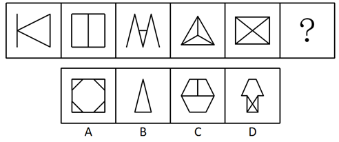
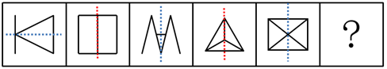
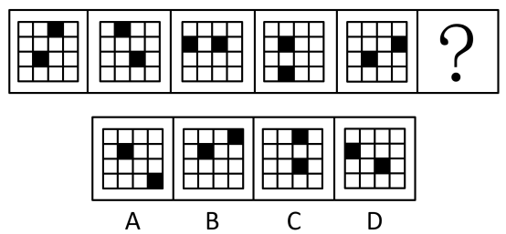
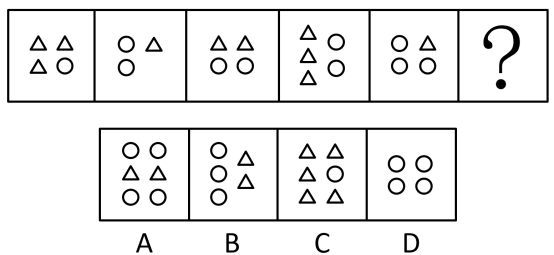
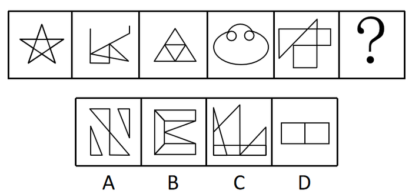
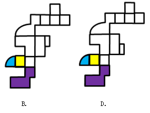
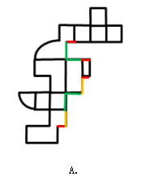

# 2019年浙江省公务员录用考试《行测》题（B类）（网友回忆版）

> 判断推理 · 35 题 · 浙江 2019

## 第 1 题　qid 2387635 · 图形推理

从所给的四个选项中，选择最合适的一个填入问号处，使之呈现一定的规律性：

- **A**. A
- **B**. B
- **C**. C　✅
- **D**. D

**答案**：C

**官方解析**

元素组成不同，优先考虑属性规律，题干中图1、图4都出现等腰三角形，是轴对称的特征图，优先考虑轴对称；题干和选项都是轴对称图形，无法排除。观察发现，如下图所示：

图1、图3、图5的对称轴与图形内部线条都不重合，而图2、图4的对称轴都与图形内部的一根线条重合，因此问号处要填入一个对称轴与图形内部线条有重合的选项，只有C选项满足。

故正确答案为C。

注：本题有同学的解题思路是对称轴的数量与面数量一致，选择B项。但是粉笔认为选C项的原因有二：第一，本题题干第五幅图形外框为长方形，其对称轴的数量应为横竖2条，而面数量为4，二者数量并不一致；第二，从近年来的命题规律来看，2019年国考和2018年北京市考都考查了对称轴与图形中线条重合这一知识点，C选项更符合最新的命题趋势。

---

## 第 2 题　qid 2387638 · 图形推理

从所给的四个选项中，选择最合适的一个填入问号处，使之呈现一定的规律性：

- **A**. A
- **B**. B
- **C**. C
- **D**. D　✅

**答案**：D

**官方解析**

元素组成相同，优先考虑位置规律，如下图所示： 

标注“1”的小黑块，沿着最外圈依次逆时针平移1、2、3、4格，所以正确答案处应该移动5格，对应D选项；再验证另外一个标注“2”的小黑块，标注“2”的小黑块。沿着最内圈依次逆时针平移1格，D项当选。

故正确答案为D。

---

## 第 3 题　qid 2387639 · 图形推理

从所给的四个选项中，选择最合适的一个填入问号处，使之呈现一定的规律性：

- **A**. A
- **B**. B　✅
- **C**. C
- **D**. D

**答案**：B

**官方解析**

通过观察题干发现，每个图形都只出现了两种小元素，考虑元素间的换算关系，根据基本换算公式“图1+图3=2*图2”，最后换算的结果为1圆=3三角形，代入题干，将圆全部换算成三角形可知，分别有6、7、8、9、10个三角形，故“？”处图形应有11个三角形。A项换算为14个三角形，排除；B项换算为11个三角形，保留；C项换算为8个三角形，排除；D项换算为12个三角形，排除。
故正确答案为B。

---

## 第 4 题　qid 2387641 · 图形推理

从所给的四个选项中，选择最合适的一个填入问号处，使之呈现一定的规律性：

- **A**. A
- **B**. B
- **C**. C
- **D**. D　✅

**答案**：D

**官方解析**

元素组成不同，且无明显属性规律，优先考虑数量规律。每个图形中都有多个窟窿，故可以考虑数面。题干所有图形面的数量均为3，四个选项面的数量分别为2、2、4、3，只有D项符合规律。
故正确答案为D。

---

## 第 5 题　qid 2387642 · 图形推理

从所给的四个选项中，选择最合适的一个填入问号处，使之呈现一定的规律性：

- **A**. A
- **B**. B
- **C**. C
- **D**. D　✅

**答案**：D

**官方解析**

元素组成不同，无明显属性规律，考虑数量规律。观察发现，图①是五角星，图②出现明显端点，考虑笔画数。题干图形均为一笔画图形，A项为三笔画，B项为三笔画，C项为两笔画，D项为一笔画。
故正确答案为D。

---

## 第 6 题　qid 2387644 · 图形推理

把下面的六个图形分为两类，使每一类都有各自的共同特征或规律，分类正确的一项是：

- **A**. ①②③，④⑤⑥
- **B**. ①②⑤，③④⑥　✅
- **C**. ①②④，③⑤⑥
- **D**. ①③⑥，②④⑤

**答案**：B

**官方解析**

本题为分组分类题目。观察发现，题干图形均由一个小白圆和另一个图形组成，故考虑功能元素。图①②⑤中小白圆均标记直角，图③④⑥中的小白圆均标记锐角。即①②⑤一组，③④⑥一组。
故正确答案为B。

---

## 第 7 题　qid 2387646 · 图形推理

把下面的六个图形分为两类，使每一类都有各自的共同特征或规律，分类正确的一项是：

- **A**. ①③④，②⑤⑥　✅
- **B**. ①③⑥，②④⑤
- **C**. ①②③，④⑤⑥
- **D**. ①④⑤，②③⑥

**答案**：A

**官方解析**

元素组成不同，且无明显属性规律，优先考虑数量规律，图②只有一条曲线，其他图形有曲有直，分别数出直线条数与曲线条数，图①③④中直线条数-曲线条数=1，图②⑤⑥中曲线条数-直线条数=1。则图①③④一组，图②⑤⑥一组。
故正确答案为A。

---

## 第 8 题　qid 2387648 · 图形推理

从所给的四个选项中，选择最合适的一个填入问号处，使之呈现一定的规律性：

- **A**. A
- **B**. B
- **C**. C　✅
- **D**. D

**答案**：C

**官方解析**

元素组成相似，考虑样式规律。观察发现，黑块数量不同，考虑黑白运算。根据第一行图形可知：黑+白=黑，白＋黑=黑，黑＋黑=白，白+白＝白；第二行验证此规律成立；第三行运用规律可得？处应为C项。
故正确答案为C。

---

## 第 9 题　qid 2387649 · 图形推理

下图是给定的立体图形，它的主视图和左视图是：

- **A**. A
- **B**. B
- **C**. C　✅
- **D**. D

**答案**：C

**官方解析**

本题考查三视图。题干当中右侧的“L”型的高度应高于左侧的立方体，且从整个图形的左侧看过去，立方体与“L”型的立体图形的宽度是一样的，对应C选项。
故正确答案为C。

---

## 第 10 题　qid 2387654 · 图形推理

下图是给定的立体图形，下列哪个选项是该立体图形的外表面展开图？

- **A**. A　✅
- **B**. B
- **C**. C
- **D**. D

**答案**：A

**官方解析**

本题为空间重构题。观察选项，主要区别在于左侧的小扇形和右侧的小矩形的位置不同，从这个特殊点入手，回到题干立体图形观察扇形面的两条直角边，分别挨着的是一个矩形面和底面的“L”型，比较B、D两项，如下图所示，

扇形面的两条直角边挨着的面与题干立体图形不符，排除；比较A、C两项，区别是右侧的小矩形，依据右侧小矩形画出相应的公共边，如下图所示，

对应A选项。

故正确答案为A。

---

## 第 11 题　qid 2387813 · 定义判断

自我损耗现象是个人在长期从事某项工作的过程中，出现自我进行意志活动的能力或意愿下降的现象，包括控制环境、控制自我、做出抉择和发起行为等能力或意愿的下降，同时出现职业倦怠、自我消耗但毫无进步的情况。
根据上述定义，下列符合自我损耗现象的是：

- **A**. 李某博士论文一直未完成，不断延期，结果在学校读了八年也没有毕业
- **B**. 陈某在杂志社做副主任已经有二十年了，虽然出版了一些个人作品，但没有获得升职的机会
- **C**. 宋某做销售工作将近十年，虽然他换了四五家公司，但由于业绩一般，收入一直没有什么变化
- **D**. 王某一直在档案馆做管理员，一做就是十五年，他对工作感到麻木，也没有改变现状、获得晋升的欲望　✅

**答案**：D

**官方解析**

第一步：找出定义关键词。
“长期从事某项工作的过程中”、“出现自我进行意志活动的能力或意愿下降的现象”、“控制环境、控制自我、做出抉择和发起行为等能力或意愿的下降”、“出现职业倦怠、自我消耗但毫无进步的情况”。
第二步：逐一分析选项。
A项：李某博士论文一直未完成，不断延期，不符合“长期从事某项工作的过程中”，不符合定义，排除； 
B项：陈某做副主任已经有二十年，出版了一些个人作品，但没有升职机会，并未体现出个人的意愿，不符合“出现自我进行意志活动的能力或意愿下降的现象”，也不符合“同时出现职业倦怠、自我消耗但毫无进步的情况”，不符合定义，排除；
C项：宋某做销售工作将近十年，业绩一般，收入没有什么变化，并未体现出个人的意愿，不符合“出现自我进行意志活动的能力或意愿下降的现象”，也不符合“同时出现职业倦怠、自我消耗但毫无进步的情况”，不符合定义，排除；
D项：王某一直在档案馆做管理员，做了十五年，符合“长期从事某项工作的过程中”，他对工作感到麻木，也没有改变现状、获得晋升的欲望，符合“出现自我进行意志活动的能力或意愿下降的现象”，也符合“同时出现职业倦怠、自我消耗但毫无进步的情况”，符合定义，当选。
故正确答案为D。

---

## 第 12 题　qid 2387769 · 定义判断

社会悖论是指在多人决策的某种场合，每人具有一种至少在某些情形下可得到最优结果并对别人不利的策略，但若所有人均选用这种策略则会导致对所有人都更差的结果。
根据上述定义，下列属于社会悖论的是：

- **A**. 王某等三人都想承包村里的鱼塘以增加经济收入，三人因此争得不可开交
- **B**. 村民认为村里的河流有自净能力，都往河里排放生活污水，但家家如此，河流会被严重污染　✅
- **C**. 谈判前，李某充分考虑对方的需求，并根据他们的需求设计了合约，所以在谈判时，李某始终能把握主动
- **D**. 虽然商户交管理费会有一些经济压力，但是却为整个市场的正规化管理提供了经济保障，有利于整个市场所有个体的发展

**答案**：B

**官方解析**

第一步：找出定义关键词。
“在多人决策的某种场合”、“每人具有一种至少在某些情形下可得到最优结果并对别人不利的策略”、“所有人均选用这种策略则会导致对所有人都更差的结果”。
第二步：逐一分析选项。
A项：王某等三人都想承包鱼塘，争得不可开交，并未造成三人更差的结果，不符合“所有人均选用这种策略则会导致对所有人都更差的结果”，不符合定义，排除； 
B项：村民认为河流有自净能力，都往河里排放生活污水，符合“在多人决策的某种场合”，也符合“每人具有一种至少在某些情形下可得到最优结果并对别人不利的策略”，但家家如此，河流会被严重污染，符合“所有人均选用这种策略则会导致对所有人都更差的结果”，符合定义，当选；
C项：李某充分考虑对方的需求并根据对方的需求设计合约，不符合“每人具有一种至少在某些情形下可得到最优结果并对别人不利的策略”，不符合定义，排除；
D项：商户交管理费会有经济压力，不符合“每人具有一种至少在某些情形下可得到最优结果并对别人不利的策略”，有利于整个市场所有个体的发展，也不符合“所有人均选用这种策略则会导致对所有人都更差的结果”，不符合定义，排除。 
故正确答案为B。

---

## 第 13 题　qid 2387767 · 定义判断

成就动机是个体努力追求自认为重要且有价值的工作，以高标准来要求自己，以取得成功为目标，并尽量使工作达到完美状态的动机。
根据上述定义，下列没有体现出成就动机的是：

- **A**. 小刘是一名厨师，他用心做好每一道菜，希望得到用餐者的一致好评
- **B**. 小李是一名篮球运动员，他反复练习投篮希望可以带领队伍取得胜利
- **C**. 小张是一名企业领导，他常告诫手下员工要自觉、高质量地完成工作　✅
- **D**. 小王是一名高中生，他不断复习曾经做错的试题，希望高考中不会再犯错

**答案**：C

**官方解析**

第一步：找出定义关键词。
“个体努力追求自认为重要且有价值的工作”、“以高标准来要求自己，以取得成功为目标，尽量使工作达到完美状态的动机”。
第二步：逐一分析选项。
A项：厨师小刘为了得到用餐者的好评而用心做菜，符合“以高标准来要求自己，以取得成功为目标，尽量使工作达到完美状态的动机”，符合定义，排除； 
B项：篮球运动员小李为了带领队伍取得胜利而反复练习投篮，符合“以高标准来要求自己，以取得成功为目标，尽量使工作达到完美状态的动机”，符合定义，排除；
C项：领导小张经常告诫手下员工要好好完成工作，是在以高标准来要求他人，并非是要求自己，不符合“以高标准来要求自己，以取得成功为目标，尽量使工作达到完美状态的动机”，不符合定义，当选；
D项：高中生小王为了在高考中不犯错而不断复习做错的试题，符合“以高标准来要求自己，以取得成功为目标，尽量使工作达到完美状态的动机”，符合定义，排除。
本题为选非题，故正确答案为C。

---

## 第 14 题　qid 2387814 · 定义判断

排他成本是人们在想要确保不让他人擅自使用其产权时发生的成本。
根据上述定义，下列属于排他成本的是：

- **A**. 张某为自家庭院安装栅栏所支出的费用　✅
- **B**. 李某为保护自己的名誉权聘请律师而支付的费用
- **C**. 王某在与外商谈判过程中支付的交通和住宿费用
- **D**. 田某就买卖合同争议向人民法院起诉赵某时支付的诉讼费用

**答案**：A

**官方解析**

第一步：找出定义关键词。
“确保不让他人擅自使用其产权时发生的成本”。
第二步：逐一分析选项。
A项：张某为自家院子安装栅栏，是为了不让他人擅自使用自己的院子，符合“确保不让他人擅自使用其产权时发生的成本”，符合定义，当选； 
B项：李某为保护自己的名誉权而支付费用，但名誉权不是产权，不符合“确保不让他人擅自使用其产权时发生的成本”，不符合定义，排除；
C项：王某在谈判过程中支付的费用，没有体现他人擅自使用自己的产权，不符合“确保不让他人擅自使用其产权时发生的成本”，不符合定义，排除；
D项：田某就买卖合同争议向法院起诉赵某时支付的费用，没有体现他人擅自使用自己的产权，不符合“确保不让他人擅自使用其产权时发生的成本”，不符合定义，排除。
故正确答案为A。

---

## 第 15 题　qid 2387815 · 定义判断

个人道德判断能力的发展经历了六个阶段：一是避罚服从取向阶段，为避免惩罚而服从权威或规则；二是相对功利取向阶段，评定行为好坏主要看是否符合自己的利益；三是寻求认可取向阶段，顺从传统要求，谋求大家的赞赏和认可；四是遵守法规取向阶段，服从社会规范，遵守法律权威；五是社会法制取向阶段，看重法律的效力，但认为法律可以应大多数人的要求而改变；六是普遍伦理取向阶段，认为符合公正、平等、尊严等人类最一般原则的行为就是正确的。
根据上述定义，如果一个人认为公司员工都参加了聚餐，所以自己也应该参加聚餐，则他的个人道德判断能力所处的发展阶段是：

- **A**. 避罚服从取向阶段
- **B**. 相对功利取向阶段
- **C**. 寻求认可取向阶段　✅
- **D**. 普遍伦理取向阶段

**答案**：C

**官方解析**

第一步：找出定义关键词。
“避免惩罚而服从权威或规则”、“评定行为好坏主要看是否符合自己的利益”、“顺从传统要求，谋求大家的赞赏和认可”、“服从社会规范，遵守法律权威”、“看重法律的效力，但认为法律可以应大多数人的要求而改变”、“符合公正、平等、尊严等人类最一般原则的行为就是正确的” 
第二步：逐一分析选项。
A项：参加公司员工聚餐，不符合“避免惩罚而服从权威或规则”，不符合定义，排除； 
B项：参加公司员工聚餐，不符合“评定行为好坏主要看是否符合自己的利益”，不符合定义，排除；
C项：参加公司员工聚餐，符合“顺从传统要求，谋求大家的赞赏和认可”，符合定义，当选；
D项：参加公司员工聚餐，不符合“符合公正、平等、尊严等人类最一般原则的行为就是正确的”，不符合定义，排除。
故正确答案为C。

---

## 第 16 题　qid 2387629 · 定义判断

偶例谬误是一种“通则凌驾例外”的谬误，是基于某个通则的存在，而否定例外的存在或正当性。
根据上述定义，下列推理中存在偶例谬误的是：

- **A**. 吃肉会长胖，所以吃素一定会瘦
- **B**. 超速是违法的，所以救护车不应该超速　✅
- **C**. 所有马都可以训练为战马，所以海马也可以作战马
- **D**. 我在香港住了七天，有三天下雨，所以香港大约有一半的时间下雨

**答案**：B

**官方解析**

第一步：找出定义关键词。
“基于某个通则的存在、否定例外的存在或正当性” 
第二步：逐一分析选项。
A项：“吃素会瘦”并不是“吃肉会长胖”的例外，不符合“基于某个通则的存在、否定例外的存在或正当性”，不符合定义，排除； 
B项：“救护车不应该超速”是“超速是违法”的例外，符合“基于某个通则的存在、否定例外的存在或正当性”，符合定义，当选；
C项：“海马也可以作战马”是“所有马都可以训练为战马” 的例外，但是并没有否定“海马也可以作战马”这个例外的存在，不符合“基于某个通则的存在、否定例外的存在或正当性”，不符合定义，排除；
D项：“我在香港住了七天，有三天下雨，所以香港大约有一半的时间下雨”，并不存在某个通则，不符合定义，排除。
故正确答案为B。

---

## 第 17 题　qid 2387645 · 定义判断

社会适应是指个人为与社会环境取得和谐的关系而产生的心理和行为的变化。它是个体与各种社会环境因素连续而不断改变的相互作用过程。
根据上述定义，下列属于社会适应的是：

- **A**. 到海南半年后，小吴已经完全适应了当地湿润的气候
- **B**. 出国不到三个月，小黄就基本掌握了当地语言，能够听说和阅读
- **C**. 内向的小赵转入销售岗后，与人打交道的机会增多，性格变得活泼起来　✅
- **D**. 小周进入大学后，生活、学习甚至语言都不习惯，常常打电话向家人倾诉

**答案**：C

**官方解析**

第一步：找出定义关键词。
“个人为与社会环境取得和谐的关系而产生的心理和行为的变化”。
第二步：逐一分析选项。
A项：小吴到海南半年适应当地的气候，属于生理上产生了变化，而不是心理变化，同时适应气候属于自然环境，不属于社会环境，不符合“个人为与社会环境取得和谐的关系而产生的心理和行为的变化”，不符合定义，排除；
B项：小黄掌握了当地的语言，只是学会了一种沟通技能，并没有体现出心理上的变化，不符合“个人为与社会环境取得和谐的关系而产生的心理和行为的变化”，不符合定义，排除；
C项：小赵转入销售岗后，与人打交道的机会增多，说明行为上发生了变化；性格变得活泼起来，说明心理上发生了变化，符合“个人为与社会环境取得和谐的关系而产生的心理和行为的变化”，符合定义，当选；
D项：小周进入大学后很不习惯，不符合“个人为与社会环境取得和谐的关系而产生的心理和行为的变化”，不符合定义，排除；
故正确答案为C。

---

## 第 18 题　qid 2387760 · 类比推理

曲 ：直

- **A**. 呼 ：吸
- **B**. 动 ：静　✅
- **C**. 进 ：退
- **D**. 黑 ：白

**答案**：B

**官方解析**

第一步：判断题干词语间逻辑关系。
“曲”和“直”属于并列关系中的矛盾关系，曲和直之间存在明显的界限限定。
第二步：判断选项词语间逻辑关系。
A项：呼和吸属于并列关系中的反对关系，除了呼和吸还有屏住呼吸的状态，与题干逻辑关系不一致，排除；
B项：动和静属于并列关系中的矛盾关系，动和静之间存在明显的界限限定，与题干逻辑关系一致，当选；
C项：“进”和“退”属于并列关系中的反对关系，除了进和退还有原地不动，与题干逻辑关系不一致，排除；
D项：“黑”和“白”属于并列关系中的反对关系，除了黑和白还有其他不同的颜色，与题干逻辑关系不一致，排除。
故正确答案为B。

---

## 第 19 题　qid 2387761 · 类比推理

羽绒服 ：暖气

- **A**. 水杯 ：汤锅　✅
- **B**. 书本 ：眼镜
- **C**. 货车 ：观光船
- **D**. 冲浪 ：洗澡

**答案**：A

**官方解析**

第一步：判断题干词语间逻辑关系。
羽绒服和暖气都有保暖的功能，功能相同，且二者为并列关系。
第二步：判断选项词语间逻辑关系。
A项：水杯通常是人们盛装液体的容器，汤锅可以指煲汤用的锅具，二者均有盛装液体的功能，二者为并列关系，与题干逻辑关系一致，当选；
B项：佩戴眼镜方便查阅书本，二者是对应关系，与题干逻辑关系不一致，排除；
C项：货车为承载货物的交通工具，观光船为用作游客观光的交通工具，二者为并列关系，但不具有相同的功能，与题干逻辑关系不一致，排除；
D项：冲浪之后需要洗澡来冲掉海水蒸发后留在皮肤上的盐分，但二者不是功能相同的并列关系，排除。
故正确答案为A。

---

## 第 20 题　qid 2387762 · 类比推理

青蛙：哺乳动物

- **A**. 奇数：自然数
- **B**. 软件：计算机
- **C**. 火星：太阳系
- **D**. 钢琴：铜管乐器　✅

**答案**：D

**官方解析**

第一步：判断题干词语间逻辑关系。
青蛙属于两栖动物，不属于哺乳动物，因此青蛙与哺乳动物为反向种属关系。
第二步：判断选项词语间逻辑关系。
A项：奇数指不能被2整除的数，可以分为正奇数和负奇数，与自然数是交叉关系，与题干逻辑关系不一致，排除；
B项：计算机由硬件系统和软件系统组成，软件是计算机的组成部分，二者为组成关系，与题干逻辑关系不一致，排除；
C项：太阳系有八大行星，分别是水星，金星，地球，火星，木星，土星，天王星，海王星，而火星是太阳系八大行星之一，二者为组成关系，与题干逻辑关系不一致，排除；
D项：铜管乐器是一种将气流吹进吹嘴之后，造成嘴唇振动的乐器，钢琴不属于铜管乐器，钢琴与铜管乐器为反向种属关系，与题干逻辑关系一致，当选。
故正确答案为D。

---

## 第 21 题　qid 2387763 · 类比推理

矿泉水：纯净水

- **A**. 象棋：军棋　✅
- **B**. 泰山：高山
- **C**. 军人：医生
- **D**. 正月：元月

**答案**：A

**官方解析**

第一步：判断题干词语间逻辑关系。
矿泉水是指从地下深处自然涌出的或者是经人工揭露、未受污染的地下矿水，含有一定量的矿物盐、微量元素或二氧化碳气体；纯净水是指不含有杂质或细菌的水，是利用加工方法去除水中的矿物质、有机成分、有害物质及微生物等加工制成的水，二者为并列关系。
第二步：判断选项词语间逻辑关系。
A项：象棋和军棋是两种不同的棋类，二者为并列关系，与题干逻辑关系一致，当选；
B项：高山指高峻的山峰，泰山属于高山，二者为种属关系，与题干逻辑关系不一致，排除；
C项：有的军人是医生，有的军人不是医生，有的医生是军人，有的医生不是军人，军人和医生为交叉关系，与题干逻辑关系不一致，排除；
D项：元月指每年的第一个月份，农历一月，也就是正月，二者为全同关系，与题干逻辑关系不一致，排除。
故正确答案为A。

---

## 第 22 题　qid 2387764 · 类比推理

书信：短信：微信

- **A**. 电灯：电视：电脑
- **B**. 扇子：电风扇：空调　✅
- **C**. 凉菜：热菜：主食
- **D**. 传呼机：电话：手机

**答案**：B

**官方解析**

第一步：判断题干词语间逻辑关系。
书信、短信和微信都是用来传递信息的工具，三者在功能上是并列关系，并且从书信到短信，再到微信，是按照出现时间由先到后的顺序。
第二步：判断选项词语间逻辑关系。
A项：电灯是用来照明的，电视是用来收看的，电脑是用来办公和娱乐的，三者在功能上不存在并列关系，与题干逻辑关系不一致，排除；
B项：扇子、电风扇和空调都是用来纳凉的工具，三者在功能上是并列关系，并且从扇子到电风扇，再到空调，是按照出现时间由先到后的顺序，与题干逻辑关系一致，当选；
C项：凉菜和热菜都是属于菜种，可以用来充饥，主食也可以用来充饥，三者是功能上的并列关系，但不存在时间上的先后顺序，与题干逻辑关系不一致，排除；
D项：传呼机、电话和手机都是用来通讯的工具，但是手机是一种无线电话，二者是种属关系，与题干逻辑关系不一致，排除。
故正确答案为B。

---

## 第 23 题　qid 2387766 · 类比推理

药物：手术：治疗

- **A**. 警察：法律：追捕
- **B**. 汽车：火车：陆地
- **C**. 读书：授课：上学
- **D**. 跑步：游泳：锻炼　✅

**答案**：D

**官方解析**

第一步：判断题干词语间逻辑关系。
药物和手术是两种不同的治疗方式，二者是并列关系。
第二步：判断选项词语间逻辑关系。
A项：警察是追捕的主体，不是方式，法律是用来判决的依据，也不是追捕方式，与题干逻辑关系不一致，排除；
B项：汽车和火车是两种在陆地上用到的出行交通工具，与陆地是对应关系，与题干逻辑关系不一致，排除；
C项：授课不是上学的一种方式，与题干逻辑关系不一致，排除；
D项：跑步和游泳是两种不同的锻炼方式，二者是并列关系，与题干逻辑关系一致，当选。
故正确答案为D。

---

## 第 24 题　qid 2387652 · 类比推理

（    ）对于 一氧化碳 相当于 （    ）对于 海啸

- **A**. 中毒  灾难　✅
- **B**. 二氧化碳  季风
- **C**. 口罩  潜艇
- **D**. 尾气  地震

**答案**：A

**官方解析**

逐一代入选项。
A项：一氧化碳可能导致中毒，二者为因果关系，海啸可能导致灾难，二者为因果关系，前后逻辑关系一致，当选；
B项：二氧化碳和一氧化碳为并列关系，季风和海啸无必然逻辑关系，前后逻辑关系不一致，排除；
C项：口罩和一氧化碳无必然逻辑关系，潜艇和海啸无必然逻辑关系，前后逻辑关系不一致，排除；
D项：汽车尾气中包含一氧化碳，二者是组成关系，地震是引发海啸的原因，二者为因果关系，前后逻辑关系不一致，排除。
故正确答案为A。

---

## 第 25 题　qid 2387683 · 类比推理

白鸽 对于（    ） 相当于 （    ）对于 权力

- **A**. 杜鹃  帝王
- **B**. 橄榄枝  政治
- **C**. 好运  宪法
- **D**. 和平  权杖　✅

**答案**：D

**官方解析**

逐一代入选项。
A项：白鸽和杜鹃都是鸟类，二者是并列关系，帝王拥有权力，二者为对应关系，前后逻辑关系不一致，排除；
B项：白鸽和橄榄枝都象征和平，政治和权力无必然逻辑关系，前后逻辑关系不一致，排除；
C项：白鸽和好运无必然逻辑关系，宪法规定涉及权力，二者为对应关系，前后逻辑关系不一致，排除；
D项：白鸽象征着和平，权杖象征着权力，前后逻辑关系一致，当选。
故正确答案为D。

---

## 第 26 题　qid 2387707 · 逻辑判断

智人的第一波殖民正是整个动物界最大也最快速的一场生态浩劫。其中受创最深的是那些大型动物。在认知革命发生的时候，地球上大约有200属体重超过50公斤的大型陆生哺乳动物。而等到农业革命的时候，只剩下大约100属。换句话说，远在人类还没有发明轮子、文字和铁器之前，智人就已经让全球大约一半的大型兽类魂归西天、就此灭绝。
以下哪项如果为真，不能支持上面的论述？

- **A**. 该时期人类已经掌握了火耕等新技术，狩猎能力大幅提升
- **B**. 认知革命后地球气候出现多次冷却和暖化循环，变化幅度较大　✅
- **C**. 地球上大部分大型动物虽然身形巨大但并不凶猛，易被人类猎杀
- **D**. 考古研究发现只要人类抵达新的土地，那里就会发生大型动物大灭绝

**答案**：B

**官方解析**

第一步：找出论点和论据。

论点：智人的第一波殖民正是整个动物界最大也最快速的一场生态浩劫。其中受创最深的是那些大型动物。

论据：在认知革命发生的时候，地球上大约有200属体重超过50公斤的大型陆生哺乳动物。而等到农业革命的时候，只剩下大约100属。换句话说，远在人类还没有发明轮子、文字和铁器之前，智人就已经让全球大约一半的大型兽类魂归西天、就此灭绝。

本题问的是不能支持的，找到三个能够支持的排除掉，剩下的一个就是正确答案。

第二步：逐一分析选项。

A项：该项说的是该时期人类已经掌握了火耕等新技术，狩猎能力大幅提升，说明已经可以猎杀大型兽类，补充论据加强，排除；

B项：该项说的是认知革命后地球气候出现多次冷却和暖化循环，变化幅度较大，说明气候的变化也可能是导致大型兽类死亡的原因，他因削弱，无法加强，当选；

C项：该项说的是地球上大部分大型动物虽然身形巨大但并不凶猛，易被人类猎杀，说明人类可以猎杀大型兽类，补充论据加强，排除；

D项：该项说的是考古研究发现只要人类抵达新的土地，那里就会发生大型动物大灭绝，说明是人类使大型动物灭绝，补充论据加强，排除。

本题为选非题，故正确答案为B。

注：本题通过查询原文，如下文加粗部分。可见还有少数历史学家将大型动物的灭绝归因的“气候变迁”，此题选项B正好涉及的是气候的变化，显然不能支持题干观点。

《人类简史》第四章的标题叫做“毁天灭地的人类洪水”。开始没仔细看，以为是要说那场圣经里浓墨重彩描写的大洪水，以及有关诺亚方舟的考证。然而，我完全错了。赫拉利想告诉我们的事实是：真正在史前毁灭了无数生命（尤其是大型哺乳动物）的“洪水”，不是洪水，就是我们的祖先智人！毁灭的起点，始于大约45000年前，智人来到澳大利亚大陆，这是人类第一次成功离开亚非大陆生态系统，也是第一次有大型陆生哺乳动物能够从亚非大陆抵达澳大利亚，重要性不亚于登陆月球。当时，澳大利亚生活着许多体型巨大的有袋动物——袋狮、袋熊、双门齿兽······其中的物种如今已灭绝。它们是如何灭绝的呢？被智人干掉了。就是在智人抵达澳大利亚之后的几千年里，当地24种体重在50公斤以上的动物中，有23种都惨遭灭绝，整个澳大利亚的生态系统食物链重新洗牌。

<b>也有不少历史学家极力为我们的祖先开罪，将其归因于气候变迁。但更多的历史证据显示：在全球各个地方，当地的大型动物都在智人抵达之后迅速地灭绝。</b>其中最出名的物种，大约就是曾经足迹遍布北半球的猛犸象。

因此作者得出结论：<b>智人的第一波殖民潮正是整个动物界最大也最快速的一场生态浩劫。“甚至远在人类还没有发明轮子、文字和铁器之前，智人就已经让全球大约一半的大型兽类魂归西天、就此灭绝。”</b>

---

## 第 27 题　qid 2387712 · 逻辑判断

一项最新的研究认为，适度饮酒会使大脑的控制本能放松，激发创意与灵感。研究人员选取70名受试者进行了对比研究，实验组喝下真正的啤酒，对照组则喝了不含酒精的啤酒，两种饮品无法辨别。在测试中，实验组的得分更高。研究结果表明，即使受试者只喝下了一小杯啤酒或葡萄酒，血液酒精浓度仅仅达到，创意也会大大提高。

以下哪项如果为真，最能削弱上述结论？

- **A**. 受试者饮酒后大脑的执行功能会不同程度地降低　✅
- **B**. 无论饮酒量为多少，饮酒均不利于大脑学习新的知识
- **C**. 绝大多数伟大的艺术作品都是作者在滴酒未沾的情况下完成的
- **D**. 当人们专心致志想要解决某一问题时，酒精使人不能思虑周全

**答案**：A

**官方解析**

第一步：找出论点和论据。

论点：适度饮酒会使大脑的控制本能放松，激发创意与灵感。

论据：研究人员选取70名受试者进行了对比研究，实验组喝下真正的啤酒，对照组则喝了不含酒精的啤酒，两种饮品无法辨别。在测试中，实验组的得分更高。即使受试者只喝下了一小杯啤酒或葡萄酒，血液酒精浓度仅仅达到，创意也会大大提高。

本题是实验类论证，而且对比实验常考的削弱方式是看实验结束前几组对象情况存在不一致的地方，但是本题没有这样的选项，本题论点论据话题一致，还可以削弱论点，喝酒不会提高创意。

第二步：逐一分析选项。

A项：该项说的是受试者饮酒后大脑的执行功能会不同程度地降低，执行功能降低会影响大脑的运作，无法提高创意，直接削弱论点，当选；

B项：该项说的是无论饮酒量为多少，饮酒均不利于大脑学习新的知识，学习新知识和提高创意无关，无关选项，排除；

C项：该项说的是绝大多数伟大的艺术作品都是作者在滴酒未沾的情况下完成的，但是不知道喝酒会不会提高创意，无关选项，无法削弱，排除； 

D项：该项说的是当人们专心致志想要解决某一问题时，酒精使人不能思虑周全，思虑是否周全和提高创意无关，无关选项，无法削弱，排除。

故正确答案为A。

注：本题通过查询原文，如下文加粗部分，原文开头表达的就是“适度饮酒会使大脑控制本能放松，可以激发创意和灵感”。接着进行转折，说明饮酒会让“大脑执行力下降，过度饮酒影响创造力”。显然是对题干观点的削弱。

据英国《每日邮报》报道，<b>适度饮酒会使大脑的控制本能放松，激发创意与灵感</b>。曾有研究表明，近半数的伟大作家都曾有恋酒贪杯的历史。<b>然而，饮酒后，大脑的执行功能却有所下降</b>，过度饮酒则会影响创造力。

奥地利科学家研究发现，酒精能释放大脑的潜力，改变人们的思维模式。该研究发表在《意识与认知》期刊上，研究结果表明，即使男性只喝下了不到一品托的啤酒或者一小杯葡萄酒，或者女性只喝了男性的一半那么多，血液酒精浓度仅仅达到，创新能力也会大大提高。

该研究对 70 名受测者进行了对比研究，一些喝下真正的啤酒，另一些则喝了不含酒精的啤酒，两种饮品无法辨别。在单词联想的测试中，饮酒后的测试对象表现更好。

本研究论文的第一作者是奥地利格拉茨大学的马赛厄斯·拜奈代克博，他表示，“酒精似乎与创意密不可分，像海明威这样的伟大作家也是饮客之一。所以，我们才想要开展这样的研究。”我们发现小酌一杯有利于激发某些方面的创造力，但是却不利于开展需要注意力高度集中的工作。所以，伏案写作或会议室中出谋划策时，不妨喝上一杯。

拜奈代克博士表示 ：“有两种理论可以解释这一现象。第一种可能是，当人们专心致志想要解决某一问题时，往往思维受限，只想到一种解决方法。酒精使人不能周全考虑该任务的各个因素，但却能帮助人们换一个角度来解决问题。第二种可能是，酒精会让人分神，但是却敲开了潜意识世界的大门，从而找到其他的解决方法。”

上个月，该研究又有了新的发现 ：复习后饮酒能帮助人们提高记忆力。英国埃克塞特大学表示，饮酒不利于大脑学习新知识，但却有利于大脑将最近学习的信息储存到长期记忆当中。

---

## 第 28 题　qid 2387717 · 逻辑判断

2008年全球金融危机爆发至今，美、日、欧等发达经济体陷入了经济增长乏力的困境，经济增速始终显著低于危机前的水平。长期停滞理论认为，这是由于均衡实际利率持续下滑并已跌入负值区间，央行受零下限约束难以将现实中的实际利率压低至均衡实际利率，所以相对较高的实际利率导致总需求（尤其是投资需求）持续受到抑制。正因如此，即使美、日、欧推行零利率政策，产出缺口始终为负，经济难以实现复苏。按照该理论，有人认为中国经济同样面临着投资需求不足的局面，中国经济也会陷入长期停滞状态。
以下各项如果为真，除哪项外均能反驳上述结论？

- **A**. 中国投资需求不足主要表现为民间投资需求的大幅下滑　✅
- **B**. 中国实际利率的可调整范围更大，因而更容易降至均衡实际利率
- **C**. 即使该停滞理论是成立的，但中国目前的均衡实际利率仍大于零
- **D**. 中国投资增速的大幅下降与该理论强调的投资需求不足性质截然不同

**答案**：A

**官方解析**

第一步：找出论点和论据。
论点： 中国经济同样面临着投资需求不足的局面，中国经济也会陷入长期停滞状态。
论据：长期停滞理论认为，这是由于均衡实际利率持续下滑并已跌入负值区间，央行受零下限约束难以将现实中的实际利率压低至均衡实际利率，所以相对较高的实际利率导致总需求（尤其是投资需求）持续受到抑制。即使美、日、欧推行零利率政策，产出缺口始终为负，经济难以实现复苏。
通过论据中美、日、欧三者的情况，得到中国也会如此的相关结论，论据和论点的话题不一致。由于本题为选非题，削弱的方式为否定论点、拆桥和否定论据均可。
第二步：逐一分析选项。
A项：该项说明中国经济的确面临着投资需求不足的局面，且主要表现为民间投资需求的大幅下滑，属于补充论据进行加强，无法削弱，当选；
B项： 该项说明中国更容易降至均衡实际利率，削弱了“央行受零下限约束难以将现实中的实际利率压低至均衡实际利率”，削弱论据，可以削弱，排除；
C项： 该项说明中国的均衡实际利率仍大于零，削弱了“均衡实际利率持续下滑并已跌入负值区间”，削弱论据，可以削弱，排除；
D项：该项说明长期停滞理论不适用中国的实际情况，所以并不能通过美、日、欧三国的情况就得出中国也是如此，拆桥项，可以削弱，排除。
本题为选非题，故正确答案为A。

---

## 第 29 题　qid 2387727 · 逻辑判断

研究人员发现，在过去的一个半世纪中，出现过几次地球转速放缓时期，这种时期每次会持续5年左右，更为关键的是，地球转速放缓的同时伴随着强震增多。研究人员据此得出结论：地球转速放缓导致强震多发。
以下哪项如果为真，最能质疑上述结论？

- **A**. 在地球转速放缓时期，每年约发生25～30次强震，在其他时期，约为15次
- **B**. 在地球转速放缓时期，发生火山喷发的次数与其他时期相比没有明显变化
- **C**. 地球转速放缓，会使昼夜长短发生变化，昼夜长短变化导致全球强震多发
- **D**. 地核的轻微变化，导致地球的转速放缓，也导致全球范围内的强震多发　✅

**答案**：D

**官方解析**

第一步：找出论点和论据。
论点： 地球转速放缓导致强震多发。
论据：在过去的一个半世纪中，出现过几次地球转速放缓时期，这种时期每次会持续5年左右，更为关键的是，地球转速放缓的同时伴随着强震增多。
论据和论点话题一致，都是在讨论地球转速放缓与地震多发的关系，故优先考虑否定论点，即不是地球转速放缓导致强震多发。
第二步：逐一分析选项。
A项： 该项列举了具体的例子，表明在地球转速放缓时期地震发生次数比以往多，补充论据进行加强，不能削弱，排除；
B项： 该项讨论的是地球转速放缓与火山喷发的关系，与论点讨论的强震无关，不能削弱，排除；
C项： 该项表明地球转速放缓真的是导致全球强震多发的原因，补充论据进行加强，不能削弱，排除；
D项：该项表明导致地震多发的原因是地核的轻微变化，而非地球转速放缓，否定论点，可以削弱，当选。
故正确答案为D。

---

## 第 30 题　qid 2387732 · 逻辑判断

一项研究表明，经常得到表扬等精神鼓励的员工比很少得到表扬的员工的生产效率高，而评价生产效率的客观标准包括承办工件数和工件的复杂程度。这表明：多进行精神鼓励可以提高员工的生产效率。

以下哪项如果为真，最能削弱上述结论？

- **A**. 表扬实际上是生产效率高的员工获得的精神回报　✅
- **B**. 评价生产效率的客观标准还应该包括工件质量的高低
- **C**. 精神鼓励有时会让员工产生盲目的自信心和虚假的成就感
- **D**. 生产效率低的员工每天的工作时间比生产效率高的员工要少

**答案**：A

**官方解析**

第一步：找出论点和论据。

论点：多进行精神鼓励可以提高员工的生产效率。

论据：一项研究表明，经常得到表扬等精神鼓励的员工比很少得到表扬的员工的生产效率高，而评价生产效率的客观标准包括承办工件数和工件的复杂程度。

本题的论点说明精神鼓励可以提高员工的生产效率，二者之间存在因果关系，除常规的削弱方式之外，可能考查因果倒置、他因削弱等削弱方式。

第二步：逐一分析选项。

A项：表扬是生产效率高的员工获得的精神回报，说明是因为员工生产效率高，才会获得表扬，而非获得表扬了所以能提高生产效率，是对题干论点的因果倒置，可以削弱，保留；

B项：评价生产效率的客观标准还应包括工件质量，说明现有的评价标准不完善，对员工生产效率的评价可能不准确，削弱论据，保留；

C项：精神鼓励有时会让员工产生盲目的自信和虚假的成就感，说明精神鼓励可能带来不好的结果，但是题干论点讨论的是精神鼓励是否可以提高生产效率，二者话题不一致，无关选项，排除；

D项：生产效率低的员工工作时间比生产效率高的员工少，讨论的是生产效率和工作时间长短的关系，而题干讨论的是精神鼓励和生产效率之间的关系，二者话题不一致，无关选项，排除。

比较A、B两项，A项因果倒置削弱力度强于B项削弱论据。

故正确答案为A。

---

## 第 31 题　qid 2387738 · 逻辑判断

一些研究者认为，中国传统农业文化与欧美游牧文化、日本海洋文化有着本质不同，深刻影响着人们的生活方式和思想观念，也对国防建设产生了深远影响。数千年的农业经济文化，是一些中国民众国防观念淡薄、尚武精神弱化的根本原因。
以下哪项如果为真，能够削弱上述结论？

- **A**. 一国国防力量是否强大，取决于全体民众尚武精神的强弱
- **B**. 一些民众把“两亩土地一头牛，老婆孩子热炕头”作为生活目标
- **C**. 小农经济观念残留是当代中国民众尚武精神弱化的根本原因
- **D**. 崇尚农业文化的民族勤劳、智慧、节俭、团结、仁义，在国防上表现为固土自守、保家卫国　✅

**答案**：D

**官方解析**

第一步：找出论点和论据。
论点：数千年的农业经济文化，是一些中国民众国防观念淡薄、尚武精神弱化的根本原因。
论据：一些研究者认为，中国传统农业文化与欧美游牧文化、日本海洋文化有着本质不同，深刻影响着人们的生活方式和思想观念，也对国防建设产生了深远影响。
本题论点、论据话题一致，均讨论的是农业经济文化与国防观念、尚武精神之间的关系。优先考虑削论点。
第二步：逐一分析选项。
A项：国防力量是否强大取决于民众尚武精神的强弱，未提及农业经济文化，无法削弱，排除；
B项：一些民众把“两亩土地一头牛，老婆孩子热炕头”作为目标，是农业经济文化的一种体现，说明民众向往安稳平淡的幸福生活，缺乏对于战争、武力的崇尚，尚武精神淡薄，举例支持，无法削弱，排除；
C项：小农经济观念残留是中国民众尚武精神弱化的根本原因，说明农业经济文化确实造成了尚武精神的弱化，举例支持，无法削弱，排除；
D项：农业文化的民族在国防上表现为固土自守、保家卫国，说明拥有农业经济文化的民族也具有保家卫国的国防意识，并非国防观念淡薄，削弱论点，当选。
故正确答案为D。

---

## 第 32 题　qid 2387742 · 逻辑判断

某教育机构对一所高中全体学生的学习习惯和语文成绩进行了调查研究，结果发现：相比于喜欢大量做习题的学生，喜欢大量阅读课外读物的学生语文成绩更好。因此该机构认为，阅读比做习题更能提高学生的语文成绩。
以下哪项如果为真，最能支持该机构的观点？

- **A**. 语文考试对学生的阅读量要求很高　✅
- **B**. 学生之所以做大量习题是因为其语文成绩较差
- **C**. 各项成绩都很优秀的学生才有时间和精力阅读课外读物
- **D**. 其他机构在小学和初中做了同类研究，得出了相反的结论

**答案**：A

**官方解析**

第一步：找出论点和论据。
论点：阅读比做习题更能提高学生的语文成绩。
论据：一项调查结果发现：相比于喜欢大量做习题的学生，喜欢大量阅读课外读物的学生语文成绩更好。
论点论据都在比较阅读和做习题对语文成绩的影响，话题一致，优先考虑补充论据，补充阅读比做习题更能提高学生语文成绩的理由。
第二步：逐一分析选项。
A项：语文考试对学生阅读量要求高，说明阅读量对语文考试成绩提高有帮助，补充论据，可以加强，当选；
B项：学生做大量习题是因为语文成绩差，说明选取的做大量习题的学生本身成绩就差，样本有问题，有削弱作用，无法加强，排除；
C项：该项说明不是因为阅读提高了成绩，而是因为本身成绩好才去读课外读物，有削弱的作用，无法加强，排除；
D项：其他机构对于中小学做相同的研究，但是得出相反的结论，即得出做习题比阅读更能提高学生的语文成绩的结论，有削弱的作用，无法加强，排除。
故正确答案为A。

---

## 第 33 题　qid 2387745 · 逻辑判断

一位德国科学家做了一项研究，他向一组6个月大的婴儿展示尺寸和颜色相同的图片，其中一部分图片内容是花朵或鱼类，另一部分图片内容是蜘蛛或蛇。结果发现，当看到花朵或鱼类的图片时，婴儿无明显反应，而当看到蜘蛛或蛇的图片时，所有婴儿的瞳孔都明显变大。因此，这位科学家认为，人们对危险动物的恐惧是与生俱来的，而非后天学习。
要得到上述结论，需要补充的重要前提是：

- **A**. 每个人表达恐惧的方式都不尽相同
- **B**. 所有婴儿都见到过真实的花朵或鱼类
- **C**. 瞳孔扩大是产生压力或恐惧的标志之一　✅
- **D**. 多数成年人见到蜘蛛或蛇都会产生恐惧

**答案**：C

**官方解析**

第一步：找出论点和论据。
论点：人们对危险动物的恐惧是与生俱来的，而非后天学习。
论据：一项研究结果发现，当看到花朵或鱼类的图片时，婴儿无明显反应，而当看到蜘蛛或蛇的图片时，所有婴儿的瞳孔都明显变大。
论据说的是婴儿看到蜘蛛或蛇的图片时瞳孔变大，论点讨论的是人们对危险动物的恐惧，话题不一致，结合提问方式为前提，优先考虑搭桥，即在瞳孔变大和恐惧之间建立联系。
第二步：逐一分析选项。
A项：该项只是说表达恐惧的方式不同，但瞳孔变大是否能代表恐惧不清楚，无法加强，排除；
B项：该项说的是婴儿是否见到真实的花朵或鱼类，论点讨论的是婴儿对危险动物的恐惧是否与生俱来，话题不一致，无法加强，排除；
C项：该项说明瞳孔扩大可以代表恐惧，在论点论据之间建立联系，搭桥项，当选；
D项：该项说的是成年人见到蜘蛛或蛇会产生恐惧，论点说的是人们对危险动物的恐惧是否与生俱来，话题不一致，无法加强，排除。
故正确答案为C。

---

## 第 34 题　qid 2387747 · 逻辑判断

一位研究员研究100名已故运动员的定妆照，根据照片上的面部表情把这些运动员分成三种类型：“面无表情型”“露齿微笑型”和“开怀大笑型”。研究员发现这100名已故运动员中，“面无表情型”的人平均寿命为72.9岁，“露齿微笑型”的人大约能够活到75岁，而“开怀大笑型”的人平均寿命则达到79.9岁。因此该研究员认为，处世态度会影响人的寿命。
以下哪项如果为真，最能质疑该研究员的观点？

- **A**. 这100名运动员国籍不同，从事的运动项目也不同
- **B**. 定妆照上的表情可以大致反映出一个人的处世态度
- **C**. 运动员采取何种表情拍照是根据摄影师要求而定的　✅
- **D**. “开怀大笑型”的运动员更乐于交际，且情商更高

**答案**：C

**官方解析**

第一步：找出论点和论据。
论点：处世态度会影响人的寿命。
论据：100名已故运动员的定妆照中，“面无表情型”的人平均寿命为72.9岁，“露齿微笑型”的人大约能够活到75岁，而“开怀大笑型”的人平均寿命则达到79.9岁。
本题论据是在说从定妆照来看，笑容越明显的运动员平均寿命越长，从而得到论点处世态度会影响人的寿命。论据说的是定妆照中的表情，而论点说的是处世态度，论据论点话题不一致，优先考虑拆桥的方式进行削弱。
第二步：逐一分析选项。
A项：该项讨论的国籍、运动项目和题干讨论的定妆照表情以及处世态度均无关系，无关选项，无法削弱，排除；
B项：该项说明定妆照的表情和处世态度是有关系的，建立论据论点之间的联系，搭桥选项，无法削弱，排除；
C项：运动员采取何种表情拍照是根据摄影师要求而定的。说明定妆照的表情只是摄影师设计的，不能传递运动员本身的处世态度，切断论据论点之间的联系，拆桥选项，可以削弱，当选；
D项：该项讨论的乐于交际、情商高和题干讨论的定妆照表情以及处世态度均无关系，无关选项，无法削弱，排除。
故正确答案为C。

---

## 第 35 题　qid 2387750 · 逻辑判断

一些研究者认为，亚洲冷战背景下菲律宾完全依赖美国提供的安全保障是其无法拒绝美国要求其出兵越南的深刻原因；而避免直接卷入与自身利益不甚相关且存在严重风险的越战，则是菲律宾选择只派遣少量民用工程兵部队，但始终拒绝派遣战斗部队的深层次动机。
以下哪项如果为真，能够反驳上述说法？

- **A**. 菲律宾向美国提出的出兵条件是美国为其提供安全保障
- **B**. 菲律宾派遣工程兵出兵越南说明其与美国的同盟关系薄弱
- **C**. 菲律宾派遣战斗部队出兵越南可能对自己产生严重的风险
- **D**. 菲律宾不拒绝美国的出兵要求是因为经济严重依赖美国　✅

**答案**：D

**官方解析**

第一步：找出论点和论据。
论点：菲律宾完全依赖美国提供的安全保障是其无法拒绝美国要求其出兵越南的深刻原因；而避免直接卷入与自身利益不甚相关且存在严重风险的越战，则是菲律宾选择只派遣少量民用工程兵部队，但始终拒绝派遣战斗部队的深层次动机。
论据：无。
本题只有论点没有论据，优先考虑否定论点的方式进行削弱。论点有两句话：①菲律宾因完全依赖美国提供的安全保障，所以无法拒绝美国要求其出兵越南；②菲律宾为避免直接卷入越战，只派出民用工程兵部队，拒绝派遣战斗部队。故削弱其中任意一句均可以削弱题干。
第二步：逐一分析选项。
A项：菲律宾提出的出兵条件是美国为其提供安全保障，补充论据加强了论点的第一句话，加强选项，无法削弱，排除；
B项：菲律宾派遣工程兵出兵越南说明其与美国的同盟关系薄弱，与论点第二句话讨论的菲律宾是否为避免直接卷入越战，只派出民用工程兵部队无关，无法削弱，排除；
C项：菲律宾派遣战斗部队出兵越南可能对自己产生严重的风险，补充论据加强了论点的第二句话，加强选项，无法削弱，排除；
D项：菲律宾不拒绝美国的出兵要求是因为经济严重依赖美国，而论点第一句话说的是因为菲律宾完全依赖美国提供安全保障，直接削弱论点，可以削弱，当选。
故正确答案为D。

---
