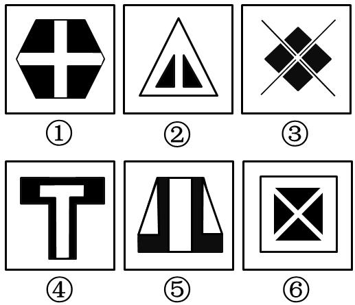

# 2019年湖北省选调生招录考试《综合知识和行政职业能力测验》题

> 判断推理 · 20 题 · 湖北 2019

## 第 1 题　qid 2365995 · 图形推理

请将下面六个图形分为两类，使每一类图形都有各自的共同特征或规律，分类正确的一项是：

 

- **A**. ①②⑤，③④⑥
- **B**. ①④⑤，②③⑥
- **C**. ①③⑥，②④⑤　✅
- **D**. ①②③，④⑤⑥

**答案**：C

**官方解析**

元素组成不同，优先考虑属性规律。图2出现等腰三角形，可优先考虑对称性，图①③⑥是既轴对称又中心对称图形，图②④⑤为轴对称图形，故图①③⑥一组，图②④⑤一组。
故正确答案为C。

---

## 第 2 题　qid 2365996 · 图形推理

从下列所给四个选项中选择最合适的一个填入问号处，使之呈现一定的规律性。

 

- **A**. A
- **B**. B
- **C**. C　✅
- **D**. D

**答案**：C

**官方解析**

观察题干图形，每幅图的正方形的内部均由2条线段，及若干箭头构成，考虑位置规律。将题干中的线段进行标号，线段1每次逆时针旋转，线段2每次逆时针旋转，到？处线段1旋转至左上角，线段2旋转至左下角，对应C项。且题干中的箭头数量为1，2，1，2，箭头的指向为右，下，左，上，所以问号处箭头的数量为1，且方向指向右边，对应答案也为C项。

 故正确答案为C。 

---

## 第 3 题　qid 2365997 · 图形推理

从下列所给四个选项中选择最合适的一个填入问号处，使之呈现一定的规律性。

 

- **A**. A
- **B**. B　✅
- **C**. C
- **D**. D

**答案**：B

**官方解析**

观察题干图形，每幅图均由一个大正方形，一个中正方形，若干个小正方形组成。小正方形的数量依次为0、1、2、3、？，有规律但无对应选项。再次观察发现，每个图形中的正方形都产生了相交，考虑数正方形与正方形相交产生的交点个数（无需数正方形本身的顶点）， 图1有2个交点，图2有4个交点，图3有6个，图4有8个，？处应该有10个交点，对应B项。

故正确答案为B。

---

## 第 4 题　qid 2365998 · 定义判断

研究表明，城市化率越高，消费需求就越多元化，消费时间就越长；发达城市人群以上的消费发生在夜间。据此，经济学界提出了“夜间经济”概念，即一种基于时段划分的商业形态，指从每日下午6点到次日凌晨6点所发生的三产服务业方面的商业活动，包括购物、餐饮、旅游、娱乐等。

根据上述定义，以下属于夜间经济打造项目的是：

- **A**. H市计划打造9条特色商业示范街区，并在街区内培育100家连锁品牌商业企业
- **B**. N市今年的施政议题之一是让城市夜晚亮起来，人气聚起来，市民夜生活火起来
- **C**. M拟于今年年底前建成4个能满足市民和国内外游客多元消费需求的地标型夜市　✅
- **D**. S市围绕三处名胜古迹建设三条商业步行街，方便所有人昼夜购物、进餐、娱乐

**答案**：C

**官方解析**

第一步：找出定义关键词。
“从每日下午6点到次日凌晨6点所发生的三产服务业方面的商业活动”、“购物、餐饮、旅游、娱乐”等。
第二步：逐一分析选项。
A项：H市计划打造9条特色商业示范街区，培育100家连锁品牌商业企业，没有提及具体的营业时间，不明确是否为“从每日下午6点到次日凌晨6点所发生的商业活动”，不符合定义，排除； 
B项：让城市夜晚亮起来，人气聚起来，市民夜生活火起来，市民的夜生活可以是多样的，比如健身、广场舞等休闲活动等，不一定会有商业行为，不符合“从每日下午6点到次日凌晨6点所发生的三产服务业方面的商业活动”，不符合定义，排除；
C项：满足市民和国内外游客多元消费需求的地标型夜市，夜市就是夜间做买卖的市场，符合“从每日下午6点到次日凌晨6点所发生的商业活动”符合定义，当选；
D项：方便所有人昼夜购物、进餐、娱乐，昼夜购物，说明不仅夜间有活动，而且白天也有活动，不符合“从每日下午6点到次日凌晨6点所发生的三产服务业方面的商业活动”，不符合定义，排除。
故正确答案为C。

---

## 第 5 题　qid 2365999 · 定义判断

近几年，大学生“慢就业”渐渐成为一种现象。慢就业是指一些大学生毕业后既不打算马上就业也不打算继续深造，而是暂时选择游学、支教、备考、社区服务、在家陪父母或者创业考察等，慢慢考虑人生道路的现象。
根据上述定义，以下各位应届大学毕业生中哪位选择的不是慢就业？

- **A**. 张毅已开始北上广深游，打算边考察边学习边思考未来发展方向
- **B**. 李明正积极备考选调生、公务员和事业单位，直到考上一个为止
- **C**. 王莉在社区做义工，拟做到暑假结束，再去办理研究生入学手续　✅
- **D**. 赵芳一直找不到理想工作，决定先在家陪陪父母，等待合适机会

**答案**：C

**官方解析**

第一步：找出定义关键词。
“大学生毕业后既不打算马上就业也不打算继续深造”、“暂时选择游学、支教、备考、社区服务、在家陪父母或者创业考察等”。
第二步：逐一分析选项。
A项：张毅开始北上广深游，打算边考察边学习边思考未来发展方向，说明张毅毕业后没有就业和深造的打算，选择了“游学”，符合定义，排除； 
B项：李明积极备考选调生、公务员和事业单位，直到考上为止，符合“大学生毕业后既不打算马上就业也不打算继续深造”，而是备考公务员，符合“暂时选择备考”，符合定义，排除；
C项：王莉在社区做义工，做到暑假结束，再去办理研究生入学手续，说明王莉选择了“继续深造”，不符合“大学生毕业后既不打算马上就业也不打算继续深造”，不符合定义，当选；
D项：赵芳一直找不到理想工作，决定先在家陪陪父母，等待合适机会，说明赵芳毕业后没有马上找工作，符合“大学生毕业后既不打算马上就业也不打算继续深造”、“暂时选择在家陪父母”，符合定义，排除。
本题为选非题，故正确答案为C。

---

## 第 6 题　qid 2366000 · 定义判断

“C位”是2018年度十大网络用语之一。其中“C”有多种解释，最普遍的一种认为是英文单词center的缩写，是中央、中心的意思。“C位”一般指舞台中央或艺人在宣传海报的中间位置，现被引申为各种场合中最重要、最核心和最受关注的位置。
根据上述定义，以下哪项表述没有涉及C位？

- **A**. 专家合影时，德高望重的M院士坐在中间位置
- **B**. 上海中心大厦高632米位于上海市东部功能区　✅
- **C**. 腾讯、阿里巴巴、百度是中国互联网核心企业
- **D**. B院士是我国量子通信研究领域的首席科学家

**答案**：B

**官方解析**

第一步：找出定义关键词。
“各种场合中最重要、最核心和最受关注的位置”。
第二步：逐一分析选项。
A项：德高望重的M院士坐在中间位置，符合“最重要、最核心和最受关注的位置”，符合定义，排除；
B项：“上海中心大厦”只是大厦的名字，位于上海市东部功能区，未体现“最重要、最核心和最受关注的位置”，不符合定义，当选；
C项：中国互联网核心企业，符合“最重要、最核心和最受关注的位置”，符合定义，排除；
D项：首席科学家，符合“最重要、最核心和最受关注的位置”，符合定义，排除。
本题为选非题，故正确答案为B。

---

## 第 7 题　qid 2366001 · 定义判断

随意后注意是注意的一种，是指一种自觉的、有预定目的的、不需要意志努力的注意。
根据上述定义，下列属于随意后注意的是：

- **A**. 小明为买到某歌手的演唱会门票，熬夜关注网上售票信息
- **B**. 小红因故上课迟到了，在进门的时候，全班的人都看着她
- **C**. 小华不知不觉中被“夕阳西下，小桥流水”的美景所吸引
- **D**. 小亮在掌握了文言文知识后，主动开始欣赏古典文学名著　✅

**答案**：D

**官方解析**

第一步：找出定义关键词。
“自觉的、有预定目的的、不需要意志努力的”。
第二步：逐一分析选项。
A项：熬夜关注网上售票信息，不符合“不需要意志努力的”，不符合定义，排除；
B项：在进门的时候，全班的人都看着她，不符合“自觉的、有预定目的”，不符合定义，排除；
C项：不知不觉中被“夕阳西下，小桥流水”的美景所吸引，不符合“自觉的、有预定目的的”，不符合定义，排除；
D项：小亮主动开始欣赏古典文学名著，符合“自觉的、有预定目的的”，且在掌握文言文知识的基础上欣赏古典文学名著是相对容易的，符合“不需要意志努力的”，符合定义，当选。
故正确答案为D。

---

## 第 8 题　qid 2366002 · 定义判断

所谓手段善，也可以称之为“结果善”，它表现为手段自身为恶，而结果通常为善，并且结果的善与自身的恶相减，净余额为善。
依据上述定义，以下不属于手段善的是：

- **A**. 大风预警　✅
- **B**. 外科手术
- **C**. 冬季冬泳
- **D**. 断尾求生

**答案**：A

**官方解析**

第一步：找出定义关键词。
“手段自身为恶，而结果通常为善”、“结果的善与自身的恶相减，净余额为善”。
第二步：逐一分析选项。
A项：“大风预警”指气象部门通过气象监测在大风到来之前做出预警，未体现“手段自身为恶”，不符合定义，当选；
B项：“手术”指医生用医疗器械对病人身体进行的切除、缝合等治疗，体现了“手段自身为恶”，且手术之后一般会达到比较好的效果，体现了“结果通常为善”，符合定义，排除；
C项：“冬季冬泳”对人体会产生强烈刺激，体现了“手段自身为恶”，且冬季冬泳有一定的好处，体现了“结果通常为善”，符合定义，排除；
D项：“断尾”指壁虎、蜥蜴等动物被天敌咬住尾巴或遭遇危险的时候，往往会自断尾巴，体现了“手段自身为恶”，“断尾”吸引敌人的注意，乘机逃跑而得以逃生，体现了“结果通常为善”，符合定义，排除。
本题为选非题，故正确答案为A。

---

## 第 9 题　qid 2366003 · 类比推理

卫星：月亮：皎洁

- **A**. 行星：太阳：温暖
- **B**. 柿子：水果：香甜
- **C**. 家具：书桌：学习
- **D**. 动物：乌龟：缓慢　✅

**答案**：D

**官方解析**

第一步：判断题干词语间逻辑关系。
月亮是卫星，二者是种属关系；皎洁是月亮的属性，二者是属性的对应关系。
第二步：判断选项词语间逻辑关系。
A项：太阳是恒星，不是行星，二者不是种属关系，与题干逻辑关系不一致，排除；
B项：柿子是水果，二者是种属关系，但词语顺序与题干相反，与题干逻辑关系不一致，排除；
C项：书桌是家具，二者是种属关系，书桌是供人伏案学习的，学习不是书桌的属性，与题干逻辑关系不一致，排除；
D项：乌龟是动物，二者是种属关系；缓慢是乌龟的属性，二者是属性的对应关系，与题干逻辑关系一致，当选。
故正确答案为D。

---

## 第 10 题　qid 2366004 · 类比推理

青蛙：水蛇：变温动物

- **A**. 鳄鱼：蜥蜴：爬行动物　✅
- **B**. 海豚：企鹅：海洋动物
- **C**. 海龟：鲸鱼：两栖动物
- **D**. 羚羊：狮子：草原动物

**答案**：A

**官方解析**

第一步：判断题干词语间逻辑关系。
青蛙和水蛇是两种不同的动物，二者是并列关系中的反对关系；青蛙和水蛇都是变温动物，二者均与第三个词构成种属关系，且变温是青蛙和水蛇具有的属性。
第二步：判断选项词语间逻辑关系。
A项：鳄鱼和蜥蜴是两种不同的动物，二者是并列关系中的反对关系；鳄鱼和蜥蜴都是爬行动物，二者均与第三个词构成种属关系，且爬行是鳄鱼和蜥蜴具有的属性，与题干逻辑关系一致，当选；
B项：海豚和企鹅是两种不同的动物，二者是并列关系中的反对关系；但海洋是海豚和企鹅生活的场所而非属性，与题干逻辑关系不一致，排除；
C项：海龟和鲸鱼是两种不同的动物，二者是并列关系中的反对关系；但海龟和鲸鱼都不是两栖动物，与题干逻辑关系不一致，排除；
D项：羚羊和狮子是两种不同的动物，二者是并列关系中的反对关系；但草原是羚羊和狮子生活的场所而非属性，与题干逻辑关系不一致，排除。
故正确答案为A。
注：本题为争议题，有同学选D项，理由如下：青蛙和水蛇都属于变温动物，为种属关系，且水蛇是青蛙的天敌；而D项羚羊和狮子都是草原动物，为种属关系，且狮子是羚羊的天敌。其它选项均不符合。
以上两种思路都各有道理，由于本题存在争议，建议考生不必过分纠结，重点学习解题思路即可。

---

## 第 11 题　qid 2366005 · 类比推理

相信：坚信：质疑

- **A**. 希望：盼望：奢望
- **B**. 报道：报告：封杀
- **C**. 微词：批判：赞扬　✅
- **D**. 诚恳：诚信：伪装

**答案**：C

**官方解析**

第一步：判断题干词语间逻辑关系。
“相信”和“坚信”是近义关系，二者和“质疑”是反义关系。
第二步：判断选项词语间逻辑关系。
A项：“希望”和“盼望”是近义关系，但“希望”和“奢望”不是反义关系，与题干逻辑关系不一致，排除；
B项：“报道”、“报告”和“封杀”之间没有关系，与题干逻辑关系不一致，排除；
C项：“微词”指隐含批评和不满的话语，和“批判”是近义关系，二者和“赞扬”是反义关系，与题干逻辑关系一致，当选；
D项：“诚恳”指人的态度不虚伪，“诚信”泛指待人处事真诚、老实、讲信用等，二者不是近义关系，与题干逻辑关系不一致，排除。
故正确答案为C。

---

## 第 12 题　qid 2366006 · 类比推理

下单：付款：送货

- **A**. 寄件：收件：派件
- **B**. 撰稿：改稿：投稿
- **C**. 耕地：施肥：播种
- **D**. 复习：考试：阅卷　✅

**答案**：D

**官方解析**

第一步：判断题干词语间逻辑关系。
先“下单”，其次“付款”，然后被“送货”，共涉及两个主体。
第二步：判断选项词语间逻辑关系。
A项：先“寄件”，其次“收件”，然后“派件”，先后顺序正确，但是共涉及三个主体，与题干逻辑关系不一致，排除；
B项：先“撰稿”，其次“改稿”，然后“投稿”，先后顺序正确，但共涉及一个主体，与题干逻辑关系不一致，排除；
C项：先“耕地”，“施肥”和“播种”没有严格的先后顺序，并且共涉及一个主体，与题干逻辑关系不一致，排除；
D项：先“复习”，其次“考试”，最后“阅卷”，共涉及两个主体，与题干逻辑关系一致，当选。
故正确答案为D。

---

## 第 13 题　qid 2366007 · 类比推理

青年：村官：基层锻炼

- **A**. 党史：国史：史海耕耘
- **B**. 工人：农民：财富创造
- **C**. 学者：儒商：市场打拼　✅
- **D**. 巾帼：须眉：同台竞技

**答案**：C

**官方解析**

第一步：判断题干词语间逻辑关系。
有的青年是村官，有的村官是青年，有的青年不是村官，有的村官不是青年，“青年”和“村官”是交叉关系；“村官”在“基层锻炼”，二者是对应关系。
第二步：判断选项词语间逻辑关系。
A项：“党史”是党派自成立以来的发展过程，“国史”是一国或一个朝代的历史，二者是并列关系，与题干逻辑关系不一致，排除；
B项：“工人”和“农民”是不同的职业，二者是并列关系，与题干逻辑关系不一致，排除；
C项：“儒商”是儒与商的结合体，既有儒者的道德和才智，又有商人的财富与成功，“学者”指的是具有一定学识水平、能在相关领域表达思想、提出见解的人，有的学者是儒商，有的儒商是学者，有的学者不是儒商，有的儒商不是学者，二者是交叉关系；“儒商”在“市场打拼”，二者是对应关系，与题干逻辑关系一致，当选；
D项：“巾帼”是对女子的代称，“须眉”是对男子的代称，二者是并列关系，与题干逻辑关系不一致，排除。
故正确答案为C。

---

## 第 14 题　qid 2366008 · 类比推理

望到青山：看见碧水：记住乡愁

- **A**. 产业兴旺：生态宜居：生活富裕
- **B**. 改善乡风：治理环境：建设乡村　✅
- **C**. 风土人情：方言俚语：田园牧歌
- **D**. 良好家风：淳朴民风：文明习俗

**答案**：B

**官方解析**

第一步：判断题干词语间逻辑关系。
“望到青山”、“看见碧水”和“记住乡愁”均为动宾结构。
第二步：判断选项词语间逻辑关系。
A项：“产业兴旺”、“生态宜居”和“生活富裕”均为主谓结构，与题干逻辑关系不一致，排除；
B项：“改善乡风”、“治理环境”和“建设乡村”均为动宾结构，与题干逻辑关系一致，当选；
C项：“风土人情”、“方言俚语”和“田园牧歌”均为名词并列短语，与题干逻辑关系不一致，排除；
D项：“良好家风”、“淳朴民风”和“文明习俗”均为形容词加名词构成的偏正短语，与题干逻辑关系不一致，排除。
故正确答案为B。

---

## 第 15 题　qid 2366009 · 逻辑判断

《自然》期刊发表的一项新研究表明，基因改造过的猪心脏，在被同位移植到狒狒体内后，保持完整功能地跳动了195天。这预示着未来人类也能受益于此，可以解决人类器官供应短缺的棘手问题。
以下哪项如果为真，最能支持上述结论？

- **A**. 猪心脏与人的心脏在解剖学结构上非常相似　✅
- **B**. 猪心脏移植到狒狒身上具有非常高的生存率
- **C**. 猪心脏异种移植距离实验成功仅仅一步之遥
- **D**. 猪心脏可以在人类以外的灵长动物体内存活

**答案**：A

**官方解析**

第一步：找出论点和论据。
论点：这预示着未来人类也能受益于此，可以解决人类器官供应短缺的棘手问题。
论据：基因改造过的猪心脏，在被同位移植到狒狒体内后，保持完整功能地跳动了195天。
本题是通过论据的一个动物实验得到论点中人类的情况。如果要支持论点，需要在动物实验和人类之间进行搭桥，需要补充从这个动物实验得出人类可以因此受益的理由。
第二步：逐一分析选项。
A项：说明猪心脏和人的心脏在解剖学结构上非常相似，所以通过猪心脏成功被移植并成活的实验，可以得到人类也能受益于此，在论点和论据之间进行搭桥，可以加强，当选；
B项：说明猪心脏移植到狒狒身上具有非常高的生存率，和论点讨论的此实验是否对人类未来有益无关，话题不一致，无法加强，排除；
C项：说明猪心脏异种移植距离实验成功仅仅一步之遥，但这个实验成功与否，和论点讨论的人类是否会因此受益无关，话题不一致，无法加强，排除；
D项：猪心脏是否可以在人类以外的灵长类动物体内存活，和论点讨论的人类是否会因此受益无关，话题不一致，无法加强，排除。
故正确答案为A。

---

## 第 16 题　qid 2366010 · 逻辑判断

一项长达20年的研究表明，爱做家务的求职者比不爱做家务的求职者更容易成功就业，就业后的收入前者也比后者高。此外，爱做家务的求职者比不爱做家务的求职者生活幸福感更高。通过做家务，求职者能养成合理规划的习惯和不骄不躁的品质。从这个角度看，做家务有助于培养更多的社会精英。

下列哪项如果为真，最能够加强上述论证？

- **A**. 养成合理规划和不骄不躁的习惯为求职者所必需
- **B**. 非常多的求职者都在被他们父母积极鼓励做家务
- **C**. 合理规划和保持不骄不躁是社会精英的必备品质　✅
- **D**. 做家务可以提升求职者的规划能力和生活幸福感

**答案**：C

**官方解析**

第一步：找出论点和论据。
论点：做家务有助于培养更多的社会精英。
论据：爱做家务的求职者比不爱做家务的求职者更容易成功就业，就业后的收入高，生活幸福感更高。通过做家务，求职者能养成合理规划的习惯和不骄不躁的品质。
本题论据告知了爱做家务使求职者养成合理规划的习惯和不骄不躁的品质，论点是做家务有助于培养社会精英。要想加强论证，应说明合理规划的习惯和不骄不躁的品质和成为社会精英有关联。
第二步：逐一分析选项。
A项：合理规划和不骄不躁的习惯为求职者所必需，说的是求职者应具备的条件，与论点中说的社会精英无关，无关项，排除；
B项：求职者被父母积极鼓励做家务，与论点中说的社会精英无关，无关项，无法加强，排除；
C项：合理规划和保持不骄不躁是社会精英的必备品质，论据表明做家务，求职者能养成合理规划的习惯和不骄不躁的品质，选项在论据和论点中搭桥，可以加强，当选；
D项：做家务可以提升求职者的规划能力和生活幸福感，重复论据观点，与论点社会精英无关，无法加强，排除。
故正确答案为C。

---

## 第 17 题　qid 2366011 · 逻辑判断

A单位的一项实证调查指出，应当对单位内不断上升的差旅费用采取措施。这项实证调查的理由是，单位内人均差旅费用，每天高达52元。而在同等人数规模的B单位里，其人均差旅费则都在20元以内。
下列哪项如果为真，最能构成对上述论点的驳斥？

- **A**. 据其他调查，A单位人均差旅费用实际为每天35元
- **B**. 实际上很难找到人均差旅费像B单位那么低的机构
- **C**. A单位的差旅费用和B单位的差旅费用标准完全不同　✅
- **D**. 对A单位不断上升的差旅费采取措施可能会不得人心

**答案**：C

**官方解析**

第一步：找出论点和论据。
论点：应对A单位的差旅费用采取措施。
论据：A单位人均差旅费用每天高达52元，同等人数规模的B单位里，其人均差旅费则都在20元以内。
本题根据A单位和B单位人均差旅费不同而决定对A单位的差旅费用采取措施，论点论据话题不一致。削弱题，可以优先考虑拆桥，即说明通过人均差旅费用不同，不能得出应对A单位的差旅费用采取措施。
第二步：逐一分析选项。
A项：A单位人均差旅费用实际为每天35元，仍比B单位人均差旅费则都在20元以内要高，无法削弱，排除；
B项：很难找到人均差旅费像B单位那么低的机构，只能说明B单位差旅费低，但是A单位是否应该采取措施未知，无法削弱，排除；
C项：A单位的差旅费用和B单位的差旅费用标准完全不同，说明A单位和B单位标准不同，A单位和B单位没有比较的必要，不能通过两个单位人均差旅费用不同，得出应对A单位的差旅费用采取措施，拆桥项，可以削弱，当选；
D项：A单位不断上升的差旅费采取措施可能会不得人心，是否得人心和是否需要对差旅费采取措施无关，无关项，无法削弱，排除。
故正确答案为C。

---

## 第 18 题　qid 2366012 · 逻辑判断

一位地铁安检员声称，他通过长期的地铁安检工作养成了一种特殊技能。即，他能够准确地识别一位乘客是否在欺骗他。他的根据是，在地铁安检入口检查时，他只需要与乘客进行短短的几句对话就能断定对方是否可疑；而在他认为可疑的乘客身上，无一例外地都查出了违禁物品。
下列哪项如果为真，最能削弱上述地铁安检员的论证？

- **A**. 在他认为不可疑而未经检查的乘客中有人无意地携带了违禁物品
- **B**. 在他认为可疑而进行检查的乘客中大部分有意地携带了违禁物品
- **C**. 在他认为可疑并查出违禁物品的乘客中有人无意地携带违禁物品　✅
- **D**. 在他认为不可疑而未经检查的乘客中大部分都没有携带违禁物品

**答案**：C

**官方解析**

第一步:：找出论点和论据。

论点：该地铁安检员能够准确地识别一位乘客是否在欺骗他。
论据：该地铁安检员只需要与乘客进行短短的几句对话就能断定对方是否可疑；而在他认为可疑的乘客身上，无一例外地都查出了违禁物品。
本题通过地铁安检员可以判断乘客可疑，且可疑的乘客都查出来违禁物品，得出他能识别乘客是否在欺骗他，论点论据话题不一致。削弱题，可以优先考虑拆桥，即说明通过地铁安检员认为可疑的乘客都查出来违禁物品，无法得出这个乘客在欺骗他。
第二步：逐一分析选项。
A项：该地铁安检员认为不可疑而未经检查的乘客，则没有进行对话，不存在判定其是否欺骗，无法削弱，排除；
B项：该地铁安检员在他认为可疑而进行检查的乘客中大部分有意地携带了违禁物品，说明他认为可疑并进行对话的乘客有意携带并对他进行欺骗，说明安检员能够准确地识别一位乘客是否在欺骗他，加强选项，排除；
C项：该地铁安检员在他认为可疑而进行检查的乘客中有人无意地携带了违禁物品，说明他认为可疑并进行对话的乘客虽然查出来违禁物品，但是并没对他进行欺骗，因为乘客是无意的，说明论据不能得出论点，拆桥项，当选；
D项：该地铁安检员认为不可疑而未经检查的乘客，则没有进行对话，不存在判定其是否欺骗，无法削弱，排除。
故正确答案为C。

---

## 第 19 题　qid 2366013 · 逻辑判断

一项针对两组行政单位科级职员的调查发现，第一组职员在10周内户外活动的次数不少于7次；第二组职员则10周内户外活动的次数不多于3次。调查结果显示，第二组职员面临的工作压力大于第一组职员。因此，调查得出结论，科级职员户外活动次数少导致他们工作压力大。
下列哪项如果为真，最能对上述调查结论提出质疑？

- **A**. 第一组中有的职员感到自己的工作压力并不大
- **B**. 第一组中有职员工作压力比第二组的职员还高
- **C**. 第二组中有一些职员的工作压力并不是非常大
- **D**. 第二组职员因工作压力大导致户外活动次数少　✅

**答案**：D

**官方解析**

第一步：找出论点和论据。
论点：科级职员户外活动次数少导致工作压力大。
论据：10周内户外活动的次数不多于3次的职员压力大于10周内户外活动的次数不少于7次的职员。
本题论点中存在因果关系，因为压力大，所以活动次数少。要想削弱论点，可以考虑因果倒置削弱方式。
第二步：逐一分析选项。
A项：有的职员感到自己的工作压力并不大，并不能代表该组的整体压力情况，无法削弱，排除；
B项：第一组中有职员工作压力比第二组的职员还高，不能说明一组二组的整体压力情况，无法削弱，排除；
C项：有一些职员的工作压力并不是非常大，并不能代表该组的整体压力情况，无法削弱，排除；
D项：第二组职员因工作压力大导致户外活动次数少，因果倒置削弱论点，当选。
故正确答案为D。

---

## 第 20 题　qid 2366014 · 逻辑判断

某地方政府计划削减财政预算，原计划削减。为此，计划撤销两个部门，这两个部门的预算正好占地方政府总预算的。计划实施后，上述两个部门被撤销，整个地方政府预算实际削减。在此过程中，地方政府各部门预算有所调整。

如果上述判定为真，则以下哪项一定为真？

①上述计划实施后，有的职能部门预算增加。

②上述计划实施后，没有一个职能部门预算增加额度超出地方政府原来总预算的。

③上述计划实施后，被削减的财政预算，都来自于被撤销的两个部门原有的预算。

- **A**. 只有①　✅
- **B**. 只有①和②
- **C**. 只有②和③
- **D**. 全部都为真

**答案**：A

**官方解析**

日常结论题，根据题干信息逐一分析选项。

①项：撤销占地方政府总预算的的两个部门后，预算实际削减，比原预算减少削减比例，说明有的部门预算增加，此项可以推出，为真；

②项：撤销占地方政府总预算的的两个部门后，预算实际削减，可知其余职能部门整体预算增加，但无法确定是否有个别职能部门预算增加额度超出地方政府原来总预算的，此项过于绝对，为假；

③项：撤销占地方政府总预算的的两个部门后，预算实际削减，可知其余职能部门整体预算增加，但无法确定其他部门的预算的具体变化，可能也存在个别增加或者削减的可能，此项过于绝对，为假。

故正确答案为A。

---
