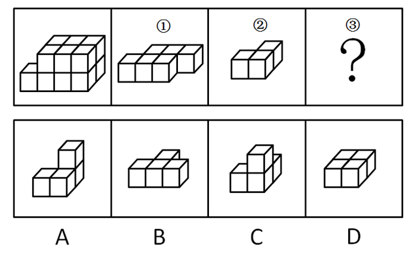
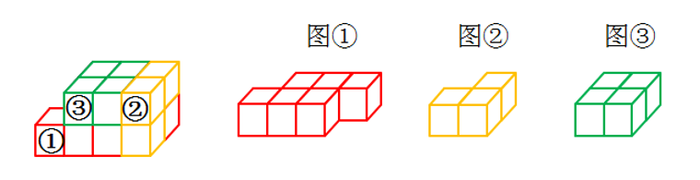
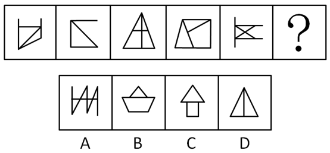
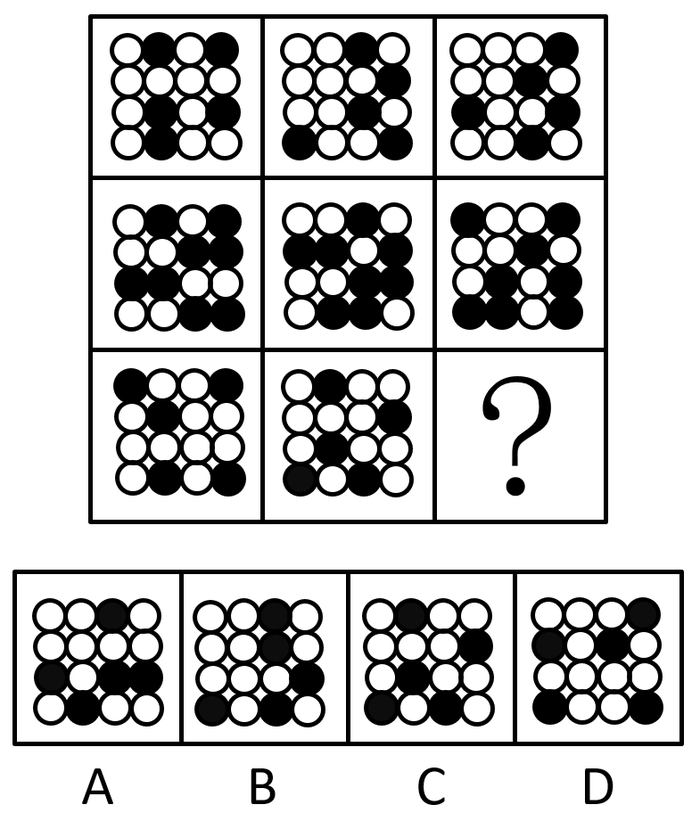
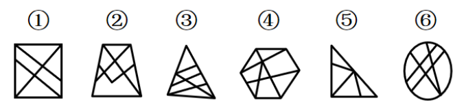
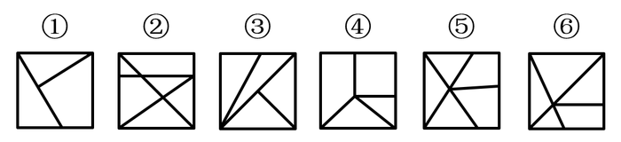
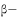

# 2019年甘肃省公务员录用考试《行测》题（网友回忆版）

> 判断推理 · 31 题 · 甘肃 2019

## 第 1 题　qid 2423322 · 图形推理

从所给的四个选项中，选择最合适的一个填入问号处，使之呈现一定的规律性：

- **A**. A
- **B**. B　✅
- **C**. C
- **D**. D

**答案**：B

**官方解析**

图形元素组成不同，且无明显属性规律，优先考虑数量规律。观察发现，图五出现“五角星”变形图，图四、选项C、D中出现了多端点图形，考虑笔画数。图一有2个奇点，图二有2个奇点，图三有2个奇点，图四有2个奇点，图五有0个奇点，题干中图形均为一笔画图形，所以“？”处应为一笔画图形。A项两笔画，B项一笔画，C项两笔画，D项两笔画。
故正确答案为B。

---

## 第 2 题　qid 2423300 · 图形推理

左边的立体图形是由①、②和③组成的，下列哪项<b>不能</b>填入问号处？

- **A**. A
- **B**. B　✅
- **C**. C
- **D**. D

**答案**：B

**官方解析**

本题考查立体拼合。逐一代入选项进行验证。

A项：图①放在最下面一排左侧的位置，将图②左右翻转，放在上面一排左侧的位置，选项“立”起来，放在图①右下角的位置，可以拼成左边的立体图形，排除；

B项：无法与图①②拼成左边的立体图形，当选；

C项：图①放在最下面一排左侧的位置，将图②顺时针旋转，放在上面一排左侧的位置，选项上下翻转，使得单独的方块在下面，并放在图①右下角的位置，可以拼成左边的立体图形，排除；

D项：图①放在最下面一排左侧的位置，将图②“立”起来，使得单独的方块在下面，并放在图①右下角的位置，选项放在上面一排左侧的位置，可以拼成左边的立体图形，排除。

本题为选非题，故正确答案为B。

---

## 第 3 题　qid 2423304 · 图形推理

从所给的四个选项中，选择最合适的一个填入问号处，使之呈现一定的规律性：

- **A**. A
- **B**. B　✅
- **C**. C
- **D**. D

**答案**：B

**官方解析**

元素组成不同，且无明显属性规律，优先考虑数量规律。观察发现，题干出现较多的多边形以及多边形的组合图形，优先考虑直线数，依次为5、4、5、6、5，无规律。考虑线的细化考法，继续观察发现，题干每幅图均存在平行线，且平行线的数量均为1对，则？处图形也应仅有1对平行线，只有B项符合规律。
故正确答案为B。

---

## 第 4 题　qid 2423309 · 图形推理

从所给的四个选项中，选择最合适的一个填入问号处，使之呈现一定的规律性：

- **A**. A　✅
- **B**. B
- **C**. C
- **D**. D

**答案**：A

**官方解析**

九宫格优先横向看，每一行三幅图中黑球的数量相同，元素组成相同，优先考虑位置规律。每幅图都可看作由内圈4个“格子”和外圈12个“格子”构成，第一行图形中，内圈的小黑球在4个“格子”中每次逆时针移动一格，外圈的小黑球均在12个“格子”中每次顺时针移动一格。验证第二行图形符合此规律，对第三行图形应用此规律，问号处图形内圈的小黑球应在右下角，只有A项符合规律，此时满足外圈的小黑球每次顺时针移动一格。
故正确答案为A。

---

## 第 5 题　qid 2423318 · 图形推理

把下面的六个图形分为两类，使每一类都有各自的共同特征或规律，分类正确的一项是：

- **A**. ①②③，④⑤⑥
- **B**. ①②⑤，③④⑥
- **C**. ①②④，③⑤⑥
- **D**. ①③⑤，②④⑥　✅

**答案**：D

**官方解析**

本题为分组分类题目。元素组成不同，无明显属性规律，考虑数量规律。观察发现，题干中均为内部线条与外框相交构成图形，其中①③⑤所有面都跟外框相连，②④⑥中间都有1个面与外框不相连。即①③⑤一组，②④⑥一组。
故正确答案为D。

---

## 第 6 题　qid 2423328 · 图形推理

把下面的六个图形分为两类，使每一类都有各自的共同特征或规律，分类正确的一项是：

- **A**. ①②③，④⑤⑥
- **B**. ①②⑤，③④⑥
- **C**. ①②⑥，③④⑤
- **D**. ①④⑤，②③⑥　✅

**答案**：D

**官方解析**

本题为分组分类题目。元素组成不同，无明显属性规律，考虑数量规律。观察发现，题干图形均为方块内线条相交构成图。图①内部线条与四个端点相交的个数有2个，图②有3个，图③有3个，图④有2个，图⑤有2个，图⑥有3个。图①④⑤内部线条与四个端点相交的个数有2个，图②③⑥内部线条与四个端点相交的个数有3个。即①④⑤一组，②③⑥一组。
故正确答案为D。

---

## 第 7 题　qid 2423327 · 定义判断

群落的分层现象是指不同的生物种出现于地面以上不同的高度和地面以下不同的深度，从而使整个群落在垂直方向上呈现上下分层分布的现象，这一现象也被称为群落的垂直结构。
根据上述定义，下列没有反映群落分层现象的是：

- **A**. 森林中层栖息着山雀、啄木鸟等鸟类，林冠层则栖息着柳莺、交嘴雀等鸟类
- **B**. 自然保护区中的松柏高低错落，有的树根交错，互相缠绕，形成独特的层次感　✅
- **C**. 海洋中，上层生活着浮游生物，中层生活着不同的鱼类，下层生活着海星等底栖生物
- **D**. 热带雨林中，乔木植物由于高大往往遮住了阳光，其下方生长着耐阴喜湿的草本植物

**答案**：B

**官方解析**

第一步：找出定义关键词。
“不同的生物种出现于地面以上不同的高度和地面以下不同的深度”、“整个群落在垂直方向上呈现上下分层分布的现象”。
第二步：逐一分析选项。
A项：森林中层栖息着山雀、啄木鸟等鸟类，林冠层栖息着柳莺、交嘴等鸟类。符合“不同的生物种出现于地面以上不同的高度”、“整个群落在垂直方向上呈现上下分层分布的现象”，符合定义，排除； 
B项：自然保护区中的松柏高低错落，具有独特的层次感，只出现了松柏一个生物物种。不符合“不同的生物种出现于地面以上不同的高度和地面以下不同的深度”，不符合定义，当选；
C项：海洋中，上层、中层、下层分别生活着浮游生物、鱼类和底栖生物。符合“不同的生物种出现于地面以下不同的深度”、“整个群落在垂直方向上呈现上下分层分布的现象”，符合定义，排除；
D项：热带雨林中，乔木植物的下方生长着草本植物。符合“不同的生物种出现于地面以上不同的高度”、“整个群落在垂直方向上呈现上下分层分布的现象”，符合定义，排除。
本题为选非题，故正确答案为B。

---

## 第 8 题　qid 2423348 · 定义判断

作为人体的生理功能，免疫能识别“自己”和“非己”成分，破坏和排斥进入人体的抗原物质（如病菌等），或自身产生的损伤细胞和肿瘤细胞等，以维持健康。非消除性免疫是免疫的一种类型，指宿主感染寄生虫后不能清除或不能完全清除已经建立了感染的寄生虫，但对同种寄生虫的再感染具有一定程度的抵抗力。
根据上述定义，下列反映了非消除性免疫的是：

- **A**. 热带利什曼原虫引起疖肿，当人体获得免疫力后原虫完全被清除，临床症状消失，不再感染
- **B**. 人体感染疟原虫后，体内疟原虫未被清除，维持低虫血症，但人体对这类感染具有一定的抵抗力　✅
- **C**. 人体被血吸虫感染后出现发热、肝脾肿大症状，使用驱虫药后治愈，再感染时对入侵的童虫有一定的抵抗力
- **D**. 甲流病毒H1N1感染了某些人群后，这些人体内的吞噬类细胞会将病毒吞噬从而治愈，获得免疫力，但他们仍会感染H7N9型甲流

**答案**：B

**官方解析**

第一步：找出定义关键词。
“宿主感染寄生虫后不能清除或不能完全清除已经建立了感染的寄生虫，但对同种寄生虫的再感染具有一定程度的抵抗力”；
第二步：逐一分析选项。
A项：人体获得免疫力后热带利什曼原虫完全被清除。不符合“宿主感染寄生虫后不能清除或不能完全清除已经建立了感染的寄生虫”，不符合定义，排除； 
B项：人体感染疟原虫后，体内疟原虫未被清除，同时人体对这类感染具有一定的抵抗力。符合“宿主感染寄生虫后不能清除或不能完全清除已经建立了感染的寄生虫，但对同种寄生虫的再感染具有一定程度的抵抗力”，符合定义，当选；
C项：使用驱虫药能完全治愈被血吸虫感染后出现的发热、肝脾肿大症状。不符合“宿主感染寄生虫后不能清除或不能完全清除已经建立了感染的寄生虫”，不符合定义，排除；
D项：人体内的吞噬类细胞会将甲流病毒H1N1吞噬，从而治愈，获得免疫力。没有体现出人体感染了寄生虫，不符合“宿主感染寄生虫后不能清除或不能完全清除已经建立了感染的寄生虫”，不符合定义，排除。
故正确答案为B。

---

## 第 9 题　qid 2423324 · 定义判断

岩石在基本上处于固体状态下，受到温度、压力及化学活动性流体的作用，发生矿物成分、化学成分、岩石结构与构造变化的地质作用，称为变质作用。地表的风化作用和其他外生作用（沉积作用等）引起岩石的物理变化，不属于变质作用。
根据上述定义，下列反映了变质作用的是：

- **A**. 沙漠昼夜温差大，岩石在日间受热膨胀，晚间冷却收缩，逐渐形成砂砾
- **B**. 煤在隔绝空气条件下加热到850℃，保持7分钟，其成分会分解成气体和液体
- **C**. 含有盐分的溶液渗入火成岩的裂缝中，当溶液蒸发留下盐晶体，盐晶受热后膨胀令岩石瓦解
- **D**. 宇宙中的巨大陨石高速降至地球表面，冲击岩石发生爆炸形成陨石坑，坑内岩石变化形成各种冲击岩　✅

**答案**：D

**官方解析**

第一步：找出定义关键词。
“岩石受到温度、压力及化学活动性流体的作用”、“发生矿物成分、化学成分、岩石结构与构造变化的地质作用”、“物理变化不属于变质作用”。
第二步：逐一分析选项。
A项：沙漠的岩石热胀冷缩变成砂砾，是物理变化，物理变化不属于变质作用，不符合定义，排除； 
B项：把煤隔绝空气，持续加热一定温度，是人为的过程，不属于地质作用，不符合定义，排除；
C项：火山岩被含盐溶液瓦解，是物理变化，物理变化不属于变质作用，不符合定义，排除；
D项：宇宙中的巨大陨石高速降至地球表面冲击岩石发生爆炸形成陨石坑，符合“岩石受到温度、压力及化学活动性流体的作用”，坑内岩石变化形成各种冲击岩，符合“发生矿物成分、化学成分、岩石结构与构造变化的地质作用”，符合定义，当选。
故正确答案为D。

---

## 第 10 题　qid 2423351 · 定义判断

人们通常把因环境污染和环境破坏而对公众和社会所造成的危害叫做公害。公害病是公害发生的地区性疾病。其特征包括：①由人类活动造成的环境污染所引起；②损害健康的环境污染因素复杂；③其流行一般具有长期陆续发病的特征，还可能累及胎儿，危害后代；④属新病种，有些发病机制还不清楚，缺乏特效疗法。
根据上述定义，下列不属于公害病的是：

- **A**. 人们食用了被镉污染的水稻后罹患骨痛病，骨骼疼痛难忍，无特效疗法
- **B**. 某地区玉米、小麦受到霉菌（尤其是镰刀菌）感染后会产生毒素，人们食用后会破坏人体骨骼生长，导致四肢短小　✅
- **C**. 某地区使用重油燃料，排出废气中含有大量的二氧化硫，造成了严重的大气污染，引起当地居民罹患支气管哮喘、肺气肿等疾病
- **D**. 含无机汞的工业废水排入水体后，被细菌转化为毒性更强的甲基汞，富集于水生生物体内，人们长期食用后出现神经系统损伤，波及后代

**答案**：B

**官方解析**

第一步：找出定义关键词。
公害：因环境污染和环境破坏而对公众和社会所造成的危害。
公害病：公害发生的地区性疾病。其特征包括：①由人类活动造成的环境污染所引起；②损害健康的环境污染因素复杂；③其流行一般具有长期陆续发病的特征，还可能累及胎儿，危害后代；④属新病种，有些发病机制还不清楚，缺乏特效疗法。
第二步：逐一分析选项。
A项：镉污染符合“①由人类活动造成的环境污染所引起”、“②损害健康的环境污染因素复杂”，骨骼疼痛难忍，无特效疗法符合“④属新病种，有些发病机制还不清楚，缺乏特效疗法”，符合定义，排除； 
B项：某地区玉米、小麦受到霉菌(尤其是镰刀菌)感染，不符合“①由人类活动造成的环境污染所引起”，不符合定义，当选；
C项：某地区使用重油燃料，排出废气中含有大量的二氧化硫，造成了严重的大气污染，符合“①由人类活动造成的环境污染所引起，②损害健康的环境污染因素复杂”，引起当地居民罹患支气管哮喘、肺气肿等疾病符合“③其流行一般具有长期陆续发病的特征，还可能累及胎儿，危害后代”，符合定义，排除；
D项：含无机汞的工业废水排入水体后，被细菌转化为毒性更强的甲基汞，富集于水生生物体内，符合“①由人类活动造成的环境污染所引起”，人们长期食用后出现神经系统损伤，波及后代，符合“③其流行一般具有长期陆续发病的特征，还可能累及胎儿，危害后代”，符合定义，排除。
本题为选非题，故正确答案为B。

---

## 第 11 题　qid 2423354 · 定义判断

清洁生产是指不断采取改进设计、使用清洁的能源和原料、采用先进的工艺技术与设备、改善管理、综合利用等措施，从源头削减污染，提高资源利用效率，减少或者避免生产、服务和产品使用过程中污染物的产生和排放，以减轻或者消除环境危害的生产方式。
根据上述定义，下列不涉及清洁生产的是：

- **A**. 企业淘汰有毒有害的原材料，并在全部排放物和废物离开生产过程以前，尽最大可能减少它们的排放量和毒性
- **B**. 企业采用少废、无废的生产工艺技术和高效生产设备，减少生产过程中的各种危险因素和有毒有害的中间产品
- **C**. 企业选择再使用与再循环性的材料，这样可以通过提高环境质量和减少成本获得经济与环境收益
- **D**. 企业主动设置控制污染物排放标准，严格控制内部各部门污染物排污口，引进治污设备，使排放的污染物通过治理达到排放标准　✅

**答案**：D

**官方解析**

第一步：找出定义关键词。
“不断采取改进设计、使用清洁的能源和原料、采用先进的工艺技术与设备、改善管理、综合利用等措施”、“从源头削减污染，提高资源利用效率，减少或者避免生产、服务和产品使用过程中污染物的产生和排放”、“减轻或者消除环境危害”、“生产方式”。
第二步：逐一分析选项。
A项：企业淘汰有毒有害的原材料符合“使用清洁的能源和原料”，并在全部排放物和废物离开生产过程以前尽最大可能减少它们的排放量和毒性，符合“从源头削减污染、减少生产产品过程中污染物的产生和排放”，符合“减轻或者消除环境危害的生产方式”，符合定义，排除； 
B项：企业采用少废、无废的生产工艺技术和高效生产设备符合“采用先进的工艺技术与设备”，减少生产过程中的各种危险因素和有毒有害的中间产品符合“从源头削减污染、减少生产产品过程中污染物的产生和排放”，符合“减轻或者消除环境危害的生产方式”，符合定义，排除；
C项：企业选择再使用与再循环性的材料，通过提高环境质量和减少成本获得经济与环境收益，符合“使用清洁的能源和原料”，符合“从源头削减污染、减少生产产品过程中污染物的产生和排放”，符合“减轻或者消除环境危害”，符合定义，排除；
D项：设置控制污染物排放标准，严格控制内部各部门污染物排污口，引进治污设备，是产品生产过程之后的污染治理过程，不是一种“生产方式”，不符合“从源头削减污染、减少生产产品过程中污染物的产生和排放”，不符合定义，当选。
本题为选非题，故正确答案为D。

---

## 第 12 题　qid 2423358 · 定义判断

叙述视角是指叙述语言中对故事内容进行观察和讲述的特定角度。其中，内视角指的是叙述者只借助某个人物的感觉和意识，从他的视觉、听觉及感受的角度去传达一切，叙述者等同于该人物本身，即叙述者所知道的同该人物知道的一样多。
根据上述定义，下列反映了内视角的是：

- **A**. 《金锁记》中，作者采用全知全能的叙述方式，揭示了曹七巧等人的悲剧命运
- **B**. 《白象似的群山》中，作者置身于所有角色之外，客观叙述故事中的人物命运
- **C**. 《孔乙己》中，作者即故事中的小伙计，用旁观者的口吻描写其所见所闻　✅
- **D**. 《包法利夫人》中，作者以局外人的身份展示情节，给读者极大的想象空间

**答案**：C

**官方解析**

第一步：找出定义关键词。
叙述视角：“对故事内容进行观察和讲述”。
内视角：“只借助某个人物的感觉和意识”、“从他的视觉、听觉及感受的角度去传达一切”、“叙述者所知道的同该人物知道的一样多”。
第二步：逐一分析选项。
A项：全知全能的叙述方式，不符合“只借助某个人物的感觉和意识”，也不符合“从他的视觉、听觉及感受的角度去传达一切”，不符合定义，排除； 
B项：作者置身于所有角色之外，客观叙述故事中的人物命运，不符合“只借助某个人物的感觉和意识”，也不符合“从他的视觉、听觉及感受的角度去传达一切”，不符合定义，排除； 
C项：作者即故事中的小伙计，符合“只借助某个人物的感觉和意识”，也符合“叙述者所知道的同该人物知道的一样多”，描写其所见所闻符合“从他的视觉、听觉及感受的角度去传达一切”，符合定义，当选；
D项：以局外人的身份展示情节，不符合“只借助某个人物的感觉和意识”，也不符合“从他的视觉、听觉及感受的角度去传达一切”，不符合定义，排除。
故正确答案为C。

---

## 第 13 题　qid 2423361 · 定义判断

光周期指的是昼夜周期中光照期和暗期长短的交替变化。植物在生长发育进程中，必须经过一定时间的适宜光周期后才能开花，否则会一直处于营养生长状态而不开花。这种昼夜长短影响植物开花的现象称为光周期现象。
根据上述定义，下列没有反映光周期现象的是：

- **A**. 
大豆性喜暖，种子在10～12开始发芽，如遇低温则结荚延迟，低于14不能开花
　✅
- **B**. 
天仙子必须满足一定天数的8.5～11.5小时日照才能开花，如果日照长度短于8.5小时它就不能开花

- **C**. 
秋菊在每天14小时的长日照下进行茎叶营养生长，在每天12小时以上的黑暗与10的夜温下才能够开花

- **D**. 
芹菜是长日照型植物，需要14小时以上的日照才可抽薹开花，冬季需适当人工补充光照以满足其生长需求

**答案**：A

**官方解析**

第一步：找出定义关键词。

“昼夜周期中光照期和暗期长短的交替变化”、“必须经过一定时间的适宜光周期后才能开花”。

第二步：逐一分析选项。

A项：大豆需要在10°～12发芽，不涉及光照变化，不符合定义，当选； 

B项：天仙子必须满足一定天数的日照才能开花，符合“昼夜周期中光照期和暗期长短的交替变化”，也符合“必须经过一定时间的适宜光周期后才能开花”，符合定义，排除；

C项：秋菊每天需要12小时以上的黑暗才能开花，符合“昼夜周期中光照期和暗期长短的交替变化”，也符合“必须经过一定时间的适宜光周期后才能开花”，符合定义，排除；

D项：芹菜需要14小时以上日照才能开花，符合“昼夜周期中光照期和暗期长短的交替变化”，也符合“必须经过一定时间的适宜光周期后才能开花”，符合定义，排除。

本题为选非题，故正确答案为A。

---

## 第 14 题　qid 2423362 · 定义判断

似不注意和似注意都是注意的一种，其中似不注意是指貌似不注意一事物而实际的心理活动却十分注意这一事物，而似注意是指表面上注意某些事物，但实际上心里却想着其他事物。
根据上述定义，下列属于似不注意的是：

- **A**. 小李参加部门会议时，心里一直在想下个月休假去哪里玩
- **B**. 传说王羲之在书法创作时太过投入，有一次竟将馒头蘸着墨汁食用
- **C**. 学生在教室里听课，突然从外面进来一个人，这时学生就会中断听课，不由自主地注意进来的人
- **D**. 刑事侦查人员在人群中发现了侦缉对象，为了不打草惊蛇，往往选择假装没看见，然后悄悄靠近，最后出其不意地将对象抓获　✅

**答案**：D

**官方解析**

第一步：找出定义关键词。
似不注意：貌似不注意一事物而实际的心理活动却十分注意这一事物；
似注意：指表面上注意某些事物，但实际上心里却想着其他事物。
第二步：逐一分析选项。
A项：小李参加会议时想着休假的事情，符合“表面上注意某些事物，但实际上心里却想着其他事物”，符合“似注意”定义，不符合“似不注意”定义，排除； 
B项：王羲之投入到书法创作中，是全神贯注地注意，不涉及不注意，不符合任何一个定义，排除；
C项：学生听课的注意力被突然出现的人打断，不涉及不注意，不符合任何一个定义，排除；
D项：刑侦人员注意到了侦缉对象行踪，假装没看见，符合“貌似不注意一事物而实际的心理活动却十分注意这一事物”，符合“似不注意”定义，不符合“似注意”定义，当选。
故正确答案为D。

---

## 第 15 题　qid 2423325 · 类比推理

舍生取义：苟且偷生

- **A**. 爱财如命：乐于助人
- **B**. 古为今用：今非昔比
- **C**. 异口同声：一言九鼎
- **D**. 祸不单行：鸿运当头　✅

**答案**：D

**官方解析**

第一步：判断题干词语间逻辑关系。
舍生取义指舍弃生命以取得正义，指为正义而牺牲生命；苟且偷生指得过且过，勉强活着，两者为反义关系。
第二步：判断选项词语间逻辑关系。
A项：爱财如命指把钱财看得跟生命一样重要，形容极端吝啬；乐于助人指很乐意主动帮助有需要的人们；两者不是反义关系，与题干逻辑关系不一致，排除；
B项：古为今用指批判、借鉴古代的东西，继承其中优秀的文化遗产，使之为今天所用，常指文化遗产的继承；今非昔比指现在不是过去能比得上的，多指形势、自然面貌等发生了巨大的变化；两者不是反义关系，与题干逻辑关系不一致，排除；
C项：异口同声指不同的人说同样的话，形容意见一致；一言九鼎指形容说的话分量大，起决定作用；两者不是反义关系，与题干逻辑关系不一致，排除；
D项：祸不单行指不幸的事接二连三地发生；鸿运当头指正是走好运的时候；两者是反义关系，与题干逻辑关系一致，当选。
故正确答案为D。

---

## 第 16 题　qid 2423326 · 类比推理

文物：出土：鉴定

- **A**. 乌龙茶：封装：销售　✅
- **B**. 投影仪：切换：播放
- **C**. 温度计：显示：测量
- **D**. 降落伞：加速：着陆

**答案**：A

**官方解析**

第一步：判断题干词语间逻辑关系。
出土文物与鉴定文物均是一种行为，且先出土，后鉴定，二者存在先后顺序。
第二步：判断选项词语间逻辑关系。
A项：封装乌龙茶与销售乌龙茶均是一种行为，且先封装，后销售，二者存在先后顺序，与题干逻辑关系一致，当选；
B项：切换投影仪与播放投影仪搭配不当，与题干逻辑关系不一致，排除；
C项：显示温度计与测量温度计搭配不当，与题干逻辑关系不一致，排除；
D项：加速降落伞与着陆降落伞搭配不当，与题干逻辑关系不一致，排除。
故正确答案为A。

---

## 第 17 题　qid 2423329 · 类比推理

生产要素：土地：资本

- **A**. 自然现象：彩虹：沙漠
- **B**. 社会福利：社会保险：社会救助　✅
- **C**. 油料作物：花生：水稻
- **D**. 市场调查：产品原料：客户反馈

**答案**：B

**官方解析**

第一步：判断题干词语间逻辑关系。
土地和资本都是生产要素的一种，是种属关系，土地和资本是并列关系。
第二步：判断选项词语间逻辑关系。
A项：彩虹是自然现象，沙漠是地貌，不是自然现象，与题干逻辑关系不一致，排除；
B项：社会保险和社会救助都是社会福利的一种，是种属关系。就社会福利而言，它是可以包括社会救助和社会保险的（社会保险包含在社会福利内。社会保险保障人员最基本的生活，如养老、医疗、失业等，而社会福利内容更广泛，如养老院、孤儿院的建设、孤寡老人的补贴、大病救助、遗属福利等）；社会保险和社会救助是并列关系，与题干逻辑关系一致，当选；
C项：花生是油料作物，水稻不是油料作物，与题干逻辑关系不一致，排除；
D项：客户反馈是市场调查的内容，产品原料不是市场调查，与题干逻辑关系不一致，排除。
故正确答案为B。

---

## 第 18 题　qid 2423330 · 类比推理

上市：停牌：退市

- **A**. 水洗：熨烫：干洗
- **B**. 写书：出书：编纂
- **C**. 听题：抢答：得分　✅
- **D**. 谱曲：演唱：伴舞

**答案**：C

**官方解析**

第一步：判断题干词语间逻辑关系。
先上市，然后停牌，最后再退市，三者是时间先后顺序的对应关系。
第二步：判断选项词语间逻辑关系。
A项：水洗和干洗是不同的洗涤方式，二者是并列关系，与题干逻辑关系不一致，排除；
B项：编纂应该在出书之前，与题干逻辑关系不一致，排除；
C项：先听题，然后抢答，最后得分，三者是时间先后顺序的对应关系，与题干逻辑关系一致，当选；
D项：演唱和伴舞一般同时发生，二者没有明显的时间先后顺序，与题干逻辑关系不一致，排除。
故正确答案为C。

---

## 第 19 题　qid 2423331 · 类比推理

治本 对于（  ）相当于 忠诚 对于（  ）

- **A**. 釜底抽薪  披肝沥胆　✅
- **B**. 一步到位  一如既往
- **C**. 正本清源  呕心沥血
- **D**. 扬汤止沸  矢志不渝

**答案**：A

**官方解析**

逐一代入选项。
A项：釜底抽薪意思是将柴火从锅底抽掉，才能使水止沸，比喻从根本上解决问题，即“治本”，二者是近义关系；披肝沥胆比喻开诚相见，竭尽忠诚，即“忠诚”，二者也是近义关系；前后逻辑关系一致，当选；
B项：一步到位指一次就达到预定的目标，与“治本”无明显逻辑关系；一如既往指态度或做法没有任何变化，还是像从前一样，与“忠诚”无明显逻辑关系；前后逻辑关系不一致，排除；
C项：正本清源比喻从根本上整顿，从源头上清理，即“治本”，二者是近义关系；呕心沥血形容费尽心思和精力，与“忠诚”无明显逻辑关系；前后逻辑关系不一致，排除；
D项：扬汤止沸指把锅里开着的水舀起来再倒回去，使它凉下来不沸腾，比喻办法不对头，不能从根本上解决问题，不是“治本”，二者是反义关系；矢志不渝指立志不会改变，表示永远不变心，与 “忠诚”是近义关系；前后逻辑关系不一致，排除。
故正确答案为A。

---

## 第 20 题　qid 2423332 · 类比推理

跳跃 对于（  ）相当于 拟人 对于（  ）

- **A**. 静止  枯燥乏味
- **B**. 动作  修辞手法　✅
- **C**. 高度  栩栩如生
- **D**. 跳远  夸大其词

**答案**：B

**官方解析**

逐一代入选项。
A项：跳跃是动态的，与静止是反义关系，拟人与枯燥乏味没有明显逻辑关系，前后逻辑关系不一致，排除；
B项：跳跃是一种动作，二者是种属关系，拟人是一种修辞手法，二者也是种属关系，前后逻辑关系一致，当选；
C项：高度是描述跳跃的一个指标，栩栩如生不是描述拟人的一个指标，前后逻辑关系不一致，排除；
D项：跳远是一种跳跃，二者是种属关系，夸大其词意思是把事情说得超过原有的程度，拟人是一种修辞手法，二者没有明显的逻辑关系，前后逻辑关系不一致，排除。
故正确答案为B。

---

## 第 21 题　qid 2423333 · 类比推理

特种部队 对于（  ）相当于 （  ）对于 狙击步枪

- **A**. 特种兵  霰弹枪
- **B**. 冲锋舟  瞄准镜
- **C**. 定位系统  侦查人员
- **D**. 反恐部队  自动步枪　✅

**答案**：D

**官方解析**

逐一代入选项。
A项：特种兵是特种部队的组成部分，霰弹枪是指无膛线（滑膛）并以发射霰弹为主的枪械，与狙击步枪是并列关系，前后逻辑关系不一致，排除；
B项：冲锋舟是特种部队在执行某些特殊任务时使用的装备，瞄准镜是狙击步枪的一个组成部分，前后逻辑关系不一致，排除；
C项：特种部队和定位系统没有明显逻辑关系，侦查人员使用狙击步枪，前后逻辑关系不一致，排除；
D项：特种部队和反恐部队是交叉关系，自动步枪和狙击步枪也是交叉关系，前后逻辑关系一致，当选。
故正确答案为D。

---

## 第 22 题　qid 2423315 · 类比推理

甲、乙、丙、丁四人驾车外出，遇到交警排查酒驾，四人因司机酒后驾车害怕受到惩罚而弃车逃跑，很快被交警擒获。当询问谁是驾驶员时，甲说：“不是我。”乙说：“是甲。”丙说：“不是我。”丁说：“是乙。”若四人中有且仅有两人说了假话，那么谁一定说了假话？

- **A**. 甲
- **B**. 乙
- **C**. 丙
- **D**. 丁　✅

**答案**：D

**官方解析**

最后一句题干说“4人中有且只有2人说假话”，说明这是一道2真2假的真假推理。
先整理题干条件：
甲：—甲
乙：甲
丙：—丙
丁：乙
解法1——推理法：
甲乙矛盾，必然是1真1假。条件是2真2假，则剩下的丙丁也必然1真1假。若丁说真话，即乙是驾驶员，那么丙说的也是真话，不满足1真1假，因此丁说的一定是假话。
故正确答案为D。
注：得出丁说假话，丙说真话后，只能得到乙和丙都不是驾驶员，但是到底驾驶员是甲还是丁，推不出来，因此无法确定甲乙两人话的真假。
解法2——假设法：
假设甲是驾驶员，那么甲说了假话，乙说了真话，丙说了真话，丁说了假话——2真2假；
若乙是驾驶员，那么甲说了真话，乙说了假话，丙说了真话，丁说了真话——3真；
若丙是驾驶员，那么甲说了真话，乙说了假话，丙说了假话，丁说了假话——3假；
若丁是驾驶员，那么甲说了真话，乙说了假话，丙说了真话，丁说了假话——2真2假；
因为题干条件要求四人中有且仅有两人说了假话，所以甲、丁均有可能是驾驶员，而乙和丙不可能是驾驶员，可知丁说了假话，丙说了真话，甲乙两人不能判断谁真谁假。
故正确答案为D。

---

## 第 23 题　qid 2423339 · 逻辑判断

在自然选择中，只有有性繁殖才能产生随机变异，环境压力（如疾病侵害）会使有益的突变（如获得抗病性）固定下来。但在无性繁殖中，后代的遗传物质不会随繁殖代数的增加发生变异。由于华蕉（香蕉的一个品种）主要通过扦插繁殖，全球范围内种植的所有华蕉均为同一植物的无性繁殖后代。因此，一旦有新型病菌开始侵染，华蕉很可能会和19世纪中期因感染病菌而绝迹的大麦克香蕉品种一样全军覆没。
根据这段文字，可以推出：

- **A**. 若后代的遗传物质不通过繁殖发生变异，那么这种繁殖就不是无性繁殖
- **B**. 若环境变化不能使有益的突变固定下来，那么有性繁殖就没有产生变异
- **C**. 只要被新型病菌感染，华蕉品种就会像大麦克香蕉的品种一样逐渐消亡
- **D**. 如果华蕉品种采用扦插繁殖来繁殖后代，那么这种方式一定是无性繁殖　✅

**答案**：D

**官方解析**

第一步：翻译题干。

①随机变异有性繁殖

②无性繁殖不会发生变异

③华蕉无性繁殖

第二步：逐一分析选项。

A项：翻译为不发生变异不是无性繁殖，是对条件②的肯后，肯后无必然结论，无法推出，排除；

B项：翻译为环境变化不能使有益的突变固定下来有性繁殖不产生变异，而根据题干第一句话，这两者不能翻译，无法推出，排除；

C项：题干第四句话提到，一旦有新型病菌开始侵染，华蕉很可能全军覆没，而选项说的是华蕉就会全军覆没，过于绝对，无法推出，排除；

D项：翻译为 扦插繁殖的华蕉无性繁殖，根据条件③可知，所有的华蕉都是无性繁殖，而题干倒数第二句话提到，华蕉主要通过扦插繁殖，那么就可以推出 扦插繁殖的华蕉是无性繁殖的，可以推出，当选。

故正确答案为D。

---

## 第 24 题　qid 2423350 · 逻辑判断

对许多人来说，阿尔茨海默病是一种熟悉而可怕的疾病，虽进展缓慢但无情剥夺着患者的记忆力、辨别力还有认知力，使他们无法进行日常生活。一些研究认为，这种病主要是由于大脑内部蛋白质的异常积聚导致的，这些异常积聚会在脑中形成淀粉样斑块和缠结，最终导致突触（大脑中的连接节点）减少，从而降低认知能力。

以下哪项如果为真，最能<b>削弱</b>上述结论？

- **A**. 在正常人群中，大脑组织里也会有一定数量的蛋白质存在，时多时少
- **B**. 在该病形成早期，神经突触就开始减少，这种减少引发了蛋白质的堆积　✅
- **C**. 动物实验显示，如果消除动物脑部已形成的淀粉样斑块，并不能让突触减少
- **D**. 作为大脑中的神经连接，突触会被不断修剪，这是大脑正常发育的重要过程

**答案**：B

**官方解析**

第一步：找出论点和论据。

论点：阿尔茨海默病主要是由于大脑内部蛋白质的异常积聚导致的，这些异常积聚会在脑中形成淀粉样斑块和缠结，最终导致突触（大脑中的连接节点）减少，从而降低认知能力。

论据：无。

本题的论点是因果型论点，可以考虑因果倒置或他因削弱的方法来削弱。

第二步：逐一分析选项。

A项：讨论正常人群大脑组织中也存在一定数量的蛋白质，没有提及这些蛋白质是否异常积聚以及对认知能力的影响，与题干讨论的话题无关，无关项，排除；

B项：该项讨论的是神经突触的减少导致了蛋白质的堆积，而论点讨论的是，蛋白质的积聚导致了突触减少，该项将论点中的原因和结果互换，因果倒置选项，可以削弱，当选；

C项：讨论动物实验的情况，题干主体是人，主体与题干不一致，无关项，排除；

D项：“突触会被不断修剪”不一定导致突触数量减少，且没有提及蛋白质异常积聚，不能削弱，排除。

故正确答案为B。

---

## 第 25 题　qid 2423352 · 逻辑判断

关于青藏高原中部隆升的时间和幅度，不少研究认为高原中部在3500万年前已经达到了4500米的高度。然而近日，某研究团队在位于青藏高原中部的藏北伦坡拉盆地采集到了一些大型棕榈化石。这些化石形成于2500万年前，其中所埋藏的棕榈叶叶片宽阔，叶柄极长。研究团队由此推测：在2500万年前，青藏高原中部的海拔高度不超过2500米，并未隆升，这也将青藏高原中部的抬升历史推后了至少约1000万年。
要得到上述研究推论，需要补充的前提是：

- **A**. 目前，人们还没有在青藏高原中部发现3500万年前的植物化石
- **B**. 这些化石，加上早期已发现的大量植物化石，显示出当时青藏高原的生物具有多样性
- **C**. 棕榈科植物主要分布在热带地区，极少数在亚热带地区，如果海拔超过2500米，棕榈科植物根本不可能存活　✅
- **D**. 在2500万年前，青藏高原中部有一条东西向的峡谷，峡谷里生长着棕榈，而峡谷两侧则是海拔约4000米的高山

**答案**：C

**官方解析**

第一步：找出论点和论据。
论点：在2500万年前，青藏高原中部的海拔高度不超过2500米，并未隆升。
论据：某研究团队在位于青藏高原中部的藏北伦坡拉盆地采集到了一些大型棕榈化石。这些化石形成于2500万年前，其中所埋藏的棕榈叶叶片宽阔，叶柄极长。
本题的论点讨论的是2500万年前青藏高原中部的海拔高度不超过2500米，而论据讨论采集的大型棕榈化石情况，论点和论据话题不一致，且提问方式为“需要补充的前提”，优先考虑搭桥。
第二步：逐一分析选项。
A项：该项说的是没有在青藏高原中部发现3500万年前的植物化石，而论点说的是2500万年前的青藏高原中部的海拔高度，二者讨论的话题不一致，无关项，不能加强，排除；
B项：说明当时青藏高原的生物具有多样性，与题干讨论的2500万年前青藏高原的海拔高度无关，因此该项属于无关项，不能加强，排除；
C项：说明棕榈科植物只能在海拔2500米以下的地区存活，那么在2500万年前青藏高原中部的海拔高度必须不超过2500米，才能形成棕榈化石，因此该项是搭桥项，当选；
D项：2500万年前青藏高原中部峡谷两岸的海拔高度与青藏高原中部的海拔高度无关，该项属于无关项，不能加强，排除。
故正确答案为C。

---

## 第 26 题　qid 2423353 · 逻辑判断

一项研究发现，常食用人类食物的熊冬眠时间会明显缩短，最多时可达50天，这些熊与保持天然饮食习惯的熊相比，染色体端粒显著减少。因此有人推测：经常食用人类食物，熊的寿命会随之缩短。
要得到上述结论，需要补充的重要前提是：

- **A**. 一般来说，癌细胞内的染色体端粒的长度可以长时间保持不变
- **B**. 当动物机体的细胞端粒数量显著减少后，染色体也会变得不稳定
- **C**. 端粒减少后，动物机体内细胞老化、受损的速度更快，衰老进程加剧　✅
- **D**. 冬眠时间缩短后，熊类在冬季变得更为活跃，但其繁衍能力却日趋下降

**答案**：C

**官方解析**

第一步：找出论点和论据。
论点：经常食用人类食物，熊的寿命会随之缩短。
论据：常食用人类食物的熊冬眠时间会明显缩短，最多时可达50天，这些熊与保持天然饮食习惯的熊相比，染色体端粒显著减少。
本题的论点说的是经常食用人类食物，熊的寿命会随之缩短，而论据说的是熊冬眠时间减少和染色体端粒减少，二者话题不一致，且提问方式为“需要补充的前提”，优先考虑搭桥。
第二步：逐一分析选项。
A项：讨论的是癌细胞内的染色体端粒的长度，题干说的是染色体端粒的数量，与题干讨论的话题不一致，因此属于无关项，排除；
B项：讨论的是细胞端粒数量，题干说的是染色体端粒的数量，与题干讨论的话题不一致，因此属于无关项，排除；
C项：说明端粒减少会加速熊的衰老进程，因此熊的寿命会缩短，在端粒减少与缩短寿命之间建立联系，因此该项属于搭桥项，当选；
D项：说的是冬眠时间减少对其繁衍能力的影响，未提及对寿命的影响，因此该项属于无关项，排除。
故正确答案为C。

---

## 第 27 题　qid 2423355 · 逻辑判断

海冰是海水冻结而成的咸水冰，在南极、北极都有大量分布。随着全球变暖，北极海冰急剧减少，而南极海冰不仅没有减少，还缓慢增加。研究表明，当南极海冰在生长季早期形成并积累起来时，它们会在风力作用下，往北漂远离海岸，形成了一个由较老较厚的冰构成的环南极洲的冰带，而北极并没有这样的情况。研究人员由此推测，正是这一冰带的出现让海冰的数量不断增加。
以下哪项如果为真，最能支持上述结论？

- **A**. 冰带中的海冰形成时间较早，冰雪的日积月累会导致其厚度逐渐增加
- **B**. 受南极大陆的地形影响，冰带会不断向大陆方向移动，使得海冰分散漂流
- **C**. 一般过高的盐度会抑制海水成冰，而近年来南极冰架开始融水，但海水盐度并没有降低
- **D**. 冰带将新形成的薄冰封在后部的流冰群中，防止其受到风浪侵蚀，有助于海冰生长　✅

**答案**：D

**官方解析**

第一步：找出论点和论据。
论点：环南极洲冰带的出现让海冰的数量不断增加。
论据：当南极海冰在生长季早期形成并积累起来时，它们会在风力作用下，往北漂远离海岸，形成了一个由较老较厚的冰构成的环南极洲的冰带，而北极并没有这样的情况。
本题根据南极洲形成冰带，而北极没有冰带形成推测冰带的出现让海冰的数量不断增加，论点、论据均讨论冰带与海冰的数量情况，二者话题一致，考虑补充论据。
第二步：逐一分析选项。
A项：指出冰雪导致海冰厚度增加，仅说明冰带自身厚度变化，未提及海冰的数量是否增加，无关项，无法加强，排除；
B项：海冰分散漂流不涉及海冰的数量，未提及海冰的数量，无关项，无法加强，排除；
C项：指出南极海水盐度未降低，未提及海冰的数量，无关项，无法加强，排除；
D项：说明冰带的形成有助于海冰生长，解释了冰带的出现让海冰数量增加的原因，补充论据，当选。
故正确答案为D。

---

## 第 28 题　qid 2423356 · 逻辑判断

不要超出城市周边自然环境的承受能力是一座城市适宜向周边更大范围扩张的必要条件。不幸的是，有些城市的扩张超出了它周边自然环境的承受能力。
由此可以推出：

- **A**. 这些城市适宜于向周边更大的范围扩张
- **B**. 这些城市向周边更大范围的扩张是充分的
- **C**. 这些城市不适宜于向周边更大的范围扩张　✅
- **D**. 这些城市向周边更大范围的扩张是不充分的

**答案**：C

**官方解析**

第一步：翻译题干。

（1）一座城市适宜向周边更大范围扩张不要超出城市周边自然环境的承受能力；

（2）有些城市的扩张超出了它周边自然环境的承受能力。

（2）为事实信息，即这些城市的扩张超出了它周边自然环境的承受能力，是对条件（1）的否后，可以推出否前，即这些城市不适宜向周边更大范围扩张，C项当选。

第二步：逐一分析选项。

A项：与C项意思相反，无法推出，排除；

B、D项：这些城市向周边更大范围扩张是否充分，与题干逻辑关系无关，无法推出，排除。

故正确答案为C。

---

## 第 29 题　qid 2423357 · 逻辑判断

关于味觉感受的某研究表明：在亚洲，迟钝味觉者在印度人中占，而在日本人中则占。印度人喜欢辣椒，其实源于对味觉感知的不足，这也因此解释了印度菜和日本料理的巨大差别。研究者认为：这种不同人群对味道的偏好其实早已写在了人们的遗传密码之中。

要得到上述结论，需要补充的前提是：

- **A**. 由于注重健康的生活方式，日本人大多坚持清淡饮食，很少吃辣，代代如此
- **B**. 在印度，许多人虽然对辣椒不敏感，但对其他食物的味道非常敏感
- **C**. 迟钝味觉者携带了两个隐性遗传等位基因，而敏感味觉者通常同时表达两个显性遗传等位基因　✅
- **D**. 敏感味觉者的舌头上分布着高密度的菌状乳头，而迟钝味觉者舌乳头的分布密度则要低很多

**答案**：C

**官方解析**

第一步：找出论点和论据。

论点：这种不同人群对味道的偏好其实早已写在了人们的遗传密码之中。

论据：在亚洲，迟钝味觉者在印度人中占，而在日本人中则占。印度人喜欢辣椒，其实源于对味觉感知的不足，这也因此解释了印度菜和日本料理的巨大差别。

本题的提问方式为“前提”，加强优先考虑搭桥和必要条件。论点讨论的是味道偏好与遗传密码之间的关系，而论据讨论的是不同人种的味觉感受不同，二者话题不一致，优先考虑搭桥，即在味觉与遗传密码之间建立联系。

第二步：逐一分析选项。

A项：讨论日本人饮食习惯，与味道偏好与遗传密码之间的关系无关，话题不一致，无法加强，排除；

B项：讨论印度对其他食物味道敏感，与味道偏好与遗传密码之间的关系无关，话题不一致，无法加强，排除；

C项：指出迟钝味觉者与敏感味觉者所携带基因不同，说明味觉与遗传密码存在联系，建立了论点论据之间的联系，搭桥，当选；

D项：讨论的是味觉不同的人舌头上的菌状乳头分布是不同的，无法判断是否与基因有关，无法加强，排除。

故正确答案为C。

---

## 第 30 题　qid 2423359 · 逻辑判断

与今天的大熊猫不同，大熊猫祖先的饮食非常多元，那么大熊猫是从什么时候开始以食用竹子为主的呢？早期研究认为这一食性转变大约发生在5000年前，但最新研究中，人们通过测定大熊猫骨骼和牙齿中稳定的同位素揭示了它们晚年和牙釉质形成早期的饮食状况，得出新结论：大熊猫的食性变化发生在较近的几百年，而不是之前所称的几千年。
以下哪项为真，最能质疑上述新结论？

- **A**. 大熊猫的食性特征和栖息地分布远比研究人员预想的更为复杂和多样化
- **B**. 研究者选取的古代大熊猫样本很大比例上来自生活在距今二三百年的熊猫标本　✅
- **C**. 即使是现存的大熊猫，野生的和人工圈养的大熊猫在骨骼等机体组织的同位素分析中也存在一些差别
- **D**. 大熊猫进食肉类或植物后，食物的化学标记（即同位素）会留在机体内，如果取样全面就可推测出它们的食物类型

**答案**：B

**官方解析**

第一步：找出论点和论据。
论点：大熊猫的食性变化发生在较近的几百年，而不是之前所称的几千年。
论据：人们通过测定大熊猫骨骼和牙齿中稳定的同位素揭示了它们晚年和牙釉质形成早期的饮食状况。
本题论点讨论的是大熊猫的食性变化在近几百年，论据是通过测定大熊猫骨骼和牙齿同位素来反应早期的饮食状况，二者话题不一致，削弱优先考虑拆桥，即测定大熊猫骨骼和牙齿同位素无法推出大熊猫的食性是近几百年发生变化的。
第二步：逐一分析选项。
A项：大熊猫的食性特征和栖息地分布比预想得复杂和多样，与大熊猫食性变化的时间无关，话题不一致，无法削弱，排除；
B项：研究者选取的熊猫样本大多来自二三百年前，无法代表古代大熊猫，说明样本选择得不科学，根据此研究无法推出论点，拆桥项，当选；
C项：讨论的是野生的和人工圈养的大熊猫同位素分析中存在一些差别，只能说明这两种大熊猫的食性不同或进食种类可能有所不同，但与早期的大熊猫食性发生变化的时间无关，无法削弱，排除；
D项：指出如果取样全面根据同位素可推测出大熊猫食物类型，说明根据同位素确定推测出大熊猫食性变化的时间，具有加强作用，排除。
故正确答案为B。

---

## 第 31 题　qid 2423360 · 逻辑判断

对于植物而言，固氮作用是不可或缺的自然过程，即植物将空气中的氮元素转化成其可用的形式并固定在根部。一直以来，人们认为只有配备了根瘤这种独特装备的豆科植物（如大豆、三叶草、苜蓿和羽扇豆）才能从细菌—植物共生关系中获益。然而新研究发现，固氮作用同样可以发生在树的其他部位，这一过程并不需要根瘤的参与。
以下哪项如果为真，最能支持上述发现？

- **A**. 一些松树的树根部位没有根瘤，但却有真菌生长，可以与松树互换营养
- **B**. 一些没有根瘤的植物与豆科植物间隔种植时，也能发生固氮作用，增加产量
- **C**. 某些在氮元素稀少的环境中生长的柳树，如果施用氮肥，也能获取生长所需的氮
- **D**. 杨树枝条富含微生物，枝条可与其所含的固氮菌相互作用来获取生长所需的氮　✅

**答案**：D

**官方解析**

第一步：找出论点和论据。
论点：固氮作用同样可以发生在树的其他部位，这一过程并不需要根瘤的参与。
论据：无。
本题只有论点，没有论据，加强只能考虑补充论据，即解释原因或者举例子。
第二步：逐一分析选项。
A项：指出真菌与一些没有根瘤的松树互换营养，互换营养不代表发生了固氮作用，且无法判断互换营养发生的部位，属于不明确选项，无法加强，排除；
B项：指出没有根瘤的植物与豆科植物间隔种植时会发生固氮作用，无法判断没有这些间隔种植的豆科植物是否还会发生固氮作用，也无法确定固氮作用是发生在植物根部还是其他部位，无法加强，排除；
C项：说的是利用氮肥获取营养，与植物是否有固氮作用无关，话题不一致，无法加强，排除；
D项：指出杨树枝条可与其所含的固氮菌相互作用获取空气中的氮，举例子说明树的其他部位可以发生固氮作用，且枝条上没有根瘤参与，补充论据，加强论点，当选。
故正确答案为D。

---
