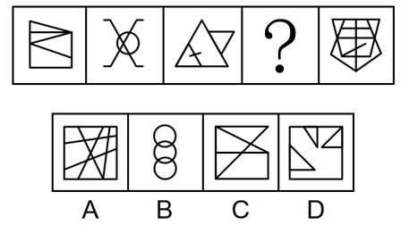
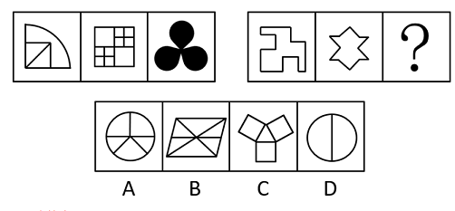
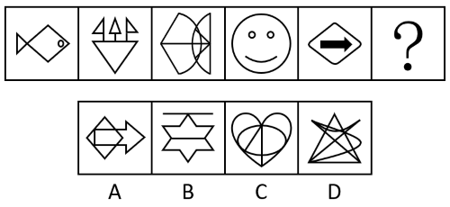
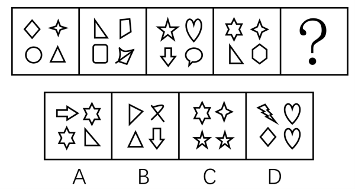

# 2019年福建省选调生考试《行政职业能力测验》

> 判断推理 · 30 题 · 福建 2019

## 第 1 题　qid 4705670 · 图形推理

从所给的四个选项中，选择最合适的一个填入问号处，使之呈现一定的规律性：

- **A**. A　✅
- **B**. B
- **C**. C
- **D**. D

**答案**：A

**官方解析**

元素组成不同，且无明显属性规律，考虑数量规律。观察发现，题干图2为多端点图形，且是“田”字变形图，考虑笔画数。题干图形的笔画数依次为1、2、3、？、5，故“？”处图形的笔画数应为4，只有A项符合。
故正确答案为A。

---

## 第 2 题　qid 4705674 · 图形推理

从所给的四个选项中，选择最合适的一个填入问号处，使之呈现一定的规律性：

- **A**. A
- **B**. B
- **C**. C　✅
- **D**. D

**答案**：C

**官方解析**

元素组成不同，优先考虑属性规律。题干图形整体比较规整，考虑对称性。第一组图形均为轴对称图形，且对称轴的数量依次为1、2、3，第二组前两个图形的对称轴数量依次为1、2，故？处图形对称轴数量应为3，只有C项符合。
故正确答案为C。

---

## 第 3 题　qid 4705692 · 图形推理

从所给的四个选项中，选择最合适的一个填入问号处，使之呈现一定的规律性：

- **A**. A
- **B**. B　✅
- **C**. C
- **D**. D

**答案**：B

**官方解析**

元素组成不同，优先考虑属性规律。观察发现，图1、图2和图5存在三角形、箭头等明显的等腰元素，优先考虑对称性。题干图形均有1条对称轴，对称轴方向分别为横轴、竖轴、横轴、竖轴、横轴，故？处图形应有1条对称轴，且对称轴方向为竖轴，只有B项符合。
故正确答案为B。

---

## 第 4 题　qid 4705679 · 图形推理

从所给的四个选项中，选择最合适的一个填入问号处，使之呈现一定的规律性：

- **A**. A
- **B**. B　✅
- **C**. C
- **D**. D

**答案**：B

**官方解析**

元素组成不同，且无明显属性规律，考虑数量规律。观察发现，题干图形均由多个独立小元素构成，优先考虑元素的数量和种类。继续观察发现，题干每幅图形的元素种类均为4，只有B项满足此规律。
故正确答案为B。

---

## 第 5 题　qid 4705688 · 图形推理

从所给的四个选项中，选择最合适的一个填入问号处，使之呈现一定的规律性：

- **A**. A
- **B**. B
- **C**. C　✅
- **D**. D

**答案**：C

**官方解析**

元素组成相同，优先考虑位置规律。观察发现，椭圆形沿外圈每次顺时针移动1格，菱形沿外圈每次逆时针移动1格，故？处图形中椭圆形和菱形都应移动到右下角，只有C项符合。
故正确答案为C。

---

## 第 6 题　qid 4705684 · 定义判断

建设性冲突是指冲突各方目标一致，实现目标的途径、手段不同而产生的冲突。建设性冲突可以使组织中存在的不良功能和问题充分暴露出来，防止事态的进一步演化。
根据上述定义，下列属于建设性冲突的是（    ）。

- **A**. 两国外交代表团谈判破裂致使两国关系恶化
- **B**. 大专辩论会的某次比赛中反方辩手贏得胜利
- **C**. 某公司管理层经过激烈争论后确定了新产品营销方案　✅
- **D**. 夫妻俩因每年给父母的赡养费数额意见不同发生争吵

**答案**：C

**官方解析**

第一步：找出定义关键词。
“冲突各方目标一致”、“实现目标的途径、手段不同而产生的冲突”。
第二步：逐一分析选项。
A项：两国外交代表团谈判破裂，外交谈判中两国都是为了各自的利益，不符合“冲突各方目标一致”，不符合定义，排除；
B项：反方辩手赢得胜利，反方辩手与正方辩手的目标不一致，不符合“冲突各方目标一致”，不符合定义，排除；
C项：公司管理层的目标一致，都是想要一个更好的新产品营销方案，符合“冲突各方目标一致”，产生激烈争论，说明大家存在冲突，可能符合“实现目标的途径、手段不同而产生的冲突”，符合定义，当选；
D项：夫妻双方对赡养费数额有不同意见，不确定双方的目标是否一致，不符合“冲突各方目标一致”，不符合定义，排除。
故正确答案为C。

---

## 第 7 题　qid 4705669 · 定义判断

工厂布置，是指工厂在厂区范围内，对车间（科室）、仓库、设施、厂内运输线路、动力线路、供气管道、三废处理、绿化等各组成部分进行合理安排和组合。
下列不属于工厂布置的一项是（    ）。

- **A**. 化工厂的烟囱由东边挪到西边，以避免将灰尘吹向城区
- **B**. 厂长与副厂长进出大门时可以不登记　✅
- **C**. 为了降尘，厂里决定购买树种在厂区布置一条绿化带
- **D**. 工厂按其功能被划分为行政办公区、职工宿舍区和生活娱乐区

**答案**：B

**官方解析**

第一步：找出定义关键词。
“车间（科室）、仓库、设施、厂内运输线路、动力线路、供气管道、三废处理、绿化等各组成部分”、“合理安排和组合”。
第二步：逐一分析选项。
A项：挪动化工厂的烟囱避免将灰尘吹向城区，是对工业废气的合理安排，符合“车间（科室）、仓库、设施、厂内运输线路、动力线路、供气管道、三废处理、绿化等各组成部分”、“合理安排和组合”，符合定义，排除；
B项：厂长与副厂长进出大门时可以不登记，不是对组成部分的合理安排和组合，不符合“车间（科室）、仓库、设施、厂内运输线路、动力线路、供气管道、三废处理、绿化等各组成部分”、“合理安排和组合”，不符合定义，当选；
C项：工厂为降尘布置绿化带，是对绿化的合理安排，符合“车间（科室）、仓库、设施、厂内运输线路、动力线路、供气管道、三废处理、绿化等各组成部分”、“合理安排和组合”，符合定义，排除；
D项：工厂按功能划分区域，是对车间（科室）的合理安排，符合“车间（科室）、仓库、设施、厂内运输线路、动力线路、供气管道、三废处理、绿化等各组成部分”、“合理安排和组合”，符合定义，排除。
本题为选非题，故正确答案为B。

---

## 第 8 题　qid 4705685 · 定义判断

旁观者效应，指在紧急情况下，个体在有他人在场时，出手帮助的可能性降低，援助的几率与旁观者人数成反比。换句话说，旁观者数量越多，他们当中任何一人进行援助的可能性越低。
下列不属于旁观者效应的一项是（    ）。

- **A**. 小孩在商场与父母走丢后，在拐卖者的哄骗下与拐卖者离开商场，众保安竟无人阻拦　✅
- **B**. 一小孩落水时，周围有不少年轻人在聊天，却没有人出手相救
- **C**. 路边突然有人心脏病发，在围观者众多的情况下居然没有人叫救护车
- **D**. 纽约一妇女在公园被杀死，38名凶杀目击者没有人报警

**答案**：A

**官方解析**

第一步：找出定义关键词。
“在紧急情况下”、“旁观者数量越多”、“进行援助的可能性越低”。
第二步：逐一分析选项。
A项：与父母走丢的小孩，被拐卖者哄骗与其一起离开商场，众保安竟无人阻拦，很可能是因为他们不知道与孩子一起离开的是拐卖者而非其父母，不符合“旁观者数量越多”、“进行援助的可能性越低”，不符合定义，当选；
B项：小孩落水，属于紧急情况，周围有不少年轻人，却没有人出手相救，符合“在紧急情况下”、“旁观者数量越多”、“进行援助的可能性越低”，符合定义，排除；
C项：有人心脏病突发，属于紧急情况，围观者众多却没有人叫救护车，符合“在紧急情况下”、“旁观者数量越多”、“进行援助的可能性越低”，符合定义，排除；
D项：妇女在公园被杀死，38名凶杀目击者却没有人报警，符合“在紧急情况下”、“旁观者数量越多”、“进行援助的可能性越低”，符合定义，排除。
本题为选非题，故正确答案为A。

---

## 第 9 题　qid 4705682 · 定义判断

心理干预是指在心理学理论指导下有计划、有步骤地对一定对象的心理活动、个性特征或心理问题施加影响，使之发生朝向预期目标变化的过程。心理干预的手段包括心理治疗、心理咨询、心理康复、心理危机干预等。
根据上述定义，下列属于心理干预的是（    ）。

- **A**. 某地发生未成年人侵害未成年人的事件，事发后专家呼吁对肇事者进行心理辅导
- **B**. 李兴小时候做道简单的加减乘除题往往要花比其他同龄孩子多数倍的时间，但由于他的母亲总是鼓励他，长大后他考上了重点大学的理科专业
- **C**. 由于老王在地震时目睹房屋变成废墟，地震之后产生了不断闪回当时场景的心理反应，心理专家根据他的情况制订了针对性的干预措施，经过治疗，他恢复了正常的情绪　✅
- **D**. 小张新买的手机丢失，同事知道后纷纷安慰他，他反而更加感到自己不走运

**答案**：C

**官方解析**

第一步：找出定义关键词。
“在心理学理论指导下”、“有计划、有步骤地对一定对象的心理活动、个性特征或心理问题施加影响”、“使之发生朝向预期目标变化”。
第二步：逐一分析选项。
A项：专家只是呼吁对肇事者进行心理辅导，但心理辅导是否进行了并不明确，不符合“在心理学理论指导下”、“有计划、有步骤地对一定对象的心理活动、个性特征或心理问题施加影响”、“使之发生朝向预期目标变化”，不符合定义，排除；
B项：母亲鼓励落后于同龄孩子的李兴，后来他考上了重点大学，没有体现是“在心理学理论指导下”和“有计划、有步骤地对一定对象的心理活动、个性特征或心理问题施加影响”，不符合定义，排除；
C项：老王在目睹地震后不断闪回当时的场景，心理专家制定了针对性的干预措施，体现了“在心理学理论指导下”、“有计划、有步骤地对一定对象的心理活动、个性特征或心理问题施加影响”，经过治疗，他恢复了正常的情绪，符合“使之发生朝向预期目标变化”，符合定义，当选；
D项：小张丢失了新手机，同事安慰他，未体现“在心理学理论指导下”、“有计划、有步骤地对一定对象的心理活动、个性特征或心理问题施加影响”，之后他反而更感到自己不走运，不符合“使之发生朝向预期目标变化”，不符合定义，排除。
故正确答案为C。

---

## 第 10 题　qid 4705693 · 定义判断

选择性注意是指在外界诸多刺激中仅仅注意某些刺激或刺激的某些方面，而忽略了其他刺激。
根据上述定义，下列属于选择性注意的是（    ）。

- **A**. 万绿丛中一点红，动人春色不须多　✅
- **B**. 不识庐山真面目，只缘身在此山中
- **C**. 山重水复疑无路，柳暗花明又一村
- **D**. 不畏浮云遮望眼，只缘身在最高层

**答案**：A

**官方解析**

第一步：找出定义关键词。
“在外界诸多刺激中”、“仅仅注意某些刺激或刺激的某些方面”、“忽略了其他刺激”。
第二步：逐一分析选项。
A项：在众多绿叶中的红花是动人的春色，即当红花、绿叶同时出现时，只关注到红花，而忽略绿叶，符合“在外界诸多刺激中”、“仅仅注意某些刺激或刺激的某些方面”、“忽略了其他刺激”，符合定义，当选；
B项：因为身在庐山，才没有认清庐山的面目，没有体现“在外界诸多刺激中”，不符合定义，排除；
C项：在山峦重叠、水流曲折时，柳绿花艳，忽然出现一个村庄，指注意到某一突然出现的刺激，但不代表忽略了其他刺激，没有体现“仅仅注意某些刺激或刺激的某些方面”、“忽略了其他刺激”，不符合定义，排除；
D项：因为身在山的最高层，所以不怕浮云会遮住视线，“不怕浮云”不是忽略浮云，不符合“仅仅注意某些刺激或刺激的某些方面”、“忽略了其他刺激”，不符合定义，排除。
故正确答案为A。

---

## 第 11 题　qid 4705680 · 定义判断

近因效应是指在总体印象形成的过程中，新近获得的信息比原来获得的信息影响更大的现象。
根据上述定义，下列属于近因效应的是（    ）。

- **A**. 喜新厌旧　✅
- **B**. 情人眼里出西施
- **C**. 先入为主
- **D**. 唯女子与小人难养也

**答案**：A

**官方解析**

第一步：找出定义关键词。
“新近获得的信息比原来获得的信息影响更大”。
第二步：逐一分析选项。
A项：“喜新厌旧”意思是当出现新事物的时候，就会更加喜欢新的，而厌弃旧的，说明新近获得的信息影响更大，符合“新近获得的信息比原来获得的信息影响更大”，符合定义，当选；
B项：“情人眼里出西施”意思是在有情人眼里，不论对方外表如何，都会觉得对方外表美丽，不涉及新近获得的信息与原来获得的信息的对比，不符合“新近获得的信息比原来获得的信息影响更大”，不符合定义，排除；
C项：“先入为主”意思是先接受了一种说法或思想，后来就不容易再接受不同的说法或思想，说明原来获得的信息影响更大，不符合“新近获得的信息比原来获得的信息影响更大”，不符合定义，排除；
D项：“唯女子与小人难养也”不涉及新近获得的信息与原来获得的信息的对比，不符合“新近获得的信息比原来获得的信息影响更大”，不符合定义，排除。
故正确答案为A。

---

## 第 12 题　qid 20063 · 定义判断

口红效应是指每当经济不景气，人们的消费就会转向购买廉价商品，而口红虽非生活必需品，却兼具廉价和粉饰的作用，能够给消费者带来心理慰藉。
下列符合口红效应的是：

- **A**. 近来公司效益不好，胡老板卖掉了自己的高级轿车，改骑自行车上班，既环保又锻炼身体
- **B**. 为了约会，小刘虽然工资不高，还是买了一身名牌西装来装扮
- **C**. 今年单位效益不好，小杨取消了假期带全家到国外旅行的计划，改为到近郊旅游，结果感觉还不错　✅
- **D**. 为了明天的面试，小黄到理发店理了一个新发型，看上去朝气蓬勃，使他信心十足

**答案**：C

**官方解析**

第一步：找出定义关键词。
“经济不景气”、“转向购买廉价商品”、“非生活必需品”。
第二步：逐一分析选项。
A项，“卖掉高级轿车，改骑自行车”并未体现购买廉价商品，不符合定义，排除；
B项，“名牌西装”不是“廉价商品”，不符合定义，排除；
C项，“单位效益不好”对应“经济不景气”，把“国外旅行计划”改成“近郊旅游”对应“转向购买廉价商品”，旅行是“非生活必需品”，符合定义，当选；
D项，只说了小黄为了面试去理发，没提及定义中的关键因素，属于无关项，排除。
故正确答案为C。

---

## 第 13 题　qid 20091 · 定义判断

学习迁移即一种学习对另一种学习的影响，它广泛地存在于知识、技能、态度和行为规范的学习中。任何一种学习都会受到学习者已有知识经验、技能、态度等的影响，只要有学习，就有迁移。
下列属于学习迁移的是：

- **A**. 小王的父亲是著名的画家，受父亲影响，他从小就对绘画产生了兴趣，后来也成为一名画家
- **B**. 某大学生在人多的教室里复习功课总容易分心，于是换到一个独处的安静环境，学习效率非常高
- **C**. 小芳学会了拉二胡，自己尝试拉小提琴，结果也很快学会　✅
- **D**. 某学生沉迷于网络游戏致使学习成绩下降，后来通过老师的教育和同学的帮助，改掉了毛病，学习进步非常快

**答案**：C

**官方解析**

第一步：找出定义关键词。
“一种学习对另一种学习的影响”，而且这种影响来自“学习者已有知识经验、技能、态度等”。
第二步：逐一分析选项。
A项，小王对绘画产生兴趣是“受父亲影响”，不是受自身已有技能的影响，不符合定义，排除；
B项，说的是某大学生改变学习环境之后学习效率提高，不符合定义，排除；
C项，小芳很快学会拉小提琴是受已经会拉二胡的影响，符合定义，当选；
D项，是某学生在老师和同学的帮助下提高学习成绩，这两种情况都没有体现出“一种学习对另一种学习的影响”，不符合定义，排除。
故正确答案为C。

---

## 第 14 题　qid 18897 · 定义判断

依据能力补偿的途径对能力系统整体作用效果的不同，可以将能力间的相互补偿途径分为非衡性补偿和平衡性补偿两种。非衡性补偿是指以优势能力弥补弱势能力，从而加强整体能力的方式。平衡性补偿是指通过提高弱势能力以加强整体能力的方式。
根据上述定义，下列各项中属于非衡性补偿的是：

- **A**. 小张刚来到汽车修配厂的时候，对维修发动机的技术只是略懂皮毛，后来在师傅的带领下，他勤奋学习，终于熟练掌握了这一技术
- **B**. 王明和几个同学组建了一支乐队，为了培养彼此的默契，更好地互相配合，他们经常在业余时间进行排练
- **C**. 小丽经常在网上浏览娱乐新闻，久而久之，她对各种娱乐消息了然于胸
- **D**. 排球队5号运动员的特点是进攻和拦网较强，但防守、一传较弱，教练将其安排在一号位防守，用前排拦网封住直线的方法掩盖他的不足　✅

**答案**：D

**官方解析**

第一步：找出定义关键词。
非衡性补偿强调用“优势能力弥补弱势能力”。
第二步：逐一分析选项。
A项中小张学习了维修发动机的技术，从而提高了自己的弱势能力，加强了自己的整体维修能力，这属于平衡性补偿，排除；
B、C两项中并未体现用“优势能力弥补弱势能力”，排除；

D项中5号运动员的优势是进攻和拦网，弱势是防守和一传，“教练将其安排在一号位防守，用前排拦网封住直线的方法掩盖他的不足”，教练是用5号运动员的优势能力弥补他的弱势能力，这符合非衡性补偿的定义，当选。
故正确答案为D。

---

## 第 15 题　qid 622855 · 定义判断

行政法律关系根据行政权力的作用范围不同分为外部行政法律关系和内部行政法律关系。行政机关与公民、法人和其他组织之间作为管理和被管理关系的是外部行政法律关系；双方当事人作为上下级的从属关系是内部行政法律关系。
根据上述定义，下列行为属于内部行政法律关系的是：

- **A**. 某省公安厅表彰省交警大队的“英模干警”　✅
- **B**. 某卫生局检查所辖范围内的餐饮企业
- **C**. 某大学对违纪学生进行处罚
- **D**. 某企业到税务局纳税

**答案**：A

**官方解析**

第一步：找出定义关键词。
“上下级的从属关系”。
第二步：逐一分析选项。
A项：省公安厅和省交警大队是属于上下级的从属关系，符合定义，当选；
B项：卫生局和餐饮企业是管理和被管理关系，属于外部行政法律关系，不符合定义，排除；
C项：大学不属于行政机关，不符合定义，排除；
D项：税务局和企业是管理和被管理关系，属于外部行政法律关系，不符合定义，排除。
故正确答案为A。

---

## 第 16 题　qid 4705678 · 类比推理

藤条：藤椅

- **A**. 岩壁：岩画
- **B**. 豆子：豆腐　✅
- **C**. 竹子：桌子
- **D**. 橡胶：铜笔

**答案**：B

**官方解析**

第一步：判断题干词语间逻辑关系。
藤条是制作藤椅的原材料，二者为原材料与成品的对应关系，且藤条是制作藤椅的必然原材料。
第二步：判断选项词语间逻辑关系。
A项：岩壁是岩画的载体，二者不是原材料与成品的对应关系，与题干逻辑关系不一致，排除；
B项：豆子是制作豆腐的原材料，二者为原材料与成品的对应关系，且豆子是制作豆腐的必然原材料，与题干逻辑关系一致，当选；
C项：竹子是制作桌子的原材料，二者为原材料与成品的对应关系，但竹子不是制作桌子的必然原材料，与题干逻辑关系不一致，排除；
D项：橡胶是制作铜笔的原材料，二者为原材料与成品的对应关系，但橡胶不是制作铜笔的必然原材料（有的铜笔全部是铜制作的，有的铜笔手握的地方是橡胶制作的），与题干逻辑关系不一致，排除。
故正确答案为B。

---

## 第 17 题　qid 4705689 · 类比推理

生日：诞辰

- **A**. 卡通：国画
- **B**. 荷花：菡萏　✅
- **C**. 一年：春秋
- **D**. 奶奶：外祖母

**答案**：B

**官方解析**

第一步：判断题干词语间逻辑关系。
生日和诞辰都是指出生的日子，二者为全同关系。
第二步：判断选项词语间逻辑关系。
A项：卡通是指动画片或漫画，国画是指中国的传统绘画形式，是用毛笔蘸水、墨、彩作画于绢或纸上，二者不是全同关系，与题干逻辑关系不一致，排除；
B项：荷花又称菡萏，二者为全同关系，与题干逻辑关系一致，当选；
C项：春秋是指春季和秋季，可泛指一年，同时春秋也指人的年岁、历史上的春秋时期等，二者不是全同关系，与题干逻辑关系不一致，排除；
D项：外祖母是指母亲的母亲，奶奶是指父亲的母亲，二者为并列关系，与题干逻辑关系不一致，排除。
故正确答案为B。

---

## 第 18 题　qid 4705677 · 类比推理

按图：索骥

- **A**. 一筹：莫展
- **B**. 拔苗：助长　✅
- **C**. 抓耳：挠腮
- **D**. 盲人：摸象

**答案**：B

**官方解析**

第一步：判断题干词语间逻辑关系。
“按图索骥”指照图上画的样子去寻求好马，比喻办事机械、死板，不知变通，后也比喻依照一定的线索去寻找事物。“按图”是为了“索骥”，二者为方式目的的对应关系。
第二步：判断选项词语间逻辑关系。
A项：“一筹莫展”形容遇事拿不出一点办法，没有任何进展。“一筹”和“莫展”不是方式目的的对应关系，与题干逻辑关系不一致，排除；
B项：“拔苗助长”指把苗拔起来，帮助其成长，比喻违反事物的发展规律，急于求成，最后事与愿违。“拔苗”是为了“助长”，二者为方式目的的对应关系，与题干逻辑关系一致，当选；
C项：“抓耳挠腮”指乱抓耳朵和腮帮子，形容焦急、忙乱或苦闷又没有办法的样子。“抓耳”和“挠腮”为并列关系，与题干逻辑关系不一致，排除；
D项：“盲人摸象”比喻只凭对事物的片面了解，便妄加推断。“盲人”和“摸象”为主谓宾结构，二者不是方式目的的对应关系，与题干逻辑关系不一致，排除。
故正确答案为B。

---

## 第 19 题　qid 4705681 · 类比推理

庄周：游刃有余

- **A**. 曹操：望梅止渴　✅
- **B**. 项羽：柳暗花明
- **C**. 陆游：霸王别姬
- **D**. 王维：狡兔三窟

**答案**：A

**官方解析**

第一步：判断题干词语间逻辑关系。
游刃有余最早出自于《庄子·养生主》，其作者为庄周，该成语的典故与庄周有关，二者为对应关系。
第二步：判断选项词语间逻辑关系。
A项：望梅止渴的故事内容为曹操利用了人对酸梅子的条件反射，让士兵们看到了希望，鼓舞了士气，该成语的典故与曹操有关，二者为对应关系，与题干逻辑关系一致，当选；
B项：柳暗花明最早出自唐朝诗人王维的《早朝》“柳暗百花明，春深五凤城。”后来宋朝诗人陆游的《游山西村》中的“山重水复疑无路，柳暗花明又一村。”也与该成语有关，与项羽无关，与题干逻辑关系不一致，排除；
C项：霸王别姬出自于《史记·项羽本纪》，其作者为司马迁，霸王别姬的故事内容为西楚霸王项羽心高气傲，性格单纯，最终与爱妻生离死别、兵败刘邦，与陆游无关，与题干逻辑关系不一致，排除；
D项：狡兔三窟出自于《战国策·齐策四》，其作者为刘向，与王维无关，与题干逻辑关系不一致，排除。
故正确答案为A。

---

## 第 20 题　qid 4705687 · 逻辑判断

直言不讳：打开天窗说亮话

- **A**. 后来居上：做梦吃星星，想得不低
- **B**. 好高骛远：后长的犄角比先长的耳朵长
- **C**. 越俎代庖：四下起火，八下冒烟
- **D**. 寡不敌众：好虎抵不住群狼　✅

**答案**：D

**官方解析**

第一步：判断题干词语间逻辑关系。
“直言不讳”指直截了当地说出来，没有丝毫顾忌，“打开天窗说亮话”指直率而明白地讲出来，二者为近义关系。
第二步：判断选项词语间逻辑关系。
A项：“后来居上”指后起的超过先前的，“做梦吃星星，想得不低”指想法不切实际、异想天开，二者不是近义关系，与题干逻辑关系不一致，排除；
B项：“好高骛远”指不切实际地追求过高的目标，“后长的犄角比先长的耳朵长”比喻后来的人或事物超过先前的，二者不是近义关系，与题干逻辑关系不一致，排除；
C项：“越俎代庖”比喻超过自己的职务范围，去处理别人所管的事情，“四下起火，八下冒烟”形容局面混乱，到处闹事，无法收拾，二者不是近义关系，与题干逻辑关系不一致，排除；
D项：“寡不敌众”比喻人少的抵挡不住人多的，“好虎抵不住群狼”也比喻人少的抵挡不住人多的，二者为近义关系，与题干逻辑关系一致，当选。
故正确答案为D。

---

## 第 21 题　qid 2002478 · 逻辑判断

美国鸟类学基金会在不久前公布了《美国鸟类状况》的报告。他们认为，全球变暖正促使鸟类调整生物钟，提前产蛋期，而上述变化中会使这些鸟无法为其刚破壳而出的后代提供足够的食物，比如蓝冠山雀主要以蛾和蝴蝶的幼虫为食，而蛾和蝴蝶的产卵时间没有相应提前，“早产”的小蓝冠山雀会在破壳后数天内持续挨饿。
下列哪项如果为真，最能支持上述论证？

- **A**. 最近40年的英国的平均气温不断上升
- **B**. 很多鸟类的产蛋期确实提前了
- **C**. 除了蛾和蝴蝶的幼虫外，蓝冠山雀很少吃其他食物　✅
- **D**. 蛾和蝴蝶的产卵期不同

**答案**：C

**官方解析**

第一步：找到论点和论据。
论点：鸟类提前产蛋期，无法为其刚破壳而出的后代提供足够的食物。
论据：蓝冠山雀主要以蛾和蝴蝶的幼虫为食，而蛾和蝴蝶的产卵时间没有相应提前，“早产”的小蓝冠山雀会在破壳后数天内持续挨饿。
第二步：逐一分析选项。
A项：最近40年的英国的平均气温不断上升，平均气温升高与产蛋期提前出生的后代没有足够的食物无直接关系，属无关选项，排除；
B项：很多鸟类的产蛋期确实提前了，与产蛋期提前出生的后代没有足够的食物无直接关系，属无关选项，排除；
C项：如果除了蛾和蝴蝶的幼虫外，蓝冠山雀还吃其他食物，那么鸟类提前产蛋期，也可以为其刚破壳而出的后代提供足够的食物，论点就不成立，故该项为论点成立的必要条件，可以加强，当选；
D项：蛾和蝴蝶的产卵期不同，与产蛋期提前出生的后代没有足够的食物无直接关系，属无关选项，排除。
故正确答案为C。

---

## 第 22 题　qid 765609 · 类比推理

航天局认为优秀宇航员应具备三个条件：第一，丰富的知识；第二，熟练的技术；第三，坚强的意志。现有至少符合条件之一的甲、乙、丙、丁四位优秀飞行员报名参选，已知：①甲、乙意志坚强程度相同②乙、丙知识水平相当③丙、丁并非都是知识丰富④四人中三人知识丰富、两人意志坚强、一人技术熟练。航天局经过考查，发现其中只有一人完全符合优秀宇航员的全部条件。他是：

- **A**. 甲
- **B**. 乙
- **C**. 丙　✅
- **D**. 丁

**答案**：C

**官方解析**

由条件②③④得，丁的知识不丰富，因为如果丁的知识丰富的话，由条件③丙的知识不丰富，再由条件②乙的知识也不丰富，与条件④“有三人知识丰富”矛盾。丁的技术也不熟练，因为如果丁的技术熟练，则由条件④“只有一人技术熟练”，则甲、乙和丙三人技术都不熟练，这样就没有符合条件的了。因为甲、乙、丙和丁四人至少符合条件之一，所以，丁意志坚强。由条件①，甲和乙意志坚强程度相同，推得，甲和乙意志不坚强。因为如果都坚强的话，则就有甲、乙和丁三人意志坚强了，与条件④“只有两人意志坚强”矛盾，所以，甲和乙意志不坚强。那么，丙的意志坚强。因此，只有丙完全符合条件。
故正确答案为C。

---

## 第 23 题　qid 47679 · 类比推理

品学兼优的学生不都读研究生。
如果以上论述为真，则下列命题能判断真假的有几个?
Ⅰ.有些品学兼优的学生读研究生
Ⅱ.有些品学兼优的学生不读研究生
Ⅲ.所有品学兼优的学生都读研究生
Ⅳ.所有品学兼优的学生都不读研究生

- **A**. 1
- **B**. 2　✅
- **C**. 3
- **D**. 4

**答案**：B

**官方解析**

第一步：翻译题干。
品学兼优的学生不都读研究生，等价于：有些品学兼优的学生不读研究生。
第二步：逐一分析选项。
Ⅰ.通过题干“有些品学兼优的学生不读研究生”，其中“有些”无法判定具体是多少，因此无法判定“有些品学兼优的学生读研究生”的真假情况，故Ⅰ无法判断真假；
Ⅱ.“有些品学兼优的学生不读研究生”，与题干一致，故可判断Ⅱ为真；
Ⅲ.“所有品学兼优的学生都读研究生”与题干“有些品学兼优的学生不读研究生”为矛盾关系，矛盾关系必有一真必有一假，题干条件为真，故可判断Ⅲ为假；
Ⅳ.通过题干“有些品学兼优的学生不读研究生”，其中“有些”无法判定具体是多少，因此无法判定“所有品学兼优的学生都不读研究生”的真假情况，故Ⅳ无法判断真假。
综上分析，可判断Ⅱ为真，Ⅲ为假，Ⅰ和Ⅳ无法判断真假，即可确定真假的有两个。
故正确答案为B。

---

## 第 24 题　qid 4705713 · 逻辑判断

A股市场的投资者乐于使用大宗交易的方式，因为这种交易方式往往是定制式交易，两个账户间可以“无缝拼接”，但苦于其门槛过高，上交所近日发布新政，内容是将大宗交易的门槛大幅降低。业内人士认为这有利于降低A股市场股价波动。因为根据以往的规定，A股大宗交易最低额度为50万股或300万元人民币，这样大笔的交易一旦进入二级市场套现无疑将对个股股价产生冲击。因此交易所把门槛降低尽量避免批量的买卖交易影响个股股价，这是从稳定市场价格方面来考虑的。
以下哪项如果为真，能够削弱新政的作用（    ）。

- **A**. 随着交易门槛降低，大宗交易行情火爆，有投资者盈利超过30％
- **B**. 没有降低门槛之前，大宗交易的数量一直保持在一个较为稳定的范围内
- **C**. 门槛降低后，基金可以通过这样的方式来减仓，同时也可以降低建仓成本
- **D**. 50万股或300万元人民币以下集中抛售个股的大宗交易明显增多　✅

**答案**：D

**官方解析**

第一步：找出论点和论据。
论点：把门槛降低尽量避免批量的买卖交易影响个股股价，可以稳定市场价格。
论据：A股大宗交易最低额度为50万股或300万元人民币，这样大笔的交易一旦进入二级市场套现无疑将对个股股价产生冲击。
本题论点和论据都是在讨论大宗交易对市场股价的影响，论点论据话题一致，考虑削弱论点，即把门槛降低不能避免批量的个股大宗交易，不能稳定市场价格。
第二步：逐一分析选项。
A项：指出门槛降低后有投资者盈利的情况，但是只是个别投资者盈利，不明确整体股价是否稳定，无法削弱，排除；
B项：指出没有降低门槛之前的情况，而论点讨论的是门槛降低之后的作用，与论点讨论话题不一致，无法削弱，排除；
C项：指出门槛降低后基金可以减仓、降低建仓成本，但是基金的这一操作对股市的价格是否存在影响是不明确的，无法削弱，排除；
D项：50万股或300万元人民币以下的交易属于门槛降低后的交易，集中抛售属于批量交易，而门槛降低后集中抛售的批量交易增加，说明降低门槛并没有达到避免批量个股大宗交易的作用，直接削弱论点，可以削弱，当选。
故正确答案为D。

---

## 第 25 题　qid 4705737 · 逻辑判断

高脂肪、高糖含量的食品有害于人的健康。因此，既然越来越多的国家明令禁止未成年人吸烟和喝含酒精的饮料，那么，为什么不用同样的方法对待那些有害健康的食品呢？应该禁止18岁以下的人食用高脂肪、高糖食品。
以下哪项如果是真的，最能削弱上述论证（    ）。

- **A**. 许多国家已把成年人的标准定到16岁以上
- **B**. 烟、酒对人体的危害比高脂肪、高糖食品的危害要严重得多
- **C**. 并非所有的国家都禁止未成年人吸烟、喝酒
- **D**. 高脂肪、高糖食品主要有害中老年人的健康　✅

**答案**：D

**官方解析**

第一步：找出论点和论据。
论点：应该禁止18岁以下的人食用高脂肪、高糖食品。
论据：高脂肪、高糖含量的食品有害于人的健康。
本题论点讨论的是禁止18岁以下的人食用高脂肪、高糖食品，论据讨论的是高脂肪、高糖含量的食品有害于人的健康，二者话题一致，削弱可以优先考虑削弱论点。
第二步：逐一分析选项。
A项：许多国家把成年人的标准定到了16岁以上，选项不涉及高脂肪、高糖食品，而论点讨论禁止18岁以下的人食用高脂肪、高糖食品，话题不一致，无关项，无法削弱，排除；
B项：烟、酒的危害更严重，比较烟、酒和高脂肪、高糖食品的危害程度，而论点讨论禁止18岁以下的人食用高脂肪、高糖食品，话题不一致，无关项，无法削弱，排除；
C项：有的国家不禁止未成年人吸烟、喝酒，论点讨论禁止18岁以下的人食用高脂肪、高糖食品，二者话题不一致，无关项，无法削弱，排除；
D项：高脂肪、高糖食品主要对中老年人健康有害而非对未成年人有害，即禁止18岁以下的人食用高脂肪、高糖食品对维护未成年人健康作用不大，直接削弱论点，可以削弱，当选。
故正确答案为D。

---

## 第 26 题　qid 4705707 · 逻辑判断

在美国，近年来在电视卫星的发射和操作中事故不断，这使得不少保险公司不得不面临巨额赔偿，这不可避免地导致了电视卫星的保险金的猛涨，使得发射和操作电视卫星的费用变得更为昂贵。为了应付昂贵的成本，必须进一步开发电视卫星更多的尖端功能来提高电视卫星的售价。以下哪项，如果为真，和题干的断定一起，最能支持这样一个结论，即电视卫星的成本将继续上涨？

- **A**. 承担电视卫星保险业风险的只有为数不多的几家大公司，这使得保险金必定很高
- **B**. 美国电视卫星业面临的问题，在西方发达国家带有普遍性
- **C**. 电视卫星目前具备的功能已能满足需要，用户并没有对此提出新的要求
- **D**. 电视卫星具备的尖端功能越多，越容易出问题　✅

**答案**：D

**官方解析**

第一步：找出论点和论据。
论点：电视卫星的成本将继续上涨。
论据：在美国，近年来在电视卫星的发射和操作中事故不断，这使得不少保险公司不得不面临巨额赔偿，这不可避免地导致了电视卫星的保险金的猛涨，使得发射和操作电视卫星的费用变得更为昂贵。为了应付昂贵的成本，必须进一步开发电视卫星更多的尖端功能来提高电视卫星的售价。
论点论讨电视卫星的成本将继续上涨，是一种对未来情况的预判；论据先解释了现在电视卫星成本上涨的原因，然后提出了解决方法——进一步开发尖端功能，即未来采取的措施，二者话题不一致，加强优先考虑搭桥。
第二步：逐一分析选项。
A项：承担电视卫星保险业风险的公司较少，因此保险公司必定大幅提高保险金，但这只解释了为什么现在电视卫星成本上涨，未来是否会继续上涨并不明确，无法加强，排除；
B项：美国电视卫星业面临的问题在西方发达国家比较普遍，而论点讨论未来电视卫星的成本将继续上涨，二者话题不一致，无关项，无法加强，排除；
C项：用户对电视卫星的功能没有新要求，说明通过增加尖端功能无法解决现在电视卫星成本上涨的问题，而论点讨论未来电视卫星成本会继续上涨，二者话题不一致，无关项，无法加强，排除；
D项：电视卫星具备的尖端功能越多，越容易出问题，说明未来增加尖端功能的措施只会让成本上涨，在“成本继续上涨”和“更多的尖端功能”间建立了联系，搭桥项，可以加强，当选。
故正确答案为D。

---

## 第 27 题　qid 4705715 · 逻辑判断

纯种的蒙古奶牛一般每年产奶400升；如果蒙古奶牛与欧洲奶牛杂交，其后代一般每年可产2700升牛奶。为此，一个国际组织计划通过杂交的方式，帮助蒙古牧民提高其牛奶产量。以下哪项如果为真，对该国际组织的计划提出了最严重的质疑？

- **A**. 并不是欧洲所有奶牛品种都可以成功地同蒙古奶牛杂交
- **B**. 许多年轻的蒙古人认为饲养奶牛是一种很低贱的职业，因为它不如其他许多职业更有利可图
- **C**. 蒙古地区的放牧条件只适于饲养当地品种的奶牛，不适合杂交奶牛生长　✅
- **D**. 蒙古牧民出口到欧洲的主要产品的牛皮和牛角，而不是牛奶

**答案**：C

**官方解析**

第一步：找出论点和论据。
论点：一个国际组织计划通过杂交的方式，帮助蒙古牧民提高其牛奶产量。
论据：纯种的蒙古奶牛一般每年产奶400升；如果蒙古奶牛与欧洲奶牛杂交，其后代一般每年可产2700升牛奶。
本题论点和论据讨论的都是杂交可提高蒙古奶牛的牛奶产量，论点论据话题一致，削弱可以优先考虑削弱论点，即杂交的方式并不能帮助蒙古奶牛提高牛奶产量。
第二步：逐一分析选项。
A项：并不是欧洲所有奶牛品种都可以成功地同蒙古奶牛杂交，但只要有些品种能够杂交成功，就能提高蒙古奶牛的牛奶产量，事实上是否存在能够杂交成功的品种并不明确，不明确项，无法削弱，排除；
B项：许多年轻的蒙古人对饲养奶牛这一职业并不认可，而论点讨论的是通过杂交提高蒙古奶牛的牛奶产量，二者话题不一致，无关项，无法削弱，排除；
C项：蒙古地区的放牧条件不适合杂交奶牛生长，说明即使杂交成功，杂交奶牛也无法顺利成长，其牛奶产量也就无法提高，直接削弱论点，可以削弱，当选；
D项：牛奶并非蒙古牧民出口到欧洲的主要产品，而论点讨论的是通过杂交提高蒙古奶牛的牛奶产量，二者话题不一致，无关项，无法削弱，排除。
故正确答案为C。

---

## 第 28 题　qid 4705741 · 逻辑判断

汉斯、亚瑟、古力三个学生来自美国、德国和意大利，其中一个学法律，一个学经济，一个学管理。
已知：
1.汉斯不是学法律的，亚瑟不是学管理的；
2.学法律的不是来自德国；
3.学管理的来自美国；
4.亚瑟不是来自意大利。
以上条件成立，以下哪项为真？

- **A**. 汉斯学管理，亚瑟学经济，古力学法律　✅
- **B**. 汉斯学经济，亚瑟学管理，古力学法律
- **C**. 汉斯学法律，亚瑟学经济，古力学管理
- **D**. 汉斯学管理，亚瑟学法律，古力学经济

**答案**：A

**官方解析**

第一步：分析题干条件。
（1）汉斯不学法律，亚瑟不学管理；
（2）学法律的不来自德国；
（3）学管理的来自美国；
（4）亚瑟不来自意大利。
第二步：根据题干条件进行推理。
选项信息充分，优先考虑排除法。
根据条件（1）可知，汉斯不学法律，亚瑟不学管理，排除B、C两项；
结合条件（1）（3）可知，亚瑟不来自美国，再结合条件（4）可知，亚瑟也不来自意大利，故亚瑟只能来自德国；然后结合条件（2）可知，来自德国的不学法律，因此，亚瑟不学法律，排除D项。
故正确答案为A。

---

## 第 29 题　qid 4705720 · 逻辑判断

只有经过体检并合格的人才能加入冬泳协会。所有加入冬泳协会的人都被评为全民健身积极分子。有的退休老同志是冬泳协会成员。王府大厦的保安都没有经过体检。
如果以上断定成立，那么下列各项都能从中推出，除了（    ）。

- **A**. 有的退休老同志被评为全民健身积极分子
- **B**. 王府大厦的保安中，有人被评为全民健身积极分子　✅
- **C**. 王府大厦的保安都没有加入冬泳协会
- **D**. 有的退休老同志经过体检

**答案**：B

**官方解析**

第一步：翻译题干。

①冬泳协会体检 且 合格

②冬泳协会健身积极分子

③有的退休老同志冬泳协会

④保安体检

第二步：逐一分析选项。

A项：翻译为有的退休老同志健身积极分子，通过条件③与条件②串联可以得出：有的退休老同志冬泳协会健身积极分子，可以推出，排除；

B项：翻译为有的保安健身积极分子，由条件④可知，保安体检，“体检”否定了条件①箭头后“体检 且 合格”的其中一项，且关系一项否定可以得出整项不成立，即否后，因此将条件④与条件①串联可以得出：保安体检冬泳协会，“冬泳协会”对于条件②来说是否前，否前得不出必然结论，所以无法确定是否为健身积极分子，无法推出，当选；

C项：翻译为保安冬泳协会，由条件④可知，保安体检，“体检”否定了条件①箭头后“体检 且 合格”的其中一项，且关系一项否定可以得出整项不成立，即否后，因此将条件④与条件①串联可以得出：保安体检冬泳协会，可以推出，排除；

D项：翻译为有的退休老同志体检，通过条件③与条件①串联可以得出：有的退休老同志冬泳协会体检 且 合格，且关系整项成立可以得出其中一项必然成立，可以推出，排除。

本题为选非题，故正确答案为B。

---

## 第 30 题　qid 4705738 · 逻辑判断

计算机程序的不同寻常之处是它既被专利保护，又被版权保护。专利权保护发明背后的思想，而版权保护那种思想的表达。但是，为了赢得任一项保护，思想必须清楚地与其表达区分开来。
由此，可以推出：

- **A**. 一些计算机程序背后的思想能与表达区分开来　✅
- **B**. 任何写计算机程序的人是该程序思想的发明者
- **C**. 计算机程序专利权像版权一样不难获得
- **D**. 很少有发明者既是专利权又是版权的所有人

**答案**：A

**官方解析**

日常结论题，根据题干信息逐一分析选项。
A项：结合题干第一句话与最后一句话可知，为了赢得保护就必须把思想与表达区分开来，而计算机程序已经获得了专利和版权保护，说明一些计算机程序可以做到将思想与表达区分开来，可以推出，当选；
B项：题干中没有涉及到写计算机程序的人，无中生有，排除；
C项：题干中没有涉及到获得计算机程序专利权的难易程度，无中生有，排除；
D项：题干中没有涉及到发明者是否为专利权和版权的所有人，无中生有，排除。
故正确答案为A。

---
