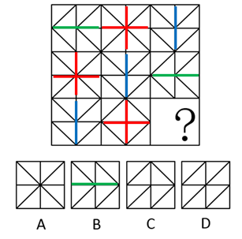
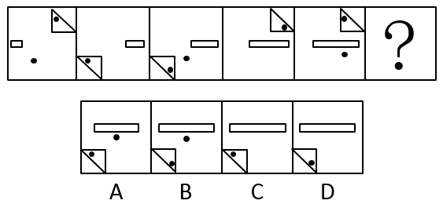
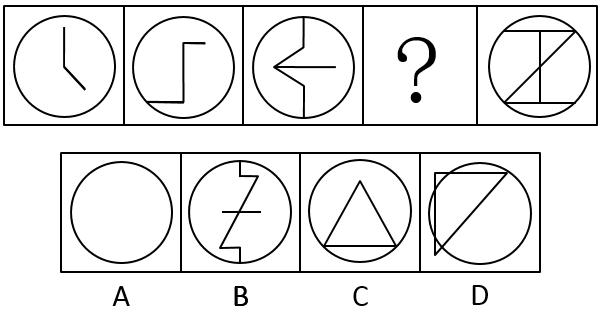
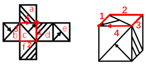

# 2019年辽宁省公务员录用考试《行测》题（网友回忆版）

> 判断推理 · 30 题 · 辽宁 2019

## 第 1 题　qid 2443004 · 图形推理

从四个选项中选最合适的一个填入问号处，使之呈现一定的规律性：

- **A**. A
- **B**. B　✅
- **C**. C
- **D**. D

**答案**：B

**官方解析**

解法一：图形元素组成相同，但位置无明显规律，继续观察发现，九宫格每一行的三个图形均为轴对称图形，因此问号处应填一个轴对称图形，但选不出唯一答案，因此考虑对称轴的细化。继续观察，发现每一行的三个图形分别都只有一条横向对称轴、只有一条纵向对称轴和有两条相互垂直的对称轴，如下图所示： 

 

因此问号处应当填一个只有一条横向对称轴的图形，只有B选项满足。

故正确答案为B。

解法二：图形元素组成相同，优先考虑位置规律，九宫格优先横行观察，通过相邻比较发现，第一行相邻两幅图之间有且只有两条直线发生了位置变化；第二行验证此规律成立，第三行运用此规律，问号处应选择一个跟前一幅图“有且只有两条直线发生了变化”的选项，排除AC两项；九宫格横行观察选不出唯一答案，考虑竖着看，再次观察发现，第一列相邻两幅图之间也满足有且只有两条直线发生了变化，第二列验证无误，故B项和D项中，只有D项满足和第三列的图2有且只有两条直线发生了变化，D项当选。

故正确答案为D。

解法三：图形元素组成相同，但位置无明显规律。九宫格每格可划分为2×2的小格子，且每个小方格内有1条斜线，斜线只有两种，考虑黑白运算，九宫格优先看横行，观察发现：相同斜线叠加后变为“/”（如下图黄框内），不同斜线叠加后变为“\”（如下图红框内），经验证第二行也符合规律，第三行应用规律，只有B项符合。

故正确答案为B。

此题有三种思路，但其中两种解法答案都是B，此外，对称性考频相对较高，且以往考过类似题目特征的图形题，考查的也是对称性这一考点，因此经过教研，粉笔倾向于答案B。

---

## 第 2 题　qid 2443006 · 图形推理

从四个选项中选最合适的一个填入问号处，使之呈现一定的规律性：

- **A**. A
- **B**. B
- **C**. C　✅
- **D**. D

**答案**：C

**官方解析**

题干每幅图均有小黑点，且小黑点的个数分别是：2、1、2、1、2、？，因此问号处应填入小黑点数量为1的选项，排除A、B，剩下C、D两项，对比选项发现唯一区别在于小三角形内部黑点位置不一样；继续观察题干发现，利用时针法从三角形内部的黑点出发，经过直角画向另一条直角边的时候，图1、图3和图5的时针方向一致，均为逆时针，图2、图4的时针方向一致，均为顺时针，如下图所示： 

 

因此问号处应填入和图2、图4时针方向一致的选项，只有C项符合。

故正确答案为C。

---

## 第 3 题　qid 2443007 · 图形推理

从四个选项中选最合适的一个填入问号处，使之呈现一定的规律性：

- **A**. A
- **B**. B
- **C**. C　✅
- **D**. D

**答案**：C

**官方解析**

图形元素组成不同，属性无明显规律，考虑数量规律。观察发现，题干每幅图均是圆作为外框，且内部线条交叉明显，优先考虑数点。题干图形框上交点依次为0、1、2、？、4，内部交点依次为：1、2、3、？、3，框上交点和内部交点数作差的绝对值均为1，只有C项符合。
故正确答案为C。

---

## 第 4 题　qid 2443009 · 图形推理

左边给出的是纸盒的外表图，由它折叠而成的一项是：

- **A**. A　✅
- **B**. B
- **C**. C
- **D**. D

**答案**：A

**官方解析**

将展开图的面标上序号，如下图所示：

A项：与题干展开图一致，当选；

B项：正面是c面，从c面画边， 如下图所示：

展开图中边1对应是的d面，而B项中边1对应的不是d面，选项与题干不一致，排除；

C项：选项中顶面和右面为面b和面e，如下图所示，题干展开图中面b和面e的公共边挨着面b中带箭头的三角形和面e中的空白三角形：

而选项中两个面的公共边挨着两个面中的空白三角形： 

选项与题干展开图不一致，排除；

D项：顶面为c面，从c面开始画边，如下图所示：

展开图中，边3对应的是b面，而D项中边3对应的不是b面，选项与题干不一致，排除。

故正确答案为A。

---

## 第 5 题　qid 2443011 · 图形推理

把下面六个图形分为两类，使得每一类图形都有各自的共同特征或规律，分类正确的一项是：

- **A**. ①②③  ④⑤⑥
- **B**. ①④⑤  ②③⑥
- **C**. ①③⑥  ②④⑤
- **D**. ①③⑤  ②④⑥　✅

**答案**：D

**官方解析**

本题为分组分类。通过观察发现，图①③⑤均有一条竖线，图②④⑥均有空白矩形，因此图①③⑤为一组，②④⑥为一组，对应D项。
故正确答案为D。

---

## 第 6 题　qid 2443015 · 图形推理

从四个选项中选最合适的一个填入问号处，使之呈现一定的规律性：

- **A**. A　✅
- **B**. B
- **C**. C
- **D**. D

**答案**：A

**官方解析**

图形元素组成相同，优先考虑位置规律。观察发现，黑色三角形每次逆时针平移3格，小白圆圈每次顺时针平移2格，排除D项；最外圈阴影部分的线条与最中间阴影部分线条的方向依次是平行、垂直、平行、垂直、平行、？，因此问号处应当填一个垂直的，只有A符合。
故正确答案为A。

---

## 第 7 题　qid 2443055 · 定义判断

概念的内涵是指概念所反映的对象的本质属性，它是概念质的规定性，说明概念所反映的对象是什么样。
根据上述定义，下列属于从概念的内涵加以说明的是：

- **A**. 存储-转发信息系统是无论文书或其他信息等数字形式的文本、数字数据都能够通过该系统进行发送和接收
- **B**. 社会关系包括经济、思想、政治、文化以及家庭等各方面的关系
- **C**. 独角兽公司是指那些估值达到10亿美元以上的初创企业　✅
- **D**. 5G是4G之后的延伸

**答案**：C

**官方解析**

第一步：找出定义关键词。
“概念所反映的对象的本质属性”、“说明概念所反映的对象是什么样”。
第二步：逐一分析选项。
A项：存储-转发信息系统是无论文书或其他信息等数字形式的文本、数字数据都能够通过该系统进行发送和接收，只是说明文本、数字数据都能够通过该系统进行发送和接收，并没有指出该系统的特点和属性，不符合“概念所反映的对象的本质属性”，不符合定义，排除；
B项：社会关系包括经济、思想、政治、文化以及家庭等各方面的关系，是在具体举例说明哪些情况属于社会关系，没有指出社会关系的本质属性，不符合“概念所反映的对象的本质属性”，不符合定义，排除；
C项：独角兽公司是指那些估值达到10亿美元以上的初创企业，指出独角兽公司的属性是估值达到10亿美元以上、初创企业，符合“概念所反映的对象的本质属性”，也符合“说明概念所反映的对象是什么样”，符合定义，当选；
D项：5G是4G之后的延伸，没有指出5G的本质属性，不符合“概念所反映的对象的本质属性”，不符合定义，排除。
故正确答案为C。

---

## 第 8 题　qid 2443059 · 定义判断

饥饿营销是指商品提供者有意调低产量，以期达到调控供求关系、制造供不应求假象、维持商品较高售价和利润，以达到维护品牌形象、提高产品附加值的目的。
根据上述定义，下列属于饥饿营销的是：

- **A**. 在楼市旺季某开发商每次只开卖一栋楼，还张榜公布销售情况形成临时性缺货或只剩少数存量假象，造成人多排队、加价购买等热销氛围　✅
- **B**. 全球某大车企为了调整产品结构，对某品牌汽车减低产量
- **C**. 苹果平板电脑iPad刚上市很热销，有时断货，造成一些时尚人士找店长预留，甚至高价买水货
- **D**. 小米手机曾制定用户需先预定排号，根据排位顺序付款发货销售方式，从而引起大家对小米手机的关注，形成热销

**答案**：A

**官方解析**

第一步：找出定义关键词。
“商品提供者有意调低产量”、“调控供求关系、制造供不应求假象、维持商品较高售价和利润”、“以达到维护品牌形象、提高产品附加值的目的”。
第二步：逐一分析选项。
A项：开发商每次只开卖一栋楼，符合“商品提供者有意调低产量”，形成临时性缺货或只剩少数存量假象，造成人多排队、加价购买，符合“调控供求关系、制造供不应求假象、维持商品较高售价和利润”，符合定义，当选； 
B项：大车企为了调整产品结构，对汽车减低产量，不符合“调控供求关系、制造供不应求假象”，不符合定义，排除；
C项：iPad刚上市很热销，有时断货，不符合“商品提供者有意调低产量”，也不符合“调控供求关系、制造供不应求假象”，不符合定义，排除；
D项：小米手机曾制定用户需先预定排号，根据排位顺序付款发货销售方式，不符合“商品提供者有意调低产量”，也不符合“调控供求关系、制造供不应求假象”，不符合定义，排除。
故正确答案为A。

---

## 第 9 题　qid 2443071 · 定义判断

授权是指主管或领导者按层次领导原则委授副职或下属以一定责任与部分理事权，使副职或下属在其领导、监督下有相应的自主权和行动指挥权，被授权者对授权者负有报告及完成之责。
根据上述定义，下列属于授权的是：

- **A**. 因去党校学习王校长将报销业务交由校长助理审批　✅
- **B**. 财务处长每月将公司财务信息汇报给董事会
- **C**. 小张因为没找到车间主任，而直接找经理请假
- **D**. 张厂长让秘书替他准备午餐

**答案**：A

**官方解析**

第一步：找出定义关键词。
“主管或领导者”、“按层次领导原则委授副职或下属以一定责任与部分理事权, 使副职或下属在其领导、监督下有相应的自主权和行动指挥权”。
第二步：逐一分析选项。
A项：王校长将报销业务交由校长助理审批，校长助理获得了审批报销业务的权限，符合“按层次领导原则委授副职或下属以一定责任与部分理事权, 使副职或下属在其领导、监督下有相应的自主权和行动指挥权”，符合定义，当选； 
B项：财务处长每月将公司财务信息汇报给董事会，财务处长只是汇报并没有获得董事会的授权，不符合定义，排除；
C项：小张因为没找到车间主任，而直接找经理请假，小张只是请假并没有获得授权，不符合定义，排除；
D项：张厂长让秘书替他准备午餐，秘书准备午餐并没有获得授权，不符合定义，排除。
故正确答案为A。

---

## 第 10 题　qid 2443076 · 定义判断

滚动调查是指一连串在不同时段采用相同内容开展的民意调查，目的是了解民意在时间维度上的变化，例如调查民众对公共服务满意度的变化。
根据上述定义，下列属于滚动调查的是：

- **A**. 某公司委托某社会调查公司对不同学历消费者开展调查，了解他们的需求差异
- **B**. 某大学每学期都会在学期初和学期末对学生开展心理健康调查，了解他们的心理健康状况
- **C**. 某区政府每年年初都会对全区居民开展公共服务需求调查，了解居民迫切的民生需要　✅
- **D**. 某健身中心每次课后都会对消费者进行问卷调查，以评价不同健身老师的授课质量

**答案**：C

**官方解析**

第一步：找出定义关键词。
“一连串在不同时段采用相同内容开展的民意调查”、“目的是了解民意在时间维度上的变化”。
第二步：逐一分析选项。
A项：某公司委托某社会调查公司对不同学历消费者开展调查，该调查是针对不同学历而不是不同时段，不符合定义，排除； 
B项：某大学每学期都会在学期初和学期末对学生开展心理健康调查，心理健康调查不属于民意调查，不符合定义，排除；
C项：某区政府每年年初都会对全区居民开展公共服务需求调查，每年年初属于不同时段，居民开展公共服务需求调查，属于民意调查，符合“一连串在不同时段采用相同内容开展的民意调查”，符合定义，当选；
D项：某健身中心每次课后都会对消费者进行问卷调查，以评价不同健身老师的授课质量，对于健身课程的评价不属于民意调查，不符合定义，排除。
故正确答案为C。

---

## 第 11 题　qid 2443080 · 定义判断

邻避效应是指具有负外部性效应的公共设施产生的效用为大众所共享，而带来的风险和成本却由设施附近居民承受，进而导致公众心理上的隔阂，引发居民抵制的现象。
根据上述定义，下列属于邻避效应的是：

- **A**. 某社区一楼业主私自开挖地下室，其他楼层业主认为安全受到影响，集体前去阻止施工
- **B**. 某公司拟在格林社区附近修建信号发射塔，但部分居民以信号塔影响风水为由阻止施工
- **C**. 某社区原有变电设施不能满足周边居民用电需求，供电公司拟在附近修建新的变电设施，但附近居民以会产生噪音为理由阻挠施工　✅
- **D**. 某市拟投资兴建一座造纸厂，但相邻胶清市某造纸厂工人认为该厂的修建会影响他们的效益，故前往阻挠施工

**答案**：C

**官方解析**

第一步：找出定义关键词。
“产生的效用为大众所共享”、“带来的风险和成本却由设施附近居民承受”、“公众心理上隔阂，引发居民抵制”。
第二步：逐一分析选项。
A项：一楼业主私自开挖地下室，是为了自己用，不符合“产生的效用为大众所共享”， 不符合定义，排除；
B项：公司拟修建信号发射塔，符合“产生的效用为大众所共享”，但部分居民以影响风水为由阻拦，风水没有体现风险和成本，不符合“带来的风险和成本却由设施附近居民承受”，不符合定义，排除；
C项：供电公司拟在附近修建新的变电设施，符合“产生的效用为大众所共享”，附近居民以会产生噪音为理由阻挠施工，符合“带来的风险和成本却由设施附近居民承受”、“公众心理上隔阂，引发居民抵制”，符合定义，当选；
D项：相邻胶清市某造纸厂工人认为新修建的造纸厂会影响他们的效益，不符合“带来的风险和成本却由设施附近居民承受”、“公众心理上隔阂，引发居民抵制”，不符合定义，排除。
故正确答案为C。

---

## 第 12 题　qid 2443084 · 定义判断

侧向思维方法是指利用其他领域的观念、知识或方法来寻找解决本领域某个问题的可能途径和思路的一种方式。
根据上述定义，下列不属于运用侧向思维方法的是：

- **A**. 鲁班由于茅草的细齿刮破手指而发明了锯
- **B**. 格拉塞通过观察啤酒泡沫的现象，提出了气泡室的设想
- **C**. 居里夫人根据实验室中看到的蓝光，发现了天然放射性元素“镭”　✅
- **D**. 奥地利的医生奥恩布鲁格，受到敲酒桶凭叩击声就能知道桶内有多少酒的启发，想出以“叩诊”的方法诊断人体胸腔中是否有积水

**答案**：C

**官方解析**

第一步：找出定义关键词。
“利用其他领域的观念、知识或方法”、“寻找解决本领域某个问题的可能途径和思路”。
第二步：逐一分析选项。
A项：鲁班由于茅草的细齿刮破手指而发明了锯，茅草和锯是不同的领域，符合“利用其他领域的观念、知识或方法”、“寻找解决本领域某个问题的可能途径和思路”，符合定义，排除；
B项：通过观察啤酒泡沫的现象，提出了气泡室的设想，啤酒泡沫和气泡室是不同的领域，符合“利用其他领域的观念、知识或方法”、“寻找解决本领域某个问题的可能途径和思路”，符合定义，排除；
C项：根据实验室中看到的蓝光，发现了天然放射性元素“镭”，是通过相关的实验得到相关的发现，不符合“利用其他领域的观念、知识或方法”、“寻找解决本领域某个问题的可能途径和思路”，不符合定义，当选；
D项：受到敲酒桶凭叩击声判断桶内有多少酒的启发，想出“叩诊”的方法，敲酒桶和叩诊是不同的领域，符合“利用其他领域的观念、知识或方法”、“寻找解决本领域某个问题的可能途径和思路”，符合定义，排除。
本题为选非题，故正确答案为C。

---

## 第 13 题　qid 2443088 · 定义判断

水下文化遗产是指经历至少100年的周期性或连续性的、部分或全部位于水下的具有文化、历史或考古价值的所有人类生存的遗迹。
根据上述定义，下列属于水下文化遗产的是：

- **A**. 我国南沙群岛附近海域历时数百万年形成的珊瑚礁群
- **B**. 我国道光年间在苏门答腊和爪哇岛之间触礁沉没的商船“泰兴号”　✅
- **C**. 迪拜于上世纪末在海中以人工岛方式建造的世界第一座七星级观光酒店
- **D**. 希腊克里特岛上发掘出的公元前10000年至公元前3300年新石器文化遗迹

**答案**：B

**官方解析**

第一步：找出定义关键词。
“经历至少100年的周期性或连续性”、“部分或全部位于水下”、“具有文化、历史或考古价值的所有人类生存的遗迹”。
第二步：逐一分析选项。
A项：我国南沙群岛附近海城历时数百万年形成的珊瑚礁群，没有体现出人类生存，不符合“具有文化、历史或考古价值的所有人类生存的遗迹”，不符合定义，排除；
B项：我国道光年间在苏门答腊和爪哇岛之间触礁沉没的商船“泰兴号”，符合“经历至少100年的周期性或连续性”、“部分或全部位于水下”、“具有文化、历史或考古价值的所有人类生存的遗迹”，符合定义，当选；
C项：迪拜于上世纪末在海中以人工岛方式建造的酒店，不符合“经历至少100年的周期性或连续性”、“具有文化、历史或考古价值的所有人类生存的遗迹”，不符合定义，排除；
D项：希腊克里特岛上发掘出的公元前10000年至公元前3300年新石器文化遗迹，没有体现出在哪里发现的，不符合“部分或全部位于水下”，不符合定义，排除。
故正确答案为B。

---

## 第 14 题　qid 2443093 · 定义判断

《民法总则》第三十三条规定“具有完全民事行为能力的成年人，可以与其近亲属、其他愿意担任监护人的个人或者组织事先协商，以书面相关法律法条形式确定自己的监护人。协商确定的监护人在该成年人丧失或者部分丧失民事行为能力时，履行监护职责。”这种监护形式被称为意定监护。
根据上述定义，下列属于意定监护的是：

- **A**. 杜宇常年在国外工作，其母亲患慢性疾病，部分丧失民事行为能力，故杜宇指定其叔叔作为母亲的监护人
- **B**. 李伯伯膝下无子，孤身一人，得到了邻居王琦常年悉心照顾。今年初，李伯伯和王琦到公证处公证，确定在李伯伯丧失生活自理能力时由王琦担任其监护人　✅
- **C**. 我国法律规定，在福利院收养的孤儿由福利院担任其监护人
- **D**. 丧偶多年的文爷爷与照顾其生活的保姆互生情愫，两人虽然没有领取结婚证，但俨然形成了事实婚姻

**答案**：B

**官方解析**

第一步：找出定义关键词。
 “具有完全民事行为能力的成年人”、“与其近亲属、其他愿意担任监护人的个人或者组织事先协商”、“以书面相关法律法条形式确定自己的监护人”、“协商确定的监护人在该成年人丧失或者部分丧失民事行为能力时，履行监护职责” 。
第二步：逐一分析选项。
A项：杜宇的母亲部分丧失民事行为能力，杜宇指定其叔叔作为母亲的监护人，不符合“具有完全民事行为能力的成年人”、“与其近亲属、其他愿意担任监护人的个人或者组织事先协商”，不符合定义，排除；
B项：李伯伯和王琦到公证处公证，符合“具有完全民事行为能力的成年人”、“与其近亲属、其他愿意担任监护人的个人或者组织事先协商”、“以书面相关法律法条形式确定自己的监护人”，确定在李伯伯丧失生活自理能力时由王琦担任其监护人，符合“协商确定的监护人在该成年人丧失或者部分丧失民事行为能力时，履行监护职责”，符合定义，当选；
C项：在福利院收养的孤儿由福利院担任其监护人，不符合“具有完全民事行为能力的成年人”、“与其近亲属、其他愿意担任监护人的个人或者组织事先协商”，不符合定义，排除；
D项：丧偶多年的文爷爷与照顾其生活的保姆虽然没有领取结婚证，但俨然形成了事实婚姻，不符合“以书面相关法律法条形式确定自己的监护人”、“协商确定的监护人在该成年人丧失或者部分丧失民事行为能力时，履行监护职责”，不符合定义，排除。
故正确答案为B。

---

## 第 15 题　qid 2443100 · 类比推理

（    ）对于 知识 相当于 挑战 对于（    ）

- **A**. 理解：攀登
- **B**. 学识：理论
- **C**. 学习：极限　✅
- **D**. 文化：迎接

**答案**：C

**官方解析**

逐一代入选项。
A项：理解知识是动宾短语，挑战和攀登之间无明显逻辑关系，前后逻辑关系不一致，排除；
B项：学识是指学术上的知识和修养，理论和挑战之间无明显逻辑关系，前后逻辑关系不一致，排除；
C项：学习知识是动宾短语，挑战极限是动宾短语，前后逻辑关系一致，当选；
D项：文化和知识之间无明显逻辑关系，迎接挑战是动宾短语，前后逻辑关系不一致，排除。
故正确答案为C。

---

## 第 16 题　qid 2443016 · 类比推理

编辑部 对于（    ） 相当于 （    ） 对于 学校

- **A**. 作者：校园
- **B**. 档案处：学生处
- **C**. 期刊：学生
- **D**. 出版社：教务处　✅

**答案**：D

**官方解析**

逐一代入选项。
A项：编辑部可以联系作者投稿，二者是对应关系，学校和校园是全同关系，前后逻辑关系不一致，排除；
B项：编辑部和档案处是两个部门，二者是并列关系，学生处是学校的组成部分，二者是组成关系，前后逻辑关系不一致，排除；
C项：编辑部编辑期刊，二者是工作内容的对应，学生在学校里面，二者是地点的对应，前后逻辑关系不一致，排除；
D项：编辑部是出版社的组成部分，教务处是学校的组成部分，前后逻辑关系一致，当选。
故正确答案为D。

---

## 第 17 题　qid 2443019 · 类比推理

弓箭：枪炮：战争

- **A**. 毛笔：钢笔：书法　✅
- **B**. 马车：汽车：运输
- **C**. 书籍：电脑：学习
- **D**. 广播：电视：宣传

**答案**：A

**官方解析**

第一步：判断题干词语间逻辑关系。
弓箭和枪炮都是战争中使用的武器，二者是并列关系，且弓箭出现的时间要早于枪炮，战争是名词。
第二步：判断选项词语间逻辑关系。
A项：毛笔和钢笔是书法中会用到的工具，二者是并列关系，且毛笔出现的时间要早于钢笔，书法是名词，与题干逻辑关系一致，当选；
B项：马车和汽车是运输过程中会用到的工具，二者是并列关系，同时运输也可以作为动词，马车和汽车都具有运输的功能，前两个词与第三个词也能构成功能对应，与题干逻辑关系不一致，排除；
C项：书籍和电脑是学习中会使用到的工具，二者是并列关系，同时学习也可以作为动词，书籍和电脑可以用来学习，前两个词与第三个词构成功能对应，与题干逻辑关系不一致，排除；
D项：广播和电视是宣传中会使用到的工具，二者是并列关系，同时宣传也可以作为动词，广播和电视都具有宣传的功能，前两个词与第三个词构成功能对应，与题干逻辑关系不一致，排除。
故正确答案为A。

---

## 第 18 题　qid 2443020 · 类比推理

侵犯：指责：愤怒

- **A**. 赞赏：感谢：真诚　✅
- **B**. 帮助：道歉：谅解
- **C**. 误解：解释：无意
- **D**. 抢劫：反抗：犯罪

**答案**：A

**官方解析**

第一步：判断题干词语间逻辑关系。
先侵犯别人，再受到指责，二者具有时间的先后顺序；愤怒的指责，二者构成偏正短语。 
第二步：判断选项词语间逻辑关系。
A项：先赞赏别人，再受到感谢；真诚的感谢，二者构成偏正短语，与题干逻辑关系一致，当选；
B项：帮助和道歉无明显先后顺序，与题干逻辑关系不一致，排除；
C项：无意不能用来形容解释，与题干逻辑关系不一致，排除；
D项：“犯罪”不能用来形容“反抗”，与题干逻辑关系不一致，排除。
故正确答案为A。

---

## 第 19 题　qid 2443022 · 类比推理

语言：简洁

- **A**. 骨骼：清奇
- **B**. 想象：丰富　✅
- **C**. 彷徨：徘徊
- **D**. 坦途：捷径

**答案**：B

**官方解析**

第一步：判断题干词语间逻辑关系。
简洁的语言，二者为偏正关系。
第二步：判断选项词语间逻辑关系。
A项：清奇的骨骼，二者为偏正关系，与题干逻辑关系一致，保留；
B项：丰富的想象，二者为偏正关系，与题干逻辑关系一致，保留；
C项：彷徨指徘徊走来走去，犹豫不决，二者为近义关系，与题干逻辑关系不一致，排除；
D项：有的坦途是捷径，有的捷径是坦途，二者为交叉关系，与题干逻辑关系不一致，排除。
比较A、B两项，题干中的语言和B项中的想象都是抽象名词，而A项中的骨骼是具体名词，B项比A项与题干逻辑关系更为一致。
故正确答案为B。

---

## 第 20 题　qid 2443024 · 类比推理

猪八戒：唐僧

- **A**. 周公：比干
- **B**. 夸父：女娲
- **C**. 哪吒：姜子牙　✅
- **D**. 黄帝：炎帝

**答案**：C

**官方解析**

第一步：判断题干词语间逻辑关系。
猪八戒是唐僧的徒弟，二者为上下辈分的对应关系。
第二步：判断选项词语间逻辑关系。
A项：周公指周文公，是周朝政治家、军事家、哲学家；比干是商王文丁庶子，商王帝乙之弟，商纣王帝辛子受之叔，殷商王室的重臣。二者并非上下辈分的对应关系，与题干逻辑关系不一致，排除；
B项：夸父与女娲是两位远古时期的神话人物，二者为并列关系，与题干逻辑关系不一致，排除；
C项：姜子牙和太乙真人都是元始天尊的徒弟，二人是师兄弟关系，哪吒的师傅是太乙真人，因此姜子牙是哪吒的师叔。二者为上下辈分的对应关系，与题干逻辑关系一致，当选；
D项：黄帝与炎帝是两位不同的部落首领，二者为并列关系，与题干逻辑关系不一致，排除。
故正确答案为C。

---

## 第 21 题　qid 2443026 · 类比推理

平面三角形：内角和180度

- **A**. 恒星：太阳
- **B**. 磁铁：南极北极　✅
- **C**. 军人：手枪
- **D**. 电话：电波

**答案**：B

**官方解析**

第一步：判断题干词语间逻辑关系。
平面三角形必然存在内角和180度的属性，二者为必然属性对应关系。
第二步：判断选项词语间逻辑关系。
A项：太阳是一颗恒星，二者为包容关系中的种属关系，与题干逻辑关系不一致，排除；
B项：磁铁的两端会各指向地球南方和北方，指向北方的一端称为北极，指向南方的一端为南极，磁铁必然有南极北极，与题干逻辑关系一致，当选；
C项：手枪是军人的武器，二者为职业与工具之间的对应关系，与题干逻辑关系不一致，排除；
D项：电话利用电波进行信息通讯，二者为对应关系，与题干逻辑关系不一致，排除。
故正确答案为B。

---

## 第 22 题　qid 2443027 · 类比推理

亏损：收入：成本

- **A**. 贸易顺差：进口：出口　✅
- **B**. 负债：借钱：还钱
- **C**. 价格上涨：需求：供给
- **D**. 库存：入库：出库

**答案**：A

**官方解析**

第一步：判断题干词语间逻辑关系。
收入小于成本会产生亏损。
第二步：判断选项词语间逻辑关系。
A项：进口小于出口会产生贸易顺差，与题干逻辑关系一致，当选；
B项：还钱数小于借钱数会产生负债，但还钱与借钱词语顺序相反，与题干逻辑关系不一致，排除；
C项：供给小于需求会导致价格上涨，但需求与供给词语顺序相反，与题干逻辑关系不一致，排除；
D项：入库小于出库会使库存数量减少，而不是“库存”，与题干逻辑关系不一致，排除。
故正确答案为A。

---

## 第 23 题　qid 2443029 · 类比推理

有甲乙丙丁戊五个人参加比赛，比赛结束后，有己庚辛壬癸五个人对他们的名次做了如下判断
己：甲第一名，乙第二名
庚：丁第四名，戊第五名
辛：丙第三名，乙第二名
壬：甲第一名，丁第四名
癸：丙第四名，戊第五名
赛后名次公布之后发现，己庚辛每人最多猜对了一半，壬癸至少猜对了一半。则甲乙丙丁戊的名次依次是：

- **A**. 13425　✅
- **B**. 21345
- **C**. 12453
- **D**. 53412

**答案**：A

**官方解析**

第一步：分析题干。
本题为组合排列，题干五句话有真有假，即题干条件不确定，优先用代入法来解题。
代入的选项需满足己庚辛每人最多猜对了一半，壬癸至少猜对了一半。
第二步：逐一分析选项。
A项：代入后己半真半假，庚半真半假，辛全假，壬半真半假，癸全真，满足题干要求，当选；
B项：代入后己全假，但庚全真不满足题干要求，排除；
C项：代入后己全真不满足题干要求，排除；
D项：代入后己全假，庚全假，辛全假，但壬全假不满足题干要求，排除。
故正确答案为A。

---

## 第 24 题　qid 2443031 · 逻辑判断

有三个小伙伴去吃火锅，点餐的时候他们对服务员讲了如下的话：
甲：或者吃鸭血，或者不吃藕片
乙：只有不吃海带，才吃鸭血
丙：不吃豆腐泡，除非吃藕片
按照三位小伙伴的要求，服务员的下列哪种菜品组合一定不符合客人的要求。

- **A**. 有鸭血和豆腐泡
- **B**. 有海带，没有藕片
- **C**. 有豆腐泡，没有海带
- **D**. 有海带和豆腐泡　✅

**答案**：D

**官方解析**

第一步：翻译题干。

①鸭血 或者 藕片

②鸭血  海带

③豆腐泡  藕片

将③①②进行串联可得④豆腐泡藕片鸭血海带。

第二步：逐一分析选项。

A项：代入后与④不冲突，排除；

B项：代入后与④不冲突，排除；

C项：代入后与④不冲突，排除；

D项：有海带和豆腐泡，根据④豆腐泡海带，说明有豆腐泡就一定没有海带，D项一定不符合，当选。

本题为选非题，故正确答案为D。

---

## 第 25 题　qid 2443034 · 类比推理

某班选派学生代表参加校庆活动，张强或者隋雷至少必须有一人参加，同时还需满足以下条件：
（1）如果有隋雷，就必须有夏伟
（2）夏伟、张强至多只能有一人
（3）若有张强，就必须有孙风
（4）有孙风，就必须有夏伟
如果以上为真，代表中一定包括以下哪两人？

- **A**. 张强和夏伟
- **B**. 夏伟和孙风
- **C**. 孙风和隋雷
- **D**. 隋雷和夏伟　✅

**答案**：D

**官方解析**

翻译题干如下：

（1）隋雷夏伟

（2）夏伟 或 张强

（3）张强孙风

（4）孙风夏伟

（5）张强 或 隋雷

将（3）（4）串联为：张强孙风夏伟，又根据（2）可得张强夏伟，则说明张强一定不去，又根据（5）否一推一可得隋雷去，根据（1）可得夏伟去，因此隋雷和夏伟一定去。

故正确答案为D。

---

## 第 26 题　qid 2443036 · 逻辑判断

当前一些教师授课过程中存在知识更新不及时、授课态度不端正、教学方法不科学的问题。之所以会出现这三个问题，根本原因是教师考核过程中存在的重科研、轻教学的倾向。除非改变考核中教学评价占比过低的现状，教师才有积极性及时更新知识、授课态度才能更加端正、教学方法才能更加科学。对于学生而言，如果这三个问题不能得到有效解决，就很难激发起他们的学习兴趣。
如果上述陈述为真，则以下哪一项论断必定为真？

- **A**. 如果学生的学习兴趣没有激发起来，那一定是这三个问题没有得到有效解决
- **B**. 如果学生的学习兴趣激发起来了，那一定是教师考核中提高了教学评价的占比　✅
- **C**. 如果教师的教学态度没有端正起来，则说明教师考核中教学占比仍然较低
- **D**. 只要解决了这三个问题，学生的学习兴趣就一定能激发起来

**答案**：B

**官方解析**

第一步：翻译题干。

（1）积极性及时更新知识改变考核中教学评价占比过低的现状；

（2）授课态度能更加端正改变考核中教学评价占比过低的现状；

（3）教学方法能更加科学改变考核中教学评价占比过低的现状；

（4）-有效解决这三个问题-激发起学生的学习兴趣。

第二步：逐一分析选项。

A项：激发起学生的学习兴趣有效解决这三个问题，这是对条件（4）的肯后，肯后得不到确定结论，排除；

B项：学生的学习兴趣激发起来了教师考核中提高了教学评价的占比，这是对条件（4）的否后，否后必否前，可以得出有效解决了“知识更新不及时、授课态度不端正、教学方法不科学”这三个问题，这是对条件（1）的肯前，肯前必肯后，可推出改变了考核中教学评价占比过低的现状。该项可以推出，当选；

C项：-教师的教学态度端正教师考核中教学占比仍然较低，这是对条件（2）的否前，否前得不到确定结论，排除；

D项：解决了这三个问题学生的学习兴趣能激发起来，这是对条件（4）的否前，否前得不到确定结论，排除。

故正确答案为B。

---

## 第 27 题　qid 2443038 · 逻辑判断

赵甲、钱乙、孙丙、李丁和周戊分别住在赵楼、钱屯、孙家堡、李庄和周店五个村中。已知：
（1）每人的姓氏与所在村庄的第一个字不同
（2）赵甲和孙丙不住在李庄
（3）钱乙不住在孙家堡或周店
（4）李丁不住在赵楼或钱屯
（5）周戊不住在钱屯或赵楼
（6）除非赵甲住李庄，钱乙才住李庄
（7）若赵甲住孙家堡，则孙丙住李庄
根据以上信息可以得出以下哪项？

- **A**. 李丁住孙家堡　✅
- **B**. 钱乙住李庄
- **C**. 孙丙住周店
- **D**. 赵甲住钱屯

**答案**：A

**官方解析**

第一步：分析题干条件。

（1）每个人的姓氏与所在村庄的第一个字不同；

（2）甲不住李庄 且 丙不住李庄；

（3）乙不住孙家堡 且 乙不住周店；

（4）丁不住赵楼 且 丁不住钱屯；

（5）戊不住赵楼 且 戊不住钱屯；

（6）乙住李庄甲住李庄；

（7）甲住孙家堡丙住李庄。

第二步：根据题干条件进行推理。

根据条件（2）甲不住李庄且丙不住李庄，结合条件（6）可知，乙不住在李庄；再结合条件（1）可知丁也不住李庄，故只能是戊住在李庄，排除B项；

根据条件（2）丙不住李庄，结合条件（7）可知，甲不住在孙家堡，再根据条件（1）（3）可知乙和丙都不住在孙家堡，故只能是丁住在孙家堡，对应A项。

故正确答案为A。

注：本题条件（3）（4）（5）中虽然出现“或”，但表达意思为“且”，如条件（3）钱乙不住在孙家堡或周店，意思是钱乙既不住在孙家堡也不住在周店，翻译成“且”更满足条件实际含义。

---

## 第 28 题　qid 2443039 · 逻辑判断

一个国家只有立足粮食基本自给，才能掌握粮食安全主动权，进而才能掌控经济社会发展这个大局。而只有守住今天的耕地，才能守住明天的饭碗，如果耕地守不住，粮食生产就成了无本之木、无源之水，我们就没有了赖以吃饭的“命根子”。由此可以推出：

- **A**. 守住耕地就可以确保粮食安全无虞
- **B**. 确保粮食自给意味着掌握了粮食安全主动权
- **C**. 如果能够确保粮食生产，意味着我们守住了耕地　✅
- **D**. 之所以能掌控经济社会发展大局是因为做到了粮食基本自给

**答案**：C

**官方解析**

第一步：翻译题干。

①粮食安全主动权粮食基本自给

②掌控经济社会发展大局粮食安全主动权

③守住明天饭碗守住今天耕地

④守住今天耕地粮食生产成了无本之木、无源之水

⑤守住今天耕地“命根子”

第二步：逐一分析选项。

A项：翻译为守住耕地粮食安全无虞，是对④的否前，否前不确定，排除；

B项：翻译为粮食自给掌握粮食安全主动权，是对①的肯后，肯后不确定，排除；

C项：翻译为确保粮食生产守住了耕地，是对④的否后，否后必否前，推出守住耕地，当选；

D项：选项为因果关系，题干为条件关系，故无法推出，排除。

故正确答案为C。

---

## 第 29 题　qid 2443042 · 类比推理

近年来一些地区出现了居民因担心辐射阻挠移动通讯信号基站建设的案例。对此，专家指出，移动通信基站手机频段的电磁辐射平均功率密度为40微瓦/平方厘米，其强度相当于一台电视机或1.5个移动电话充电器。因此，大家大可不必担心移动基站的辐射危害。
以下哪项如果为真，最能支持专家的结论？

- **A**. 实际上，人们并不是每天都处于移动基站的辐射范围内
- **B**. 即使有辐射，移动通讯已经成为人们必不可少的通讯工具
- **C**. 低于100微瓦/平方厘米的电磁辐射不会对人体产生伤害　✅
- **D**. 没有哪个人因为电视机有辐射而放弃看电视

**答案**：C

**官方解析**

第一步：找到论点和论据
论点：大家大可不必担心移动基站的辐射危害。
论据：移动通信基站手机频段的电磁辐射平均功率密度为40微瓦/平方厘米，其强度相当于一台电视机或1.5个移动电话充电器
论点的话题是基站的辐射对人体没有危害，论据的话题是移动通信基站手机频段的电磁辐射平均功率密度为40微瓦/平方厘米，论点论据话题不一致，优先考虑搭桥。
第二步：逐一分析选项
A项：虽然人们不是每天都处于辐射范围内，但不代表移动基站的辐射对人体无危害，只要处于辐射范围内就有可能有危害，无关选项，排除；
B项：移动通讯是不是必不可少的工具和题干讨论的辐射的危害话题不一致，无关选项，排除；
C项：40微瓦低于100微瓦/平方厘米，对人体无危害，在论点论据间建立联系，搭桥，当选；
D项：该项讨论的是看电视，不是移动基站，类比加强选项力度极弱，排除。
故正确答案为C。

---

## 第 30 题　qid 2443043 · 逻辑判断

相关资料显示，国内出现丁克家族大概是在上世纪90年代。进入工业社会，消费取代生产成为家庭的基本经济功能，知识取代体力成为主要人力资本，人口质量取代数量决定家庭的经济效益，社会化与社会保障将赡养外移至社会机构，生育的价值降低，不再是家庭的“必需品”和“生命的必要构成”，不育成为自由权利。所以，近年来选择做丁克的家庭有明显上升的趋势。为此，有专家预言丁克现象会对中国的二孩生育政策造成冲击和影响。
若以下选项均为真，最能对专家的预言进行削弱的是：

- **A**. 丁克家族的增多是社会发展到一定程度后必然出现的现象，背后反映的是中国人价值观的变迁
- **B**. 丁克在中国仍然是小众，是部分中国人的生育态度，是可以接受的自然选择，不会对中国的二孩生育政策造成任何冲击和影响　✅
- **C**. 城市化的快速发展，年轻、适龄生育人口涌向大城市，随之而来的工作难、房价高、生育成本上涨，是选择不生二胎的主要原因
- **D**. 结婚十年一直做丁克族的小王夫妇被国家二胎政策所触动生育了一名男婴

**答案**：B

**官方解析**

第一步：找到论点和论据
论点：丁克现象会对中国的二孩生育政策造成冲击和影响。
论据：无
本题只有论点没有论据，前面的文段都是背景情况交代，优先考虑否定论点，即丁克不会对中国的二孩生育政策造成冲击。
第二步：逐一分析选项
A项：中国人的价值观和二孩生育政策话题不一致，无关选项，排除；
B项：丁克不会对中国的二孩生育政策造成任何冲击和影响，否定论点，当选；
C项：其他原因也能导致二孩生育政策受影响，他因削弱，力度较弱，排除；
D项：小王夫妇只是个例，其他人是否受影响不确定，没办法否定整个中国的情况，削弱力度较弱，排除。
故正确答案为B。

---
