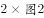
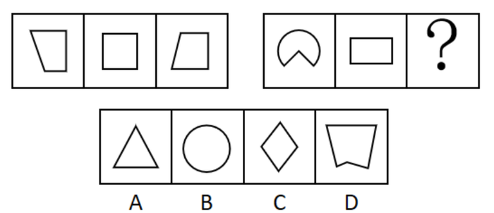
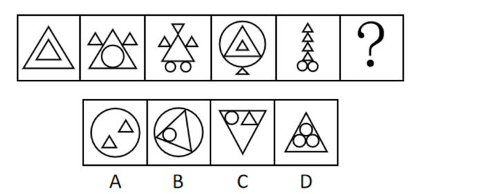
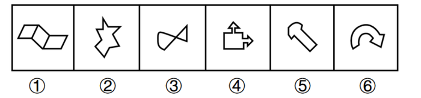

# 2019年重庆市选调优秀大学生到基层工作考试《行测》题

> 判断推理 · 30 题 · 选调 2019

## 第 1 题　qid 2670582 · 图形推理

从所给的四个选项中，选择最合适的一个填入问号处，使之呈现一定的规律性。

- **A**. A
- **B**. B
- **C**. C　✅
- **D**. D

**答案**：C

**官方解析**

题干元素组成不同，且图形出现多个小元素，优先考虑数素，但整体无规律，考虑元素换算。根据基本换算公式“”，最后换算的结果为1圆2三角形，代入题干，将圆全部换算成三角形可知，题干图形分别有3、5、7、9个三角形，故“？”处图形应有11个三角形。A项换算为6个三角形，排除；B项换算为10个三角形，排除；C项换算为11个三角形，当选；D项换算为17个三角形，排除。

故正确答案为C。

---

## 第 2 题　qid 2670585 · 图形推理

从所给的四个选项中，选择最合适的一个填入问号处，使之呈现一定的规律性。

- **A**. A　✅
- **B**. B
- **C**. C
- **D**. D

**答案**：A

**官方解析**

本题考查图形的重心位置变化。第一组图中，图一重心偏上，图二重心在中心位置，图三重心偏下，三个图形的重心依次下移。第二组图中，图一重心偏上，图二重心在中心位置，因此问号处应选一个重心偏下的图形，四个选项中，只有A项的图形重心偏下，当选。
故正确答案为A。

---

## 第 3 题　qid 2670587 · 图形推理

从所给的四个选项中，选择最合适的一个填入问号处，使之呈现一定的规律性。

- **A**. A
- **B**. B
- **C**. C
- **D**. D　✅

**答案**：D

**官方解析**

题干元素组成不同，且无明显属性规律，优先考虑数量规律。题干出现多个封闭区域，考虑数面。观察发现，题干图1、图3、图5的面数量分别为：3、4、5，呈依次递增的规律；图2、图4、图6的面数量分别为：4、5、？，也呈依次递增的规律，所以“？”处应选择有6个面的图形，只有D项符合。
故正确答案为D。

---

## 第 4 题　qid 2670590 · 图形推理

从所给的四个选项中，选择最合适的一个填入问号处，使之呈现一定的规律性。

- **A**. A
- **B**. B
- **C**. C
- **D**. D　✅

**答案**：D

**官方解析**

题干元素组成不同，优先考虑属性规律。观察发现，题干每幅图形中都有等腰三角形且图形规整，优先考虑对称性。题干均是轴对称图形，且对称轴均为竖直方向，所以“？”处应为关于竖轴对称的图形，只有D项符合。
故正确答案为D。

---

## 第 5 题　qid 2670592 · 图形推理

把下面的六个图形分为两类，使每一类图形都有各自的共同特征或规律，分类正确的一项是：

- **A**. ①②⑤，③④⑥
- **B**. ①②④，③⑤⑥　✅
- **C**. ①②③，④⑤⑥
- **D**. ①⑤⑥，②③④

**答案**：B

**官方解析**

题干元素组成不同，优先考虑属性规律。观察发现，图①②④均为全直线图形，图③⑤⑥均为曲线直线图形，因此①②④为一组，③⑤⑥为一组。

故正确答案为B。

---

## 第 6 题　qid 2670594 · 定义判断

风化，是指使岩石发生破坏和改变的各种物理、化学和生物作用。物理风化是指使岩石发生机械破碎，而没有显著的化学成分变化的风化；化学风化是指岩石在水、氧气、二氧化碳等作用下发生的化学分解。区分物理和化学风化的重点是有没有新物质的产生。生物风化是指生物活动对岩石的机械破坏。
根据上述定义，下列不属于风化的是：

- **A**. 长期高温暴晒环境下岩石出现裂隙
- **B**. 从遗址中挖出的青铜器上带有锈迹　✅
- **C**. 古代石刻上的字迹、图案等变得模糊
- **D**. 石灰岩遇水被溶解

**答案**：B

**官方解析**

第一步：找出定义关键词。
风化：“使岩石发生破坏和改变的各种物理、化学和生物作用”。
物理风化：“使岩石发生机械破碎”、“没有显著的化学成分变化的风化”。
化学风化：“岩石在水、氧气、二氧化碳等作用下发生的化学分解”、“区分物理和化学风化的重点是有没有新物质的产生”。
生物风化：“生物活动对岩石的机械破坏”。
第二步：逐一分析选项。
A项：长期高温暴晒环境下岩石出现裂隙，符合“使岩石发生破坏和改变的各种物理、化学和生物作用”，符合定义，排除；
B项：青铜器上带有锈迹，青铜器不是岩石，不符合“使岩石发生破坏和改变的各种物理、化学和生物作用”，不符合定义，当选；
C项：古代石刻上的字迹、图案等变得模糊，符合“使岩石发生破坏和改变的各种物理、化学和生物作用”，符合定义，排除；
D项：石灰岩遇水被溶解，符合“使岩石发生破坏和改变的各种物理、化学和生物作用”，符合定义，排除。
本题为选非题，故正确答案为B。

---

## 第 7 题　qid 2670595 · 定义判断

开放式决策，是指政府在进行重大决策时，充分听取、吸纳公众意见，并将公众意见作为行政决策的重要参考，使行政决策公开、透明，实现政府与公众有机互动的一种决策形式。
根据上述定义，下列不属于开放式决策的是：

- **A**. 发改委就天然气涨价事宜举行听证
- **B**. 政府常委会邀请人大代表、政协委员和市民代表列席会议发表意见
- **C**. 市民通过网上留帖或网上视频直播，参与重大民生事项讨论
- **D**. 对社会高度关注的案件，司法机关邀请公众参与庭审旁听　✅

**答案**：D

**官方解析**

第一步：找出定义关键词。
“政府”、“在进行重大决策时”、“充分听取、吸纳公众意见”、“将公众意见作为行政决策的重要参考”、“使行政决策公开、透明，实现政府与公众有机互动”、“决策形式”。
第二步：逐一分析选项。
A项：发改委就天然气涨价事宜举行听证，符合“政府”、“在进行重大决策时”、“充分听取、吸纳公众意见”、“将公众意见作为行政决策的重要参考”等关键词，符合定义，排除；
B项：政府常委会邀请人大代表、政协委员和市民代表列席会议发表意见，符合“政府”、“在进行重大决策时”、“充分听取、吸纳公众意见”、“将公众意见作为行政决策的重要参考”等关键词，符合定义，排除；
C项：市民通过网上留帖或网上视频直播，参与重大民生事项讨论，符合“政府”、“在进行重大决策时”、“充分听取、吸纳公众意见”、“将公众意见作为行政决策的重要参考”等关键词，符合定义，排除；
D项：司法机关邀请公众参与庭审旁听，司法机关不是“政府”，且旁听不符合“充分听取、吸纳公众意见”、“将公众意见作为行政决策的重要参考”，不符合定义，当选。
本题为选非题，故正确答案为D。

---

## 第 8 题　qid 2670596 · 定义判断

达克效应，是指能力欠缺的人由于欠缺考虑而得出错误结论，他们无法正确认识到自身的不足，常常沉浸在自我营造的虚幻优势之中，无法客观评价自己和他人的能力。
根据上述定义，下列体现了达克效应的是：

- **A**. 某患者家属不懂医，却对医生的诊断结果持有异议、极力争辩
- **B**. 某新员工抱怨上司专业素养不如自己，只会瞎指挥　✅
- **C**. 某技校毕业生认为自己已经掌握某技能
- **D**. 某考生觉得自己高考超常发挥，预计能上重本

**答案**：B

**官方解析**

第一步：找出定义关键词。
“能力欠缺的人”、“由于欠缺考虑而得出错误结论”、“无法正确认识到自身的不足”、“常常沉浸在自我营造的虚幻优势之中”、“无法客观评价自己和他人的能力”。
第二步：逐一分析选项。
A项：患者家属不懂医，却对医生的诊断结果持有异议，只评价了医生的能力，不符合“无法客观评价自己和他人的能力”，不符合定义，排除；
B项：新员工抱怨上司专业素养不如自己，符合“能力欠缺的人”、“由于欠缺考虑而得出错误结论”、“无法正确认识到自身的不足”、“常常沉浸在自我营造的虚幻优势之中”、“无法客观评价自己和他人的能力”，符合定义，当选；
C项：某技校毕业生认为自己已经掌握某技能是一个客观的评价，不符合“能力欠缺的人”，也不符合“无法客观评价自己和他人的能力”，不符合定义，排除；
D项：某考生觉得自己高考超常发挥，预计能上重本，不符合“无法客观评价自己和他人的能力”，不符合定义，排除。
故正确答案为B。

---

## 第 9 题　qid 2670597 · 定义判断

时间悖论，通常是指因时间旅行或穿梭时空而导致的逻辑上可以推导出互相矛盾的结论。例如，12点01分的你，回到12点00分杀死了自己，问题是12点00分的你已经死了，那么执行杀死自己任务的人是谁？逻辑上就会出现这一矛盾。
根据上述定义，下列虚构的时空穿梭示例中，几乎不会出现时间悖论的是：

- **A**. 一名时间旅行者回到过去成功阻止了他的父母结婚
- **B**. 你知道某期彩票中奖号码后，回到开奖前去买了这一组彩票
- **C**. 某小区发生重大盗窃案，警察回到案发前目睹了这一切的发生　✅
- **D**. 一位科学家造了一架时间机器，回到过去并把这个时间旅行的秘密告诉了年轻时的自己

**答案**：C

**官方解析**

第一步：找出定义关键词。
“因时间旅行或穿梭时空”、“导致的逻辑上可以推导出互相矛盾的结论”。
第二步：逐一分析选项。
A项：回到过去阻止父母结婚，符合“因时间旅行或穿梭时空”，但阻止了父母结婚，那这名时间旅行者根本不会出生，就不会有回到过去的时间旅行者，符合“导致的逻辑上可以推导出互相矛盾的结论”，符合定义，排除；
B项：回到开奖前符合“因时间旅行或穿梭时空”，你回到过去买了中奖的彩票，现在已经中奖了根本不需要再回到过去了，那回到过去的又是谁？，符合“导致的逻辑上可以推导出互相矛盾的结论”，符合定义，排除；
C项：警察回到案发前目睹了这一切的发生，符合“因时间旅行或穿梭时空”，但是警察回到过去只是目睹了这一切的发生，并没有阻止案件发生的行为，不符合“导致的逻辑上可以推导出互相矛盾的结论”，不符合定义，当选；
D项：一位科学家造了一架时间机器，回到过去，符合“因时间旅行或穿梭时空”，把时间旅行的秘密告诉了年轻时的自己，那么年轻时的自己早就知道时间旅行的秘密了，不需要现在的科学家再回到过去进行告知，符合“导致的逻辑上可以推导出互相矛盾的结论”，符合定义，排除。
本题为选非题，故正确答案为C。

---

## 第 10 题　qid 2670599 · 定义判断

毒物兴奋反应，是毒理学用来描述毒性因子（刺激）的双相剂量效应的一个术语，即高剂量致毒因素（包括毒物、辐射等）对生物体有害，而低剂量致毒因素对生物体有益。
根据上述定义，下列选项所描述的事实属于毒物兴奋反应的是：

- **A**. 低剂量TCDD可使脑垂体、子宫、乳腺和胰腺的肿瘤发生率降低，却使肝、肺、舌和鼻咽喉的肿瘤发生率增加
- **B**. 低剂量的青霉素可以增加感染伤寒埃氏杆菌的小白鼠的死亡率，较高剂量时却可以降低其死亡率
- **C**. 高剂量吡虫啉能够显著抑制桃蚜产卵行为，低剂量时却能刺激桃蚜产卵行为　✅
- **D**. 磺胺二甲氧嘧啶对千翅藻的根、子叶、叶柄总是呈现毒性作用，而对节间和叶片长度则没有

**答案**：C

**官方解析**

第一步：找出定义关键词。
“高剂量致毒因素（包括毒物、辐射等）对生物体有害”、“低剂量致毒因素对生物体有益”。
第二步：逐一分析选项。
A项：低剂量的TCDD对人体不同器官的益害不同，不符合“高剂量致毒因素（包括毒物、辐射等）对生物体有害”、“低剂量致毒因素对生物体有益”，不符合定义，排除；
B项：低剂量的青霉素会增加感染的小白鼠的死亡率，而较高剂量时可以降低死亡率，不符合“高剂量致毒因素（包括毒物、辐射等）对生物体有害”、“低剂量致毒因素对生物体有益”，不符合定义，排除；
C项：高剂量吡虫啉能抑制桃蚜产卵行为，即对生物体有害；低剂量能刺激桃蚜产卵行为，即对生物体有益，符合“高剂量致毒因素（包括毒物、辐射等）对生物体有害”、“低剂量致毒因素对生物体有益”，符合定义，当选；
D项：磺胺二甲氧嘧啶对千翅藻的不同部位毒性不同，没有提到剂量高低对生物体的影响，不符合“高剂量致毒因素（包括毒物、辐射等）对生物体有害”、“低剂量致毒因素对生物体有益”，不符合定义，排除。
故正确答案为C。

---

## 第 11 题　qid 2670601 · 逻辑判断

对于基本粒子物理学而言，发现中微子振荡具有极其重要的意义，这是因为只有在中微子有质量时，才会发生中微子振荡。
下列哪一论断是错误的？

- **A**. 中微子不存在振荡现象，则证明中微子没有质量　✅
- **B**. 中微子存在振荡现象，则证明中微子有质量
- **C**. 中微子不存在振荡现象，不能证明中微子没有质量
- **D**. 中微子没有质量时，不会发生中微子振荡

**答案**：A

**官方解析**

第一步：翻译题干。

中微子振荡中微子有质量

第二步：逐一分析选项。

A项：翻译为“中微子振荡中微子有质量”，是对题干条件的否前，否前推不出必然结论，论断错误，当选；

B项：翻译为“中微子振荡中微子有质量”，对题干条件的肯前，肯前必肯后，论断正确，排除；

C项：选项是对题干条件的否前，否前推不出否后，所以中微子不存在振荡现象，不能证明中微子没有质量，论断正确，排除；

D项：翻译为“中微子有质量中微子振荡”，是对题干条件的否后，否后必否前，论断正确，排除。

本题为选非题，故正确答案为A。

---

## 第 12 题　qid 2670602 · 逻辑判断

来自公安机关的资料显示，娱乐圈中有人赌博，高级知识分子中也有人赌博。赌博中有些人是女性，而抢劫犯中有些人是赌博者。
由此可以推出：

- **A**. 高级知识分子中也有抢劫犯
- **B**. 抢劫犯中赌博者占了大多数
- **C**. 有些抢劫犯可能是女性　✅
- **D**. 有些抢劫犯不是女性

**答案**：C

**官方解析**

第一步：翻译题干。

①有的娱乐圈的人赌博

②有的高级知识分子赌博

③有的赌博者女性

④有的抢劫犯赌博

第二步：逐一分析选项。

A项：翻译为“有的高级知识分子抢劫犯”，根据条件②和条件④，两个“有的”推不出必然结论，不能推出，排除；

B项：由条件④可知有些抢劫犯也是赌博者，但是赌博者是否占了大多数，无法判断，排除；

C项：由条件③和条件④可以推出：有些抢劫犯是赌博者，而赌博者中有女性，所以有些抢劫犯中可能有女性，可以推出，当选；

D项：由条件③和条件④可以推出C项中“有些抢劫犯可能是女性”的结论，但不能得到确定结论抢劫犯不是女性，无法推出，排除。

故正确答案为C。

---

## 第 13 题　qid 2670605 · 逻辑判断

中华鲟是我国特有的珍稀鱼类，也是世界上洄游距离最远、体型最大的淡水鱼类之一，它们一生大部分时间都是在海洋里度过的。在葛洲坝截流前，性成熟的中华鲟会洄游至长江上游与金沙江下游进行产卵交配。目前，中华鲟野生种群仍在持续衰退，为此，有人将中华鲟的濒危完全归咎于葛洲坝的建设。
以下哪项如果为真，最不能削弱上述观点？

- **A**. 葛洲坝没有修建过鱼设施，因为中华鲟作为大型的底层鱼，极难找到鱼道入口，也几乎不可能通过鱼道上游，且中华鲟生育后需要重返大海，而鱼道既不能让亲鱼上行，也无法使产后的亲鱼下行，对保护中华鲟毫无帮助　✅
- **B**. 长江非中华鲟唯一的繁殖地带，直到20世纪70年代，珠江中还能偶见中华鲟，并且有中华鲟分布于金沙江、钱塘江、黄河等的记录
- **C**. 据观测，葛洲坝工程1981年完成大江截流后，中华鲟在坝下形成了新的产卵场，且长江口的幼鱼数量在20世纪八九十年代仍保持基本稳定，直到2000年才开始出现明显下降趋势
- **D**. 长江中只有中华鲟需要从大海洄游至葛洲坝上游地区繁殖，大部分鱼类仅在长江干支流生活，或做短距离的洄游，但从渔获量来看，这些不受大坝截流影响的鱼类，它们的数量也在大幅下降

**答案**：A

**官方解析**

第一步：找出论点和论据。
论点：中华鲟的濒危完全归咎于葛洲坝的建设。
论据：在葛洲坝截流前，性成熟的中华鲟会洄游至长江上游与金沙江下游进行产卵交配。目前，中华鲟野生种群仍在持续衰退。
本题论点是因为葛洲坝的建设导致了中华鲟的濒危，论据是葛洲坝截流，中华鲟野生种群仍在持续衰退。二者都认为葛洲坝建设危害了中华鲟，论点论据话题一致。
第二步：逐一分析选项。
A项：该项说明葛洲坝既不能让亲鱼上行，也无法使产后的亲鱼下行，即葛洲坝的建设确实对中华鲟造成了不利影响，属于加强项，不能削弱，当选；
B项：该项说明中华鲟的繁殖地带有很多，所以中华鲟的濒危不能完全归咎于葛洲坝的建设，可以削弱，排除；
C项：该项说明葛洲坝工程完成大江截流后，长江口的幼鱼数量在20世纪八九十年代仍保持基本稳定，直到2000年才开始出现明显下降趋势，则意味着中华鲟的濒危与葛洲坝的建成没有直接关系，可以削弱，排除；
D项：不受大坝截流影响的鱼类，它们的数量也在大幅下降，说明可能是其他外部原因导致中华鲟及其他鱼类的数量都整体下降，因此中华鲟的濒危不能完全归咎于葛洲坝的建设，属于可能性削弱，排除。
本题为选非题，故正确答案为A。

---

## 第 14 题　qid 4695845 · 类比推理

前不久，网上流行一种说法，称中国疫苗接种非常落后，还在用减毒活疫苗，而国外十几年前就全部改成灭活疫苗了，安全性好太多了。
假设下列论述为真，哪些有助于推翻上述说法？
①有的疫苗只有减毒活疫苗，国内外都在用，例如卡介苗。
②有的疫苗国内外用的都是灭活疫苗，例如流感疫苗。
③有的疫苗国内外用的都不是减毒活疫苗，例如破伤风疫苗。
④有的疫苗既有减毒活疫苗也有灭活疫苗，例如流脑疫苗。

- **A**. ①②
- **B**. ①②③　✅
- **C**. ①②④
- **D**. ①②③④

**答案**：B

**官方解析**

第一步：找出论点和论据。
论点：中国疫苗接种非常落后，还在用减毒活疫苗，而国外十几年前就全部改成灭活疫苗了，安全性好太多了。
论据：无。
本题只有论点，没有论据，削弱优先考虑削弱论点。
第二步：逐一分析选项。
①指出有的疫苗只有减毒活疫苗，国内外都在用，说明国外也在用减毒活疫苗，并没有都改成灭活疫苗，削弱论点；
②指出有的疫苗国内外用的都是灭活疫苗，说明国内也在用灭活疫苗，不是只用减毒活疫苗，削弱论点；
③指出有的疫苗国内外用的都不是减毒活疫苗，说明国内不是只用减毒活疫苗，削弱论点；
④指出有的疫苗既有减毒活疫苗也有灭活疫苗，但并未提及国内外具体的使用情况，与论点话题不一致，无法削弱。
综上所述，①②③均能够削弱题干论点，对应B项。
故正确答案为B。

---

## 第 15 题　qid 2670610 · 逻辑判断

美国三位传播学者在1970年提出了“知识沟假设”，认为随着大众传媒向社会传播的信息日益增多，处于不同社会经济地位的人获得媒介知识的速度是不同的，社会经济地位较高的人将比社会经济地位较低的人以更快的速度获取这类信息。因此，这两类人之间的知识差距将呈扩大之势。
对上述“知识沟假设”能够做出合理解释的不包括：

- **A**. 社会经济地位较高的人往往受教育程度高，具有更强的信息处理能力，这会有助于他们对知识的获取
- **B**. 在特定的时间范围内，经媒介大量报道的话题上，人们获取信息和知识的速度与受教育程度有着很高的相关性　✅
- **C**. 传播有一定深度的科学知识的媒介主要是印刷媒介，它们的受众主要是社会经济地位较高的人
- **D**. 社会经济地位较高的人日常交际圈更大，能参与更多的社会团体，拥有更多与他人进行深度讨论的机会，理解和接受知识的能力更强

**答案**：B

**官方解析**

第一步：找出论点和论据。
论点：社会经济地位较高与社会经济地位较低这两类人之间的知识差距将呈扩大之势。
论据：随着大众传媒向社会传播的信息日益增多，处于不同社会经济地位的人获得媒介知识的速度是不同的，社会经济地位较高的人将比社会经济地位较低的人以更快的速度获取这类信息。
本题论点和论据话题一致，加强优先考虑补充论据。
第二步：逐一分析选项。
A项：该项说明社会经济地位较高的人因具有更强的信息处理能力会有助于对知识的获取，通过解释原因补充了论据，可以加强，排除；
B项：该项说明获取信息和知识的速度与受教育程度有相关性，但并没有说明社会经济地位较高和社会经济地位较低的这两类人之间的知识差距将呈扩大之势，无关选项，无法加强，当选；
C项：该项说明社会经济地位较高的人更容易获取有一定深度的科学知识，通过解释原因补充了论据，可以加强，排除；
D项：该项说明社会经济地位较高的人理解和接受知识的能力更强，通过解释原因补充了论据，可以加强，排除。
本题为选非题，故正确答案为B。

---

## 第 16 题　qid 4695853 · 类比推理

这是一段专家关于人工智能和人类的对话：
雷·科兹威尔：当下仍然不知道机器能否思考，虽然人工智能能够执行程序非常复杂的任务，其精确度和速度都超过了人类，但它缺少人类智力的灵活特征。
尼古拉斯·汤普森：人类不需要更复杂的人工智能来知道机器能否思考，因为人类是机器，我们自己思考。
尼古拉斯·汤普森对雷·科兹威尔的反驳是基于哪个词语的重新理解？

- **A**. 人工智能
- **B**. 思考
- **C**. 机器　✅
- **D**. 复杂

**答案**：C

**官方解析**

第一步：分析题干条件。
雷·科兹威尔：当下仍然不知道机器能否思考，虽然人工智能能够执行程序非常复杂的任务，其精确度和速度都超过了人类，但它缺少人类智力的灵活特征。
尼古拉斯·汤普森：人类不需要更复杂的人工智能来知道机器能否思考，因为人类是机器，我们自己思考。
第二步：逐一分析选项。
雷·科兹威尔认为当下不知道机器能否思考，人工智能也无法验证，其中的“机器”指的是传统意义上的由部件组装成的装置；而尼古拉斯·汤普森认为人类能思考，且人类是机器，说明机器能够思考，对“机器”进行了重新理解，从而反驳了雷·科兹威尔的观点，对应C项。
故正确答案为C。

---

## 第 17 题　qid 4695859 · 逻辑判断

近年来，虽然全球主要国家甲状腺癌的发生率都在增加，但并不代表甲状腺癌与碘营养状况之间存在关系。
以下哪项最可能是上述结论所假设的？

- **A**. 当前甲状腺癌的“流行”部分归因于甲状腺筛查的普及
- **B**. 高分辨率B超的广泛应用使得隐匿癌或微小癌能够被准确诊断
- **C**. 这些甲状腺癌发生率增加的国家，既有碘摄入量增加的，也有稳定或下降的　✅
- **D**. 近20年来美国、英国等西方发达国家居民的碘营养状况趋于稳定

**答案**：C

**官方解析**

第一步：找出论点和论据。
论点：近年来，虽然全球主要国家甲状腺癌的发生率都在增加，但并不代表甲状腺癌与碘营养状况之间存在关系。
论据：无。
本题只有论点，没有论据，且问题为“假设”，优先考虑必要条件。
第二步：逐一分析选项。
A项：该项说的是甲状腺癌“流行”的部分原因，而论点说的是甲状腺癌与碘营养状况的关系，话题不一致，无法加强，排除；
B项：该项说的是隐匿癌或微小癌能够被准确诊断，无法判断是否包括甲状腺癌，与论点无关，排除；
C项：该项说的是甲状腺癌发生率增加的国家，碘摄入量情况不同，证明了甲状腺癌与碘营养状况之间不存在关系，且如果各国碘摄入量变化情况相同，就能够得到甲状腺癌与碘摄入量存在关系，此时论点无法成立，即该项是论点成立的必要条件，当选；
D项：该项说的是近20年来西方发达国家居民的碘营养状况趋于稳定，但没有提及这些居民甲状腺癌发生率的变化，不明确项，无法加强，排除。
故正确答案为C。

---

## 第 18 题　qid 2670612 · 逻辑判断

甲、乙、丙是大学同班同学，且同住一室。其中，一个北京人，一个重庆人，一个上海人。甲和重庆人不同岁，丙的年龄比上海人小，重庆人比乙年龄大。
根据题干所述，可以推出以下哪项结论？

- **A**. 甲是北京人，乙是重庆人，丙是上海人
- **B**. 甲是重庆人，乙是北京人，丙是上海人
- **C**. 甲是重庆人，乙是上海人，丙是北京人
- **D**. 甲是上海人，乙是北京人，丙是重庆人　✅

**答案**：D

**官方解析**

本题为组合排列题型，从最大信息入手。
题干中“重庆人”出现次数最多。结合“甲和重庆人不同岁”，可知甲不是重庆人，排除B、C两项。再结合“重庆人比乙年龄大”，可知乙不是重庆人，排除A项。
故正确答案为D。

---

## 第 19 题　qid 4695868 · 逻辑判断

美国从事安全工作的承包商在一些安卓手机上发现了一款来自中国公司的预装软件，这种软件监视用户去过哪里、与什么人聊过天、短信中写了什么。美国当局认为这是一种收集情报的行为。
以下哪项如果为真，最能够质疑美国当局的判断？

- **A**. 软件是预装在手机上的，但没有向用户披露这种监视功能
- **B**. 该软件监视用户上述行为的目的是帮助客户识别垃圾短信和骚扰电话　✅
- **C**. 分析师注意到安装有该软件的手机在向位于上海的一个服务器发送短信内容
- **D**. 谷歌官员表示，公司曾告诫该中国公司将该软件的监视功能删除

**答案**：B

**官方解析**

第一步：找出论点和论据。
论点：“预装软件监视用户去过哪里、与什么人聊过天、短信中写了什么”是一种收集情报的行为。
论据：无。
本题只有论点没有论据，削弱优先考虑削弱论点，即指出预装软件对用户的监视并不是为了收集情报。
第二步：逐一分析选项。
A项：是否告知用户与该预装软件监视用户的目的无关，为无关项，无法削弱，排除；
B项：指出该预装软件对用户的监视是为了帮助客户识别垃圾短信和骚扰电话，而不是为了收集情报，削弱论点，可以削弱，当选；
C项：指出安装有该软件的手机在向上海的服务器发送短信内容，但无法判断发送的目的，无法削弱，排除；
D项：谷歌官员的表态与该预装软件监视用户的目的无关，为无关项，无法削弱，排除。
故正确答案为B。

---

## 第 20 题　qid 4695905 · 逻辑判断

小冰期是自末次冰盛期以来地球气温最低的一段时期，一般指1430-1850年间，高潮部分发生在1600年左右，其间北半球气温相比于基准温度（现在的温度）下降了。小冰期的成因有多种假说。近年来，有学者认为其成因为欧洲对美洲的殖民导致美洲本土农业社会崩溃，大量农田被废弃为森林，从而固定了太多大气中的二氧化碳，最终导致气候变冷。

假设下列陈述为真，那么，最有可能驳斥上述假说的是：

- **A**. 能够造成二氧化碳浓度下降的森林面积，经推算远大于美洲原住民在工业化之前能够开垦的森林面积　✅
- **B**. 北美洲的大部分原住民是在18世纪中叶英法七年战争的时候才受到严重影响的
- **C**. 南美洲在16世纪中后期爆发了几次严重疫情，原住民损失惨重
- **D**. 气温变化与二氧化碳浓度之间并不是简单的线性对应关系

**答案**：A

**官方解析**

第一步：找出论点和论据。
论点：小冰期的成因为欧洲对美洲的殖民导致美洲本土农业社会崩溃，大量农田被废弃为森林，从而固定了太多大气中的二氧化碳，最终导致气候变冷。
论据：无。
本题只有论点，没有论据，削弱优先考虑削弱论点，即指出欧洲对美洲的殖民不会导致气候变冷。
第二步：逐一分析选项。
A项：指出美洲原住民在工业化之前能够开垦的森林面积远低于能够造成二氧化碳浓度下降的森林面积，说明即使殖民让原住民废弃所有开垦的农田，且这些农田也都变成了森林也不足以造成二氧化碳的浓度下降，也就不会导致气候变冷，削弱论点，当选；
B项：指出北美洲的大部分原住民在18世纪受到了战争的严重影响，而题干讨论的是殖民、森林、二氧化碳以及气候变冷间的关系，话题不一致，无法削弱，排除；
C项：指出南美洲的原住民在16世纪中后期因疫情损失惨重，而题干讨论的是殖民、森林、二氧化碳以及气候变冷间的关系，话题不一致，无法削弱，排除；
D项：指出气温变化与二氧化碳浓度之间并不是简单的线性对应关系，但二者之间是否存在其他关系无法判断，可能是其他形式的影响关系，不明确项，无法削弱，排除。
故正确答案为A。

---

## 第 21 题　qid 2670614 · 类比推理

厂家：展销会

- **A**. 旅客：黄金周
- **B**. 演员：颁奖礼　✅
- **C**. 阿姨：广场舞
- **D**. 企鹅：南极圈

**答案**：B

**官方解析**

第一步：判断题干词语间逻辑关系。
厂家参加展销会，构成主宾关系，且展销会的目的就是展览与销售，以目的命名。
第二步：判断选项词语间逻辑关系。
A项：游客享受黄金周，二者为主宾关系，但黄金周指的是我国五一、十一、春节的休息时间与前后双休日拼接形成的假期，并非以目的命名，与题干逻辑关系不一致，排除；
B项：演员参加颁奖礼，二者为主宾关系，且颁奖礼的目的就是颁奖，以目的命名，与题干逻辑关系一致，当选；
C项：阿姨跳广场舞，二者为主宾关系，但广场舞是以跳舞的地点命名，不是以目的命名，与题干逻辑关系不一致，排除；
D项：企鹅生活在南极圈，南极圈是以地点命名，不是以目的命名，与题干逻辑关系不一致，排除。
故正确答案为B。

---

## 第 22 题　qid 2670616 · 类比推理

音箱：家庭影院

- **A**. 青霉素：抗生素
- **B**. 网管：门户网站
- **C**. 叔父：旁系亲属
- **D**. 食肉动物：食物链　✅

**答案**：D

**官方解析**

第一步：判断题干词语间逻辑关系。
音箱是家庭影院的组成部分，二者为包容关系中的组成关系。
第二步：判断选项词语间逻辑关系。
A项：青霉素是一种抗生素，二者为包容关系中的种属关系，与题干逻辑关系不一致，排除；
B项：网管负责管理门户网站，二者为对应关系，与题干逻辑关系不一致，排除；
C项：叔父是一种旁系亲属，二者为包容关系中的种属关系，与题干逻辑关系不一致，排除；
D项：食肉动物是食物链的组成部分，二者为包容关系中的组成关系，与题干逻辑关系一致，当选。
故正确答案为D。

---

## 第 23 题　qid 2670618 · 类比推理

救助：燃眉之急

- **A**. 诉说：难言之隐
- **B**. 诬陷：欲加之罪
- **C**. 慰问：丧子之痛　✅
- **D**. 避免：无妄之灾

**答案**：C

**官方解析**

第一步：判断题干词语间逻辑关系。
救助能减轻燃眉之急，二者为对应关系。
第二步：判断选项词语间逻辑关系。
A项：难言之隐是指隐藏在内心深处不便说出口的事情，诉说不能减轻难言之隐，与题干逻辑关系不一致，排除；
B项：欲加之罪是指随心所欲的诬陷人，诬陷并不能减轻欲加之罪，与题干逻辑关系不一致，排除；
C项：慰问能减轻丧子之痛，二者为对应关系，与题干逻辑关系一致，当选；
D项：无妄之灾是指平白无故受到的灾祸或损害，是不能避免的，与题干逻辑关系不一致，排除。
故正确答案为C。

---

## 第 24 题　qid 2670621 · 逻辑判断

林黛玉：心似比干多一窍，病如西子胜三分

- **A**. 李商隐：君问归期未有期，巴山夜雨涨秋池
- **B**. 杜甫：随风潜入夜，润物细无声
- **C**. 陈胜：燕雀安知鸿鹊之志哉
- **D**. 李广：但使龙城飞将在，不教胡马度阴山　✅

**答案**：D

**官方解析**

第一步：判断题干词语间逻辑关系。
“心似比干多一窍，病如西子胜三分”是《红楼梦》中描述林黛玉的话，二者为对应关系，且是他人描述林黛玉。
第二步：判断选项词语间逻辑关系。
A项：“君问归期未有期，巴山夜雨涨秋池”出自李商隐的《夜雨寄北》，描述的是巴蜀环境而非李商隐，与题干逻辑关系不一致，排除；
B项：“随风潜入夜，润物细无声”出自杜甫的《春夜喜雨》，描述的是春夜降雨、润泽万物的美景，而不是描述杜甫，与题干逻辑关系不一致，排除；
C项：“燕雀安知鸿鹊之志哉”描述的是陈胜的远大志向，但这是陈胜自己说出的话，不是他人来描述陈胜，与题干逻辑关系不一致，排除；
D项：“但使龙城飞将在，不教胡马度阴山”出自王昌龄的《出塞二首》，其中“飞将”指的就是李广，是王昌龄对李广的描述，与题干逻辑关系一致，当选。
故正确答案为D。

---

## 第 25 题　qid 2670626 · 类比推理

消费者 对于 （    ） 相当于 （    ） 对于 调查

- **A**. 促销 问题
- **B**. 纠纷 干扰
- **C**. 维权 记者　✅
- **D**. 反映 结果

**答案**：C

**官方解析**

逐一代入选项。
A项：消费者可能会参加促销，两者为对应关系；调查问题，两者为动宾关系，前后逻辑关系不一致，排除；
B项：消费者可能会有纠纷，两者为对应关系；调查可能会有干扰，两者为对应关系，但二者顺序反了，前后逻辑关系不一致，排除；
C项：消费者有维权的权利，两者为对应关系；记者有调查的权利，两者为对应关系，前后逻辑关系一致，当选；
D项：消费者和反映之间没有必然的逻辑关系；调查可能会有结果，两者为对应关系，前后逻辑关系不一致，排除。
故正确答案为C。

---

## 第 26 题　qid 2670631 · 类比推理

造纸术 对于 （    ） 相当于 端砚 对于 （    ）

- **A**. 印刷术 司南
- **B**. 火药 印章
- **C**. 指南针 湖笔　✅
- **D**. 造纸 宣纸

**答案**：C

**官方解析**

逐一代入选项。
A项：造纸术和印刷术都是中国古代四大发明，二者是并列关系；端砚与司南无明显逻辑关系，前后逻辑关系不一致，排除；
B项：造纸术和火药都是中国古代四大发明，二者是并列关系；印章是一种用作印于文件上表示鉴定或签署的文具，与端砚是并列关系，前后逻辑关系一致，保留；
C项：造纸术和指南针都是中国古代四大发明，二者是并列关系；端砚和湖笔都是文房四宝，二者是并列关系，前后逻辑关系一致，保留；
D项：造纸术的功能是造纸，二者是对应关系；端砚和宣纸都是文具，二者是并列关系，前后逻辑关系不一致，排除。
对比B项和C项，B项印章和端砚仅是文具中的并列关系，而C项端砚和湖笔是文具并且是文房四宝中的并列关系，与前面四大发明逻辑关系更一致，因此C项更符合。
故正确答案为C。

---

## 第 27 题　qid 2670636 · 类比推理

机械唯物主义 对于 （    ） 相当于 （    ） 对于 生物学家

- **A**. 唯物主义者 宇宙大爆炸
- **B**. 哲学家 自然选择　✅
- **C**. 辩证唯物主义 细胞学
- **D**. 地质学家 板块漂移说

**答案**：B

**官方解析**

逐一代入选项。
A项：机械唯物主义由唯物主义者提出，二者为理论与提出者之间的对应关系；宇宙大爆炸不是由生物学家提出，二者无明显逻辑关系，前后逻辑关系不一致，排除；
B项：机械唯物主义由哲学家提出，二者为理论与提出者之间的对应关系；自然选择由生物学家提出，二者为理论与提出者之间的对应关系，前后逻辑关系一致，当选；
C项：机械唯物主义和辩证唯物主义二者为并列关系；细胞学由生物学家提出，二者为理论与提出者之间的对应关系，前后逻辑关系不一致，排除；
D项：机械唯物主义不是由地质学家提出，二者无明显逻辑关系；板块漂移说不是由生物学家提出，二者无明显逻辑关系，前后逻辑关系不一致，排除。
故正确答案为B。

---

## 第 28 题　qid 2670640 · 类比推理

PM2.5：能见度

- **A**. 
：气温
　✅
- **B**. 
民心：获得感

- **C**. 
CPI：物价

- **D**. 
脂肪：卡路里

**答案**：A

**官方解析**

第一步：判断题干词语间逻辑关系。

PM2.5是影响能见度的一个因素，二者为对应关系。

第二步：判断选项词语间逻辑关系。

A项：是影响气温的一个因素，二者为对应关系，与题干逻辑关系一致，当选；

B项：获得感是影响民心的一个因素，但二者顺序反了，与题干逻辑关系不一致，排除；

C项：CPI是消费者物价指数，是反映物价的一个指标，不是影响物价的一个因素，与题干逻辑关系不一致，排除；

D项：卡路里是一种热量单位，脂肪产生的能量单位是卡路里，不是影响卡路里的一个因素，与题干逻辑关系不一致，排除。

故正确答案为A。

---

## 第 29 题　qid 2670642 · 类比推理

歌曲：作词：作曲

- **A**. 钢琴曲：钢琴：钢琴家
- **B**. 香烟：烟农：收获
- **C**. 城市：街道：商铺
- **D**. 诉讼：原告：被告　✅

**答案**：D

**官方解析**

第一步：判断题干词语间逻辑关系。
歌曲需要作词和作曲，二者与歌曲为对应关系，且作词与作曲为并列关系。
第二步：判断选项词语间逻辑关系。
A项：钢琴与钢琴家不是并列关系，是职业与工具的对应关系，与题干逻辑关系不一致，排除；
B项：烟农与收获不是并列关系，与题干逻辑关系不一致，排除；
C项：街道和商铺是城市的组成部分，后两个词与第一个词是组成关系，与题干逻辑关系不一致，排除；
D项：诉讼需要原告和被告，第一个词与后两个词之间是对应关系；且原告与被告为并列关系，与题干逻辑关系一致，当选。
故正确答案为D。

---

## 第 30 题　qid 2670644 · 类比推理

工人：农民：公民

- **A**. 学生：老师：学校
- **B**. 冰箱：橱柜：家电
- **C**. 硬盘：显卡：电脑
- **D**. 图书：期刊：出版物　✅

**答案**：D

**官方解析**

第一步：判断题干词语间逻辑关系。
工人与农民是并列关系，且工人和农民都是公民，前两个词与第三个词是种属关系。
第二步：判断选项词语间逻辑关系。
A项：学生和老师是并列关系，但学校只是学生和老师学习、工作的场所，不是种属关系，与题干逻辑关系不一致，排除；
B项：冰箱和橱柜是并列关系，且冰箱是一种家电，但橱柜并不是一种家电，与题干逻辑关系不一致，排除；
C项：硬盘和显卡是并列关系，且二者都是电脑的组成部分，与题干逻辑关系不一致，排除；
D项：图书和期刊是两种不同类型的出版物，二者是并列关系，且前两个词与第三个词为种属关系，与题干逻辑关系一致，当选。
故正确答案为D。

---
