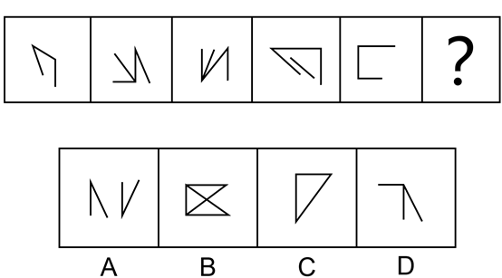
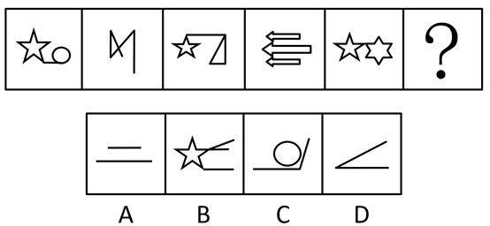
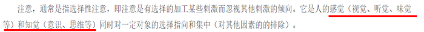
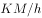

# 2019年青海省公务员录用考试《行测》题省市州级（A类）（网友回忆版）

> 判断推理 · 40 题 · 青海 2019

## 第 1 题　qid 2393995 · 图形推理

从所给的四个选项中，选择最合适的一个填入问号处，使之呈现一定的规律性。

- **A**. A　✅
- **B**. B
- **C**. C
- **D**. D

**答案**：A

**官方解析**

元素组成不同，且无明显属性规律，考虑数量规律。观察发现，图形线条交叉明显，考虑数交点，题干每个图形交点的数量都是2，故问号处图形交点的数量也应该为2，只有A项符合。
故正确答案为A。

---

## 第 2 题　qid 2394003 · 图形推理

从所给的四个选项中，选择最合适的一个填入问号处，使之呈现一定的规律性。

- **A**. A
- **B**. B　✅
- **C**. C
- **D**. D

**答案**：B

**官方解析**

解法一：

每个图形都由多个独立的小元素组成，优先考虑元素的种类和个数，但选不出唯一答案。再观察发现，除小元素外，每个图形均包含3个空白，考虑3个空白的位置，如下图所示，每个空白依次向下平移一步（循环走），只有B项符合规律。

解法二：

每个图形都由多个独立的小元素组成，优先考虑元素的种类和个数，但选不出唯一答案。继续观察发现，每个图形都有三行元素，一行有1个元素，一行有2个元素，一行有3个元素，有1个元素的每次向下平移一行（循环走），有2个元素的每次也向下平移一行（循环走），有3个元素的每次也向下平移一行（循环走），只有B项符合。 

故正确答案为B。

---

## 第 3 题　qid 2394007 · 图形推理

从所给的四个选项中，选择最合适的一个填入问号处，使之呈现一定的规律性。

- **A**. A
- **B**. B
- **C**. C　✅
- **D**. D

**答案**：C

**官方解析**

元素组成不同，优先考虑属性规律，题干图形均比较规整，考虑对称性，但图二不是轴对称图形。继续观察发现，每个图形“窟窿”比较明显，考虑数面，面数量依次为1、2、3、4、5，故问号处图形应该有6个面，只有C项符合。
故正确答案为C。

---

## 第 4 题　qid 2394016 · 图形推理

从所给的四个选项中，选择最合适的一个填入问号处，使之呈现一定的规律性。

- **A**. A
- **B**. B
- **C**. C
- **D**. D　✅

**答案**：D

**官方解析**

元素组成不同，且无明显属性规律，考虑数量规律。九宫格第二行出现单独的直线，考虑数直线，但整体数直线没有规律，考虑线的细化考法，即线的方向，如下图所示，第一行图一有1组平行线，图二有2组平行线，图三有3组平行线，第二行也满足此规律，第三行前两个图也符合规律，故问号处应该有3组平行线，只有D项符合。

故正确答案为D。

---

## 第 5 题　qid 2394020 · 图形推理

从所给的四个选项中，选择最合适的一个填入问号处，使之呈现一定的规律性。

- **A**. A
- **B**. B
- **C**. C
- **D**. D　✅

**答案**：D

**官方解析**

元素组成不同，且无明显属性规律，考虑数量规律。图2出现端点，且明显为一笔画图形，图4、图5都是封闭图形相切，为切圆变形，优先考虑笔画数，题干均为一笔画图形，故问号处图形也应该为一笔画，A、B、C均为两笔画，只有D项为一笔画。
故正确答案为D。

---

## 第 6 题　qid 2394024 · 图形推理

题中包含六个或六组图形，请把它们分为两类，使得每一类图形都有各自的共同特征或规律。

- **A**. ①④⑥，②③⑤
- **B**. ①④⑤，②③⑥
- **C**. ①②③，④⑤⑥
- **D**. ①③⑤，②④⑥　✅

**答案**：D

**官方解析**

本题为分组分类题目。通过观察发现，题干每个图形中均出现了两个相同的元素，优先考虑两个相同元素之间的位置关系，图①③⑤中的两个相同元素没有直接相连，图②④⑥中两个相同元素直接相连，对应D项。
故正确答案为D。

---

## 第 7 题　qid 2394029 · 定义判断

游戏化管理：是指在不是游戏的场景里使用得分、等级排序、竞争等游戏中的元素的管理行为。它在工作环境中的运用往往可以让员工增加感情投入，从而提高效率。
根据上述定义，下列属于游戏化管理行为的是（    ）。

- **A**. 某翻译软件公司动员办公室员工参与“找茬”，寻找语言翻译错误　✅
- **B**. 扮演卡通人物来吸引大家的注意力
- **C**. 公司聘用新的管理层
- **D**. 学校要求教师不得进行学生考试得分排名

**答案**：A

**官方解析**

第一步：找出定义关键词。
“不是游戏的场景里”、“使用游戏中的元素”、“管理行为”。
第二步：逐一分析选项。
A项：公司动员员工“找茬”，符合“使用游戏中的元素”，寻找语言翻译错误，符合“不是游戏的场景里”，是一种“管理行为”，符合定义，当选；
B项：扮演卡通人物吸引大家注意力，卡通人物不符合“使用游戏中的元素”，不符合定义，排除；
C项：聘用新的管理层，不符合“使用游戏中的元素”，不符合定义，排除；
D项：学校要求老师不得将得分排名，不符合“使用游戏中的元素”，不符合定义，排除。
故正确答案为A。

---

## 第 8 题　qid 2394033 · 定义判断

可恢复性评价：是指突发事件后、应急管理结束前，对事件的现状恢复到基本正常状态的能力的评价以及完成恢复所需要的时间和资源的评价。
根据上述定义，下列属于可恢复性评价的是（    ）。

- **A**. 某地地震后，民政部向灾区发放救灾物资
- **B**. 卫生部估计H1N1流感疫苗研发所需时间
- **C**. 重大交通事故发生后，交通管理部门估计交通事故造成的堵车时间　✅
- **D**. 上级指示48小时内解决因大雪封路而滞留车站的乘客的交通问题

**答案**：C

**官方解析**

第一步：找出定义关键词。
“突发事件后，应急管理结束前”、“对事件的现状恢复到基本正常状态的能力的评价”、“完成恢复所需要的时间和资源的评价”。
第二步：逐一分析选项。
A项：民政局只是发放救灾物资，不符合“恢复正常状态的能力的评价或时间资源的评价”，不符合定义，排除； 
B项：卫生部估计流感疫苗研发所需时间，但即使疫苗研发成功也不代表能恢复到正常状态，不符合“完成恢复所需要的时间和资源的评价”，不符合定义，排除；
C项：交管部门估计交通事故造成的堵车时间，符合“突发事件后，应急管理结束前”、符合“对事件的现状恢复到基本正常状态的时间的评价”，符合定义，当选；
D项：上级作出的指示是一种要求、命令，而不是评价。评价是指对一件事或人物进行判断、分析后的结论。不符合定义，排除。
故正确答案为C。

---

## 第 9 题　qid 2394035 · 定义判断

制度企业家：是指不仅发挥着传统企业家的功能，同时在他们的事业发展过程中帮助建立市场体制的那些人。他们对发展环境下的机会高度敏感，敢于突破制度壁垒，来获得可观的收益。
根据上述定义，下列不属于制度企业家的是（    ）。

- **A**. 开发网约车系统出行改变出租车行业运营模式的某企业家
- **B**. 建立第三方支付方式和各大金融机构合作的某企业家
- **C**. 成立教育集团提升民间办学能力的某企业家　✅
- **D**. 创新即时通讯模式改变人们信息传递方式的某企业家

**答案**：C

**官方解析**

第一步：找出定义关键词。
“不仅发挥着企业家的功能”、“在他们事业发展过程中帮助建立市场体制的那些人”、“敢于突破制度壁垒”。
第二步：逐一分析选项。
A项：开发网约车系统改变出租车行业运营模式，符合“发展过程中帮助建立市场体制”、“敢于突破制度壁垒”，符合定义，排除； 
B项：建立第三方支付方式和各大金融机构合作，符合“发展过程中帮助建立市场体制”、“敢于突破制度壁垒”，符合定义，排除；
C项：成立教育集团提升民间办学能力，仍是传统企业的模式，不符合“发展过程中帮助建立市场体制”、“敢于突破制度壁垒”，不符合定义，当选；
D项：创新即时通讯模式改变人们信息传递方式，符合“发展过程中帮助建立市场体制”、“敢于突破制度壁垒”，符合定义，排除。
本题为选非题，故正确答案为C。

---

## 第 10 题　qid 2394037 · 定义判断

社会整合：是指调整或协调社会各部分之间的矛盾和冲突，使整个社会成为一个统一的运行良好的体系的过程。通过社会整合，使社会体系中既互相独立又互相联系的各个部分之间互相顺应，形成均衡状态。
根据上述定义，下列不属于社会整合的是（    ）。

- **A**. 经济发展中产生的新的社会阶层人士　✅
- **B**. 地区间的文化交融
- **C**. 打击各类违法犯罪行为
- **D**. 中央一号文件指导“三农”工作

**答案**：A

**官方解析**

第一步：找出定义关键词。
“调整或协调社会各部分之间的矛盾和冲突”、“整个社会成为一个统一的运行良好的体系的过程”。
第二步：逐一分析选项。
A项：经济发展中产生的新的社会阶层人士，不符合“调整或协调社会各部分之间的矛盾和冲突”，也没有体现社会成为一个运行良好的体系过程，不符合定义，当选； 
B项：地区间的文化融合，让不同地区的文化取长补短，符合“调整或协调社会各部分之间的矛盾和冲突”，符合“整个社会成为一个统一的运行良好的体系的过程”，符合定义，排除；
C项：打击各类违法犯罪，符合“调整或协调社会各部分之间的矛盾和冲突”，使社会成为一个运行良好的体系，符合定义，排除；
D项：中央文件指导“三农”工作，是协调农业、农村和农民之间的矛盾，符合“调整或协调社会各部分之间的矛盾和冲突”，使社会成为一个运行良好的体系，符合定义，排除。
本题为选非题，故正确答案为A。

---

## 第 11 题　qid 2393947 · 定义判断

同辈压力：是指同辈人互相比较中产生的心理压力，一个同辈人团体对个人施加影响，会促使个人改变其态度、价值观或行为以遵守团体准则。
根据上述定义，下列属于同辈压力的是（    ）。

- **A**. 领导对下属的批评
- **B**. 同事间的关系调处
- **C**. 年轻人的穿戴攀比　✅
- **D**. 部门间的业务比赛

**答案**：C

**官方解析**

第一步：找出定义关键词。
“同辈人互相比较中产生的心理压力”、“一个同辈人团体对个人施加影响”、“促使个人改变其态度、价值观或行为以遵守团队准则”。
第二步：逐一分析选项。
A项：领导和下属之间，不明确是否是“同辈人”，领导对下属的批评，不符合“一个同辈人团体对个人施加影响”，“促使个人改变其态度、价值观或行为以遵守团队准则”，不符合定义，排除；
B项：同事之间，不明确是否是“同辈人”，同事间的关系调处不符合“一个同辈人团体对个人施加影响”，“促使个人改变其态度、价值观或行为以遵守团队准则”，不符合定义，排除；
C项：年轻人之间，符合“同辈人”，，穿戴攀比符合“互相比较中产生的心理压力”、“一个同辈人团体对个人施加影响”，“促使个人改变其态度、价值观或行为以遵守团队准则”，符合定义，当选；
D项：部门间的业务比赛，不明确是否是“同辈人”，不符合“同辈人互相比较中产生的心理压力”，业务比赛也不符合“一个同辈人团体对个人施加影响”，“促使个人改变其态度、价值观或行为以遵守团队准则”，不符合定义，排除。
故正确答案为C。

---

## 第 12 题　qid 2393955 · 定义判断

显性成本：是指厂商在生产要素市场上购买或租用所需要的生产要素的实际支出，即企业支付给企业以外的经济资源所有者的货币额。例如支付的生产费用、工资费用、市场营销费用等，因而它是有形的成本。
根据上述定义，下列金额不属于显性成本的是（    ）。

- **A**. 公司支付1万元租用商场大厅进行现场营销
- **B**. 原材料涨价使企业产品单位成本多花费1万元
- **C**. 企业每平米价值1万元的厂房　✅
- **D**. 企业支付给部门经理的1万元月薪

**答案**：C

**官方解析**

第一步：找出定义关键词。
“即企业支付给企业以外的经济资源所有者的货币额”、“支付的生产费用、工资费用、市场营销费用等”。
第二步：逐一分析选项。
A项：公司支付1万元租用商场大厅进行现场营销，符合“即企业支付给企业以外的经济资源所有者的货币额”，符合定义，排除；
B项：原材料涨价使企业产品单位成本多花费1万元，符合“即企业支付给企业以外的经济资源所有者的货币额”，符合定义，排除；
C项：企业每平米价值1万元的厂房，只是价值，并不涉及支付货币，不符合“即企业支付给企业以外的经济资源所有者的货币额”，不符合定义，当选；
D项：企业支付给部门经理的1万元月薪，属于工资费用，也符合“即企业支付给企业以外的经济资源所有者的货币额”，符合定义，排除。
本题为选非题，故正确答案为C。

---

## 第 13 题　qid 2393958 · 定义判断

零工经济：是指由工作量不多的自由职业者构成的经济领域，利用互联网和移动技术等快速匹配供需方，主要包括群体工作和经应用程序接洽的按需工作两种形式。换句话说，之前的工作关系是“单位——人”，而现在的主流关系则是“平台——人”。
根据上述定义，下列属于零工经济的是（    ）。

- **A**. 出租车行业
- **B**. 电商网站维护行业
- **C**. 外卖配送行业　✅
- **D**. 交通维护志愿者行为

**答案**：C

**官方解析**

第一步：找出定义关键词。
 “利用互联网和移动技术等快速匹配供需方”、“主要包括群体工作和经应用程序接洽的按需工作两种形式”、现在的主流关系是“平台——人”。
第二步：逐一分析选项。
A项：出租车行业包括传统出租车及网约车，其中传统出租车不符合“利用互联网和移动技术等快速匹配供需方”，属于不明确选项，保留；
B项：电商网站维护行业的主要工作是维护电商网站，不符合“利用互联网和移动技术等快速匹配供需方”，不符合定义，排除；
C项：外卖配送行业主要是通过外卖平台快速匹配供需方，符合“利用互联网和移动技术等快速匹配供需方”，符合定义，保留；
D项：交通维护志愿者行为，不符合“利用互联网和移动技术等快速匹配供需方”，不符合定义，排除。
比较A、C两项，A项表述不明确。
故正确答案为C。
注：本题为热点题，零工经济中最典型的就是外卖送餐和滴滴专车。本题A项出租车行业并未明确说是网约车，那么也有可能属于传统出租车，而如今外卖配送几乎都是平台接单，极少有通过其他方式接单（如电话等），故结合热点并择优选择C项。

---

## 第 14 题　qid 2393963 · 定义判断

愿望投射：是指把自己的主观愿望投射于他人，认为他人也如自己所期望的那样，把希望当成了现实。结果往往对他人的情感、意向做出错误评价，歪曲了他人，造成交往障碍。
根据上述定义，下列属于愿望投射的是（    ）。

- **A**. 人无我有，人有我优
- **B**. 世上本无事，庸人自扰之
- **C**. 别人笑我太疯癫，我笑他人看不穿
- **D**. 我之所虑，人之所想　✅

**答案**：D

**官方解析**

第一步：找出定义关键词。
“把自己的主观愿望投射于他人”、“认为他人也如自己所期望的那样，把希望当成了现实”、“结果往往对他人的情感、意向做出错误评价，歪曲了他人，造成交往障碍”。
第二步：逐一分析选项。
A项：人无我有，人有我优的意思是“某产品没有的时候，我却开始在卖了，独食一方。别人也在卖的时候，我已精良产品，无人能敌”，未提及“把自己的主观愿望投射于他人”，不符合定义，排除；
B项：世上本无事，庸人自扰之的意思是“比喻常常自己跟自己过不去，遇事生非，疑神疑鬼的自找麻烦”，未提及“把自己的主观愿望投射于他人”，不符合定义，排除；
C项：别人笑我太疯癫，我笑他人看不穿的意思是“世俗的人讥笑疯疯癫癫的样子，其实我的内心是已经顿悟了的，只是俗人们不明白罢了”, 不符合“把自己的主观愿望投射于他人”，不符合定义，排除；
D项：我之所虑，人之所想的意思是“我所考虑的就是别人所想的”，符合“把自己的主观愿望投射于他人”，符合定义，当选。
故正确答案为D。

---

## 第 15 题　qid 2393969 · 定义判断

高原现象：是指学生在学习进程中常会有这样一个阶段，即学习成绩到一定程度时，继续提高的速度减慢，有的人甚至发生停滞不前或倒退的现象。
根据上述定义，下列属于高原现象的是（    ）。

- **A**. 高考临近，小郑感到睡眠不足，越来越没有学习的动力了
- **B**. 高考模拟考试，小齐都考得很好，他觉得自己学不学都能考上好大学
- **C**. 高考三轮复习，小赵感到提高不多，认为复习没用，不愿再看书了　✅
- **D**. 高考过后，小韩考得不错，她认为已经超常发挥了

**答案**：C

**官方解析**

第一步：找出定义关键词。
“学生”、“学习成绩到一定程度时”、“继续提高的速度减慢，有的人甚至发生停滞不前或倒退的现象”。
第二步：逐一分析选项。
A项：高考临近，小郑睡眠不足导致没有学习动力，不符合“学习成绩到一定程度时”，不符合定义，排除；
B项：高考模拟考试，小齐都考得很好，不符合“学习成绩到一定程度时”，“继续提高的速度减慢，有的人甚至发生停滞不前或倒退的现象”，不符合定义，排除；
C项：高考三轮复习，小赵感到提高不多，符合“学习成绩到一定程度时”，他认为复习没用，不愿再看书，符合“继续提高的速度减慢，有的人甚至发生停滞不前或倒退的现象”，符合定义，当选；
D项：高考过后，小韩考得不错，不符合“学习成绩到一定程度时”，“继续提高的速度减慢，有的人甚至发生停滞不前或倒退的现象”，不符合定义，排除。
故正确答案为C。

---

## 第 16 题　qid 2393973 · 定义判断

数字鸿沟：是指在全球数字化进程中，不同国家、地区、行业、企业、社区之间，由于对信息、网络技术的拥有程度、应用程度以及创新能力的差别而造成的信息落差的趋势。
根据上述定义，下列现象属于数字鸿沟的是（    ）。

- **A**. 网络电视之所以受欢迎，就是其将被动接收变为主动选择
- **B**. 现代市场经济环境下，大企业有能力和资本建立大数据系统，小企业经常望其项背　✅
- **C**. 发达国家的生产技术是在贸易中形成比较优势的主要因素
- **D**. 网络时代下，大城市和小城市的信息获取速度已经相差无几

**答案**：B

**官方解析**

第一步：找出定义关键词。
“全球数字化进程中”、“不同国家、地区、行业、企业、社区之间”、“由于对信息、网络技术的拥有程度、应用程度以及创新能力的差别”、“造成的信息落差的趋势”。
第二步：逐一分析选项。
A项：网络电视受欢迎是因为将被动接收变为主动选择，不符合 “由于对信息、网络技术的拥有程度、应用程度以及创新能力的差别而造成的信息落差的趋势”，不符合定义，排除；
B项：大企业有能力和资本建立大数据系统，小企业经常望其项背（注：望其项背比喻赶得上或比得上，第二层含义是指只能看到背影，看不清头部的意思，该成语经常以否定句表示与“望”的对象有一定差距，故粉笔认为此选项中的成语虽然没用否定句，可能存在成语误用，但综合其他选项看，命题人更想表达的是大企业和小企业之间有差距），符合“造成的信息落差的趋势”，符合定义，当选；
C项：发达国家在贸易中占优势的原因是生产技术，不符合“由于对信息、网络技术的拥有程度、应用程度以及创新能力的差别”，不符合定义，排除；
D项：网络时代，符合“全球数字化进程中”，大城市和小城市的信息获取速度已经相差无几，不符合“造成的信息落差的趋势”，不符合定义，排除。
故正确答案为B。

---

## 第 17 题　qid 2393975 · 定义判断

定义：
（1）本源制度是指在人类社会初期就形成的、并在以后的社会生活中发挥着基本作用，人类生存所依赖的最基本的社会制度。
（2）派生制度是后来出现的、在本源制度的基础上形成并发展起来的社会制度。
根据上述定义，下列选项同时包含了本源制度和派生制度的是（    ）。

- **A**. 君主制度和民主制度
- **B**. 等价交换制度和社会主义市场经济制度　✅
- **C**. 社会契约制度和法律规范
- **D**. 独裁统治和社会主义制度

**答案**：B

**官方解析**

第一步：找出定义关键词。
本源制度：“在人类社会初期就形成的”、“并在以后的社会生活中发挥着基本作用”、“人类生存所依赖的最基本的社会制度”。
派生制度：“后来出现的”、“在本源制度的基础上形成并发展起来的社会制度”。
第二步：逐一分析选项。
A项：君主制度和民主制度都是“后来出现的”，“在本源制度的基础上形成并发展起来的社会制度”，均符合“派生制度”定义，排除；
B项：等价交换制度是“在人类社会初期就形成的”，“并在以后的社会生活中发挥着基本作用”，“人类生存所依赖的最基本的社会制度”，符合“本源制度”定义；而社会主义市场经济制度是“后来出现的”，“在本源制度的基础上形成并发展起来的社会制度”，符合“派生制度”定义，当选；
C项：社会契约制度和法律规范都是“后来出现的”，“在本源制度的基础上形成并发展起来的社会制度”，均符合“派生制度”定义，排除；
D项：独裁统治和社会主义制度都是“后来出现的”，“在本源制度的基础上形成并发展起来的社会制度”，均符合“派生制度”定义，排除。
故正确答案是B。

---

## 第 18 题　qid 2393976 · 定义判断

定义：
（1）无意注意：是指没有预定目的、不需要意志努力、不由自主地对一定事物所产生的注意。
（2）有意注意：是指自觉的、有预定目的的，必要时还需要付出一定意志努力的注意。
根据上述定义，下列选项同时包含了无意注意和有意注意的是（    ）。

- **A**. 小昕在上班时看到路过的领导很不高兴，认为是自己工作出了错
- **B**. 小晖想买一本时尚杂志，上网搜索了很久都没有满意的
- **C**. 小妍下班时看到了临街橱窗里的一件裙子，她立即到店里试穿并察看面料和样式　✅
- **D**. 小军在外吃饭时看到了高中同桌，正准备打招呼看到领导走了过来

**答案**：C

**官方解析**

第一步：找出定义关键词。

无意注意：“没有预定目的、不需要意志努力、不由自主”、“对一定事物所产生的注意”。

有意注意：“自觉的、有预定目的的，必要时还需要付出一定意志努力”。

需要强调，题干两个定义都有提到“注意”一词，“注意”的意思是：

即“注意”既要有感官上的视觉、听觉、味觉等，又要有思维的处理。

第二步：逐一分析选项。

A项：小昕在上班时看到路过的领导，符合“没有预定目的、不需要意志努力、不由自主”，“对一定事物所产生的注意”，且既有视觉，又有思维，符合无意注意，“认为是自己工作出了错”，只有思维，没有感官上的视觉、听觉、味觉，不属于题干的任何一个定义，所以选项中只有“无意注意”，排除；

B项：小晖想买一本时尚杂志，上网搜索了很久都没有满意的，上网搜索符合“自觉的、有预定目的的，必要时还需要付出一定意志努力”，且既有视觉，又有思维，符合有意注意，但选项里面不包含无意注意，排除；

C项：小妍下班时看到了临街橱窗里的一件裙子，符合“没有预定目的、不需要意志努力、不由自主”，“对一定事物所产生的注意”，且既有视觉，又有思维，符合“无意注意”定义；她立即到店里试穿并察看面料和样式，符合“自觉的、有预定目的的，必要时还需要付出一定意志努力”，且既有视觉，又有思维，符合“有意注意”定义，当选；

D项：小军在外吃饭时看到了高中同桌，符合“没有预定目的、不需要意志努力、不由自主”，“对一定事物所产生的注意”，且既有视觉，又有思维，符合无意注意；正准备打招呼，说明还没来得及打招呼，不存在“有意注意”和“无意注意”；看到领导走了过来，也不需要意志努力，符合“没有预定目的、不需要意志努力、不由自主”，“对一定事物所产生的注意”，且既有视觉，又有思维，也符合“无意注意”。但选项里面不包含有意注意，排除。

故正确答案为C。

---

## 第 19 题　qid 2393977 · 类比推理

理想：打算

- **A**. 计算：算计
- **B**. 品德：道德
- **C**. 人杰：人才　✅
- **D**. 空闲：无聊

**答案**：C

**官方解析**

第一步：判断题干词语间逻辑关系。
理想是指对未来事物的合理的设想、希望、计划 ，打算是一种粗线条的、其想法不太成熟的非正式计划。二者都可用来形容对未来的计划，且前者的程度更深。
第二步：判断选项词语间逻辑关系。
A项：计算和算计都有“暗中谋划损害别人”的意思，二者为近义关系，但并非是前者的程度更深，与题干逻辑关系不一致，排除；
B项：品德就其实质来说，是道德价值和道德规范在个体身上内化的产物。品德与道德为近义关系，且二者没有程度深浅之分，与题干逻辑关系不一致，排除；
C项：人杰是指才能特别杰出的人，人才是指在某一方面有才能或本事的人。二者都可用来形容有才能的人，且前者的程度更深，与题干逻辑关系一致，当选；
D项：空闲时可能会无聊，二者是对应关系，且二者没有程度深浅之分，与题干逻辑关系不一致，排除。
故正确答案为C。

---

## 第 20 题　qid 2393978 · 类比推理

知识分子：民主党派成员

- **A**. 党外人士：无党派人士
- **B**. 手机：电视机
- **C**. 演员：主演
- **D**. 企业家：华侨　✅

**答案**：D

**官方解析**

第一步：判断题干词语间逻辑关系。
知识分子是指以阐发或者运用知识为核心工作的脑力劳动者。民主党派是在中国除执政党中国共产党以外的八个参政党的统称。故有的知识分子是民主党派成员，有的知识分子不是民主党派成员，有的民主党派成员是知识分子，有的民主党派成员不是知识分子，二者是交叉关系。
第二步：判断选项词语间逻辑关系。
A项：无党派人士是指没有参加任何党派、对社会有积极贡献和一定影响的人士，党外人士是指执政党以外的各民主党派、无党派人士中具有广泛社会影响和广泛代表性的各界人士。故无党派人士是党外人士的一种，二者是种属关系，与题干逻辑关系不一致，排除；
B项：手机和电视机，二者是并列关系，与题干逻辑关系不一致，排除；
C项：主演是演员的一种，二者是种属关系，与题干逻辑关系不一致，排除；
D项：华侨是指在国外定居的具有中国国籍的自然人。故有的企业家是华侨，有的企业家不是华侨，有的华侨是企业家，有的华侨不是企业家，二者是交叉关系，与题干逻辑关系一致，当选。
故正确答案为D。

---

## 第 21 题　qid 2393979 · 类比推理

拘泥：潇洒

- **A**. 粗犷：精致　✅
- **B**. 帅气：促狭
- **C**. 勤俭：消费
- **D**. 才华：粗鄙

**答案**：A

**官方解析**

第一步：判断题干词语间逻辑关系。
拘泥是指拘束、不自然；潇洒形容神情举止自然大方，不呆板，不拘束，二者是反义关系。
第二步：判断选项词语间逻辑关系。
A项：粗犷是指粗壮豪放，也可以指粗野，精致是指精巧细致，二者是反义关系，与题干逻辑关系一致，当选；
B项：帅气多用来形容男性英俊，促狭是指刁钻，爱捉弄人，与帅气无明显逻辑关系，与题干逻辑关系不一致，排除；
C项：勤俭指的是勤劳而节俭，其反义词是浪费，而非消费，与题干逻辑关系不一致，排除；
D项：才华是指一个人表现出来的才能，粗鄙是指粗俗鄙陋，二者无明显逻辑关系，与题干逻辑关系不一致，排除。
故正确答案为A。

---

## 第 22 题　qid 2393981 · 类比推理

金子：银子

- **A**. 电脑：汽车
- **B**. 王阳明：格物论
- **C**. 韭菜：洋葱　✅
- **D**. 唐诗：贺知章

**答案**：C

**官方解析**

第一步：判断题干词语间逻辑关系。
金子是黄金的通称，银子是白银的通称，故金子和银子是两种不同的贵金属，二者是并列关系。
第二步：判断选项词语间逻辑关系。
A项：电脑是一种电子设备，汽车是一种交通工具，二者不是并列关系，与题干逻辑关系不一致，排除；
B项：王阳明提出格物论的重要学说，二者是人物和学说的对应关系，与题干逻辑关系不一致，排除；
C项：韭菜和洋葱是两种不同的蔬菜，二者是并列关系，与题干逻辑关系一致，当选；
D项：贺知章是唐代诗人，其写的诗被称为唐诗，二者是对应关系，与题干逻辑关系不一致，排除。
故正确答案为C。

---

## 第 23 题　qid 2393982 · 类比推理

文字：表达

- **A**. 康熙：乾隆
- **B**. 志向：领导
- **C**. 议论文：论证　✅
- **D**. 机关：公务员

**答案**：C

**官方解析**

第一步：判断题干词语间逻辑关系。
文字可以用来表达，二者体现了功能的对应关系。
第二步：判断选项词语间逻辑关系。
A项：康熙和乾隆都是清朝的皇帝，二者是并列关系，与题干逻辑关系不一致，排除；
B项：志向的内容可以是成为领导，二者是对应关系，与题干逻辑关系不一致，排除；
C项：议论文是一种剖析事物论述事理、发表意见、提出主张的文体，可以用来论证，二者是功能的对应关系，与题干逻辑关系一致，当选；
D项：机关在这里指办理事务的部门或机构，与公务员是场所的对应关系，与题干逻辑关系不一致，排除。
故正确答案为C。

---

## 第 24 题　qid 2393985 · 类比推理

满族人：后金

- **A**. 蒙古人：元朝　✅
- **B**. 匈奴人：南宋
- **C**. 中国：联合国
- **D**. 市领导：市政协

**答案**：A

**官方解析**

第一步：判断题干词语间逻辑关系。
满族人主政后金（1616年，努尔哈赤建立大金，史称后金），二者为对应关系。
第二步：判断选项词语间逻辑关系。
A项：蒙古人主政元朝（元朝，由蒙古族建立，是中国历史上首次由少数民族建立的大一统王朝），二者为对应关系，与题干逻辑关系一致，当选；
B项：南宋（公元1127年，靖康之变后，宋徽宗第九子康王赵构建庙称帝，国号仍为宋，史称南宋）这个时期主政的是汉人，而匈奴是约公元前3世纪时兴起的一个游牧部族，匈奴国的全盛时期从公元前209年至公元前128年，五胡十六国时期，内迁中原的南匈奴建立前赵、北凉和夏等国家；北匈奴西迁康居。二者无明显逻辑关系，与题干逻辑关系不一致，排除；
C项：中国是联合国的发起国、创始国之一，二者是组成关系，与题干逻辑关系不一致，排除；
D项：市领导组织中有市政协，二者是组成关系，与题干逻辑关系不一致，排除。
故正确答案为A。

---

## 第 25 题　qid 2393988 · 类比推理

科学：社会科学：自然科学

- **A**. 轿车：货车：工程车
- **B**. 第二产业：建筑业：工业　✅
- **C**. 医院：医生：护士
- **D**. 社区：房屋：居民

**答案**：B

**官方解析**

第一步：判断题干词语间逻辑关系。
自然科学和社会科学都是科学，后两词与第一词之间构成种属关系，且自然科学和社会科学之间是并列关系。
第二步：判断选项词语间逻辑关系。
A项：轿车是指用于载送人员及其随身物品的车，货车是指为载运货物而设计和装备的车，工程车是用于工程的运载，挖掘，抢修，甚至作战等，三者是并列关系，与题干逻辑关系不一致，排除；
B项：建筑业和工业都是第二产业，后两词与第一词之间构成种属关系，且建筑业和工业之间是并列关系，与题干逻辑关系一致，当选；
C项：医生和护士与医院之间是人物与场所的对应关系，不是种属关系，与题干逻辑关系不一致，排除；
D项：房屋和居民与社区之间是人物与场所的对应关系，不是种属关系，与题干逻辑关系不一致，排除。
故正确答案为B。

---

## 第 26 题　qid 2394034 · 类比推理

展览：铭记：历史

- **A**. 广告：推广：口碑
- **B**. 处分：告知：结果
- **C**. 晚会：庆祝：节日　✅
- **D**. 研究：阅读：文献

**答案**：C

**官方解析**

第一步：判断题干词语间逻辑关系。
展览的目的可以是铭记历史，且铭记和历史为动宾搭配。
第二步：判断选项词语间逻辑关系。
A项：广告的目的可以是推广品牌或提升口碑，推广和口碑之间搭配不当，与题干逻辑关系不一致，排除；
B项：处分的目的不是为了告知结果，而是为了进行惩戒、处罚，与题干逻辑关系不一致，排除；
C项：晚会的目的可以是庆祝节日，且庆祝和节日为动宾搭配，与题干逻辑关系一致，当选；
D项：研究的目的不是为了阅读文献，阅读文献是做研究的一种方式，与题干逻辑关系不一致，排除。
故正确答案为C。
注：题干和C选项都可以看成目的的对应关系，但都不是唯一的对应关系。如：展览的目的可以是铭记历史，也可以是展出艺术品或商品等等；同样，晚会的目的可以是庆祝节日，也可以是其他目的。

---

## 第 27 题　qid 2394036 · 类比推理

三角形 对于（    ）相当于 词语 对于（    ）。

- **A**. 多边形：中文
- **B**. 圆形：词汇
- **C**. 锐角：字　✅
- **D**. 稳定：才能

**答案**：C

**官方解析**

逐一代入选项。
A项：三角形是多边形，词语和中文是交叉关系，有的词语是中文，有的词语不是中文，有的中文是词语，有的中文不是词语（例如“葡萄”的“葡”字单独不能看作词语），前后逻辑关系不一致，排除；
B项：三角形和圆形是并列关系，词汇是一种语言中所使用的词的总和，如汉语词汇，因此词汇由词语组成，二者为组成关系，前后逻辑关系不一致，排除；
C项：锐角是三角形的组成部分，二者为组成关系，字是词语的组成部分，二者为组成关系，前后逻辑关系一致，当选；
D项：三角形具有稳定性，二者为属性对应关系，词语和才能无明显逻辑关系，前后逻辑关系不一致，排除。
故正确答案为C。

---

## 第 28 题　qid 2394038 · 类比推理

秀外慧中 对于（    ）相当于（    ）对于 文韬武略。

- **A**. 声名在外：大权在握
- **B**. 左顾右盼：经天纬地
- **C**. 才貌双全：文武双全　✅
- **D**. 悠然自得：文采超然

**答案**：C

**官方解析**

逐一代入选项。
A项：秀外慧中是指女子容貌清秀，内心聪慧，声名在外是指人出名后，名声在外流传，为众人所知，二者无明显逻辑关系，大权在握指手中掌握着实权，文韬武略指文有计谋，武有策略，指智勇双全，二者无明显逻辑关系，排除；
B项：秀外慧中是指女子容貌清秀，内心聪慧，左顾右盼是指向左右两边看，二者无明显逻辑关系，经天纬地指规划天地，形容人的才能很大，文韬武略指文有计谋，武有策略，指智勇双全，二者无明显逻辑关系，排除；
C项：秀外慧中是指女子容貌清秀，内心聪慧，才貌双全是指才学和相貌都好，二者为近义关系，文武双全是指文才和武艺都很出众，文韬武略指文有计谋，武有策略，指智勇双全，二者是近义关系，前后逻辑关系一致，当选；
D项：秀外慧中是指女子容貌清秀，内心聪慧，悠然自得形容自由清闲、心情舒畅。二者无明显逻辑关系，文采超然指文采出众，文韬武略指文有计谋，武有策略，指智勇双全，二者无明显逻辑关系，排除。
故正确答案为C。

---

## 第 29 题　qid 2394039 · 逻辑判断

一个不尊重他人的人不会得到他人的尊重，一个不会反省的人不会真正地尊重他人。张三是一个会反省的人。
如果上述断定为真，那么以下哪项一定为真？

- **A**. 张三会真正地尊重他人
- **B**. 张三会得到他人的尊重
- **C**. 张三不会真正地尊重他人
- **D**. 无法得出张三是否会尊重他人　✅

**答案**：D

**官方解析**

第一步：翻译题干
① 得到他人尊重→尊重他人
② 尊重他人→会反省
③ 张三→会反省
通过①②递推出④：得到他人尊重→尊重他人→会反省
第二步：逐一分析选项。
A项：无法推出，排除；
B项：无法推出，排除；
C项：无法推出，排除；
D项：张三会反省，是对于④的肯后，肯后无必然结论，因此无法得知张三是否会尊重他人，当选。
故正确答案为D。

---

## 第 30 题　qid 2394040 · 类比推理

所有西宁人都是青海人；所有西宁人都喜欢吃面食；有些青海人喜欢旅游。
如果以上断定成立，那么下列哪项能够从中推出？
Ⅰ.有些青海人不是西宁人。
Ⅱ.有些青海人不喜欢旅游。
Ⅲ.有些青海人喜欢吃面食。

- **A**. 仅仅Ⅰ
- **B**. 仅仅Ⅱ
- **C**. 仅仅Ⅲ　✅
- **D**. 仅仅Ⅰ和Ⅲ

**答案**：C

**官方解析**

第一步：翻译题干

①西宁人青海人

②西宁人喜欢吃面食

③有的青海人喜欢旅游

第二步：逐一分析选项。

Ⅰ.已知所有的西宁人都是青海人，根据“所有的A都是B 换位为 有的B是A”，可以得出：有的青海人是西宁人，但是“有的A是B”得不出“有的A不是B”，因此得不出“有的青海人不是西宁人”，Ⅰ不能推出，排除；

Ⅱ.已知“有的青海人喜欢旅游”，“有的A是B”得不出“有的A不是B”，所以，无法得知“有的青海人不喜欢旅游”，因此Ⅱ不能推出，排除；

Ⅲ.已知所有的西宁人都是青海人，根据“所有的A都是B 换位为 有的B是A”，可以得出：有的青海人是西宁人，即：有的青海人西宁人，再结合②递推，得出：有的青海人西宁人喜欢吃面食，可以得到：有的青海人喜欢吃面食，当选。

因此能够推出的，只有Ⅲ。

故正确答案为C。

---

## 第 31 题　qid 2394041 · 逻辑判断

张楠是某研究所的工作人员，他的朋友都是博士或者教授。王晓是该研究所的工作人员，赵琳是张楠的中学同学。
如果上述信息为真，则以下哪项一定为真？

- **A**. 王晓是张楠的朋友
- **B**. 赵琳不是张楠的朋友
- **C**. 如果王晓是博士，那么王晓是张楠的朋友
- **D**. 如果赵琳是张楠的朋友，那么她是博士或者教授　✅

**答案**：D

**官方解析**

第一步：翻译题干

①张楠研究所工作人员

②张楠的朋友博士或教授

③王晓研究所工作人员

④赵琳张楠中学同学

第二步：逐一分析选项。

A项：已知王晓是研究所工作人员，无法确定王晓是不是张楠的朋友，排除；

B项：已知赵琳是张楠的中学同学，无法确定赵琳是不是张楠的朋友，排除；

C项：王晓是博士是对②的肯后，肯后无必然结论，所以无法得知王晓是博士的时候，是否为张楠的朋友，排除；

D项：如果赵琳是张楠的朋友，则是对②的肯前，肯前必肯后，因此可以得出赵琳是博士或者教授，当选。

故正确答案为D。

---

## 第 32 题　qid 2394042 · 逻辑判断

所有犯罪行为都会受到刑法制裁，有的违法行为是犯罪行为，黄涛的行为是违法行为。
如果上述断定为真，则以下哪项必定为真？

- **A**. 有的违法行为会受到刑法制裁　✅
- **B**. 黄涛的行为是犯罪行为
- **C**. 黄涛的行为会受到刑法制裁
- **D**. 所有受到刑法制裁的行为都是犯罪行为

**答案**：A

**官方解析**

第一步：翻译题干

①犯罪行为受到刑法制裁

②有的违法行为犯罪行为

③黄涛的行为违法

第二步：逐一分析选项。

A项：根据②和①递推得到：有的违法行为犯罪行为受到刑法制裁，所以可知：有的违法行为会受到刑法制裁，当选；

B项：根据③可知黄涛的行为是违法行为，但②是有的违法行为是犯罪行为，无法串联，排除；

C项：根据③可知黄涛的行为是违法行为，推不出黄涛的行为会受到刑法制裁，排除；

D项：受到刑法制裁犯罪行为，是对①的肯后，肯后无必然结论，所以D项不一定为真，排除。

故正确答案为A。

---

## 第 33 题　qid 2394043 · 逻辑判断

根据统计，电瓶车引发的交通事故占全部交通事故的比例超过，引起了国家相关部门的重点关注。电瓶车事故的发生主要由电瓶车速度快、电瓶车主不遵守交通规则等引起。国家为加强对电瓶车的管理，规定新生产、销售的电瓶车车速不得超过25，质量不能超过55。专家认为，这样能够大幅减少电瓶车引发的交通事故。

以下哪项为真，最能质疑上述专家的结论？

- **A**. 电瓶车引发的交通事故主要是由电瓶车本身的车速过快引起的
- **B**. 电瓶车引发的交通事故中，车速快虽然是其中一个原因，但最主要的是电瓶车主不遵守交通规则　✅
- **C**. 很多城市电瓶车道比较窄，电瓶车经常碰撞在一起
- **D**. 以前发生的交通事故中，机动车引起的交通事故比例更高

**答案**：B

**官方解析**

第一步：找出论点和论据。

论点：规定新生产、销售的电瓶车车速不得超过25km/h，质量不能超过55kg，这样能够大幅减少电瓶车引发的交通事故。

论据：根据统计，电瓶车引发的交通事故占全部交通事故的比例超过，引起了国家相关部门的重点关注。电瓶车事故的发生主要由电瓶车速度快、电瓶车主不遵守交通规则等引起。

本题的论点是说新规定（限制电瓶车的车速、质量）能大幅减少电瓶车引发的交通事故，论据是说速度快是电瓶车事故发生的主要原因之一。论点论据话题基本一致，可以考虑否论点。

第二步：逐一分析选项。

A项：说明车速快是导致事故的原因，可以加强，排除；

B项：指出车速快只是事故的其中一个原因，而事故最主要原因是车主不遵守交通规则，既然车速快不是最主要原因，那么只是通过限制车速就无法起到大幅减少电瓶车事故的效果，直接削弱论点，当选；

C项：电瓶车道窄、容易碰撞，也可能导致电瓶车交通事故，但即使这样，也无法确定限制车速是否能大幅减少电瓶车事故，无法削弱，排除；

D项：机动车引起的交通事故与论点讨论的电动车引起的交通事故无关，无法削弱，排除。

故正确答案为B。

---

## 第 34 题　qid 2394044 · 逻辑判断

即将毕业时，某班要评选优秀毕业生，班级内部进行讨论中。
班长：要么李雪被评为优秀毕业生，要么王磊被评为优秀毕业生。
团支书：我不同意。
以下哪项准确表达了团支书的意见？

- **A**. 李雪和王磊都被评为优秀毕业生
- **B**. 李雪和王磊都不能评为优秀毕业生
- **C**. 要么李雪和王磊都被评为优秀毕业生，要么李雪和王磊都不能评为优秀毕业生　✅
- **D**. 李雪被评为优秀毕业生，王磊不能评为优秀毕业生

**答案**：C

**官方解析**

第一步：翻译题干。
班长：要么李雪，要么王磊
团支书：我不同意
团支书不同意的是班长的话，即否定了（要么李雪，要么王磊）这句话。要么，要么是二选一，否定要么，要么有两种情况：①两者都选，②两者都不选。
第二步：逐一分析选项。
A项：两个都选，只是团支书的话的其中一种情况，排除；
B项：两个都不选，只是团支书的话的其中一种情况，排除；
C项：包含了团支书的话的两种情况，正确；
D项：不符合团支书的意见，排除。
故正确答案为C。

---

## 第 35 题　qid 2394045 · 逻辑判断

只有社会稳定，经济才能发展。只有经济发展了，人民的生活水平才能提高。如果没有财富的公平分配，社会就不会稳定。
如果以上陈述为真，则以下各项都为真，除了哪一项？

- **A**. 只有社会稳定，人们的生活水平才能提高
- **B**. 如果人民的生活水平没有提高，那么经济没有得到发展　✅
- **C**. 如果人民的生活水平提高了，那么社会必定是稳定的
- **D**. 如果财富能公平分配，那么人民的生活水平就会提高

**答案**：B

**官方解析**

第一步：翻译题干。 

① 经济发展社会稳定

② 生活水平提高经济发展

③ 社会稳定财富公平分配

将①②③合并，得到：④生活水平提高经济发展社会稳定财富公平分配

第二步：逐一分析选项。

A项：翻译为生活水平提高社会稳定，能够推出，排除；

B项：翻译为生活水平提高经济发展，是对②的否前，否前得不出确定结论，推不出，当选；

C项：翻译为生活水平提高社会稳定，能够推出，排除；

D项：翻译为财富公平分配生活水平提高，是对④的肯后，肯后得不出确定结论，推不出，当选。

本题为选非题，故正确答案为B、D。

注：本题出题有误，有两个正确答案。

---

## 第 36 题　qid 2394046 · 逻辑判断

一项最新研究发现，经常喝酸奶可降低儿童患蛀牙的风险。在此之前，也有研究人员提出酸奶可预防儿童蛀牙，还有研究显示，黄油、奶酪和牛奶对预防蛀牙并没有明显效果。虽然多喝酸奶对儿童的牙齿有保护作用，但酸奶能降低蛀牙风险的原因仍不明确。目前一种说法是酸奶中所含的蛋白质能附着在牙齿表面，从而预防有害酸侵蚀牙齿。
以下哪项如果为真，最能支持这项研究发现？

- **A**. 
黄油、奶酪和牛奶的蛋白质成分没有酸奶丰富，对儿童牙齿的防蛀效果不明显

- **B**. 
儿童牙龈的牙釉质处于未成熟阶段，对抗酸腐蚀的能力低，人工加糖的酸奶会增加蛀牙的风险

- **C**. 
有研究表明，儿童每周至少食用4次酸奶可将蛀牙发生率降低
　✅
- **D**. 
世界上许多国家的科学家都在研究酸奶对预防儿童蛀牙的作用

**答案**：C

**官方解析**

第一步：找出论点和论据。

论点：经常喝酸奶可降低儿童患蛀牙的风险。

论据：酸奶中所含的蛋白质能附着在牙齿表面，从而预防有害酸侵蚀牙齿。

本题论点和论据话题一致，需要补充论据来加强论点。

第二步：逐一分析选项。

A项：选项指出黄油奶酪牛奶不如酸奶的蛋白质成分丰富，且黄油奶酪牛奶对儿童的防蛀效果不明显，但不确定酸奶的防蛀效果如何，无法支持，排除；

B项：人工加糖的酸奶会增加蛀牙风险，削弱了论点，无法支持，排除；

C项：指出儿童食用酸奶可将蛀牙发生率降低，补充论据，可以支持，当选； 

D项：许多国家的科学家在研究酸奶对儿童预防蛀牙的作用，但是否有作用不确定，属于不明确选项，无法加强，排除。

故正确答案为C。

---

## 第 37 题　qid 2394047 · 逻辑判断

大多数独生子女都有以自我为中心的倾向，有些非独生子女同样有以自我为中心的倾向，自我为中心倾向的产生有各种原因，但一个共同原因是缺乏父母的正确引导。
如果上述判定为真，则以下哪项一定为真？

- **A**. 每个缺乏父母正确引导的家庭都有独生子女
- **B**. 有些缺乏父母正确引导的家庭有不止一个子女　✅
- **C**. 有些家庭虽然缺乏父母正确引导，但子女并不以自我为中心
- **D**. 缺乏父母正确引导的多子女家庭，少于缺乏父母正确引导的独生子女家庭

**答案**：B

**官方解析**

第一步：翻译题干。

① 有的独生子女自我为中心；

② 有的非独生子女自我为中心；

③ 自我为中心的共同原因是缺乏父母的正确引导，即只要是自我为中心，就是一定是缺乏父母的正确引导造成的，根据前推后可翻译为：自我为中心缺乏父母的正确引导。

串联①③可得：④ 有的独生子女自我为中心缺乏父母的正确引导；

串联②③可得：⑤ 有的非独生子女自我为中心缺乏父母的正确引导。

第二步：逐一分析选项。

A项：翻译为缺乏父母的正确引导独生子女，是对④的肯后，无法得到确定性结论，排除；

B项：翻译为有的缺乏父母的正确引导非独生子女，根据⑤中有的AB有的BA可得，有的缺乏父母的正确引导非独生子女，可以推出，当选；

C项：翻译为有的缺乏父母的正确引导自我为中心，根据③可得，有的自我为中心缺乏父母的正确引导，换位可得，有的缺乏父母的正确引导自我为中心，无法推出自我为中心，排除；

D项：题干没有对二者进行数量比较，无法推出，排除。

故正确答案为B。

---

## 第 38 题　qid 2394048 · 逻辑判断

昨天晚上，马辉或者去体育馆打球，或者去拜访他的老师秦楠。如果昨天晚上马辉开车，那么他就没有去体育馆打球。只有马辉和他的老师秦楠事先约定好，他才会去拜访他的老师。事实上，马辉事先与他的老师秦楠没有约定。
根据以上陈述，可以得出以下哪项一定为真？

- **A**. 昨天晚上马辉与他老师秦楠一起去体育馆打球
- **B**. 昨天晚上马辉拜访了他的老师秦楠
- **C**. 昨天晚上马辉没有开车　✅
- **D**. 昨天晚上马辉没有去体育馆打球

**答案**：C

**官方解析**

第一步：翻译题干。

① 打球 或 拜访老师；

② 开车打球；

③ 拜访老师约定好；

④ 约定好。

第二步：逐一分析选项。

根据③④可知，④是对③的否后，否后必否前，所以拜访老师；再根据①中或关系的否一推一，可得去打球；最后根据②的否后必否前，得到开车，即约定好拜访老师打球开车，只有C项满足。

故正确答案为C。

---

## 第 39 题　qid 2394049 · 逻辑判断

某单位领导决定在王、陈、周、李、林、胡六人中挑几个人去执行一项重要任务，执行任务的人选应满足以下所有条件：王、李两人中只要一人参加；李、周两人中也只要一人参加；王、陈两人至少有一人参加；王、林、胡三人中应有两人参加；陈和周要么都参加，要么都不参加；如果林参加，李一定要参加。
据此，可以推出以下哪一项是正确的？

- **A**. 王、陈不参加
- **B**. 林、胡不参加
- **C**. 周、李不参加
- **D**. 李、林不参加　✅

**答案**：D

**官方解析**

第一步：分析题干。

① 要么王要么李；

② 要么李要么周；

③ 王 或 陈；

④ 王、林、胡选两人；

⑤ 陈周要么都参加，要么都不参加；

⑥ 林李

第二步：根据题干条件分析选项。

A项：代入A项，如果王、陈不参加，则与③矛盾，排除；

B项：代入B项，如果林、胡不参加，则与④矛盾，排除；

C项：代入C项，如果周、李不参加，则与②矛盾，排除；

D项：假设李参加，根据①②可知，王、周一定不参加；再根据③可知，陈一定参加；则根据⑤可知，周一定参加，与前面得到的周不参加矛盾，所以可知假设错误，李一定不参加。此时，根据⑥的否后必否前可知，林一定不参加，即李、林一定不参加，当选。

故正确答案为D。

---

## 第 40 题　qid 2394050 · 逻辑判断

人口增长问题是世界各国尤其是发达国家面临的问题。发达国家普遍面临着生育率低、人口增长缓慢甚至是负增长的状况，这直接影响着经济发展和民族传承。我国在实行计划生育政策的30年后，也面临着类似的问题，因此我国逐渐放开二胎政策。但实际效果来看，效果并不理想。有专家指出，二胎政策效果不理想主要源于社会压力太大。
以下哪项为真，最能支持上述专家的观点？

- **A**. 二胎政策放开后，许多想生的70后夫妻已经过了最佳生育年龄
- **B**. 90后的青年夫妻更愿意过二人世界，不愿意多生孩子
- **C**. 因为养孩子的成本过高，导致很多夫妻不愿意多生孩子　✅
- **D**. 社会环境的污染影响着很多青年夫妻的生育能力

**答案**：C

**官方解析**

第一步：找出论点和论据。
论点：二胎政策效果不理想主要源于社会压力太大。
论据：无。
本题只有论点，没有论据，优先考虑补充论据的方式来加强。
第二步：逐一分析选项。
A项：指出许多70后夫妻过了最佳生育年龄，与论点提到的社会压力无关，属于无关选项，无法加强，排除；
B项：指出90后青年夫妻不愿意多生孩子，与论点提到的二胎和社会压力无关，属于无关选项，无法加强，排除；
C项：指出养孩子成本太高导致许多夫妻不愿意多生孩子，解释了正是因为社会压力大，从而对二胎政策的效果有影响，补充论据，当选；
D项：指出社会环境的污染影响了生育能力，与论点提到的社会压力无关，属于无关选项，无法加强，排除。
故正确答案为C。

---
