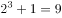
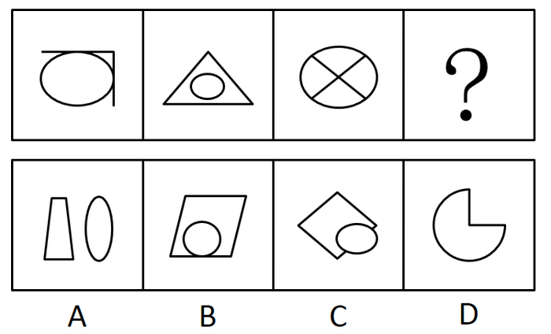

# 2019年青海省法院、检察院录用考试《行测》题

> 判断推理 · 28 题 · 青海 2019

## 第 1 题　qid 2440214 · 图形推理

从所给的四个选项中，选择最合适的一个填入问号处，使之呈现一定的规律性。

- **A**. A
- **B**. B
- **C**. C
- **D**. D　✅

**答案**：D

**官方解析**

每幅图都有数字，考虑数字推理。观察发现，图一：，图二：，图三：，图四：，图五：，问号处，只有D项符合。

故正确答案为D。

---

## 第 2 题　qid 2440224 · 图形推理

从所给四个选项中，选择最合适的一个填入问号处，使之呈现一定规律性。

- **A**. A
- **B**. B
- **C**. C
- **D**. D　✅

**答案**：D

**官方解析**

元素组成不同，每幅图都有小黑球，发现小黑球数量从图一到图五依次递减，分别为14、13、12、11、10，？处应选择一个9个黑球的，排除B、C两项。再次观察题干发现，图二和图一相比只有第一行颜色变动，其他行不变，图三和图二相比只有第二行颜色变动，其他行不变，图四和图三相比只有第三行颜色变动，其他行不变，图五和图四相比只有第四行颜色变动，其他行不变，因此问号处应该是第五行和前一幅图相比颜色变动，其他行不变。排除A项，只有D项符合。
故正确答案为D。

---

## 第 3 题　qid 2440227 · 图形推理

从所给四个选项中，选择最合适的一个填入问号处，使之呈现一定的规律性。

- **A**. A　✅
- **B**. B
- **C**. C
- **D**. D

**答案**：A

**官方解析**

元素组成不同，优先考虑属性规律。题干所有图形均为曲线和直线共同构成。进而考虑数量规律，题干图形的部分数分别为：1、2、1，故问号处应选择有2部分的图形。只有A项符合。
故正确答案为A。

---

## 第 4 题　qid 2440234 · 定义判断

法国昆虫学家法布尔曾经做过一个著名的实验：把许多毛毛虫放在一个花盆的边缘上，使其首尾相接，围成一圈，在花盆周围不远的地方，撒了一些毛毛虫喜欢吃的松叶。毛毛虫开始一个跟着一个，绕着花盆的边缘一圈一圈地走，一小时过去了，一天过去了，又一天过去了，这些毛毛虫还是夜以继日地绕着花盆的边缘在转圈，一连走了七天七夜，它们最终因为饥饿和精疲力竭而相继死去。法布尔在做这个实验前曾经设想：毛毛虫会很快厌倦这种毫无意义的绕圈而转向它们比较爱吃的食物，遗憾的是毛毛虫并没有这样做。后来，科学家把这种喜欢跟着前面的路线走的习惯称之为“跟随者”的习惯，把因跟随而导致失败的现象称为“毛毛虫效应”。
根据上述定义，下列属于“毛毛虫效应”的是：

- **A**. 股市中“买涨不买落，经常被套牢”的思想　✅
- **B**. 老张看见小区居民都买了保险，他也毫不犹豫地买了
- **C**. 百事可乐公司向可口可乐公司学习推广模式，迅速打开了中国市场
- **D**. 某公司一直坚持质量第一的原则，使公司规模越办越大

**答案**：A

**官方解析**

第一步：找出定义关键词。
“因跟随而导致失败”。
第二步：逐一分析选项。
A项：股票价格上涨跟着购买，被套牢说明失败，符合定义，当选；
B项：老张看见其他人买保险他也买属于跟随，但是没有体现失败，不符合定义，排除；
C项：迅速打开市场，说明没有失败，不符合定义，排除； 
D项：规模越来越大说明没有失败，不符合定义，排除。
故正确答案为A。

---

## 第 5 题　qid 2440235 · 定义判断

注意分配是指在同一时间内，把注意指向不同的对象，同时从事几种不同活动的现象。
根据上述定义，下列不属于注意分配的是：

- **A**. 学生边听讲边做笔记
- **B**. 歌手自拉自唱
- **C**. 工人边观察仪表边控制调节
- **D**. 运动员一鼓作气完成了躲避、转身、投篮的动作　✅

**答案**：D

**官方解析**

第一步：找出定义关键词。
“同一时间内”、“注意指向不同的对象”、“从事几种不同活动”。
第二步：逐一分析选项。
A项：学生边听讲边做笔记，符合“同一时间内”，听讲与记笔记是不同对象，符合“注意指向不同的对象”、“从事几种不同活动”，符合定义，排除； 
B项：歌手自拉自唱，符合“同一时间内”，拉与唱是不同行为，符合“注意指向不同的对象”、“从事几种不同活动”，符合定义，排除；
C项：边观察仪表边控制调节，符合“同一时间内”，观察与调节是不同的行为，符合“注意指向不同的对象”、“从事几种不同活动”，符合定义，排除；
D项：运动员完成躲避、转身与投篮的动作不是同一时间，不符合“同一时间内”，一鼓作气只是强调了动作的连贯性，但不代表是同一时间，不符合定义，当选。
本题为选非题，故正确答案为D。

---

## 第 6 题　qid 2440236 · 定义判断

印象管理，有时又称印象整饰，是指人们试图管理和控制他人对自己所形成的印象的过程。
根据上述定义，下列不属于印象管理的是：

- **A**. 为了使上级觉得小组所取得的成绩与组长关系密切，当上级来视察时，组长总是与组员在一起讨论问题
- **B**. 老陈在工作中勤勤恳恳，兢兢业业，吃苦在前，享受在后　✅
- **C**. 晓琳觉得自己的腿粗，每次去公共场合都穿长裙
- **D**. 小王上班迟到了，向领导道歉，解释迟到原因

**答案**：B

**官方解析**

第一步：找出定义关键词。
“试图管理和控制他人对自己所形成的印象的过程”。
第二步：逐一分析选项。
A项：上级来视察时，组长总是与组员在一起讨论问题，体现了组长控制他人对自己印象形成，符合定义，排除； 
B项：勤勤恳恳地工作并没有体现控制他人对自己印象形成，不符合定义，当选；
C项：晓琳每次去公共场合都穿长裙，体现了控制他人对自己印象形成，符合定义，排除；
D项：小王上班迟到向领导道歉和解释原因，是试图控制他人不留下对自己不好的印象，符合定义，排除。
本题为选非题，故正确答案为B。

---

## 第 7 题　qid 2440237 · 定义判断

信用卡诈骗罪是指以非法占有为目的，违反信用卡管理法规，利用信用卡进行诈骗活动。骗取财物数额较大的行为。利用信用卡，一般是指使用伪造的、作废的信用卡或者冒用他人的信用卡、恶意透支的方法进行诈骗活动。
根据上述定义，下列不属于信用卡诈骗罪的是：

- **A**. 小王是一名数据高手，有一次他提取了小赵的信用卡磁条信息，在其不知情的情况下偷偷做了一张信用卡，并用它买了自己喜爱的手表和提取了5000元现金
- **B**. 小李在周五下班后，回家的路上捡到了一张信用卡，他觉得反正又没人看见，于是他拿着信用卡去了手机店仿照卡主的签名签字买了一部最新款的智能手机
- **C**. 老李遭遇家中巨变，身无分文被逼无奈的他通过信用卡套现的1万元买日用品，后来到期后银行多次电话催收，老李拒不接听电话，还为了防止被发现偷偷藏了起来
- **D**. 小刘在日常生活中经济压力较大，办理了许多信用卡，以帮助他度过经济难关，但是由于薪资发放不及时，他逾期十天才还上刷卡消费的钱和利息　✅

**答案**：D

**官方解析**

第一步：找出定义关键词。
“以非法占有为目的”、“使用伪造的、作废的信用卡或者冒用他人的信用卡、恶意透支的方法”、“进行诈骗活动”、“数额较大”。
第二步：逐一分析选项。
A项：小王用小赵的磁条信息偷偷做了一张信用卡，提取了5000元现金，符合“使用伪造的信用卡”、“进行诈骗活动”、“数额较大”，符合定义，排除； 
B项：仿照卡主的签名签字买了一部最新款的智能手机，符合“冒用他人的信用卡”、“进行诈骗活动”、“数额较大”，符合定义，排除；
C项：通过信用卡套现的1万元买日用品，不还钱还偷偷藏了起来，符合“恶意透支的方法”、“进行诈骗活动”、“数额较大”，符合定义，排除；
D项：逾期十天才还上刷卡消费的钱和利息，只是由于薪资发放不及时，并不是恶意透支，不是诈骗行为，不符合定义，当选。
本题为选非题，故正确答案为D。

---

## 第 8 题　qid 2440238 · 定义判断

绑架罪，是指勒索财物或者其他目的，使用暴力、胁迫或者其他方法，绑架他人的行为，或者绑架他人作为人质的行为。
根据上述定义下列属于绑架罪的是：

- **A**. 小刘所在单位搞团建活动，活动中，小刘扮演歹徒绑架了扮演人质的小王，并要求小王的父亲老梁拿一百万赎金救人，最后大家成功解救了人质小王，而小刘被反绑了起来
- **B**. 老李因为家庭经济困难，他的妻子又患了癌症，走投无路的他绑架了老孙家的宠物狗，让老孙出1万元赎回他的狗
- **C**. 小明和小红是情侣，在他们分手后，小明把小红迷晕带到郊区的山村里，警告小红如果不同意和他复合就不放她回家　✅
- **D**. 刘鑫与张文是好朋友，某次因为吵架张文不听刘鑫解释。刘鑫为了解释，把张文带到家中，跟她解释完后将其送回家

**答案**：C

**官方解析**

第一步：找出定义关键词。
“勒索财物或者其他目的”、“使用暴力、胁迫或者其他方法，绑架他人的行为”、“或者绑架他人作为人质的行为”。
第二步：逐一分析选项。
A项：只是单位搞团建活动，是表演节目，并非真正的绑架，不符合定义，排除；
B项：绑架的是宠物狗，而题干中要求绑架的对象是人，而非动物，不符合定义，排除；
C项：小明把小红迷晕带到郊区的山村里，警告小红如果不同意和他复合就不放她回家，这是以胁迫方式绑架他人，符合定义，当选；
D项：刘鑫为了解释，把张文带到家中，没有体现是胁迫张文跟他回家，没有体现“胁迫或使用暴力”，不符合定义，排除。
故正确答案为C。

---

## 第 9 题　qid 2440239 · 定义判断

当两物体产生相对滑动（或有相对滑动趋势）时，则在接触间将产生阻碍物体滑动的力，这种力称为滑动摩擦力。
根据以上定义，下列属于滑动摩擦力的是：

- **A**. 骑自行车时，车轮与地面之间的摩擦力
- **B**. 擦黑板时，黑板擦与黑板之间的摩擦力　✅
- **C**. 人在正常走路时产生的摩擦力
- **D**. 篮球在地面上滚动时产生的摩擦力

**答案**：B

**官方解析**

第一步：找出定义关键词。
“当两物体产生相对滑动（或有相对滑动趋势）时”、“在接触间将产生阻碍物体滑动的力”。
第二步：逐一分析选项。
A项：骑自行车时，车轮与地面之间是滚动，而不是滑动，不符合“相对滑动（或有相对滑动趋势）时”，不符合定义，排除； 
B项：擦黑板时，黑板擦与黑板产生了相对滑动，而且有阻力产生，符合定义，当选；
C项：人在正常走路时，人和路面之间没有产生相对滑动，不符合定义，排除；
D项：篮球在地面上滚动时，篮球和地面之间是滚动，而不是滑动，不符合“相对滑动（或有相对滑动趋势）时”，不符合定义，排除。
故正确答案为B。

---

## 第 10 题　qid 2440240 · 逻辑判断

呼告是在行文中直呼文中的人或物的一种修辞方式。一般可把它分为呼人、呼物两种形式。运用呼告，可以抒发强烈的思想感情，加强感染力，并引起读者强烈的感情共鸣。
根据以上定义，下列语句未使用呼告这一修辞方式的是：

- **A**. 秋，听说你已来到
- **B**. 鼓动吧，风！咆哮吧，雷！闪耀吧，电！
- **C**. 周总理，我们的好总理，你在哪里呵，你在哪里？
- **D**. 水面冻冰，冰积雪，雪上加霜　✅

**答案**：D

**官方解析**

第一步：找出定义关键词。
“在行文中直呼文中的人或物的一种修辞方式”、“可以抒发强烈的思想感情，加强感染力”、“引起读者强烈的感情共鸣”。
第二步：逐一分析选项。
A项：“秋”是行文中对物的称呼，通过这个称呼可以抒发强烈的思想感情，加强感染力，符合定义，排除； 
B项：“风”、“雷”、“电”是行文中对物的称呼，通过这些称呼可以抒发强烈的思想感情，加强感染力，符合定义，排除；
C项：“周总理”是行文中对人的称呼，通过这个称呼可以抒发强烈的思想感情，加强感染力，符合定义，排除；
D项：“水面冻冰，冰积雪，雪上加霜”只是陈述了客观事实，并没有体现对行文中人和物的称呼，不符合定义，当选。
本题为选非题，故正确答案为D。

---

## 第 11 题　qid 2440241 · 定义判断

逆向思维，也称求异思维，它是对司空见惯的似乎已成定论的事物或观点反过来思考的一种思维方式。敢于“反其道而思之”，让思维向对立面的方向发展，从问题的相反面深入地进行探索，树立新思想，创立新形象。
根据上述定义，下列不属于逆向思维的是：

- **A**. 司马光砸缸放水，救出了小伙伴
- **B**. 农民老张在秋收中比别人早收了几天，结果天降大雨，全村只有自己丰收　✅
- **C**. 法拉第根据电流的磁效应，认为磁场也能产生电，提出了电磁感应定律
- **D**. 小王在自己的简历中将经历倒叙，使得自己在万份简历中脱颖而出

**答案**：B

**官方解析**

第一步：找出定义关键词。
“对似乎已成定论的事物或观点反过来思考的一种思维方式”。
第二步：逐一分析选项。
A项：司马光砸缸放水，救出了小伙伴，水缸本是用来储水，他把水缸砸破放水，符合“对似乎已成定论的事物或观点反过来思考的一种思维方式”，符合定义，排除；
B项：农民老张在秋收中比别人早收了几天，并没有体现出“对似乎已成定论的事物或观点反过来思考的一种思维方式”，不符合定义，当选；
C 项：法拉第根据电流的磁效应，认为磁场也能产生电，符合“对似乎已成定论的事物或观点反过来思考的一种思维方式”，符合定义，排除；
D项：小王在自己的简历中将经历倒叙，让自己脱颖而出，本来简历往往按时间顺序记叙，小王采取倒叙的方式，符合“对似乎已成定论的事物或观点反过来思考的一种思维方式”，符合定义，排除。
本题为选非题，故正确答案为B。

---

## 第 12 题　qid 2440242 · 定义判断

高峰体验是指人们在追求自我实现的过程中，基本需要获得满足后，达到自我实现时所感受到的短暂的、豁达的、极乐的体验，是一种趋于顶峰、超越时空、超越自我的满足与完美体验。
根据上述定义，下列不属于高峰体验的是：

- **A**. 冯导终于拍出大片获得奥斯卡最佳导演时的体验
- **B**. 老崔爬上山峰看到朝阳升起时的体验
- **C**. 村民见到老李与失散多年孩子拥抱时的体验　✅
- **D**. 小张经过努力终于成为飞行员时的体验

**答案**：C

**官方解析**

第一步：找出定义关键词。
“追求自我实现的过程中，基本需要获得满足后”、“达到自我实现时所感受到的短暂的、豁达的、极乐的体验”。
第二步：逐一分析选项。
A项：冯导获的奥斯卡最佳导演奖的体验，符合“追求自我实现的过程中，基本需要获得满足后”、“达到自我实现时所感受到的短暂的、豁达的、极乐的体验”，符合定义，排除；
B项：老崔爬上山峰看到朝阳升起时的体验，符合“追求自我实现的过程中，基本需要获得满足后”、“达到自我实现时所感受到的短暂的、豁达的、极乐的体验”，符合定义，排除；
C 项：村民见到老李找到孩子的体验，村民的此种体验并不是他自我追求的实现，是老李自我追求实现的满足，不符合“追求自我实现的过程中，基本需要获得满足后”、“达到自我实现时所感受到的短暂的、豁达的、极乐的体验”，不符合定义，当选；
D项：小张经过努力终于成为飞行员时的体验，符合“追求自我实现的过程中，基本需要获得满足后”、“达到自我实现时所感受到的短暂的、豁达的、极乐的体验”，符合定义，排除。
本题为选非题，故正确答案为C。

---

## 第 13 题　qid 2440243 · 定义判断

结构化决策是对某一决策过程的环境及规则，能用确定的模型或语言描述，以适当的算法产生决策方案，并能从多种方案中选择最优解的决策。非结构化决策是指决策过程复杂，不可能用确定的模型和语言来描述其决策过程。更无所谓最优解的决策。
根据上述定义，下列属于非结构化决策的是：

- **A**. 某国确定将与周边国家大力发展伙伴关系　✅
- **B**. 某市要再建造一座长江大桥
- **C**. 某景点限制游客进入数量
- **D**. 某网店根据销量确定进货品类

**答案**：A

**官方解析**

第一步：找出定义关键词。
结构化决策：“对某一决策过程的环境及规则”、“能用确定的模型或语言描述”、“以适当的算法产生决策方案”、“并能从多种方案中选择最优解的决策”。
非结构化决策：“决策过程复杂”、“不可能用确定的模型和语言来描述其决策过程”、“更无所谓最优解的决策”。
第二步：逐一分析选项。
A项：某国确定将与周边国家大力发展伙伴关系，伙伴关系比较抽象的，符合“不可能用确定的模型和语言来描述其决策过程”，符合“非结构化决策”定义，当选；
B项：某市要再建造一座长江大桥，大桥的方案是可以确定描述的，不符合“不可能用确定的模型和语言来描述其决策过程”，不符合“非结构化决策”定义，排除；
C项：某景点限制游客进入数量，游客的数量是可以具体描述的，可以有最优解的决策，不符合“不可能用确定的模型和语言来描述其决策过程”，不符合“非结构化决策”定义，排除；
D项：某网店根据销量确定进货品类，进货品类可以用确定的模型和语言来描述其决策过程，不符合“不可能用确定的模型和语言来描述其决策过程”，不符合“非结构化决策”定义，排除。
故正确答案为 A。

---

## 第 14 题　qid 2440244 · 类比推理

长江：中国

- **A**. 尼罗河：非洲
- **B**. 密西西比河：美国
- **C**. 伏尔加河：俄罗斯　✅
- **D**. 巴拿马运河：巴拿马

**答案**：C

**官方解析**

第一步：判断题干词语间逻辑关系。
长江是位于中国的自然流域，且长江的整个流域都位于中国境内，二者是地点的对应。
第二步：判断选项词语间逻辑关系。
A项：尼罗河位于非洲，二者是地点的对应，但非洲不是国家，与题干逻辑关系不一致，排除；
B项：密西西比河整个水系流经美国本土48州中的31个州和加拿大的两个州，故整个流域不是全部位于美国境内，与题干逻辑关系不一致，排除；
C项：伏尔加河是位于俄罗斯的自然流域，伏尔加河流经俄罗斯13个联邦主体，整个流域位于俄罗斯境内，二者是地点的对应，与题干逻辑关系一致，当选； 
D项：巴拿马运河位于中美洲国家巴拿马共和国，该运河是由美国建造完成，但是巴拿马运河不是天然流域，与题干逻辑关系不一致，排除。
故正确答案为C。

---

## 第 15 题　qid 2440245 · 类比推理

木头：木桌：家具

- **A**. 百合：花卉：药用
- **B**. 橡胶：轮胎：汽车
- **C**. 树木：森林：自然
- **D**. 小麦：馒头：食物　✅

**答案**：D

**官方解析**

第一步：判断题干词语间逻辑关系。
木头是木桌的原材料，二者是对应关系，木桌是家具的一种，二者是种属关系。
第二步：判断选项词语间逻辑关系。
A项：百合是一种花卉，二者是种属关系，与题干逻辑关系不一致，排除；
B项：橡胶是轮胎的原材料，二者是对应关系，轮胎是汽车的组成部分，二者是组成关系，与题干逻辑关系不一致，排除；
C项：树木是森林的组成部分，二者是组成关系，与题干逻辑关系不一致，排除；
D项：小麦是馒头的原材料，二者是对应关系，馒头是食物的一种，二者是种属关系，与题干逻辑关系一致，当选。
故正确答案为D。

---

## 第 16 题　qid 2440246 · 类比推理

图书馆：书籍：保存

- **A**. 医务室：医生：休息
- **B**. 足球场：足球：裁判
- **C**. 冰箱：午餐肉：冷藏　✅
- **D**. 教师：教室：上课

**答案**：C

**官方解析**

第一步：判断题干词语间逻辑关系。
保存书籍是动宾关系，二者是语法关系，图书馆是保存书籍的场所，是对应关系。
第二步：判断选项词语间逻辑关系。
A项：医生休息是主谓关系，与题干逻辑关系不一致，排除；
B项：裁判判罚足球比赛，裁判与足球，二者不是动宾关系，与题干逻辑关系不一致，排除；
C项：冷藏午餐肉是动宾关系，冰箱是冷藏午餐肉的场所，是对应关系，与题干逻辑关系一致，当选；
D项：教师上课是主谓关系，教室是教师上课的场所，与题干逻辑关系不一致，排除。
故正确答案为C。

---

## 第 17 题　qid 2440247 · 类比推理

花瓶 对于        相当于        对于 照明

- **A**. 瓷器  电路
- **B**. 艺术  灯塔
- **C**. 石狮  地图
- **D**. 装饰  台灯　✅

**答案**：D

**官方解析**

逐一代入选项。
A项：有的花瓶是瓷器，有的花瓶不是瓷器，有的瓷器是花瓶，有的瓷器不是花瓶，因此花瓶和瓷器二者为交叉关系。照明需要用到电路，二者不是交叉关系，前后逻辑关系不一致，排除；
B项：花瓶和艺术之间没有明确的逻辑关系（注意：有的花瓶可以是艺术品，花瓶和艺术品之间可以构成交叉关系，但是花瓶和艺术之间没有必然明确的逻辑关系），灯塔是高塔形建筑物，灯塔上装有照明设备，灯塔具有照明作用，二者是对应关系，前后逻辑关系不一致，排除；
C项：花瓶和石狮没有必然的逻辑关系，地图和照明也没有明确的逻辑关系，前后逻辑关系不一致，排除；
D项：花瓶具有装饰的作用，台灯具有照明的作用，二者均为功能的对应关系，前后逻辑关系一致，当选。
故正确答案为D。

---

## 第 18 题　qid 2440248 · 类比推理

酒驾 对于        相当于        对于 尊敬

- **A**. 处罚  善良　✅
- **B**. 拘留  轻视
- **C**. 交通规则  价值观
- **D**. 交警  道德

**答案**：A

**官方解析**

逐一代入选项。
A项：酒驾可能被处罚，善良可能被尊敬，均是或然的因果关系，前后逻辑关系一致，当选；
B项：酒驾可能被拘留，二者是或然因果关系，轻视和尊敬是对于人的两种态度，属于并列关系，前后逻辑关系不一致，排除；
C项：通过造句子可知：酒驾违反了交通规则，而价值观违反了尊敬不符合逻辑，前后逻辑关系不一致，排除；
D项：查询酒驾是交警的工作职责之一，二者是对应关系，道德和尊敬之间没有必然联系，前后逻辑关系不一致，排除。
故正确答案为A。

---

## 第 19 题　qid 2440249 · 逻辑判断

甲乙丙三人商量去钓鱼，甲说：如果乙去，我就去；乙说：如果我不去，丙也不会去；丙说：如果甲不去，那么我就去。
那么可以推出的是：

- **A**. 甲去钓鱼　✅
- **B**. 乙去钓鱼
- **C**. 丙去钓鱼
- **D**. 乙不去钓鱼

**答案**：A

**官方解析**

翻译题干。

① 乙  甲

② 乙  丙

③ 甲  丙

④ 将③逆否和②可以递推出：④ 乙  丙  甲

根据①和④可知，无论乙去不去，甲都会去，即：甲一定去钓鱼。A选项符合题意。

故正确答案为A。

---

## 第 20 题　qid 2440250 · 逻辑判断

如今的自媒体都是标题党，张姓微博大V肯定会被警告要注意标题的准确性。
下列选项中的逻辑与上述推理最接近的是：

- **A**. 北方人不喜欢甜食，小张不是北方人，所以小张不会不喜欢甜食
- **B**. 性格叛逆的孩子有出息，小刘有出息，所以小刘性格叛逆
- **C**. 发达国家都是不遵守国际法的，有些美洲国家不遵守国际法，所以有些国家不是发达国家
- **D**. 现在的年轻演员普遍长得好看，小蔡是年轻演员，所以小蔡长得好看　✅

**答案**：D

**官方解析**

第一步：翻译题干。

自媒体标题党，张姓大V被警告要注意标题准确性，即：张姓大V是自媒体，所以，张姓大V是标题党。题干的推理形式是肯前推出肯后。

第二步：逐一分析选项。

A项：北方人不喜欢甜食，小张不是北方人是对命题的否前，与题干推理形式不一致，排除；

B项：性格叛逆的孩子有出息，小刘有出息是对命题的肯后，与题干推理形式不一致，排除；

C项：发达国家不遵守国际法，有些美洲国家不遵守国际法是对题干命题的肯后，与题干的推理形式不一致，排除；

D项：年轻演员长得好看，小蔡是年轻演员，所以小蔡长得好看，这是肯前推出肯后，与题干推理形式一致，当选。

故正确答案为D。

---

## 第 21 题　qid 2440251 · 逻辑判断

目前我国几大手机厂商均陆续推出了5G手机，但也有外国厂商指出，目前5G手机技术不成熟，现在还无法大规模推广普及。
以下哪项如果为真，不能支持外国厂商的观点？

- **A**. 新技术往往价格昂贵
- **B**. 目前5G基站主要分布于大城市
- **C**. 媒体宣传5G手机非常到位　✅
- **D**. 大部分民众并不对这种技术升级感兴趣

**答案**：C

**官方解析**

第一步：找出论点和论据。
论点：目前5G手机技术不成熟，现在还无法大规模推广普及。
论据：无。
本题只有论点没有论据，因此，考虑补充论据的方式加强。
第二步：逐一分析选项。
A项：新技术价格贵，是导致其无法普及的一个因素，补充论据，可以加强，排除；
B项：目前5G基站主要分布于大城市，说明5G的基站普及率不高，补充论据，可以加强，排除；
C项：媒体宣传5G手机非常到位，与5G技术现在是否可以大规模普及没有关系，属于无关选项，无法加强，当选；
D项：大部分民众并不对这种技术升级感兴趣，是导致其无法普及的一个因素，补充论据，可以加强，排除。
本题为选非题，故正确答案为C。

---

## 第 22 题　qid 2440252 · 类比推理

春游过程中，小米、小钱和小何看到了一棵树，小钱说：“它不是松树，是柏树。”小何说：“它不是柏树，是松树。”小米不能确定是什么树，但是他说：“它不是杨树，也不是柏树。”最后老师说：“你们三个人的猜测中只有一个人的两个判断都对，一个人的判断是一对一错，还有一人全错了。”
如果老师的说法是对的，则可以得出他们看到的是哪种树？

- **A**. 松树
- **B**. 柏树　✅
- **C**. 杨树
- **D**. 无法确定

**答案**：B

**官方解析**

本题属于组合排列题型。
第一步：分析题干信息。
题干信息不明确，采用代入法解题。
第二步：逐一代入选项。
A项：如果是松树，则：小钱的两句全错，小何的两句全对，小米的两句全对，不符合题意，排除；
B项：如果是柏树，则：小钱的两句全对，小何的两句全错，小米的两句一对一错，符合题意，当选；
C项：如果是杨树，则：小钱的两句一对一错，小何的两句一对一错，小米的两句一对一错，不符合题意，排除；
D项：根据上述分析，可以确定是柏树，排除。
故正确答案为B。

---

## 第 23 题　qid 2440253 · 逻辑判断

学校要举行文艺汇演，某系准备在唱歌、跳舞、相声、小品中确定一个或几个节目去参加。系领导通过筛选，最终形成以下三种意见：
（1）对于唱歌和跳舞，至多选择一个。
（2）对于唱歌和小品，至少选择一个。
（3）如果选择相声或者小品，就不能选择跳舞。
最终参加文艺汇演的节目只满足上述一种意见。
根据以上陈述，以下哪项是正确的？

- **A**. 选择跳舞、相声、小品
- **B**. 选择跳舞，但不选择相声和小品
- **C**. 选择唱歌、跳舞、小品　✅
- **D**. 选择相声、但不选择跳舞和小品

**答案**：C

**官方解析**

第一步:整理题干条件。

① 唱歌或跳舞

② 唱歌或小品

③ 相声或小品跳舞。

第二步:逐一分析选项。

题干条件不确定，只有一个正确，优先采用代入法。

将A项代入，①②正确，③错误，不符合题意，排除；

将B项代入，不确定是否选择唱歌，假设选择唱歌，①错误，②③正确；假设不选择唱歌，①③正确，②错误，两种情况均不符合题意，排除；

将C项代入，①③错误，②正确，符合题意，当选；

将D项代入，不确定是否选择唱歌，假设选择唱歌，①②③均正确；假设不选择唱歌，①③正确，②错误，两种情况均不符合题意，排除。

故正确答案为C。

---

## 第 24 题　qid 2440254 · 逻辑判断

某小区在2018年之前公共设施经常遭到破坏，2018年在小区居民的要求下，小区物业为小区安装了多角度摄像监控系统，之后该小区的公共设施很少受到破坏，这说明多角度摄像监控系统对于保护小区公共设施起到了重要的作用。
以下哪项如果为真，最能加强上述结论？

- **A**. 从2018年开始，该市其他同等档次未安装监控系统的小区公共设施破坏事件显著增加　✅
- **B**. 该市的另一个小区也安装了多角度摄像监控系统，但效果并不理想
- **C**. 从2018年开始，小区物业增加了工作人员，加强了治安巡逻
- **D**. 多角度摄像监控系统对于商场等公共场所防范作用较差

**答案**：A

**官方解析**

第一步:找出论点和论据。
论点:多角度摄像监控系统对于保护小区公共设施起到了重要的作用。
论据:小区物业为小区安装了多角度摄像监控系统，之后该小区的公共设施很少遭到破坏。
本题的论点和论据均讨论了多角度摄像监控系统对保护小区公共设施的作用，论点和论据话题一致，要想加强，可以补充论据，即解释多角度监控系统可以保护小区公共设施的原因，或者举例说明该系统确实可以保护小区公共设施。
第二步:逐一分析选项。
A项:指出没安装该系统的小区公共设施破坏严重，那么说明该系统确实能够保护小区公共设施，补充论据，可以加强，当选;
B项:强调另一个小区安装该系统却没有效果，说明该系统并不能保护小区公共设施，削弱了论点，排除;
C项:指出该小区增加了人员，加强了治安，与该系统是否能保护小区公共设施无关，无关项，排除;
D项:指出该系统对商场等公共场所防范作用较差，与论点中的小区公共设施无关，无关项，排除。
故正确答案为A。

---

## 第 25 题　qid 2440255 · 逻辑判断

星座预测就是根据星辰的位置及其各种变化来预测人世间的各种事物。有很多人相信并依照星座预测制定每天的日程。因此，有人认为星座预测是正确的，否则也不会有这么多人相信。
以下哪项如果为真，最能反驳上述观点？

- **A**. 星座确实存在
- **B**. 有更多的人不相信星座预测
- **C**. 未成年人才相信星座预测
- **D**. 会有很多的人相信非常不科学的事情　✅

**答案**：D

**官方解析**

第一步：找出论点和论据。
论点：星座预测是正确的，否则也不会有这么多人相信。
论据：无。
本题只有论点，没有论据，优先考虑否定论点的方式来削弱。
第二步：逐一分析选项。
A项：指星座确实存在，但是论点讨论的是星座预测是否是正确的，存在不代表预测一定是正确的，属于不明确选项，无法削弱，排除；
B项：指出有更多的人不相信星座预测，与论点讨论的星座预测到底是不是正确的无关，无法削弱，排除；
C项：指出未成年人才相信星座预测，与论点讨论的星座预测到底是不是正确的无关，无法削弱，排除；
D项：指出会有很多人相信不科学的事情，即不能根据很多人相信，就认为星座预测是正确的，否定论点，当选。
故正确答案为D。

---

## 第 26 题　qid 2440256 · 逻辑判断

为了能够使自己保持旺盛的精力投入到工作中去，年轻人小李每天中午用完午餐之后都会冲一杯雀巢速溶咖啡提神，可是通过一周的跟踪观察发现每天中午饮用完咖啡后，小李下午还是犯瞌睡，于是他认为：喝雀巢咖啡不能提神。
以下哪项如果为真，最能削弱上述结论？

- **A**. 以前小李中午不喝咖啡，下午在座位上都睡着了　✅
- **B**. 小李喝的是有食品安全认证的雀巢咖啡
- **C**. 雀巢咖啡在国内销量位居速溶咖啡第一位
- **D**. 雀巢咖啡的国内售价比较其他咖啡更优惠

**答案**：A

**官方解析**

第一步：找出论点和论据。
论点：喝雀巢咖啡不能提神。
论据：通过一周的跟踪观察发现，每天中午饮用完咖啡后，小李下午还是犯瞌睡。
论点和论据话题一致，优先考虑否定论点的方式来削弱。
第二步：逐一分析选项。
A项：指出以前小李不喝咖啡时，下午都在座位上睡着了，而现在喝了咖啡，下午只是犯瞌睡，说明雀巢咖啡有用，可以起到一定的提神效果，否定论点，当选；
B项：指出小李喝的是有食品安全认证的雀巢咖啡，与论点讨论的该咖啡能不能提神无关，无法削弱，排除；
C项：指出雀巢咖啡在国内销量位居速溶咖啡第一位，与论点讨论的该咖啡能不能提神无关，无法削弱，排除；
D项：指出雀巢咖啡的国内售价更优惠，与论点讨论的该咖啡能不能提神无关，无法削弱，排除。
故正确答案为A。

---

## 第 27 题　qid 2440258 · 逻辑判断

自从某中学在高三年级实行班主任岗位目标责任制后，学校的升学率逐年上升。由此可见，只有实行班主任岗位目标责任制，才能使该校的升学率稳步增长。
以下哪项如果为真，最能削弱上述论证？

- **A**. 近几年高校扩招，学生升学率整体形势较好
- **B**. 没有实行班主任岗位目标责任制的A中学，近几年的升学率也在稳步上升
- **C**. 前年该校开始实行教师薪酬改革，极大地调动了广大教师的积极性
- **D**. 如果该校没有实行班主任岗位目标责任制，近两年的升学率会上升得更快　✅

**答案**：D

**官方解析**

第一步:找出论点和论据。
论点:只有实行班主任岗位目标责任制，才能使该校的升学率稳步增长。
论据:自从某中学在高三年级实行班主任岗位目标责任制后，学校的升学率逐年上升。
本题的论点和论据均讨论了班主任岗位目标责任制和升学率的关系，论点和论据话题一致，要想削弱，可以否定论点，即说明没有实行班主任岗位目标责任制，升学率也能增长。
第二步：逐一分析选项。
A项：该项指出可能是因为升学率整体形势好，使得升学率稳步增长，是他因削弱，可以削弱，保留；
B项：该项讨论的是“没有实行制度的A中学”，与题干讨论的某中学无关，无关选项，无法削弱，排除；
C项：该项指出前年该校也实行了教师薪酬改革，调动了教师的积极性，可能是因为教师积极性高了，使得升学率稳步增长，是他因削弱，可以削弱，保留；
D项：如果该校没有实行班主任岗位目标责任制，近两年的升学率会增长得更快，说明实行班主任岗位目标责任制反而限制了升学率的增长，直接削弱论点，保留。
对比A、C、D三项，D项削弱论点力度最强，大于A、C两项的他因削弱。
故正确答案为D。

---

## 第 28 题　qid 2440259 · 逻辑判断

当前，银行面临着这样一个问题，就是对于那些在贷款后不能及时还贷的客户，银行除了不断通过各种形式催款别无他法。因此许多银行都向不能及时还贷的客户收取滞纳金。但有关调查表明，收取滞纳金后不能及时还贷的客户数量不但未减少，反而增加了。
以下哪项如果为真，最能解释上述调查结果？

- **A**. 收取滞纳金后，更多的客户认为即使不及时还贷也不必内疚，只要支付滞纳金就行　✅
- **B**. 有个别客户对收取滞纳金的行为不满，有时会故意不及时还贷来抗议
- **C**. 有些客户因为生活压力大，常常不能及时还贷
- **D**. 收取滞纳金的金额太低，对原本经常不及时还贷的客户没有太大的压力

**答案**：A

**官方解析**

第一步:找出题干的矛盾之处。
题干的矛盾之处在于银行向不能及时还贷的客户收取滞纳金，但收取滞纳金后不能及时还贷的客户数量不但未减少，反而增加了。
第二步:逐一分析选项。
A项:收取滞纳金后，客户认为不必内疚，所以更多的客户可能不及时还贷，可以解释，当选;
B项:个别客户的不满并不能解释为何不能及时还贷的客户数量增加了，不能解释，排除;
C项:有些客户不能及时还款，是一个长期性的行为，并不能解释这次收取滞纳金为何使得不能及时还贷的客户数量增加了，不能解释，排除;
D项:对原本经常不能还贷的客户的影响，并不能解释为何不能及时还贷的客户数量增加了，不能解释，排除。
故正确答案为A。

---
