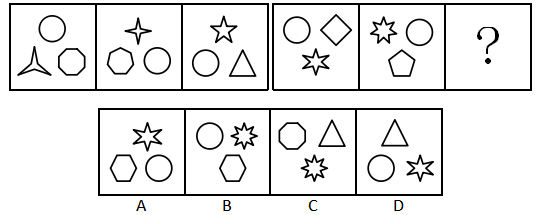
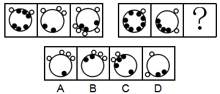

# 2019深圳市公务员录用考试《行测》题（网友回忆版）

> 判断推理 · 20 题 · 深圳市考 2019

## 第 1 题　qid 2385136 · 类比推理

- **A**. A
- **B**. B
- **C**. C　✅
- **D**. D

**答案**：C

**官方解析**

元素组成不同，且无明显属性规律，考虑数量规律。题干第一组图中出现多个曲线和直线线段，考虑线数量，曲线和直线分开数。第一组图形中曲线的数量为1、2、3；直线的数量为1、2、3，每幅图中曲线和直线的数量相等。第二组图形应用规律，曲线的数量为4、5、？；直线的数量为4、5，？，因此？处图形应该有6条直线和6条曲线。A项为5条曲线、8条直线，排除；B项为4条曲线、8条直线，排除；C项为6条曲线、6条直线，当选；D项为6条曲线、12条直线，排除。
故正确答案为C。

---

## 第 2 题　qid 2385138 · 类比推理

- **A**. A
- **B**. B
- **C**. C　✅
- **D**. D

**答案**：C

**官方解析**

元素组成不同，且无明显属性规律，考虑数量规律。题干图形均出现了封闭空间，优先考虑面数量。题干第一组图形的面数量分别为0、2、4，为等差数列；第二组图形的面数量分别为1、3，？，所以？处图形应为5个面。A项为4个面，B项为2个面，C项为5个面，D项为4个面，只有C项符合。
故正确答案为C。

---

## 第 3 题　qid 2385140 · 类比推理

- **A**. A
- **B**. B
- **C**. C
- **D**. D　✅

**答案**：D

**官方解析**

解法一：观察图形，元素组成不同且无明显属性规律，考虑数量规律。每个图形都有一个外框，个别图形的外框内被线条分开，考虑线数量，第一组图：3、5、5；第二组图：7、9、？没规律。考虑点数量，第一组图：3、5、5；第二组图：7、9、？也没规律。但是综合点数量和线数量来看，我们发现，每一个图形的点数量与线数量都是相等的。按照这个规律我们来看选项，A选项6个点、5条线；B选项10个点、8条线；C选项9个点、10条线；D选项6个点、6条线。

故正确答案为D。

解法二：观察图形，元素组成不同且无明显属性规律，考虑数量规律。每个图形都有一个外框，个别图形的外框内被线条分开，考虑角数量。第一组图的角数量分别为：3、5、7；第二组图的角数量为：9、11、？。故问号处应该为13个角的图形。选项的角数量分别为：A项8个角、B项14个角、C项13个角、D项8个角。

故正确答案为C。

对比两个规律，我们发现都很严谨，并无瑕疵。但是考虑到出题人的思维惯性，近五年深圳市考从未涉及角数量考点，并且其他省份、自治区、直辖市和国家的公务员招录考试中也几乎未涉及角数量考点；而“”的考点在近几年的考试中偶有涉及，因此对比出题人的思维惯性，正确答案应为D。

故正确答案为D。

---

## 第 4 题　qid 2385142 · 类比推理

- **A**. A
- **B**. B　✅
- **C**. C
- **D**. D

**答案**：B

**官方解析**

观察图形，都是由一个个的小元素构成，考虑元素数量。题干中所有图形均为3个元素构成，而且每个元素均不相同，即3种元素。但选项中也都是3个元素，3种元素构成，无法排除。考虑其他规律。再次观察图形发现，第一组图上面都是1个元素，下面都是2个元素；第二组图上面都是2个元素，下面都是1个元素，因此排除A、D两项；第一组所有图形中都包含同一种元素圆圈，由此可知，第二组的所有图形中也应该都包含同一种元素——圆圈。观察B、C两项，发现只有B选项存在圆圈。
故正确答案为B。

---

## 第 5 题　qid 2385143 · 类比推理

- **A**. A
- **B**. B
- **C**. C
- **D**. D　✅

**答案**：D

**官方解析**

观察图形，每个图形都有一个大圆，并且里面是一些小黑圈，外面是一些小白圈，考虑元素数量。第一组图中的小白圈个数分别是2、3、6，前两个图白圈数量的乘积是第三个图白圈的数量，小黑圈的数量分别是6、2、3，后两个图中小黑圈的数量的乘积是第一个图中小黑圈的数量；第二组图中的小白圈个数分别是1、2、？，所以？处图形中小白圈的数量应该为2，小黑圈的数量分别是8、4、?，所以？处图形中小黑圈的数量应该为2，只有D选项符合。
故正确答案为D。

---

## 第 6 题　qid 2385145 · 类比推理

（1）金星  （2）火星
（3）木星  （4）水星
（5）土星

- **A**. 3-2-5-4-1
- **B**. 4-2-1-5-3
- **C**. 4-1-2-3-5　✅
- **D**. 2-1-5-3-4

**答案**：C

**官方解析**

解析一：
第一步：先确定逻辑关系最为明显的逻辑顺序。
观察题干，五个事件主要围绕“太阳系的五大行星”。逻辑关系的先后顺序比较明显的事件是事件（4），水星是八大行星中距离太阳最近的行星，故事件（4）应是首句，排除A、D项。
第二步：逐一对照选项并判断正确答案。
根据第一步的结果可以判断只有B、C项符合，金星是八大行星中距离太阳第二近的行星，排除B项。
故正确答案为C。
解析二：
第一步：先确定逻辑关系最为明显的逻辑顺序。
观察题干，五个事件主要围绕“太阳系的五大行星”。逻辑关系的先后顺序比较明显的事件是事件（4），水星是八大行星中体积最小的行星，故事件（4）应是首句，排除A、D项。
第二步：逐一对照选项并判断正确答案。
根据第一步的结果可以判断只有B、C项符合，火星是八大行星中体积第二小的行星，排除C项。
故正确答案为B。
本题答案有争议，BC两项均可。体积这个知识点比较生僻，粉笔倾向于优先考虑距离远近，选C。
故正确答案为C。
注：太阳系的八大行星按照离太阳从近到远的顺序依次为：水星，金星，地球，火星，木星，土星，天王星，海王星。
太阳系的八大行星按照体积从小到大的顺序依次为：水星，火星，金星，地球，海王星，天王星，土星，木星。

---

## 第 7 题　qid 2385110 · 类比推理

（1）吞竞争者 （2）失用户心 （3）涨服务费 （4）打补贴战 （5）成独角兽

- **A**. 4-2-1-5-3
- **B**. 4-5-1-2-3
- **C**. 5-4-2-1-3
- **D**. 4-1-5-3-2　✅

**答案**：D

**官方解析**

第一步：先确定逻辑关系最为明显的逻辑顺序。
观察题干，五个事件主要围绕“吞并竞争对手最后却失去用户”的过程。逻辑关系的先后顺序比较明显的事件是事件（2）和（3），应该是涨服务费，导致失去用户心。故事件（3）应在事件（2）的前面，排除A、B、C项。
第二步：逐一对照选项并判断正确答案。
根据第一步的结果可以判断只有D项符合。
故正确答案为D。

---

## 第 8 题　qid 2385117 · 类比推理

（1）不幸死亡 （2）劣质针剂 （3）流通各地 （4）缺乏监管 （5）接种疫苗

- **A**. 3-4-5-1-2
- **B**. 3-1-2-5-4
- **C**. 2-3-5-4-1
- **D**. 4-2-3-5-1　✅

**答案**：D

**官方解析**

第一步：先确定逻辑关系最为明显的逻辑顺序。
观察题干，五个事件主要围绕“劣质疫苗致人死亡”的过程。逻辑关系的先后顺序比较明显的事件是事件（1）和（5），应该是先接种疫苗，再不幸死亡。故事件（5）应在事件（1）的前面，排除B项。
第二步：逐一对照选项并判断正确答案。
根据第一步的结果可以判断只有A、C、D项符合。之所以会发生疫苗致人死亡的事件，应该是因为缺乏监管，致使劣质针剂流通各地，事件（2）、（3）、（4）的先后顺序依次为：（4）—（2）—（3），排除A、C项。
故正确答案为D。

---

## 第 9 题　qid 2385126 · 类比推理

（1）电影发行 （2）剪辑配乐 （3）创作剧本 （4）演员表演 （5）选取场景

- **A**. 3-4-2-1-5
- **B**. 4-3-5-2-1
- **C**. 5-4-2-3-1
- **D**. 3-5-4-2-1　✅

**答案**：D

**官方解析**

第一步：先确定逻辑关系最为明显的事件顺序。
观察题干，五个事件主要围绕“制作电影”的话题展开。逻辑关系的先后顺序比较明显的是事件（3）和事件（4），应该是先创作剧本，演员再进行表演，即事件（3）应该在事件（4）的前面，排除B、C项。
第二步：逐一对照选项并判断正确答案。
根据第一步得到的结果剩下A项和D项，通过分析事件（1）和（5）得知，只有先“选取场景”进行拍摄，才能“电影发行”。因此事件（5）排在事件（1）前面，排除A项。
故正确答案为D。

---

## 第 10 题　qid 2385132 · 类比推理

（1）长安 （2）罗马 （3）大宛 （4）敦煌 （5）安息

- **A**. 2-5-4-3-1
- **B**. 1-4-3-5-2　✅
- **C**. 3-2-1-5-4
- **D**. 1-4-5-3-2

**答案**：B

**官方解析**

观察题干，题干五个城市或国家均为丝绸之路自东向西经过的区域，分别是长安-敦煌-大宛-安息-罗马，对应B项。
故正确答案为B。

---

## 第 11 题　qid 2385144 · 类比推理

在某大学文学院的课程改革研讨会上，负责语言学教学的朱老师说，在现代语言学中，文学的思维和知识毫无用武之地，这样就不必要求语言学专业的学生对文学基础有深刻的理解，因此，在语言学专业未来的教学体系中，文学基础课程就应该用其它重要的语言学类基础课程替代。
下列说法如果为真，能质疑朱老师的上述观点的是（    ）。
（1）语言学类基础课程难度较大，会导致学生的平均成绩降低。
（2）语言学研究对象之一的文学语言具有与众不同的特点，运用文学思维解读其特点最为贴切。
（3）该学院语言学专业的学生大多研究修辞学方向，而修辞学研究需要语言学和文学相结合。

- **A**. （2）
- **B**. （3）
- **C**. （1）（3）
- **D**. （2）（3）　✅

**答案**：D

**官方解析**

第一步：找出论点和论据。
论点：在语言学专业未来的教学体系中，文学基础课程就应该用其他重要的语言学类基础课程替代。
论据：在现代语言学中，文学的思维和知识毫无用武之地，这样就不必要求语言学专业的学生对文学基础有深刻的理解。
本题论点说的是文学基础课程应该被其它语言类课程替代，论据说的是文学的思维和知识对语言学专业没有用处，论点是建议类，要想削弱，可以考虑否定论据，即文学的思维和知识对语言学专业是有用的。
第二步：逐一分析选项。
（1）强调语言学类课程难度大，与论点讨论的语言学专业是否需要学习文学基础课程无关，无关项，不能削弱；
（2）说明文学语言是语言学的研究对象之一，而文学语言需要用到文学思维，那么在现代语言学中，文学的思维是有用的，直接否定论据，可以削弱；
（3）强调语言学专业的学生研究修辞学，而修辞学需要结合语言学和文学，那么在现代语言学中，文学的思维是有用的，直接否定论据，可以削弱；
综上所述，可以削弱的为（2）和（3）。
故正确答案为D。

---

## 第 12 题　qid 2385146 · 逻辑判断

一个学者要在学术研究上取得突破，一定要热爱研究，并且耐得住寂寞。有些学者虽然耐得住寂寞，但内心并不热爱研究，因此，不是所有的学者都能在学术研究上取得突破。
下列选项的逻辑结构与上文逻辑结构最类似的是（    ）。

- **A**. 某奢侈品店规定，要买到该店最新款，必须网上实名预约，并且完成全款预付。有些买到该店最新款的人并没有网上实名预约，因此该奢侈品店的规定很有可能是自我炒作
- **B**. 不重视自我充电的职员往往几年后得不到升职加薪的机会。有的职员几年后升职加薪，因此有些职员重视自我充电
- **C**. 要成为一个受欢迎的人，必须既懂幽默，又会适度打扮自己。有些人会适度打扮自己但并不懂幽默，因此有些人不能成为受欢迎的人　✅
- **D**. 电视剧要想收视率高，必须既有流量明星参演，又经广泛宣传。有些收视率低的电视剧有流量明星参演，且宣传广泛，因此有流量明星参演不是电视剧收视率高的主要原因

**答案**：C

**官方解析**

第一步：分析题干推理方式。

题干翻译为：学术研究上取得突破热爱研究 且 耐得住寂寞，耐得住寂寞 且 热爱研究学术上取得突破，即AB 且 C，B 且 CA。

第二步：逐一分析选项。

A项：翻译为买到新款实名预约且全款预付，买到新款 且 实名预约自我炒作，即AB 且 C，A 且 BD，与题干推理方式不一致，排除；

B项：翻译为重视自我充电升职加薪，升职加薪重视自我充电，即AB，BA，与题干推理方式不一致，排除；

C项：翻译为受欢迎打扮 且 幽默，打扮 且 幽默受欢迎，即AB 且 C，B 且 CA，与题干推理方式一致，当选；

D项：翻译为收视率高流量明星且广泛宣传，流量明星 且 广泛宣传收视率高，即AB 且 C， B 且 CA，与题干推理方式不一致，排除。

故正确答案为C。

---

## 第 13 题　qid 2385148 · 逻辑判断

过年期间，学校后勤处计划为所有留校学生提供免费餐饭并安排文艺活动，一方面是想为留校学生缓解过年期间的孤独感，另一方面是想为这些学生减轻生活上的经济压力。
下列选项如果为真，最不能质疑后勤处此项计划的是（    ）。

- **A**. 留校学生大都买不起回家的车票　✅
- **B**. 绝大多数学生过年留校都是因为科研活动十分繁忙
- **C**. 人手不足，文艺活动难以开展
- **D**. 绝大多数学生都认为学校提供的餐饭很难吃，宁愿在校外就餐

**答案**：A

**官方解析**

第一步：找出论点和论据。
论点：过年期间，学校后勤处为所有留校学生提供免费餐饭并安排文艺活动，一方面是想为留校学生缓解过年期间的孤独感，另一方面是想为这些学生减轻生活上的压力。
论据：无。
本题只有论点，质疑可以直接反着论点来说，一是这种方式不能缓解留校学生过年期间的孤独感，二是不能减轻留校学生生活上的压力，三是可以直接说明学校的计划不可行。
第二步：逐一分析选项。
A项：留校学生买不起回家的车票，说明学生确实是经济有困难，这种方式可以减轻学生生活上的压力，为加强项，无法削弱，当选；
B项：绝大多数学生因为科研繁忙所以留校过年，说明大部分留校学生既不是因为孤独也不是因为经济有困难才留校的，此种方式并不能达到缓解学生的孤独感，减轻学生生活上压力的目的，可以削弱，排除；
C项：人手不足，文艺活动难以展开，直接否定后勤计划的可行性，可以削弱，排除；
D项：绝大多数学生认为学校的餐饭难吃，宁愿在校外就餐，说明学生不爱吃学校的餐饭，即使提供了学生也会去校外吃，达不到减轻学生经济压力的目的，可以削弱，排除。
本题为选非题，故正确答案为A。

---

## 第 14 题　qid 2385150 · 逻辑判断

某部门有五名员工，分别是小赵、小钱、小孙、小李、小周。关于五人的政治面貌，有如下事实：
如果小赵是党员，则小李是党员；如果小钱是党员，则小李和小孙都是党员；要么小赵是党员，要么小周是党员；如果小孙不是党员，则小周是党员。
则下列说法错误的是（    ）。

- **A**. 如果小周不是党员，则小钱是党员　✅
- **B**. 如果小周不是党员，则五人中至少有三人是党员
- **C**. 如果小钱和小周都是党员，则五人中有四人是党员
- **D**. 如果小李和小孙都不是党员，则五人中只有一个是党员

**答案**：A

**官方解析**

第一步：翻译题干。

①小赵党员小李党员

②小钱党员小李党员且小孙党员

③要么小赵是党员，要么小周是党员

④小孙党员小周党员

第二步：逐一分析选项。

A项：小周党员小钱党员，根据条件③，如果小周不是党员可知小赵是党员，根据条件①肯前必肯后推出小李是党员；根据条件④，如果小周不是党员，否后必否前可知小孙是党员；小李是党员且小孙是党员是对条件②的肯后，肯后无法推出确定性结论，所以小钱是否是党员不确定，此项无法推出，当选；

B项：如果小周不是党员，根据条件④，否后必否前可知小孙是党员；根据条件③可知小赵是党员，根据条件①，又可知小李是党员，此时已知三人是党员，B选项正确，排除；

C项：如果小钱和小周都是党员，根据条件②，肯前必肯后可知小李是党员且小孙是党员，此时四人都是党员，C选项正确，排除；

D项：如果小李和小孙都不是党员，根据条件①，否后必否前可知小赵不是党员，根据条件②否后必否前，可知小钱不是党员，根据条件③可知，小周是党员，即五人中只有一人是党员，D选项正确，排除。

本题为选非题，故正确答案为A。

---

## 第 15 题　qid 2385152 · 逻辑判断

为了解某地人民对建设创新社会的认识情况，当地知识产权局发放了调查问卷。问卷回收后发现，的被调查者对建设创新社会的意义有正确的认识，的被调查者能理解国家对创新社会的建设所作的投入。该地知识产权局由此得出结论，目前当地人民对于建设创新社会是能够认识并理解的。

下列选项如果为真，最能削弱以上结论的是（    ）。

- **A**. 能理解国家对创新社会的建设所作投入的被调查者均对建设创新社会的意义有正确的认识
- **B**. 正确认识与理解创新社会的建设离积极投入创新社会的建设还有相当的距离
- **C**. 并非全国人民都接受了调查问卷，所以结论的可信度还值得怀疑
- **D**. 这批问卷的被调查者主要来自该地知识产权局及其相关单位　✅

**答案**：D

**官方解析**

第一步:找出论点和论据。

论点：目前当地人民对于建设创新社会是能够认识并理解的。

论据：问卷回收后发现，的被调查者对建设创新社会的意义有正确的认识，的被调查者能理解国家对创新社会的建设所作的投入。

本题的论点是通过调查问卷所得，此类样本类题目有其特殊的削弱方式，可以从样本入手，如果调查的样本不具有代表性，那么由此样本得出的结论不一定成立，即可削弱。

第二步：逐一分析选项。

A项：由论据可知，的被调查者有正确的认识，的被调查者能理解国家的投入。而该项说明，的能理解的被调查者都是有正确认识的被调查者，是在论据中两组数据之间建立联系，但还是不确定当地总体有多少人对于建设创新社会是能够认识并理解，所以无法削弱，排除；

B项：题干论点讨论的是当地人民对于建设创新社会的认识与理解，是观念层面上的，与能否积极投入创新社会建设（行动层面）是无关的，因此是无关项，排除；

C项：题干论点讨论的范围是当地人民，与全国人民是否都接受了调查问卷无关，因此是无关项，排除；

D项：该项指出问卷的被调查者主要来自于该地知识产权局及其相关单位，而题干论点讨论的是当地人民，由此可知，此问卷样本的选取不具有代表性，可以削弱，当选。

故正确答案为D。

---

## 第 16 题　qid 2385155 · 逻辑判断

世界近代三大数学猜想是费马猜想、四色猜想和哥德巴赫猜想。费马猜想的证明于1994年由英国数学家安德鲁·怀尔斯完成，且得到了数学界的认可；四色猜想的证明于1976年由美国数学家阿佩尔与哈肯借助计算机完成，但1981年数学家施密特发现了其中的错误；哥德巴赫猜想尚未解决，目前最好的成果——陈氏定理，乃1966年由中国数学家陈景润取得。
由此可知（    ）。

- **A**. 哥德巴赫猜想比费马猜想和四色猜想更难证明
- **B**. 中国数学家在世界近代三大数学猜想的证明工作中成就最高
- **C**. 哥德巴赫猜想和四色猜想尚待严格证明　✅
- **D**. 世界近代三大数学猜想的证明一定都能完成，只是时间问题

**答案**：C

**官方解析**

日常结论题，根据题干信息逐一分析选项。
A项：题干指出了三大数学猜想的证明情况，但并没有对它们的证明难度进行比较，无法推出，排除；
B项：针对哥德巴赫猜想，目前最好的成果是陈氏定理，但是不能说明中国数学家在世界近代三大数学猜想的证明工作中成就最高，无法推出，排除；
C项：数学家施密特发现了之前四色猜想的证明存在错误，而哥德巴赫猜想尚未解决，所以哥德巴赫猜想和四色猜想尚待严格证明，可以推出，当选；
D项：哥德巴赫猜想和四色猜想还没有被证明，所以近代三大数学猜想的证明是否一定都能完成，无法推出，排除。
故正确答案为C。

---

## 第 17 题　qid 2385157 · 类比推理

在一项大型招标项目中，只有一家公司中标，虽然参选的9家公司都已知道结果，但在正式公布结果之前，各公司对外界的回复不尽相同。具体如下：
（1）甲公司：“是庚公司中标了。”
（2）乙公司：“应该是庚公司中标了。”
（3）丙公司：“是我公司中标了。”
（4）丁公司：“丙公司没有中标。”
（5）戊公司：“庚公司说的是真的。”
（6）己公司：“是壬公司中标了。”
（7）庚公司：“我公司没有中标，壬公司也没有中标。”
（8）辛公司：“我公司中标了。”
（9）壬公司：“我公司破格中标了。”
已知9家公司中只有4家公司说的是实话，则中标的公司是（    ）。

- **A**. 丙公司
- **B**. 己公司
- **C**. 庚公司
- **D**. 辛公司　✅

**答案**：D

**官方解析**

本题属于真假推理题。

第一步：找出题干矛盾命题。

（1）甲：庚公司中标

（2）乙：庚公司中标

（3）丙：丙公司中标

（4）丁：丙公司中标

（5）戊：庚公司说的是真的

（6）己：壬公司中标

（7）庚：庚中标且壬公司中标

（8）辛：辛公司中标

（9）壬：壬公司中标

分析题干关系，丙和丁说的话是矛盾关系，必然满足一真一假。

第二步：看其余。

结合提问可知9句话里面有4真，本题目除了丙和丁之外剩下还有7个人，这7个人说的话只有3句话为真。假设庚说真话，那么戊也说真话，即庚没有中标，壬公司也没有中标，那么甲、乙、己、壬四个人说假话，故只需要辛说真话即满足题干要求，所以辛说真话，辛公司中标为真。

故正确答案为D。

---

## 第 18 题　qid 2385159 · 逻辑判断

研究显示，对偶尔食用一定量皮蛋的儿童而言，大多数品牌的皮蛋的含铅量并不会导致智力发育低下。因此，研究人员认为，儿童可以放心食用皮蛋而无需担心其影响身体健康。
下列选项如果为真，最能削弱上述论证的是（    ）。

- **A**. 喜欢吃皮蛋的儿童往往也喜欢食用其它对智力发育有害的食品
- **B**. 所有品牌的皮蛋或多或少都含有对人体有害的物质
- **C**. 儿童的智力发育正常不等于身体健康　✅
- **D**. 大量食用皮蛋会导致儿童腹泻

**答案**：C

**官方解析**

第一步：找出论点和论据。
论点：儿童可以放心食用皮蛋而无需担心其影响身体健康。
论据：对偶尔食用一定量皮蛋的儿童而言，大多数品牌的皮蛋的含铅量并不会导致智力发育低下。
本题论据说的是食用皮蛋的儿童不会导致智力低下，而论点说的是食用皮蛋的儿童不会影响健康，论点和论据讨论的话题不一致，优先考虑拆桥。
第二步：逐一分析选项。
A项：该项说的是喜欢吃皮蛋的儿童也会食用其他对智力发育有害的食品，而题干说的是偶尔食用一定量皮蛋的儿童，二者讨论的主体不一致，无法削弱，排除； 
B项：该项说的是所有的皮蛋都含有对人体有害的物质，但并没有提及食用一定量的皮蛋是否会影响身体健康，为不明确选项，无法削弱，排除；
C项：该项说的是智力发育正常不等于身体健康，说明虽然皮蛋不会导致儿童智力低下，但是不代表儿童身体是健康的，在论点和论据之间拆桥，为拆桥项，可以削弱，当选；
D项：该项说的是大量食用皮蛋会导致腹泻，而论点说的是偶尔食用一定量皮蛋的儿童，二者主体不一致，无法削弱，排除。
故正确答案为C。

---

## 第 19 题　qid 2385163 · 类比推理

某股市专家说：“从收益率来看，股市高手可能在某一时间超过其他所有股民，也可能一直超过某些股民，但不可能一直超过其他所有股民。”
如果该股市专家的上述说法为真，则下列推断为假的有（    ）个。
（1）股市专家的收益率可能在某一时间超过某些股民。
（2）不存在某一时间股市高手的收益率必然不超过其他所有股民。
（3）不存在某一时间股市高手的收益率可能不超过其他所有股民。

- **A**. 3
- **B**. 2
- **C**. 1
- **D**. 0　✅

**答案**：D

**官方解析**

第一步：翻译题干。
①股市高手的收益率可能在某个时间超过其他所有股民；
②股市高手的收益率可能一直（在所有时间）超过某些股民；
③股市高手的收益率不可能一直（在所有时间）超过其他所有股民。
第二步：逐一分析选项。
（1）股市专家的收益率可能在某一时间超过某些股民。根据条件①可知，题干讨论的主体是股市高手，而该项说的是股市专家，主体不一致，故该项的真假未知，该项的推断并非一定为假，排除；
（2）不存在某一时间股市高手的收益率必然不超过其他所有股民。此句话等价于存在股市高手的收益率可能一直（在所有时间）超过某些股民，根据条件②可知，该项必然为真，排除；
（3）不存在某一时间股市高手的收益率可能不超过其他所有股民。此句话等价于存在高手的收益率必然一直（在所有时间）超过某些股民，根据条件②，题干说的是“可能”，而该项说的是“必然”，由于“可能”的矛盾关系是“必然不”，因此“可能”与“必然”并非矛盾，故“可能”虽然推不出“必然”，但该项的推断并非一定为假，排除。
综上可知，上述推断为假的有0个。
故正确答案为D。

---

## 第 20 题　qid 2385180 · 类比推理

老陈和小吴比赛下象棋。根据规则，比赛共三场，每场胜者积2分，败者扣1分，平局则双方积分不变化，三场比赛结束后，老陈的积分为3分，小吴的积分为0分。
由此可知（ ）。

- **A**. 没有平局　✅
- **B**. 老陈三场均获胜
- **C**. 小吴最多败一场
- **D**. 老陈至少败两场

**答案**：A

**官方解析**

题干给出的是确定信息，从题干入手进行推理，老陈得3分，一定是赢2场，输1场；那么可知与之对弈的小吴就是输2场，赢1场；3局当中没有平局，直接确定答案是A项。
B、C、D三项与题干推知信息相违背。
故正确答案为A。

---
