# 2020年上海市公务员录用考试《行测》题（A类）（网友回忆版）

> 判断推理 · 35 题 · 上海 2020

## 第 1 题　qid 2452945 · 类比推理

从金属利用的历史来看，先是青铜器时代，而后是铁器时代，铝的利用是近百年的事。下列选项中，与金属利用的先后顺序相关度最高的是                    。

- **A**. 地壳中金属的含量
- **B**. 金属冶炼的难易　✅
- **C**. 金属的导电性和延展性
- **D**. 金属制品的用途

**答案**：B

**官方解析**

铜、铁、铝三种金属活动性由强到弱的顺序为：铝铁铜；金属活动性越强，金属的冶炼难易程度越难，冶炼技术要求越高，因而人类早期只能使用较容易冶炼的铜，随后才是铁，最后是铝。

故正确答案为B。

---

## 第 2 题　qid 2453061 · 类比推理

将气体溶于水有多种装置，如果是一种有毒气体，下列装置最合适的是（  ）。

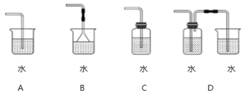

- **A**. A
- **B**. B
- **C**. C
- **D**. D　✅

**答案**：D

**官方解析**

A项：烧杯敞口，有毒气体若未充分溶解会散发到空气中，造成危害，错误；
B项：倒扣漏斗虽然增加了气体与水的接触面，但是烧杯敞口，可能导致未充分溶解的有毒气体散发到空气中，造成危害，错误；
C项：装置封闭，玻璃管中气体无法排出，水只能溶解少量气体，错误；
D项：第一次未溶解气体通入到敞口烧杯内，会进行再次溶解，能使有毒气体充分溶于水，正确。
故正确答案为D。

---

## 第 3 题　qid 2452955 · 逻辑判断

物质的结构决定性质，微粒间的相互作用力越强，熔点越高。一些氧化物的熔点如下表所示：

下列选项中，不能解释氧化物熔点存在差异的是<u>                    </u>。

- **A**. 
分子晶体中的作用力是相对较弱的分子间作用力

- **B**. 
离子晶体中的作用力是相对较强的离子键

- **C**. 
原子晶体中的作用力是相对较弱的共价键
　✅
- **D**. 
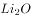中的离子键弱于的

**答案**：C

**官方解析**

A项，分子晶体中的作用力是分子间作用力，不是化学键，作用力较弱，熔沸点较低，故A项可以解释氧化物的熔点差异；

B项，离子晶体中的作用力是离子键，属于化学键，作用力较强，熔沸点较高，故B项可以解释氧化物的熔点差异；

C项，原子晶体中的作用力是共价键，属于化学键，作用力很强，熔沸点一般很高，故C项表述错误，不能解释氧化物的熔点差异；

D项，和是离子晶体，离子晶体中的作用力为离子键，离子键能越大，晶体的熔点越高，因为的离子键弱于，所以的熔点比的熔点低，故D项可以解释氧化物的熔点差异。

故正确答案为C。

---

## 第 4 题　qid 2453069 · 类比推理

医院吸氧的氧气吸入器（图2），其作用原理与图1类似，关于该装置，下列说法错误的是（  ）。

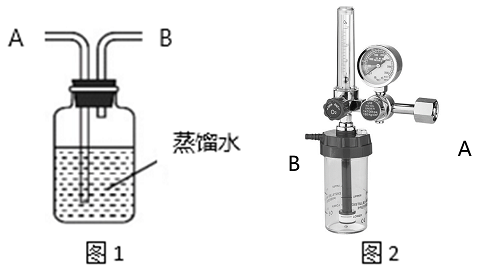

- **A**. 可以用来湿润氧气
- **B**. B导管连接氧气钢瓶　✅
- **C**. 可以用来观察输出氧气的流速
- **D**. 可以用来观察是否有氧气输出

**答案**：B

**官方解析**

A项：氧气从A导管通入，通入水中，再通过B导管排出，可以用来湿润氧气，正确；
B项：若B导管连接氧气钢瓶通入氧气，则会导致瓶内气体气压增大，使水从A导管排出，错误；
C项：氧气不易溶于水，通过水时会看见有气泡生成，故可以通过观察气泡产生的速度判别输出氧气的速度，正确；
D项：氧气不易溶于水，可以通过观察是否有气泡产生，判别是否有氧气输出，正确。
本题为选非题，故正确答案为B。

---

## 第 5 题　qid 2452960 · 逻辑判断

过氧化氢()的沸点比水高，但受热易分解。某试剂厂制得浓度~的过氧化氢溶液，再浓缩成的溶液时，可采用的适宜方法是<u>            </u>。

- **A**. 常压蒸馏
- **B**. 减压蒸馏　✅
- **C**. 加压蒸馏
- **D**. 加生石灰，常压蒸馏

**答案**：B

**官方解析**

过氧化氢的沸点比水高，但受热易分解，浓缩过氧化氢溶液时，应避免加热，常压、加压蒸馏，均需加热，故A项、C项错误。生石灰与水反应会放出大量的热，会使过氧化氢分解，故D项错误。适宜方法应为减压蒸馏，减压可降低水的沸点，使水在较低温度下沸腾，得到浓缩的过氧化氢溶液，B项正确。
故正确答案为B。

---

## 第 6 题　qid 2452961 · 类比推理

“蹦极”是一种极富刺激性的游乐项目，如图所示为一根橡皮绳，一端系住人的腰部，另一端固定在跳台上。当人落至图中A点时，橡皮绳刚好被拉直，当人落至图中B点时，橡皮绳对人的拉力大小与人的重力大小相等，C点是游戏者所能达到的最低点。在游戏者离开跳台到最低点的过程中，不计空气阻力，下列说法正确的是<u>                    </u>。

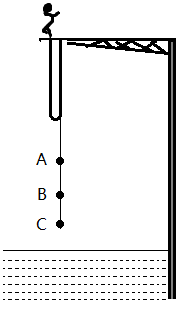

- **A**. 游戏者的动能一直在增加
- **B**. 游戏者到达B点时重力势能最小
- **C**. 游戏者到达B点时动能最大　✅
- **D**. 游戏者在C点时的弹性势能最小

**答案**：C

**官方解析**

在蹦极的过程中，绳子还没有完全拉直时，游戏者的速度越来越快，因此动能逐渐增加；在A点和B点之间，游戏者受重力和绳子向上的拉力作用，由于重力大于拉力，因此合力方向向下，加速度方向向下，速度仍然在增加，动能依然在增加；在B点和C点之间，绳子向上的拉力开始大于重力，合外力方向向上，加速度方向向上，因此速度逐渐减少，直至C点时速度为0，动能逐渐减少。因此A项错误、C项正确。
游戏者在出发点处位置最高，重力势能势能最大，在C点处位置最低，重力势能最小，B项说法错误。
弹性势能是物体由于发生弹性形变而具有的能量，弹性形变越大，弹性势能越大。在C点处，绳子被拉至最长，因此弹性势能最大，D项说法错误。
故正确答案为C。

---

## 第 7 题　qid 2452970 · 类比推理

某国研制出一种用超声波做子弹的枪，当超声波达到一定强度时就能有较强的攻击力，实际要阻挡这一武器的袭击，只要用薄薄的一层            。

- **A**. 半导体
- **B**. 磁性物质
- **C**. 真空带　✅
- **D**. 绝缘物质

**答案**：C

**官方解析**

超声波是频率高于20000赫兹的声波，属于声波的一种。由于声波不能在真空中传播，故只要设置一层真空带，就能阻断超声波子弹的攻击。
故正确答案为C。

---

## 第 8 题　qid 2452967 · 类比推理

如图所示，匀速向东行驶的火车车厢中，光滑水平桌面上正中位置放有一个相对静止的小球。右下图是小球的俯视图，A为初始位置，曲线为小球相对桌面的运动轨迹，可以判断<u>                    </u>。

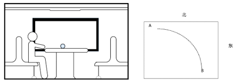

- **A**. 火车向北减速转弯　✅
- **B**. 火车向西减速前进
- **C**. 火车向东加速前进
- **D**. 火车向南减速转弯

**答案**：A

**官方解析**

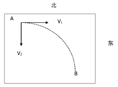

根据题意，小球与桌面相对静止，则小球和桌面同时向东做匀速直线运动，由小球相对桌面的运动轨迹可知，小球相对桌面的运动速度可以分解为正东方向和正南方向的两个分速度，由于桌面是光滑的，对小球没有摩擦力，小球在惯性作用下继续保持匀速向东运动（即火车原有的速度）。以小球作为参照物，火车和桌面的运动速度可分解为正西方向和正北方向。

A项，火车向北减速转弯，火车和桌面相对于小球有正西方向和正北方向的分速度，正确；

B项，火车向西减速前进，火车和桌面相对于小球运动方向为正西，错误；

C项，火车向东加速前进，火车和桌面相对于小球运动方向为正东，错误；

D项，火车向南减速转弯，火车和桌面相对于小球有正西方向和正南方向的分速度，错误。

故正确答案为A。

---

## 第 9 题　qid 2453072 · 类比推理

如图所示，重为G质量分布均匀的梯子斜搁在光滑的竖直墙面上，重为Q的人沿梯子从低端A处开始匀速向上走向顶端B处，整个过程梯子不滑动。则下列说法中正确的是（  ）。

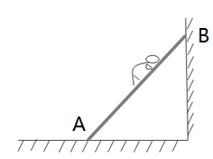

- **A**. 梯子对墙面的压力变大　✅
- **B**. 地面对梯子的支持力变小
- **C**. 梯子对墙面的压力变小
- **D**. 地面对梯子的支持力变大

**答案**：A

**官方解析**

人在上爬的过程中，梯子和人的构成的系统处于平衡状态。对整体进行受力分析，竖直方向上，受到地面提供的竖直向上的支持力，人与梯子提供的竖直向下的重力，处于平衡状态，由于梯子和人的重力不发生改变，所以地面对梯子的支持力不发生改变，即支持力不会变小也不会变大，排除选项B、D。

 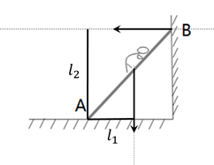

将梯子看成轻质杠杆，A点为支点，将人的重力看成动力，墙对梯子的支持力看成阻力，随着人向上走，重力不变，但动力臂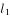变大，而阻力臂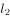不变，根据平衡状态下，，可以推出阻力变大，即墙对梯子的支持力变大，梯子对墙面的压力也变大。

故正确答案为A。

---

## 第 10 题　qid 2453074 · 逻辑判断

如图所示、AB为一根两端封闭的玻璃粗管，其中装满水，水中有一个直径小于粗管直径的乒乓球。当玻璃管以中点O点开始在水平面内顺时针转动时，则（  ）。

- **A**. 乒乓球向A端移动，当转动够快时乒乓球能停留在玻璃管的A端
- **B**. 乒乓球向B端移动，当转动够快时乒乓球能停留在玻璃管的B端
- **C**. 乒乓球向A端移动，当转动够快时乒乓球能停留在玻璃管的中点O处　✅
- **D**. 无论转动多快，乒乓球相对玻璃管停留在原处

**答案**：C

**官方解析**

物体做圆周运动所需的向心力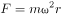 ，其中是物体的质量，是物体运动的角速度，是运动的圆周轨道半径。

玻璃管开始旋转时，水和乒乓球以相同的角速度做圆周运动，由于水质量大于乒乓球，故做圆周运动时所需要的向心力光凭管壁摩擦力不足以提供，故乒乓球附近的水会做离心运动，被“甩”到外侧管底，在管底支持力的作用下，进行圆周运动，与此同时，乒乓球在水的作用下向内侧运动，最终停留在O点。

故正确答案为C。

---

## 第 11 题　qid 2453075 · 逻辑判断

如图所示是日本庭院常见的一种装置——添水。装置原理十分简单，竹筒中间设置支架，上面注水，如果水满竹筒就会倒出来。倒出来后竹筒空了又会抬起来。下列关于该装置表述不正确的是（  ）。

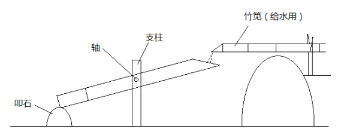

- **A**. 装置的重心会旋转轴往复运动
- **B**. 装置重心超过轴向右一段距离后进入倒水阶段
- **C**. 装置做往复运动的周期和注水速度有关，注水越快，周期越短
- **D**. 装置做往复运动的周期和竹筒容积有关，容积越大，周期越短　✅

**答案**：D

**官方解析**

刚开始注水时，水聚集在竹筒左侧的底部，因此重心靠左，随着竹筒内水量的变多，重心逐渐变高，并且向右移动，水满时，重心在轴右侧一定距离，竹筒将克服摩擦力缓慢做顺时针转动，将水倒出，此时，竹筒变空，重心回到轴左侧，竹筒逆时针抬起。
注水速度越快，整个装置的重心变化越快，往复运动越快，周期越短；竹筒容积越大，注水时，水满所需要的水量就越多，往复运动越慢，周期越长。
本题为选非题，故正确答案为D。

---

## 第 12 题　qid 2453095 · 图形推理

下列选项中，符合所给图形的变化规律的是：

- **A**. A
- **B**. B
- **C**. C　✅
- **D**. D

**答案**：C

**官方解析**

元素组成相同，优先考虑位置规律。内部的小正方形从图一开始沿着外边框四个角，每次逆时针移动一步，因此图四应该移动到左下角位置，排除B项；继续观察，小正方形内部的小元素依次按照顺（逆）时针平移2格，所以图四中小黑点应在最右侧，符合的只有C项。
故正确答案为C。

---

## 第 13 题　qid 2452980 · 图形推理

下列选项中，符合所给图形的变化规律的是<u>        </u>。

- **A**. A
- **B**. B
- **C**. C　✅
- **D**. D

**答案**：C

**官方解析**

元素组成不同，出现多个独立小元素，优先考虑元素种类和数量规律。每幅图都是由正方形和圆两种元素组成，且每幅图正方形的数量比圆的数量多1个，只有C项符合。
故正确答案为C。

---

## 第 14 题　qid 2453078 · 图形推理

下列选项中，符合所给图形的变化规律的是：

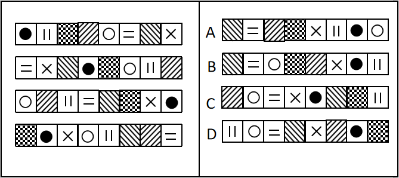

- **A**. A　✅
- **B**. B
- **C**. C
- **D**. D

**答案**：A

**官方解析**

元素组成相同，优先考虑位置规律。观察发现， 题干前一幅图的1变为下一幅图的4，2变为7，3变为5，4变为8，5变为6，6变为1，7变为3，8变为2。只有A项符合。

故正确答案为A。

---

## 第 15 题　qid 2452984 · 图形推理

下列选项中，符合所给图形的变化规律的是<u>        </u>。

- **A**. A
- **B**. B
- **C**. C　✅
- **D**. D

**答案**：C

**官方解析**

元素组成相似，且相同线条重复出现，优先考虑样式规律中的加减同异。第一组图中，图1和图2求同得到图3；第二组图应用此规律，故？处应选择一个图1和图2求同得到的图形。只有C符合。
故正确答案为C。

---

## 第 16 题　qid 2453032 · 图形推理

下列选项中，符合所给图形的变化规律的是<u>      </u>。

- **A**. A　✅
- **B**. B
- **C**. C
- **D**. D

**答案**：A

**官方解析**

元素组成相同，优先考虑位置规律。每个图形都是由4个高低不一的长方形组成的，在图一中，从左到右依次给长方形编号为1、2、3、4，图一到图二1号长方形向右平移三步，图二到图三2号长方形向右平移三步，故图三到？处应该是3号长方形向右平移三步，只有A项符合。

故正确答案为A。 

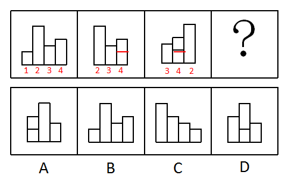

---

## 第 17 题　qid 2453033 · 图形推理

下图给定的平面图折叠后的立体图形是<u>      </u>。

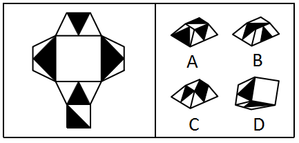

- **A**. A　✅
- **B**. B
- **C**. C
- **D**. D

**答案**：A

**官方解析**

将原展开图标上序号，如下图，逐一进行分析。

A项：选项与题干一致，当选；

B项：选项中的面k在展开图中没有出现，选项与题干不一致，排除；

C项：选项中包括面e和面i，而面e和面i为相对面，不能同时出现，选项与题干不一致，排除；

D项：选项中包括面f和面h，而面f和面h为相对面，不能同时出现，选项与题干不一致，排除。

故正确答案为A。

---

## 第 18 题　qid 2453034 · 图形推理

左图是右图的平面展开图，数字与字母一一对应，与123456可以对应的是<u>      </u>。

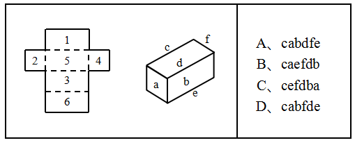

- **A**. A
- **B**. B
- **C**. C
- **D**. D　✅

**答案**：D

**官方解析**

本题考查六面体。
A项：题干展开图中的面5和面6是相对面，而面f和面e不是，排除。
B项：题干展开图中的面1和面3是相对面，而面c和面e不是，排除。
C项：题干展开图中的面1和面3是相对面，而面c和面f不是，排除。
D项：题干展开图中六个面的相对位置关系和立体图形中六个面的相对位置一致，当选。
故正确答案为D。

---

## 第 19 题　qid 2453080 · 图形推理

下列选项中，符合所给图形的变化规律的是<u>      </u>。

- **A**. A　✅
- **B**. B
- **C**. C
- **D**. D

**答案**：A

**官方解析**

元素组成相似，优先考虑样式规律。观察发现，第一组图形中，第一个图形经过顺时针旋转60°后，与第二个图形进行叠加运算可得第三个图形。根据此规律，第二组图形中，先将第一个图形顺时针旋转60°，再与第二个图形进行叠加，可得A项。
故正确答案为A。

---

## 第 20 题　qid 2453036 · 图形推理

下列选项中，符合所给图形的变化规律的是<u>      </u>。

- **A**. A
- **B**. B　✅
- **C**. C
- **D**. D

**答案**：B

**官方解析**

元素组成相同，优先考虑位置规律。第一组图中，图2是由图1左右翻转得来的，图3是由图2上下翻转得来的。第二组图运用此规律，图2是由图1左右翻转得来的，所以？处图形应该是图2上下翻转得来的，只有B项符合此规律。
故正确答案为B。

---

## 第 21 题　qid 2453082 · 图形推理

下列选项中，符合所给图形的变化规律的是：

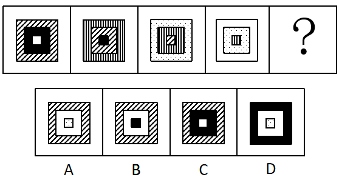

- **A**. A
- **B**. B
- **C**. C
- **D**. D　✅

**答案**：D

**官方解析**

观察题干图形发现，元素组成相似。题干每幅图都由内圈、中间、外圈组成，颜色或图案包括黑色、白色、斜线、竖线、点状。
观察可得，题干正方形内部填充依次是白-黑-斜线-竖线，所以“？”处图形内部为“点状”，排除B、C两项。比较A、D两项，不同之处在于外圈，继续观察外圈正方形的填充分别是斜线-竖线-点状-白色，所以“？”处图形外圈为“黑色”，只有D项符合。
故正确答案为D。

---

## 第 22 题　qid 2453084 · 图形推理

下列选项中，与其他三个图形规律不同的是：

- **A**. A
- **B**. B
- **C**. C
- **D**. D　✅

**答案**：D

**官方解析**

通过观察发现，题干图形均由黑块和白块组成，且色块分布均匀，优先考虑黑白块面积。A项、B项和C项中的黑块和白块面积相同，均占图形总面积的一半，而D项中白块的面积远大于黑块，故只有D项呈现的规律与其他三项不同。
本题为选非题，故正确答案为D。

---

## 第 23 题　qid 2453086 · 图形推理

下列选项中，符合所给图形的变化规律的是：

- **A**. A
- **B**. B
- **C**. C
- **D**. D　✅

**答案**：D

**官方解析**

九宫格优先横行看，第一行图1的内部线条替换成图2的斜线样式后可得到图3，且图3保留了图2该方向的斜线；第二行验证规律可得，图1的内部线条替换成图2的曲线样式后可得到图3，且图3保留了图2竖直方向的曲线，规律验证成立；因此第三行中，图1的内部线条替换成图2的虚线样式，并且要保留图2该方向的虚线，只有D符合。
故正确答案选D。

---

## 第 24 题　qid 2453046 · 逻辑判断

所有真正关心老百姓利益的领导干部，都会受到大家的尊敬；而真正关心老百姓利益的领导干部都特别重视如何解决住房、看病、教育和养老等民生问题。因此，那些不重视如何解决老百姓民生问题的领导干部，都不会受到大家的尊敬。
为保证上述论证成立，必须增加下列      项作为前提。

- **A**. 随着老龄化社会的来临，老百姓面临的看病、养老等问题越来越突出
- **B**. 所有重视如何解决老百姓民生问题的领导干部，都会受到大家的尊敬
- **C**. 住房、看病、教育和养老等民生问题，是事关老百姓利益的最为突出的问题
- **D**. 所有受到大家尊敬的领导干部，都是真正关心老百姓利益的领导干部　✅

**答案**：D

**官方解析**

第一步：找出论点和论据。

论点：不重视民生问题的领导干部不尊敬（根据逆否可以推出：尊敬重视民生问题的领导干部）；

论据：关心老百姓利益的领导干部尊敬；关心老百姓利益的领导干部重视民生问题。

第二步：逐一分析选项。

A项：论点说的是不重视如何解决老百姓民生问题的领导干部，都不会受到大家的尊敬，该项说的是看病、养老等问题越来越突出，话题不一致，无法加强，排除；

B项：简单翻译为重视解决民生问题的领导干部尊敬，将其补充到论据之上，无法得到论点，因此无法加强，排除；

C项：论点说的是不重视如何解决老百姓民生问题的领导干部，都不会受到大家的尊敬，该项说的是民生问题是最为突出的话题，话题不一致，无法加强，排除；

D项：简单翻译为：尊敬关心老百姓利益的领导干部，将其补充到论据，可以得到：尊敬关心老百姓利益的领导干部重视民生问题，因此可以得到论点，可以加强，当选。

故正确答案为D。

---

## 第 25 题　qid 2453056 · 逻辑判断

人因自然而生，人与自然是一种共生关系，对自然的伤害最终会伤及人类自身。因此，只有尊重自然规律，才能有效防止在开发利用自然上走弯路。
根据以上陈述，可以得出下列       项。

- **A**. 如果不尊重自然规律，就不能有效防止在开发利用自然上走弯路　✅
- **B**. 如果尊重自然规律，就能有效防止在开发利用自然上走弯路
- **C**. 因为人与自然是一种共生关系，所以必须尊重自然规律
- **D**. 人因自然而生，所以必须开发利用自然

**答案**：A

**官方解析**

第一步：翻译题干。

有效防止在开发利用自然上走弯路尊重自然规律

第二步：逐一分析选项。

A项：翻译为尊重自然规律有效防止在开发利用自然上走弯路，是对题干的否后，否后必否前，当选；

B项：翻译为尊重自然规律有效防止在开发利用自然上走弯路，是对题干的肯后，但肯后得不到确定性的结论，无法推出，排除；

C项：题干未提及人与自然共生关系与尊重自然规律的联系，无法推出，排除；

D项：题干未提及人因自然而生和开发利用自然关系的联系，无法推出，排除。

故正确答案为A。

---

## 第 26 题　qid 2453058 · 逻辑判断

在最后一次校级职称评定委员会的会议上，委员张教授认为这届委员会是近年来工作最没有影响力的一届。当列席会议的校长询问这一判断的理由时，张教授指出：大多数教师根本叫不出委员会成员的姓名。
张教授的判断如果为真，必须假定下列      项。

- **A**. 普通教师通常对职称评定委员会的工作不感兴趣
- **B**. 只有职称评定委员会成员才有资格评价委员会工作是否具有影响力
- **C**. 教师对职称评定委员会人员组成的熟悉程度是评价其工作是否具有影响力的一个重要指标　✅
- **D**. 在遴选职称评定委员会成员时，候选人往往是那些在教师中拥有较高知名度的教授

**答案**：C

**官方解析**

第一步：找出论点和论据。
论点：这届委员会是近年来工作最没有影响力的一届。
论据：大多数教师根本叫不出委员会成员的姓名。
论点讨论的是这届委员会的影响力，论据讨论的是能否叫出委员会成员姓名。论点论据话题不一致，结合问法，优先考虑搭桥。
第二步：逐一分析选项。
A项：该项讨论的是教师对职称评定委员会工作不感兴趣，与论点这届委员会的影响力无关，话题不一致，无法加强，排除；
B项：该项讨论的是谁有资格评价委员会工作是否具有影响力，与论点这届委员会的影响力无关，话题不一致，无法加强，排除；
C项：教师对职称评定委员会人员组成的熟悉程度，即是否能叫出委员会成员姓名，其是评价委员会工作是否具有影响力的一个重要指标，选项建立了论点与论据的联系，为搭桥项，可以加强，当选；
D项：该项讨论的是遴选职称评定委员会成员的条件，与论点这届委员会的影响力无关，话题不一致，无法加强，排除。
故正确答案为C。

---

## 第 27 题　qid 2453044 · 逻辑判断

亚马逊热带雨林火灾次数与过火面积每年以惊人的比例增加。但是，卫星照片显示，去年火灾次数与过火面积的增加比例明显低于往年。去年，某国政府支出数百万美元用于预防和扑灭亚马逊热带雨林火灾。该国政府宣称，上述卫星数据表明政府预防和扑灭火灾的努力取得了显著效果。
下列      项如果为真，最能削弱该国政府的上述结论。

- **A**. 去年该国用以预防和扑灭亚马逊热带雨林火灾的投入明显低于往年
- **B**. 该国去年出现了异乎寻常的大面积持续降雨　✅
- **C**. 与该国毗邻的其他国家的热带雨林火灾次数与过火面积并未减少
- **D**. 该国用于热带雨林火灾预防与扑灭的费用只占年度财政支出的很小比例

**答案**：B

**官方解析**

第一步：找出论点和论据。
论点：政府预防和扑灭火灾的努力取得了显著效果。
论据：去年火灾次数与过火面积的增加比例明显低于往年。去年，某国政府支出数百万美元用于预防和扑灭亚马逊热带雨林火灾。
论点和论据都在讨论政府预防和扑灭火灾的关系，因此论点论据话题一致，考虑否定论点。
第二步：逐一分析选项。
A项：论点说的是预防和扑灭火灾的努力取得了显著效果，该项说的是去年的投入明显低于往年，投入的高低和是否有效果不是同一话题，话题不一致，无法削弱，排除；
B项：论点说的是政府扑灭火灾的努力取得了效果，该项说的是去年出现了大面积持续降雨，说明亚马逊雨林火灾次数减少的原因是大面积持续降雨，说了亚马逊雨林火灾次数减少的另外一个原因，属于另有他因，可以削弱，当选；
C项：论点说的是亚马逊雨林的火灾，该项说的其他国家的雨林，主体不一致，无法削弱，排除；
D项：论点说的是政府扑灭火灾取得了显著效果，该项说的是投入费用的比例，话题不一致，无法削弱，排除。
故正确答案为B。

---

## 第 28 题　qid 2453040 · 逻辑判断

一些科学家认为，在6500万年前，一颗小行星击中了现在的尤卡坦半岛，因此导致了恐龙的灭绝。这些科学家认为：如此一击抛掷了大量的碎片到大气中，从而阻挡了阳光、冷却了空气。对于食草恐龙来说，如果没有充足的阳光和食物资源，那么它们将会灭亡，并且没有恐龙能够长期在低温中生存。然而，这批科学家同时确信：小行星产生的大多数碎片会在六个月内到达地面，以至于无法让植物消失和让恐龙冻僵。
下列      项如果为真，能为解决上述科学家们的信念和事实之间的明显差异提供支持。

- **A**. 
食草恐龙的灭绝使食肉恐龙失去了食物来源

- **B**. 
恐龙很容易受到由小行星碎片所引发的空气污染的影响，以致于产生致命的呼吸问题
　✅
- **C**. 
碎片聚合成的粉尘能够减少约的阳光，从而使地表温度降低7到10摄氏度

- **D**. 
那颗小行星的直径至少为9.6公里，对于通过撞击和由其引起的海啸来杀死恐龙已经足够大了

**答案**：B

**官方解析**

第一步：找出题干矛盾。
提问方式为：解决科学家们的信念和事实之间的明显差异，即解释科学家的信念和事实之间的矛盾。
科学家认为的即为科学家的信念，信念为：小行星击中了现在的尤卡坦半岛，因此导致了恐龙的灭绝。如此一击抛掷了大量的碎片到大气中，从而阻挡了阳光、冷却了空气。对于食草恐龙来说，如果没有充足的阳光和食物资源，那么它们将会灭亡，并且没有恐龙能够长期在低温中生存。
科学家确信的即为事实，事实为：小行星产生的大多数碎片会在六个月内到达地面，以至于无法让植物消失和让恐龙冻僵。
简单总结：我们需要解释为什么“小行星碎片影响的阳光和食物问题没有让恐龙灭绝，但科学家依然认为是小行星碎片让恐龙灭绝的。”
第二步：逐一分析选项。
A项：该项说食草恐龙的灭绝使食肉恐龙失去食物，但事实是小行星的大多数碎片会在六个月内到达地面，以至于无法让植物消失，所以食草恐龙还是有植物可食用，无法解释信念和事实之间的差异，不能解释题干矛盾，排除；
B项：该项说明恐龙的灭绝是因为小行星产生的碎片引发的空气污染问题，解释了在阳光和食物问题没有让恐龙灭绝后（即事实），小行星产生的碎片是怎样导致恐龙灭绝的（即信念），解释了信念和事实之间的差异，可以解释题干矛盾，保留；
C项：该项说粉尘对地表温度的影响，但不明确地表温度降低7到10摄氏度之后是否对恐龙的生存产生灭绝影响，不能解释题干矛盾，排除；
D项：该项说明恐龙的灭绝是因为撞击和海啸，解释了在阳光和食物问题没有让恐龙灭绝后（即事实），小行星是怎样导致恐龙灭绝的（即信念），解释了信念和事实之间的差异，可以解释题干矛盾，保留；
对比B、D两项，B项解释了“小行星产生的碎片是怎样导致恐龙灭绝”，D项解释了“小行星是怎样导致恐龙灭绝”，题干中的信念既提到了“小行星导致恐龙灭绝”，也大篇幅分析了“小行星产生的碎片导致恐龙灭绝”，题干中的事实只提到了“小行星产生的碎片”的相关信息。故信念和事实差异的重点应是“小行星产生的碎片”到底是如何导致恐龙灭绝，而并非“小行星”是如何导致恐龙灭绝；另外，D项的海啸是局部的，B项的空气污染明显范围更大，更可能导致恐龙灭绝，因此B项解释力度更强。
故正确答案为B。

---

## 第 29 题　qid 2453045 · 逻辑判断

在某旅行社的股东会上，总经理提出：根据目前公司整体规划，我提议欧洲线和北美线两条线路至少要开通一条，但南美线因航线问题不能马上开通。董事长表示反对。
下列      项最能准确表达董事长的意思。

- **A**. 欧洲线、北美线和南美线三条线路都开通
- **B**. 欧洲线、北美线和南美线三条线路都不开通
- **C**. 欧洲线和北美线两条线路至多开通一条，但南美线要马上开通
- **D**. 如果南美线不能马上开通，那么欧洲线和北美线两条线路都不能开通　✅

**答案**：D

**官方解析**

第一步：翻译题干。

①（欧洲线或北美线）且南美线

董事长表示反对，则董事长意思为题干翻译的否命题，则题干可以表示为

②（欧洲线或北美线）或南美线

第二步：逐一分析选项。

A项：翻译为：欧洲线且北美线且南美线，无法推出，排除；

B项：翻译为：欧洲线且北美线且南美线，无法推出，排除；

C项：翻译为：（欧洲线或北美线）且南美线，无法推出，排除；

D项：翻译为：南美线欧洲线且北美线，为②的否一推一，可以推出，当选。

故正确答案为D。

---

## 第 30 题　qid 2453042 · 逻辑判断

中国国庆盛大阅兵过程中，各军兵种方队整齐划一、步调一致，完美展现了中国军人的刚毅与坚强，举世瞩目。这是军人们历经数月艰苦训练的结果。已知，某训练小组共有40余名队员，平均身高1.82米，平均年龄24岁。最终，所有年龄23岁以上且身高超过1.83米的队员都参与了正式阅兵。
根据以上信息，关于该训练小组，可以得出下列      项。

- **A**. 没有23岁以下的队员参加正式阅兵
- **B**. 参加正式阅兵的队员中，23岁以上的队员占多数
- **C**. 所有身高超过1.83米但年龄23岁以下的队员都没有参加正式阅兵
- **D**. 未参加正式阅兵者中不包括年龄23岁以上且身高超过1.83米的队员　✅

**答案**：D

**官方解析**

第一步：翻译题干。

23岁以上且身高超过1.83米参与正式阅兵

第二步：逐一分析选项。

A项：没有23岁以下的队员参加正式阅兵说明所有23岁以下的队员都没有参加阅兵，23岁以下属于对题干翻译的否前，否前不确定，无法推出，排除；

B项：根据题干翻译只知道23岁以上且身高超过1.83的队员都参加了阅兵，但这些人在所有人中的比例未知，无法推出，排除；

C项：翻译为：身高超过1.83米且23岁以下参加阅兵，23岁以下是对题干翻译的否前，否前不确定，无法推出，排除； 

D项：翻译为：23岁以上且身高超过1.83米参加正式阅兵，可以推出，当选。

故正确答案为D。

---

## 第 31 题　qid 2453060 · 逻辑判断

某大学哲学系三年级本科生参加了一次国家英语六级考试。关于考试成绩，四位同学做出了如下猜测：
甲：所有同学都及格了。
乙：小张没有及格。
丙：肯定不会全部同学都及格。
丁：也不会所有同学都不及格。
如果只有一位同学猜错了，则下列                    项为真。

- **A**. 甲猜错了，小张及格了
- **B**. 甲猜错了，小张没有及格　✅
- **C**. 乙猜错了，小张及格了
- **D**. 丙猜错了，小张及格了

**答案**：B

**官方解析**

本题属于真假推理题。
第一步：找出题干矛盾关系。
甲说“所有同学都及格”和丙说“肯定不会全部同学都及格”（即有的同学不会及格）是矛盾关系，必有一真必有一假。
第二步：看其余。
已知只有一句是假话，则乙和丁说的是真话，即小张没有及格，也不会所有同学都不及格（即有的同学会及格），因此甲说的是假话，丙说的是真话。
故正确答案为B。

---

## 第 32 题　qid 2453064 · 类比推理

花园有东西两个区，已知：
（1）玫瑰都种植在东区；
（2）西区是牡丹园，种植的是各色牡丹；
（3）花园中的牡丹有许多名贵品种，但是没有黑色的；
（4）珍稀品种都是玫瑰。
根据以上陈述，关于该花园中的花卉，下列                    项必然为假。

- **A**. 西区牡丹中有珍稀品种　✅
- **B**. 玫瑰没有名贵品种
- **C**. 东区有许多名贵品种
- **D**. 玫瑰有许多珍稀品种

**答案**：A

**官方解析**

第一步：分析题干条件。

（1）玫瑰种植在东区；

（2）西区（牡丹园）种植各色牡丹；

（3）牡丹有许多名贵品种，没有黑色牡丹；

（4）珍稀品种玫瑰。

第二步：根据题干条件进行推理。

A项：根据条件（2）、（4）可知，西区（牡丹园）牡丹，对条件（4）逆否，玫瑰珍稀品种，将二者串联，西区（牡丹园）牡丹珍稀品种，因此，西区牡丹中有珍稀品种必然为假，即A项一定为假，当选；

B项：根据条件（3）可知，牡丹有许多名贵品种，但是玫瑰是否有名贵品种，题干没有提及，因此可能为真，不是必然为假，排除B项；

C项：根据条件（3）可知，牡丹有许多名贵品种，但是东区是否有名贵品种，题干没有提及，因此可能为真，不是必然为假，排除C项；

D项：根据条件（4）可知，珍稀品种玫瑰，有许多玫瑰是珍稀品种，是对箭头后的肯后，肯后不确定，但是可能为真，不是必然为假，排除D项。

故正确答案为A。

---

## 第 33 题　qid 2453049 · 类比推理

一家人准备一起去北欧旅游，各自表达如下愿望：
父亲：若去挪威，则不去丹麦和冰岛；
母亲：若不去冰岛，则去挪威和丹麦；
儿子：若不去挪威，则去瑞典和芬兰。
最终的方案满足了上述每个人的愿望。根据以上陈述，可以得出下列      项。

- **A**. 去瑞典、芬兰和丹麦
- **B**. 去瑞典、芬兰和冰岛　✅
- **C**. 去瑞典、丹麦和冰岛
- **D**. 去芬兰、丹麦和冰岛

**答案**：B

**官方解析**

已知：

（1）挪威丹麦且冰岛

（2）冰岛挪威且丹麦

（3）挪威瑞典且芬兰

因题干都为推出关系，无确定信息，故采用代入法。

A项：代入瑞典、芬兰和丹麦，去丹麦是对条件1的否后，得到否前：不去挪威，这是对条件2的否后，得到否前：去冰岛。但是A项中并没有去冰岛，这与题干矛盾，因此无法推出，排除；

B项：代入瑞典、芬兰和冰岛，去冰岛对条件1进行了否后，得到否前：不去挪威，同时不去挪威又能根据条件3得到瑞典且芬兰，因为代入后符合条件，当选；

C项：代入瑞典、丹麦和冰岛，同B项，只能根据去冰岛得出去了瑞典和芬兰，无法得出是否去丹麦，排除；

D项：代入芬兰、丹麦和冰岛，同B项，只能根据去冰岛得出去了瑞典和芬兰，无法得出是否去丹麦，排除。

故正确答案为B。

---

## 第 34 题　qid 2453067 · 类比推理

在干部选拔中，甲、乙、丙、丁4人脱颖而出。进一步考察，4人中2人拟任正科级，2人拟任副科级。已知：
（1）若甲或乙之一任正科级，则丁任正科级；
（2）若甲或乙之一任副科级，则丙任副科级；
（3）如果丁任正科级，则丙也任正科级。
根据以上信息，则下列                    项可能为真。

- **A**. 甲乙均任正科级　✅
- **B**. 乙丙均任正科级
- **C**. 甲丙均任正科级
- **D**. 乙丁均任正科级

**答案**：A

**官方解析**

第一步：分析题干条件。

（1）要么甲正科，要么乙正科丁正科；

（2）要么甲副科，要么乙副科丙副科；

（3）丁正科丙正科；

（4）甲、乙、丙、丁4人中2人正科，2人副科；

将（1）（3）进行串联得到：（5）要么甲正科，要么乙正科丁正科丙正科。

第二步：根据题干条件进行推理。

提问方式为“可能”，优先考虑代入法。

代入A项：若甲、乙均为正科，根据条件（4）可知，丙、丁均为副科，“丙副科”是对条件（2）的肯后，且“甲、乙均为正科”是对条件（5）的否前，均可能成立，满足题干所有条件，可能为真，当选； 

代入B项：若乙、丙均为正科，根据条件（4）可知，甲、丁均为副科，但“甲副科、乙正科”是对条件（5）的肯前，肯前必肯后，可知丁、丙均为正科，此时正科为3人，前后结论矛盾，不可能为真，排除；

代入C项：若甲、丙均为正科，根据条件（4）可知，乙、丁均为副科，但“甲正科、乙副科”是对条件（5）的肯前，肯前必肯后，可知丁、丙均为正科，此时正科为3人，前后结论矛盾，不可能为真，排除；

代入D项：若乙、丁均为正科，根据条件（4）可知，甲、丙均为副科，但“甲副科、乙正科”是对条件（5）的肯前，肯前必肯后，可知丁、丙均为正科，此时正科为3人，前后结论矛盾，不可能为真，排除。

故正确答案为A。

---

## 第 35 题　qid 2453050 · 类比推理

某三甲医院的医生中，专科医院毕业的医生人数大于非专科医院毕业的医生人数，女医生的人数大于男医生的人数。
如果上述论述是真的，那么      项关于该医院医生的断定也一定是真的。
（1）非专科医院毕业的女医生人数大于专科医院毕业的男医生人数。
（2）专科医院毕业的男医生人数大于非专科医院毕业的男医生人数。
（3）专科医院毕业的女医生人数大于非专科医院毕业的男医生人数。

- **A**. （1）和（2）
- **B**. 只有（2）
- **C**. 只有（3）　✅
- **D**. （2）和（3）

**答案**：C

**官方解析**

已知：

①专科医学院毕业人数非专科医学院毕业人数

②女医生人数男医生人数

（1）非专科女医生人数专科男医生人数，根据题干条件，无从得出二者之间的关系，排除；

（2）专科医学院毕业的男医生人数 非专科医学院毕业的男医生人数，根据题干条件，无法得知男医生中专科与非专科的比例关系，无法推出，排除；

（3）①专科医院毕业医生人数非专科医院毕业医生人数，即专科（男+女）非专科（男+女）；②女医生人数男医生人数，即女（非专科+专科）男（非专科 +专科）。将①和②相加，整理可得：专科医院毕业的女医生人数非专科医院毕业的男医生人数，可以推出。

故正确答案为C。

---
