# 2020年上海市公务员录用考试《行测》题（B类）（网友回忆版）

> 判断推理 · 35 题 · 上海 2020

## 第 1 题　qid 2452945 · 类比推理

从金属利用的历史来看，先是青铜器时代，而后是铁器时代，铝的利用是近百年的事。下列选项中，与金属利用的先后顺序相关度最高的是                    。

- **A**. 地壳中金属的含量
- **B**. 金属冶炼的难易　✅
- **C**. 金属的导电性和延展性
- **D**. 金属制品的用途

**答案**：B

**官方解析**

铜、铁、铝三种金属活动性由强到弱的顺序为：铝铁铜；金属活动性越强，金属的冶炼难易程度越难，冶炼技术要求越高，因而人类早期只能使用较容易冶炼的铜，随后才是铁，最后是铝。

故正确答案为B。

---

## 第 2 题　qid 2452947 · 类比推理

食物过敏是在摄入食物时由于食物中的某些成分引起免疫应答，导致消化系统内或全身性的变态反应。以下食物成分最容易引起过敏的是        。

- **A**. 蛋白质　✅
- **B**. 维生素
- **C**. 纤维素
- **D**. 脂肪

**答案**：A

**官方解析**

当人体免疫系统的防卫功能过强时，对外来物质过度敏感会引起过敏反应。引起人体免疫反应的抗原，大部分是蛋白质。
故正确答案为A。

---

## 第 3 题　qid 2452951 · 类比推理

变色镜片含有卤化银（氯化银、溴化银）微晶，当受到紫外线或短波可见光等激活光照射时，卤素离子放出电子，该电子被银离子捕获，发生下列反应：

无色的卤化银分解为不透明的银原子和透明的卤素原子，银原子吸收光线使镜片透光率降低。由于变色镜片中的卤素不会逸失，所以能发生可逆反应。下列分析错误的是<u>                    </u>。

- **A**. 强太阳光使平衡右移
- **B**. CuO在变色中起催化作用
- **C**. 强太阳光下镜片中仍有AgBr
- **D**. 室内日光灯下镜片中无Ag　✅

**答案**：D

**官方解析**

当受到紫外线或短波可见光照射时，卤化银分解生成不透明的银原子，镜片透光率降低，故而强太阳光下照射会促使卤化银分解，使平衡右移，A项正确；根据反应方程式可知，作为催化剂，在反应中起催化作用，B项正确；可逆反应中反应物不能全部转化为生成物，所以强太阳光下镜片中仍有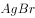，室内日光灯下镜片中也仍有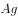 ，C项正确、D项错误。

本题为选非题，故正确答案为D。

---

## 第 4 题　qid 2452955 · 逻辑判断

物质的结构决定性质，微粒间的相互作用力越强，熔点越高。一些氧化物的熔点如下表所示：

下列选项中，不能解释氧化物熔点存在差异的是<u>                    </u>。

- **A**. 
分子晶体中的作用力是相对较弱的分子间作用力

- **B**. 
离子晶体中的作用力是相对较强的离子键

- **C**. 
原子晶体中的作用力是相对较弱的共价键
　✅
- **D**. 
中的离子键弱于的

**答案**：C

**官方解析**

A项，分子晶体中的作用力是分子间作用力，不是化学键，作用力较弱，熔沸点较低，故A项可以解释氧化物的熔点差异；

B项，离子晶体中的作用力是离子键，属于化学键，作用力较强，熔沸点较高，故B项可以解释氧化物的熔点差异；

C项，原子晶体中的作用力是共价键，属于化学键，作用力很强，熔沸点一般很高，故C项表述错误，不能解释氧化物的熔点差异；

D项，和是离子晶体，离子晶体中的作用力为离子键，离子键能越大，晶体的熔点越高，因为的离子键弱于，所以的熔点比的熔点低，故D项可以解释氧化物的熔点差异。

故正确答案为C。

---

## 第 5 题　qid 2452960 · 逻辑判断

过氧化氢()的沸点比水高，但受热易分解。某试剂厂制得浓度~的过氧化氢溶液，再浓缩成的溶液时，可采用的适宜方法是<u>            </u>。

- **A**. 常压蒸馏
- **B**. 减压蒸馏　✅
- **C**. 加压蒸馏
- **D**. 加生石灰，常压蒸馏

**答案**：B

**官方解析**

过氧化氢的沸点比水高，但受热易分解，浓缩过氧化氢溶液时，应避免加热，常压、加压蒸馏，均需加热，故A项、C项错误。生石灰与水反应会放出大量的热，会使过氧化氢分解，故D项错误。适宜方法应为减压蒸馏，减压可降低水的沸点，使水在较低温度下沸腾，得到浓缩的过氧化氢溶液，B项正确。
故正确答案为B。

---

## 第 6 题　qid 2452961 · 类比推理

“蹦极”是一种极富刺激性的游乐项目，如图所示为一根橡皮绳，一端系住人的腰部，另一端固定在跳台上。当人落至图中A点时，橡皮绳刚好被拉直，当人落至图中B点时，橡皮绳对人的拉力大小与人的重力大小相等，C点是游戏者所能达到的最低点。在游戏者离开跳台到最低点的过程中，不计空气阻力，下列说法正确的是<u>                    </u>。

- **A**. 游戏者的动能一直在增加
- **B**. 游戏者到达B点时重力势能最小
- **C**. 游戏者到达B点时动能最大　✅
- **D**. 游戏者在C点时的弹性势能最小

**答案**：C

**官方解析**

在蹦极的过程中，绳子还没有完全拉直时，游戏者的速度越来越快，因此动能逐渐增加；在A点和B点之间，游戏者受重力和绳子向上的拉力作用，由于重力大于拉力，因此合力方向向下，加速度方向向下，速度仍然在增加，动能依然在增加；在B点和C点之间，绳子向上的拉力开始大于重力，合外力方向向上，加速度方向向上，因此速度逐渐减少，直至C点时速度为0，动能逐渐减少。因此A项错误、C项正确。
游戏者在出发点处位置最高，重力势能势能最大，在C点处位置最低，重力势能最小，B项说法错误。
弹性势能是物体由于发生弹性形变而具有的能量，弹性形变越大，弹性势能越大。在C点处，绳子被拉至最长，因此弹性势能最大，D项说法错误。
故正确答案为C。

---

## 第 7 题　qid 2452964 · 逻辑判断

下图为远距离输电线路示意图，若发电机的输出电压不变，下列叙述中正确的是<u>                    </u>。

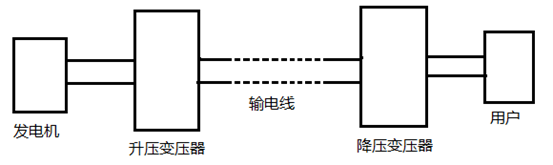

- **A**. 当用户用电器的总电阻减少时，输电线上损失的功率增大　✅
- **B**. 升压变压器的输出电压等于降压变压器输入电压
- **C**. 输电线中的电流只由升压变压器原、副线圈的匝数比决定
- **D**. 升压变压器的原线圈中的电流与用户电器设备消耗的功率无关

**答案**：A

**官方解析**

远距离输电时，输电线也存在一定的电阻。
A项，当用户用电器的总电阻减小时，由于降压变压器输出的电压不变，导致用户总功率增加，升压变压器和降压变压器在电压不变的情况下提供功率增加，输电线中电流增大，因此输电线上的损失功率增大，正确；
B项，由于远距离输电时输电线上存在一定电阻，故而输电线上分去一部分电压，因此升压变压器的输出电压大于降压变压器的输入电压，错误；
C项，输电线上的电流大小由用户功率大小决定，变压器两侧电流的比例关系由线圈匝数比反映，错误；
D项，当用户用电设备消耗功率变化时，降压变压器输出功率相应变化，升压变压器的输出功率也将发生变化，由于发电机的输出电压（即升压变压器的原线圈电压）不变，那么升压变压器的原线圈中的电流将发生变化，错误。
故正确答案为A。

---

## 第 8 题　qid 2452967 · 类比推理

如图所示，匀速向东行驶的火车车厢中，光滑水平桌面上正中位置放有一个相对静止的小球。右下图是小球的俯视图，A为初始位置，曲线为小球相对桌面的运动轨迹，可以判断<u>                    </u>。

- **A**. 火车向北减速转弯　✅
- **B**. 火车向西减速前进
- **C**. 火车向东加速前进
- **D**. 火车向南减速转弯

**答案**：A

**官方解析**

根据题意，小球与桌面相对静止，则小球和桌面同时向东做匀速直线运动，由小球相对桌面的运动轨迹可知，小球相对桌面的运动速度可以分解为正东方向和正南方向的两个分速度，由于桌面是光滑的，对小球没有摩擦力，小球在惯性作用下继续保持匀速向东运动（即火车原有的速度）。以小球作为参照物，火车和桌面的运动速度可分解为正西方向和正北方向。

A项，火车向北减速转弯，火车和桌面相对于小球有正西方向和正北方向的分速度，正确；

B项，火车向西减速前进，火车和桌面相对于小球运动方向为正西，错误；

C项，火车向东加速前进，火车和桌面相对于小球运动方向为正东，错误；

D项，火车向南减速转弯，火车和桌面相对于小球有正西方向和正南方向的分速度，错误。

故正确答案为A。

---

## 第 9 题　qid 2452969 · 类比推理

质量分别为3m和m的两颗恒星A和B组成双星系统，仅在相互之间万有引力的作用下，以两星连线上的某点为圆心，在同一平面内做角速度相同的匀速圆周运动。已知向心力大小与物体质量、轨道半径、角速度平方成正比。下列说法正确的是<u>                    </u>。

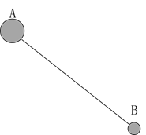

- **A**. 两恒星的向心力大小相等　✅
- **B**. 两恒星的轨道半径相等
- **C**. 两恒星的线速度相等
- **D**. 两恒星的周期不等

**答案**：A

**官方解析**

根据题意，两颗恒星分别仅受到对方的万有引力作用，这对万有引力是一对作用力和反作用力，力的大小相等，方向相反。

A项，两颗恒星的向心力就是由该万有引力提供，因此两颗恒星的向心力大小相等，正确；

B项，根据公式，，两恒星的向心力大小相等，角速度相等，而质量不相等，所以轨道半径必然不相等，错误；

C项，两恒星角速度相等、轨道半径r不相等，由线速度公式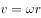，可知线速度不相等，错误；

D项，匀速圆周运动中，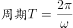，角速度相等，周期相等，错误。

故正确答案为A。

---

## 第 10 题　qid 2452970 · 类比推理

某国研制出一种用超声波做子弹的枪，当超声波达到一定强度时就能有较强的攻击力，实际要阻挡这一武器的袭击，只要用薄薄的一层            。

- **A**. 半导体
- **B**. 磁性物质
- **C**. 真空带　✅
- **D**. 绝缘物质

**答案**：C

**官方解析**

超声波是频率高于20000赫兹的声波，属于声波的一种。由于声波不能在真空中传播，故只要设置一层真空带，就能阻断超声波子弹的攻击。
故正确答案为C。

---

## 第 11 题　qid 2452976 · 逻辑判断

已知一种液体的密度随深度而增大，它的变化规律是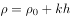，式中、是常数，表示深度。设深度足够，有一个密度为的实心小球投入此液体中，且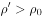，则小球的运动过程表述正确的是<u>                    </u>。(本题只考虑小球受到重力和浮力两个力)

- **A**. 小球会经历若干次加速和匀速过程，最后沉底
- **B**. 小球一直加速，最后沉底
- **C**. 小球会经历若干次匀速和减速过程，最后悬浮在液体中某处
- **D**. 小球会经历若干次加速和减速过程，最后悬浮在液体中某处　✅

**答案**：D

**官方解析**

小球的重力为，小球投入液体中所受浮力为，根据，得到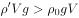，即小球的重力大于浮力，故小球投入液体中，做向下的加速运动。根据，可知随着小球向下运动，不断增大， 也不断增大，故小球所受浮力增大。

当浮力大于重力时，小球受合力方向向上，与运动方向相反，开始做减速运动，直至速度减少到0。此时小球在向上合力作用下，开始做向上的加速运动，小球所受浮力开始减少。当浮力小于重力时，小球受合力方向向下，与运动方向相反，开始做减速运动，直至速度减少到0，小球又在向下合力作用下，开始向下做加速运动。

故小球会经历若干次加速和减速过程，排除选项B、C。由于深度足够，即必然存在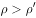，所以小球不会沉底，最终一定会悬浮在液体中某处，故选项A错误，选项D正确。

故正确答案为D。

---

## 第 12 题　qid 2452978 · 图形推理

下列选项中，符合所给图形的变化规律的是<u>        </u>。

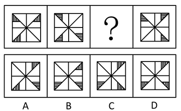

- **A**. A
- **B**. B
- **C**. C
- **D**. D　✅

**答案**：D

**官方解析**

元素组成相同，优先考虑位置规律。从图一到图二，图形整体逆时针旋转90°，因此问号处图形应该是图二逆时针旋转90°所得，只有D项符合。
故正确答案为D。

---

## 第 13 题　qid 2452980 · 图形推理

下列选项中，符合所给图形的变化规律的是<u>        </u>。

- **A**. A
- **B**. B
- **C**. C　✅
- **D**. D

**答案**：C

**官方解析**

元素组成不同，出现多个独立小元素，优先考虑元素种类和数量规律。每幅图都是由正方形和圆两种元素组成，且每幅图正方形的数量比圆的数量多1个，只有C项符合。
故正确答案为C。

---

## 第 14 题　qid 2452982 · 图形推理

下列选项中，符合所给图形的变化规律的是<u>        </u>。

- **A**. A
- **B**. B
- **C**. C
- **D**. D　✅

**答案**：D

**官方解析**

元素组成相同，优先考虑位置规律。观察发现，每个方块均向右移动4格，只有D项符合规律。
故正确答案为D。

---

## 第 15 题　qid 2452984 · 图形推理

下列选项中，符合所给图形的变化规律的是<u>        </u>。

- **A**. A
- **B**. B
- **C**. C　✅
- **D**. D

**答案**：C

**官方解析**

元素组成相似，且相同线条重复出现，优先考虑样式规律中的加减同异。第一组图中，图1和图2求同得到图3；第二组图应用此规律，故？处应选择一个图1和图2求同得到的图形。只有C符合。
故正确答案为C。

---

## 第 16 题　qid 2453032 · 图形推理

下列选项中，符合所给图形的变化规律的是<u>      </u>。

- **A**. A　✅
- **B**. B
- **C**. C
- **D**. D

**答案**：A

**官方解析**

元素组成相同，优先考虑位置规律。每个图形都是由4个高低不一的长方形组成的，在图一中，从左到右依次给长方形编号为1、2、3、4，图一到图二1号长方形向右平移三步，图二到图三2号长方形向右平移三步，故图三到？处应该是3号长方形向右平移三步，只有A项符合。

故正确答案为A。 

---

## 第 17 题　qid 2453033 · 图形推理

下图给定的平面图折叠后的立体图形是<u>      </u>。

- **A**. A　✅
- **B**. B
- **C**. C
- **D**. D

**答案**：A

**官方解析**

将原展开图标上序号，如下图，逐一进行分析。

A项：选项与题干一致，当选；

B项：选项中的面k在展开图中没有出现，选项与题干不一致，排除；

C项：选项中包括面e和面i，而面e和面i为相对面，不能同时出现，选项与题干不一致，排除；

D项：选项中包括面f和面h，而面f和面h为相对面，不能同时出现，选项与题干不一致，排除。

故正确答案为A。

---

## 第 18 题　qid 2453034 · 图形推理

左图是右图的平面展开图，数字与字母一一对应，与123456可以对应的是<u>      </u>。

- **A**. A
- **B**. B
- **C**. C
- **D**. D　✅

**答案**：D

**官方解析**

本题考查六面体。
A项：题干展开图中的面5和面6是相对面，而面f和面e不是，排除。
B项：题干展开图中的面1和面3是相对面，而面c和面e不是，排除。
C项：题干展开图中的面1和面3是相对面，而面c和面f不是，排除。
D项：题干展开图中六个面的相对位置关系和立体图形中六个面的相对位置一致，当选。
故正确答案为D。

---

## 第 19 题　qid 2453035 · 图形推理

下列选项中，符合所给图形的变化规律的是<u>      </u>。

- **A**. A
- **B**. B
- **C**. C　✅
- **D**. D

**答案**：C

**官方解析**

元素组成相似，优先考虑样式规律。第一组图中，图一顺时针移动两格，再与图二叠加，等于图三；第二组图形运用此规律，图一顺时针移动两格，再与图二叠加，对应C项。
故正确答案为C。

---

## 第 20 题　qid 2453036 · 图形推理

下列选项中，符合所给图形的变化规律的是<u>      </u>。

- **A**. A
- **B**. B　✅
- **C**. C
- **D**. D

**答案**：B

**官方解析**

元素组成相同，优先考虑位置规律。第一组图中，图2是由图1左右翻转得来的，图3是由图2上下翻转得来的。第二组图运用此规律，图2是由图1左右翻转得来的，所以？处图形应该是图2上下翻转得来的，只有B项符合此规律。
故正确答案为B。

---

## 第 21 题　qid 2453037 · 图形推理

下列选项中，符合所给图形的变化规律的是<u>      </u>。

- **A**. A
- **B**. B
- **C**. C　✅
- **D**. D

**答案**：C

**官方解析**

元素组成相似，优先考虑样式规律。相同元素重复出现，考虑形状的遍历，九宫格优先横行看，第一行每个图形分为三层，每层均是三角形、圆、正方形遍历，第二行验证规律成立，第三行？处应补最内圈为横着的椭圆，中间为竖着的椭圆，外圈为正方形的图形，只有C项符合。
故正确答案为C。

---

## 第 22 题　qid 2453038 · 图形推理

下列选项中，与其他三个图形规律不同的是<u>      </u>。

- **A**. A
- **B**. B
- **C**. C
- **D**. D　✅

**答案**：D

**官方解析**

解法一：观察题干图形，A、B、C项均可由三角形沿着两侧出头的直线翻转后得到，如下图所示：

因此只有D项与其他选项规律不同。

解法二：若将题干的出头三角形看作基础图形，可以发现A、B、C项均有该基础图形，只有D项没有，与其他三个图形规律不同的是D项。

解法三：元素组成不同，属性无明显规律，考虑数量规律。图形线条交叉明显，优先考虑交点数，分别是7、9、6、9，单独看无规律；图形出头端点也很明显，可考虑出头端点数，分别是3、5、2、4，单独看也无规律，可考虑做运算，ABC三项交点数与端点数之差均为4，D项交点数与端点数之差为5，与其他三个图形规律不同的是D项。

故正确答案为D。

---

## 第 23 题　qid 2453039 · 图形推理

下列选项中，符合所给图形的变化规律的是<u>      </u>。

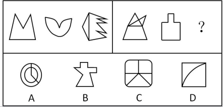

- **A**. A
- **B**. B
- **C**. C　✅
- **D**. D

**答案**：C

**官方解析**

元素组成不同，且无明显属性规律，优先考虑数量规律。出现图形被切割出封闭白色区域，优先考虑数面数量，第一组中面数量依次为1、1、2，图1与图2的面的数量相加等于图3，第二组中面数量依次为4、1、？，？处应选择有5个面的图形，只有C项符合。
故正确答案为C。

---

## 第 24 题　qid 2453040 · 逻辑判断

一些科学家认为，在6500万年前，一颗小行星击中了现在的尤卡坦半岛，因此导致了恐龙的灭绝。这些科学家认为：如此一击抛掷了大量的碎片到大气中，从而阻挡了阳光、冷却了空气。对于食草恐龙来说，如果没有充足的阳光和食物资源，那么它们将会灭亡，并且没有恐龙能够长期在低温中生存。然而，这批科学家同时确信：小行星产生的大多数碎片会在六个月内到达地面，以至于无法让植物消失和让恐龙冻僵。
下列      项如果为真，能为解决上述科学家们的信念和事实之间的明显差异提供支持。

- **A**. 
食草恐龙的灭绝使食肉恐龙失去了食物来源

- **B**. 
恐龙很容易受到由小行星碎片所引发的空气污染的影响，以致于产生致命的呼吸问题
　✅
- **C**. 
碎片聚合成的粉尘能够减少约的阳光，从而使地表温度降低7到10摄氏度

- **D**. 
那颗小行星的直径至少为9.6公里，对于通过撞击和由其引起的海啸来杀死恐龙已经足够大了

**答案**：B

**官方解析**

第一步：找出题干矛盾。
提问方式为：解决科学家们的信念和事实之间的明显差异，即解释科学家的信念和事实之间的矛盾。
科学家认为的即为科学家的信念，信念为：小行星击中了现在的尤卡坦半岛，因此导致了恐龙的灭绝。如此一击抛掷了大量的碎片到大气中，从而阻挡了阳光、冷却了空气。对于食草恐龙来说，如果没有充足的阳光和食物资源，那么它们将会灭亡，并且没有恐龙能够长期在低温中生存。
科学家确信的即为事实，事实为：小行星产生的大多数碎片会在六个月内到达地面，以至于无法让植物消失和让恐龙冻僵。
简单总结：我们需要解释为什么“小行星碎片影响的阳光和食物问题没有让恐龙灭绝，但科学家依然认为是小行星碎片让恐龙灭绝的。”
第二步：逐一分析选项。
A项：该项说食草恐龙的灭绝使食肉恐龙失去食物，但事实是小行星的大多数碎片会在六个月内到达地面，以至于无法让植物消失，所以食草恐龙还是有植物可食用，无法解释信念和事实之间的差异，不能解释题干矛盾，排除；
B项：该项说明恐龙的灭绝是因为小行星产生的碎片引发的空气污染问题，解释了在阳光和食物问题没有让恐龙灭绝后（即事实），小行星产生的碎片是怎样导致恐龙灭绝的（即信念），解释了信念和事实之间的差异，可以解释题干矛盾，保留；
C项：该项说粉尘对地表温度的影响，但不明确地表温度降低7到10摄氏度之后是否对恐龙的生存产生灭绝影响，不能解释题干矛盾，排除；
D项：该项说明恐龙的灭绝是因为撞击和海啸，解释了在阳光和食物问题没有让恐龙灭绝后（即事实），小行星是怎样导致恐龙灭绝的（即信念），解释了信念和事实之间的差异，可以解释题干矛盾，保留；
对比B、D两项，B项解释了“小行星产生的碎片是怎样导致恐龙灭绝”，D项解释了“小行星是怎样导致恐龙灭绝”，题干中的信念既提到了“小行星导致恐龙灭绝”，也大篇幅分析了“小行星产生的碎片导致恐龙灭绝”，题干中的事实只提到了“小行星产生的碎片”的相关信息。故信念和事实差异的重点应是“小行星产生的碎片”到底是如何导致恐龙灭绝，而并非“小行星”是如何导致恐龙灭绝；另外，D项的海啸是局部的，B项的空气污染明显范围更大，更可能导致恐龙灭绝，因此B项解释力度更强。
故正确答案为B。

---

## 第 25 题　qid 2453041 · 逻辑判断

经历了若干年的沉淀，甲国已经在人才、数据、基础设施和政策层面做了较多储备，为人工智能的发展提供了丰沃的土壤。许多国际知名的人工智能专家和企业加盟甲国。最近几年，各种区域性的人工智能论坛和学术会议多次在甲国举行。这次世界人工智能大会在甲国召开，充分证明了甲国在世界人工智能领域的号召力和凝聚力。
下列      项最可能是上述论述所假设的前提。

- **A**. 甲国有足够的人力和财力，能够保证世界人工智能大会的顺利召开
- **B**. 甲国已经出现了许多世界领先的人工智能研究团队和研究机构，并吸引了国际上众多的优秀人才到甲国来进行人工智能基础理论研究
- **C**. 世界人工智能大会影响巨大、关注度高，只有在世界人工智能领域具备足够号召力和凝聚力的国家才能举办　✅
- **D**. 人工智能将给社会带来巨大变化，并有力推动新经济的发展，成为社会变革和创新驱动的新引擎

**答案**：C

**官方解析**

第一步：找出论点和论据。
论点：甲国在世界人工智能领域具备号召力和凝聚力。
论据：世界人工智能大会在甲国召开。
论据讨论的是“甲国”和“召开世界人工智能大会”之间的关系，论点讨论的是“甲国”和“在世界人工智能领域具备号召力和凝聚力”之间的关系，二者话题不一致，且提问方式为“前提”，加强优先考虑搭桥，即建立“召开世界人工智能大会”和“在世界人工智能领域具备号召力和凝聚力”之间的联系。
第二步：逐一分析选项。
A项：该项指出甲国的人力和财力足以顺利举办世界人工智能大会，但不明确甲国在世界人工智能领域是否具备号召力和凝聚力，为不明确项，无法加强，排除；
B项：该项指出甲国自身研究机构的先进水平和对人才的吸引程度，讨论的是甲国自身的能力，但不明确甲国在世界人工智能领域是否具备号召力和凝聚力，为不明确项，无法加强，排除；
C项：该项可翻译为“举办世界人工智能大会→在世界人工智能领域具备足够号召力和凝聚力”，建立了论据和论点之间的联系，为搭桥项，可以加强，当选；
D项：该项指出人工智能的积极作用，与论点讨论的甲国及其在世界人工智能领域的号召力和凝聚力无关，为无关项，无法加强，排除。
故正确答案为C。

---

## 第 26 题　qid 2453042 · 逻辑判断

中国国庆盛大阅兵过程中，各军兵种方队整齐划一、步调一致，完美展现了中国军人的刚毅与坚强，举世瞩目。这是军人们历经数月艰苦训练的结果。已知，某训练小组共有40余名队员，平均身高1.82米，平均年龄24岁。最终，所有年龄23岁以上且身高超过1.83米的队员都参与了正式阅兵。
根据以上信息，关于该训练小组，可以得出下列      项。

- **A**. 没有23岁以下的队员参加正式阅兵
- **B**. 参加正式阅兵的队员中，23岁以上的队员占多数
- **C**. 所有身高超过1.83米但年龄23岁以下的队员都没有参加正式阅兵
- **D**. 未参加正式阅兵者中不包括年龄23岁以上且身高超过1.83米的队员　✅

**答案**：D

**官方解析**

第一步：翻译题干。

23岁以上且身高超过1.83米参与正式阅兵

第二步：逐一分析选项。

A项：没有23岁以下的队员参加正式阅兵说明所有23岁以下的队员都没有参加阅兵，23岁以下属于对题干翻译的否前，否前不确定，无法推出，排除；

B项：根据题干翻译只知道23岁以上且身高超过1.83的队员都参加了阅兵，但这些人在所有人中的比例未知，无法推出，排除；

C项：翻译为：身高超过1.83米且23岁以下参加阅兵，23岁以下是对题干翻译的否前，否前不确定，无法推出，排除； 

D项：翻译为：23岁以上且身高超过1.83米参加正式阅兵，可以推出，当选。

故正确答案为D。

---

## 第 27 题　qid 2453043 · 图形推理

保护生态环境必须依靠制度、依靠法治。只有实行最严格的制度、最严密的法治，才能为生态文明建设提供可靠保障。在这方面，最重要的是要完善经济社会发展考核评价体系，把资源消耗、环境损害、生态效益等体现生态文明建设状况的指标纳入经济社会发展评价体系，建立体现生态文明要求的目标体系、考核办法、奖惩机制，使之成为推进生态文明建设的重要导向和约束。
根据以上陈述，最有可能得出下列      项。

- **A**. 如果不实行最严密的法治，就不能为生态文明建设提供可靠保障　✅
- **B**. 只有把体现生态文明建设状况的指标纳入其中，才能完善经济社会发展考核评价体系
- **C**. 只要实行最严格的制度，就可以为生态文明建设提供可靠保障
- **D**. 如果考核评价体系没有体现生态文明建设状况的指标，就不能发挥其重要的导向作用

**答案**：A

**官方解析**

第一步：翻译题干。

①保护生态环境依靠制度 且 依靠法治；

②为生态文明建设提供可靠保障实行最严格的制度 且 最严密的法治；

第二步：逐一分析选项。

A项：翻译为：为生态文明建设提供可靠保障实行最严密的法治，是对②的肯前，肯前必肯后，可以推出，当选；

B项：翻译为：完善经济社会发展考核评价体系把体现生态文明建设状况的指标纳入其中，本句翻译在题干翻译中未涉及，无中生有，无法推出，排除；

C项：翻译为：实行最严格的制度为生态文明建设提供可靠保障，是肯定②后面的一部分，无法推出确定性结论，无法推出，排除；

D项：翻译为：发挥考核评价体系的导向作用考核评价体系有体现生态文明建设状况的指标，本句翻译在题干翻译中未涉及，无中生有，无法推出，排除。

故正确答案为A。

---

## 第 28 题　qid 2453044 · 逻辑判断

亚马逊热带雨林火灾次数与过火面积每年以惊人的比例增加。但是，卫星照片显示，去年火灾次数与过火面积的增加比例明显低于往年。去年，某国政府支出数百万美元用于预防和扑灭亚马逊热带雨林火灾。该国政府宣称，上述卫星数据表明政府预防和扑灭火灾的努力取得了显著效果。
下列      项如果为真，最能削弱该国政府的上述结论。

- **A**. 去年该国用以预防和扑灭亚马逊热带雨林火灾的投入明显低于往年
- **B**. 该国去年出现了异乎寻常的大面积持续降雨　✅
- **C**. 与该国毗邻的其他国家的热带雨林火灾次数与过火面积并未减少
- **D**. 该国用于热带雨林火灾预防与扑灭的费用只占年度财政支出的很小比例

**答案**：B

**官方解析**

第一步：找出论点和论据。
论点：政府预防和扑灭火灾的努力取得了显著效果。
论据：去年火灾次数与过火面积的增加比例明显低于往年。去年，某国政府支出数百万美元用于预防和扑灭亚马逊热带雨林火灾。
论点和论据都在讨论政府预防和扑灭火灾的关系，因此论点论据话题一致，考虑否定论点。
第二步：逐一分析选项。
A项：论点说的是预防和扑灭火灾的努力取得了显著效果，该项说的是去年的投入明显低于往年，投入的高低和是否有效果不是同一话题，话题不一致，无法削弱，排除；
B项：论点说的是政府扑灭火灾的努力取得了效果，该项说的是去年出现了大面积持续降雨，说明亚马逊雨林火灾次数减少的原因是大面积持续降雨，说了亚马逊雨林火灾次数减少的另外一个原因，属于另有他因，可以削弱，当选；
C项：论点说的是亚马逊雨林的火灾，该项说的其他国家的雨林，主体不一致，无法削弱，排除；
D项：论点说的是政府扑灭火灾取得了显著效果，该项说的是投入费用的比例，话题不一致，无法削弱，排除。
故正确答案为B。

---

## 第 29 题　qid 2453045 · 逻辑判断

在某旅行社的股东会上，总经理提出：根据目前公司整体规划，我提议欧洲线和北美线两条线路至少要开通一条，但南美线因航线问题不能马上开通。董事长表示反对。
下列      项最能准确表达董事长的意思。

- **A**. 欧洲线、北美线和南美线三条线路都开通
- **B**. 欧洲线、北美线和南美线三条线路都不开通
- **C**. 欧洲线和北美线两条线路至多开通一条，但南美线要马上开通
- **D**. 如果南美线不能马上开通，那么欧洲线和北美线两条线路都不能开通　✅

**答案**：D

**官方解析**

第一步：翻译题干。

①（欧洲线或北美线）且南美线

董事长表示反对，则董事长意思为题干翻译的否命题，则题干可以表示为

②（欧洲线或北美线）或南美线

第二步：逐一分析选项。

A项：翻译为：欧洲线且北美线且南美线，无法推出，排除；

B项：翻译为：欧洲线且北美线且南美线，无法推出，排除；

C项：翻译为：（欧洲线或北美线）且南美线，无法推出，排除；

D项：翻译为：南美线欧洲线且北美线，为②的否一推一，可以推出，当选。

故正确答案为D。

---

## 第 30 题　qid 2453046 · 逻辑判断

所有真正关心老百姓利益的领导干部，都会受到大家的尊敬；而真正关心老百姓利益的领导干部都特别重视如何解决住房、看病、教育和养老等民生问题。因此，那些不重视如何解决老百姓民生问题的领导干部，都不会受到大家的尊敬。
为保证上述论证成立，必须增加下列      项作为前提。

- **A**. 随着老龄化社会的来临，老百姓面临的看病、养老等问题越来越突出
- **B**. 所有重视如何解决老百姓民生问题的领导干部，都会受到大家的尊敬
- **C**. 住房、看病、教育和养老等民生问题，是事关老百姓利益的最为突出的问题
- **D**. 所有受到大家尊敬的领导干部，都是真正关心老百姓利益的领导干部　✅

**答案**：D

**官方解析**

第一步：找出论点和论据。

论点：不重视民生问题的领导干部不尊敬（根据逆否可以推出：尊敬重视民生问题的领导干部）；

论据：关心老百姓利益的领导干部尊敬；关心老百姓利益的领导干部重视民生问题。

第二步：逐一分析选项。

A项：论点说的是不重视如何解决老百姓民生问题的领导干部，都不会受到大家的尊敬，该项说的是看病、养老等问题越来越突出，话题不一致，无法加强，排除；

B项：简单翻译为重视解决民生问题的领导干部尊敬，将其补充到论据之上，无法得到论点，因此无法加强，排除；

C项：论点说的是不重视如何解决老百姓民生问题的领导干部，都不会受到大家的尊敬，该项说的是民生问题是最为突出的话题，话题不一致，无法加强，排除；

D项：简单翻译为：尊敬关心老百姓利益的领导干部，将其补充到论据，可以得到：尊敬关心老百姓利益的领导干部重视民生问题，因此可以得到论点，可以加强，当选。

故正确答案为D。

---

## 第 31 题　qid 2453047 · 逻辑判断

经过全力检测和排查，省重大动物疫情监测中心的专家确定了如下事实：
（1）如果S村和Q乡出现了非洲猪瘟疫情，则X镇未出现；
（2）X镇出现了非洲猪瘟疫情，而且有关W村的疫情监测报告是准确的；
（3）只有W村的监测报告不准确，Q乡才未出现非洲猪瘟疫情。
根据以上陈述，可以得出下列      项。

- **A**. S村没有出现非洲猪瘟疫情，Q乡出现了　✅
- **B**. S村和X镇都出现了非洲猪瘟疫情
- **C**. S村出现了非洲猪瘟疫情，Q乡未出现
- **D**. X镇和W村都出现了非洲猪瘟疫情

**答案**：A

**官方解析**

第一步：翻译题干。

①S村且Q乡X镇

②X镇且W村准确

③Q乡W村准确

第二步：根据题干条件进行推理。

从确定信息②入手，已知X镇出现疫情且W村的报告准确，X镇出现疫情是对①的否后，否后必否前，可以得到④S村或Q乡，W村的报告准确是对③否后，否后必否前，可以得到Q乡出现疫情；Q乡出现疫情是对④否一推一，可以得到S村没有出现疫情，因此得到Q乡出现疫情，S村没有出现疫情，对应A项。

故正确答案为A。

---

## 第 32 题　qid 2453048 · 类比推理

某公司决定将部分资金进行投资，拟在基金、黄金、期货、字画、股票5种投资品种中进行选择。要求如下：
（1）基金、黄金至多购买一种；
（2）基金、期货、字画至少购买两种；
（3）黄金、股票、期货至少购买一种。
根据以上信息，可以得出下列      项。

- **A**. 期货、股票至少购买一种　✅
- **B**. 基金、黄金至少购买一种
- **C**. 至少购买三种
- **D**. 至多购买三种

**答案**：A

**官方解析**

已知：

（1）基金、黄金1

（2）基金、期货、字画2

（3）黄金、股票、期货1

因题干都为不确定信息，故采用代入法。

A项：如果期货、股票不是1，即小于1，也就是期货、股票都不买，此时若满足条件（3），则一定要买黄金，若满足条件（2），则一定要买基金和字画，此时便不满足条件（1），即期货、股票不能小于1，所以必须大于等于1，即选项一定能够得出，当选；

B项：如果基金、黄金不是1，即小于1，也就是基金黄金都不买，代入三个条件都是成立的，所以不能得出，排除；

C项：代入的话，即购买3种及以上，但根据题干条件，可以只购买2种，比如：期货、字画，因此C项不一定为真，排除；

D项：代入的话，即：最多购买3种，但根据题干条件，可以购买3种及以上，比如：黄金、期货、字画、股票，因此D项不一定为真，排除。

故正确答案为A。

---

## 第 33 题　qid 2453049 · 类比推理

一家人准备一起去北欧旅游，各自表达如下愿望：
父亲：若去挪威，则不去丹麦和冰岛；
母亲：若不去冰岛，则去挪威和丹麦；
儿子：若不去挪威，则去瑞典和芬兰。
最终的方案满足了上述每个人的愿望。根据以上陈述，可以得出下列      项。

- **A**. 去瑞典、芬兰和丹麦
- **B**. 去瑞典、芬兰和冰岛　✅
- **C**. 去瑞典、丹麦和冰岛
- **D**. 去芬兰、丹麦和冰岛

**答案**：B

**官方解析**

已知：

（1）挪威丹麦且冰岛

（2）冰岛挪威且丹麦

（3）挪威瑞典且芬兰

因题干都为推出关系，无确定信息，故采用代入法。

A项：代入瑞典、芬兰和丹麦，去丹麦是对条件1的否后，得到否前：不去挪威，这是对条件2的否后，得到否前：去冰岛。但是A项中并没有去冰岛，这与题干矛盾，因此无法推出，排除；

B项：代入瑞典、芬兰和冰岛，去冰岛对条件1进行了否后，得到否前：不去挪威，同时不去挪威又能根据条件3得到瑞典且芬兰，因为代入后符合条件，当选；

C项：代入瑞典、丹麦和冰岛，同B项，只能根据去冰岛得出去了瑞典和芬兰，无法得出是否去丹麦，排除；

D项：代入芬兰、丹麦和冰岛，同B项，只能根据去冰岛得出去了瑞典和芬兰，无法得出是否去丹麦，排除。

故正确答案为B。

---

## 第 34 题　qid 2453050 · 类比推理

某三甲医院的医生中，专科医院毕业的医生人数大于非专科医院毕业的医生人数，女医生的人数大于男医生的人数。
如果上述论述是真的，那么      项关于该医院医生的断定也一定是真的。
（1）非专科医院毕业的女医生人数大于专科医院毕业的男医生人数。
（2）专科医院毕业的男医生人数大于非专科医院毕业的男医生人数。
（3）专科医院毕业的女医生人数大于非专科医院毕业的男医生人数。

- **A**. （1）和（2）
- **B**. 只有（2）
- **C**. 只有（3）　✅
- **D**. （2）和（3）

**答案**：C

**官方解析**

已知：

①专科医学院毕业人数非专科医学院毕业人数

②女医生人数男医生人数

（1）非专科女医生人数专科男医生人数，根据题干条件，无从得出二者之间的关系，排除；

（2）专科医学院毕业的男医生人数 非专科医学院毕业的男医生人数，根据题干条件，无法得知男医生中专科与非专科的比例关系，无法推出，排除；

（3）①专科医院毕业医生人数非专科医院毕业医生人数，即专科（男+女）非专科（男+女）；②女医生人数男医生人数，即女（非专科+专科）男（非专科 +专科）。将①和②相加，整理可得：专科医院毕业的女医生人数非专科医院毕业的男医生人数，可以推出。

故正确答案为C。

---

## 第 35 题　qid 2453051 · 逻辑判断

甲、乙、丙、丁和戊5人到赵村、李村、陈村、王村4村驻村考察，每人只去一个村，每个村至少去1人。已知：
（1）若甲或乙至少有1人去赵村，则丁去王村且戊不去王村；
（2）若乙去赵村或丁去王村，则戊去王村而甲不去陈村；
（3）若丁、戊并非都去王村，则甲去赵村。
根据以上陈述，可以得出下列      项。

- **A**. 甲去李村，乙去赵村
- **B**. 乙去陈村，丙去赵村　✅
- **C**. 丙去赵村，丁去李村
- **D**. 丁去赵村，戊去王村

**答案**：B

**官方解析**

已知：

（1）甲赵 或 乙赵丁王 且 戊王

（2）乙赵 或 丁王戊王 且 甲陈

（3）（丁王 且 戊王）甲赵

因题干都为推出信息，无确定信息，故用假设法，从最大信息开始假设。本题中“丁是否去王”和“戊是否去王”均出现3次，从这两个信息中的任意一个假设都可以。比如假设“丁王”和“丁王”两种情况。

一：假设丁去王村，根据条件（2）可知，戊去王村且甲不去陈村，再根据条件（1）戊去王村可以得出甲不去赵村且乙不去赵村，此时，只能丙去赵村，并且根据条件（3）可知，甲不去赵村可得出丁去王村且戊去王村，在此种假设下，丙去赵村，丁和戊去王村，甲去李村，乙去陈村，符合以上所有条件。

二：假设丁不去王村，根据条件（1）可知：丁不去王村则甲不去赵村且乙不去赵村，根据条件（3）可知，甲不去赵村则丁去王村且戊去王村，与假设矛盾，此种情况不成立。

故只能是丁去王村，此时，根据第一种假设，丙去赵村，丁和戊去王村，甲去李村，乙去陈村。

故正确答案为B。

---
