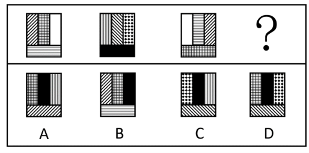
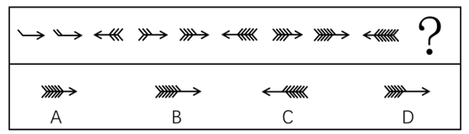
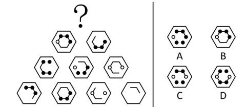
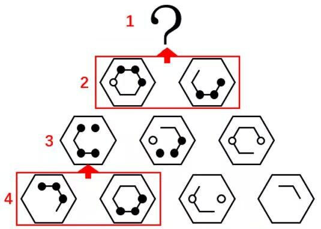
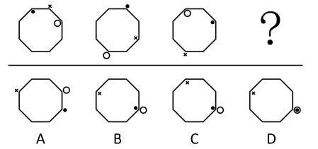
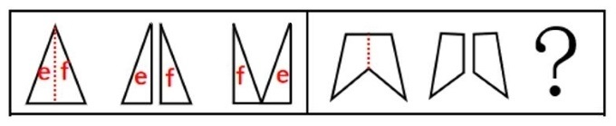
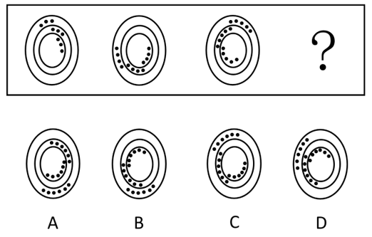

# 2020年上海市行政执法类考试《行测》试题（网友回忆版）

> 判断推理 · 25 题 · 上海 2020

## 第 1 题　qid 5660568 · 定义判断

第一印象效应是指交往双方形成的第一次印象对今后交往关系的影响。
下列选项中属于第一印象效应的是：

- **A**. 马明穿着红衬衫，满头大汗跑到公司面试，面试官觉得马明不像学生，没录用他　✅
- **B**. 小东通过亲戚进入某公司，并且认识了公司的领导，领导一直对小东照顾有加
- **C**. 老李因为犯罪而入狱一年，出狱后找工作时，很多单位听说他坐过牢而不愿招他
- **D**. 张桦到了新公司后，因为其性格和善，待人热忱，与周围的同事相处融洽

**答案**：A

**官方解析**

第一步：找出定义关键词。
“交往双方形成的第一次印象对今后交往关系的影响”。
第二步：逐一分析选项。
A项：马明穿着红衬衫，满头大汗跑到公司面试，面试官觉得马明不像学生，这说明二人初次见面时，马明给面试官留下的第一次印象不佳，结果没录用他，说明第一次印象影响了马明的后续录用，对双方今后的交往关系产生了影响，符合“交往双方形成的第一次印象对今后交往关系的影响”，符合定义，当选；
B项：小东通过亲戚进入某公司，并且认识了公司的领导，领导一直对小东照顾有加，未提及领导对小东的第一次印象如何，不符合“交往双方形成的第一次印象对今后交往关系的影响”，不符合定义，排除；
C项：老李出狱后找工作时，很多单位听说他坐过牢而不愿招他，这些单位是因为老李坐牢的经历而不招他，不是受第一次印象的影响，不符合“交往双方形成的第一次印象对今后交往关系的影响”，不符合定义，排除；
D项：张桦到了新公司后，因为其性格和善，待人热忱，与周围的同事相处融洽，张桦是因为性格好才能与同事相处融洽，不是受第一次印象的影响，不符合“交往双方形成的第一次印象对今后交往关系的影响”，不符合定义，排除。
故正确答案为A。

---

## 第 2 题　qid 5660570 · 定义判断

头脑风暴法是指一组人员通过召开特殊的专题会议形式，对某一特定问题，与会成员之间互相交流、互相启迪、互相激励、互相修正、互相补充、集思广益，从而达到产生大量新设想的集体性发散思维技法。
下列属于头脑风暴法的是        。

- **A**. 市政府召开全市安全生产电视电话会议
- **B**. 谷歌在美国旧金山举行新品发布会，最新版Android系统正式与大家见面
- **C**. 物理学院在理化大楼科技展厅召开年终总结大会，六十余名教授参会
- **D**. 电讯公司经理召集不同专业的技术人员共同讨论去除电线上积雪的方法　✅

**答案**：D

**官方解析**

第一步：找出定义关键词。
“一组人员通过召开特殊的专题会议形式”、“对某一特定问题，与会成员之间互相交流、互相启迪、互相激励、互相修正、互相补充、集思广益”、“产生大量新设想”。
第二步：逐一分析选项。
A项：市政府召开全市安全生产电视电话会议，全市安全生产涉及方方面面的问题，不属于针对某一特定问题，不符合“对某一特定问题，与会成员之间互相交流、互相启迪、互相激励、互相修正、互相补充、集思广益”，不符合定义，排除；
B项：谷歌举行新品发布会，目的是向消费者介绍最新版Android系统，不是针对某一特定问题进行讨论，不符合“对某一特定问题，与会成员之间互相交流、互相启迪、互相激励、互相修正、互相补充、集思广益”、“产生大量新设想”，不符合定义，排除；
C项：物理学院召开年终总结大会，是对本年度的工作进行总结概括，不是针对某一特定问题进行讨论，不符合“对某一特定问题，与会成员之间互相交流、互相启迪、互相激励、互相修正、互相补充、集思广益”、“产生大量新设想”，不符合定义，排除；
D项：电讯公司经理召集不同专业的技术人员，符合“一组人员通过召开特殊的专题会议形式”，共同讨论去除电线上积雪的方法，符合“对某一特定问题，与会成员之间互相交流、互相启迪、互相激励、互相修正、互相补充、集思广益”，符合定义，当选。
故正确答案为D。

---

## 第 3 题　qid 5660572 · 定义判断

供应商是指直接向零售商提供商品及相应服务的企业及其分支机构、个体工商户，包括制造商、经销商和其他中介商。
下列不属于供应商的是        。

- **A**. 王某在香港开了家“皮包公司”，倒卖电子设备给内地某集团公司　✅
- **B**. 张某在农村承包了块土地，种植了土豆出售给淀粉加工厂
- **C**. 曹某所工作的企业技术中心为集团公司提供相关器材和咨询服务
- **D**. 李某的公司为某房产集团很多楼盘提供外墙防水材料

**答案**：A

**官方解析**

第一步：找出定义关键词。
“直接向零售商提供商品及相应服务的企业及其分支机构、个体工商户”、“包括制造商、经销商和其他中介商”。
第二步：逐一分析选项。
A项：王某开的是皮包公司，通过“倒卖产品”向零售商提供商品，不属于正规合法的经销商或中介商，更不是制造商，不符合“包括制造商、经销商和其他中介商”，不符合定义，当选；
B项：张某在农村承包了块土地，种植了土豆出售给淀粉加工厂，即张某直接向淀粉加工厂提供商品，符合“直接向零售商提供商品及相应服务的企业及其分支机构、个体工商户”、“包括制造商、经销商和其他中介商”，符合定义，排除；
C项：曹某所工作的企业技术中心为集团公司提供相关器材和咨询服务，即曹某所在企业直接向集团公司提供商品及服务，符合“直接向零售商提供商品及相应服务的企业及其分支机构、个体工商户”、“包括制造商、经销商和其他中介商”，符合定义，排除；
D项：李某的公司为某房产集团很多楼盘提供外墙防水材料，即李某的公司直接向房产集团提供商品，符合“直接向零售商提供商品及相应服务的企业及其分支机构、个体工商户”、“包括制造商、经销商和其他中介商”，符合定义，排除。
本题为选非题，故正确答案为A。

---

## 第 4 题　qid 5660574 · 定义判断

差异化战略是指为使企业产品与竞争对手产品有明显的区别，形成与众不同的特点而采取的一种战略。其核心是取得某种对顾客有价值的独特性。
根据上述定义，下列不涉及差异化战略的是：

- **A**. 某公司生产的绿茶饮料有十分独特的风味
- **B**. 某公司改进生产工艺后，生产的产品价格比同类产品的价格低了将近10%　✅
- **C**. 某品牌将目标消费者定位于特立独行的年轻群体，成功地占领了小众市场
- **D**. 某品牌汽车的独特卖点就是先进的无人驾驶技术

**答案**：B

**官方解析**

第一步：找出定义关键词。
“企业产品与竞争对手产品有明显的区别”、“取得某种对顾客有价值的独特性”。
第二步：逐一分析选项。
A项：某公司生产的绿茶饮料的风味具有独特性，符合“企业产品与竞争对手产品有明显的区别”、“取得某种对顾客有价值的独特性”，符合定义，排除；
B项：某公司的产品价格比同类产品的价格低，但未说明该公司的产品本身是否具有与众不同的特点，也未体现出该产品是否取得了某种对顾客有价值的独特性，不符合“企业产品与竞争对手产品有明显的区别”、“取得某种对顾客有价值的独特性”，不符合定义，当选；
C项：某品牌将目标消费者定位于特立独行的年轻群体，说明对目标消费者的定位与众不同，且成功占领了小众市场，说明该品牌的产品确实取得了某种对目标消费者有价值的独特性，符合“企业产品与竞争对手产品有明显的区别”、“取得某种对顾客有价值的独特性”，符合定义，排除；
D项：某品牌汽车的独特卖点是先进的无人驾驶技术，符合“企业产品与竞争对手产品有明显的区别”、“取得某种对顾客有价值的独特性”，符合定义，排除。
本题为选非题，故正确答案为B。

---

## 第 5 题　qid 5660577 · 定义判断

鲨鱼效应，因为鲨鱼没有鳔，为了不使自己下沉就不停的游动，使得身体越来越强壮。这里指先天的不足不一定全是坏事，只要自己努力，总会化劣势为优势。
下列不属于鲨鱼效应的是        。

- **A**. 王某语言能力很差，但李主管发现他肯吃苦、肯做事，就经常指导王某工作，王某每次都会拿笔记下来，之后成为了后勤主管，在工作时能详细记录每笔采购和销售情况
- **B**. 小东从小就不善言辞，但做事情很专注，通过不断努力，成为了科研院所的研究人员，并成功研制出多款科技产品
- **C**. 谢某从小资质一般，反应较慢，在其他同学玩耍的时候他一直在学习，遇到不懂的题目会反复琢磨，直到弄懂为止，最终考上了理想的大学
- **D**. 小李毕业后进入某科技公司，发现大学学的知识派不上用处，觉得前途很迷茫，后来在同事的帮助和自己的努力下，逐渐成为工作中的小专家　✅

**答案**：D

**官方解析**

第一步：找出定义关键词。
“先天的不足”、“自己努力”、“化劣势为优势”。
第二步：逐一分析选项。
A项：王某语言能力很差，符合“先天的不足”，但他肯吃苦、肯做事，在被指导时每次都会拿笔记下来，符合“自己努力”，之后成为了后勤主管，在工作时能详细记录每笔采购和销售情况，符合“化劣势为优势”，符合定义，排除；
B项：小东从小就不善言辞，符合“先天的不足”，但做事情很专注，不断努力，符合“自己努力”，成为了科研院所的研究人员，并成功研制出多款科技产品，符合“化劣势为优势”，符合定义，排除；
C项：谢某从小资质一般，反应较慢，符合“先天的不足”，在其他同学玩耍的时候他一直在学习，符合“自己努力”，最终考上了理想的大学，符合“化劣势为优势”，符合定义，排除；
D项：小李发现大学学的知识派不上用处，觉得前途很迷茫，不符合“先天的不足”，不符合定义，当选。
本题为选非题，故正确答案为D。

---

## 第 6 题　qid 5660578 · 图形推理

下列选项中，符合所给图形的变化规律的是：<u>        </u>。

- **A**. A　✅
- **B**. B
- **C**. C
- **D**. D

**答案**：A

**官方解析**

解法一：元素组成相同，优先考虑位置规律。观察发现，将题干图形内外分开看，如下图所示，外圈中，1号和2号小白圆均为每次顺时针平移4格，排除B、D两项；内圈中，3号和4号小白圆均为每次顺时针平移2格，排除C项，只有A项符合。

解法二：元素组成相同，优先考虑位置规律。观察发现，题干图形从左至右依次整体顺时针旋转，故？处图形应为图3整体顺时针旋转得到，只有A项符合。

故正确答案为A。

---

## 第 7 题　qid 5660579 · 图形推理

下列选项中，符合所给图形的变化规律的是：<u>        </u>。

- **A**. A
- **B**. B
- **C**. C　✅
- **D**. D

**答案**：C

**官方解析**

元素组成相似，优先考虑样式规律。观察发现，题干图形内部相同图案重复出现，考虑图案的遍历。题干图形共有8种图案，且每种图案重复出现两次，只有C项符合。
故正确答案为C。

---

## 第 8 题　qid 5660580 · 图形推理

下列选项中，符合所给图形的变化规律的是：<u>        </u>。

- **A**. A
- **B**. B　✅
- **C**. C
- **D**. D

**答案**：B

**官方解析**

元素组成相似，优先考虑样式规律。观察发现，题干图形的箭头的方向为“右、右、左”每三个循环，故？处图形的箭头的方向应朝右，排除C项；再次观察发现，题干每个箭头上的总线条数没有规律，但方向朝右箭头的上半部分的线条数依次为1、2、3、4、5、6（如下图所示），故？处朝右箭头的上半部分的线条数应为7，只有B项符合。

故正确答案为B。

---

## 第 9 题　qid 5660582 · 图形推理

下列选项中，符合所给图形的变化规律的是：<u>        </u>。

- **A**. A
- **B**. B
- **C**. C　✅
- **D**. D

**答案**：C

**官方解析**

元素组成相似，且相同线条重复出现，优先考虑样式规律中的加减同异。本题为金字塔类题目，要自下向上找规律，即下层相邻的两幅图之间进行运算得到上面的一幅图，如下图箭头指向所示：

通过第四行到第三行的运算可知：外框保持不变，内部图案求异，且黑球和白球求异后得到黑球；经验证，第三行到第二行满足此规律；？处应用此规律，只有C项符合。

故正确答案为C。

注：第二行最右侧的两个黑球求异后根据之前的规则应为空白，但四个选项中均不存在最右侧为空白的情况，由于两个黑球求异一定不是黑球，故在A、C两项中择优选择最右侧是白球的C项。

---

## 第 10 题　qid 5660583 · 图形推理

下列选项中，符合所给图形的变化规律的是：<u>        </u>。

- **A**. A
- **B**. B
- **C**. C
- **D**. D　✅

**答案**：D

**官方解析**

元素组成相同，优先考虑位置规律。观察发现，黑球每次顺时针平移1格，且依次交替出现在框内和框外；叉号每次顺时针平移2格，且依次交替出现在框外和框内；白球每次顺时针平移3格，且依次交替出现在框内和框外，只有D项符合。
故正确答案为D。

---

## 第 11 题　qid 5660584 · 图形推理

下列选项中，符合所给图形的变化规律的是：<u>        </u>。

- **A**. A
- **B**. B
- **C**. C　✅
- **D**. D

**答案**：C

**官方解析**

元素组成相同，优先考虑位置规律。观察发现，六面体以竖轴为基准，每次逆时针旋转，故？处六面体顶面内的椭圆方向应与图二相同，排除B项；图一右侧面的空白面应旋转至？处的正面，排除A、D两项，只有C项符合。

故正确答案为C。

---

## 第 12 题　qid 5660586 · 图形推理

下列选项中，符合所给图形的变化规律的是：

- **A**. A
- **B**. B
- **C**. C
- **D**. D　✅

**答案**：D

**官方解析**

元素组成相似，优先考虑样式规律。题干每行图形的轮廓相同，考虑黑白运算。九宫格优先横向观察，前两行图形黑白运算的规律为：白+点=点、白+白=白、黑+点=黑、黑+白=黑、白+黑=黑、点+黑=黑、点+白=点。第三行应用此规律，只有D项符合。
故正确答案为D。

---

## 第 13 题　qid 5660587 · 图形推理

下列选项中，符合所给图形的变化规律的是：

- **A**. A　✅
- **B**. B
- **C**. C
- **D**. D

**答案**：A

**官方解析**

元素组成相同，考虑位置规律。观察发现，第一组图中，图1中的三角形沿对称轴一分为二得到图2，图2中三角形e和三角形f左右位置互换得到图3（如下图所示），第二组图应遵循相同的规律，只有A项符合。

故正确答案为A。

---

## 第 14 题　qid 5660591 · 图形推理

下列选项中，符合所给图形的变化规律的是：

- **A**. A
- **B**. B
- **C**. C　✅
- **D**. D

**答案**：C

**官方解析**

元素组成不同，且无属性规律，优先考虑数量规律。观察发现，题干图形内、中、外环均出现黑点，考虑黑点的数量，题干图1内、中、外环的黑点数均为3，图2内、中、外环的黑点数均为4，图3内、中、外环的黑点数均为5，故“？”处图形内、中、外环的黑点数应均为6，没有唯一答案。继续观察发现，题干图形内、中、外环的黑点均依次首尾相连（如下图所示），只有C项符合。

故正确答案为C。

---

## 第 15 题　qid 5660597 · 图形推理

下列选项中，与其他三个图形规律不同的是：

- **A**. A　✅
- **B**. B
- **C**. C
- **D**. D

**答案**：A

**官方解析**

解法一：图形元素组成不同，可考虑数量规律。题干图形的封闭区域多，优先考虑数面，但无规律。观察发现，B、C、D三项的面均只有一种形状，只有A项的面有两种三角形的形状。
本题为选非题，故正确答案为A。
解法二：图形元素组成不同，优先考虑属性规律。观察发现，题干图形均为对称图形，并且A、B、D三项为轴对称图形，只有C项为既轴对称又中心对称图形。
本题为选非题，故正确答案为C。
解法三：图形元素组成不同，可考虑数量规律。题干图形中出现多边形，考虑数直线。观察发现，A、B、C三项均为6条直线，只有D项为10条直线。
本题为选非题，故正确答案为D。
解法四：图形元素组成不同，可考虑数量规律。题干图形中出现“田”字变形，考虑笔画数。观察发现，A、B、C三项的笔画数均为2，只有D项笔画数为3。
本题为选非题，故正确答案为D。
解法五：图形元素组成不同，可考虑数量规律。观察发现，题干图形中存在较多的直线交叉，考虑交点数量。整体考虑交点数没有规律，考虑点的细化。B、C、D三项内部交点数均为1，只有A项内部交点数为0。
本题为选非题，故正确答案为A。
解法六：图形元素组成不同，可考虑数量规律。观察发现，A、B、D三项中框内的直线数量跟外框线数量一样，只有C项不一样。
本题为选非题，故正确答案为C。
解法七：图形元素组成不同，可考虑数量规律。观察发现，B、C、D三项中的对称轴数量和面数量一样，只有A项不一样。
本题为选非题，故正确答案为A。
注：本题有争议，七个规律都有道理，但根据多边形被分割，面的数量和形状明显，粉笔更倾向根据面形状的种类择优选择A项，争议题大家了解基本解题思路即可，无需作为备考重点。

---

## 第 16 题　qid 5660600 · 逻辑判断

传统生产要素对经济增长的作用是递减的，而人力资本则具有报酬递增的特征，是可持续的增长源泉。因此，能够显著强化人力资本这个关键要素，就能够实现有质量有效益的中高速增长，保证中等收入群体不断扩大。
如果上述论断为真，则下列        项必定为真。

- **A**. 只有保证中等收入群体不断扩大，才能显著强化人力资本　✅
- **B**. 人力资本以外的传统生产要素不是可持续的增长源泉
- **C**. 只要实现有质量的中高速增长就能保证中等收入群体不断扩大
- **D**. 人力资本并不是生产要素，只是经济增长的要素

**答案**：A

**官方解析**

第一步：翻译题干。

①人力资本可持续的增长源泉；

②显著强化人力资本实现有质量有效益的中高速增长；

③显著强化人力资本保证中等收入群体不断扩大。

第二步：逐一分析选项。

A项：翻译为“显著强化人力资本保证中等收入群体不断扩大”，这是对③的肯前，肯前必肯后，可以推出，当选；

B项：题干未提及传统生产要素与可持续的增长源泉的关系，无法推出，排除；

C项：题干未提及实现有质量的中高速增长与保证中等收入群体不断扩大的关系，无法推出，排除；

D项：题干未提及人力资本与生产要素的关系，无法推出，排除。

故正确答案为A。

---

## 第 17 题　qid 5660603 · 逻辑判断

传统民间文艺是过去人们的一种生活方式。它之所以在当下式微，是因为它远离了当代人的生活，不再被现代生活所需要。有调查显示，我国青少年对白雪公主、丑小鸭等西方童话角色如数家珍，对孟姜女、田螺姑娘等中国民间故事人物却知之甚少。我国传统民间故事正在日益远离当下国人的生活。
如果上述论述为真，那么下列        项不是传统民间文艺式微的原因。

- **A**. 传统民间文艺缺乏现代化的表现方式
- **B**. 传统故事情节元素带有很深厚的农耕社会色彩
- **C**. 传统故事的表达方式和思维观念与现代社会有所脱节
- **D**. 传统民间故事全方位、无死角地覆盖了生活的方方面面　✅

**答案**：D

**官方解析**

第一步：找出论点和论据。
论点：传统民间文艺在当下式微。
论据：它（传统民间文艺）远离了当代人的生活，不再被现代生活所需要。有调查显示，我国青少年对白雪公主、丑小鸭等西方童话角色如数家珍，对孟姜女、田螺姑娘等中国民间故事人物却知之甚少。我国传统民间故事正在日益远离当下国人的生活。
本题论点和论据讨论的都是传统民间文艺在当下式微的现象，二者话题一致，加强优先考虑补充论据，且本题为选非题，将可以加强的选项排除即可。
第二步：逐一分析选项。
A项：该项指出传统民间文艺缺乏现代化的表现方式，补充说明传统民间文艺在当下式微的原因，可以加强，排除；
B项：该项指出传统故事情节元素带有很深厚的农耕社会色彩，说明传统民间文艺远离了当代人的生活，补充说明传统民间文艺在当下式微的原因，可以加强，排除；
C项：该项指出传统故事的表达方式和思维观念与现代社会有所脱节，补充说明传统民间文艺在当下式微的原因，可以加强，排除；
D项：该项指出传统民间故事覆盖了生活的方方面面，而论点讨论的是传统民间文艺在当下式微的原因，话题不一致，无法加强，当选。
本题为选非题，故正确答案为D。

---

## 第 18 题　qid 5660606 · 逻辑判断

原子钟是一种基于原子的能级跃迁周期的计时工具，能满足天文、工业以及物理实验上对于超精密计时的需求。因此，原子钟必须安放在海拔高度为零的零磁场环境中。
要使上述结论能够成立，需要下列        项作为前提。

- **A**. 原子钟的精度可以达到每2000万年误差1秒
- **B**. 目前，我国研制的NIM5铯原子喷泉钟是世界上最好的铯原子钟之一
- **C**. 原子钟最初是由物理学家创造出来用于探索宇宙本质的
- **D**. 海拔高度和磁场会对原子的能级跃迁周期产生影响　✅

**答案**：D

**官方解析**

第一步：找出论点和论据。
论点：原子钟必须安放在海拔高度为零的零磁场环境中。
论据：原子钟是一种基于原子的能级跃迁周期的计时工具，能满足天文、工业以及物理实验上对于超精密计时的需求。
本题论点讨论的是原子钟必须安放的海拔和磁场环境，论据讨论的是原子钟是基于原子的能级跃迁周期的计时工具，二者话题不一致，加强优先考虑搭桥，即在“海拔和磁场环境”和“原子的能级跃迁周期”之间建立联系。
第二步：逐一分析选项。
A项：说明原子钟的误差特别小，但原子钟的误差大小与题干论点、论据讨论的话题无关，无法加强，排除；
B项：说明目前我国研制的NIM5铯原子喷泉钟是世界上最好的铯原子钟之一，但原子钟的好坏与题干论点、论据讨论的话题无关，无法加强，排除；
C项：说明原子钟最初被用来探索宇宙本质，但原子钟最初的功能与题干论点、论据讨论的话题无关，无法加强，排除；
D项：说明海拔和磁场对原子的能级跃迁周期产生影响，建立了“海拔和磁场环境”和“原子的能级跃迁周期”之间的联系，搭桥项，可以加强，当选。
故正确答案为D。

---

## 第 19 题　qid 5660608 · 逻辑判断

德国研究人员通过动物实验证实，中草药雷公藤中含的活性物质一一雷公藤红素不仅有助减肥，还可缓解肥胖小鼠的糖尿病症状，有望用于新型减肥药物的研发。研究发现，通常情况下，肥胖小鼠会因一种名为瘦素的激素不起作用而没有饱腹感，而雷公藤红素能够激活小鼠大脑内的饱腹中枢，使小鼠能控制饮食，进而更好地调节体重。
下列        项如果为真，最能支持上述论述。

- **A**. 雷公藤红素毒副作用较大，不可随意服用
- **B**. 雷公藤有祛风除湿、活血通络、消肿止痛等功效
- **C**. 瘦素在人体内和小鼠体内的作用存在细微差别
- **D**. 雷公藤可以让瘦素重新发挥作用　✅

**答案**：D

**官方解析**

第一步：找出论点和论据。
论点：中草药雷公藤中含的活性物质一一雷公藤红素不仅有助减肥，还可缓解肥胖小鼠的糖尿病症状，有望用于新型减肥药物的研发。
论据：通常情况下，肥胖小鼠会因一种名为瘦素的激素不起作用而没有饱腹感，而雷公藤红素能够激活小鼠大脑内的饱腹中枢，使小鼠能控制饮食，进而更好地调节体重。
本题论点论据讨论的均是雷公藤红素有助于减肥，话题一致，加强优先考虑补充论据，即解释雷公藤红素有助于减肥的原因或者举例加强。
第二步：逐一分析选项。
A项：说明雷公藤红素毒副作用较大，而题干讨论的是其对减肥的作用，话题不一致，无法加强，排除；
B项：说明雷公藤有祛风除湿、活血通络、消肿止痛等功效，而题干讨论的是其对减肥的作用，话题不一致，无法加强，排除；
C项：说明瘦素在小鼠体内和人体内的作用不一样，即在小鼠体内的实验未必能应用在人体内，有削弱力度，无法加强，排除；
D项：说明雷公藤能让瘦素发挥作用，即解释为什么雷公藤有助于减肥，补充论据，可以加强，当选。
故正确答案为D。

---

## 第 20 题　qid 5660609 · 类比推理

某设计院有150名员工，（1）有人会讲法语；（2）有人不会讲法语；（3）院长不会讲法语。
如果上述三个条件中只有一个是真的，那么下列        项判断是正确的。

- **A**. 150人都会讲法语　✅
- **B**. 150人都不会讲法语
- **C**. 仅有10人会讲法语
- **D**. 不能确定

**答案**：A

**官方解析**

第一步：找出题干反对命题。
（1）有人会讲法语；
（2）有人不会讲法语；
（3）院长不会讲法语。
条件（1）与（2）为两个“有的”，必有一真。而根据“上述三个条件中只有一个是真的”可知，唯一的一真在条件（1）和（2）中，那么条件（3）一定为假。
第二步：看其余。
根据条件（3）为假，其矛盾命题“院长会讲法语”为真，可推出条件（1）“有人会讲法语”为真。由于题干只有一句话为真，那么条件（2）为假，其矛盾命题“所有人都会讲法语”为真，所有人即为150名员工，对应A项。
故正确答案为A。

---

## 第 21 题　qid 5660611 · 逻辑判断

为教育发展做出重大贡献的优秀教育工作者会获得“教育家”的崇高荣誉。某些教育家是大学数学系毕业的，因此某些大学数学系的毕业生是对教育领域很有研究的人。
如果下列        项为真，能保证上述论证成立。

- **A**. 某些对教育领域很有研究的教育家不是大学数学系毕业的
- **B**. 所有对教育发展做出重大贡献的人都是教育家
- **C**. 所有教育家都是对教育领域很有研究的人　✅
- **D**. 某些教育家不是大学数学系的毕业生，而是学教育学的

**答案**：C

**官方解析**

第一步：找出论点论据。
论点：某些大学数学系的毕业生是对教育领域很有研究的人。
论据：某些教育家是大学数学系毕业的。
论点讨论的是大学数学系毕业生与对教育领域很有研究的人之间的关系，论据讨论的是教育家与大学数学系毕业之间的关系，二者话题不一致，加强优先考虑搭桥，即在教育家与对教育领域很有研究的人之间建立联系。
第二步：逐一分析选项。
A项：该项指出某些对教育领域很有研究的教育家不是大学数学系毕业的，据此无法确定是否还有些教育家是大学数学系毕业的，为不明确项，无法加强，排除；
B项：该项说的是对教育发展做出重大贡献的人，而论点说的是对教育领域很有研究的人，二者话题不一致，该项不是搭桥项，无法加强，排除；
C项：该项指出所有教育家都是对教育领域很有研究的人，结合论据中某些教育家是大学数学系毕业的，论据可换位为有些数学系毕业生是教育家，可以推出某些数学系毕业生是对教育领域很有研究的人，可使论证成立，为搭桥项，当选；
D项：该项指出某些教育家不是大学数学系毕业生，无法确定是否某些大学数学系的毕业生对教育领域很有研究，无法加强，排除。
故正确答案为C。

---

## 第 22 题　qid 5660613 · 逻辑判断

某研究团队评估了97名平均年龄16岁的健康青少年的循环系统状况。其中，54人借助试管婴儿技术出生，43人为自然受孕出生。在24小时动态血压监测中，研究人员发现，与对照组相比，试管婴儿组的收缩压和舒张压均要高一些。并且，试管婴儿组有8名青少年的血压数值己达到高血压标准，而对照组中只有1人达到高血压标准。研究负责人说，这次研究显示，借助辅助生育技术出生的青少年出现高血压的几率约是自然受孕出生青少年的6倍。
下列各项如果为真，        项不能质疑上述负责人的观点。

- **A**. 研究样本规模太小
- **B**. 没有考察孕期母亲的健康状况
- **C**. 借助辅助生育技术的父母大多存在生育缺陷
- **D**. 试管婴儿的胚胎在植入子宫前会暴露在各种环境因素中　✅

**答案**：D

**官方解析**

第一步：找出论点和论据。
论点：借助辅助生育技术出生的青少年出现高血压的几率约是自然受孕出生青少年的6倍。
论据：研究人员发现，与对照组相比，试管婴儿组的收缩压和舒张压均要高一些。并且，试管婴儿组有8名青少年的血压数值己达到高血压标准，而对照组中只有1人达到高血压标准。
本题论点论据均在讨论借助辅助生育技术出生的青少年出现高血压的几率要更高，话题一致，且本题为选非题，排除可以削弱的选项即可。（本题的论点也可以理解为辅助生育技术使得青少年高血压的几率增高，论点出现因果关系，因此也可以考虑他因削弱及因果倒置）
第二步：逐一分析选项。
A项：该项指出研究样本规模太小，说明论据选取的研究样本不具代表性，削弱论据，可以削弱，排除；
B项：该项指出研究过程中没有考察到孕期母亲的健康状况，孕期母亲的健康状况可能也会对青少年的血压产生影响，提出了其他可能会导致青少年高血压的原因，他因削弱，可以削弱，排除；
C项：该项指出借助辅助生育技术的父母大多存在生育缺陷，父母存在生育缺陷可能也会对青少年的血压产生影响，提出了其他可能会导致青少年高血压的原因，他因削弱，可以削弱，排除；
D项：该项指出试管婴儿的胚胎在植入子宫前会暴露在各种环境因素中，说明试管婴儿技术可能存在着一些技术问题，但不明确这种技术问题是否会对青少年的血压造成影响，不明确项，无法削弱，当选。
本题为选非题，故正确答案为D。

---

## 第 23 题　qid 5660614 · 逻辑判断

有专家向房地产建设主管部门建议，在新建住宅中安装水雾喷头，当室内达到一定警戒温度时，喷头自动喷水灭火。但是有部分开发商认为，80%以上的房屋灭火可以被住户人为扑灭，那么安装水雾喷头就用处不大了。
以下选项如果为真，最能削弱开发商观点的是        。

- **A**. 该市住宅均为多层低密度住宅，可直接利用室外消火栓灭火
- **B**. 在新建住宅内设置温度报警装置比水雾喷头更加灵敏
- **C**. 大部分火灾发生在午夜，住户处于睡眠状态　✅
- **D**. 普通住户大部分都没有经过正规的灭火技能训练

**答案**：C

**官方解析**

第一步：找出论点和论据。
论点：80%以上的房屋灭火可以被住户人为扑灭，那么安装水雾喷头就用处不大了。
论据：无。
本题只有论点，削弱优先考虑否定论点。
第二步：逐一分析选项。
A项：该项指出该市住宅可以直接利用室外消火栓灭火，但不明确当火灾发生时，火情是否会被住户发现，也不清楚室内是否有必要安装水雾喷头，为不明确项，无法削弱，排除；
B项：该项指出设置温度报警装置比水雾喷头更灵敏，温度报警装置更灵敏无法否认水雾喷头的用处不大，为无关项，无法削弱，排除；
C项：该项指出大部分火灾发生时，住户处于睡眠状态，说明当火灾发生时，火很难被人为扑灭，因此安装水雾喷头是很有必要的，否定论点，可以削弱，当选；
D项：该项指出普通住户大部分都没有经过正规的灭火技能训练，是否经过正规灭火技能训练与安装水雾喷头没有必然联系，为无关项，无法削弱，排除。
故正确答案为C。

---

## 第 24 题　qid 5660615 · 类比推理

有小新、小明和小方三位同班同学参加了今年的考研，己知：
（1）小新的专业成绩比小方要高；
（2）小明的英语成绩是最低的；
（3）小方的专业成绩是最高的；
（4）小明的政治成绩比小新要低。
如果上述说法中有一项是假的，则下列说法一定为真的是        项。

- **A**. 小新的英语成绩比小明低
- **B**. 小明的政治成绩是最低的
- **C**. 小方的英语成绩比小明高　✅
- **D**. 小明的专业成绩是最低的

**答案**：C

**官方解析**

第一步：找关系。
（1）小新专业成绩＞小方专业成绩；
（2）小明英语成绩最低；
（3）小方专业成绩最高；
（4）小明政治成绩＜小新政治成绩。
由于（1）和（3）不可能同时为真，根据题干，上述说法中有一项是假的，可以推出（1）和（3）中必有一假。
第二步：看其余。
根据（1）和（3）必有一假，可以推出其余的（2）和（4）均为真，即小明英语成绩最低，小明政治成绩＜小新政治成绩，只有C项符合。
故正确答案为C。

---

## 第 25 题　qid 5660616 · 类比推理

甲、乙、丙三人拟利用周末一起到江浙皖游玩。他们三人对于景点选择的意向如下：
甲：黄山、千岛湖、西湖
乙：千岛湖、梅花山、大报恩寺
丙：黄山、西湖、大报恩寺
经过进一步磋商协调，最终他们游玩了3个景点，他们各人意向中均恰有2个景点被选中。那么，他们最终游玩的景点中一定包括        。

- **A**. 千岛湖和大报恩寺　✅
- **B**. 千岛湖和西湖
- **C**. 西湖和黄山
- **D**. 黄山和大报恩寺

**答案**：A

**官方解析**

第一步：分析题干条件。
（1）甲：黄山、千岛湖、西湖；
（2）乙：千岛湖、梅花山、大报恩寺；
（3）丙：黄山、西湖、大报恩寺；
（4）最终游玩了3个景点，各人意向中均恰有2个景点被选中。
第二步：根据题干条件进行推理。
题干信息不确定，且问法为“一定”，考虑采用假设法，排除可以不去的景点。
题干无其他提示信息，从条件出现的第一个景点开始假设，假设最终游玩的景点中不包括黄山，根据条件（4）各人意向中均恰有2个景点被选中，则需要去甲和丙其余的意向景点，即千岛湖、西湖和大报恩寺，此时乙的意向中也恰有2个景点被选中，符合题干要求，假设成立，排除C、D两项；根据A、B两项的不同之处，假设最终游玩的景点中不包括大报恩寺，根据条件（4）各人意向中均恰有2个景点被选中，则需要去乙和丙其余的意向景点，即千岛湖、梅花山、黄山和西湖，与条件（4）最终游玩了3个景点相违背，不符合题干要求，假设不成立，即他们最终游玩的景点中一定包括大报恩寺，只有A项符合。
故正确答案为A。

---
