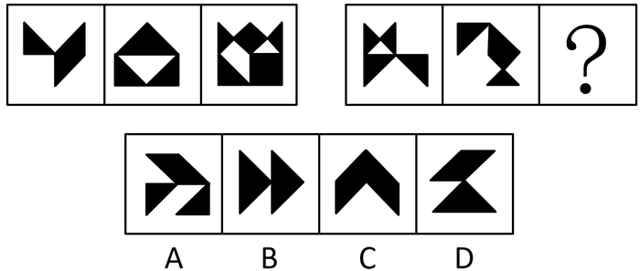
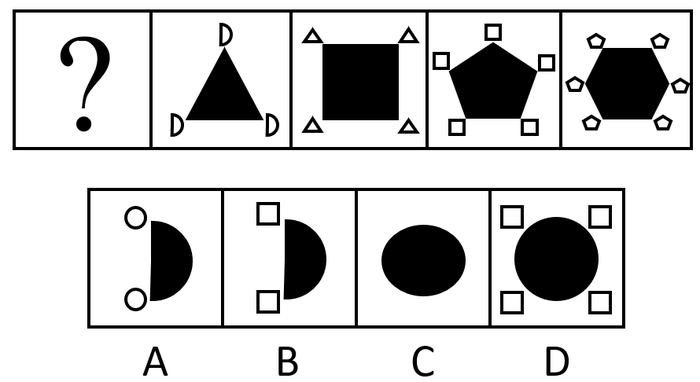

# 2020年北京市公务员录用考试《行测》题（乡镇卷）（网友回忆版）

> 判断推理 · 29 题 · 北京 2020

## 第 1 题　qid 2453154 · 图形推理

每道题包含两套图形和可供选择的4个图形。这两套图形具有某种相似性，也存在某种差异。要求你从四个选项中选择最适合取代问号的一个。正确的答案应不仅使两套图形表现出最大的相似性，而且使第二套图形也表现出自己的特征。

- **A**. A
- **B**. B
- **C**. C　✅
- **D**. D

**答案**：C

**官方解析**

元素组成不同，优先考虑属性规律。观察可知，题干图形比较规整，考虑对称性。第一组图分别为中心对称，轴对称，轴对称中心对称，第二组图遵循规律，分别是中心对称，轴对称，所以？处应选择轴对称中心对称图形，符合的只有C项。

故正确答案为C。

---

## 第 2 题　qid 2453158 · 图形推理

每道题包含两套图形和可供选择的4个图形。这两套图形具有某种相似性，也存在某种差异。要求你从四个选项中选择最适合取代问号的一个。正确的答案应不仅使两套图形表现出最大的相似性，而且使第二套图形也表现出自己的特征。

- **A**. A　✅
- **B**. B
- **C**. C
- **D**. D

**答案**：A

**官方解析**

元素组成相似，优先考虑样式规律。第一组图中，第一幅图上半部分左右两边有竖线，第二幅图没有，第三幅图上半部分两条竖线保留下来，因此规律为第一幅图和第二幅图去同求异后得到第三幅图；第二组图也应该满足此规律，第一幅图上半部分没有横线，第二幅图上半部分的左侧有横线，去同求异后，左上侧应该保留横线，只有A项符合。
故正确答案为A。

---

## 第 3 题　qid 2453160 · 图形推理

每道题包含两套图形和可供选择的4个图形。这两套图形具有某种相似性，也存在某种差异。要求你从四个选项中选择最适合取代问号的一个。正确的答案应不仅使两套图形表现出最大的相似性，而且使第二套图形也表现出自己的特征。

- **A**. A
- **B**. B
- **C**. C　✅
- **D**. D

**答案**：C

**官方解析**

元素组成不同，且无明显属性规律，优先考虑数量规律。题干出现多个封闭空间，考虑数面，题干图形的面数量均为3，但是ABCD项均为3个面，选不出唯一答案。继续观察发现，第一组每个图形的边框条数分别为4、5、6，呈递增规律；第二组每个图形的边框条数分别为1、2，所以？处图形的边框条数应为3，C项满足。
故正确答案为C。

---

## 第 4 题　qid 2453164 · 图形推理

每道题包含一套图形和四个选项，请从四个选项中选出最恰当的一项填在问号处，使图形呈现一定的规律性。

- **A**. A　✅
- **B**. B
- **C**. C
- **D**. D

**答案**：A

**官方解析**

题干阴影部分的形状分别为三角形，四边形，五边形，六边形，图形的边数依次递增一条，所以？处的图形应为有两条边的图形，排除C、D项；对比A、B项发现位于阴影部分图形左上和左下的小图形的边数不同，观察题干可知，小图形的边数依次为两条边，三条边，四条边，五条边，小图形的边数也依次递增，所以？处图形小图形的边数应为一条边，A项满足。
故正确答案为A。

---

## 第 5 题　qid 2453168 · 图形推理

每道题包含一套图形和四个选项，请从四个选项中选出最恰当的一项填在问号处，使图形呈现一定的规律性。

- **A**. A　✅
- **B**. B
- **C**. C
- **D**. D

**答案**：A

**官方解析**

题干每幅图都是由左右两个图形构成，且图形线条有虚有实，左右两图形分开看，观察发现，图一左实右虚，图二左虚右实，图三左实右虚，图四左虚右实，左右虚实线条交替出现，故？处图形应为左实右虚，只有A项左右两个图是左实右虚。
故正确答案为A。

---

## 第 6 题　qid 2453251 · 类比推理

神机妙算：老谋深算

- **A**. 兴高采烈：得意忘形
- **B**. 顽固不化：坚韧不拔
- **C**. 聚精会神：全神贯注　✅
- **D**. 生机勃勃：朝气蓬勃

**答案**：C

**官方解析**

第一步：判断题干词语间逻辑关系。
神机妙算指惊人的机智，巧妙的计谋，形容善于估计复杂的变化情势，决定策略；老谋深算，指周密的筹划，深远的打算，形容人办事精明老练。二者是近义关系。
第二步：判断选项词语间逻辑关系。
A项：兴高采烈形容兴致高，精神饱满；得意忘形指因心意得到满足而高兴得失去常态，二者不是近义关系，与题干逻辑关系不一致，排除；
B项：顽固不化表示坚持自己的意见，不肯改变，形容人十分固执；坚韧不拔形容信念坚定，意志顽强，不可动摇，二者不是近义关系，与题干逻辑关系不一致，排除；
C项：聚精会神形容人专心致志、注意力高度集中的样子；全神贯注是指全部精神集中在一点上，形容注意力高度集中，二者是近义关系，与题干逻辑关系一致，保留；
D项：生机勃勃形容生命力旺盛的样子；朝气蓬勃形容充满生气和活力的样子，二者是近义关系，与题干逻辑关系一致，保留；
比较C、D两项，题干两个词都可以用来形容“人”有深远打算，C项两个词都可以用来形容“人”注意力集中，D项的“生机勃勃”不能用来形容“人”，对比择优，C项与题干更为接近。
故正确答案为C。

---

## 第 7 题　qid 2453252 · 类比推理

跷跷板：天平

- **A**. 踢毽子：口琴
- **B**. 丢手绢：魔术
- **C**. 滑滑梯：杠杆
- **D**. 荡秋千：钟摆　✅

**答案**：D

**官方解析**

第一步：判断题干词语间逻辑关系。
跷跷板和天平的原理均为杠杆原理，二者是并列关系，是原理相同的事物。
第二步：判断选项词语间逻辑关系。
A项：踢毽子是一项用脚踢毽球的健身运动，口琴是一种用嘴吹或吸气，使金属簧片振动发声的多簧片乐器，二者原理不同，与题干逻辑关系不一致，排除；
B项：丢手绢是我国传统的民间儿童游戏，魔术是以不断变化让人捉摸不透并带给观众惊奇体验为核心的一种表演艺术，二者原理不同，与题干逻辑关系不一致，排除；
C项：滑滑梯是利用滑梯光滑表面来产生快乐的儿童娱乐活动，杠杆是在力的作用下可绕固定点转动的硬棒，二者原理不同，与题干逻辑关系不一致，排除；
D项：荡秋千是利用秋千单摆原理产生愉悦的一项运动，钟摆是摆钟机件的一部分，其利用的是单摆原理，二者是并列关系，是原理相同的事物，与题干逻辑关系一致，当选。
故正确答案为D。

---

## 第 8 题　qid 2453253 · 类比推理

出国：护照：签证

- **A**. 升学：录取：成绩
- **B**. 开会：时间：地点
- **C**. 乘高铁：身份证：车票　✅
- **D**. 跟团游：旅行社：机票

**答案**：C

**官方解析**

第一步：判断题干词语间逻辑关系。
出国需要护照和签证，且护照是办理签证的必要条件，二者为必要条件的对应关系。
第二步：判断选项词语间逻辑关系。
A项：先录取再升学，二者为时间先后的对应关系；依据成绩的高低进行录取，二者为依据的对应关系，与题干逻辑关系不一致，排除；
B项：开会一般需要确定好时间和地点，但时间不是地点的必要条件，与题干逻辑关系不一致，排除；
C项：乘高铁需要身份证和车票，身份证是购买车票的必要条件，二者为必要条件的对应关系，与题干逻辑关系一致，当选；
D项：跟团游可能需要通过旅行社，但旅行社不是购买机票的必要条件，与题干逻辑关系不一致，排除。
故正确答案为C。

---

## 第 9 题　qid 2453254 · 类比推理

沙漠 对于（    ）相当于（    ）对于 荒岛

- **A**. 骆驼  飞鸟
- **B**. 绿洲  海洋　✅
- **C**. 水  人
- **D**. 戈壁  珊瑚岛

**答案**：B

**官方解析**

逐一代入选项。
A项：骆驼生活在沙漠里，二者为场所的对应关系；飞鸟生活在荒岛上，二者为场所的对应关系，但是前后顺序相反，前后逻辑关系不一致，排除；
B项：绿洲指沙漠中有水、草的地方，绿洲是沙漠的组成部分，二者为组成关系；荒岛是海洋的组成部分，二者为组成关系，前后逻辑关系一致，当选；
C项：沙漠里缺少水，二者为对应关系；荒岛上缺少人，二者为对应关系，但是前后顺序相反，前后逻辑关系不一致，排除；
D项：戈壁指地面几乎被粗沙、砾石所覆盖，植物稀少的荒漠地带；沙漠指地面完全被沙所覆盖，缺乏流水，气候干燥，植物稀少的地区。两者为并列关系；珊瑚岛是海中的珊瑚虫遗骸堆筑的岛屿，按照构成成分进行划分，荒岛是按照是否有人烟进行划分，二者为交叉关系，前后逻辑关系不一致，排除。
故正确答案为B。

---

## 第 10 题　qid 2453156 · 逻辑判断

某国研究人员招募大学生被试进行情绪与大脑活动的研究，先让大学生读一些能够激发嫉妒和幸灾乐祸的情绪的故事，然后用功能磁共振成像仪对被试脑部血流变化进行测定，发现，嫉妒情绪与大脑前扣带回皮层的活跃度有关，幸灾乐祸与大脑纹状体的活跃度有关，而且，在产生嫉妒情绪时前扣带回皮层的活动越活跃的人，其纹状体的活跃程度就越高。
根据上述研究，最有可能得出以下哪项结论？

- **A**. 大脑的功能变化可以证明，嫉妒和幸灾乐祸都是人之常情
- **B**. 喜欢嫉妒别人的人，大脑前扣带回皮层的功能要比其他人更强
- **C**. 那些爱嫉妒别人的人，更有可能在别人不顺利时幸灾乐祸　✅
- **D**. 喜欢幸灾乐祸的人，大脑的纹状体活跃程度要比喜欢嫉妒的人更高

**答案**：C

**官方解析**

日常结论题，根据题干信息逐一分析选项。
A项：题中只是对嫉妒和幸灾乐祸这两种情绪进行研究，并没有涉及到嫉妒和幸灾乐祸都是人之常情，无中生有，排除；
B项：题干只是提到嫉妒情绪与大脑前扣带回皮层的活跃度有关，但是没有提及大脑扣带回皮层的功能和其他人之间的比较，无中生有，排除；
C项：据最后一句话可知，在产生嫉妒情绪时前扣带回皮层的活动越活跃的人，其纹状体的活跃程度就越高，而幸灾乐祸和纹状体的活跃度有关，可以推出，那些爱嫉妒别人的人，更有可能在别人不顺利时幸灾乐祸，当选；
D项：题干中没有涉及幸灾乐祸的人大脑的纹状体活跃程度如何，无中生有，排除。
故正确答案为C。

---

## 第 11 题　qid 2453162 · 逻辑判断

翻转课堂是随着信息技术的发展出现的一种新的教学模式，在这种模式下，重新调整了课堂内外的时间，学生在上课前完成对教学视频等学习资源的观看和学习，师生在课堂上一起完成作业答疑、协作探究和互动交流等活动，将学习的决定权从教师转移给了学生。有人认为，应该在我国的中小学中大力推广这一教学模式，以便提高教学效果。
以下选项中，除了哪个选项，都是上述论述所依赖的假设？

- **A**. 教师能把以往的教学技能快速地应用于翻转课堂
- **B**. 学生会主动地在课前学习相关内容
- **C**. 学校能够有效协调师生课堂内外的教与学
- **D**. 与之配套的软件与系统可很好地替代板书　✅

**答案**：D

**官方解析**

第一步：找出论点和论据。
论点：应该在我国的中小学中大力推广翻转课堂这一教学模式，以便提高教学效果。
论据：翻转课堂是随着信息技术的发展出现的一种新的教学模式，在这种模式下，重新调整了课堂内外的时间，学生在上课前完成对教学视频等学习资源的观看和学习，师生在课堂上一起完成作业答疑、协作探究和互动交流等活动。
本题论点论据均在讨论翻转课堂，话题一致，且本题为选非题，将不是前提的选项排除即可。
第二步：逐一分析选项。
A项：该项说的是教师能把教学技能快速应用于翻转课堂，若教学技能无法快速应用，则无法推广翻转课堂，也无法保证教学效果，是论证所依赖的假设，可以加强，排除；
B项：该项说的是学生会主动地在课前学习相关内容，若学生没有主动在课前学习相关内容，就无法在上课前完成对教学资源的观看，从而无法保证提高教学效果，是论证所依赖的假设，可以加强，排除；
C项：该项说的是学校能够有效协调师生课堂内外的教与学，若学校无法协调课堂内外的教与学，则无法合理调整课堂内外的时间，就无法推广该教学模式，是论证所依赖的假设，可以加强，排除；
D项：该项说的是配套的软件与系统可很好地代替板书，即使相关软件和系统无法很好地替代板书，也可以采用传统板书讲解，其并不影响教学模式的大力推广，因此无法成为论证所依赖的假设，无法加强，当选。
本题为选非题，故正确答案为D。

---

## 第 12 题　qid 2453166 · 逻辑判断

智能手表近几年发展迅速，它有很多传统手表所不具备的功能，比如，实时收发短信、邮件；实时监测运动状态；获取血压、脉搏数据等。也正因为智能手表的这些优点，越来越多的人购买智能手表。据此，张楠预计，再过若干年，制造传统手表的工厂最终会倒闭。
以下哪项如果为真，最能削弱张楠的结论？

- **A**. 因为智能手表价格较为昂贵，一些消费者不会购买智能手表
- **B**. 虽然传统手表功能单一，戴习惯的人不愿意改戴智能手表
- **C**. 大多数传统手表制造厂不仅制造传统手表也制造智能手表　✅
- **D**. 许多智能手表需要与智能手机配套使用，令许多人感到麻烦

**答案**：C

**官方解析**

第一步：找出论点和论据。
论点：再过若干年，制造传统手表的工厂最终会倒闭。
论据：智能手表的这些优点，越来越多的人购买智能手表。
论据说智能手表与传统手表相比，有很多优点，论点说制造传统手表的工厂会倒闭，话题一致，优先考虑削弱论点。
第二步：逐一分析选项。
A项：智能手表价格昂贵，一些消费者不会购买，但是究竟是多少消费者不会购买，范围不清晰，而且不会购买智能手表的消费者是否会购买传统手表，也不明确，无法削弱，排除；
B项：戴习惯传统手表的人不愿意改戴智能手表，虽然有人不愿换下传统手表，但是这部分人数量多少不明确，如果只有少部分人坚持佩戴传统手表，购买量较少的情况下，传统手表工厂依然可能倒闭，无法削弱，排除；
C项：大多数传统手表制造厂不仅制造传统手表也制造智能手表，那么无论智能手表和传统手表在未来谁卖得更好，传统手表的制造厂都不会倒闭，可以削弱，当选；
D项：智能手表令许多人感到麻烦，只说了智能手表的缺点，但是和传统手表相比谁更受欢迎，不明确，无法削弱，排除。
故正确答案为C。

---

## 第 13 题　qid 2453132 · 逻辑判断

某宿舍住着小华、小峰、小明、小刚和小强五名本科生，在确定学年论文指导老师时，他们将分别被分给张老师、王老师和李老师当中的一人。张老师只研究古代文学，王老师只研究词汇学和古文字学，李老师只研究句法学和词汇学。每位指导老师最多可指导两人，每位同学仅对所分配指导老师的一个研究方向感兴趣。已知：
（1）小峰和小刚被分给了王老师；
（2）小华被分给了李老师。
若每位同学都按照自己的兴趣被分配给了指导老师，则以下各项都是符合题干的陈述，除了哪项？

- **A**. 小明对词汇学感兴趣，小强对古代文学感兴趣
- **B**. 小明对句法学感兴趣，小强对古代文学感兴趣
- **C**. 小明对古代文学感兴趣，小强对句法学感兴趣
- **D**. 小明对古代文学感兴趣，小强对古文字学感兴趣　✅

**答案**：D

**官方解析**

第一步：分析题干。
（1）张老师只研究古代文学；
（2）王老师只研究词汇学和古文字学；
（3）李老师只研究句法学和词汇学；
（4）每位指导老师最多可指导两人；
（5）每位同学仅对所分配指导老师的一个研究方向感兴趣；
（6）小峰和小刚被分给了王老师；小华被分给了李老师。
第二步：根据题干条件分析选项。
提问方式为哪项不符合题干的陈述，因此，可以考虑代入法。
代入A项，小明对词汇学感兴趣可以分配给李老师，小强对古代文学感兴趣可以分配给张老师，此时满足题干所有条件，排除；
代入B项，小明对句法学感兴趣只能分配给李老师，小强对古代文学感兴趣可以分配给张老师，此时满足题干所有条件，排除；
代入C项，小明对古代文学感兴趣可以分配给张老师，小强对句法学感兴趣可以分配给李老师，此时满足题干所有条件，排除；
代入D项，小明对古代文学感兴趣可以分配给张老师，小强对古文字学感兴趣只能分配给王老师，此时王老师已经指导了三个学生，与条件（4）矛盾，当选。
本题为选非题，故正确答案为D。

---

## 第 14 题　qid 2453255 · 逻辑判断

几位同事在小王家喝茶聊天。他们讨论正在喝的这种茶是什么茶。小刘说：“不是龙井，不是碧螺春”，小赵说：“不是龙井，是乌龙茶”，小李说：“不是乌龙茶，是龙井。”最后，经小王确认，三人中有一人的判断完全正确，一个人只说对了一半，另外一个人则完全说错。
据此，可以推出：

- **A**. 小刘的判断完全正确，他们喝的是乌龙茶
- **B**. 小赵的判断完全正确，他们喝的不是龙井
- **C**. 小李的判断完全正确，他们喝的是龙井　✅
- **D**. 小李只说对了一半，他们喝的是碧螺春

**答案**：C

**官方解析**

此题目为组合排列题型，题干信息不确定，优先考虑代入法解题。
A项：代入到题干中发现，小刘完全正确，小赵也完全正确，不符合题干，排除；
B项：代入到题干中发现，小赵完全正确，小刘也完全正确，不符合题干，排除；
C项：代入到题干中发现，小刘对一半，小赵全错，小李完全正确，符合题干，当选；
D项：代入到题干中发现，小刘对一半，小赵也对一半，不符合题干，排除。
故正确答案为C。

---

## 第 15 题　qid 2453208 · 逻辑判断

某位记者说道：“金钱和幸福是人们苦苦追求的。但是，一个人有钱并不意味着他一定幸福。而一个人幸福也不意味着他一定有钱。我采访过的人中：有的人有钱，有的人幸福，多数人并不同时具备这两者。”
若该记者所述为真，关于他所采访的人中，哪项陈述一定为真？

- **A**. 只有少数人既有钱又幸福　✅
- **B**. 有钱人比幸福的人要多
- **C**. 幸福的人比有钱的人更多些
- **D**. 有的人既没钱，又不幸福

**答案**：A

**官方解析**

日常结论题，根据题干信息逐一分析选项。
A项：根据记者的表述，多数人并不同时具备这两者，可以推出只有少数人既有钱又幸福，当选；
B项：题干中并没有比较有钱人的人数和幸福的人的人数，无中生有，排除；
C项：同B项，题干中并没有比较有钱人的人数和幸福的人的人数，无中生有，排除；
D项：题干只论述有的人有钱，有的人幸福，并没有不幸福、没钱的表述，有的是推不出有的不是，逻辑错误，排除。
故正确答案为A。

---

## 第 16 题　qid 2453210 · 逻辑判断

某校规定，对于学校的任一实验室，除非有教师在国际期刊上发表论文，否则没资格申报国家重点实验室。该校甲实验室有教师在国际期刊上发表论文。该校乙实验室有资格申报国家重点实验室。
若上述陈述为真，则以下哪项也一定为真？

- **A**. 该校甲实验室有资格申报国家重点实验室
- **B**. 该校甲实验室有教师没有在国际期刊上发表过论文
- **C**. 该校乙实验室有教师在国际期刊上发表论文　✅
- **D**. 该校乙实验室有教师没有在国际期刊上发表过论文

**答案**：C

**官方解析**

第一步：翻译题干。

① 有资格申报国家重点实验室有教师发表论文；

② 甲实验室有教师发表论文；

③ 乙实验室有资格申报国家重点实验室。

第二步：逐一分析选项。

A项：题干中②是对①的肯后，但肯后得不到确定性的结论，因此推不出甲实验室是否有资格申报国家重点实验室，排除； 

B项：题干中②甲实验室有教师发表论文，有老师发表过无法推出有老师没发表过，排除；

C项：题干中③是对①的肯前，肯前必肯后，可以推出乙实验室有教师发表论文，当选；

D项：题干中③是对①的肯前，肯前必肯后，得到的是乙实验室有教师发表论文，有教师发表论文无法推出有教师没有发表论文，无法推出，排除。

故正确答案为C。

---

## 第 17 题　qid 2453207 · 类比推理

人非圣贤，孰能无过。我不是圣贤，所以，我也有犯错误的时候。
以下除哪项外，均与题干的论证结构相似？

- **A**. 金无足赤，人无完人。张灵灵是人，所以，张灵灵也不是完美的
- **B**. 无知者无畏。小张见多识广，所以，他做事谨小慎微　✅
- **C**. 志不强者智不达。曹芳意志不坚定，所以，曹芳不能充分发挥她的智慧
- **D**. 狭路相逢勇者胜。苏梅是勇者，所以，她最终会取得胜利

**答案**：B

**官方解析**

翻译题干，找到题干的论证结构。

人非圣贤，孰能无过。我不是圣贤，所以，我也有犯错误的时候。

即ab，因为a，所以得到b。推理形式为：肯前必肯后。

第二步：逐一分析选项。

A项：人不完美。因为张灵灵是人，所以推出张灵灵不是完美的。即ab，因为a，所以得到b，推理形式为：肯前必肯后，与题干推理结构相似，排除；

B项：无知者无畏。因为小张见多识广，所以推出他做事谨小慎微。即ab，因为a，所以得到b，推理形式为：否前得到否后，与题干推理结构不相似，当选；

C项：志不强者智不达。因为曹芳意志不坚定，所以推出曹芳不能充分发挥她的智慧。即ab，因为a，所以得到b，推理形式为：肯前必肯后，与题干推理结构相似，排除；

D项：勇者胜。因为苏梅是勇者，所以推出她最终会取得胜利。即ab，因为a，所以得到b，推理形式为：肯前必肯后，与题干推理结构相似，排除。

本题为选非题，故正确答案为B。

---

## 第 18 题　qid 2453209 · 逻辑判断

近年来，某地交通状况日趋恶化，相关部门在调研之前开了一次碰头会讨论相关事宜，有人提议，应在早上6点到9点与晚上5点到8点间禁止大货车通行，这样能极大缓解交通拥堵状况。
以下哪项如果为真，最能支持上述论断？

- **A**. 通常情况下大货车的车速都比较快
- **B**. 这两个时间段里该地区行驶的车辆以大货车为主　✅
- **C**. 大货车的车身比较宽，而该地区的道路相对狭窄
- **D**. 大货车的司机相对其他车辆驾驶员更不注意交通安全

**答案**：B

**官方解析**

第一步：找出论点和论据。
论点：应在早上6点到9点与晚上5点到8点间禁止大货车通行，这样能极大缓解交通拥堵状况。
论据：无。
本题只有论点没有论据，加强优先考虑补充论据。
第二步：逐一分析选项。
A项：该项指出大货车车速较快，而车速与交通拥堵关系未知，不明确选项，不能加强，排除；
B项：该项指出这两个时间段里该地区行驶的车辆以大货车为主，则在该时间段内限制大货车可以缓解交通拥堵，补充论据，可以加强，当选；
C项：该项指出大货车的车身比较宽，而道路较窄，但不明确禁止时段里大货车的数量，因此不明确该时段禁止大货车能否缓解交通拥堵，不明确选项，不能加强，排除；
D项：该项指出大货车司机的安全意识，与该时段交通拥堵无必然联系，不能加强，排除。
故正确答案为B。

---

## 第 19 题　qid 2453211 · 逻辑判断

人的大脑聪明与否不仅是天生的，我们后天的行为也会对大脑产生深刻的影响。“用进废退”的生物科学原则，同样适用于人脑。大脑神经细胞和其他组织器官一样，越用越能保持其充沛的活力；总不用的话，人可能会变得越来越笨。
以下哪项如果为真，最能支持上述结论？

- **A**. 人在专注思考时大脑的血流情况可能发生变化，从而使某些区域的温度过高导致疲劳
- **B**. 随着年龄增长，大脑神经元会慢慢衰亡
- **C**. 当一个人完成单调任务时，大脑便会自动转换为“安眠模式”
- **D**. 学习新的语言可以促使脑区之间建立更高效灵活的沟通模式　✅

**答案**：D

**官方解析**

第一步：找出论点和论据。
论点：大脑神经细胞和其他组织器官一样，越用越能保持其充沛的活力；总不用的话，人可能会变得越来越笨。
论据：人的大脑聪明与否不仅是天生的，我们后天的行为也会对大脑产生深刻的影响，“用进废退”的生物科学原则，同样适用于人脑。
论点论据话题一致，优先考虑补充论据进行加强。
第二步：逐一分析选项。
A项：该项讨论的是用脑与疲劳的关系，而论点说的是用脑与聪明的关系，话题不一致，不能加强，排除；
B项：该项讨论的是年龄与脑神经元的关系，而论点说的是用脑与聪明的关系，话题不一致，不能加强，排除；
C项：该项讨论的是完成单调任务时大脑会转换为“安眠模式”，但没有提及“安眠模式”与聪明之间的关系，不能加强，排除；
D项：“学习新的语言”属于用脑，“促使脑区之间建立更高效灵活的沟通模式”说明大脑变得更灵活、更聪明，举用脑的例子说明用脑能变聪明，可以加强，当选。
故正确答案为D。

---

## 第 20 题　qid 2453150 · 定义判断

周边产品，指利用动画、漫画、游戏等作品中的人物或动物造型，经授权后制成的商品。
根据上述定义，以下属于周边产品的是：

- **A**. 某文化公司请美术大师绘制了一套《红楼梦》金陵十二钗的明信片，印刷售卖
- **B**. 小涛制作了一套孙悟空七十二变的泥塑，参加区文化馆组织的手工艺术品比赛
- **C**. 某娱乐公司开发了一部非常受欢迎的动画片，同步推出主人公形象的玩具和服装　✅
- **D**. 小樱把自己的偶像明星曾经饰演过的所有角色的照片集结成册，在粉丝群里销售

**答案**：C

**官方解析**

第一步：找出定义关键词。
“动漫、漫画、游戏等作品中的人物或动物造型”、“经授权后制成的商品”。
第二步：逐一分析选项。
A项：《红楼梦》金陵十二钗是小说中的人物，不符合“动漫、漫画、游戏等作品中的人物或动物造型”，不符合定义，排除；
B项：孙悟空是小说中的人物，不符合“动漫、漫画、游戏等作品中的人物或动物造型”；参加区文化馆的比赛，并不是要售卖的商品，不符合“经授权后制成的商品”，不符合定义，排除；
C项：娱乐公司开发动画片，并且推出主人公形象的玩具和服装，符合“动漫、漫画、游戏等作品中的人物或动物造型”、“经授权后制成的商品”，符合定义，当选；
D项：小樱集结自己偶像饰演的角色的照片，并且销售，不符合“动漫、漫画、游戏等作品中的人物或动物造型”、“经授权后制成的商品”，不符合定义，排除。
故正确答案为C。

---

## 第 21 题　qid 2453163 · 定义判断

绿色运输，是指以节约能源、减少废气排放为特征的运输。其实施途径主要包括：合理选择运输工具和运输路线，克服迂回运输和重复运输，以实现节能减排的目标；改进内燃机技术和使用清洁燃料，以提高能效；防止运输过程中的泄露，以免对局部地区造成严重的环境危害。
根据上述定义，以下不属于绿色运输的是：

- **A**. 进口的水果、零食和日用品，航空运输且市内全程冷链配送，由多级经销商逐级分销　✅
- **B**. 电商对同一区域进行集约化配送，统一集货、统一送货，尽量减少货流和空载率
- **C**. 某快递公司引入拥有更高燃油效率和更大载货量的新机型，耗油更省，飞行更远
- **D**. 某地的物流运输全面使用可再生燃料和混合动力技术，还定期对驾驶员进行培训

**答案**：A

**官方解析**

第一步：找出定义关键词。
 “以节约能源、减少废气排放为特征的运输”、“合理选择运输工具和运输路线，克服迂回运输和重复运输，以实现节能减排的目标”、“改进内燃机技术和使用清洁燃料，以提高能效”、“防止运输过程中的泄露，以免对局部地区造成严重的环境危害”。
 第二步：逐一分析选项。
 A项：进口的水果、零食和日用品用冷链配送，由多级经销商逐级分销，没有体现节能减排，不符合“以节约能源、减少废气排放为特征的运输”，不符合“合理选择运输工具和运输路线，克服迂回运输和重复运输，以实现节能减排的目标”，不符合“改进内燃机技术和使用清洁燃料，以提高能效”，也不符合“防止运输过程中的泄露，以免对局部地区造成严重的环境危害”，不符合定义，当选；
 B项：电商集约化配送尽量减少货流和空载率，符合“合理选择运输工具和运输路线，克服迂回运输和重复运输，以实现节能减排的目标”，符合定义，排除；
 C项：某快递公司引入拥有更高燃油效率和更大载货量的新机型，耗油更省，符合“合理选择运输工具和运输路线，克服迂回运输和重复运输，以实现节能减排的目标”，也符合“改进内燃机技术和使用清洁燃料，以提高能效”，符合定义，排除；
 D项：某地的物流运输全面使用可再生燃料和混合动力技术，定期对驾驶员进行培训，符合“改进内燃机技术和使用清洁燃料，以提高能效”，符合定义，排除。
本题为选非题，故正确答案为A。

---

## 第 22 题　qid 2453172 · 定义判断

兼语句，是由兼语短语充当谓语或独立成句的句子。兼语句具有如下特点：第一，兼语句的谓语由动宾短语套接主谓短语构成，动宾短语的宾语兼做主谓短语的主语。第二，兼语句多有使令的意思，所以句中前一个谓语多由使令动词充当。第三，兼语句中兼语的谓语是前边动作所要达到的目的或产生的结果，即兼语前后两个动词在语意上有一定联系。“我请他作报告”就是一个兼语句。
根据上述定义，以下句子不属于兼语句的是：

- **A**. 老师叫我告诉你这件事
- **B**. 我去图书馆借本书看　✅
- **C**. 学校号召毕业生去支教
- **D**. 同学们选小明当班长

**答案**：B

**官方解析**

第一步：找出定义关键词。
“由兼语短语充当谓语或独立成句的句子”、“兼语句的谓语由动宾短语套接主谓短语构成，动宾短语的宾语兼做主谓短语的主语”、“兼语句多有使令的意思，所以句中前一个谓语多由使令动词充当”、“兼语句中兼语的谓语是前边动作所要达到的目的或产生的结果，即兼语前后两个动词在语意上有一定联系”。
第二步：逐一分析选项。
A项：老师叫我告诉你这件事，“叫我”是动宾短语，“我告诉你”是主谓短语，符合“由兼语短语充当谓语或独立成句的句子”“兼语句的谓语由动宾短语套接主谓短语构成，动宾短语的宾语兼做主谓短语的主语”；“老师叫我”是命令语句，符合“兼语句多有使令的意思，所以句中前一个谓语多由使令动词充当”；“告诉你这件事”是老师的目的，符合“兼语句中兼语的谓语是前边动作所要达到的目的或产生的结果，即兼语前后两个动词在语意上有一定联系”，符合定义，排除。 
B项：我去图书馆借本书看，“去图书馆”是动宾短语，“图书馆借本书”，图书馆不是借书的主语而是地点状语，不符合“兼语句的谓语由动宾短语套接主谓短语构成，动宾短语的宾语兼做主谓短语的主语”，不符合定义，当选。 
C项：学校号召毕业生去支教，“号召毕业生”是动宾短语，“毕业生去支教”是主谓短语，符合“由兼语短语充当谓语或独立成句的句子”“兼语句的谓语由动宾短语套接主谓短语构成，动宾短语的宾语兼做主谓短语的主语”；“毕业生去支教”是学校的目的，符合“兼语句中兼语的谓语是前边动作所要达到的目的或产生的结果，即兼语前后两个动词在语意上有一定联系”，符合定义，排除。 
D项：同学们选小明当班长，“选小明”是动宾短语，“小明当班长”是主谓短语，符合“由兼语短语充当谓语或独立成句的句子”“兼语句的谓语由动宾短语套接主谓短语构成，动宾短语的宾语兼做主谓短语的主语”；“小明当班长”是同学们的目的，符合“兼语句中兼语的谓语是前边动作所要达到的目的或产生的结果，即兼语前后两个动词在语意上有一定联系”，符合定义，排除。
本题为选非题，故正确答案为B。

---

## 第 23 题　qid 2453182 · 定义判断

回赎权，是指出典人在典期届满时享有的要求偿付原典价并支付其他合理的费用和利息，赎回原典物的权利。回赎权有一定的期限限制。根据我国有关法规和司法解释的规定，出典人在典期届满10年不回赎，或无典期经过30年不回赎的，视为绝卖，典物的所有权即归典权人所有。
根据上述定义，以下判断正确的是：

- **A**. 小张因投资需要资金，在典当行典当了一件传家宝，约定三年后赎回，三年后小张投资失利，无法按时回赎，典当行即拥有该宝贝的所有权
- **B**. 王某二十年前无典期典当了自己的房屋，现在仍未赎回，该房屋可视为绝卖，王某无法再赎回
- **C**. 李某在1999年与典当行达成协议，以3万元典当了一块古董手表，未明确典当期限，直至2009年李某仍没有赎回，此时典当行可以将手表公开拍卖
- **D**. 赵某十五年前典当了一套房屋的产权，当时协议典期为两年，赵某至今仍无能力回赎，该房屋可视为绝卖　✅

**答案**：D

**官方解析**

第一步：找出定义关键词。
“出典人在典期届满时享有的要求偿付原典价并支付其他合理的费用和利息，赎回原典物的权利”、“出典人在典期届满10年不回赎，或无典期经过30年不回赎的，视为绝卖”。
第二步：逐一分析选项。
A项：约定三年后赎回，即典期为三年，而三年后小张无法按时回赎，不符合“出典人在典期届满10年不回赎”，不符合定义，排除；
B项：王某二十年前无典期典当了自己的房屋，属于无典期经过20年不回赎，不符合“无典期经过30年不回赎”，不符合定义，排除；
C项：李某在1999年典当一块古董手表，未明确典当期限，直至2009年李某仍没有赎回，属于无典期经过10年不回赎，不符合“无典期经过30年不回赎”不符合定义，排除；
D项：赵某十五年前典当了一套房屋的产权，当时协议典期为两年，属于典期届满13年不回赎，符合“出典人在典期届满10年不回赎”，符合定义，当选。
故正确答案为D。

---

## 第 24 题　qid 2453186 · 定义判断

商业混同行为，是指经营者采用欺骗手段从事市场交易，使自己经营的商品或服务与特定竞争对手的商品或服务相混淆，造成或足以使购买者误认误购的不正当竞争行为。
根据上述定义，以下属于商业混同行为的是：

- **A**. 某啤酒厂家出售的一款“白威”啤酒，跟知名品牌百威啤酒的外包装非常相似，售价却只有百威啤酒的一半　✅
- **B**. 泰山旅游宣传海报的图片上山峦起伏、白云缭绕，当地一家卷烟厂生产的“泰山”牌香烟，也将海报的图片复制在烟盒上
- **C**. 某娱乐演艺公司经营一家名为“晚亭”的会所，并在门前张挂其公司旗下艺人张婉婷的电影剧照，不少人以为是张婉婷本人开的会所
- **D**. 某饼干生产厂家的外包装使用知名动画片“小猪佩奇”的剧照，里面还随饼干附赠小猪佩奇的玩偶，吸引了很多小顾客

**答案**：A

**官方解析**

第一步：找出定义关键词。
“使自己经营的商品或服务与特定竞争对手的商品或服务相混淆”、“造成或足以使购买者误认误购的不正当竞争行为”。
第二步：逐一分析选项。
A项：某啤酒厂家出售的啤酒跟知名品牌外包装非常相似，符合“使自己经营的商品或服务与特定竞争对手的商品或服务相混淆”、也符合“造成或足以使购买者误认误购的不正当竞争行为”，符合定义，当选；
B项：泰山旅游宣传海报和卷烟厂之间并非竞争对手的关系，不符合定义，排除；
C项：某娱乐演艺公司经营的会所和其公司旗下艺人并非竞争对手的关系，不符合定义，排除；
D项：某饼干生产厂家和知名动画片“小猪佩奇”并非竞争对手的关系，不符合定义，排除。
故正确答案为A。

---

## 第 25 题　qid 2453197 · 定义判断

交互记忆，指的是当由两个或以上的个体组成的团体经过长时间一起工作生活之后，他们之间会分享存储的记忆。个体不一定需要记忆所有的信息，而只需要记住群体内那些成员是哪方面信息的专家即可，当需要这方面信息时就可以向其询问。通过这种方式，本应存储于每个个体中的记忆被分散到组成群体的不同成员的头脑中去了，就好像所有的成员的头脑组成了一个具有更大容量的记忆库一样。
根据上述定义，以下不属于交互记忆的是：

- **A**. 小郭对实验室各种设备都非常熟悉，课题组成员在讨论实验数据的误差时都会询问小郭的意见，排除设备造成重大误差的可能性
- **B**. 小梅和小芳经常在一起学习，考前复习时，她们相互提问，相互考核，发现各自没有掌握的知识点，有效提高了学习效率　✅
- **C**. 小涛在家里找以前的家庭聚会合影，怎么也找不到，他问爸爸：“您记得咱家那些合影都放哪儿了吗?”爸爸回答：“家里的东西，你得问你妈。”
- **D**. 研究生夏江找不到某个理论的原始出处，他记得同课题组一位师兄以前介绍过这方面的研究，就去找该师兄求助，师兄告诉他可在哪本书中查到

**答案**：B

**官方解析**

第一步：找出定义关键词。
“个体不一定需要记忆所有的信息，而只需要记住那些成员是哪方面的专家即可”、“当需要这方面的信息时就可以向其询问”。
第二步：逐一分析选项。
A项：课题组成员在讨论实验数据的误差时都会询问小郭的意见，即大多数人不用知道所有信息，直接询问小郭即可，符合“个体不一定需要记忆所有的信息”、“当需要这方面的信息时就可以向其询问”，符合定义，排除；
B项：小梅和小芳一起学习，相互提问、考核，发现各自没有掌握的知识点，说明双方都需要掌握所有知识点，不符合“个体不一定需要记忆所有的信息，而只需要记住那些成员是哪方面的专家即可”，不符合定义，当选；
C项：小涛找不到家庭合影，询问父亲，父亲让他询问妈妈，即家庭成员之间有分工，每个家庭成员不需要记住所有信息，需要时直接询问别人即可，符合“个体不一定需要记忆所有的信息”、“当需要这方面的信息时就可以向其询问”，符合定义，排除；
D项：夏江找不到理论出处，就去找师兄求助，说明夏江不需要记住所有信息，需要时直接询问他人即可，符合“个体不一定需要记忆所有的信息”、“当需要这方面的信息时就可以向其询问”，符合定义，排除。
本题为选非题，故正确答案为B。

---

## 第 26 题　qid 2453198 · 定义判断

湿租，是航空公司之间的一种特殊租赁方式，在提供飞机的同时提供机组和乘务组为对方服务，而且在租赁过程中，被租赁飞机的标志不变、飞机号不变。民航规章体系将其定义为：是指按照租赁协议，承租方租赁飞机时携带出租方一名或者多名机组成员的租赁。
根据上述定义，以下属于湿租的是：

- **A**. 某航线由甲航空公司销售机票，乙航空公司独立执行飞行，两公司达成协议，合作期间使用甲公司的航班号
- **B**. 某航空公司为了开辟欧洲新航线，从甲国进口五架最新机型飞机，同时聘请甲国飞行员和专业维修技师为新航线服务
- **C**. 某航空公司因季节原因人员短缺，从乙航空公司临时借调部分工作人员承担飞行任务
- **D**. 圣诞将至，甲国航空公司为了缓解客运压力，从乙国租借了三架民用飞机，机组和维修员工仍为乙国航空公司原有资源　✅

**答案**：D

**官方解析**

第一步：找出定义关键词。
“在提供飞机的同时提供机组和乘务组为对方服务”、“被租赁飞机的标志不变、飞机号不变”。
第二步：逐一分析选项。
A项：某航线由甲航空公司销售机票，乙航空公司独立执行飞行，即乙航空公司提供飞机，是租赁方，但最后使用甲公司的航班号，不符合“被租赁飞机的标志不变、飞机号不变”，不符合定义，排除； 
B项：某航空公司从甲国进口飞机，属于直接购买，不是“租赁”，不符合定义，排除；
C项：某航空公司只是从乙航空公司临时借调部分工作人员，并没有租赁对方公司的飞机，不符合“在提供飞机的同时提供机组和乘务组为对方服务”，不符合定义，排除；
D项：甲国航空公司从乙国租借了三架民用飞机，存在“租赁”的行为，机组和维修员工仍为乙国航空公司原有资源，说明乙国航空公司“在提供飞机的同时提供机组和乘务组为对方服务”，符合定义，当选。
故正确答案为D。

---

## 第 27 题　qid 2453199 · 定义判断

黄金标准法则，指的是在品牌定位和广告表现上，为品牌设立一个可使之与同类品牌相比更加出色的说辞，从而体现出该品牌的高出一筹，胜人一筹；黄金标准的内容可以有：强调领导性和专业性；突出产品的优越品质；建立科学的使用规则；突出品牌在技术、工艺等方面的先进性；传播惟我独尊的品牌价值与形象等。
根据上述定义，以下没有应用黄金标准法则的是：

- **A**. 某保健品的宣传语是“鹤舞长山，我心飞翔！”　✅
- **B**. 某肉类食品品牌的宣传语是“世界领先的肉类供应商！”
- **C**. 某电视品牌的广告语是“不闪的，才是最好的！”
- **D**. 某房地产的广告语是“我是你今生唯一的选择！”

**答案**：A

**官方解析**

第一步：找出定义关键词。
“品牌设立与同类品牌相比更加出色的说辞”、“体现出该品牌的高出一筹，胜人一筹”。
第二步：逐一分析选项。
A项：某保健品的宣传语是“鹤舞长山，我心飞翔！”，强调的是该公司的保健品本身效果佳，让消费者长寿健康，心情好，不符合“品牌设立与同类品牌相比更加出色的说辞”、“体现出该品牌的高出一筹，胜人一筹”，不符合定义，当选；
B项：某肉类食品品牌的宣传语是“世界领先的肉类供应商！”，“世界领先”符合“品牌设立与同类品牌相比更加出色的说辞”、“体现出该品牌的高出一筹，胜人一筹”，符合定义，排除；
C项：某电视品牌的广告语是“不闪的，才是最好的！”，突出了品牌在技术、工艺等方面的先进性，符合“品牌设立与同类品牌相比更加出色的说辞”、“体现出该品牌的高出一筹，胜人一筹”，符合定义，排除；
D项：某房地产的广告语是“我是你今生唯一的选择！”，选项中的“唯一”体现了唯我独尊的品牌价值，比其他品牌更加出色，更胜一筹，符合“体现出该品牌的高出一筹，胜人一筹”，符合定义，排除。
本题为选非题，故正确答案为A。

---

## 第 28 题　qid 2453201 · 定义判断

合同可以根据价款分为开口合同和闭口合同，“开口价”是指按一定的计价方式通过计算最终才能确定的价格，“闭口价”是指订立合同时已确定的价格。没有确定价格的买卖合同是“开口合同”。
根据上述定义，以下属于开口合同的是：

- **A**. 
李先生和装修公司签订合同，约定装修总价为12万。结账时装修公司提出，装修过程中李先生要求使用的是更高标准的五金件，因此要求李先生额外支付2000元

- **B**. 
甲、乙两公司签订供货合同，约定供货单价，甲公司每月下达次月订单给乙公司，月底按甲公司的入库数量进行结算，如原材料市场价格波动超过本合同价以上可再协商
　✅
- **C**. 
方先生和妻子离异时约定，女儿由女方抚养，方先生每月支付2000元抚养费给女方，直至孩子成年，如果孩子生病等需要额外支出，费用支出由双方协商决定

- **D**. 
江阿姨年事已高，她的三个儿子经江阿姨同意后约定，将她名下的两居室转到大儿子名下，其他儿子放弃对房产的要求，由大儿子照顾江阿姨并负责所有费用

**答案**：B

**官方解析**

第一步：找出定义关键词。

“没有确定价格的买卖合同”。

第二步：逐一分析选项。

A项：李先生与装修公司签订合同，约定合同总价为12万，不符合“没有确定价格的买卖合同”，装修过程中李先生要求使用更高标准的五金件，因此要额外支付2000元，也不符合“没有确定价格的买卖合同”，不符合定义，排除；

B项：甲、乙两公司签订供货合同，约定供货单价，如原材料市场价格波动超过本合同价以上可再协商，原材料市场价格波动符合“没有确定价格的买卖合同”，符合定义，当选；

C项：夫妻双方对女儿的抚养费用约定，不符合“买卖合同”，不符合定义，排除；

D项：兄弟之间约定照顾母亲，不符合“买卖合同”，不符合定义，排除。

故正确答案为B。

---

## 第 29 题　qid 2453205 · 定义判断

“热炉效应”，是指组织中任何人触犯规章制度都要受到处罚。它是由于触摸热炉与实行惩罚之间有许多相似之处而得名。“热炉”形象地阐述了惩处原则：一、警告性原则。热炉火红，不用手去摸也知道炉子是热的。例如企业领导要经常对下属进行规章制度教育。二、一致性原则。每当你碰到热炉，肯定会被灼伤。只要触犯规章制度，就一定会受到惩处。三、即时性原则。当你碰到热炉时，立即就被灼伤。惩处必须在错误行为发生后立即进行，绝不能拖泥带水。四、公平性原则。不管是谁碰到热炉，都会被灼伤。
根据上述定义，以下并未体现“热炉效应”的是：

- **A**. 王子犯法，与庶民同罪
- **B**. 明慎所职，毋以身试法
- **C**. 民不举，官不究　✅
- **D**. 法不阿贵，绳不挠曲

**答案**：C

**官方解析**

第一步：找出定义关键词。
“组织中任何人触犯规章制度都要受到处罚”、“警告性原则”、“一致性原则”、“即时性原则”、“公平性原则”。
第二步：逐一分析选项。
A项：王子犯法，与庶民同罪的意思是，王子违背了法律，会和老百姓一样处以惩罚，没有特殊对待，符合“组织中任何人触犯规章制度都要受到处罚”、“公平性原则”，符合定义，排除；
B项：明慎所职，毋以身试法的意思是，要知道自己的职责，不要试着亲身去做触犯法律的事，符合“组织中任何人触犯规章制度都要受到处罚”“警告性原则”，符合定义，排除；
C项：民不举，官不究意思是，虽有不当行为，但当事人不向当局提出追诉请求，当局就不应追究，不符合“组织中任何人触犯规章制度都要受到处罚”，不符合定义，当选；
D项：法不阿贵，绳不挠曲意思是，法律不偏袒有权有势的人，墨线不向弯曲的地方倾斜，符合“组织中任何人触犯规章制度都要受到处罚”“公平性原则”，符合定义，排除。
本题为选非题，故正确答案为C。

---
