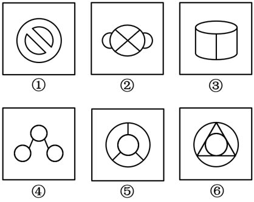
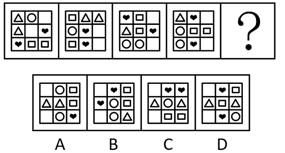
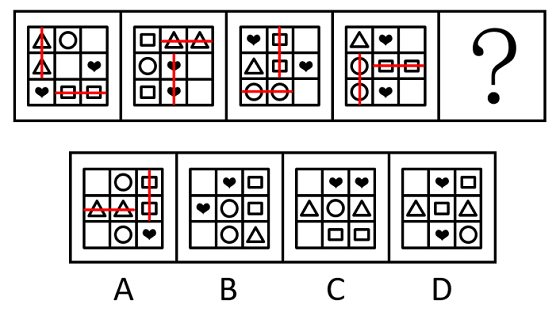
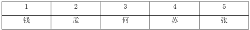

# 2020年北京市定向选调应届优秀大学毕业生《行测》题（网友回忆版）

> 判断推理 · 20 题 · 选调 2020

## 第 1 题　qid 456385 · 图形推理

从所给四个选项中，选择最合适的一个填入问号处，使之呈现一定的规律性：

- **A**. A
- **B**. B
- **C**. C
- **D**. D　✅

**答案**：D

**官方解析**

元素组成不同，且每幅图均由多个封闭图形构成，优先考虑图形间关系。观察发现，题干图形面与面之间都是通过线连接，则？处也应该满足同样的规律，而A、B、C三项中图形面与面之间均是通过点连接，只有D项符合。
故正确答案为D。

---

## 第 2 题　qid 5833602 · 图形推理

从所给的四个选项中，选择最合适的一个填入问号处，使之呈现一定规律性。

- **A**. A
- **B**. B
- **C**. C
- **D**. D　✅

**答案**：D

**官方解析**

元素组成相似，某些元素不止一次出现在题干图形中，优先考虑样式规律中的遍历。观察发现，题干图形都包含四边形，故？处图形也应包含四边形，只有D项符合。
故正确答案为D。

---

## 第 3 题　qid 5833603 · 图形推理

把下面的六个图形分为两类，使每一类图形都有各自的共同特征或规律，分类正确的一项是：

- **A**. ①②④，③⑤⑥　✅
- **B**. ①③⑥，②④⑤
- **C**. ①④⑤，②③⑥
- **D**. ①⑤⑥，②③④

**答案**：A

**官方解析**

解法一：元素组成不同，且无明显属性规律，考虑数量规律。观察发现，题干图形均含有圆，曲线特征明显，考虑数曲线数。图①②④的曲线数均为3，图③⑤⑥的曲线数均为2，故图①②④为一组，图③⑤⑥为一组。
故正确答案为A。
解法二：元素组成不同，且无明显属性规律，考虑数量规律。观察发现，题干图形均由直线和曲线构成，且曲线、直线交叉明显，考虑数曲直交点数。图①②④的曲直交点数均为4，图③⑤⑥的曲直交点数均为6，故图①②④为一组，图③⑤⑥为一组。
故正确答案为A。
解法三：元素组成不同，且无明显属性规律，考虑数量规律。题干图形均含有直线，考虑数直线数。图①②④的直线数均为2，图③⑤⑥的直线数均为3，故图①②④为一组，图③⑤⑥为一组。
故正确答案为A。
注：三种解法都可以选出唯一答案，因本题特征图为：每幅图均包含曲线和直线，且曲线和直线交叉明显，故可以根据特征图优先考虑曲线数或曲直交点数；除了这两种规律外，还可以考虑直线数。考场上这样的思路都是可行且合理的。

---

## 第 4 题　qid 5833623 · 图形推理

从所给的四个选项中，选择最合适的一个填入问号处，使之呈现一定的规律性。

- **A**. A　✅
- **B**. B
- **C**. C
- **D**. D

**答案**：A

**官方解析**

元素组成不同，且无明显属性规律，考虑数量规律。观察发现，题干每幅图均包含4种小元素，且每幅图中小元素的个数分布均为2、2、2、1，但无法确定正确答案；继续观察发现，题干每幅图中都有两对相同的小元素位置相邻，分别将这两对相同的小元素连线，如下图所示，每幅图中的两条连线互相垂直，？处符合此规律，只有A项符合。

故正确答案为A。

---

## 第 5 题　qid 5833625 · 图形推理

把下面的六个图形分为两类，使每一类图形都有各自的共同特征或规律，分类正确的一项是：

- **A**. ①②③，④⑤⑥
- **B**. ①②⑤，③④⑥
- **C**. ①③⑤，②④⑥　✅
- **D**. ①④⑥，②③⑤

**答案**：C

**官方解析**

本题为分组分类题目。元素组成不同，优先考虑属性规律。观察发现，图①③⑤均为全直线图形，图②④⑥均为全曲线图形，即图①③⑤为一组，图②④⑥为一组。
故正确答案为C。

---

## 第 6 题　qid 5833606 · 逻辑判断

某公司新年文艺汇演即将结束时，员工对表演节目进行了投票，投票结果显示，来自工程部的员工都认为第三个节目是最好的，而销售部的员工则都认为第七个节目最佳。小刘把票投给了第三个节目。
基于上述事实，可以断定以下哪项为真？

- **A**. 小刘来自销售部
- **B**. 小刘并不来自销售部　✅
- **C**. 小刘来自工程部
- **D**. 小刘并不来自工程部

**答案**：B

**官方解析**

第一步：翻译题干。

①工程部员工认为第三个节目最好；

②销售部员工认为第七个节目最好；

③小刘把票投给了第三个节目。

第二步：根据题干条件进行推理。

从确定信息条件③入手，根据“③小刘把票投给了第三个节目”可知小刘不认为第七个节目最好，是对条件②的否后，否后必否前，可以推出“小刘不是销售部员工”，对应B项。

故正确答案为B。

---

## 第 7 题　qid 5833612 · 逻辑判断

某单位里新来的员工小陈有项任务没有完成好，他犯了个错误，小陈有点沮丧。老刘安慰他说：“要知道，避免所有的错误是不可能的。”
以下哪项最接近老刘的话？

- **A**. 所有的错误都不可能避免
- **B**. 所有的错误都可能避免
- **C**. 必然有错误不能避免　✅
- **D**. 必然有错误能避免

**答案**：C

**官方解析**

本题考查模态命题。老刘的话“避免所有的错误是不可能的”，即“不可能避免所有错误”，等价于“并非（可能避免所有错误）”，根据模态规则：句子前面去负号、“所有”“有的”互相换、“必然”“可能”互相换、“肯定”“否定”互相换进行同义转化，可以推出“必然不能避免有的错误”，与C项意思相同。
故正确答案为C。

---

## 第 8 题　qid 5833617 · 类比推理

某单位素质拓展训练小组有张、孟、苏、何、钱五人。现需要按身高由高到低从左至右排列，已知①②③三条论断：
①苏的身高不在前三名；
②孟和张之间至少间隔两人；
③钱和何不相邻。
问增加④⑤两条论断中的哪一条或几条后，能准确得出5人的唯一排列顺序？
④张站在苏的右侧；
⑤钱和苏不相邻。

- **A**. 仅④
- **B**. 仅⑤
- **C**. ④或⑤均可
- **D**. ④和⑤需同时满足　✅

**答案**：D

**官方解析**

第一步：分析题干条件。

①苏的身高不在前三名；

②孟和张之间至少间隔两人；

③钱和何不相邻。

第二步：根据题干条件进行推理。

题干问题为“增加哪一条或几条论断，能准确得出5人的唯一排列顺序”，考虑代入法。

代入条件④张站在苏的右侧，结合条件①可以推出，苏在第4名，张在第5名；此时根据条件②③只能推出，孟在第2名，钱、何可任意选择第1名或第3名；继续代入条件⑤钱和苏不相邻，可以推出钱在第1名，何在第3名。

若只代入条件⑤钱和苏不相邻，根据现有条件①②③⑤无法判断孟和张的前后顺序，也就无法确定具体位置，无法得出5人的唯一排列顺序。

综合上述推理，④和⑤需同时满足才能准确得出5人的唯一排列顺序。

故正确答案为D。

---

## 第 9 题　qid 5833619 · 逻辑判断

关于某班学生申请成为冬奥会志愿者有如下四条信息：①该班所有学生都申请成为志愿者。②如果学生小王申请了，则学生小李没有申请。③学生小王申请了。④该班有同学没有申请。
如果上述四条信息中只有一条为假，则可以推出下面哪项为真？

- **A**. ①为假并且小李申请了
- **B**. ②为真并且小李没有申请　✅
- **C**. ③为真并且小李申请了
- **D**. ④为假并且小李没有申请

**答案**：B

**官方解析**

第一步：找矛盾。

①该班所有学生都申请成为志愿者；

②小王申请小李申请；

③小王申请了；

④该班有同学没有申请。

分析题干条件，条件①和条件④为矛盾关系，必有一真一假。

第二步：看其余.

根据题干条件可知，上述四个条件只有一条为假，且条件①和④为矛盾关系，故条件②③均为真，可以推出小王申请了，小李没有申请；再根据小李没有申请，可以推出有同学没有申请，即条件④为真，条件①为假，只有B项符合。

故正确答案为B。

---

## 第 10 题　qid 5833644 · 逻辑判断

“AI合成主播”是通过提取真人主播新闻播报视频中的声音、唇形、表情动作等特征，运用深度学习技木联合建模训练而成。该技术能够将所输入的中英文自动生成相应内容的视频，并确保视频中音频和表情、唇动保持自然一致，展现与真人主播无异的信息传达效果。有人推测，“AI合成主播”最终将取代真人主播。
以下哪项如果为真，最能质疑上述推断？

- **A**. 人的理解、情感、同情心等是无法通过机器完成传达的　✅
- **B**. AI合成主播能根据大众眼光改变自己现有的外形，但缺乏特色
- **C**. AI合成主播属于高科技，其程序需要经常调试升级
- **D**. 机器在评论时事时不会感情用事，观点客观公正，可提高工作效率

**答案**：A

**官方解析**

第一步：找出论点和论据。
论点：“AI合成主播”最终将取代真人主播。
论据：“AI合成主播”技术能够将所输入的中英文自动生成相应内容的视频，并确保视频中音频和表情、唇动保持自然一致，展现与真人主播无异的信息传达效果。
本题论点讨论的是“AI合成主播”将取代真人主播，论据讨论的是“AI合成主播”展现与真人主播无异的信息传达效果，二者话题一致，削弱优先考虑削弱论点。
第二步：逐一分析选项。
A项：该项说的是机器无法传达人的理解、情感、同情心等，说明真人主播有“AI合成主播”无法取代的情况，削弱论点，可以削弱，当选；
B项：该项说的是“AI合成主播”缺乏特色，但无法判断真人主播是否有特色，二者无法进行比较，无法削弱，排除；
C项：该项说的是“AI合成主播”的程序需要经常调试升级，而论点说的是“AI合成主播”将取代真人主播，话题不一致，无法削弱，排除；
D项：该项说的是机器在评论时事时客观公正，能提高工作效率，说明“AI合成主播”在评论时事时比真人主播更有优势，具有一定的加强作用，无法削弱，排除。
故正确答案为A。

---

## 第 11 题　qid 5833645 · 类比推理

A市某品牌电动自行车专营店老板为提高销售量，在每辆电动自行车后面的挡泥皮上都印有店名和营销电话。这样，每销售一辆自行车，就相当于贴出一张免费广告。该店老板认为，这一做法对于提高店里的电动自行车营销量有很大作用。
以下哪项如果为真，最能够支持该店老板的结论？

- **A**. 车主骑着从该店购买的电动自行车出行时，路人通常忙于赶路或只关注交通安全，无暇注意挡泥皮上的广告
- **B**. 已出售的电动自行车停放某处时，通常会引起路人注意，想购买的人就会记下电话，然后询问并购买　✅
- **C**. 目前电动自行车的品牌很多，很多购买者会根据自己的喜好从网上选购，然后等待送货上门
- **D**. 很多生活在该市的上班族或者开汽车出行，或者选择乘公交或地铁出行，很少有购买电动自行车的需要

**答案**：B

**官方解析**

第一步：找出论点和论据。
论点：在每辆电动自行车后面的挡泥皮上都印有店名和营销电话，每销售一辆自行车，就相当于贴出一张免费广告，这对于提高店里的电动自行车营销量有很大作用。
论据：无。
本题只有论点，没有论据，加强优先考虑补充论据。
第二步：逐一分析选项。
A项：路人通常忙于赶路或只关注交通安全，无暇注意电动自行车挡泥皮上的广告，说明该做法对提高该店的电动自行车销量几乎没有作用，可以削弱，无法加强，排除；
B项：已出售的电动自行车挡泥皮上的广告通常会引起路人注意，路人需要购买的时候会通过该广告询问并购买，说明该做法有利于提高该店电动自行车的销量，补充论据，可以加强，当选；
C项：电动自行车的品牌种类多，很多购买者会从网上选购，但论点讨论的是该做法是否有利于提高该店的电动自行车销量，话题不一致，无法加强，排除；
D项：该市很多上班族很少有购买电动自行车的需要，但论点讨论的是该做法是否有利于提高该店的电动自行车销量，话题不一致，无法加强，排除。
故正确答案为B。

---

## 第 12 题　qid 5833620 · 逻辑判断

研究人员发现，“久坐不动”的小鼠经过短期突发运动，可以促进大脑海马体中突触的增加。研究人员注意到一种名叫Mtss1L的基因被短期运动激活后，会促进神经元的树突棘生长。树突棘是神经突触形成的地方，突触是神经细胞间传递信息的关键结构。研究者认为，短期突发运动有助于提高学习和记忆能力。
要想得出上述结论，需要补充的前提条件是：

- **A**. 突触的增加，是学习和记忆能力提高的必要条件　✅
- **B**. Mtss1L的基因在没有突发运动时无法被激活
- **C**. Mtss1L的基因只存在于大脑海马体中
- **D**. 小鼠学习和记忆的机制与人类相似

**答案**：A

**官方解析**

第一步：找出论点和论据。
论点：短期突发运动有助于提高学习和记忆能力。
论据：“久坐不动”的小鼠经过短期突发运动，可以促进大脑海马体中突触的增加。研究人员注意到一种名叫Mtss1L的基因被短期运动激活后，会促进神经元的树突棘生长。树突棘是神经突触形成的地方，突触是神经细胞间传递信息的关键结构。
本题论点讨论的是短期突发运动有助于提高学习和记忆能力，而论据讨论的是短期突发运动促进突触增加的机理，二者话题不一致，且问法为“前提”，加强优先考虑搭桥，即建立“突触增加”和“提高学习和记忆能力”之间的联系。
第二步：逐一分析选项。
A项：该项指出突触的增加是学习和记忆能力提高的必要条件，在“突触增加”和“提高学习和记忆能力”之间建立了联系，搭桥项，可以加强，当选；
B项：该项指出Mtss1L的基因在没有突发运动时无法被激活，说的是Mtss1L基因被激活的条件，而论点讨论的是短期突发运动是否有助于提高学习和记忆能力，话题不一致，无法加强，排除；
C项：该项指出Mtss1L的基因只存在于大脑海马体中，说的是Mtss1L基因存在的位置，而论点讨论的是短期突发运动是否有助于提高学习和记忆能力，话题不一致，无法加强，排除；
D项：该项指出小鼠学习和记忆的机制与人类相似，但论点没有明确提到人类，且没有提及“突触增加”和“提高学习和记忆能力”之间的关系，不是论点成立的前提，排除。
故正确答案为A。

---

## 第 13 题　qid 5833624 · 逻辑判断

粒径6毫米以下的塑料颗粒被称为微塑料，通常以碎片、纤维等形式存在。先前对微塑料的研究较多集中于水体环境。从马里亚纳海沟到南极圈冰冻层，都已发现微塑料的存在。之前的研究认为，河流是海洋中微塑料的重要输送来源，最近有研究者证实，微塑料可能会通过大气“长途旅行”，微塑料的体积和重量足够小后便能在大气中漂浮“借东风”散播到很远的地方。
以下陈述如果为真，哪项无法支持微塑料的随风“长途旅行”现象？

- **A**. 人迹罕至的偏远山地，收集大气中的沉积物样本，发现其中含有大量塑料微粒
- **B**. 科学家从灰尘、雨水和雪中提取沉积物，发现单位平方米中存在不同比例的微塑料
- **C**. 生活在大西洋300-600米深处的鱼类，有70%都在鱼腹中检出了微塑料　✅
- **D**. 原本体积较大的塑料，经过光照、氧化、机械磨损等作用，变成了可在大气中漂浮的颗粒

**答案**：C

**官方解析**

第一步：找出论点和论据。
论点：微塑料可能会通过大气“长途旅行”，微塑料的体积和重量足够小后便能在大气中漂浮“借东风”散播到很远的地方。
论据：无。
本题只有论点没有论据，加强优先考虑补充论据。本题为选非题，排除可以加强的选项即可。
第二步：逐一分析选项。
A项：该项说的是人迹罕至的偏远山地，收集大气中的沉积物样本，发现其中含有大量塑料微粒，通过举例子的方式说明微塑料可能会通过大气“长途旅行”，补充论据，可以加强，排除；
B项：该项说的是科学家从灰尘、雨水和雪中提取沉积物，发现单位平方米中存在不同比例的微塑料，通过举例子的方式说明微塑料可能会通过大气“长途旅行”，补充论据，可以加强，排除；
C项：该项说的是生活在大西洋300-600米深处的鱼类，有70%都在鱼腹中检出了微塑料，即海洋深处存在微塑料，而题干讨论的是微塑料是否会通过大气“长途旅行”，话题不一致，无法加强，当选；
D项：该项说的是原本体积较大的塑料，经过光照、氧化、机械磨损等作用，变成了可在大气中漂浮的颗粒，说明微塑料的体积和重量可以变得足够小，能够通过大气“长途旅行”，是论点成立的必要条件，可以加强，排除。
本题为选非题，故正确答案为C。

---

## 第 14 题　qid 5833614 · 逻辑判断

在超重或肥胖人群、患有未经治疗的II型糖尿病或炎症性肠病的人群中，肠道细菌A.m水平较低。一项小型临床试验结果显示，增加上述人群的肠道细菌A.m水平后，他们的体重下降，葡萄糖耐受不良、胰岛素抗性和肝脏脂肪累积等状况有所改善。因此，研究者认为，细菌A.m可提升人体健康水平。
以下哪项如果为真，最能质疑上述观点？

- **A**. A.m的有益效果只能维持3个月
- **B**. 口服摄入A.m时，肠胃环境会改变A.m的结构或活性
- **C**. 活体或经巴氏消毒的A.m对人体是安全的，而且耐受良好
- **D**. A.m会改变肠道原有细菌的比例，造成菌群失调、肠道功能紊乱　✅

**答案**：D

**官方解析**

第一步：找出论点和论据。
论点：细菌A.m可提升人体健康水平。
论据：在超重或肥胖人群、患有未经治疗的II型糖尿病或炎症性肠病的人群中，肠道细菌A.m水平较低。一项小型临床试验结果显示，增加上述人群的肠道细菌A.m水平后，他们的体重下降，葡萄糖耐受不良、胰岛素抗性和肝脏脂肪累积等状况有所改善。
本题论点论据话题一致，均在讨论细菌A.m对人体健康状况的改善，削弱优先考虑削弱论点。
第二步：逐一分析选项。
A项：该项说的是A.m的有益效果只能维持3个月，说明肠道细菌A.m确实对人体健康具有一定的有益效果，有加强力度，无法削弱，排除；
B项：该项说的是通过口服摄入的方式服用A.m，A.m的结构或活性会被改变，讨论的是摄入方式对A.m的影响，而论点讨论的是A.m对人体健康状况是否有改善效果，二者讨论的话题不一致，无法削弱，排除；
C项：该项说的是活体或经巴氏消毒的A.m对人体是安全的，讨论的是哪种情况下的A.m对人体是安全的，而论点讨论的是A.m对人体健康状况是否有改善效果，二者讨论的话题不一致，无法削弱，排除；
D项：该项说的是A.m会造成菌群失调、肠道功能紊乱，说明A.m对人体健康是有负面影响的，是对论点的直接否定，削弱论点，可以削弱，当选。
故正确答案为D。

---

## 第 15 题　qid 5833616 · 逻辑判断

科学家对在国际空间站工作了12个月的23名宇航员的血液样本进行了测试，结果发现太空旅行没有引起人体免疫系统的主要部分——B细胞浓度的变化。因此，研究者认为，太空旅行几乎无损人体免疫系统。
下列选项如果为真，最能质疑上述结论的是：

- **A**. 参与该研究的宇航员在国际空间站内并未感染病原体
- **B**. 太空旅行引起了另一种免疫细胞——T细胞浓度的变化　✅
- **C**. 体内B细胞浓度的多少与人体免疫力的强弱有直接关系
- **D**. B细胞产生抗体以抗感染，以保护人体免受细菌和病毒的攻击

**答案**：B

**官方解析**

第一步：找出论点和论据。
论点：太空旅行几乎无损人体免疫系统。
论据：太空旅行没有引起人体免疫系统的主要部分——B细胞浓度的变化。
本题论点讨论的是太空旅行对人体免疫系统基本没有损伤，论据讨论的是太空旅行没有引起人体免疫系统的主要部分——B细胞浓度的变化，B细胞浓度只是衡量免疫系统是否受到损伤的一个主要部分，不能代表全部，论点论据话题不一致，削弱优先考虑拆桥。
第二步：逐一分析选项。
A项：该项指出参与该研究的宇航员在国际空间站内并未感染病原体，而论点讨论的是太空旅行是否会损伤宇航员的免疫系统，话题不一致，无法削弱，排除；
B项：该项指出太空旅行引起了T细胞浓度的变化，T细胞也是一种免疫细胞，它的浓度的变化有可能导致宇航员的免疫系统受到损伤，也就是说不能仅仅由B细胞浓度没有变化就得出宇航员的免疫系统没有受损，切断了论点和论据之间的联系，为拆桥项，可以削弱，当选；
C项：该项指出B细胞浓度与人体免疫力的强弱有直接关系，说明B细胞浓度与人体免疫力强弱确实有强相关性，补充论据，为加强项，无法削弱，排除；
D项：该项指出B细胞可以保护人体免受细菌和病毒的攻击，是在说B细胞的作用，而论点讨论的是太空旅行是否会损伤宇航员的免疫系统，话题不一致，无法削弱，排除。
故正确答案为B。

---

## 第 16 题　qid 2187860 · 定义判断

水平迁移是指处于同一抽象和概括水平的经验之间的相互影响，是在难度、复杂程度上属于同一水平层次的两种经验之间的相互影响；垂直迁移是指处于不同抽象和概括水平的经验之间的相互影响，是具有较高概括水平的上位经验与具有较低概括水平的下位经验之间的相互影响。
根据上述定义，下列属于垂直迁移的是：

- **A**. 小学生在学会写“木”这个字后，有助于学会写“森”
- **B**. 学习了“植物”“动物”等概念后，有助于对“生物”这一概念的学习　✅
- **C**. 学习了“老虎”“狮子”等概念后，有助于对不熟悉的鲸或海豚的识别
- **D**. 学习了有关正方形的知识后，有助于对菱形、长方形等相关知识的学习

**答案**：B

**官方解析**

第一步：找出定义关键词。
水平迁移：“处于同一抽象和概括水平的经验之间的相互影响”、“是在难度、复杂程度上属于同一水平层次的两种经验之间的相互影响”；
垂直迁移：“处于不同抽象和概括水平的经验之间的相互影响”、“具有较高概括水平的上位经验与具有较低概括水平的下位经验之间的相互影响”。
第二步：逐一分析选项。
A项：木和森都是汉字，学习木有助于学习森符合“处于同一抽象和概括水平的经验之间的相互影响”，符合“水平迁移”定义，不符合“垂直迁移”定义，排除；
B项：生物是对植物、动物等的概括，概括水平高于植物、动物，学习植物、动物有助于学习生物符合“处于不同抽象和概括水平的经验之间的相互影响”、“具有较高概括水平的上位经验与具有较低概括水平的下位经验之间的相互影响”，符合“垂直迁移”定义，当选；
C项：老虎、狮子、鲸和海豚都是动物，学习老虎、狮子有助于学习鲸、海豚符合“处于同一抽象和概括水平的经验之间的相互影响”，符合“水平迁移”定义，不符合“垂直迁移”定义，排除；
D项：正方形、菱形和长方形都是图形，学习正方形有助于学习菱形、长方形符合“处于同一抽象和概括水平的经验之间的相互影响”，符合“水平迁移”定义，不符合“垂直迁移”定义，排除。
故正确答案为B。

---

## 第 17 题　qid 5833638 · 逻辑判断

政府购买公共服务是指将原来由政府直接提供的、为社会公共服务的事项交给有资质的社会组织或市场机构来完成，并根据社会组织或市场机构提供服务的数量和质量，按照一定的标准进行评估后支付服务费用，即“政府承担、定项委托、合同管理、评估兑现”，是一种新型的政府提供公共服务方式。
下列哪项属于政府购买的公共服务？

- **A**. 国家为保护农民利益和种粮积极性，委托中储粮总公司作为托市收购政策的执行主体，组织国有粮库对稻农实行敞开收购
- **B**. 政府购买了物业公司的保洁服务
- **C**. 某市交管部门为方便市民出行，租用电信公司的短信平台定期给市民发送提醒短信　✅
- **D**. 政府购买了建筑公司的建筑咨询意见

**答案**：C

**官方解析**

第一步：找出定义关键词。
“原来由政府直接提供的、为社会公共服务的事项”、“交给有资质的社会组织或市场机构来完成”、“根据提供服务的数量和质量，政府评估后支付费用”。
第二步：逐一分析选项。
A项：国家委托中储粮总公司组织国有粮库对稻农实行敞开收购，但不明确政府是否会支付费用，不符合“根据提供服务的数量和质量，政府评估后支付费用”，不符合定义，排除；
B项：政府购买了物业公司的保洁服务，但保洁服务原来不由政府直接提供，且不明确该保洁服务是否为社会公共服务，不符合“原来由政府直接提供的、为社会公共服务的事项”，不符合定义，排除；
C项：交管部门将方便市民出行的公共服务交给电信公司完成，符合“原来由政府直接提供的、为社会公共服务的事项”、“交给有资质的社会组织或市场机构来完成”，租用电信公司的短信平台发送短信，说明交管部门可以根据短信的数量和质量来支付费用，符合“根据提供服务的数量和质量，政府评估后支付费用”，符合定义，当选；
D项：政府购买了建筑公司的建筑咨询意见，不明确该建筑咨询意见是否为社会公共服务，不符合“原来由政府直接提供的、为社会公共服务的事项”，不符合定义，排除。
故正确答案为C。

---

## 第 18 题　qid 1797948 · 定义判断

群体规范包括正式规范和非正式规范，前者是指由组织明文规定的员工应遵循的规则和程序；后者是指人们在工作与生活过程中约定俗成的行为准则，该规范的形成受到历史、习惯、群体目的性和社会因素的影响，同时也在很大程度上受到模仿、暗示、顺从等心理因素的制约，在群体成员彼此相互作用的条件下，发生的一种内化的过程。
根据上述定义，下列不属于非正式群体规范的是：

- **A**. 公司要求每位员工在刚入职时签署保密责任书　✅
- **B**. 由于受到描写黑帮的电影影响，一些青少年往往容易进行简单的模仿，形成各种“帮”、“会”等组织
- **C**. 春节是一家人团聚的时刻，北方人常常要在除夕夜包饺子，而南方人则是煮汤圆
- **D**. 在举手表决时，尽管有些人不赞成提案，但碍于情面，也会举手赞成

**答案**：A

**官方解析**

第一步：找出定义关键词。
正式群体规范：“由组织明文规定的员工应遵循的规则和程序”；
非正式群体规范：“约定俗成的行为准则”、“受到历史、习惯、群体目的性和社会因素的影响”、“受到模仿、暗示、顺从等心理因素的制约”。
第二步：逐一分析选项。
A项：公司要求每位员工签署保密责任书，这是公司的一项明文规定，符合“由组织明文规定的员工应遵循的规则和程序”，符合“正式群体规范”定义，不符合“非正式群体规范”定义，当选；
B项：青少年对描写黑帮的电影进行简单模仿，符合“受到模仿、暗示、顺从等心理因素的制约”，符合“非正式群体规范”定义，排除；
C项：南北方春节习俗不同，符合“约定俗成的行为准则”、“受到历史、习惯、群体目的性和社会因素的影响”，符合“非正式群体规范”定义，排除；
D项：有些人不赞成提案却碍于情面举手赞成，符合“受到历史、习惯、群体目的性和社会因素的影响”、“受到模仿、暗示、顺从等心理因素的制约”，符合“非正式群体规范”定义，排除。
本题为选非题，故正确答案为A。

---

## 第 19 题　qid 5833662 · 定义判断

社会保险是一种社会保障制度，是国家通过立法强制建立社会保险基金，对参加劳动者在丧失劳动能力或失业时，给予必要的物质帮助的制度。社会保险强制某一群体将其收入的一部分作为社会保险税（费）形成社会保险基金，在满足一定条件的情况下，被保险人可从基金获得固定的收入或损失的补偿，它是一种再分配制度，目标是保证物质及劳动力的再生产和社会的稳定。社会保险的主要项目包括养老社会保险、医疗社会保险、失业保险、工伤保险、生育保险。
根据上述定义，以下对社会保险认识错误的是（    ）。

- **A**. 社会保险基金根据盈利情况而上调增长　✅
- **B**. 社会保险为被保险者提供了固定收入
- **C**. 社会保险对被保险者只提供基本生活保障
- **D**. 享受社会保险的对象是法定的

**答案**：A

**官方解析**

第一步：找出定义关键词。
“国家通过立法强制建立社会保险基金”、“对参加劳动者在丧失劳动能力或失业时”、“给予必要的物质帮助”、“强制某一群体将其收入的一部分作为社会保险税（费）”、“被保险人可从基金获得固定的收入或损失的补偿”。
第二步：逐一分析选项。
A项：题干并未提及与社会保险基金盈利情况相关的内容，也未提及社会保险基金如何上调增长，根据定义无法得出该项内容，说法错误，当选；
B项：社会保险为被保险者提供了固定收入，符合“被保险人可从基金获得固定的收入或损失的补偿”，说法正确，排除；
C项：社会保险对被保险者只提供基本生活保障，符合“给予必要的物质帮助”，说法正确，排除；
D项：享受社会保险的对象是法定的，符合“国家通过立法强制建立社会保险基金”、“对参加劳动者在丧失劳动能力或失业时”，说法正确，排除。
本题为选非题，故正确答案为A。

---

## 第 20 题　qid 2001524 · 定义判断

前馈控制，是指通过观察情况、收集整理信息、掌握规律、预测趋势，正确预计未来可能出现的问题，提前采取措施，将可能发生的偏差消除在萌芽状态中，为避免在未来不同的发展阶段可能出现的问题而事先采取的措施。根据上述定义，下列不属于前馈控制的是（    ）。

- **A**. 猎人把瞄准点定在飞奔的野兔的前方
- **B**. 海尔公司根据现有产品销售不畅的情况，改变产品结构　✅
- **C**. 根据禽流感疫情预报，医药公司做好医药物品的储备
- **D**. 司机在汽车上坡时，为了保持一定的车速，提前踩加速器

**答案**：B

**官方解析**

第一步：找出定义关键词。
“通过观察情况、收集整理信息、掌握规律、预测趋势”、“正确预计未来可能出现的问题，提前采取措施”。
第二步：逐一分析选项。
A项：把瞄准点定在飞奔野兔的前方，是猎人预测野兔的运动轨迹而提前做好的准备措施，符合“通过观察情况、收集整理信息、掌握规律、预测趋势”、“正确预计未来可能出现的问题，提前采取措施”，符合定义，排除;
B项：海尔公司改变产品结构是由于现有产品销售不畅，该公司的行为是在出现问题后进行的产品调整，不符合“正确预计未来可能出现的问题，提前采取措施”，不符合定义，当选；
C项：根据禽流感疫情预报做好医药物品的储备，是医药公司为了应对未来可能出现的禽流感疫情而提前采取的措施，符合“通过观察情况、收集整理信息、掌握规律、预测趋势”、“正确预计未来可能出现的问题，提前采取措施”，符合定义，排除；
D项：汽车上坡时提前踩加速器，是司机为了应对未来可能出现的车速问题而提前采取的措施，符合“通过观察情况、收集整理信息、掌握规律、预测趋势”、“正确预计未来可能出现的问题，提前采取措施”，符合定义，排除。
本题为选非题，故正确答案为B。

---
