# 2020年四川下半年公务员录用考试《行测》试题（网友回忆版）

> 判断推理 · 35 题 · 四川 2020

## 第 1 题　qid 2725446 · 图形推理

从所给的四个选项中，选择最合适的一个填入问号处，使之呈现一定的规律性：

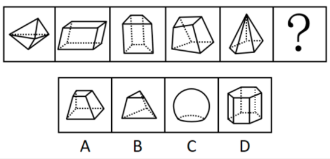

- **A**. A　✅
- **B**. B
- **C**. C
- **D**. D

**答案**：A

**官方解析**

元素组成不同，且无明显属性规律，优先考虑数量规律。观察发现，题干均为立体图形，考虑数立体图形外表面的数量，题干立体图形外表面数量均为6，故问号处应选择一个外表面数量为6的立体图形，只有A项符合。
故正确答案为A。

---

## 第 2 题　qid 2725513 · 图形推理

从所给的四个选项中，选择最合适的一个填入问号处，使之呈现一定的规律性：

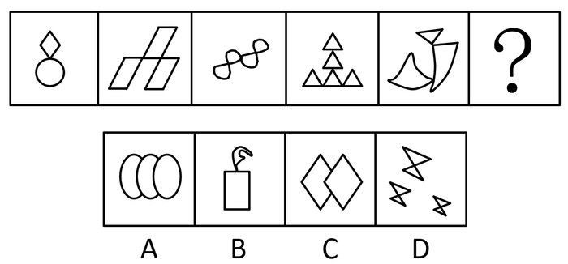

- **A**. A
- **B**. B　✅
- **C**. C
- **D**. D

**答案**：B

**官方解析**

元素组成不同，且每幅图均由多个图形构成，优先考虑图形间关系。观察发现，题干所有图形均相交于点，排除A、C两项。进一步观察发现，题干图形均为一部分，排除D项。
故正确答案为B。

---

## 第 3 题　qid 2725452 · 图形推理

从所给的四个选项中，选择最合适的一个填入问号处，使之呈现一定的规律性：

- **A**. A
- **B**. B
- **C**. C
- **D**. D　✅

**答案**：D

**官方解析**

元素组成相似，优先考虑样式规律。题干中各图形均由黑圆和白圆组成，九宫格题目优先考虑横向比较，但无明显规律，考虑纵向比较。观察发现，第一列中，前两个图形去同求异之后得到第三个图形（白圆被黑圆遮挡）；第二列中，前两个图形去同求异之后得到第三个图形（白圆被黑圆遮挡）；故第三列？处图形应由前两个图形去同求异得到（白圆被黑圆遮挡），只有D项符合。
故正确答案为D。

---

## 第 4 题　qid 2725458 · 图形推理

下列选项中由左边四个图形拼合而成的是：

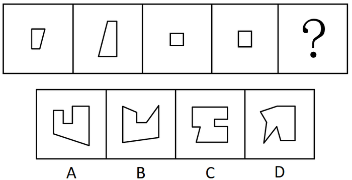

- **A**. A
- **B**. B
- **C**. C　✅
- **D**. D

**答案**：C

**官方解析**

本题考查平面拼合，可采用平行且等长相消的方式解题。消去平行且等长的线段后进行组合可得到轮廓图，即为C项。平行且等长相消的方式如下图所示：

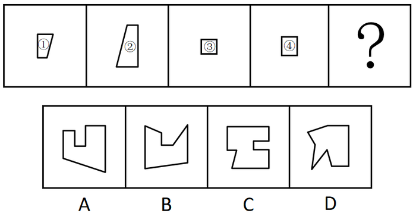

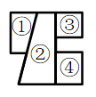

故正确答案为C。

---

## 第 5 题　qid 2725553 · 类比推理

下列选项中与图中所给几何图不一致的是：

- **A**. A
- **B**. B
- **C**. C　✅
- **D**. D

**答案**：C

**官方解析**

如下图，将题干立体图形中左上角的方块标为1号方块，观察发现，题干立体图形中1号方块与黑色粗线条贯穿的三个方块在同侧，而C项中相应位置的1号方块与黑色粗线条贯穿的三个方块在斜对侧，所以C项与题干所给几何图不一致。

本题为选非题，故正确答案为C。

注：本题不严谨，因为问“不一致”，说明出题人把与题干互为镜像的B、D两项当成了一致，所以唯一完全不一致的只有C项。

---

## 第 6 题　qid 2725345 · 图形推理

左边给定的是纸盒外表面的展开图，下列哪项能由它折叠而成？

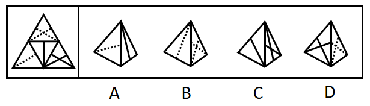

- **A**. A
- **B**. B　✅
- **C**. C
- **D**. D

**答案**：B

**官方解析**

将题干展开图中的面依次标注为面a、b、c、d，如下图：

A项：由面b和面c构成，以面c中的点1为起点，顺时针画边，如下图：

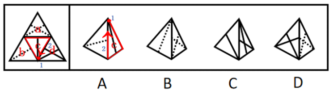

题干展开图中与边2相邻的面是面d，而选项中与边2相邻的面是面b，与题干不符，排除；

B项：选项与题干一致，当选；

C项：由面c和面d构成，以面d中的点3为起点，顺时针画边，如下图：

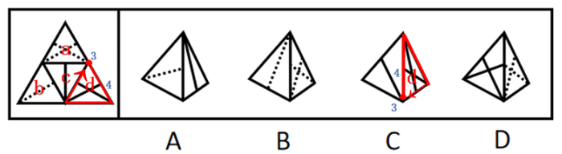

题干展开图中与边4相邻的面是面a，而选项中与边4相邻的面是面c，与题干不符，排除；

D项：由面a和面d构成，以面a中的点5为起点，顺时针画边，如下图：

题干展开图中与边6相邻的面是面b，而选项中与边6相邻的面是面d，与题干不符，排除。

故正确答案为B。

---

## 第 7 题　qid 2725321 · 图形推理

把下面的六个图形分为两类，使每一类图形都有各自的共同特征或规律，分类正确的一项是：

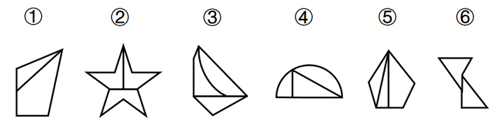

- **A**. ①③⑥，②④⑤　✅
- **B**. ①④⑥，②③⑤
- **C**. ①②④，③⑤⑥
- **D**. ①③⑤，②④⑥

**答案**：A

**官方解析**

本题为分组分类题。元素组成不同，且无明显属性规律，考虑数量规律。观察题干图形发现，每个图形均存在两条直线垂直相交，考虑直角数。图①③⑥有一个直角，图②④⑤有两个直角，即图①③⑥为一组，图②④⑤为一组。
故正确答案为A。

---

## 第 8 题　qid 2725329 · 图形推理

把下面的六个图形分为两类，使每一类图形都有各自的共同特征或规律，分类正确的一项是：

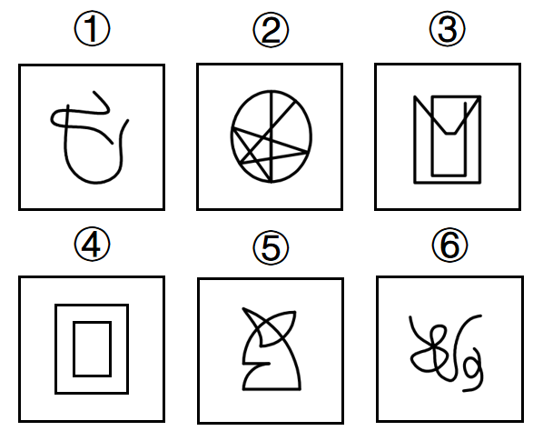

- **A**. ①②③，④⑤⑥
- **B**. ①④⑥，②③⑤　✅
- **C**. ①②⑤，③④⑥
- **D**. ①②⑥，③④⑤

**答案**：B

**官方解析**

本题为分组分类题。元素组成不同，且无明显属性规律，优先考虑数量规律。题干图①、图⑥为多端点图形，图②为五角星变形图，考虑笔画数。图①④⑥均为两笔画图形，图②③⑤均为一笔画图形，即图①④⑥为一组，图②③⑤为一组。
故正确答案为B。

---

## 第 9 题　qid 2725322 · 图形推理

把下面的六个图形分为两类，使每一类图形都有各自的共同特征或规律，分类正确的一项是：

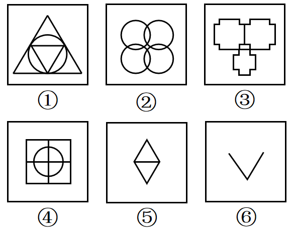

- **A**. ①②③，④⑤⑥
- **B**. ①③④，②⑤⑥
- **C**. ①②⑤，③④⑥
- **D**. ①③⑥，②④⑤　✅

**答案**：D

**官方解析**

本题为分组分类题目。元素组成不同，优先考虑属性规律。观察可知，题干图①、图④、图⑤都出现了等腰元素，且其余图形都比较规整，优先考虑对称性。图①③⑥均为轴对称图形，图②④⑤均为轴中心对称图形。因此，图①③⑥为一组，图②④⑤为一组。

故正确答案为D。

---

## 第 10 题　qid 2725328 · 图形推理

把下面的六个图形分为两类，使每一类图形都有各自的共同特征或规律，分类正确的一项是：

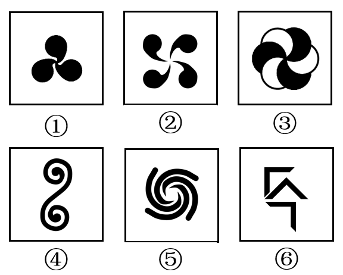

- **A**. ①②④，③⑤⑥
- **B**. ①③④，②⑤⑥　✅
- **C**. ①③⑤，②④⑥
- **D**. ①②③，④⑤⑥

**答案**：B

**官方解析**

本题为分组分类题目。元素组成不同，且无明显属性规律，考虑数量规律。观察发现，图①③④中相同的图形均相连，为1个部分；图②⑤⑥中相同的图形均不相连，为多个部分。即图①③④为一组，图②⑤⑥为一组。
故正确答案为B。

---

## 第 11 题　qid 2725280 · 定义判断

中心路径说服是指通过提供强有力且令人信服的论据进行说服，外周路径说服是指采用熟悉易懂的表述或视觉形象来进行说服。
根据上述定义，下列属于中心路径说服的是：

- **A**. 杂志上的计算机广告详细列出了产品的特点及价格信息　✅
- **B**. 啤酒广告总是将啤酒与聚会等轻松热闹的场景联系在一起
- **C**. 理财推广员告诫客户，不要把所有的鸡蛋都放在一个篮子里
- **D**. 耳机厂商把产品赠送给球星，并让他们带着耳机出现在大众前

**答案**：A

**官方解析**

第一步：找出定义关键词。
中心路径说服：“强有力且令人信服的论据”；
外周路径说服：“熟悉易懂的表述或视觉形象”。
第二步：逐一分析选项。
A项：详细列出了产品的特点及价格信息，属于“强有力且令人信服的论据”，符合中心路径说服的定义，当选；
B项：将啤酒与聚会等轻松热闹的场景联系在一起，属于“熟悉易懂的视觉形象”，符合外周路径说服的定义，排除；
C项：不要把所有的鸡蛋都放在一个篮子里，属于“熟悉易懂的表述”，符合外周路径说服的定义，排除；
D项：让球星带着耳机出现在大众前，属于“熟悉易懂的视觉形象”，符合外周路径说服的定义，排除。
故正确答案为A。

---

## 第 12 题　qid 2725285 · 定义判断

蔡格尼克效应指的是人们对于那些未能完成的事项的记忆有时会比对已完成事项记忆更好的现象。
根据上述定义，下列属于蔡格尼克效应的是：

- **A**. 作业写到一半被同伴拉去踢球，踢完球回家就把写作业的事置之脑后
- **B**. 由于迟到，电影的开场未能看到，至今还对这部电影的情节记忆犹新
- **C**. 电视剧没看完被要求听讲座，事后忘记讲座内容却对电视剧念念不忘　✅
- **D**. 团队未能完成某项目的攻关任务，其成员至今对这一遗憾仍耿耿于怀

**答案**：C

**官方解析**

第一步：找出定义关键词。
“对于那些未能完成的事项的记忆有时会比对已完成事项记忆更好”。
第二步：逐一分析选项。
A项：写作业属于未完成事项，踢球属于已完成事项，把写作业的事置之脑后说明对未完成事项的记忆并不好，不符合定义，排除；
B项：看电影开场属于未完成事项，看电影的情节属于已完成事项，对电影情节记忆犹新说明对已完成事项的记忆较好，不符合定义，排除；
C项：看电视剧属于未完成事项，听讲座属于已完成事项，忘记讲座内容却对电视剧念念不忘，说明对未完成事项的记忆比对已完成事项的记忆更好，符合定义，当选；
D项：攻关任务属于未完成事项，没有已完成事项，无法进行对比，不符合定义，排除。
故正确答案为C。

---

## 第 13 题　qid 2725287 · 定义判断

亲社会侵犯行为是指为了达到为社会团体的准则所能接受的目的，以一种社会认可的方式所做出的侵犯行为。
根据上述定义，下列属于亲社会侵犯行为的是：

- **A**. 老张和老王因纠纷而打架斗殴
- **B**. 家长用罚站教育不听话的孩子
- **C**. 李女士将企图侮辱她的坏人打伤
- **D**. 张某在街上抓住小偷扭送至派出所　✅

**答案**：D

**官方解析**

第一步：找出定义关键词。
“为了达到为社会团体的准则所能接受的目的”、“以一种社会认可的方式所做出的侵犯行为”。
第二步：逐一分析选项。
A项：老张和老王因纠纷而打架斗殴，打架斗殴不属于被社会认可的方式，不符合“以一种社会认可的方式所做出的侵犯行为”，不符合定义，排除；
B项：家长用罚站教育不听话的孩子，属于教育孩子的一种行为，不符合“为了达到为社会团体的准则所能接受的目的”，不符合定义，排除；
C项：李女士将企图侮辱她的坏人打伤，不符合“为了达到为社会团体的准则所能接受的目的”、“以一种社会认可的方式所做出的侵犯行为”，不符合定义，排除；
D项：张某在街上抓住小偷扭送至派出所，抓小偷属于社会认可的行为，且抓小偷这一过程对小偷来说属于侵犯行为，符合“为了达到为社会团体的准则所能接受的目的”、“以一种社会认可的方式所做出的侵犯行为”，符合定义，当选。
故正确答案为D。

---

## 第 14 题　qid 2725290 · 定义判断

再造想象是指根据言语的描述或图样的示意，在人脑中形成有关事物的形象的过程。
根据上述定义，下列属于再造想象的是：

- **A**. 某人受到亭子能避雨但无法移动的启发，发明了雨伞
- **B**. 读毛主席的《沁园春·雪》时，人们脑海中呈现出一副雪景图　✅
- **C**. 鲁迅先生在创作《故乡》时，根据记忆塑造了少年闰土这一形象
- **D**. 观众在欣赏舞者的《雀之灵》时，仿佛看到孔雀开屏的美丽景象

**答案**：B

**官方解析**

第一步：找出定义关键词。
“根据言语的描述或图样的示意”、“在人脑中形成有关事物的形象”。
第二步：逐一分析选项。
A项：某人根据亭子能避雨但无法移动发明了雨伞，属于创造出新事物、新形象，不符合“根据言语的描述或图样的示意”、“在人脑中形成有关事物的形象”，不符合定义，排除；
B项：读毛主席的《沁园春·雪》时，人们脑海中呈现雪景图，符合“根据言语的描述或图样的示意”、“在人脑中形成有关事物的形象”，符合定义，当选；
C项：鲁迅先生根据记忆塑造了少年闰土的形象，属于创造过程，不符合“根据言语的描述或图样的示意”、“在人脑中形成有关事物的形象”，不符合定义，排除；
D项：观众欣赏舞蹈《雀之灵》时，仿佛看到孔雀开屏的美丽景象，是舞者技术高超，所以就像真实孔雀一般呈现在观众眼前，不符合“根据言语的描述或图样的示意”、“在人脑中形成有关事物的形象”，不符合定义，排除。
故正确答案为B。

---

## 第 15 题　qid 2725278 · 定义判断

普雷马克原理是指利用频率较高的活动来强化频率较低的活动，从而促进低频活动的发生，或者用个体喜欢做的事情作为一种强化手段，刺激其做出他们本身不喜欢的行为。
根据上述定义，下列利用普雷马克原理的是：

- **A**. 如果认真练习钢琴两小时，小朵就可以看两集动画片　✅
- **B**. 由于写完作业后还要做家务，小明故意拖延作业时间
- **C**. 如果每天按时上下班，月底就可以拿到200元全勤奖
- **D**. 如果能每天坚持锻炼，就不需要通过节食来保持身材

**答案**：A

**官方解析**

第一步：找出定义关键词。
“利用频率较高的活动来强化频率较低的活动”、“促进低频活动的发生”、“用个体喜欢做的事情作为一种强化手段”、“刺激其做出他们本身不喜欢的行为”。
第二步：逐一分析选项。
A项：用看动画片作为强化手段，让小朵认真练习钢琴两个小时，符合“用个体喜欢做的事情作为一种强化手段”、“刺激其做出他们本身不喜欢的行为”，符合定义，当选；
B项：小明为了不做家务拖延写作业的时间，没有起到强化刺激和促进作用，不符合“利用频率较高的活动来强化频率较低的活动”、“促进低频活动的发生”、“刺激其做出他们本身不喜欢的行为”，不符合定义，排除；
C项：月底200元的全勤奖相对于每天按时上下班来说频率较低，不符合“利用频率较高的活动来强化频率较低的活动”，且200元的全勤奖作为奖励不是个体喜欢做的事情，也不符合“用个体喜欢做的事情作为一种强化手段”，不符合定义，排除；
D项：坚持锻炼和节食，两者并没有体现活动频率的高低，也没有说明是否为个体喜欢做的事，不符合“利用频率较高的活动来强化频率较低的活动”、“用个体喜欢做的事情作为一种强化手段”，不符合定义，排除。
故正确答案为A。

---

## 第 16 题　qid 2725281 · 定义判断

自我应验效应是指由原先错误的期望引起，最终这个错误的期望变成了现实的行为。
根据上述定义，下列属于自我应验效应的是：

- **A**. 小金对舞蹈不感兴趣，但父母觉得孩子的兴趣是父母坚持的结果，希望她有所成就，花了大量心血培养她，可她表现平平
- **B**. 小林从小酷爱足球，父母也发现了他在足球上的天赋，期望他将来能成为一名足球运动员，在父母的苦心栽培下小林终于如愿以偿
- **C**. 小莉是某画家的养女，对收养不知情的老师觉得她应该有艺术天赋，在老师的不断鼓励下，她真的成了一位小画家　✅
- **D**. 小南学习成绩在学校一直都是名列前茅，父母对他期望很高，觉得他考名牌大学没有问题，可小南高考发挥失常，与名校失之交臂

**答案**：C

**官方解析**

第一步：找出定义关键词。
“由原先错误的期望引起”、“最终这个错误的期望变成了现实的行为”。
第二步：逐一分析选项。
A项：小金对舞蹈不感兴趣，但父母还是希望她在舞蹈上有所成就，这是一种错误的期望，符合“由原先错误的期望引起”，花了大量心血培养她，可她表现平平，说明父母的期望没有变成现实，不符合“最终这个错误的期望变成了现实的行为”，不符合定义，排除；
B项：小林酷爱足球且有天赋，父母期望他将来能成为一名足球运动员，这是一种正确合理的期望，不符合“由原先错误的期望引起”，不符合定义，排除；
C项：某画家的养女小莉可能并不具有艺术天赋，但不知情的老师觉得她应该有艺术天赋，这是一种错误的期望，符合“由原先错误的期望引起”，在老师的不断鼓励下，她真的成了一位小画家，符合“最终这个错误的期望变成了现实的行为”，符合定义，当选；
D项：小南学习成绩在学校一直都是名列前茅，父母对他期望很高，觉得他考名牌大学没有问题，这是一种正确合理的期望，不符合“由原先错误的期望引起”，并且他最后也没有考上名校，不符合“最终这个错误的期望变成了现实的行为”，不符合定义，排除。
故正确答案为C。

---

## 第 17 题　qid 2725284 · 定义判断

防御机制中的投射作用是指将自己行为中不为社会认可的部分加诸他人，藉以减少自己因此而产生的焦虑。
根据上述定义，下列不属于防御机制中的投射作用的是：

- **A**. 连续几年，小王的销售业绩总是垫底，他将自己的困境归咎于经济不景气　✅
- **B**. 某小贩做生意总是缺斤少两，他辩解天下乌鸦一般黑，其他小贩也是如此
- **C**. 某考生作弊，老师进行批评教育，他不以为然，觉得作弊是“公开的秘密”
- **D**. 某老板总是无理克扣员工工资，还狡辩资本家都是靠榨取剩余价值发家的

**答案**：A

**官方解析**

第一步：找出定义关键词。
“将自己行为中不为社会认可的部分加诸他人”、“减少自己因此而产生的焦虑”。
第二步：逐一分析选项。
A项：小王的销售业绩总是垫底，他将自己的困境归咎于经济不景气，并没有加诸他人，不符合“将自己行为中不为社会认可的部分加诸他人”，不符合定义，当选；
B项：某小贩做生意总是缺斤少两，他辩解天下乌鸦一般黑，其他小贩也是如此，符合“将自己行为中不为社会认可的部分加诸他人”，符合定义，排除；
C项：某考生作弊，老师进行批评教育，他不以为然，觉得作弊是“公开的秘密”，即别人也会这样做，符合“将自己行为中不为社会认可的部分加诸他人”，符合定义，排除；
D项：某老板总是无理克扣员工工资，还狡辩资本家都是靠榨取剩余价值发家的，符合“将自己行为中不为社会认可的部分加诸他人”，符合定义，排除。
本题为选非题，故正确答案为A。

---

## 第 18 题　qid 2725288 · 定义判断

拖延症是指自我调节失败，在能够预料后果有害的情况下，仍然把计划要做的事情往后推迟的一种行为。
根据上述定义，下列属于拖延症的是：

- **A**. 每天下班后，小玲至少加班1小时，甚至有时还会把工作带回家处理
- **B**. 小丽与小鹏打算大学毕业就结婚，但由于小鹏创业失败，公司破产，小丽找各种借口拖延结婚，失望至极的小鹏决定与小丽分手
- **C**. 烟龄20年的老李最近被咳嗽困扰决定戒烟，但每次戒烟都坚持不到5天就会复吸，反复若干次，最后他还是放弃了戒烟的打算
- **D**. 小美想出版个人画册并与出版社约定了交稿日期，但由于工作繁忙，她迟迟不愿动笔，总是想“明天赶赶就行了”，到了交稿日期，作品只完成一半　✅

**答案**：D

**官方解析**

第一步：找出定义关键词。
“自我调节失败”、“在能够预料后果有害的情况下”、“把计划要做的事情往后推迟”。
第二步：逐一分析选项。
A项：小玲加班甚至把工作带回家处理，没有体现小玲“自我调节失败”，也没有体现“在能够预料后果有害的情况下”、“把计划要做的事情往后推迟”，不符合定义，排除；
B项：小鹏创业失败，公司破产，小丽找借口拖延结婚，导致小鹏决定与小丽分手，实际上小丽并不是拖延，而是不愿意结婚，不符合“在能够预料后果有害的情况下”、“把计划要做的事情往后推迟”，不符合定义，排除；
C项：老李每次戒烟都会复吸，最终放弃了戒烟，体现了老李重复戒烟、重复吸烟，最终放弃的过程，老李开始并没有拖延，而是戒烟失败了，不符合“在能够预料后果有害的情况下”、“把计划要做的事情往后推迟”，不符合定义，排除；
D项：小美与出版社约定了交稿日期，若没有及时画稿会导致作品完成不了，符合“在能够预料后果有害的情况下”，她迟迟不愿动笔，符合“把计划要做的事情往后推迟”，符合定义，当选。
故正确答案为D。

---

## 第 19 题　qid 2725395 · 定义判断

社会比较同化效应指的是当个体与比自己境况好的对象进行比较时，会产生一种觉得自己和比自己境况好的人一样好，进而提高对自己能力等方面的评价；而当个体与比自己境况差的个体进行比较时，会产生一种觉得自己和比自己境况差的人一样差，进而降低对自己能力等方面的评价。
根据上述定义，下列属于社会比较同化效应的是：

- **A**. 癌症病人看到病情比自己更严重的病人时，庆幸自己的处境并非最差
- **B**. 小杰和小伟在学习上你追我赶，因此小杰把小伟当作自己的竞争目标
- **C**. 小宁从普通初中考入重点高中，看到周围同学都那么优秀而自惭形秽
- **D**. 小威听了师兄师姐的优秀事迹后，觉得自己也可以变得那么优秀　✅

**答案**：D

**官方解析**

第一步：找出定义关键词。
“当个体与比自己境况好的对象进行比较时，会产生一种觉得自己和比自己境况好的人一样好”、“当个体与比自己境况差的个体进行比较时，会产生一种觉得自己和比自己境况差的人一样差”。
第二步：逐一分析选项。
A项：癌症病人看到病情比自己更严重的病人，觉得自己并不是最差的，不符合“当个体与比自己境况差的个体进行比较时，会产生一种觉得自己和比自己境况差的人一样差”，不符合定义，排除；
B项：小杰只是把小伟当作自己的竞争目标，并不存在境况差异的比较，不符合定义，排除；
C项：小宁看到周围同学很优秀而自惭形秽，属于和境况好的人对比，觉得没有别人好，不符合“当个体与比自己境况好的对象进行比较时，会产生一种觉得自己和比自己境况好的人一样好”，不符合定义，排除；
D项：小威拿师兄师姐进行比较，觉得自己也可以变得和他们一样优秀，符合“当个体与比自己境况好的对象进行比较时，会产生一种觉得自己和比自己境况好的人一样好”，符合定义，当选。
故正确答案为D。

---

## 第 20 题　qid 2725469 · 定义判断

不随意注意是指没有预定目的，不需要意志努力，不由自主地对一定事物所产生的注意；随意注意指的是有预定目的，需要一定意志努力的注意，它是注意的一种积极、主动的形式；随意后注意是注意的一种特殊形式，是指有自觉目的但不需要意志努力的注意。
①家庭主妇小张厨艺娴熟，在切菜的同时，还可以看电视剧
②教室里小明在聚精会神地听老师讲课，时不时还记着笔记
③安静的课堂忽然闯进来一个人，大家不约而同抬头看向他
根据上述定义，下列选项对应关系正确的是：

- **A**. ①③涉及不随意注意
- **B**. ②涉及随意后注意
- **C**. ②③涉及随意注意
- **D**. ①涉及随意后注意　✅

**答案**：D

**官方解析**

第一步：找出定义关键词。
不随意注意：“没有预定目的”、“不需要意志努力”、“不由自主地对一定事物所产生的注意”；
随意注意：“有预定目的”、“需要一定意志努力”；
随意后注意：“有自觉目的但不需要意志努力”。
第二步：逐一分析三个情景。
情景①：家庭主妇小张厨艺娴熟，在切菜的同时，还可以看电视剧。
分析：切菜的同时看电视剧是有一定目的但不需要意志努力的，符合“有自觉目的但不需要意志努力”，符合“随意后注意”的定义。
情景②：教室里小明在聚精会神地听老师讲课，时不时还记着笔记。
分析：聚精会神地听课并且记笔记，是有预定目的的，需要意志努力的，符合“有预定目的”、“需要一定意志努力”，符合“随意注意”的定义。
情景③：安静的课堂忽然闯进来一个人，大家不约而同抬头看向他。
分析：大家看向忽然闯进的人是没有预定目的的，也不需要意志努力的，是不由自主地关注，符合“没有预定目的”、“不需要意志努力”、“不由自主地对一定事物所产生的注意”，符合“不随意注意”的定义。
因而情景①对应随意后注意，情景②对应随意注意，情景③对应不随意注意。
故正确答案为D。

---

## 第 21 题　qid 2725471 · 类比推理

懒惰∶失败

- **A**. 积分∶兑换
- **B**. 昏迷∶晕倒
- **C**. 运筹∶决战
- **D**. 犯罪∶坐牢　✅

**答案**：D

**官方解析**

第一步：判断题干词语间逻辑关系。
懒惰可能会导致失败，二者为或然因果关系。
第二步：判断选项词语间逻辑关系。
A项：积分可以用来兑换物品，不存在因果关系，与题干逻辑关系不一致，排除；
B项：昏迷是由于大脑功能受到极度抑制而意识丧失和随意运动消失的病理状态，晕倒是指因头晕站立不稳而倒地，两者均指意识丧失，只存在时间上的差别，不具有因果关系，与题干逻辑关系不一致，排除；
C项：对战场运筹的好坏，会决定决战的成败，但是运筹和决战不存在因果关系，与题干逻辑关系不一致，排除；
D项：犯罪可能会导致坐牢，二者为或然因果关系，与题干逻辑关系一致，当选。
故正确答案为D。

---

## 第 22 题　qid 2725473 · 类比推理

书法：欧体

- **A**. 希腊神话∶中国神话
- **B**. 蟠桃园∶仙桃
- **C**. 著作∶专著　✅
- **D**. 知网∶网络

**答案**：C

**官方解析**

第一步：判断题干词语间逻辑关系。
欧体是一种书法，二者为包容关系中的种属关系。
第二步：判断选项词语间逻辑关系。
A项：希腊神话与中国神话是以国家为划分标准的两种神话，为并列关系，与题干逻辑关系不一致，排除；
B项：在神话传说中蟠桃园里有仙桃，二者为地点的对应关系，与题干逻辑关系不一致，排除；
C项：专著为就某方面加以研究论述的专门著作，故专著是一种著作，二者为包容关系中的种属关系，与题干逻辑关系一致，当选；
D项：知网是一个网络网站，运用于网络领域，二者为对应关系，与题干逻辑关系不一致，排除。
故正确答案为C。

---

## 第 23 题　qid 2725475 · 类比推理

手足∶手∶足

- **A**. 江湖∶江∶湖　✅
- **B**. 巨大∶巨∶大
- **C**. 拉扯∶拉∶扯
- **D**. 给予∶给∶予

**答案**：A

**官方解析**

第一步：判断题干词语间逻辑关系。
手足由手和足组成，后两个词组成第一个词；且三个词的词性均为名词。
第二步：判断选项词语间逻辑关系。
A项：江湖由江和湖组成，后两个词组成第一个词；且三个词的词性均为名词，与题干逻辑关系一致，当选；
B项：巨大由巨和大组成，后两个词组成第一个词；但三个词的词性均为形容词，与题干逻辑关系不一致，排除；
C项：拉扯由拉和扯组成，后两个词组成第一个词；但三个词的词性均为动词，与题干逻辑关系不一致，排除；
D项：给予由给和予组成，后两个词组成第一个词；但三个词的词性均为动词，与题干逻辑关系不一致，排除。
故正确答案为A。

---

## 第 24 题　qid 2725478 · 类比推理

丛林 对于 （    ） 相当于 （    ） 对于 驾驶员

- **A**. 雨林；轿车
- **B**. 猛虎；司机
- **C**. 树木；乘客
- **D**. 伐木工；游轮　✅

**答案**：D

**官方解析**

逐一代入选项。
A项：丛林与雨林侧重点不同、覆盖不同、树木密度不同，二者为并列关系，驾驶员驾驶轿车，二者为对应关系，前后逻辑关系不一致，排除；
B项：丛林可以是猛虎的生存环境，二者为地点对应关系，司机是驾驶员的别称，二者为全同关系，前后逻辑关系不一致，排除；
C项：树木是丛林的一部分，二者为组成关系，驾驶员为乘客服务，二者为对应关系，前后逻辑关系不一致，排除；
D项：伐木工可以在丛林工作，二者为职业与地点对应关系，驾驶员可以在游轮工作，二者为职业与地点对应关系，前后逻辑关系一致，当选。
故正确答案为D。

---

## 第 25 题　qid 2725480 · 类比推理

烤箱 对于 （    ） 相当于 （    ） 对于 书本

- **A**. 微波炉；纸张
- **B**. 面包；报纸
- **C**. 蛋糕；印刷厂　✅
- **D**. 炊具；知识

**答案**：C

**官方解析**

逐一代入选项。
A项：烤箱和微波炉均为厨房电器，二者为并列关系，纸张组成书本，二者为组成关系，前后逻辑关系不一致，排除；
B项：烤箱制作面包，二者为对应关系，报纸和书本为并列关系，前后逻辑关系不一致，排除；
C项：烤箱制作蛋糕，印刷厂制作书本，均为对应关系，前后逻辑关系一致，当选；
D项：烤箱是炊具，二者为种属关系，书本是知识的载体，前后逻辑关系不一致，排除。
故正确答案为C。

---

## 第 26 题　qid 2725481 · 逻辑判断

某研究院指出，随着科技的进步，未来全球大概有3.75亿人将面临重新就业，其中中国占一亿。人工智能虽然会取代人类的很多工作，但是有创造力和丰富情感的工作，是人工智能无法取代的，比如科学、文艺、育儿、养老、教师等工作，相比较现在而言，反而会逆势上扬，成为将来的热门。
以下哪项如果为真，最能支持上述观点？

- **A**. 处理大批数据的工作，人的判断误差能力不如机器人
- **B**. 一些著名企业的总裁陆续表示，计划使用人工智能代替运营人员
- **C**. 掌握深度学习能力的人工智能，拥有编程的能力，能轻松编写歌曲，创造出新的绘画风格
- **D**. 智能是认知和加工信息的能力，情感则是由生物进化长期形成的，前者不可能产生后者　✅

**答案**：D

**官方解析**

第一步：找出论点和论据。
论点：有创造力和丰富情感的工作，是人工智能无法取代的，比如科学、文艺、育儿、养老、教师等工作，相比较现在而言，反而会逆势上扬，成为将来的热门。
论据：无。
本题只有论点，没有论据，优先考虑补充论据来进行加强。
第二步：逐一分析选项。
A项：指出人类在处理大批数据时的判断误差能力不如机器人，说明人工智能可以取代人类的这些工作，但处理大批数据的工作不属于有创造力和丰富情感的工作，话题不一致，无法加强，排除；
B项：指出部分企业打算用人工智能来代替运营人员，但无法确定运营人员的工作是否需要创造力和丰富情感，属于不明确选项，无法加强，排除；
C项：指出有深度学习能力的人工智能，可以轻松编写歌曲，创造出新的绘画风格等，证明了人工智能有创造性，具有削弱作用，无法加强，排除；
D项：指出智能不可能产生情感，解释了为什么人工智能无法胜任有创造力和丰富情感的工作，补充论据，当选。
故正确答案为D。

---

## 第 27 题　qid 2725486 · 逻辑判断

碳酸钙是珍珠的主要成分，占珍珠比例的百分之九十，但是，想用皮肤来吸收碳酸钙，这几乎是不可能的，因为皮肤有多层结构，固体的珍珠粉很难渗入。珍珠粉外敷之后若有残留粉末，可能会反射出一定的光泽，显得皮肤变白了。其实这只是假象。所以，想靠着珍珠粉去美白是不太现实的。
下列选项除了哪项外，均能反驳上述论证？

- **A**. 现代技术能让珍珠粉的大小达到百纳米以下，可以被吸入皮肤
- **B**. 某明星有长期外用珍珠粉的习惯，年过60仍皮肤润泽柔滑，细腻白皙
- **C**. 珍珠粉外敷能部分隔绝空气，减缓空气对皮肤表层细胞的氧化，长期使用能延缓衰老　✅
- **D**. 珍珠粉中的牛磺酸具有加强巨噬细胞吞噬的能力，黑色素进入表皮层之后部分会被巨噬细胞吞噬降解

**答案**：C

**官方解析**

第一步：找出论点和论据。
论点：想靠着珍珠粉去美白是不太现实的。
论据：想用皮肤来吸收碳酸钙，这几乎是不可能的，因为皮肤有多层结构，固体的珍珠粉很难渗入。珍珠粉外敷之后若有残留粉末，可能会反射出一定的光泽，显得皮肤变白了。
本题论点说的是靠着珍珠粉去美白不现实，论据说的是碳酸钙无法被皮肤吸收。论点和论据话题不一致，削弱可以考虑拆桥，也可以削弱论点和削弱论据，因为本题为选非题，排除削弱项即可。
第二步：逐一分析选项。
A项：指出现代技术可以实现珍珠粉被吸入皮肤，说明珍珠粉中的碳酸钙可以渗入皮肤，削弱论据，排除；
B项：以某明星为例证明外用珍珠粉可以让皮肤白皙，从而证明珍珠粉可以美白，削弱论点，排除；
C项：指出珍珠粉外敷可以减缓皮肤表层细胞被氧化，缓解衰老，而论点讨论的是珍珠粉是否能起到美白的作用，话题不一致，无法削弱，当选；
D项：指出珍珠粉中的牛磺酸可以降解进入表皮层的黑色素，说明珍珠粉含有其他具有美白效果的成分，削弱论点，排除。
本题为选非题，故正确答案为C。

---

## 第 28 题　qid 2725296 · 逻辑判断

一项专门调查显示，英国女人特别迷恋高跟鞋。2012年，这些高跟鞋迷们在买鞋上的花销达到了35亿英镑。据一些著名高跟鞋品牌店反映，英国不少女性在买一双价格不菲的新高跟鞋时，总是毫不迟疑，出手大方。尽管她们花了大笔钱买高跟鞋，但买来的鞋子有从未穿过。英国每20名女性中就有1人拥有50双以上的高跟鞋，且的女性说她们每年至少购买10双高跟鞋。

以下哪项如果为真，最能支持上述调查结论？

- **A**. 英国女性更喜爱收藏漂亮高跟鞋而不是使用它们　✅
- **B**. 英国每名女性平均拥有的鞋子数量是男性的两倍
- **C**. 英国女性更重视高跟鞋的数量而非高跟鞋的质量
- **D**. 英国女性每个月购买穿戴用品金额占工资的一半

**答案**：A

**官方解析**

第一步：找出论点和论据。

论点：英国女人特别迷恋高跟鞋。

论据：2012年，这些高跟鞋迷们在买鞋上的花销达到了35亿英镑。据一些著名高跟鞋品牌店反映，英国不少女性在买一双价格不菲的新高跟鞋时，总是毫不迟疑，出手大方。尽管她们花了大笔钱买高跟鞋，但买来的鞋子有从未穿过。英国每20名女性中就有1人拥有50双以上的高跟鞋，且的女性说她们每年至少购买10双高跟鞋。

本题的论点和论据话题一致，都在说英国女人特别迷恋高跟鞋，所以，我们需要以补充论据的方式来加强。

第二步：逐一分析选项。

A项：该项以英国女性喜爱收藏漂亮高跟鞋为理由解释了为什么英国女性花大价钱购买大量的高跟鞋却不穿，补充论据，可以加强，当选；

B项：该项是在比较英国女性和男性之间鞋子数量，论点是在说英国女性与高跟鞋的关系，题干并未涉及与男性的比较，且拥有的鞋子多不等同于拥有的高跟鞋多，无关选项，无法加强，排除；

C项：该项说明英国女性更加重视高跟鞋的数量而不是高跟鞋的质量，题干并未涉及数量和质量之间的比较，而且重视数量也不能解释为什么要购买大量的高跟鞋但是不穿，无关选项，无法加强，排除；

D项：该项是在说英国女性购买穿戴用品花费多，论点是在说英国女性与高跟鞋的关系，话题不一致，无法加强，排除。

故正确答案为A。

---

## 第 29 题　qid 2725299 · 逻辑判断

假定有一个鱼缸，里面的金鱼透过弧形的鱼缸玻璃观察外面的世界，现在它们中的物理学家开始发展“金鱼物理学”了，它们归纳观察到的现象，并建立起一些物理学定律，这些物理学定律能够解释和描述金鱼们透过鱼缸所观察到的外部世界，这些定律甚至还能够正确预言外部世界的新现象。因此，这样的“金鱼物理学”可以是正确的。
要使上述论证成立，需要补充下列哪项作为前提？

- **A**. 我们看到的直线运动可能在“金鱼物理学”中表现为曲线运动
- **B**. 物理学理论正确与否依赖于其理论体系所得出的结论能否被反复验证
- **C**. 虽然金鱼的实在图像与我们的不同，但是我们的实在图像也可能是不真实的
- **D**. 当某理论的解释与观察者的观测吻合时，观察者往往认为这个理论就是正确的　✅

**答案**：D

**官方解析**

第一步：找出论点和论据。
论点：“金鱼物理学”可以是正确的。
论据：它们归纳观察到的现象，并建立起一些物理学定律，这些物理学定律能够解释和描述金鱼们透过鱼缸所观察到的外部世界，这些定律甚至还能够正确预言外部世界的新现象。
本题论点讨论的是“金鱼物理学”正确与否，论据讨论的是物理学定律能够解释外部世界，甚至能够正确预言外部世界。论点和论据话题不一致，优先考虑搭桥，在“正确”和“物理学定律能够解释和正确预言外部世界的新现象”之间建立联系即可。
第二步：逐一分析选项。
A项：该项说明我们实际看到的与“金鱼物理学”所体现的不一致，与论点话题“金鱼物理学”是否正确无关，无法加强，排除；
B项：该项指出物理学理论是否正确与反复验证的关系，但是题干只涉及解释和预言，与反复验证无关，无法加强，排除；
C项：该项说明金鱼观察到的与我们的不同，而我们观察到的也可能是不真实的，与论点话题“金鱼物理学”是否正确无关，无法加强，排除；
D项：该项说明当某理论的解释与观察者的观测相吻合的时候，观察者就认为这个理论是正确的，即建立了“正确”与“解释和正确预言外部现象”的联系，搭桥，可以加强，当选。
故正确答案为D。

---

## 第 30 题　qid 2725300 · 逻辑判断

动物药理实验表明，白藜芦醇具有明显的软化血管作用，可以抗血栓，对冠心病、高血脂有防治作用。而葡萄生长过程中，为防止灰色霉菌感染导致葡萄腐烂，会产生白藜芦醇。在葡萄酒发酵生产过程中，由于葡萄汁酶的作用，酒中白藜芦醇的数量明显增加。因此，葡萄酒具有保健功效。
以下哪项如果为真，最能质疑上述论证？

- **A**. 白藜芦醇想要发挥软化血管的作用，理论上需要连续两个月每天喝1斤葡萄酒
- **B**. 乙醇是一级致癌物，任何酒精饮料不论是否真有诸如软化血管之类的养生作用，最后都会明显降低饮用者的预期寿命　✅
- **C**. 偏爱奶酪、芝士、黄油等高脂肪食物的法国人，因常饮富含白藜芦醇的葡萄酒，其冠心病发病率却低于其他西方国家
- **D**. 即便在动物实验中能确定白藜芦醇物质对动物有用，要证实白藜芦醇对人体健康的作用和安全性，还必须进行大规模的人体试验

**答案**：B

**官方解析**

第一步：找出论点和论据。
论点：葡萄酒具有保健功效。
论据：白藜芦醇具有明显的软化血管作用，可以抗血栓，对冠心病、高血脂有防治作用。而葡萄生长过程中，为防止灰色霉菌感染导致葡萄腐烂，会产生白藜芦醇。在葡萄酒发酵生产过程中，由于葡萄汁酶的作用，酒中白藜芦醇的数量明显增加。
本题论点讨论的是葡萄酒具有保健功效，论据讨论的是葡萄酒中的白藜芦醇可以软化血管，二者话题不一致，削弱优先考虑拆桥，也可以考虑削弱论点或他因削弱。
第二步：逐一分析选项。
A项：该项指出发挥白藜芦醇软化血管的作用，理论上需要连续两个月每天喝1斤葡萄酒，“1斤葡萄酒”并不是完全不可实现的天文数字，部分人可以每天饮用1斤葡萄酒，所以该项削弱力度比较弱，保留；
B项：该项指出“任何酒精饮料”都会明显降低饮用者的预期寿命，即喝葡萄酒也会降低寿命，而论点提到的葡萄酒具有的保健功效本身也是为了保护身体健康、延缓寿命，说明葡萄酒并不具有保健功效，直接削弱论点，且比A项用词更绝对，力度更强，当选；
C项：该项拿法国人举例子，说明含有白藜芦醇的葡萄酒可以降低冠心病发病率，举例证明葡萄酒具有保健功效，加强项，无法削弱，排除；
D项：该项指出白藜芦醇对动物有用，但要证明白藜芦醇对人体的保健功效，还需要进行大规模的人体试验，即不明确白藜芦醇对人体是否具有保健功效，无法削弱，排除。
故正确答案为B。

---

## 第 31 题　qid 2725264 · 逻辑判断

如果不在国家机关工作，小张就会失去今后晋职深造的机会；而如果不在民营企业工作，小张就不能提高自己的工资收入。小张不能既在国家机关工作又在民营企业工作。如果不能提高自己的工资收入，小张就买不起婚房。虽然小张女朋友不介意婚房的有无，但小张女朋友的父母很介意，小张自己也很介意。他暗下决心：如果买不起婚房，自己宁肯不结婚。最近，一直内心纠结的小张终于结婚了。
根据以上信息，可以得出以下哪项?

- **A**. 小张现在不在国家机关工作　✅
- **B**. 小张现在不在民营企业工作
- **C**. 小张不会失去今后晋职深造的机会
- **D**. 小张女朋友的父母最近改变了想法

**答案**：A

**官方解析**

第一步：翻译题干。

（1）不在国家机关工作失去深造机会；

（2）不在民营企业工作不能提高工资；

（3）国家机关工作或民营企业工作；

（4）不能提高工资买不起婚房；

（5）买不起婚房不结婚；

（6）小张结婚。

根据（6）小张结婚进行推理可以得出：

小张结婚买得起婚房提高工资民营企业工作国家机关工作失去深造机会。

第二步：逐一分析选项。

A项：根据上述推理可知，小张不在国家机关工作，可以推出，当选；

B项：根据上述推理可知，小张在民营企业工作，不能推出，排除；

C项：根据上述推理可知，小张失去深造机会，不能推出，排除；

D项：根据题干信息无法判断小张女朋友的父母有没有改变想法，不能推出，排除。

故正确答案为A。

---

## 第 32 题　qid 2725294 · 逻辑判断

地区GDP汇总数据与全国GDP数据存在一定差距，在统计实践上是可以接受的，在各国统计工作中也比较常见。目前A国地区GDP汇总数据与全国GDP数据也存在一定差距，这在统计实践上是可以接受的。
以下哪项如果为真，最能支持上述观点？

- **A**. 该国的统计工作与其他国家相比存在较大差距
- **B**. 该国某些地区GDP数据存在弄虚作假等失真情况
- **C**. 该国地区GDP与全国GDP数据在计算方法上不同　✅
- **D**. 该国所辖地区众多，且经济发展水平存在较大差异

**答案**：C

**官方解析**

第一步：找出论点和论据。
论点：目前A国地区GDP汇总数据与全国GDP数据也存在一定差距，这在统计实践上是可以接受的。
论据：地区GDP汇总数据与全国GDP数据存在一定差距，在统计实践上是可以接受的，在各国统计工作中也比较常见。
本题的论点和论据话题一致，都在说明地区GDP汇总数据与全国GDP数据存在一定差距，并且是可以接受的，加强考虑补充论据。
第二步：逐一分析选项。
A项：该项指出该国与其他国家统计工作上的差距，而论点说的是地区GDP汇总数据与全国GDP数据的差距在统计实践上是可以接受的，话题不一致，无法加强，排除；
B项：该项指出某些地区GDP数据存在弄虚作假等失真情况，这可能是地区GDP汇总数据与全国GDP数据存在一定差距的原因，但弄虚作假造成的数据差距应该是不能被统计实践所接受的，具有一定的削弱作用，无法加强，排除；
C项：该项指出地区GDP与全国GDP数据计算方法不同，这可能是地区GDP汇总数据与全国GDP数据存在一定差距的原因，而且这种差距是因为计算方法不同，并不是数据不准确不真实，解释了为什么数据差距在统计实践上是可以接受的，补充论据，当选；
D项：该项指出该国各地区经济发展水平存在差异性，只能说明该国各地区的GDP是不同的，而论点说的是地区GDP汇总数据与全国GDP数据的差距在统计实践上是可以接受的，话题不一致，无法加强，排除。
故正确答案为C。

---

## 第 33 题　qid 2725298 · 逻辑判断

物业专项维修基金主要用于支付物业共用部分、共用设施设备等的维修费用。某市物业专项维修基金强制缴存工作已经执行了近20年，实现资金归集总额近200亿元，去年全年增值收益10亿元，而去年一年被使用的维修基金仅仅只有4000万元。对此，有市民建议，政府应该考虑降低物业专项维修基金的缴存标准。
以下哪项如果为真，最能反驳市民的这一建议？

- **A**. 降低新建成楼宇的物业专项维修基金缴存标准对已缴存业主不公平
- **B**. 部分小区使用小区公共收益解决共用部分、共用设施设备的维修问题
- **C**. 该市已启用新的资金管理办法解决申请使用维修基金流程繁琐的问题
- **D**. 该市缴存资金的大部分楼宇都是近几年建成，尚处于开发商的保修期内　✅

**答案**：D

**官方解析**

第一步：找出论点和论据。
论点：政府应该考虑降低物业专项维修基金的缴存标准。
论据：某市物业专项维修基金强制缴存工作已经执行了近20年，实现资金归集总额近200亿元，去年全年增值收益10亿元，而去年一年被使用的维修基金仅仅只有4000万元。
本题论点和论据都在讨论物业专项维修基金的缴存，话题一致，因此可以预设否定论点的方式进行削弱，即说明政府不应该降低物业专项维修基金的缴存标准的原因。
第二步：逐一分析选项。
A项：论点讨论的是政府该不该降低物业专项维修基金的缴存标准，该项说的是降低新建成楼宇的物业专项维修基金缴存标准对已缴存业主不公平，对业主是否公平不是政府不应该降低物业专项维修基金缴存标准的必要原因，无法削弱，排除；
B项：论点讨论的是政府该不该降低物业专项维修基金的缴存标准，该项说的是部分小区使用小区公共收益解决共用部分、共用设施设备的维修问题，话题不一致，排除；
C项：论点讨论的是政府该不该降低物业专项维修基金的缴存标准，该项说的是该市启用新办法去解决申请流程繁琐的问题，话题不一致，排除；
D项：该项说的是缴存资金的大部分楼宇尚处于开发商的保修期内，即这些楼宇还未进入维修高峰期，使用维修资金的需求少，当脱离开发商的保修期后，将会使用大量维修资金，这说明了政府不应该降低物业专项维修基金的缴存标准的原因，削弱了论点，当选。
故正确答案为D。

---

## 第 34 题　qid 2725265 · 逻辑判断

几年前，某市开始对使用一次性塑料餐盒的餐厅征收处理费，餐厅每使用一个一次性塑料餐盒就要缴纳2元的处理费。自从征收这项处理费后，该市餐厅使用一次性塑料餐盒的数量逐年下降。
由此可以推出：

- **A**. 该市餐厅的营业额不断下降
- **B**. 该市餐厅非一次性餐盒的使用量不断上升
- **C**. 该市一次性塑料餐盒处理费的收入不断减少　✅
- **D**. 该市征收一次性塑料餐盒处理费导致餐厅利润下降

**答案**：C

**官方解析**

日常结论题，根据题干信息逐一分析选项。
A项：题干中没有涉及营业额不断下降，无中生有，排除；
B项：题干中仅指出一次性塑料餐盒的使用数量逐年下降，但没有涉及非一次性餐盒的使用量不断上升，无中生有，排除；
C项：根据题干最后一句话可知，征收处理费之后该市餐厅使用一次性塑料餐盒的数量逐年下降，可以推出该市一次性塑料餐盒处理费的收入不断减少，当选；
D项：题干中没有涉及餐厅利润下降的话题，无中生有，排除。
故正确答案为C。

---

## 第 35 题　qid 2725303 · 类比推理

在一次职业技能竞赛中，六位决赛选手决出第一至第六的名次。一号选手比四号选手的名次低但比二号选手名次高；三号选手比二号选手名次低；五号选手的名次比三号选手的高但比四号选手的低。
根据下列哪项能够推出六号选手的名次比一号选手的名次低？

- **A**. 六号选手的名次比二号选手的名次低　✅
- **B**. 六号选手的名次比三号选手的名次高
- **C**. 六号选手的名次比四号选手的名次低
- **D**. 六号选手的名次比五号选手的名次高

**答案**：A

**官方解析**

第一步：整理题干条件。

由于题干出现了名次排序，所以可以用“”作为辅助工具整理题干信息。

①四号一号二号；

②二号三号；

③四号五号三号；

将①②串联可以得到④四号一号二号三号。

第二步：根据题干条件分析选项。

题干问根据哪项能够推出某结论，故优先考虑代入法：

代入A项，若二号六号，结合条件④可以得出一号六号，可以推出六号选手的名次比一号选手的名次低的结论，当选；

代入B项，若六号三号，无法推出六号选手的名次比一号选手的名次低的结论，排除；

代入C项，若四号六号，无法推出六号选手的名次比一号选手的名次低的结论，排除；

代入D项，若六号五号，无法推出六号选手的名次比一号选手的名次低的结论，排除。

故正确答案为A。

---
