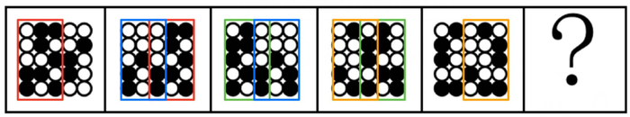
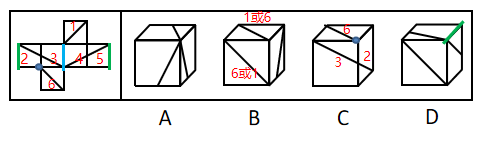

# 2020年四川省公务员考试《行测》试题（网友回忆版）

> 判断推理 · 30 题 · 四川 2020

## 第 1 题　qid 2578743 · 图形推理

从所给四个选择中，选择最合适的一个填入问号处，使之呈现一定规律性：

- **A**. A
- **B**. B
- **C**. C
- **D**. D　✅

**答案**：D

**官方解析**

元素组成不同，考虑属性规律和数量规律。观察发现，A项、B项为“田”字变形图，图5和D项为“日”字变形图，可考虑笔画数。题干前四幅图，奇点数均为0，是一笔画，第五幅图奇点数为2，也是一笔画，故？处图形应为一笔画图形。A项、B项、C项均有4个奇点，是两笔画图形，D项有2个奇点，是一笔画图形。

故正确答案为D。

---

## 第 2 题　qid 2578751 · 图形推理

从所给四个选择中，选择最合适的一个填入问号处，使之呈现一定规律性：

- **A**. A　✅
- **B**. B
- **C**. C
- **D**. D

**答案**：A

**官方解析**

解析一：元素组成相同，优先考虑位置规律。观察发现，图形整体位置无规律，可以考虑比较相邻的题干图形找规律。观察发现，相邻两幅图形中，图1与图2第一列相同，图2与图3第三列相同，图3与图4第五列相同，图4与图5第二列相同，故题干规律是相邻的两幅图之间有一列相同，并且是隔一列相同，故接下来应该是第四列与图5相同，只有A项符合，当选。

解析二：元素组成相同，优先考虑位置规律。观察发现，图形整体位置无规律，可以考虑比较相邻的题干图形找规律。观察发现，相邻两幅图形中，前一幅图中前三列的黑球和后一幅图中后三列的黑球位置保持不变，同时，前一幅图形的后两列下移一格得到后一幅图形的前两列，下移时碰到底部就从上循环，因此？处图形中后三列黑球的位置应该和图5中前三列的黑球位置完全相同，前两列由图5后两列下移一格得到，只有A项符合，当选。

以上两种思路均可选出唯一答案。

故正确答案为A。

---

## 第 3 题　qid 2578756 · 图形推理

从所给四个选择中，选择最合适的一个填入问号处，使之呈现一定规律性：

- **A**. A
- **B**. B　✅
- **C**. C
- **D**. D

**答案**：B

**官方解析**

元素组成相同，优先考虑位置规律。九宫格题目优先看横行，观察发现，第一行图形中外部小黑球每次顺时针移动一步、内部小黑球每次逆时针移动一步，可以得到后一幅图；第二行外部小黑球每次顺时针移动两步、内部小黑球每次逆时针移动两步，可以得到后一幅图；第三行外部小黑球每次顺时针移动三步、内部小黑球每次逆时针移动三步，可以得到后一幅图。根据这个规律，只有B项符合。
故正确答案为B。

---

## 第 4 题　qid 2578764 · 图形推理

把下面的六个图形分为两类，使每一类图形都有各自的共同特征或规律，分类正确的一项是：

- **A**. ①④⑥，②③⑤
- **B**. ①④⑤，②③⑥
- **C**. ①③⑤，②④⑥　✅
- **D**. ①②④，③⑤⑥

**答案**：C

**官方解析**

本题为分组分类题目。元素组成不同，考虑属性或数量规律。观察发现，题干中出现圆相切，考虑点的数量。整体点的数量无规律，但图③⑤存在交点均为曲曲交点，观察其余图形，发现图①③⑤存在曲曲交点，图②④⑥存在曲直交点。即图①③⑤一组，图②④⑥一组。
故正确答案为C。

---

## 第 5 题　qid 2578740 · 图形推理

左边给定的是纸盒的外表面，下列哪项能由它折叠而成？

- **A**. A
- **B**. B
- **C**. C　✅
- **D**. D

**答案**：C

**官方解析**

将原展开图标上序号如下图，逐一进行分析。

A项：选项中出现三角形的面为面2、3、4、5其中的三个面，但在展开图中面2与面4、面3与面5都是相对面，相对面不能同时出现，选项和题干不一致，排除；

B项：选项中正对着的面和上边的面由面1、面6组成，右边的面为面2、3、4、5中的其中一个，而在展开图中面1与面6为相对面，相对面不能同时出现，选项和题干不一致，排除；

C项：选项面为面2、3、6，选项和题干一致，当选；

D项：选项中上边的面和右边的面由两个小三角形的面组成，并且两个小三角形面公共边顶端有交点，据此有两种可能，分别是面2与面5、面3与面4。但是无论是为面3与面4时，还是面2和面5时，两个面的公共边在展开图中都是梯形的长底边，而D项的公共边挨着右边面的小三角形直角边，选项和题干不一致，排除。

故正确答案为C。

---

## 第 6 题　qid 2578744 · 定义判断

疑离是变通运用了选择疑问句形成的一种修辞方法，它用两项或多项疑问句并列发问，但不要求读者从中选择一项，而是让读者发疑。待把语言前后连贯，便可疑念全消。
根据上述定义，下列运用了疑离的修辞方法是：

- **A**. 水几重呵，山几重？水绕山环桂林城······是山城呵，是水城？都在青山绿水中······　✅
- **B**. 哪一颗星没有光？哪一朵花没有香？大海啊，哪一次我的思潮里没有你波涛的清响？
- **C**. 我走过的路很多，哪见过像这样荆棘丛生的路呢？我走过的路很多，哪见过像这样崎岖难行的路呢？没有。
- **D**. 啊，黄继光，刘胡兰······不都是党亲手培育的，共产主义甘霖灌溉出来的鲜花吗？人间还有什么花朵能同他们争艳呢？

**答案**：A

**官方解析**

第一步：找出定义关键词。
“变通运用了选择疑问句”、“两项或多项疑问句并列发问”、“把语言前后连贯，便可疑念全消”。
第二步：逐一分析选项。
A项：“是山城呵，是水城？”是在问这里是山城还是水城？符合“变通运用了选择疑问句”，“都在青山绿水中······”说明这里既是山城也是水城，符合“把语言前后连贯，便可疑念全消”，符合定义，当选；
B项：“哪一颗星没有光？哪一朵花没有香？”不符合“变通运用了选择疑问句”，而且都是问问题，不符合“把语言前后连贯，便可疑念全消”，不符合定义，排除；
C项：“哪见过像这样荆棘丛生的路呢？”不符合“变通运用了选择疑问句”，其后半句直接解答问题，不符合“把语言前后连贯，便可疑念全消”，不符合定义，排除；
D项：“不都是党亲手培育的，共产主义甘霖灌溉出来的鲜花吗？”是在反问，不符合“变通运用了选择疑问句”，而且不符合“把语言前后连贯，便可疑念全消”，不符合定义，排除。
故正确答案为A。

---

## 第 7 题　qid 2578752 · 定义判断

注意分为似注意和似不注意两种。似注意是指表面上注意某些事物，但实际上心里却想着其他事物。似不注意是指貌似不注意一事物而实际上心里却十分注意这一事物。
根据上述定义，下列属于似不注意的是：

- **A**. 第一次来到海边的人们往往容易不自觉地被波澜壮阔的景色所深深吸引
- **B**. 学生们正在教室上课，突然从外面进来一个人，学生们不由自主地看向他
- **C**. 临近午餐时间，会议还没有结束，很多参会者虽然表面在认真倾听会议内容，心里却在想着午餐吃什么
- **D**. 侦查员在人群中发现了犯罪嫌疑人，为了不打草惊蛇，假装没看见，然后悄悄靠近，出其不意将其抓获　✅

**答案**：D

**官方解析**

第一步：找出定义关键词。
似注意：“表面上注意”、“心里却想着其他事物”；
似不注意：“貌似不注意一事物而实际上心里却十分注意”。
第二步：逐一分析选项。
A项：人们往往不自觉地被景色吸引，是注意到了景色这一事物，不符合“貌似不注意一事物而实际上心里却十分注意”，不符合“似不注意”定义，也不符合“似注意”定义，排除；
B项：学生们看向外面突然进来的人，不符合“貌似不注意一事物而实际上心里却十分注意”，不符合“似不注意”定义，也不符合“似注意”定义，排除；
C项：参会者虽然表面在倾听会议内容，心里却在想着午餐吃什么，符合“表面上注意”、“心里却想着其他事物”，符合“似注意”定义，不符合“似不注意”定义，排除；
D项：侦查员为了不打草惊蛇，假装没看见，然后悄悄靠近，符合“貌似不注意一事物而实际上心里却十分注意”，符合“似不注意”定义，当选。
故正确答案为D。

---

## 第 8 题　qid 2578757 · 定义判断

O2O模式即Online To Offline，是指将线下的商务机会与互联网结合，让互联网成为线下交易的前台。线上平台为消费者提供消费指南、优惠信息、便利服务和分享平台，而线下商户则专注于提供服务。
根据上述定义，以下属于O2O模式的是：

- **A**. 乘客致电出租车热线预定出租车，可在指定的时间地点享受车接车送
- **B**. 互联网上的跨洋英语聊天室，使中国学生能直接跟外国友人用英语进行交流
- **C**. 研究员利用微信平台招募测试对象，根据他们在线填写问卷的结果再进行线下访谈
- **D**. 家政服务公司利用手机软件推销家政服务，用户通过手机预约之后，工作人员到家服务　✅

**答案**：D

**官方解析**

第一步：找出定义关键词。
“线下的商务机会与互联网结合”、“线上平台为消费者提供消费指南、优惠信息、便利服务和分享平台”、“线下商户则专注于提供服务”。
第二步：逐一分析选项。
A项：乘客致电出租车热线预定出租车，不符合“线下的商务机会与互联网结合”，不符合定义，排除；
B项：互联网上的跨洋英语聊天室，不符合“线下的商务机会与互联网结合”，不符合定义，排除；
C项：研究员利用微信平台招募测试对象，不符合“线下的商务机会与互联网结合”，根据在线填写问卷的结果进行线下访谈，不符合“线上平台为消费者提供消费指南、优惠信息、便利服务和分享平台”，不符合定义，排除；
D项：家政服务公司利用手机软件推销服务，符合“线下的商务机会与互联网结合”，用户通过手机预约，符合“线上平台为消费者提供消费指南、优惠信息、便利服务和分享平台”，工作人员到家服务符合“线下商户则专注于提供服务”，符合定义，当选。
故正确答案为D。

---

## 第 9 题　qid 2578749 · 定义判断

一个国家生产某种产品的成本比另一个国家低，那么，该国就在这种商品的生产上与另一个国家相比具有比较优势。
根据上述定义，以下判断正确的是：

- **A**. 作为佛教圣地的泰国，宗教文化旅游资源丰富，旅游产业相当发达，相对周边国家来说，泰国具有旅游产品的比较优势
- **B**. 甲国人口众多，廉价的劳动力吸引了乙国大多数手机制造公司到甲国开辟生产线，相比乙国，甲国在手机生产上具有比较优势　✅
- **C**. 某欧洲国家因自然风光优美，成为亚洲众多电影制片公司的外景拍摄地，相对于亚洲国家来说，这个欧洲国家具有电影生产的比较优势
- **D**. 甲国具有丰富的石油资源，但天然气资源匮乏，乙国进口甲国石油的同时，向甲国出口天然气，相比甲国，乙国具有能源的比较优势

**答案**：B

**官方解析**

第一步：找出定义关键词。
“一个国家生产某种产品的成本比另一个国家低”、“该国就在这种商品的生产上与另一个国家相比具有比较优势”。
第二步：逐一分析选项。
A项：泰国旅游资源较其他地区更丰富，旅游资源是一种资源，而不是某种产品，不符合“一个国家生产某种产品的成本比另一个国家低”，泰国旅游产品有优势，不符合“该国就在这种商品的生产上与另一个国家相比具有比较优势”，不符合定义，排除；
B项：甲国人口多，劳动力廉价，即为生产的人力成本低，符合“一个国家生产某种产品的成本比另一个国家低”，吸引乙国到甲国开辟生产线进行生产，符合“该国就在这种商品的生产上与另一个国家相比具有比较优势”，符合定义，当选；
C项：欧洲自然风光优美成为亚洲电影制片公司的外景拍摄地，是两个地区之间的自然资源情况，不是国家之间的对比，不符合“一个国家生产某种产品的成本比另一个国家低”，不符合定义，排除；
D项：甲国石油资源丰富，乙国天然气资源丰富，但并不涉及到生产产品的成本，不符合“一个国家生产某种产品的成本比另一个国家低”，乙国能源有优势，不涉及商品的生产，不符合“该国就在这种商品的生产上与另一个国家相比具有比较优势”，不符合定义，排除。
故正确答案为B。

---

## 第 10 题　qid 2578754 · 定义判断

关联营销是指商家通过资源整合寻找产品、品牌等所要营销内容的关联性，来实现深层次的多面引导。
根据上述定义，下列没有反映关联营销的是：

- **A**. 某体育用品商店的主推商品为泳衣，在泳衣货品区的旁边还配有防晒霜、太阳镜和遮阳帽进行销售
- **B**. 某电视厂商通过构建体验空间，让顾客感受液晶屏幕放映影片带来的视觉体验，从而促进电视机的销量　✅
- **C**. 某母婴网站根据顾客购买的儿童纸尿裤推测孩子的年龄，从而在购物页面推荐更多这一年龄段孩子需要使用的产品
- **D**. 某服装公司最为畅销的产品为某种图案的圆领T恤，与此同时公司还生产了该图案的V领T恤和立领T恤，销量也很好

**答案**：B

**官方解析**

第一步：找出定义关键词。
“通过资源整合寻找产品、品牌等所要营销内容的关联性”、“实现深层次的多面引导”。
第二步：逐一分析选项。
A项：体育用品商店在泳衣货品区旁边配有防晒霜、太阳镜和遮阳帽进行销售，符合“通过资源整合寻找产品、品牌等所要营销内容的关联性”，符合“实现深层次的多面引导”，符合定义，排除；
B项：电视厂商通过构建体验空间，让顾客感受液晶屏幕的视觉体验，没有体现多种营销内容的关联性，不符合“通过资源整合寻找产品、品牌等所要营销内容的关联性”，也没有体现“实现深层次的多面引导”，不符合定义，当选；
C项：母婴网站通过推测孩子的年龄在购物页面推荐同年龄的产品，符合“通过资源整合寻找产品、品牌等所要营销内容的关联性”，符合“实现深层次的多面引导”，符合定义，排除；
D项：服装公司生产带有同一图案的不同形状衣领的T恤进行销售，符合“通过资源整合寻找产品、品牌等所要营销内容的关联性”，符合“实现深层次的多面引导”，符合定义，排除。
本题为选非题，故正确答案为B。

---

## 第 11 题　qid 2578758 · 定义判断

连带责任保证是债的担保的一种，它是指保证人与债权人约定，债务人在债务履行期限届满没有履行债务的，债权人既可以要求债务人履行债务，也可以要求保证人在其保证范围内承担债务。
根据上述定义，下列属于连带责任保证的是：

- **A**. 甲欠乙100万元货款，甲找来丙，三方约定，若三个月内甲不能偿还货款，由丙代乙主张债权
- **B**. 甲欠乙100万元货款，甲找来丙，三方约定，若三个月内甲不能偿还货款，乙有权要求丙偿还全部货款　✅
- **C**. 甲欠乙100万元货款，甲找来尚欠自己100万元债务的丙，三方约定，若到期甲不能偿还货款，由丙代为偿还
- **D**. 甲欠乙100万元货款，甲找来丙，将丙收藏的一幅名画交给乙，约定若在三个月内甲不能偿还货款，乙有权取得该画的所有权

**答案**：B

**官方解析**

第一步：找出定义关键词。
连带责任保证：“保证人与债权人约定”、“债务人在债务履行期限届满没有履行债务”、“债权人既可以要求债务人履行债务，也可以要求保证人在其保证范围内承担债务”。
第二步：逐一分析选项。
A项：甲欠乙的钱，丙代乙主张债权，意味着丙去跟甲要欠款，说明丙不是保证人，不符合“保证人与债权人约定”，不符合定义，排除；
B项：甲欠乙的钱，丙是债务的保证人，在债务人甲不能在期限内偿还债务，债权人乙有权要求债务保证人丙承担债务，符合“保证人与债权人约定”、“债务人在债务履行期限届满没有履行债务”、“债权人既可以要求债务人履行债务，也可以要求保证人在其保证范围内承担债务”，符合定义，当选；
C项：甲欠乙的钱，丙又欠甲的钱，丙是甲的债务人，并不是甲与乙之间债务的保证人，不符合“保证人与债权人约定”，不符合定义，排除；
D项：甲欠乙的钱，然后甲把丙收藏的画给乙作为抵押，丙不是甲与乙之间债务的保证人，不符合“保证人与债权人约定”、“债权人既可以要求债务人履行债务，也可以要求保证人在其保证范围内承担债务”，不符合定义，排除。
故正确答案为B。

---

## 第 12 题　qid 2578759 · 定义判断

义务性规范要求人们以某种方式必须作出或不作出某种行为。授权性规范表明人们有作出或不作出某种行为的权利。二者的关系是：当某种行为被确立为义务时，这种行为也同时被确立为权利；否定某种行为是义务，不意味着否定了这种行为是权利；当某种行为被确立为权利时，不意味着这种行为是义务；否定某种行为是权利，也即否定了某种行为是义务。
根据上述定义，下列说法错误的是：

- **A**. 若规定“公民有选举的权利”，意味着“公民有选举的义务”　✅
- **B**. 若规定“公民没有生育的义务”，不意味着“公民没有生育的权利”
- **C**. 若规定“本科生必须修读一门外语课”时，意味着“本科生有权利修读一门外语课”
- **D**. 若规定“公民没有干涉他人婚姻自由的权利”，意味着“公民没有干涉他人婚姻自由的义务”

**答案**：A

**官方解析**

第一步：找出定义关键词。
义务性规范要求人们以某种方式必须作出或不作出某种行为；
授权性规范表明人们有作出或不作出某种行为的权利；
二者的关系是：
当某种行为被确立为义务时，这种行为也同时被确立为权利；
否定某种行为是义务，不意味着否定了这种行为是权利；
当某种行为被确立为权利时，不意味着这种行为是义务；
否定某种行为是权利，也即否定了某种行为是义务。
第二步：逐一分析选项。
A项：“规定‘公民有选举的权利’”属于“授权性规范”范畴，根据“当某种行为被确立为权利时，不意味着这种行为是义务”，因此，“意味着‘公民有选举的义务’”，说法错误，当选；
B项：“规定‘公民没有生育的义务’”属于“义务性规范”范畴，根据“否定某种行为是义务，不意味着否定了这种行为是权利”，因此，“不意味着‘公民没有生育的权利’”，说法正确，排除；
C项：“规定‘本科生必须修读一门外语课’”属于“义务性规范”范畴，根据“当某种行为被确立为义务时，这种行为也同时被确立为权利”，因此，“意味着‘本科生有权利修读一门外语课’”，说法正确，排除；
D项：“规定‘公民没有干涉他人婚姻自由的权利’”属于“授权性规范”范畴，根据“否定某种行为是权利，也即否定了某种行为是义务”，因此，“意味着‘公民没有干涉他人婚姻自由的义务’”，说法正确，排除。
本题为选非题，故正确答案为A。

---

## 第 13 题　qid 2578747 · 定义判断

互惠利他是指两个无亲缘关系的动物个体之间通过相互合作而互利的行为。纯粹利他是指动物个体对无亲缘关系的其他个体施以利他行为，而不追求任何针对自身的客观回报。
根据上述定义，下列动物行为属于纯粹利他的是：

- **A**. 在蜜蜂群体中，蜂后产卵孵化为工蜂，工蜂自己不生育，而是全力以赴地养育蜂后产卵孵化的幼虫
- **B**. 魑蝠是一种以吸食其他动物的血为生的蝙蝠，一只吸到血的魑蝠会把血吐给另外一只与其毫无关系的正在挨饿的魑蝠　✅
- **C**. 当野兔躲在灌木丛中时，几只鹰会临时组成合作小组，由其中一只或几只将野兔赶出，其他几只从空中俯冲下来，将野兔捕杀
- **D**. 雌性雀鱼总是将其他种群内的小鱼吸引到自己的鱼群中加以喂养，新加入的小鱼可以壮大自己的鱼群，鱼群越大，幼年雀鱼被捕食的概率就越小

**答案**：B

**官方解析**

第一步：找出定义关键词。
互惠利他：“两个无亲缘关系的动物个体之间”、“通过相互合作而互利的行为”；
纯粹利他：“动物个体对无亲缘关系的其他个体”、“施以利他行为，而不追求任何针对自身的客观回报”。
第二步：逐一分析选项。
A项：蜂后产卵孵化为工蜂，工蜂自己不生育，而是养育蜂后的幼虫，属于有亲缘关系的同类之间进行相互合作，不符合任何一个定义，排除； 
B项：魑蝠会把血吐给另外一只没有关系的魑蝠，符合“动物个体对无亲缘关系的其他个体”，也符合“施以利他行为，而不追求任何针对自身的客观回报”，符合“纯粹利他”定义，当选；
C项：几只鹰合作抓野兔，属于“通过相互合作而互利的行为”，符合“互惠利他”定义，不符合“纯粹利他”定义，排除； 
D项：雌性雀鱼将其他种群内的小鱼吸引到自己的鱼群中喂养，目的是减小自己鱼群中的幼年雀鱼被捕食的概率，不符合任何一个定义，排除。
故正确答案为B。

---

## 第 14 题　qid 2578761 · 类比推理

笛子：音乐家

- **A**. 扫把：清洁工　✅
- **B**. 包裹：快递员
- **C**. 信誉：投资者
- **D**. 员工：企业家

**答案**：A

**官方解析**

第一步：判断题干词语间逻辑关系。
笛子是音乐家演奏乐曲时用到的一种工具，二者是工具的对应关系。
第二步：判断选项词语间逻辑关系。
A项：扫把是清洁工打扫卫生时用到的一种工具，二者是工具的对应关系，与题干逻辑关系一致，当选；
B项：包裹是快递员进行投递工作的对象，而不是工具，与题干逻辑关系不一致，排除；
C项：信誉不是投资者进行投资时用到的工具，与题干逻辑关系不一致，排除；
D项：员工是企业家的管理对象，而不是工具，与题干逻辑关系不一致，排除。
故正确答案为A。

---

## 第 15 题　qid 2578763 · 类比推理

米：粒

- **A**. 枕：头
- **B**. 车：辆　✅
- **C**. 衣：服
- **D**. 窗：帘

**答案**：B

**官方解析**

第一步：判断题干词语间逻辑关系。
米和粒共同组成词语“米粒”，且“米”的计量单位是“粒”，二者为计量单位的对应关系。
第二步：判断选项词语间逻辑关系。
A项：枕和头共同组成词语“枕头”，但是“枕”的计量单位不是“头”，与题干逻辑关系不一致，排除；
B项：车和辆共同组成词语“车辆”，且“车”的计量单位是“辆”，与题干逻辑关系一致，当选；
C项：衣和服共同组成词语“衣服”，但是“衣”的计量单位不是“服”，与题干逻辑关系不一致，排除；
D项：窗和帘共同组成词语“窗帘”，但是“窗”的计量单位不是“帘”，与题干逻辑关系不一致，排除。
故正确答案为B。

---

## 第 16 题　qid 2578765 · 类比推理

东施效颦：生搬硬套

- **A**. 崇洋媚外：吃里扒外
- **B**. 外强中干：徒有其表　✅
- **C**. 大快人心：兴高采烈
- **D**. 十恶不赦：臭名昭著

**答案**：B

**官方解析**

第一步：判断题干词语间逻辑关系。
东施效颦，比喻模仿别人，不但模仿不好，反而出丑；生搬硬套，指不顾实际情况，机械地运用别人的经验，照抄别人的办法，二者是近义关系。
第二步：判断选项词语间逻辑关系。
A项：崇洋媚外，意思是崇拜西方一切，谄媚外国人，指丧失民族自尊心，一味奉承巴结外国人；吃里扒外，是指接受这一方面的好处，却为那一方面卖力，也指将自己方面的情况告诉对方，二者不是近义关系，与题干逻辑关系不一致，排除；
B项：外强中干，形容外表强大而实际虚弱的事物；徒有其表，指空有外表，有名无实，二者是近义关系，与题干逻辑关系一致，当选；
C项：大快人心，指坏人受到惩罚，使人感到非常痛快；兴高采烈，形容兴致高，精神饱满，二者不是近义关系，与题干逻辑关系不一致，排除；
D项：十恶不赦，指罪恶极大，不可饶恕；臭名昭著，指坏名声人人都知道，二者不是近义关系，与题干逻辑关系不一致，排除。
故正确答案为B。

---

## 第 17 题　qid 2578793 · 类比推理

食盐：调味料：氯化钠

- **A**. 煤炭：固体矿物：无烟煤
- **B**. 沙画：现代艺术：视觉艺术
- **C**. 普洱茶：云雾茶：茶多酚
- **D**. 硅藻：浮游植物：二氧化硅　✅

**答案**：D

**官方解析**

第一步：判断题干词语间逻辑关系。
食盐是一种调味料，二者为种属关系，氯化钠是食盐的组成部分，二者为组成关系。
第二步：判断选项词语间逻辑关系。
A项：煤炭是一种固体矿物，二者为种属关系，但无烟煤是一种煤炭，二者也是种属关系，与题干逻辑关系不一致，排除；
B项：沙画是一种现代艺术，二者为种属关系，但沙画是一种视觉艺术，二者也是种属关系，与题干逻辑关系不一致，排除；
C项：普洱茶和云雾茶都是一种茶，二者为并列关系，与题干逻辑关系不一致，排除；
D项：硅藻是一种浮游植物，二者为种属关系，硅藻的组成部分是二氧化硅，二者为组成关系，与题干逻辑关系一致，当选。
故正确答案为D。

---

## 第 18 题　qid 2578794 · 类比推理

商标：商品：商场

- **A**. 品牌：电脑：电器
- **B**. 工牌：工人：工厂　✅
- **C**. 艺术：艺人：剧场
- **D**. 军规：军人：军队

**答案**：B

**官方解析**

第一步：判断题干词语间逻辑关系。
商标是用来区别一个经营者的品牌或服务和其他经营者的商品或服务的标记，商标可以用来区分商品，二者是对应关系，商品在商场销售，二者为场所对应关系。
第二步：判断选项词语间逻辑关系。
A项：品牌可以用来区分电脑，二者是对应关系，电脑是电器，二者为种属关系，与题干逻辑关系不一致，排除；
B项：工牌可以用来区分工人，二者是对应关系，工人在工厂工作， 二者为场所对应关系，与题干逻辑关系一致，当选；
C项：艺术不是区分艺人的标志，与题干逻辑关系不一致，排除；
D项：军规是治军的法规律令的统称，不是区分军人的标志，与题干逻辑关系不一致，排除。
故正确答案为B。

---

## 第 19 题　qid 2578795 · 类比推理

（    ） 对于 红酒 相当于（    ）对于 照片

- **A**. 酒庄；模特
- **B**. 果汁；胶卷
- **C**. 葡萄；风景
- **D**. 酒杯；相册　✅

**答案**：D

**官方解析**

逐一代入选项。
A项：酒庄是生产红酒的地点，二者为地点对应关系，照片中有模特，照片是模特的载体，二者为载体对应关系，前后逻辑关系不一致，排除；
B项：果汁和红酒都是饮品，二者为并列关系，胶卷可以用来冲印照片，二者为对应关系，前后逻辑关系不一致，排除；
C项：葡萄是制作红酒的原材料，二者为原材料对应关系，照片中有风景，照片是风景的载体，二者为载体对应关系，前后逻辑关系不一致，排除；
D项：酒杯可以装红酒，二者为功能对象的对应关系，相册可以装照片，二者为功能对象的对应关系，前后逻辑关系一致，当选。
故正确答案为D。

---

## 第 20 题　qid 2578796 · 类比推理

坚果 对于（    ）相当于（    ）对于 琵琶

- **A**. 苹果；乐器
- **B**. 松仁；扬琴
- **C**. 板栗；弹拨乐器　✅
- **D**. 浆果；打击乐器

**答案**：C

**官方解析**

逐一代入选项。
A项：苹果不是坚果，二者为反向包容关系，琵琶是乐器，二者为种属关系，前后逻辑关系不一致，排除；
B项：松仁是坚果，二者为种属关系，扬琴和琵琶是两种乐器，二者为并列关系，前后逻辑关系不一致，排除；
C项：板栗是坚果，二者为种属关系，琵琶是弹拨乐器，二者为种属关系，前后逻辑关系一致，当选；
D项：浆果和坚果是两种不同的果实类型，二者为并列关系，琵琶不是打击乐器，二者为反向包容关系，前后逻辑关系不一致，排除。
故正确答案为C。

---

## 第 21 题　qid 2578755 · 类比推理

木材 对于 （    ） 相当于 （    ） 对于 竹笛

- **A**. 树木；竖笛
- **B**. 建筑；音乐
- **C**. 木鱼；笙箫
- **D**. 木屋；竹子　✅

**答案**：D

**官方解析**

逐一代入选项。
A项：树木是木材的原材料，二者为原材料对应关系，竖笛和竹笛，二者为交叉关系，前后逻辑关系不一致，排除；
B项：木材是建筑的原材料，二者为原材料对应关系，竹笛可以吹奏出音乐，二者为乐器对应关系，前后逻辑关系不一致，排除；
C项：木材是木鱼的原材料，二者为原材料对应关系，笙箫和竹笛是两种不同的乐器，二者为并列关系，前后逻辑关系不一致，排除；
D项：木材是木屋的原材料，二者为原材料对应关系，竹子是竹笛的原材料，二者为原材料对应关系，前后逻辑关系一致，当选。
故正确答案为D。

---

## 第 22 题　qid 2578760 · 逻辑判断

橙腹草原田鼠实行的是动物世界极为罕见的“一夫一妻制”。研究者首先检测了雌性田鼠的内侧前额叶皮层与伏隔核两个区域的“交流”（这两大区域在解剖学上是相连的，伏隔核在大脑的奖励系统中扮演了关键的角色），然后让这些雌性田鼠与雄性田鼠见面，在见面过程中持续检测这两个脑区之间的交流强度。他们发现，那些脑区交流强度更高的田鼠，更容易与另一半快速建立起亲密关系。他们由此认为，这两个脑区之间的环路的激活，能够直接影响动物爱意的产生。
以下哪项如果为真，最能支持以上研究者的观点？

- **A**. 
在首次性行为后，橙腹草原田鼠的两个脑区交流的强度，与性行为后它们拥抱的速度快慢有直接关联

- **B**. 
既往研究发现，与爱情有关的化学物质，无论是多巴胺还是催产素，或多或少都能激活奖励系统，使人对伴侣产生爱意

- **C**. 
研究者让雌雄两只田鼠靠近但不能直接接触，给予特定波长的光， 激活这条神经通路。次日，相比面对陌生雄性田鼠，雌性田鼠更愿意与昨日见过的雄性田鼠亲昵
　✅
- **D**. 
和橙腹草原田鼠超过的基因相同的山地鼠，即使给它们注入足量催产素(与爱情有关的化学物质)，它们也依旧对伴侣过夜即忘，研究发现山地鼠的大脑相应区域缺乏催产素的受体

**答案**：C

**官方解析**

第一步：找出论点和论据。
论点：这两个脑区之间的环路的激活，能够直接影响动物爱意的产生。
论据：研究者首先检测了雌性田鼠的内侧前额叶皮层与伏隔核两个区域的“交流” (这两大区域在解剖学上是相连的，伏隔核在大脑的奖励系统中扮演了关键的角色)，然后让这些雌性田鼠与雄性田鼠见面，在见面过程中持续检测这两个脑区之间的交流强度。他们发现，那些脑区交流强度更高的田鼠，更容易与另一半快速建立起亲密关系。
本题论据讨论两个脑区交流强度更高的田鼠更容易建立亲密关系，论点讨论两个脑区之间的环路的激活，更容易产生爱意。论据论点都在讨论这两个脑区对田鼠亲密关系的影响，话题一致，优先考虑补充论据进行加强。
第二步：逐一分析选项。
A项：选项讨论两个脑区交流的强度与拥抱的速度有直接关联，但不明确是何种关联，为不明确选项，无法加强，排除；
B项：选项讨论多巴胺、催产素对爱意的影响，而论点讨论的是脑区之间环路的激活与爱意之间的关系，话题不一致，无法加强，排除；
C项：通过补充实验进行对比，证明两个脑区之间的环路的激活，确实能够直接影响动物爱意的产生，补充论据，当选；
D项：选项讨论山地鼠缺乏催产素受体，而论点讨论的是脑区之间环路的激活与爱意之间的关系，话题不一致，无法加强，排除。
故正确答案为C。

---

## 第 23 题　qid 2578762 · 逻辑判断

一项最新研究发现，脑部DNA的变异是使人们患上抑郁症和焦虑症的原因，而且这种变化会传递给后代。但是，有反对者认为，脑部杏仁核活动的增加会使应对恐慌的大脑区域的活动增强，这是引发抑郁症和焦虑症的原因。
以下哪项如果为真，最能削弱反对者的观点？

- **A**. DNA的变异是人类许多疾病的罪魁祸首
- **B**. 不健康的生活习惯也会引发抑郁症和焦虑症
- **C**. 脑部DNA的变异是使杏仁核活动增加的原因　✅
- **D**. 有些抑郁症和焦虑症患者的脑部DNA会发生变异

**答案**：C

**官方解析**

第一步：找出论点和论据。
论点：脑部杏仁核活动的增加会使应对恐慌的大脑区域的活动增强，这是引发抑郁症和焦虑症的原因。
论据：无。
本题只有论点，没有论据，考虑削弱论点，即引发抑郁症和焦虑症的原因不是脑部杏仁核活动的增加。
第二步：逐一分析选项。
A项：该项说的是DNA变异会导致许多疾病，而论点说的是引发抑郁症和焦虑症的原因，话题不一致，无法削弱，排除；
B项：该项说的是不健康的生活习惯也会导致抑郁症和焦虑症，与论点说的是脑部杏仁核活动增加会导致抑郁症和焦虑症无关，无法削弱，排除；
C项：该项说的是脑部DNA变异导致了杏仁核活动增加，而论点说的是杏仁核活动增加导致了抑郁症和焦虑症，因此脑部DNA变异是导致抑郁症和焦虑症的根本原因，直接削弱论点，可以削弱，当选；
D项：该项说的是有些抑郁症和焦虑症患者的脑部DNA会变异，即患病后的情况，而论点说的是引发抑郁症和焦虑症的原因，话题不一致，无法削弱，排除。
故正确答案为C。

---

## 第 24 题　qid 2578741 · 逻辑判断

某社区近期举行了一项关于家庭饲养宠物与家庭生活幸福感关系的调查。此次调查走访了100户家庭，调查的内容包括宠物的种类、饲养宠物的时间、家庭成员的学历和职业等诸多方面。调查结果表明，饲养宠物的家庭，其家庭成员的幸福感普遍高于没有饲养宠物的家庭。这说明，家庭饲养宠物有助于提升家庭生活幸福感。
以下哪项如果为真，最能削弱上述论证？

- **A**. 该调查所采集样本数量不足
- **B**. 该社区饲养宠物的通常是那些居住条件较好的居民
- **C**. 没有饲养宠物的家庭，其家庭成员通常为工作较为繁忙的在岗职工
- **D**. 家庭饲养宠物通常是因为其成员有充裕的时间并具有较高的家庭生活幸福感　✅

**答案**：D

**官方解析**

第一步：找出论点和论据。
论点：家庭饲养宠物有助于提升家庭生活幸福感。
论据：调查结果表明，饲养宠物的家庭，其家庭成员的幸福感普遍高于没有饲养宠物的家庭。
本题的论点和论据都在讨论饲养宠物与家庭生活幸福感的关系，论点论据话题一致，可以直接考虑削弱论点，且论点为因果关系，也可以考虑因果倒置和他因削弱。
第二步：逐一分析选项。
A项：调查所采集样本数量不足，证明了调查不够科学，削弱论据，具有一定的削弱力度，保留；
B项：选项说的居住条件较好的居民会养宠物，论点说的是饲养宠物可以提升家庭生活幸福感，话题不一致，无法削弱，排除；
C项：选项解释的是不养宠物的原因，论点说的是饲养宠物可以提升家庭生活幸福感，话题不一致，无法削弱，排除；
D项：选项说明因为家庭生活幸福感较高，所以才饲养宠物，因果倒置进行削弱，保留。
比较A、D两项，A项为削弱论据，D项为因果倒置，因果倒置削弱力度大于削弱论据。
故正确答案为D。

---

## 第 25 题　qid 2578746 · 逻辑判断

睡眠呼吸暂停是一种疾病，表现为患者在睡觉时空气进入肺部受阻。一旦短暂中断呼吸，患者会立刻醒来，以便再度呼吸。因此，深受睡眠呼吸暂停之苦的人有时每一两分钟就要醒一次，这样的情况可能会持续一整夜。一项研究发现，被确诊为睡眠呼吸暂停的男性和女性，患上重度抑郁的可能性分别要比睡得好的人高出2.4倍和5.2倍。研究人员认为，睡眠断断续续可能会导致抑郁症。
以下哪项如果为真，最能支持上述结论？

- **A**. 睡眠呼吸暂停的患者都有睡眠严重不足的问题
- **B**. 全世界患有抑郁症的女性比男性人数高出两倍多
- **C**. 有研究发现，深睡眠时间较长的人第二天精神状态更好
- **D**. 用辅助设备使患者恢复正常呼吸和睡眠，可显著缓解抑郁症状　✅

**答案**：D

**官方解析**

第一步：找出论点和论据。
论点：睡眠断断续续可能会导致抑郁症。
论据：被确诊为睡眠呼吸暂停的男性和女性，患上重度抑郁的可能性分别要比睡得好的人高出2.4倍和5.2倍。
本题论点和论据都在说睡眠问题可能导致抑郁症，话题一致，可以通过补充论据的方式进行加强，即解释原因或举例加强。
第二步：逐一分析选项。
A项：该项说的是睡眠呼吸暂停的患者存在睡眠严重不足的问题，未涉及睡眠问题是否导致抑郁症，话题不一致，无法加强，排除；
B项：该项说的是患有抑郁症的女性比男性人数高出两倍多，选项未涉及睡眠问题是否导致抑郁症，话题不一致，无法加强，排除；
C项：该项说的是深睡眠时间较长的人第二天精神状态更好，选项未涉及睡眠断断续续是否导致抑郁症，话题不一致，无法加强，排除；
D项：该项说的是用辅助设备使患者恢复正常呼吸和睡眠，可缓解抑郁症状，说明短暂中断呼吸是造成抑郁症的原因，补充论据，可以加强，当选。
故正确答案为D。

---

## 第 26 题　qid 2578750 · 类比推理

端粒是DNA片段，其长度在出生时很长，后逐渐变短，被视为衰老的标志。研究人员分析了多年的数据后发现：至少生育一个孩子的女性其端粒的平均长度比未生育的女性缩短。这个百分比相当于11年的细胞衰老结果，超过了吸烟和肥胖对细胞老化的影响速度。因此有人提出，生育孩子会让女人加速衰老。

以下哪项如果为真，不能驳斥上述观点？

- **A**. 细胞衰老并不代表个体衰老，细胞衰老是防止细胞发生癌变的重要方式
- **B**. 怀孕过程中妇女体内的雌激素水平持续剧烈上升，对细胞端粒具有保护作用
- **C**. 人体结构非常复杂，包括各类细胞、组织、器官，衰老不能通过“端粒”来简单解释
- **D**. 生育有助于女性健康，可降低多种疾病风险，母乳喂养一年，可使妇女患乳腺癌的风险降低三成　✅

**答案**：D

**官方解析**

第一步：找出论点和论据。

论点：生育孩子会让女人加速衰老。

论据：至少生育一个孩子的女性其端粒的平均长度比未生育的女性缩短。这个百分比相当于11年的细胞衰老结果，超过了吸烟和肥胖对细胞老化的影响速度。

题干论点说的是生育孩子会让女人加速衰老。论据说的是生育孩子使端粒缩短，细胞衰老。削弱可以考虑直接否定论点（生育孩子不会让女人加速衰老），也可以考虑切断二者间的联系（端粒缩短/细胞衰老不一定加速个体衰老），还可以否定论据或质疑论据的可靠性（生育孩子不一定会使女性的端粒缩短）。

第二步：逐一分析选项。

A项：细胞衰老并不代表个体衰老，拆断了论点的个体衰老和论据的细胞衰老的联系，可以削弱，排除；

B项：怀孕过程中妇女体内的雌激素水平持续剧烈上升，对细胞端粒具有保护作用，说明女性可能不会因为生育使端粒变短而加速衰老，否定论据，可以削弱，排除；

C项：人体衰老不能通过“端粒&quot;来简单解释，说明端粒变短不一定代表个体衰老，切断了论点的个体衰老和论据的端粒缩短的联系，可以削弱，排除；

D项：说的是生育有助于女性健康，可降低多种疾病风险，但题干论点说的是生育孩子会让女人加速衰老，衰老和患病并不相同，偷换概念，话题不一致，无关项，当选。

本题为选非题，故正确答案为D。

---

## 第 27 题　qid 2578753 · 逻辑判断

近日，科学家首次证实蜥蜴睡眠时存在快速眼动和慢波睡眠两种状态，在快速眼动状态下，大脑产生高频电波且眼睛快速闪动， 这些现象与做梦存在关联。科学家据此推测：蜥蜴和人类一样，在睡眠时会做梦。
科学家推测的成立， 需要补充以下哪项作为前提？

- **A**. 人类做梦出现在快速眼动阶段　✅
- **B**. 蜥蜴和人类有一些共同的生物特性
- **C**. 睡眠期间快速眼动和慢波睡眠交替进行
- **D**. 研究人员已经证实人在睡眠时会经常做梦

**答案**：A

**官方解析**

第一步：找出论点和论据。
论点：蜥蜴和人类一样，在睡眠时会做梦。
论据：科学家首次证实蜥蜴睡眠时存在快速眼动和慢波睡眠两种状态，在快速眼动状态下，大脑产生高频电波且眼睛快速闪动，这些现象与做梦存在关联。
本题提问的是“前提”，优先考虑搭桥。论点讨论的是蜥蜴和人类一样，睡眠时会做梦，论据讨论的蜥蜴的快速眼动状态与做梦存在关联，两者话题不一致，考虑在人类做梦和快速眼动状态之间搭桥进行加强。
第二步：逐一分析选项。
A项：此项指出人类做梦出现在快速眼动阶段，在论点和论据之间搭桥，说明人类确实和蜥蜴一样都是在快速眼动状态做梦，可以加强，当选；
B项：该项指出蜥蜴和人类有一些共同的生物特性，不一定指的是蜥蜴和人类睡眠会做梦这个特性，不能加强，排除；
C项：该项指出睡眠期间快速眼动和慢波睡眠交替进行，但不清楚人类是否也是这样交替进行，不能加强，排除；
D项：该项指出人类会做梦，但是不清楚蜥蜴是否和人类一样，不能加强，排除。
故正确答案为A。

---

## 第 28 题　qid 2578819 · 逻辑判断

260万年前灭绝的巨齿鲨体长超过15米，拥有强大的咬合力，其3米宽的下颌可压碎一辆小汽车。然而，近期的一项研究显示，巨齿鲨喜欢捕食的是体长小于5米的小须鲸，而不是体型更为庞大的大须鲸。但是由于气候的变化，小须鲸的数量锐减。研究人员据此认为，巨齿鲨是因缺少食物而灭绝的。
以下哪项如果为真，最能削弱上述结论？

- **A**. 小须鲸在260万年前数量锐减的原因是缺少食物
- **B**. 大须鲸是所有鲸类中游速最快的，很难被巨齿鲨捕食到
- **C**. 巨齿鲨也喜好捕食体型较小的海豹和现已灭绝的侏儒抹香鲸　✅
- **D**. 与巨齿鲨生活在同一时期的座头鲸和蓝鲸等大型鲸鱼都发生了进化

**答案**：C

**官方解析**

第一步：找出论点和论据。
论点：巨齿鲨是因缺少食物而灭绝的。
论据：巨齿鲨喜欢捕食的是体长小于5米的小须鲸，而不是体型更为庞大的大须鲸。但是由于气候的变化，小须鲸的数量锐减。
本题论点说的是巨齿鲨是因缺少食物而灭绝的，论据说巨齿鲨喜欢捕食的小须鲸因为气候变化数量锐减。二者话题不一致，削弱可以考虑拆桥，即证明巨齿鲨的食物不只有小须鲸，也可以考虑削弱论点和削弱论据。
第二步：逐一分析选项。
A项：该项说的是小须鲸的灭绝原因，而论点是巨齿鲨的灭绝原因，主体不一致，无法削弱，排除；
B项：该项说的是大须鲸不易被巨齿鲨捕食到，只是说明了为什么巨齿鲨不喜欢捕食大须鲸，无法确定巨齿鲨的灭绝原因是不是缺少食物，无法削弱，排除；
C项：该项说的是巨齿鲨也喜好捕食体型较小的海豹和现已灭绝的侏儒抹香鲸，说明巨齿鲨的食物不只有小须鲸，即小须鲸数量减少不代表巨齿鲨会缺少食物，拆桥项，当选；
D项：该项说的是座头鲸和蓝鲸等大型鲸鱼发生了进化，而论点是巨齿鲨的灭绝原因，话题不一致，无法削弱，排除。
故正确答案为C。

---

## 第 29 题　qid 2578821 · 逻辑判断

有学者认为，文化产品的生产者、消费者和市场管理者并非是导致文化产品低俗化的原因，文化产品的低俗化是由文化产品市场化导致的，因为市场的逐利性会导致文化产品的生产者、消费者和市场管理者忽视文化发展的社会效益，从而导致文化产品低俗化。
以下哪项如果为真，最能削弱上述论证？

- **A**. 文化产品市场化发展必然会引起文化体制改革和文化产业的发展
- **B**. 一些没有实行文化产品市场化的国家，并不存在文化产品低俗化的问题
- **C**. 文化产品市场化的决定因素是文化产品的生产者、消费者和市场管理者　✅
- **D**. 文化产品的生产者、消费者和市场管理者均是以文化产品市场化为导向

**答案**：C

**官方解析**

第一步：找出论点和论据。
论点：文化产品的生产者、消费者和市场管理者并非是导致文化产品低俗化的原因，文化产品的低俗化是由文化产品市场化导致的。
论据：因为市场的逐利性会导致文化产品的生产者、消费者和市场管理者忽视文化发展的社会效益，从而导致文化产品低俗化。
本题的论点和论据说的都是文化产品的低俗化与文化产品市场化之间的关系，二者话题一致，优先考虑削弱论点。
第二步:逐一分析选项。
A项：该项讨论的是文化产品市场化会引起文化体制改革和文化产业的发展，而论点讨论的是文化产品的低俗化是由文化产品市场化导致的，话题不一致，无法削弱，排除；
B项：该项通过举例说明文化产品低俗化与文化产品市场化之间存在关系，具有加强作用，无法削弱，排除；
C项：该项指出文化产品的生产者、消费者和市场管理者是造成文化产品市场化的决定因素，那么文化产品的低俗化是由文化产品市场化导致的意味着文化产品的生产者、消费者和市场管理者是导致文化产品低俗化的原因，直接削弱论点，当选；
D项：该项指出决定文化产品的生产者、消费者和市场管理者导向的是文化产品市场化，证明了文化产品市场化才是决定因素，具有加强作用，无法削弱，排除。
故正确答案为C。

---

## 第 30 题　qid 2578825 · 类比推理

张先生拟购买几种鲜花，购买意向如下：
①玫瑰、郁金香至多买一种；
②牡丹、玫瑰和雏菊至少买一种；
③郁金香、雏菊、百合至少买两种；
④如果买郁金香，则不购买牡丹。
根据上述意向，可以得出张先生：

- **A**. 必须买百合
- **B**. 郁金香、牡丹至少买了一种
- **C**. 雏菊、玫瑰至少买了一种　✅
- **D**. 至少买了3种鲜花

**答案**：C

**官方解析**

第一步：分析题干条件。

（1）玫瑰或郁金香；

（2）牡丹、玫瑰、雏菊至少买一种；

（3）郁金香、雏菊、百合至少买两种；

（4）郁金香牡丹。

第二步：根据题干条件进行推理。

题干条件均为不明确的信息，考虑采用假设法，由于条件中郁金香出现次数最多，故对郁金香分两种情况进行假设。

第一种情况：购买郁金香，根据条件（4）则不购买牡丹，根据条件（1）可知不购买玫瑰，又根据条件（2）可知购买雏菊。现已购买了郁金香、雏菊，根据条件（3）可知可能购买百合也可能没有购买，即可能购买2种鲜花也可能购买3种鲜花，A、D两项均可排除；

第二种情况：不购买郁金香，根据条件（3）可知购买雏菊和百合，根据其他条件，无法得知是否购买了玫瑰和牡丹，即可能购买也可能不购买，若不购买牡丹，此时牡丹和郁金香均未购买，排除B项。

综合上述两种情况可以推出张先生一定会购买雏菊，C项当选。

故正确答案为C。

---
