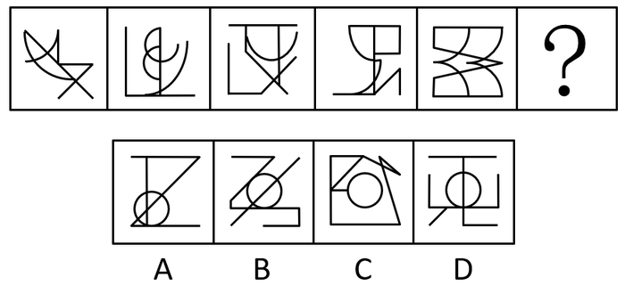
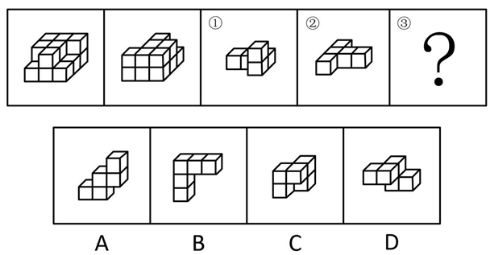
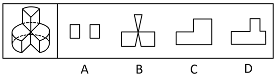
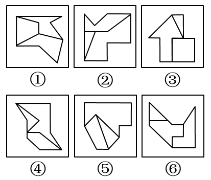
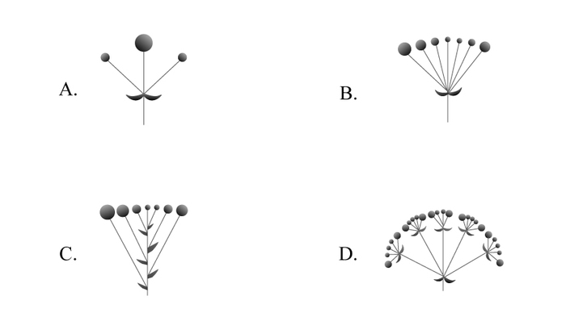

# 2020年国家公务员录用考试《行测》题（副省级网友回忆版）

> 判断推理 · 40 题 · 国考 2020

## 第 1 题　qid 2448537 · 图形推理

从所给的四个选项中，选择最合适的一个填入问号处，使之呈现一定的规律性：

- **A**. A
- **B**. B　✅
- **C**. C
- **D**. D

**答案**：B

**官方解析**

元素组成不同，且无明显属性规律，考虑数量规律。观察发现，题干第一幅图形为“日”字变形，第四幅图形为“田”字变形，考虑笔画数。题干都是一笔画图形，A、C、D三项均为两笔画，B项为一笔画，只有B项符合。
故正确答案为B。

---

## 第 2 题　qid 2448482 · 图形推理

从所给的四个选项中，选择最合适的一个填入问号处，使之呈现一定的规律性：

- **A**. A　✅
- **B**. B
- **C**. C
- **D**. D

**答案**：A

**官方解析**

图形1、2、4元素组成相同，考虑位置规律。题干图形明显分成黑色L形和白色L形，整体无规律考虑分开看。观察发现，从图一到图二，黑色L形顺时针旋转，白色L形位置不变；从图二到图三，白色L形逆时针旋转，黑色L形位置不变，同时有一块黑色小正方形与白色小正方形重叠，呈现黑色；从图三到图四，黑色L形顺时针旋转，白色L形位置不变；从图四到图五，白色L形逆时针旋转，黑色L形位置不变，同时有一块黑色小正方形与白色小正方形重叠，呈现黑色；根据上述规律，从图五到？处，应该是：黑色L形顺时针旋转，白色L形位置不变，对应A项。

故正确答案为A。

---

## 第 3 题　qid 2448487 · 图形推理

从所给的四个选项中，选择最合适的一个填入问号处，使之呈现一定的规律性：

- **A**. A
- **B**. B
- **C**. C
- **D**. D　✅

**答案**：D

**官方解析**

图形元素组成不同，且无明显属性规律，考虑数量规律。观察发现，题干出现明显的曲线和直线，且线条交叉明显，考虑数曲线与直线的交点数，分别是：4、6、2、4、8，同时，图形的曲线数为：2、3、1、2、4，发现规律为：图形的曲直交点数是曲线数的两倍。所以？处图形也应该符合此规律。选项中，曲直交点数分别为：5、4、1、2，均只有一条曲线，只有D项满足规律，曲直交点数是曲线数的两倍。
故正确答案为D。
注：本题由于A项图片不清晰，根据原图的视觉效果A项应为4个曲直交点，但放大后，A项应为5个曲直交点，由于考虑到考场的真实情况，所以视频解析中老师是按照考场思维进行讲解的。

---

## 第 4 题　qid 2448493 · 图形推理

从所给的四个选项中，选择最合适的一个填入问号处，使之呈现一定的规律性：

- **A**. A
- **B**. B
- **C**. C　✅
- **D**. D

**答案**：C

**官方解析**

本题为九宫格题。元素组成相似，优先考虑样式规律。观察可知，题干图形均由黑点和白点构成，考虑黑白运算。根据第一行可知，运算规律为：黑黑白；黑白黑；白黑黑；白白黑，第二行验证符合此运算规律。第三行左上角为白白黑，排除B、D两项；对比A、C两项右下角颜色不同，应为“黑白黑”，据此C项当选。

故正确答案为C。

---

## 第 5 题　qid 2448542 · 图形推理

下图为给定的多面体及其外表面展开图，问字母A、B、C、D和数字1、2、3、4代表的棱的对应关系为：

- **A**. 1-D，2-A，3-C，4-B
- **B**. 1-C，2-A，3-D，4-B
- **C**. 1-D，2-B，3-C，4-A　✅
- **D**. 1-C，2-B，3-D，4-A

**答案**：C

**官方解析**

本题考查空间重构，如图2所示，标注棕色的边5为黑色面与灰色面的公共边，以该公共边为起点，顺时针依次画边，观察蓝色画边可知边4对应边A，边2对应边B，观察红色画边可知边3对应边C，边1对应边D。

故正确答案为C。

---

## 第 6 题　qid 2448540 · 图形推理

左图给定的是由相同正方体堆叠而成多面体的正视图和后视图。该多面体可以由①、②和③三个多面体组合而成，问以下哪一项能填入问号处？

- **A**. A
- **B**. B
- **C**. C
- **D**. D　✅

**答案**：D

**官方解析**

本题考查立体拼合，如图所示，立体图可以由①②以及D项拼合而成。

故正确答案为D。

---

## 第 7 题　qid 2448558 · 图形推理

左图为给定的立体图形，将其从任一面剖开，以下哪个不可能是该立体图形的截面？

- **A**. A
- **B**. B　✅
- **C**. C
- **D**. D

**答案**：B

**官方解析**

本题考查截面图，逐一分析选项。如下图如所示，A、C、D三项均可以截出，B项无法截出。 

 本题为选非题，故正确答案为B。

---

## 第 8 题　qid 2448414 · 图形推理

把下面的六个图形分为两类，使每一类图形都有各自的共同特征或规律，分类正确的一项是：

- **A**. ①④⑥，②③⑤　✅
- **B**. ①③⑤，②④⑥
- **C**. ①②⑥，③④⑤
- **D**. ①③④，②⑤⑥

**答案**：A

**官方解析**

解析一：本题为分组分类题目。每幅图都由几个图形拼接而成，优先考虑图形间关系。图形内部线条比较多，优先考虑线条数量，发现图①④⑥内部公共边都是4根线，图②③⑤内部公共边都是3根线，所以，①④⑥为一组，②③⑤为一组。
解析二：本题为分组分类题目。图形外部都是多边形，考虑外框图形直线数，图①④⑥外框图形都是7根线，图②③⑤外框图形都是8根线。所以，①④⑥为一组，②③⑤为一组。
故正确答案为A。

---

## 第 9 题　qid 2448498 · 图形推理

把下面的六个图形分为两类，使每一类图形都有各自的共同特征或规律,分类正确的一项是：

- **A**. ①③④，②⑤⑥
- **B**. ①②⑥，③④⑤
- **C**. ①④⑤，②③⑥　✅
- **D**. ①④⑥，②③⑤

**答案**：C

**官方解析**

本题为分组分类题。元素组成不同，优先考虑属性规律。观察可知，题干图形比较规整，考虑对称性。图①④⑤一组，对称轴穿过图中的两条线，并且这两条线和对称轴垂直；图②③⑥一组，对称轴穿过图中的两个交点，对应C项。
故正确答案为C。

---

## 第 10 题　qid 2448431 · 图形推理

把下面的六个图形分为两类，使每一类图形都有各自的共同特征或规律，

分类正确的一项是：

- **A**. ①②③，④⑤⑥
- **B**. ①③④，②⑤⑥　✅
- **C**. ①③⑤，②④⑥
- **D**. ①②⑤，③④⑥

**答案**：B

**官方解析**

本题为分组分类题目。观察发现，图形①中黑色图形只有正方形一种，②中黑色图形有梯形和三角形两种，③中黑色图形只有梯形一种，④中黑色图形只有三角形一种，⑤中黑色图形有圆和圆环两种，⑥中黑色图形有长方形和梯形两种，所以，可以根据黑色图形是一种还是两种分为两组，①③④为一组，②⑤⑥为一组。
故正确答案为B。

---

## 第 11 题　qid 2448436 · 定义判断

超前纠结指的是在平庸的人群中，有正确洞见的人当其观点不被接受、不被相信，对事情的发展无能为力时，所表现出的无奈、压抑和痛苦的心情。
根据上述定义，下列最能体现超前纠结的是：

- **A**. 古来圣贤皆寂寞，惟有饮者留其名
- **B**. 举世皆浊我独清，世人皆醉我独醒　✅
- **C**. 无可奈何花落去，似曾相识燕归来
- **D**. 醉卧沙场君莫笑，古来征战几人回

**答案**：B

**官方解析**

第一步：找出定义关键词。
“在平庸的人群中”、“正确洞见的人当其观点不被接受、不被相信，对事情的发展无能为力时”、“所表现出的无奈、压抑和痛苦的心情”。
第二步：逐一分析选项。
A项：诗句的意思是“自古以来圣贤无不是冷落寂寞的，只有会喝酒的人才能够流传美名。”该诗句说明作者李白只图一醉方休，表达了诗人旷达的胸怀，没有体现出“正确洞见的人当其观点不被接受、不被相信，对事情的发展无能为力”，不符合定义，排除；
B项：诗句的意思是“世界上的人都是污浊的，唯独我干净、清白；众人都已醉倒，唯独我一人清醒。”该诗句是屈原被排挤，被冠以奸邪的罪名，遭到了放逐后所作，符合“在平庸的人群中”“正确洞见的人当其观点不被接受、不被相信，对事情的发展无能为力时”，也符合“所表现出的无奈、压抑和痛苦的心情”，符合定义，当选；
C项：诗句的意思是“那花儿落去我也无可奈何，那归来的燕子似曾相识”，该诗句表达了春的消逝，时光的流逝，都是不可抗拒的自然规律，虽然惋惜流连也无济于事，不符合“正确洞见的人当其观点不被接受、不被相信，对事情的发展无能为力时”，不符合定义，排除；
D项：诗句的意思是“醉就醉吧，醉卧在沙场上有什么呢，请不要见笑，从古至今征战的人有几个是活着回来的。”表达了豪放、开朗、兴奋的感情，还有视死如归的勇气，不符合“所表现出的无奈、压抑和痛苦的心情”，不符合定义，排除。
故正确答案为B。

---

## 第 12 题　qid 2448381 · 定义判断

愧疚补偿策略指的是不直接提出要求，而强调由于对方的责任导致自己处于困境，使对方产生愧疚心理，从而使对方补偿自己的一种策略。
根据上述定义，下列反映了愧疚补偿策略的是：

- **A**. 甲向李某倾诉由于误信了他群发的信息，导致自己被骗得很惨，李某于是免息借钱给甲做生意以求得心安　✅
- **B**. 乙上班迟到被领导批评，回家后责怪妻子没有及时叫醒他，并要求妻子以后负责夜里带孩子，妻子答应了他
- **C**. 丙开车邀请陈某一起郊游，途中丙不慎扭伤了脚，只得请假休养，陈某感到非常内疚，决定帮助丙接送孩子上下学
- **D**. 丁在庄某家做保洁时不慎摔伤，庄某听家政公司说丁家庭非常困难，主动替丁支付了5000元的治疗费用

**答案**：A

**官方解析**

第一步：找出定义关键词。
“不直接提出要求”、“强调由于对方的责任导致自己处于困境”、“使对方产生愧疚心理，从而使对方补偿自己”。
第二步：逐一分析选项。
A项：甲向李某倾诉由于李某的原因他被骗的很惨，符合“强调由于对方的责任导致自己处于困境”， 李某于是免息借钱给甲做生意以求得心安，符合“使对方产生愧疚心理，从而使对方补偿自己”，符合定义，当选；
B项：乙要求妻子以后负责夜里带孩子，不符合“不直接提出要求”，不符合定义，排除；
C项：丙请假休养，未提及是由于陈某的责任而导致自己受伤，不符合“强调由于对方的责任导致自己处于困境”，不符合定义，排除；
D项：庄某听家政公司说丁家庭非常困难，并不是丁某自己强调家庭困难，不符合“强调由于对方的责任导致自己处于困境”，不符合定义，排除；
故正确答案为A。

---

## 第 13 题　qid 2448483 · 定义判断

合理使用是指在法律明文规定的情形下，非商业性使用他人已经发表的作品，可以不经著作权人许可，也不必向其支付报酬。“法律明文规定的情形”主要包括：（1）为个人学习、研究或者欣赏，使用他人已经发表的作品；（2）免费表演已经发表的作品；（3）对设置或者陈列在室外公共场所的艺术作品进行临摹、绘画、摄影、录像；（4）将已经发表的以汉语言文字创作的作品翻译成少数民族语言文字作品出版发行。
根据上述规定，下列属于合理使用的是：

- **A**. 甲在班级聚会上演唱了戊未发表的一首歌曲
- **B**. 乙将一部英文作品翻译成蒙文作品出版发行
- **C**. 丙公司拍摄公共广场的雕塑作品后，将其制作成图片发行
- **D**. 丁为撰写论文，复印了庚发表在某期刊上的论文作参考　✅

**答案**：D

**官方解析**

第一步：找出定义关键词。
“在法律明文规定的情形下”、“非商业性使用他人已经发表的作品”、“为个人学习、研究或者欣赏，使用他人已经发表的作品”、“免费表演已经发表的作品”、“对设置或者陈列在室外公共场所的艺术作品进行临摹、绘画、摄影、录像”、“将已经发表的以汉语言文字创作的作品翻译成少数民族语言文字作品出版发行”。
第二步：逐一分析选项。
A项：甲唱了一首戊尚未发表的歌曲，不符合“非商业性使用他人已经发表的作品”和“免费表演已经发表的作品”，不符合定义，排除； 
B项：乙将英文作品翻译成蒙文作品，这里的英文作品不符合“将已经发表的以汉语言文字创作的作品翻译成少数民族语言文字作品出版发行”，不符合定义，排除；
C项：丙公司拍摄雕塑作品后进行发行，属于商业用途，不符合“非商业性使用他人已经发表的作品”，不符合定义，排除；
D项：丁为了撰写论文复印和参考了庚已经发表的论文，参考论文符合“在法律明文规定的情形下”和“为个人学习、研究或者欣赏，使用他人已经发表的作品”，同时，丁没有用作商业用途，符合“非商业性使用他人已经发表的作品”，符合定义，当选。
故正确答案为D。

---

## 第 14 题　qid 2448382 · 定义判断

客观-价值谬误是一种错误的推理，其前提是一个事实性的描述，而结论所表述的则是一个涉及价值意义的描述，而且这种推理没有预设明显的价值判断前提。
根据上述定义，下列属于客观-价值谬误的是：

- **A**. 人与人之间应该进行更多地交流和沟通，更多地理解和包容，世界上的民族国家将越来越少
- **B**. 既然人人都要遵纪守法，那我们就应该对法律多一份尊重，对规则多一份敬畏
- **C**. 世界变得越来越城市化，因此人们就不应该继续诗意地栖居在农村　✅
- **D**. 这个地区的绿化率在不断提高，其空气质量也将不断改善

**答案**：C

**官方解析**

第一步：找出定义关键词。
“前提是一个事实性的描述”、“结论所表述的则是一个涉及价值意义的描述”。
第二步：逐一分析选项。
A项：人与人之间应该进行更多地交流和沟通，更多地理解和包容，属于涉及价值意义的描述，世界上的民族国家将越来越少，属于陈述的事实，不符合“前提是一个事实性的描述”、“结论所表述的则是一个涉及价值意义的描述”，不符合定义，排除；
B项：既然人人都要遵纪守法，属于涉及价值意义的描述，那我们就应该对法律多一份尊重，对规则多一份敬畏，也属于涉及价值意义的描述，不符合“前提是一个事实性的描述”，不符合定义，排除；
C项：世界变得越来越城市化，符合“前提是一个事实性的描述”，因此人们就不应该继续诗意地栖居在农村，符合“结论所表述的则是一个涉及价值意义的描述”，符合定义，当选；
D项：这个地区的绿化率在不断提高，属于陈述的事实，其空气质量也将不断改善，也属于陈述的事实，不符合“结论所表述的则是一个涉及价值意义的描述”，不符合定义，排除。
故正确答案为C。

---

## 第 15 题　qid 2448383 · 定义判断

社交裂变是一种利益驱动的商业模式，通过人与人之间的社交促进产品的传播与销售，本质上是通过利益驱动激励客户从而形成裂变。
根据上述定义，下列不属于社交裂变的是：

- **A**. 某微商客户挑选好某个商品后，分享在自己的社交圈，好友帮助砍价后，客户可以低价购买，同时也宣传了该商品
- **B**. 某微信用户在购买到自己喜欢的商品后，经常拍照发在朋友圈中，慢慢地大家都知道她喜欢购买高档奢侈品　✅
- **C**. 某电商平台的客户成功购买商品后，分享其链接，所有点击的人都能获得商家提供的随机金额的优惠券
- **D**. 某咖啡店的老顾客参加“邀请好友免费喝咖啡”的活动后，可以获取一张套餐券

**答案**：B

**官方解析**

第一步：找出定义关键词。
“通过人与人之间的社交促进产品的传播与销售”、“通过利益驱动激励客户从而形成裂变”。
第二步：逐一分析选项。
A项：微商客户通过在自己的社交圈中分享商品促进了产品的传播和销售，符合关键词“通过人与人之间的社交促进产品的传播与销售”，微商客户通过在朋友圈分享获得了好友的砍价，继而可以通过较低的价格购买到产品，符合关键词“通过利益驱动激励客户从而形成裂变”，符合定义，排除；
B项：微信用户在购买到自己喜欢的商品后，通过拍照在朋友圈中分享，继而起到产品宣传的效果，符合关键词“通过人与人之间的社交促进产品的传播与销售”，但选项中未体现出商家对微信用户的激励，不符合关键词“通过利益驱动激励客户从而形成裂变”，不符合定义，当选；
C项：电商平台通过让购买成功的客户分享其链接来宣传自己，符合关键词“通过人与人之间的社交促进产品的传播与销售”，所有点击的人都能获得商家提供的随机金额的优惠券，符合定义关键词“通过利益驱动激励客户从而形成裂变”，符合定义，排除；
D项：咖啡店通过让老顾客邀请好友免费喝咖啡来促进产品的传播和销售，符合关键词“通过人与人之间的社交促进产品的传播与销售”，老顾客通过参加“邀请好友免费喝咖啡”活动可以获取一张套餐券，符合定义关键词“通过利益驱动激励客户从而形成裂变”，符合定义，排除。
本题为选非题，故正确答案为B。

---

## 第 16 题　qid 2448477 · 定义判断

动物辅助治疗是一种以动物为媒介，通过人与动物的接触，改善或维持残障人士的身体状况，或帮助他们加强与外部世界的互动，进而促进康复、适应社会的过程。
根据上述定义，下列情形不属于动物辅助治疗的是：

- **A**. 性情温和的迷你猪适合陪伴自闭症患者，减轻他们面对人群时产生的焦虑
- **B**. 卷尾猴能够帮助体障者完成日常生活中的简单动作，如开关门、操控遥控器等
- **C**. 鼬獾会在主人精神病发作之际，发出叫声，警示主人，让主人可以及时服药
- **D**. 英国短毛猫性格温顺且不具有攻击性，喜静且贴近主人，适合陪伴独自生活的老年人　✅

**答案**：D

**官方解析**

第一步：找出定义关键词。
“以动物为媒介”、“通过人与动物的接触，改善或维持残障人士的身体状况，或帮助他们加强与外部世界的互动”。
第二步：逐一分析选项。
A项：迷你猪陪伴自闭症患者，符合“以动物为媒介”，减轻自闭症患者面对人群时产生的焦虑，符合“通过人与动物的接触，帮助他们加强与外部世界的互动”，符合定义，排除；
B项：卷尾猴帮助体障者完成简单动作，符合“以动物为媒介”，体障者能够开关门、操控遥控器，符合“通过人与动物的接触，改善或维持残障人士的身体状况”，符合定义，排除；
C项：鼬獾能够警示精神病人及时吃药，符合“以动物为媒介”，在主人发病时发出叫声，警示主人，符合“通过人与动物的接触，改善或维持残障人士的身体状况”，符合定义，排除；
D项：独自生活的老年人不是残障人士，不符合定义，当选。
本题为选非题，故正确答案为D。

---

## 第 17 题　qid 2448465 · 定义判断

算术平均数描述了一组数据的平均趋势，是所有数据之和除以数据个数所得之商。在统计学中使用时应注意：出现极端数值、模糊不清的数据或者不同质的数据时，均不能计算算术平均数。
根据上述定义，下列适于计算算术平均数的是：

- **A**. 某社区统计该社区居民的平均年龄，其中包括10岁以下儿童204人，90岁以上老人26人　✅
- **B**. 某公司统计35岁以下青年职工的年平均收入，发现基本处于10～12万元之间，其中有一人为公司高管，年收入百万元以上
- **C**. 某学校统计本校青少年平均身高，将该校学前部、小学部和中学部全部学生计算在内
- **D**. 某市统计该市各区县留守儿童的平均数量，其中外出务工人员数量较多的区县无法进行准确统计，只提供了估算数据

**答案**：A

**官方解析**

第一步：找出定义关键词。
“描述了一组数据的平均趋势”、“所有数据之和除以数据个数所得之商”、“出现极端数值、模糊不清的数据或者不同质的数据时，均不能计算算术平均数”。
第二步：逐一分析选项。
A项：10岁以下儿童204人，90岁以上老人26人，这些都是该社区居民，所以在统计该社区居民的平均年龄，要统计在内，适用于计算算数平均数，当选；
B项：某公司统计35岁以下青年职工的年平均收入，一人年收入百万元以上，其他人基本处于10~12万元之间，年收入百万以上的公司高管与年收入10~12万元的普通员工相比，属于“极端数值”，不适于计算算术平均数，排除；
C项：某学校统计本校青少年平均身高，青少年一般是指自上初中到高中毕业，包括“中学部”，但不包括“学前部、小学部”，所以，“学前部、小学部和中学部”属于“不同质的数据”，不适于计算算术平均数，排除；
D项：某市统计该市各区县留守儿童的平均数量，其中外出务工人员数量较多的区县无法进行准确统计，只提供了估算数据，估算出的数据属于“模糊不清的数据”，不适于计算算术平均数，排除。
故正确答案为A。

---

## 第 18 题　qid 2448491 · 定义判断

花序是指花在花轴上不同形式的序列。其中，伞房花序的特点是花序轴下部的花梗较长，上部的花梗依次渐短，整个花序的花几乎排列在一个平面上；伞形花序的特点是在总花梗顶端集生许多花梗近等长的小花，放射状排列如伞。

根据上述定义，下列属于伞房花序的是：

- **A**. A
- **B**. B
- **C**. C　✅
- **D**. D

**答案**：C

**官方解析**

第一步：找出定义关键词。
伞房花序：“花序轴下部的花梗较长，上部的花梗依次渐短”、“整个花序的花几乎排列在一个平面上”。
伞形花序：“在总花梗顶端集生许多花梗近等长的小花”、“放射状排列如伞”。
第二步：逐一分析选项。
A项：图中的花梗等长，不符合“花序轴下部的花梗较长，上部的花梗依次渐短”，花序排列形状也不符合“整个花序的花几乎排列在一个平面上”，不符合“伞房花序”定义，排除； 
B项：图中的花梗几乎等长，符合“在总花梗顶端集生许多花梗近等长的小花”，花序排列形状也符合“放射状排列如伞”，符合“伞形花序”定义，不符合“伞房花序”定义，排除；
C项：图中下部花梗长，上部花梗短，符合“花序轴下部的花梗较长，上部的花梗依次渐短”，并且花序形状也符合“整个花序的花几乎排列在一个平面上”，符合“伞房花序”定义，当选；
D项：图中的花梗等长，不符合“花序轴下部的花梗较长，上部的花梗依次渐短”，花序排列形状也不符合“整个花序的花几乎排列在一个平面上”，不符合“伞房花序”定义，排除。
故正确答案为C。

---

## 第 19 题　qid 2448492 · 定义判断

编剧式观影者是指看影视剧不介意被剧透，甚至会提前查询剧情介绍、翻遍各种影评的人。这种观影者追求掌控剧情发展的感觉，不喜欢出乎意料。
根据上述定义，下列属于编剧式观影者的是：

- **A**. 小王看了一部好的影片后，觉得应该和女朋友一起分享，于是邀请女朋友到电影院观影，还向她介绍了电影的主要内容
- **B**. 小杜对任何事情都讲求理性思维，对于电影，他只有在了解了权威评价、剧情内容、画面特征等情况后，才有观赏的冲动　✅
- **C**. 小李酷爱悬疑类影片，他喜欢陶醉在烧脑的剧情中，心情随着剧情而起伏，他经常假想自己就是一名侦探，对他人总是投出审视的目光
- **D**. 张大爷的老伴退休后整天在家看电视剧，对很多电视剧的剧情都了如指掌，还经常将剧情讲述给张大爷

**答案**：B

**官方解析**

第一步：找出定义关键词。
“看影视剧不介意被剧透”、“会提前查询剧情介绍、翻遍各种影评的人”。
第二步：逐一分析选项。
A项：小王向女朋友介绍电影剧情，但没有说女朋友是否介意被剧透，不符合“看影视剧不介意被剧透”，不符合定义，排除； 
B项：小杜对于电影在了解权威评价、剧情内容、画面特征等情况后，才有观赏的冲动，符合“会提前查询剧情介绍、翻遍各种影评的人”，符合定义，当选；
C项：小李喜欢陶醉在烧脑的剧情中，但没有涉及喜欢提前知道剧情，不符合“会提前查询剧情介绍、翻遍各种影评的人”，不符合定义，排除；
D项：张大爷的老伴喜欢将电视剧剧情讲述给张大爷，但没有说张大爷是否介意被剧透，不符合“看影视剧不介意被剧透”，不符合定义，排除。
故正确答案为B。

---

## 第 20 题　qid 2448384 · 定义判断

培养基是指供给微生物、植物或动物（或组织）生长繁殖的，由不同营养物质组合配制而成的营养基质，一般都含有碳水化合物、含氮物质、无机盐、维生素、水等物质。天然培养基是利用动物、植物或微生物包括其提取物制成的培养基；合成培养基是根据天然培养基的成分，用化学物质模拟合成、人工设计而配制的培养基；半组合培养基是以化学试剂配制为主，同时还加有少量天然成分的培养基。
根据上述定义，下列属于半组合培养基的是：

- **A**. 为研究鸡胚细胞的生长，在一定比例的盐水氨基酸溶液中加入少量玉米汁制成的培养基　✅
- **B**. 为促进乳酸菌生长，使用小麦的麦芽汁制成的培养基
- **C**. 为加速诱发绿萝生长，将有机成分、矿物元素、琼脂等按3:1:2的比例制成的培养基
- **D**. 为观察产气荚膜梭菌的生成，在1000毫升新鲜牛奶中加入10毫升硫酸亚铁制成的培养基

**答案**：A

**官方解析**

第一步：找出定义关键词。
培养基：“供给微生物、植物或动物（或组织）生长繁殖的，由不同营养物质组合配制而成的营养基质，一般都含有碳水化合物、含氮物质、无机盐、维生素、水等物质”。
天然培养基：“利用动物、植物或微生物包括其提取物制成”。
合成培养基：“根据天然培养基的成分，用化学物质模拟合成、人工设计而配制的培养基”。
半组合培养基：“以化学试剂配制为主，同时还加有少量天然成分的培养基”。
第二步：逐一分析选项。
A项：“在一定比例的盐水氨基酸溶液中加入少量玉米汁制成的培养基”说明该培养基是以盐水氨基酸溶液为主，以少量玉米汁为辅，且盐水氨基酸溶液是一种化学试剂，玉米汁是从玉米中提取而来，为天然成分，符合关键词“以化学试剂配制为主，同时还加有少量天然成分的培养基”，符合定义，当选；
B项：麦芽汁是从麦芽中提取而来，是天然成分，但选项中并未提及“化学试剂”，不符合关键词“以化学试剂配制为主，同时还加有少量天然成分的培养基”，不符合定义，排除；
C项：“有机成分、矿物元素、琼脂等按3：1：2的比例制成”，说明该培养基中有机成分占比最高，但有机成分也分为天然有机和合成有机，不确定此处的有机成分是否是化学试剂配制，不符合关键词“以化学试剂配制为主，同时还加有少量天然成分的培养基”，不符合定义，排除； 
D项：“在1000毫升新鲜牛奶中加入10毫升硫酸亚铁制成的培养基”说明该培养基是以新鲜牛奶为主，以硫酸亚铁为辅，而新鲜牛奶是天然成分，硫酸亚铁为化学试剂调配而成，不符合关键词“以化学试剂配制为主，同时还加有少量天然成分的培养基”，不符合定义，排除。
故正确答案为A。

---

## 第 21 题　qid 2448385 · 类比推理

物体：惯性

- **A**. 气体：稳定性
- **B**. 观察：客观性
- **C**. 贵金属：磁性
- **D**. 液体：流动性　✅

**答案**：D

**官方解析**

第一步：判断题干词语间逻辑关系。
惯性是物体的固有属性，一切物体都具有惯性，二者为属性对应关系。
第二步：判断选项词语间逻辑关系。
A项：稳定性并非气体的固有属性，如臭氧就是一种具有刺激性特殊气味的不稳定气体，与题干逻辑关系不一致，排除；
B项：客观性并非观察的固有属性，与题干逻辑关系不一致，排除；
C项：磁性并非贵金属的固有属性，如金是贵金属，但其并没有磁性，与题干逻辑关系不一致，排除；
D项：流动性是液体的固有属性，一切液体都具有流动性，二者为属性对应关系，与题干逻辑关系一致，当选。
故正确答案为D。

---

## 第 22 题　qid 2448386 · 类比推理

全身麻醉：注射麻醉

- **A**. 网络存储：单机存储
- **B**. 胸式呼吸：腹式呼吸
- **C**. 物理消毒：加热消毒
- **D**. 抽样调查：问卷调查　✅

**答案**：D

**官方解析**

第一步：判断题干词语间逻辑关系。
全身麻醉，是指麻醉药经呼吸道吸入、静脉或肌肉注射进入体内，产生中枢神经系统的抑制，临床表现为神志消失、全身疼觉丧失、遗忘、反射抑制和骨骼肌松弛。注射麻醉，是指通过静脉注射或者肌肉注射来进行的麻醉。有的全身麻醉是注射麻醉，有的注射麻醉是全身麻醉，二者是交叉关系。
第二步：判断选项词语间逻辑关系。
A项：网络存储和单机存储是两种不同的储存方式，为并列关系，与题干逻辑关系不一致，排除；
B项：胸式呼吸，主要是靠肋骨的侧向扩张来吸气，利用肋间外肌上举肋骨以扩大胸廓，该种呼吸方式主要依靠胸部的扩张和收缩，横隔膜运动较小，呼吸主要集中在肺的上中部进行。腹式呼吸，主要是让横隔膜上下移动，吸气时横隔膜下降将脏器挤到下方，吐气时横隔膜比平常上升，可以进行深度呼吸，吐出较多停滞在肺底部的二氧化碳。二者是不同的呼吸方式，为并列关系，与题干逻辑关系不一致，排除；
C项：物理消毒，是指利用物理因素杀灭或消除病原微生物及其他有害微生物的方法。主要包括自然净化、机械除菌、热力消毒灭菌、电离辐射消毒、微波消毒、超声波杀毒、等离子体灭菌、过滤除菌等。加热消毒属于物理消毒的一种，二者是包容关系中的种属关系，与题干逻辑关系不一致，排除；
D项：抽样调查，是一种非全面调查，它是从全部调查研究对象中，抽选一部分单位进行调查，并据以对全部调查研究对象做出估计和推断的一种调查方法。问卷调查，是指通过制定详细周密的问卷，要求被调查者据此进行回答以收集资料的方法。有的抽样调查是问卷调查，有的问卷调查是抽样调查，二者是交叉关系，与题干逻辑关系一致，当选。
故正确答案为D。

---

## 第 23 题　qid 2448388 · 类比推理

物必先腐：而后虫生

- **A**. 古木无人径：深山何处钟
- **B**. 水落鱼梁浅：天寒梦泽深
- **C**. 少壮不努力：老大徒伤悲　✅
- **D**. 欲投人处宿：隔水问樵夫

**答案**：C

**官方解析**

第一步：判断题干词语间逻辑关系。
物必先腐，而后虫生，指的是因为东西自身先腐烂，所以虫子才可以寄生，二者为因果的对应关系。
第二步：判断选项词语间逻辑关系。
A项：古木无人径，深山何处钟，指的是古木参天却没有人行路径，深山里何处传来古寺鸣钟？二者不是因果的对应关系，与题干逻辑关系不一致，排除；
B项：水落鱼梁浅，天寒梦泽深，指的是鱼梁洲因水落而露出江面，云梦泽由天寒而迷蒙幽深。二者为并列关系，与题干逻辑关系不一致，排除；
C项：少壮不努力，老大徒伤悲，指的是因为年轻力壮的时候不奋发图强，所以老年时只会留下悲伤、后悔。二者为因果的对应关系，与题干逻辑关系一致，当选；
D项：欲投人处宿，隔水问樵夫，指的是想在山中找个人家去投宿，隔水询问那樵夫可否方便？二者不是因果的对应关系，与题干逻辑关系不一致，排除。
故正确答案为C。

---

## 第 24 题　qid 2448390 · 类比推理

轻车熟路：人生地疏

- **A**. 廉洁奉公：卑躬屈膝
- **B**. 任重道远：无所事事
- **C**. 前仆后继：贪生怕死　✅
- **D**. 河清海晏：国泰民安

**答案**：C

**官方解析**

第一步：判断题干词语间逻辑关系。
轻车熟路指车子轻便，道路熟悉，比喻任务不重，又有经验，做起来容易；人生地疏指人事不熟，地方陌生，二者为反义关系；且“轻车”和“熟路”是并列关系，“人生”和“地疏”是并列关系。
第二步：判断选项词语间逻辑关系。
A项：廉洁奉公指的是不贪污腐化，一心为公；卑躬屈膝指的是形容低声下气，奉承讨好的样子，二者没有必然联系，与题干逻辑关系不一致，排除；
B项：任重道远指的是担子很重，路程遥远，比喻责任重大，需要经过长期的艰苦奋斗；无所事事指的是什么事都不干，二者为反义关系，但“无所”和“事事”不是并列关系，与题干逻辑关系不一致，排除；
C项：前仆后继指的是前边的倒下了，后边的紧跟上来，形容不怕牺牲，英勇奋战；贪生怕死指的是贪恋生存，畏惧死亡，指对敌作战畏缩不前，二者为反义关系；且“前仆”和“后继”是并列关系，“贪生”和“怕死”是并列关系，与题干逻辑关系一致，当选；
D项：河清海晏指的是黄河的水澄清，大海风平浪静，用以比喻天下太平；国泰民安指的是国家太平，人民安乐，二者为近义关系，与题干逻辑关系不一致，排除。
故正确答案为C。

---

## 第 25 题　qid 2448423 · 类比推理

路由器：连接：网络

- **A**. 千斤顶：修补：轮胎
- **B**. 石英钟：显示：时间　✅
- **C**. 万花筒：观察：花卉
- **D**. 烽火台：侦察：敌情

**答案**：B

**官方解析**

第一步：判断题干词语间逻辑关系。
路由器有连接网络的功能，前后为对应关系。
第二步：判断选项词语间逻辑关系。
A项：千斤顶的功能是更换轮胎时顶起车身，不是修补轮胎，与题干逻辑关系不一致，排除；
B项：石英钟的功能是显示时间，与题干逻辑关系一致，当选；
C项：万花筒是一种光学玩具，由孔中看去即可观测到对称的美丽图像，故无法通过万花筒观察花卉，与题干逻辑关系不一致，排除；
D项：烽火台是古时用于点燃烟火传递重要消息的高台，人们通过烽火台传递敌情，而不是侦察敌情，与题干逻辑关系不一致，排除。
故正确答案为B。

---

## 第 26 题　qid 2448433 · 类比推理

建筑材料：混凝土：水泥

- **A**. 饮料：汽水：二氧化碳　✅
- **B**. 医疗用具：注射器：药物
- **C**. 监控：监视器：画面
- **D**. 交通设施：减速带：警示牌

**答案**：A

**官方解析**

第一步：判断题干词语间逻辑关系。
混凝土是建筑材料的一种，二者为种属关系，水泥是混凝土的原材料，二者为对应关系。
第二步：判断选项词语间逻辑关系。
A项：汽水是饮料的一种，二者为种属关系，二氧化碳是汽水的原材料，二者为对应关系，与题干逻辑关系一致，当选；
B项：注射器是医疗工具的一种，二者为种属关系，但药物不是注射器的原材料，应为用注射器注射药物，与题干逻辑关系不一致，排除；
C项：监视器与监控是功能的对应关系，且监视器中可以显示画面，与题干逻辑关系不一致，排除；
D项：减速带是交通设施的一种，二者为种属关系，警示牌与减速带没有明显的逻辑关系，警示牌和交通设施是交叉关系，有的警示牌是交通设施（如铁路道口交通警示牌等），有的警示牌不是交通设施（如高压警示牌、高空作业警示牌等），与题干逻辑关系不一致，排除。
故正确答案为A。

---

## 第 27 题　qid 2448438 · 类比推理

本能行为：学习行为：乌贼喷墨

- **A**. 合法行为：合理行为：盗窃财物
- **B**. 物理变化：化学变化：树木折断　✅
- **C**. 生产管理：销售管理：退货处理
- **D**. 社会现象：自然现象：四季变换

**答案**：B

**官方解析**

第一步：判断题干词语间逻辑关系。
本能行为和学习行为是并列关系中的矛盾关系，乌贼喷墨是一种本能行为。
第二步：判断选项词语间逻辑关系。
A项：有的合法行为是合理行为，有的合理行为是合法行为，合法行为和合理行为为交叉关系；盗窃财物是非法行为和不合理行为，与题干逻辑关系不一致，排除；
B项：物理变化和化学变化是并列关系中的矛盾关系；树木折断没有新物质产生，是物理变化，与题干逻辑关系一致，当选；
C项：生产管理和销售管理是并列关系中的反对关系；退货处理属于销售管理的一部分，两者是组成关系，与题干逻辑关系不一致，排除；
D项：社会现象和自然现象是并列关系的矛盾关系，四季变换是一种自然现象，与题干逻辑关系不一致，排除。
故正确答案为B。

---

## 第 28 题　qid 2448442 · 类比推理

税前收入：税后收入：税金

- **A**. 法律规定：道德规范：规则
- **B**. 测量高度：真实高度：误差　✅
- **C**. 高原地区：平原地区：纬度
- **D**. 生产成本：出厂价格：销售价

**答案**：B

**官方解析**

第一步：判断题干词语间逻辑关系。
税前收入和税后收入是并列关系，税前收入减去税金等于税后收入。
第二步：判断选项词语间逻辑关系。
A项：法律规定和道德规范是并列关系，法律规定和道德规范依据的是不同的规则规范大家的行为，与题干逻辑关系不一致，排除；
B项：测量高度和真实高度是并列关系，测量高度减去误差等于真实高度，与题干逻辑关系一致，当选；
C项：高原地区和平原地区是并列关系，但高原地区和平原地区是根据不同的海拔进行区分的，与纬度无关，与题干逻辑关系不一致，排除；
D项：生产成本、出厂价格、销售价是并列关系，销售价减去出厂价格是销售商的利润，出厂价格减去生产成本是生产商的利润，与题干逻辑关系不一致，排除。
故正确答案为B。

---

## 第 29 题　qid 2448454 · 类比推理

薄荷 对于（  ）相当于（  ）对于 计时器

- **A**. 川芎；水钟
- **B**. 清凉；精准
- **C**. 茯苓；倒计时
- **D**. 药用植物；沙漏　✅

**答案**：D

**官方解析**

逐一代入选项。
A项：薄荷和川芎都是中药材，两者是并列关系；水钟是一种计时器，两者是种属关系，前后逻辑关系不一致，排除；
B项：薄荷有清凉的作用，两者是功能的对应关系；计时器具有精准的属性，两者是属性的对应关系，前后逻辑关系不一致，排除；
C项：薄荷和茯苓都是中药材，两者是并列关系；计时器可以有倒计时的功能，两者是对应关系，前后逻辑关系不一致，排除；
D项：薄荷是一种药用植物，两者是种属关系；沙漏是一种计时器，两者是种属关系，前后逻辑关系一致，当选。
故正确答案为D。

---

## 第 30 题　qid 2448457 · 类比推理

玻璃瓶 对于（  ）相当于（  ）对于 秋播作物

- **A**. 石英砂；农作物
- **B**. 塑料瓶；水生植物
- **C**. 饮料瓶；春播作物
- **D**. 广口瓶；大棚作物　✅

**答案**：D

**官方解析**

逐一代入选项。
A项：石英砂是制作玻璃瓶的原材料，两者是对应关系；秋播作物是农作物的一种，两者是种属关系，前后逻辑关系不一致，排除；
B项：玻璃瓶和塑料瓶是并列关系；水生植物和秋播作物是交叉关系，前后逻辑关系不一致，排除；
C项：玻璃瓶和饮料瓶是交叉关系；春播作物和秋播作物是并列关系，前后逻辑关系不一致，排除；
D项：玻璃瓶和广口瓶是交叉关系；大棚作物和秋播作物是交叉关系，前后逻辑关系一致，当选。
故正确答案为D。

---

## 第 31 题　qid 2448538 · 逻辑判断

斑头雁在飞行中有一个特点，就是它们经常以某种队形来飞，通常是后面的鸟飞在前一只鸟的侧后方，因此就有了常见的“人”字形队形。一些研究者认为这一队形可减小空气阻力、降低飞行能耗，然而反对者认为如果是为了减小阻力，鸟更应该选择直线的队形，因为一个紧跟一个飞行能最大程度地减小跟随者需要克服的空气阻力。
以下哪项如果为真，最能质疑反对者的结论？

- **A**. 飞行过程中，领头雁会不时地与后方同伴换位，否则它们很容易精疲力尽
- **B**. 斑头雁飞行时偏移于前面的同伴，虽不能最大限度减小空气阻力，但能极大地减少上升时所需的体能消耗　✅
- **C**. 斑头雁在飞行时会有确定方向的需求，所以并不会一直排成“人”字形飞行
- **D**. 速滑比赛中，运动员常以“人”字形前进，一名运动员在前，另外三名紧随其后，后三名队员因阻力变小而受益

**答案**：B

**官方解析**

第一步：找出论点和论据。
论点：如果是为了减小阻力，鸟更应该选择直线的队形。
论据：因为一个紧跟一个飞行能最大程度地减小跟随者需要克服的空气阻力。
本题论点和论据都在说直线的队形可以减小阻力，话题一致，因此可以预设否定论点的方式进行削弱，即说明直线的队形不能减小阻力。且本题中“研究者”和“反对者”双方观点“打架”，因此如果能支持“研究者”的观点，即说明“人”字形队形可减小空气阻力、降低飞行能耗，也可以起到削弱“反对者”观点的效果。
第二步：逐一分析选项。
A项：该项说的是飞行中，领头雁通过与后方同伴换位节约体力，与论点讨论的直线的队形可以减小阻力无关，无法削弱，排除；
B项：斑头雁飞行时偏移于前面的同伴，能极大地减少上升时所需的体能消耗，说明“人”字形队形确实可以降低飞行能耗，支持了“研究者”的观点，即削弱了“反对者”的观点，可以削弱，当选；
C项：斑头雁基于确定方向的需求，不会一直排成“人”字形飞行，与该队形是否可以减小空气阻力、降低飞行能耗无关，无法削弱，排除；
D项：该项说的是速滑比赛中，运动员的前进队形，而论点说的是鸟的飞行队形，主体不一致，无法削弱，排除。
故正确答案为B。

---

## 第 32 题　qid 2448473 · 逻辑判断

一切生命有机体都需要新陈代谢，否则生命就会停止。文明也是一样，如果长期自我封闭，必将走向衰落。交流互鉴是文明发展的本质要求。只有同其他文明交流互鉴、取长补短，才能保持旺盛生命活力。
由此可以推出：

- **A**. 一种文明如果没有同其他文明交流互鉴，就不能保持旺盛生命活力　✅
- **B**. 一种文明如果没有长期自我封闭，就不会走向衰落
- **C**. 一种文明如果同其他文明交流互鉴、取长补短，就能保持旺盛生命活力
- **D**. 一种文明如果没有保持旺盛生命活力，它就没有同其他文明取长补短

**答案**：A

**官方解析**

第一步：翻译题干。

①—生命停止新陈代谢；

②自我封闭衰落；

③旺盛生命活力交流互鉴 且 取长补短。

第二步：逐一分析选项。

A项：翻译为“—交流互鉴—旺盛生命活力”，③后件是且关系，否定其中一项则否定全部，该选项是否后推否前，可以推出，当选；

B项：翻译为“—自我封闭—衰落”，是对②的否前，否前推不出确定性结论，排除；

C项：翻译为“交流互鉴 且 取长补短旺盛生命活力”，是对③的肯后，肯后推不出确定性结论，排除；

D项：翻译为“—旺盛生命活力—取长补短”，是对③的否前，否前推不出确定性结论，排除。

故正确答案为A。

---

## 第 33 题　qid 2448587 · 逻辑判断

小张这个夏天如果去新疆，就要游吐鲁番和喀纳斯，否则就不去；只有与小李同游，小张才会游吐鲁番或天池；如果与小李同游，小张一定要与小李做约定；如果小张与小李做约定，则小李这个夏天一定要有时间。遗憾的是，这个夏天小李单位来了一项紧急任务，相关人员一律不得请假，小李也不例外。
由此可以推出：

- **A**. 小张这个夏天未去新疆　✅
- **B**. 小张这个夏天去游喀纳斯
- **C**. 小张这个夏天去游天池
- **D**. 小张这个夏天去游吐鲁番

**答案**：A

**官方解析**

第一步：翻译题干。

① 去新疆游吐鲁番和喀纳斯；

② 游吐鲁番或天池与李同游；

③ 与李同游小张与小李做约定；

④ 小张与小李做约定小李这个夏天有时间；

⑤ 小李没时间；

②③④可以递推出⑥：游吐鲁番或天池与李同游小张与小李做约定小李这个夏天有时间。

第二步：根据题干条件进行推理。

从确定信息条件⑤入手，小李没时间是对条件⑥的否后，否后必否前，可以得出：—（游吐鲁番或天池），根据德摩根定律，等价于—吐鲁番且—天池，—吐鲁番是对条件①的否后，否后必否前，可以得出：张没去新疆，对应A项。

故正确答案为A。

---

## 第 34 题　qid 2448395 · 逻辑判断

一般来说，动物的蛋会通过土壤中微生物和堆肥分解有机物时产生的热量来孵化，但这些微生物（包含细菌）也会穿透蛋壳、感染胚胎，自然情况下这一比例高于。然而，在澳洲有一种名为丛冢雉的鸟类，其蛋发生感染的几率仅为，研究者发现其蛋壳中含有溶酶酵素，研究者据此认为这种物质很可能就是抵御细菌侵扰的关键因素。

以下哪项如果为真，没有削弱上述结论？

- **A**. 丛冢雉的蛋壳中所含的溶酶酵素量，与其他动物相比，含量大抵相当
- **B**. 丛冢雉的蛋壳被一层纳米级的碳酸钙层包裹，拥有了更强的防水性和抗细菌入侵能力
- **C**. 丛冢雉蛋散发一种特殊气味，会使附着在其蛋壳上的细菌数减少
- **D**. 与其他动物的蛋壳相比，丛冢雉的蛋壳要薄三分之一，更易受到微生物的入侵　✅

**答案**：D

**官方解析**

第一步：找出论点和论据。

论点：溶酶酵素这种物质很可能就是抵御细菌侵扰的关键因素。

论据：在澳洲有一种名为丛冢雉的鸟类，其蛋发生感染的几率仅为，研究者发现其蛋壳中含有溶酶酵素。

本题论点说的是溶酶酵素是抵御细菌侵扰的关键因素，论据说的是一种蛋壳中含有溶酶酵素的鸟类蛋发生感染的几率仅为，二者都是在说溶酶酵素与细菌感染之间的关系，话题一致，削弱优先考虑削弱论点，且论点为因果关系，也可以考虑因果倒置（能够抵御细菌侵扰使其出现溶酶酵素），还可以考虑他因削弱（其他原因导致该鸟类可以抵御细菌侵扰）。

第二步：逐一分析选项。

A项：指出丛冢雉的蛋壳中所含的溶酶酵素量与其他动物含量相当，这说明溶酶酵素并不是丛冢雉的蛋的感染率比其他动物的蛋低很多的原因，削弱论点，排除；

B项：指出纳米级的碳酸钙拥有了更强的防水性和抗细菌入侵能力，说明碳酸钙可能是丛冢雉的蛋的感染率比其他动物的蛋低很多的原因，提出了其他的原因可能是抵御细菌侵扰的关键因素，他因削弱，排除；

C项：指出丛冢雉散发一种特殊气味会使附着在其蛋壳上的细菌数减少，说明气味可能是丛冢雉的蛋的感染率比其他动物的蛋低很多的原因，提出了其他的原因可能是抵御细菌侵扰的关键因素，他因削弱，排除；

D项：指出丛冢雉的蛋壳很薄，更易受到微生物的入侵，讨论的是丛冢雉的蛋壳是否容易受到入侵，而论点讨论的是溶酶酵素是抵御细菌侵扰的关键因素，话题不一致，无法削弱，当选。

本题为选非题，故正确答案为D。

---

## 第 35 题　qid 2448470 · 逻辑判断

随着气温上升，热带雨林遭受闪电雷击并引发大火的几率也会上升。然而，目前的监测表明，美洲热带雨林虽然更频繁地受到闪电雷击，却没有引发更多的森林大火。研究者认为这可能与近年来雨林中藤蔓植物大量增加有关。
以下哪项如果为真，最能支持上述结论？

- **A**. 闪电雷击常常引起温带森林大火，但热带雨林因为湿度较大，并不会产生较大火灾
- **B**. 1968年热带雨林中藤蔓植物的覆盖率是32%，当前其覆盖率已经高达60%，有的地区甚至超过75%
- **C**. 藤蔓茎干相对树枝电阻更小，能像建筑上的避雷针那样传导闪电，让大部分电流从自己的茎干传导　✅
- **D**. 雷击这样大规模、速度极快的放电，先摧毁了外部的藤蔓植物，中间的树木得到了保护

**答案**：C

**官方解析**

第一步：找出论点和论据。
论点：美洲热带雨林虽然更频繁地受到闪电雷击，却没有引发更多的森林大火，可能与近年来雨林中藤蔓植物大量增加有关。
论据：无。
前文是背景介绍，本题只有论点没有论据，优先考虑解释原因和举例，即证明没有引起森林大火与藤蔓植物增加之间有关系。
第二步:逐一分析选项。
A项：热带雨林湿度大，不会产生火灾，论点是讨论未引起火灾与藤蔓之间的关系，无法支持，排除；
B项：藤蔓植物覆盖率越来越大，未直接明确说明藤蔓覆盖率与没有引起森林火灾的必然关系，不明确选项，无法支持，排除；
C项：藤蔓茎干电阻比树枝更小，可以像避雷针一样传导闪电，把藤蔓茎干比作避雷针，明确解释了电流从自己的茎干传导，避免了火灾，解释原因，可以支持，当选；
D项：雷击很大，先摧毁外部的藤蔓，保护了内部的树枝，摧毁了外部的藤蔓说明遭受了雷击，但并不明确是否避免了火灾，属于不明确选项，无法支持，排除。
故正确答案为C。

---

## 第 36 题　qid 2448586 · 类比推理

甲、乙、丙、丁、戊五人乘坐高铁出差，他们正好坐在同一排的A、B、C、D、F五个座位。已知：
（1）若甲或者乙中的一人坐在C座，则丙坐在B座；
（2）若戊坐在C座，则丁坐在F座。
如果丁坐在B座，那么可以确定的是：

- **A**. 甲坐在A座
- **B**. 乙坐在D座
- **C**. 丙坐在C座　✅
- **D**. 戊坐在F座

**答案**：C

**官方解析**

第一步：翻译题干。

① 甲或乙中的一人坐在C座丙坐在B座；

② 戊坐在C座丁坐在F座；

③ 丁坐在B座。

第二步：根据题干条件进行推理。

从确定信息条件③入手，丁坐在B座是对条件①和②的否后，否后必否前，可以得出：戊不坐在C座，甲和乙也不坐在C座，因此只能是丙坐在C座，对应C项。

故正确答案为C。

---

## 第 37 题　qid 2448534 · 逻辑判断

一项研究中，研究者观察了近300名2～4年级儿童在一个学年中的课堂参与度。参与度是根据上课过程中的专心行为和分心行为衡量的，前者指的是回答问题、举手发言或参与讨论等，后者指闲聊等行为。实验中，一半学生站立在高课桌前听课，另一半则坐着听课。结果发现：站立听课的学生比坐着的学生更加专注。
以下哪项如果为真，最能支持上述结论？

- **A**. 站立需要大脑平衡身体、控制轻微肌肉收缩，这些适度的压力会使人的注意力更加集中　✅
- **B**. 长时间坐着听课会增加身体对脊柱的压力，不利于学生的身体健康
- **C**. 即使是站立听课，也有个别学生会来回走动，影响课堂秩序，让他人分心
- **D**. 许多性格活泼的学生更喜欢站立听课，专注力更好，而内向的学生则愿意坐着听课，觉得更利于提高注意力

**答案**：A

**官方解析**

第一步：找出论点和论据。
论点：站立听课的学生比坐着的学生更加专注。
论据：无。
本题只有论点没有论据，优先预设补充论据的方式进行加强，可以解释站立听课更专注的原因，也可以举例支持站立听课更专注。
第二步：逐一分析选项。
A项：站立需要大脑平衡身体、控制轻微肌肉收缩，这些适度的压力会使人的注意力更加集中，解释了站立听课更专注的原因，补充了论据，可以加强，当选；
B项：该项说的是长时间坐着不利于学生的身体健康，而论点说的是站立听课更专注，话题不一致，无法加强，排除；
C项：该项说的是站立听课时个别同学会来回走动，影响他人听讲，具有一定的削弱作用，无法加强，排除；
D项：该项说的是活泼和内向的学生喜欢不同的听课姿势，而论点说的是站立听课更专注，话题不一致，无法加强，排除。
故正确答案为A。

---

## 第 38 题　qid 2448391 · 逻辑判断

澳大利亚箱形水母是世界上毒性最强的动物之一，蜇人后其毒素会使人皮肤坏死并伴随剧痛，还会侵入人的心脏，使人在短时间内因心脏停搏而死亡。一只箱形水母体内携带的毒液足以致60人死亡，目前还没有针对其毒液的特效药物。近日，研究人员通过全基因组筛查的方法发现，人体细胞内一种名为ATP2B1的蛋白质是箱形水母毒液发挥毒性的必要条件，研究人员据此认为，通过靶向治疗方法降低胆固醇可以对抗箱形水母的毒液。
以下哪项可以作为上述论证的前提？

- **A**. 靶向治疗方法是一种安全可靠的方法
- **B**. ATP2B1蛋白质发挥作用需要胆固醇　✅
- **C**. 降低胆固醇后不会对人体产生副作用
- **D**. 已研制出降低胆固醇的靶向治疗药物

**答案**：B

**官方解析**

第一步：找出论点和论据。
论点：通过靶向治疗方法降低胆固醇可以对抗箱形水母的毒液。
论据：名为ATP2B1的蛋白质是箱形水母毒液发挥毒性的必要条件。
本题论点讨论的是靶向疗法降低胆固醇可以对抗毒液，论据讨论的是毒液发挥作用需要人体内的蛋白质ATP2B1，论点和论据话题不一致，优先考虑搭桥，在“胆固醇”与该“蛋白质”之间建立联系即可。
第二步：逐一分析选项。
A项：就算靶向治疗方法不是安全的方法，也不影响论点讨论的靶向治疗方法对抗毒液是否有效，不是上述论证的前提，排除；
B项：ATP2B1蛋白质发挥作用需要胆固醇，通过靶向疗法可以降低胆固醇，从而防止毒液发挥毒性，在“胆固醇”与该“蛋白质”之间建立了联系，搭桥项，当选；
C项：降低胆固醇是否有副作用与题干讨论的能否对抗毒液无关，不是上述论证的前提，排除；
D项：已研制出靶向治疗药物，与题干讨论的靶向疗法是否有用无关，不是上述论证的前提，排除。
故正确答案为B。

---

## 第 39 题　qid 2448536 · 逻辑判断

近日，研究人员发现发烧可以促进淋巴细胞向感染部位转移。他们解释说，这是由于发烧会增加热休克蛋白90（Hsp90）在T淋巴细胞中的表达，这种蛋白质与整合素结合，促进T淋巴细胞黏附到血管上，最终加快迁移到感染的位置。
以下除哪项外，均能支持上述结论？

- **A**. 整合素是一种细胞黏附分子，在发烧时可以控制T淋巴细胞的转运
- **B**. 发烧能够诱导Hsp90与整合素的尾部结合，并可激活整合素
- **C**. 不仅仅是发烧，其他压力也能诱导Hsp90在T淋巴细胞中的表达　✅
- **D**. Hsp90与整合素结合后，可激活促进T淋巴细胞迁移的信号通路

**答案**：C

**官方解析**

第一步：找出论点和论据。
论点：发烧可以促进淋巴细胞向感染部位转移。
论据：发烧会增加热休克蛋白90（Hsp90）在T淋巴细胞中的表达，这种蛋白质与整合素结合，促进T淋巴细胞黏附到血管上，最终加快迁移到感染的位置。
本题为选非题，可以使用排除法，将可以加强的选项排除，选择无法加强的选项。且本题论点和论据都在说发烧可以促进淋巴细胞向感染部位转移，话题一致，可以通过补充论据的方式进行加强。
第二步：逐一分析选项。
A项：整合素是一种细胞黏附分子，在发烧时可以控制T淋巴细胞的转运，说明整合素确实可以控制T淋巴细胞，补充了论据，可以加强，排除；
B项：发烧能够诱导Hsp90与整合素的尾部结合，并可激活整合素，说明发烧确实可以促进Hsp90蛋白质与整合素结合，补充了论据，可以加强，排除；
C项：不仅仅是发烧，其他压力也能诱导Hsp90在T淋巴细胞中的表达，说明除了发烧，还存在因素诱导Hsp90在T淋巴细胞中的表达，无法加强，当选；
D项：Hsp90与整合素结合后，可激活促进T淋巴细胞迁移的信号通路，说明Hsp90蛋白质与整合素结合确实对T淋巴细胞会产生影响，补充了论据，可以加强，排除。
本题为选非题，故正确答案为C。

---

## 第 40 题　qid 2448393 · 逻辑判断

2014年以来，某州已发生了超过230次3级及以上地震，而2008年之前这一数字是年均1次。频繁的地震活动引发了人们的疑问，一些研究者发现2014年以来，全州为了避免石油开采中钻井和水力压裂过程中产生的有毒废水污染地表水，开始将这些废水注入地下岩石的不透水层之间，这一行为很可能就是引发地震的关键原因。
以下哪项如果为真，最能支持上述推测？

- **A**. 废水灌入岩石水层中会降低断层之间的摩擦力，使之更易滑动，从而诱发地震　✅
- **B**. 该州自2008年以来勘探出更多的石油储备，石油开采活动大幅增加
- **C**. 该州2008年之前的地震次数少但震级大，2014年以来地震次数多但震级小
- **D**. 大多数连续地震是一次强震后发生的一系列余震，但该州地震并不属于这种情况

**答案**：A

**官方解析**

第一步：找出论点和论据。
论点：将石油开采中的有毒废水注入地下岩石的不透水层之间，这一行为很可能就是引发地震的关键原因。
论据：无。
本题只有论点，没有论据，加强优先考虑补充论据，即解释为什么将这些废水注入地下岩石的不透水层之间会引发地震，或举例证明将这些废水注入地下岩石的不透水层之间会引发地震。
第二步：逐一分析选项。
A项：指出废水灌入岩石水层中会降低断层之间的摩擦力从而诱发地震，解释为什么将这些废水注入地下岩石的不透水层之间会引发地震，补充论据，当选；
B项：指出该州自2008年以来石油开采活动大幅增加，石油开采活动增加只能证明开采排放的有毒废水增多，但不能证明是这些废水注入地下造成了该州2014年以来地震多发，无法加强，排除；
C项：指出该州2008年之前的地震与2014年的地震在数量以及震级上的差别，而论点说的是造成该州2014年以来地震多发的原因，话题不一致，无法加强，排除；
D项：指出该州地震不是一次强震后发生的一系列余震，而论点说的是造成该州地震多发的原因，话题不一致，无法加强，排除。
故正确答案为A。

---
