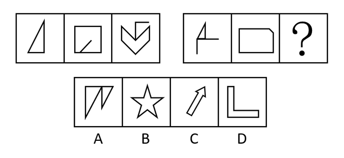
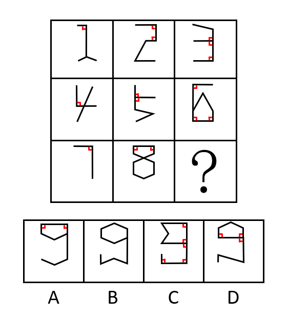
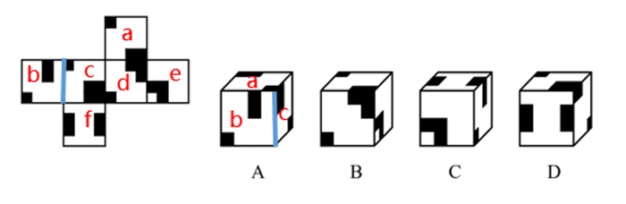
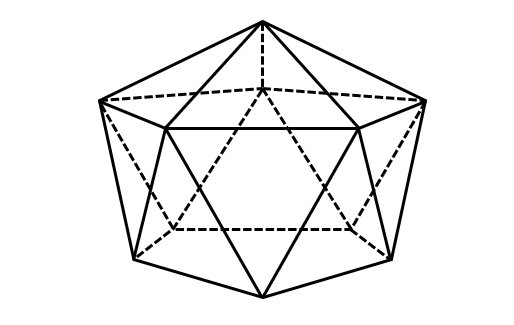
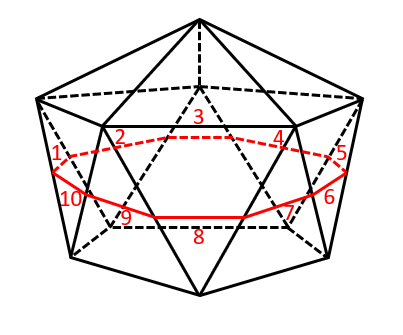
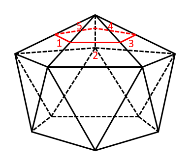

# 2020年山东省公务员录用考试《行测》试题（网友回忆版）

> 判断推理 · 30 题 · 山东 2020

## 第 1 题　qid 2571740 · 图形推理

从所给的四个选项中，选择最合适的一个填入问号处，使之呈现一定的规律性：

- **A**. A
- **B**. B
- **C**. C　✅
- **D**. D

**答案**：C

**官方解析**

元素组成不同，无明显属性规律，考虑数量规律。题干每幅图都是由直线构成，且线条交叉明显，优先考虑数交点。第一组图交点数分别为3、5、7；第二组图应用此规律，交点数依次为3、5、？，故？处应该选择一个交点数为7的图形。A、B、C、D四项中图形的交点数分别为5、10、7、6，只有C项符合。
故正确答案为C。

---

## 第 2 题　qid 2571749 · 图形推理

从所给的四个选项中，选择最合适的一个填入问号处，使之呈现一定的规律性：

- **A**. A
- **B**. B
- **C**. C
- **D**. D　✅

**答案**：D

**官方解析**

元素组成不同，无明显属性规律，考虑数量规律。题干每幅图都是由直线构成，存在直线相交且出现明显的直角，优先考虑数直角数。九宫格优先看横行，第一行中，三个图形的直角数分别为1、2、3；经验证，第二行中，三个图形的直角数分别为1、2、3；第三行前两个图形的直角数分别为1、2，故第三行应用此规律， “？”处应选择一个直角数为3的图形。A、B、C、D四项图形中的直角数分别为2、0、5、3，只有D项符合。

故正确答案为D。

---

## 第 3 题　qid 2571755 · 图形推理

把下面的六个图形分为两类，使每一类图形都有各自的共同特征或规律，分类正确的一项是：

- **A**. ①②⑤，③④⑥
- **B**. ①③⑥，②④⑤　✅
- **C**. ①③④，②⑤⑥
- **D**. ①②④，③⑤⑥

**答案**：B

**官方解析**

本题为分组分类题目。观察发现，每个图形都由一个小半圆和一个多边形组成，考虑功能元素的标记作用。观察发现，每个小半圆都在多边形的一条边上，图①③⑥中小半圆是在多边形的最短边上，图②④⑤中小半圆是在多边形的最长边上。即图①③⑥一组，图②④⑤一组。
故正确答案为B。

---

## 第 4 题　qid 2571760 · 图形推理

左边给定的是纸盒的外表面，下面哪一项能由它折叠而成？

- **A**. A
- **B**. B　✅
- **C**. C
- **D**. D

**答案**：B

**官方解析**

将原展开图标上序号如下图，逐一进行分析。

A项：选项中出现了面b、面c和面a，其中面b与面c有公共边（如下图中蓝边所示），选项中的公共边挨着面c的大黑块，展开图中的公共边挨着面c的小黑块，选项与题干不一致，排除；

B项：选项与题干一致，当选；

C项：选项中出现了面e、面b和面f，其中面b与面f有公共边（如下图中蓝边所示），选项中的公共边挨着面b的长黑块，展开图中的公共边挨着面b的小黑块，选项与题干不一致，排除；

D项：选项中出现了面f、面a和面c，其中面f和面a是相对面，相对面不能同时出现，选项与题干不一致，排除。

故正确答案为B。

---

## 第 5 题　qid 2571762 · 图形推理

下面给定的立体图形，将其从任一面切开，截面的边数不可能是：

- **A**. 10
- **B**. 5
- **C**. 4
- **D**. 3　✅

**答案**：D

**官方解析**

本题考查截面图，逐一分析选项。

A项：横切下半部分即可切出十边形；

B项：横切上半部分即可切出五边形；

C项：斜切下半部的任意一个角即可切出四边形；

D项：无法切出三角形。

本题为选非题，故正确答案为D。

---

## 第 6 题　qid 2571770 · 定义判断

创造过程中的类比包括直接类比和拟人类比。直接类比是指从自然界的现象中或人类社会已有的发明成果中寻找与创造对象相类似的事物，并通过比较启发出创造性设想的一种方法。拟人类比是指把创造发明的对象人格化，假如自己是该对象时，在该种情况下会如何办的一种方法。
根据上述定义，下列属于直接类比的是：

- **A**. 为了更好地统治百姓，古代帝王号称“真龙天子”，并把龙绣在衣服和旗帜上
- **B**. 模仿沙丘的形状改进飞机发动机的燃烧器，发明了“沙丘驻涡火焰稳定器”　✅
- **C**. 模拟人的动作设计机械人
- **D**. 用拳头表示努力加油

**答案**：B

**官方解析**

第一步：找出定义关键词。
直接类比：“从自然界的现象中或人类社会已有的发明成果中寻找与创造对象相类似的事物”、“通过比较启发出创造性设想”；
拟人类比：“把创造发明的对象人格化，假如自己是该对象时，在该种情况下会如何办”。
第二步：逐一分析选项。
A项：古代帝王号称“真龙天子”，并把龙绣在衣服和旗帜上，“龙”不符合“从自然界的现象中或人类社会已有的发明成果中寻找与创造对象相类似的事物”，不符合“直接类比”定义，排除；
B项：模仿沙丘的形状改进飞机发动机的燃烧器，“沙丘”符合“从自然界的现象中寻找与创造对象相类似的事物”，发明了“沙丘驻涡火焰稳定器”符合“通过比较启发出创造性设想”，符合“直接类比”定义，当选；
C项：模拟人的动作设计机械人，不符合“从自然界的现象中或人类社会已有的发明成果中寻找与创造对象相类似的事物”，不符合“直接类比”定义，排除；
D项：用拳头表示努力加油，不符合“从自然界的现象中或人类社会已有的发明成果中寻找与创造对象相类似的事物”，不符合“直接类比”定义，排除。
故正确答案为B。

---

## 第 7 题　qid 2571771 · 定义判断

功能是事物内部固有的效能，它是由事物内部要素结构所决定的，是一种内在与事物内部相对稳定独立的机制。作用是事物与外部环境发生关系时所产生的外部效应。
根据上述定义，下列说法正确的是：

- **A**. 汽车具有运输的功能　✅
- **B**. 脾具有造血、滤血、清除衰老血细胞等作用
- **C**. 法具有促进科技文化事业进步的功能
- **D**. 手机具有通讯的作用

**答案**：A

**官方解析**

第一步：找出定义关键词。
功能：“事物内部固有的效能”、“由事物内部要素结构所决定的”；
作用：“事物与外部环境发生关系时所产生的外部效应”。
第二步：逐一分析选项。
A项：运输是汽车固有的效能，由汽车的内部要素结构所决定，所以运输是汽车的功能，符合定义，当选；
B项：造血、滤血、清除衰老血细胞，是脾固有的效能，不是外部效应，属于脾的功能，不是作用，不符合定义，排除；
C项：法促进科技文化事业进步，是法与外部科技文化事业发生关系时所产生的，属于法的作用，不是功能，不符合定义，排除；
D项：通讯是手机固有的效能，并不是手机与外部发生关系时所产生的，属于手机的功能，不是作用，不符合定义，排除。
故正确答案为A。

---

## 第 8 题　qid 2571778 · 定义判断

注意力经济是指通过最大限度地吸引用户或消费者的注意力，培养潜在的消费群体，以期获得最大的未来商业利益的经济模式。
根据上述定义，下列不属于注意力经济的是：

- **A**. 一服装企业以高薪聘请某知名度很高的歌星做代言人
- **B**. 奥运会期间，某商业银行推出一款以奥运为主题的信用卡
- **C**. 一饮料生产企业斥巨资获得国内某高收视率选秀节目的冠名权
- **D**. 某手机制造商大量投入研发经费，用以提升产品的用户体验　✅

**答案**：D

**官方解析**

第一步：找出定义关键词。
“最大限度地吸引用户或消费者的注意力”、“培养潜在的消费群体”、“获得最大的未来商业利益”。
第二步：逐一分析选项。
A项：服装企业聘请某知名度很高的歌星做代言人，可以利用歌星的知名度吸引用户和消费者的注意力，符合“最大限度地吸引用户或消费者的注意力”、“培养潜在的消费群体”，符合定义，排除；
B项：某商业银行推出一款以奥运为主题的信用卡，可以在奥运会期间吸引用户和消费者的注意力，符合“最大限度地吸引用户或消费者的注意力”、“培养潜在的消费群体”，符合定义，排除；
C项：饮料生产企业斥巨资获得国内某高收视率选秀节目的冠名权，可以利用选秀节目吸引用户和消费者的注意力，符合“最大限度地吸引用户或消费者的注意力”、“培养潜在的消费群体”，符合定义，排除；
D项：手机制造商大量投入研发经费，是为了提升产品的用户体验，是针对顾客使用产品的阶段进行的，不符合“培养潜在的消费群体”，不符合定义，当选。
本题为选非题，故正确答案为D。

---

## 第 9 题　qid 2571781 · 定义判断

遵循所含微粒性质的不同，化学物质分为纯净物与混合物。纯净物是由一种物质组成的，又包括单质和化合物。单质是由同种元素组成的纯净物，化合物是由不同元素组成的纯净物。混合物是由两种或多种物质混合而成的，这些物质相互间没有发生化学反应，各物质都保持原来的性质。
根据上述定义，下列说法正确的是：

- **A**. 白磷和红磷都是化合物
- **B**. 铁矿是单质
- **C**. 氯化钠是纯净物　✅
- **D**. 冰水混合物是混合物

**答案**：C

**官方解析**

第一步：找出定义关键词。
纯净物：“纯净物是由一种物质组成的”；
单质：“是由同种元素组成的纯净物”；
化合物：“是由不同元素组成的纯净物”；
混合物：“是由两种或多种物质混合而成的”。
第二步：逐一分析选项。
A项：白磷和红磷都是由同种磷元素组成的，他们是单质，不是化合物，排除；
B项：铁矿中含有铁的多种化合物以及一些岩石、沉积物，是由多种物质混合而成的，是混合物，不是单质，排除；
C项：氯化钠，是由一种物质组成的纯净物，符合定义，当选；
D项：冰和水虽然存在状态不同，但都是由同一物质水分子组成，所以冰水混合物是纯净物，不是混合物，排除。
故正确答案为C。

---

## 第 10 题　qid 2571786 · 定义判断

论据通常可分为事实性论据和理论性论据两种。事实性论据是指用来证明论点的事例、史实和统计数据等。理论性论据是指用来证明论点的、被社会大众所接受或者公认的道理、名言、俗语等。
根据上述定义，下列论证使用了理论性论据的是：

- **A**. 
人是可以依靠自己的毅力克服困难，走向成功的。尽管命运让贝多芬失去了听觉，但是他最终还是成为了一个伟大的作曲家

- **B**. 
一项研究发现，人平均每隔十分钟就要撒一次谎。所以在我们的日常生活中，没有不撒谎的人，只是谎言有大有小罢了

- **C**. 
只要有恒心，就没有做不成的事情。愚公锲而不舍地挖掘太行、王屋二山，他的精神感动了神灵，终于将山移走

- **D**. 
爱迪生曾说过：“天才是的汗水加上的灵感。”因此要想成功，后天的努力至关重要
　✅

**答案**：D

**官方解析**

第一步：找出定义关键词。

事实性论据：“指用来证明论点的事例、史实和统计数据等”；

理论性论据：“指用来证明论点的、被社会大众所接受或者公认的道理、名言、俗语等”。

第二步：逐一分析选项。

A项：贝多芬失去了听觉却依然成为了一个伟大的作曲家，属于“用来证明论点的事例”，符合“事实性依据”定义，不符合“理论性依据”定义，排除；

B项：一项研究发现，人平均每隔十分钟就要撒一次谎，属于“用来证明论点的统计数据”，符合“事实性依据”定义，不符合“理论性依据”定义，排除；

C项：愚公锲而不舍地挖掘太行、王屋二山，他的精神感动了神灵，终于将山移走，属于“用来证明论点的事例”，符合“事实性依据”定义，不符合“理论性依据”定义，排除；

D项：爱迪生曾说过：“天才是的汗水加上的灵感”，属于“用来证明论点的、被社会大众所接受或者公认的道理、名言、俗语等”，符合“理论性依据”定义，当选。

故正确答案为D。

---

## 第 11 题　qid 2571712 · 类比推理

飞机：汽车

- **A**. 电瓶车：自行车
- **B**. 脚踏三轮车：摩托车
- **C**. 高铁：有轨电车　✅
- **D**. 轮船：皮划艇

**答案**：C

**官方解析**

第一步：判断题干词语间逻辑关系。
题干“飞机”与“汽车”均为交通工具，为并列关系，并且动力来源一致，均为发动机。
第二步：判断选项词语间逻辑关系。
A项：“电瓶车”与“自行车”均为交通工具，为并列关系，但是“电瓶车”的动力来源是电力，“自行车”的动力来源是人力，动力来源不一致，与题干逻辑关系不一致，排除；
B项：“脚踏三轮车”与“摩托车”均为交通工具，为并列关系，但是“脚踏三轮车”的动力来源是人力，“摩托车”的动力来源是发动机，动力来源不一致，与题干逻辑关系不一致，排除；
C项：“高铁”与“有轨电车”均为交通工具，为并列关系，并且动力来源均为电动机，动力来源一致，与题干逻辑关系一致，当选；
D项：“轮船”与“皮划艇”均为水上交通工具，为并列关系，但是“轮船”的动力来源是涡轮机和蒸汽机，“皮划艇”的动力来源是人力，动力来源不一致，与题干逻辑关系不一致，排除。
故正确答案为C。

---

## 第 12 题　qid 2571713 · 类比推理

正误：是非

- **A**. 优劣：贵贱
- **B**. 爱憎：情仇
- **C**. 卑微：渺小
- **D**. 成败：胜负　✅

**答案**：D

**官方解析**

第一步：判断题干词语间逻辑关系。
“正误”和“是非”都表示事物的对错，二者为近义词，并且“正”与“误”是反义，“是”与“非”是反义。
第二步：判断选项词语间逻辑关系。
A项：“优劣”表示事物的好坏，“贵贱”表示富贵与贫贱，二者不是近义词，与题干逻辑关系不一致，排除；
B项：“爱憎”表示好恶，“情仇”表示情感与仇恨，二者不是近义词，与题干逻辑关系不一致，排除；
C项：“卑微”表示卑贱微小，地位低下，“渺小”表示非常微小，或完全无关紧要，二者是近义词，但是“卑”和“微”不是反义词，与题干逻辑关系不一致，排除；
D项：“成败”表示成功与失败，“胜负”表示胜利与失败，二者是近义词，并且“成”与“败”是反义，“胜”与“负”是反义，与题干逻辑关系一致，当选。
故正确答案为D。

---

## 第 13 题　qid 2571714 · 类比推理

平板版画：铜板版画

- **A**. 单色版画：佛教版画　✅
- **B**. 石板版画：木板版画
- **C**. 现代版画：传统版画
- **D**. 凹版版画：凸版版画

**答案**：A

**官方解析**

第一步：判断题干词语间逻辑关系。
有的平板版画是铜板版画，有的平板版画不是铜板版画，并且有的铜板版画是平板版画，有的铜板版画不是平板版画，二者为交叉关系。
第二步：判断选项词语间逻辑关系。
A项：有的单色版画是佛教版画，有的单色版画不是佛教版画，有的佛教版画是单色版画，有的佛教版画不是单色版画，二者为交叉关系，与题干逻辑关系一致，当选；
B项：石板版画和木板版画，二者是并列关系，与题干逻辑关系不一致，排除；
C项：现代版画和传统版画，二者是并列关系，与题干逻辑关系不一致，排除；
D项：凹版版画和凸版版画，二者是并列关系，与题干逻辑关系不一致，排除。
故正确答案为A。

---

## 第 14 题　qid 2571716 · 类比推理

战：斗：战斗

- **A**. 欢：迎：欢迎
- **B**. 学：习：学习　✅
- **C**. 勤：劳：勤劳
- **D**. 发：行：发行

**答案**：B

**官方解析**

第一步：判断题干词语间逻辑关系。
“战”有“战争、战斗”之意，“斗”有“对打、争胜”之意，二者构成近义关系，且可组成词语“战斗”。
第二步：判断选项词语间逻辑关系。
A项：“欢”的意思是“快乐、高兴”，“迎”的意思是“迎接”，二者不是近义关系，与题干逻辑关系不一致，排除；
B项：“学”的意思是“学习、模仿”，“习”的意思是“学习、复习”，二者构成近义关系，且可组成词语“学习”，与题干逻辑关系一致，当选；
C项：“勤”的意思是“尽力多做或不断地做”，“劳”的意思是“劳动、烦劳、疲劳“，二者不是近义关系，与题干逻辑关系不一致，排除；
D项：“发”的意思是“送出、交付、产生”，“行”的意思是“走、路程、旅行、做”，二者不是近义关系，与题干逻辑关系不一致，排除。
故正确答案为B。

---

## 第 15 题　qid 2571718 · 类比推理

典当：贷款：融资

- **A**. 买入：卖出：交易
- **B**. 水运：空运：运输　✅
- **C**. 望诊：闻诊：问诊
- **D**. 起跑：冲刺：赛跑

**答案**：B

**官方解析**

第一步：判断题干词语间逻辑关系。
典当是以财物作质押，有偿有期借贷融资的一种方式，贷款是银行或其他金融机构按一定利率和必须归还等条件出借货币资金的一种信用活动形式，都是不同的融资方式，故二者是并列关系，和融资是包容关系中的种属关系。
第二步：判断选项词语间逻辑关系。
A项：买入和卖出是整个交易过程中的不同阶段，二者是并列关系，但是和交易是组成关系，与题干逻辑关系不一致，排除；
B项：水运和空运是不同的运输方式，二者是并列关系，且和运输是种属关系，与题干逻辑关系一致，当选；
C项：望诊、闻诊和问诊，三者构成并列关系，与题干逻辑关系不一致，排除；
D项：起跑和冲刺是整个赛跑过程中的不同阶段，二者是并列关系，但是和赛跑是组成关系，与题干逻辑关系不一致，排除。
故正确答案为B。

---

## 第 16 题　qid 2571720 · 类比推理

超速：追尾：处罚

- **A**. 高温：自燃：追责　✅
- **B**. 购票：乘车：出行
- **C**. 谨慎：寡言：冷落
- **D**. 勤政：声望：爱戴

**答案**：A

**官方解析**

第一步：判断题干词语间逻辑关系。
超速可能会导致追尾，追尾可能会导致被处罚，二者均为因果关系。
第二步：判断选项词语间逻辑关系。
A项：高温可能会导致自燃，自燃可能会导致被追责（注：在高温下，汽车自燃了，如果被检查出汽车本身就有质量问题，是可以追究厂家的责任），二者均为因果关系，与题干逻辑关系一致，当选；
B项：先购票，再乘车，二者是动作先后顺序，而非因果关系，与题干逻辑关系不一致，排除；
C项：谨慎是指对外界事物或自己的言行密切注意；寡言是指很少说话，不爱说话，二者之间没有直接的因果联系，且如果谨慎最终导致的结果是被冷落，这也并不符合大众主流思维，因为谨慎是美德，与题干逻辑关系不一致，排除；
D项：因为勤政，所以可能“有”声望，而非声望，与题干逻辑关系不一致，排除。
注：本题为争议题，很多同学纠结C项和D项，认为题干的主体是人，其实不然，超速的定义是车辆的行驶速度超过法律法规规定的速度，所以超速的主体到底是车辆，还是驾驶车辆的人，从不同角度来理解，都是有道理的；
另外，从二级辨析—积极/消极的角度来看，题干和A项都是消极事件，且都是可以跟“车辆”相关的；C项因果关系并不明显； D项是积极事件，比较而言，也是A项更好；
综上所述，本题不严谨，各说各有理，备考时间有限，小粉笔不建议广大考生过多纠结争议题，主要学习本题的解题思维即可。
故正确答案为A。

---

## 第 17 题　qid 2571723 · 类比推理

足球：运动员：体育场

- **A**. 龙舟：划手：河流　✅
- **B**. 协议：国家：世贸组织
- **C**. 商品：顾客：厂家
- **D**. 葡萄：酿酒师：啤酒节

**答案**：A

**官方解析**

第一步：判断题干词语间逻辑关系。
运动员在体育场踢足球，且运动员是一个职业，体育场是踢足球的场所，三者为对应关系。
第二步：判断选项词语间逻辑关系。
A项：划手在河流划龙舟，且划手是一个职业，河流是划龙舟的场所，三者为对应关系，与题干逻辑关系一致，当选；
B项：国家在世贸组织签订协议，但国家不是一个职业，与题干逻辑关系不一致，排除；
C项：顾客在厂家购买商品，但顾客不是一个职业，与题干逻辑关系不一致，排除；
D项：酿酒师在啤酒节酿啤酒，葡萄是酿酒需要用到的原材料，与题干逻辑关系不一致，排除。
故正确答案为A。

---

## 第 18 题　qid 2571724 · 类比推理

诗人：作诗：作词

- **A**. 画家：艺术：画展
- **B**. 乐手：指挥：弹琴
- **C**. 鼓手：弹奏：作曲
- **D**. 会计：审核：做账　✅

**答案**：D

**官方解析**

第一步：判断题干词语间逻辑关系。
诗人可以作诗，也可以作词，三者为对应关系。
第二步：判断选项词语间逻辑关系。
A项：画家可以创作艺术，举办画展，与题干逻辑关系不一致，排除；
B项：乐手包括吉他手、钢琴手等，所以乐手可以弹琴，但是不指挥，指挥一般由指挥手担任，与题干逻辑关系不一致，排除；
C项：鼓手是乐队中打鼓的人，不弹奏，也不作曲，与题干逻辑关系不一致，排除；
D项：会计可以审核，也可以做账，三者为对应关系，与题干逻辑关系一致，当选。
故正确答案为D。

---

## 第 19 题　qid 2571726 · 类比推理

何首乌 对于（    ）相当于（    ）对于 星座

- **A**. 山药；北斗七星
- **B**. 淀粉；恒星
- **C**. 中药；大熊座　✅
- **D**. 植物；天文学

**答案**：C

**官方解析**

逐一代入选项。
A项：何首乌和山药是两种植物，二者为并列关系中的反对关系，北斗七星是大熊座的组成部分，而大熊座是一个星座，前后逻辑关系不一致，排除；
B项：何首乌含有淀粉，星座由恒星组成，均为包容关系中的组成关系，但词语顺序不同，前后逻辑关系不一致，排除；
C项：何首乌是一种中药，大熊座是一个星座，均为包容关系中的种属关系，前后逻辑关系一致，当选；
D项：何首乌是一种植物，二者为包容关系中的种属关系，星座是天文学的研究内容，二者为对应关系，前后逻辑关系不一致，排除。
故正确答案为C。

---

## 第 20 题　qid 2571730 · 类比推理

阳刚 对于（    ）相当于 谦恭 对于（    ）

- **A**. 男孩；女孩
- **B**. 阴柔；倨傲　✅
- **C**. 果敢；谦逊
- **D**. 外表；内心

**答案**：B

**官方解析**

逐一代入选项。
A项：阳刚指刚强，专用于形容男孩；谦恭指谦虚而有礼貌，并不专用于形容女孩，前后逻辑关系不一致，排除；
B项：阳刚指刚强，与阴柔为反义关系；谦恭指谦虚而有礼貌，倨傲形容高傲自大、傲慢的样子，二者为反义关系，前后逻辑关系一致，当选；
C项：阳刚指刚强，果敢指勇敢而有决断，二者无明显关系；谦恭指谦虚而有礼貌，谦逊指谦虚恭谨，二者为近义关系，前后逻辑关系不一致，排除；
D项：阳刚的外表，但只能用于形容男人，而谦恭的内心，无明显限制，前后逻辑关系不一致，排除。
故正确答案为B。

---

## 第 21 题　qid 2571734 · 逻辑判断

某慈善组织号召企业向受暴雨袭击的某地区捐赠帐篷。某地区为表谢意向该组织询问是哪些企业进行了捐赠。经调查，了解到以下情况：（1）四家企业都没有捐赠；（2）丁企业没有捐赠；（3）乙企业和丁企业至少有一家企业没有捐赠；（4）四家企业中确有企业捐赠。后来得知上述四种情况两种为真，两种为假。
由此可以推出：

- **A**. 甲企业没有进行捐赠
- **B**. 乙企业进行了捐赠
- **C**. 丙企业没有进行捐赠
- **D**. 丁企业进行了捐赠　✅

**答案**：D

**官方解析**

第一步：找矛盾。
（1）四家企业都没有捐赠与（4）四家企业中确有企业捐赠是矛盾关系，必有一真必有一假。已知四种情况两种为真，两种为假，可以推出（1）（4）一真一假，（2）（3）也一真一假。
第二步：看其余。
当（2）丁企业没有捐赠为真时，可知（3）乙企业和丁企业至少有一家企业没有捐赠也一定为真，但（2）（3）需满足一真一假，不符合条件，因此可以推出（2）丁企业没有捐赠只能为假，即丁企业捐赠为真，D项当选。
故正确答案为D。

---

## 第 22 题　qid 2571752 · 逻辑判断

研究人员给一群实验用的小鼠提供相同的食物，这些小鼠中有部分小鼠的下丘脑部位有不可恢复的损伤，而另一些则没有。一段时间后，研究人员发现那些下丘脑部位有损伤的小鼠出现了肥胖的症状。研究人员认为，下丘脑特定部位的损伤是导致小鼠肥胖的原因。
以下哪项如果为真，最能支持研究人员的结论？

- **A**. 下丘脑部位未损伤的那些小鼠未出现肥胖的症状　✅
- **B**. 已有相当多研究人员致力于研究小鼠脑部损伤与肥胖之间的关系
- **C**. 研究人员发现，下丘脑部位损伤的小鼠患糖尿病的比例高于正常水平
- **D**. 下丘脑部位损伤的小鼠与食用高脂饮食导致肥胖的小鼠肥胖程度相当

**答案**：A

**官方解析**

第一步：找出论点和论据。
论点：下丘脑特定部位的损伤是导致小鼠肥胖的原因。
论据：研究人员给一群实验用的小鼠提供相同的食物，这些小鼠中有部分小鼠的下丘脑部位有不可恢复的损伤，而另一些则没有。一段时间后，研究人员发现那些下丘脑部位有损伤的小鼠出现了肥胖的症状。
本题论点论据讨论的都是下丘脑特定部位的损伤和小鼠发胖之间的关系，论点论据话题一致，优先考虑补充论据进行加强。由于论据是用两组小鼠做了对比实验，但只给出了一组结果，因此优先考虑补充另外一组实验的结果。
第二步：逐一分析选项。
A项：指出下丘脑部位未损伤的小鼠未出现肥胖的症状，补充了另外一组实验的结果，与下丘脑部位有损伤的小鼠进行对比，可以加强，当选；
B项：已有相当多研究人员致力于研究小鼠脑部损伤与肥胖之间的关系，但下丘脑特定部位的损伤是否会导致小鼠肥胖尚不可知，属于不明确选项，无法加强，排除；
C项：论点说的是下丘脑特定部位损伤会导致小鼠肥胖，该项说的是下丘脑部位损伤的小鼠患糖尿病的比例高，糖尿病是血糖高，而肥胖是脂肪多，话题不一致，无法加强，排除；
D项：实验中给两组小鼠提供的是相同的食物，区别在于两组小鼠一组下丘脑特定部位有损伤，一组没有损伤，而选项说的是下丘脑部位损伤的小鼠与食用高脂饮食的小鼠肥胖程度相当，与题干无关，无法加强，排除。
故正确答案为A。

---

## 第 23 题　qid 2571761 · 逻辑判断

一项实验中，研究者对被试者进行了身体活动水平的调查，分析了他们平均每天坐着的时间。结果显示，每天坐的时间过长（超过5小时）与大脑内侧颞叶缩小密切相关，即使其他时间身体达到了很高的活动水平，也无法改变颞叶缩小的趋势。因此，久坐会对人的记忆力产生影响。
要得到上述结论，需要补充的前提是：

- **A**. 有些记忆力较差的人不常运动，更喜欢宅在家里
- **B**. 大部分帕金森患者出现记忆力的持续衰退和颞叶缩小的状况
- **C**. 大脑内侧颞叶区域包含海马回，而这一部位与记忆的形成有关　✅
- **D**. 各年龄段群体中，久坐对年轻人记忆力的影响大于中老年人

**答案**：C

**官方解析**

第一步：找出论点和论据。
论点：久坐会对人的记忆力产生影响。
论据：每天坐的时间过长（超过5小时）与大脑内侧颞叶缩小密切相关，即使其他时间身体达到了很高的活动水平，也无法改变颞叶缩小的趋势。
论点讨论的是久坐会对人的记忆力产生影响，论据讨论的是久坐会导致颞叶缩小，论点和论据话题不一致，要想加强，优先考虑搭桥，即建立“记忆”和“颞叶”之间的关系。
第二步：逐一分析选项。
A项：该项指出有些记忆力较差的人不常运动，更喜欢宅在家里，不常运动不等于久坐，不能说明久坐会对人的记忆力产生影响，不是上述论证的前提，排除；
B项：大部分帕金森患者出现记忆力的持续衰退和颞叶缩小的状况，这与久坐是否会对人的记忆力产生影响无关，不是上述论证的前提，排除；
C项：久坐会导致颞叶缩小，而大脑内侧颞叶区域包含海马回，这一部位与记忆的形成有关，所以久坐会对人的记忆力产生影响，在“记忆”和“颞叶”之间建立了联系，搭桥项，当选；
D项：该项说明久坐的确对记忆力有影响，有一定加强力度，但不是上述论证的前提，排除。
故正确答案为C。

---

## 第 24 题　qid 2571766 · 逻辑判断

早期阿尔茨海默症患者由于记忆丧失，经常处于焦虑不安的状态中。近期科研人员通过实验发现，对患有早期阿尔茨海默症的小白鼠大脑进行光感刺激能够帮其找回失去的记忆。他们指出，光感刺激有助于早期阿尔茨海默症的治疗。
以下哪项如果为真，最能支持上述论证？

- **A**. 生活在日照时间长的地区的小白鼠比接受光感刺激的实验室小白鼠患早期阿尔茨海默症的比例低
- **B**. 有些接受过光感刺激的小白鼠患上了早期阿尔茨海默症
- **C**. 如果终止光感刺激，患早期阿尔茨海默症的小白鼠症状会加重　✅
- **D**. 没有接受光感刺激的小白鼠患早期阿尔茨海默症的比例较低

**答案**：C

**官方解析**

第一步：找出论点和论据。
论点：光感刺激有助于早期阿尔茨海默症的治疗。
论据：对患有早期阿尔茨海默症的小白鼠大脑进行光感刺激能够帮其找回失去的记忆。
论点和论据讨论的话题是一致的，想加强，优先考虑补充论据，即解释原因或举例。
第二步：逐一分析选项。
A项：论点讨论的是治病，选项讨论的是患病比例，二者话题不一致，无关项，排除；
B项：有些接受过光感刺激的小白鼠患上了早期阿尔茨海默症，在一定程度上，反而说明光感刺激可能不能治疗早期阿尔茨海默症，削弱项，不能加强，排除；
C项：终止光感刺激，患早期阿尔茨海默症的小白鼠症状会加重，说明光感刺激有助于缓解和治疗早期阿尔茨海默症，补充论据进行加强，当选；
D项：没有接受光感刺激的小白鼠患病比例低，与接受光感刺激能否治病无关，不能加强，排除。
故正确答案为C。

---

## 第 25 题　qid 2571775 · 逻辑判断

主流观点认为，气候变化是人类双足行走的主要驱动力。几百万年前，非洲森林的面积开始缩减，草原面积大量增长。在树木很少的环境中，双足行走的意义很明显：站起来，能让人类祖先的视线越过生长丰茂的草，看到捕食者和猎物。因此，草原面积大量增长使得最善于站立的祖先更有可能存活，他们的基因得以传承下来。
以下哪项如果为真，最能削弱上述论证？

- **A**. 人类祖先从四腿行走到双足行走的过程中，多处身体结构发生了转变
- **B**. 在发现早期双足行走人类化石的区域，还发现了大量同时代的森林动植物化石　✅
- **C**. 新生儿表现出一些人类祖先曾经在树上居住的迹象
- **D**. 早期人类的膝关节与现代人类的膝关节惊人的相似

**答案**：B

**官方解析**

第一步：找出论点和论据。
论点：草原面积大量增长使得最善于站立的祖先更有可能存活，他们的基因得以传承下来。
论据：在树木很少的环境中，双足行走的意义很明显：站起来，能让人类祖先的视线越过生长丰茂的草，看到捕食者和猎物。
本题论点说草原面积大量增长使得最善于站立的祖先更有可能存活，他们的基因得以传承下来，论据说在树木很少的环境中，双足行走的意义很明显：站起来，能让人类祖先的视线越过生长丰茂的草，看到捕食者和猎物，两者都在说草原对人类双足行走的影响，话题一致，优先考虑削弱论点。
第二步：逐一分析选项。
A项：指出人类祖先从四腿行走到双足行走的过程中，多处身体结构发生了转变，但无法确定人类变为双足行走是否是因为草原面积增长，无法削弱，排除；
B项：指出在发现早期双足行走人类化石的区域，还发现了大量同时代的森林动植物化石，说明其实在森林时期已经有人类实现双足行走，证明不是因为草原出现才有了双足行走，削弱论点，当选；
C项：指出新生儿表现出一些人类祖先曾经在树上居住的迹象，讨论的是新生儿表现出来的迹象，而题干讨论的是人类双足行走与草原面积增长的关系，与题干话题不一致，排除；
D项：指出早期人类的膝关节与现代人类的膝关节惊人的相似，讨论的是早期人类与现代人类膝关节的特点，而题干讨论的是人类双足行走与草原面积增长的关系，与题干话题不一致，排除。
故正确答案为B。

---

## 第 26 题　qid 2571782 · 逻辑判断

如今，常有人抱怨自己很难有充足的睡眠，睡眠质量也常常不佳。一些专家认为这与现代科技的众多产物，比如长明的路灯、电视、电脑和手机有关，正是这些人造光源和电子设备产生的光扰乱了睡眠，让人们难以入睡。
以下哪项如果为真，最能支持上述结论?

- **A**. 当个体暴露在灯光下，入睡会变得比以往困难，睡眠也呈现出碎片化的状况　✅
- **B**. 现代人的昼夜节律常被工作和时差打乱，电子设备和人造光源并不是睡眠被打断的唯一原因
- **C**. 当前一些人的睡眠问题很可能不是因为睡眠总时间短，而是因为使用电脑等设备引发了一些健康问题
- **D**. 在一些没有电的农村地区，人们的平均睡眠时间比生活在城市同龄人的睡眠时间长很多

**答案**：A

**官方解析**

第一步：找出论点和论据。
论点：一些专家认为这与现代科技的众多产物，比如长明的路灯、电视、电脑和手机有关，正是这些人造光源和电子设备产生的光扰乱了睡眠，让人们难以入睡。
论据：无。
本题只有论点，没有论据，考虑补充论据，即解释人造光源和电子设备产生的光会扰乱睡眠的原因，或举例子说明人造光源和电子设备产生的光会扰乱睡眠。
第二步：逐一分析选项。
A项：指出当个体暴露在灯光下，入睡会变得比以往困难，睡眠也呈现出碎片化的状况，解释了人造光源和电子设备让人入睡困难，光会扰乱睡眠，补充论据，当选；
B项：指出现代人的昼夜节律常被工作和时差打乱，电子设备和人造光源并不是睡眠被打断的唯一原因，说明人们睡眠质量不佳还有其他原因，属他因项，无法加强，排除；
C项：指出当前一些人的睡眠问题很可能不是因为睡眠总时间短，而是因为使用电脑等设备引发了一些健康问题，讨论的是电脑等设备引发的健康问题，而题干讨论的是人造光源和电子设备产生的光与睡眠质量之间的关系，话题不一致，无法加强，排除；
D项：指出在一些没有电的农村地区，人们的平均睡眠时间比生活在城市同龄人的睡眠时间长很多，题干讨论的睡眠质量，而该项讨论的是睡眠时间，话题不一致，无法加强，排除。
故正确答案为A。

---

## 第 27 题　qid 2571788 · 逻辑判断

足迹化石虽然不能像实体化石那样保存生物完整的形态，但从足迹化石中，我们可以分析出生物大概的形态特征和行为学特征。也就是说，当直接证据缺失的时候，我们只能通过间接证据——足迹化石来推测当时的环境，反推是哪些动物留下的足迹，它们有没有复杂的动物行为等。因此，在前寒武纪到寒武纪的转折时期，足迹化石显得尤为重要。
上述结论的成立，还需基于以下哪一前提？

- **A**. 目前发现的从前寒武纪到寒武纪转折时期的足迹化石比实体化石更多
- **B**. 前寒武纪到寒武纪转折时期的足迹化石比实体化石更具有研究价值
- **C**. 目前发现的前寒武纪到寒武纪转折时期的足迹化石比其他时期稀少
- **D**. 在前寒武纪到寒武纪的转折时期，保留下来的动物实体化石十分稀少　✅

**答案**：D

**官方解析**

第一步：找出论点和论据。
论点：在前寒武纪到寒武纪的转折时期，足迹化石显得尤为重要。
论据：当直接证据缺失的时候，我们只能通过间接证据——足迹化石来推测当时的环境，反推是哪些动物留下的足迹，它们有没有复杂的动物行为等。
本题论点论据都在说，通过足迹化石来推测当时的环境和动物行为，都在讨论在某一时期足迹化石的重要性，论点论据话题一致，优先考虑补充必要条件。
第二步：逐一分析选项。
A项：指出目前发现的从前寒武纪到寒武纪转折时期的足迹化石比实体化石更多，无法确定实体化石的具体数量，不能作为题干的必要条件，不是题干论证成立的前提，排除；
B项：指出前寒武纪到寒武纪转折时期的足迹化石比实体化石更具有研究价值，但无法确定实体化石和足迹化石的数量，现存的化石是哪种，哪种化石更为重要，不能作为题干的必要条件，不是题干论证成立的前提，排除；
C项：指出目前发现的前寒武纪到寒武纪转折时期的足迹化石比其他时期稀少，但无法确定该时期实体化石的具体数量，不能作为题干的必要条件，不是题干论证成立的前提，排除；
D项：指出在前寒武纪到寒武纪的转折时期，保留下来的动物实体化石十分稀少，说明该时期实体化石作为直接证据而缺失，需要足迹化石这种间接证据，补充了题干的必要条件，当选。
故正确答案为D。

---

## 第 28 题　qid 2571792 · 逻辑判断

某城市选拔志愿者，已知情况如下：
（1）只有小红报名，小白、小黑和小花才会都跟着报名；
（2）如果小白不报名，则小黑也不报名；
（3）如果小黑不报名，则小灰也不报名；
（4）小红没报名；
（5）小灰报名了。
由此可以推出：

- **A**. 小白、小黑和小花都报名了
- **B**. 小白和小黑都报名了　✅
- **C**. 小黑和小花都报名了
- **D**. 小白和小花都报名了

**答案**：B

**官方解析**

第一步：翻译题干。

① 小白 且 小黑 且 小花小红；

② 小黑小白；

③ 小灰小黑；

④ 小红；

⑤ 小灰；

根据②③可得：⑥小灰小黑小白。

第二步：逐一分析选项。

根据⑤⑥可知，⑤是对⑥的肯前，肯前必肯后，所以得到小黑和小白都报名了；根据④①可知，④是对①的否后，否后必否前，可得到（小白且小黑且小花），再依据德摩根定律拆括号，得到小白或小黑或小花；又根据前述条件小白和小黑都报名和或关系的否一推一得到小花，即小花没报名。综上所述，小灰、小黑、小白都报名了，小花没报名，只有B项满足，当选。

故正确答案为B。

---

## 第 29 题　qid 2571794 · 逻辑判断

研究人员用X射线拍摄猕猴进食、打哈欠以及相互嘶吼时发出各种各样声音的影像。结果显示，猕猴很容易就能发出许多不同的声音，包括英语字母中最基本的5个元音。研究人员据此推测，猕猴不能说出数千个单词和完整的句子，是因为它们的大脑和人类存在差异。
以下哪项如果为真，最能支持上述研究人员的推测？

- **A**. 猕猴和类人猿的声带特征是它们无法重现人类语音的原因
- **B**. 非洲灰鹦鹉经过人类训练之后，可以说800多个单词
- **C**. 人类丰富的语言表达能力主要源于大脑中特有的高度发达的语言功能区　✅
- **D**. 利用电脑模拟猕猴讲完整的句子，每个词都比较清晰，并不难听懂

**答案**：C

**官方解析**

第一步：找出论点和论据。
论点：猕猴不能说出数千个单词和完整的句子，是因为它们的大脑和人类存在差异。
论据：猕猴很容易就能发出许多不同的声音，包括英语字母中最基本的5个元音。
本题的论点是在说猕猴大脑和人类存在差异，导致猕猴不能说数千个单词和完整的句子，论据在说猕猴能发出很多不同的声音，论点论据都是在说猕猴大脑和人类存在差异与发出声音之间的关系，论点论据话题一致，因此考虑补充论据，证明确实是猕猴大脑与人类之间的差异让猕猴不能说数千个单词和完整句子即可。
第二步：逐一分析选项。
A项：猕猴和类人猿的声带特征是它们无法重现人类语音的原因，那导致猕猴不能说数千个单词和完整句子的原因是声带特征，跟与人类大脑的差异无关，削弱论点，无法加强，排除；
B项：非洲灰鹦经过训练之后能发出声音和猕猴无关，主体不一致，无法加强，排除；
C项：人类丰富的语言表达能力主要源于大脑中特有的高度发达的语言功能区，说明语言表达能力和人类大脑特有的语言功能区相关，补充论据证明了猕猴无法说很多话的原因确实是和人脑存在差异，可以加强论点，当选；
D项：通过电脑模拟能听懂猕猴的声音，和猕猴不能说数千个单词和句子的原因无关，无法加强，排除。 
故正确答案为C。

---

## 第 30 题　qid 2571796 · 逻辑判断

某手机厂商推出一款手机的新款，与旧款相比，除续航时间大大提升以外，新款手机的其他样式与配置均未发生变化。在旧款手机与新款手机同时销售的三个月内，旧款手机的销量超过了新款手机。于是，该手机厂商得出一个结论，认为续航时间并非顾客的首要考虑因素。
以下哪项如果为真，最能削弱上述结论？

- **A**. 旧款手机的续航时间足以满足消费者的需要　✅
- **B**. 越来越多的消费者趋向于购买充电宝以延长手机的续航时间
- **C**. 消费者对新款手机的续航时间缺乏足够的认识
- **D**. 新款手机延长续航时间的同时提高了销售价格

**答案**：A

**官方解析**

第一步：找出论点和论据。
论点：续航时间并非顾客的首要考虑因素。
论据：某手机厂商推出一款手机的新款，与旧款相比，除续航时间大大提升以外，新款手机的其他样式与配置均未发生变化。在旧款手机与新款手机同时销售的三个月内，旧款手机的销量超过了新款手机。
本题的论点在说续航时间不是顾客考虑的首要因素，论据在说续航时间和手机销量的关系，因此论点论据话题一致，优先考虑否定论点，其次考虑否定论据。
第二步：逐一分析选项。
A项：指出旧款手机续航时间能满足需要，说明续航时间是在顾客首要考虑范围之内，因为能满足需求，所以购买旧款手机，否定论点，可以削弱，当选；
B项：说明有其他方式可以增加手机续航的时间，那么顾客购买手机是否首要考虑续航时间其实不清楚，属于不明确选项，无法削弱，排除；
C项：只是说明对新款手机的续航时间缺乏认识，那么认识之后是否会购买新手机，购买手机是否首要考虑续航时间也无从得知，属于不明确选项，无法削弱，排除；
D项：说明新款手机提高续航时间的同时也提高了价格，那么不买新手机是因为价格，就不是首要考虑续航时间了，加强论点，无法削弱，排除。
故正确答案为A。

---
