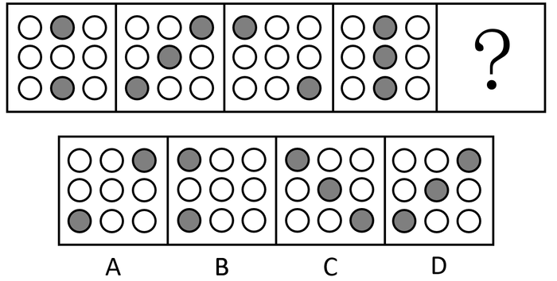
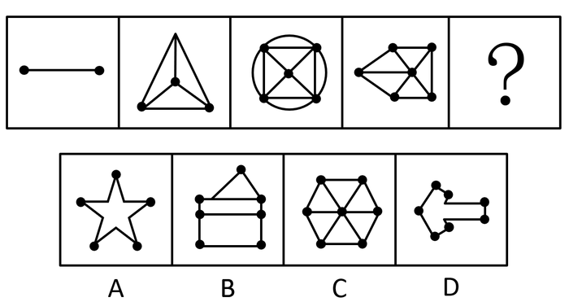
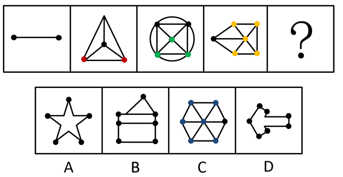
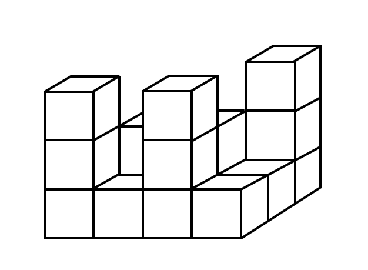
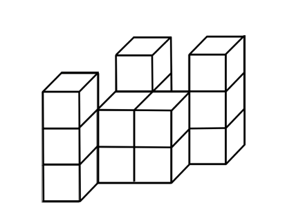

# 2020年广东省公务员录用考试《行测》试题（乡镇卷）（网友回忆版）

> 判断推理 · 20 题 · 广东 2020

## 第 1 题　qid 2604255 · 图形推理

下列选项中最符合所给图形规律的是（    ）。

- **A**. A
- **B**. B　✅
- **C**. C
- **D**. D

**答案**：B

**官方解析**

元素组成相似，优先考虑样式规律。九宫格优先横向看，第一横行中，内部小元素均在第一行，且两个小元素之间的位置关系分别为相邻、重合和相隔一格；第二横行中，内部小元素均在第二行，且两个小元素之间的位置关系分别为相邻、相隔一格和重合；第三横行应用规律，前两幅图中内部小元素均在第三横行，且两个小元素之间的位置关系分别为间隔一格和相邻，故？处应该选一个重合的，只有B项符合，当选。
故正确答案为B。

---

## 第 2 题　qid 2604268 · 图形推理

下列选项中最符合所给图形规律的是（    ）。

- **A**. A　✅
- **B**. B
- **C**. C
- **D**. D

**答案**：A

**官方解析**

元素组成相同，均由一个三角形和梯形构成，优先考虑位置规律。观察发现，题干中三角形依次顺时针旋转，梯形依次逆时针旋转，？处应用规律，只有A项符合，当选。

故正确答案为A。

---

## 第 3 题　qid 2604281 · 图形推理

下列选项中最符合所给图形规律的是（    ）。

- **A**. A　✅
- **B**. B
- **C**. C
- **D**. D

**答案**：A

**官方解析**

元素组成不同，优先考虑属性规律。观察发现，题干图形均为既轴对称又中心对称图形，排除B项；进一步观察发现，题干图形均由黑球和白球构成，考虑数量规律，题干黑球数量分别为2、3、2、3，故？处应选择黑球数量为2的图形，只有A项符合，当选。
故正确答案为A。

---

## 第 4 题　qid 2604286 · 图形推理

下列选项中最符合所给图形规律的是（    ）。

- **A**. A
- **B**. B
- **C**. C
- **D**. D　✅

**答案**：D

**官方解析**

本题考察图形拼合。将原图形所给的四个图形分别标记1、2、3、4，发现可以与D项拼接成一个完整的图形。

故正确答案为D。

---

## 第 5 题　qid 2604293 · 图形推理

下列选项中最符合所给图形规律的是（    ）。

- **A**. A
- **B**. B
- **C**. C　✅
- **D**. D

**答案**：C

**官方解析**

观察发现，题干图形均有明显小黑点，但黑点个数无明显规律。继续对比黑点的位置，发现前一幅图中黑点的位置在后一幅图中都能找到，即后一幅图是在前一幅图的基础上新增黑点得到。那么问号处应由图四增加黑点得到，如图所示，对应C项。

故正确答案为C。 

---

## 第 6 题　qid 2604245 · 图形推理

如图所示的物体至少由（    ）个小正方体堆积而成。

- **A**. 14
- **B**. 15
- **C**. 16　✅
- **D**. 17

**答案**：C

**官方解析**

用小正方体最少的情况，背面应如上图所示。即最上层有3个小正方体，中间层有5个小正方体，中间层小正方体下方都应有正方体支撑，所以最下层小正方体至少有8个，据此，题干物体至少由16个小正方体堆积而成。

故正确答案为C。

---

## 第 7 题　qid 2604279 · 图形推理

下列选项中，不能在裁剪或覆盖后折成如图所示立方体的是（    ）。

- **A**. A
- **B**. B
- **C**. C
- **D**. D　✅

**答案**：D

**官方解析**

将选项原展开图标上序号如下图，逐一进行分析。

A项：展开图中裁去面3和面6，得到的展开图中（如下图A项所示），面1和面5，面2和面7，面4和面8分别互为相对面，符合六面体展开图中的“二二二型”，折叠后可以得到题干所示的立方体，排除；

B项：展开图中裁去面6（或面7），得到的展开图中（如上图B项所示），面1和面7（或面6），面2和面4，面3和面5分别互为相对面，符合六面体展开图中的“一四一型”，折叠后可以得到题干所示的立方体，排除；

C项：展开图中面1和面3、面5和面7、面2和面4、面4和面6分别互为相对面，其中面2、面6分别和面4互为相对面，在其折叠后能得到题干所示的立方体，不过面2和面6在立体图形中重合在一起与面4互为相对面，排除；

D项：其展开图无论是通过裁剪或是覆盖均不能得到题干所示的封闭的立方体，当选。

本题为选非题，故正确答案为D。

---

## 第 8 题　qid 2604306 · 图形推理

下列选项中，能与所给图形组合成立方体的是（    ）。

- **A**. A
- **B**. B
- **C**. C　✅
- **D**. D

**答案**：C

**官方解析**

本题考查立体拼合。根据题干中的两个立体图形可共同构成一个的立方体，观察选项，从A项第一层和第二层结合来看，是长度为4立方体的多面体，与题干不符，排除；

从上向下逐层分析题干，题干第一层两个图形相加共有6个小立方体，还需要3个小立方体才能组成的立方体，但是D项第一层只有2个小立方体，排除；

题干第二层两个图形相加共有4个小立方体，还需要5个小立方体才能组成的立方体，B项第二层有4个小立方体，排除。

故正确答案为C。

---

## 第 9 题　qid 2604311 · 图形推理

请问使用所给的四个图形能够组合成（    ）。

- **A**. 矩形
- **B**. 三角形
- **C**. 等腰梯形
- **D**. 直角梯形　✅

**答案**：D

**官方解析**

本题考查平面拼合，可采用平行且等长相消的方式解题。消去平行且等长的线段后进行组合可得到轮廓图为直角梯形，即为D项。平行且等长相消的方式如下图所示： 

故正确答案为D。

---

## 第 10 题　qid 2604320 · 图形推理

下列4张纸条，沿折痕能够折出如图所示图形的是（    ）。

- **A**. A
- **B**. B
- **C**. C　✅
- **D**. D

**答案**：C

**官方解析**

观察题干，发现图形折痕之间构成了梯形，如图所示，展开图中需有两个非直角大梯形④⑤，两个非直角小梯形③⑥，两个直角小梯形①②，且折痕所构成的两个大梯形应该相邻，只有C项符合此特征。

故正确答案为C。

---

## 第 11 题　qid 2604247 · 类比推理

精准：扶贫（    ）

- **A**. 保护：环境
- **B**. 热心：助人　✅
- **C**. 进退：自如
- **D**. 粗犷：生产

**答案**：B

**官方解析**

第一步：判断题干词语间逻辑关系。
精准扶贫，精准用来修饰扶贫，二者为偏正结构，且扶贫是动宾结构。
第二步：判断选项词语间逻辑关系。
A项：保护环境，二者为动宾结构，与题干逻辑关系不一致，排除；
B项：热心助人，热心用来修饰助人，二者为偏正结构，且助人是动宾结构，与题干逻辑关系一致，当选；
C项：“进退”、“自如”，后者为修饰词，前者为被修饰的中心词，修饰词和被修饰顺序颠倒，不能构成偏正结构，与题干逻辑关系不一致，排除；
D项：粗犷生产，粗犷用来修饰生产，二者为偏正结构，但生产是动词，不是动宾结构，与题干逻辑关系不一致，排除。
注：本题除了从词性的角度二级辨析之外，还可以从感情色彩角度二级辨析，即题干“精准扶贫”和B选项“热心助人”均为褒义，但D选项“粗犷生产”并非褒义，B项更贴近题干。
故正确答案为B。

---

## 第 12 题　qid 2604253 · 类比推理

端午：中秋（    ）

- **A**. 红色：绿色　✅
- **B**. 生存：死亡
- **C**. 物质：精神
- **D**. 线路：电路

**答案**：A

**官方解析**

第一步：判断题干词语间逻辑关系。
端午和中秋都是中国的传统节日，二者为并列关系，且除了这两个节日之外，中国传统节日还包括重阳、七夕等，所以二者为并列关系中的反对关系。
第二步：判断选项词语间逻辑关系。
A项：红色和绿色都是颜色，二者为并列关系，且除了这两种颜色之外，颜色还包括黄色、紫色等，所以二者为并列关系中的反对关系，与题干逻辑关系一致，当选；
B项：生存和死亡都是存在的状态，二者为并列关系，但是存在状态除了生存就是死亡，二者是非此即彼的关系，即并列关系中的矛盾关系，与题干逻辑关系不一致，排除；
C项：物质和精神二者为并列关系，但是物质是实物，精神是意识和思维活动，不存在既物质又精神的情况，二者是非此即彼的关系，即并列关系中的矛盾关系，与题干逻辑关系不一致，排除；
D项：线路指狭小如线的道路、传导电流的电线或者铁路道轨等，电路是指传导电流的路线，电路是线路的一种，二者为种属关系，与题干逻辑关系不一致，排除。
故正确答案为A。

---

## 第 13 题　qid 2604258 · 类比推理

海螺：号角（    ）

- **A**. 树枝：剪刀
- **B**. 羽毛：衣服
- **C**. 葫芦：水瓢　✅
- **D**. 孔雀：折扇

**答案**：C

**官方解析**

第一步：判断题干词语间逻辑关系。
海螺是制作号角的原材料，二者为原材料对应关系。
第二步：判断选项词语间逻辑关系。
A项：剪刀可以修剪树枝，二者不是材料对应关系，与题干逻辑关系不一致，排除；
B项：羽毛是制作衣服的一种原材料，二者为原材料对应关系，与题干逻辑关系一致，保留；
C项：葫芦是制作水瓢的原材料，二者为原材料对应关系，与题干逻辑关系一致，保留；
D项：孔雀的羽毛可以做成折扇，但是孔雀并不是折扇的直接原材料，与题干逻辑关系不一致，排除。
比较B、C两项，水瓢利用葫芦的外形制作而成，题干中号角是利用海螺的外形制作而成，而衣服并不是利用羽毛的外形制作而成，C项与题干逻辑关系更为一致。
故正确答案为C。

---

## 第 14 题　qid 2604264 · 类比推理

耳朵：助听器（    ）

- **A**. 眼睛：望远镜
- **B**. 手指：手套
- **C**. 嘴唇：口罩
- **D**. 腿脚：拐杖　✅

**答案**：D

**官方解析**

第一步：判断题干词语间逻辑关系。
耳朵有听觉障碍的人佩戴助听器，可以辅助听觉，帮助实现耳朵的功能，二者为对应关系。
第二步：判断选项词语间逻辑关系。
A项：利用望远镜，人们用眼睛可以观测遥远物体，与眼睛是否存在视觉障碍无关，与题干逻辑关系不一致，排除；
B项：佩戴手套可以保护手指，并非实现手指的功能，与题干逻辑关系不一致，排除；
C项：佩戴口罩能够遮挡口鼻，起到保暖或者遮挡保护的作用，并非实现口鼻的功能，与题干逻辑关系不一致，排除；
D项：腿脚有行动障碍的人使用拐杖，可以辅助行动，帮助实现腿脚的功能，二者为对应关系，与题干逻辑关系一致，当选。
故正确答案为D。

---

## 第 15 题　qid 2604266 · 类比推理

瓜熟蒂落：水到渠成（    ）

- **A**. 朝三暮四：朝秦暮楚　✅
- **B**. 翻云覆雨：翻天覆地
- **C**. 耳濡目染：耳熟能详
- **D**. 大功告成：功败垂成

**答案**：A

**官方解析**

第一步：判断题干词语间逻辑关系。
瓜熟蒂落指时机一旦成熟，事情自然成功，水到渠成比喻有条件之后，事情自然会成功，即功到自然成，二者是近义关系。
第二步：判断选项词语间逻辑关系。
A项：朝三暮四原指玩弄手法欺骗人，后用来比喻常常变卦，反复无常，朝秦暮楚用以比喻人没有原则，反复无常，二者是近义关系，与题干逻辑关系一致，当选；
B项：翻云覆雨比喻反复无常或惯于玩弄手段，翻天覆地形容变化巨大而彻底，也指闹得很凶，二者不是近义关系，与题干逻辑关系不一致，排除；
C项：耳濡目染意思是耳朵经常听到，眼睛经常看到，不知不觉地受到影响，耳熟能详指听得多了，能够很清楚、很详细地复述出来，二者不是近义关系，与题干逻辑关系不一致，排除；
D项：大功告成指巨大工程或重要任务宣告完成，功败垂成指事情接近成功的时候却遭到了失败，二者是反义关系，与题干逻辑关系不一致，排除。
故正确答案为A。

---

## 第 16 题　qid 2604272 · 类比推理

某工作组计划开展实地调研，初步确定只选择粤东、粤西或粤北中的一个地区。对此，工作组中的甲、乙、丙三人提出了以下意见：
甲：在此次调研中粤东更具有代表性，应该前往粤东地区。
乙：上一轮调研已经去过粤北了，这一次应该选择其他地区。
丙：我认为选择粤西或粤北地区开展实地调研更合适。
最终工作组只采纳了其中一个人的意见，则下列陈述一定正确的是（    ）。

- **A**. 工作组前往了粤东地区
- **B**. 工作组前往了粤西地区
- **C**. 工作组采纳了乙的意见
- **D**. 工作组采纳了丙的意见　✅

**答案**：D

**官方解析**

第一步：翻译题干。

① 去粤东；

② 粤北；

③ 粤西或粤北。

因为只从三个地方进行选择，故条件③等价为“粤东”。

第二步：逐一分析选项。

题干条件③与条件①相矛盾，二者必有一真一假，最终工作组只采纳了一个人的意见，故条件②一定为假，所以工作组最后去了粤北地区。即工作组采纳了丙的意见。

故正确答案为D。

---

## 第 17 题　qid 2604274 · 逻辑判断

有人认为，十二生肖起源于动物崇拜。这是因为在原始社会中，人类的生产力水平很低，猪、牛、羊等牲畜与农事活动关系密切，动物崇拜也就随之而生。除此之外，虎、蛇等动物可能威胁到人类的自身安全，往往被视为强大的象征，人们也会因为感到恐惧而形成动物崇拜。
以下选项如果为真，最能反驳上述判断的是（    ）。

- **A**. 十二生肖中只有龙不是现实中存在的动物
- **B**. “过街老鼠人人喊打”，但它是十二生肖之首　✅
- **C**. 鸡、鸭、鹅与农事活动关系密切，但只有鸡属于十二生肖
- **D**. 牛和猪都与农事相关，但他们在十二生肖中的位置相距很远

**答案**：B

**官方解析**

第一步：找出论点和论据。
论点：十二生肖起源于动物崇拜。
论据：因为在原始社会中，人类的生产力水平很低，猪、牛、羊等牲畜与农事活动关系密切，动物崇拜也就随之而生。除此之外，虎、蛇等动物可能威胁到人类的自身安全，往往被视为强大的象征，人们也会因为感到恐惧而形成动物崇拜。
本题的论点在说十二生肖起源于动物崇拜，论据在说人类会对与农事活动关系密切还有可能威胁人类自身安全的动物产生动物崇拜，可以用与农事活动关系密切的动物不会令人产生动物崇拜，或者用强大的象征动物也不会令人产生动物崇拜进行削弱。
第二步：逐一分析选项。
A项：选项讨论的是龙不是现实中存在的动物，但是无法判断人们对龙是否存在动物崇拜，话题不一致，无法削弱，排除；
B项：“过街老鼠人人喊打”，但它是十二生肖之首，说明老鼠是人们痛恨并且人人喊打的动物，而不是与农事活动关系密切或强大到令人恐惧的动物，为举反例削弱论点，当选；
C项：鸡、鸭、鹅与农事活动关系密切，但只有鸡属于十二生肖，无法否定十二生肖起源于动物崇拜，因为三种动物虽然都与农事活动紧密相关，但是三者与农事活动的密切程度，以及其他方面可能有差异，因此无法削弱，排除；
D项：选项讨论的是牛和猪的排位问题，论点讨论的是动物崇拜的问题，二者讨论的话题不一致，无法削弱，排除。
故正确答案为B。

---

## 第 18 题　qid 2604275 · 逻辑判断

某扶贫产业基地计划种植紫薯、红薯、南瓜以及玉米四种农作物。四种农作物的种植面积大小不一，且需要满足以下条件：
①要么紫薯种植面积最大，要么南瓜种植面积最大；
②如果紫薯的种植面积最大，红薯的种植面积便最小；
如果红薯的种植面积大于玉米，可以推出的是（    ）。

- **A**. 南瓜种植面积大于玉米种植面积　✅
- **B**. 紫薯种植面积大于玉米种植面积
- **C**. 紫薯种植面积小于红薯种植面积
- **D**. 玉米种植面积大于南瓜种植面积

**答案**：A

**官方解析**

第一步：翻译题干。

①要么紫薯最大，要么南瓜最大；

②紫薯最大红薯最小；

③红薯的种植面积大于玉米。

第二步：逐一分析选项。

根据③可知红薯的面积不是最小的，对②箭头后进行了否定，根据否后必否前，可以得到紫薯最大；又根据①可知，紫薯和南瓜有且只有一个面积最大，而紫薯最大，则可以得出南瓜最大为真，即南瓜的种植面积是最大的。

A项：当南瓜的种植面积最大时，南瓜的种植面积一定大于其他三个农作物的种植面积，可以得出南瓜的种植面积大于玉米的种植面积，可以推出，当选；

B项：紫薯种植面积和玉米种植面积的大小关系根据题干信息无法推出，为不确定选项，排除；

C项：紫薯种植面积和红薯种植面积的大小关系根据题干信息无法推出，为不确定选项，排除；

D项：根据题干可以推出南瓜的种植面积最大，故南瓜的种植面积一定大于玉米的种植面积，该项错误，排除。

故正确答案为A。

---

## 第 19 题　qid 2604277 · 逻辑判断

国内有研究发现，在小学阶段，春季出生的孩子比冬季出生的孩子学习成绩更好，在学业上获得成功的概率也更高。有人据此推测，这是由于春季出生的孩子年纪更大一些，而年纪大的孩子往往更成熟，更容易获得老师的关注。
以下选项如果为真，最能反驳上述判断的是（    ）。

- **A**. 得到老师更多关注并不意味着一定有更多在学业上取得成就的机会
- **B**. 教育部门规定，小学生必须在当年9月1日前年满6周岁才能入学　✅
- **C**. 老师也会倾向于关注成绩不理想的学生
- **D**. 其他研究发现，成绩好的孩子普遍善于独立思考

**答案**：B

**官方解析**

第一步：找出论点和论据。
论点：春季出生的孩子成绩更好，是因为春季出生的孩子年纪更大，更容易获得老师的关注。
论据：无。
本题只有论点没有论据，优先考虑削弱论点。
第二步：逐一分析选项。
A项：得到老师更多关注“不一定”有更多在学业上取得成就的机会，削弱了“关注”和“成绩”之间的因果联系，能削弱，保留；
B项：教育部门规定，小学生必须在当年9月1日前年满6周岁才能入学，比如2020年按规定可以上一年级的学生，年纪构成应该是2013年9月1日后—2014年9月1日前出生的孩子（不要用“找关系提前上学或延迟上学”等极端个例来讨论，要讨论普遍情况），所以在同一年级中，并不是春季出生的孩子年纪更大，反而是冬季更大，直接否定了论点中“是因为春季出生的孩子年纪更大”这个原因，能削弱，保留；
C项：老师也会倾向于关注成绩不理想的学生，与春季出生的孩子学习成绩更好的原因无关，排除；
D项：其他研究发现，成绩好的孩子普遍善于独立思考，说的是成绩好和是否善于思考的关系，但是与春季出生的孩子学习成绩更好的原因无关，排除。
对比A、B两项，都是在削弱论点中的因果关系，但B项力度更强，理由如下：
（1）A项说的是“不一定”，削弱力度不及B项的确定性表述；
（2）论点找的核心原因是“春季出生的孩子年纪更大”，B项说事实上班里是冬季出生的比春季出生的年纪大，直接削弱核心原因，而A项削弱的是在年纪大小基础上再延伸出来的“关注度”，如果年纪都不成立，后面延伸的就没有意义了，一个是“根”，一个是“延伸”，削弱“根”更强，故粉笔教研团队这道题更倾向B项。
故正确答案为B。

---

## 第 20 题　qid 2604280 · 逻辑判断

某市实现高质量发展的关键在于，通过推动当地制造业的发展，建立健全现代化产业体系。该市产业园区的建设发展对建立健全现代化产业体系至关重要，因此也是推动实现高质量发展的关键。
下列选项中，与上述推论过程结构最为类似的是（    ）。

- **A**. 打好三大攻坚战是全面建成小康社会的前提条件，也是实现高质量发展的必备基础。所以，打好三大攻坚战才能实现经济社会的全面发展
- **B**. 所有战略性新兴领域的产品均为高尖端产品。某公司的产品广泛应用于新型材料等战略性新兴领域。因此，该公司是一家高尖端制造企业
- **C**. 公路网络不发达会导致交通落后，而交通落后已经成为制约乡镇加快发展的最大瓶颈。因此，乡镇要加快发展，必须加强路网建设　✅
- **D**. 与传统育苗方式相比，组织育苗是一种更为高效的组织快繁方式。因此，引进组织育苗技术很有意义

**答案**：C

**官方解析**

第一步：翻译题干，找到题干的推理结构。

第一句的翻译为：实现高质量发展通过推动当地制造业的发展，建立健全现代化产业体系；

第二句的翻译为：健全现代化的产业体系产业园区的建设发展；

最后的推理为：实现高质量发展产业园区的建设发展。

即题干的论证过程为：12，23，因此13。（通过肯前串联起来，推出肯后。）

第二步：逐一分析选项。

A项：翻译为全面建成小康社会打好三大攻坚战，实现高质量发展打好三大攻坚战，但是最后一句的“实现经济社会的全面发展”在前面翻译中并未提到，与题干推理形式不同，排除；

B项：翻译为战略性新兴领域的产品高尖端产品，最后一句话说的是该公司是一家高尖端制造企业，但是题干第一句话说的是高尖端产品，偷换概念，排除；

C项：翻译为公路网络不发达交通落后，交通落后乡镇加快发展，最后一句的翻译应为：乡镇加快发展必须加强路网建设，选项的论证过程为：12，23，因此31，保留；

D项：翻译为组织育苗高效，引进组织育苗技术很有意义，但是最后一句是否有意义在前面并未提到，与题干推理形式不同，排除。

注意：本题四个选项中没有与题干完全相同的推理方式，但是题干的推理方式为“通过肯前串联起来，推出肯后”，这是正确的推理逻辑，只有C项“通过否后串联起来，推出否前”，“肯前必肯后，否后必否前”，这也是正确的推理逻辑，故择优选C项。

本题能够学到的知识点是，如果有一个选项与题干的推理方式完全相同，比如都是肯前推肯后，优选这个选项；但如果没有这样的选项，题干的推理是对的，我们也要找一个推理正确的选项。

故正确答案为C。

---
