# 2020年广东省公务员录用考试《行测》试题（县级卷）（网友回忆版）

> 判断推理 · 28 题 · 广东 2020

## 第 1 题　qid 2604279 · 图形推理

下列选项中，不能在裁剪或覆盖后折成如图所示立方体的是（    ）。

- **A**. A
- **B**. B
- **C**. C
- **D**. D　✅

**答案**：D

**官方解析**

将选项原展开图标上序号如下图，逐一进行分析。

A项：展开图中裁去面3和面6，得到的展开图中（如下图A项所示），面1和面5，面2和面7，面4和面8分别互为相对面，符合六面体展开图中的“二二二型”，折叠后可以得到题干所示的立方体，排除；

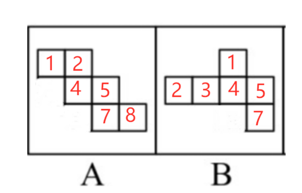

B项：展开图中裁去面6（或面7），得到的展开图中（如上图B项所示），面1和面7（或面6），面2和面4，面3和面5分别互为相对面，符合六面体展开图中的“一四一型”，折叠后可以得到题干所示的立方体，排除；

C项：展开图中面1和面3、面5和面7、面2和面4、面4和面6分别互为相对面，其中面2、面6分别和面4互为相对面，在其折叠后能得到题干所示的立方体，不过面2和面6在立体图形中重合在一起与面4互为相对面，排除；

D项：其展开图无论是通过裁剪或是覆盖均不能得到题干所示的封闭的立方体，当选。

本题为选非题，故正确答案为D。

---

## 第 2 题　qid 2604286 · 图形推理

下列选项中最符合所给图形规律的是（    ）。

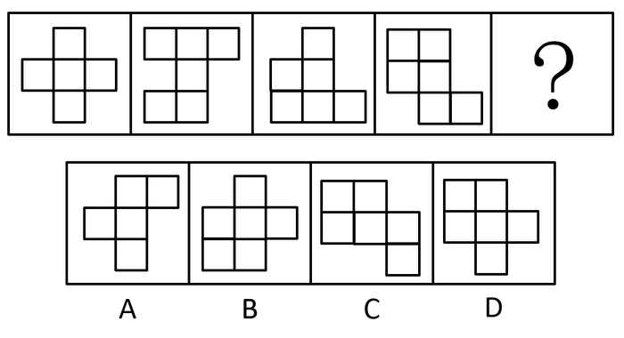

- **A**. A
- **B**. B
- **C**. C
- **D**. D　✅

**答案**：D

**官方解析**

本题考察图形拼合。将原图形所给的四个图形分别标记1、2、3、4，发现可以与D项拼接成一个完整的图形。

故正确答案为D。

---

## 第 3 题　qid 2604306 · 图形推理

下列选项中，能与所给图形组合成立方体的是（    ）。

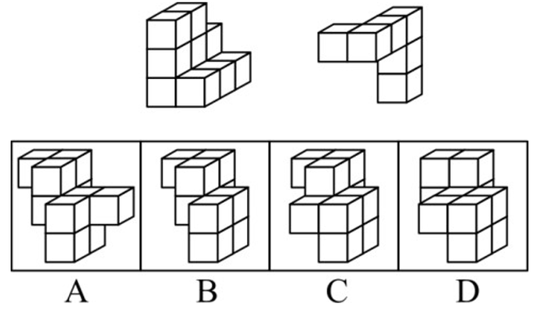

- **A**. A
- **B**. B
- **C**. C　✅
- **D**. D

**答案**：C

**官方解析**

本题考查立体拼合。根据题干中的两个立体图形可共同构成一个的立方体，观察选项，从A项第一层和第二层结合来看，是长度为4立方体的多面体，与题干不符，排除；

从上向下逐层分析题干，题干第一层两个图形相加共有6个小立方体，还需要3个小立方体才能组成的立方体，但是D项第一层只有2个小立方体，排除；

题干第二层两个图形相加共有4个小立方体，还需要5个小立方体才能组成的立方体，B项第二层有4个小立方体，排除。

故正确答案为C。

---

## 第 4 题　qid 2604311 · 图形推理

请问使用所给的四个图形能够组合成（    ）。

- **A**. 矩形
- **B**. 三角形
- **C**. 等腰梯形
- **D**. 直角梯形　✅

**答案**：D

**官方解析**

本题考查平面拼合，可采用平行且等长相消的方式解题。消去平行且等长的线段后进行组合可得到轮廓图为直角梯形，即为D项。平行且等长相消的方式如下图所示： 

故正确答案为D。

---

## 第 5 题　qid 2604320 · 图形推理

下列4张纸条，沿折痕能够折出如图所示图形的是（    ）。

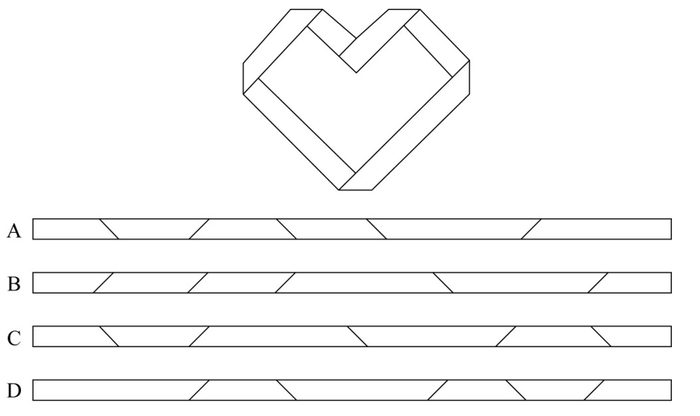

- **A**. A
- **B**. B
- **C**. C　✅
- **D**. D

**答案**：C

**官方解析**

观察题干，发现图形折痕之间构成了梯形，如图所示，展开图中需有两个非直角大梯形④⑤，两个非直角小梯形③⑥，两个直角小梯形①②，且折痕所构成的两个大梯形应该相邻，只有C项符合此特征。

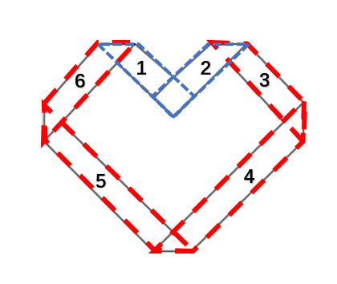

故正确答案为C。

---

## 第 6 题　qid 2605788 · 图形推理

下列选项中最符合所给图形规律的是（    ）。

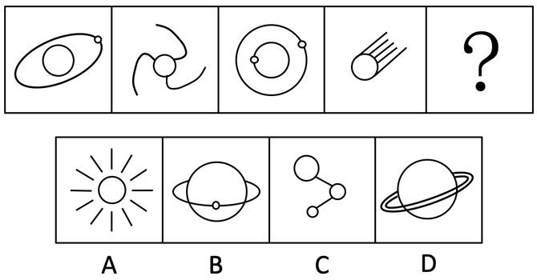

- **A**. A
- **B**. B　✅
- **C**. C
- **D**. D

**答案**：B

**官方解析**

元素组成不同，且无明显属性规律，考虑数量规律。观察发现，题干图形出现较多的圆、弧等曲线图形，考虑曲线数，但数曲线没有规律。继续观察发现，题干图形线条相交明显，考虑数交点。题干图形的交点数依次为2、3、4、5，故？处应选择一个交点数为6的图形。A项交点数为0个，B项交点数为6个，C项交点数为4个，D项交点数为8个。只有B项符合。
故正确答案为B。

---

## 第 7 题　qid 2605833 · 图形推理

下列选项中最符合所给图形规律的是（    ）。

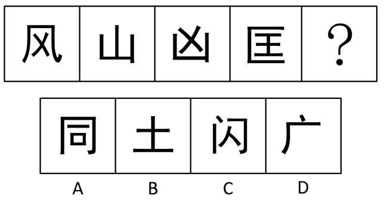

- **A**. A　✅
- **B**. B
- **C**. C
- **D**. D

**答案**：A

**官方解析**

元素组成不同，且无属性规律和数量规律。观察发现，题干中所有汉字的最外圈都呈现出三面有连续线条包围、一面开放的状态。A项最外圈为三面有连续线条包围、一面开放，B项最外圈只有一面有线条，C项最外圈三面的线条未连续，在点处有开口，D项最外圈只有两面有连续线条。只有A项符合。
故正确答案为A。

---

## 第 8 题　qid 2605835 · 图形推理

下列选项中最符合所给图形规律的是（    ）。

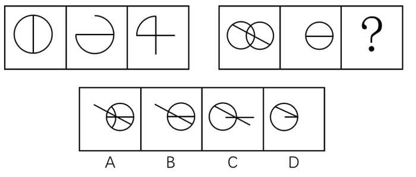

- **A**. A
- **B**. B
- **C**. C　✅
- **D**. D

**答案**：C

**官方解析**

解析一：图形元素组成相似，考虑样式规律，图形间有相同的线条反复出现，优先考虑样式规律中的加减同异。在前一组图形中，第一个图形与第二个图形去同存异，可以得到第三个图形，故第二组图形应遵循同样的规律，符合条件的只有C项。
故正确答案为C。
解析二：图形元素组成不同，且属性无规律考虑数量规律，观察发现出现多个“日”字变形及多端点，考虑数笔画。第一组图形笔画数都为1，第二组图形应遵循同样的规律，第二组图1与图2笔画数也都为1，故问号处应填入笔画数为1的图形。选项的笔画数分别为3、2、2、1，符合条件的只有D项。
故正确答案为D。
注：根据图形特征“相同线条反复出现”，此题元素组成相似的特征更加明显，应优先考虑样式规律，故粉笔更倾向于C项。

---

## 第 9 题　qid 2605837 · 图形推理

下列的三个视图是观察某一多面体得到的，则该立体图形不可能是（    ）。

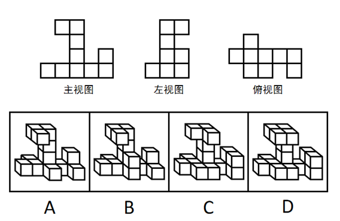

- **A**. A　✅
- **B**. B
- **C**. C
- **D**. D

**答案**：A

**官方解析**

A项：左视图的第三列与题干图形不匹配，当选；

B项：三视图均符合题干给定图形，排除；

C项：三视图均符合题干给定图形，排除；

D项：三视图均符合题干给定图形，排除。

本题为选非题，故正确答案为A。

---

## 第 10 题　qid 2605838 · 图形推理

下列选项中最符合所给图形规律的是（    ）。

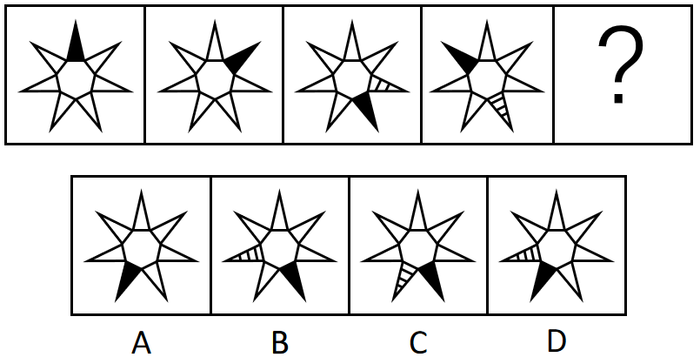

- **A**. A
- **B**. B
- **C**. C　✅
- **D**. D

**答案**：C

**官方解析**

题干元素组成相同，优先考虑位置规律。图中的黑色三角形和带斜线三角形均以图一最上方为起始位置沿中间七边形的边发生平移，在图一和图二中两种三角形为重合状态。黑色三角形依次顺时针平移1、2、3步，故到？处应顺时针平移4步，排除A、D两项；带斜线三角形依次顺时针平移1步，故到？处也应顺时针平移1步，排除B项。
故正确答案为C。

---

## 第 11 题　qid 2605839 · 类比推理

清风∶朗月（    ）

- **A**. 钢墙∶铁壁
- **B**. 斗转∶星移
- **C**. 惊涛∶骇浪
- **D**. 高山∶流水　✅

**答案**：D

**官方解析**

第一步：判断题干词语间逻辑关系。
清风指的是清朗的风，朗月指的是明亮的月，二者为并列关系，且都是自然现象，同时清风和朗月这两个词都是偏正结构。
第二步：判断选项词语间逻辑关系。
A项：钢墙和铁壁二者为并列关系，也为偏正结构，但是钢墙和铁壁并非是自然现象，与题干逻辑关系不一致，排除；
B项：斗转指北斗转换了方向，星移指星辰移了位置，二者为并列关系，且都是自然现象，但是斗转和星移这两个词都是主谓结构，与题干逻辑关系不一致，排除；
C项：惊涛和骇浪都是指汹涌的浪涛，二者为全同关系，与题干逻辑关系不一致，排除；
D项：高山是指高的山，流水是指流动的水，二者为并列关系，且都是自然现象，同时高山和流水这两个词都是偏正结构，与题干逻辑关系一致，当选。
故正确答案为D。

---

## 第 12 题　qid 2605840 · 类比推理

油田∶汽油（    ）

- **A**. 伐木场∶家具　✅
- **B**. 商场∶服装
- **C**. 农田∶稻谷
- **D**. 水库∶水

**答案**：A

**官方解析**

第一步：判断题干词语间逻辑关系。
油田开采的石油充当原材料经过加工成为汽油。
第二步：判断选项词语间逻辑关系。
A项：伐木场砍伐的木材充当原材料经过加工成为家具，与题干逻辑关系一致，当选；
B项：在商场里销售服装，二者为地点的对应关系，服装的原材料为布料，布料不是在商场中开采出的，与题干逻辑关系不一致，排除；
C项：在农田里收割稻谷，二者为地点的对应关系，稻谷不是经过加工的成品，与题干逻辑关系不一致，排除；
D项：水是水库的组成部分，二者为组成关系，水不是经过加工的成品，与题干逻辑关系不一致，排除。
故正确答案为A。

---

## 第 13 题　qid 2605842 · 类比推理

夜晚∶路灯（    ）

- **A**. 孤舟∶灯塔
- **B**. 站台∶路标
- **C**. 春节∶春联　✅
- **D**. 黄昏∶道别

**答案**：C

**官方解析**

第一步：判断题干词语间逻辑关系。
路灯是在夜晚时使用的，二者存在时间上的对应关系。
第二步：判断选项词语间逻辑关系。
A项：孤舟需要灯塔为其照明护航，但并不是只有孤舟才需要灯塔，其它的船只也需要灯塔照明护航，二者不是必要条件的对应关系，与题干逻辑关系不一致，排除；
B项：站台里有路标来指路，但并不是只有站台里才有路标，生活中很多地方都需要路标来指路，二者不是必要条件的对应关系，与题干逻辑关系不一致，排除；
C项：春联是在春节期间使用的，二者存在时间上的对应关系，与题干逻辑关系一致，当选；
D项：在黄昏时道别，但并不是只有在黄昏时才能道别，清晨午后都可以用来道别，二者不是必要条件的对应关系，与题干逻辑关系不一致，排除。
故正确答案为C。

---

## 第 14 题　qid 2605843 · 类比推理

人∶成年人∶未成年人（    ）

- **A**. 门∶开门∶关门
- **B**. 手∶左手∶右手　✅
- **C**. 天气∶晴天∶阴天
- **D**. 车祸∶幸存者∶遇难者

**答案**：B

**官方解析**

第一步：判断题干词语间逻辑关系。
成年人与未成年人均是人的一种，二者与第一个词是包容关系中的种属关系，且成年人与未成年人是并列关系中的矛盾关系。
第二步：判断选项词语间逻辑关系。
A项：开门与关门分别是两个动作，与门不是包容关系中的种属关系，与题干逻辑关系不一致，排除；
B项：左手与右手均是手的一种，二者与第一个词是包容关系中的种属关系，且左手与右手是并列关系中的矛盾关系，与题干逻辑关系一致，当选；
C项：晴天与阴天均是天气的一种，二者与第一个词是包容关系中的种属关系，但是天气除了晴天、阴天之外，还有其它天气，故晴天和阴天是并列关系中的反对关系，与题干逻辑关系不一致，排除；
D项：车祸之后可能会出现幸存者与遇难者，幸存者与遇难者不是车祸的一种，与题干逻辑关系不一致，排除。
故正确答案为B。

---

## 第 15 题　qid 2604266 · 类比推理

瓜熟蒂落：水到渠成（    ）

- **A**. 朝三暮四：朝秦暮楚　✅
- **B**. 翻云覆雨：翻天覆地
- **C**. 耳濡目染：耳熟能详
- **D**. 大功告成：功败垂成

**答案**：A

**官方解析**

第一步：判断题干词语间逻辑关系。
瓜熟蒂落指时机一旦成熟，事情自然成功，水到渠成比喻有条件之后，事情自然会成功，即功到自然成，二者是近义关系。
第二步：判断选项词语间逻辑关系。
A项：朝三暮四原指玩弄手法欺骗人，后用来比喻常常变卦，反复无常，朝秦暮楚用以比喻人没有原则，反复无常，二者是近义关系，与题干逻辑关系一致，当选；
B项：翻云覆雨比喻反复无常或惯于玩弄手段，翻天覆地形容变化巨大而彻底，也指闹得很凶，二者不是近义关系，与题干逻辑关系不一致，排除；
C项：耳濡目染意思是耳朵经常听到，眼睛经常看到，不知不觉地受到影响，耳熟能详指听得多了，能够很清楚、很详细地复述出来，二者不是近义关系，与题干逻辑关系不一致，排除；
D项：大功告成指巨大工程或重要任务宣告完成，功败垂成指事情接近成功的时候却遭到了失败，二者是反义关系，与题干逻辑关系不一致，排除。
故正确答案为A。

---

## 第 16 题　qid 2604272 · 类比推理

某工作组计划开展实地调研，初步确定只选择粤东、粤西或粤北中的一个地区。对此，工作组中的甲、乙、丙三人提出了以下意见：
甲：在此次调研中粤东更具有代表性，应该前往粤东地区。
乙：上一轮调研已经去过粤北了，这一次应该选择其他地区。
丙：我认为选择粤西或粤北地区开展实地调研更合适。
最终工作组只采纳了其中一个人的意见，则下列陈述一定正确的是（    ）。

- **A**. 工作组前往了粤东地区
- **B**. 工作组前往了粤西地区
- **C**. 工作组采纳了乙的意见
- **D**. 工作组采纳了丙的意见　✅

**答案**：D

**官方解析**

第一步：翻译题干。

① 去粤东；

② 粤北；

③ 粤西或粤北。

因为只从三个地方进行选择，故条件③等价为“粤东”。

第二步：逐一分析选项。

题干条件③与条件①相矛盾，二者必有一真一假，最终工作组只采纳了一个人的意见，故条件②一定为假，所以工作组最后去了粤北地区。即工作组采纳了丙的意见。

故正确答案为D。

---

## 第 17 题　qid 2604274 · 逻辑判断

有人认为，十二生肖起源于动物崇拜。这是因为在原始社会中，人类的生产力水平很低，猪、牛、羊等牲畜与农事活动关系密切，动物崇拜也就随之而生。除此之外，虎、蛇等动物可能威胁到人类的自身安全，往往被视为强大的象征，人们也会因为感到恐惧而形成动物崇拜。
以下选项如果为真，最能反驳上述判断的是（    ）。

- **A**. 十二生肖中只有龙不是现实中存在的动物
- **B**. “过街老鼠人人喊打”，但它是十二生肖之首　✅
- **C**. 鸡、鸭、鹅与农事活动关系密切，但只有鸡属于十二生肖
- **D**. 牛和猪都与农事相关，但他们在十二生肖中的位置相距很远

**答案**：B

**官方解析**

第一步：找出论点和论据。
论点：十二生肖起源于动物崇拜。
论据：因为在原始社会中，人类的生产力水平很低，猪、牛、羊等牲畜与农事活动关系密切，动物崇拜也就随之而生。除此之外，虎、蛇等动物可能威胁到人类的自身安全，往往被视为强大的象征，人们也会因为感到恐惧而形成动物崇拜。
本题的论点在说十二生肖起源于动物崇拜，论据在说人类会对与农事活动关系密切还有可能威胁人类自身安全的动物产生动物崇拜，可以用与农事活动关系密切的动物不会令人产生动物崇拜，或者用强大的象征动物也不会令人产生动物崇拜进行削弱。
第二步：逐一分析选项。
A项：选项讨论的是龙不是现实中存在的动物，但是无法判断人们对龙是否存在动物崇拜，话题不一致，无法削弱，排除；
B项：“过街老鼠人人喊打”，但它是十二生肖之首，说明老鼠是人们痛恨并且人人喊打的动物，而不是与农事活动关系密切或强大到令人恐惧的动物，为举反例削弱论点，当选；
C项：鸡、鸭、鹅与农事活动关系密切，但只有鸡属于十二生肖，无法否定十二生肖起源于动物崇拜，因为三种动物虽然都与农事活动紧密相关，但是三者与农事活动的密切程度，以及其他方面可能有差异，因此无法削弱，排除；
D项：选项讨论的是牛和猪的排位问题，论点讨论的是动物崇拜的问题，二者讨论的话题不一致，无法削弱，排除。
故正确答案为B。

---

## 第 18 题　qid 2604275 · 逻辑判断

某扶贫产业基地计划种植紫薯、红薯、南瓜以及玉米四种农作物。四种农作物的种植面积大小不一，且需要满足以下条件：
①要么紫薯种植面积最大，要么南瓜种植面积最大；
②如果紫薯的种植面积最大，红薯的种植面积便最小；
如果红薯的种植面积大于玉米，可以推出的是（    ）。

- **A**. 南瓜种植面积大于玉米种植面积　✅
- **B**. 紫薯种植面积大于玉米种植面积
- **C**. 紫薯种植面积小于红薯种植面积
- **D**. 玉米种植面积大于南瓜种植面积

**答案**：A

**官方解析**

第一步：翻译题干。

①要么紫薯最大，要么南瓜最大；

②紫薯最大红薯最小；

③红薯的种植面积大于玉米。

第二步：逐一分析选项。

根据③可知红薯的面积不是最小的，对②箭头后进行了否定，根据否后必否前，可以得到紫薯最大；又根据①可知，紫薯和南瓜有且只有一个面积最大，而紫薯最大，则可以得出南瓜最大为真，即南瓜的种植面积是最大的。

A项：当南瓜的种植面积最大时，南瓜的种植面积一定大于其他三个农作物的种植面积，可以得出南瓜的种植面积大于玉米的种植面积，可以推出，当选；

B项：紫薯种植面积和玉米种植面积的大小关系根据题干信息无法推出，为不确定选项，排除；

C项：紫薯种植面积和红薯种植面积的大小关系根据题干信息无法推出，为不确定选项，排除；

D项：根据题干可以推出南瓜的种植面积最大，故南瓜的种植面积一定大于玉米的种植面积，该项错误，排除。

故正确答案为A。

---

## 第 19 题　qid 2604277 · 逻辑判断

国内有研究发现，在小学阶段，春季出生的孩子比冬季出生的孩子学习成绩更好，在学业上获得成功的概率也更高。有人据此推测，这是由于春季出生的孩子年纪更大一些，而年纪大的孩子往往更成熟，更容易获得老师的关注。
以下选项如果为真，最能反驳上述判断的是（    ）。

- **A**. 得到老师更多关注并不意味着一定有更多在学业上取得成就的机会
- **B**. 教育部门规定，小学生必须在当年9月1日前年满6周岁才能入学　✅
- **C**. 老师也会倾向于关注成绩不理想的学生
- **D**. 其他研究发现，成绩好的孩子普遍善于独立思考

**答案**：B

**官方解析**

第一步：找出论点和论据。
论点：春季出生的孩子成绩更好，是因为春季出生的孩子年纪更大，更容易获得老师的关注。
论据：无。
本题只有论点没有论据，优先考虑削弱论点。
第二步：逐一分析选项。
A项：得到老师更多关注“不一定”有更多在学业上取得成就的机会，削弱了“关注”和“成绩”之间的因果联系，能削弱，保留；
B项：教育部门规定，小学生必须在当年9月1日前年满6周岁才能入学，比如2020年按规定可以上一年级的学生，年纪构成应该是2013年9月1日后—2014年9月1日前出生的孩子（不要用“找关系提前上学或延迟上学”等极端个例来讨论，要讨论普遍情况），所以在同一年级中，并不是春季出生的孩子年纪更大，反而是冬季更大，直接否定了论点中“是因为春季出生的孩子年纪更大”这个原因，能削弱，保留；
C项：老师也会倾向于关注成绩不理想的学生，与春季出生的孩子学习成绩更好的原因无关，排除；
D项：其他研究发现，成绩好的孩子普遍善于独立思考，说的是成绩好和是否善于思考的关系，但是与春季出生的孩子学习成绩更好的原因无关，排除。
对比A、B两项，都是在削弱论点中的因果关系，但B项力度更强，理由如下：
（1）A项说的是“不一定”，削弱力度不及B项的确定性表述；
（2）论点找的核心原因是“春季出生的孩子年纪更大”，B项说事实上班里是冬季出生的比春季出生的年纪大，直接削弱核心原因，而A项削弱的是在年纪大小基础上再延伸出来的“关注度”，如果年纪都不成立，后面延伸的就没有意义了，一个是“根”，一个是“延伸”，削弱“根”更强，故粉笔教研团队这道题更倾向B项。
故正确答案为B。

---

## 第 20 题　qid 2604280 · 逻辑判断

某市实现高质量发展的关键在于，通过推动当地制造业的发展，建立健全现代化产业体系。该市产业园区的建设发展对建立健全现代化产业体系至关重要，因此也是推动实现高质量发展的关键。
下列选项中，与上述推论过程结构最为类似的是（    ）。

- **A**. 打好三大攻坚战是全面建成小康社会的前提条件，也是实现高质量发展的必备基础。所以，打好三大攻坚战才能实现经济社会的全面发展
- **B**. 所有战略性新兴领域的产品均为高尖端产品。某公司的产品广泛应用于新型材料等战略性新兴领域。因此，该公司是一家高尖端制造企业
- **C**. 公路网络不发达会导致交通落后，而交通落后已经成为制约乡镇加快发展的最大瓶颈。因此，乡镇要加快发展，必须加强路网建设　✅
- **D**. 与传统育苗方式相比，组织育苗是一种更为高效的组织快繁方式。因此，引进组织育苗技术很有意义

**答案**：C

**官方解析**

第一步：翻译题干，找到题干的推理结构。

第一句的翻译为：实现高质量发展通过推动当地制造业的发展，建立健全现代化产业体系；

第二句的翻译为：健全现代化的产业体系产业园区的建设发展；

最后的推理为：实现高质量发展产业园区的建设发展。

即题干的论证过程为：12，23，因此13。（通过肯前串联起来，推出肯后。）

第二步：逐一分析选项。

A项：翻译为全面建成小康社会打好三大攻坚战，实现高质量发展打好三大攻坚战，但是最后一句的“实现经济社会的全面发展”在前面翻译中并未提到，与题干推理形式不同，排除；

B项：翻译为战略性新兴领域的产品高尖端产品，最后一句话说的是该公司是一家高尖端制造企业，但是题干第一句话说的是高尖端产品，偷换概念，排除；

C项：翻译为公路网络不发达交通落后，交通落后乡镇加快发展，最后一句的翻译应为：乡镇加快发展必须加强路网建设，选项的论证过程为：12，23，因此31，保留；

D项：翻译为组织育苗高效，引进组织育苗技术很有意义，但是最后一句是否有意义在前面并未提到，与题干推理形式不同，排除。

注意：本题四个选项中没有与题干完全相同的推理方式，但是题干的推理方式为“通过肯前串联起来，推出肯后”，这是正确的推理逻辑，只有C项“通过否后串联起来，推出否前”，“肯前必肯后，否后必否前”，这也是正确的推理逻辑，故择优选C项。

本题能够学到的知识点是，如果有一个选项与题干的推理方式完全相同，比如都是肯前推肯后，优选这个选项；但如果没有这样的选项，题干的推理是对的，我们也要找一个推理正确的选项。

故正确答案为C。

---

## 第 21 题　qid 2605849 · 逻辑判断

某全国连锁餐饮企业在北方部分城市新推出了一款糕点，销量与口碑极佳，因此该公司管理层认为， 如果在南方地区推出该产品一定也能受到顾客的喜爱。 
下列选项最能指出上述论证缺陷的是：

- **A**. 默认了该款产品在北方市场的销量与口碑信息可以用于预测南方市场　✅
- **B**. 忽视了国内的其它餐饮企业也可能会推出同款糕点
- **C**. 默认了该连锁餐饮企业在南方地区开设有分店
- **D**. 忽视了许多南方城市有自己的特色糕点

**答案**：A

**官方解析**

第一步：找出论点和论据。
论点：如果在南方地区推出该产品一定也能受到顾客的喜爱。
论据：某全国连锁餐饮企业在北方部分城市新推出了一款糕点，销量与口碑极佳。
题干中论据说的是产品在北方销量与口碑好，论点说的是该产品在南方受到顾客喜爱，论点论据话题不一致，说明题干默认了北方的销量与口碑能够推测出南方市场的情况，指出该默认的论证即指出了论证缺陷。
第二步：逐一分析选项。
A项：论据说的是产品在北方销量口碑好，论点说的是在南方地区推出该产品一定也能受到顾客的喜爱，之所以能做出这个预测就是默认了二者之间存在关联，该项指出默认了北方的销量与口碑能预测南方市场情况，可以指出论证缺陷，当选；
B项：论点说的是在南方地区推出该产品一定也能受到顾客的喜爱，该项说的是国内其他企业也可能推出同款糕点，话题不一致，无法指出论证缺陷，排除；
C项：论点讨论的是产品是否受欢迎，而该项讨论的是企业是否有分店，话题不一致，无法指出论证缺陷，排除； 
D项：论点说的是在南方地区推出该产品一定也能受到顾客的喜爱，该项说的是许多南方城市有自己的特色糕点，话题不一致，无法指出论证缺陷，排除。
故正确答案为A。

---

## 第 22 题　qid 2605850 · 逻辑判断

有研究表明，长期使用酒精洗手液会对手部皮肤造成损伤，而某品牌免洗洗手液所有成分均从天然植物提取，不含酒精。因此不会对手部皮肤产生损害。 
下列选项最能指出上述论证缺陷的是：

- **A**. 默认了洗手液中只有酒精对手部皮肤产生损害　✅
- **B**. 默认了从天然植物中不会提炼出酒精
- **C**. 忽视了酒精会提升洗手液的清洁效果
- **D**. 忽视了从天然植物中提取的成分可能对人体其它部位造成损伤

**答案**：A

**官方解析**

第一步：找出论点和论据。
论点：某品牌免洗洗手液不会对手部皮肤产生损害；
论据：某品牌免洗洗手液所有成分均从天然植物提取，不含酒精。
题干中论据指出某品牌免洗洗手液不含酒精，论点在说某品牌免洗洗手液不会对手部皮肤造成损害，二者话题不一致，默认了洗手液中只有酒精对皮肤产生损害，指出此论证缺陷即可。
第二步：逐一分析选项。
A项：论据说不含酒精，论点说不伤害手部皮肤，该选项提到默认了洗手液中只有酒精对皮肤产生损害，可以指出论证缺陷，当选；
B项：该选项说默认了从天然植物中不会提炼出酒精，而题干在说免洗洗手液，主体不一致，无法指出论证缺陷，排除；
C项：该选项说忽视了酒精会提升洗手液的清洁效果，而题干论点在说免洗洗手液会不会对手部皮肤造成伤害，话题不一致，无法指出论证缺陷，排除；
D项：该选项说忽视了从天然植物中提取的成分可能对人体其他部位造成损伤，而题干论点在说免洗洗手液会不会对手部皮肤造成伤害，话题不一致，无法指出论证缺陷，排除。
故正确答案为A。

---

## 第 23 题　qid 2605854 · 逻辑判断

没有游子不思乡，思乡之人皆惆怅，故游子无不惆怅。 
下列选项，与上述论证逻辑不一致的是：

- **A**. 没有人不热爱生命，不热爱生命的人会轻生，因此没有人会轻生
- **B**. 没有国家不希望富强，而要想富强必须发展经济，因此没有国家不希望发展经济
- **C**. 没有哪一场战争不会带来死亡，没有哪一死亡不令人悲伤，因此没有战争不令人感到悲伤
- **D**. 没有人不渴望幸福生活，而幸福生活都是奋斗出来的，因此努力奋斗的人都能获得幸福生活　✅

**答案**：D

**官方解析**

第一步：翻译题干。

“没有游子不思乡”等同于“所有游子都思乡”。题干论证逻辑如下：

游子思乡，思乡惆怅，因此游子惆怅，（即ab，bc，因此，ac）。

第二步：逐一分析选项。

A项：“没有人不热爱生命”等同于“所有人都热爱生命”，“没有人会轻生”等同于“所有人都不会轻生”，该项的论证逻辑为：人热爱生命，热爱生命轻生，因此，人轻生（即ab，bc，因此，ac），推理形式与题干不一致，保留；

B项：翻译为国家希望富强，希望富强发展经济，因此国家发展经济，（即ab，bc，因此，ac），推理形式与题干一致，排除；

C项：翻译为战争死亡，死亡悲伤，因此战争悲伤，（即ab，bc，因此，ac），推理形式与题干一致，排除；

D项：“没有人不渴望幸福生活”等同于“所有人都渴望幸福生活”，该项的论证逻辑为：人幸福生活，幸福生活奋斗，因此奋斗幸福生活，（即ab，bc，因此，cb），推理形式与题干不一致，保留。

本题目为争议题，AD两项的结构均与题干不一致，从结构上来看D与题干更不一致，故本题目答案给到D。本题目在设置上不够严谨，考生在备考中无需纠结该题目，仅作参考即可。

本题为选非题，故正确答案为D。

---

## 第 24 题　qid 2605856 · 逻辑判断

受影视资本“寒冬”和政策收紧的影响，原创剧集整体规模在2019年出现缩水，有影视数据显示，2019年剧集播出数量整体下降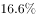，从452部缩减至377部，不过某权威影视网站的评分显示，热度前30名剧集的评分均值由2018年的5.96分升至2019年的6.51分。这在一定程度上表明，剧集数量大幅减少后，排名前列的精品剧并未受到太大影响，市场淘汰的是一批非精品类型的剧集。

以下哪项为真，最能加强以上论证？

- **A**. 有很多原创剧集的拍摄成本非常低，而且还有进一步的压缩空间
- **B**. 针对影视行业的政策主要集中在限制低俗有害的影视作品
- **C**. 2018-2019年，该权威影视网站的评分流程和标准保持一致　✅
- **D**. 2018年该权威影视网站对所有原创剧集都有评分

**答案**：C

**官方解析**

第一步：找出论点和论据。
论点：剧集数量大幅减少后，排名前列的精品剧并未受到太大影响，市场淘汰的是一批非精品类型的剧集。
论据：2019年剧集数量下降，不过某权威影视网站的评分显示，热度前30名剧集的评分均值较2018年有所提高。
论点和论据都在围绕着排名前列的剧集评分提高，质量未受影响，因此话题一致，可以考虑补论据加强。
第二步：逐一分析选项。
A项：题干通过剧集数量减少对排名前列的精品剧的影响，得出市场淘汰的是一批非精品类型的剧集，该项说的是原创剧集拍摄成本的问题，话题不一致，无法加强，排除；
B项：题干通过剧集数量减少对排名前列的精品剧的影响，得出市场淘汰的是一批非精品类型的剧集，该项说的是影视行业的政策主要集中在限制低俗有害的影视作品，在一定程度上可以解释淘汰的确实是非精品剧集，属于解释原因，可以加强，保留；
C项：2018年和2019年评分流程和标准一致，是这两年评分可以做比较的必要条件，属于补充必要条件，可以加强，保留；
D项：只说了2018年所有原创剧集都有评分，没有提到2019年，而题干比较的是两年的情况，无法加强，排除。
对比择优， C项是题干论证的必要条件，B项只是在解释市场淘汰非精品剧集的原因，C项力度更大。
故正确答案为C。

---

## 第 25 题　qid 2606093 · 逻辑判断

信息时代似乎给人们提供了前所未有的多样选择。但实际上，社交媒体的兴起和智能算法的应用，使人们逐渐变得只会选择性接触自己感兴趣的信息，如同春蚕吐丝一样，渐渐形成“信息茧房”。显然，只接触到自己感兴趣的信息是不全面的。因此，信息时代的到来并不意味着人们能够更为全面地看待社会问题。
下列选项，与上述论证过程最为类似的是：

- **A**. 专业人士在科普中容易过分倚重“用数据说话”而忽视了讲故事的技巧，往往导致了科普难以吸引眼球。这或许正是专业科普常常收效甚微的原因
- **B**. 人们对未经证实的信息不加分辨地转发，成为了谣言层出不穷的重要原因。因此，只有提升个人的信息鉴别能力，才能有效切断谣言的传播环节
- **C**. 消费者的环保态度很难转化为实际的购物选择，而且常常会默认所谓的绿色环保产品缺少加工。因此，以绿色环保为卖点的产品并不容易获得成功　✅
- **D**. 经济社会是个动态循环过程，只有结束停摆，让人流、物流、资金有序转动起来，整个循环才能畅通，经济社会秩序才能尽快恢复

**答案**：C

**官方解析**

第一步：分析题干论证过程。
论点：信息时代的到来并不意味着人们能够更为全面地看待社会问题。
论据：信息时代给人们提供了前所未有的选择，但实际上社交媒体的兴起和智能算法的应用使人们只关注自己感兴趣的信息，导致形成了“信息茧房”。
题干的论证过程为：首先说明信息时代似乎给人们提供了前所未有的多样选择，但实际上渐渐形成“信息茧房”，然后得出人们并不能全面看待社会问题。由存在的问题，得到相应的结论。
第二步：逐一分析选项。
A项：首先说明专业人士忽视讲故事的技巧，导致了科普难以吸引眼球，然后推测出这是专业科普常常收效甚微的原因。结论是一个因果关系的表述，且“或许”表示可能，与题干论证过程不一致，排除；
B项：首先提出谣言层出不穷的原因是人们对未经证实的信息不加分辨地转发，然后提出了提升个人的信息鉴别能力才能有效切断谣言的传播环节，由问题提出对策，与题干论证过程不一致，排除；
C项：首先说明消费者的环保态度很难转化为实际的购物选择，常常会默认所谓的绿色环保产品缺少加工，然后得出以绿色环保为卖点的产品并不容易获得成功。由存在的问题，得到相应的结论，与题干论证过程一致，当选；
D项：首先说明经济社会是一个动态循环过程的原理，然后具体叙述了经济社会秩序如何能尽快恢复的对策，由原理到对策，与题干论证过程不一致，排除。
故正确答案为C。

---

## 第 26 题　qid 2606143 · 定义判断

某市的志愿者管理采用注册制，其中活跃志愿者约占。为进一步增强志愿者服务力量，提高活跃志愿者数量，该市管理部门制定了以下政策：鼓励所有政府部门及公益组织的工作人员注册成为志愿者。

以下属于该部门制定政策时的假设的是：

- **A**. 该城市还有大量的社会活动没有得到足够的志愿者支持
- **B**. 政府部门及公益组织的工作人员的志愿服务意愿都很强
- **C**. 一直以来该市制定的各项政策都得到了市民的积极响应
- **D**. 活跃志愿者的数量会随着注册志愿者人数的增加而增加　✅

**答案**：D

**官方解析**

第一步：找出论点和论据。

论点：鼓励所有政府部门及公益组织的工作人员注册成为志愿者。

论据：某市的志愿者管理采用注册制，其中活跃志愿者约占。为进一步增强志愿者服务力量，提高活跃志愿者数量。

提问为“假设”优先考虑搭桥，论据说的是活跃志愿者数量少，要提高活跃志愿者数量，而论点说的是鼓励政府部门及公益组织工作人员注册成为志愿者，论据论点话题不一致，可以进行搭桥，在提高活跃志愿者数量和工作人员注册成为志愿者之间建立联系。 

第二步：逐一分析选项。

A项：大量的社会活动没有得到足够的志愿者支持,与论点“鼓励所有政府部门及公益组织的工作人员注册成为志愿者”无关，因此属于无关选项，不能加强，排除；

B项：工作人员的志愿服务意愿都很强，但意愿强的工作人员最后是否成为活跃志愿者未知，是否会提高活跃志愿者数量也不明确，因此属于不明确选项，不能加强，排除；

C项：市民积极响应该市制定的各项政策，与论点“鼓励所有政府部门及公益组织的工作人员注册成为志愿者”无关，因此属于无关选项，不能加强，排除；

D项：工作人员注册成为志愿者即注册志愿者人数增加，而活跃志愿者的数量会随着注册志愿者人数的增加而增加，建立了提高活跃志愿者数量和工作人员注册成为志愿者之间的联系，属于搭桥选项，是使论证成立的假设，当选。

故正确答案为D。

---

## 第 27 题　qid 2606188 · 类比推理

某省开展了新高考改革，考试科目按“”模式设置，“3”为全国统一高考的语文、数学、外语，“1”由考生在物理、历史2门学科中选择1门，“2”由考生在政治、地理、化学、生物学4门学科中选择2门。某校选了化学的同学大多数都选了物理，选了政治的同学都选了历史。

如果以上描述为真，则下列关于该校的断定必然为真的是：

I.有的同学选了化学和政治

II.选了化学的同学都没有选政治

III.有的同学选了化学却没有选政治

IV.有的同学选了政治却没有选化学

- **A**. I和II
- **B**. III和IV
- **C**. 只有III　✅
- **D**. I和III

**答案**：C

**官方解析**

第一步：翻译题干。

①语文、数学、外语必选

②要么物理，要么历史

③政治、地理、化学、生物四选二

④有的选化学选物理

⑤选政治选历史

②⑤串联可以推出：⑥选政治选历史选物理

②④⑤串联可以推出：⑦有的选化学选物理选历史选政治

第二步：逐一分析选项。

I翻译为：有的选化学且选政治，与翻译结果⑦不一致，“有的不是”不能推出“有的是”，因此无法得出有的选化学的是否也选了政治，无法推出，排除；

II翻译为：选化学选政治，与翻译结果⑦不一致，“有的”不能推出“所有”，无法推出，排除；

III翻译为：有的选化学选政治，与翻译结果⑦一致，可以推出，当选；

IV翻译为：有的选政治选化学，根据翻译结果⑥可知，选政治选历史选物理，已知④为有的选化学选物理，但④为集合推理，不能逆否，故无法推出确定结论有的选政治的没有选化学，无法推出，排除。

故正确答案为C。

---

## 第 28 题　qid 2606775 · 逻辑判断

对于城市街头小摊贩占道经营影响交通的问题，有学者认为应当在不影响城市交通的特定区域设置面向小摊贩的集中营业区，这样就能够缓解小摊贩随意占道经营产生的交通堵塞问题。
要使上述论证成立，必须补充的前提是（    ）。

- **A**. 集中营业区不会向入驻的小摊贩收取管理费用
- **B**. 集中营业区不会产生噪音、环境污染等其它城市问题
- **C**. 设置集中营业区后占道经营的小摊贩会前往该处摆设摊位　✅
- **D**. 集中营业区的交通位置便利，小摊贩能够在该处获得更高利润

**答案**：C

**官方解析**

第一步：找出论点和论据。
论点：应当在不影响城市交通的特定区域设置面向小摊贩的集中营业区，这样就能够缓解小摊贩随意占道经营产生的交通堵塞问题。
论据：无。
本题题干只有论点没有论据，且提问方式为“前提”，优先考虑必要条件，即论点“设置集中营业区，就能够缓解交通堵塞问题”的必要条件。
第二步：逐一分析选项。
A项：选项说的是不会收取管理费用，即使会收取费用，如果费用不多，小摊贩可以接受，依然是可以通过设置集中营业区缓解交通堵塞问题的，否定代入论点依旧成立，所以该项不是论点成立的必要条件，排除；
B项：选项说的是不会产生其它城市问题，题干论点讨论的只是“交通堵塞问题”，跟会不会产生其它城市问题无关，该项不是论点成立的必要条件，排除；
C项：小摊贩会前往该处摆设摊位是“设置集中营业区，就能够缓解交通堵塞问题”的必要条件，如果小摊贩根本不去集中营业区摆摊，那么该地的存在是没有意义的，也就不存在缓解交通堵塞的问题，否定代入论点不成立，因此该项是论点成立的必要条件，当选；
D项：小摊贩是否能在此处获得更高的利润，与设置集中营业区能否缓解交通堵塞问题没有必然联系，该项不是论点成立的必要条件，排除。
故正确答案为C。

---
