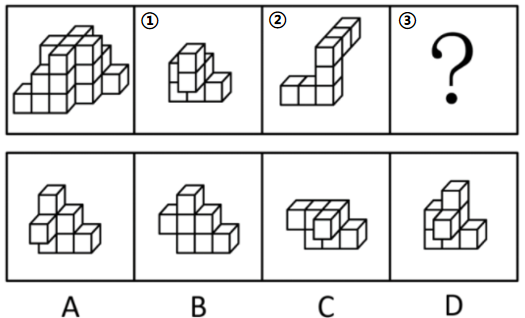
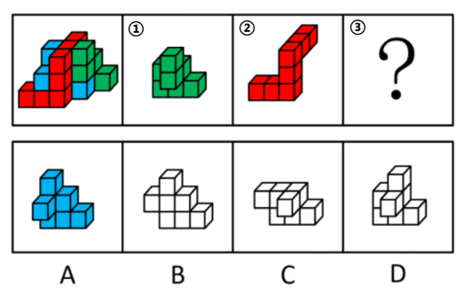
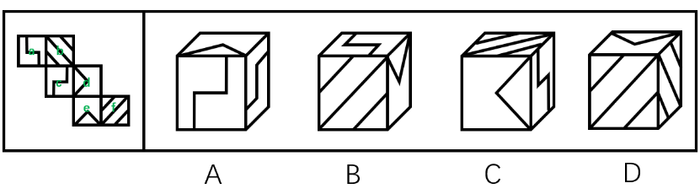
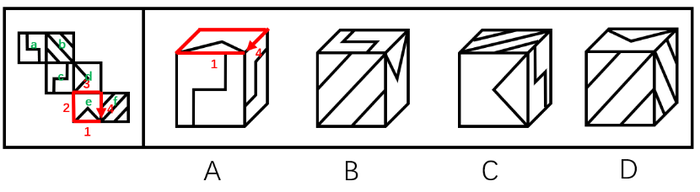
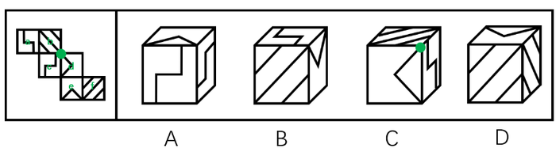
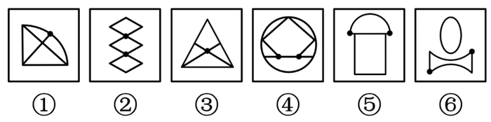
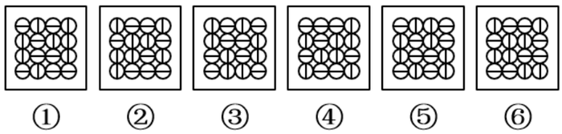

# 2020年度浙江省党政机关选调应届优秀大学毕业生《行测》题（网友回忆版）

> 判断推理 · 15 题 · 浙江 2020

## 第 1 题　qid 2456392 · 逻辑判断

调查发现，认同自己有网瘾的同学，上网时间明显高于否认有网瘾的同学，他们平均每周上网时间为13.3小时，比后者多5.4小时。研究者据此认为，一旦认为自己有网瘾，上网时间就会变长。
以下哪项如果为真，最能削弱上述观点？

- **A**. 家长对有网瘾的同学很难管得住
- **B**. 认为自己有网瘾的同学学习时间明显变少
- **C**. 不认为自己有网瘾的同学对上网更有自制力
- **D**. 一周上网10小时以上的同学才会认为自己有网瘾　✅

**答案**：D

**官方解析**

第一步：找出论点和论据。
论点：一旦认为自己有网瘾，上网时间就会变长。
论据：认同自己有网瘾的同学，上网时间明显高于否认有网瘾的同学，他们平均每周上网时间为13.3小时，比后者多5.4小时。
本题的论点是因果类的论点，可以优先考虑因果倒置的削弱方法。
第二步：逐一分析选项。
A项：选项在说网瘾同学“不好管理”，而论点讨论的是认为自己有网瘾和“上网时长”之间的关系，二者讨论话题不一致，不能削弱，排除；
B项：讨论的是认为有网瘾和学习时间的关系，与论点无关，无法削弱，排除；
C项：不认为有网瘾的同学更有自制力，从反面说明认为有网瘾的自制力要差一些，上网时间会长，可以加强，无法削弱，排除；
D项：论点是认为有网瘾导致上网时间长，该项是上网时间长才认为自己有网瘾，颠倒了论点中的因果，属于因果倒置的削弱，当选。
故正确答案为D。

---

## 第 2 题　qid 2456410 · 逻辑判断

2016年国家开始推广全民阅读，调查发现，2017年我国成年国民人均纸质图书阅读量为4.66本，较2016年的4.65本略有增长。据此有人认为，全民阅读没什么效果。
以下哪项如果为真，最能削弱上述观点？

- **A**. 
全民阅读推广以来，读书节活动吸引了很多人参加

- **B**. 
2017年，我国成年国民的电子书阅读率比2016年提高了5.8个百分点
　✅
- **C**. 
2017年，人均阅读量最高的日本人均纸质图书阅读量跟2016年基本持平

- **D**. 
2017年，我国成年国民人均每天手机接触时长比2016年增加了6.03分钟

**答案**：B

**官方解析**

第一步：找到论点和论据。
论点：全民阅读没什么效果。
论据：2016年国家开始推广全民阅读，2017年我国成年国民人均纸质图书阅读量为4.66本，较2016年的4.65本略有增长。
论据说的是人均纸质图书阅读量增长慢，论点说的是全民阅读没有效果，纸质图书阅读量只是衡量是否有效果的一个因素，论点论据话题不一致，要想削弱，优先考虑拆桥。
第二步：逐一分析选项。
A项：读书节吸引了很多人，但是他们是否阅读更多的书不确定，不能削弱，排除；
B项：2017年成年国民的电子书阅读率比2016年提高了5.8个百分点，也就说是不能仅仅由纸质书阅读增长慢推出全民阅读没有效果，切断了论点和论据之间的联系，可以削弱，当选；
C项：日本人均阅读量与我国情况无关，不能削弱，排除；
D项：手机接触时间增加与读书无关，不能削弱，排除。
故正确答案为B。

---

## 第 3 题　qid 2456414 · 逻辑判断

《中国农村教育发展报告2017》显示，2016年全国乡村教学点有8.68万个，远不及1995年时19.36万个教学点的一半。
以下各项如果为真，不能解释上述情况的是：

- **A**. 城镇化发展导致农村人口流失很多
- **B**. 农村学校教师待遇差，师资力量弱　✅
- **C**. 许多农村学校难以为继，最终被撤并
- **D**. 很多乡村教学点都搬到城市里了

**答案**：B

**官方解析**

第一步：找出题干矛盾。
2016年全国乡村教学点有8.68万个，远不及1995年时19.36万个教学点的一半。
第二步：逐一分析选项。
A项：城镇化发展导致农村人口流失很多，由于农村人口流失，所以教学点相应减少，可以解释题干矛盾，排除；
B项：农村学校教师待遇差，师资力量弱，无法解释2016年乡村教学点远不及1995年教学点的一半，无法解释题干矛盾，当选；
C项：许多农村学校难以为继，最终被撤并，可以解释2016年教学点大量减少，可以解释题干矛盾，排除；
D项：很多乡村教学点都搬到城市里了，可以解释2016年教学点大量减少，可以解释题干矛盾，排除。
本题为选非题，故正确答案为B。

---

## 第 4 题　qid 2456419 · 逻辑判断

有三户人家，每家都有一个孩子，他们是：小花（女）、小芳（女）、小明（男）。孩子的爸爸是刘生、马峰、王强；妈妈是朱凤、陈静、郑婷。对于这三家人，已知：
（1）王强和郑婷不是一家人；
（2）马峰的女儿不是小芳；
（3）刘生家和陈静家的孩子都参加了女子舞蹈培训班。
根据以上条件，可以推出：

- **A**. 刘生、朱凤和小花是一家
- **B**. 王强、陈静和小芳是一家
- **C**. 刘生、郑婷和小芳是一家　✅
- **D**. 王强、郑婷和小明是一家

**答案**：C

**官方解析**

第一步：分析题干。
（1）王强和郑婷不是一家人。
（2）马峰的女儿不是小芳。
（3）刘生家和陈静家的孩子都参加了女子舞蹈培训班。
第二步：根据题干条件分析选项。
由（1）可以排除D项。由（2）可知马峰的孩子为女儿，不是小芳即是小花，因此马峰和小花是一家人，排除A项。由（3）可知刘生家的孩子不是小明，又由（2）可知刘生家的孩子不是小花，因此刘生家的孩子是小芳，排除B项，本题选C。
故正确答案为C。

---

## 第 5 题　qid 2456422 · 逻辑判断

某教育学家指出我们应该用立法的方式来限定儿童的最大学业负担，以此来保证儿童的自由活动时间。所以，该项法律能够推动儿童创新思维的培养。
下列可以作为上述论证前提的是：

- **A**. 立法的目的是为了减轻儿童的负担
- **B**. 创新思维对儿童的全面发展至关重要
- **C**. 自由活动时间太少是创新思维发展的重要阻碍　✅
- **D**. 很多儿童因为学业负担太重而没有充足活动时间

**答案**：C

**官方解析**

第一步：找出论点和论据。
论点：该项法律能够推动儿童创新思维的培养。
论据：我们应该用立法的方式来限定儿童的最大学业负担，以此来保证儿童的自由活动时间。
论点讨论的是儿童创新思维，论据讨论的是学业负担和自由活动时间，论点论据话题不一致，且提问中包含了“前提”，因此本题优先考虑搭桥的方式加强。
第二步：逐一分析选项。
A项：立法的目的与论点讨论的立法的结果话题不一致，无法加强，排除；
B项：创新思维对儿童的全面发展至关重要，与立法是否能够推动儿童的创新思维无关，无法加强，排除； 
C项：自由活动时间太少是创新思维发展的重要阻碍，在论点的创新思维和论据的自由活动时间之间搭桥，当选； 
D项：很多儿童因为学业负担太重而没有充足活动时间，与立法是否能够推动儿童的创新思维无关，无法加强，排除。
故正确答案为C。

---

## 第 6 题　qid 2456428 · 逻辑判断

一项研究表明，明火、煤炉和烧烤炉的烟雾中含有大量的致癌物质、一氧化碳等有害物质。在明火或炭上经常烧烤或烹饪食物会使患肺炎、哮喘和其他肺部疾病的可能性增加。据此有人认为，它们给人们带来的危害不亚于香烟。

以下哪项如果为真，最能削弱上述观点？

- **A**. 
调查发现，致癌人员中经常接触明火、木炭的人数远小于吸烟人数
　✅
- **B**. 
与火灾经常接触的消防队员，其血液中的致癌物浓度远高于普通人

- **C**. 
近年来，香烟生产商在生产环节已经逐步降低了香烟对人的危害性

- **D**. 
据统计，目前我国近的家庭仍在使用木材和煤炭来做饭和取暖

**答案**：A

**官方解析**

第一步：找出论点和论据。

论点：明火、煤炉和烧烤炉的烟雾给人们带来的危害不亚于香烟。

论据：明火、煤炉和烧烤炉的烟雾中含有大量的致癌物质、一氧化碳等有害物质。在明火或炭上经常烧烤或烹饪食物会使患肺炎、哮喘和其他肺部疾病的可能性增加。

论点论据都在讨论明火、煤炉和烧烤炉会给人带来危害，论点论据话题一致，因此削弱优先考虑否定论点。

第二步：逐一分析选项。

A项：致癌人员中经常接触明火、木炭的人数远小于吸烟人数，说明明火、煤炉和烧烤炉对人们的危害没有吸烟大，直接削弱论点，当选；

B项：与火灾经常接触的消防队员，其血液中的致癌物浓度远高于普通人，说明明火对人体有一定危害，有加强作用，无法削弱，排除； 

C项：香烟生产商在生产环节已经逐步降低了香烟对人的危害性，与明火、煤炉和烧烤炉的危害无关，无法削弱，排除； 

D项：目前我国近的家庭仍在使用木材和煤炭来做饭和取暖，但木材和煤炭对人体的危害如何不知道，无法削弱，排除。

故正确答案为A。

---

## 第 7 题　qid 2456436 · 逻辑判断

一项研究表明，喝咖啡能明显降低心血管病人的死亡风险，这说明日常喝咖啡对我们的身体健康具有一定的积极意义。
以下哪项如果为真，最能支持上述观点？

- **A**. 咖啡具有提神醒脑、增加记忆力的功效
- **B**. 不论是男性还是女性，喝咖啡与全因死亡率降低有显著关系　✅
- **C**. 给小鼠喂食一定量的咖啡因之后，衰老小鼠的心肌功能回到了年轻状态
- **D**. 咖啡因能够促进一种名为p27的蛋白质进入线粒体，从而增强心脏细胞的功能

**答案**：B

**官方解析**

第一步：找出论点和论据。
论点：日常喝咖啡对我们身体健康具有一定的积极意义。
论据：喝咖啡能明显降低心血管病人的死亡风险。
题干论点和论据都体现了喝咖啡与身体健康的关系，话题一致，考虑补充论据进行加强。
第二步：逐一分析选项。
A项：该项讨论的是咖啡增强记忆力，与身体健康的关系未知，不能加强，排除；
B项：喝咖啡与降低全因死亡率有显著关系，说明咖啡确实对于身体健康有积极意义，属于补充论据，保留；
C项：该项说明咖啡对小鼠有益，但是题干强调的主体是人，不能加强，排除；
D项：该项说明了咖啡里的咖啡因确实对身体有好处，可以加强，保留。
对比B、D两项，可以发现B项的全因死亡包括了死亡的各种原因，其中也必然有涉及健康的种种因素，很全面；而D项仅仅是对论据进行的补充，涉及的依旧是心脏方面的健康，不如B项全面。
故正确答案为B。

---

## 第 8 题　qid 2456367 · 逻辑判断

现在不仅年轻人热衷于使用网络语言，不少网络流行语也从网络蔓延到传统媒体，成为大众熟悉的语言。有专家指出，网络语言的盛行使得语言表达更加丰富，人们之间的沟通变得新奇、简单、幽默，彰显个性，符合现代社会的多元化特点。
以下哪项如果为真，最能反驳专家的观点？

- **A**. 网络流行语粗鄙化比例较高，会给青少年语言习得带来不利影响
- **B**. 因为言语交际具有场合性，不是所有的语境都适合使用网络语言
- **C**. 网络流行语使人们的表达方式趋于同化，独立组织语言的能力下降　✅
- **D**. 网络语言大多不符合汉语语法规范，不利于青少年语言学习与发展

**答案**：C

**官方解析**

第一步：找出论点和论据。
论点：网络语言的盛行使得语言表达更加丰富，人们之间的沟通变得新奇、简单、幽默，彰显个性，符合了现代社会的多元化的特点。
论据：无。
本题只有论点没有论据，论点讨论网络语言的语言表达更加丰富，符合了现代社会的多元化的特点，削弱优先考虑削弱论点。
第二步：逐一分析选项。
A项：说的是网络流行语会给青少年的语言学习带来不利影响，并没有说网络流行语对语言表达的影响，论点说的是网络语言的语言表达更加丰富，符合了现代社会的多元化的特点，话题不一致，无法削弱，排除；
B项：说的是有的语境不适合用网络语言，说明网络语言有一定的局限性，但论点说的是网络语言的语言表达更加丰富，符合了现代社会的多元化的特点，话题不一致，无法削弱，排除；
C项：说的是网络流行语使得人们的表达趋于同化，也就是使得人们的表达单一，没有个性，直接否定了论点，可以削弱，当选；
D项：说的是网络语言不利于青少年的语言学习和发展，并没有说网络流行语对语言表达的影响，论点说的是网络语言的语言表达更加丰富，符合了现代社会的多元化的特点，话题不一致，无法削弱，排除。
故正确答案为C。

---

## 第 9 题　qid 2456375 · 逻辑判断

王力、刘青、陈华、马玲四人代表单位参加比赛。赛后，王力说刘青会获奖，刘青说陈华会获奖，陈华、马玲都说自己不会获奖。如果四人的陈述只有一人错，那么谁一定获奖？

- **A**. 仅王力
- **B**. 仅刘青　✅
- **C**. 仅陈华
- **D**. 仅刘青和陈华

**答案**：B

**官方解析**

第一步：找出题干矛盾命题。
刘青说“陈华会获奖”和陈华说“自己不会获奖”是矛盾关系，必有一真必有一假。已知只有一人错，说明王力和马玲一定说真话。
第二步：看其余。
根据王力和马玲说真话可知：刘青会获奖、马玲不会获奖，而王力和陈华是否获奖，无法确定。
故正确答案为B。

---

## 第 10 题　qid 2456383 · 逻辑判断

假设“如果甲爱看越剧或乙不爱看越剧，那么丙爱看越剧”为真，由下列哪项可推出“乙爱看越剧”的结论？

- **A**. 丙不爱看越剧　✅
- **B**. 甲不爱看越剧
- **C**. 甲和丙都爱看越剧
- **D**. 甲和丙有一个不爱看越剧

**答案**：A

**官方解析**

第一步：翻译题干。

题干条件：甲或乙→丙；

题干结论：乙。

第二步：逐一分析选项。

A项：丙不爱看越剧，是对题干条件的否后，否后必否前，可以推出：（甲或乙），根据德摩根定律，可得：甲且乙，因此可以得出乙爱看越剧的结论，当选；

B项：甲不爱看越剧，无法确定“甲或乙爱看越剧”的真假，因此无法推出结论，排除；

C项：根据“或”关系一真即真，由甲爱看越剧可知，“甲或乙爱看越剧”也为真，是对题干条件的肯前，肯前必肯后，可以推出：丙爱看越剧，但无法确定乙是否爱看越剧，因此无法推出结论，排除；

D项：甲和丙有一个不爱看越剧，不明确是甲还是丙不爱看越剧，因此无法推出结论，排除。

故正确答案为A。

---

## 第 11 题　qid 2456395 · 图形推理

左图给定的是由相同正方体堆叠而成的多面体，其正视图和后视图完全相同。该多面体可以由①、②和③三个多面体组合而成，以下哪一项能填入问号处？

- **A**. A　✅
- **B**. B
- **C**. C
- **D**. D

**答案**：A

**官方解析**

本题考查立体拼合。

如下图所示，选项小方块数量相同，故优先在题干找最大块/特殊块拼合，题干图②（红块）比较特殊，在立体图形中只能拼在下图位置，图①（绿块）与右侧方块形状更为类似，故放在右侧，最后剩下的蓝块对应A项。

故正确答案为A。

---

## 第 12 题　qid 2456399 · 图形推理

左边给定的是纸盒的外表面，右边哪一项能由它折叠而成？

- **A**. A
- **B**. B　✅
- **C**. C
- **D**. D

**答案**：B

**官方解析**

将原展开图标上序号如下图，逐一进行分析。

A项：立体图包含面a和面c，而面a与面d为相对面，故上面三角形的面只能是面e，利用面e以三角形底边为唯一边起点出发顺时针画边标号如下图，题干边4挨着面f，选项A并不是，选项与题干不一致，排除；

B项：选项与题干一致，当选；

C项：若三角形面为面d，则面d的相对面面a不能出现，故右侧面为面c，而又因为面c与面f是相对面，故顶面只能是面b；同理若三角形面为面e，则顶面为面f，右面为面a。故C项可能是两种情况，（1）面b、面c、面d组成，此时三者公共点（如下图绿点）展开图发出两条斜线，而选项发出一条斜线，选项与题干不一致；

（2）面a、面e、面f组成，此时三者公共点（如下图红点，题干中相同颜色的边为一条边，折合后红点为三者公共点）在题干展开图发射两条斜线，而选项发出一条斜线，选项与题干不一致；

两种情况均与题干不一致，排除；

D项：立体图包含面b和面f，而面b与面e为相对面，故上面三角形的面只能是面d，三者公共点如下图蓝点，题干蓝点只发出面f上一条斜线，而选项发射出两条斜线，选项与题干不一致，排除。

故正确答案为B。

---

## 第 13 题　qid 2456409 · 图形推理

把下面的六个图形分为两类，使每一类图形都有各自的共同特征或规律，分类正确的一项是：

- **A**. ①②③，④⑤⑥
- **B**. ①③⑥，②④⑤
- **C**. ①⑤⑥，②③④　✅
- **D**. ①④⑥，②③⑤

**答案**：C

**官方解析**

本题为分组分类题目。题干图形中均出现小黑点，优先考虑功能元素。观察发现，题干图形中的小黑点均标记在交点上，图①⑤⑥标记的是直线与曲线的交点，图②③④标记的是直线与直线的交点，即图①⑤⑥一组，图②③④一组。
故正确答案为C。

---

## 第 14 题　qid 2456413 · 图形推理

把下面的六个图形分为两类，使每一类图形都有各自的共同特征或规律，分类正确的一项是：

- **A**. ①②④，③⑤⑥　✅
- **B**. ①③⑤，②④⑥
- **C**. ①②⑥，③④⑤
- **D**. ①④⑥，②③⑤

**答案**：A

**官方解析**

元素组成相同，优先考虑位置规律。题干每幅图都分为内外层，考虑内外分开看。观察发现，图①②④为一组，三者的内部图案和外部图案分别一致，且图②可以看作图①顺时针旋转90度得到，图④可以看作图①逆时针旋转90度得到；图③⑤⑥为一组，三者内部图案和外部图案分别一致，且图⑤可以看作图③旋转180度得到，图⑥可以看作图③逆时针旋转90度得到。只有A项符合，当选。
故正确答案为A。

---

## 第 15 题　qid 2456418 · 图形推理

从所给的四个选项中，选择最合适的一个填入问号处，使之呈现一定的规律性：

- **A**. A
- **B**. B
- **C**. C
- **D**. D　✅

**答案**：D

**官方解析**

元素组成不同，无明显属性规律，优先考虑数量规律。图形均有封闭面，九宫格第一行图及第二行图封闭面数量均分别为2、3、4；第三行前两幅图封闭面数量分别为2、3，故处封闭面数量应为4，排除A、C两项。再次观察题干，图形均为全直线图形，考虑数直线。九宫格第一行图直线数均为7；第二行图直线数均为8；第三行前两幅图直线数均为9，故处图形直线数也应为9，B项直线数为8，排除；D项直线数为9，符合规律，当选。

故正确答案为D。

---
